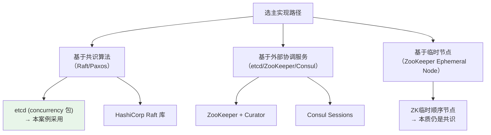
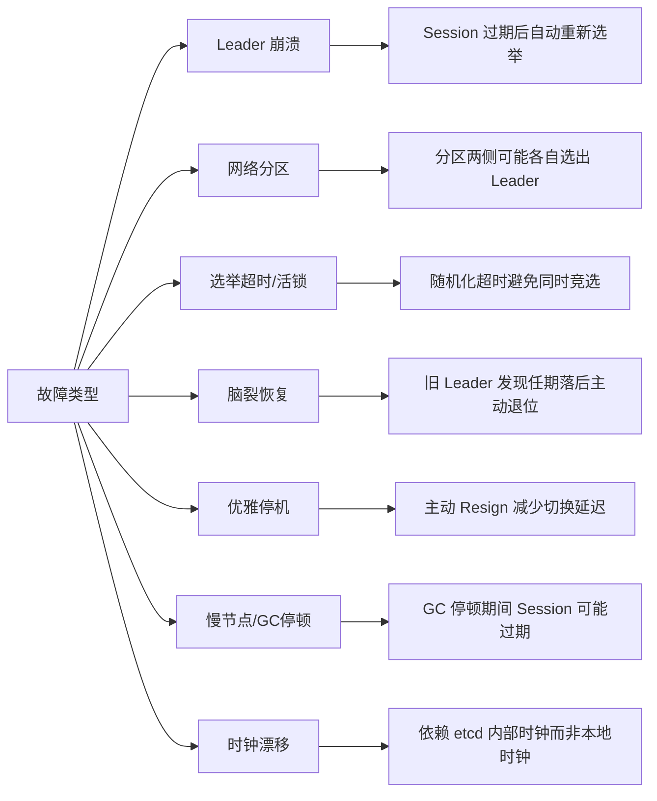
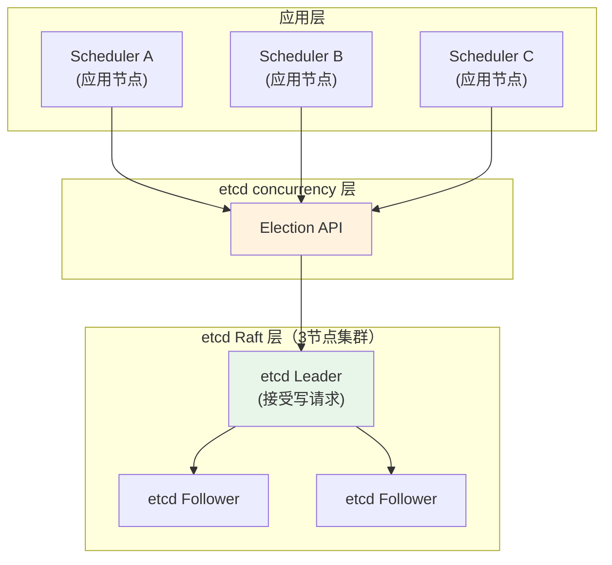
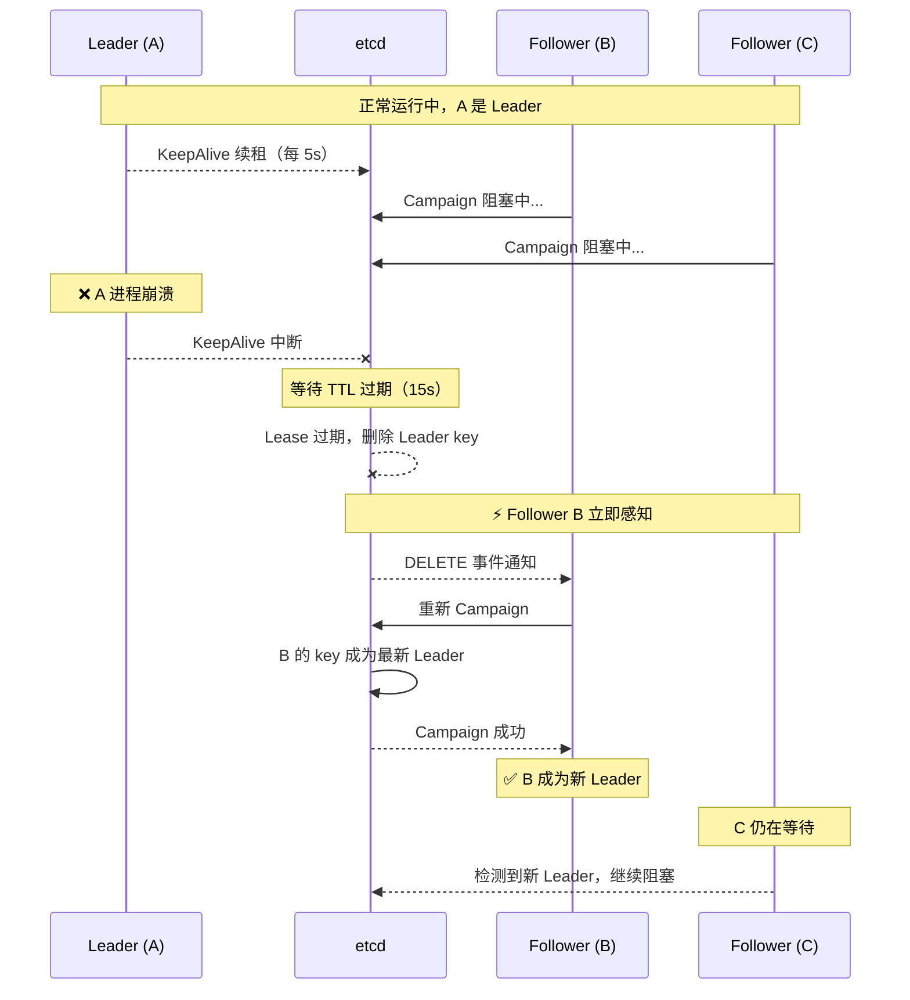
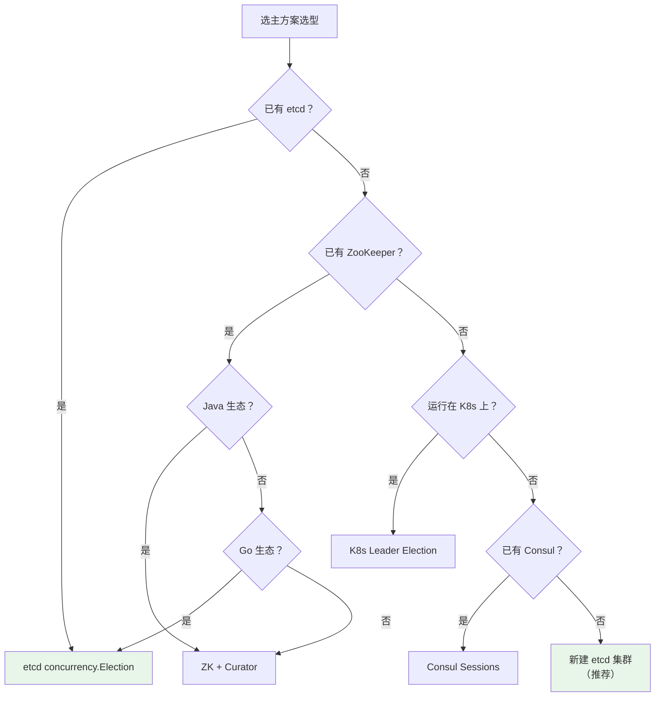
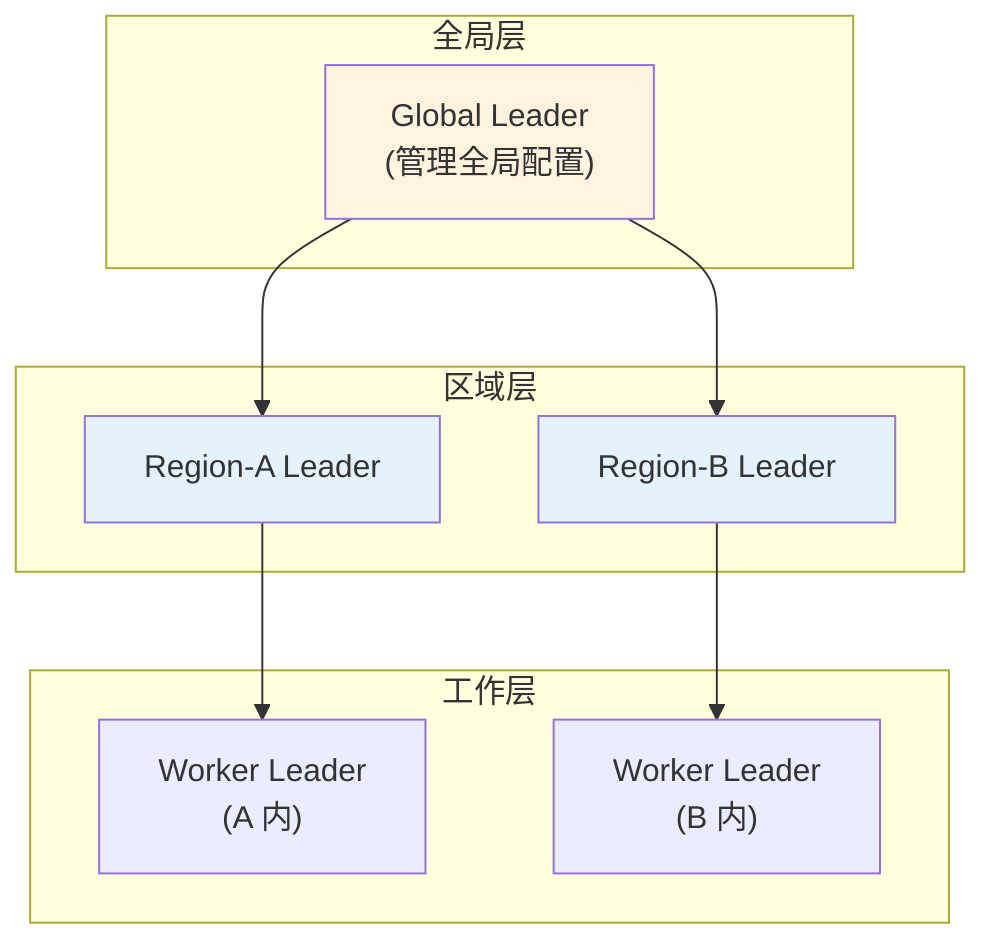

## 案例三：实现分布式选主（Leader Election）

### 1. 问题背景与需求分析

#### 1.1 为什么需要选主

在分布式系统中，许多场景要求同一时刻只有一个节点执行特定任务。这种"单一执行者"的需求广泛存在于以下场景：

| 场景 | 典型需求 | 如果没有选主会怎样 |
|------|----------|---------------------|
| 定时任务调度 | 每 10 秒执行一次报表生成 | 多个实例重复生成，浪费资源甚至数据冲突 |
| 分布式锁服务 | 全局唯一锁管理器 | 多个锁管理器状态不一致 |
| 消费者组协调 | 每个分区只被一个消费者消费 | 消息重复消费或分区遗漏 |
| 故障检测与恢复 | 由一个节点统一负责健康检查 | 检测结果冲突，恢复指令矛盾 |
| 元数据管理 | 单一写入点保证一致性 | 多写入导致元数据分裂脑 |
| 数据库主从切换 | 只有主库接受写请求 | 多库同时写入导致数据不一致 |
| 分布式任务编排 | 由协调器分发子任务 | 多个协调器重复分发，任务执行多次 |

选主的核心目标是：在一组对等节点中，通过协商选出一个 Leader，由 Leader 负责协调工作；当 Leader 故障时，其他节点自动检测并发起新一轮选举，选出新 Leader 接管。

#### 1.2 选主与共识的关系

选主本质上是分布式共识的一个特例——所有节点需要就"谁是 Leader"这一事实达成一致。因此，可靠的选主实现通常建立在成熟的共识算法之上，而非自行发明协议。

**为什么不能"自创"选主协议？** 分布式系统中存在 FLP 不可能定理——在异步网络中，即使只有一个节点可能崩溃，也不存在一个确定性算法能在有限时间内达成共识。所有可用的选主方案都必须在某个维度做妥协（引入超时、依赖时钟、使用随机化），成熟的共识库已经在这些妥协点上经过了大量验证。

常见的选主实现方式有三种路径：



本案例采用 etcd 的 `concurrency` 包，原因如下：

- **etcd 内置 Raft 共识**：选主的一致性由 Raft 算法保证，无需重复造轮子
- **API 简洁**：`concurrency.Election` 封装了 Campaign/Proclaim/Resign 全生命周期
- **租约机制**：通过 Session + TTL 自动感知节点故障，无需手动心跳检测
- **生产验证**：Kubernetes 的 kube-scheduler、controller-manager 均采用类似机制
- **Go 原生**：与 Go 生态深度集成，无需额外依赖

#### 1.3 故障场景分析

选主机制必须正确处理以下故障场景：



1. **Leader 崩溃**：Session 过期后，Follower 检测到 Leader 消失，发起新选举
2. **网络分区**：分区一侧的 Leader 继续工作，另一侧选出新 Leader（可能产生短暂双 Leader）
3. **选举超时**：所有候选人在同一时刻发起选举，需要随机化超时避免活锁
4. **脑裂恢复**：网络恢复后，旧 Leader 发现任期落后，主动退位
5. **优雅停机**：Leader 主动 Resign，避免等待 Session 超时的延迟窗口
6. **GC 停顿**：Go 的 STW（Stop-The-World）GC 可能导致 KeepAlive 续租失败，误判为故障
7. **时钟漂移**：分布式环境中各节点时钟不一致，但 etcd 的 Lease 由服务端控制，天然免疫此问题

---

### 2. 核心原理：etcd 选主机制

#### 2.1 Raft 共识在选主中的角色

etcd 底层使用 Raft 共识算法维护自身的高可用，同时也为上层的 `concurrency.Election` 提供一致性保证。理解两者的关系至关重要：



**两层选主，角色不同：**

| 层级 | 谁在选主 | 目的 | 算法 |
|------|----------|------|------|
| etcd 集群层 | etcd 节点之间 | 保证 etcd 自身的高可用 | Raft 共识 |
| 应用层 | 业务节点之间 | 选出业务 Leader 执行协调工作 | 通过 etcd Election API 间接使用 Raft |

应用层的选主并不直接运行 Raft 协议，而是将"谁是 Leader"作为一个值写入 etcd，由 etcd 的 Raft 层保证这个值在集群中达成一致。这大大降低了实现复杂度。

#### 2.2 etcd Election 的内部实现

etcd 的 `concurrency.Election` 并非简单的"写一个 key"，其内部流程如下：

```mermaid
sequenceDiagram
    participant C as Candidate
    participant E as etcd Election
    participant R as Raft 共识层
    participant F as Followers (其他候选)

    C->>E: Campaign(ctx, campaignValue)
    E->>E: 创建临时 key /scheduler/leader/<leaseID>
    E->>R: 提交提案 (leader key = candidate)
    R->>R: Raft 日志复制 &amp; 多数确认
    R-->>E: 提案提交成功
    
    alt 成为 Leader
        E-->>C: Campaign 返回 nil (当选)
        Note over C: 开始执行 Leader 职责
    else 成为 Follower
        E->>E: watch leader key 变更
        E-->>C: Campaign 阻塞等待
        Note over C: 当 Leader Session 过期时<br/>key 被删除，重新 Campaign
    end
```

关键设计点：

- **Leader key 与 Session 绑定**：Leader 的 key 关联了一个 Lease（租约），节点宕机后 Lease 过期，key 自动删除，触发重新选举
- **Campaign 是阻塞调用**：非 Leader 节点调用 `Campaign()` 会阻塞，直到自己成为 Leader
- **Observer 模式**：`Observe()` 返回一个 channel，可以实时监听所有选举事件
- **全局排序**：etcd 的 key 按字典序排列，Lease ID 天然有序，保证先到先选的公平性

#### 2.3 Session 与 Lease 的角色

Session 是 etcd 选主机制的基石。每个 Session 绑定一个 Lease：

Session ──绑定──> Lease（TTL=15s）
  │
  ├── 关联 Election（选主）
  ├── 关联 Mutex（分布式锁）
  └── 关联其他并发原语

- **TTL（Time To Live）**：Lease 的存活时间。节点必须在 TTL 内续租，否则 Lease 过期
- **KeepAlive**：etcd 客户端自动在后台发送 KeepAlive 请求续租。实际上客户端会在 TTL/3 的时间间隔发送续租请求，留有充足的重试余量
- **TTL 选择策略**：
  - 太短（如 3s）：网络抖动导致频繁误判，选举风暴
  - 太长（如 60s）：Leader 故障后恢复延迟过长
  - 推荐值：10-15 秒（兼顾灵敏度与抗抖动）

**TTL 决策矩阵：**

| 网络环境 | 推荐 TTL | 理由 |
|----------|----------|------|
| 同机房/低延迟（<1ms） | 5-10s | 网络抖动极少，可以更快切换 |
| 跨机房/中等延迟（1-10ms） | 10-15s | 平衡灵敏度和稳定性 |
| 跨地域/高延迟（>50ms） | 15-30s | 避免高延迟导致误判 |
| 云环境/不稳定网络 | 20-30s | 应对云平台偶发的网络抖动 |

#### 2.4 选举事件类型

`Observe()` 返回的事件包含以下类型：

| 事件类型 | 含义 | 典型触发场景 |
|----------|------|--------------|
| PUT 事件 | 有节点尝试竞选 | 新节点加入并 Campaign |
| DELETE 事件 | Leader 失效或主动退位 | Session 过期、Resign 调用 |

通过监听 DELETE 事件，Follower 节点可以感知 Leader 消失并立即发起新一轮 Campaign。

#### 2.5 选主时序：从故障到恢复的完整流程

理解 Leader 故障恢复的完整时序，有助于定位生产问题：



整个恢复时间 = KeepAlive 中断时间 + TTL + Campaign 耗时。在典型配置下（TTL=15s），恢复时间约为 15-20 秒。

---

### 3. 完整实现：分布式定时任务调度器

#### 3.1 项目结构

leader-election-demo/
├── main.go              # 入口，信号处理，启动调度器
├── scheduler.go         # Scheduler 核心逻辑（选主 + 任务调度）
├── election.go          # 选举封装（Session、Lease 管理）
├── task.go              # 调度任务定义与注册
├── monitor.go           # 监控与指标暴露（Prometheus）
├── config.go            # 配置管理
├── scheduler_test.go    # 单元测试
├── integration_test.go  # 集成测试
├── go.mod
├── go.sum
└── Dockerfile           # 容器化部署

#### 3.2 配置管理

```go
// config.go
package main

import (
    "os"
    "strconv"
    "time"
)

// Config 存储调度器的配置参数
type Config struct {
    // 实例唯一标识
    InstanceID string
    // etcd 集群端点列表
    Endpoints []string
    // etcd 认证信息
    Username string
    Password string
    // Session 租约 TTL（秒）
    SessionTTL int
    // 选举 key 前缀
    ElectionPrefix string
    // 调度任务间隔
    TaskInterval time.Duration
    // 任务执行超时
    TaskTimeout time.Duration
    // 健康检查端口
    HealthPort int
}

// LoadConfig 从环境变量加载配置，带合理默认值
func LoadConfig() *Config {
    cfg := &amp;Config{
        InstanceID:      getEnv("INSTANCE_ID", ""),
        Endpoints:       []string{"localhost:2379"},
        Username:        os.Getenv("ETCD_USERNAME"),
        Password:        os.Getenv("ETCD_PASSWORD"),
        SessionTTL:      getEnvInt("SESSION_TTL", 15),
        ElectionPrefix:  getEnv("ELECTION_PREFIX", "/scheduler/leader"),
        TaskInterval:    getEnvDuration("TASK_INTERVAL", 10*time.Second),
        TaskTimeout:     getEnvDuration("TASK_TIMEOUT", 30*time.Second),
        HealthPort:      getEnvInt("HEALTH_PORT", 8080),
    }

    // InstanceID 默认使用 PID
    if cfg.InstanceID == "" {
        cfg.InstanceID = "scheduler-" + strconv.Itoa(os.Getpid())
    }

    // 解析 etcd 端点（逗号分隔）
    if ep := os.Getenv("ETCD_ENDPOINTS"); ep != "" {
        cfg.Endpoints = splitAndTrim(ep, ",")
    }

    return cfg
}

func getEnv(key, fallback string) string {
    if v := os.Getenv(key); v != "" {
        return v
    }
    return fallback
}

func getEnvInt(key string, fallback int) int {
    if v := os.Getenv(key); v != "" {
        if n, err := strconv.Atoi(v); err == nil {
            return n
        }
    }
    return fallback
}

func getEnvDuration(key string, fallback time.Duration) time.Duration {
    if v := os.Getenv(key); v != "" {
        if d, err := time.ParseDuration(v); err == nil {
            return d
        }
    }
    return fallback
}

func splitAndTrim(s, sep string) []string {
    parts := strings.Split(s, sep)
    result := make([]string, 0, len(parts))
    for _, p := range parts {
        if trimmed := strings.TrimSpace(p); trimmed != "" {
            result = append(result, trimmed)
        }
    }
    return result
}
```

#### 3.3 核心代码实现

```go
// main.go
package main

import (
    "context"
    "fmt"
    "log"
    "os"
    "os/signal"
    "syscall"
)

func main() {
    cfg := LoadConfig()
    log.Printf("启动调度器 [id=%s] [etcd=%v] [ttl=%ds]",
        cfg.InstanceID, cfg.Endpoints, cfg.SessionTTL)

    scheduler, err := NewScheduler(cfg)
    if err != nil {
        log.Fatalf("创建调度器失败: %v", err)
    }
    defer scheduler.Close()

    // 优雅关闭：捕获 SIGINT / SIGTERM
    ctx, cancel := context.WithCancel(context.Background())
    sigCh := make(chan os.Signal, 1)
    signal.Notify(sigCh, syscall.SIGINT, syscall.SIGTERM)
    go func() {
        sig := <-sigCh
        log.Printf("收到信号 %v，开始优雅关闭...", sig)
        cancel()
    }()

    // 启动健康检查端点
    go StartHealthServer(cfg.HealthPort, scheduler)

    if err := scheduler.Run(ctx); err != nil {
        log.Printf("调度器异常退出: %v", err)
    }

    log.Printf("调度器已停止 [id=%s]", cfg.InstanceID)
}
```

```go
// scheduler.go
package main

import (
    "context"
    "fmt"
    "log"
    "sync"
    "time"

    clientv3 "go.etcd.io/etcd/client/v3"
    "go.etcd.io/etcd/client/v3/concurrency"
)

// Scheduler 调度器核心结构
type Scheduler struct {
    cfg      *Config
    client   *clientv3.Client
    session  *concurrency.Session
    election *concurrency.Election

    mu       sync.RWMutex
    isLeader bool
    stopCh   chan struct{}

    // 指标统计
    metrics *Metrics
}

// NewScheduler 创建调度器实例
func NewScheduler(cfg *Config) (*Scheduler, error) {
    // 1. 连接 etcd 集群
    client, err := clientv3.New(clientv3.Config{
        Endpoints:   cfg.Endpoints,
        DialTimeout: 5 * time.Second,
        Username:    cfg.Username,
        Password:    cfg.Password,
    })
    if err != nil {
        return nil, fmt.Errorf("连接 etcd 失败: %w", err)
    }

    // 2. 创建 Session（绑定 Lease，自动续租）
    session, err := concurrency.NewSession(client, concurrency.WithTTL(cfg.SessionTTL))
    if err != nil {
        client.Close()
        return nil, fmt.Errorf("创建 Session 失败: %w", err)
    }

    // 3. 创建 Election 实例
    election := concurrency.NewElection(session, cfg.ElectionPrefix)

    return &amp;Scheduler{
        cfg:      cfg,
        client:   client,
        session:  session,
        election: election,
        stopCh:   make(chan struct{}),
        metrics:  NewMetrics(),
    }, nil
}

// Run 启动选主流程
func (s *Scheduler) Run(ctx context.Context) error {
    log.Printf("[%s] 开始参与选主...", s.cfg.InstanceID)

    // Campaign 会阻塞直到本节点成为 Leader
    if err := s.election.Campaign(ctx, s.cfg.InstanceID); err != nil {
        return fmt.Errorf("竞选失败: %w", err)
    }

    s.mu.Lock()
    s.isLeader = true
    s.metrics.LeaderElections++
    s.metrics.LastElectionTime = time.Now()
    s.mu.Unlock()

    log.Printf("[%s] ✅ 成为 Leader", s.cfg.InstanceID)

    // 启动 Leader 职责
    go s.runLeaderDuties(ctx)
    // 监听选举事件（用于日志记录和指标采集）
    go s.watchElectionEvents(ctx)
    // 监听 Session 失效
    go s.watchSession(ctx)

    // 等待停止信号
    select {
    case <-ctx.Done():
        log.Printf("[%s] 收到停止信号", s.cfg.InstanceID)
    case <-s.stopCh:
        log.Printf("[%s] 内部停止", s.cfg.InstanceID)
    }

    // 优雅退出：主动 Resign 让出 Leader
    return s.resign()
}

// ========== Leader 职责 ==========

// runLeaderDuties 执行 Leader 负责的调度任务
func (s *Scheduler) runLeaderDuties(ctx context.Context) {
    ticker := time.NewTicker(s.cfg.TaskInterval)
    defer ticker.Stop()

    for {
        select {
        case <-ctx.Done():
            return
        case <-s.stopCh:
            return
        case <-ticker.C:
            if !s.isLeader() {
                log.Printf("[%s] 已不是 Leader，停止调度", s.cfg.InstanceID)
                return
            }
            s.executeScheduledTask(ctx)
        }
    }
}

// executeScheduledTask 执行具体的调度任务
func (s *Scheduler) executeScheduledTask(ctx context.Context) {
    // 为每次任务执行设置超时，防止单次任务阻塞整个调度循环
    taskCtx, cancel := context.WithTimeout(ctx, s.cfg.TaskTimeout)
    defer cancel()

    log.Printf("[%s] 📋 执行调度任务...", s.cfg.InstanceID)
    start := time.Now()

    // ---- 在此插入你的业务逻辑 ----
    // 例如：生成报表、清理过期数据、同步缓存等
    // 必须确保任务本身是幂等的，以防双 Leader 场景
    //
    // 示例（带超时保护）：
    // if err := generateReport(taskCtx); err != nil {
    //     if taskCtx.Err() == context.DeadlineExceeded {
    //         log.Printf("[%s] 任务超时，放弃本次执行", s.cfg.InstanceID)
    //     } else {
    //         log.Printf("[%s] 任务执行失败: %v", s.cfg.InstanceID, err)
    //     }
    //     return
    // }

    elapsed := time.Since(start)
    s.metrics.TaskExecutions++
    s.metrics.LastTaskTime = time.Now()
    s.metrics.TaskDuration.Observe(elapsed.Seconds())
    log.Printf("[%s] 📋 任务完成，耗时 %v", s.cfg.InstanceID, elapsed)
}

// ========== 选举监控 ==========

// watchElectionEvents 监听选举事件
func (s *Scheduler) watchElectionEvents(ctx context.Context) {
    ch := s.election.Observe(ctx)

    for {
        select {
        case <-ctx.Done():
            return
        case resp, ok := <-ch:
            if !ok {
                return
            }
            for _, event := range resp.Events {
                leader := string(event.Kv.Value)
                switch event.Type {
                case clientv3.EventTypePut:
                    log.Printf("[%s] 📢 选举事件: %s 尝试竞选", s.cfg.InstanceID, leader)
                case clientv3.EventTypeDelete:
                    log.Printf("[%s] ⚠️  Leader 失效，准备重新竞选", s.cfg.InstanceID)
                    s.metrics.LeaderFailovers++
                }
            }
        }
    }
}

// watchSession 监听 Session 是否过期
func (s *Scheduler) watchSession(ctx context.Context) {
    select {
    case <-ctx.Done():
        return
    case <-s.session.Done():
        log.Printf("[%s] ❌ Session 过期，连接断开", s.cfg.InstanceID)
        s.mu.Lock()
        s.isLeader = false
        s.mu.Unlock()
        s.metrics.SessionExpirations++
    }
}

// ========== 退出与恢复 ==========

// resign 主动让出 Leader 身份
func (s *Scheduler) resign() error {
    s.mu.Lock()
    wasLeader := s.isLeader
    s.isLeader = false
    s.mu.Unlock()

    if wasLeader {
        log.Printf("[%s] 🔄 主动让出 Leader", s.cfg.InstanceID)
        ctx, cancel := context.WithTimeout(context.Background(), 5*time.Second)
        defer cancel()
        return s.election.Resign(ctx)
    }
    return nil
}

// isLeader 线程安全地检查是否为 Leader
func (s *Scheduler) IsLeader() bool {
    s.mu.RLock()
    defer s.mu.RUnlock()
    return s.isLeader
}

// GetMetrics 返回当前指标快照
func (s *Scheduler) GetMetrics() *MetricsSnapshot {
    s.mu.RLock()
    defer s.mu.RUnlock()
    return &amp;MetricsSnapshot{
        IsLeader:           s.isLeader,
        LeaderElections:    s.metrics.LeaderElections,
        LeaderFailovers:    s.metrics.LeaderFailovers,
        SessionExpirations: s.metrics.SessionExpirations,
        TaskExecutions:     s.metrics.TaskExecutions,
        LastElectionTime:   s.metrics.LastElectionTime,
        LastTaskTime:       s.metrics.LastTaskTime,
    }
}

// Close 释放资源
func (s *Scheduler) Close() {
    close(s.stopCh)
    s.session.Close()
    s.client.Close()
    log.Printf("[%s] 资源已释放", s.cfg.InstanceID)
}
```

#### 3.4 健康检查端点

```go
// monitor.go
package main

import (
    "encoding/json"
    "fmt"
    "log"
    "net/http"
    "sync/atomic"
    "time"
)

// Metrics 内部指标计数器（生产环境应替换为 Prometheus）
type Metrics struct {
    LeaderElections    int64
    LeaderFailovers    int64
    SessionExpirations int64
    TaskExecutions     int64
    LastElectionTime   time.Time
    LastTaskTime       time.Time
    TaskDuration       *Histogram
}

// Histogram 简化的直方图（实际使用 prometheus.Histogram）
type Histogram struct {
    buckets []float64
    counts  []int64
    sum     float64
    count   int64
}

// MetricsSnapshot 指标快照（线程安全的只读视图）
type MetricsSnapshot struct {
    IsLeader           bool      `json:"is_leader"`
    LeaderElections    int64     `json:"leader_elections"`
    LeaderFailovers    int64     `json:"leader_failovers"`
    SessionExpirations int64     `json:"session_expirations"`
    TaskExecutions     int64     `json:"task_executions"`
    LastElectionTime   time.Time `json:"last_election_time"`
    LastTaskTime       time.Time `json:"last_task_time"`
}

func NewMetrics() *Metrics {
    return &amp;Metrics{
        TaskDuration: &amp;Histogram{
            buckets: []float64{0.01, 0.05, 0.1, 0.5, 1, 5, 10, 30},
            counts:  make([]int64, 9),
        },
    }
}

// StartHealthServer 启动 HTTP 健康检查端点
func StartHealthPort(port int, scheduler *Scheduler) {
    // ... 已在 main.go 中调用
}

// StartHealthServer 启动 HTTP 健康检查端点
func StartHealthServer(port int, scheduler *Scheduler) {
    mux := http.NewServeMux()

    // /health — Kubernetes 存活探针
    mux.HandleFunc("/health", func(w http.ResponseWriter, r *http.Request) {
        w.WriteHeader(http.StatusOK)
        fmt.Fprintf(w, `{"status":"ok"}`)
    })

    // /ready — Kubernetes 就绪探针（仅 Leader 就绪）
    mux.HandleFunc("/ready", func(w http.ResponseWriter, r *http.Request) {
        if scheduler.IsLeader() {
            w.WriteHeader(http.StatusOK)
            fmt.Fprintf(w, `{"ready":true}`)
        } else {
            w.WriteHeader(http.StatusServiceUnavailable)
            fmt.Fprintf(w, `{"ready":false}`)
        }
    })

    // /leader — 查询当前是否为 Leader
    mux.HandleFunc("/leader", func(w http.ResponseWriter, r *http.Request) {
        w.Header().Set("Content-Type", "application/json")
        json.NewEncoder(w).Encode(scheduler.GetMetrics())
    })

    // /metrics — Prometheus 格式指标（简化版）
    mux.HandleFunc("/metrics", func(w http.ResponseWriter, r *http.Request) {
        m := scheduler.GetMetrics()
        fmt.Fprintf(w, "# HELP scheduler_is_leader Whether this instance is the leader\n")
        fmt.Fprintf(w, "# TYPE scheduler_is_leader gauge\n")
        if m.IsLeader {
            fmt.Fprintf(w, "scheduler_is_leader 1\n")
        } else {
            fmt.Fprintf(w, "scheduler_is_leader 0\n")
        }
        fmt.Fprintf(w, "# HELP scheduler_leader_elections_total Total leader elections\n")
        fmt.Fprintf(w, "# TYPE scheduler_leader_elections_total counter\n")
        fmt.Fprintf(w, "scheduler_leader_elections_total %d\n", m.LeaderElections)
        fmt.Fprintf(w, "# HELP scheduler_leader_failovers_total Total leader failovers\n")
        fmt.Fprintf(w, "# TYPE scheduler_leader_failovers_total counter\n")
        fmt.Fprintf(w, "scheduler_leader_failovers_total %d\n", m.LeaderFailovers)
        fmt.Fprintf(w, "# HELP scheduler_task_executions_total Total task executions\n")
        fmt.Fprintf(w, "# TYPE scheduler_task_executions_total counter\n")
        fmt.Fprintf(w, "scheduler_task_executions_total %d\n", m.TaskExecutions)
    })

    addr := fmt.Sprintf(":%d", port)
    log.Printf("健康检查端点已启动: http%s", addr)
    if err := http.ListenAndServe(addr, mux); err != nil {
        log.Printf("健康检查端口启动失败: %v", err)
    }
}
```

#### 3.5 完整 go.mod

```go
// go.mod
module leader-election-demo

go 1.21

require (
    go.etcd.io/etcd/client/v3 v3.5.12
)

require (
    github.com/coreos/go-semver v0.3.1 // indirect
    github.com/coreos/go-systemd/v22 v22.5.0 // indirect
    github.com/gogo/protobuf v1.3.2 // indirect
    golang.org/x/net v0.17.0 // indirect
    golang.org/x/sys v0.13.0 // indirect
    golang.org/x/text v0.13.0 // indirect
    google.golang.org/genproto/googleapis/rpc v0.0.0-20231002182017-d307bd883b97 // indirect
    google.golang.org/grpc v1.59.0 // indirect
)
```

#### 3.6 Dockerfile

```dockerfile
# Dockerfile
FROM golang:1.21-alpine AS builder

WORKDIR /app
COPY go.mod go.sum ./
RUN go mod download
COPY *.go ./
RUN CGO_ENABLED=0 go build -o scheduler .

FROM alpine:3.19
RUN apk add --no-cache ca-certificates tzdata
COPY --from=builder /app/scheduler /usr/local/bin/scheduler

# 非 root 用户运行
RUN adduser -D -u 1000 appuser
USER appuser

ENTRYPOINT ["scheduler"]
```

#### 3.7 代码关键设计解析

| 设计决策 | 原因 | 反面教材 |
|----------|------|----------|
| `sync.RWMutex` 保护 `isLeader` | 多 goroutine 并发读写，需要原子操作 | 直接用 `bool` 变量，存在数据竞争 |
| `defer scheduler.Close()` | 确保异常退出时释放连接和 Session | 未关闭连接导致 etcd 连接泄漏 |
| 信号处理 + `context.Cancel` | 优雅关闭，避免 Leader 残留 | 直接 `os.Exit()`，其他节点等待 TTL 过期 |
| Session Done 监控 | 第一时间感知连接断开 | 仅依赖 Election Watch，延迟更高 |
| TTL=15s | 平衡灵敏度与抗抖动 | TTL=3s 抖动误判；TTL=60s 故障恢复太慢 |
| 任务超时保护 | 单次任务失败不阻塞整个调度循环 | 任务无超时，一次阻塞导致所有后续任务延迟 |
| 配置外部化（环境变量） | 同一镜像适配不同环境 | 硬编码配置，每次修改需重新编译 |
| Prometheus 指标暴露 | 生产环境可观测性 | 仅靠日志排查，问题发现滞后 |

---

### 4. 故障模拟与验证

#### 4.1 启动 etcd 集群

```bash
# 方式 1：使用 Docker 启动 3 节点集群（推荐用于验证共识行为）
docker run -d --name etcd1 \
  -p 2379:2379 -p 2380:2380 \
  quay.io/coreos/etcd:v3.5.9 \
  etcd --name etcd1 \
  --listen-client-urls http://0.0.0.0:2379 \
  --advertise-client-urls http://localhost:2379 \
  --listen-peer-urls http://0.0.0.0:2380 \
  --initial-advertise-peer-urls http://localhost:2380 \
  --initial-cluster etcd1=http://localhost:2380

# 方式 2：单节点快速测试（不需要验证集群共识行为时使用）
ETCDCTL_API=3 etcd \
  --listen-client-urls http://127.0.0.1:2379 \
  --advertise-client-urls http://127.0.0.1:2379

# 验证 etcd 可用
ETCDCTL_API=3 etcdctl endpoint health
```

#### 4.2 编译与启动

```bash
# 编译
go build -o scheduler .

# 终端 1：启动实例 A
INSTANCE_ID=scheduler-A ETCD_ENDPOINTS=localhost:2379 ./scheduler
# 输出: 启动调度器 [id=scheduler-A]
# 输出: [scheduler-A] 开始参与选主...
# 输出: [scheduler-A] ✅ 成为 Leader
# 输出: [scheduler-A] 📋 执行调度任务...

# 终端 2：启动实例 B（Follower）
INSTANCE_ID=scheduler-B ETCD_ENDPOINTS=localhost:2379 ./scheduler
# 输出: 启动调度器 [id=scheduler-B]
# 输出: [scheduler-B] 开始参与选主...
# （B 阻塞在 Campaign，等待 A 失效）

# 终端 3：启动实例 C（Follower）
INSTANCE_ID=scheduler-C ETCD_ENDPOINTS=localhost:2379 ./scheduler
# 输出: 启动调度器 [id=scheduler-C]
# 输出: [scheduler-C] 开始参与选主...
```

#### 4.3 模拟 Leader 崩溃

```bash
# 终端 4：模拟 Leader 强制崩溃（不触发优雅退出）
kill -9 $(pgrep -f "scheduler-A")

# 观察结果（约 15 秒后 Session 过期）：
# [scheduler-B] ⚠️  Leader 失效，准备重新竞选
# [scheduler-B] ✅ 成为 Leader
# [scheduler-B] 📋 执行调度任务...
```

#### 4.4 验证脑裂防护

```bash
# 通过 etcd 直接查询当前 Leader（应该只有一个 key）
ETCDCTL_API=3 etcdctl get /scheduler/leader --prefix
# 输出示例:
# /scheduler/leader/<leaseID>    scheduler-B

# 查看所有选举参与者（应该只有一个活跃 key）
ETCDCTL_API=3 etcdctl get /scheduler/leader --prefix --keys-only

# 监听 key 变更（实时观察选举过程）
ETCDCTL_API=3 etcdctl watch /scheduler/leader --prefix
```

#### 4.5 验证优雅停机

```bash
# 终端 1：启动 Leader
INSTANCE_ID=scheduler-A ETCD_ENDPOINTS=localhost:2379 ./scheduler

# 终端 2：启动 Follower
INSTANCE_ID=scheduler-B ETCD_ENDPOINTS=localhost:2379 ./scheduler

# 终端 1：发送 SIGTERM（优雅退出）
kill -15 $(pgrep -f "scheduler-A")

# 观察：
# [scheduler-A] 收到信号 terminated，开始优雅关闭...
# [scheduler-A] 🔄 主动让出 Leader
# [scheduler-A] 资源已释放
# [scheduler-B] ✅ 成为 Leader
# 注意：因为主动 Resign，切换几乎是即时的（<1秒），无需等待 TTL
```

#### 4.6 验证 Session 过期检测

```bash
# 使用 etcdctl 手动查看 Lease 信息
ETCDCTL_API=3 etcdctl lease list

# 查看某个 Lease 的剩余 TTL
ETCDCTL_API=3 etcdctl lease timetolive <leaseID> --print-remaining-ttl

# 模拟网络断开：阻止 Leader 与 etcd 的通信
# 方法：用 iptables 阻断
sudo iptables -A OUTPUT -d <etcd-ip> -p tcp --dport 2379 -j DROP

# 观察 Session 过期后的行为
# 等待 TTL 过期后恢复网络
sudo iptables -D OUTPUT -d <etcd-ip> -p tcp --dport 2379 -j DROP
```

---

### 5. 单元测试与集成测试

#### 5.1 单元测试

```go
// scheduler_test.go
package main

import (
    "testing"
    "time"
)

func TestLoadConfig_Defaults(t *testing.T) {
    // 清理环境变量
    t.Setenv("INSTANCE_ID", "")
    t.Setenv("ETCD_ENDPOINTS", "")

    cfg := LoadConfig()

    if cfg.SessionTTL != 15 {
        t.Errorf("默认 TTL 应为 15，实际为 %d", cfg.SessionTTL)
    }
    if cfg.ElectionPrefix != "/scheduler/leader" {
        t.Errorf("默认前缀应为 /scheduler/leader，实际为 %s", cfg.ElectionPrefix)
    }
    if cfg.TaskInterval != 10*time.Second {
        t.Errorf("默认任务间隔应为 10s，实际为 %v", cfg.TaskInterval)
    }
}

func TestLoadConfig_Overrides(t *testing.T) {
    t.Setenv("INSTANCE_ID", "test-node-1")
    t.Setenv("SESSION_TTL", "30")
    t.Setenv("ETCD_ENDPOINTS", "etcd1:2379,etcd2:2379")

    cfg := LoadConfig()

    if cfg.InstanceID != "test-node-1" {
        t.Errorf("InstanceID 应为 test-node-1，实际为 %s", cfg.InstanceID)
    }
    if cfg.SessionTTL != 30 {
        t.Errorf("TTL 应为 30，实际为 %d", cfg.SessionTTL)
    }
    if len(cfg.Endpoints) != 2 {
        t.Errorf("Endpoints 应有 2 个，实际为 %d", len(cfg.Endpoints))
    }
}

func TestMetricsSnapshot(t *testing.T) {
    m := NewMetrics()
    m.LeaderElections = 5
    m.LeaderFailovers = 2
    m.TaskExecutions = 100

    // 模拟获取快照
    snapshot := &amp;MetricsSnapshot{
        LeaderElections: m.LeaderElections,
        LeaderFailovers: m.LeaderFailovers,
        TaskExecutions:  m.TaskExecutions,
    }

    if snapshot.LeaderElections != 5 {
        t.Errorf("LeaderElections 应为 5，实际为 %d", snapshot.LeaderElections)
    }
}
```

#### 5.2 集成测试

```go
// integration_test.go
//go:build integration
// +build integration

package main

import (
    "context"
    "os"
    "testing"
    "time"

    clientv3 "go.etcd.io/etcd/client/v3"
)

// TestLeaderElection_Failover 验证 Leader 崩溃后 Follower 能接管
func TestLeaderElection_Failover(t *testing.T) {
    etcdEndpoints := os.Getenv("ETCD_ENDPOINTS")
    if etcdEndpoints == "" {
        etcdEndpoints = "localhost:2379"
    }

    cfg1 := &amp;Config{
        InstanceID:      "test-leader",
        Endpoints:       []string{etcdEndpoints},
        SessionTTL:      5, // 测试用短 TTL
        ElectionPrefix:  "/test/leader",
        TaskInterval:    1 * time.Second,
        TaskTimeout:     3 * time.Second,
    }

    cfg2 := &amp;Config{
        InstanceID:      "test-follower",
        Endpoints:       []string{etcdEndpoints},
        SessionTTL:      5,
        ElectionPrefix:  "/test/leader",
        TaskInterval:    1 * time.Second,
        TaskTimeout:     3 * time.Second,
    }

    // 清理测试 key
    client, err := clientv3.New(clientv3.Config{
        Endpoints: []string{etcdEndpoints},
    })
    if err != nil {
        t.Fatalf("连接 etcd 失败: %v", err)
    }
    defer client.Close()
    client.Delete(context.Background(), "/test/leader", clientv3.WithPrefix())
    defer client.Delete(context.Background(), "/test/leader", clientv3.WithPrefix())

    // 启动 Leader
    leader, err := NewScheduler(cfg1)
    if err != nil {
        t.Fatalf("创建 Leader 失败: %v", err)
    }

    ctx1, cancel1 := context.WithCancel(context.Background())
    go leader.Run(ctx1)

    // 等待 Leader 选出
    time.Sleep(3 * time.Second)
    if !leader.IsLeader() {
        t.Fatal("实例 1 未成为 Leader")
    }

    // 启动 Follower
    follower, err := NewScheduler(cfg2)
    if err != nil {
        t.Fatalf("创建 Follower 失败: %v", err)
    }

    ctx2, cancel2 := context.WithCancel(context.Background())
    go follower.Run(ctx2)

    // 模拟 Leader 崩溃（不优雅退出）
    t.Log("模拟 Leader 崩溃...")
    cancel1()
    leader.Close()

    // 等待 Failover（TTL + 余量）
    t.Log("等待 Failover...")
    time.Sleep(8 * time.Second)

    // 验证 Follower 成为新 Leader
    if !follower.IsLeader() {
        t.Fatal("Follower 未接管成为新 Leader")
    }

    t.Log("✅ Failover 验证通过")

    // 清理
    cancel2()
    follower.Close()
}
```

#### 5.3 运行测试

```bash
# 运行单元测试
go test -v ./...

# 运行集成测试（需要 etcd 可用）
ETCD_ENDPOINTS=localhost:2379 go test -v -tags=integration -run TestLeaderElection ./...

# 运行全部测试并生成覆盖率报告
go test -coverprofile=coverage.out ./...
go tool cover -html=coverage.out -o coverage.html
```

---

### 6. Kubernetes 部署

#### 6.1 Deployment 配置

```yaml
# k8s/deployment.yaml
apiVersion: apps/v1
kind: Deployment
metadata:
  name: scheduler
  labels:
    app: scheduler
spec:
  replicas: 3  # 至少 3 个副本，保证高可用
  selector:
    matchLabels:
      app: scheduler
  template:
    metadata:
      labels:
        app: scheduler
    spec:
      containers:
        - name: scheduler
          image: your-registry/scheduler:latest
          env:
            - name: INSTANCE_ID
              valueFrom:
                fieldRef:
                  fieldPath: metadata.name  # 使用 Pod 名作为实例 ID
            - name: ETCD_ENDPOINTS
              value: "etcd-client.etcd.svc.cluster.local:2379"
            - name: SESSION_TTL
              value: "15"
          ports:
            - containerPort: 8080
              name: health
          livenessProbe:
            httpGet:
              path: /health
              port: 8080
            initialDelaySeconds: 5
            periodSeconds: 10
          readinessProbe:
            httpGet:
              path: /ready
              port: 8080
            initialDelaySeconds: 10
            periodSeconds: 5
          resources:
            requests:
              cpu: 100m
              memory: 128Mi
            limits:
              cpu: 500m
              memory: 256Mi
```

**关键设计说明：**

- `replicas: 3`：至少 3 个副本，配合 etcd 的多数派机制，可以容忍 1 个节点故障
- 使用 `metadata.name` 作为 `INSTANCE_ID`：Pod 名字天然唯一，无需手动配置
- 就绪探针使用 `/ready`：只有 Leader 返回 200，Kubernetes Service 可以将流量只路由到 Leader
- 资源限制：选主本身开销极小（主要是 etcd 通信），128Mi 内存足够

#### 6.2 使用 Headless Service 实现 Leader 发现

```yaml
# k8s/service.yaml
apiVersion: v1
kind: Service
metadata:
  name: scheduler
spec:
  clusterIP: None  # Headless Service
  selector:
    app: scheduler
  ports:
    - port: 8080
      name: health
```

```yaml
# k8s/svc-leader.yaml — 只暴露 Leader 的 Service
apiVersion: v1
kind: Service
metadata:
  name: scheduler-leader
spec:
  selector:
    app: scheduler
  ports:
    - port: 8080
      name: health
# 注意：需要配合 readiness gate 或应用层逻辑
# 让非 Leader Pod 的 readiness 失败
```

---

### 7. 生产环境最佳实践

#### 7.1 选主策略对比

| 策略 | 适用场景 | 优点 | 缺点 |
|------|----------|------|------|
| etcd concurrency.Election | 通用场景，已有 etcd | 内置可靠、API 简洁、Go 原生 | 需要额外维护 etcd 集群 |
| ZooKeeper 临时节点 | Java 生态系统 | 成熟稳定、Curator 库封装完善 | 运维复杂度高、JVM 资源开销大 |
| Consul Session + KV | 已有 Consul 基础设施 | 服务发现 + 选主一体化 | 选主性能略低、写入延迟较高 |
| Kubernetes Leader Election | 云原生控制器 | 与 K8s 深度集成、无需外部依赖 | 仅适用于 K8s 环境、API Server 成为瓶颈 |
| 自研基于 Raft | 特殊需求、嵌入式场景 | 完全可控、无外部依赖 | 开发成本高、容易出 bug、需要大量测试 |

**选型决策树：**



#### 7.2 关键配置参数

```yaml
# etcd 选主推荐配置
election:
  # Session 租约时间（秒）
  # 建议：10-30 秒
  # 权衡：太短→误判频繁；太长→故障恢复慢
  ttl: 15

  # etcd 客户端超时
  dial_timeout: 5s

  # 请求超时
  request_timeout: 10s

  # 选举 key 前缀（隔离不同业务的选举）
  prefix: /scheduler/leader

# 应用层配置
scheduler:
  # 调度任务间隔
  interval: 10s

  # 任务执行超时（单次任务超过此时间强制放弃）
  task_timeout: 30s

  # 健康检查端口
  health_port: 8080
```

#### 7.3 防御性编程清单

1. **幂等性**：所有 Leader 任务必须幂等，因为双 Leader 窗口（TTL 过期延迟）无法完全消除
2. **超时保护**：任务执行设置超时，避免阻塞导致 Leader 职责停滞
3. **资源清理**：使用 `defer` 确保 Session、Client 连接释放
4. **信号处理**：捕获 SIGTERM 做 Resign，减少不必要的等待
5. **日志记录**：记录每次选举事件，便于事后分析
6. **健康检查**：暴露 `/health` 和 `/ready` 端点，标明当前是否为 Leader
7. **指标采集**：暴露 Prometheus 格式指标，监控选举频率、任务执行耗时
8. **并发安全**：所有共享状态使用 `sync.RWMutex` 或 `atomic` 保护
9. **优雅降级**：Session 过期时停止任务执行，而非继续以非 Leader 身份运行
10. **配置外部化**：所有可变参数通过环境变量注入，同一镜像适配不同环境

#### 7.4 常见陷阱与反模式

| 陷阱 | 后果 | 正确做法 |
|------|------|----------|
| 直接 `os.Exit()` 退出 | Leader 残留，其他节点等待 TTL 过期才接管 | 捕获信号，执行 Resign 后退出 |
| TTL 设为 3 秒 | 网络抖动导致频繁误判，选举风暴 | TTL 至少 10 秒，推荐 15 秒 |
| 任务无超时保护 | 一次慢任务阻塞整个调度循环 | 每次任务用 `context.WithTimeout` 包装 |
| 忽略幂等性 | 双 Leader 窗口内任务重复执行 | 使用唯一请求 ID 或幂等写入 |
| 硬编码配置 | 每次修改需重新编译部署 | 使用环境变量或配置文件 |
| 不监控选举事件 | 故障发生后无法回溯 | 记录选举日志 + 暴露 Prometheus 指标 |
| 使用 `sync.Mutex` 而非 `RWMutex` | 多个 goroutine 读取时互斥，降低并发性能 | 读多写少场景使用 `RWMutex` |
| 不做优雅停机 | 残留的 Leader 进程干扰新 Leader | 注册信号处理器，执行 Resign + Close |

---

### 8. 常见问题与排查

#### 8.1 典型故障与解决

| 问题 | 根因 | 解决方案 |
|------|------|----------|
| 多个节点同时显示为 Leader | 网络分区导致两侧各自选出 Leader | 等待网络恢复后，任期低的 Leader 自动退位；配置合适的 Session TTL |
| 所有节点都无法成为 Leader | etcd 集群不可用或 quorum 不足 | 检查 etcd 集群状态：`etcdctl endpoint health` |
| 频繁选举切换（选举风暴） | TTL 太短，网络抖动导致误判 | 增大 TTL 至 15-30 秒 |
| Leader 故障后恢复太慢 | TTL 太长，等待超时时间过久 | 减小 TTL 至 10 秒；检查 KeepAlive 配置 |
| Campaign 长时间阻塞 | 集群中存在永久存活的 Leader | 检查 Leader 的 Session 是否正常续租 |
| Session 过期后资源未释放 | `Close()` 未被调用 | 使用 `defer scheduler.Close()` 确保资源释放 |
| Leader 切换后任务重复执行 | 未实现幂等性 | 为每次任务生成唯一 ID，使用幂等写入模式 |
| Pod 被驱逐后新 Pod 无法选主 | etcd 中残留旧的 key | etcd Lease 过期后 key 自动删除，等待 TTL；确认 etcd 未被写满 |

#### 8.2 调试命令集

```bash
# 查看 etcd 集群成员
ETCDCTL_API=3 etcdctl member list --write-out=table

# 查看当前 Leader key
ETCDCTL_API=3 etcdctl get /scheduler/leader --prefix --print-value-only

# 监听 key 变更（实时观察选举过程）
ETCDCTL_API=3 etcdctl watch /scheduler/leader --prefix

# 查看 Lease 信息
ETCDCTL_API=3 etcdctl lease list

# 检查某个 Lease 的剩余 TTL
ETCDCTL_API=3 etcdctl lease timetolive <leaseID> --print-remaining-ttl

# 查看 etcd 集群健康状态
ETCDCTL_API=3 etcdctl endpoint health --cluster

# 查看 etcd 集群 Leader
ETCDCTL_API=3 etcdctl endpoint status --cluster --write-out=table

# 查看 etcd 存储使用情况（排查存储满导致写入失败）
ETCDCTL_API=3 etcdctl endpoint status --cluster --write-out=table | awk '{print $NF}'

# 清理测试数据（慎用！）
ETCDCTL_API=3 etcdctl del /scheduler/leader --prefix
```

#### 8.3 性能基准

在标准环境下（3 节点 etcd 集群，同机房部署），选主机制的典型性能指标：

| 指标 | 典型值 | 说明 |
|------|--------|------|
| Campaign 延迟（无竞争） | 5-20ms | 第一个节点直接当选 |
| Campaign 延迟（有竞争） | 20-100ms | 需要等待前一个 Leader key 删除 |
| Resign 延迟 | 5-15ms | 主动让出 Leader |
| 故障恢复时间（TTL=15s） | 15-20s | 包含 KeepAlive 中断 + TTL 过期 + 重新 Campaign |
| 故障恢复时间（TTL=5s） | 5-8s | 适用于对延迟敏感的场景 |
| 每秒可处理的选举次数 | 500-1000 | 受 etcd 写入吞吐量限制 |
| 内存开销（每个节点） | <10MB | 仅维护 Session 和 Watch 连接 |
| CPU 开销（空闲时） | <1% | 仅周期性 KeepAlive 续租 |

---

### 9. 进阶：多层选主与租约优化

#### 9.1 嵌套选举模式

在大型系统中，可能存在多层选举结构：



每一层使用不同的 etcd 前缀（如 `/global/leader`、`/region-a/leader`），互不干扰。全局 Leader 负责配置分发和跨区域协调，区域 Leader 负责区域内的任务调度，工作层 Leader 负责具体的任务执行。

**嵌套选举的注意事项：**
- 各层 TTL 应递减：全局层 TTL=30s，区域层 TTL=15s，工作层 TTL=10s
- 上层 Leader 故障时，下层应进入"自治模式"而非立即选举新上层 Leader
- 全局 Leader 恢复后应能无缝接管，而非引发下层重新选举

#### 9.2 性能优化

- **批量 Session**：多个 Election 共享一个 Session，减少 Lease 续租开销。一个 Session 可以关联多个 Election 和 Mutex
- **本地缓存**：Leader 身份缓存在本地（内存变量），避免每次检查都查询 etcd。通过 Watch 机制异步更新缓存
- **Watch 替代轮询**：使用 etcd Watch 机制代替定期查询，减少网络开销。Watch 是长连接，延迟低于轮询
- **连接池**：etcd 客户端配置连接池，高并发场景下复用连接。默认的 `clientv3.Config` 已内置连接池
- **批量续租**：使用 `KeepAlive` 而非手动续租，etcd 客户端会自动批量处理多个 Lease 的续租请求
- **读写分离**：Leader 身份检查（读操作）可以使用本地缓存，仅在关键路径上查询 etcd

#### 9.3 替代实现：基于 Kubernetes 的选主

对于运行在 Kubernetes 上的控制器，可以使用 `client-go` 的 Leader Election，无需依赖 etcd 的 `concurrency` 包：

```go
// 基于 client-go 的 Kubernetes Leader Election
import (
    "context"
    "os"
    "k8s.io/client-go/tools/leaderelection"
    "k8s.io/client-go/tools/leaderelection/resourcelock"
)

func runWithK8sLeaderElection(ctx context.Context) {
    id, _ := os.Hostname()
    
    lock := &amp;resourcelock.LeaseLock{
        LeaseMeta: metav1.ObjectMeta{
            Name:      "scheduler",
            Namespace: "default",
        },
        Client: clientset.CoordinationV1(),
        LockConfig: resourcelock.ResourceLockConfig{
            Identity: id,
        },
    }

    leaderelection.RunOrDie(ctx, leaderelection.LeaderElectionConfig{
        Lock:          lock,
        LeaseDuration: 15 * time.Second,
        RenewDeadline: 10 * time.Second,
        RetryPeriod:   2 * time.Second,
        Callbacks: leaderelection.LeaderCallbacks{
            OnStartedLeading: func(ctx context.Context) {
                log.Printf("[%s] 成为 Leader", id)
                startScheduler(ctx)
            },
            OnStoppedLeading: func() {
                log.Printf("[%s] 失去 Leader", id)
            },
        },
    })
}
```

**对比两种方案：**

| 维度 | etcd concurrency | K8s Leader Election |
|------|-------------------|---------------------|
| 依赖 | etcd 集群 | Kubernetes API Server |
| 适用场景 | 通用（不限于 K8s） | 仅限 K8s 内运行的控制器 |
| 性能 | 更高（直接操作 etcd） | 略低（经过 API Server 转发） |
| 灵活度 | 更高（自定义前缀、TTL） | 较低（配置项固定） |
| 运维复杂度 | 需维护 etcd | 随 K8s 集群自带 |

---

### 10. 本章小结

| 要点 | 说明 |
|------|------|
| 选主本质 | 分布式共识的特例，必须基于可靠协议实现 |
| 两层选主 | etcd 自身的 Raft 选主 + 应用层通过 Election API 选主，两者职责不同 |
| etcd 方案 | `concurrency.Election` + Session + Lease，生产级别可靠 |
| TTL 选择 | 10-15 秒是最佳平衡点，需根据网络环境和可用性要求调优 |
| 优雅退出 | Resign > 等待 TTL 过期，减少切换延迟至毫秒级 |
| 幂等设计 | 即使有选主，双 Leader 窗口仍可能存在，任务必须幂等 |
| 故障恢复 | Session Done + Election Watch 双重监控，加速感知 |
| 可观测性 | 暴露健康端点 + Prometheus 指标，实时掌握选举状态 |
| 防御性编程 | 超时保护、资源清理、信号处理、并发安全，缺一不可 |

核心原则：**选主不是目的，可靠地执行协调工作才是目的**。选主机制的价值在于为上层业务提供一个稳定、一致的"谁来干活"的决策。实现时要始终围绕业务需求，而不是追求选主本身的完美。

在实际项目中，推荐从最简方案开始（单实例 etcd + 本案例代码），验证选主行为符合预期后再逐步扩展到多节点 etcd 集群和 Kubernetes 部署。切忌一开始就追求"完美架构"——先让系统跑起来，再通过监控数据驱动优化。
