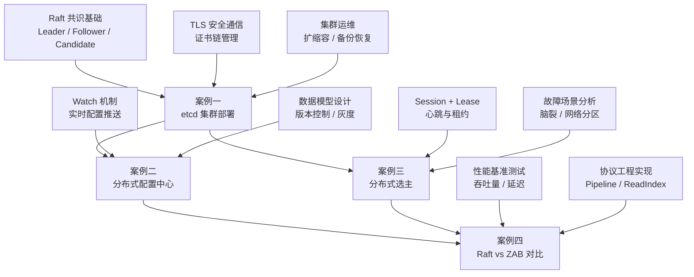

# 实战案例：从协议理解到工程落地

分布式共识是计算机科学中最迷人的领域之一——它将不可能变为可能，让一组互不信任的节点在不可靠的网络上达成一致。然而，理解 Paxos 的提案编号递增逻辑、Raft 的日志复制流程、ZAB 的 epoch 机制，与在生产环境中真正部署一套高可用集群之间，横亘着一条巨大的鸿沟。

本节的四个实战案例，正是为了填平这条鸿沟而设计的。

## 为什么需要实战案例

理论章节（22.1 节）系统讲解了 Paxos、Raft、ZAB 等共识协议的原理，核心技巧章节（22.2 节）提炼了选举超时设计、日志压缩、性能优化等工程经验。但这些知识如果不经实操验证，很容易停留在"知道但不会用"的层面。

分布式系统的特殊性在于：**你无法通过阅读代码来理解故障行为**。Leader 崩溃后 Follower 多久能接管？网络分区期间写请求会怎样？脑裂如何检测和恢复？这些问题的答案只能在亲手搭建和破坏集群的过程中获得。

本节通过四个渐进式案例，覆盖从**基础设施搭建**到**应用层设计**再到**协议级对比分析**的完整链路：

| 阶段 | 案例 | 核心能力 |
|------|------|----------|
| 基础设施 | 案例一：部署高可用 etcd 集群 | 集群搭建、TLS 安全、故障恢复、监控告警 |
| 应用开发 | 案例二：基于 etcd 实现分布式配置中心 | Watch 机制、数据模型设计、客户端 SDK |
| 核心模式 | 案例三：实现分布式选主 | 选主算法、Session 管理、故障模拟 |
| 深度对比 | 案例四：Raft vs ZAB 实际系统表现 | 协议选型、性能基准、生产调优 |

## 四个案例总览

### 案例一：部署高可用 etcd 集群

**场景**：为一个 Kubernetes 集群部署 3 节点 etcd 集群，要求跨可用区部署，支持 TLS 加密通信，具备自动故障恢复能力。

这是所有后续案例的基础设施前提。etcd 是 Kubernetes 的"大脑"，存储着集群的所有状态数据——如果 etcd 不可用，整个 K8s 集群将无法正常工作。

**你将学到**：

- 三节点 Raft 集群的完整部署流程（从裸机到可用）
- TLS 双向认证的证书链管理（CA → Server → Client）
- 集群参数调优（心跳间隔、选举超时、配额管理）
- Leader 故障自动恢复的验证方法（RTO < 30s）
- 自动化备份与恢复策略（每日快照 + 7 天轮转）
- Prometheus + Grafana 监控体系搭建（7 个关键指标）
- 成员动态扩缩容（3→5 节点在线扩容）

**难度**：⭐⭐⭐ | **预计时间**：2-3 小时 | **前置条件**：3 台 Linux 服务器（或虚拟机）

### 案例二：基于 etcd 实现分布式配置中心

**场景**：为一个拥有 200+ 微服务实例的系统构建统一的配置管理中心，支持配置实时推送、版本管理、灰度发布。

配置管理是分布式系统最常见的基础设施需求之一。传统的配置文件方案（修改 → 部署 → 重启）在微服务架构下效率极低——200 个实例逐个重启可能需要数小时，期间配置不一致会导致难以排查的问题。

**你将学到**：

- etcd 的 Watch 机制如何实现配置变更的实时推送
- 配置数据模型设计（版本号、标签、时间戳）
- 基于 etcd 事务的原子写入与版本历史
- 客户端 SDK 设计（本地缓存 + Watch 实时更新 + 持久化）
- 灰度发布实现（基于 Label 的流量控制）
- 200 实例 Watch 的性能基准（推送延迟 < 100ms）

**难度**：⭐⭐ | **预计时间**：1-2 小时 | **前置条件**：案例一的 etcd 集群

### 案例三：实现分布式选主

**场景**：在一个分布式任务调度系统中实现 Leader 选举，确保同一时刻只有一个主节点执行调度任务，同时支持故障自动转移。

选主（Leader Election）是分布式系统最核心的模式之一。无论是 Kafka 的 Partition Leader、Redis Sentinel 的监控选举，还是数据库的主从切换，底层都是选主机制在发挥作用。选主的正确性直接决定了系统的可靠性。

**你将学到**：

- etcd concurrency 包的 Election API（Campaign/Proclaim/Resign 生命周期）
- Session + Lease TTL 机制（推荐 10-15s）
- 五种典型故障场景的分析与恢复（Leader 崩溃、网络分区、脑裂等）
- 完整的 Go 实现（信号处理、优雅退出、故障监控）
- Leader 切换时间的量化测试（~15s Session TTL 切换）
- 四种选主方案的横向对比（etcd vs ZooKeeper vs Consul vs 自研 Raft）
- 高级模式：嵌套选举（全局/区域/Worker 三层架构）

**难度**：⭐⭐⭐⭐ | **预计时间**：2-3 小时 | **前置条件**：案例一的 etcd 集群，Go 语言基础

### 案例四：Raft vs ZAB 在实际系统中的表现

**场景**：对 etcd（Raft）和 ZooKeeper（ZAB）在真实工作负载下进行性能对比和故障行为分析，为技术选型提供数据支撑。

这是本节最具深度的案例。它不是某个具体系统的搭建指南，而是一次对两种主流共识协议在生产环境中的全面体检。通过对比 etcd 在 Kubernetes 中、ZooKeeper 在 Kafka 中、TiKV 的多 Raft 架构的实际表现，帮助你在面对技术选型时做出有数据支撑的决策。

**你将学到**：

- Raft 与 ZAB 的协议设计哲学差异（Leader 任期 vs Epoch、日志复制流程）
- 三种真实系统的性能基准数据（etcd/ZooKeeper/TiKV）
- 写入吞吐、读取延迟、故障恢复时间的量化对比
- Raft 的工程优化（Pipeline 复制、ReadIndex、Lease Read、Pre-Vote）
- ZAB 的工程优化（FLE 选举、批量事务、Observer 扩展）
- 五种典型场景的选型建议（配置中心、Kafka 元数据、分布式锁等）
- 常见误区澄清（集群节点数、SSD 选型、容量规划）

**难度**：⭐⭐⭐⭐⭐ | **预计时间**：3-4 小时 | **前置条件**：案例一二三的基础

## 学习路径建议

根据你的目标和时间，推荐以下学习路径：

### 路径 A：快速上手（3-4 小时）

案例一（跳过 TLS 部分）→ 案例二 → 案例四（选择性阅读）

适合：已经熟悉 K8s 运维，想快速理解 etcd 在配置管理中的应用。

### 路径 B：完整实践（6-8 小时）

案例一 → 案例二 → 案例三 → 案例四

适合：系统学习分布式共识的工程实践，从搭建到应用到对比分析，形成完整认知。

### 路径 C：深度研究（8-10 小时）

案例一 → 案例三 → 案例四（全读）→ 案例二（结合选型分析重读）

适合：需要做技术选型决策的架构师，重点理解协议差异和选型依据。

## 环境准备

所有案例基于以下技术栈：

| 组件 | 版本 | 用途 |
|------|------|------|
| etcd | v3.5+ | 共识集群、配置中心、选主 |
| Go | 1.21+ | 客户端 SDK 开发 |
| Docker | 24.0+ | 本地开发环境模拟（可选） |
| Prometheus | 2.45+ | 集群监控 |
| Grafana | 10.0+ | 可视化仪表盘 |
| kube-bench | latest | 安全合规检查（可选） |

**硬件要求**：

- 本地开发：8GB 内存、4 核 CPU（虚拟机模拟 3 节点）
- 生产环境：3 台独立服务器（推荐 4 核 16GB、NVMe SSD）
- 网络：节点间延迟 < 5ms（同可用区）或 < 50ms（跨可用区）

**快速搭建本地环境**（可选）：

如果暂时没有多台服务器，可以使用 Docker 在单机上模拟三节点集群：

```bash
# 启动三节点 etcd 集群
docker network create etcd-net

for i in 0 1 2; do
  docker run -d --name etcd$i --network etcd-net \
    -p $((2379+i)):2379 -p $((2380+i)):2380 \
    quay.io/coreos/etcd:v3.5.12 \
    --name node$i \
    --listen-client-urls http://0.0.0.0:2379 \
    --advertise-client-urls http://etcd$i:2379 \
    --listen-peer-urls http://0.0.0.0:2380 \
    --initial-advertise-peer-urls http://etcd$i:2380 \
    --initial-cluster "node0=http://etcd0:2380,node1=http://etcd1:2380,node2=http://etcd2:2380" \
    --initial-cluster-state new
done

# 验证集群状态
docker exec etcd0 etcdctl --endpoints=http://etcd0:2379 endpoint health
```

## 各案例的关键产出

完成每个案例后，你应该拥有以下可交付物：

| 案例 | 产出 | 用途 |
|------|------|------|
| 案例一 | 3 节点 etcd 集群 + 监控 + 备份脚本 | 可直接用于测试环境的基础设施 |
| 案例二 | 配置中心服务端 + 客户端 SDK | 可集成到微服务架构的配置管理组件 |
| 案例三 | 分布式选主 Go 实现 | 可用于需要主节点选举的分布式系统 |
| 案例四 | 选型对比报告 + 基准测试数据 | 可用于技术选型决策的技术调研文档 |

## 案例间的知识递进关系

四个案例并非孤立存在，而是形成了一条清晰的知识递进链：



## 从案例到生产

完成本节案例后，你将具备以下工程能力：

1. **集群搭建能力**：能独立部署和维护基于 Raft/ZAB 的高可用集群
2. **应用开发能力**：能基于共识系统构建分布式应用（配置中心、选主、分布式锁）
3. **故障处理能力**：能识别和处理 Leader 故障、网络分区、脑裂等常见问题
4. **技术选型能力**：能根据业务场景在 etcd、ZooKeeper、Consul 等方案间做出合理选择
5. **监控运维能力**：能搭建监控体系，提前发现和预防集群故障

这些能力构成了分布式系统工程师的核心技能栈。接下来，让我们从第一个案例开始，动手搭建你的第一个高可用 etcd 集群。
