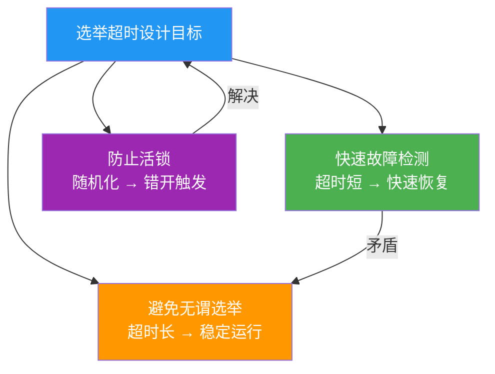
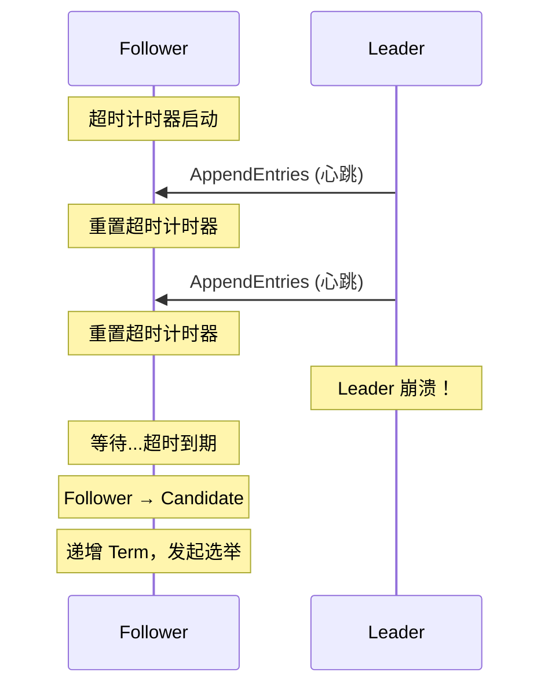
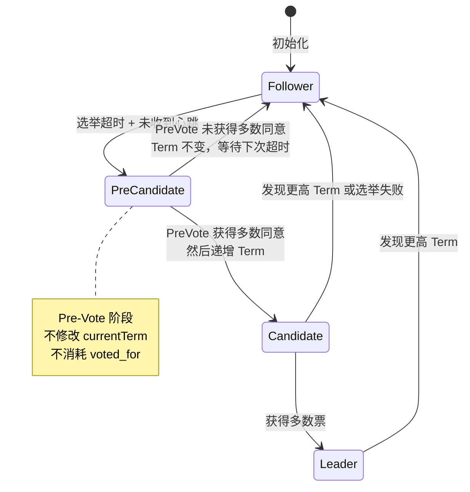

## 技巧一：选举超时的设计艺术

> "在分布式系统中，时间是最大的敌人，也是最精妙的设计工具。"——Diego Ongaro（Raft 论文作者）

选举超时（Election Timeout）是 Raft 协议中最精妙的工程设计之一。它看似只是一个简单的定时器参数，实则直接决定了系统的**活性（Liveness）**——集群能否在故障后快速恢复服务，能否在正常运行时保持稳定。选举超时设计不好，轻则导致频繁无谓选举拖慢系统，重则引发活锁（Livelock）使整个集群陷入瘫痪。

**真实案例警示**：2021 年某大型 SaaS 平台因 etcd 集群的 election-timeout 设置为 1000ms（仅为心跳间隔的 1 倍），在一次网络抖动中触发了连锁选举风暴，导致 Kubernetes 控制面停摆超过 30 分钟，影响数千个 Pod 的调度。事后复盘发现，选举超时的参数配置是整条链路中最薄弱的环节。

本技巧将从理论原理出发，深入剖析选举超时的设计原则、参数选择、Pre-Vote 与 CheckQuorum 机制，以及真实生产环境中的调优实践与故障排查，帮助你掌握这个看似简单实则深邃的工程艺术。

### 为什么选举超时如此重要

在 Raft 协议中，时间被划分为一个个**任期（Term）**，每个任期以一次选举开始。当 Follower 在选举超时窗口内没有收到 Leader 的心跳（AppendEntries RPC），它认为 Leader 已经失效，转变为 Candidate 发起新一轮选举。

选举超时的设计需要同时满足三个相互矛盾的目标：

| 目标 | 要求 | 矛盾点 |
|------|------|---------|
| **快速故障检测** | 超时尽可能短，Leader 崩溃后尽快选出新 Leader | 太短导致网络抖动误判为故障 |
| **避免无谓选举** | 超时足够长，给正常心跳留充足时间 | 太长导致故障恢复延迟增大 |
| **防止活锁** | 同一时刻最多只有一个 Candidate 发起选举 | 确定性超时无法避免同时触发 |

这三个目标构成了选举超时设计的核心张力。Raft 通过**随机化超时**和**Pre-Vote 机制**两个关键设计来平衡这些矛盾。



**Raft 论文中的形式化定义**（Diego Ongaro, Stanford PhD Thesis, 2014）：

> *election timeout* is the amount of time a follower waits before becoming a candidate if it has not received a heartbeat. To avoid livelock, the timeout is chosen randomly from a fixed interval (e.g., 150–300ms). Each node picks its election timeout independently using a uniform random distribution.

这段定义包含三个关键信息：选举超时是 Follower→Candidate 的触发条件；随机化是防活锁的手段；均匀随机分布是推荐的随机化方法。

### 选举超时的工作机制

#### 状态转换触发

选举超时的核心逻辑是：Follower 每次收到 Leader 的心跳时重置超时计时器，如果在超时窗口内没有新的心跳到来，则触发选举。

```text
时间线示意（单个 Follower）：

|--心跳--|--心跳--|--心跳------无心跳------|→ 超时触发！
         ↑           ↑                     ↑
       重置定时器   重置定时器          选举超时到期
                                      Follower → Candidate
```

状态转换的完整流程如下：



#### 参数三要素

选举超时设计涉及三个核心参数，它们之间存在严格的约束关系：

| 参数 | 典型值（etcd） | 含义 | 设计约束 |
|------|----------------|------|----------|
| `heartbeat-interval` | 1000ms | Leader 心跳间隔 | 必须远小于 election-timeout |
| `election-timeout-min` | 1000ms | 选举超时最小值 | 必须远大于 heartbeat-interval |
| `election-timeout-max` | 2000ms | 选举超时最大值 | 必须大于 min，范围宽度影响冲突概率 |

Raft 论文给出的经验法则：

```text
election_timeout >= 10 × heartbeat_interval
election_timeout >> 平均网络 RTT（通常至少 10 倍以上）
```

这两个约束的物理含义：

1. **心跳间隔是选举超时的 1/10 以上**：确保在选举超时到期前，正常情况下至少能收到 10 次心跳。即使因为网络抖动丢失 1-2 次心跳，也不会误触选举。

2. **选举超时远大于网络 RTT**：心跳从 Leader 发出到 Follower 收到需要一个 RTT。如果选举超时太接近 RTT，在高延迟网络中可能因为一次心跳稍慢就触发选举。

**约束关系的数学推导**：

```text
设 N 为心跳次数（正常情况下在超时前应收到的心跳数），
   H 为心跳间隔，E 为选举超时，R 为网络 RTT。

要求 1: E ≥ 10H（确保 N ≥ 10）
要求 2: E >> R（确保心跳不会因 RTT 抖动被误判丢失）

实际含义：
  - 假设心跳丢失率为 p（通常 p < 0.01）
  - 连续丢失 N 个心跳的概率 = p^N
  - 当 N = 10, p = 0.01 时：误判概率 = 0.01^10 ≈ 10^-20（极低）
  - 当 N = 3, p = 0.01 时：误判概率 = 0.01^3 = 10^-6（仍低但可接受）
  - 当 N = 1, p = 0.01 时：误判概率 = 0.01（每天可能触发多次误选）
```

### 随机化：破解活锁的精妙设计

#### 为什么确定性超时会失败

假设所有节点使用相同的固定选举超时（例如 300ms），考虑以下场景：

```text
T=0s:   Leader 崩溃
T=300ms: 所有 Follower 同时超时，同时转为 Candidate
         同时发起选举 → 选票均分 → 无人获得多数票
T=600ms: 所有 Candidate 再次超时，再次同时选举
         再次选票均分 → 无限循环 → 活锁！
```

这就是经典的**活锁（Livelock）**问题：系统没有死锁（节点都在"工作"），但也没有进展（选举永远无法完成）。活锁比死锁更难诊断——所有节点的 CPU 和网络都在活跃地消耗资源，但集群对外表现为完全不可用。

**活锁的数学分析**：

```text
设集群有 N 个节点（N 为奇数），所有节点使用相同的超时 T。

T 时刻：N 个 Candidate 同时发起选举
  - 每个 Candidate 请求投票，期望获得 1 票（自己）
  - 由于同时发起，每个 Candidate 几乎不可能收到其他节点的票
  - 结果：N 个 Candidate 各持有 1 票，无人获得 (N/2+1) 多数票
  - 选举失败，所有节点重置超时，等待下一个 T

活锁概率 P_livelock：
  P_livelock = 1 - P(某个节点先发起并获得多数票)
  当所有超时相同时：P_livelock ≈ 1（确定性活锁）
  当超时随机分布时：P_livelock ≈ 0（随机化打破同步）
```

#### 随机化超时的原理

Raft 的解决方案优雅而简单：让每个节点在 `[min, max]` 范围内**随机**选择自己的选举超时时间。这样，不同节点的超时时间大概率不同，先超时的节点先发起选举，获得多数票的概率大大增加。

```go
// Raft 论文推荐的随机化超时实现
const (
    ElectionTimeoutMin = 150 * time.Millisecond
    ElectionTimeoutMax = 300 * time.Millisecond
    HeartbeatInterval  = 50 * time.Millisecond
)

func randomElectionTimeout() time.Duration {
    // 均匀分布随机选择 [min, max) 之间的超时值
    return ElectionTimeoutMin +
        time.Duration(rand.Int63n(int64(ElectionTimeoutMax - ElectionTimeoutMin)))
}
```

**随机化的正确实现要点**：

1. **每次选举超时都要重新随机选择**，而不是整个节点生命周期只随机一次
2. **随机源必须是密码学安全的伪随机数生成器**（如 `crypto/rand`），避免可预测性
3. **随机范围 `[min, max]` 应该是连续的**，离散的 tick 可能导致冲突概率增加
4. **不同节点应该使用不同的随机种子**（通常使用节点 ID 或随机种子初始化）

```go
// 生产环境推荐实现
func randomElectionTimeout(nodeID string) time.Duration {
    // 使用节点 ID 作为种子的一部分，确保不同节点有不同的随机序列
    seed := int64(time.Now().UnixNano()) + int64(crc32.ChecksumIEEE([]byte(nodeID)))
    rng := rand.New(rand.NewSource(seed))
    
    jitter := time.Duration(rng.Int63n(int64(ElectionTimeoutMax - ElectionTimeoutMin)))
    return ElectionTimeoutMin + jitter
}
```

#### 冲突概率的数学分析

随机化能降低冲突概率，但不能完全消除。以下分析可以帮助理解参数选择的数学依据：

假设集群有 N 个节点，选举超时在 `[T_min, T_max]` 范围内均匀分布。两个节点超时时间完全相同的概率极低（连续分布下为零），但"足够接近"的概率需要关注：

```text
设超时窗口宽度 W = T_max - T_min

两个节点超时差值 < δ 的概率：
  P(|t₁ - t₂| < δ) = 2δ/W - (δ/W)²

当 W = 150ms, δ = 5ms（网络 RTT 量级）：
  P ≈ 2×5/150 - (5/150)² ≈ 6.5%
  这意味着 5 个节点中有 2 个超时差值 < 5ms 的概率较低

当 W = 50ms, δ = 5ms：
  P ≈ 2×5/50 - (5/50)² ≈ 19%
  冲突概率显著增加

N 个节点中至少有两个"足够接近"的概率（近似）：
  P_conflict ≈ 1 - (1 - P)^C(N,2)
  其中 C(N,2) = N(N-1)/2 是节点对数

示例：N=5, W=150ms, δ=5ms
  P_conflict ≈ 1 - (1 - 0.065)^10 ≈ 49.4%
  说明：5 节点集群中约有一半概率存在一对节点超时接近
  但先超时的节点仍然有足够时间窗口获得多数票
```

**实际工程经验**：

| 超时窗口宽度 | 冲突风险 | 适用场景 |
|-------------|---------|---------|
| 50ms（如 150-200ms） | 较高 | 低延迟局域网，3 节点小集群 |
| 150ms（如 150-300ms） | 低 | Raft 论文推荐值，通用场景 |
| 500ms（如 1500-2000ms） | 很低 | 高延迟跨机房部署 |

窗口越宽，冲突概率越低，但故障检测延迟也越大。这是另一个 trade-off。

#### 超时窗口宽度的选择公式

在工程实践中，超时窗口宽度的选择可以参考以下经验公式：

```text
W >= max(RTT_p99 × 3, 50ms)

其中：
  W = T_max - T_min（窗口宽度）
  RTT_p99 = 节点间网络延迟的第 99 百分位值
```

这个公式的含义是：窗口宽度至少要能容纳 3 倍的 P99 网络延迟，以确保随机化的超时值能有效错开不同节点的触发时间。

**公式的推导逻辑**：

```text
要使随机化有效，需要确保：
  1. 先超时的节点在其他节点超时前能完成选举消息的传播
  2. 选举消息的传播时间 ≈ RTT（一轮 RPC 往返）
  3. 为安全起见，预留 3 倍 RTT 作为缓冲

因此：W >= 3 × RTT_p99

下限 50ms 是经验值，确保即使在超低延迟网络中也有足够的随机化空间
```

### 心跳与选举超时的精确关系

心跳间隔和选举超时之间的关系是整个选举机制的基石。理解这个关系对于生产环境调优至关重要。

#### 心跳的本质作用

心跳不只是"告诉 Follower Leader 还活着"，它还有三个关键功能：

1. **维持 Leader 权威**：每次心跳都会重置 Follower 的选举超时计时器，阻止选举发生
2. **推进日志提交**：心跳携带 commitIndex，即使没有新日志也能推进提交
3. **检测网络连通性**：心跳失败可以快速触发故障检测和日志回退
4. **传递 Leader 的 Lease 信息**：支持线性一致性读（Linearizable Read），详见下文

#### 参数比例的设计原则

```text
                  heartbeat_interval
                  ←──────────────→
                  
Follower 时间线:  |--心跳--|--心跳--|--心跳--|...|--心跳--|--超时触发--→
                                       ↑                      ↑
                                  正常情况：心跳重置定时器     异常情况：无心跳，超时触发选举

设计约束：election_timeout >= 10 × heartbeat_interval
```

**为什么不等比缩小（比如 heartbeat=10ms, election_timeout=100ms）？**

```text
heartbeat=10ms 时的问题：
  1. CPU 开销：每个心跳需要序列化/反序列化 RPC + 调度定时器
  2. 网络带宽：N 个节点的集群，每秒产生 N×(N-1)×100 = N²×100 个心跳包
  3. 5 节点集群：每秒 2500 个心跳包，对 CPU 和网络都是不必要的负担
  
heartbeat=1000ms 时的问题：
  1. 故障检测最慢需要 1 秒（一个心跳周期）
  2. 故障恢复最慢需要 1 秒（检测）+ 0.5 秒（选举）= 1.5 秒
  3. 对于高可用系统来说 1.5 秒不可接受
```

**推荐配置对比**：

| 部署场景 | heartbeat | election_timeout | 说明 |
|---------|-----------|-------------------|------|
| 同机房低延迟 | 100-200ms | 1000-2000ms | 快速故障检测，etcd 默认 |
| 跨可用区 | 500-1000ms | 5000-10000ms | 容忍较高 RTT |
| 跨地域 | 1000-2000ms | 10000-20000ms | CockroachDB 典型配置 |
| 开发测试 | 50-100ms | 500-1000ms | 快速反馈 |

#### 心跳间隔与线性一致性读的交互

选举超时不仅影响 Leader 选举，还直接影响线性一致性读（Linearizable Read）的实现。Raft 提供两种线性一致性读方案，它们都与心跳间隔密切相关：

**方案一：ReadIndex**

```text
Client → Leader: "我要读 key=X"
Leader:
  1. 记录当前 commitIndex（readIndex）
  2. 向所有 Follower 发送心跳确认自己仍是 Leader
  3. 等待本地 applyIndex >= readIndex
  4. 返回读结果

问题：每次读都触发心跳，增加心跳负载
```

**方案二：LeaseRead（基于心跳的 Leader Lease）**

```text
Leader 在收到心跳后认为自己在 lease 有效期内（通常 lease = heartbeat × election_timeout / heartbeat_tick）
在 lease 有效期内直接响应读请求，无需额外心跳

优势：读性能极高（无额外网络往返）
风险：时钟漂移可能导致 lease 提前过期或延迟过期

etcd 默认使用 LeaseRead（--experimental-linearizable-read-only-unsafe-enabled=false 时）
```

```text
LeaseRead 的时间线：
  |--心跳--|← lease 有效期内可直接读 →|--心跳--|← lease 有效期内可直接读 →|
     ↑                                     ↑
   lease 起始                          lease 续期
  
  lease_duration = election_timeout × heartbeat_tick / election_tick
  例如：election_timeout=10000ms, heartbeat_tick=10, election_tick=100
  lease_duration = 10000 × 10 / 100 = 1000ms
```

### Pre-Vote 机制：防止分区引发的级联选举

#### 问题场景：网络分区导致的 Term 膨胀

考虑以下场景：一个 5 节点集群，节点 E 因网络分区被隔离。E 不断超时、发起选举、提升 Term，最终 Term 可能飙升到几百甚至几千。当分区恢复后，E 带着极高的 Term 加入集群，其他节点收到 E 的消息后被迫退位，导致本已稳定的集群再次选举。

```text
5 节点集群，节点 E 被网络分区隔离：

正常运行时：Term = 5, Leader = A

T=1s:  E 超时，Term = 6，发起选举（失败，只有自己）
T=2s:  E 再次超时，Term = 7，发起选举（失败）
...
T=100s: E 的 Term 已达 105

分区恢复后：
E → A: "我有 Term 105 的消息"
A 收到后被迫退位，Follower → Follower（降低 Term 到 105）
整个集群重新选举 → 服务中断！
```

这种现象称为**Term 膨胀（Term Inflation）**或**选举风暴（Election Storm）**，是生产环境中最常见的稳定性问题之一。

#### Pre-Vote 的设计思想

Pre-Vote 的核心思想是：在真正发起选举之前，先进行一轮"试探性投票"。试探投票**不会提升 Term**，只有在试探成功后才正式发起选举。

```go
// Pre-Vote：正式投票前先试探
func (r *RaftNode) startPreVote() bool {
    // 第一步：检查是否真的需要选举
    // 如果最近刚收到 Leader 心跳，不需要发起选举
    if r.recentlyReceivedHeartbeat() {
        return false
    }

    // Pre-Vote 使用 currentTerm + 1，但不会真正递增 currentTerm
    preVoteTerm := r.currentTerm + 1
    votes := 1 // 投给自己

    for _, peer := range r.peers {
        // 发送 PreVote RPC，而不是 RequestVote
        // 关键区别：PreVote 不会让接收方更新 Term
        granted := r.sendPreVote(peer, preVoteTerm,
            r.lastLogIndex(), r.lastLogTerm())
        if granted {
            votes++
        }
    }

    // 预投票通过，才发起正式选举
    return votes > len(r.peers)/2
}
```

**Pre-Vote 的关键特性**：

1. **不修改 currentTerm**：即使 PreVote 失败，节点的 Term 不变
2. **不消耗 voted_for**：不会影响其他节点在本 Term 的投票决策
3. **无副作用**：PreVote 失败不会导致任何状态变更
4. **日志比较逻辑相同**：与 RequestVote 相同的日志新旧比较规则

#### PreVote RPC 与 RequestVote RPC 的对比

| 维度 | PreVote | RequestVote |
|------|---------|-------------|
| Term 更新 | 不更新当前 Term | 会递增当前 Term |
| 目的 | 试探是否有资格赢得选举 | 正式发起选举 |
| 投票权 | 不消耗投票机会 | 消耗本 Term 的投票机会 |
| 失败代价 | 无副作用 | 可能干扰正常 Leader |
| 日志比较 | 相同逻辑 | 相同逻辑 |
| 接收方响应 | 仅回复同意/拒绝 | 回复同意/拒绝 + 更新 Term |

#### Pre-Vote 状态机



#### Pre-Vote 的防护效果

回到前面的分区场景，Pre-Vote 如何解决 Term 膨胀问题：

```text
加入 Pre-Vote 后：

T=1s:  E 超时，发起 PreVote（Term+1 = 6）
       但只有自己回复同意，未获得多数 → 失败
       E 的 currentTerm 仍然是 5（未递增）
T=2s:  E 再次超时，发起 PreVote（Term+1 = 6）
       仍然只有自己 → 失败
       currentTerm 仍然是 5
...（永远卡在 Term 5）

分区恢复后：
E → A: "PreVote 请求，Term = 6"
A 检查后正常回复，不会被迫退位
集群完全不受影响！
```

**Pre-Vote 的量化效果**：

```text
无 Pre-Vote 的 Term 膨胀：
  集群 5 节点，1 节点被分区
  超时 10s，分区持续 10 分钟
  Term 膨胀 = 10分钟 / 10秒 = 60 个 Term
  分区恢复后的服务中断时间 ≈ 60 个 Term × 选举耗时 ≈ 数分钟

有 Pre-Vote 的 Term 膨胀：
  被分区节点的 Term 始终不变
  分区恢复后：无服务中断
  恢复时间 ≈ 0（无需选举）
```

#### etcd 中的 Pre-Vote 实现

etcd 从 v3.2 开始支持 Pre-Vote，默认开启。关键配置和代码路径：

```go
// etcd raft 配置中的 Pre-Vote 相关参数
type Config struct {
    // PreVote 为 true 时，节点在发起选举前会先进行 Pre-Vote
    PreVote bool

    // ElectionTick: 选举超时 tick 数
    // HeartbeatTick: 心跳间隔 tick 数
    // 实际超时 = ElectionTick × tick 持续时间
    ElectionTick  int
    HeartbeatTick int
}

// etcd 默认配置
// heartbeat-tick = 10 (× 100ms = 1000ms)
// election-tick = 100 (× 100ms = 10000ms)
// pre-vote = true (默认开启)
```

### CheckQuorum：Pre-Vote 的互补机制

Pre-Vote 解决了"被分区的节点不应干扰集群"的问题，但还有一个互补的问题需要解决：**Leader 如何知道自己被分区了？**

#### 问题场景：Leader 不知道自己已经"死了"

```text
5 节点集群，Leader A 因网络分区被隔离：

正常运行时：Term = 10, Leader = A

A 被分区后：
  - A 收不到多数节点的响应
  - 但 A 的心跳仍然在发出（只是收不到回复）
  - A 不知道自己已经"死了"
  - A 仍然接受客户端写请求（但无法提交，因为无法获得多数确认）
  - 客户端请求超时 → 用户感知到服务不可用
  
同时：
  - 其他 4 个节点发起选举，选出新 Leader B
  - 但 A 不知道 B 的存在（分区中）
  - 如果 A 的分区恢复，A 和 B 的 Term 比较会导致一次选举
```

#### CheckQuorum 的设计

CheckQuorum 让 Leader 定期检查是否还能与多数节点通信。如果在一定时间内没有收到多数节点的响应，Leader 自动退位为 Follower。

```go
// CheckQuorum 的核心逻辑
func (r *RaftNode) checkQuorum() {
    if r.state != Leader {
        return
    }

    // 检查在最近一个选举超时周期内，是否收到了多数节点的响应
    aliveCount := 1 // 自己
    for _, peer := range r.peers {
        if r.recentHeartbeatResponse(peer) {
            aliveCount++
        }
    }

    quorumSize := (len(r.peers)+1)/2 + 1
    if aliveCount < quorumSize {
        // 无法与多数节点通信，主动退位
        // 这比等待超时被推翻更优雅
        r.stepDown(r.currentTerm)
        log.Warn("CheckQuorum failed: stepping down from Leader")
    }
}
```

**CheckQuorum 与 Pre-Vote 的协作**：

```text
完整防护机制：

  Pre-Vote（防 Term 膨胀）：
    被分区的 Follower 无法获得 PreVote 多数票 → Term 不增长
    分区恢复后不会干扰集群

  CheckQuorum（防幽灵 Leader）：
    被分区的 Leader 检测到无法获得多数响应 → 自动退位
    分区恢复后不会与新 Leader 冲突

  两者结合：
    Follower 端：Pre-Vote 防止 Term 膨胀
    Leader 端：CheckQuorum 防止幽灵 Leader
    结果：网络分区的最坏情况影响被完全隔离
```

### 选举超时与网络环境的适配

#### 不同网络环境的挑战

| 网络环境 | 典型 RTT | 核心挑战 | 超时策略 |
|---------|---------|---------|---------|
| 同机架 | < 1ms | 超低延迟，误判空间小 | 短超时（150-300ms） |
| 同机房 | 1-5ms | 稳定延迟，偶发抖动 | 标准超时（150-300ms） |
| 同城双活 | 10-50ms | 跨 AZ 延迟，光速限制 | 加长超时（500-2000ms） |
| 跨地域 | 50-200ms | 高延迟 + 抖动 | 大超时窗口（1000-3000ms） |
| 混合部署 | 1-200ms | 延迟差异巨大 | 自适应超时 |

#### 跨地域部署的超时设计

跨地域部署是选举超时设计最具挑战性的场景。以 CockroachDB 的全球分区部署为例：

```text
纽约 ←→ 伦敦：RTT ≈ 70ms
纽约 ←→ 上海：RTT ≈ 200ms
伦敦 ←→ 上海：RTT ≈ 250ms

如果使用标准 150-300ms 超时：
  上海节点发送的心跳到纽约需要 ~100ms（单程）
  加上处理延迟，可能接近 150ms
  极端情况下会被误判为超时

解决方案：
  election-timeout: 3000-6000ms
  heartbeat-interval: 500ms
  允许故障检测延迟增大到秒级
```

**跨地域部署的权衡矩阵**：

| 指标 | 同机房 | 同城双活 | 跨地域 |
|------|--------|---------|--------|
| 故障检测延迟 | 10-15s | 20-30s | 30-60s |
| 写入延迟（P99） | 10-50ms | 50-200ms | 200-1000ms |
| 可用性 | 99.999% | 99.99% | 99.9% |
| 适用场景 | 核心交易 | 高可用服务 | 全球分布式 |

#### 自适应超时（高级）

一些高级实现采用**自适应超时**，根据网络状况动态调整超时参数：

```go
// 自适应选举超时：根据历史 RTT 动态调整
type AdaptiveElectionTimeout struct {
    baseTimeout    time.Duration // 基础超时值
    rttEstimate    time.Duration // 估算的网络 RTT
    rttHistory     []time.Duration // 历史 RTT 记录
    multiplier     float64       // RTT 乘数因子（通常 5-10）
    minTimeout     time.Duration // 超时下限
    maxTimeout     time.Duration // 超时上限
}

func (a *AdaptiveElectionTimeout) CurrentTimeout() time.Duration {
    // 基于 RTT 估算动态计算超时
    adaptive := time.Duration(float64(a.rttEstimate) * a.multiplier)

    // 限制在 [min, max] 范围内
    if adaptive < a.minTimeout {
        adaptive = a.minTimeout
    }
    if adaptive > a.maxTimeout {
        adaptive = a.maxTimeout
    }

    // 在 adaptive 基础上随机化
    jitter := time.Duration(rand.Int63n(int64(adaptive / 2)))
    return adaptive + jitter
}

func (a *AdaptiveElectionTimeout) UpdateRTT(sample time.Duration) {
    a.rttHistory = append(a.rttHistory, sample)
    if len(a.rttHistory) > 100 {
        a.rttHistory = a.rttHistory[1:] // 保留最近 100 个样本
    }
    // 使用指数加权移动平均（EWMA）估算 RTT
    a.rttEstimate = time.Duration(
        0.7*float64(a.rttEstimate) + 0.3*float64(sample))
}
```

> **注意**：自适应超时增加了实现复杂度，且需要可靠的 RTT 测量。etcd 等主流实现仍使用固定超时范围。自适应策略更适合自研共识系统或对延迟极度敏感的场景。

### 选举风暴：级联故障的深度剖析

选举风暴是选举超时配置不当的最严重后果之一。理解其机制和防护至关重要。

#### 选举风暴的触发链

```text
选举风暴的典型触发链：

  1. 网络抖动导致部分心跳丢失
     ↓
  2. Follower 触发选举（超时太短导致误判）
     ↓
  3. 选举期间无心跳 → 其他 Follower 也触发选举
     ↓
  4. 多个 Candidate 同时竞选 → 选票分散 → 选举失败
     ↓
  5. 所有节点重置超时 → 再次同时触发
     ↓
  6. 循环往复 → 选举风暴

  整个过程消耗大量 CPU（RPC 处理）和网络带宽（投票消息）
  客户端完全无法读写 → 服务不可用
```

#### 防护策略

| 防护策略 | 原理 | 适用场景 |
|---------|------|---------|
| **增大超时窗口** | 降低同时触发概率 | 通用，首选方案 |
| **启用 Pre-Vote** | 防止 Term 膨胀 | etcd v3.2+ 默认开启 |
| **启用 CheckQuorum** | 防止幽灵 Leader | etcd v3.4+ 支持 |
| **选举退避** | 连续失败后指数退避 | 自研系统 |
| **心跳优先级** | 高优先级发送心跳 | 网络拥塞场景 |
| **网络 QoS** | 为心跳流量预留带宽 | 多租户环境 |

**选举退避的实现**：

```go
// 指数退避选举超时：防止连续选举风暴
func (r *RaftNode) backoffElectionTimeout() time.Duration {
    base := randomElectionTimeout()
    
    // 根据连续失败次数指数退避
    backoff := time.Duration(1<<r.consecutiveElectionFailures) * base
    maxBackoff := 30 * time.Second
    
    if backoff > maxBackoff {
        backoff = maxBackoff
    }
    
    return backoff
}
```

### 集群健康感知与超时调整

选举超时不仅是一个静态参数，还应该与集群健康状态联动。在部分节点不可用时，调整超时策略可以显著提升系统的鲁棒性。

#### 集群健康状态检测

```go
// 定期检查集群健康状态
func (r *RaftNode) checkClusterHealth() ClusterStatus {
    status := ClusterStatus{
        Leader:       r.leaderId,
        Term:         r.currentTerm,
        TotalVoters:  len(r.peers) + 1,
    }

    aliveVoters := 1 // 自己
    for _, peer := range r.peers {
        if r.isReachable(peer) {
            aliveVoters++
        }
    }

    status.AliveVoters = aliveVoters
    status.IsHealthy = aliveVoters > (len(r.peers)+1)/2

    // 计算可用法定人数比例
    quorumSize := (len(r.peers)+1)/2 + 1
    status.QuorumRatio = float64(aliveVoters) / float64(quorumSize)

    return status
}

// 基于集群健康状态调整选举超时
func (r *RaftNode) adjustedElectionTimeout() time.Duration {
    health := r.checkClusterHealth()

    if health.IsHealthy {
        // 集群健康：使用标准超时
        return randomElectionTimeout()
    }

    // 集群不健康：延长选举超时
    // 原因：不健康时选举大概率会失败，频繁选举只会浪费资源
    // 并且不健康的网络环境更容易产生误判
    return randomElectionTimeout() * 2
}
```

#### 集群不健康时的超时策略

| 集群状态 | 策略 | 原因 |
|---------|------|------|
| 全部节点健康 | 标准超时 | 正常运行，无需特殊处理 |
| 1 个节点失联（奇数集群） | 标准超时 | 集群仍可正常选主 |
| 多个节点失联 | 延长超时 | 选举大概率失败，减少无谓选举 |
| Leader 失联 | 缩短超时（Pre-Vote） | 加速故障恢复 |
| 网络抖动 | 延长超时 | 避免误判 |

#### 成员变更对选举超时的影响

当集群进行成员变更（添加/移除节点）时，选举超时需要特别注意：

```text
成员变更场景：

  添加节点（3 → 5 节点）：
    - 新节点 Term = 0，没有投票记录
    - 新节点会立即触发选举（因为从未收到心跳）
    - 风险：新节点可能干扰正在运行的 Leader
    
  解决方案：
    - 新节点加入时先以 Learner 身份同步日志
    - 同步完成后再转为 Voter
    - 转换时确保新节点已收到足够多的心跳

  移除节点（5 → 3 节点）：
    - 被移除的节点不知道自己已被移除
    - 会持续发起选举，干扰集群
    - Pre-Vote 可以防止其 Term 膨胀
    - 但仍然消耗网络带宽
    
  解决方案：
    - 移除节点前先发送 RemovePeer RPC
    - 被移除节点收到后自动关闭
    - 如果 RPC 失败，依赖 Pre-Vote + CheckQuorum 兜底
```

### 分布式锁中的超时陷阱

选举超时不仅影响共识层，还会向上传播到应用层。在使用基于 Raft 的分布式锁（如 etcd 锁）时，选举超时直接影响锁的可靠性。

#### 锁持有者选举超时后的风险

```text
场景分析：
1. 客户端 A 在 Leader 上持有分布式锁
2. Leader 崩溃
3. 集群发起选举（需要 election_timeout 时间）
4. 选举完成后，新 Leader 选出
5. 新 Leader 上的锁状态从日志中恢复

总停顿时间 = election_timeout + 选举耗时
如果 election_timeout = 10s，停顿时间可达 10+ 秒
```

#### 缩短感知延迟的方法

```go
// 使用 etcd 租约（Lease）实现自动过期
func acquireLockWithLease(client *clientv3.Client, lockKey string) error {
    // 创建 10 秒租约
    lease, err := client.Grant(context.Background(), 10)
    if err != nil {
        return err
    }

    // 使用租约创建锁
    // 租约过期后锁自动释放
    _, err = client.Txn(context.Background()).
        If(clientv3.Compare(clientv3.CreateRevision(lockKey), "=", 0)).
        Then(clientv3.OpPut(lockKey, "owner-A", clientv3.WithLease(lease.ID))).
        Commit()
    if err != nil {
        return err
    }

    // 定期续租，保持锁持有
    ch, err := client.KeepAlive(context.Background(), lease.ID)
    if err != nil {
        return err
    }

    // 监控续租状态，锁丢失时及时感知
    go func() {
        for {
            resp, ok := <-ch
            if !ok {
                // 租约已过期，锁丢失
                handleLockLost()
                return
            }
            if resp == nil {
                // 续租失败
                handleLockLost()
                return
            }
        }
    }()

    return nil
}
```

**分布式锁与选举超时的关系图**：

```text
锁持有时间线：
  ┌─ Leader 持有锁 ─┐    ┌─ 选举完成 ─┐    ┌─ 新 Leader 恢复锁 ─┐
  │ 客户端 A 操作   │    │  停顿期    │    │ 锁从日志恢复       │
  └─────────────────┘    └────────────┘    └────────────────────┘
                          ↑ election_timeout
                          
  优化方案：
  1. 租约过期时间 << election_timeout
     → 锁在 Leader 崩溃后快速自动释放
     → 新客户端可以在选举完成前获取锁
  
  2. Fencing Token（隔离令牌）
     → 每次选举产生新的 fencing token
     → 存储服务拒绝旧 token 的写入
     → 防止"脑裂"导致的双重持有
```

### 生产环境调优实践

#### etcd 集群的超时配置

etcd 是最广泛使用的 Raft 实现，其默认配置经过了精心设计：

```yaml
# etcd.conf.yml
etcd:
  # 心跳间隔（tick 数 × tick 持续时间）
  # 默认值：1000ms（10 ticks × 100ms/tick）
  heartbeat-interval: 1000

  # 选举超时（tick 数 × tick 持续时间）
  # 默认值：10000ms（100 ticks × 100ms/tick）
  # 约束：必须 > 10 × heartbeat-interval
  election-timeout: 10000

  # Pre-Vote 开关（v3.2+ 支持，默认开启）
  # 在分布式 etcdctl 或 clientv3 中通过 --experimental-pre-vote=true 启用
```

**etcd 调优建议**：

```text
场景 1：3 节点同机房（最常见）
  heartbeat: 1000ms  ← 保持默认
  election: 10000ms  ← 保持默认
  故障恢复时间：10-15 秒

场景 2：5 节点跨可用区
  heartbeat: 1000ms  ← 保持默认
  election: 20000ms  ← 加大，容忍跨 AZ 延迟
  故障恢复时间：20-30 秒

场景 3：开发/测试环境
  heartbeat: 100ms   ← 缩小，快速反馈
  election: 1000ms   ← 缩小，快速故障恢复
  故障恢复时间：1-2 秒

场景 4：大规模集群（50+ 节点）
  heartbeat: 2000ms  ← 加大，减少心跳风暴
  election: 20000ms  ← 加大，容忍更多网络抖动
  注意：大规模集群应使用 Multi-Raft（如 TiKV）而非单 Raft Group
```

#### TiKV 的多 Raft Group 超时

TiKV 使用 Region 级别的多 Raft Group，每个 Region 有独立的选举超时：

```toml
# TiKV raft 配置
[raftstore]
# 心跳 tick
heartbeat-interval = "10s"
# 选举超时 tick
election-timeout = 10
# tick 持续时间（默认 1s）
# 实际选举超时 = election-timeout × tick = 10 × 1s = 10s
```

TiKV 的特殊之处在于：不同 Region 的 Raft Group 共享底层物理节点，但选举超时是独立配置的。这意味着**单个物理节点的 CPU/网络波动可能同时影响多个 Region 的选举**。

### 常见误区与纠正

#### 误区一：选举超时越短越好

```text
错误认知："超时短 = 故障恢复快 = 系统更可靠"

实际情况：
  超时太短的三个危害：
  1. 网络抖动误判为故障 → 无谓选举 → 服务中断
  2. 心跳处理稍慢就触发选举 → Leader 频繁更换
  3. 候选人数量过多 → 选票分散 → 活锁风险

正确做法：遵循 10 倍规则，election_timeout >= 10 × heartbeat_interval
```

#### 误区二：所有节点应该使用相同的超时

```text
错误认知："统一配置 = 行为一致 = 更稳定"

实际情况：
  相同超时 = 同时超时 = 选票分散 = 活锁
  
正确做法：在 [min, max] 范围内随机化
  每个节点每次超时重新随机选择
  窗口宽度 W = max - min 应足够大
```

#### 误区三：Pre-Vote 可以完全替代随机化

```text
错误认知："有 Pre-Vote 了，就不需要随机超时了"

实际情况：
  Pre-Vote 解决的是 Term 膨胀问题
  随机化解决的是同时触发选举的冲突问题
  两者解决的是不同维度的问题，缺一不可

正确做法：同时启用 Pre-Vote 和随机化超时
```

#### 误区四：超时参数设置后就不需要调整

```text
错误认知："一次配好，永不再动"

实际情况：
  网络环境会变化（流量增加、链路故障）
  集群规模会变化（扩容/缩容）
  负载模式会变化（读写比例、请求大小）
  
正确做法：
  1. 监控选举频率和选举耗时指标
  2. 根据网络 RTT P99 调整超时范围
  3. 根据集群规模调整超时窗口宽度
  4. 使用 Pre-Vote 减少对超时参数的敏感性
```

#### 误区五：选举超时只影响 Leader 选举

```text
错误认知："选举超时只是 Leader 选举的事"

实际情况：
  选举超时直接影响：
  1. 线性一致性读的 Lease 有效期
  2. 分布式锁的可靠性窗口
  3. Leader Lease 的续期间隔
  4. 故障恢复的总停顿时间
  
正确做法：将选举超时视为系统整体可用性的关键参数
```

### 监控与诊断

#### 关键监控指标

在生产环境中，以下指标可以帮助你评估选举超时配置是否合理：

```text
核心指标：
  1. raft_election_timeout_total    — 选举超时触发次数（rate）
  2. raft_leader_elections_total    — 实际发生选举的次数（rate）
  3. raft_leader_changes_total      — Leader 切换次数
  4. raft_round_trip_time_seconds   — 节点间 RTT

健康判断：
  - 选举超时率 ≈ 0，Leader 切换极少 → 配置合理，集群健康
  - 选举超时率高但 Leader 不切换 → 部分节点网络抖动
  - Leader 切换频繁 → 超时太短或网络问题
  - Leader 长时间不切换但无法响应 → 超时太长
```

#### Prometheus 查询示例

```promql
# 选举超时触发率（每分钟）
rate(raft_election_timeout_total[1m]) * 60

# Leader 切换频率（每小时）
increase(raft_leader_changes_total[1h])

# 节点间 RTT P99
histogram_quantile(0.99, raft_network_round_trip_seconds_bucket)

# 选举成功率
raft_leader_elections_total / (raft_leader_elections_total + raft_election_timeout_total)

# 异常检测：选举超时率突增
alert: ElectionTimeoutSpike
expr: rate(raft_election_timeout_total[5m]) > 0.1
for: 5m
labels:
  severity: warning
annotations:
  summary: "选举超时触发率异常升高"
  description: "集群 {{ $labels.cluster }} 选举超时触发率在过去 5 分钟内持续超过 0.1/s"
```

#### 诊断命令

```bash
# etcd 集群健康检查
etcdctl endpoint health --cluster
etcdctl endpoint status --cluster -w table

# 查看当前 Leader 和 Term
etcdctl member list -w table

# 监控选举相关指标（Prometheus）
# raft_leader_elections_total{cluster="my-cluster"}
# raft_leader_changes_total{cluster="my-cluster"}
# histogram_quantile(0.99, raft_network_round_trip_seconds)
```

#### 实战排查流程

当遇到选举相关问题时，按以下流程排查：

```text
Step 1: 确认集群状态
  etcdctl endpoint status --cluster -w table
  → 检查各节点的 Leader 状态、Term、DB 大小

Step 2: 检查网络连通性
  etcdctl endpoint health --cluster
  → 确认各节点间的网络延迟和丢包率

Step 3: 查看选举日志
  grep "election" /var/log/etcd/etcd.log
  → 关注选举触发频率、Term 变化、投票结果

Step 4: 分析指标趋势
  Grafana 面板：选举超时率、Leader 切换率、RTT
  → 识别异常时间点和模式

Step 5: 对比配置
  检查各节点的 election-timeout 和 heartbeat-interval
  → 确认符合 10 倍规则
```

### 本节核心要点

```text
┌─────────────────────────────────────────────────────────────┐
│  选举超时设计艺术 — 核心要点总结                              │
│                                                             │
│  1. 三目标平衡：故障检测速度 ↔ 误判避免 ↔ 活锁防护            │
│                                                             │
│  2. 随机化是基础：                                          │
│     - 在 [min, max] 范围均匀分布随机超时                     │
│     - 窗口宽度 W >= max(RTT_p99 × 3, 50ms)                 │
│     - 遵循 10 倍规则：election_timeout >= 10 × heartbeat    │
│                                                             │
│  3. Pre-Vote 是保障：                                       │
│     - 防止网络分区导致的 Term 膨胀                           │
│     - 试探性投票不消耗选举资源                               │
│     - 与随机化协同工作，解决不同维度的问题                    │
│                                                             │
│  4. CheckQuorum 是互补：                                    │
│     - 防止"幽灵 Leader"干扰集群                             │
│     - Leader 主动检测自身可用性                              │
│     - 与 Pre-Vote 构成完整防护体系                          │
│                                                             │
│  5. 环境适配是关键：                                        │
│     - 同机房：150-300ms（标准配置）                         │
│     - 跨可用区：500-2000ms                                 │
│     - 跨地域：1000-3000ms                                  │
│                                                             │
│  6. 监控不可缺：                                            │
│     - 监控选举触发率和 Leader 切换频率                       │
│     - 根据 RTT P99 动态调整超时范围                         │
│     - 集群不健康时自动延长超时避免无谓选举                   │
│                                                             │
│  7. 上下文影响：                                            │
│     - 选举超时影响线性一致性读（LeaseRead）                 │
│     - 选举超时影响分布式锁可靠性窗口                         │
│     - 成员变更需要特殊处理                                  │
└─────────────────────────────────────────────────────────────┘
```
