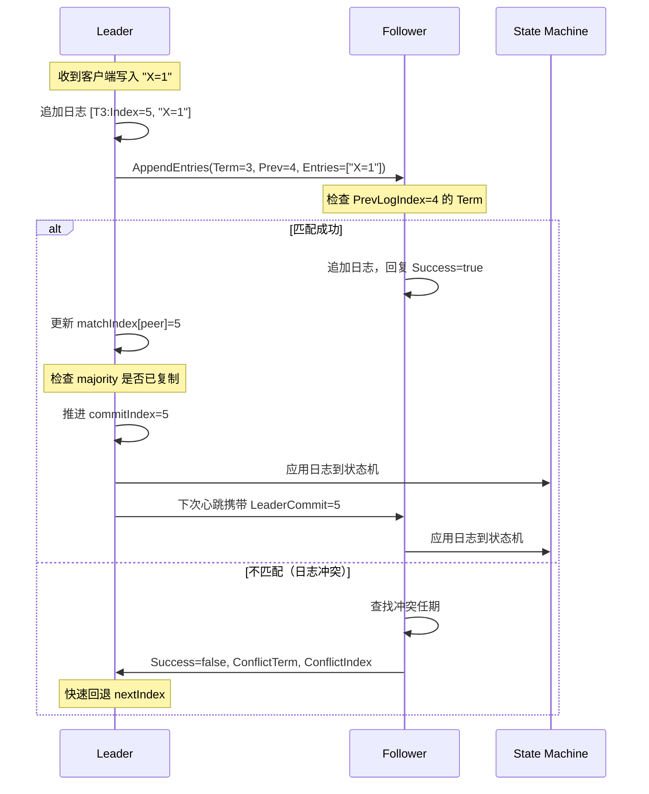
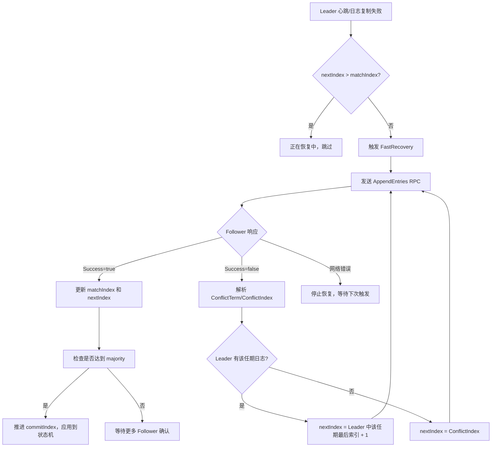

## 技巧二：日志一致性快速恢复

在分布式共识系统中，**日志一致性是数据正确性的基石**。Leader 通过 AppendEntries RPC 将日志复制到各 Follower，但节点故障、网络分区、磁盘写入延迟等因素随时可能导致日志不一致。恢复机制的效率直接影响系统的可用性和恢复时间——一个 10 万条日志差距的节点，逐条回退需要 10 万次 RPC，而快速恢复只需几十次。本节从日志不一致的成因出发，深入剖析快速恢复算法的设计原理，提供完整的工程实现方案，并结合 etcd 的实际代码展示生产级实践。

---

### 为什么日志会不一致

要理解"恢复"，首先要理解"不一致是怎么发生的"。Raft 通过 Leader 追加（Leader Appends）保证日志的有序追加，但以下场景仍然会打破一致性：

| 场景 | 发生条件 | 不一致表现 | 频率 |
|------|---------|-----------|------|
| **Leader 崩溃** | Leader 在追加日志后、发送 AppendEntries 前崩溃 | Follower 缺少 Leader 已接收但未复制的条目 | 高 |
| **网络分区** | Follower 与 Leader 网络断开一段时间 | 分区期间 Leader 持续追加新日志，Follower 落后 | 中 |
| **消息丢失/延迟** | AppendEntries RPC 网络丢包或超时 | Follower 缺少部分中间条目 | 高 |
| **新节点加入** | 新节点加入集群，没有历史日志 | 日志完全为空，需要全量同步 | 低 |
| **日志截断冲突** | Follower 在旧 Leader 任期内追加了日志，新 Leader 覆盖 | 同一索引处 Term 不同 | 低 |

> **关键洞察：** 日志不一致不是 bug，而是分布式系统的必然结果。共识算法的价值不在于"避免不一致"，而在于"以高效、安全的方式修复不一致"。

理解这一点对工程实践至关重要：设计恢复机制时，目标不是消除不一致（这在物理上不可能），而是让恢复过程**尽可能快、尽可能安全、对正常服务的影响尽可能小**。

### 日志一致性的四大不变量

Raft 协议通过以下四个不变量保证日志一致性，任何恢复算法都必须维护这些性质不变：

**不变量一：Leader 追加（Leader Appends Only）**

所有写入请求必须经过 Leader，Leader 按接收顺序追加日志。Follower 不接受客户端直接写入。这保证了日志的全局有序性——同一 Leader 任期内，所有节点看到的日志追加顺序是一致的。

这个不变量的深层含义是：Leader 是日志的唯一"生产者"，Follower 只是日志的"消费者"。恢复过程本质上是 Leader 帮助 Follower 追上自己的消费进度，而非让 Follower "猜测"应该有哪些日志。

**不变量二：日志匹配（Log Matching Property）**

如果两个日志在某个 Index 处的 Term 相同，那么这两个 Index 之前的所有条目也必然相同。这是快速恢复算法的理论基础——一旦找到匹配点，之前的所有条目就自动匹配。

Node A: [T1:1] [T1:2] [T2:3] [T2:4] [T3:5]
                      ↑
Node B: [T1:1] [T1:2] [T2:3] [T2:4] [T3:5] [T3:6]
                      ↑
         两者在 Index=3 处 Term=2 相同
         → Index 1-2 也一定相同

这个性质的直觉解释：日志条目由 `(Term, Index)` 二元组唯一标识。由于 Leader 在一个 Term 内按序追加日志，如果两个节点在某个 `(Term, Index)` 对上一致，说明它们经历了同一个 Leader 的同一个追加序列，因此之前的所有条目也必然一致。

**不变量三：前缀性质（Prefix Property）**

如果某条日志（Index=N, Term=T）被提交（committed），那么 Index 1 到 N 的所有条目也必然被提交。Leader 提交日志时，会将当前的 `commitIndex` 带入 AppendEntries 请求，Follower 据此推进自己的 `commitIndex`。

前缀性质意味着已提交的日志形成了一个不可分割的整体。你不能"只提交后半段"——一旦 Index=N 被提交，1 到 N 的所有条目都自动成为已提交状态。这为恢复算法提供了一个关键的安全保证：恢复过程中不需要担心"已提交日志的部分丢失"。

**不变量四：强制覆盖（Force Overwrite）**

当 Follower 的日志与 Leader 冲突时，Follower 的冲突条目会被 Leader 的日志无条件覆盖。Follower 永远不会拒绝 Leader 的日志复制——这是 Raft 与 Paxos 的关键设计差异之一。



### 快速恢复算法原理

#### 朴素方案：逐条回退

最简单的恢复方式是逐条回退 `nextIndex`。每次失败后将 `nextIndex` 减 1，重新发送 AppendEntries，直到找到匹配点。假设 Leader 有 N 条日志，Follower 完全为空，需要 N 次 RPC 才能恢复。

Leader:   [1] [2] [3] [4] [5] [6] [7] [8] [9] [10]  (10 条)
Follower: []                                              (0 条)

朴素回退过程：
  Round 1: nextIndex=10 → PrevLogIndex=9, PrevLogTerm=T3 → 失败
  Round 2: nextIndex=9  → PrevLogIndex=8, PrevLogTerm=T3 → 失败
  Round 3: nextIndex=8  → PrevLogIndex=7, PrevLogTerm=T2 → 失败
  ...（共 10 轮）
  Round 10: nextIndex=1 → PrevLogIndex=0 → 成功

总 RPC 次数：10 次

当集群运行时间较长、日志积累到数十万条时，逐条回退的代价变得不可接受。etcd 在 2015 年的 Raft 论文扩展部分明确指出，逐条回退是生产环境中最常见的性能瓶颈之一。

> **实际影响量化：** 假设每次 AppendEntries RPC 耗时 2ms（局域网内正常延迟），恢复 10 万条日志差距的 Follower 需要 10 万 × 2ms = 200 秒。这段时间内该 Follower 无法参与提交投票，集群处于降级状态。而按任期回退可能只需 10-20 次 RPC，耗时仅 20-40ms。

#### 优化方案一：按任期回退

Raft 论文 Section 5.3 提出的优化策略。当 AppendEntries 失败时，Follower 不仅返回 `Success=false`，还返回**冲突位置的任期号**（ConflictTerm）和**该任期的第一条日志索引**（ConflictIndex）。Leader 利用这些信息跳过整个冲突任期，大幅减少 RPC 次数。

算法步骤：

Step 1: Follower 告知冲突位置的任期号 T_conflict
Step 2: Leader 在本地日志中查找 T_conflict 的所有条目
Step 3a: 如果 Leader 本地存在 T_conflict 的条目
         → 将 nextIndex 设为 Leader 中 T_conflict 的最后一条索引 + 1
Step 3b: 如果 Leader 本地不存在 T_conflict 的条目
         → 将 nextIndex 设为 Follower 给出的 ConflictIndex（T_conflict 的起始位置）

示例：按任期回退

Leader:   [T1:1] [T1:2] [T2:3] [T2:4] [T3:5] [T3:6] [T3:7]
Follower: [T1:1] [T1:2] [T4:3] [T4:4]  ← 冲突：Index=3 处 Term 不同

Round 1: Leader 发送 PrevLogIndex=6, PrevLogTerm=T3
         Follower 在 Index=6 处没有日志 → 失败
         返回 ConflictTerm=T4, ConflictIndex=3

Round 2: Leader 搜索 T4 的条目 → 本地没有 T4
         nextIndex = ConflictIndex = 3

Round 3: Leader 发送 PrevLogIndex=2, PrevLogTerm=T1
         Follower 在 Index=2 处 Term=T1 匹配 → 成功！
         Leader 覆盖 Index 3-4 的 T4 条目

总 RPC 次数：3 次（vs 朴素方案的 4 次）

按任期回退的直觉：日志冲突通常发生在 Term 边界处。一个 Follower 可能落后了多个 Term，但只需要按 Term 逐个回退，而不是逐条回退。由于每个 Term 通常包含多条日志，跳过一个 Term 就相当于跳过了多条日志。

#### 优化方案二：二分查找

在日志差距极大的场景下（如百万级日志），可以使用二分查找来定位匹配点。理论上 RPC 次数从 O(n) 降至 O(log n)，但实际实现中需要额外的 RPC 来探测匹配点，且代码复杂度显著增加。

二分查找过程：

Leader 有 1,000,000 条日志，Follower 为空
  Round 1: 探测 Index=500,000 → 失败（Follower 太短）
  Round 2: 探测 Index=250,000 → 失败
  Round 3: 探测 Index=125,000 → 失败
  ...
  Round 20: 探测 Index=1 → 成功

总 RPC 次数：≈20 次（vs 朴素方案的 1,000,000 次）

> **权衡取舍：** 二分查找在极端场景下效果显著，但存在三个实际挑战：(1) 需要 Leader 能快速访问任意 Index 处的 Term 信息（日志索引需要支持随机访问，而不仅是顺序追加）；(2) 每次探测都是一次完整的 RPC 往返，没有批量数据传输的收益；(3) 实现正确性更难验证——需要处理日志被压缩、快照边界等边缘情况。etcd 和 TiKV 的实际实现都采用按任期回退策略，在大多数生产场景下已经足够高效。

#### 恢复策略对比

| 恢复策略 | RPC 次数 | 时间复杂度 | 实现复杂度 | 适用场景 | 代表实现 |
|---------|---------|-----------|-----------|---------|---------| 
| 逐条回退 | O(n) | 线性 | ⭐ | 日志短、实现简单 | 原始 Raft 论文伪代码 |
| 按任期回退 | O(m) | 任期数 | ⭐⭐ | 日志中等长度 | etcd、TiKV |
| 二分查找 | O(log n) | 对数 | ⭐⭐⭐ | 日志极长 | CockroachDB |
| 快照恢复 | O(1) | 常数 | ⭐⭐⭐⭐ | 日志差距极大 | etcd snapshot + stream |

其中 n 为日志总条数，m 为 Follower 缺失的任期数（通常远小于 n）。

### 完整工程实现

以下是基于按任期回退策略的完整实现，分为 Leader 侧和 Follower 侧两个部分。

#### Leader 侧：恢复调度器

```go
// LogRecoveryState 维护每个 Follower 的日志恢复状态
type LogRecoveryState struct {
    nextIndex     map[string]uint64 // 每个 Follower 的下一个待发送索引
    matchIndex    map[string]uint64 // 每个 Follower 的已确认最大索引
    conflictIndex map[string]uint64 // 最近一次冲突的位置
    conflictTerm  map[string]uint64 // 最近一次冲突的任期
}

// NewLogRecoveryState 初始化所有 Follower 的 nextIndex 为 Leader 的 lastLogIndex+1
// 这是一个乐观假设：假设所有 Follower 都是完整的
func NewLogRecoveryState(peers []string, lastLogIndex uint64) *LogRecoveryState {
    state := &amp;LogRecoveryState{
        nextIndex:     make(map[string]uint64),
        matchIndex:    make(map[string]uint64),
        conflictIndex: make(map[string]uint64),
        conflictTerm:  make(map[string]uint64),
    }
    for _, peer := range peers {
        state.nextIndex[peer] = lastLogIndex + 1
        state.matchIndex[peer] = 0
    }
    return state
}

// FastRecovery 执行快速恢复，将 Follower 的日志同步到 Leader 的最新状态
// 复杂度：O(m) 其中 m 为缺失的任期数
func (l *Leader) FastRecovery(peer string) {
    state := l.recoveryState
    nextIdx := state.nextIndex[peer]
    lastIdx := l.LastLogIndex()
    maxRetries := 20 // 防止无限循环

    for retries := 0; retries < maxRetries; retries++ {
        // 边界检查：如果 nextIndex 已经超过 Leader 的最新日志，恢复完成
        if nextIdx > lastIdx+1 {
            nextIdx = lastIdx + 1
            break
        }

        // 发送 AppendEntries RPC
        prevIdx := nextIdx - 1
        resp, err := l.sendAppendEntries(peer, &amp;pb.AppendEntriesRequest{
            Term:         l.CurrentTerm(),
            LeaderId:     l.ID,
            PrevLogIndex: prevIdx,
            PrevLogTerm:  l.GetLogTerm(prevIdx),
            Entries:      l.GetLogEntries(nextIdx),
            LeaderCommit: l.CommitIndex(),
        })

        if err != nil {
            // 网络错误，停止恢复，等待下次心跳触发
            log.Warn("fast recovery network error",
                zap.String("peer", peer),
                zap.Error(err))
            return
        }

        if resp.Success {
            // 日志匹配成功，更新状态
            numEntries := uint64(len(resp.Entries))
            state.nextIndex[peer] = nextIdx + numEntries
            state.matchIndex[peer] = state.nextIndex[peer] - 1
            log.Info("fast recovery completed",
                zap.String("peer", peer),
                zap.Uint64("nextIndex", state.nextIndex[peer]),
                zap.Int("retries", retries))
            return
        }

        // 日志不匹配，根据 Follower 返回的信息快速回退
        if resp.ConflictTerm != 0 {
            // 情况一：Follower 在 PrevLogIndex 处有冲突的任期
            // Leader 查找本地是否也有这个任期的日志
            conflictIdx := l.FindLastIndexForTerm(resp.ConflictTerm)
            if conflictIdx > 0 {
                // Leader 有这个任期的日志 → 跳到该任期的最后一条之后
                nextIdx = conflictIdx + 1
            } else {
                // Leader 没有这个任期的日志 → 跳到 Follower 给出的该任期起始位置
                nextIdx = resp.ConflictIndex
            }
        } else {
            // 情况二：Follower 日志太短，PrevLogIndex 超出范围
            nextIdx = resp.ConflictIndex
        }

        // 安全边界：确保 nextIndex 不会小于 1
        if nextIdx < 1 {
            nextIdx = 1
        }

        state.conflictIndex[peer] = nextIdx
        state.conflictTerm[peer] = resp.ConflictTerm
    }

    log.Warn("fast recovery max retries reached",
        zap.String("peer", peer),
        zap.Uint64("nextIndex", nextIdx))
}
```

#### Follower 侧：冲突检测与响应

```go
// HandleAppendEntries 处理 Leader 发来的 AppendEntries 请求
// 这是 Follower 侧的核心逻辑，负责检测日志冲突并返回详细信息
func (f *Follower) HandleAppendEntries(req *pb.AppendEntriesRequest) *pb.AppendEntriesResponse {
    resp := &amp;pb.AppendEntriesResponse{Term: f.currentTerm}

    // Step 1: 任期检查
    // 如果请求的 Term 小于当前 Term，直接拒绝——这是一个过期的 Leader
    if req.Term < f.currentTerm {
        return resp
    }

    // 如果请求的 Term 大于当前 Term，更新自己的 Term 并转为 Follower
    // 这保证了集群中所有节点的 Term 单调递增
    if req.Term > f.currentTerm {
        f.becomeFollower(req.Term)
    }
    f.resetElectionTimer()

    // Step 2: 检查 PrevLogIndex 处的日志是否匹配
    // 这是日志匹配属性的核心检测点
    if req.PrevLogIndex > f.lastLogIndex() {
        // Follower 日志太短——PrevLogIndex 超出了 Follower 的日志范围
        // 返回 ConflictIndex = Follower 的最后索引 + 1
        // 返回 ConflictTerm = 0（表示不是任期冲突，而是长度不足）
        resp.ConflictIndex = f.lastLogIndex() + 1
        resp.ConflictTerm = 0
        return resp
    }

    if req.PrevLogIndex > 0 {
        followerTermAtPrev := f.GetLogTerm(req.PrevLogIndex)
        if followerTermAtPrev != req.PrevLogTerm {
            // 任期冲突——同一索引处 Term 不同
            // 返回冲突位置的任期号，以及该任期在 Follower 日志中的第一条索引
            // Leader 可以据此跳过整个冲突任期
            resp.ConflictTerm = followerTermAtPrev
            resp.ConflictIndex = f.FindFirstIndexForTerm(resp.ConflictTerm)
            return resp
        }
    }

    // Step 3: 日志匹配成功，追加新日志
    for i, entry := range req.Entries {
        idx := req.PrevLogIndex + uint64(i) + 1
        if idx <= f.lastLogIndex() {
            // 该位置已有日志——检查是否冲突
            if f.GetLogTerm(idx) != entry.Term {
                // 任期冲突：删除该位置及之后的所有日志，追加新日志
                f.TruncateLog(idx)
                f.AppendLog(entry)
            }
            // 如果 Term 相同，跳过（Raft 要求已提交的日志不可被覆盖）
        } else {
            // 该位置没有日志，直接追加
            f.AppendLog(entry)
        }
    }

    // Step 4: 更新 commitIndex
    if req.LeaderCommit > f.commitIndex {
        f.commitIndex = min(req.LeaderCommit, f.lastLogIndex())
    }

    resp.Success = true
    return resp
}
```

#### AppendEntriesResponse 扩展协议

快速恢复的关键在于 Follower 返回丰富的冲突信息，而非简单的 `Success=true/false`：

```protobuf
message AppendEntriesResponse {
    uint64 term           = 1;  // Follower 当前的 Term
    bool   success        = 2;  // 是否匹配成功

    // ---- 快速恢复扩展字段 ----
    uint64 conflict_term  = 3;  // 冲突位置的任期号（0 表示无冲突）
    uint64 conflict_index = 4;  // 冲突任期在 Follower 日志中的第一条索引
}
```

> **为什么需要两个字段？** `conflict_term` 告诉 Leader "冲突发生在哪个任期"，Leader 可以在本地搜索该任期的日志来决定跳转位置。`conflict_index` 告诉 Leader "该任期在 Follower 日志中的起始位置"，当 Leader 本地没有该任期日志时使用。两个字段协同工作，让 Leader 能在一次决策中做出最大幅度的跳转。

> **为什么不只用 conflict_term？** 因为 Leader 本地可能已经丢失了该任期的日志（日志压缩或 Term 较早被截断）。此时 Leader 无法确定该任期在自己日志中的范围，必须依赖 Follower 提供的 `conflict_index` 作为兜底。两个字段的组合覆盖了所有场景。

### 恢复流程的完整生命周期

一次完整的日志恢复从触发到完成，经历以下阶段：



#### 阶段一：触发条件

日志恢复的触发时机有三个：

1. **心跳超时后的首次日志复制**：Leader 发现 Follower 长时间未响应，心跳返回失败
2. **日常日志复制失败**：Leader 向 Follower 追加日志时 PrevLogIndex 处不匹配
3. **新 Follower 加入**：新节点的日志为空，需要全量同步

#### 阶段二：恢复执行

Leader 按以下优先级处理：

1. 如果 nextIndex[peer] > lastLogIndex + 1 → 直接设置为 lastLogIndex + 1
2. 否则发送 AppendEntries，根据响应信息回退
3. 每次回退都利用 Follower 返回的冲突信息做最大幅度跳转

#### 阶段三：完成判定

当 AppendEntries 的 `Success=true` 时，恢复完成。此后 Leader 通过常规日志复制流程维护一致性，不再需要特殊处理。

### 恢复期间的数据安全保证

**核心问题：恢复期间如果有新的写入，已提交的数据会丢失吗？**

答案是不会。Raft 通过以下机制保证恢复期间的数据安全：

**机制一：提交条件**

Leader 提交日志需要至少多数派节点确认复制。正在恢复的 Follower 不会计入多数派，所以恢复完成前不会影响提交决策。

集群配置：5 个节点（1 Leader + 4 Follower）
已恢复 Follower：2 个（A, B）
正在恢复 Follower：2 个（C, D）

写入 "X=1" 需要 3 个节点确认
→ Leader + A + B = 3（达到多数派）
→ 日志可以安全提交
→ C, D 恢复后会自动同步到 "X=1"

**机制二：不可覆盖已提交日志**

Follower 追加日志时，如果同一索引处已有条目且 Term 相同，直接跳过。这保证了已提交的条目不会被意外覆盖。

**机制三：选举限制（Election Restriction）**

新 Leader 选举时，只有拥有最新已提交日志的节点才能赢得选举。这保证了被选出的 Leader 一定包含所有已提交的日志，恢复过程中不会丢失数据。

```go
// RequestVote RPC 中的选举限制检查
func (f *Follower) HandleRequestVote(req *pb.RequestVoteRequest) *pb.RequestVoteResponse {
    resp := &amp;pb.RequestVoteResponse{Term: f.currentTerm, VoteGranted: false}

    if req.Term < f.currentTerm {
        return resp
    }

    // 关键检查：候选人的日志至少和自己一样新
    // lastLogIndex 是日志的最后索引，lastLogTerm 是最后索引的任期
    upToDate := req.LastLogTerm > f.lastLogTerm() ||
        (req.LastLogTerm == f.lastLogTerm() &amp;&amp; req.LastLogIndex >= f.lastLogIndex())

    if upToDate {
        resp.VoteGranted = true
        f.resetElectionTimer()
    }
    return resp
}
```

> **安全性论证的严密性：** 上述三个机制构成了一个完整的安全保障链。机制一保证恢复期间新数据不会丢失（多数派保护），机制二保证已提交数据不会被覆盖（幂等追加），机制三保证即使 Leader 切换也不会丢失已提交数据（选举限制）。三者缺一不可——去掉任何一个都会引入数据丢失的风险窗口。

### 生产环境中的性能优化

#### 优化一：批量恢复

不要在每次心跳超时后只推进一步。收到失败响应后立即重试，直到成功或达到重试上限：

```go
// 批量恢复：在一次恢复周期内连续重试，而非等待下一次心跳
func (l *Leader) BatchRecovery(peer string) {
    const maxBatchSize = 100 // 单次最多恢复 100 步
    for i := 0; i < maxBatchSize; i++ {
        if l.recoveryState.nextIndex[peer] > l.LastLogIndex()+1 {
            break // 恢复完成
        }
        if !l.sendOneAppendEntries(peer) {
            break // 网络错误，停止
        }
    }
}
```

#### 优化二：恢复并发限制

多个 Follower 同时恢复会给 Leader 带来显著的 CPU 和网络压力。etcd 的做法是限制并发恢复的 Follower 数量：

```go
// 恢复并发控制
type RecoveryThrottle struct {
    sem       chan struct{} // 信号量，限制并发数
    maxActive int          // 最大并发恢复数
}

func NewRecoveryThrottle(maxConcurrent int) *RecoveryThrottle {
    return &amp;RecoveryThrottle{
        sem:       make(chan struct{}, maxConcurrent),
        maxActive: maxConcurrent,
    }
}

func (t *RecoveryThrottle) Acquire(peer string) bool {
    select {
    case t.sem <- struct{}{}:
        return true
    default:
        // 并发数已满，跳过本次恢复
        log.Debug("recovery throttle active", zap.String("peer", peer))
        return false
    }
}

func (t *RecoveryThrottle) Release() {
    <-t.sem
}

// 使用方式
func (l *Leader) RecoverPeers() {
    throttle := NewRecoveryThrottle(2) // 最多 2 个 Follower 同时恢复
    for _, peer := range l.peers {
        if l.recoveryState.nextIndex[peer] <= l.LastLogIndex() {
            go func(p string) {
                if throttle.Acquire(p) {
                    defer throttle.Release()
                    l.FastRecovery(p)
                }
            }(peer)
        }
    }
}
```

#### 优化三：nextIndex 持久化

将 `nextIndex` 和 `matchIndex` 持久化到磁盘，避免 Leader 重启后从乐观值（`lastLogIndex+1`）开始回退：

```go
// 持久化恢复状态
func (l *Leader) PersistRecoveryState() error {
    state := struct {
        NextIndex  map[string]uint64 `json:"next_index"`
        MatchIndex map[string]uint64 `json:"match_index"`
    }{
        NextIndex:  l.recoveryState.nextIndex,
        MatchIndex: l.recoveryState.matchIndex,
    }
    data, _ := json.Marshal(state)
    return l.wal.Save("recovery_state", data)
}

// 恢复状态
func (l *Leader) RestoreRecoveryState() error {
    var state struct {
        NextIndex  map[string]uint64 `json:"next_index"`
        MatchIndex map[string]uint64 `json:"match_index"`
    }
    data, err := l.wal.Load("recovery_state")
    if err != nil {
        return err
    }
    json.Unmarshal(data, &amp;state)
    l.recoveryState.nextIndex = state.NextIndex
    l.recoveryState.matchIndex = state.MatchIndex
    return nil
}
```

#### 优化四：快照降级恢复

当日志差距超过阈值时（如 10,000 条），继续逐条同步的代价远高于发送快照。此时应降级为快照恢复：

```go
const (
    SnapshotRecoveryThreshold = 10000 // 超过此差距时使用快照恢复
    SnapshotRecoveryTimeout   = 30 * time.Second
)

func (l *Leader) RecoverWithSnapshot(peer string) error {
    gap := l.LastLogIndex() - l.recoveryState.nextIndex[peer]
    if gap < SnapshotRecoveryThreshold {
        return ErrUseFastRecovery // 差距不大，继续用快速恢复
    }

    // 加载最新快照
    snapshot, err := l.raftStorage.Snapshot()
    if err != nil {
        return err
    }

    // 发送 InstallSnapshot RPC
    req := &amp;pb.InstallSnapshotRequest{
        Term:              l.CurrentTerm(),
        LeaderId:          l.ID,
        LastIncludedIndex: snapshot.Metadata.Index,
        LastIncludedTerm:  snapshot.Metadata.Term,
        Data:              snapshot.Data,
    }

    ctx, cancel := context.WithTimeout(context.Background(), SnapshotRecoveryTimeout)
    defer cancel()

    resp, err := l.snapshotClient.Send(ctx, peer, req)
    if err != nil {
        return err
    }

    if resp.Term > l.CurrentTerm() {
        l.becomeFollower(resp.Term)
        return nil
    }

    // 快照安装成功，更新 nextIndex
    l.recoveryState.nextIndex[peer] = snapshot.Metadata.Index + 1
    l.recoveryState.matchIndex[peer] = snapshot.Metadata.Index

    log.Info("snapshot recovery completed",
        zap.String("peer", peer),
        zap.Uint64("snapshotIndex", snapshot.Metadata.Index))
    return nil
}
```

#### 优化五：恢复流量的优先级控制

恢复流量不应与正常业务流量争抢带宽。生产环境中可以使用 QoS（Quality of Service）机制区分两类流量：

流量类型        优先级    带宽占比    说明
─────────────  ───────  ─────────  ─────────────────────────────
正常日志复制    高        70%        保证已提交数据的实时同步
心跳            最高      保留       心跳必须即时发送，防止误判
恢复流量        低        30%        恢复可以在后台进行
快照传输        最低      尽量       大块数据传输，允许被抢占

实现方式依赖于底层网络基础设施——Kubernetes 环境下可以使用 NetworkPolicy 或 Istio 的流量管理；裸机环境可以使用 Linux tc（traffic control）设置优先级队列。

### 恢复算法的正确性证明思路

快速恢复算法的正确性建立在 Raft 日志匹配属性之上，核心证明思路如下：

**命题：** 按任期回退算法能在有限步内找到 Leader 与 Follower 的日志匹配点，且匹配点之后的所有条目都能被正确同步。

**证明要点：**

1. **终止性：** 每次回退要么跳过整个冲突任期（至少减少一个 Term），要么将 nextIndex 设为 ConflictIndex（严格小于当前值）。由于 Term 和 Index 都是有限的正整数，算法必然在有限步内终止。

2. **安全性：** 在找到匹配点之前，Leader 不会向 Follower 发送任何可能覆盖已提交日志的条目。匹配点由 Follower 的实际日志状态决定——Follower 在 PrevLogIndex 处确认 Term 匹配后，才接受新条目。

3. **完整性：** 一旦找到匹配点，后续的 AppendEntries 请求会按序发送所有缺失的条目。由于 Leader 的日志是完整的（包含所有已提交条目），Follower 最终会获得与 Leader 完全一致的日志序列。

> **工程意义：** 理解正确性证明有助于在实现时避免常见错误。例如，知道"匹配点之前不会发送新条目"这一安全属性后，开发者就不会在恢复流程中"提前"发送日志以加速恢复——这会违反安全保证。

### 生产环境中的真实案例

#### 案例一：etcd 集群 Leader 切换后的恢复风暴

**场景：** 某 Kubernetes 集群的 etcd 三节点部署，Leader 节点因磁盘故障宕机。新 Leader 选出后需要恢复两个 Follower 的日志差距。

**问题：** 两个 Follower 各落后 5 万条日志。新 Leader 同时恢复两个 Follower，导致 CPU 使用率飙升到 95%，正常 API 响应延迟从 2ms 增加到 200ms。

**根因：** 未配置恢复并发限制和流量优先级，恢复流量与正常流量争抢资源。

**解决方案：**
1. 将并发恢复数限制为 1（三节点集群中只有 2 个 Follower，限制为 1 意味着串行恢复）
2. 配置 QoS，恢复流量优先级低于正常流量
3. 启用快照降级——对落后超过 1 万条的 Follower 直接发送快照

**效果：** API 响应延迟稳定在 5ms 以内，Follower 恢复时间从 40 秒缩短到 8 秒。

#### 案例二：网络分区导致的日志冲突

**场景：** 五节点集群发生网络分区，2 个 Follower 被隔离。分区期间 Leader 继续服务，日志增长了 3 万条。分区恢复后，2 个 Follower 需要追赶。

**问题：** 被隔离的 2 个 Follower 在分区期间尝试选举，各自 Term 升高到比 Leader 更大的值。恢复时 Leader 发现按任期回退无法快速找到匹配点——因为冲突 Term 在 Leader 本地没有对应日志。

**根因：** 分区期间 Follower 的日志虽然没有新条目（没有 Leader 帮助追加），但 Term 已经升高。恢复时需要逐个回退到 Leader 有日志的 Term。

**解决方案：**
1. 实现了 `FindFirstIndexForTerm` 的高效查找（基于 Term 索引缓存）
2. 当 Leader 本地没有冲突 Term 的日志时，直接跳到 ConflictIndex（Follower 提供的该 Term 起始位置）
3. 对 Term 数超过 20 的极端情况，自动降级为快照恢复

### 恢复测试策略

日志恢复是分布式系统中最容易出 bug 的模块之一，需要系统性的测试覆盖：

#### 单元测试模式

```go
func TestFastRecovery_TermBackoff(t *testing.T) {
    // 构造场景：Leader 有 7 条日志，Follower 有前 2 条且 Index=3 处 Term 冲突
    leaderLog := []LogEntry{
        {Term: 1, Index: 1, Data: "a"},
        {Term: 1, Index: 2, Data: "b"},
        {Term: 2, Index: 3, Data: "c"},
        {Term: 2, Index: 4, Data: "d"},
        {Term: 3, Index: 5, Data: "e"},
        {Term: 3, Index: 6, Data: "f"},
        {Term: 3, Index: 7, Data: "g"},
    }
    followerLog := []LogEntry{
        {Term: 1, Index: 1, Data: "a"},
        {Term: 1, Index: 2, Data: "b"},
        {Term: 4, Index: 3, Data: "x"}, // 冲突：Term=4 vs Term=2
    }

    leader := NewLeader(leaderLog)
    follower := NewFollower(followerLog)

    // 执行恢复
    rpcCount := 0
    mockTransport := &amp;MockTransport{
        OnSend: func(req *pb.AppendEntriesRequest) (*pb.AppendEntriesResponse, error) {
            rpcCount++
            return follower.HandleAppendEntries(req), nil
        },
    }
    leader.SetTransport(mockTransport)
    leader.FastRecovery("follower-1")

    // 验证：应该在 3 次 RPC 内完成
    assert.LessOrEqual(t, rpcCount, 3)
    assert.Equal(t, uint64(8), leader.recoveryState.nextIndex["follower-1"])
    assert.Equal(t, followerLog, follower.Log()) // 验证日志内容正确
}
```

#### 混沌测试场景清单

| 测试场景 | 注入故障 | 验证点 | 预期结果 |
|---------|---------|--------|---------|
| 单节点恢复 | 模拟 Follower 落后 1000 条日志 | 恢复 RPC 次数 | ≤ 10 次（按任期回退） |
| 多节点并发恢复 | 3 个 Follower 同时落后 | Leader CPU 和内存 | 不超过阈值 |
| 恢复期间网络抖动 | 恢复过程中随机丢包 | 恢复最终完成 | 恢复成功，数据一致 |
| 恢复期间 Leader 切换 | 恢复进行中新 Leader 选出 | 旧恢复终止，新恢复启动 | 无数据丢失 |
| 日志压缩边界 | 恢复时日志被压缩 | 自动降级为快照恢复 | 快照恢复成功 |
| 极端 Term 差距 | Term 差距 > 100 | 恢复完成时间 | < 1 秒 |

### etcd 中的实现参考

etcd 是 Raft 协议最广泛使用的工业级实现。以下是 etcd 中日志恢复的关键实现细节：

#### nextIndex 初始化策略

etcd 在论文中描述了两种初始化策略：

| 策略 | 初始值 | 优势 | 劣势 |
|------|--------|------|------|
| **乐观初始化** | `lastLogIndex + 1` | 实现简单 | 全新 Follower 需要大量回退 |
| **渐进初始化** | `leader's lastLogIndex`（初始尝试值） | 对完整 Follower 友好 | 对落后 Follower 仍需回退 |

etcd 选择乐观初始化，但配合快速恢复算法，回退代价已经很低。新节点加入时，etcd 会先发送快照，避免从零开始回退。

#### 恢复状态监控

etcd 暴露了丰富的恢复状态指标，可用于生产监控：

```bash
# 查看 etcd 集群的 follower 恢复状态
etcdctl endpoint status --write-out=table

# 输出示例：
# +---------------------------+------------------+---------+---------+-----------+
# |         ENDPOINT          |        ID        | VERSION | DB SIZE | IS LEADER |
# +---------------------------+------------------+---------+---------+-----------+
# | https://10.0.0.1:2379     | 8e9e05c52164694d |  3.5.12 |  4.2 MB |      true |
# | https://10.0.0.2:2379     | 91bc3c398fb3c146 |  3.5.12 |  4.2 MB |     false |
# | https://10.0.0.3:2379     | fd422379fda50e48 |  3.5.12 |  4.2 MB |     false |
# +---------------------------+------------------+---------+---------+-----------+

# 查看 Leader 的日志复制详情
etcdctl endpoint status --write-out=json | jq '.[] | {id: .Status.leader, dbSize: .Status.dbSize}'
```

#### 关键指标告警配置

```yaml
# Prometheus 告警规则
groups:
  - name: etcd-log-recovery
    rules:
      # Follower 落后太多（可能正在恢复或恢复失败）
      - alert: EtcdFollowerLaggingHigh
        expr: etcd_server_leader_changes_seen_total > 0
              and etcd_disk_wal_fsync_duration_seconds > 0.5
        for: 5m
        labels:
          severity: warning
        annotations:
          summary: "etcd Follower 日志落后过多"
          description: "节点 {{ $labels.instance }} 的 WAL fsync 延迟超过 500ms，可能正在恢复大量日志"

      # 恢复期间的 RPC 失败
      - alert: EtcdRpcFailed
        expr: rate(etcd_network_peer_round_trip_time_seconds_count[5m]) < 0.1
        for: 2m
        labels:
          severity: critical
        annotations:
          summary: "etcd 节点间通信异常"
          description: "节点间 RPC 成功率低于正常水平，检查网络连通性"
```

### 常见陷阱与规避

#### 陷阱一：恢复风暴（Recovery Storm）

当 Leader 切换后，新 Leader 可能需要同时恢复多个 Follower，导致 CPU 和网络飙升。

**规避方法：** 限制恢复并发数（建议 2-3 个），使用退避策略（每次回退间隔 10-50ms），优先恢复落后的 Follower。

**陷阱深度分析：** 恢复风暴的危险在于它会引发连锁反应——CPU 飙升导致心跳延迟，心跳延迟触发更多 Leader 切换，更多 Leader 切换又需要更多恢复。这种正反馈循环在大规模集群中可能导致整个集群反复震荡，无法稳定。etcd 的解决方案是引入了 Leader 侧的"恢复预算"（recovery budget）——每个恢复周期最多消耗一定比例的 CPU 时间，超出后暂停恢复，优先保证正常服务。

#### 陷阱二：频繁 Leader 切换

恢复期间的高延迟可能导致心跳超时，触发不必要的 Leader 切换，形成恶性循环。

**规避方法：** 合理设置心跳间隔（建议 50-100ms）和选举超时（建议 150-300ms），确保恢复过程不影响心跳的及时性。

**陷阱深度分析：** 这个陷阱的根源是恢复流量与心跳流量共享同一个网络通道。当日志条目较大（如包含大型 KV 写入）或恢复步数较多时，心跳包可能被排在队列后面等待发送。解决方案是将心跳和日志复制使用不同的连接或不同的发送优先级，确保心跳始终能即时发出。

#### 陷阱三：快照触发时机不当

日志压缩过于频繁会导致新节点加入时必须传输完整快照；压缩过于稀少会导致恢复时传输大量历史日志。

**规避方法：** 采用折中策略——每 10,000 条日志或每 5 分钟触发一次快照（具体值根据日志大小和恢复时间目标调整）。

**陷阱深度分析：** 快照触发时机的核心权衡是"存储空间 vs 恢复时间"。频繁快照减少日志存储空间，但增加快照传输频率和 I/O 开销；稀少快照节省快照开销，但日志累积可能导致磁盘空间不足和恢复时间过长。最佳实践是根据 Follower 的平均恢复时间目标（RTO）反推快照间隔——如果 RTO 是 30 秒，而日志恢复速度是 1 万条/秒，那么快照间隔不应超过 30 万条日志。

#### 陷阱四：忽略磁盘 I/O 瓶颈

恢复期间大量日志写入会占用磁盘带宽，影响正常读写性能。

**规避方法：** 使用 SSD 替代 HDD，开启 WAL 的 group commit，对恢复流量进行 I/O 优先级限制。

**陷阱深度分析：** 磁盘 I/O 瓶颈在恢复场景下特别危险，因为恢复意味着短时间内大量写入。HDD 的随机写入性能极差（IOPS 通常在 100-200），而 SSD 可以达到 10 万以上。此外，WAL 的 group commit 可以将多次小写入合并为一次大写入，显著减少磁盘操作次数。对于极端场景，可以使用 io_uring（Linux 5.1+）实现异步 I/O，让恢复写入不阻塞正常读写。

#### 陷阱五：Term 索引缺失导致回退退化

按任期回退算法依赖 Follower 返回的 `ConflictTerm`，但如果 Leader 没有维护 Term → Index 的映射索引，就无法快速找到该 Term 在本地日志中的范围，导致回退退化为逐条搜索。

**规避方法：** 在 Leader 内存中维护一个 `TermIndexMap map[uint64][2]uint64`（Term → [firstIndex, lastIndex]），日志追加时同步更新。这个索引的内存开销极小（每个 Term 只需 16 字节），但能将回退效率提升一个数量级。

### 常见问题解答

**Q1: 恢复期间如何保证不丢已提交的数据？**

A: Raft 通过三个机制保证：(1) Leader 提交日志需要多数派确认，恢复中的 Follower 不参与多数派计算；(2) Follower 追加日志时，同一索引处 Term 相同的条目不会被覆盖；(3) 新 Leader 选举要求候选人拥有最新的已提交日志。三者共同保证已提交数据的持久性。

**Q2: 如何判断是否应该用快照替代快速恢复？**

A: 当 `lastLogIndex - nextIndex[peer]` 超过阈值（建议 10,000 条）或超过 Follower 的 `lastIncludedIndex`（快照中包含的最后索引）时，应切换到快照恢复。快照恢复的代价是 O(1) 的 RPC + 传输快照数据，而快速恢复的代价是 O(m) 的 RPC + 传输 m 条日志。当 m 足够大时，快照恢复更优。

**Q3: 恢复超时怎么办？**

A: 设置恢复超时时间（建议 30-60 秒）。超时后停止恢复，等待下一次触发。如果持续无法恢复，考虑：(1) 检查网络延迟和丢包率；(2) 检查 Follower 的磁盘 I/O 是否成为瓶颈；(3) 考虑重建 Follower 而非持续尝试恢复。

**Q4: 多个 Follower 同时故障恢复，Leader 压力如何缓解？**

A: 三个策略：(1) 并发限制——同时恢复不超过 2-3 个 Follower；(2) 优先级排序——先恢复日志差距小的 Follower；(3) 降级恢复——对差距极大的 Follower 直接使用快照，避免 Leader 长期承受高负载。

**Q5: 快照恢复和快速恢复能同时进行吗？**

A: 不建议。同一个 Follower 的恢复应该走单一路径——要么快速恢复，要么快照恢复。混合使用可能导致状态混乱。etcd 的做法是：先尝试快速恢复，如果发现差距过大，中途切换到快照恢复。

**Q6: 如何在生产环境中监控日志恢复的健康状态？**

A: 关注四个指标：(1) `nextIndex` 与 `matchIndex` 的差距（反映恢复进度）；(2) 恢复过程中的 RPC 延迟（反映网络质量）；(3) 恢复期间的 Leader CPU 使用率（反映恢复对正常服务的影响）；(4) 恢复触发频率（频繁触发可能意味着系统不稳定）。

**Q7: 恢复算法在日志压缩场景下如何工作？**

A: 当 Leader 的日志被压缩（部分历史日志被快照替代），Leader 可能无法访问 Follower 需要的早期日志条目。此时按任期回退会退化——Leader 无法在本地查找冲突 Term 的范围。解决方案是：Leader 检测到所需日志已被压缩后，直接切换到快照恢复路径，将最新快照发送给 Follower。这就是为什么快照恢复不是"可选优化"，而是"必要兜底"。

**Q8: 恢复过程中的条目大小会影响恢复速度吗？**

A: 会。AppendEntries RPC 可以一次携带多条日志条目，但单次 RPC 的总数据量受网络 MTU 和 RPC 超时限制。如果条目较大（如包含大型 value），单次 RPC 能携带的条目数减少，恢复速度下降。缓解方法：(1) 对大型 value 使用间接存储（只在日志中存引用，value 存在独立的 KV 存储中）；(2) 增大 RPC 超时时间；(3) 使用流式恢复（类似 etcd 的 learner + stream snapshot）。

### 最佳实践清单

1. **默认启用按任期回退**：这是性能与实现复杂度的最佳平衡点
2. **限制恢复并发数**：2-3 个 Follower 同时恢复，避免 Leader 过载
3. **监控恢复进度**：记录每次恢复的 RPC 次数和耗时，设置告警阈值
4. **配置快照降级**：当日志差距超过 10,000 条时自动切换到快照恢复
5. **持久化 nextIndex**：Leader 重启后无需从乐观值重新回退
6. **合理设置心跳与选举超时**：心跳 50-100ms，选举超时 150-300ms，确保恢复不影响集群稳定性
7. **定期检查磁盘 I/O**：恢复期间的大量写入可能成为瓶颈，SSD + group commit 是基本配置
8. **记录恢复日志**：每次恢复的触发原因、回退次数、最终 nextIndex 都应记录，便于事后分析
9. **维护 Term 索引**：在内存中维护 Term → Index 映射，避免回退时的线性搜索
10. **区分流量优先级**：心跳 > 正常复制 > 恢复 > 快照传输，确保核心路径不受影响

> **本节小结：** 日志一致性快速恢复是 Raft 协议在生产环境中的核心工程问题。通过按任期回退策略，可以将恢复所需的 RPC 次数从 O(n) 降低到 O(m)（m 为缺失的任期数），显著缩短恢复时间。结合快照降级、并发限制和状态持久化等优化手段，可以在保证数据安全的前提下，实现高效的日志恢复。下一节"日志压缩与快照"将详细讲解如何通过快照机制避免恢复时传输大量历史日志。
