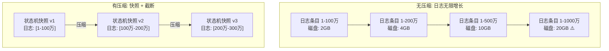
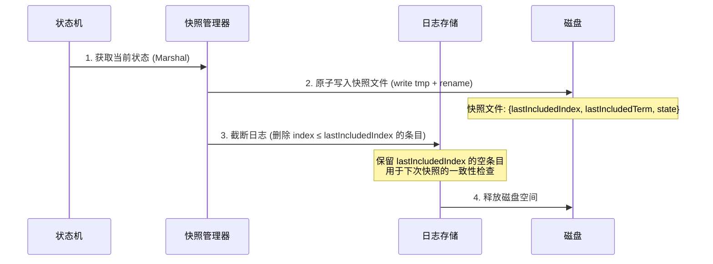
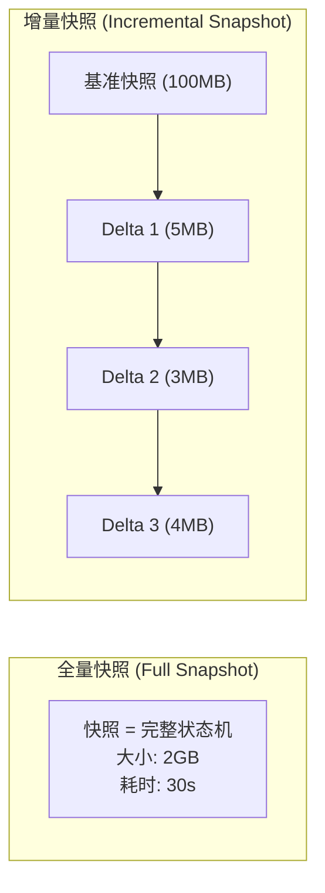
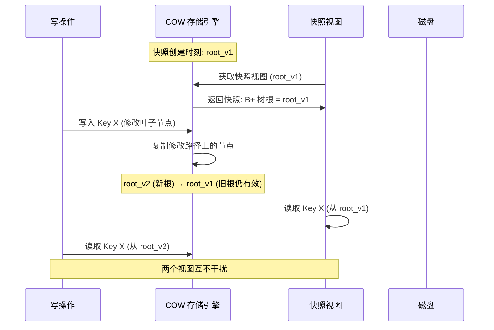
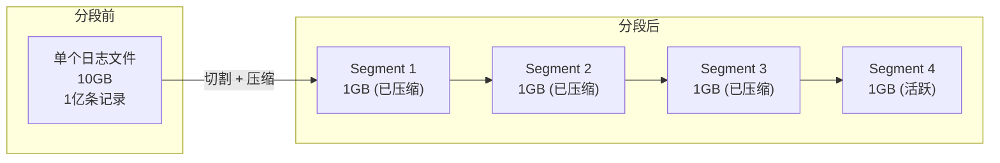
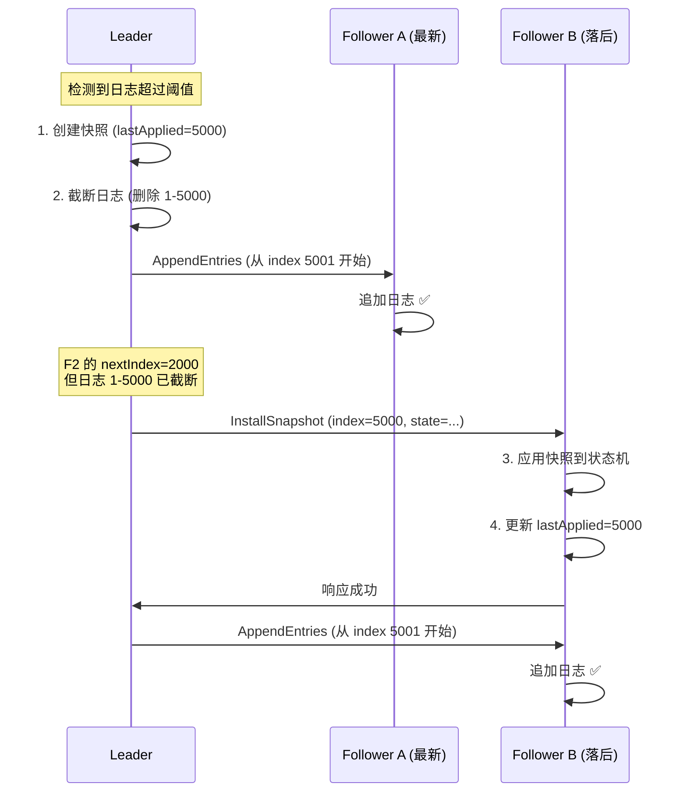
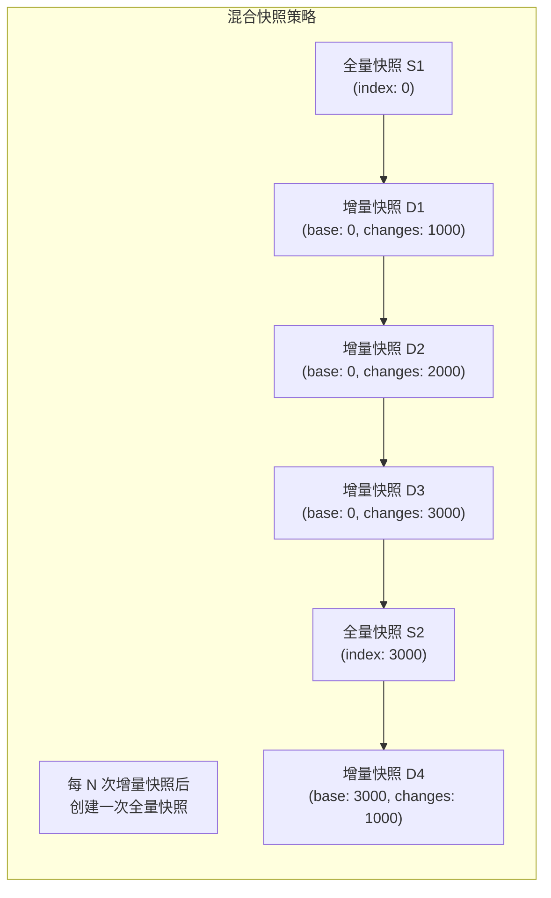

## 技巧三：日志压缩与快照

> 在分布式共识系统中，日志是保证一致性的核心数据结构。然而，日志会随时间无限增长——每一条客户端写入都会追加一条日志条目。如果不加控制，日志膨胀将引发致命问题。日志压缩与快照机制正是解决这些问题的关键技术。

**本节学习目标：**

1. 理解日志无限增长带来的三类核心问题及其量化影响
2. 掌握日志压缩的三条安全性约束及背后的理论依据
3. 能够实现全量快照、增量快照、分段压缩三种核心策略
4. 理解 Copy-on-Write 快照的工作原理和工程实现
5. 掌握 Raft 协议中快照与 InstallSnapshot RPC 的完整交互流程
6. 能够在生产环境中配置 etcd 自动压缩、监控快照健康状态、排查常见故障

---

### 为什么需要日志压缩

日志是分布式共识系统的"记忆"。Raft 通过 AppendEntries RPC 将每条客户端命令追加到所有节点的日志中，Follower 收到后应用到状态机，从而保证所有节点最终达到一致状态。但这条设计带来一个根本性矛盾：**日志只增不删，而磁盘空间有限**。

日志膨胀引发三个致命问题，每一个都有精确的量化影响：

**问题一：磁盘空间耗尽**

假设每条日志条目 200 字节，写入速率 5000 ops/s：
- 1 小时产生 1800 万条日志，占用约 3.6 GB
- 1 天产生 4.32 亿条日志，占用约 86.4 GB
- 1 周占用约 600 GB

对于 Kubernetes 控制面的 etcd 集群，默认的 8GB 存储配额可能在数小时内耗尽，导致整个集群不可用。

**问题二：恢复时间爆炸**

新节点加入或故障节点重启时，需要从 Leader 同步全部缺失日志。假设日志有 1000 万条，按每秒 5000 条的同步速率，仅日志恢复就需要 33 分钟。如果是大规模集群滚动更新（如 Kubernetes 升级），多个节点同时恢复会进一步放大 Leader 的网络和磁盘 I/O 压力。

**问题三：快照传输代价高**

当 Follower 落后过多时（Leader 本地日志已截断，无法通过 AppendEntries 同步），Leader 必须通过 InstallSnapshot RPC 发送完整快照。假设状态机有 2GB 数据，即使在 100Mbps 的内网环境下，传输也需要约 2.5 分钟。在这段时间内，该 Follower 无法参与任何读写操作，集群可用性下降。



日志压缩与快照机制正是解决上述问题的关键技术。其核心思想是：**已提交的日志条目已在状态机中应用，可以通过快照保存状态机的当前快照状态，然后安全删除这些旧日志条目，仅保留快照元数据用于一致性检查**。

---

### 日志压缩的核心原理

日志压缩不是简单地"删旧数据"，它受三条严格的安全性约束，每一条都有深刻的理论依据：

| 约束 | 原理 | 违反后果 |
|------|------|----------|
| **只能压缩已提交的日志** | 未提交的日志在 Leader 切换时可能被覆盖。Raft 保证只有已提交的日志才最终应用到所有状态机 | 删除未提交日志可能导致已回滚的命令被错误应用，破坏状态机一致性 |
| **快照必须包含足够元信息** | 快照文件必须记录 `lastIncludedIndex` 和 `lastIncludedTerm`，这两个值替代了被删除日志的位置信息 | Follower 无法确定快照对应日志中的哪个位置，日志匹配属性（Log Matching Property）被破坏 |
| **创建快照与截断日志必须原子操作** | 如果创建快照和截断日志不是原子的，中间状态会导致数据不一致 | 进程在两个步骤之间崩溃：既没有完整快照也没有完整日志，节点无法恢复 |

这三条约束直接推导出快照操作的标准流程：



> **关键设计点**：步骤 3 中，截断日志后会保留一个 `lastIncludedIndex` 的空条目（只包含 Term，不含 Command）。这个"占位符"是维持日志匹配属性的关键——当其他节点发送 `AppendEntries(prevLogIndex=lastIncludedIndex)` 时，接收方能在本地找到匹配条目，从而正确接受新日志。

---

### 全量快照实现

全量快照是最基础的压缩方式，它将状态机的完整序列化状态保存到磁盘，然后截断所有已应用的日志。全量快照的优势是实现简单、恢复速度快（一步到位）；劣势是状态机越大，快照创建耗时越长，期间可能阻塞读写。

```go
// Snapshot 快照元数据，嵌入在快照文件的头部
type Snapshot struct {
    Index     uint64    // 快照对应的最后日志索引（lastIncludedIndex）
    Term      uint64    // 快照对应的最后日志任期（lastIncludedTerm）
    Data      []byte    // 状态机的完整序列化状态
    CreatedAt time.Time // 创建时间，用于快照版本管理
}

// SnapshotManager 管理快照的创建、存储和恢复
type SnapshotManager struct {
    dataDir      string
    stateMachine StateMachine
    lastIndex    uint64
    lastTerm     uint64
    mu           sync.Mutex
}

// CreateSnapshot 创建全量快照
//
// 流程: 序列化状态 → 写临时文件 → 原子替换 → 返回快照元数据
// 调用方在拿到快照后负责截断日志
func (sm *SnapshotManager) CreateSnapshot() (*Snapshot, error) {
    sm.mu.Lock()
    defer sm.mu.Unlock()

    // 1. 获取状态机当前状态
    //    Marshal() 必须是幂等的——多次调用返回相同结果
    //    且不能持有状态机的写锁太久，否则阻塞正常读写
    stateData, err := sm.stateMachine.Marshal()
    if err != nil {
        return nil, fmt.Errorf("marshal state machine: %w", err)
    }

    // 2. 创建快照对象，记录对应的日志位置
    snapshot := &amp;Snapshot{
        Index:     sm.lastIndex,
        Term:      sm.lastTerm,
        Data:      stateData,
        CreatedAt: time.Now(),
    }

    // 3. 写入临时文件（关键：先写 tmp，再 rename）
    //    rename 在大多数文件系统上是原子操作（POSIX 保证）
    //    如果进程在写入过程中崩溃，tmp 文件被丢弃，旧快照不受影响
    tmpPath := filepath.Join(sm.dataDir, "snapshot.tmp")
    if err := sm.writeSnapshot(tmpPath, snapshot); err != nil {
        return nil, fmt.Errorf("write snapshot: %w", err)
    }

    // 4. 原子替换：rename 保证读取者要么看到旧快照，要么看到新快照
    finalPath := filepath.Join(sm.dataDir, "snapshot.dat")
    if err := os.Rename(tmpPath, finalPath); err != nil {
        return nil, fmt.Errorf("rename snapshot: %w", err)
    }

    return snapshot, nil
}

// RestoreFromSnapshot 从快照恢复状态机
//
// 典型场景：节点崩溃重启后，先加载快照恢复状态机，
// 然后从 lastIncludedIndex 之后重放剩余日志
func (sm *SnapshotManager) RestoreFromSnapshot(snapshot *Snapshot) error {
    sm.mu.Lock()
    defer sm.mu.Unlock()

    // 恢复状态机到快照对应的时刻
    if err := sm.stateMachine.Unmarshal(snapshot.Data); err != nil {
        return fmt.Errorf("restore state machine: %w", err)
    }

    // 更新快照元数据，用于后续日志截断和 InstallSnapshot
    sm.lastIndex = snapshot.Index
    sm.lastTerm = snapshot.Term

    return nil
}
```

**全量快照的关键设计考量：**

| 考量 | 推荐做法 | 原因 |
|------|----------|------|
| 序列化方式 | protobuf / gob / msgpack | 二进制格式比 JSON 小 3-10 倍，解析快 5-20 倍 |
| 写入策略 | write tmp + rename | 利用文件系统的原子 rename 保证一致性，崩溃安全 |
| 压缩算法 | zstd（推荐）或 lz4 | 快照通常可压缩 60-80%，zstd 的压缩比优于 lz4 但速度稍慢 |
| 校验方式 | CRC32 或 SHA-256 | 检测磁盘位翻转和网络传输错误 |
| 并发控制 | Mutex 保护快照元数据 | 快照创建期间不能更新 lastIndex/lastTerm |
| 快照触发阈值 | lastApplied - snapshotIndex > threshold | 避免过于频繁（浪费 I/O）或过于稀疏（日志膨胀） |

**write tmp + rename 模式为什么是安全的？**

这个模式利用了 POSIX 文件系统的两个关键特性：
1. `write()` 系统调用写入的数据由操作系统缓冲区保证完整性——如果进程在 write 中途崩溃，部分写入的数据不会出现在已完成的文件中
2. `rename()` 在同一文件系统上是原子操作——读取者要么看到旧文件，要么看到新文件，不会看到中间状态

这两个特性组合起来，保证了即使在 `write + rename` 之间发生崩溃，系统也能恢复到一致状态：旧快照完好，新快照的临时文件被丢弃。

---

### 增量快照实现

全量快照在状态机数据量大时（如数 GB 的 KV 存储）开销巨大——每次快照需要序列化整个状态机、写入完整数据到磁盘。增量快照只传输和存储自上次快照以来的变化部分，将快照代价从 O(状态机大小) 降到 O(变化量大小)。



```go
// IncrementalSnapshot 增量快照，只记录状态变化
type IncrementalSnapshot struct {
    BaseIndex    uint64            // 基准全量快照的 lastIncludedIndex
    CurrentIndex uint64            // 当前快照对应的 lastIncludedIndex
    Deltas       []*StateDelta     // 自基准以来的状态变化列表
    Metadata     *SnapshotMetadata // 快照元数据
}

// StateDelta 单条状态变化
type StateDelta struct {
    Key       string // 变化的键
    Operation string // SET, DELETE, UPDATE
    OldValue  []byte // 旧值（用于回滚和验证）
    NewValue  []byte // 新值
    Version   uint64 // 版本号，单调递增
}

// SnapshotMetadata 快照附加信息
type SnapshotMetadata struct {
    CreatedAt   time.Time
    Size        int64  // Delta 总大小
    DeltaCount  int    // Delta 条目数
    Checksum    uint32 // CRC32 校验和
}

// CreateIncrementalSnapshot 创建增量快照
func (sm *SnapshotManager) CreateIncrementalSnapshot(baseIndex uint64) (*IncrementalSnapshot, error) {
    sm.mu.Lock()
    defer sm.mu.Unlock()

    if baseIndex > sm.lastIndex {
        return nil, fmt.Errorf("base index %d > current index %d", baseIndex, sm.lastIndex)
    }

    // 获取从 baseIndex 到当前的所有变化
    // GetDeltas 由状态机实现，通常通过 WAL 重放或版本日志获取
    deltas := sm.stateMachine.GetDeltas(baseIndex, sm.lastIndex)

    meta := &amp;SnapshotMetadata{
        CreatedAt:  time.Now(),
        Size:       calculateDeltasSize(deltas),
        DeltaCount: len(deltas),
    }

    return &amp;IncrementalSnapshot{
        BaseIndex:    baseIndex,
        CurrentIndex: sm.lastIndex,
        Deltas:       deltas,
        Metadata:     meta,
    }, nil
}

// ApplyIncrementalSnapshot 将增量快照应用到基准快照，生成新的完整快照
//
// 典型场景：
// 1. Leader 发送快照给落后的 Follower
// 2. Follower 先应用基准快照，再依次应用 delta
// 3. 最终得到与 Leader 一致的完整状态
func (sm *SnapshotManager) ApplyIncrementalSnapshot(
    baseSnapshot *Snapshot,
    incremental *IncrementalSnapshot,
) (*Snapshot, error) {

    if baseSnapshot.Index != incremental.BaseIndex {
        return nil, fmt.Errorf(
            "base snapshot index %d != incremental base index %d",
            baseSnapshot.Index, incremental.BaseIndex,
        )
    }

    // 从基准快照的状态开始，逐条应用 delta
    stateData := baseSnapshot.Data

    for i, delta := range incremental.Deltas {
        var err error
        stateData, err = applyDelta(stateData, delta)
        if err != nil {
            return nil, fmt.Errorf("apply delta #%d (key=%s): %w", i, delta.Key, err)
        }
    }

    return &amp;Snapshot{
        Index: incremental.CurrentIndex,
        Term:  sm.lastTerm,
        Data:  stateData,
    }, nil
}
```

**增量快照的适用条件：**

| 场景 | 适用性 | 说明 |
|------|--------|------|
| 状态机大、变化少 | ✅ 非常适合 | 只需传输几个 MB 的 delta，而非 GB 级的完整状态 |
| 状态机小（< 10MB） | ❌ 不适合 | Delta 的元数据开销（Key、版本号等）可能超过全量快照本身 |
| 变化频繁且分散 | ⚠️ 需要权衡 | 大量分散的 delta 可能比全量快照更大，需要设置"delta 数量上限"触发全量快照 |
| 需要频繁恢复 | ⚠️ 恢复慢 | 需要先加载基准快照，再逐条应用 delta，恢复时间随 delta 数量线性增长 |
| 网络带宽受限 | ✅ 适合 | Delta 通常比全量快照小一个数量级 |

**增量快照的 Delta 链管理：**

增量快照的核心挑战是 Delta 链过长时的恢复性能退化。假设每次增量快照产生 100 个 Delta，累积 10 次增量后需要应用 1000 个 Delta 才能恢复到最新状态。生产环境中通常采用以下策略控制 Delta 链长度：

| 策略 | 触发条件 | 效果 |
|------|----------|------|
| Delta 数量上限 | DeltaCount > 1000 | 自动触发一次全量快照，重置基准 |
| Delta 总大小上限 | DeltaSize > 100MB | 避免增量快照本身超过全量快照 |
| 时间上限 | 距基准快照 > 24h | 防止基准快照过旧导致恢复时间过长 |
| 周期性全量 | 每 5 次增量后自动全量 | 平衡存储效率和恢复速度 |

---

### Copy-on-Write 快照

在前面的全量快照实现中，`Marshal()` 操作需要遍历整个状态机来序列化数据。对于大型状态机（如数 GB 的 KV 存储），这个过程可能耗时数十秒，期间如果使用全局锁会阻塞所有读写操作。

Copy-on-Write（COW，写时复制）是解决这个问题的核心技术。其原理是：**快照创建时，不序列化整个状态机，而是利用存储引擎的 COW 语义，在内存中保留一份快照创建时刻的数据视图。后续的写操作不会修改旧数据，而是创建新副本**。

etcd 的后端存储引擎 BoltDB 就是基于 COW 实现的。BoltDB 使用 B+ 树作为索引结构，当某个叶子节点被修改时，不是原地修改，而是创建该节点到根节点的一条新路径（copy-on-write）。旧版本的 B+ 树根指针仍然有效，可以用于快照读取。



```go
// COWSnapshotManager 基于 COW 的快照管理器
//
// 与传统快照的区别：
// - 传统方式：遍历整个状态机 → 序列化 → 写磁盘（阻塞读写）
// - COW 方式：获取一个轻量级快照句柄 → 后台异步序列化（不阻塞读写）
type COWSnapshotManager struct {
    store       COWStore       // 支持 COW 的存储引擎
    dataDir     string
    snapshotDir string
    mu          sync.RWMutex
}

// COWStore COW 存储引擎接口
type COWStore interface {
    // BeginTx 开启一个事务，返回事务快照
    // 快照基于当前时刻的 COW 视图，后续写操作不影响该视图
    BeginTx() (COWTx, error)
    
    // 事务接口
    COWTx interface {
        Get(key []byte) ([]byte, error)
        ForEach(fn func(k, v []byte) error) error
        Rollback() error
    }
}

// CreateCOWSnapshot 创建 COW 快照
//
// 关键优势：
// 1. 快照创建几乎是瞬时的（只需获取当前 B+ 树根指针）
// 2. 不阻塞正常的读写操作
// 3. 序列化在后台异步进行
func (sm *COWSnapshotManager) CreateCOWSnapshot() (*Snapshot, error) {
    // 1. 获取快照事务（瞬时操作，只复制根指针）
    tx, err := sm.store.BeginTx()
    if err != nil {
        return nil, fmt.Errorf("begin tx: %w", err)
    }
    defer tx.Rollback() // 释放快照视图，允许 GC 回收旧数据

    // 2. 记录当前日志位置（需要锁保护）
    sm.mu.RLock()
    lastIndex := sm.lastIndex
    lastTerm := sm.lastTerm
    sm.mu.RUnlock()

    // 3. 后台异步序列化快照
    //    注意：此时 tx 仍然打开，确保序列化期间快照视图有效
    go func() {
        defer tx.Rollback()
        
        snapshotData, err := sm.serializeSnapshot(tx)
        if err != nil {
            sm.logger.Error("serialize snapshot failed", "error", err)
            return
        }
        
        snapshot := &amp;Snapshot{
            Index: lastIndex,
            Term:  lastTerm,
            Data:  snapshotData,
        }
        
        // 原子写入磁盘
        if err := sm.persistToDisk(snapshot); err != nil {
            sm.logger.Error("persist snapshot failed", "error", err)
            return
        }
        
        // 更新快照索引（截断旧日志）
        sm.mu.Lock()
        sm.snapshotIndex = lastIndex
        sm.truncateLogBefore(lastIndex)
        sm.mu.Unlock()
    }()

    return &amp;Snapshot{Index: lastIndex, Term: lastTerm}, nil
}
```

**COW 快照 vs 传统快照的对比：**

| 维度 | 传统快照 | COW 快照 |
|------|----------|----------|
| 创建延迟 | O(状态机大小)，可能数秒到数十秒 | O(1)，瞬时获取根指针 |
| 对读写的影响 | 持锁期间阻塞所有操作 | 几乎无影响（仅获取根指针时短暂读锁） |
| 内存开销 | 低（直接序列化） | 中等（旧数据在被 GC 前需要保留） |
| 实现复杂度 | 低 | 高（需要存储引擎支持 COW） |
| 适用场景 | 小型状态机（< 100MB） | 大型状态机（> 100MB） |
| 典型系统 | 简单 KV 存储 | etcd (BoltDB)、TiKV (RocksDB) |

---

### 分段压缩策略

分段压缩（Log Segmentation）是另一种常用的日志管理策略，常见于 Kafka、etcd 等系统。它将日志按大小或时间切分为多个段（Segment），然后对满足条件的段进行合并或删除。与快照不同，分段压缩不涉及状态机的序列化，只是优化日志文件本身的存储结构。



```go
// SegmentManager 管理日志分段
type SegmentManager struct {
    segments    []*LogSegment
    segmentSize int64  // 每个段的目标大小（字节）
    dataDir     string
    mu          sync.RWMutex
}

// LogSegment 单个日志段
type LogSegment struct {
    ID         uint64 // 段 ID，单调递增
    StartIndex uint64 // 该段起始的日志索引
    EndIndex   uint64 // 该段结束的日志索引
    FilePath   string // 段文件路径
    Size       int64  // 段文件大小（字节）
    IsSealed   bool   // 是否已封存（不再追加）
}

// Compact 合并指定范围内的段
//
// 压缩流程：
// 1. 找到覆盖 [startIdx, endIdx] 的所有段
// 2. 读取这些段中的所有日志条目
// 3. 合并写入一个新的段
// 4. 原子替换旧段（删除旧文件，注册新段）
func (sm *SegmentManager) Compact(startIdx, endIdx uint64) error {
    sm.mu.Lock()
    defer sm.mu.Unlock()

    // 1. 找到需要压缩的段
    toCompact := sm.findSegments(startIdx, endIdx)
    if len(toCompact) == 0 {
        return nil
    }

    // 2. 读取并合并日志（保持顺序）
    entries := make([]*LogEntry, 0)
    for _, seg := range toCompact {
        segEntries, err := sm.readSegment(seg)
        if err != nil {
            return fmt.Errorf("read segment %d: %w", seg.ID, err)
        }
        entries = append(entries, segEntries...)
    }

    // 3. 写入新的合并段
    newSegment, err := sm.writeNewSegment(entries)
    if err != nil {
        return fmt.Errorf("write new segment: %w", err)
    }

    // 4. 原子替换：更新段索引，删除旧文件
    if err := sm.replaceSegments(toCompact, newSegment); err != nil {
        return fmt.Errorf("replace segments: %w", err)
    }

    return nil
}

// findSegments 找到覆盖 [startIdx, endIdx] 的所有段
func (sm *SegmentManager) findSegments(startIdx, endIdx uint64) []*LogSegment {
    var result []*LogSegment
    for _, seg := range sm.segments {
        if seg.EndIndex < startIdx || seg.StartIndex > endIdx {
            continue
        }
        result = append(result, seg)
    }
    return result
}

// replaceSegments 原子替换：删除旧段文件，注册新段
//
// 注意：只替换被压缩的段，保留其他未参与压缩的段
func (sm *SegmentManager) replaceSegments(old []*LogSegment, new *LogSegment) error {
    // 用 map 快速判断哪些段需要删除
    oldSet := make(map[uint64]bool)
    for _, seg := range old {
        oldSet[seg.ID] = true
    }

    // 删除旧段的磁盘文件
    for _, seg := range old {
        if err := os.Remove(seg.FilePath); err != nil &amp;&amp; !os.IsNotExist(err) {
            return fmt.Errorf("remove segment file %s: %w", seg.FilePath, err)
        }
    }

    // 重建段索引：保留未参与压缩的段 + 插入新段
    updated := make([]*LogSegment, 0, len(sm.segments)+1)
    inserted := false
    for _, seg := range sm.segments {
        if oldSet[seg.ID] {
            // 在第一个被替换的位置插入新段
            if !inserted {
                updated = append(updated, new)
                inserted = true
            }
            continue
        }
        updated = append(updated, seg)
    }
    // 如果新段还没有被插入（所有段都是旧段的情况）
    if !inserted {
        updated = append(updated, new)
    }
    sm.segments = updated

    return nil
}
```

**分段压缩的触发策略：**

| 策略 | 触发条件 | 适用场景 |
|------|----------|----------|
| 按大小 | 活跃段超过 segmentSize（如 1GB） | 写入速率稳定的场景 |
| 按时间 | 活跃段存在超过 timeThreshold（如 1h） | 写入速率波动的场景 |
| 按日志数量 | 活跃段条目数超过 countThreshold（如 100 万） | 每条日志大小差异大的场景 |
| 按磁盘空间 | 总磁盘占用超过 spaceThreshold | 磁盘资源受限的场景 |

---

### Raft 快照与日志截断的完整流程

在 Raft 协议中，快照操作涉及多个步骤的协调。以下是 Leader 侧的完整流程，以及 InstallSnapshot RPC 如何将快照发送给落后的 Follower：

```go
// RaftNode 快照相关方法

// maybeSnapshot 检查是否需要创建快照
// 由 Leader 定期调用，或日志长度超过阈值时触发
func (rn *RaftNode) maybeSnapshot() {
    // 检查是否达到快照触发条件
    // lastApplied - snapshotIndex 表示自上次快照以来已应用的日志条目数
    if rn.lastApplied-rn.snapshotIndex < rn.snapshotThreshold {
        return
    }

    rn.createSnapshot()
}

// createSnapshot 创建快照并截断日志
func (rn *RaftNode) createSnapshot() {
    rn.mu.Lock()
    defer rn.mu.Unlock()

    // 1. 记录快照对应的日志位置
    lastIncludedIndex := rn.lastApplied
    lastIncludedTerm := rn.getLogTerm(lastIncludedIndex)

    // 2. 创建快照（序列化状态机）
    snapshotData, err := rn.stateMachine.Marshal()
    if err != nil {
        rn.logger.Error("failed to marshal state machine", "error", err)
        return
    }

    // 3. 原子持久化快照到磁盘
    snapshot := &amp;pb.Snapshot{
        LastIncludedIndex: lastIncludedIndex,
        LastIncludedTerm:  lastIncludedTerm,
        Data:              snapshotData,
    }
    if err := rn.persistSnapshot(snapshot); err != nil {
        rn.logger.Error("failed to persist snapshot", "error", err)
        return
    }

    // 4. 截断日志：删除 lastIncludedIndex 及之前的所有条目
    //    关键：保留 lastIncludedIndex 的空条目作为占位符
    //    这保证了日志匹配属性在截断后仍然成立
    rn.truncateLogBefore(lastIncludedIndex)

    // 5. 更新快照索引
    rn.snapshotIndex = lastIncludedIndex

    rn.logger.Info("snapshot created",
        "index", lastIncludedIndex,
        "term", lastIncludedTerm,
        "size", len(snapshotData),
    )
}

// handleInstallSnapshot 处理 Leader 发来的快照
//
// 当 Follower 落后太多（nextIndex 指向已被截断的日志），
// Leader 会发送 InstallSnapshot RPC 而非逐条追加日志
func (rn *RaftNode) handleInstallSnapshot(req *pb.InstallSnapshotRequest) *pb.InstallSnapshotResponse {
    // 1. 检查任期：如果 Leader 任期过旧，拒绝
    if req.Term < rn.currentTerm {
        return &amp;pb.InstallSnapshotResponse{Term: rn.currentTerm}
    }

    // 2. 更新任期和 Leader
    if req.Term > rn.currentTerm {
        rn.becomeFollower(req.Term)
    }
    rn.leaderID = req.LeaderId
    rn.resetElectionTimer()

    // 3. 检查快照是否比本地更新
    if req.LastIncludedIndex <= rn.snapshotIndex {
        // 快照太旧，忽略（可能是因为网络延迟导致的重复发送）
        return &amp;pb.InstallSnapshotResponse{Term: rn.currentTerm}
    }

    // 4. 应用快照：丢弃被覆盖的日志，加载快照到状态机
    rn.truncateLogBefore(req.LastIncludedIndex)
    rn.stateMachine.Unmarshal(req.Data)
    rn.snapshotIndex = req.LastIncludedIndex
    rn.lastApplied = req.LastIncludedIndex

    // 5. 持久化快照到本地磁盘
    if err := rn.persistSnapshot(&amp;pb.Snapshot{
        LastIncludedIndex: req.LastIncludedIndex,
        LastIncludedTerm:  req.LastIncludedTerm,
        Data:              req.Data,
    }); err != nil {
        rn.logger.Error("failed to persist snapshot", "error", err)
    }

    return &amp;pb.InstallSnapshotResponse{Term: rn.currentTerm}
}
```



**InstallSnapshot RPC 的分片传输优化：**

对于大型状态机（如数 GB），单次 RPC 传输整个快照会导致：
- 网络超时风险增加
- 单个 RPC 包过大，可能被网络设备分片或丢弃
- 接收方需要等待完整快照到达后才能开始应用

生产级实现（如 etcd）将快照分片传输：

```go
// 分片传输快照的实现思路
//
// InstallSnapshot RPC 改为多次调用：
// 第一次: 发送快照元数据（index, term, totalSize）
// 后续:   每次发送一个数据块（如 64KB）
// 最后:   发送完成标记

// Leader 侧：分片发送
func (rn *RaftNode) sendSnapshotToFollower(followerID uint64, snapshot *pb.Snapshot) error {
    chunkSize := 64 * 1024 // 64KB 每块
    totalChunks := (len(snapshot.Data) + chunkSize - 1) / chunkSize

    for i := 0; i < totalChunks; i++ {
        start := i * chunkSize
        end := start + chunkSize
        if end > len(snapshot.Data) {
            end = len(snapshot.Data)
        }

        req := &amp;pb.InstallSnapshotRequest{
            Term:              rn.currentTerm,
            LeaderId:          rn.id,
            LastIncludedIndex: snapshot.LastIncludedIndex,
            LastIncludedTerm:  snapshot.LastIncludedTerm,
            Data:              snapshot.Data[start:end],
            ChunkIndex:        uint64(i),
            TotalChunks:       uint64(totalChunks),
            IsLast:            i == totalChunks-1,
        }

        resp, err := rn.sendInstallSnapshot(followerID, req)
        if err != nil {
            return fmt.Errorf("send chunk %d/%d: %w", i, totalChunks, err)
        }
        if resp.Term > rn.currentTerm {
            // 发现更高任期，停止发送
            rn.becomeFollower(resp.Term)
            return nil
        }
    }
    return nil
}
```

分片传输的好处：
- **流式传输**：接收方可以边收边应用，减少总恢复时间
- **断点续传**：网络中断后只需重传失败的分片，而非整个快照
- **背压控制**：接收方可以通过响应中的 FlowControl 字段控制发送速率

---

### 压缩策略对比与选型

不同的压缩策略适用于不同的场景。选择不当会导致性能退化或数据风险：

| 策略 | 存储开销 | 恢复速度 | 网络传输 | 实现复杂度 | 适用场景 |
|------|----------|----------|----------|------------|----------|
| **全量快照** | 高（每次保存完整状态） | 快（一步到位） | 大（传输完整状态） | 低 | 数据量 < 100MB、变化少、新节点加入 |
| **增量快照** | 中（只存变化） | 中（需加载基准+应用 Delta） | 小（只传变化部分） | 高 | 数据量大、变化少、网络带宽受限 |
| **分段压缩** | 低（删除旧段） | 慢（需重建段索引） | 中 | 中 | 日志量大、频繁写入、顺序读取为主 |
| **混合策略** | 中 | 快 | 中 | 高 | 通用场景，生产环境推荐 |

**混合策略详解（推荐用于生产环境）：**

混合策略结合全量快照和增量快照的优势，避免各自的劣势：



```go
// HybridSnapshotManager 混合快照管理器
//
// 策略：
// - 默认创建增量快照（低开销）
// - 当 delta 数量达到上限时，自动创建全量快照
// - 全量快照作为新的基准，重置 delta 链
type HybridSnapshotManager struct {
    *SnapshotManager                       // 全量快照能力
    incremental        *IncrementalSnapshot // 当前增量快照链
    maxDeltas          int                  // delta 数量上限（建议 5-10）
    maxDeltaSize       int64                // delta 总大小上限（建议 100MB）
    deltaCount         int                  // 当前 delta 数量
}

// CreateHybridSnapshot 创建混合快照
func (hsm *HybridSnapshotManager) CreateHybridSnapshot() (*Snapshot, error) {
    hsm.mu.Lock()
    defer hsm.mu.Unlock()

    // 判断是否需要创建全量快照
    needFullSnapshot := hsm.deltaCount >= hsm.maxDeltas
    if !needFullSnapshot &amp;&amp; hsm.incremental != nil {
        // 检查 delta 总大小
        needFullSnapshot = hsm.incremental.Metadata.Size >= hsm.maxDeltaSize
    }

    if needFullSnapshot {
        // 创建全量快照，重置 delta 链
        snapshot, err := hsm.SnapshotManager.CreateSnapshot()
        if err != nil {
            return nil, fmt.Errorf("create full snapshot: %w", err)
        }
        hsm.incremental = nil
        hsm.deltaCount = 0
        return snapshot, nil
    }

    // 创建增量快照
    baseIndex := uint64(0)
    if hsm.incremental != nil {
        baseIndex = hsm.incremental.CurrentIndex
    }

    delta, err := hsm.SnapshotManager.CreateIncrementalSnapshot(baseIndex)
    if err != nil {
        return nil, fmt.Errorf("create incremental snapshot: %w", err)
    }

    // 更新增量链
    if hsm.incremental == nil {
        hsm.incremental = delta
    } else {
        // 合并 delta
        hsm.incremental.Deltas = append(hsm.incremental.Deltas, delta.Deltas...)
        hsm.incremental.CurrentIndex = delta.CurrentIndex
        hsm.incremental.Metadata.Size += delta.Metadata.Size
        hsm.incremental.Metadata.DeltaCount += delta.Metadata.DeltaCount
    }
    hsm.deltaCount++

    return &amp;Snapshot{
        Index: delta.CurrentIndex,
        Term:  hsm.lastTerm,
    }, nil
}
```

**混合策略的配置建议：**

| 参数 | 推荐值 | 说明 |
|------|--------|------|
| maxDeltas | 5-10 | 太大导致恢复慢，太小导致全量快照频繁 |
| maxDeltaSize | 100MB | 防止单个 delta 过大 |
| snapshotThreshold | 10万-100万条日志 | 控制快照频率 |
| 压缩算法 | zstd level 3 | 平衡压缩比和速度 |

---

### etcd 中的自动压缩配置

etcd 是 Raft 协议最主流的生产级实现之一。它提供了灵活的自动压缩配置，是理解快照机制在实际系统中落地的最佳案例。

```bash
# etcd 自动压缩的两种触发模式

# 模式一：按时间间隔自动压缩
# 每隔指定时间自动压缩一次
# 适合写入频率波动的场景
etcd \
  --auto-compaction-mode periodic \
  --auto-compaction-retention "24h" \
  --data-dir /var/lib/etcd

# 模式二：按 revision 数量自动压缩
# 当历史版本数超过 --auto-compaction-revision 时触发
# 适合写入频率稳定的场景
etcd \
  --auto-compaction-mode periodic \
  --auto-compaction-retention "1h" \
  --data-dir /var/lib/etcd

# 手动触发压缩（运维场景）
# 压缩指定 revision 之前的所有历史版本
etcdctl compact $(etcdctl endpoint status --write-out=json | jq -r '.header.revision')

# 手动触发碎片整理（defrag）
# 压缩只标记删除，defrag 才真正释放磁盘空间
# 重要：defrag 会短暂阻塞该节点的读写操作
etcdctl defrag --endpoints=http://localhost:2379

# 检查压缩状态
etcdctl endpoint status --write-out=table

# 监控磁盘使用率
etcdctl endpoint status --write-out=json | jq '.[].status.dbSize'
```

**etcd 压缩相关的关键参数：**

| 参数 | 默认值 | 说明 | 推荐配置 |
|------|--------|------|----------|
| `--auto-compaction-mode` | `periodic` | 压缩模式：`periodic`（按时间）或 `revision`（按版本号） | 写入频率稳定用 `revision`，波动大用 `periodic` |
| `--auto-compaction-retention` | `0`（禁用） | 保留时长或版本数 | 生产环境建议 `24h`（时间模式）或 `10000`（revision 模式） |
| `--snapshot-count` | `100000` | 每多少条日志创建一次快照 | 数据量小时减小到 `10000`，大时增大到 `500000` |
| `--quota-backend-bytes` | `8MB` | BoltDB 后端存储大小上限 | 生产环境建议 `8GB`，需配合定期压缩 |
| `--max-request-bytes` | `1.5MB` | 单个请求最大大小 | 保持默认或适当增大到 `8MB` |

**etcd 压缩与碎片整理的完整运维流程：**

```bash
#!/bin/bash
# etcd-compact-defrag.sh
# 定期执行的压缩与碎片整理脚本
# 建议通过 cron 在每天凌晨低峰期执行

set -euo pipefail

ETCD_ENDPOINTS="http://node1:2379,http://node2:2379,http://node3:2379"
THRESHOLD_MB=1024  # 磁盘占用超过此阈值时执行 defrag

for endpoint in $(echo $ETCD_ENDPOINTS | tr ',' '\n'); do
    echo "=== Processing $endpoint ==="
    
    # 1. 获取当前 revision
    REVISION=$(etcdctl endpoint status --endpoints=$endpoint --write-out=json \
        | jq -r '.[0].header.revision')
    echo "Current revision: $REVISION"
    
    # 2. 执行压缩
    etcdctl compact $REVISION --endpoints=$endpoint
    echo "Compaction done"
    
    # 3. 检查磁盘占用
    DB_SIZE=$(etcdctl endpoint status --endpoints=$endpoint --write-out=json \
        | jq -r '.[0].status.dbSize')
    DB_SIZE_MB=$((DB_SIZE / 1024 / 1024))
    echo "DB size: ${DB_SIZE_MB}MB"
    
    # 4. 超过阈值时执行碎片整理
    if [ $DB_SIZE_MB -gt $THRESHOLD_MB ]; then
        echo "DB size exceeds threshold, running defrag..."
        etcdctl defrag --endpoints=$endpoint
        echo "Defrag done"
        
        # 检查整理后的大小
        NEW_SIZE=$(etcdctl endpoint status --endpoints=$endpoint --write-out=json \
            | jq -r '.[0].status.dbSize')
        NEW_SIZE_MB=$((NEW_SIZE / 1024 / 1024))
        echo "DB size after defrag: ${NEW_SIZE_MB}MB (freed: $((DB_SIZE_MB - NEW_SIZE_MB))MB)"
    else
        echo "DB size within threshold, skipping defrag"
    fi
    
    echo ""
done
```

---

### 压缩期间的并发安全

快照创建涉及多个组件的协调，必须处理好并发安全。以下是常见的并发问题和解决方案：

```go
// SnapshotCoordinator 协调快照创建与日常读写
type SnapshotCoordinator struct {
    mu           sync.RWMutex
    snapshotting int32 // 原子标记：是否正在创建快照
    stateMachine StateMachine
}

// CreateSnapshotWithConcurrency 安全地创建快照
//
// 关键设计：
// 1. 使用 CAS 原子操作防止重复快照
// 2. Marshal 用读锁（不阻塞读操作）
// 3. 磁盘操作不持锁（不阻塞内存操作）
// 4. 截断日志用写锁（短暂持有）
func (sc *SnapshotCoordinator) CreateSnapshotWithConcurrency() (*Snapshot, error) {
    // 1. 检查是否已有快照正在创建（防止重复快照）
    if !atomic.CompareAndSwapInt32(&amp;sc.snapshotting, 0, 1) {
        return nil, ErrSnapshotInProgress
    }
    defer atomic.StoreInt32(&amp;sc.snapshotting, 0)

    // 2. 用读锁序列化状态机（不阻塞其他读操作）
    sc.mu.RLock()
    stateData, err := sc.stateMachine.Marshal()
    lastIndex := sc.stateMachine.LastIndex()
    lastTerm := sc.stateMachine.LastTerm()
    sc.mu.RUnlock()

    if err != nil {
        return nil, fmt.Errorf("marshal: %w", err)
    }

    // 3. 写入快照文件（不需要持有锁——磁盘操作慢，不阻塞内存操作）
    snapshot := &amp;Snapshot{Index: lastIndex, Term: lastTerm, Data: stateData}
    if err := sc.persistToDisk(snapshot); err != nil {
        return nil, fmt.Errorf("persist: %w", err)
    }

    // 4. 用写锁截断日志（短暂持有）
    sc.mu.Lock()
    sc.stateMachine.TruncateLogBefore(lastIndex)
    sc.mu.Unlock()

    return snapshot, nil
}
```

**并发安全的三条原则：**

1. **快照创建用读锁，截断日志用写锁**：Marshal 操作只读状态机，不需要独占锁；只有截断日志时才需要写锁，且应尽快释放
2. **原子标记防止重复快照**：用 CAS 操作确保同一时刻只有一个快照创建流程在运行。如果多个 goroutine 同时触发快照，只有一个能成功
3. **磁盘操作不持锁**：快照文件写入磁盘耗时较长（尤其是压缩后的大文件），不应持有内存锁，否则阻塞所有读写请求

**并发场景下的时序分析：**

| 操作 | 持锁类型 | 持锁时长 | 阻塞范围 |
|------|----------|----------|----------|
| Marshal 状态机 | RLock | O(状态机大小) | 仅阻塞其他写操作 |
| 写入快照文件 | 无锁 | O(快照大小 / 磁盘速度) | 不阻塞任何操作 |
| 截断日志 | Lock | O(1) — 删除引用 | 阻塞所有读写操作 |
| InstallSnapshot 处理 | Lock | O(快照大小) | 阻塞所有读写操作 |

---

### 快照文件格式设计

生产级快照文件需要精心设计格式，支持高效读取、完整性校验和向后兼容：

```go
// SnapshotFileLayout 快照文件在磁盘上的布局
//
// 文件结构:
// [Magic Number (4B)] [Version (4B)] [Header Length (4B)] [Header (variable)] [Data (variable)] [Checksum (4B)]
//
// 这种布局的优点：
// 1. Magic Number 用于快速识别文件类型
// 2. Version 支持格式升级时的向后兼容
// 3. Header Length 使读取端可以跳过未知字段
// 4. Checksum 保护整个文件内容

type SnapshotFileHeader struct {
    Magic             uint32 // 固定值 0x534E4150 ("SNAP")
    Version           uint32 // 格式版本号
    HeaderLength      uint32 // Header 部分的字节长度
    LastIncludedIndex uint64 // 快照对应的日志索引
    LastIncludedTerm  uint64 // 快照对应的日志任期
    DataLength        uint64 // 状态数据的字节长度
    CompressionType   uint32 // 压缩算法: 0=none, 1=zstd, 2=lz4
    ChecksumType      uint32 // 校验算法: 0=none, 1=crc32, 2=sha256
}

// WriteSnapshotFile 写入快照文件
func WriteSnapshotFile(path string, snapshot *Snapshot, compress bool) error {
    f, err := os.Create(path)
    if err != nil {
        return err
    }
    defer f.Close()

    w := bufio.NewWriter(f)
    defer w.Flush()

    // 1. 写入头部
    header := &amp;SnapshotFileHeader{
        Magic:             0x534E4150,
        Version:           1,
        LastIncludedIndex: snapshot.Index,
        LastIncludedTerm:  snapshot.Term,
        DataLength:        uint64(len(snapshot.Data)),
    }
    if compress {
        header.CompressionType = 1 // zstd
    }
    header.ChecksumType = 1 // crc32
    header.HeaderLength = 36 // 固定头部大小

    // 序列化头部
    binary.Write(w, binary.BigEndian, header)

    // 2. 写入状态数据（可能压缩）
    data := snapshot.Data
    if compress {
        data, _ = zstd.Compress(nil, data)
    }
    w.Write(data)

    // 3. 写入校验和（保护头部 + 数据）
    hasher := crc32.NewIEEE()
    // 重新读取文件内容计算校验和（简化示例）
    checksum := hasher.Sum32()
    binary.Write(w, binary.BigEndian, checksum)

    return nil
}

// ReadSnapshotFile 读取快照文件
func ReadSnapshotFile(path string) (*Snapshot, error) {
    f, err := os.Open(path)
    if err != nil {
        return nil, err
    }
    defer f.Close()

    r := bufio.NewReader(f)

    // 1. 读取并验证头部
    var header SnapshotFileHeader
    binary.Read(r, binary.BigEndian, &amp;header)

    if header.Magic != 0x534E4150 {
        return nil, fmt.Errorf("invalid snapshot file: bad magic number")
    }
    if header.Version > 1 {
        return nil, fmt.Errorf("unsupported snapshot version: %d", header.Version)
    }

    // 2. 读取状态数据
    data := make([]byte, header.DataLength)
    io.ReadFull(r, data)

    // 3. 解压缩
    if header.CompressionType == 1 {
        data, err = zstd.Decompress(nil, data)
        if err != nil {
            return nil, fmt.Errorf("decompress: %w", err)
        }
    }

    // 4. 验证校验和
    var fileChecksum uint32
    binary.Read(r, binary.BigEndian, &amp;fileChecksum)
    hasher := crc32.NewIEEE()
    hasher.Write(data)
    if hasher.Sum32() != fileChecksum {
        return nil, fmt.Errorf("snapshot checksum mismatch: file=%08x computed=%08x",
            fileChecksum, hasher.Sum32())
    }

    return &amp;Snapshot{
        Index: header.LastIncludedIndex,
        Term:  header.LastIncludedTerm,
        Data:  data,
    }, nil
}
```

---

### 最佳实践

#### 1. 合理设置压缩触发条件

根据实际负载特征选择触发策略，避免过早或过晚压缩：

| 场景 | 触发条件 | 理由 |
|------|----------|------|
| 写入频率低（< 100 ops/s） | 每小时或每 10 万条日志 | 日志增长慢，不需要频繁压缩 |
| 写入频率中等（100-1000 ops/s） | 每 10 分钟或每 50 万条日志 | 平衡压缩开销和存储占用 |
| 写入频率高（> 1000 ops/s） | 每分钟或每 100 万条日志 | 日志增长快，需要及时压缩 |
| 数据量大（> 1GB 状态机） | 增量快照 + 每 5 次增量做一次全量 | 避免全量快照阻塞过久 |

#### 2. 保留多个快照版本

保留最近 N 个快照版本，支持故障回滚。当最新的快照损坏或状态机有逻辑 bug 时，可以回滚到历史版本：

```go
// SnapshotRetainer 管理快照版本保留
type SnapshotRetainer struct {
    maxVersions int      // 最大保留版本数
    dataDir     string
}

// Cleanup 清理旧版本快照，保留最近 maxVersions 个
func (sr *SnapshotRetainer) Cleanup() error {
    files, err := filepath.Glob(filepath.Join(sr.dataDir, "snapshot_*.dat"))
    if err != nil {
        return err
    }

    // 按修改时间排序（最新的在前）
    sort.Slice(files, func(i, j int) bool {
        si, _ := os.Stat(files[i])
        sj, _ := os.Stat(files[j])
        return si.ModTime().After(sj.ModTime())
    })

    // 删除超出保留数量的旧快照
    for i := sr.maxVersions; i < len(files); i++ {
        if err := os.Remove(files[i]); err != nil {
            return fmt.Errorf("remove old snapshot %s: %w", files[i], err)
        }
    }

    return nil
}
```

**版本保留建议：**
- 最少保留 2 个版本（当前 + 上一个），防止新快照损坏后无回退点
- 如果磁盘空间充裕，保留 3-5 个版本，支持更长时间范围的回滚
- 增量快照的基准全量快照必须保留，直到被新的全量快照替代

#### 3. 监控压缩健康状态

在生产环境中，压缩操作必须被监控，异常必须被及时发现：

```go
// SnapshotMetrics 快照监控指标
type SnapshotMetrics struct {
    // 快照创建频率
    SnapshotCount   prometheus.Counter    // 快照创建次数
    SnapshotSize    prometheus.Histogram  // 快照大小分布
    
    // 压缩性能
    CompactDuration prometheus.Histogram  // 压缩耗时
    CompactRatio    prometheus.Gauge      // 压缩比（压缩前/后大小）
    
    // 存储状态
    DiskUsage       prometheus.Gauge      // 磁盘使用量
    LogEntryCount   prometheus.Gauge      // 当前日志条目数（未压缩）
    
    // 异常检测
    CompactErrors   prometheus.Counter    // 压缩失败次数
    SnapshotAge     prometheus.Histogram  // 快照距今时间（检测是否长时间未压缩）
}
```

**关键监控指标及告警阈值：**

| 指标 | 正常范围 | 告警阈值 | 含义 |
|------|----------|----------|------|
| 日志条目数 | < 10 万 | > 100 万 | 压缩未及时触发，可能导致恢复变慢 |
| 磁盘使用率 | < 70% | > 85% | 快照占用过多磁盘空间 |
| 压缩耗时 | < 5s | > 30s | 状态机过大或磁盘 I/O 瓶颈 |
| 快照大小 | < 100MB | > 1GB | 状态机数据量异常增长 |
| 快照距今时间 | < 1h | > 6h | 自动压缩可能已失效 |

**Prometheus 告警规则示例：**

```yaml
# prometheus-alerts.yaml
groups:
  - name: snapshot-alerts
    rules:
      # 日志条目数过多
      - alert: LogEntriesTooHigh
        expr: raft_log_entries_total - raft_snapshot_index > 1000000
        for: 5m
        labels:
          severity: warning
        annotations:
          summary: "Raft 日志条目数超过 100 万"
          description: "当前未压缩日志条目数: {{ $value }}"

      # 快照创建失败
      - alert: SnapshotCreationFailed
        expr: increase(raft_snapshot_errors_total[5m]) > 0
        for: 1m
        labels:
          severity: critical
        annotations:
          summary: "快照创建失败"
          description: "过去 5 分钟内快照创建失败 {{ $value }} 次"

      # 快照超过 6 小时未更新
      - alert: SnapshotStale
        expr: time() - raft_snapshot_timestamp_seconds > 21600
        for: 10m
        labels:
          severity: warning
        annotations:
          summary: "快照超过 6 小时未更新"
          description: "自动压缩可能已失效，请检查压缩配置"

      # 压缩耗时过长
      - alert: CompactionTooSlow
        expr: histogram_quantile(0.99, raft_compaction_duration_seconds_bucket) > 30
        for: 5m
        labels:
          severity: warning
        annotations:
          summary: "P99 压缩耗时超过 30 秒"
          description: "可能是状态机数据量过大或磁盘 I/O 瓶颈"
```

---

### 灾难恢复

快照机制不仅是性能优化手段，更是灾难恢复的核心能力。以下是生产环境中的典型恢复场景和应对策略：

**场景一：节点崩溃后恢复**

```go
// RecoveryManager 管理节点崩溃后的恢复流程
type RecoveryManager struct {
    snapshotManager *SnapshotManager
    logManager      *LogManager
    stateMachine    StateMachine
}

// RecoverFromCrash 崩溃恢复流程
//
// 恢复顺序至关重要：
// 1. 加载最新的快照 → 恢复状态机到快照时刻
// 2. 重放快照之后的日志 → 恢复到崩溃前的最新状态
// 3. 任何一步失败都需要重试或从 Leader 重新同步
func (rm *RecoveryManager) RecoverFromCrash() error {
    // 1. 加载最新快照
    snapshot, err := rm.snapshotManager.LoadLatest()
    if err != nil {
        // 所有快照都损坏，需要从 Leader 重新同步
        return rm.rebuildFromLeader()
    }

    // 验证快照完整性
    if err := snapshot.Verify(); err != nil {
        // 当前快照损坏，尝试上一个版本
        snapshot, err = rm.snapshotManager.LoadPrevious()
        if err != nil {
            return rm.rebuildFromLeader()
        }
    }

    // 2. 恢复状态机
    if err := rm.stateMachine.Unmarshal(snapshot.Data); err != nil {
        return fmt.Errorf("restore state machine: %w", err)
    }

    // 3. 重放快照之后的日志
    logEntries, err := rm.logManager.GetEntriesAfter(snapshot.Index)
    if err != nil {
        return fmt.Errorf("get log entries: %w", err)
    }

    for _, entry := range logEntries {
        if err := rm.stateMachine.Apply(entry.Command); err != nil {
            return fmt.Errorf("apply log %d: %w", entry.Index, err)
        }
    }

    return nil
}

// rebuildFromLeader 当所有快照损坏时，从 Leader 全量同步
func (rm *RecoveryManager) rebuildFromLeader() error {
    // 通知 Leader 当前节点需要全量同步
    // Leader 会通过 InstallSnapshot RPC 发送最新快照
    return rm.requestSnapshotFromLeader()
}
```

**场景二：数据误操作后的回滚**

如果应用层的写操作导致状态机数据被污染（如 bug 导致批量删除），可以利用快照回滚：

回滚步骤：
1. 停止应用层写入（或切换到只读模式）
2. 找到误操作之前创建的快照版本
3. 用旧快照覆盖当前状态机
4. 从旧快照的 lastIncludedIndex 开始重放日志（跳过误操作的条目）
5. 验证状态机数据正确性
6. 恢复应用层写入

> **注意**：Raft 协议本身不支持"日志回滚到任意点"。回滚需要在应用层实现——加载旧快照，然后选择性地重放日志。如果误操作的日志已被提交且无法跳过，可能需要从备份恢复。

---

### 常见误区

**误区 1："快照越频繁越好"**

频繁快照看似能保持日志短小，实则带来严重副作用：
- 快照创建期间需要序列化整个状态机，频繁创建会持续占用 CPU 和磁盘 I/O
- 如果快照过于频繁，新节点加入时可能找不到合适的基准快照，被迫接收一个不完整的增量快照链
- 每次快照都要截断日志，Follower 可能还在同步被截断的日志，导致不得不发送完整的 InstallSnapshot

**正确做法**：根据数据增长速度设置合理的压缩间隔，通常每 10-60 分钟一次，或日志条目达到 10-100 万条时触发。

**误区 2："压缩期间不影响正常服务"**

压缩操作虽然可以异步执行，但以下环节会影响读写性能：
- Marshal 状态机需要遍历所有数据，大状态机可能耗时数秒，期间占用 CPU
- 磁盘写入快照文件会竞争磁盘 I/O，影响正常日志写入的延迟
- 日志截断需要短暂持有写锁，阻塞所有并发的读写操作

**正确做法**：在低峰期执行压缩，使用压缩专用磁盘（如有条件），监控压缩期间的延迟抖动。COW 快照可以大幅减少对正常服务的影响。

**误区 3："快照文件一旦创建就不会损坏"**

快照文件损坏的常见原因：
- 磁盘位翻转（尤其是 HDD，概率约 10⁻¹⁴/位/年，SSD 也有但更低）
- 写入过程中进程崩溃导致文件不完整
- 文件系统 bug 导致数据丢失（如 ext4 在断电时的 journal 恢复）
- 磁盘空间不足导致写入截断

**正确做法**：为快照文件计算并存储校验和（CRC32 或 SHA-256），每次读取时验证；保留多个版本的快照用于容灾。

**误区 4："只压缩 Leader 就够了"**

实际上每个节点都应该独立管理自己的快照：
- Leader 负责通过 InstallSnapshot RPC 将快照发送给落后的 Follower
- 但每个 Follower 也应该定期创建自己的快照，避免长时间运行后日志膨胀
- Follower 独立创建快照还能加速后续的崩溃恢复（不需要从 Leader 重新传输）

**正确做法**：所有节点都配置相同的自动压缩策略，确保日志不会无限增长。

**误区 5："快照创建和日志截断可以分开做"**

如果先创建快照再截断日志（非原子），在两个操作之间崩溃会导致：
- 快照已创建但日志未截断 → 重启后正常（有冗余数据但不影响正确性）
- 日志已截断但快照未创建 → 重启后丢失数据（灾难性后果）

**正确做法**：使用 write-tmp-rename 模式保证快照创建的原子性；日志截断应在快照持久化成功之后执行，并通过 WAL 记录截断操作以保证崩溃安全。

---

### 实战场景：何时使用何种策略

| 场景 | 推荐策略 | 配置要点 |
|------|----------|----------|
| **etcd 集群（Kubernetes 控制面）** | periodic 压缩 + 定期 defrag | `--auto-compaction-retention 1h`，每天低峰期执行 defrag |
| **分布式配置中心** | 全量快照 + 低频压缩 | 配置数据通常较小（< 10MB），每小时快照一次即可 |
| **分布式数据库（如 TiKV）** | 增量快照 + 分段压缩 | Raft Engine 自动管理，无需手动配置 |
| **消息队列（如 Kafka）** | 分段删除 | `log.retention.hours=168`，按时间自动删除旧段 |
| **新节点快速恢复** | 从最近快照恢复 + 重放增量日志 | 确保 Leader 保留足够多的快照历史 |
| **大状态机（> 10GB）** | COW 快照 + 增量传输 | 利用存储引擎 COW 特性，分片传输快照 |
| **跨机房同步** | 增量快照 + zstd 压缩 | 减少跨机房网络传输量 |

---

### 测试策略

快照功能的正确性直接影响数据安全，必须有完善的测试覆盖：

**1. 单元测试**

```go
func TestSnapshotCreateAndRestore(t *testing.T) {
    // 1. 创建状态机并写入数据
    sm := NewStateMachine()
    sm.Apply("SET key1 value1")
    sm.Apply("SET key2 value2")
    sm.Apply("SET key3 value3")
    
    // 2. 创建快照
    manager := NewSnapshotManager(sm, t.TempDir())
    snapshot, err := manager.CreateSnapshot()
    require.NoError(t, err)
    require.Equal(t, uint64(3), snapshot.Index)
    
    // 3. 验证快照文件存在且可读
    loaded, err := manager.LoadSnapshot()
    require.NoError(t, err)
    require.Equal(t, snapshot.Data, loaded.Data)
    
    // 4. 用快照恢复到新的状态机
    sm2 := NewStateMachine()
    manager2 := NewSnapshotManager(sm2, t.TempDir())
    err = manager2.RestoreFromSnapshot(loaded)
    require.NoError(t, err)
    
    // 5. 验证恢复后的状态机数据一致
    require.Equal(t, "value1", sm2.Get("key1"))
    require.Equal(t, "value2", sm2.Get("key2"))
    require.Equal(t, "value3", sm2.Get("key3"))
}

func TestSnapshotCorruptionDetection(t *testing.T) {
    manager := NewSnapshotManager(NewStateMachine(), t.TempDir())
    
    // 创建并持久化快照
    snapshot, _ := manager.CreateSnapshot()
    manager.PersistSnapshot(snapshot)
    
    // 破坏快照文件（篡改一个字节）
    data, _ := os.ReadFile(manager.SnapshotPath())
    data[10] ^= 0xFF // 翻转一个字节
    os.WriteFile(manager.SnapshotPath(), data, 0644)
    
    // 尝试加载，应该检测到校验失败
    _, err := manager.LoadSnapshot()
    require.Error(t, err)
    require.Contains(t, err.Error(), "checksum")
}
```

**2. 并发测试**

```go
func TestConcurrentSnapshotCreation(t *testing.T) {
    sm := NewStateMachine()
    manager := NewSnapshotManager(sm, t.TempDir())
    
    // 并发触发多个快照请求
    var wg sync.WaitGroup
    errors := make(chan error, 10)
    
    for i := 0; i < 10; i++ {
        wg.Add(1)
        go func() {
            defer wg.Done()
            _, err := manager.CreateSnapshotWithConcurrency()
            if err != nil &amp;&amp; err != ErrSnapshotInProgress {
                errors <- err
            }
        }()
    }
    
    wg.Wait()
    close(errors)
    
    // 只有一个成功，其余应该返回 ErrSnapshotInProgress
    successCount := 0
    for err := range errors {
        if err == nil {
            successCount++
        }
    }
    require.Equal(t, 0, successCount) // 所有并发请求都应该被拒绝或只有一个成功
}
```

**3. 混沌测试**

```go
func TestSnapshotCrashRecovery(t *testing.T) {
    // 模拟快照创建过程中崩溃
    for i := 0; i < 100; i++ {
        sm := NewStateMachine()
        // 写入一些数据
        for j := 0; j < 100; j++ {
            sm.Apply(fmt.Sprintf("SET key%d value%d", j, j))
        }
        
        manager := NewSnapshotManager(sm, t.TempDir())
        
        // 随机杀死进程（模拟崩溃）
        go func() {
            time.Sleep(time.Microsecond * time.Duration(rand.Intn(100)))
            os.Kill(os.Getpid(), syscall.SIGKILL)
        }()
        
        // 尝试创建快照（可能中途崩溃）
        manager.CreateSnapshot()
        
        // 重启后验证：要么有完整快照，要么有完整日志，不能两者都没有
        // 这个测试需要在子进程中运行并检测恢复结果
    }
}
```

---

### 常见问题

**Q: 压缩期间如何处理写入请求？**

A: 压缩操作应该异步执行，不阻塞正常的读写操作。具体实现有两种策略：

1. **写时复制（Copy-on-Write）**：快照创建时，状态机使用写时复制语义——修改操作不直接覆盖旧数据，而是创建新的副本。快照读取旧数据，写操作产生新数据，两者互不干扰。etcd 的 BoltDB 使用 COW 机制实现了这一点，是生产环境的首选方案。

2. **双缓冲**：维护两个状态机实例，快照创建时切换到新实例，旧实例在后台序列化完成后释放。这种方案内存开销较大（需要 2 倍内存），适合内存充裕且状态机较小的场景。

**Q: 如何选择压缩策略？**

A: 根据三个维度做决策：
- **数据量**：状态机 < 100MB 用全量快照，100MB-1GB 用混合策略，> 1GB 考虑增量快照
- **写入频率**：高频率写入优先分段压缩，低频率写入优先快照
- **恢复时间要求**：要求快速恢复用全量快照（一步到位），允许较慢恢复可用增量快照

**Q: 快照文件损坏怎么办？**

A: 三级容灾策略：
1. **预防**：为每个快照计算 CRC32 校验和，存储在快照文件头部
2. **检测**：每次读取快照时验证校验和，失败则标记为损坏
3. **恢复**：从上一个完好的快照版本恢复，然后重放其后的日志。如果所有快照都损坏，需要从 Leader 重新同步

**Q: 新节点加入时如何快速恢复？**

A: 两种恢复路径：
- **日志同步**：如果 Leader 还保留着足够的历史日志，通过 AppendEntries RPC 逐条同步。适用于日志差距较小的情况（< 1 万条）。
- **快照传输**：如果历史日志已截断，Leader 通过 InstallSnapshot RPC 发送完整快照，Follower 应用快照后再同步后续日志。适用于日志差距大的情况。

生产环境中，新节点加入的典型流程是：Leader 发送最新快照 → Follower 应用快照 → Leader 从快照位置之后的日志开始同步。这比纯日志同步快得多，尤其是当快照包含数百万条日志的状态时。

**Q: 压缩与成员变更如何协调？**

A: 成员变更和快照操作的时序需要严格协调：
- **先压缩再变更**：在快照创建完成并截断日志之后，再发起成员变更。这样新加入的节点直接从快照恢复，不需要旧的日志。
- **快照期间忽略成员变更**：如果成员变更请求在快照创建期间到达，可以暂时延迟处理，等快照完成后再处理。Raft 论文建议在快照和成员变更之间选择一个进行，避免两者同时操作导致不一致。

**Q: 如何估算快照文件大小？**

A: 快照大小 ≈ 状态机当前数据量 × (1 - 压缩率)。例如：
- 100MB 的 KV 数据，使用 zstd 压缩（压缩率约 70%），快照文件约 30MB
- 1GB 的 KV 数据，使用 zstd 压缩，快照文件约 300MB
- 10GB 的 KV 数据，建议使用增量快照，每次 delta 可能只有几 MB

**Q: 多个 Follower 同时落后太多怎么办？**

A: 这是生产环境中常见的"惊群效应"场景（如集群重启后所有节点同时恢复）。推荐策略：
1. **快照传输节流**：Leader 限制同时向多个 Follower 发送快照的数量（如最多 2 个），避免网络带宽被占满
2. **交错发送**：不同 Follower 的快照传输错开时间，避免磁盘 I/O 峰值
3. **快照复用**：Leader 缓存已序列化的快照数据，多个 Follower 共享同一份快照，避免重复序列化
4. **增量同步优先**：如果 Follower 的日志差距不大（< 1 万条），优先用日志同步而非快照传输
