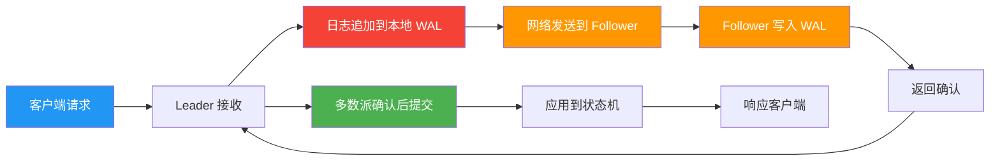
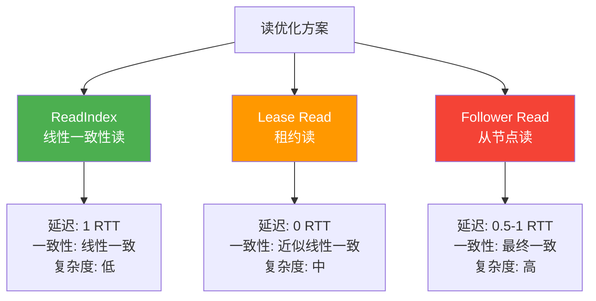
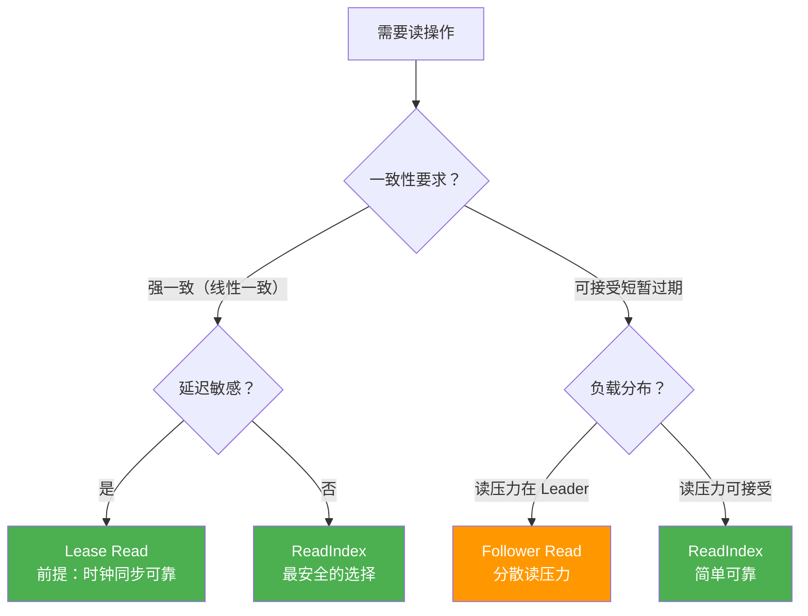

## 技巧四：性能优化策略

分布式共识协议的性能优化是一个"戴着镣铐跳舞"的过程——你必须在不违反协议安全性的前提下，尽可能挖掘系统的吞吐量和延迟潜力。与无约束的单机系统不同，共识协议的每一次写入都必须经过 Leader 转发、多数派确认、日志持久化三个环节，每个环节都可能成为性能瓶颈。

本技巧将从性能瓶颈的根因分析出发，系统性地讲解批处理、流水线复制、读优化、fsync 优化四大核心策略，帮助你将共识系统的性能从"能用"提升到"好用"。

### 性能瓶颈全景分析

在讨论优化策略之前，必须先搞清楚共识系统的性能瓶颈到底在哪里。一个典型的 Raft 写入流程需要经过以下环节：



每个环节的耗时占比差异巨大：

| 瓶颈环节 | 典型耗时 | 占比 | 可优化空间 |
|---------|---------|------|-----------|
| **网络往返（RTT）** | 0.1-200ms | 50-80% | 高：批处理、流水线 |
| **磁盘 fsync** | 0.5-10ms | 10-30% | 中：group commit、批量刷盘 |
| **序列化/反序列化** | 0.01-1ms | 1-5% | 低：protobuf 优化 |
| **状态机应用** | 0.01-5ms | 1-10% | 中：异步应用 |
| **CPU 处理** | < 1ms | < 5% | 低：通常不是瓶颈 |

**核心结论**：在大多数生产环境中，**网络往返延迟**和**磁盘 fsync 延迟**是两个最大的性能瓶颈。优化策略的设计目标就是尽量减少这两个瓶颈的影响。

### 策略一：批处理（Batching）

#### 为什么批处理是最重要的优化

假设一个 Raft 集群的网络 RTT 为 1ms，磁盘 fsync 延迟为 0.5ms。如果每个客户端请求都单独作为一个日志条目发送和确认：

```text
单条处理的时序：
  T=0ms:    客户端请求 1 到达 Leader
  T=0.5ms:  Leader fsync 日志条目 1
  T=1.0ms:  网络发送到 Follower
  T=1.5ms:  Follower fsync + 网络返回
  T=2.0ms:  Leader 收到确认，提交
  T=2.5ms:  状态机应用，响应客户端 1
  
  吞吐量 = 1 请求 / 2.5ms = 400 QPS（单客户端）
```

这个数字显然不可接受。批处理的思路是：**将多个客户端请求合并为一个日志条目，一次网络往返和一次 fsync 处理多条请求**。这样摊薄了固定开销：

```text
批处理的时序（batch=10）：
  T=0ms:    请求 1-10 到达 Leader，收集批次
  T=0.5ms:  Leader fsync 一个包含 10 条命令的日志条目
  T=1.0ms:  网络发送到 Follower
  T=1.5ms:  Follower fsync + 网络返回
  T=2.0ms:  Leader 提交，逐条应用到状态机
  
  吞吐量 = 10 请求 / 2.0ms = 5000 QPS（单客户端）
```

**批处理将吞吐量提升了 12.5 倍**，这就是为什么它是共识系统中最重要的优化策略。

#### 批处理的核心参数

批处理的设计涉及三个关键参数的权衡：

| 参数 | 含义 | 影响 |
|------|------|------|
| **批次大小上限** `batchMaxSize` | 一个批次最多包含多少条命令 | 越大吞吐越高，但延迟增大 |
| **批次等待时间** `batchTimeout` | 收到第一条请求后等待多久再发送 | 控制延迟上限，平衡吞吐 |
| **批次通道容量** `batchChCapacity` | 收集请求的通道缓冲区大小 | 太小导致请求阻塞，太大浪费内存 |

三个参数之间存在经典的**延迟-吞吐量权衡**：

```text
batchMaxSize ↑ → 吞吐↑，延迟↑（等待更多请求填满批次）
batchMaxSize ↓ → 吞吐↓，延迟↓（更快凑齐批次或触发超时）
batchTimeout ↑ → 延迟↑，吞吐↑（等待时间长，更容易凑满批次）
batchTimeout ↓ → 延迟↓，吞吐↓（频繁发送小批次）
```

#### 批处理完整实现

```go
// BatchConfig 批处理配置
type BatchConfig struct {
    MaxSize    int           // 批次最大条目数（典型值：100-1000）
    MaxWait    time.Duration // 批次最大等待时间（典型值：1-10ms）
    QueueSize  int           // 请求队列容量（典型值：MaxSize * 10）
}

// DefaultBatchConfig etcd 风格的默认配置
func DefaultBatchConfig() BatchConfig {
    return BatchConfig{
        MaxSize:   500,        // 500 条/批
        MaxWait:   5 * time.Millisecond, // 最多等 5ms
        QueueSize: 5000,       // 队列容量 5000
    }
}

// BatchProposer 批量提案收集器
type BatchProposer struct {
    config    BatchConfig
    proposeCh chan *Request    // 客户端请求通道
    batchCh   chan []*Request  // 批次输出通道
    logger    *slog.Logger
}

// Run 批次收集主循环
//
// 策略：使用 select 同时等待新请求和超时
// 一旦批次满或超时，立即发送
func (bp *BatchProposer) Run(ctx context.Context) {
    for {
        batch := bp.collectBatch(ctx)
        if len(batch) == 0 {
            continue
        }
        
        bp.batchCh <- batch
    }
}

// collectBatch 收集一个批次的请求
func (bp *BatchProposer) collectBatch(ctx context.Context) []*Request {
    batch := make([]*Request, 0, bp.config.MaxSize)
    timer := time.NewTimer(bp.config.MaxWait)
    defer timer.Stop()
    
    // 阻塞等待第一个请求（确保不空转）
    select {
    case req := <-bp.proposeCh:
        batch = append(batch, req)
    case <-ctx.Done():
        return nil
    }
    
    // 非阻塞地收集剩余请求，直到批次满或超时
    for len(batch) < bp.config.MaxSize {
        select {
        case req := <-bp.proposeCh:
            batch = append(batch, req)
        case <-timer.C:
            // 超时：发送已收集的批次
            return batch
        case <-ctx.Done():
            return batch
        }
    }
    
    // 批次已满，直接返回
    if !timer.Stop() {
        select {
        case <-timer.C:
        default:
        }
    }
    
    bp.logger.Debug("batch full",
        "size", len(batch),
        "waited", bp.config.MaxWait-time.Until(time.Now().Add(bp.config.MaxWait)),
    )
    
    return batch
}
```

**关键设计点解释：**

1. **阻塞等待第一个请求**：如果通道为空时就启动定时器，会在空闲期间频繁产生空批次。阻塞等待确保至少有一个请求才会启动收集流程。

2. **select 多路复用**：同时监听请求通道和定时器，实现"满了就发"和"到时就发"的双重触发。

3. **timer.Stop 的正确处理**：Go 的 `time.Timer` 在 Stop 后可能需要排空 channel，这是常见的陷阱。

#### 批处理的性能影响模型

批处理的效果可以用一个简单的数学模型来分析：

```text
设：
  N = 批次大小
  T_rtt = 网络往返延迟
  T_fsync = 磁盘 fsync 延迟
  T_apply = 状态机应用单条命令的延迟
  T_ser = 序列化单条命令的延迟

单条处理吞吐量：
  Throughput_1 = 1 / (T_rtt + T_fsync + T_apply + T_ser)

批处理吞吐量（忽略常数开销）：
  Throughput_N = N / (T_rtt + T_fsync + N × T_apply + N × T_ser)

加速比：
  Speedup = Throughput_N / Throughput_1
          = N × (T_rtt + T_fsync + T_apply + T_ser)
            / (T_rtt + T_fsync + N × T_apply + N × T_ser)

当 T_apply 和 T_ser 远小于 T_rtt + T_fsync 时：
  Speedup ≈ N
  即：吞吐量近似线性提升 N 倍
```

| 批次大小 N | 网络 RTT=1ms, fsync=0.5ms | RTT=0.1ms, fsync=0.05ms | 说明 |
|-----------|--------------------------|------------------------|------|
| 1 | 667 QPS | 6667 QPS | 基线 |
| 10 | 4000 QPS | 40000 QPS | 提升 6x |
| 100 | 40000 QPS | 400000 QPS | 提升 60x |
| 500 | 133000 QPS | 1330000 QPS | 接近理论上限 |
| 1000 | 200000 QPS | 2000000 QPS | 增益递减明显 |

**结论**：批处理效果在高延迟网络中最为显著。在同机房低延迟环境中（RTT < 1ms），批次大小 100-500 就能获得很好的性价比。

### 策略二：流水线复制（Pipelining）

#### 串行复制的问题

标准的 Raft 日志复制是**串行**的：Leader 发送 AppendEntries RPC，等待 Follower 确认后，才能发送下一批日志。这种模式的问题在于，网络 RTT 被完全浪费——在等待确认的期间，Leader 的网络链路处于空闲状态。

```text
串行复制的时间线（3 批日志）：

Leader:  |--发送批次1--|  等待  |--发送批次2--|  等待  |--发送批次3--|
网络:    |--传输------|  空闲  |--传输------|  空闲  |--传输------|
Follower:             |--接收+fsync--|        |--接收+fsync--|
                      |--返回确认----|        |--返回确认----|

总耗时 = 3 × (传输时间 + fsync + 网络往返)
       = 3 × RTT + 3 × fsync
```

#### 流水线复制的原理

流水线复制的核心思想是：**不等待前一个 AppendEntries 的确认，就发送下一个**。这就像工厂的流水线——每个工位（发送/传输/确认）同时处理不同的批次，整体吞吐量大幅提升。

```text
流水线复制的时间线（3 批日志）：

Leader:  |--发送批次1--|--发送批次2--|--发送批次3--|
网络:    |--传输1------|--传输2------|--传输3------|  （几乎无空闲）
Follower:             |--fsync1+确认1--|--fsync2+确认2--|
                      ↑               ↑
                      确认1回来时批次2已发送  确认2回来时批次3已发送

总耗时 ≈ RTT + 3 × fsync（第一批的往返）+ 2 × 传输时间
       ≈ RTT + fsync + 传输时间（近似于 1 个 RTT）
```

**流水线将 3 批日志的传输时间从 3 个 RTT 缩减到约 1 个 RTT**，吞吐量提升约 3 倍。

#### 流水线复制实现

```go
// Pipeliner 流水线日志复制器
type Pipeliner struct {
    node       *RaftNode
    peer       string
    maxInflight int  // 最大未确认批次数（控制内存和背压）
}

// Run 流水线主循环
//
// 关键：使用单独的 goroutine 发送，不等待响应
// 通过 nextIndex 更新来追踪复制进度
func (p *Pipeliner) Run(ctx context.Context) {
    for {
        entries := p.node.getEntriesToSend(p.peer)
        if len(entries) == 0 {
            p.node.waitForNewEntries(ctx)
            continue
        }
        
        // 背压控制：检查未确认批次数
        if p.node.getInflightCount(p.peer) >= p.maxInflight {
            // 等待一个确认后再继续
            p.node.waitForAck(ctx)
            continue
        }
        
        // 异步发送：不阻塞主循环
        go p.sendAsync(ctx, entries)
    }
}

// sendAsync 异步发送一批日志
func (p *Pipeliner) sendAsync(ctx context.Context, entries []*pb.LogEntry) {
    p.node.incrementInflight(p.peer)
    defer p.node.decrementInflight(p.peer)
    
    nextIdx := p.node.getNextIndex(p.peer)
    
    resp, err := p.node.transport.AppendEntries(p.peer, &amp;pb.AppendEntriesRequest{
        Term:         p.node.currentTerm,
        Leader:       p.node.id,
        PrevLogIndex: nextIdx - 1,
        PrevLogTerm:  p.node.getLogTerm(nextIdx - 1),
        Entries:      entries,
        LeaderCommit: p.node.commitIndex,
    })
    
    if err != nil {
        p.node.logger.Warn("pipeline append entries failed",
            "peer", p.peer,
            "startIdx", entries[0].Index,
            "count", len(entries),
            "error", err,
        )
        return
    }
    
    // 根据响应更新 nextIndex / matchIndex
    p.node.onAppendEntriesResponse(p.peer, entries, resp)
}
```

#### 流水线的背压控制

流水线不是无限制地发送——如果不加控制，Leader 会疯狂发送数据，导致 Follower 的处理队列堆积、内存溢出。背压控制通过**最大未确认批次数**（`maxInflight`）来实现：

```go
// BackpressureController 背压控制器
type BackpressureController struct {
    maxInflight int
    inflight    atomic.Int64
    notifyCh    chan struct{}
}

// Acquire 获取发送许可（阻塞直到有空位）
func (bc *BackpressureController) Acquire(ctx context.Context) error {
    for {
        current := bc.inflight.Load()
        if current < int64(bc.maxInflight) {
            if bc.inflight.CompareAndSwap(current, current+1) {
                return nil
            }
            continue // CAS 失败，重试
        }
        
        // 已满，等待一个确认
        select {
        case <-bc.notifyCh:
            continue
        case <-ctx.Done():
            return ctx.Err()
        }
    }
}

// Release 释放发送许可
func (bc *BackpressureController) Release() {
    bc.inflight.Add(-1)
    select {
    case bc.notifyCh <- struct{}{}:
    default:
    }
}
```

**`maxInflight` 的推荐值：**

| 场景 | 推荐值 | 说明 |
|------|--------|------|
| 低延迟同机房 | 16-64 | 网络快，可以多发几个批次 |
| 跨可用区 | 8-16 | 延迟较高，避免堆积 |
| 跨地域 | 4-8 | RTT 大，多发容易导致内存膨胀 |
| 资源受限环境 | 2-4 | 保守设置，防止 OOM |

#### 流水线与串行复制的对比

| 维度 | 串行复制 | 流水线复制 |
|------|---------|-----------|
| **吞吐量** | 低（每批等一个 RTT） | 高（多批共享一个 RTT） |
| **延迟** | 每批独立延迟 | 首批延迟不变，后续批次延迟重叠 |
| **实现复杂度** | 低（简单的请求-响应循环） | 中（需要异步发送和背压控制） |
| **内存开销** | 低 | 中（需要缓冲已发送未确认的批次） |
| **故障恢复** | 简单（重发最后一批即可） | 需要处理乱序确认（从 lastMatchIndex 重发） |
| **适用场景** | 低吞吐、简单系统 | 高吞吐、生产环境推荐 |

### 策略三：读优化（Read Optimization）

#### 为什么读需要优化

在标准的 Raft 协议中，**所有操作（读和写）都必须经过 Leader 并走完整的日志复制流程**。这意味着一次读操作也需要：接收请求 → 写入日志 → 复制到多数派 → 等待提交 → 从状态机读取 → 返回结果。对于只读场景（如配置查询、元数据读取），这种开销完全不必要。

```text
标准 Raft 读的代价：
  1. 客户端发送读请求到 Leader
  2. Leader 将"读命令"追加到本地日志
  3. 日志复制到多数派 Follower
  4. 等待多数派确认
  5. 日志提交后应用到状态机
  6. 从状态机读取数据并返回

  延迟 = RTT/2 + fsync + RTT + RTT + 状态机读取 + RTT/2
       ≈ 3 × RTT + fsync
```

对于读密集型应用（如配置中心、服务发现），90% 以上的请求是读操作，标准读的代价完全不可接受。

#### 三种读优化方案对比

Raft 提供了三种读优化方案，从强到弱：



| 维度 | ReadIndex | Lease Read | Follower Read |
|------|-----------|------------|---------------|
| **一致性级别** | 线性一致 | 近似线性一致 | 最终一致 |
| **延迟** | 1 RTT（确认 Leader 身份） | 0 RTT（本地检查租约） | 0.5-1 RTT（等待 Follower 追上） |
| **网络开销** | 1 次心跳确认 | 无 | 等待 Follower 追上 Leader 的 commitIndex |
| **时钟依赖** | 无 | 有（租约依赖时钟同步） | 无 |
| **适用场景** | 通用场景，推荐默认选择 | 低延迟读，同机房部署 | 读多写少，允许短暂过期 |

#### ReadIndex 详细实现

ReadIndex 是最安全的读优化方案，由 Raft 论文作者推荐。它保证**线性一致性读**——读到的结果一定是提交时的数据，不会读到过期值。

```go
// ReadIndex 线性一致性读
//
// 原理：
// 1. Leader 记录当前 commitIndex 作为 readIndex
// 2. 发送心跳确认自己仍然是 Leader（如果收到多数派回复，则确认身份有效）
// 3. 等待状态机应用到 readIndex 之后
// 4. 从本地状态机读取数据
//
// 关键保证：readIndex 是提交时的索引，等待状态机追上后读取
//          确保读到的数据至少是 readIndex 时刻已提交的数据
func (r *RaftNode) ReadIndex(ctx context.Context, key string) ([]byte, error) {
    // 第一步：快速检查——如果当前不是 Leader，直接拒绝
    if r.state != Leader {
        return nil, ErrNotLeader
    }
    
    // 第二步：记录当前 commitIndex
    r.mu.Lock()
    readIndex := r.commitIndex
    currentTerm := r.currentTerm
    r.mu.Unlock()
    
    // 第三步：发送心跳确认 Leader 身份（ReadIndex 核心步骤）
    // 心跳必须在 currentTerm 下获得多数派回复
    if !r.confirmLeadership(ctx, currentTerm) {
        return nil, ErrNotLeader
    }
    
    // 第四步：等待状态机应用到 readIndex
    // 这一步确保读到的数据至少覆盖 readIndex 时刻的所有已提交日志
    if err := r.waitApply(ctx, readIndex); err != nil {
        return nil, err
    }
    
    // 第五步：从本地状态机读取
    // 此时状态机的数据至少是 readIndex 时刻的状态
    return r.stateMachine.Get(key)
}

// confirmLeadership 发送心跳确认当前 Leader 身份
func (r *RaftNode) confirmLeadership(ctx context.Context, term uint64) bool {
    // 向所有 Follower 发送心跳（空的 AppendEntries）
    // 如果在 term 内收到多数派回复，则 Leader 身份有效
    responses := make(chan bool, len(r.peers))
    
    for _, peer := range r.peers {
        go func(p string) {
            resp, err := r.transport.AppendEntries(p, &amp;pb.AppendEntriesRequest{
                Term:         term,
                Leader:       r.id,
                PrevLogIndex: r.lastLogIndex(),
                PrevLogTerm:  r.lastLogTerm(),
                Entries:      nil, // 空心跳，不携带日志
                LeaderCommit: r.commitIndex,
            })
            if err != nil {
                responses <- false
                return
            }
            responses <- resp.Success &amp;&amp; resp.Term == term
        }(peer)
    }
    
    // 等待多数派回复
    votes := 1 // 自己
    for i := 0; i < len(r.peers); i++ {
        select {
        case ok := <-responses:
            if ok {
                votes++
            }
        case <-ctx.Done():
            return false
        }
    }
    
    return votes > len(r.peers)/2+1
}

// waitApply 等待状态机应用到指定的 commitIndex
func (r *RaftNode) waitApply(ctx context.Context, index uint64) error {
    r.applyMu.Lock()
    defer r.applyMu.Unlock()
    
    for r.lastApplied < index {
        select {
        case <-r.applyReady:
            continue
        case <-ctx.Done():
            return ctx.Err()
        }
    }
    return nil
}
```

#### Lease Read 的实现

Lease Read 通过**租约（Lease）**机制避免心跳确认的网络开销，将读延迟从 1 个 RTT 降到 0。

```go
// LeaseReader 基于租约的读优化
type LeaseReader struct {
    node         *RaftNode
    leaseDuration time.Duration  // 租约持续时间
    leaseExpiry   time.Time      // 租约到期时间
    mu            sync.RWMutex
}

// StartLease 启动租约（每次 Leader 心跳成功后调用）
//
// 关键假设：如果 Leader 在 leaseDuration 内收到多数派的心跳回复，
// 那么在 leaseDuration/2 的时间内，其他节点不可能选出新 Leader。
// 这是因为选举超时 > heartbeat_interval × 10 > leaseDuration。
func (lr *LeaseReader) StartLease() {
    lr.mu.Lock()
    defer lr.mu.Unlock()
    
    // 租约持续时间 = 选举超时的一半
    // 安全约束：lease_duration < election_timeout / 2
    // 这保证在租约有效期内，即使心跳丢失，也不会有新 Leader 选出
    lr.leaseExpiry = time.Now().Add(lr.leaseDuration)
}

// LeaseRead 基于租约的读
func (lr *LeaseReader) LeaseRead(ctx context.Context, key string) ([]byte, error) {
    lr.mu.RLock()
    expiry := lr.leaseExpiry
    lr.mu.RUnlock()
    
    // 检查租约是否有效
    if time.Now().Before(expiry) {
        // 租约有效：直接读取（0 延迟，无网络往返）
        return lr.node.stateMachine.Get(key)
    }
    
    // 租约过期：回退到 ReadIndex（安全但慢）
    lr.node.logger.Warn("lease expired, falling back to ReadIndex")
    return lr.node.ReadIndex(ctx, key)
}
```

**Lease Read 的安全性分析：**

```text
前提条件（etcd 默认配置）：
  heartbeat_interval = 1000ms
  election_timeout   = 10000ms（min=10000ms, max=20000ms）
  lease_duration     = election_timeout / 2 = 5000ms

安全推理：
  1. Leader 每 1s 发送心跳
  2. 如果 Leader 在 5s 内收到多数派回复，租约有效
  3. Follower 超时触发选举至少需要 10s
  4. 因此，在租约有效期内（5s），不可能有新 Leader 选出
  5. 当前 Leader 仍然是唯一合法的 Leader，读操作安全

风险场景（时钟漂移）：
  如果 Leader 本地时钟比 Follower 快，可能出现：
  - Leader 认为租约还有效（本地时间 < leaseExpiry）
  - 实际 Follower 已经超时并发起了选举
  - Leader 读取时可能读到过期数据（因为新 Leader 可能已经提交了新日志）
  
  缓解措施：
  - 时钟同步（NTP）要求漂移 < lease_duration / 10
  - 使用 Clock Drift 容忍度检查
```

#### Follower Read 的实现

Follower Read 允许客户端从 Follower 节点读取数据，减轻 Leader 的负载。但这需要额外的同步机制来保证一致性。

```go
// FollowerRead Follower 读优化
type FollowerRead struct {
    node *RaftNode
}

// Read 从 Follower 读取
//
// 原理：
// 1. Follower 收到读请求，发送查询到 Leader
// 2. Leader 返回当前 commitIndex
// 3. Follower 等待本地状态机应用到该 commitIndex
// 4. 从本地状态机读取并返回
func (fr *FollowerRead) Read(ctx context.Context, key string) ([]byte, error) {
    if fr.node.state == Leader {
        return fr.node.ReadIndex(ctx, key)
    }
    
    // 步骤 1：向 Leader 请求当前 commitIndex
    leaderCommitIndex, err := fr.queryLeaderCommitIndex(ctx)
    if err != nil {
        return nil, fmt.Errorf("query leader commit index: %w", err)
    }
    
    // 步骤 2：等待本地状态机应用到该 commitIndex
    if err := fr.node.waitApply(ctx, leaderCommitIndex); err != nil {
        return nil, fmt.Errorf("wait apply to commit index %d: %w", leaderCommitIndex, err)
    }
    
    // 步骤 3：从本地状态机读取
    return fr.node.stateMachine.Get(key)
}
```

#### 读优化方案选型指南



### 策略四：fsync 与 WAL 优化

#### fsync 的性能代价

每次写入日志条目后调用 `fsync` 确保数据持久化到磁盘，是共识协议安全性的基石。但 `fsync` 是一个非常昂贵的系统调用：

```text
fsync 的实际代价（Linux）：
  1. 将页面缓存（Page Cache）中的脏页刷写到磁盘
  2. 等待磁盘控制器确认写入完成
  3. 刷新磁盘写缓存（如果启用了 write cache）

不同存储介质的 fsync 延迟：
  NVMe SSD:  0.02-0.2ms
  SATA SSD:  0.1-1ms
  HDD:       2-10ms
  网络存储:  1-20ms

每次 fsync 调用都有固定开销（系统调用 + 内核路径），
即使写入的数据量很小，开销也差不多
```

#### Group Commit：批量 fsync

Group Commit 的核心思想是：**多次 fsync 合并为一次**。多个日志条目累积到一起，然后调用一次 fsync，大幅减少磁盘 I/O 次数。

```go
// GroupCommitManager 批量 fsync 管理器
type GroupCommitManager struct {
    dataDir    string
    file       *os.File
    pendingCh  chan []byte    // 待写入数据通道
    syncCh     chan struct{}  // fsync 完成信号
    mu         sync.Mutex
    logger     *slog.Logger
}

// Run 批量刷盘主循环
//
// 策略：收集一段时间内的所有写入，然后一次性 fsync
func (gcm *GroupCommitManager) Run(ctx context.Context) {
    batch := make([]byte, 0, 64*1024) // 64KB 缓冲区
    ticker := time.NewTicker(1 * time.Millisecond)
    defer ticker.Stop()
    
    for {
        select {
        case data := <-gcm.pendingCh:
            batch = append(batch, data...)
            
            // 缓冲区足够大时立即刷盘
            if len(batch) >= 64*1024 {
                gcm.flush(batch)
                batch = batch[:0]
            }
            
        case <-ticker.C:
            // 定时刷盘（确保延迟不超过 1ms）
            if len(batch) > 0 {
                gcm.flush(batch)
                batch = batch[:0]
            }
            
        case <-ctx.Done():
            // 退出前刷完剩余数据
            if len(batch) > 0 {
                gcm.flush(batch)
            }
            return
        }
    }
}

// flush 执行写入 + fsync
func (gcm *GroupCommitManager) flush(data []byte) {
    gcm.mu.Lock()
    defer gcm.mu.Unlock()
    
    // 写入数据
    if _, err := gcm.file.Write(data); err != nil {
        gcm.logger.Error("write to WAL failed", "error", err)
        return
    }
    
    // 一次性 fsync
    start := time.Now()
    if err := gcm.file.Sync(); err != nil {
        gcm.logger.Error("fsync failed", "error", err)
        return
    }
    gcm.logger.Debug("group commit",
        "bytes", len(data),
        "latency", time.Since(start),
    )
}
```

**Group Commit 的效果分析：**

```text
假设：
  每条日志 1KB，fsync 延迟 0.5ms

无 Group Commit：
  每条 fsync = 0.5ms
  1000 条/s → 1000 次 fsync/s → 磁盘 500ms/s 只用于 fsync

Group Commit（1ms 合并一次）：
  每次 fsync 处理约 1000 条（1MB）
  fsync 次数 = 1000 次/s（不变？不对）

实际上 Group Commit 的优势在于：
  1. 多个小写入合并为大写入，减少磁盘寻道和 I/O 次数
  2. 减少系统调用次数（用户态→内核态切换）
  3. 利用 Linux 内核的 I/O 调度器合并请求

实际效果：
  单条 fsync 吞吐：2000 QPS（NVMe SSD, 0.5ms/次）
  Group Commit 吞吐：8000-15000 QPS（取决于批次大小和磁盘）
```

#### WAL 预写日志优化

除了 Group Commit，还有几个 WAL 层面的优化技巧：

```go
// WALConfig WAL 配置
type WALConfig struct {
    Dir              string        // WAL 文件目录
    SegmentSize      int64         // 单个 WAL 段大小（典型值：64MB）
    SyncMode         SyncMode      // 同步模式
    DirectIO         bool          // 是否使用 Direct I/O
    BufferSize       int           // 用户态缓冲区大小
}

type SyncMode int
const (
    SyncModeAlways  SyncMode = iota // 每次写入都 fsync（最安全）
    SyncModeBatch                    // 批量 fsync（推荐）
    SyncModePeriodic                 // 定期 fsync（最快，但有数据丢失风险）
)

// OpenWAL 打开 WAL 文件，根据配置选择优化策略
func OpenWAL(config *WALConfig) (*WAL, error) {
    var file *os.File
    var err error
    
    flags := os.O_CREATE | os.O_WRONLY | os.O_APPEND
    
    if config.DirectIO {
        // Direct I/O：绕过页面缓存，直接写入磁盘
        // 优势：避免页面缓存污染，写入延迟更可预测
        // 劣势：写入必须对齐到扇区大小（通常 512B 或 4KB）
        flags |= os.O_DIRECT
    }
    
    file, err = os.OpenFile(
        filepath.Join(config.Dir, "wal.log"),
        flags, 0644,
    )
    if err != nil {
        return nil, fmt.Errorf("open WAL file: %w", err)
    }
    
    return &amp;WAL{
        file:    file,
        config:  config,
        writer:  bufio.NewWriterSize(file, config.BufferSize),
    }, nil
}

// Write 写入 WAL
func (w *WAL) Write(entry *LogEntry) error {
    data, err := entry.Marshal()
    if err != nil {
        return fmt.Errorf("marshal entry: %w", err)
    }
    
    // 写入缓冲区
    if _, err := w.writer.Write(data); err != nil {
        return fmt.Errorf("write to buffer: %w", err)
    }
    
    // 根据同步模式决定是否 fsync
    switch w.config.SyncMode {
    case SyncModeAlways:
        // 每次写入都 flush + fsync
        if err := w.writer.Flush(); err != nil {
            return fmt.Errorf("flush: %w", err)
        }
        return w.file.Sync()
        
    case SyncModeBatch:
        // 由 GroupCommitManager 统一管理 flush 和 fsync
        return nil
        
    case SyncModePeriodic:
        // 定期由后台 goroutine 调用 flush + fsync
        return nil
    }
    
    return nil
}
```

**SyncMode 对比：**

| 模式 | 数据安全性 | 延迟 | 吞吐量 | 适用场景 |
|------|-----------|------|--------|---------|
| **Always** | 最高（0 数据丢失） | 高（每次 fsync） | 低 | 金融交易、强一致性需求 |
| **Batch** | 高（最多丢失一个批次） | 中（批量 fsync） | 高 | 通用场景，推荐默认 |
| **Periodic** | 中（最多丢失一个周期的数据） | 低（减少 fsync 频率） | 最高 | 日志收集、可容忍少量丢失 |

#### Direct I/O 与 Buffer I/O 的选择

```text
Buffer I/O（默认）：
  写入 → 页面缓存（Page Cache）→ 延迟刷盘
  
  优势：
  - 顺序写入性能好（利用 OS 预读和合并）
  - 小写入延迟低（写入缓存即返回）
  - 应用层可以使用 bufio 做用户态缓冲
  
  劣势：
  - fsync 时可能触发大量脏页回写，延迟不可预测
  - 与系统其他进程共享 Page Cache，可能被挤出

Direct I/O：
  写入 → 绕过 Page Cache → 直接写入磁盘
  
  优势：
  - 延迟可预测（不依赖 Page Cache 状态）
  - 不影响系统其他进程的缓存
  - 适合大块顺序写入
  
  劣势：
  - 必须对齐到扇区大小（512B/4KB）
  - 小写入性能差（每个写入都是真实磁盘 I/O）
  - 需要自行管理缓冲（不能用标准 bufio）
```

### 策略五：状态机应用优化

#### 异步状态机应用

日志提交后应用到状态机的过程可能很耗时（特别是复杂的状态转换逻辑）。将状态机应用异步化可以让日志复制和状态机执行并行进行。

```go
// AsyncApplier 异步状态机应用器
type AsyncApplier struct {
    node         *RaftNode
    stateMachine StateMachine
    applyCh      chan *ApplyTask
    lastApplied  uint64
    mu           sync.Mutex
}

// ApplyTask 单个应用任务
type ApplyTask struct {
    Index    uint64
    Term     uint64
    Commands []*pb.Command
}

// Run 异步应用主循环
//
// 关键：使用 ApplyBatch 批量应用，减少状态机锁的竞争
func (aa *AsyncApplier) Run(ctx context.Context) {
    for {
        select {
        case task := <-aa.applyCh:
            start := time.Now()
            
            // 批量应用（减少状态机锁的获取次数）
            results := aa.stateMachine.ApplyBatch(task.Commands)
            
            aa.mu.Lock()
            aa.lastApplied = task.Index
            aa.mu.Unlock()
            
            // 通知所有等待者（如 ReadIndex）
            aa.node.notifyApplied(task.Index)
            
            aa.logger.Debug("state machine applied",
                "index", task.Index,
                "commands", len(task.Commands),
                "latency", time.Since(start),
            )
            
        case <-ctx.Done():
            return
        }
    }
}
```

#### 批量状态机应用

```go
// StateMachine 状态机接口（批量优化版）
type StateMachine interface {
    // ApplyBatch 批量应用命令（比逐条 Apply 更高效）
    // 原因：
    // 1. 减少锁获取次数（一次锁，处理多条命令）
    // 2. 减少序列化开销（批量序列化比逐条序列化更快）
    // 3. 可以做批量合并优化（如多个 SET 同一个 key 只保留最后一个）
    ApplyBatch(commands []*pb.Command) []*pb.Result
    
    // Get 读取状态
    Get(key string) ([]byte, error)
}
```

### 六大策略综合对比

| 策略 | 优化目标 | 典型提升 | 复杂度 | 风险 |
|------|---------|---------|--------|------|
| **批处理** | 减少网络往返次数 | 5-50x 吞吐提升 | 低 | 增加延迟（等待批次凑满） |
| **流水线** | 重叠网络传输和确认 | 2-5x 吞吐提升 | 中 | 需要背压控制，乱序处理 |
| **ReadIndex** | 避免读走日志复制 | 读延迟降 60-80% | 低 | 无（最安全的读优化） |
| **Lease Read** | 完全避免读的网络开销 | 读延迟降 95-100% | 中 | 依赖时钟同步，有时钟漂移风险 |
| **Group Commit** | 减少 fsync 次数 | 3-10x 写入提升 | 低 | 最多丢失一个批次的数据 |
| **异步状态机** | 并行化日志复制和状态机执行 | 2-3x 提升 | 低 | 增加内存占用（缓冲未应用的日志） |

### 生产环境调优指南

#### etcd 性能调优清单

| 调优项 | 参数/配置 | 推荐值 | 说明 |
|--------|----------|--------|------|
| 批处理 | `--max-request-bytes` | 1.5MB | 限制单个请求大小，防止大请求阻塞批处理 |
| 心跳间隔 | `--heartbeat-interval` | 1000ms | 默认值，同机房场景可降至 500ms |
| 选举超时 | `--election-timeout` | 10000ms | 默认值，跨地域场景需增大 |
| 后端 quota | `--quota-backend-bytes` | 8GB | 后端存储配额，影响快照触发频率 |
| snapshot 策例 | `--snapshot-count` | 100000 | 多少次应用后触发快照，影响日志压缩频率 |
| 预编译事务 | 参考 etcd 文档 | 优化多操作事务 | 减少序列化和反序列化开销 |
| 客户端连接池 | 连接数 | 5-10 | gRPC 连接池大小，太少导致排队 |

#### 监控指标

在生产环境中，以下监控指标可以帮助你识别性能瓶颈：

```text
关键性能指标：

1. raft_leaderProposalCount
   含义：Leader 每秒收到的提案数量
   作用：衡量系统写入吞吐量
   告警：低于预期值 50% 持续 5 分钟

2. raft_leaderApplyDuration
   含义：状态机应用日志条目的延迟
   作用：识别状态机瓶颈
   告警：P99 > 100ms

3. wal_fsyncDuration
   含义：WAL fsync 延迟
   作用：识别磁盘 I/O 瓶颈
   告警：P99 > 10ms（SSD）或 > 50ms（HDD）

4. rpc_duration_seconds
   含义：节点间 RPC 往返延迟
   作用：识别网络瓶颈
   告警：P99 > 50ms（同机房）或 > 500ms（跨地域）

5. raft_snapshotDuration
   含义：快照创建和传输的延迟
   作用：识别快照对系统的影响
   告警：P99 > 30s

6. process_resident_memory_bytes
   含义：进程内存使用量
   作用：识别内存瓶颈（批处理缓冲区过大可能导致 OOM）
   告警：持续增长或超过 80% 可用内存
```

### 常见误区与纠正

| 误区 | 纠正 |
|------|------|
| "批处理越大越好" | 批次过大会增加延迟（等待凑满），且单个 RPC 包过大可能导致 MTU 分片。典型上限：500-1000 条或 1MB |
| "流水线可以无限制发送" | 无背压控制会导致 Follower 内存溢出。必须设置 maxInflight 限制 |
| "ReadIndex 读一定比 Follower Read 慢" | ReadIndex 只需要 1 次心跳确认（< 1ms），而 Follower Read 需要查询 Leader commitIndex + 等待追上，延迟可能更高 |
| "Lease Read 在任何环境下都安全" | 时钟漂移可能导致租约判断错误。跨地域部署中 NTP 同步精度不够，建议用 ReadIndex |
| "fsync 是必须的，不能优化" | Group Commit 和 Periodic Sync 都是安全的优化。关键是在安全性和性能之间找到合适的平衡点 |
| "异步状态机应用不会影响一致性" | 异步应用只影响读操作的可见时间点（ReadIndex 会等待应用完成），不影响已提交数据的最终一致性 |

### 进阶：混合优化策略

在实际生产系统中，这些优化策略通常组合使用。以 etcd 为例，它同时使用了以下策略组合：

```text
etcd 的优化策略组合：
  1. 批处理：客户端多个操作合并为一个事务提交
  2. 流水线：Leader 到 Follower 的日志复制使用流水线模式
  3. 读优化：默认 ReadIndex，可选 Lease Read
  4. Group Commit：WAL 层面使用批量 fsync
  5. 异步应用：状态机应用在独立 goroutine 中异步执行

etcd v3.5 性能参考数据（3 节点集群，NVMe SSD，同机房）：
  写入吞吐量：约 16,000 QPS（小 KV，单连接）
  读取吞吐量：约 40,000 QPS（ReadIndex 模式）
  读取延迟 P99：< 5ms（ReadIndex 模式）
  写入延迟 P99：< 15ms
```

```go
// ProductionConfig 生产环境推荐配置
type ProductionConfig struct {
    // 网络层
    MaxRequestBytes   int64         // 单个 RPC 最大大小：1.5MB
    HeartbeatInterval time.Duration // 心跳间隔：1s（同机房），5s（跨地域）
    ElectionTimeout   time.Duration // 选举超时：10s（同机房），60s（跨地域）
    
    // 批处理
    BatchSize    int           // 批次大小：500
    BatchTimeout time.Duration // 批次等待时间：5ms
    
    // 流水线
    MaxInflight int // 最大未确认批次：16（同机房），8（跨地域）
    
    // 读优化
    ReadMode    ReadMode // ReadIndex（默认）或 LeaseRead
    LeaseDuration time.Duration // 租约持续时间：5s
    
    // WAL
    WALSyncMode SyncMode // Batch（默认）
    WALSectorSize int    // 直接 I/O 对齐大小：4KB
    WALBufferSize int   // 写缓冲区大小：256KB
    
    // 快照
    SnapshotCount int // 触发快照的阈值：100000
    
    // 状态机
    ApplyConcurrency int // 并发应用的 goroutine 数：1
}

type ReadMode int
const (
    ReadModeIndex    ReadMode = iota // ReadIndex 模式
    ReadModeLease                    // Lease Read 模式
)
```

### 本节小结

性能优化是共识协议工程化的核心挑战。四大策略的核心思想可以浓缩为一句话：

- **批处理**：用延迟换吞吐——等待更多请求凑成一批，摊薄固定开销
- **流水线**：用空间换时间——重叠发送和确认，消除网络空闲期
- **读优化**：按需选择一致性级别——不是所有读都需要走完整共识流程
- **fsync 优化**：合并磁盘操作——多次小写入合并为一次大写入

选择哪种策略组合取决于你的应用场景：读多写少的配置中心侧重读优化，写密集的数据库侧重批处理和流水线，延迟敏感的系统侧重 Lease Read 和 Group Commit。没有万能的最优方案，只有最适合你的场景的方案。
