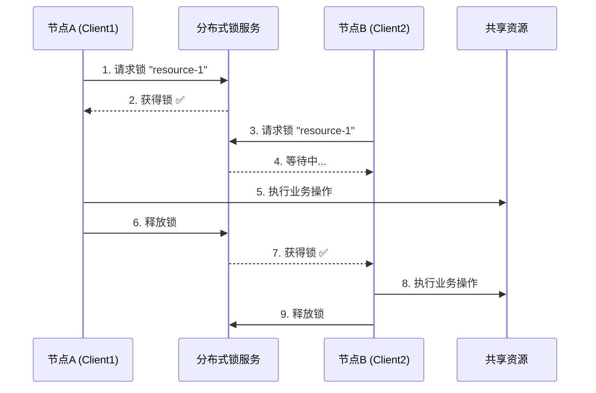
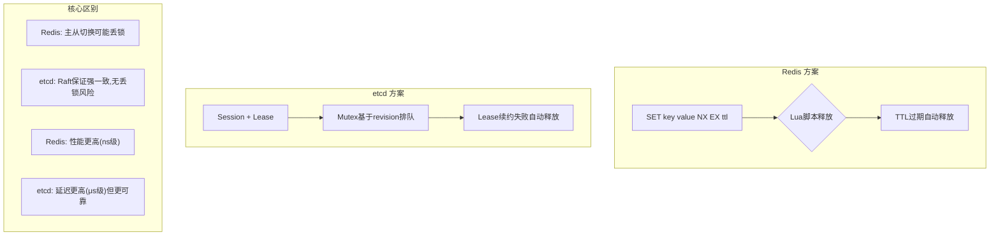
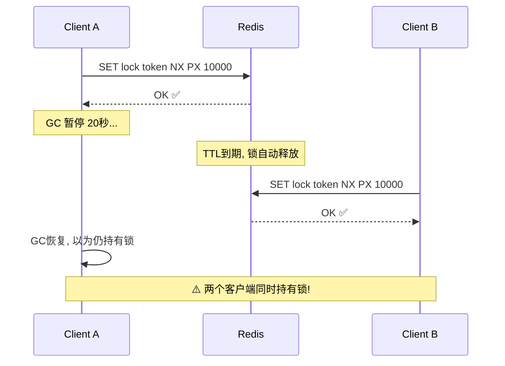

## 技巧六：分布式锁实现

在单机环境中，操作系统提供了 `mutex`、`semaphore` 等原语来协调多线程对共享资源的访问。但在分布式系统中，多个进程分布在不同物理节点上，无法共享内存地址空间，传统的进程间通信机制失效。分布式锁（Distributed Lock）正是解决这一问题的核心机制——它在多节点环境中实现互斥访问，确保同一时刻只有一个客户端能操作共享资源。

### 为什么需要分布式锁

分布式锁解决的根本问题是**跨进程互斥**。以下是典型的应用场景：

| 场景 | 问题描述 | 不加锁的后果 |
|------|----------|-------------|
| 定时任务去重 | 多个节点同时触发同一任务 | 任务重复执行，数据不一致 |
| 库存扣减 | 并发下单扣同一商品库存 | 超卖 |
| 分布式配置更新 | 多个节点同时修改配置 | 配置覆盖、状态混乱 |
| Leader 选举 | 多个候选节点竞争主节点 | 脑裂、双主 |
| 资源调度 | 多个调度器分配同一资源 | 资源重复分配 |
| 缓存重建 | 缓存过期后多个请求同时回源 | 缓存击穿、数据库压力骤增 |



### 分布式锁的五大核心属性

一个正确实现的分布式锁必须满足以下属性，缺一不可：

**1. 互斥性（Mutual Exclusion）**
同一时刻最多只有一个客户端持有锁。这是分布式锁最基本的要求，也是最容易满足的——大多数实现都能做到这一点。

**2. 安全性（Safety / No Double Release）**
只有持有锁的客户端才能释放锁，非持有者不能释放别人的锁。这要求锁必须携带唯一标识（如 UUID），释放时需验证身份。

**3. 活性（Liveness / No Deadlock）**
锁必须有自动过期机制（TTL），即使持有锁的客户端崩溃，锁也能在 TTL 到期后自动释放，避免死锁。同时，客户端在持有锁期间应能续约。

**4. 容错性（Fault Tolerance）**
锁服务本身应是高可用的。当锁服务的部分节点故障时，仍然能提供服务。这意味着锁服务通常基于分布式共识协议（Raft/Paxos）。

**5. 可重入性（Reentrancy，可选）**
同一客户端（或同一请求上下文）可以多次获取同一把锁而不死锁。这在递归调用或嵌套业务逻辑中有用。

> **进阶属性——Fencing Token（栅栏令牌）**：Martin Kleppmann 在对 Redlock 的经典批评中指出，即使锁本身是安全的，客户端持有锁后的操作仍可能因网络延迟而乱序到达资源端。Fencing Token 是一个单调递增的数字，客户端每次获取锁时获得一个新 token，操作资源时必须携带该 token，资源端拒绝接受旧 token 的操作。这一机制将锁的正确性从"锁实现"转移到"资源端校验"，是生产级系统不可或缺的安全保障。

### 基于 Redis 的分布式锁

Redis 是实现分布式锁最常用的方案，因其高性能、原子命令支持和广泛的客户端库生态。

#### 基础实现（单节点）

```python
import redis
import time
import uuid
from contextlib import contextmanager
from typing import Optional


class RedisDistributedLock:
    """
    基于 Redis 的分布式锁实现

    关键设计：
    1. SET NX EX 原子操作保证互斥性
    2. UUID 作为锁的唯一标识，防止误释放
    3. Lua 脚本保证释放锁时的 check-and-delete 原子性
    4. 自动续约机制防止业务未完成锁就过期
    """

    UNLOCK_SCRIPT = """
    if redis.call("get", KEYS[1]) == ARGV[1] then
        return redis.call("del", KEYS[1])
    else
        return 0
    end
    """

    EXTEND_SCRIPT = """
    if redis.call("get", KEYS[1]) == ARGV[1] then
        return redis.call("expire", KEYS[1], ARGV[2])
    else
        return 0
    end
    """

    def __init__(self, redis_client: redis.Redis, key: str,
                 ttl: int = 10, timeout: int = 30):
        """
        Args:
            redis_client: Redis 连接实例
            key: 锁的名称（业务维度唯一键）
            ttl: 锁的过期时间（秒），防止死锁
            timeout: 获取锁的最大等待时间（秒）
        """
        self.redis = redis_client
        self.key = f"lock:{key}"
        self.ttl = ttl
        self.timeout = timeout
        self.token = str(uuid.uuid4())  # 唯一标识，防误释放
        self.unlock_script = self.redis.register_script(self.UNLOCK_SCRIPT)
        self.extend_script = self.redis.register_script(self.EXTEND_SCRIPT)

    def acquire(self, blocking: bool = True) -> bool:
        """
        获取锁

        Args:
            blocking: True=阻塞等待, False=立即返回

        Returns:
            True 表示获取成功
        """
        if not blocking:
            return bool(self.redis.set(
                self.key, self.token, nx=True, ex=self.ttl
            ))

        end_time = time.time() + self.timeout
        while time.time() < end_time:
            if self.redis.set(self.key, self.token, nx=True, ex=self.ttl):
                return True
            time.sleep(0.05)  # 50ms 退避，避免忙等
        return False

    def release(self) -> bool:
        """释放锁（仅当持有者身份匹配时才释放）"""
        result = self.unlock_script(keys=[self.key], args=[self.token])
        return result == 1

    def extend(self, additional_ttl: int = 10) -> bool:
        """
        延长锁的生存时间（续租）

        在业务逻辑执行时间不确定时，后台协程定期调用此方法
        保持锁的有效性。
        """
        result = self.extend_script(
            keys=[self.key], args=[self.token, additional_ttl]
        )
        return result == 1

    @property
    def is_held(self) -> bool:
        """检查当前实例是否持有该锁"""
        return self.redis.get(self.key) == self.token


@contextmanager
def distributed_lock(redis_client, key, ttl=10, timeout=30):
    """
    上下文管理器方式使用分布式锁

    用法:
        with distributed_lock(r, "order:12345"):
            process_order("12345")
    """
    lock = RedisDistributedLock(redis_client, key, ttl, timeout)
    if not lock.acquire():
        raise TimeoutError(f"Failed to acquire lock {key} within {timeout}s")
    try:
        yield lock
    finally:
        lock.release()


# ---- 使用示例 ----

def process_order(order_id: str):
    """订单处理：确保同一订单不会被并发处理"""
    r = redis.Redis(host='localhost', port=6379, db=0, decode_responses=True)

    with distributed_lock(r, f"order:{order_id}", ttl=30):
        # 这里的代码同一时刻只有一个进程执行
        order = get_order(order_id)
        if order.status == "pending":
            deduct_inventory(order)
            charge_payment(order)
            update_order_status(order_id, "completed")
            print(f"Order {order_id} processed successfully")
        else:
            print(f"Order {order_id} already processed, skip")


def rebuild_cache_with_lock(key: str):
    """
    缓存重建：防止缓存击穿（多个请求同时回源数据库）

    经典的「缓存击穿」防护模式：
    1. 请求先查缓存
    2. 缓存未命中 → 尝试获取分布式锁
    3. 获取锁成功 → 查数据库 → 写缓存 → 释放锁
    4. 获取锁失败 → 等待一小段时间后重试查缓存
    """
    r = redis.Redis(host='localhost', port=6379, db=0, decode_responses=True)

    cached = r.get(key)
    if cached:
        return cached

    # 只有一个请求负责重建缓存
    with distributed_lock(r, f"cache-rebuild:{key}", ttl=30, timeout=5):
        # Double-check：拿到锁后再查一次，可能别的请求已经重建完成
        cached = r.get(key)
        if cached:
            return cached

        # 从数据库加载
        data = load_from_database(key)
        r.set(key, data, ex=3600)
        return data
```

#### 自动续约守护线程

当业务执行时间不可预知时，需要一个后台线程定期续约，防止锁在业务完成前过期：

```python
import threading


class AutoExtendLock:
    """
    自动续约的分布式锁

    原理：后台守护线程以 TTL/3 为周期自动续约，
    确保只要业务在执行，锁就不会过期。
    守护线程设为 daemon=True，主线程退出后自动停止。
    """

    def __init__(self, redis_client, key, ttl=30, timeout=30):
        self.lock = RedisDistributedLock(redis_client, key, ttl, timeout)
        self.ttl = ttl
        self._stop_event = threading.Event()
        self._extend_thread = None

    def acquire(self) -> bool:
        if self.lock.acquire():
            self._start_extend_thread()
            return True
        return False

    def release(self) -> bool:
        self._stop_extend_thread()
        return self.lock.release()

    def _start_extend_thread(self):
        self._stop_event.clear()
        self._extend_thread = threading.Thread(
            target=self._extend_loop, daemon=True
        )
        self._extend_thread.start()

    def _stop_extend_thread(self):
        self._stop_event.set()
        if self._extend_thread:
            self._extend_thread.join(timeout=2)

    def _extend_loop(self):
        interval = max(self.ttl // 3, 1)  # 每 TTL/3 续约一次
        while not self._stop_event.wait(timeout=interval):
            if not self.lock.extend(self.ttl):
                # 续约失败，说明锁已被别人抢走或 Redis 故障
                break

    def __enter__(self):
        if not self.acquire():
            raise TimeoutError("Failed to acquire lock")
        return self

    def __exit__(self, *args):
        self.release()
```

### 基于 etcd 的分布式锁

etcd 是 Kubernetes 的底层存储，基于 Raft 协议保证强一致性，天然适合做分布式锁。与 Redis 方案相比，etcd 的锁基于 **Lease（租约）** 机制，不需要 Lua 脚本就能保证原子性，且不存在主从切换丢锁的问题。

```go
package distlock

import (
    "context"
    "fmt"
    "sync"
    "time"

    "go.etcd.io/etcd/client/v3"
    "go.etcd.io/etcd/client/v3/concurrency"
)

// LockConfig 分布式锁配置
type LockConfig struct {
    TTL            time.Duration // 锁的生存时间（对应 Lease TTL）
    AcquireTimeout time.Duration // 获取锁的最大等待时间
    RetryInterval  time.Duration // 重试间隔
}

func DefaultLockConfig() LockConfig {
    return LockConfig{
        TTL:            10 * time.Second,
        AcquireTimeout: 30 * time.Second,
        RetryInterval:  100 * time.Millisecond,
    }
}

// DistributedLock 分布式锁
type DistributedLock struct {
    client  *clientv3.Client
    session *concurrency.Session
    mutex   *concurrency.Mutex
    key     string
    config  LockConfig
}

// NewDistributedLock 创建分布式锁
//
// 原理：
// 1. 创建 Session（绑定一个 Leasi），Session 续约失败 = 锁自动释放
// 2. Mutex 基于 etcd revision 实现公平排队（FIFO）
// 3. 不需要 Lua 脚本，etcd 的事务操作天然原子
func NewDistributedLock(client *clientv3.Client, key string,
    config LockConfig) (*DistributedLock, error) {

    session, err := concurrency.NewSession(client,
        concurrency.WithTTL(int(config.TTL.Seconds())))
    if err != nil {
        return nil, fmt.Errorf("create session: %w", err)
    }

    return &amp;DistributedLock{
        client:  client,
        session: session,
        mutex:   concurrency.NewMutex(session, key),
        key:     key,
        config:  config,
    }, nil
}

// Lock 获取锁（阻塞直到成功或超时）
func (l *DistributedLock) Lock(ctx context.Context) error {
    ctx, cancel := context.WithTimeout(ctx, l.config.AcquireTimeout)
    defer cancel()

    if err := l.mutex.Lock(ctx); err != nil {
        return fmt.Errorf("acquire lock %s: %w", l.key, err)
    }
    return nil
}

// TryLock 非阻塞尝试获取锁
func (l *DistributedLock) TryLock(ctx context.Context) error {
    ctx, cancel := context.WithTimeout(ctx, 1*time.Millisecond)
    defer cancel()

    err := l.mutex.Lock(ctx)
    if err != nil {
        return fmt.Errorf("try lock %s: %w", l.key, err)
    }
    return nil
}

// Unlock 释放锁
func (l *DistributedLock) Unlock(ctx context.Context) error {
    if err := l.mutex.Unlock(ctx); err != nil {
        return fmt.Errorf("release lock %s: %w", l.key, err)
    }
    return nil
}

// Close 关闭会话（释放 Lease）
func (l *DistributedLock) Close() error {
    return l.session.Close()
}

// WithLock 函数式用法：获取锁 → 执行 → 释放
func WithLock(client *clientv3.Client, key string,
    fn func() error) error {

    lock, err := NewDistributedLock(client, key, DefaultLockConfig())
    if err != nil {
        return err
    }
    defer lock.Close()

    ctx := context.Background()
    if err := lock.Lock(ctx); err != nil {
        return err
    }
    defer lock.Unlock(ctx)

    return fn()
}

// DistributedLocker 统一接口，方便在 etcd 和 Redis 方案间切换
type DistributedLocker interface {
    Lock(ctx context.Context) error
    TryLock(ctx context.Context) error
    Unlock(ctx context.Context) error
    Close() error
}
```

**etcd vs Redis 方案的关键差异：**



### 基于 ZooKeeper 的分布式锁

ZooKeeper 是另一种经典的分布式锁实现，基于其临时顺序节点（Ephemeral Sequential Node）机制。适用于已经维护了 ZooKeeper 集群的场景（如 Hadoop、Kafka 生态）。

```java
import org.apache.curator.framework.CuratorFramework;
import org.apache.curator.framework.recipes.locks.InterProcessMutex;
import org.apache.curator.framework.recipes.locks.InterProcessReadWriteLock;
import java.util.concurrent.TimeUnit;

/**
 * ZooKeeper 分布式锁（基于 Apache Curator）
 *
 * 原理：
 * 1. 客户端在 /locks/{resource}/ 下创建临时顺序节点
 * 2. 获取锁 = 判断自己是否是最小序号节点
 * 3. 不是则 watch 前一个节点，前一个释放后收到通知
 * 4. 临时节点 = 客户端断开连接自动删除 = 天然的 TTL
 */
public class ZkDistributedLock {

    private final CuratorFramework client;
    private final String lockPath;

    public ZkDistributedLock(CuratorFramework client, String lockPath) {
        this.client = client;
        this.lockPath = lockPath;
    }

    /**
     * 可重入互斥锁
     */
    public void executeWithLock(Runnable task, long timeoutMs) 
            throws Exception {
        InterProcessMutex lock = new InterProcessMutex(client, lockPath);
        
        if (lock.acquire(timeoutMs, TimeUnit.MILLISECONDS)) {
            try {
                task.run();
            } finally {
                lock.release();
            }
        } else {
            throw new RuntimeException(
                "Failed to acquire lock within " + timeoutMs + "ms");
        }
    }

    /**
     * 读写锁：多个读 + 互斥写
     * 
     * 适用场景：读多写少时，读操作可以并发执行，只有写操作互斥
     */
    public void executeWithReadWriteLock(Runnable readTask, 
            Runnable writeTask, long timeoutMs) throws Exception {
        InterProcessReadWriteLock rwLock = 
            new InterProcessReadWriteLock(client, lockPath);

        // 写锁（互斥）
        if (rwLock.writeLock().acquire(timeoutMs, TimeUnit.MILLISECONDS)) {
            try {
                writeTask.run();
            } finally {
                rwLock.writeLock().release();
            }
        }

        // 读锁（共享）
        if (rwLock.readLock().acquire(timeoutMs, TimeUnit.MILLISECONDS)) {
            try {
                readTask.run();
            } finally {
                rwLock.readLock().release();
            }
        }
    }
}
```

### 基于数据库的分布式锁

在无法引入 Redis/etcd 等额外组件时，关系型数据库也能实现分布式锁。适用于并发量不高的简单场景。

```sql
-- 方案一：唯一约束（MySQL）

-- 建表
CREATE TABLE distributed_lock (
    lock_key    VARCHAR(128) PRIMARY KEY COMMENT '锁的业务键',
    owner       VARCHAR(64)  NOT NULL COMMENT '锁持有者标识',
    acquired_at TIMESTAMP    DEFAULT CURRENT_TIMESTAMP COMMENT '获取时间',
    expire_at   TIMESTAMP    NOT NULL COMMENT '过期时间',
    INDEX idx_expire (expire_at)
) ENGINE=InnoDB;

-- 获取锁（INSERT 失败 = 已被别人持有）
INSERT INTO distributed_lock (lock_key, owner, expire_at)
VALUES ('order:12345', 'node-a:pid:1234', DATE_ADD(NOW(), INTERVAL 30 SECOND))
ON DUPLICATE KEY UPDATE
    owner = IF(expire_at < NOW(), VALUES(owner), owner),
    expire_at = IF(expire_at < NOW(), VALUES(expire_at), expire_at);

-- 释放锁（校验 owner 后删除）
DELETE FROM distributed_lock
WHERE lock_key = 'order:12345' AND owner = 'node-a:pid:1234';

-- 清理过期锁（定时任务）
DELETE FROM distributed_lock WHERE expire_at < NOW();
```

```sql
-- 方案二：SELECT FOR UPDATE（MySQL）

-- 获取锁（悲观锁）
START TRANSACTION;
SELECT * FROM distributed_lock
WHERE lock_key = 'order:12345'
FOR UPDATE;

-- 如果查不到记录则插入
INSERT IGNORE INTO distributed_lock (lock_key, owner, expire_at)
VALUES ('order:12345', 'node-a', DATE_ADD(NOW(), INTERVAL 30 SECOND));

-- 执行业务...
COMMIT;
```

**数据库方案的局限性：**
- 性能瓶颈：每次加锁/解锁都是磁盘 IO，吞吐量远低于 Redis
- 死锁风险：需要应用层实现 TTL 和过期清理
- 不支持锁续租
- 主从切换时可能丢锁（除非使用强一致同步复制）
- 高并发下数据库连接池容易耗尽

### Redlock 算法与争议

Redlock 是 Redis 作者 Antirez 提出的分布式锁算法，目标是通过多个独立 Redis 实例实现容错性。但该方案引发了社区激烈讨论。

```python
import time
import uuid
from typing import List, Optional
import redis


class Redlock:
    """
    Redlock 分布式锁算法

    流程：
    1. 记录当前时间 start_time
    2. 依次尝试在 N 个独立 Redis 实例上获取锁（SET NX PX）
    3. 如果在多数派（N/2+1）实例上获取成功，且总耗时 < TTL
       → 获取锁成功，有效时间 = TTL - 耗去时间 - 时钟漂移
    4. 否则释放所有实例上的锁，等待后重试
    """

    def __init__(self, nodes: List[redis.Redis], ttl: int = 10000):
        """
        Args:
            nodes: 独立的 Redis 实例列表（不是同一个集群的副本）
            ttl: 锁的过期时间（毫秒）
        """
        self.nodes = nodes
        self.ttl = ttl
        self.quorum = len(nodes) // 2 + 1
        self.clock_drift_factor = 0.01  # 时钟漂移因子

    def acquire(self, resource: str, retry: int = 3,
                retry_delay: float = 0.2) -> Optional[dict]:
        token = str(uuid.uuid4())

        for attempt in range(retry):
            n = 0
            start_time = time.time() * 1000  # 毫秒

            for node in self.nodes:
                try:
                    if self._acquire_node(node, resource, token):
                        n += 1
                except redis.RedisError:
                    continue

            # 计算有效时间
            elapsed_ms = time.time() * 1000 - start_time
            drift = int(self.ttl * self.clock_drift_factor) + 2
            validity = self.ttl - int(elapsed_ms) - drift

            if n >= self.quorum and validity > 0:
                return {
                    'token': token,
                    'resource': resource,
                    'validity': validity,
                }

            # 获取失败，释放所有已获取的锁
            self._release_all(resource, token)
            time.sleep(retry_delay)

        return None

    def release(self, lock: dict):
        self._release_all(lock['resource'], lock['token'])

    def _acquire_node(self, node, resource, token) -> bool:
        return bool(node.set(resource, token, nx=True, px=self.ttl))

    def _release_node(self, node, resource, token):
        script = """
        if redis.call("get", KEYS[1]) == ARGV[1] then
            return redis.call("del", KEYS[1])
        end
        """
        try:
            node.eval(script, 1, resource, token)
        except redis.RedisError:
            pass

    def _release_all(self, resource, token):
        for node in self.nodes:
            self._release_node(node, resource, token)
```

#### Martin Kleppmann 对 Redlock 的批评

2016 年，Martin Kleppmann（《Designing Data-Intensive Applications》作者）发表了著名的批评文章，指出了 Redlock 的两个核心问题：

**问题一：时序假设不安全**

Redlock 依赖"获取锁耗时远小于 TTL"这一假设。但在 GC 暂停、网络延迟、CPU 调度等场景下，客户端可能在持有锁期间被暂停，TTL 到期后锁自动释放，另一个客户端获得锁。当原客户端恢复后，它仍然认为自己持有锁，两个客户端同时操作资源。



**问题二：缺少 Fencing Token**

即使通过某种方式解决了时序问题，Redlock 仍缺少单调递增的 Fencing Token。当锁的持有者操作延迟到达资源端时，资源端无法判断该操作是否仍然有效。

**Kleppmann 的建议：**
- 如果只需要效率（performance），用单个 Redis 实例 + SET NX EX 即可
- 如果需要正确性（correctness），使用基于共识协议的系统（etcd/ZooKeeper）+ Fencing Token

### 分布式锁方案全面对比

| 维度 | Redis 单节点 | Redis Redlock | etcd | ZooKeeper | 数据库 |
|------|-------------|---------------|------|-----------|--------|
| **性能** | 极高（<1ms） | 高（~2ms） | 中（~5ms） | 中（~5ms） | 低（~50ms） |
| **一致性模型** | 最终一致 | 最终一致 | 强一致（Raft） | 强一致（ZAB） | 强一致（同步复制） |
| **可用性** | 主从切换丢锁 | 多数派存活可用 | 多数派存活可用 | 多数派存活可用 | 依赖数据库 HA |
| **自动过期** | ✅ TTL | ✅ TTL | ✅ Lease | ✅ 临时节点 | ❌ 需手动清理 |
| **公平排队** | ❌ | ❌ | ✅ revision | ✅ 顺序节点 | ❌ |
| **读写锁** | ❌ | ❌ | ❌（需自行实现） | ✅ Curator | ❌ |
| **Fencing Token** | ❌ 需自行实现 | ❌ 需自行实现 | ✅ revision | ✅ 事务 zxid | ❌ |
| **运维复杂度** | 低 | 高 | 中 | 高 | 低 |
| **适用场景** | 高并发、允许偶发不一致 | 需要高可用 | 需要强一致、K8s生态 | 大数据生态 | 简单、低并发 |

### 分布式锁的正确使用模式

#### 模式一：锁 + 业务操作（基础模式）

```python
# 最简单的模式，适合短任务
with distributed_lock(r, f"resource:{id}"):
    do_something(id)
```

#### 模式二：锁 + 续约 + 超时保护（长任务模式）

```python
# 适合执行时间不确定的长任务
with AutoExtendLock(r, f"resource:{id}", ttl=30, timeout=5) as lock:
    result = long_running_task(id)
    # 即使任务执行超过 30 秒，续约机制也会保持锁有效
```

#### 模式三：锁 + 重试 + 降级（高可用模式）

```python
import logging

logger = logging.getLogger(__name__)

def process_with_fallback(resource_id: str):
    """
    获取锁失败时的优雅降级策略：
    1. 尝试获取锁（最多等待 5 秒）
    2. 获取失败 → 写入延迟队列，稍后重试
    3. 延迟队列也满 → 告警 + 丢弃（取决于业务容忍度）
    """
    r = redis.Redis(host='localhost', port=6379, db=0)

    lock = RedisDistributedLock(r, f"resource:{resource_id}", ttl=30, timeout=5)
    if lock.acquire():
        try:
            do_something(resource_id)
        finally:
            lock.release()
    else:
        # 降级：写入延迟队列
        logger.warning(f"Lock acquisition failed for {resource_id}, "
                       f"enqueuing for retry")
        r.zadd("retry_queue", {resource_id: time.time() + 60})
```

#### 模式四：Fencing Token 保护（强正确性模式）

```python
class FencedResource:
    """
    带 Fencing Token 的资源端

    关键：锁的正确性不仅依赖锁实现，还需要资源端配合校验。
    这是 Martin Kleppmann 提出的方案，将安全责任从锁转移到资源端。
    """

    def __init__(self):
        self.last_token = -1  # 记录最近接受的 token

    def write(self, fencing_token: int, data: str):
        if fencing_token <= self.last_token:
            raise SecurityError(
                f"Stale token {fencing_token}, "
                f"last accepted: {self.last_token}"
            )
        self.last_token = fencing_token
        self._do_write(data)
```

### 分布式锁的调试与监控

#### 关键监控指标

# Prometheus 指标示例
lock_acquire_total{resource="order", status="success|timeout|error"}
lock_acquire_latency_seconds{resource="order"}
lock_hold_duration_seconds{resource="order"}
lock_contention_total{resource="order"}  # 获取失败次数（竞争激烈度）
lock_extend_total{resource="order", status="success|fail"}

#### 常见故障排查清单

| 故障现象 | 可能原因 | 排查方向 |
|----------|---------|---------|
| 锁获取超时 | 锁被其他节点长时间持有 | 检查持有者的业务执行时间、是否有死代码 |
| 锁突然释放 | TTL 到期未续约 | 检查续约线程是否存活、Redis 延迟 |
| 同一资源并发操作 | Redis 主从切换丢锁 / GC暂停 | 检查 Redis 哨兵切换日志、应用 GC 日志 |
| 大量锁竞争 | 锁粒度过粗 | 缩小锁粒度（如按用户ID而非全局锁） |
| 续约失败 | Redis 不可达 / 网络分区 | 检查 Redis 连接池、网络连通性 |
| 死锁 | 循环等待 / TTL 设置过大 | 收集所有持有锁的客户端信息，检查等待图 |

### 常见问题深入解答

**Q: 锁过期但任务未完成怎么办？**

三种解决方案按推荐度排序：
1. **自动续约**（推荐）：后台守护线程定期续约，业务完成后再主动释放。适合大多数场景。
2. **任务分片**：将长任务拆分为多个小任务，每个任务独立获取锁-执行-释放，中间状态持久化。
3. **延长 TTL**：将 TTL 设置为业务最大执行时间的 2 倍。简单但不优雅，TTL 设置过大会导致其他客户端等待更久。

**Q: 如何避免死锁？**

死锁预防的层次：
- **TTL 兜底**：所有锁都必须设置 TTL，确保即使发生异常也能自动释放
- **tryLock 非阻塞**：优先使用非阻塞获取，获取失败时有明确的降级路径
- **锁顺序**：如果需要同时持有多把锁，所有节点按相同顺序获取（如按锁名排序）
- **锁超时**：设置合理的获取超时，避免无限等待

**Q: Redis 主从切换导致锁丢失怎么办？**

这正是 Redlock 试图解决的问题。实际生产中的分层策略：
- **效率场景**（缓存击穿防护等）：单 Redis + SET NX EX 足够，偶尔丢锁影响有限
- **正确性场景**（资金操作等）：用 etcd/ZooKeeper + Fencing Token，或在业务层实现幂等性
- **折中方案**：Redis 锁 + 数据库乐观锁双重校验

**Q: Redis 和 etcd 怎么选？**

决策树：
需要强一致性？
├── 是 → 你的环境已有 etcd（K8s）？
│   ├── 是 → etcd
│   └── 否 → ZooKeeper 或 etcd（根据团队技术栈）
└── 否 → 并发量 > 10K QPS？
    ├── 是 → Redis
    └── 否 → Redis（简单）或 数据库（零额外组件）

**Q: 分布式锁和分布式事务有什么关系？**

分布式锁是分布式事务中实现"隔离性"的一种手段。在 Saga/TCC 等分布式事务模式中，分布式锁可以保证同一资源不会被两个事务同时操作。但分布式锁不等于分布式事务——它只解决互斥问题，不解决原子性、一致性等问题。

### 最佳实践清单

1. **锁的粒度要细**：按业务维度加锁（如 `order:{id}`），而非全局锁（如 `global_lock`）
2. **TTL 合理设置**：短于业务最大执行时间的 1/3，配合续约机制使用
3. **锁标识要唯一**：使用 UUID 作为锁的 value，释放时验证身份
4. **释放要原子**：Redis 用 Lua 脚本保证 check-and-delete 原子性
5. **降级策略必备**：获取锁失败时有明确的降级路径，不能只是报错
6. **监控不可少**：监控锁的获取耗时、持有时间、竞争次数、续约成功率
7. **Fencing Token**：涉及资金或关键数据的操作，务必在资源端校验 token
8. **避免嵌套锁**：尽量不要同时持有多把锁，如果必须则严格按序获取
9. **测试要充分**：模拟网络分区、Redis 故障、GC 暂停等异常场景
10. **文档化约定**：团队内统一锁的 key 命名规范、TTL 标准、超时处理策略
