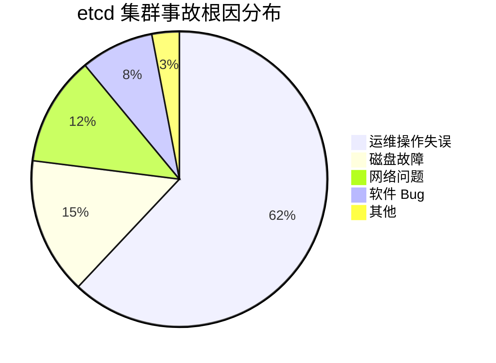
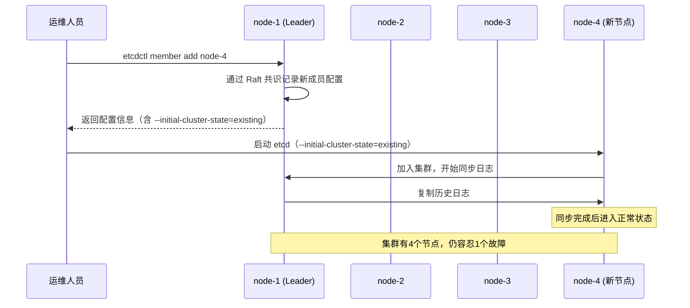
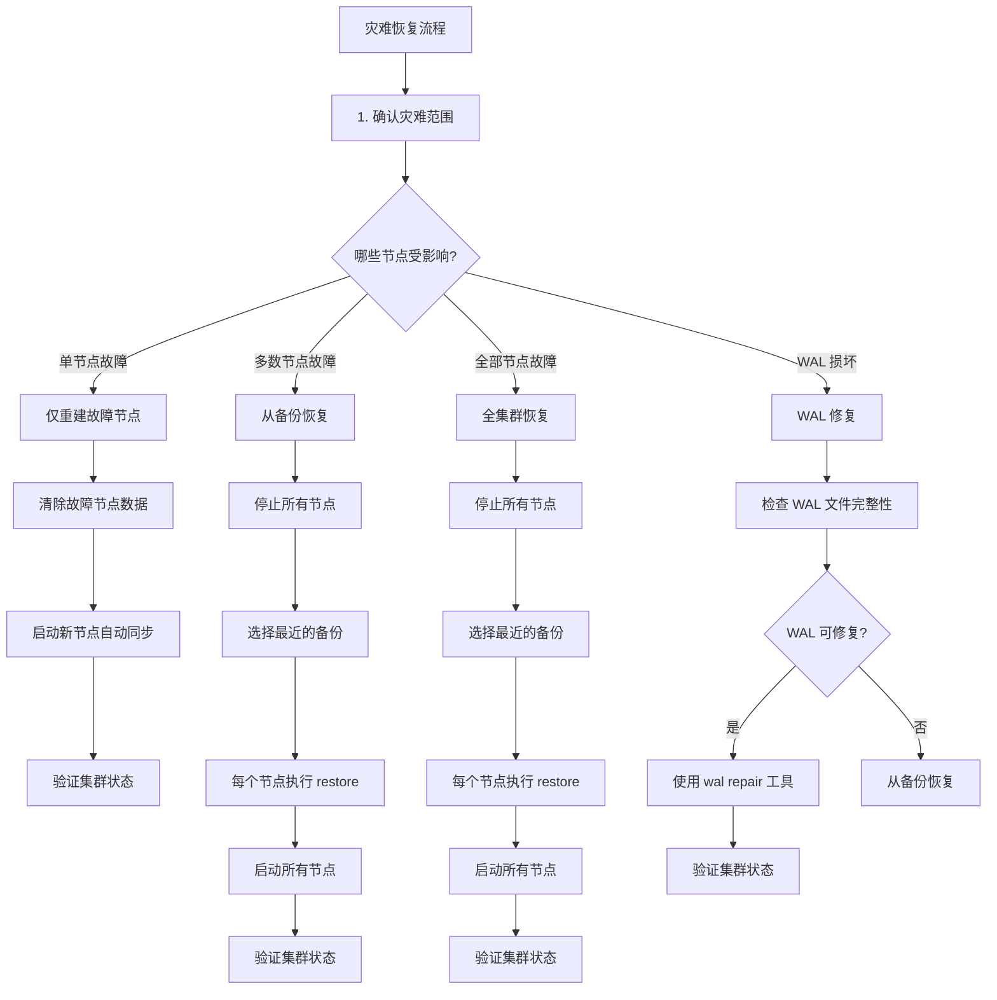
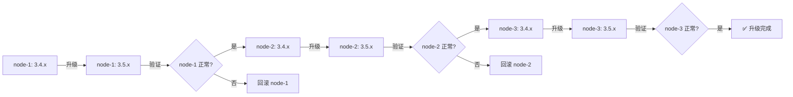

## 技巧八：集群运维操作

分布式共识集群的运维是保证系统长期稳定运行的关键环节。一个设计精良的共识集群，如果缺乏规范的运维流程，依然会在生产环境中遭遇灾难性故障——数据丢失、服务中断、甚至不可逆的状态损坏。

本节以 etcd 为主轴（兼顾 ZooKeeper），系统介绍集群运维的八大核心领域：**状态感知**（知道集群发生了什么）、**成员管理**（安全地扩缩容）、**灾难恢复**（在故障后恢复服务）、**性能调优**（让集群跑得更好）、**监控告警**（在问题发生前发现苗头）、**滚动升级**（零停机版本更新）、**安全运维**（TLS与认证管理）、**时钟同步**（Raft 协议的隐性依赖）。每个领域都从原理出发，落到可执行的操作流程，并附带生产级自动化脚本。

```mermaid
graph TD
    A[集群运维操作] --> B[状态感知]
    A --> C[成员管理]
    A --> D[灾难恢复]
    A --> E[性能调优]
    A --> F[监控告警]
    A --> G[滚动升级]
    A --> H[安全运维]
    A --> I[时钟同步]

    B --> B1[查看成员列表]
    B --> B2[查看集群状态]
    B --> B3[检查健康度]
    B --> B4[状态自动化脚本]

    C --> C1[动态添加节点]
    C --> C2[安全移除节点]
    C --> C3[成员角色变更]
    C --> C4[成员配置更新]

    D --> D1[定期备份]
    D --> D2[备份验证]
    D --> D3[单节点恢复]
    D --> D4[全集群恢复]

    E --> E1[核心配置调优]
    E --> E2[磁盘 I/O 优化]
    E --> E3[MVCC 与内存优化]

    F --> F1[关键指标监控]
    F --> F2[Prometheus 告警]
    F --> F3[Grafana 仪表盘]

    G --> G1[滚动升级流程]
    G --> G2[版本兼容性]

    H --> H1[TLS 证书管理]
    H --> H2[RBAC 权限控制]
    H --> H3[审计日志]

    I --> I1[NTP 时钟同步]
    I --> I2[时钟偏移检测]
```



### 为什么集群运维如此重要

在分布式共识系统中，运维操作的风险远高于单机系统。原因有三：

1. **状态强一致性约束**：Raft 保证 Safety 的前提是正确执行协议。错误的运维操作（如同时恢复多个节点、误删数据目录）可能破坏这个前提，导致数据丢失或脑裂。
2. **成员配置的原子性要求**：集群成员变更必须通过共识协议本身完成。直接修改配置文件而不走 `etcdctl member add/remove` 流程，会导致新旧配置不一致，触发选举风暴。
3. **备份恢复的严格顺序**：恢复操作必须在所有节点上按正确顺序执行。任何一个步骤的偏差都可能导致集群进入不可恢复的状态。

> **经验教训：** 据 etcd 官方文档和 Kubernetes 社区的事故报告，超过 60% 的 etcd 集群事故源于运维操作失误，而非软件 bug。规范的运维流程是防御的第一道防线。



---

### 一、状态感知：读懂你的集群

在进行任何运维操作之前，第一步是全面了解集群当前的状态。盲目操作是灾难的根源。状态感知不是简单地执行几条命令，而是建立一套系统化的诊断流程，在操作前、操作中、操作后三个阶段持续监控集群健康。

#### 1.1 查看集群成员

```bash
# 查看所有集群成员（表格格式）
etcdctl member list --write-out=table

# 输出示例：
# +------------------+---------+---------+-----------------------+-----------------------+
# |        ID        | STATUS  |  NAME   |      PEER ADDRS      |     CLIENT ADDRS      |
# +------------------+---------+---------+-----------------------+-----------------------+
# | 8211f1d0f64f3269 | started | node-1  | http://10.0.0.1:2380  | http://10.0.0.1:2379  |
# | 91bc3c398fb3c146 | started | node-2  | http://10.0.0.2:2380  | http://10.0.0.2:2379  |
# | fd422379fda50e48 | started | node-3  | http://10.0.0.3:2380  | http://10.0.0.3:2379  |
# +------------------+---------+---------+-----------------------+-----------------------+
```

**解读要点：**
- `ID` 是成员的全局唯一标识（64 位整数），在成员的整个生命周期内不变
- `STATUS` 字段只有三种值：`started`（正常）、`stopped`（已停止）、`error`（异常）。如果出现 `error`，说明该节点与集群失联，需要立即排查
- `PEER ADDRS` 是节点间通信用的地址（端口 2380），`CLIENT ADDRS` 是客户端通信用的地址（端口 2379）

**状态异常的常见原因与处理：**

| STATUS 值 | 可能原因 | 处理方式 |
|-----------|---------|---------|
| `stopped` | 进程崩溃、正常停机 | 检查进程日志，决定是重启还是替换 |
| `error` | 网络不通、磁盘满、证书过期 | 优先检查网络连通性和磁盘空间 |
| 无此成员 | 已被 `member remove` | 确认是否为预期操作 |

#### 1.2 查看集群端点状态

```bash
# 查看每个端点的详细状态
etcdctl endpoint status --write-out=table

# 输出示例：
# +----------------+------------------+---------+---------+-----------+------------+-----------+------------+--------------------+--------+
# |    ENDPOINT    |        ID        | VERSION | DB SIZE | IS LEADER | IS LEARNER | RAFT TERM | RAFT INDEX | RAFT APPLIED INDEX | ERRORS |
# +----------------+------------------+---------+---------+-----------+------------+-----------+------------+--------------------+--------+
# | 10.0.0.1:2379  | 8211f1d0f64f3269 |  3.5.0  |  25 MB  |    true   |    false   |     4     |    16852   |       16852        |        |
# | 10.0.0.2:2379  | 91bc3c398fb3c146 |  3.5.0  |  25 MB  |   false   |    false   |     4     |    16852   |       16852        |        |
# | 10.0.0.3:2379  | fd422379fda50e48 |  3.5.0  |  25 MB  |   false   |    false   |     4     |    16852   |       16852        |        |
# +----------------+------------------+---------+---------+-----------+------------+-----------+------------+--------------------+--------+
```

**关键字段解读：**

| 字段 | 含义 | 需要关注的情况 |
|------|------|---------------|
| `IS LEADER` | 是否为当前 Leader | 确认只有一个节点为 `true` |
| `IS LEARNER` | 是否为学习节点 | 学习节点不参与投票，只同步数据 |
| `RAFT TERM` | 当前 Raft 任期 | 所有节点应相同；如果不同，说明有节点失联 |
| `RAFT INDEX` | 最后一条日志的索引 | 所有节点应相同；差异大说明有节点落后 |
| `RAFT APPLIED INDEX` | 已应用到状态机的索引 | 应与 `RAFT INDEX` 接近；差距大说明状态机应用慢 |
| `DB SIZE` | 数据库文件大小 | 超过配额（默认 2GB，可配到 8GB）会拒绝写入 |
| `ERRORS` | 错误信息 | 非空说明有问题需要排查 |

**日志一致性判断方法：** 取所有节点中最大的 `RAFT INDEX` 与每个节点的 `RAFT INDEX` 做差。如果差值小于 1000，说明集群日志一致性良好；如果差值超过 10000，需要排查落后节点的网络或磁盘状况；如果落后节点持续追不上，可能是磁盘性能不足导致 follower 的 appendEntries 处理慢。

#### 1.3 检查集群健康状态

```bash
# 检查所有端点的健康状态
etcdctl endpoint health --write-out=table

# 输出示例：
# +----------------+--------+----------+-----------------+
# |    ENDPOINT    | HEALTH | TOOK(ms) |     ERROR       |
# +----------------+--------+----------+-----------------+
# | 10.0.0.1:2379  |  true  |    12    |                 |
# | 10.0.0.2:2379  |  true  |     8    |                 |
# | 10.0.0.3:2379  |  true  |    15    |                 |
# +----------------+--------+----------+-----------------+
```

**健康检查的判断逻辑：**
- `HEALTH = true`：该端点可以正常响应请求
- `HEALTH = false`：该端点无法响应，可能的原因包括进程崩溃、磁盘满、网络不通
- `TOOK(ms)`：健康检查的响应时间。正常应在 50ms 以内；超过 200ms 需要排查磁盘或网络问题

**响应时间分级诊断：**

| 响应时间 | 状态 | 可能原因 | 建议操作 |
|---------|------|---------|---------|
| < 50ms | 正常 | 无 | 无需操作 |
| 50-200ms | 关注 | 磁盘轻微繁忙或网络抖动 | 持续观察，检查 iostat |
| 200ms-1s | 警告 | 磁盘 I/O 瓶颈或网络延迟 | 立即排查，可能影响服务 |
| > 1s | 严重 | 磁盘故障、网络分区、进程挂起 | 紧急处理，考虑切换 Leader |

#### 1.4 检查端点详情与日志一致性

```bash
# 查看端点的详细信息（含 leader 信息和监听地址）
etcdctl endpoint hashkv --endpoints=http://10.0.0.1:2379

# 检查集群是否正常选出 Leader（JSON 格式便于程序解析）
etcdctl endpoint status --write-out=json | python3 -m json.tool

# 对比各节点的 hash 值是否一致
# 如果 hash 不一致，说明节点间的数据存在差异
etcdctl endpoint hashkv --endpoints=http://10.0.0.1:2379,http://10.0.0.2:2379,http://10.0.0.3:2379
```

**日志一致性深度检查脚本：**

```bash
#!/bin/bash
# etcd-consistency-check.sh - 深度一致性检查

set -euo pipefail

ENDPOINTS="http://10.0.0.1:2379,http://10.0.0.2:2379,http://10.0.0.3:2379"

echo "=== RAFT Index 一致性检查 ==="
INDEXES=$(etcdctl --endpoints=$ENDPOINTS endpoint status --write-out=json | \
    python3 -c "
import sys, json
data = json.load(sys.stdin)
for ep in data:
    name = ep['Endpoint'].split(':')[0]
    idx = ep['Status']['raftIndex']
    applied = ep['Status']['raftAppliedIndex']
    lag = max(e['Status']['raftIndex'] for e in data) - idx
    print(f'{name}: index={idx}, applied={applied}, lag={lag}, gap={idx-applied}')
")

echo "$INDEXES"

# 检查是否有节点落后
MAX_LAG=$(echo "$INDEXES" | grep -oP 'lag=\K\d+' | sort -n | tail -1)
if [ "$MAX_LAG" -gt 1000 ]; then
    echo "⚠️  警告：有节点落后超过 1000 条日志"
fi
```

#### 1.5 状态感知的自动化脚本

在生产环境中，建议将以上检查封装为定期执行的脚本，并通过 cron 或调度平台每 5 分钟运行一次：

```bash
#!/bin/bash
# etcd-cluster-check.sh - 集群状态自动化检查（生产版）

set -euo pipefail

ENDPOINTS="${ETCD_ENDPOINTS:-http://10.0.0.1:2379,http://10.0.0.2:2379,http://10.0.0.3:2379}"
DB_SIZE_QUOTA=${ETCD_DB_QUOTA:-8589934592}  # 默认 8GB
ALERT_THRESHOLD=80  # 数据库大小告警阈值（百分比）

exit_code=0

echo "========================================="
echo "  etcd 集群健康检查  $(date '+%Y-%m-%d %H:%M:%S')"
echo "========================================="

# ---- 1. 成员状态 ----
echo ""
echo "=== 集群成员状态 ==="
etcdctl --endpoints=$ENDPOINTS member list --write-out=table

# ---- 2. 端点状态 ----
echo ""
echo "=== 端点状态 ==="
etcdctl --endpoints=$ENDPOINTS endpoint status --write-out=table

# ---- 3. 健康检查 ----
echo ""
echo "=== 健康检查 ==="
etcdctl --endpoints=$ENDPOINTS endpoint health --write-out=table

# ---- 4. Leader 数量检查 ----
LEADER_COUNT=$(etcdctl --endpoints=$ENDPOINTS endpoint status --write-out=json | \
    python3 -c "import sys,json; print(sum(1 for e in json.load(sys.stdin) if e['Status']['leader'] != 0))")
if [ "$LEADER_COUNT" -ne 1 ]; then
    echo "❌ 严重：Leader 数量异常 ($LEADER_COUNT)，期望为 1"
    exit_code=1
else
    echo "✅ Leader 数量正常"
fi

# ---- 5. 日志一致性检查 ----
echo ""
echo "=== 日志一致性检查 ==="
INDEXES=$(etcdctl --endpoints=$ENDPOINTS endpoint status --write-out=json | \
    python3 -c "
import sys, json
data = json.load(sys.stdin)
indexes = [e['Status']['raftIndex'] for e in data]
max_idx = max(indexes)
min_idx = min(indexes)
gap = max_idx - min_idx
if gap > 1000:
    print(f'❌ RAFT Index 差异过大: max={max_idx}, min={min_idx}, gap={gap}')
else:
    print(f'✅ RAFT Index 一致: max={max_idx}, min={min_idx}, gap={gap}')
")
echo "$INDEXES"

# ---- 6. 数据库大小检查 ----
echo ""
echo "=== 数据库大小检查 ==="
DB_SIZES=$(etcdctl --endpoints=$ENDPOINTS endpoint status --write-out=json | \
    python3 -c "
import sys, json
for e in json.load(sys.stdin):
    name = e['Endpoint'].split(':')[0]
    size = e['Status']['dbSize']
    pct = size * 100 / $DB_SIZE_QUOTA
    status = '✅' if pct < $ALERT_THRESHOLD else '❌'
    print(f'{status} {name}: {size/1024/1024:.1f}MB ({pct:.1f}% of quota)')
    if pct >= $ALERT_THRESHOLD:
        sys.exit(1)
" 2>/dev/null) || exit_code=1

echo "$DB_SIZES"

# ---- 7. 响应延迟检查 ----
echo ""
echo "=== 响应延迟检查 ==="
etcdctl --endpoints=$ENDPOINTS endpoint health --write-out=json | \
    python3 -c "
import sys, json
for ep in json.load(sys.stdin):
    took = ep.get('took', 0) / 1000000  # nanoseconds to ms
    status = '✅' if took < 50 else ('⚠️' if took < 200 else '❌')
    print(f'{status} {ep[\"endpoint\"]}: {took:.1f}ms')
"

# ---- 汇总 ----
echo ""
echo "========================================="
if [ $exit_code -eq 0 ]; then
    echo "  ✅ 集群状态正常"
else
    echo "  ❌ 发现异常，请检查上述告警"
fi
echo "========================================="
exit $exit_code
```

---

### 二、成员管理：安全地扩缩容

成员管理是集群运维中最危险的操作之一。etcd 使用 Raft 的成员变更机制（Joint Consensus 或单步变更），保证在变更过程中集群仍能正常服务。但如果操作顺序错误，可能导致集群不可用。



#### 2.1 动态添加节点

添加新节点分为两步：先注册成员信息，再启动新节点。**绝对不能跳过第一步直接启动新节点**，否则新节点会尝试以 `new` 状态加入，与已有的集群配置冲突，导致集群状态损坏。

```bash
# 第一步：注册新成员（此时新节点尚未启动）
# 必须在 Leader 节点或通过 --endpoints 指定 Leader 执行
etcdctl member add node-4 \
    --peer-urls=http://10.0.0.4:2380

# 输出：
# Member 2be1eb8f84b7f63e added to cluster e9c434fb1b291234
# 
# ETCD_NAME="node-4"
# ETCD_INITIAL_CLUSTER="node-1=http://10.0.0.1:2380,node-2=http://10.0.0.2:2380,node-3=http://10.0.0.3:2380,node-4=http://10.0.0.4:2380"
# ETCD_INITIAL_CLUSTER_STATE="existing"

# 第二步：在新节点上启动 etcd
# 注意：必须使用输出中的环境变量，尤其是 --initial-cluster-state=existing
etcd --name node-4 \
     --initial-advertise-peer-urls http://10.0.0.4:2380 \
     --listen-peer-urls http://10.0.0.4:2380 \
     --listen-client-urls http://10.0.0.4:2379 \
     --advertise-client-urls http://10.0.0.4:2379 \
     --initial-cluster "node-1=http://10.0.0.1:2380,node-2=http://10.0.0.2:2380,node-3=http://10.0.0.3:2380,node-4=http://10.0.0.4:2380" \
     --initial-cluster-state existing

# 第三步：验证新节点已加入
etcdctl member list --write-out=table
```

**添加节点的注意事项：**
- 新节点加入后会从 Leader 处同步全部历史日志。如果集群日志量很大（如几十 GB），同步时间可能很长。在此期间新节点不可用于读写
- 建议在集群负载低谷期执行添加操作，避免大量日志同步影响正常服务
- 添加 3 节点集群到 5 节点时，新的多数派变为 3。如果再添加到 7 节点，多数派变为 4。节点数应保持奇数（3、5、7），避免偶数节点无法提高容错能力
- etcd 3.5+ 支持 `learner` 模式，可以先以学习者身份加入，同步完成后再转为正式成员，降低对集群的影响：

```bash
# 添加为 learner 节点（不参与投票，不计入多数派）
etcdctl member add node-4 --peer-urls=http://10.0.0.4:2380 --learner

# 启动节点后，检查日志同步进度
etcdctl endpoint status --write-out=table

# 待日志同步完成（RAFT INDEX 与其他节点一致后），提升为正式成员
etcdctl member promote <node-4-member-id>

# 验证提升结果
etcdctl member list --write-out=table
```

**Learner 模式的适用场景：**

| 场景 | 是否推荐 Learner | 原因 |
|------|-----------------|------|
| 日常扩容（低峰期） | 不推荐 | 3→5 节点同步量不大，直接添加即可 |
| 日志量超过 10GB 的集群 | 推荐 | 避免大量同步影响 Leader 性能 |
| 跨机房扩容 | 强烈推荐 | 跨机房同步慢，learner 不影响投票 |
| 替换故障节点 | 可选 | 先 remove 再 add，learner 可用于验证新节点可用性 |

#### 2.2 安全移除节点

移除节点前必须确认该节点不是集群中唯一的存活节点，且移除后剩余节点仍满足多数派要求。

```bash
# 查看当前成员列表，确认移除后仍满足多数派
# 3节点移除1个 → 2节点（2是多数派 ✅）
# 2节点移除1个 → 1节点（1是多数派 ✅，但失去了容错能力 ⚠️）
# 5节点移除2个 → 3节点（3是多数派 ✅）
# 3节点移除2个 → 1节点（1是多数派 ✅，但极不推荐 ⛔）

# 确认要移除的成员 ID
etcdctl member list --write-out=table

# 移除成员
etcdctl member remove 2be1eb8f84b7f63e

# 验证移除结果
etcdctl member list --write-out=table
```

**移除节点后必须执行的清理步骤：**

```bash
# 在被移除的节点上：
# 1. 停止 etcd 进程
systemctl stop etcd

# 2. 清理数据目录（避免下次启动时以旧配置加入集群）
rm -rf /var/lib/etcd/member

# 3. 更新该节点的配置文件，移除旧的集群配置
# 4. 如果是通过 systemd 管理，同时清理环境文件中的集群配置
```

> **⚠️ 关键警告：** 如果被移除的节点在停止后不清除数据目录，它在下次启动时会尝试以旧的集群配置重新加入，导致日志冲突和选举不稳定。这是生产环境中最常见的运维事故之一。

**移除节点的完整检查清单：**

| 步骤 | 操作 | 验证方式 |
|------|------|---------|
| 1 | 确认移除后多数派仍成立 | 计算：(N-1)/2 + 1 ≤ 剩余节点数 |
| 2 | 执行 `member remove` | `member list` 确认状态变化 |
| 3 | 在被移除节点停止 etcd | `systemctl status etcd` 确认已停止 |
| 4 | 清理数据目录 | `ls /var/lib/etcd/member` 确认已删除 |
| 5 | 更新配置文件 | 确认不再包含已移除节点的地址 |
| 6 | 验证集群健康 | `endpoint health` 所有节点返回 true |

#### 2.3 更新成员配置

当节点的通信地址发生变化时（如 IP 变更、端口调整），需要更新成员信息：

```bash
# 更新节点的 peer 地址
etcdctl member update 2be1eb8f84b7f63e \
    --peer-urls=http://10.0.0.4:2380

# 更新后需要在对应节点上重启 etcd 进程
# ⚠️ 注意：更新 peer 地址会导致该节点短暂失联
```

**更新成员的注意事项：**
- 更新 peer 地址会导致该节点短暂失联，因为新地址在 Raft 配置变更生效前不可达
- 建议在低峰期执行，且逐个节点更新，不要同时更新多个节点
- 更新完成后验证 `endpoint health` 确认所有节点恢复正常

#### 2.4 节点修复：从 error 状态恢复

当节点处于 `error` 状态时，需要根据具体原因采取不同的修复策略：

```bash
# 情况一：进程崩溃，数据目录完好
# 直接重启即可
systemctl start etcd
etcdctl endpoint health  # 验证恢复

# 情况二：数据目录损坏
# 1. 移除旧成员
etcdctl member remove <error-member-id>

# 2. 清理数据目录
rm -rf /var/lib/etcd/member

# 3. 以新成员身份重新加入（参考 2.1 动态添加节点）
etcdctl member add <node-name> --peer-urls=<new-peer-urls>
# ... 启动新节点

# 情况三：磁盘满导致的 error
# 1. 清理磁盘空间
df -h /var/lib/etcd
# 找出占空间的大文件，清理不必要的日志

# 2. 磁盘空间恢复后，节点会自动恢复正常状态
# 如果仍未恢复，重启 etcd 进程
systemctl restart etcd
```

#### 2.5 ZooKeeper 成员管理对比

ZooKeeper（基于 ZAB 协议）的成员管理方式与 etcd 有显著不同：

| 操作 | etcd | ZooKeeper |
|------|------|-----------|
| 添加节点 | `etcdctl member add` + 启动节点 | 修改 `zoo.cfg` + 在所有节点重启 |
| 移除节点 | `etcdctl member remove` + 清理数据 | 修改 `zoo.cfg` + 在所有节点重启 |
| 配置更新 | `etcdctl member update` | 修改 `zoo.cfg` + 重启 |
| 动态生效 | 添加/移除通过 Raft 共识自动生效 | 需要重启所有节点 |
| Learner 支持 | `--learner` 参数，支持动态 promote | Observer 模式，需手动配置 |

etcd 的成员管理更安全，因为所有变更都通过共识协议本身完成，保证了配置一致性。ZooKeeper 的配置变更依赖外部协调（手动修改文件 + 重启），更容易出错。

---

### 三、灾难恢复：从故障中恢复服务

灾难恢复是集群运维的最后一道防线。一个好的灾难恢复方案必须满足三个条件：**可恢复**（数据能找回来）、**可验证**（备份确实可用）、**可执行**（恢复流程经过演练）。



#### 3.1 备份策略

```bash
# 创建快照备份
# 建议通过 cron 定期执行，每小时一次
etcdctl snapshot save /backup/etcd-$(date +%Y%m%d%H%M%S).db

# 设置 etcd 的认证信息（如果启用了 TLS 和认证）
export ETCDCTL_API=3
export ETCDCTL_ENDPOINTS=https://10.0.0.1:2379
export ETCDCTL_CACERT=/etc/etcd/ca.crt
export ETCDCTL_CERT=/etc/etcd/server.crt
export ETCDCTL_KEY=/etc/etcd/server.key
```

**备份策略的最佳实践：**

```bash
#!/bin/bash
# etcd-backup.sh - 生产环境备份脚本

set -euo pipefail

BACKUP_DIR="/backup/etcd"
RETENTION_DAYS=7
ETCDCTL_ENDPOINTS="${ETCDCTL_ENDPOINTS:-https://10.0.0.1:2379}"
ETCDCTL_CACERT="${ETCDCTL_CACERT:-/etc/etcd/ca.crt}"
ETCDCTL_CERT="${ETCDCTL_CERT:-/etc/etcd/server.crt}"
ETCDCTL_KEY="${ETCDCTL_KEY:-/etc/etcd/server.key}"

# 创建备份目录
mkdir -p "$BACKUP_DIR"

# 执行备份
BACKUP_FILE="$BACKUP_DIR/etcd-$(date +%Y%m%d%H%M%S).db"
etcdctl snapshot save "$BACKUP_FILE"

# 验证备份完整性
etcdctl snapshot status "$BACKUP_FILE" --write-out=table

# 检查备份文件是否有效
STATUS=$(etcdctl snapshot status "$BACKUP_FILE" --write-out=json | \
    python3 -c "import sys,json; d=json.load(sys.stdin)[0]; print('ok' if d['totalKey'] > 0 else 'empty')")
if [ "$STATUS" != "ok" ]; then
    echo "❌ 备份文件可能损坏：key 数量为 0"
    exit 1
fi

# 清理过期备份
find "$BACKUP_DIR" -name "etcd-*.db" -mtime +$RETENTION_DAYS -delete

# 记录备份日志
echo "$(date -Iseconds) Backup OK: $BACKUP_FILE (keys=$(etcdctl snapshot status "$BACKUP_FILE" --write-out=json | python3 -c "import sys,json; print(json.load(sys.stdin)[0]['totalKey'])"))" >> "$BACKUP_DIR/backup.log"
```

**备份频率与保留策略：**

| 备份类型 | 频率 | 保留时间 | 适用场景 |
|---------|------|---------|---------|
| 增量快照 | 每小时 | 7 天 | 日常恢复，丢失窗口 ≤ 1 小时 |
| 日快照 | 每天 | 30 天 | 长期恢复，保留历史数据点 |
| 升级前快照 | 升级前 | 永久 | 升级失败后回滚 |
| 全量备份 | 每周 | 90 天 | 灾难恢复，配合异地存储 |

#### 3.2 备份验证

**未经验证的备份等于没有备份。** 很多团队直到需要恢复时才发现备份文件损坏或数据不完整。

```bash
# 验证备份文件的有效性
etcdctl snapshot status /backup/etcd-20240101120000.db --write-out=table

# 输出：
# +----------+----------+------------+------------+
# |   HASH   | REVISION | TOTAL KEYS | TOTAL SIZE |
# +----------+----------+------------+------------+
# | 12345678 |   12345  |    1000    |   25 MB    |
# +----------+----------+------------+------------+

# 进一步验证：尝试恢复到临时目录（不启动服务）
etcdctl snapshot restore /backup/etcd-20240101120000.db \
    --data-dir=/tmp/etcd-verify \
    --name=node-1 \
    --initial-cluster="node-1=http://10.0.0.1:2380" \
    --initial-advertise-peer-urls="http://10.0.0.1:2380"

# 检查恢复后的数据目录结构
ls -la /tmp/etcd-verify/member/snap/
# 应该看到 snap/db 文件，大小非零

# 验证完成后清理
rm -rf /tmp/etcd-verify
```

**备份验证建议频率：**
- **日常**：每次备份后自动验证 snapshot 完整性（hash + revision 检查）
- **周度**：执行一次完整的恢复测试到临时目录
- **月度**：在测试环境中执行全集群恢复演练，记录恢复时间和数据丢失范围

#### 3.3 单节点故障恢复

当只有少数节点故障时，集群仍能正常服务。此时只需重建故障节点，新节点会自动从 Leader 同步数据。

```bash
# 步骤 1：确认集群仍然可用
etcdctl endpoint health

# 步骤 2：移除已故障的成员
etcdctl member remove <faulty-member-id>

# 步骤 3：准备新节点的数据目录
rm -rf /var/lib/etcd/member

# 步骤 4：以新成员身份加入
etcdctl member add node-1-new \
    --peer-urls=http://10.0.0.1:2380

# 步骤 5：启动新节点（注意：使用新的 --initial-cluster-state=existing）
etcd --name node-1-new \
     --initial-advertise-peer-urls http://10.0.0.1:2380 \
     --listen-peer-urls http://10.0.0.1:2380 \
     --listen-client-urls http://10.0.0.1:2379 \
     --advertise-client-urls http://10.0.0.1:2379 \
     --initial-cluster "node-1=http://10.0.0.1:2380,node-2=http://10.0.0.2:2380,node-3=http://10.0.0.3:2380" \
     --initial-cluster-state existing

# 步骤 6：验证新节点已加入且状态正常
etcdctl member list --write-out=table
etcdctl endpoint health
```

**单节点故障恢复的时间估算：**

| 集群日志量 | 恢复方式 | 预计时间 | 影响 |
|-----------|---------|---------|------|
| < 1GB | 新节点自动同步 | 1-5 分钟 | 无 |
| 1-10GB | 新节点自动同步 | 5-30 分钟 | Leader 忙于同步，响应变慢 |
| 10-50GB | 新节点自动同步（建议 learner） | 30-120 分钟 | Leader 性能下降明显 |
| > 50GB | learner + 手动调速 | 2-8 小时 | 建议在低峰期执行 |

#### 3.4 全集群恢复流程

当多数节点或全部节点故障时，必须从备份恢复。**这是风险最高的运维操作**，务必按照以下步骤严格执行：

```bash
# ============================================
# 全集群恢复流程（3 节点集群为例）
# ============================================

# 前提条件：有一份可用的快照备份
BACKUP_FILE="/backup/etcd/etcd-20240101120000.db"

# 验证备份文件可用
etcdctl snapshot status "$BACKUP_FILE" --write-out=table

# 步骤 1：停止所有 etcd 节点
# 在每个节点上执行
systemctl stop etcd

# 步骤 2：备份当前数据目录（以防恢复失败需要回滚）
# 在每个节点上执行
cp -r /var/lib/etcd /var/lib/etcd.bak.$(date +%s)

# 步骤 3：在每个节点上执行快照恢复
# ⚠️ 关键：每个节点必须使用自己的 --name 和 --initial-advertise-peer-urls
# ⚠️ 关键：所有节点必须使用同一份备份文件

# 在 node-1 上执行：
etcdctl snapshot restore "$BACKUP_FILE" \
    --data-dir=/var/lib/etcd \
    --name=node-1 \
    --initial-cluster="node-1=http://10.0.0.1:2380,node-2=http://10.0.0.2:2380,node-3=http://10.0.0.3:2380" \
    --initial-cluster-state=new \
    --initial-advertise-peer-urls="http://10.0.0.1:2380"

# 在 node-2 上执行：
etcdctl snapshot restore "$BACKUP_FILE" \
    --data-dir=/var/lib/etcd \
    --name=node-2 \
    --initial-cluster="node-1=http://10.0.0.1:2380,node-2=http://10.0.0.2:2380,node-3=http://10.0.0.3:2380" \
    --initial-cluster-state=new \
    --initial-advertise-peer-urls="http://10.0.0.2:2380"

# 在 node-3 上执行：
etcdctl snapshot restore "$BACKUP_FILE" \
    --data-dir=/var/lib/etcd \
    --name=node-3 \
    --initial-cluster="node-1=http://10.0.0.1:2380,node-2=http://10.0.0.2:2380,node-3=http://10.0.0.3:2380" \
    --initial-cluster-state=new \
    --initial-advertise-peer-urls="http://10.0.0.3:2380"

# 步骤 4：启动所有节点
# 在每个节点上执行
systemctl start etcd

# 步骤 5：验证集群状态
etcdctl member list --write-out=table
etcdctl endpoint health
etcdctl endpoint status --write-out=table

# 步骤 6：验证数据完整性
# 检查 key 数量是否合理
etcdctl get / --prefix --keys-only | wc -l

# 检查重要的 key 是否存在（根据业务情况）
etcdctl get /some/important/key
```

**全集群恢复的常见陷阱：**

| 陷阱 | 后果 | 正确做法 |
|------|------|---------|
| 各节点使用不同的备份文件 | 数据不一致，无法选出 Leader | 所有节点使用同一份备份文件 |
| `--initial-cluster-state` 写成 `existing` | 新节点无法加入集群 | 恢复时使用 `new`，加入已有集群时用 `existing` |
| 忘记指定 `--initial-advertise-peer-urls` | 节点间通信失败 | 每个节点必须指定自己的 peer 地址 |
| 恢复后没有验证数据完整性 | 数据丢失未被发现 | 恢复后立即检查 key 数量和重要 key 的值 |
| 没有备份当前数据目录 | 恢复失败后无法回滚 | 恢复前先备份现有数据 |
| 忘记指定 `--initial-cluster` | 节点无法发现彼此 | 必须列出所有节点的 peer 地址 |

#### 3.5 WAL 损坏修复

WAL（Write-Ahead Log）是 etcd 最脆弱的组件之一。磁盘故障、断电、文件系统损坏都可能导致 WAL 损坏。

```bash
# 检查 WAL 文件是否存在
ls -la /var/lib/etcd/member/wal/

# 尝试启动 etcd，观察错误日志
journalctl -u etcd --no-pager -n 50

# 如果出现 "open wal: file not found" 或类似错误
# 可以使用 etcd 的 wal repair 工具
etcd wal repair --dir=/var/lib/etcd/member/wal/

# 修复后尝试重新启动
systemctl start etcd

# 如果 repair 无法修复，必须从备份恢复
# WAL 损坏且无法修复时，这是唯一的恢复途径
```

> **重要提示：** `wal repair` 只能修复 WAL 文件的元数据损坏，无法恢复数据内容。如果 WAL 中的条目本身被截断或损坏，需要从备份恢复。

#### 3.6 数据迁移与跨集群同步

在某些场景下，需要将数据从一个 etcd 集群迁移到另一个（如机房迁移、版本升级）：

```bash
# 方法一：快照迁移（适合一次性迁移，简单可靠）
# 源集群：导出快照
etcdctl snapshot save /backup/migration-source.db

# 验证快照
etcdctl snapshot status /backup/migration-source.db --write-out=table

# 目标集群：在每个节点执行恢复
etcdctl snapshot restore /backup/migration-source.db \
    --data-dir=/var/lib/etcd \
    --name=node-1 \
    --initial-cluster="node-1=http://target-1:2380,node-2=http://target-2:2380,node-3=http://target-3:2380" \
    --initial-cluster-state=new \
    --initial-advertise-peer-urls="http://target-1:2380"

# 方法二：客户端批量迁移（适合在线迁移，可选择性迁移）
# 只迁移特定前缀的 key
etcdctl get /app/config --prefix --keys-only | while read key; do
    etcdctl get "$key" | etcdctl put "$key" --endpoints=target:2379
done

# 方法三：使用 etcd-dump-logs 工具导出日志（适合审计和分析）
etcd-dump-logs --data-dir=/var/lib/etcd > /backup/etcd-logs.dump
```

**迁移方式对比：**

| 方式 | 适用场景 | 优点 | 缺点 |
|------|---------|------|------|
| 快照迁移 | 一次性迁移、灾难恢复 | 简单可靠，数据完整 | 需要停机 |
| 客户端迁移 | 在线迁移、选择性迁移 | 不停机，灵活 | 慢，可能遗漏事务 |
| 日志导出 | 审计、调试 | 完整的日志记录 | 不是标准恢复方式 |

---

### 四、性能调优：让集群跑得更好

etcd 的性能瓶颈通常集中在三个方面：**磁盘 I/O**（WAL 同步和快照写入）、**网络延迟**（节点间日志复制）、**内存使用**（MVCC 索引）。理解每个参数的作用和影响，才能做出正确的调优决策。

#### 4.1 核心配置参数详解

```yaml
# /etc/etcd/etcd.env - 生产环境推荐配置

# ============================================
# 磁盘 I/O 优化（最关键的调优方向）
# ============================================

# WAL（Write-Ahead Log）目录
# WAL 记录所有未提交的写入操作，是 etcd 最频繁写入的文件
# 强烈建议放在 SSD 上
ETCD_WAL_DIR=/ssd/etcd/wal

# 后端数据库配额
# 默认 2GB，可提升至 8GB（最大值）
# 过大导致压缩慢、恢复慢；过小导致频繁压缩
ETCD_QUOTA_BACKEND_BYTES=8589934592  # 8GB

# ============================================
# 数据压缩配置
# ============================================

# 自动压缩模式
# periodic: 按时间间隔压缩（推荐用于写入均匀的场景）
# revision: 按版本号间隔压缩（推荐用于写入量波动大的场景）
ETCD_AUTO_COMPACTION_MODE=periodic
ETCD_AUTO_COMPACTION_RETENTION=1h  # 压缩 1 小时前的数据

# ============================================
# 网络优化
# ============================================

# 快照发送速率限制
# 从 Leader 向新节点发送快照时的最大速率
# 太高影响正常服务，太低导致新节点同步慢
ETCD_MAX_SNAPSHOT_SEND_RATE=100M

# 最大请求大小
# 单个 PUT 请求的最大值，默认 1.5MB
# 如果应用需要存储大值，需要调大此参数
ETCD_MAX_REQUEST_BYTES=1572864

# ============================================
# Raft 协议参数
# ============================================

# 心跳间隔
# Leader 向 Follower 发送心跳的间隔
# 过小增加网络开销，过大延迟故障检测
ETCD_HEARTBEAT_INTERVAL=250  # 250ms（推荐值）

# 选举超时
# Follower 等待 Leader 心跳的超时时间
# 必须大于 10 倍心跳间隔
# 过小导致频繁选举，过大延迟故障恢复
ETCD_ELECTION_TIMEOUT=2500  # 2500ms（推荐值）

# ============================================
# gRPC 配置
# ============================================

# 最大并发流
# 每个连接允许的最大并发 gRPC 流数
ETCD_MAX_CONCURRENT_STREAMS=1000

# gRPC 保活配置
# 用于检测客户端/对端连接是否存活
ETCD_GRPC_KEEPALIVE_INTERVAL=2h
ETCD_GRPC_KEEPALIVE_TIMEOUT=20s
```

**参数调优的决策框架：**

| 场景 | 关键参数 | 调整方向 | 注意事项 |
|------|---------|---------|---------|
| 写入密集型 | `QUOTA_BACKEND_BYTES`、`AUTO_COMPACTION_RETENTION` | 增大配额、缩短压缩间隔 | 过大配额导致快照和恢复变慢 |
| 读取密集型 | 无（主要靠客户端读写分离） | 使用线性读或串行化读 | 参见技巧四的读优化策略 |
| 跨机房部署 | `HEARTBEAT_INTERVAL`、`ELECTION_TIMEOUT` | 增大超时参数 | 跨机房 RTT 通常 20-100ms |
| 大数据量 | `MAX_SNAPSHOT_SEND_RATE`、WAL 目录 | 快照放 SSD，增大发送速率 | 新节点同步时间与数据量成正比 |
| 高并发连接 | `MAX_CONCURRENT_STREAMS` | 增大并发流数 | 需配合 gRPC 客户端配置 |

#### 4.2 磁盘 I/O 优化

磁盘 I/O 是 etcd 性能的最大瓶颈。每次写入操作都会触发 WAL 的 `fsync()` 调用，确保数据持久化到磁盘。

```bash
# 检查磁盘 I/O 性能（基线测试）
# 使用 fio 测试 WAL 目录所在磁盘的随机写性能
fio --name=etcd-wal-test \
    --directory=/ssd/etcd/wal \
    --rw=randwrite \
    --bs=16k \
    --size=1G \
    --runtime=60 \
    --fsync=1

# 关键指标：fio 输出的 fsync/s 值
# NVMe SSD：通常 > 10000 fsync/s（优秀）
# SATA SSD：通常 1000-5000 fsync/s（可接受）
# HDD：通常 < 500 fsync/s（不推荐用于 etcd）

# 检查当前 etcd 的 WAL 同步延迟
curl -s http://localhost:2379/metrics | grep etcd_disk_wal_fsync_duration_seconds

# 检查后台提交延迟
curl -s http://localhost:2379/metrics | grep etcd_disk_backend_commit_duration_seconds

# 优化建议：
# 1. 使用 NVMe SSD，避免 SATA SSD
# 2. WAL 目录使用独立磁盘，避免与数据目录争用 I/O
# 3. 避免在 etcd 磁盘上运行其他高 I/O 进程
# 4. 调整文件系统挂载选项：noatime, nobarrier（如有 BBU）
# 5. 如果使用 RAID，使用 RAID 0 或 RAID 10，避免 RAID 5/6
```

**磁盘性能基准参考值：**

| 磁盘类型 | 4K 随机写 IOPS | fsync/s | etcd WAL 延迟 |
|---------|---------------|---------|-------------|
| NVMe SSD（推荐） | 100,000+ | 20,000+ | < 5ms |
| SATA SSD | 10,000-50,000 | 2,000-10,000 | 5-20ms |
| HDD（不推荐） | 100-300 | 100-500 | 50-200ms |
| 云盘（gp3/io2） | 取决于 IOPS 配置 | 取决于配置 | 10-50ms |

#### 4.3 内存与 MVCC 优化

etcd 使用多版本并发控制（MVCC）管理数据，历史版本会占用内存和磁盘空间。

```bash
# 检查当前 MVCC 数据库大小
curl -s http://localhost:2379/metrics | grep etcd_debugging_mvcc_db_total_size_in_bytes

# 检查历史 key 数量
curl -s http://localhost:2379/metrics | grep etcd_debugging_mvcc_keys_total

# 手动触发压缩（在自动压缩之外的紧急操作）
# 获取当前 revision
REVISION=$(etcdctl endpoint status -w json | python3 -c "import sys,json; print(json.load(sys.stdin)[0]['Status']['revision'])")
echo "当前 revision: $REVISION"

# 执行压缩
etcdctl compact $REVISION

# 手动执行碎片整理（压缩后释放空间）
# ⚠️ 注意：defrag 操作会阻塞该节点的服务，持续时间取决于数据量
# 在 3 节点集群中逐个节点执行，保证服务可用
etcdctl defrag --endpoints=http://10.0.0.1:2379

# 验证碎片整理效果
curl -s http://localhost:2379/metrics | grep etcd_debugging_mvcc_db_total_size_in_bytes
```

**压缩策略选择指南：**

| 压缩模式 | 配置方式 | 适用场景 | 优缺点 |
|---------|---------|---------|--------|
| `periodic` | `AUTO_COMPACTION_RETENTION=1h` | 写入均匀的生产环境 | 简单可靠，固定间隔压缩 |
| `revision` | `AUTO_COMPACTION_RETENTION=10000` | 写入量波动大的环境 | 按数据量压缩，更精确 |
| 手动 | `etcdctl compact` + `defrag` | 紧急处理、维护窗口 | 灵活，但需要人工介入 |

**碎片整理调度建议：**

```bash
#!/bin/bash
# etcd-defrag-scheduler.sh - 定时碎片整理

set -euo pipefail

ENDPOINTS="http://10.0.0.1:2379,http://10.0.0.2:2379,http://10.0.0.3:2379"

# 检查数据库碎片率
FRAG_RATIO=$(etcdctl endpoint status --write-out=json | \
    python3 -c "
import sys, json
data = json.load(sys.stdin)
# 碎片率 = (DB_SIZE - 实际数据大小) / DB_SIZE
# 简化判断：如果 DB_SIZE 超过实际数据量的 1.5 倍，建议碎片整理
for ep in data:
    print(f\"{ep['Endpoint']}: {ep['Status']['dbSize']/1024/1024:.1f}MB\")
")

echo "数据库大小："
echo "$FRAG_RATIO"

# 如果任一节点数据库较大，执行碎片整理
for ep in $(echo $ENDPOINTS | tr ',' '\n'); do
    echo "正在整理 $ep ..."
    etcdctl defrag --endpoints=$ep
    echo "$ep 碎片整理完成"
done

echo "所有节点碎片整理完成"
```

---

### 五、监控与告警：在问题发生前发现苗头

监控是集群运维的"眼睛"。没有监控的集群如同盲人骑马——运气好可以走一段，运气差立刻翻车。

#### 5.1 关键监控指标

etcd 通过 `/metrics` 端点暴露 Prometheus 格式的指标。以下是运维必须关注的核心指标：

| 指标 | 含义 | 正常范围 | 告警阈值 |
|------|------|---------|---------|
| `etcd_server_has_leader` | 是否有 Leader | 1 | 0（无 Leader → 集群不可用） |
| `etcd_server_leader_changes_seen_total` | Leader 变更次数 | 缓慢递增 | 短时间内大量变更（选举风暴） |
| `etcd_disk_wal_fsync_duration_seconds` | WAL fsync 延迟 | < 10ms | > 50ms（磁盘性能瓶颈） |
| `etcd_disk_backend_commit_duration_seconds` | 后端提交延迟 | < 25ms | > 50ms（后端写入瓶颈） |
| `etcd_network_peer_round_trip_time_seconds` | 节点间 RTT | < 1ms（同机房） | > 10ms（同机房）或 > 100ms（跨机房） |
| `etcd_server_proposals_failed_total` | 失败的提案数 | 0 或缓慢递增 | 快速递增（网络/磁盘问题） |
| `etcd_debugging_mvcc_db_total_size_in_bytes` | 数据库大小 | < 2GB | > 6GB（接近 8GB 配额） |
| `etcd_server_proposals_committed_total` | 已提交的提案数 | 缓慢递增 | 停止递增（集群停止工作） |
| `etcd_debugging_mvcc_keys_total` | 总 key 数量 | 业务相关 | 急剧增长（可能是 key 泄漏） |
| `etcd_network_client_grpc_sent_bytes_total` | gRPC 发送字节数 | 业务相关 | 急剧增长（可能是客户端异常） |

```bash
# 实时查看所有 etcd 指标
curl -s http://localhost:2379/metrics | grep -E "^etcd_"

# 快速检查关键健康指标
echo "=== Leader 状态 ==="
curl -s http://localhost:2379/metrics | grep etcd_server_has_leader

echo "=== WAL 延迟 ==="
curl -s http://localhost:2379/metrics | grep etcd_disk_wal_fsync_duration_seconds_p99

echo "=== 数据库大小 ==="
curl -s http://localhost:2379/metrics | grep etcd_debugging_mvcc_db_total_size_in_bytes

echo "=== 节点间延迟 ==="
curl -s http://localhost:2379/metrics | grep etcd_network_peer_round_trip_time_seconds
```

#### 5.2 Prometheus 告警规则

```yaml
# prometheus-etcd-alerts.yaml
groups:
  - name: etcd-cluster
    rules:
      # 无 Leader — 最严重的告警，集群完全不可用
      - alert: EtcdNoLeader
        expr: etcd_server_has_leader{job="etcd"} == 0
        for: 1m
        labels:
          severity: critical
        annotations:
          summary: "etcd 集群没有 Leader"
          description: "集群 {{ $labels.instance }} 已超过 1 分钟没有 Leader，无法处理写入请求"

      # Leader 频繁切换 — 可能存在网络不稳定或磁盘性能问题
      - alert: EtcdLeaderFlapping
        expr: increase(etcd_server_leader_changes_seen_total{job="etcd"}[1h]) > 3
        labels:
          severity: warning
        annotations:
          summary: "etcd Leader 频繁切换"
          description: "{{ $labels.instance }} 在过去 1 小时内发生了 {{ $value }} 次 Leader 切换"

      # WAL 同步延迟过高 — 磁盘 I/O 瓶颈
      - alert: EtcdHighWALLatency
        expr: histogram_quantile(0.99, rate(etcd_disk_wal_fsync_duration_seconds_bucket{job="etcd"}[5m])) > 0.5
        for: 5m
        labels:
          severity: warning
        annotations:
          summary: "etcd WAL 同步延迟过高"
          description: "{{ $labels.instance }} 的 WAL 同步 P99 延迟超过 500ms"

      # 数据库大小接近配额 — 需要压缩或扩容
      - alert: EtcdDatabaseSizeHigh
        expr: etcd_debugging_mvcc_db_total_size_in_bytes{job="etcd"} > 6e9
        for: 5m
        labels:
          severity: warning
        annotations:
          summary: "etcd 数据库大小接近配额"
          description: "{{ $labels.instance }} 数据库大小 {{ $value | humanize1024 }}B，接近 8GB 配额"

      # 节点间 RTT 过高 — 网络延迟问题
      - alert: EtcdHighPeerRTT
        expr: etcd_network_peer_round_trip_time_seconds{job="etcd"} > 0.5
        for: 5m
        labels:
          severity: warning
        annotations:
          summary: "etcd 节点间网络延迟过高"
          description: "{{ $labels.instance }} 与对端的 RTT 超过 500ms"

      # 提案失败率过高 — 可能存在网络分区或磁盘故障
      - alert: EtcdHighProposalFailRate
        expr: rate(etcd_server_proposals_failed_total{job="etcd"}[5m]) > 0
        for: 5m
        labels:
          severity: warning
        annotations:
          summary: "etcd 提案失败率异常"
          description: "{{ $labels.instance }} 的提案失败率为 {{ $value }}/s"

      # 数据库接近配额 — 紧急告警
      - alert: EtcdDatabaseSizeCritical
        expr: etcd_debugging_mvcc_db_total_size_in_bytes{job="etcd"} > 7.5e9
        for: 1m
        labels:
          severity: critical
        annotations:
          summary: "etcd 数据库大小严重告警"
          description: "{{ $labels.instance }} 数据库大小 {{ $value | humanize1024 }}B，即将达到 8GB 配额上限，将拒绝写入"

      # 备份失败 — 数据安全风险
      - alert: EtcdBackupFailed
        expr: time() - etcd_debugging_mvcc_db_total_size_in_bytes{job="etcd"} > 0
        # 实际中需要结合自定义 exporter 监控备份时间
        labels:
          severity: warning
        annotations:
          summary: "etcd 备份可能失败"
          description: "请检查备份任务是否正常执行"
```

#### 5.3 Grafana 仪表盘

推荐使用社区维护的 Grafana Dashboard 来可视化 etcd 监控数据：

| Dashboard ID | 名称 | 适用场景 |
|-------------|------|---------|
| 3070 | Kubernetes etcd Monitoring | Kubernetes 环境下的 etcd 监控 |
| 4918 | etcd Cluster Monitoring | 通用 etcd 集群监控 |
| 11455 | etcd for Prometheus | 高级 etcd 指标分析 |

安装方式：

```bash
# 通过 Grafana CLI 导入
grafana-cli plugins install grafana-piechart-panel

# 或在 Grafana Web UI 中导入：
# 1. 访问 Grafana → Dashboards → Import
# 2. 输入 Dashboard ID（如 3070）
# 3. 选择 Prometheus 数据源
```

---

### 六、滚动升级：零停机版本更新

滚动升级是在不停机的前提下升级 etcd 版本的标准方法。核心思想是逐个节点升级，保证每个时刻集群都有足够的存活节点维持多数派。



**滚动升级的详细步骤：**

```bash
# ============================================
# 滚动升级流程（3 节点集群，3.4.x → 3.5.x）
# ============================================

# 步骤 1：确认当前集群状态正常
etcdctl endpoint health
etcdctl endpoint status --write-out=table

# 步骤 2：创建升级前的完整备份
etcdctl snapshot save /backup/etcd-pre-upgrade-$(date +%Y%m%d%H%M%S).db

# 步骤 3：升级第一个节点（非 Leader 节点优先）
# 在 node-3（非 Leader）上执行：
systemctl stop etcd

# 下载并安装新版 etcd
# (根据实际方式安装新版 etcd)

# 启动新版 etcd
systemctl start etcd

# 验证新版本
etcdctl version
etcdctl endpoint health
etcdctl endpoint status --write-out=table

# 步骤 4：升级 Leader 节点（先让 Leader 切换到已升级的节点）
# 如果 node-3 已升级，可以让 Leader 自然切换到 node-3
# 或手动触发 Leader 切换：
etcdctl move-leader node-3的member-id

# 在原 Leader 节点上执行升级
systemctl stop etcd
# 安装新版 etcd
systemctl start etcd

# 步骤 5：升级最后一个节点
# 同样流程：停止 → 升级 → 启动 → 验证

# 步骤 6：最终验证
etcdctl endpoint status --write-out=table
etcdctl endpoint health
# 确认所有节点版本一致
```

**滚动升级的关键注意事项：**
- 每次只升级一个节点，升级后等待该节点完全恢复再升级下一个
- 优先升级非 Leader 节点，最后升级 Leader 节点
- 如果升级后出现问题，立即回滚到旧版本（使用备份的数据目录）
- 大版本跳跃（如 3.4 → 3.5）需要先升级到中间版本，不能跨大版本直接升级
- 升级前阅读目标版本的 Release Notes，确认没有 Breaking Change

**版本兼容性矩阵：**

| 当前版本 | 目标版本 | 升级方式 | 注意事项 |
|---------|---------|---------|---------|
| 3.4.x | 3.5.x | 直接滚动升级 | 数据格式兼容，可直接升级 |
| 3.5.x | 3.6.x | 直接滚动升级 | 需要先升级到 3.5 最新版 |
| 3.3.x | 3.5.x | 先升 3.4 再升 3.5 | 不能跨大版本直接升级 |
| 3.5.x | 3.4.x（回滚） | 滚动回滚 | 需要恢复旧版数据目录 |

---

### 七、安全运维：TLS 证书与认证管理

etcd 支持 TLS 加密通信和基于证书的客户端认证。在生产环境中，这些安全措施是必须的。

#### 7.1 TLS 证书管理

```bash
# 检查当前证书是否即将过期
echo | openssl s_client -connect 10.0.0.1:2379 2>/dev/null | \
    openssl x509 -noout -dates

# 输出：
# notBefore=Jan  1 00:00:00 2024 GMT
# notAfter=Dec 31 23:59:59 2024 GMT

# 批量检查所有节点的证书过期时间
for ip in 10.0.0.1 10.0.0.2 10.0.0.3; do
    echo "=== $ip ==="
    echo | openssl s_client -connect $ip:2379 2>/dev/null | \
        openssl x509 -noout -dates
done
```

**证书生成（生产环境示例）：**

```bash
# 生成 CA 证书
openssl genrsa -out ca.key 2048
openssl req -new -x509 -key ca.key -out ca.crt -days 3650 \
    -subj "/CN=etcd-ca"

# 生成服务端证书
openssl genrsa -out server.key 2048
openssl req -new -key server.key -out server.csr \
    -subj "/CN=etcd-server"
openssl x509 -req -in server.csr -CA ca.crt -CAkey ca.key \
    -CAcreateserial -out server.crt -days 365

# 生成客户端证书
openssl genrsa -out client.key 2048
openssl req -new -key client.key -out client.csr \
    -subj "/CN=etcd-client"
openssl x509 -req -in client.csr -CA ca.crt -CAkey ca.key \
    -CAcreateserial -out client.crt -days 365

# 生成对等通信证书（peer-to-peer）
openssl genrsa -out peer.key 2048
openssl req -new -key peer.key -out peer.csr \
    -subj "/CN=etcd-peer"
openssl x509 -req -in peer.csr -CA ca.crt -CAkey ca.key \
    -CAcreateserial -out peer.crt -days 365
```

**证书轮转的最佳实践：**
- 设置证书过期监控告警（提前 30 天告警）
- 使用自动化工具（如 cert-manager、Vault PKI）管理证书生命周期
- 证书有效期建议 1 年，过长增加泄露风险，过短增加轮转频率
- 轮转时先更新服务端证书，再更新客户端证书，避免单点故障

**证书轮转流程：**

```bash
# 证书轮转脚本（每个节点执行）
# 1. 生成新证书（使用现有 CA）
# 2. 替换旧证书
cp /etc/etcd/server.crt /etc/etcd/server.crt.bak
cp /etc/etcd/server.key /etc/etcd/server.key.bak
cp /new-certs/server.crt /etc/etcd/server.crt
cp /new-certs/server.key /etc/etcd/server.key

# 3. 重启 etcd 进程
systemctl restart etcd

# 4. 验证新证书
echo | openssl s_client -connect localhost:2379 2>/dev/null | \
    openssl x509 -noout -dates
```

#### 7.2 RBAC 权限控制

etcd 支持基于角色的访问控制（RBAC），可以精细管理不同用户对数据的访问权限。

```bash
# 启用 etcd 认证
etcdctl auth enable

# 创建管理员用户
etcdctl user add root --new-user-password=<password>

# 创建只读用户
etcdctl role add read-only
etcdctl role grant-permission read-only read / --prefix
etcdctl user add reader --new-user-password=<password>
etcdctl user grant-role reader read-only

# 创建特定前缀的读写用户（最小权限原则）
etcdctl role add app-config-rw
etcdctl role grant-permission app-config-rw read /app/config/ --prefix
etcdctl role grant-permission app-config-rw write /app/config/ --prefix
etcdctl user add app-config --new-user-password=<password>
etcdctl user grant-role app-config app-config-rw

# 禁用认证（紧急恢复用）
etcdctl auth disable
```

**RBAC 权限模型：**

| 角色 | 权限 | 适用对象 |
|------|------|---------|
| root | 全部读写 + 用户管理 | 运维管理员 |
| app-config-rw | 特定前缀读写 | 应用程序 |
| read-only | 全局只读 | 监控系统 |
| custom-role | 自定义权限 | 其他场景 |

#### 7.3 审计日志

etcd 支持审计日志，记录所有客户端操作，用于安全审计和故障追溯。

```bash
# 在 etcd 启动配置中启用审计日志
# --audit-log-path=/var/log/etcd/audit.log
# --audit-log-maxage=30
# --audit-log-maxbackup=5
# --audit-log-maxsize=100

# 查看审计日志示例
tail -f /var/log/etcd/audit.log | python3 -m json.tool

# 审计日志包含：
# - 操作时间
# - 客户端 IP
# - 操作类型（GET/PUT/DELETE）
# - 操作的 key
# - 响应码
```

---

### 八、时钟同步：Raft 协议的隐性依赖

时钟同步是分布式共识系统中最容易被忽视，但又极其关键的运维环节。Raft 协议的选举超时机制依赖于各节点的本地时钟，时钟偏移过大可能导致选举异常、日志冲突、甚至集群不可用。

#### 8.1 为什么时钟同步如此重要

Raft 协议中，Follower 在等待 Leader 心跳超过 `election timeout`（默认 2500ms）后发起选举。如果各节点的时钟不同步：

- **时钟偏移 > 选举超时**：不同节点对"超时"的判断不一致，可能导致一个节点认为超时发起选举，而另一个节点仍在正常工作，产生不必要的 Leader 切换
- **时钟回退**：如果某个节点的时钟突然回退，可能导致日志索引冲突或快照状态不一致
- **监控告警失真**：时钟不同步会导致基于时间的告警规则失效

**etcd 官方要求：** 所有节点的时钟偏移应在 500ms 以内。推荐使用 NTP 同步，目标偏移 < 100ms。

#### 8.2 NTP 配置与监控

```bash
# 检查当前时钟同步状态
timedatectl status

# 输出关键信息：
# NTP service: active
# System clock synchronized: yes
# RTC in local TZ: no

# 配置 NTP 服务（使用 chrony，推荐）
# 编辑 /etc/chrony.conf
cat > /etc/chrony.conf << 'EOF'
# 使用多个 NTP 服务器提高可靠性
server ntp.aliyun.com iburst
server ntp1.aliyun.com iburst
server cn.pool.ntp.org iburst

# 允许局域网内其他机器同步
allow 10.0.0.0/24

# 记录时钟偏移的系统日志
logdir /var/log/chrony

# 快速同步（首次启动时）
makestep 1.0 3

# 时钟频率调整
driftfile /var/lib/chrony/drift
EOF

# 重启 chrony 服务
systemctl restart chrony

# 查看同步状态
chronyc tracking
chronyc sources -v
```

**时钟偏移监控脚本：**

```bash
#!/bin/bash
# etcd-clock-check.sh - 检查 etcd 节点间的时钟偏移

set -euo pipefail

NODES=("10.0.0.1" "10.0.0.2" "10.0.0.3")
MAX_OFFSET_MS=500  # 最大允许偏移（毫秒）

echo "=== NTP 同步状态 ==="
timedatectl status | grep -E "NTP|synchronized"

echo ""
echo "=== chrony 同步源 ==="
chronyc sources -v 2>/dev/null || echo "chrony 未安装或未运行"

echo ""
echo "=== 节点间时钟偏移 ==="
for node in "${NODES[@]}"; do
    # 使用 ntpdate 检查偏移（需要安装 ntpdate 工具）
    offset=$(ntpdate -q $node 2>/dev/null | grep "offset" | awk '{print $6}' || echo "N/A")
    echo "$node: 偏移 $offset"
done

echo ""
echo "=== 检查阈值 ==="
# 如果偏移超过阈值，输出警告
OFFSET_VALUE=$(chronyc tracking 2>/dev/null | grep "System time" | awk '{print $4}' || echo "0")
if (( $(echo "$OFFSET_VALUE > $MAX_OFFSET_MS/1000" | bc -l 2>/dev/null || echo 0) )); then
    echo "⚠️  警告：本地时钟偏移超过 ${MAX_OFFSET_MS}ms"
fi
```

#### 8.3 时钟相关故障处理

```bash
# 故障：频繁的 Leader 切换（选举风暴）
# 排查步骤：
# 1. 检查时钟偏移
chronyc tracking
timedatectl status

# 2. 检查 NTP 服务状态
systemctl status chrony

# 3. 检查 NTP 服务器可达性
chronyc sources -v

# 4. 如果 NTP 服务器不可达，修复网络或更换服务器
# 5. 强制立即同步
chronyc makestep

# 故障：时钟突然回退
# 排查步骤：
# 1. 检查是否有 NTP 大幅调整
journalctl -u chrony | grep -i "clock"

# 2. 检查 etcd 日志是否有异常
journalctl -u etcd | grep -i "clock"

# 3. 临时禁用 NTP 的大幅调整（编辑 chrony.conf）
# 添加：maxchange 1000 1

# 4. 重启 chrony 使配置生效
systemctl restart chrony
```

---

### 九、常见故障排查

#### 故障一：集群脑裂

**症状：** 两个节点各自认为自己是 Leader，写入冲突。

**原因分析：** etcd 使用 Raft 协议，严格多数派机制下理论上不会出现脑裂。出现脑裂的常见原因：
1. 集群部署为偶数节点（如 4 节点），网络分区后两边各 2 个节点都无法形成多数派，但其中一个可能因为时钟偏移导致选举超时异常
2. 防火墙规则错误，导致 Leader 与部分 Follower 之间的心跳被拦截
3. 时钟偏移导致选举超时判断不一致

**解决方案：**

```bash
# 1. 确认集群的实际 Leader 数量
etcdctl endpoint status --write-out=table | grep "IS LEADER"

# 2. 检查网络连通性
ping 10.0.0.1
nc -zv 10.0.0.1 2379
nc -zv 10.0.0.1 2380

# 3. 检查防火墙规则
iptables -L -n | grep -E "2379|2380"

# 4. 强制恢复：停止所有节点，从最新备份恢复
# 参考"全集群恢复流程"
```

#### 故障二：磁盘空间耗尽

**症状：** etcd 拒绝写入，日志出现 `no space` 错误。

**原因：** 数据库大小超过配额，或磁盘物理空间不足。

```bash
# 检查磁盘空间
df -h /var/lib/etcd

# 检查数据库大小
etcdctl endpoint status --write-out=table

# 紧急处理：手动压缩 + 碎片整理
etcdctl compact $(etcdctl endpoint status -w json | \
    python3 -c "import sys,json; print(json.load(sys.stdin)[0]['Status']['revision'])")
etcdctl defrag --endpoints=http://10.0.0.1:2379

# 长期方案：
# 1. 调整 QUOTA_BACKEND_BYTES 到合适大小
# 2. 调整 AUTO_COMPACTION_RETENTION 缩短压缩间隔
# 3. 定期检查数据库大小趋势
```

#### 故障三：性能下降

**症状：** 读写延迟增加，etcd 响应变慢。

**排查步骤：**

```bash
# 1. 检查 WAL 延迟
curl -s http://localhost:2379/metrics | grep etcd_disk_wal_fsync_duration_seconds

# 2. 检查磁盘 I/O（使用 iostat）
iostat -x 1 5

# 3. 检查网络延迟
etcdctl endpoint health --write-out=table

# 4. 检查 CPU 使用率
top -p $(pgrep etcd)

# 5. 检查并发连接数
curl -s http://localhost:2379/metrics | grep etcd_server_client_requests_total

# 常见原因与解决方案：
# - 磁盘 I/O 高 → 检查是否有其他进程占用磁盘；WAL 目录移到更快的磁盘
# - 网络延迟高 → 检查交换机/路由器；减少集群地理跨度
# - 数据库过大 → 执行压缩和碎片整理
# - 并发过高 → 增加客户端连接池，使用读写分离
```

#### 故障四：学习节点（Learner）同步卡住

**症状：** Learner 节点的 `RAFT INDEX` 长时间不增长，无法提升为正式成员。

**排查步骤：**

```bash
# 1. 检查 Learner 的同步进度
etcdctl endpoint status --write-out=table
# 对比 Learner 和 Leader 的 RAFT INDEX

# 2. 检查 Learner 的磁盘性能
# Learner 磁盘慢会导致同步速度受限
fio --name=learner-test --directory=/var/lib/etcd --rw=randwrite --bs=16k --size=1G --runtime=30

# 3. 检查网络带宽
# 跨机房场景下，带宽可能成为瓶颈
iperf3 -c <Leader-IP> -t 10

# 4. 如果 Learner 长期无法同步，考虑：
# - 重新添加为 learner（先 remove 再 add）
# - 检查 Leader 的快照发送速率是否过低
# - 考虑使用物理介质传输快照数据
```

#### 故障五：数据库配额超限

**症状：** etcd 返回 `mvcc: database space exceeded` 错误，拒绝所有写入。

**紧急处理：**

```bash
# 1. 立即压缩当前 revision
etcdctl compact $(etcdctl endpoint status -w json | \
    python3 -c "import sys,json; print(json.load(sys.stdin)[0]['Status']['revision'])")

# 2. 在所有节点执行碎片整理
for ep in http://10.0.0.1:2379 http://10.0.0.2:2379 http://10.0.0.3:2379; do
    etcdctl defrag --endpoints=$ep
done

# 3. 如果仍然超限，考虑调大配额（临时措施）
# 需要重启 etcd
# ETCD_QUOTA_BACKEND_BYTES=8589934592  # 8GB

# 4. 长期方案：
# - 缩短压缩间隔
# - 检查是否有异常的 key 增长
# - 清理不必要的历史数据
```

---

### 最佳实践清单

| 类别 | 实践 | 优先级 |
|------|------|--------|
| 备份 | 每小时自动备份，保留最近 7 天 | P0 |
| 备份 | 每周执行一次恢复验证测试 | P1 |
| 监控 | 监控 Leader 状态、WAL 延迟、数据库大小 | P0 |
| 告警 | 设置 Prometheus 告警规则，接入即时通讯 | P0 |
| 容量 | 根据数据增长趋势规划存储，预留 30% 余量 | P1 |
| 升级 | 使用滚动升级，每次只升级一个节点 | P0 |
| 证书 | 设置证书过期告警（提前 30 天） | P1 |
| 安全 | 启用 TLS + 认证，最小权限原则 | P0 |
| 时钟 | 所有节点配置 NTP 同步，偏移 < 500ms | P0 |
| 日志 | 配置 etcd 日志轮转，避免磁盘空间耗尽 | P1 |
| 文档 | 维护运维手册，记录所有操作步骤和回滚方案 | P2 |
| 演练 | 每季度执行一次灾难恢复演练 | P1 |

---

### 常见问题

**Q: 集群脑裂怎么办？**

A: etcd 使用 Raft 协议，严格多数派机制从根本上避免了脑裂。在 3 节点集群中，网络分区后只有一侧（含 2 个或以上节点）能选出 Leader 并继续服务，另一侧会停止服务。如果你观察到"脑裂"现象，最可能的原因是防火墙规则错误或时钟偏移严重——检查网络连通性和 NTP 同步状态。

**Q: 如何平滑扩容集群？**

A: 使用 `etcdctl member add` 注册新成员，然后在新节点上以 `--initial-cluster-state=existing` 启动。如果新节点是作为学习者加入，使用 `--learner` 参数，待日志同步完成后再 `member promote` 提升为正式成员。注意：3 节点扩到 5 节点可以提高容错能力（容忍 2 个故障），但 5 节点扩到 7 节点的容错能力提升有限（仅从容忍 2 个变为容忍 3 个），性能开销却增加了。

**Q: etcd 性能下降怎么排查？**

A: 按以下顺序排查：(1) 检查磁盘 I/O（`iostat` + WAL fsync 延迟指标）；(2) 检查网络延迟（节点间 RTT）；(3) 检查数据库大小和压缩状态；(4) 检查并发请求数和客户端连接数。最常见的原因是磁盘 I/O 瓶颈——将 WAL 目录移到 NVMe SSD 通常能显著改善性能。

**Q: 全集群恢复后数据丢失了吗？**

A: 是的，从快照恢复会丢失快照之后的所有写入。快照的创建时间点决定了数据丢失的范围。这也是为什么建议每小时备份一次——最坏情况下只丢失 1 小时的数据。对于关键业务数据，etcd 只应作为配置/协调存储，业务数据应存储在有更强持久化保证的数据库中。

**Q: etcd 集群的节点数应该是多少？**

A: 推荐 3 或 5 个节点。3 节点容忍 1 个故障，5 节点容忍 2 个故障。7 节点虽然容忍 3 个故障，但 Raft 通信开销随节点数增加（每个日志条目需要发送给所有节点），性能下降明显。超过 7 个节点几乎从不推荐。偶数节点（如 4）不增加容错能力，反而增加通信开销，应避免。

**Q: 在 Kubernetes 环境中，etcd 运维有什么特殊之处？**

A: Kubernetes 的 etcd 通常以静态 Pod 运行在 master 节点上。运维时需注意：(1) 通过 `kubeadm certs renew` 管理证书，而非手动管理；(2) 使用 `kubeadm etcd snapshot save/restore` 执行备份和恢复；(3) 滚动升级通过 `kubeadm upgrade` 自动完成；(4) 监控指标通过 kube-prometheus-stack 自动采集。切勿直接操作 etcd 数据目录——Kubernetes 的 API Server 依赖 etcd 中的特定 key 路径和前缀，手动修改可能导致集群状态不一致。

**Q: 时钟偏移对 etcd 的影响有多大？**

A: Raft 协议的选举超时机制依赖本地时钟。etcd 官方要求所有节点时钟偏移在 500ms 以内。偏移过大会导致不必要的 Leader 切换（选举风暴），严重时可能导致集群不稳定。生产环境必须配置 NTP 同步，推荐使用 chrony 并配置多个 NTP 服务器，目标偏移 < 100ms。
