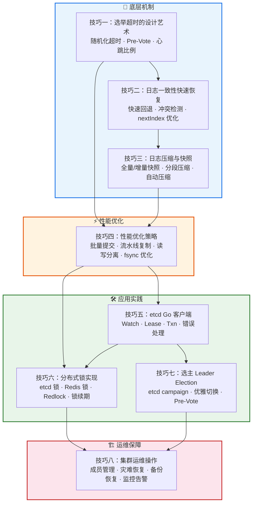
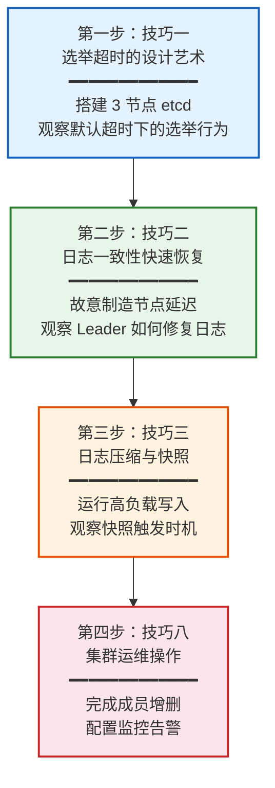
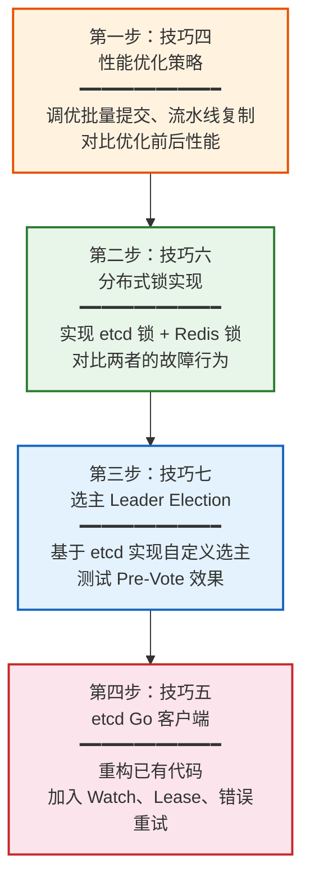

# 核心技巧：从理论到工程的桥梁

在 22.1 理论基础中，我们深入理解了分布式共识的"为什么"——FLP 不可能定理揭示了异步系统中 Safety 与 Liveness 的根本张力，Paxos 两阶段提交展示了多数派交集的精妙设计，Raft 将共识分解为 Leader 选举、日志复制、安全性三个子问题。但理论和工程之间存在巨大的鸿沟：教科书中优雅的算法，在生产环境中会遭遇选举风暴、日志膨胀、脑裂、性能瓶颈、磁盘 IO 瓶颈等一系列真实挑战。

本节（22.2）的核心使命就是填补这道鸿沟——将理论转化为**可操作、可验证、可运维**的工程实践。每个技巧都聚焦一个具体的工程问题，提供可直接使用的代码、配置和操作流程。

## 为什么需要专门学习工程技巧

初学者常见的误区是：理解了 Raft 论文就认为掌握了分布式共识。但现实远比论文复杂：

- **论文假设的"稳定 Leader"在生产中不存在**——网络抖动、节点重启、配置变更、GC 停顿都会打破稳定状态，Leader 可能在任何时刻失效
- **论文的伪代码忽略了所有边界情况**——时钟漂移导致选举超时不准、消息乱序导致日志匹配失败、磁盘故障导致 WAL 损坏、内存不足导致快照失败
- **论文的性能分析基于理想环境**——真实系统的瓶颈往往在 fsync 延迟（单次可达 5-10ms）、网络 RTT 波动（跨可用区 1-5ms，跨地域 50-200ms）、GC 停顿（Go 语言 STW 可达数十毫秒）
- **论文不讨论运维问题**——节点如何安全地增删？数据损坏如何恢复？监控指标如何解读？备份策略如何制定？

以下是一个典型的生产事故场景，展示了理论和工程的差距：

> **场景：etcd 集群选举风暴导致 Kubernetes 全面不可用**
>
> 一个运行在 3 个可用区的 5 节点 etcd 集群，因跨可用区网络出现间歇性延迟（300ms-800ms 波动），触发频繁的 Leader 切换。每次切换导致 200-500ms 的写入不可用，Kubernetes API Server 出现级联故障：所有依赖 API Server 的组件（kubelet、controller-manager、scheduler）开始重试，产生大量请求堆积，最终导致 Pod 调度全面停滞，线上服务无法更新。
>
> **根因分析：** 选举超时设置过短（默认 1000ms），网络抖动导致 Leader 心跳超时，Follower 反复发起选举。每次选举消耗 1-2 个选举超时周期，集群在"选举→短暂稳定→再选举"之间震荡。5 分钟内发生了 47 次 Leader 切换。
>
> **解决：** 增大选举超时范围（1500-3000ms），启用 Pre-Vote 机制防止不必要的选举，调整心跳间隔为超时的 1/5（300ms），并增加 `--experimental-initial-corrupt-check` 检测数据一致性。
>
> **教训：** 理论告诉你"选举是必要的"，工程技巧告诉你"如何让选举稳定可靠"。

## 技巧全景图

本节 8 个技巧按照**底层机制→性能优化→应用实践→运维保障**的层次组织，形成从原理到落地的完整知识链：



### 技巧之间的依赖关系

| 技巧 | 前置技巧 | 核心解决的问题 | 与理论基础的对应 | 重要程度 |
|------|---------|---------------|----------------|---------|
| 技巧一：选举超时 | 无 | Leader 选举的稳定性 | 22.1.3 Raft Leader Election | ⭐⭐⭐⭐⭐ 必修 |
| 技巧二：日志一致性恢复 | 技巧一 | 日志不一致的高效修复 | 22.1.3 Raft Log Replication | ⭐⭐⭐⭐ 必修 |
| 技巧三：日志压缩与快照 | 技巧二 | 日志无限增长的存储危机 | 22.1.3 Raft Snapshot | ⭐⭐⭐⭐ 必修 |
| 技巧四：性能优化 | 技巧一~三 | 高并发下的吞吐和延迟 | 22.1.6 性能指标 | ⭐⭐⭐⭐ 进阶 |
| 技巧五：etcd 客户端 | 无 | 生产级 API 使用 | 22.1.5 etcd vs ZooKeeper | ⭐⭐⭐⭐ 必修 |
| 技巧六：分布式锁 | 技巧五 | 互斥访问共享资源 | 22.1.1 共识属性 | ⭐⭐⭐ 进阶 |
| 技巧七：选主 | 技巧五、六 | 应用层 Leader 协调 | 22.1.3 Raft Election | ⭐⭐⭐ 进阶 |
| 技巧八：集群运维 | 全部 | 长期稳定运行保障 | 22.1.6 运维视角 | ⭐⭐⭐⭐⭐ 必修 |

## 技巧概览

| 技巧 | 主题 | 核心要点 | 难度 | 预计时间 |
|------|------|----------|------|---------|
| 技巧一 | 选举超时的设计艺术 | 随机化超时原理、Pre-Vote 防风暴机制、心跳与超时的比例约束、RTT 适配 | ⭐⭐⭐ | 30-60min |
| 技巧二 | 日志一致性快速恢复 | 快速回退算法（跳过冲突任期）、Log Matching Property 工程应用、nextIndex 优化实现 | ⭐⭐⭐⭐ | 30-60min |
| 技巧三 | 日志压缩与快照 | 全量/增量快照对比、分段压缩策略、etcd 自动压缩配置、快照传输优化 | ⭐⭐⭐ | 30-60min |
| 技巧四 | 性能优化策略 | 批量提交（Batching）、流水线复制（Pipelining）、Leader 读分离（ReadIndex/Lease Read）、Group Commit fsync 优化 | ⭐⭐⭐⭐ | 60-90min |
| 技巧五 | 使用 etcd 的 Go 客户端 | 连接池管理、Watch 机制与 MVCC、Lease 租约与 TTL、Txn 事务、错误处理与重试 | ⭐⭐ | 30-60min |
| 技巧六 | 分布式锁实现 | etcd 锁（基于 Revision）、Redis 锁（SET NX EX）、Redlock 算法争议、锁续期 Watchdog 模式 | ⭐⭐⭐ | 30-60min |
| 技巧七 | 选主（Leader Election） | 基于 etcd campaign 的选主、Pre-Vote 在应用层的应用、优雅切换与故障转移 | ⭐⭐⭐ | 30-60min |
| 技巧八 | 集群运维操作 | 成员动态增删、灾难恢复流程、自动化备份策略、Prometheus 监控告警配置 | ⭐⭐⭐ | 60-90min |

## 核心概念速查

在进入具体技巧之前，先回顾几个贯穿全节的关键概念。这些概念在理论基础（22.1）中详细推导过，这里给出工程视角的精炼总结。

### Raft 协议的三个子问题

Raft 通过强 Leader 模型将共识分解为三个独立子问题，每个子问题对应本节的若干技巧：

1. **Leader Election（选举）**：集群如何产生唯一的 Leader？对应技巧一（超时设计）和技巧七（选主实现）。核心机制是随机化选举超时 + 任期（Term）递增 + 多数派投票。工程中的关键挑战是如何在频繁的网络抖动下保持选举稳定性。

2. **Log Replication（日志复制）**：Leader 如何将操作序列同步到所有节点？对应技巧二（日志一致性恢复）和技巧三（日志压缩）。核心机制是 AppendEntries RPC + 日志匹配属性 + 快照。工程中的关键挑战是如何高效修复不一致日志、如何控制日志无限增长。

3. **Safety（安全性）**：如何保证已提交的日志不丢失？贯穿所有技巧。核心保证是 Leader Completeness Property——任何已提交的日志条目一定出现在后续所有 Leader 的日志中。工程中的关键挑战是确保配置变更、快照传输等操作不破坏安全性不变量。

### 关键参数与推荐值

以下参数在不同技巧中反复出现，理解其含义和调优逻辑至关重要：

| 参数 | 推荐值 | 含义 | 调优逻辑 | 设错的后果 |
|------|--------|------|---------|-----------|
| ElectionTimeout | 1500-3000ms（随机范围） | Follower 等待心跳的最长时间，超时则发起选举 | 太短→选举风暴；太长→故障恢复慢。应为 RTT 的 10 倍以上，跨可用区部署需适当增大 | 频繁 Leader 切换，写入抖动，级联故障 |
| HeartbeatInterval | ElectionTimeout/5 ~ ElectionTimeout/10 | Leader 发送心跳的固定间隔 | 应远小于选举超时，确保心跳在超时前到达 | 一次网络抖动就触发选举 |
| SnapshotThreshold | 10000 条 | 累计日志条目数达到此值时触发快照 | 太小→频繁快照浪费 IO；太大→日志同步慢、存储膨胀 | 快照文件过大导致恢复时间过长，或快照过于频繁导致 IO 抖动 |
| MaxLogEntries | 1000 条 | 单次 AppendEntries RPC 携带的最大日志条目数 | 太小→RPC 次数多、延迟高；太大→单次 RPC 耗时长、重传代价大 | 批量复制延迟增大或网络带宽浪费 |
| PreVote | 启用（etcd 3.4+ 默认） | 选举前的"探测"阶段，确认自己能否赢得选举 | 防止网络分区恢复后的选举风暴 | 网络恢复后大量 Follower 同时发起选举 |
| SnapshotCatchUpEntries | 200 条 | 新节点日志落后超过此值时，Leader 直接发送快照而非逐条补日志 | 太小→不必要的快照传输；太大→补日志耗时过长 | 新节点同步时间过长或快照传输过于频繁 |
| MaxRequestBytes | 1.5MB | 单次客户端请求的最大字节数 | 太大→大请求阻塞小请求；太小→大 KV 操作被拒绝 | 客户端写入失败或请求队列堆积 |
| QuotaBackendBytes | 2GB | etcd 存储配额上限 | 超过后集群拒绝写入。应根据数据增长速率设置 | 集群进入只读模式，所有写入失败 |

> **工程经验：** 以上参数不是"设好就忘"的——它们需要根据集群规模、网络条件和业务负载持续调优。etcd 官方文档提供了详细的参数调优指南，建议结合监控数据定期评审。一个常见的做法是建立参数变更审批流程，每次调整都记录变更原因和效果。

### 选举超时、心跳间隔、RTT 的三角关系

这三个参数之间存在严格的约束关系，理解这个关系是技巧一的基础：

ElectionTimeout > 10 × RTT
HeartbeatInterval = ElectionTimeout / 5 ~ ElectionTimeout / 10
MaxLogEntries × RTT < ElectionTimeout

**为什么 ElectionTimeout 必须远大于 RTT？** 因为心跳消息的往返需要一个 RTT 的时间。如果 ElectionTimeout 接近 RTT，网络的正常波动就会导致心跳"迟到"，触发不必要的选举。经验法则是至少 10 倍。例如，跨可用区 RTT 为 2ms，则 ElectionTimeout 至少应为 20ms；实际上考虑到 RTT 波动和系统抖动，推荐设为 1500ms 以上。

**为什么 HeartbeatInterval 要远小于 ElectionTimeout？** 心跳是 Leader 维持权威的"生命信号"。如果心跳间隔接近选举超时，一次网络抖动就可能导致多个心跳丢失，进而触发选举。保持 5-10 倍的安全余量。例如 ElectionTimeout 为 1500ms，则心跳间隔应为 150-300ms。

**为什么 MaxLogEntries × RTT < ElectionTimeout？** 批量发送日志条目时，如果一批日志的传输时间超过选举超时，Follower 会认为 Leader 已失联并发起选举。这个约束确保批量传输能在选举超时内完成。

### 分布式系统的两大故障模型

理解故障模型是选择正确策略的前提：

| 故障类型 | 特征 | Raft 的应对 | 典型场景 |
|---------|------|------------|---------|
| **崩溃故障（Crash Fault）** | 节点突然停止响应，但不发送错误信息 | 选举超时检测 + 多数派容错 | 服务器断电、进程 OOM 被杀、硬件故障 |
| **网络分区（Network Partition）** | 节点仍在运行，但部分通信路径断开 | Leader 检测 + Pre-Vote 防止不必要选举 | 跨可用区网络抖动、交换机故障、防火墙规则错误 |
| **拜占庭故障（Byzantine Fault）** | 节点可能发送任意错误信息 | Raft 不支持，需要 PBFT/HotStuff | 恶意攻击、硬件比特翻转、软件 Bug 导致数据损坏 |

> **工程重点：** 本节所有技巧都基于崩溃故障和网络分区模型。拜占庭容错属于 22.1.4 的范畴。在实际系统中，崩溃故障占 95% 以上，拜占庭故障极为罕见（除非在区块链或高安全场景）。

## 学习路径设计

根据你的当前状态和目标，选择最适合的路径。不要试图一次走完所有路径——**精通一个路径胜过浅尝三个**。

### 路径 A：初学者（从零搭建，预计 4-6 小时）

适合第一次接触分布式共识工程实践的读者。按顺序学习，每步都有实操验证。



**验证标准：** 能独立部署 3 节点 etcd 集群；能手动 kill Leader 进程并观察新 Leader 在 1-2 个选举超时周期内选出；能配置 Prometheus + Grafana 监控 Leader 切换次数、WAL fsync 延迟、提案应用速率。

### 路径 B：进阶者（已有 etcd 经验，预计 3-4 小时）

适合使用过 etcd 但想深入理解底层机制的工程师。跳过基础，直击痛点。



**验证标准：** 能说出 etcd 关键参数的调优逻辑（如为什么 ElectionTimeout 要 10 倍于 RTT）；能实现生产级分布式锁（含续期、优雅释放、fencing token）；能排查 Leader 频繁切换的根因（通过日志和监控指标）。

### 路径 C：实战者（快速上手，预计 2-3 小时）

适合有明确业务需求、需要快速落地的工程师。按需跳跃阅读。

| 业务场景 | 必读技巧 | 核心产出 |
|---------|---------|---------|
| 部署高可用配置中心 | 技巧五（etcd 客户端）+ 技巧八（集群运维） | 3 节点 etcd 集群 + Watch 实时推送 + 自动备份 |
| 实现分布式任务调度 | 技巧七（选主）+ 技巧六（分布式锁） | Active-Standby 选主 + 互斥任务执行 |
| 优化现有 etcd 集群性能 | 技巧四（性能优化）+ 技巧三（日志压缩） | 参数调优方案 + 快照策略 + 性能基线对比 |
| 排查 etcd 生产故障 | 技巧一（选举超时）+ 技巧二（日志一致性）+ 技巧八（集群运维） | 故障诊断流程 + 根因分析 + 恢复方案 |

### 路径 D：面试准备（重点突击，预计 2-3 小时）

针对分布式系统相关面试，按高频考点组织：

| 考点 | 必读技巧 | 面试常见问法 | 回答要点 |
|------|---------|-------------|---------|
| Raft 选举机制 | 技巧一、技巧七 | "Raft 如何防止脑裂？选举超时为什么是随机的？" | 随机化超时打破同步 + 任期递增过滤旧消息 + Pre-Vote 防止不必要的选举 |
| 日志一致性 | 技巧二 | "Leader 如何发现并修复日志不一致？nextIndex 回退逻辑是什么？" | Log Matching Property + 逐条回退 vs 跳过任期优化 + 快照兜底 |
| 分布式锁 | 技巧六 | "etcd 锁和 Redis 锁有什么区别？Redlock 为什么有争议？" | etcd 基于共识保证唯一性 vs Redis 主从切换可能丢锁 vs Redlock 的时钟依赖问题 |
| 性能优化 | 技巧四 | "共识协议的性能瓶颈在哪里？如何优化写入吞吐？" | 网络 RTT（批量+流水线）+ 磁盘 fsync（Group Commit）+ Leader 瓶颈（读写分离） |
| 故障恢复 | 技巧三、技巧八 | "节点宕机后如何恢复？快照和日志的关系是什么？" | WAL + 快照重建状态机 + 新节点先同步快照再补日志 |

## 关键概念深度解析

### 为什么选举超时必须是随机的

这是技巧一的核心，也是 Raft 最精妙的设计之一。

假设 3 个节点的选举超时都是固定的 300ms，同时启动后会在同一时刻超时，同时发起选举，同时给自己投票——没有任何节点能获得多数票（每节点各 1 票）。然后所有节点进入下一个任期，再次同时超时……系统陷入**活锁**（Liveness 被破坏），永远无法选出 Leader。

Raft 的解决方案简洁而优雅：**给每个节点一个随机化的选举超时范围**（如 150-300ms）。这样不同节点超时的概率分布是均匀的，先超时的节点有更高概率赢得选举。理论证明，随机化超时能在 O(1) 期望时间内选出 Leader。

```go
// Raft 随机化选举超时的核心实现
func randomizedElectionTimeout() time.Duration {
    // 基础超时 + 随机偏移
    base := 150 * time.Millisecond
    jitter := rand.Intn(150) // 0-149ms
    return base + time.Duration(jitter)*time.Millisecond
    // 最终范围: 150ms ~ 299ms
}
```

**工程实践中的注意事项：**

1. **随机数生成器的质量**：如果随机数分布不均匀（如使用线性同余生成器且种子选择不当），可能导致某些超时值出现频率过高，重新引入同步问题。生产实现应使用 crypto/rand 或高质量的 PRNG。

2. **超时范围的选择**：范围太小（如 150-160ms），随机化效果有限，仍有较高概率同时超时；范围太大（如 150-5000ms），虽然同步概率极低，但故障恢复时间过长。推荐范围为 2:1 到 3:1（如 150-300ms）。

3. **时钟漂移的影响**：不同节点的系统时钟可能存在毫秒级漂移，这实际上增加了自然的随机性。但在虚拟化环境中，时钟漂移可能更大，反而需要更大的超时范围来补偿。

### Pre-Vote：选举风暴的防火墙

Pre-Vote 是 Raft 论文提出后的重要工程改进（Diego Ongaro 在博士论文中详细讨论），被 etcd、TiKV 等主流实现采用。

**问题场景：** 一个 Follower 因网络分区暂时失去与 Leader 的联系，它的任期没有更新（仍在旧任期）。网络恢复后，它发起选举，把自己的任期推高到一个很高的值。Leader 收到高任期的 RequestVote 后会降级为 Follower，导致不必要的 Leader 切换——这就是**选举风暴**。更严重的是，如果多个 Follower 同时恢复，它们会交替推高任期，形成"任期军备竞赛"。

**Pre-Vote 解决方案：** 在真正发起选举前，先进行一轮"预投票"（Pre-Vote）。节点向所有其他节点发送 PreVote 请求，只有在获得多数派支持时才真正发起选举。PreVote 不会增加任期号，所以失败的 PreVote 不会污染集群的任期状态。

正常选举（无 Pre-Vote）：
  Follower A 超时 → RequestVote(term=5) → 所有节点看到 term=5 → Leader 降级
  问题：即使 A 无法赢得选举，集群的 term 也被推高了

Pre-Vote 选举：
  Follower A 超时 → PreVote(term=4) → 多数派同意？
    → 是：RequestVote(term=5) → 正常选举
    → 否：放弃选举，保持 Follower（任期未变化）
  优势：失败的 PreVote 不影响集群状态

**Pre-Vote 的额外好处：**

1. **防止日志截断**：在没有 Pre-Vote 的情况下，一个落后的 Follower 发起高任期选举并短暂成为 Leader 后，可能截断其他节点已提交的日志（如果它不知道哪些日志已提交）。Pre-Vote 确保只有日志足够新的节点才能发起选举。

2. **减少不必要的服务中断**：每次 Leader 切换都会导致短暂的写入不可用（通常 1-2 个选举超时周期）。Pre-Vote 减少了不必要的切换次数。

**生产建议：** 在所有生产环境的 etcd 集群中启用 Pre-Vote。etcd 3.4+ 默认启用。

### 日志匹配属性：一致性恢复的基石

技巧二的核心是理解**日志匹配属性（Log Matching Property）**，它是 Raft 日志一致性保证的理论基础：

> 如果两个日志在某个索引位置包含相同任期的条目，那么这两个日志在该索引之前的所有条目也相同。

这个属性意味着：Leader 只需记住每个 Follower 的 `nextIndex`（下一个要发送的日志索引），就能高效地发现并修复不一致——**从冲突点回退到一致点**。

原版 Raft 论文的回退策略是逐条回退（每次 nextIndex--），效率较低。工程优化后的策略是**跳过冲突任期的所有日志**，大幅减少 RPC 次数：

原版回退（逐条）：
  nextIndex: 10 → 9 → 8 → 7 → 6 → 5 → 4（找到一致点）
  需要 6 次 AppendEntries RPC

优化回退（跳过任期）：
  Follower 在 index=7 发现 term=3 的冲突
  → Leader 查找自己日志中 term=3 的范围 [4, 6]
  → 直接设置 nextIndex = 4
  需要 1 次 AppendEntries RPC

**工程实现中的关键细节：**

1. **冲突检测的判断条件**：Follower 在收到 AppendEntries 时，如果发现 `prevLogIndex` 处的任期不匹配，需要返回冲突信息（冲突任期 + 该任期的第一个索引）。Leader 利用这些信息快速定位一致点。

2. **nextIndex 的初始值优化**：新 Leader 刚上任时，通常将所有 Follower 的 nextIndex 设为自己的日志末尾。对于日志差距大的 Follower，可以设置一个更激进的初始值（如 `leader.logLen/2`），减少回退次数。

3. **快照兜底**：当 Follower 的日志严重落后（落后超过 SnapshotCatchUpEntries 条），Leader 直接发送快照而非逐条补日志。这是技巧二和技巧三的衔接点。

### 日志压缩：快照不是简单的"存档"

技巧三的核心认知是：**快照（Snapshot）不只是保存状态机的状态，它还改变了日志的语义**。

压缩前的日志：`[1][2][3][4][5][6][7][8]`（全部需要保留）

压缩后的快照 + 日志：`Snapshot{应用到index=5} [6][7][8]`（前 5 条已"消化"）

压缩带来的连锁影响：

1. **新节点加入时**：Leader 需要先发送快照，再发送剩余日志。如果快照太大（比如压缩太频繁导致快照很大），新节点的同步时间会很长。etcd 的快照大小通常在 100MB-1GB 之间，传输时间取决于网络带宽。

2. **日志索引的"断层"**：压缩后日志从 index=6 开始，但快照记录了"已应用到 index=5"。所有协议消息中的 `prevLogIndex` 必须能正确处理这个断层。etcd 通过 `compact_revision` 机制管理这个映射。

3. **压缩期间的一致性**：快照操作本身需要是原子的——不能在写快照文件的中途被 Leader 的新日志追加打断。etcd 的实现是先将状态机序列化到临时文件，然后原子性地替换旧快照文件。

4. **增量快照 vs 全量快照**：全量快照简单但 IO 开销大；增量快照只传输变化部分，但实现复杂。etcd 目前只支持全量快照，TiKV 支持增量快照。

## 性能优化的核心思路（技巧四概要）

性能优化的本质是**减少不必要的等待和重复计算**。共识协议的三大性能瓶颈及其优化策略：

| 瓶颈 | 原因 | 优化策略 | 预期效果 | 适用场景 |
|------|------|---------|---------|---------|
| 网络 RTT | 每条日志需要一次 RPC 往返 | 批量提交（Batching）：合并多条写入为一次 RPC | 吞吐提升 3-10 倍 | 高写入吞吐场景 |
| 网络 RTT | 顺序复制，后续日志等待前一条确认 | 流水线复制（Pipelining）：不等确认就发下一条 | 延迟降低 30-50% | 低延迟要求场景 |
| 磁盘 fsync | 每条日志写入需要 fsync 保证持久化 | Group Commit：累积多条日志后一次 fsync | IO 次数减少 5-20 倍 | 高并发写入场景 |
| Leader 瓶颈 | 所有读写都经过 Leader | 读写分离：读请求走 Follower（ReadIndex/Lease Read） | 读吞吐提升 N 倍（N=节点数） | 读多写少场景 |

**关键权衡：** 每种优化都在性能和一致性之间做取舍。例如，读写分离降低了读延迟，但 ReadIndex 方式需要额外一次 RTT 确认 Leader 身份；Lease Read 依赖时钟精度，时钟漂移可能导致读到旧数据。选择哪种策略取决于业务对一致性级别和延迟的容忍度。

### 读写分离的三种模式对比

| 模式 | 一致性级别 | 额外开销 | 适用场景 |
|------|-----------|---------|---------|
| **Leader Read** | 线性一致 | 无 | 对一致性要求最高的场景 |
| **ReadIndex** | 线性一致 | 1 次 RTT（确认 Leader 身份） | 需要线性一致但不想走 Leader 的读 |
| **Lease Read** | 有界过期（Bounded Staleness） | 无（依赖时钟） | 可接受短暂过期的高吞吐读 |
| **Follower Read** | 最终一致 | 无 | 可接受过期数据的场景 |

## 应用实践的关键模式（技巧五-七概要）

### etcd 客户端最佳实践（技巧五）

etcd 的 Go 客户端（`go.etcd.io/etcd/client/v3`）是生产中使用最广泛的共识协议客户端。核心使用模式：

- **Watch 机制**：监听 key 的变更事件，实现实时配置推送。Watch 基于 etcd 的 MVCC（多版本并发控制），支持从指定 revision 开始监听，保证不丢事件。关键配置：`WithPrevKV()` 获取变更前的值，`WithProgressNotify()` 定期接收进度通知防止 Watch 假死。
- **Lease 机制**：为 key 设置租约（TTL），到期自动删除。用于实现心跳检测、临时数据、分布式锁的自动过期。关键配置：`WithLease(leaseID)` 绑定 key 和 lease，`KeepAlive()` 定期续期。
- **事务（Txn）**：原子的 IF-THEN-ELSE 操作，用于实现条件写入、CAS 语义、分布式锁的获取/释放。关键模式：`If(cmp).Then(op1, op2).Else(op3)` 原子执行条件分支。

### 分布式锁的设计要点（技巧六）

分布式锁看似简单，实则是共识协议最容易出错的应用场景：

- **etcd 锁**：基于 Revision 全局递增的特性，实现公平的等待队列。锁的获取/释放是原子的（通过 Txn 事务），无需额外的 fencing token。etcd 的 `concurrency` 包提供了开箱即用的分布式锁实现。
- **Redis 锁**：基于 `SET key value NX EX ttl`，简单但有隐患——Redis 主从切换可能丢失锁。Redlock 算法试图解决这个问题，但被 Martin Kleppmann 质疑其安全性（主要论点：依赖时钟单调性，GC 停顿可能导致锁持有者认为自己仍持有锁）。
- **锁续期**：所有基于 TTL 的锁都需要续期（Watchdog 模式），否则执行时间超过 TTL 会导致锁提前释放，引发并发冲突。etcd 的 Lease 机制天然支持续期，Redis 需要额外实现。

### 选主的工程实现（技巧七）

应用层选主（区别于 Raft 内部的 Leader 选举）用于协调业务组件的 Active-Standby 部署：

- **etcd campaign**：etcd 提供的选主 API，底层基于 Raft 共识，天然保证唯一性。使用 `concurrency.NewElection()` 创建选举，`election.Campaign()` 参与竞选，`election.Resign()` 主动退出。
- **优雅切换**：Leader 下线前应主动释放锁/通知 Follower 接管，避免"脑裂"期间的双重写入。实现方式：捕获 SIGTERM 信号 → 停止接受新请求 → 等待进行中的请求完成 → 释放锁/通知接管。
- **Pre-Vote 在应用层的应用**：Follower 在尝试成为 Leader 前，先确认自己能被多数派接受，避免无谓的切换。这在业务层的选主中同样重要——一个"不健康"的节点不应该尝试接管 Leader 角色。

## 运维保障（技巧八概要）

运维是确保集群长期稳定运行的最后防线：

- **成员管理**：etcd 支持动态增删节点，无需停机。新增节点自动从 Leader 同步数据，删除节点自动退出集群。关键命令：`etcdctl member add/remove`。注意：每次成员变更只允许增减一个节点，不允许同时增删多个。
- **灾难恢复**：当多数节点损坏时，需要从备份恢复。etcd 支持 `snapshot save/restore`，恢复后需更新集群成员配置。恢复流程：停止所有节点 → 选择最新快照 → 恢复到所有节点 → 更新成员列表 → 启动集群。
- **监控告警**：关键指标包括 Leader 切换次数（etcd_server_leader_changes_seen_total）、提案应用速率（etcd_server_proposals_applied_total）、WAL fsync 延迟（wal_fsync_duration_seconds）、磁盘 WAL 失败（etcd_disk_wal_failed_duration_seconds）、客户端请求延迟（etcd_disk_wal_fsync_duration_seconds）。
- **数据备份**：建议每小时自动备份，保留最近 24 小时的快照。备份脚本应包含完整性校验（SHA256）。自动化示例：`etcdctl snapshot save /backup/etcd-$(date +%Y%m%d%H%M).db && sha256sum /backup/etcd-*.db > /backup/checksum.txt`。

## 常见陷阱速查

在学习和使用本节技巧时，以下是最容易踩的坑：

| 陷阱 | 表现 | 根因 | 纠正方法 | 严重程度 |
|------|------|------|---------|---------|
| 选举超时设太短 | 频繁 Leader 切换、写入抖动 | 超时 < 10 × RTT | 增大到 1500-3000ms，确保 > 10 × RTT | 🔴 严重 |
| 心跳间隔与超时太近 | 一次网络抖动就触发选举 | 心跳间隔 > ElectionTimeout/5 | 设为 ElectionTimeout 的 1/5 ~ 1/10 | 🔴 严重 |
| 忽略 Pre-Vote | 网络恢复后选举风暴 | Follower 未更新任期却发起选举 | 生产环境务必启用 Pre-Vote（etcd 3.4+ 默认启用） | 🟡 中等 |
| 分布式锁不续期 | 执行超时导致锁提前释放 | TTL 过期后锁自动释放 | 实现 Watchdog 定期续期（etcd 用 Lease，Redis 用后台线程） | 🔴 严重 |
| 快照太频繁 | 新节点同步慢、IO 压力大 | SnapshotThreshold 太小 | 调大阈值到 10000+，观察快照文件大小 | 🟡 中等 |
| 读写不分离 | Leader 成为性能瓶颈 | 所有请求都走 Leader | 用 ReadIndex/Lease Read 分离读请求 | 🟡 中等 |
| 盲目增加节点 | 5 节点性能下降但可用性未显著提升 | 5 节点只多容忍 1 个故障（与 3 节点相同） | 根据实际需求选择：3 节点容忍 1 故障，5 节点容忍 2 故障 | 🟢 低 |
| 备份策略缺失 | 数据损坏后无法恢复 | 认为有副本就不需要备份 | 副本不能防止逻辑错误，必须定期备份 | 🔴 严重 |
| 忽略磁盘 IO | fsync 延迟导致整体吞吐下降 | 使用机械硬盘或共享存储 | 使用本地 SSD，监控 fsync 延迟 | 🔴 严重 |
| 未配置存储配额 | 集群写满后进入只读模式 | 未设置 QuotaBackendBytes | 设置合理的配额（默认 2GB），监控存储使用率 | 🟡 中等 |

## 实践建议

### 从理论到实践的过渡

1. **先跑起来，再调优**：不要一开始就追求完美的参数配置。先用默认值搭建集群，观察行为，再逐步调优。etcd 的默认配置已经适合大多数开发和测试场景。

2. **用实验验证直觉**：分布式系统的行为常常违反直觉。每个技巧都建议搭建实验环境，手动触发故障（如 `kill -9` Leader 进程、`tc netem` 模拟网络延迟），观察系统行为。实验是理解分布式系统最有效的方式。

3. **监控先行**：在调优之前，先确保有完善的监控。没有数据支撑的调优是盲人摸象。推荐的监控栈：Prometheus + Grafana + etcd 的 `/metrics` 端点。

4. **文档化每次变更**：每次参数调整、成员变更、故障恢复都应记录变更时间、变更内容、变更原因和效果。这是事后复盘和知识积累的基础。

### 生产环境的铁律

1. **至少 3 节点**：2 节点集群不能容忍任何节点故障（没有多数派），3 节点是生产环境的最低要求。

2. **奇数节点**：3、5、7 节点。4 节点和 3 节点的容错能力相同（都容忍 1 个故障），但 4 节点的投票开销更大（需要 3 票而非 2 票）。

3. **跨机架/可用区部署**：避免单点故障。3 个节点分布在不同的机架或可用区。如果所有节点在同一机架，机架级故障（如交换机故障）会导致集群不可用。

4. **定期备份**：即使有副本，也要定期备份。副本不能防止数据损坏（如 Bug 导致的逻辑错误、人为误操作删除数据）。

5. **演练故障恢复**：每季度至少做一次故障演练，验证备份和恢复流程的有效性。演练内容包括：模拟 Leader 宕机、模拟多数节点宕机、从备份恢复、成员变更。

6. **版本升级策略**：etcd 升级应遵循滚动升级策略：先升级 Follower → 确认稳定 → 升级 Leader。升级前必须备份数据。跨大版本升级需参考官方迁移指南。

7. **告警阈值设置**：关键告警应包括：Leader 切换频率 > 1次/小时、WAL fsync 延迟 P99 > 10ms、存储使用率 > 80%、客户端请求失败率 > 0.1%。

## 测试与验证策略

分布式共识系统的测试比普通应用复杂得多，因为涉及时间、并发和故障三个维度的不确定性。

### 测试层次

| 层次 | 方法 | 工具 | 覆盖目标 |
|------|------|------|---------|
| **单元测试** | 模拟单个节点的行为 | Go testing | 选举超时逻辑、日志匹配、快照触发条件 |
| **集成测试** | 多节点交互测试 | etcd 集成测试框架 | Leader 选举、日志复制、成员变更 |
| **混沌测试** | 注入随机故障 | Chaos Mesh, litmus | 网络分区、节点宕机、磁盘故障 |
| **性能测试** | 压力测试 | benchmark, ycsb | 吞吐量、延迟、资源消耗 |
| **回归测试** | 已知 Bug 的验证 | CI/CD pipeline | 防止已修复的问题复现 |

### 混沌工程实践

混沌测试是验证分布式共识系统鲁棒性的关键手段：

1. **网络分区测试**：使用 `tc netem` 或 Chaos Mesh 注入网络延迟（100ms-1000ms）和丢包（1%-10%），观察 Leader 切换频率和恢复时间。

2. **节点宕机测试**：随机 kill etcd 进程，验证集群在丢失 1-2 个节点后仍能正常服务，以及节点恢复后能自动加入集群并同步数据。

3. **磁盘故障模拟**：使用 `dd` 写入大量数据模拟磁盘 IO 瓶颈，或直接删除 WAL 文件模拟磁盘损坏，验证备份恢复流程。

4. **时钟偏移测试**：使用 `faketime` 或 `adjtimex` 修改系统时钟，观察选举超时和 Lease Read 的行为。

### 验证清单

在将 etcd 集群投入生产前，确认以下检查项：

- [ ] 至少 3 个节点，分布在不同的故障域
- [ ] 选举超时 > 10 × 网络 RTT
- [ ] 心跳间隔 = 选举超时 / 5 ~ 选举超时 / 10
- [ ] Pre-Vote 已启用
- [ ] 存储配额已设置（QuotaBackendBytes）
- [ ] 自动备份已配置（每小时，保留 24 小时）
- [ ] Prometheus 监控已接入（Leader 切换、WAL fsync、存储使用率）
- [ ] 告警规则已配置（Leader 切换 > 1次/小时、fsync P99 > 10ms）
- [ ] 故障恢复流程已文档化并演练过
- [ ] 客户端使用了 Watch + Lease + Txn 的标准模式

## 本节小结

核心技巧是连接理论与实践的桥梁。掌握这 8 个技巧，你将具备：

- **底层机制理解**：知道选举超时为什么这样设计、日志一致性如何恢复、快照如何工作，以及这些机制在故障场景下的行为
- **性能优化能力**：能识别瓶颈（网络 RTT、磁盘 fsync、Leader 瓶颈）、选择合适的优化策略（批量提交、流水线复制、读写分离）、量化优化效果（吞吐提升倍数、延迟降低比例）
- **应用开发能力**：能用 etcd 客户端构建分布式锁、选主、配置中心等应用，理解每种模式的适用场景和局限性
- **运维保障能力**：能部署、监控、备份、恢复生产级 etcd 集群，具备故障诊断和恢复的实战经验

掌握这些技巧后，你不仅能"用好"etcd，更能"理解"etcd——当遇到问题时，你能从原理层面分析根因，而不是盲目搜索解决方案。这种从"知其然"到"知其所以然"的跃迁，正是本节的核心价值。

接下来，我们逐一深入每个技巧。建议从技巧一（选举超时）开始——它是理解后续所有技巧的基础。
