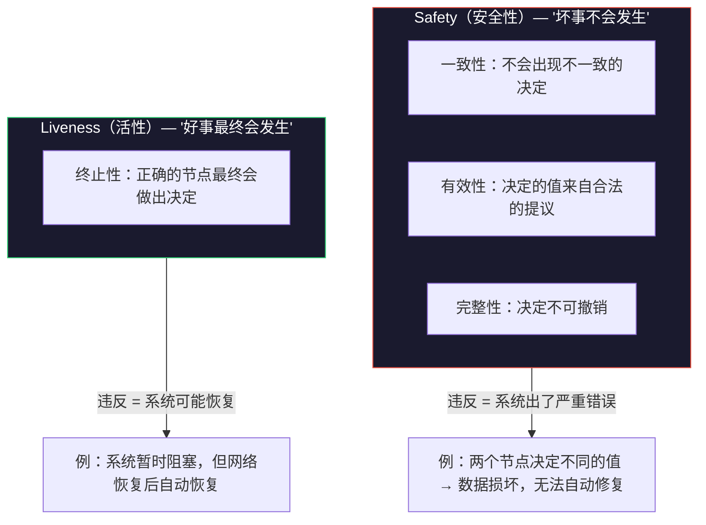
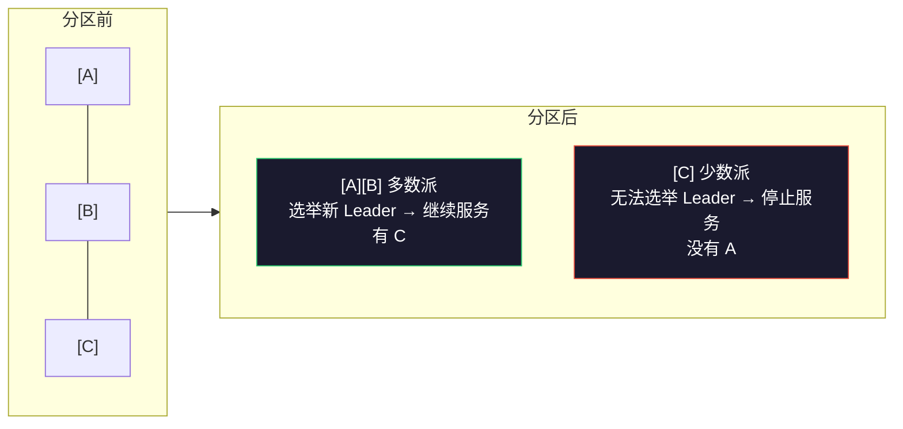
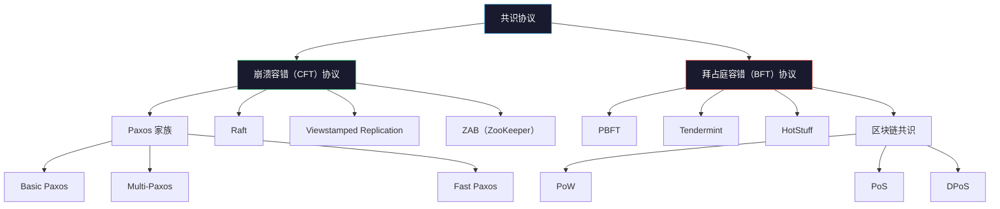

# 什么是分布式共识

## 1. 引言：从一个简单问题说起

假设你和两个朋友需要决定今晚去哪里吃饭。如果你们三个坐在同一张桌子旁，这很简单——每人说一个选项，投票决定即可。但如果你们三个分别在三个不同的城市，只能通过电话沟通，而且电话可能断线、延迟、甚至传错信息——问题就变得异常困难。

这正是分布式共识（Distributed Consensus）的核心挑战：**多个地理位置分散的节点，如何在不可靠的通信条件下，就某个值达成一致？**

这个问题看起来直觉上应该有简单解法，但事实上它是分布式计算领域中最深刻、最困难的问题之一。从 1980 年代 Leslie Lamport 提出拜占庭将军问题，到 1989 年 Fischer、Lynch 和 Paterson 证明 FLP 不可能定理，再到 2014 年 Raft 协议以"可理解性"为目标重新设计共识算法——四十年来，这个问题催生了分布式系统领域最核心的理论成果和工程实践。

理解分布式共识，是理解整个分布式系统架构的钥匙。无论是 Kubernetes 集群的高可用调度、分布式数据库的跨节点复制、还是区块链网络的去信任化交易，底层都建立在共识协议之上。

## 2. 为什么分布式共识如此重要

### 2.1 现代基础设施的基石

分布式共识不是一个学术象牙塔里的概念——它运行在你每天使用的每一个互联网服务背后：

- **Kubernetes 的大脑 etcd**：etcd 使用 Raft 共识协议来保证集群状态的一致性。Kubernetes 中所有的 Service、Deployment、ConfigMap 等资源的状态都存储在 etcd 中。如果 etcd 的共识机制失败，整个 Kubernetes 集群将陷入混乱——新的 Pod 无法调度、服务发现失效、配置更新丢失。
- **分布式数据库**：TiKV（TiDB 的存储引擎）、CockroachDB、YugabyteDB 等 NewSQL 数据库底层都依赖 Raft 或 Paxos 来实现跨节点的数据复制和一致性保证。没有共识协议，这些数据库无法在分布式环境下同时保证数据正确性和高可用。
- **分布式锁与选主**：Redis Sentinel、ZooKeeper 等协调服务的核心功能——分布式锁、领导者选举、配置管理——都建立在共识协议之上。ZooKeeper 的 ZAB 协议保证了全局有序的写入，使分布式锁的"先到先得"语义成为可能。
- **区块链**：比特币的 PoW、以太坊的 PoS、联盟链的 PBFT，本质上都是共识协议在去中心化场景下的变体。区别在于，传统共识假设大多数节点是诚实的（CFT），而区块链必须假设存在恶意节点（BFT）。
- **云存储与消息队列**：AWS S3 的跨区域复制、Kafka 的多副本同步、Ceph 的 CRUSH 算法——这些存储系统虽然不完全依赖经典共识协议，但核心思想一脉相承：在多个副本之间协调状态，确保数据的持久性和一致性。

### 2.2 不使用共识协议会怎样

如果不使用共识协议，分布式系统将面临以下致命问题：

| 问题 | 描述 | 后果 |
|------|------|------|
| **数据不一致** | 不同节点存储不同的数据副本 | 用户看到的数据取决于连接到哪个节点 |
| **脑裂（Split Brain）** | 网络分区后多个节点各自认为自己是"主" | 并发写入导致数据冲突和丢失 |
| **状态丢失** | 没有多数派确认的写入可能丢失 | 用户已确认的操作实际上没有持久化 |
| **协调失败** | 分布式锁、选主等协调功能无法正确运行 | 系统行为不确定，可能出现"双主" |
| **级联故障** | 一个节点的错误数据传播到整个系统 | 错误数据被所有副本接受并放大 |

### 2.3 一个直觉性例子：分布式 KV 存储

考虑一个最简单的场景：三个节点 A、B、C 构成一个分布式键值存储，客户端可以读写任意节点。如果没有共识协议，以下场景将导致灾难：

时间线：
T1: 客户端向 A 写入 "name=Alice"（A 成功写入）
T2: 网络延迟，B、C 尚未收到更新
T3: 客户端从 B 读取 "name" → 返回旧值 "Bob"
    → 客户端困惑：刚写入的 Alice 去哪了？
T4: 网络恢复，B、C 收到 A 的更新 → 三个节点终于一致
    → 但在 T2-T4 这段时间内，系统返回了不一致的数据

更严重的情况是脑裂。假设网络分区后 A 和 B 各自认为自己是主节点，同时接受写入：

T1: 网络分区发生，A 与 C 断开，B 与 C 断开
T2: A 和 B 各自选出自己为 Leader
T3: 客户端 1 向 A 写入 "name=Alice"
T4: 客户端 2 向 B 写入 "name=Bob"
T5: 网络恢复，A、B、C 需要合并数据
    → "name" 的最终值是什么？Alice 还是 Bob？
    → 没有共识协议，这就是一个无解的问题

共识协议要解决的正是这个问题：**如何保证所有节点在任何时刻都拥有相同的数据视图，或者至少在返回结果时是确定一致的。**

## 3. 分布式共识的形式化定义

### 3.1 系统模型

在讨论共识问题之前，我们需要定义分布式系统的运行环境。系统模型（System Model）描述了节点和网络的行为假设：

**节点行为模型：**

| 模型 | 描述 | 现实对应 | 典型协议 |
|------|------|----------|----------|
| **故障停止（Crash-stop）** | 节点要么正常工作，要么永久停止 | 进程被 kill 后不再重启 | Basic Paxos |
| **故障恢复（Crash-recovery）** | 节点可能崩溃，但可以恢复并保留部分状态 | 服务器重启后从磁盘恢复 | Multi-Paxos, Raft |
| **拜占庭（Byzantine）** | 节点可能以任意方式行为——撒谎、发送矛盾信息 | 恶意攻击者控制的节点 | PBFT, Tendermint |

**网络行为模型：**

| 模型 | 描述 | 特征 | 实际意义 |
|------|------|------|----------|
| **同步（Synchronous）** | 消息在已知的有限时间内送达 | 不现实，但理论上最简单 | 无法在现实中实现 |
| **异步（Asynchronous）** | 消息可能无限延迟，没有上界 | 最接近现实，但最困难 | FLP 定理的适用场景 |
| **部分同步（Partial Synchrony）** | 消息最终会在某个未知的时间内送达 | 现实中最常见的假设 | Raft/Paxos 的设计基础 |

> **关键洞察：** 绝大多数实际系统运行在**部分同步模型**下——网络大部分时间是正常的，偶尔会出现延迟或分区，但消息最终会送达。共识协议的设计目标是在这种现实条件下同时保证安全性和活性。

**为什么系统模型如此重要？** 因为不同的模型假设直接决定了共识问题的可解性。在同步模型下，共识是简单可解的（消息超时就能检测故障）；在纯异步模型下，FLP 定理证明了确定性算法不可能同时保证 Safety 和 Liveness；而在部分同步模型下，通过引入超时机制，我们可以获得实际可用的解。

### 3.2 共识问题的形式化描述

给定 `n` 个节点，其中最多 `f` 个可能发生故障，每个节点都有一个初始值（可能不同）。共识协议的目标是让所有正确（未故障）的节点最终就某个值达成一致决定。

形式化地，共识协议必须满足以下四个属性：

#### 属性一：一致性（Agreement）

所有正确节点决定的值必须相同。

如果节点 Pi 决定了值 v，节点 Pj 也决定了值 v（其中 Pi 和 Pj 都是正确节点）
→ Agreement: ∀i,j: decided(Pi) ∧ decided(Pj) → value(Pi) = value(Pj)

这是共识协议最核心的属性——如果两个正确节点决定了不同的值，共识就失败了。这相当于说，系统内部不能出现"分裂人格"。

#### 属性二：有效性（Validity / Integrity）

决定的值必须是某个节点提出的初始值。系统不能凭空"发明"一个值。

→ Validity: 决定的值 v 必须是某个正确节点的初始值
→ 即：如果所有节点的初始值都是 v，则决定的值必须是 v

这个属性排除了系统决定一个从未被任何人提出过的值的情况。它保证了共识结果的"真实性"——系统不会凭空编造数据。

#### 属性三：终止性（Termination / Liveness）

每个正确的节点最终都会做出决定。系统不能永远阻塞。

→ Termination: 每个正确的节点最终都会到达"决定"状态
→ 即：不存在正确节点永远无法做出决定的情况

如果缺少终止性，系统可能永远卡在等待状态——这在工程上等同于服务不可用。用户发起请求后永远得不到响应，这是不可接受的。

#### 属性四：完整性（Integrity / One-shot）

每个正确的节点最多决定一次。一旦做出决定，结果不可更改。

→ Integrity: 每个正确的节点最多执行一次决定操作
→ 即：决定是不可撤销的（irrevocable）

这保证了一旦共识达成，结果就是最终的。没有"反悔"机制——这是分布式系统中"不可变性"的基石。

### 3.3 Safety 与 Liveness：根本性的权衡

理解上述四个属性后，我们可以将它们归为两类：

**这个分类为什么重要？** 因为 FLP 不可能定理告诉我们：在纯异步系统中，不可能有一个确定性算法同时保证 Safety 和 Liveness。这意味着我们必须做出取舍。

**工程实践中的选择：** 几乎所有实际的共识协议都选择**优先保证 Safety**。原因很简单——违反 Safety（数据不一致）是不可修复的灾难，而违反 Liveness（暂时不可用）可以通过等待和重试恢复。

Safety 违反:  两个节点决定不同的值 → 数据损坏，无法自动修复
Liveness 违反: 所有节点暂时无法决定 → 网络恢复后自动恢复

这就是为什么 Raft 协议在面临网络分区时，少数派分区的节点会停止服务（牺牲 Liveness）而不是继续提交数据（保护 Safety）。

## 4. 拜占庭将军问题：共识的历史起点

### 4.1 问题描述

1982 年，Lamport、Shostak 和 Pease 在论文《The Byzantine Generals Problem》中提出了一个著名的思想实验：

> 拜占庭帝国的几支军队驻扎在敌城周围。每支军队由一位将军领导。将军们只能通过信使互相通信。他们需要制定一个统一的行动计划——进攻或撤退。但其中可能有叛徒将军，会故意发送错误信息来破坏协调。

这个问题的核心挑战是：**在有恶意节点的情况下，如何保证诚实节点能达成一致？**

叛徒将军可能采取的恶意行为包括：
- 向不同将军发送不同的决策（对 A 说"进攻"，对 B 说"撤退"）
- 不转发消息或转发篡改后的消息
- 与其他叛徒串通，协同发送矛盾信息

### 4.2 容错能力的下界

拜占庭将军问题的最重要结论是关于容错能力的数学下界：

| 系统类型 | 节点总数 | 最大容错数 f | 所需诚实节点 |
|----------|----------|-------------|-------------|
| 无认证签名 | n | ⌊(n-1)/3⌋ | 至少 2f+1 个 |
| 有认证签名 | n | ⌊(n-1)/2⌋ | 至少 f+1 个 |

具体来说：

- **无认证签名**：一个 3 节点的系统最多容忍 0 个拜占庭节点（因为 ⌊(3-1)/3⌋ = 0，即 3 个节点必须全部诚实）。5 个节点最多容忍 1 个。7 个节点最多容忍 2 个。9 个节点最多容忍 2 个。可见容错率并不随节点数线性增长。
- **有认证签名**：数字签名可以验证消息来源和完整性，大幅提高容错能力。5 个节点最多容忍 2 个。7 个节点最多容忍 3 个。这是因为签名让诚实节点可以"锁定"消息内容，叛徒无法篡改消息而不被发现。

> **为什么是 3f+1？** 直觉上理解：如果有 f 个拜占庭节点，它们可以发送互相矛盾的消息。为了"看穿"这种欺骗，诚实节点的数量必须是拜占庭节点的至少两倍——即至少 2f+1 个诚实节点。加上 f 个拜占庭节点，总共至少 3f+1 个节点。更严谨地说，这是信息论下界：拜占庭节点可以模拟任何"正常行为"来迷惑诚实节点，只有当诚实节点数量占绝对多数时，才能从矛盾信息中推断出真实状态。

### 4.3 拜占庭容错 vs 崩溃容错

实际系统中，大多数故障是崩溃故障（节点停止工作），而不是拜占庭故障（节点恶意行为）。两者的容错能力差异巨大：

| 故障类型 | 5 节点系统容错数 | 需要的节点数（容错 f 个） | 协议复杂度 | 消息复杂度 |
|----------|----------------|--------------------------|------------|-----------|
| 崩溃故障 | 2 个 | 2f+1 | 较低 | O(n) |
| 拜占庭故障 | 1 个 | 3f+1 | 较高 | O(n²) |

这就是为什么大多数企业级系统（etcd、ZooKeeper）使用崩溃容错（CFT）协议如 Raft/Paxos，而区块链系统需要使用拜占庭容错（BFT）协议如 PBFT。

**选型决策指南：**
- 如果所有节点都在同一个组织/数据中心控制下 → CFT 协议足够
- 如果节点分布在不同信任域（如多云、联盟链）→ 需要 BFT 协议
- 如果需要抵御恶意攻击（公链）→ 需要 BFT + 经济激励机制（PoW/PoS）

## 5. FLP 不可能定理：理论的终极边界

### 5.1 定理陈述

1985 年，Fischer、Lynch 和 Paterson 发表了分布式计算领域最具影响力的论文之一，证明了以下定理：

> **FLP 不可能定理（FLP Impossibility）**：在纯异步系统中，即使只有一个节点可能崩溃（故障停止），也不存在确定性算法能同时保证 Safety 和 Liveness。

用更精确的语言表述：

> 给定一个异步系统，其中最多一个节点可能崩溃，不存在一个确定性的共识算法能保证终止性（Termination），同时维持一致性和有效性。

### 5.2 为什么这个定理如此重要

FLP 不可能定理是分布式系统理论的"热力学第二定律"——它告诉我们共识问题的根本难度。具体来说：

1. **它划定了理论边界**：任何声称在纯异步系统中同时解决 Safety 和 Liveness 的共识算法都是错误的。这不是工程能力的问题，而是数学定理的约束。
2. **它解释了为什么共识如此困难**：不是因为工程师不够聪明，而是因为问题本身在理论上有限制。这让无数研究者避免了在不可能的方向上浪费时间。
3. **它指导了工程实践**：既然纯异步系统中不可能，工程师必须通过引入额外假设（部分同步、随机性、故障检测器等）来绕过这个限制。
4. **它揭示了异步系统的本质缺陷**：异步模型中没有"时间"的概念，节点无法判断"这个节点死了"还是"这个节点只是很慢"——这种根本性的不确定性是 FLP 的根源。

### 5.3 FLP 证明的直觉

理解 FLP 的关键在于理解"异步系统中的不确定性"：

场景：3 个节点，其中节点 C 可能崩溃

T0: 节点 A 发起提案 v=1，发送 Prepare 给 B 和 C
T1: B 收到消息，回复 Promise
T2: C 崩溃（永远无法回复）
T3: A 等待 C 的回复...
    → 异步系统无法区分"C 崩溃了"和"C 的消息还在路上"
    → A 永远无法确定是否可以继续推进
    → 如果 A 决定继续，可能违反 Safety（C 可能也收到了另一个提案）
    → 如果 A 一直等待，可能违反 Liveness（永远无法做出决定）

核心矛盾在于：**在异步系统中，节点无法区分"一个节点崩溃了"和"一个节点响应很慢"**。这个不确定性使得确定性算法无法在保护 Safety 的同时保证 Liveness。

可以用一个更简单的比喻来理解：你在打电话，对方突然沉默了。你无法确定——对方是挂了电话？手机没信号？还是只是在思考？在同步模型中你可以设置超时来区分，但在纯异步模型中，"超时"这个概念不存在。

### 5.4 实际系统如何绕过 FLP

FLP 定理针对的是**纯异步系统中的确定性算法**。实际系统通过以下四种方式绕过这个限制：

#### 方式一：引入部分同步假设（超时机制）

这是最常见的绕过方式。Raft 和 Paxos 都使用了这个策略：**引入超时（Timeout）作为部分同步的假设**。

纯异步: 节点永远等待消息 → 可能无限阻塞
部分同步: 节点等待超时后采取行动 → 最终会做出决定

Raft 的做法:
- Leader 发送心跳，如果在 election timeout 内没收到回复
- 节点认为 Leader 可能崩溃，发起新一轮选举
- 超时机制让系统在"Leader 崩溃"和"网络延迟"之间做出"合理的赌注"

> **关键洞察：** 超时机制本质上是在 Safety 和 Liveness 之间做了一个"概率性"的权衡。超时设得太短，可能误判正常节点为崩溃（违反 Safety 的风险）；设得太长，系统恢复太慢（违反 Liveness 的代价）。实际部署中，选举超时通常设置为 150-300ms（Raft 论文建议），而心跳间隔为超时的 1/10 左右。

#### 方式二：随机化算法

一些共识协议使用随机化来绕过 FLP。例如 Ben-Or 算法：

核心思想:
1. 每个节点随机选择一个提案值
2. 通过多轮广播和统计，最终大概率收敛到同一个值
3. 随机性打破了"确定性算法无法摆脱困境"的限制

特点:
- 不依赖同步假设
- 以概率 1 保证终止性（不是确定性终止，但概率性终止——运行足够长时间后，达成一致的概率趋近于 1）
- 实际中很少使用（性能不如基于超时的方案）
- 现代变体：HotStuff 的 leader rotation 部分借鉴了随机化思想

#### 方式三：故障检测器（Failure Detector）

Chandra 和 Toueg 在 1996 年提出了"故障检测器"的概念：系统提供一个不可靠的故障检测器，它可能给出错误的判断（误报或漏报），但最终会收敛到正确结果。

故障检测器的属性:
- 完善性（Completeness）: 最终会怀疑每个崩溃的节点
  → 即：如果节点真的崩溃了，检测器最终会报告"它可能死了"
- 准确性（Accuracy）: 可能错误怀疑正常节点（但不会永远错误）
  → 即：误报是允许的，但最终会收敛到正确判断

实际对应: 心跳 + 超时 就是一种最简单的故障检测器

更高级的故障检测器:
- Ω（最终完美故障检测器）: 最终所有节点会怀疑同一个节点为主
- 这正是 Raft 中 Leader 选举的理论基础

#### 方式四：Leader 机制

Raft 和 Multi-Paxos 通过引入稳定的 Leader 来简化共识：在正常情况下，所有请求都由 Leader 处理和协调，避免了多节点并发提案的复杂性。

无 Leader: 任何节点都可以发起提案 → 需要复杂的冲突解决（Basic Paxos 的 Prepare/Promise/Accept 流程）
有 Leader:  只有 Leader 发起提案 → 正常情况下无冲突，Leader 崩溃时重新选举

> **Raft 的设计哲学：** Raft 论文明确指出，引入 Leader 是为了**可理解性**——通过将共识问题分解为 Leader 选举、日志复制、安全性三个子问题，每个子问题都相对容易理解和实现。这并不意味着 Raft 是"简化版 Paxos"——在功能上两者完全等价。

## 6. CAP 定理与共识的关系

### 6.1 CAP 定理回顾

CAP 定理（Brewer 定理，2000 年提出，2002 年被 Gilbert 和 Lynch 证明）指出：在网络分区发生时，分布式系统最多只能同时满足以下三项中的两项：

- **一致性（Consistency）**：所有节点在同一时刻看到相同的数据
- **可用性（Availability）**：每个请求都能收到非错误的响应
- **分区容错（Partition Tolerance）**：系统在网络分区时继续运行

### 6.2 CAP 的实际含义

CAP 定理常被误解为"三选二"，但更准确的理解是：

网络分区必然会发生（P 是不可放弃的）
→ 实际选择是: 分区发生时选 C 还是选 A

选 C（一致性）: 分区期间拒绝服务 → Raft、Paxos 的做法
选 A（可用性）: 分区期间继续服务 → 可能返回旧数据 → Cassandra、DynamoDB 的做法

更重要的是，CAP 定理只讨论**网络分区**这一种故障模式。在正常运行时（无分区），系统完全可以同时满足 C 和 A。因此，CAP 的影响范围比通常认为的要窄——它是一个分区时的权衡，而不是系统整体设计的约束。

### 6.3 共识协议在 CAP 中的位置

共识协议（Raft、Paxos）本质上是 **CP 系统**——在分区时优先保证一致性，牺牲可用性：

Raft 选择了 C，放弃了少数派分区的 A。

### 6.4 CAP 之后：一致性模型的演进

CAP 定理发表后，研究者发现实际系统需要更细粒度的一致性模型：

| 一致性模型 | 强度 | 描述 | 典型实现 | 性能代价 |
|-----------|------|------|---------|---------|
| 线性一致性 | 最强 | 所有操作表现得像在某个全局时间点顺序执行 | Raft（默认读写） | 最高 |
| 顺序一致性 | 较强 | 所有节点看到相同的全局顺序 | Raft（非线性读） | 中等 |
| 因果一致性 | 中等 | 因果相关的操作有顺序保证 | MongoDB causal sessions | 较低 |
| 最终一致性 | 最弱 | 最终所有节点会收敛到相同状态 | Cassandra, DynamoDB | 最低 |

**线性一致性读**是 Raft 提供的最强读保证。要实现它，读请求必须经过 Leader 确认（ReadIndex）或使用 Leader Lease，这带来了额外的网络往返开销。实际系统中，可以根据业务需求选择不同的一致性级别来平衡正确性和性能。

## 7. 共识协议的分类

### 7.1 按容错类型分类

### 7.2 主要共识协议对比

| 协议 | 提出年份 | 容错类型 | 核心思想 | 消息复杂度 | 代表实现 |
|------|---------|---------|---------|-----------|---------|
| Paxos | 1989 | CFT | 两阶段提案 + 多数派确认 | O(n) per round | Chubby, Spanner |
| Raft | 2014 | CFT | Leader 驱动 + 三子问题分解 | O(n) per round | etcd, TiKV, Consul |
| ZAB | 2008 | CFT | Leader 广播 + 原子广播 | O(n) per round | ZooKeeper |
| VR | 1988 | CFT | View 切换 + 复制日志 | O(n) per round | 早期研究系统 |
| PBFT | 1999 | BFT | 三阶段提交 + 视图切换 | O(n²) per round | 联盟链, Hyperledger |
| HotStuff | 2019 | BFT | 流水线三阶段 + Leader 轮换 | O(n) per round | Libra/Diem |

值得注意的是，HotStuff 通过引入 Leader 轮换和流水线机制，将 BFT 协议的消息复杂度从 O(n²) 降低到 O(n)，是近年来 BFT 领域最重要的进展之一。

## 8. 共识协议的关键性能指标

在评估和选择共识协议时，需要关注以下核心指标：

### 8.1 延迟（Latency）

指从客户端发起请求到收到确认的时间。共识协议的延迟主要由以下部分组成：

写入延迟 = 网络往返(RTT) + 磁盘写入(fsync) + 日志复制延迟

典型值:
- 单数据中心部署: 1-10ms
- 跨数据中心部署: 50-200ms（取决于物理距离）

优化手段:
- 批量提交（Batching）: 将多个请求合并为一次网络传输，摊薄固定开销
- 流水线复制（Pipelining）: 不等待前一批确认就发送下一批，提高吞吐
- 本地读（Local Read）: 读操作直接从 Leader 本地读取，不走共识流程
- 并行确认（Parallel Confirm）: 向所有 Follower 并行发送日志，而非串行等待

### 8.2 吞吐量（Throughput）

指系统每秒能处理的请求数（QPS/TPS）。影响因素包括：

| 因素 | 影响 | 优化方向 |
|------|------|---------|
| 网络带宽 | 限制了每秒能传输的数据量 | 压缩、减少日志大小 |
| 磁盘 I/O | fsync 是最耗时的操作之一 | group commit、SSD、io_uring |
| Leader 瓶颈 | 所有写入都经过 Leader | 读写分离、多分片（Multi-Raft） |
| 序列化开销 | 日志条目需要序列化/反序列化 | 高效序列化格式（protobuf, flatbuffers） |
| 日志条目大小 | 大条目消耗更多带宽和存储 | 日志压缩（Snapshot）、精简元数据 |

### 8.3 可用性（Availability）

共识协议的可用性取决于节点数量和故障容忍度：

集群可用性 = 1 - P(多数派不可用)

对于 3 节点集群（容忍 1 个故障）:
  单节点不可用概率: p
  多数派不可用概率: p² （需要至少 2 个同时故障）
  → 可用性 ≈ 1 - p²

对于 5 节点集群（容忍 2 个故障）:
  多数派不可用概率: p³ + p⁴ + p⁵ ≈ p³
  → 可用性 ≈ 1 - p³

实际意义:
假设单节点年可用性 99.9%（即 p = 0.001）
- 3 节点集群: 可用性 ≈ 99.9999%（"6 个 9"）
- 5 节点集群: 可用性 ≈ 99.9999999%（"9 个 9"）

这就是为什么 3 节点集群已经能提供极高的可用性，
而 5 节点只是在可用性和性能之间做进一步权衡。

### 8.4 一致性级别

不同的读操作可以提供不同级别的一致性：

线性一致性读（Linearizable Read）:
  → 最强保证，读到最新已提交的值
  → 实现方式: ReadIndex 或 Lease Read
  → 代价: 需要与 Leader 通信确认当前 commit index
  → 适用: 对正确性要求极高的场景（如金融交易）

串行化读（Serializable Read）:
  → 读到 Leader 上已应用到状态机的值
  → 实现方式: 直接从 Leader 本地状态机读
  → 代价: Leader 可能尚未应用最新的日志条目
  → 适用: 大多数业务场景

过时读（Stale Read）:
  → 可能读到旧数据
  → 实现方式: 从任意 Follower 读取
  → 代价: 数据可能不是最新的
  → 适用: 对一致性要求低但对延迟敏感的场景（如缓存、统计报表）

## 9. 历史演进：从理论到工程

### 9.1 时间线

1978  Lamport 发表 "Time, Clocks, and the Ordering of Events"
      → 定义了逻辑时钟（Lamport Clock），为分布式系统时序奠定基础
      → 这篇论文奠定了整个分布式系统理论的基础

1982  Lamport 等人提出拜占庭将军问题
      → 首次形式化描述了分布式系统中的共识问题
      → 开创了拜占庭容错的研究方向

1985  Fischer, Lynch, Paterson 证明 FLP 不可能定理
      → 划定了共识问题的理论边界
      → 获得 Dijkstra 奖（分布式计算领域的最高荣誉）

1988  Oki 和 Liskov 提出 Viewstamped Replication
      → 最早的实用共识协议之一
      → 后来被重新发现并称为 VR 协议

1989  Lamport 提出 Paxos
      → 分布式共识领域的里程碑
      → 但论文直到 1998 年才正式发表（以"希腊议会"隐喻）

1996  Chandra 和 Toueg 提出故障检测器
      → 为绕过 FLP 提供了理论框架
      → 证明了 Ω（最终完美故障检测器）足以解决共识

1998  Lamport 发表 Paxos Made Simple
      → 简化了 Paxos 的描述，推动了工业界采用
      → Google 等公司开始在生产系统中使用 Paxos

1999  Castro 和 Liskov 提出 PBFT
      → 首个实用的拜占庭容错共识协议
      → 将 BFT 从理论带入实践

2006  Hunt 等人发布 ZooKeeper（基于 ZAB 协议）
      → 首个大规模生产级共识系统
      → 成为分布式协调的标准基础设施

2010  Ongaro 开始设计 Raft
      → 以可理解性为目标的新共识协议
      → 论文中首次使用用户研究来验证协议的可理解性

2014  Raft 论文发表 + etcd 项目启动
      → 共识协议的"民主化"——更多人能理解和实现共识
      → Raft 迅速成为 Kubernetes 生态的默认共识协议

2015  Kubernetes 采用 etcd 作为唯一存储
      → Raft 成为云原生时代的主流共识协议

2019  Yin Maofu 等人提出 HotStuff
      → 将 BFT 协议复杂度降低到 O(n)
      → 被 Libra/Diem（现 Aptos）采用

### 9.2 Paxos 到 Raft：可理解性的胜利

Paxos 长期以来被认为是分布式系统领域的"标准答案"，但它有一个致命的问题：**极难理解**。

Paxos 的问题:
1. Lamport 的希腊议会隐喻晦涩难懂
2. 论文省略了大量工程细节（Multi-Paxos、日志复制、成员变更）
3. 多年来没有人能完整描述一个生产可用的 Paxos 实现
4. Google 的 Chubby 论文中提到"Paxos 的工程实现极其复杂"
5. 许多工程师对 Paxos "自以为理解了，但其实理解错了"

Raft 的解决方案:
1. 将共识分解为三个独立子问题：Leader 选举、日志复制、安全性
2. 每个子问题都有清晰的规范和伪代码
3. 论文以可理解性为首要设计目标（有实验验证——学生理解 Raft 比 Paxos 快 4.9 倍）
4. 配套可视化工具 thesecretlivesofdata.com/raft
5. 从第一天就设计了完整的工程规范（成员变更、日志压缩）

## 10. 误区与纠偏

在学习分布式共识的过程中，以下是最常见的认知误区：

### 误区一："共识协议保证数据不会丢失"

**真相：** 共识协议保证的是"已提交的数据不会丢失"，但未提交的数据仍然可能丢失。具体来说：

- 客户端发送写请求后，在收到 Leader 确认之前 Leader 崩溃了 → 写入可能丢失
- Leader 在将日志写入本地磁盘之前崩溃 → 日志条目丢失
- 共识协议只保证**多数派确认后**的数据持久性

### 误区二："节点越多越可靠"

**真相：** 增加节点提高了可用性（能容忍更多故障），但降低了性能（需要更多节点确认）。对于 Raft/Paxos：

3 节点: 容忍 1 个故障，写入需 2 个节点确认
5 节点: 容忍 2 个故障，写入需 3 个节点确认
7 节点: 容忍 3 个故障，写入需 4 个节点确认

→ 每增加 2 个节点，多容忍 1 个故障，但写入延迟增加（更多网络往返）
→ 大多数生产系统选择 3 或 5 个节点
→ 超过 7 个节点通常没有意义（可用性提升边际递减，性能损失线性增加）

### 误区三："共识协议是万能的"

**真相：** 共识协议只解决"就某个值达成一致"的问题。它不能解决：

- **性能问题**：共识协议本身有性能开销（网络往返、磁盘写入）
- **分区可用性**：网络分区时少数派会失去服务
- **数据分片**：共识协议只在一个"日志"上工作，大数据量需要分片（Multi-Raft）
- **读性能**：所有读都走共识会成为瓶颈，需要优化（ReadIndex、Lease Read）
- **地理分布延迟**：共识协议无法消除物理距离带来的延迟

### 误区四："Raft 比 Paxos 弱"

**真相：** 在功能上，Raft 和 Paxos 是等价的——都能实现共识。Raft 的优势在于可理解性和工程化：

- Raft 明确引入 Leader 简化日志复制
- Raft 的规范更完整（成员变更、日志压缩都有明确描述）
- Raft 的实现更容易验证正确性

Paxos 的优势在于灵活性——Multi-Paxos 可以有更多优化空间（如 Flexible Paxos 放宽了多数派要求、EPaxos 支持无 Leader 的快速提交）。

### 误区五："线性一致性读必须走共识"

**真相：** 线性一致性读不一定需要每读一次就执行一次完整的共识流程。实际中有两种常见优化：

ReadIndex:
- Leader 确认自己仍是 Leader（一次心跳往返）
- 然后等到 commit index 应用到状态机后返回
- 不需要日志写入，但需要一次心跳确认

Lease Read:
- Leader 在 lease 有效期内直接读本地状态机
- 不需要任何网络通信
- 依赖时钟同步的假设（clock skew 可能导致 lease 过期不准确）

## 11. 前置知识回顾

在深入学习后续的 Paxos、Raft 等具体协议之前，请确保你已掌握以下概念：

| 概念 | 要求 | 在共识中的角色 | 推荐学习方式 |
|------|------|---------------|-------------|
| **WAL（预写日志）** | 理解 Write-Ahead Log 的持久化语义 | 共识协议的日志复制基于 WAL | 阅读数据库 WAL 设计文档 |
| **多数派（Quorum）** | 理解 ⌊n/2⌋+1 的交集性质 | 保证数据安全的核心机制 | 数学推导：任意两个 Quorum 必有交集 |
| **RPC** | 理解远程过程调用的请求-响应模型 | 节点间通信的基础 | 实际调用 gRPC 或 REST API |
| **超时** | 理解超时在分布式系统中的含义 | 区分崩溃和延迟的关键机制 | 思考：超时后该重试还是报错？ |
| **状态机** | 理解确定性状态机的概念 | 共识协议最终驱动状态机执行 | 阅读有限状态机教程 |
| **线性一致性** | 理解最强一致性模型的含义 | 共识协议保证的一致性级别 | 对比线性一致 vs 最终一致的区别 |

## 12. 本节小结

本节从宏观层面介绍了分布式共识问题。核心要点如下：

1. **分布式共识**解决的是多个节点在不可靠环境下就某个值达成一致的问题，是现代分布式基础设施的核心基石
2. **四个基本属性**（一致性、有效性、终止性、完整性）定义了共识的正确性要求，其中前三者构成 Safety，终止性构成 Liveness
3. **Safety vs Liveness** 是根本性的权衡——FLP 定理证明在纯异步系统中不可能同时保证两者
4. **FLP 不可能定理**是分布式系统的理论边界，实际系统通过超时（部分同步假设）、随机化、故障检测器等方式绕过
5. **共识协议分类**：CFT（Paxos/Raft）适用于企业级系统，BFT（PBFT/HotStuff）适用于去中心化场景
6. **CAP 定理**表明共识协议本质上是 CP 系统——在网络分区时优先保证一致性
7. **Raft** 是当前最主流的工程化共识协议，以可理解性为核心设计目标，被 Kubernetes、TiKV 等广泛采用
8. **常见误区**：共识不等于数据安全、节点越多不等于越好、Raft 不比 Paxos 弱、线性读有多种优化手段

> **下一步：** 在下一节中，我们将深入 Safety 与 Liveness 的形式化定义和工程含义，为理解 Paxos 和 Raft 的设计决策打下理论基础。

## 13. 进一步阅读

**经典论文：**
- Lamport, L., Shostak, R., & Pease, M. (1982). "The Byzantine Generals Problem." *ACM Transactions on Programming Languages and Systems*, 4(3), 382-401.
- Fischer, M. J., Lynch, N. A., & Paterson, M. S. (1985). "Impossibility of Distributed Consensus with One Faulty Process." *Journal of the ACM*, 32(2), 374-382.
- Lamport, L. (1998). "The Part-Time Parliament." *ACM Transactions on Computer Systems*, 16(2), 133-169.（即 Paxos 论文）
- Ongaro, D. & Ousterhout, J. (2014). "In Search of an Understandable Consensus Algorithm." *USENIX ATC*.（即 Raft 论文）

**推荐书籍：**
- *Designing Data-Intensive Applications* by Martin Kleppmann — 第 5 章"复制"和第 9 章"一致性与共识"是对本节内容的最佳补充
- *Distributed Systems* by Maarten van Steen & Andrew Tanenbaum — 分布式系统教科书，第 6 章专门讨论共识

**在线资源：**
- thesecretlivesofdata.com/raft — Raft 协议的可视化演示
- distributed.systems — 分布式系统教学材料汇总
