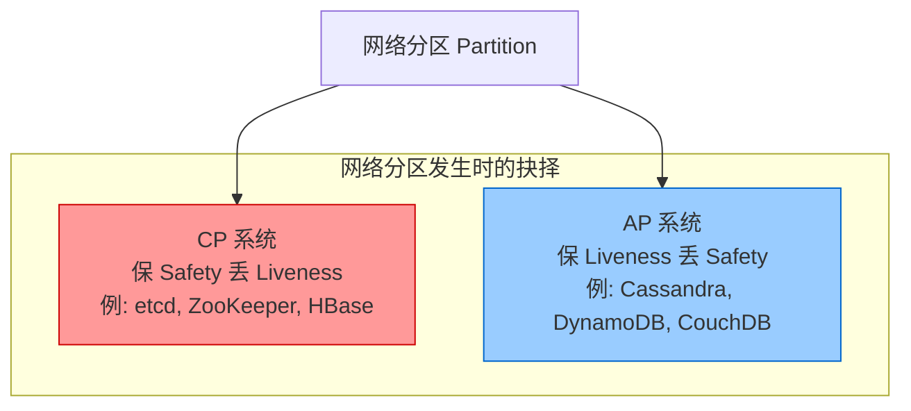
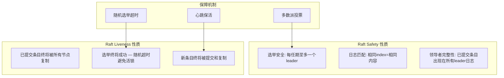
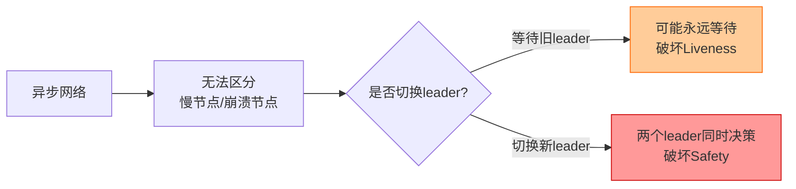
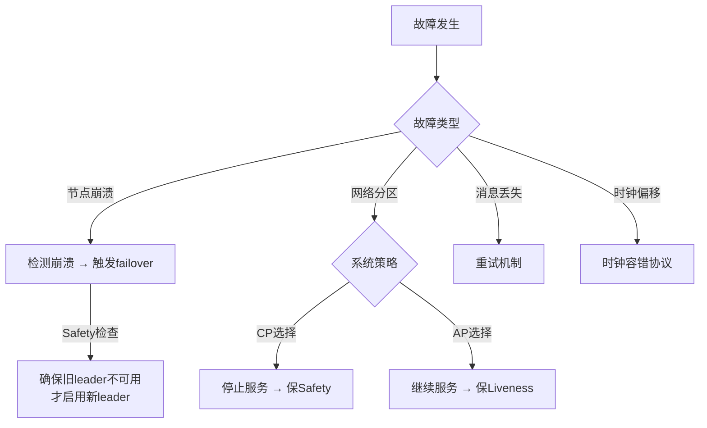

# Safety 与 Liveness

分布式共识协议的设计与验证离不开两个核心性质——**Safety（安全性）** 和 **Liveness（活性）**。它们由 Leslie Lamport 在 1977 年的开创性论文 *"Proving the Correctness of Multiprocess Programs"* 中首次提出，是理解所有分布式一致性协议的理论基石。本节将从定义与直觉、形式化模型、两者之间的矛盾关系、CAP/PACELC 定理中的体现、经典协议中的分离设计、FLP 不可能定理、故障模型与性质的关系、工程实践中的权衡、形式化验证方法、真实案例分析十个层面展开系统讲解。

---

## 1. 定义与直觉理解

### 1.1 Safety（安全性）

**核心定义：** Safety 性质表达的是"坏事永远不会发生"——系统在任何时刻都不会违反某个不变式（invariant）。用更精确的语言说：**如果一个执行轨迹前缀满足 Safety 性质，那么该轨迹的所有后续扩展也必须满足。**

直觉理解：Safety 是一种"禁止性"约束。系统不会产生错误的结果，不会进入非法状态，不会出现数据损坏。Safety 违反的特征是"一错永错"——一旦产生错误数据，错误会永久存在于系统中，不会因为后续运行而自动消失。

**关键特征：Safety 违反具有"可检测性"和"不可逆性"。**

- **可检测性：** 只需观察一个有限的执行片段就能发现 Safety 违反。例如，你读到一个值是 `v`，过一会读到同一个键的值变成了 `v' ≠ v`，在强一致性模型下这就是 Safety 违反——不需要等待无限时间就能确认。
- **不可逆性：** 一旦违反发生，错误数据已经写入存储、已经返回给客户端、已经触发了副作用（扣款、发邮件、创建订单）。撤回这些影响需要人工介入，自动修复几乎不可能。

典型 Safety 性质在共识协议中的体现：

| Safety 性质 | 具体含义 | 违反后果 |
|------------|---------|---------|
| 不会同时选出两个领导者 | 在任何时刻，至多一个节点担任 leader | 脑裂（split-brain），两个 leader 各自接受写入，数据分叉 |
| 不会提交矛盾的值 | 一旦某个值 v 被提交，系统不会在同一个提案号上提交另一个值 v' ≠ v | 共识被破坏，不同节点执行不同指令 |
| 不存在幻读/脏写 | 事务要么读到已提交的数据，要么读到自己的修改 | 脏读导致业务逻辑基于错误数据决策 |
| 日志索引一致性 | 所有节点上 index 相同的日志条目内容完全一致 | 节点状态分叉，无法恢复一致 |
| Monotonic Read | 读操作看到的值不会"回退"到更旧的版本 | 用户看到刚更新的数据又变回旧值 |

### 1.2 Liveness（活性）

**核心定义：** Liveness 性质表达的是"好事终将发生"——系统不会永远停滞，某个期望的事件最终一定会发生。形式化地说：**对于 Liveness 性质 P，任何执行轨迹（无论多长）的某个后续扩展都必须满足 P。**

直觉理解：Liveness 是一种"承诺性"约束。系统最终会响应、最终会达成共识、最终会完成请求。Liveness 的关键词是"最终"（eventually）——它不要求立即发生，但保证一定会发生。

**关键特征：Liveness 违反具有"不可检测性"和"可恢复性"。**

- **不可检测性：** 你永远无法在某个时刻确认 Liveness 被违反了，因为你永远不知道系统是不是在"下一秒"就会满足它。你只能说"到现在为止还没发生"，但不能说"永远不会发生"。
- **可恢复性：** Liveness 违反通常表现为服务不可用或响应超时，但数据本身是正确的。重启进程、修复网络、恢复电源通常就能恢复 Liveness。

典型 Liveness 性质在共识协议中的体现：

| Liveness 性质 | 具体含义 | 违反后果 |
|--------------|---------|---------|
| 共识终将达成 | 如果所有节点持续运行，协议最终会选出 leader 并提交值 | 系统永远无法完成写入，服务不可用 |
| 请求终将被响应 | 客户端发出的请求最终会收到回复（成功或失败） | 客户端永远等待，超时后可能重试导致重复操作 |
| 提案终将被提交 | 每个被正确提出的提案最终都会被选定 | 业务操作永远处于"处理中"状态 |
| 故障终将恢复 | 系统在故障修复后能重新正常运作 | 永久停机，需要重建集群 |
| Leader 终将被选出 | 选举过程最终会收敛到一个 leader | 所有节点都在选举中互相竞争，无法服务 |

### 1.3 一个直观的类比：银行系统

把分布式系统想象成一家银行：

- **Safety 保证：** 你的账户余额永远不会因为并发操作变成负数；两个人不会同时拥有同一笔钱；你存了 100 元后，余额不会莫名其妙变成 50 元。
- **Liveness 保证：** 你发起的转账请求最终会被处理；银行不会永远让你"稍后再来"；你的 ATM 取款请求不会永远卡在"处理中"。

银行如果只保证 Safety（永远不犯错），但让你等上三年才完成转账，你会非常不满——这就是"保 Safety 牺牲 Liveness"。反之，如果只保证 Liveness（最终都会处理），但可能把你的钱转给错误的人，后果更严重——这就是"保 Liveness 牺牲 Safety"。**一个好的系统必须同时满足两者。**

但现实是残酷的：在网络分区发生时，你不得不做选择。这就是 CAP 定理的核心——我们将在第 4 节详细讨论。

### 1.4 Safety 与 Liveness 的非对称性

理解 Safety 和 Liveness 的关键在于认识到两者的**非对称性**——它们在违反后果、恢复难度、检测方式、设计优先级上完全不同：

              Safety                          Liveness
          ──────────────                  ──────────────
  表述方式    "坏事永不发生"                    "好事终将发生"
  违反判定    有限轨迹即可判定                   需要无限轨迹才能判定
  错误后果    可能造成数据不一致/腐败              通常导致服务不可用/停顿
  恢复难度    需要人工干预（回滚、修复数据）         自动恢复（重试即可）
  检测方式    可以通过断言/不变式检查发现           无法通过有限观察确认违反
  设计权衡    宁可拒绝服务也不犯错                 宁可犯错也要响应
  时间特性    违反是瞬时的（某一刻就错了）           违反是持续的（一直在等）
  数据影响    错误数据会永久传播                   停滞状态会随恢复消失

这种非对称性决定了工程实践中的一个黄金原则：**几乎总是 Safety 优先于 Liveness。** 我们将在第 7 节详细讨论这一原则的工程含义。

---

## 2. 形式化模型

### 2.1 运行（Run）与轨迹（Trace）

在分布式系统的形式化模型中，系统行为被建模为**运行**（Run）。一个运行是一组无限的事件序列，由多个节点交替执行操作（如 send、receive、propose、decide）组成。

运行 R = (e₁, e₂, e₃, ...)  其中每个 eᵢ 是某个进程的一步操作

例如，一个三节点共识系统的运行可能是：

R = (propose(p₁, v₁), send(p₁→p₂, msg), receive(p₂, msg), 
     propose(p₃, v₂), send(p₃→p₁, msg), decide(p₁, v₁), ...)

**轨迹（Trace）** 是运行的有限前缀。例如，上述运行的前三个事件构成一个轨迹：

T = (propose(p₁, v₁), send(p₁→p₂, msg), receive(p₂, msg))

Safety 和 Liveness 的区分本质上是对轨迹集合施加的不同类型约束。这种区分不是人为规定的，而是数学上完备的——这就是 Alpern-Schneider 分解的意义。

### 2.2 Alpern-Schneider 分解

1985 年，Alpern 和 Schneider 证明了一个深刻的结论：**任意性质都可以分解为 Safety 性质和 Liveness 性质的交集。** 这意味着 Safety 和 Liveness 不是特殊的东西，而是所有性质的通用分类方式。

设 P 是某个性质，则存在 Safety 性质 S 和 Liveness 性质 L，使得：

P = S ∩ L

并且 S 是"最大的"满足 S ⊆ P 的 Safety 性质，L 是"最大的"满足 L ⊆ P 的 Liveness 性质。

**直觉理解这个定理：** 想象你要求系统"始终返回正确的结果"。这个要求可以分解为：
- **Safety 部分（S）：** 系统永远不会返回错误的结果——任何返回值都是某个合法操作的正确结果。
- **Liveness 部分（L）：** 系统最终会返回某个结果——不会永远不响应。

两者交集就是"始终返回正确结果"的完整含义。

**为什么这个结论重要？** 它告诉我们：任何你想要系统满足的性质，都可以回答两个问题——"什么坏事不能发生？"（Safety）和"什么好事终将发生？"（Liveness）。这两个问题构成了分布式系统设计的完整思考框架。

**分解的构造方法：** Alpern-Schneider 定理的证明是构造性的。给定性质 P：
- Safety 分量 S = 所有满足"如果某个前缀在 P 中，则所有扩展也在 P 中"的轨迹集合
- Liveness 分量 L = 所有满足"对任意前缀，都存在某个扩展在 P 中"的轨迹集合

### 2.3 形式化判定标准

| 性质类型 | 判定规则 | 反例形式 | 检测难度 |
|---------|---------|---------|---------|
| **Safety** | 如果运行的某个前缀违反 P，则该运行违反 P | 只需要找到一个有限前缀即可证明违反 | 容易：可观测的、有限的 |
| **Liveness** | 任何有限前缀都不违反 P，但存在无限运行违反 P | 必须考察完整的无限轨迹才能判定违反 | 困难：不可观测的、无限的 |

这个差异有深刻的含义：**Safety 性质的违反是可以"当场抓到"的**——你只需要看到一个错误状态；**Liveness 性质的违反需要"等到地老天荒"才能确认**——因为你永远不知道系统是不是在"下一秒"就会满足它。

**工程含义：** 这解释了为什么 Safety 违反可以通过测试（包括 Jepsen）发现，而 Liveness 问题通常需要通过监控指标（如请求延迟 P99、选举次数）来间接判断。你无法写一个测试来证明"Liveness 被违反了"——你只能观察到"服务响应变慢了"或"选举频繁发生"。

### 2.4 拓扑学视角（进阶）

从拓扑学的角度看，Safety 性质对应于**闭集**（closed set），Liveness 性质对应于**稠密集**（dense set）。在运行空间的拓扑结构中：

- Safety 性质是"不可扩展的"——如果一个轨迹违反了 Safety，那么任何包含它的运行都违反 Safety。这就像闭集包含自己的边界。
- Liveness 性质是"处处稠密的"——任何有限轨迹都可以被扩展为满足 Liveness 的运行。这就像稠密集在任何开集中都有点。

这个拓扑学视角解释了为什么 Alpern-Schneider 分解是完备的——在拓扑空间中，任何集合都可以表示为闭集和稠密集的交集（Baire 范畴定理的一个推论）。

---

## 3. 为什么 Safety 和 Liveness 必须分离

### 3.1 分离的设计意义

Safety 和 Liveness 不仅是理论上的分类，更是工程设计中的核心指导原则。将两者分离有以下重要意义：

**第一，明确故障降级策略。** 当系统面临故障时，你需要预先决定：是牺牲 Safety（继续服务但可能出错）还是牺牲 Liveness（停止服务但保持正确）？如果不在设计时明确这一点，故障发生时就会陷入混乱。

**第二，指导超时和重试策略。** Safety 相关的操作（如 leader 切换）需要保守的超时——宁可慢也不能错。Liveness 相关的操作（如请求重试）可以激进一些——宁可多试也不能停。

**第三，简化正确性证明。** 将 Safety 和 Liveness 分开证明比同时证明两者的交集要简单得多。Safety 证明只需要检查所有可能的有限执行片段；Liveness 证明只需要构造一个满足性质的无限扩展。

### 3.2 安全优先原则

在工程实践中，**几乎总是 Safety 优先于 Liveness**。原因有三：

- **Safety 违反的代价是不对称的：** 违反 Safety 可能导致数据损坏、资金损失、安全漏洞，这些后果往往是不可逆的。而违反 Liveness 最坏的情况是服务暂停，数据仍然是正确的。
- **Safety 违反需要人工介入：** 一旦数据不一致，自动修复几乎不可能，需要运维人员仔细分析、回滚、修复。而 Liveness 违反（如进程卡住）通常重启即可。
- **Safety 违反具有传染性：** 一个节点的 Safety 违反可能通过复制传播到整个集群，而 Liveness 违反通常只影响单个节点或分区。

这就是为什么几乎所有的共识协议都采用 **"宁可不工作，也不能工作错"** 的设计原则。

### 3.3 例外情况：何时可以牺牲 Safety

虽然安全优先是默认原则，但在某些场景下，牺牲 Safety 是合理的：

| 场景 | 牺牲 Safety 的理由 | 典型系统 |
|------|-------------------|---------|
| CDN 缓存一致性 | 用户看到旧内容的代价远低于服务不可用 | Akamai, Cloudflare |
| 社交媒体 Feed | 偶尔看到重复/缺失的帖子比服务中断更可接受 | Twitter, 微博 |
| DNS 解析 | 旧 IP 的影响通常在 TTL 内自愈 | DNS 系统 |
| 物联网传感器聚合 | 丢失个别数据点不影响整体趋势分析 | 时序数据库 |

关键判断标准：**Safety 违反的影响是否可自愈？** 如果违反会在有限时间内自动恢复（如 DNS TTL 过期后刷新），那么可以考虑牺牲 Safety。如果违反会永久存在于系统中（如数据库写入了错误数据），则必须保证 Safety。

---

## 4. CAP 定理中的 Safety 与 Liveness

### 4.1 CAP 定理回顾

Eric Brewer 的 CAP 定理指出，在网络分区（Partition）发生时，系统只能在一致性（Consistency）和可用性（Availability）之间二选一：

- **C（一致性）** 本质上是 **Safety 性质**：所有节点在同一时刻看到相同的数据。
- **A（可用性）** 本质上是 **Liveness 性质**：每个请求都能得到响应。
- **P（分区容错）** 是现实约束：网络分区在分布式系统中不可避免。

CAP 定理的精确定义（Gilbert & Lynch, 2002）：

- **一致性（Safety）：** 每个读操作都能读到最近一次写操作的结果。等价于线性一致性（linearizability）。
- **可用性（Liveness）：** 每个请求都能在有限时间内收到非错误的响应。
- **分区容错：** 系统在网络分区期间仍然能运行。

### 4.2 CAP 中的 Safety-Liveness 权衡



| 选择 | 牺牲 | 典型系统 | 分区时行为 | 分区恢复后 |
|-----|------|---------|-----------|-----------|
| 保 Safety (CP) | 拒绝部分请求，直到分区修复 | etcd, ZooKeeper, TiKV | 不可用但数据一致 | 自动恢复服务 |
| 保 Liveness (AP) | 继续响应但可能返回过期数据 | Cassandra, DynamoDB | 可用但数据不一致 | 需要冲突解决/数据合并 |

**分区恢复后的行为差异：** CP 系统在分区修复后可以自动恢复——因为两边的数据是一致的，不需要合并。AP 系统在分区修复后需要解决冲突——可能涉及 Last-Write-Wins（LWW）、向量时钟、CRDT 等策略。这就是 Safety 优先的另一个好处：恢复成本更低。

### 4.3 PACELC 模型的细化

Daniel Abadi 提出的 PACELC 模型进一步扩展了 CAP，在正常运行（无分区）时也考虑 Safety-Liveness 的权衡：

if (Partition) {
    选择: Availability (Liveness) or Consistency (Safety)
} else {
    选择: Latency (Liveness) or Consistency (Safety)
}

即使在正常运行时，系统也面临选择：是追求最低延迟（Liveness 优先：尽快响应），还是追求最强一致性（Safety 优先：等待所有副本同步）。

| 系统 | 分区时选择 | 正常时选择 | 代号 | 实际含义 |
|-----|-----------|-----------|------|---------|
| etcd | CP | Safety 优先 | PC/EC | 强一致，高延迟 |
| Cassandra | AP | Liveness 优先 | PA/EL | 最终一致，低延迟 |
| MongoDB | CP | 安全与延迟折中 | PC/EL | 可调一致性级别 |
| Cosmos DB | 可配 CP/AP | 可配强一致/最终一致 | 可配置 | 5 种一致性级别可选 |
| TiKV | CP | Safety 优先 | PC/EC | Raft 强一致 |
| DynamoDB | AP | 可配 | PA/EL or PA/EC | 按表配置一致性 |

**PACELC 的实践指导意义：** 在选择数据库时，不仅要看分区时的行为（CAP），还要看正常运行时的行为（EL/EC）。例如，如果你的业务对延迟敏感（如实时游戏），即使没有分区，也要考虑系统在正常运行时的一致性开销。

---

## 5. 经典共识协议中的 Safety 与 Liveness

### 5.1 Paxos 协议

Paxos 是最经典的共识协议，其 Safety 和 Liveness 的分离尤为清晰。

**Paxos 的 Safety 性质：**

1. **至多一个值被选定（Agreement）：** 不可能有两个不同的值被同一个提案号选定。这是通过 Phase 1 的"承诺"机制保证的——一旦节点承诺接受编号 ≥ n 的提案，就拒绝所有编号 < n 的提案。
2. **值不可变（Validity）：** 选定的值必须是某个 proposer 提出的值，不能凭空产生。这是通过 Phase 2 的"接受"机制保证的——proposer 必须使用之前收到的最高编号提案的值。
3. **提案顺序一致：** 如果提案 (n, v) 被选定，那么编号大于 n 的提案如果被选定，其值也是 v。这是 Safety 的传递性。

**Paxos 的 Liveness 性质：**

1. **最终选定（Termination）：** 在部分同步模型下（消息最终会被传递），如果只有一个 proposer 活跃，协议最终会选定一个值。

**关键洞察：Basic Paxos 的 Safety 是完全保证的（无论网络多糟糕），但 Liveness 需要额外条件：**
- 需要存在一个稳定的 leader（避免多个 proposer 同时竞争）
- 需要消息最终能被传递（部分同步假设）
- 需要没有持续的竞争 proposer（否则会活锁）

这也解释了为什么实际部署中都使用 Multi-Paxos（引入 leader 机制来保证 Liveness）。

┌────────────────────────────────────────────────────────┐
│                  Paxos 的两阶段                         │
├──────────────┬─────────────────────────────────────────┤
│ Phase 1      │ Safety 关键点：                          │
│ Prepare/Accept│ 1. 承诺不接受编号更小的提案              │
│              │ 2. 返回已接受的最大编号提案的值            │
│              │ → 这些承诺是不可撤销的，保证了 Safety     │
├──────────────┼─────────────────────────────────────────┤
│ Phase 2      │ Liveness 关键点：                        │
│ Accept       │ 1. 需要多数节点响应才能完成                │
│              │ 2. 需要 leader 稳定才能避免反复冲突         │
│              │ 3. 活跃的 proposer 唯一性保证终止           │
│              │ → 这些条件是 Liveness 的前提               │
└──────────────┴─────────────────────────────────────────┘

**Paxos 的活锁问题：** Basic Paxos 中，如果两个 proposer 交替发起 Phase 1 和 Phase 2，可能导致永远无法选定值：

Proposer A: Prepare(1) → 准备接受 Accept(1, v₁)
Proposer B: Prepare(2) → 准备接受 Accept(2, v₂)  [A 的 Accept 被拒绝]
Proposer A: Prepare(3) → 准备接受 Accept(3, v₁)  [B 的 Accept 被拒绝]
... 无限循环，永远无法选定

这是 Liveness 违反的典型例子——系统没有犯错（Safety 完好），但永远无法完成共识。Multi-Paxos 通过选举唯一的 leader 来解决这个问题。

### 5.2 Raft 协议

Raft 协议被设计为"易于理解的共识协议"，其 Safety-Liveness 分离更加直观。

**Raft 的 Safety 性质：**

1. **选举安全（Election Safety）：** 在一个任期内至多选出一个 leader。通过多数派投票保证——获得多数票的 candidate 成为 leader，而多数派中不可能有两个不同的 candidate。
2. **日志匹配（Log Matching）：** 如果两个日志在某索引处有相同条目，则该索引之前的所有条目也相同。通过 AppendEntries 的一致性检查保证。
3. **领导者完整性（Leader Completeness）：** 如果某个日志条目在某个任期被提交，那么该条目会出现在所有更高任期 leader 的日志中。这是 Raft Safety 性质的核心，通过选举限制（candidate 必须拥有所有已提交条目才能获得投票）保证。
4. **领导者只追加（Leader Append-Only）：** leader 从不删除或覆盖自己的日志条目，只会追加。这是 Leader Completeness 的直接推论。

**Raft 的 Liveness 性质：**

1. **提交完整性：** 如果某个日志条目被提交，它最终会被所有节点复制。
2. **选举进展：** 在部分同步模型下，选举终将成功。关键机制是**随机选举超时**——每个节点在 `[T, 2T]` 范围内随机选择超时时间，大大降低了多个 candidate 同时发起选举的概率。
3. **日志进展：** leader 最终会复制所有已提交的条目到所有 follower。通过心跳机制保证——只要 leader 活跃，就会持续发送 AppendEntries。



**Raft 的随机超时机制详解：** Raft 的选举超时通常设置为 `[150ms, 300ms]`。每个节点独立随机选择超时时间，最先超时的节点发起选举。假设 5 个节点同时开始选举计时：

- 节点 A: 173ms
- 节点 B: 241ms
- 节点 C: 198ms
- 节点 D: 287ms
- 节点 E: 215ms

节点 A 最先超时，发起选举。如果 A 获得多数票（3/5），它成为 leader 并开始发送心跳。其他节点收到心跳后重置选举计时器，选举结束。随机超时使得多个节点同时发起选举的概率极低（指数级下降）。

### 5.3 两者的对比

| 维度 | Paxos | Raft |
|-----|-------|------|
| Safety 保证方式 | 编号机制 + 多数派承诺 | 任期号 + 多数派投票 |
| Liveness 保证方式 | 需要稳定 leader（额外假设） | 随机超时（内建机制） |
| Safety-Liveness 分离清晰度 | 混合在消息交互中 | 选举（Liveness）和日志复制（Safety）分离 |
| 活锁风险 | Basic Paxos 有活锁可能 | 随机超时大幅降低活锁概率 |
| 实际部署的 Liveness | Multi-Paxos 引入 leader | 原生 leader 机制 |
| 证明难度 | 需要复杂的不变式推理 | 归纳证明更直观 |
| 工程实现复杂度 | 较高（消息类型多） | 较低（状态机清晰） |

### 5.4 ZAB 协议的 Safety-Liveness 设计

ZAB（ZooKeeper Atomic Broadcast）协议采用了另一种 Safety-Liveness 分离方式：

**Safety：** 通过 Leader Transl（领导者传输）保证——只有拥有最新事务的节点才能成为 leader。新 leader 上任后，先将自己日志中缺失的事务从 follower 同步过来，确保所有已提交事务都被保留。

**Liveness：** 通过 Epoch（纪元）机制保证——每个 leader 有唯一的 Epoch 编号，Leader Transl 确保新 leader 只处理 Epoch+1 的事务，避免与旧 leader 冲突。

ZAB 的 Safety-Liveness 分离方式与 Paxos/Raft 不同，但核心思想一致：**Safety 通过不变式保证（不可撤销的承诺），Liveness 通过超时和选举保证（最终会收敛）。**

---

## 6. FLP 不可能定理与 Safety-Liveness 的关系

### 6.1 FLP 定理概述

1985 年，Fischer、Lynch 和 Paterson 证明了著名的 **FLP 不可能定理**（该成果获得了 2001 年 Dijkstra 奖）：在异步系统中，只要有一个进程可能崩溃（crash），就不存在一个确定性协议能保证共识的 Liveness。

**精确表述：** 在一个完全异步的系统中，如果至少有一个进程可能崩溃，那么不存在一个确定性算法能同时满足：
- **Termination（终止性）：** 每个正确的进程最终都会决定一个值。
- **Agreement（一致性）：** 所有正确的进程决定的值相同。
- **Validity（有效性）：** 决定的值必须是某个进程提出的值。

其中 Termination 是 Liveness 性质，Agreement 和 Validity 是 Safety 性质。

**这是什么意思？** 在完全异步的网络模型中，你无法区分一个节点是"慢"还是"崩溃了"。如果一个 leader 崩溃了，你不知道应该切换到新 leader 还是继续等待它恢复。这种不确定性使得 Liveness 无法保证。

### 6.2 FLP 的核心矛盾



这个矛盾的本质是：**在异步系统中，Safety 和 Liveness 不能同时无条件保证。** 但 FLP 定理有一个隐含的假设——它是针对确定性协议的。

**FLP 的证明思路（简化版）：**

1. **初始状态：** 所有节点处于对称状态，没有任何节点知道其他节点的状态。
2. **第一个决定：** 假设某个执行序列导致系统决定值 `v₁`。
3. **构造替代执行：** 保持前缀不变，但让某个关键节点崩溃（不再响应）。
4. **矛盾：** 在替代执行中，由于崩溃节点无法参与，剩下的节点无法确定应该决定 `v₁` 还是其他值。如果它们决定 `v₁`，那么让崩溃节点恢复并参与另一个执行，可能导致不一致（违反 Safety）。如果它们不做决定，就违反了 Liveness。

### 6.3 绕过 FLP 的工程策略

FLP 不可能定理并没有宣判死刑，它指出了需要在工程中做出的妥协。实际系统通过以下策略绕过 FLP：

| 策略 | 原理 | 实现方式 | 代价 | 典型系统 |
|-----|------|---------|------|---------|
| **随机化** | 引入随机性打破对称性 | Randomized Paxos, Ben-Or 算法 | 概率性终止，非确定性 | HoneyBadgerBFT |
| **部分同步假设** | 假设消息最终会被传递 | Paxos/Raft 的标准假设 | 弱化了异步模型 | etcd, TiKV |
| **故障检测器** | 使用超时机制检测崩溃 | Raft 的 election timeout | 可能误判（网络抖动） | ZooKeeper |
| **Leader 选举** | 限制决策权到单一节点 | Multi-Paxos, Raft | leader 是单点瓶颈 | 所有生产系统 |
| **重试与退避** | 乐观重试 + 指数退避 | 所有生产系统 | 增加延迟 | 通用 |
| **乐观执行** | 先执行后验证 | Spanner, Calvin | 冲突时需要回滚 | NewSQL |

**关键认识：FLP 告诉我们的不是"做不到"，而是"需要额外假设才能做到"。** 所有实际的共识协议都做出了某种妥协：要么假设网络部分同步（最常见），要么引入随机性（理论上有保证但工程上少见），要么使用故障检测器（实践中最常用）。

**部分同步假设的实际含义：** 在生产环境中，网络通常是"大部分时间同步"的——消息会在有限时间内到达，只是这个时间上限未知。这就是部分同步模型。在这种模型下，FLP 的不可能性不再成立，因为你可以设置一个足够大的超时来区分"慢"和"崩溃"。代价是：在网络真正变慢时，你可能会误判节点崩溃，触发不必要的 leader 切换。

### 6.4 FLP 与 Paxos/Raft 的关系

Paxos 和 Raft 都依赖部分同步假设来绕过 FLP。具体来说：

- **Paxos：** Safety 不需要任何假设（即使在完全异步系统中也保证），Liveness 需要部分同步假设（消息最终会被传递）+ 唯一活跃 proposer。
- **Raft：** Safety 同样不依赖任何时间假设，Liveness 需要部分同步假设 + 随机超时（降低竞争概率）。

这正是 Safety-Liveness 分离的价值所在：**你可以无条件保证 Safety，只需要在 Liveness 上做妥协。** 如果 Safety 和 Liveness 混在一起，你就不得不在两者之间做痛苦的选择。

---

## 7. 故障模型与 Safety-Liveness 的关系

不同的故障模型对 Safety 和 Liveness 的影响截然不同。理解故障模型是正确设计 Safety-Liveness 策略的前提。

### 7.1 故障类型分类

| 故障类型 | 定义 | 对 Safety 的影响 | 对 Liveness 的影响 | 典型场景 |
|---------|------|----------------|-------------------|---------|
| **崩溃故障（Crash）** | 节点停止响应，但不发送错误消息 | 可通过多数派保证 | 需要故障检测器恢复 | 进程 OOM、硬件故障 |
| **崩溃-恢复（Crash-Recovery）** | 节点崩溃后可能恢复，状态可能丢失 | 需要持久化保证 | 恢复后需要追赶状态 | 电源故障、重启 |
| **拜占庭故障（Byzantine）** | 节点可能发送任意消息，包括恶意消息 | 需要 3f+1 节点容忍 f 个故障 | 需要更复杂的协议 | 安全攻击、硬件错误 |
| **网络分区** | 节点间通信完全中断 | 需要分区两侧协调 | 分区侧可能无法服务 | 网络设备故障 |
| **消息乱序/延迟** | 消息到达顺序与发送顺序不同 | 需要序列号/时间戳 | 需要超时机制 | TCP 重排序、路由抖动 |
| **消息丢失** | 消息在传输中丢失 | 需要重传和确认 | 需要超时重试 | UDP、网络拥塞 |

### 7.2 崩溃故障 vs 拜占庭故障

**崩溃故障（Crash Fault）：** 节点要么正常工作，要么完全停止。不会发送错误消息。这是最简单的故障模型，也是 Paxos/Raft 假设的模型。

- **Safety 保证：** 容忍 `f` 个崩溃节点需要 `2f+1` 个节点（多数派）。只要多数节点正常，Safety 就能保证。
- **Liveness 保证：** 需要多数节点正常 + 消息最终传递 + 唯一 leader。

**拜占庭故障（Byzantine Fault）：** 节点可能发送任意消息，包括矛盾的、错误的、甚至恶意的消息。这是最严格的故障模型。

- **Safety 保证：** 容忍 `f` 个拜占庭节点需要 `3f+1` 个节点。因为拜占庭节点可能向不同的节点发送不同的消息，需要更多的节点来达成一致。
- **Liveness 保证：** 同样需要多数节点正常，但协议更复杂，通信开销更大。

崩溃故障:   容忍 f 个故障需要 2f+1 个节点
拜占庭故障:  容忍 f 个故障需要 3f+1 个节点

例: 5 个节点
  崩溃故障: 可容忍 2 个节点故障
  拜占庭故障: 只能容忍 1 个节点故障

### 7.3 故障模型对协议设计的影响

| 故障模型 | 适用协议 | Safety 机制 | Liveness 机制 |
|---------|---------|------------|--------------|
| 崩溃故障 | Paxos, Raft, ZAB | 多数派投票 + 编号/任期 | Leader 选举 + 超时 |
| 拜占庭故障 | PBFT, Tendermint, HotStuff | 签名验证 + 3f+1 多数派 | View Change + 超时 |
| 网络分区 | 所有协议 | 分区期间停止服务（CP）或继续服务（AP） | 分区恢复后自动修复 |
| 异步网络 | FLP 框架 | Safety 可保证 | Liveness 无法无条件保证 |

---

## 8. 工程实践中的 Safety-Liveness 权衡

### 8.1 设计决策矩阵

在设计分布式系统时，Safety-Liveness 权衡直接影响架构决策：

| 设计场景 | Safety 优先策略 | Liveness 优先策略 | 建议选择 | 理由 |
|---------|----------------|-------------------|---------|------|
| 支付系统 | 等待所有节点确认 | 异步确认，稍后对账 | Safety | 资损不可逆 |
| 用户会话 | 强制同步 session | 最终一致的 session | Liveness | 体验优先，session 不一致可容忍 |
| 配置下发 | 等待所有节点同步 | 先广播再逐步同步 | Safety | 错误配置可能导致全局故障 |
| 日志收集 | 等待副本同步 | 异步复制，允许丢失 | Liveness | 日志丢失可容忍，服务不能停 |
| 库存扣减 | 严格同步扣减 | 异步扣减 + 补偿 | Safety | 资损风险高 |
| 搜索索引 | 等待索引同步 | 最终一致的索引 | Liveness | 短暂搜索结果不完整可接受 |
| 分布式锁 | 等待锁确认 | 先获取锁再确认 | Safety | 双重获取可能导致数据损坏 |
| 消息队列 | 等待持久化确认 | 先投递再异步持久化 | 视场景而定 | 金融消息需 Safety，普通消息可 Liveness |

### 8.2 故障模式与响应策略



### 8.3 超时设计的艺术

超时是平衡 Safety 和 Liveness 的关键工程手段。超时设置过短会导致误判（可能破坏 Safety），设置过长会影响 Liveness（响应变慢）。

```python
class ConsensusTimeout:
    """共识协议超时配置示例 — 展示 Safety 与 Liveness 的工程权衡"""
    
    def __init__(self):
        # === 选举超时 (Liveness 相关) ===
        # 设置过短: 频繁选举 → 雪崩效应 (Safety + Liveness 双重风险)
        # 设置过长: 故障恢复慢 → Liveness 降低
        self.election_timeout_min = 150   # ms, Raft 推荐
        self.election_timeout_max = 300   # ms
        
        # 心跳间隔 = election_timeout / 10
        # 保证 leader 能在选举超时前发送心跳
        self.heartbeat_interval = 15      # ms
        
        # === 提交超时 (Safety 相关) ===
        # 设置过短: 可能误判提交失败 → 安全风险
        # 设置过长: 客户端等待时间过长 → Liveness 降低
        self.commit_timeout = 500         # ms
        self.commit_retry_max = 3
        
        # === 网络分区检测 (Safety + Liveness 交叉) ===
        # 设置过短: 网络抖动误判为分区 → 不必要的 leader 切换
        # 设置过长: 真实分区检测慢 → Liveness 降低
        self.partition_timeout = 2000     # ms
        self.partition_recovery_delay = 5000  # ms
        
        # === 请求超时 (Liveness 相关) ===
        # 设置过短: 正常请求被误判为失败 → 重复操作风险
        # 设置过长: 客户端体验差 → Liveness 降低
        self.request_timeout = 1000       # ms
        self.request_retry_max = 3
        self.request_retry_backoff_ms = 100  # 指数退避基数
    
    def get_election_timeout(self):
        """随机化选举超时，避免活锁 — Liveness 保证的关键机制"""
        import random
        return random.randint(
            self.election_timeout_min, 
            self.election_timeout_max
        )
    
    def get_request_timeout(self, attempt: int) -> int:
        """指数退避请求超时 — 渐进式 Liveness 保证"""
        backoff = self.request_retry_backoff_ms * (2 ** attempt)
        return min(self.request_timeout + backoff, 10000)  # 上限 10s
```

### 8.4 常见工程陷阱

| 陷阱 | 违反的性质 | 后果 | 纠正方法 | 教训来源 |
|-----|----------|------|---------|---------|
| Leader 切换时旧 leader 仍在接受写入 | Safety | 脑裂、数据不一致 | fencing token + 多数派保护 | Jepsen (MongoDB 2.x) |
| 所有副本同步确认后才返回（强一致） | Liveness | 写延迟过高 | 改用 quorum 机制（多数派确认即可） | 设计经验 |
| 超时设置过短导致频繁 leader 切换 | Safety + Liveness | 雪崩效应、活锁 | 使用随机超时 + 指数退避 | Raft 论文 |
| 客户端无重试机制 | Liveness | 临时故障导致永久失败 | 客户端幂等重试 | 工程实践 |
| 忽略脑裂保护 | Safety | 两个 leader 同时写入 | fencing token + 多数派保护 | Jepsen (Redis Cluster) |
| 异步复制未说明语义 | Safety | 客户端误以为数据已持久化 | 明确文档化复制语义 | Jepsen (CockroachDB) |
| 恢复时未验证数据完整性 | Safety | 故障恢复后引入脏数据 | 恢复后执行一致性校验 | 生产事故 |
| 心跳间隔 > 选举超时 | Liveness | 正常 leader 被误判为崩溃 | 确保 heartbeat << election_timeout | Raft 最佳实践 |

---

## 9. 高级主题

### 9.1 因果一致性与最终一致性

在放松 Safety 的系统中（最终一致），会出现几种不同强度的一致性模型：

| 一致性模型 | Safety 强度 | Liveness 保证 | 典型场景 | 网络分区行为 |
|-----------|------------|-------------|---------|------------|
| 强一致性（线性一致性） | 最强：所有操作看起来瞬时完成 | 需要同步复制 | 银行账户、库存 | 拒绝服务 |
| 顺序一致性 | 较强：所有节点看到相同顺序 | 需要全局排序 | 分布式锁 | 拒绝部分服务 |
| 因果一致性 | 中等：因果相关操作保序 | 只需因果依赖同步 | 社交媒体评论 | 允许部分操作 |
| 最终一致性 | 最弱：最终所有节点收敛 | Liveness 最优 | DNS、CDN 缓存 | 完全可用 |
| 读你所写 | 弱：用户能看到自己的写入 | 只需单节点同步 | 购物车 | 部分可用 |

**一致性模型的选择指南：**

业务对数据正确性的要求
        │
        ├── 金融/支付 → 线性一致性 (强一致性)
        │
        ├── 电商库存 → 顺序一致性或线性一致性
        │
        ├── 社交/内容 → 因果一致性
        │
        ├── 缓存/CDN → 最终一致性
        │
        └── 分析/统计 → 最终一致性

### 9.2 CRDT 与无冲突复制

**CRDT（Conflict-free Replicated Data Types）** 是一种特殊的数据结构设计，它通过数学性质保证：

- **Safety：** 所有副本最终收敛到相同状态（合并操作满足交换律、结合律、幂等性）。
- **Liveness：** 任何副本的修改都能传播到其他副本，无需同步协调。

CRDT 是将 Safety 和 Liveness 的保证从协议层下沉到数据结构层的经典案例。它用数学性质（而非运行时协调）保证了 Safety，从而让 Liveness（异步传播）变得更加自由。

**CRDT 的两种主要类型：**

| 类型 | 原理 | 典型数据结构 | 适用场景 |
|-----|------|------------|---------|
| **状态-based（CvRDT）** | 合并整个状态，利用交换律/结合律/幂等性 | G-Counter, PN-Counter, G-Set, OR-Set | 低带宽环境 |
| **操作-based（CmRDT）** | 广播操作，要求可靠广播 | 同上，但实现方式不同 | 高可靠网络 |

**示例：G-Counter（只增计数器）**

节点 A 的状态: {A: 3, B: 1, C: 2}  → 总值 = 6
节点 B 的状态: {A: 1, B: 4, C: 2}  → 总值 = 7

合并操作: 取每个分量的最大值
合并结果: {A: 3, B: 4, C: 2}  → 总值 = 9

无论合并顺序如何，结果相同（交换律 + 结合律）

**CRDT 的 Safety 保证来源：** 不是通过共识协议的多数派投票，而是通过数据结构的数学性质。这使得 CRDT 可以在完全异步的网络中工作，不需要任何同步协调——这是 FLP 不可能定理的优雅绕过方式。

### 9.3 一致性模型光谱

                    Safety 保证强度
                         ↑
  线性一致性 ────────────│──── etcd (Raft)
  顺序一致性 ────────────│──── ZooKeeper (ZAB)
  因果一致性 ────────────│──── Cassandra (可配置)
  最终一致性 ────────────│──── DynamoDB (eventual)
                         │
                         └──────────────────────→ Liveness 保证强度

这个光谱展示了 Safety 和 Liveness 的根本权衡：**Safety 越强，Liveness 越弱（延迟越高、可用性越低）；Liveness 越强，Safety 越弱（一致性越差）。**

### 9.4 形式化验证方法

现代分布式系统越来越多地使用形式化方法来验证 Safety 和 Liveness：

| 工具/方法 | 用途 | 典型应用 | 验证范围 |
|----------|------|---------|---------|
| **TLA+** | 时序逻辑规约和模型检验 | Amazon DynamoDB, Azure Cosmos DB, AWS S3 | Safety + Liveness |
| **P \| 语言** | 基于进程的演绎验证 | Microsoft 的分布式系统 | Safety 为主 |
| **Coq/Isabelle** | 交互式定理证明 | seL4 微内核, CompCert 编译器 | Safety 为主 |
| **Jepsen** | 分布式系统混沌测试 | 验证 etcd, MongoDB, CockroachDB 的正确性 | Safety 为主 |
| **TLAPS** | TLA+ 的定理证明器 | Paxos, Raft 的形式化证明 | Safety + Liveness |
| **SPIN** | 模型检验（LTL） | 协议验证 | Safety + Liveness |

**TLA+ 规约示例（Safety 性质）：**
```tla
\* Safety: 至多一个 leader 被选定
SafetyAtMostOneLeader == 
    \A n1, n2 \in Nodes:
        (leader[n1] /\ leader[n2]) => (n1 = n2)

\* Safety: 已提交的值不可改变
SafetyValueStability ==
    \A v1, v2 \in Values:
        (committed[v1] /\ committed[v2]) => (v1 = v2)

\* Liveness: 最终至少一个 leader 被选定
LivenessAtLeastOneLeader ==
    <>\E n \in Nodes: leader[n]

\* Liveness: 最终所有正确节点都达成一致
LivenessAgreement ==
    <>\A n1, n2 \in Nodes:
        (correct[n1] /\ correct[n2]) => (decision[n1] = decision[n2])
```

**TLA+ 的工作流程：**

1. **规约（Specification）：** 用 TLA+ 描述系统的行为规则（状态转换、不变式）。
2. **模型检验（Model Checking）：** TLC 模型检验器穷举所有可达状态，检查是否违反 Safety 或 Liveness。
3. **反例生成：** 如果发现违反，TLC 生成一个最短的反例执行路径，帮助定位问题。
4. **修复与验证：** 修复问题后重新检验，直到没有反例。

---

## 10. 实战案例：Jepsen 验证中的 Safety 违反

### 10.1 Jepsen 是什么

Jepsen 是 Kyle Kingsbury 开发的分布式系统测试框架，专门用于验证分布式数据库在故障条件下的 Safety 性质。它通过以下步骤工作：

1. **搭建集群：** 在隔离的 Linux 容器中部署 N 个节点。
2. **注入故障：** 使用 `iptables` 模拟网络分区，使用 `kill -9` 模拟节点崩溃。
3. **持续负载：** 在故障期间持续执行读写操作（使用 Knossos 或 Elle 检查器）。
4. **分析结果：** 检查最终数据状态是否违反 Safety 性质（如线性一致性、可串行性）。

### 10.2 真实 Safety 违反案例

| 系统 | 版本 | 违反类型 | 具体问题 | 根因 |
|-----|------|---------|---------|------|
| MongoDB | 2.x | 独写丢失 | 网络分区时写操作被确认但未持久化 | 异步复制 + 无 fencing token |
| Redis Cluster | 3.x | 独写丢失 | 故障转移时丢失已确认写入 | 无 fencing token，新旧 leader 同时接受写入 |
| Elasticsearch | 1.x | 独写丢失 | 分片恢复时覆盖新写入的数据 | 恢复逻辑未比较时间戳 |
| CockroachDB | 早期 | 可串行性违反 | 特定时序下出现读异常 | 快照隔离级别不够强 |
| PostgreSQL | 9.x | 写偏斜 | 两个并发事务各自读取不同行后更新对方的行 | 未使用 Serializable 隔离级别 |
| Consul | 0.6.x | 读陈旧数据 | 分区期间读到过期数据 | 未验证 leader 身份 |

### 10.3 从 Jepsen 学到的教训

教训1:  单调递增的 fencing token 对于 Safety 至关重要
        → 每次 leader 切换都必须使用更大的 token
        → 存储层必须拒绝 token 更小的写入

教训2:  故障转移期间必须确认旧 leader 已完全停止
        → 使用 fencing token + 多数派保护
        → 旧 leader 必须释放所有锁和资源

教训3:  持久化和复制不是同一件事 — 复制了不代表持久化了
        → 异步复制在分区时会丢失数据
        → 要么同步复制，要么明确告知客户端异步语义

教训4:  异步复制 = 放弃 Safety（在网络分区时）
        → 如果业务需要 Safety，必须使用同步复制或 quorum 写入

教训5:  "已确认" 的语义必须精确定义和文档化
        → 客户端需要知道：确认 = 数据已持久化？还是数据已复制？
        → 模糊的确认语义是 Safety 违反的温床

教训6:  恢复逻辑必须与正常写入逻辑一致
        → 恢复时不能跳过 fencing token 检查
        → 恢复时不能假设旧数据是"干净的"

### 10.4 一个具体的 Safety 违反场景分析

**场景：MongoDB 2.x 的写丢失**

时间线:
  T1: 客户端向 Primary 写入 x=1
  T2: Primary 将写入复制到 Secondary (异步)
  T3: Primary 确认写入（此时 Secondary 还没收到）
  T4: 网络分区发生，Primary 与 Secondary 隔离
  T5: Secondary 被选为新 Primary
  T6: 客户端向新 Primary 写入 x=2
  T7: 分区修复，旧 Primary 恢复
  T8: 旧 Primary 发现自己的数据过时，用新 Primary 的数据覆盖自己

结果: x=1 的写入虽然被"确认"，但从未持久化到多数节点
     → 写丢失，违反 Safety

**根本原因：**
1. 异步复制导致写入只存在于单个节点。
2. 确认语义不明确——客户端以为"确认 = 安全"，但实际上"确认 = 仅写入 Primary"。
3. 缺少 fencing token——新旧 Primary 没有机制防止同时接受写入。

**修复方案（MongoDB 4.0+）：**
1. 使用 `w:majority` 写入关注点——写入必须被多数节点确认。
2. 启用 majority concern 的 journaling——确保写入持久化。
3. 引入 term 机制（类似 Raft 的任期号）——新 leader 的 term 更高，旧 leader 的写入会被拒绝。

---

## 11. 本节总结

### 核心要点

1. **Safety = "坏事永不发生"**，Liveness = **"好事终将发生"**，两者是分布式系统性质的完备分类（Alpern-Schneider 定理）。

2. **FLP 不可能定理** 表明在异步系统中 Safety 和 Liveness 不能同时无条件保证——工程实践中通过随机化、部分同步假设、故障检测器等策略绕过。

3. **几乎总是 Safety 优先于 Liveness**——因为 Safety 违反导致的数据损坏不可逆，而 Liveness 违反（服务暂停）通常可自动恢复。

4. **CAP 定理本质上是 Safety-Liveness 权衡在分布式系统中的具体化**——网络分区时只能保其一。PACELC 进一步指出，即使在正常运行时也存在类似的权衡。

5. **所有经典共识协议（Paxos、Raft、ZAB）都内建了 Safety-Liveness 的分离设计**——Safety 通过多数派投票和不变式保证，Liveness 通过 leader 选举和超时机制保证。

6. **不同故障模型对 Safety 和 Liveness 的影响不同**——崩溃故障只需要 2f+1 节点，拜占庭故障需要 3f+1 节点。故障模型的选择直接影响协议设计。

7. **形式化验证（TLA+）和混沌测试（Jepsen）** 是验证 Safety-Liveness 的两大利器，越来越多的生产系统在发布前使用这些工具。

8. **CRDT 展示了一种新的 Safety-Liveness 保证方式**——通过数据结构的数学性质保证 Safety，从而让 Liveness（异步传播）更加自由。

### 下一步

理解了 Safety 和 Liveness 的理论框架后，下一节将进入 Paxos 协议的详细分析，我们会看到 Lamport 如何通过精巧的两阶段设计同时实现了这两项性质，以及为什么这个看似简单的协议在工程实现中如此复杂。
