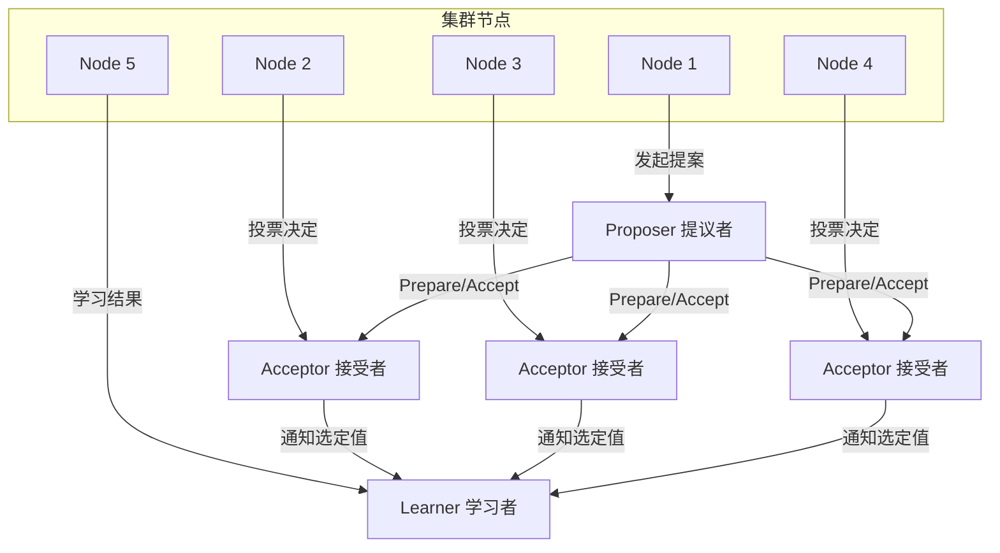
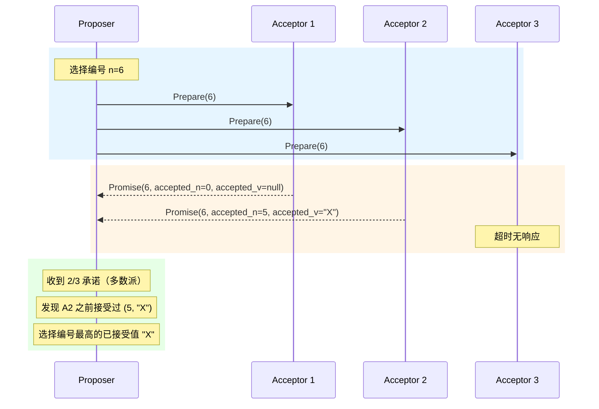
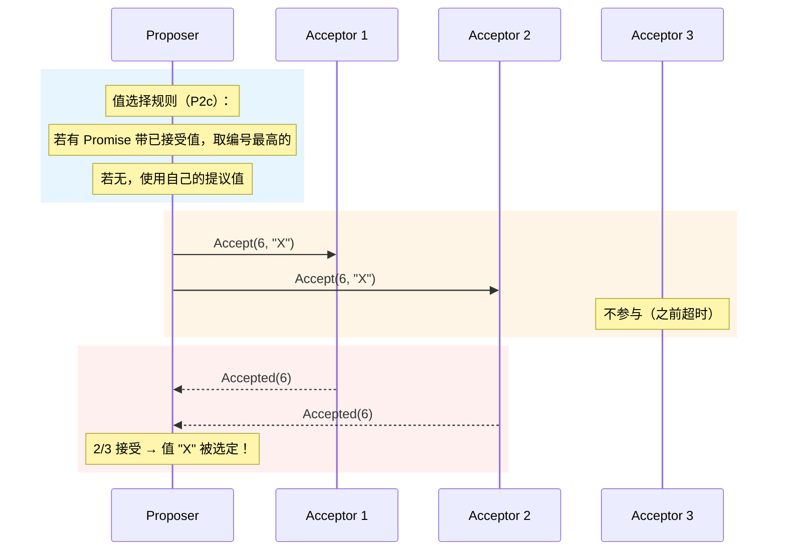
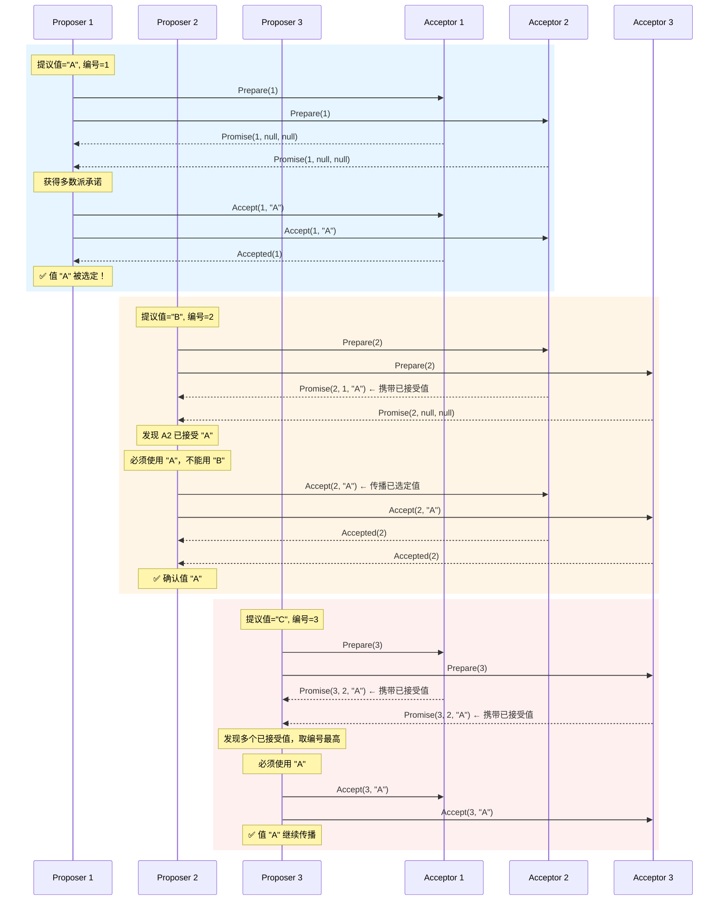
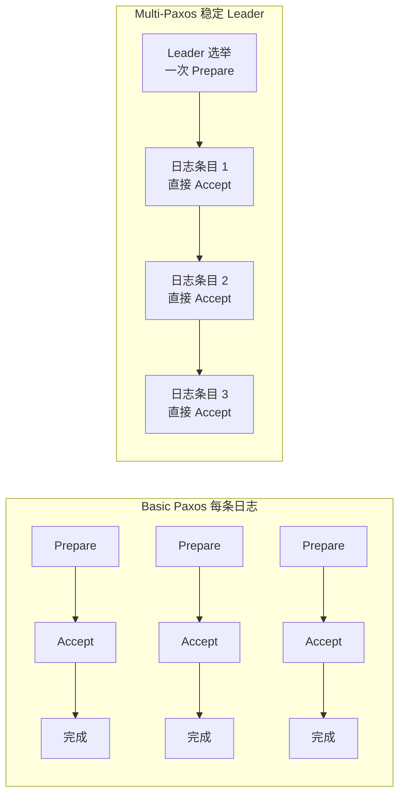
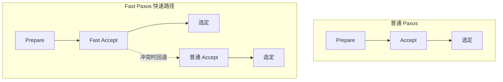
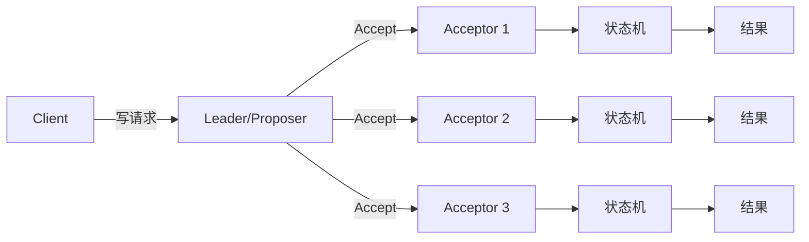

## 3. Paxos 协议详解

Paxos 是 Leslie Lamport 于 1989 年提出、1990 年正式发表的分布式共识算法，被公认为分布式系统领域的奠基之作。2001 年 Lamport 发表了简化版《Paxos Made Simple》，用通俗语言重新阐述了协议的核心思想，使其在工程界广泛传播。Google 的 Chubby、Spanner、Megastore，Microsoft 的 Azure，以及 Columbia 的 Witness 等大规模分布式系统，都以 Paxos 或其变体作为核心共识机制。理解 Paxos 不仅是掌握分布式系统的关键一步，更是理解后续 Raft、ZAB 等协议设计思想的必要前提。

本节从 Paxos 的问题动机出发，逐步拆解 Basic Paxos 的两阶段流程，通过完整的冲突场景演示其正确性，再延伸到 Multi-Paxos 和 Fast Paxos 的工程优化，最终与 Raft 进行系统对比，帮助读者建立从理论到工程的完整认知。

### 3.1 问题动机：为什么需要 Paxos？

#### 两将军问题

Paxos 的思想根源可以追溯到两将军问题（Two Generals' Problem）。设想两支军队分别驻扎在山谷两侧，需要约定同时进攻才能取胜：

1. 将军 A 派信使告诉将军 B："明天拂晓进攻"
2. 将军 B 回复信使："收到，明天拂晓进攻"
3. 但将军 A 不确定信使是否安全到达，需要将军 B 再次确认
4. 而这个确认本身也可能丢失……

这个看似简单的问题，在不可靠通信信道上**永远无法达成确定性共识**。1975 年 Akkoyunlu、Ekanadham 和 Huber 首次形式化证明了这一点。两将军问题揭示了一个深刻的结论：在异步网络中，不存在能保证终止的确定性共识算法——这就是 FLP 不可能定理（Fischer, Lynch, Paterson, 1985）的直觉来源。

#### FLP 不可能定理与 Paxos 的定位

FLP 不可能定理指出：在完全异步的分布式系统中，只要有一个进程可能崩溃，就不存在一个确定性算法能保证所有正确进程最终达成共识。

这是否意味着共识不可能实现？并非如此。FLP 定理的约束条件非常严格——"完全异步"意味着没有时间上界，进程执行速度完全不可预测。**Paxos 的突破在于引入了部分同步（Partial Synchrony）假设**：虽然我们无法精确预测消息延迟和进程执行时间，但可以假设系统在某个未知但有限的时间之后进入同步状态。在这个假设下，Paxos 保证了 Safety（安全性——不会产生矛盾结果），同时在同步假设恢复后保证 Liveness（活性——最终达成共识）。

#### 从两将军到多人投票

Paxos 的核心洞察是：将"两方通信"扩展为"多数投票"。如果一个集群有 2f+1 个节点，只要 f 个节点故障，剩余 f+1 个节点（多数派）仍然可以达成共识。这就是 Paxos 的基础——**多数派原则（Majority Rule）**。

多数派原则的数学基础是鸽巢原理的变体：任意两个大小为 ⌊N/2⌋+1 的子集，其交集至少包含一个元素。这个交集是保证一致性的核心——当值被一个多数派接受后，后续任何多数派中都至少有一个成员"知道"这个值，从而引导后续提案使用相同的值。

### 3.2 三种角色与基本概念

Paxos 定义了三种逻辑角色，一个物理节点可以同时担任多个角色：



| 角色 | 职责 | 类比 | 实际系统中的对应 |
|------|------|------|------------------|
| **Proposer（提议者）** | 发起提案，提出一个值供系统共识 | 会议提案人 | Raft 的 Leader |
| **Acceptor（接受者）** | 对提案投票，决定是否接受该值 | 评审委员会 | Raft 的 Follower（投票阶段） |
| **Learner（学习者）** | 学习最终被选定的值，不参与投票 | 会议记录员 | Raft 的 Follower（日志复制阶段） |

**关键约束**：Paxos 的正确性依赖于多数派（Quorum）——对于 N 个 Acceptor，需要 ⌊N/2⌋+1 个接受才能通过。这意味着任意两个多数派必然存在至少一个共同的 Acceptor，这个交集是保证一致性的核心机制。举例说明：

| 集群大小 | 多数派要求 | 最大容错数 | 典型部署 |
|---------|-----------|-----------|---------|
| 3 | 2 | 1 | 开发/测试环境 |
| 5 | 3 | 2 | 生产环境（最常见） |
| 7 | 4 | 3 | 超高可用场景 |
| 9 | 5 | 4 | 大型分布式存储 |

### 3.3 Basic Paxos：两阶段协议

Basic Paxos 解决的核心问题：**就一个值达成共识**。整个协议分为两个阶段，每个阶段包含请求和响应两个步骤。

#### 完整不变量链：从 P1 到 P2c

在深入两阶段流程之前，先理解 Paxos 正确性的四个不变量（Invariant），它们层层递进，构成完整的设计逻辑：

| 不变量 | 内容 | 作用 |
|--------|------|------|
| **P1** | Acceptor 必须接受它收到的第一个 Prepare 请求 | 保证协议可以启动，不会被无限拒绝 |
| **P2a** | 如果一个值 v 被编号 n 的提案选定，那么编号 m > n 的提案选定的值也必须是 v | Safety 的核心要求 |
| **P2b** | 如果一个值 v 被编号 n 的提案选定，那么编号 m > n 的提案在 Accept 阶段发送的值必须是 v | P2a 的操作化表述 |
| **P2c** | 对于编号 m > n 的提案，如果存在一个已接受的编号 j（n < j < m），那么 m 的值必须等于 j 的值；否则 m 可以自由选择值 | P2b 的可实现版本，也是实际代码实现的依据 |

P2c 是整个协议的工程核心——它决定了 Proposer 在 Prepare 阶段需要收集什么信息，以及在 Accept 阶段如何选择值。后面的所有代码实现都围绕 P2c 展开。

#### 阶段一：Prepare（准备阶段）

Proposer 选择一个全局唯一递增编号 n，向所有 Acceptor 发送 `Prepare(n)` 请求。



**Acceptor 的处理逻辑**：

```python
class Acceptor:
    def __init__(self):
        self.promised_n = 0          # 承诺过的最大 Prepare 编号
        self.accepted_n = 0          # 接受过的最大提案编号
        self.accepted_value = None   # 接受过的值

    def handle_prepare(self, n):
        """
        收到 Prepare(n) 后的处理：
        - 如果 n > promised_n：承诺不再接受编号 < n 的提案，
          返回之前接受的提案（如果有的话）
        - 否则：拒绝（已有更高编号的承诺）
        """
        if n > self.promised_n:
            self.promised_n = n
            return {
                'status': 'PROMISE',
                'accepted_n': self.accepted_n,
                'accepted_value': self.accepted_value
            }
        else:
            return {'status': 'REJECT'}
```

**Prepare 阶段的三个关键作用**：

1. **抢占（Preemption）**：通过更大的编号 n 排斥其他 Proposer 的并发提案。一旦 Acceptor 承诺了编号 n，它就不再接受任何编号小于 n 的提案。
2. **信息收集**：获取 Acceptor 之前已经接受的值，为阶段二做决策。这是 P2c 不变量的直接体现——Proposer 必须"知道"已选定的值。
3. **多数派验证**：确认集群中仍有足够的 Acceptor 可用。如果无法获得多数派 Promise，说明网络分区或节点故障严重，需要等待恢复。

#### 阶段二：Accept（接受阶段）

Proposer 收到多数派的 Promise 后，构造 Accept 请求发送给所有 Acceptor。



**Acceptor 的处理逻辑**：

```python
    def handle_accept(self, n, value):
        """
        收到 Accept(n, value) 后的处理：
        - 如果 n >= promised_n（满足之前的承诺）：接受
        - 否则：拒绝（已被更高编号的 Prepare 抢占）
        """
        if n >= self.promised_n:
            self.promised_n = n
            self.accepted_n = n
            self.accepted_value = value
            return {'status': 'ACCEPTED'}
        else:
            return {'status': 'REJECT'}
```

**注意**：Accept 阶段的判断条件是 `n >= promised_n`（大于等于），而非严格大于。这是因为 Prepare 和 Accept 使用同一个编号，Acceptor 在 Prepare 阶段已经承诺了编号 n，此时收到同编号的 Accept 是合法的。如果使用严格大于，Prepare 成功后同编号的 Accept 会被拒绝，协议将无法完成。

#### 完整的 Proposer 实现

```python
import random
from collections import defaultdict

class Proposer:
    def __init__(self, proposer_id, acceptors):
        self.proposer_id = proposer_id
        self.acceptors = acceptors
        self.proposal_counter = 0

    def generate_proposal_number(self):
        """
        生成全局唯一递增编号。
        实际实现中通常用 (round, node_id) 的组合，
        先比较 round，相同时比较 node_id。
        """
        self.proposal_counter += 1
        return (self.proposal_counter, self.proposer_id)

    def run_paxos(self, proposed_value):
        """执行完整的 Basic Paxos 两阶段流程"""
        # 阶段 1: Prepare
        n = self.generate_proposal_number()
        
        promises = []
        for acceptor in self.acceptors:
            try:
                resp = acceptor.handle_prepare(n)
                if resp['status'] == 'PROMISE':
                    promises.append(resp)
            except Exception:
                continue  # 超时或节点故障，跳过
        
        # 检查是否获得多数派
        majority_size = len(self.acceptors) // 2 + 1
        if len(promises) < majority_size:
            return None, "ABORT"  # 未获得多数派承诺
        
        # 值选择规则（P2c 不变量的核心实现）：
        # 如果任何 Promise 响应中包含已接受的值，
        # 必须选择编号最高的那个值
        value_to_propose = proposed_value
        max_accepted_n = -1
        
        for promise in promises:
            if promise['accepted_n'] > max_accepted_n:
                max_accepted_n = promise['accepted_n']
                value_to_propose = promise['accepted_value']
        
        # 阶段 2: Accept
        accepts = []
        for acceptor in self.acceptors:
            try:
                resp = acceptor.handle_accept(n, value_to_propose)
                if resp['status'] == 'ACCEPTED':
                    accepts.append(resp)
            except Exception:
                continue
        
        if len(accepts) >= majority_size:
            return value_to_propose, "SUCCESS"
        else:
            return None, "ABORT"  # 未获得多数派接受，需重试
```

**Learner 学习策略**：Learner 不参与投票，但它需要知道值已被选定。有两种常见策略：

| 策略 | 实现方式 | 优点 | 缺点 |
|------|---------|------|------|
| **主动通知** | Proposer 在获得多数 Accept 后主动通知 Learner | 低延迟，Learner 快速获知 | Proposer 负担重，通知可能丢失 |
| **轮询查询** | Learner 定期向 Acceptor 查询已接受的提案 | 简单，无额外消息负担 | 高延迟，增加网络开销 |
| **多数派确认** | Acceptor 在接受后直接广播给所有 Learner | 均衡 | 随集群规模线性增长消息量 |

### 3.4 冲突场景完整推演

理解 Paxos 最关键的是理解冲突如何解决。以下是一个完整的三 Proposer 竞争场景：



**场景分析**：

| 阶段 | Proposer 1 | Proposer 2 | Proposer 3 | 系统状态 |
|------|-----------|-----------|-----------|---------| 
| 初始 | 提议 "A" #1 | 提议 "B" #2 | 提议 "C" #3 | 无值被选定 |
| P1 Prepare | 获得 A1,A2 承诺 | — | — | A1,A2 承诺 #1 |
| P1 Accept | A1,A2 接受 "A" | — | — | **"A" 已被选定** |
| P2 Prepare | — | 获得 A2,A3 承诺 | — | A2 告知已接受 "A" |
| P2 Accept | — | 必须使用 "A" | — | "A" 在更多节点传播 |
| P3 Prepare | — | — | 获得 A1,A3 承诺 | A1,A3 告知已接受 "A" |
| P3 Accept | — | — | 必须使用 "A" | **最终一致 "A"** |

#### 更复杂的边界场景：部分 Accept 失败

上面的场景中所有 Accept 都成功了。考虑一个更极端的情况：P1 的 Accept 只获得一个 Acceptor 的接受（未达多数派），但此时 P2 的 Prepare 已经看到了这个部分接受的值。

```python
# 场景推演代码
def simulate_partial_accept():
    """
    P1 提议 "A"，编号 1
    - Prepare 获得 A1, A2 承诺
    - Accept(1, "A") 只有 A1 接受（A2 被 P2 的 Prepare 抢占）
    - P1 未获得多数派，abort
    
    P2 提议 "B"，编号 2
    - Prepare(2) 发送前，A1 已接受 (1, "A")
    - P2 获得 A1, A2, A3 承诺
    - A1 告知已接受 (1, "A")
    - P2 必须使用 "A"
    """
    # 关键点：即使 P1 的提案未完成，只要有一个 Acceptor 
    # 接受了值，后续 Proposer 就必须使用这个值
    # 这就是 P2c 不变量的威力
    pass
```

这个场景揭示了 Paxos 的一个重要特性：**值的"选定"不是由 Proposer 决定的，而是由 Acceptor 的接受状态决定的**。只要有一个 Acceptor 接受了某个值，后续所有更高编号的提案都必须"继承"这个值。一旦值被一个多数派接受，它就成为了不可逆的事实。

**为什么 Paxos 能处理所有边界情况？** 核心在于多数派交集的数学保证。无论消息如何乱序、节点如何故障，只要最终能形成两个多数派（一个接受了值 v，另一个接受了值 m>n），它们的交集中至少有一个 Acceptor 同时参与了两次投票，而这个 Acceptor 在 Prepare(m) 阶段必须报告之前接受的值，从而保证了 m 的值等于 v。

### 3.5 正确性保证：P2c 不变量与安全性证明

Paxos 的安全性（Safety）核心在于 P2c 不变量：

如果编号为 n 的提案被选定（被多数派接受），
那么对于任何编号 m > n 的提案，其值必须与编号 n 的值相同。

**为什么这能保证一致性？关键在于多数派交集（Quorum Intersection）**：

```mermaid
graph TD
    subgraph 多数派交集证明
        Q1["多数派 Q1（接受 n）<br/>大小: ⌊N/2⌋+1"]
        Q2["多数派 Q2（接受 m>n）<br/>大小: ⌊N/2⌋+1"]
        Q1 &amp; Q2 -->|"交集 ≥ 1"| C["共同 Acceptor c"]
        C -->|"c 已接受 n 的值<br/>在 Prepare(m) 时必须告知"| R["P2c 保证: m 的值 = n 的值"]
    end
```

**形式化证明的核心逻辑**：

1. 假设 Q1 中的多数派接受了编号 n 的值 v
2. 假设 Q2 中的多数派接受了编号 m > n 的值 v'
3. 由于 |Q1| + |Q2| > N，Q1 和 Q2 必然有至少一个共同成员 c
4. 成员 c 在 Prepare(m) 阶段必须向 Proposer 报告 (n, v)
5. 根据 P2c 规则，Proposer 在 Accept(m) 时必须选择 v
6. 因此 v' = v，一致性得证

**推论**：如果值 v 被选定，之后任何 Proposer 在 Prepare 阶段都会从多数派中至少一个 Acceptor 那里得知 v 的存在，从而被迫在 Accept 阶段使用 v。这意味着值一旦选定，就不会被覆盖——这就是 Paxos 的 Safety 保证。

#### Safety vs Liveness：鱼与熊掌不可兼得

Paxos 保证 Safety（一致性——不会选定两个不同的值），但不保证 Liveness（活性——可能无限重试）。在异步网络中，多个 Proposer 持续竞争会导致活锁（Liveness Loss），这是 FLP 不可能定理的直接体现。

**活锁的形成过程**：

时间线：
  P1: Prepare(1) ✓ → Accept(1, "A") ✓ → 选定 "A"（但通知未完成）
  P2: Prepare(2) ✓ → 看到 "A" → Accept(2, "A") ✓
  P3: Prepare(3) ✓ → 看到 "A" → Accept(3, "A") ✓
  
  ... 但如果 P1, P2, P3 以相同速度重试：
  P1: Prepare(5) ✓（抢占了 P3）
  P2: Prepare(6) ✓（抢占了 P1）
  P3: Prepare(7) ✓（抢占了 P2）
  ... 无限循环

**工程解决方案**：
- **随机退避**：每个 Proposer 在重试前随机等待一段时间，打破对称性
- **Leader 选举**：Multi-Paxos 通过选举唯一的 Leader 来避免竞争
- **Election Timeout**：类似 Raft 的选举超时机制，确保 Leader 唯一性

### 3.6 Multi-Paxos：从单次共识到日志复制

Basic Paxos 每次只能就一个值达成共识，而实际系统需要复制一整条日志（Log）。Multi-Paxos 通过引入**稳定的 Leader**来优化：



| 对比维度 | Basic Paxos | Multi-Paxos |
|---------|------------|-------------|
| 每条日志 RTT | 2 次往返 | 稳定 Leader 时 1 次 |
| 需要 Prepare 阶段 | 每次都需要 | 仅 Leader 选举时 |
| 适用场景 | 单值共识 | 日志复制/状态机复制 |
| 复杂度 | 较低 | 较高（需处理 Leader 切换） |
| 吞吐量 | 低（每值 2RTT） | 高（流水线化可大幅提高） |

**Multi-Paxos 的核心优化**：一旦选出稳定的 Leader，后续日志条目可以跳过 Prepare 阶段，直接进入 Accept 阶段。这是因为 Leader 已经获得了多数派的 Promise（编号承诺），只要没有更高编号的 Prepare 抢占，Leader 可以持续发送 Accept 请求。

```python
class MultiPaxosLeader:
    def __init__(self, leader_id, acceptors, learners):
        self.leader_id = leader_id
        self.acceptors = acceptors
        self.learners = learners
        self.current_proposal_number = 0
        self.next_slot = 0
        self.is_stable_leader = False
        self.log = {}  # slot -> (value, committed)

    def become_leader(self):
        """选举阶段：执行一次完整的 Prepare 流程"""
        self.current_proposal_number += 1
        n = (self.current_proposal_number, self.leader_id)
        
        promises = []
        for acceptor in self.acceptors:
            resp = acceptor.handle_prepare(n)
            if resp['status'] == 'PROMISE':
                promises.append(resp)
        
        majority_size = len(self.acceptors) // 2 + 1
        if len(promises) >= majority_size:
            self.is_stable_leader = True
            # 关键：从 Promise 中恢复已提交但未完成的日志条目
            self._recover_uncommitted_entries(promises)
            return True
        return False

    def _recover_uncommitted_entries(self, promises):
        """
        Leader 切换时的关键操作：
        收集所有 Promise 中已接受的值，
        确保这些值不会丢失。
        """
        max_slot = 0
        pending_entries = {}
        for promise in promises:
            if 'accepted_entries' in promise:
                for slot, value in promise['accepted_entries'].items():
                    if slot not in pending_entries or \
                       promise['accepted_n'] > pending_entries[slot][1]:
                        pending_entries[slot] = (value, promise['accepted_n'])
                    max_slot = max(max_slot, slot)
        
        # 恢复已接受但未确认的日志条目
        for slot, (value, n) in pending_entries.items():
            if slot not in self.log:
                self.log[slot] = (value, False)  # 未确认

    def replicate_entry(self, entry):
        """
        稳定 Leader 模式：跳过 Prepare，直接 Accept。
        这是 Multi-Paxos 的核心优化。
        """
        if not self.is_stable_leader:
            if not self.become_leader():
                return None, "ELECTION_FAILED"
        
        slot = self.next_slot
        self.next_slot += 1
        
        # 直接进入 Accept 阶段（跳过 Prepare）
        accepts = []
        for acceptor in self.acceptors:
            resp = acceptor.handle_accept(
                self.current_proposal_number, entry
            )
            if resp['status'] == 'ACCEPTED':
                accepts.append(resp)
        
        majority_size = len(self.acceptors) // 2 + 1
        if len(accepts) >= majority_size:
            self.log[slot] = (entry, True)
            self._notify_learners(slot, entry)
            return slot, "SUCCESS"
        else:
            # Leader 可能已被抢占，需重新选举
            self.is_stable_leader = False
            return self.replicate_entry(entry)  # 重试

    def _notify_learners(self, slot, entry):
        """通知 Learner 值已被选定"""
        for learner in self.learners:
            learner.learn(slot, entry)
```

#### 流水线化（Pipelining）

Basic Multi-Paxos 中，Leader 必须等待前一个 Accept 完成后才能发送下一个。流水线化允许 Leader 连续发送多个 Accept 请求，不等待前一个完成。这类似于 TCP 的滑动窗口机制：

非流水线模式（串行）：
  Accept(slot=1) → 等待多数派 → Accept(slot=2) → 等待多数派 → ...
  延迟: 2RTT × N 条日志

流水线模式（并行）：
  Accept(slot=1) → Accept(slot=2) → Accept(slot=3) → ...
       ↓              ↓              ↓
  Accepted(1)   Accepted(2)   Accepted(3)
  延迟: ≈ 1RTT + (N-1) × 网络发送时间

**流水线化的约束**：必须保证同一 slot 的 Accept 请求不会被错误处理。每个 Accept 请求必须携带明确的 slot 编号，Acceptor 按 slot 独立处理。

#### Multi-Paxos 的 Leader 切换问题

Multi-Paxos 的主要复杂性在于 Leader 切换（Leader Change）。当旧 Leader 崩溃或网络分区时，新 Leader 需要：

1. **执行一轮 Prepare** 确保旧 Leader 不会继续发送 Accept。新 Leader 使用更高的编号，所有 Acceptor 承诺后会拒绝旧 Leader 的任何请求。
2. **确认哪些日志条目已被提交（Committed）**。新 Leader 从所有 Acceptor 收集已接受的值，对于每个 slot，取编号最高的值作为该 slot 的最终值。
3. **对未提交的条目重新提案**。如果某个 slot 在旧 Leader 下只获得部分 Accept（未达多数派），新 Leader 需要重新发起 Accept。

这个过程在工程实现中非常复杂，Google 的 Chubby 论文指出，Leader 切换的延迟可能达到 **10-30 秒**，这在生产环境中是一个显著的可用性窗口。切换延迟主要来自：

| 耗时阶段 | 典型时间 | 说明 |
|---------|---------|------|
| 检测 Leader 失败 | 1-5 秒 | 依赖心跳超时配置 |
| 新 Leader Prepare | 1-3 秒 | 发送 Prepare 并等待多数派响应 |
| 日志恢复 | 5-20 秒 | 收集所有 slot 的状态并重新提案 |
| Learner 同步 | 1-3 秒 | 新 Leader 的日志同步到落后节点 |

### 3.7 Fast Paxos：减少一次往返

Fast Paxos 由 Lamport 于 2006 年提出，目标是将某些情况下的延迟从 2RTT 降低到 1RTT。



**Fast Paxos 的核心思想**：

- 将 Prepare 阶段变为"隐式"的——Proposer 在系统启动时执行一次 Prepare，获得一个"空闲期"承诺
- 在空闲期内，Proposer 可以直接发送 `Fast Accept(n, v)` 请求
- 如果多数派都接受了同一个值，共识达成（1RTT）
- 如果发生冲突（不同 Proposer 的值被不同 Acceptor 接受），则回退到普通 Paxos 流程

**Fast Paxos 的限制条件**：

| 条件 | 普通 Paxos | Fast Paxos |
|------|-----------|-----------|
| 需要的 Acceptor 数量 | 2f+1 | 3f+1 |
| 快速路径延迟 | 2RTT | 1RTT |
| 冲突概率 | 无快速路径 | 取决于 Proposer 数量 |
| 实现复杂度 | 中等 | 高 |
| 典型应用场景 | 通用共识 | 低冲突的读多写少场景 |

**Fast Paxos 的适用场景**：

- 读多写少的系统（如配置服务），写冲突概率低
- Proposer 数量较少的场景（冲突概率与 Proposer 数量正相关）
- 对延迟敏感但可容忍偶尔回退的应用
- 跨数据中心部署（RTT 较大时 1RTT vs 2RTT 的差异显著）

**工程实践中的注意事项**：Fast Paxos 在实际系统中较少直接使用，因为 3f+1 的节点要求和复杂的冲突处理增加了运维成本。Google 的 Megastore 使用了类似 Fast Paxos 的思想来优化跨数据中心的写入延迟，其核心是在本地数据中心内快速达成共识，然后异步复制到远程数据中心。

### 3.8 Paxos 变体家族

除了 Basic Paxos、Multi-Paxos 和 Fast Paxos，Paxos 家族还包括多个重要变体，每个都针对特定场景进行了优化：

| 变体 | 核心改进 | 适用场景 | 提出者/年份 |
|------|---------|---------|------------|
| **Basic Paxos** | 单值共识的基础协议 | 理论基础 | Lamport, 1989 |
| **Multi-Paxos** | 稳定 Leader 优化日志复制 | 状态机复制 | Lamport, 1989（暗示） |
| **Fast Paxos** | 隐式 Prepare，1RTT 快速路径 | 低冲突场景 | Lamport, 2006 |
| **Cheap Paxos** | 减少 Acceptor 数量，用 Learner 补充投票 | 成本敏感场景 | Lamport, 1989 |
| **Generalized Paxos** | 允许操作交换，优化并发 | 可交换操作的状态机 | Lamport, 2005 |
| **Byzantine Paxos** | 容忍拜占庭故障 | 需要抗恶意节点的系统 | Castro & Liskov, 1999 |
| **Disk Paxos** | 使用持久化存储替代网络通信 | 无共享内存的场景 | Gafni & Lamport, 2003 |
| **Flexible Paxos** | 放宽 Quorum 要求，读写 Quorum 可不同 | 优化读性能 | Howard et al., 2016 |
| **EPaxos** | 无 Leader，对等提交 | 多数据中心/低延迟 | Moraru et al., 2013 |

**Flexible Paxos 的重要创新**：传统 Paxos 要求读写 Quorum 大小相同（都是 ⌊N/2⌋+1）。Flexible Paxos 发现只要读 Quorum + 写 Quorum > N，Safety 就能保证。这意味着可以将写 Quorum 设为 ⌊N/2⌋+1（保证写安全），读 Quorum 设为更小的值（优化读性能），或者反过来。这种灵活性使得系统可以在读写性能之间灵活权衡。

**EPaxos 的无 Leader 设计**：EPaxos（Egalitarian Paxos）彻底消除了 Leader 的概念，任何节点都可以直接提交命令。它通过依赖图（Dependency Graph）来保证命令的全序关系，在无冲突命令上可以实现 1RTT 提交，在有冲突命令上需要 2RTT。EPaxos 在多数据中心场景下特别有优势，因为它避免了单 Leader 带来的跨地域延迟。

### 3.9 Paxos 与 Raft 的系统对比

Raft 于 2014 年提出，明确以"可理解性"为设计目标。理解两者的关系有助于选择合适的技术方案：

| 对比维度 | Paxos | Raft |
|---------|-------|------|
| **设计目标** | 正确性与通用性 | 可理解性 |
| **角色模型** | Proposer/Acceptor/Learner（任意组合） | Leader/Follower/Candidate（严格划分） |
| **Leader 角色** | 无固定 Leader（Basic Paxos） | 强制 Leader（所有写入经过 Leader） |
| **日志编号** | 无显式日志槽位概念 | 连续编号的 Log Index |
| **成员变更** | Joint Consensus（复杂） | 单步变更（简单） |
| **工程实现** | 高度灵活但实现困难 | 约束明确，实现较简单 |
| **工业采用** | Google（Chubby/Spanner） | etcd、Consul、CockroachDB |
| **学术文献** | 《Paxos Made Simple》 | 《In Search of an Understandable Consensus Algorithm》 |
| **日志压缩** | 未规定（各实现自行处理） | 明确的 Snapshot 机制 |
| **读操作** | 未规定（需要额外机制保证线性读） | Leader Read 或 ReadIndex |

**选择建议**：

- 如果需要从零设计一个定制化的共识系统，Paxos 的灵活性更适合
- 如果目标是快速构建一个可靠的共识组件，Raft 是更好的起点
- 两者在理论上是等价的——Raft 可以看作是 Multi-Paxos 的一种特化实现
- 如果需要跨系统互操作性，Raft 的标准化程度更高

**Raft 对 Paxos 的改进**：

1. **日志连续性**：Raft 要求日志必须连续，不存在"空洞"。这简化了 Leader 切换时的日志恢复逻辑——新 Leader 只需从自己的日志末尾开始发送 AppendEntries，Follower 会自动回退到匹配点。
2. **强 Leader 约束**：Raft 的所有写入必须经过 Leader，这避免了 Paxos 中多 Proposer 竞争导致的活锁问题。
3. **成员变更协议**：Raft 的单步变更比 Paxos 的 Joint Consensus 简单得多，减少了配置变更时的错误风险。

### 3.10 工程实现中的关键陷阱

在将 Paxos 从理论转化为代码时，有几个常见陷阱需要特别注意：

#### 陷阱一：编号生成的正确性

```python
# ❌ 错误实现：简单递增编号
class BadProposer:
    def generate_number(self):
        self.counter += 1
        return self.counter  # 不同 Proposer 的编号会冲突

# ✅ 正确实现：节点ID + 递增计数
class GoodProposer:
    def __init__(self, node_id):
        self.node_id = node_id
        self.counter = 0
    
    def generate_number(self):
        self.counter += 1
        return (self.counter, self.node_id)  # 全局唯一
    
    def compare_numbers(self, n1, n2):
        """先比较 round，相同时比较 node_id"""
        if n1[0] != n2[0]:
            return n1[0] - n2[0]
        return n1[1] - n2[1]
```

#### 陷阱二：Accept 阶段的条件判断

```python
# ❌ 错误：使用严格大于
if n > self.promised_n:  # 错！同编号的 Accept 应该被接受
    accept()

# ✅ 正确：使用大于等于
if n >= self.promised_n:  # Prepare 和 Accept 使用同一编号
    accept()
```

#### 陷阱三：超时与重试的指数退避

```python
# ❌ 错误：固定间隔重试（容易活锁）
while not success:
    success = run_paxos(value)
    time.sleep(0.1)

# ✅ 正确：随机指数退避
attempt = 0
while not success:
    success = run_paxos(value)
    if not success:
        delay = min(0.1 * (2 ** attempt) + random.uniform(0, 0.1), 10)
        time.sleep(delay)
        attempt += 1
```

**活锁问题详解**：当多个 Proposer 同时发起提案时，它们可能互相抢占——P1 的 Prepare 成功后，P2 的 Prepare 以更高编号抢占，然后 P1 又以更高编号抢占回来……如此循环，系统永远无法达成共识。随机退避通过引入不确定性打破这种循环，使某个 Proposer 最终"胜出"。

#### 陷阱四：持久化与崩溃恢复

Paxos 要求 Acceptor 的状态（promised_n、accepted_n、accepted_value）必须持久化存储。如果 Acceptor 崩溃后重启，丢失了这些状态，它可能会接受一个编号较低的提案，从而违反 P2c 不变量。

```python
# ❌ 错误：纯内存状态
class UnsafeAcceptor:
    def __init__(self):
        self.promised_n = 0  # 崩溃后丢失！

# ✅ 正确：WAL（Write-Ahead Logging）持久化
class SafeAcceptor:
    def __init__(self, wal):
        self.wal = wal  # 预写日志
    
    def handle_prepare(self, n):
        if n > self.promised_n:
            # 先写日志，再更新状态
            self.wal.append(f"PREPARE:{n}")
            self.promised_n = n
            return {'status': 'PROMISE', ...}
```

**崩溃恢复的关键原则**：Acceptor 重启后，必须从持久化存储中恢复 promised_n 和 accepted_n，确保不会违反已做出的承诺。这也是为什么 Paxos 的工程实现通常依赖高可靠的存储系统（如 Google 的 Spanner 使用 Paxos-over-Spanner 的递归设计）。

#### 陷阱五：活体检测与心跳设计

```python
# ❌ 错误：仅依赖 TCP 超时判断 Leader 失效
# TCP 超时通常是 30-120 秒，太慢了

# ✅ 正确：应用层心跳 + 超时配置
HEARTBEAT_INTERVAL = 500   # ms
ELECTION_TIMEOUT_MIN = 1500  # ms
ELECTION_TIMEOUT_MAX = 3000  # ms

# 关键：ELECTION_TIMEOUT 必须 > HEARTBEAT_INTERVAL × 2
# 否则正常心跳延迟会被误判为 Leader 失效
assert ELECTION_TIMEOUT_MIN > HEARTBEAT_INTERVAL * 2
```

### 3.11 生产环境中的 Paxos

#### 状态机复制

Paxos 在生产系统中的主要应用是**状态机复制（State Machine Replication, SMR）**：



**核心思想**：所有副本执行相同顺序的相同操作，从相同初始状态出发，必然到达相同状态。Paxos 保证了"相同顺序"这一关键约束。

#### Google Chubby 的 Paxos 实践

Google Chubby 是 Paxos 最著名的工业级实现之一：

- 使用 Paxos 实现分布式锁服务，为 GFS、BigTable 等系统提供协调
- 5 个副本分布在不同机架，容忍 2 个副本故障
- Leader 切换时间约 10-30 秒（包含日志恢复）
- 写入延迟约 10-50ms（取决于数据中心内 RTT）
- 每个 Chubby 单元（Cell）运行独立的 Paxos 实例，跨单元通过 Replicated Chubby 实现全局一致性

#### Google Spanner 的 Paxos 应用

Spanner 使用 Paxos 进行跨数据中心的副本同步：

- 每个数据分片（Split）有 3-5 个副本，通过 Paxos 保证一致性
- 结合 TrueTime（原子钟 + GPS）实现外部一致性（External Consistency）
- Paxos Leader 同时也是事务的协调者，简化了事务协议
- 写入延迟通常在 10-50ms（本地数据中心），跨数据中心约 100-200ms

#### Paxos 的性能特征

| 指标 | 典型值 | 影响因素 | 优化方向 |
|------|--------|---------|---------|
| 写入延迟 | 1-2 RTT | 网络往返时间 | Fast Paxos、流水线化 |
| 吞吐量 | 取决于 Leader 带宽 | 单 Leader 瓶颈 | 分片、并行 Paxos 实例 |
| Leader 切换 | 10-30s | 日志恢复量 | 预提交日志、增量恢复 |
| 最大副本数 | 通常 3-5 | 多数派交集要求 | Flexible Paxos 优化读 |
| 读取延迟 | 0-1 RTT | 读一致性要求 | Lease Read、ReadIndex |

#### 读操作的线性化保证

Basic Paxos 只规定了写操作（Accept）的协议，读操作需要额外处理。有三种常见方案：

| 方案 | 实现 | 延迟 | 一致性 |
|------|------|------|--------|
| **Leader Lease** | Leader 在租约期内直接读取本地状态 | 0 RTT | 依赖时钟精度 |
| **ReadIndex** | Leader 记录当前 commit index，等待 Follower 确认 | 1 RTT | 强一致性 |
| **Quorum Read** | 从多数派读取最新值 | 1 RTT | 强一致性 |

### 3.12 本节要点回顾

1. **Paxos 的核心思想**：通过两阶段（Prepare + Accept）和多数派投票，在异步网络中实现单值共识
2. **P2c 不变量**：一旦值被选定，后续所有提案必须使用相同值，通过多数派交集保证
3. **Multi-Paxos 优化**：稳定 Leader 跳过 Prepare 阶段，将延迟从 2RTT 降到 1RTT，流水线化进一步提高吞吐
4. **Fast Paxos**：进一步优化到 1RTT，但需要更多节点（3f+1）和更复杂的冲突处理
5. **Paxos 家族**：Flexible Paxos 优化读写权衡，EPaxos 实现无 Leader 提交，各有适用场景
6. **工程陷阱**：编号生成、Accept 条件、活锁退避、持久化存储、心跳设计是五个最常见的实现错误
7. **与 Raft 的关系**：Raft 可视为 Multi-Paxos 的特化版本，通过强 Leader 约束和日志连续性简化了实现

> **延伸思考**：Paxos 的"灵活性"既是优势也是负担。正是因为 Paxos 没有规定 Leader 的选举方式、日志的编号方式等细节，才导致每个实现都有自己的"方言"，不同实现之间无法互操作。Raft 通过明确规范这些细节，实现了不同实现之间的互操作性——这也许是对 Paxos 最好的工程补充。而 EPaxos 等更新的协议则在另一个方向上突破了 Paxos 的限制：消除 Leader，实现完全对等的共识。理解 Paxos 是理解所有这些后续工作的基石。
