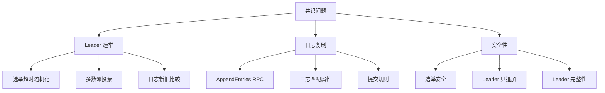
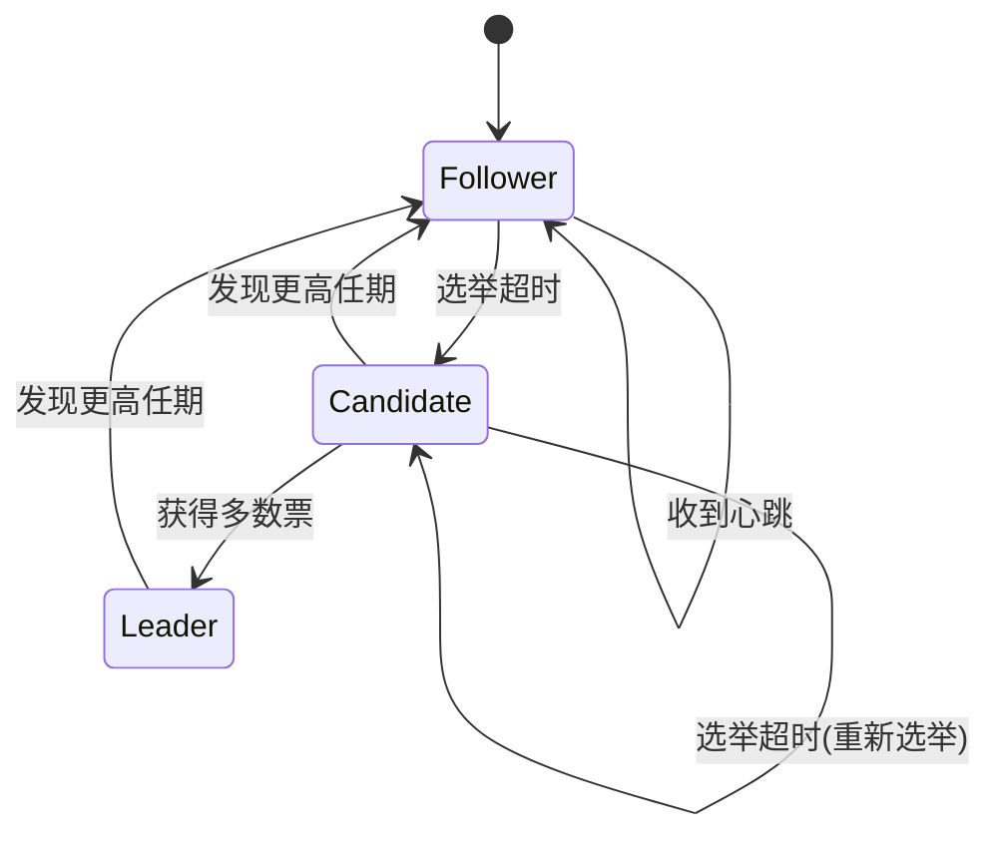
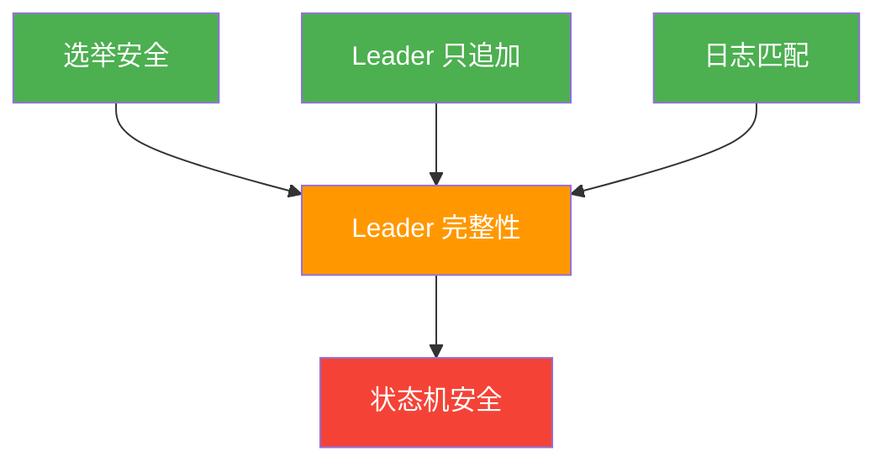

## 4. Raft 协议详解

Raft 由 Diego Ongaro 和 John Ousterhout 于 2014 年在斯坦福大学提出，其设计目标是**可理解性**（Understandability）。论文明确指出：在设计共识协议时，可理解性与正确性同等重要。Raft 将复杂的共识问题分解为三个相对独立的子问题——Leader 选举、日志复制、安全性——使每个子问题都可以被独立理解和实现。

与 Paxos 相比，Raft 最核心的创新是引入了**强 Leader 模型**：系统中存在一个明确的 Leader，所有客户端请求都通过 Leader 处理，日志复制由 Leader 单向驱动。这种设计大幅简化了协议的理解和实现难度。



### Raft 与 Paxos 的本质差异

| 维度 | Paxos | Raft |
|------|-------|------|
| 设计目标 | 理论完备性 | 可理解性 |
| Leader 模型 | 无固定 Leader（Multi-Paxos 有优化） | 强 Leader，所有写入经 Leader |
| 日志连续性 | 允许空洞（hole） | 要求连续，不允许空洞 |
| 成员变更 | 复杂，需联合共识 | 简化为单节点变更 |
| 工程实现 | 极其困难，bug 频发 | 相对直观，etcd/TiKV 均已验证 |
| 论文数量 | 一篇核心 + 大量变体补充 | 一篇论文覆盖完整协议 |
| 典型延迟 | 需两阶段确认 | 一阶段写入 + 异步复制 |

Raft 的强 Leader 模型意味着：**任何时候系统中至多存在一个有效的 Leader**，所有写操作都必须经过 Leader。这避免了 Multi-Paxos 中多个 Proposer 并发提案导致的日志空洞问题。

强 Leader 模型的代价是**单点瓶颈**：所有客户端请求必须经过 Leader，写吞吐受限于单节点的网络带宽和 CPU 处理能力。但实践中这个限制很少成为瓶颈——对于 etcd 这样的元数据存储，每秒数万次写入已经足够；对于需要更高吞吐的场景，TiKV 的多 Raft Group 架构将数据分片到多个独立的 Raft Group 中，每个 Group 有自己的 Leader，从而将负载分散到多个节点。

### 节点状态与任期（Term）

Raft 将时间划分为连续的**任期（Term）**，每个 Term 至多选举出一个 Leader。Term 充当逻辑时钟，用于检测过期的 Leader 和消息。

节点在任一时刻处于以下三种状态之一：



```python
class RaftNode:
    """Raft 节点核心状态"""
    
    # 持久化状态（崩溃恢复后必须恢复）
    current_term: int = 0        # 当前任期号，单调递增
    voted_for: str = None        # 当前任期投票给了谁（None 表示未投票）
    log: List[LogEntry] = []     # 日志条目列表，index 从 1 开始
    
    # 易失性状态（崩溃后不需要恢复）
    commit_index: int = 0        # 已知已提交的最高日志索引
    last_applied: int = 0        # 已应用到状态机的最高日志索引
    state: NodeState = FOLLOWER  # Follower / Candidate / Leader
    
    # Leader 专用易失性状态
    next_index: Dict[str, int] = {}   # 下一条要发给各 Follower 的日志索引
    match_index: Dict[str, int] = {}  # 各 Follower 已复制的最高日志索引
    
    # 每条日志条目包含
    # {term: int, index: int, command: any}
```

**关于持久化的关键说明**：`current_term`、`voted_for`、`log` 这三个字段必须持久化存储。如果一个 Follower 在投票后崩溃重启，它不能忘记自己投过票，否则可能导致同一 Term 选出两个 Leader，违反安全性。实践中，etcd 使用 BoltDB 持久化这些状态，TiKV 使用 Raft Engine。

**为什么这三个字段必须持久化？** 考虑这个反例：Follower A 在 Term 5 投票给了 Candidate B，然后 A 崩溃重启。如果 A 忘记了 `voted_for`，重启后又在 Term 5 投票给 Candidate C，那么 B 和 C 都可能获得多数票（各得到部分节点的支持），导致同一个 Term 出现两个 Leader。两个 Leader 会同时接受客户端请求并复制日志，破坏日志一致性。

### Leader 选举

#### 选举触发机制

当 Follower 在**选举超时（Election Timeout）**时间内没有收到 Leader 的心跳（AppendEntries RPC），它认为 Leader 已失效，转变为 Candidate 并发起选举。选举超时通过随机化来避免多个节点同时发起选举（split vote）：

- 选举超时范围：150ms ~ 300ms（论文推荐值）
- 心跳间隔：通常为选举超时的 1/10（如 15ms ~ 30ms）
- 随机化的作用：使不同节点的超时时间错开，大幅降低同时选举的概率

```python
def on_election_timeout():
    """选举超时触发"""
    current_term += 1
    state = CANDIDATE
    voted_for = self.id
    votes_received = 1  # 投给自己
    
    # 并行向所有 Follower 发送 RequestVote RPC
    for peer in peers:
        send_request_vote_async(
            peer, 
            current_term, 
            self.id,
            last_log_index,    # 本地最新日志的 index
            last_log_term      # 本地最新日志的 term
        )
    
    # 重置选举计时器（随机超时）
    reset_election_timer()  # random(150ms, 300ms)
```

**随机化的数学直觉**：假设选举超时均匀分布在 [150ms, 300ms] 区间，两个节点同时超时的概率约为 1/150 ≈ 0.67%。如果集群有 5 个节点，三个节点同时超时的概率更低（约 0.0003%）。实际实现中通常使用更宽的区间（如 150ms ~ 450ms）来进一步降低冲突概率。

#### RequestVote RPC 语义

每个节点收到 RequestVote 后，按照以下逻辑判断是否投票：

```python
def handle_request_vote(candidate_term, candidate_id,
                        candidate_last_log_index, candidate_last_log_term):
    """处理 RequestVote RPC"""
    
    # 规则 1：RPC 中的 Term 比自己小 → 拒绝并返回当前 Term
    if candidate_term < current_term:
        return VoteResponse(current_term, granted=False)
    
    # 规则 2：RPC 中的 Term 比自己大 → 更新自己的 Term 并转为 Follower
    if candidate_term > current_term:
        step_down(candidate_term)
    
    # 规则 3：每个 Term 每个节点最多投一票
    can_vote = (voted_for is None or voted_for == candidate_id)
    
    # 规则 4：候选人的日志必须"至少和自己一样新"
    log_is_up_to_date = (
        candidate_last_log_term > last_log_term or
        (candidate_last_log_term == last_log_term and
         candidate_last_log_index >= last_log_index)
    )
    
    if can_vote and log_is_up_to_date:
        voted_for = candidate_id
        reset_election_timer()  # 投票后重置选举计时器
        return VoteResponse(current_term, granted=True)
    else:
        return VoteResponse(current_term, granted=False)
```

**"日志至少和自己一样新"的判定逻辑**：先比较 Term，Term 大的更新；Term 相同则比较 Index，Index 大的更新。这保证了已提交的日志条目不会丢失——因为提交意味着多数节点已复制，而多数派投票保证了新 Leader 的日志至少覆盖了多数派中的一个。

#### 多数派计数

Candidate 收到多数派（`⌊N/2⌋ + 1`，N 为集群节点数）的投票后晋升为 Leader：

```python
def handle_vote_response(response):
    if response.granted:
        votes_received += 1
        if votes_received > len(nodes) // 2:
            become_leader()
            # 成为 Leader 后立即发送心跳，阻止新的选举
            broadcast_append_entries(heartbeat=True)
```

**为什么心跳要立即发送？** 新 Leader 上任后的第一次心跳有两个作用：一是告知所有 Follower 新 Leader 的存在，防止其他节点再次超时发起选举；二是推进日志复制——Follower 在收到心跳后会重置选举计时器，给 Leader 足够的时间来提交日志。

### 日志复制

Leader 接收客户端请求后，将命令作为新条目追加到本地日志，然后通过 AppendEntries RPC 并行复制到所有 Follower。

#### AppendEntries RPC 语义

```python
def handle_client_request(command):
    """处理客户端写请求"""
    if state != LEADER:
        return redirect_to_leader()
    
    # 追加到本地日志
    new_entry = LogEntry(
        term=current_term, 
        index=last_log_index + 1,
        command=command
    )
    log.append(new_entry)
    
    # 并行向所有 Follower 发送 AppendEntries
    replicate_to_followers()
    return new_entry
```

Follower 收到 AppendEntries 后的处理逻辑：

```python
def handle_append_entries(leader_term, leader_id,
                          prev_log_index, prev_log_term,
                          entries, leader_commit):
    """处理 AppendEntries RPC"""
    
    # 规则 1：Term 不合法 → 拒绝
    if leader_term < current_term:
        return AppendEntriesResponse(current_term, success=False)
    
    # 收到有效 Leader 的消息 → 重置选举计时器
    reset_election_timer()
    
    # 规则 2：日志一致性检查（Log Matching Property）
    # prevLogIndex 处的条目必须存在且 term 匹配
    if prev_log_index > 0:
        if prev_log_index > last_log_index:
            # 日志太短，缺少 prevLogIndex 处的条目
            return AppendEntriesResponse(current_term, success=False)
        if log[prev_log_index].term != prev_log_term:
            # 任期不匹配 → 删除从 prev_log_index 开始的所有条目
            log.truncate(prev_log_index)
            return AppendEntriesResponse(current_term, success=False)
    
    # 规则 3：追加新条目（如果存在冲突条目则覆盖）
    for entry in entries:
        if entry.index <= last_log_index:
            # 已有条目：如果任期不同则覆盖
            if log[entry.index].term != entry.term:
                log.truncate(entry.index)
                log.append(entry)
        else:
            log.append(entry)
    
    # 规则 4：更新 commitIndex
    if leader_commit > commit_index:
        commit_index = min(leader_commit, last_log_index)
        apply_committed_entries()
    
    return AppendEntriesResponse(current_term, success=True)
```

#### Leader 的日志推进流程

Leader 维护每个 Follower 的 `nextIndex` 和 `matchIndex`：

1. **初始化**：新 Leader 为每个 Follower 设置 `nextIndex = last_log_index + 1`，`matchIndex = 0`
2. **发送**：Leader 向 Follower 发送从 `nextIndex` 开始的所有条目
3. **成功**：Follower 接受后，更新 `nextIndex` 和 `matchIndex`
4. **失败（日志不匹配）**：Leader 递减 `nextIndex` 重试，直到找到匹配点

```python
def advance_follower(follower_id):
    """推动特定 Follower 的日志复制"""
    while next_index[follower_id] > 0:
        prev_idx = next_index[follower_id] - 1
        prev_term = log[prev_idx].term if prev_idx > 0 else 0
        entries = log[next_index[follower_id]:]
        
        response = send_append_entries(
            follower_id, current_term, leader_id,
            prev_idx, prev_term, entries, commit_index
        )
        
        if response.success:
            next_index[follower_id] = last_log_index + 1
            match_index[follower_id] = last_log_index
            break
        else:
            # 日志不匹配，递减 nextIndex 重试
            next_index[follower_id] -= 1
```

**nextIndex 递减的性能问题**：原始 Raft 论文中 nextIndex 逐条递减，最坏情况下需要 O(N) 次 RPC 才能找到匹配点。对于日志差距很大的场景（如新节点加入），这会显著延长恢复时间。etcd 实现了**快速回退优化**：Follower 在拒绝 AppendEntries 时附带 `XTerm`（冲突条目的 term）和 `XIndex`（该 term 的第一个 index），Leader 可以直接跳到对应位置，将回退次数从 O(N) 降低到 O(冲突term数量)。

#### 提交规则

Leader 通过递增 `commitIndex` 来提交日志条目。一个条目被提交意味着：**该条目已被存储在多数节点上**。

```python
def try_advance_commit_index():
    """Leader 尝试推进 commitIndex"""
    for n in range(commit_index + 1, last_log_index + 1):
        if log[n].term != current_term:
            continue  # 只能提交当前任期的条目
        
        # 计算有多少节点已复制该条目
        replicated_count = 1  # 包括 Leader 自己
        for follower_id in nodes:
            if match_index[follower_id] >= n:
                replicated_count += 1
        
        if replicated_count > len(nodes) // 2:
            commit_index = n
            apply_committed_entries()
```

**关于提交规则的重要约束**：Leader 只能直接提交当前任期的条目。对于之前任期的条目，只能通过提交当前任期的条目来间接提交。这个约束是为了防止已提交的日志被覆盖（参见论文 Figure 8 的反例）。

**为什么不能提交旧任期的条目？** 考虑论文 Figure 8 的场景：3 节点集群中，Leader S1 在 Term 2 复制了日志到 S1 和 S2（但未提交），然后崩溃。S5 在 Term 3 被选为 Leader（S5 只有 S5 自己的日志），追加了不同内容的日志并复制到 S3。如果 S5 的日志被提交（假设 S5 有 2/3 节点），然后 S5 崩溃，S1 在 Term 4 重新被选为 Leader。如果 S1 直接提交 Term 2 的日志（不经过 Term 4 的条目），那么 S5 在 Term 3 提交的日志会被 S1 覆盖——因为 S1 的 Term 4 条目会覆盖 S5 的 Term 3 条目。**只有通过当前 Term 的条目来间接提交，才能保证已提交的日志不会被新 Leader 覆盖。**

### Raft 的五个安全性保证

Raft 通过以下五个不变式（Invariant）保证系统的正确性，这些性质共同确保所有节点的状态机以相同顺序应用相同的命令序列：

┌─────────────────────────────────────────────────────────────────┐
│ 1. 选举安全（Election Safety）                                   │
│    每个任期最多选出一个 Leader                                    │
│    保证机制：多数派投票 + 每节点每任期只投一票                        │
│                                                                 │
│ 2. Leader 只追加（Leader Append-Only）                            │
│    Leader 永远不会覆盖或删除自己的日志                               │
│    保证机制：Leader 只追加新条目，不修改已有条目                      │
│                                                                 │
│ 3. 日志匹配（Log Matching）                                      │
│    如果两个日志在某个 index 有相同的 term，则该 index                │
│    及之前的所有条目都完全相同                                       │
│    保证机制：AppendEntries 中的 prevLogIndex/prevLogTerm 检查       │
│                                                                 │
│ 4. Leader 完整性（Leader Completeness）                           │
│    如果一个条目在某任期被提交，则该条目存在于所有                      │
│    更高任期的 Leader 的日志中                                      │
│    保证机制：选举时的日志新旧比较 + 投票规则                          │
│                                                                 │
│ 5. 状态机安全（State Machine Safety）                             │
│    如果一个节点在某个 index 应用了某条日志条目，                       │
│    则其他节点在同一 index 不会应用不同的条目                          │
│    保证机制：由以上四个性质共同保证                                  │
└─────────────────────────────────────────────────────────────────┘

**性质之间的逻辑关系**：



**Leader 完整性的直觉理解**：假设条目 T 在任期 X 被提交，那么任期 X 的 Leader 在提交 T 时必然已经将其复制到多数派。在后续任期 Y（Y > X）的选举中，任何候选人要赢得选举也必须获得多数派的投票。由于多数派的交集非空（至少一个节点），而这个节点持有条目 T 且不会投票给日志比自己旧的候选人，因此新 Leader 的日志必然包含 T。

#### 安全性证明：为什么已提交的日志不会丢失

考虑以下场景：Leader S1 在任期 2 提交了一条日志，然后崩溃。S5 在任期 3 被选为 Leader（未收到该日志），追加了不同内容的日志并提交。如果 S1 在任期 4 重新被选为 Leader，会怎样？

Timeline:
  S1(Leader, T2):  [1,2] ← 提交了 index 2
  S1 crashes...
  
  S5(Leader, T3):  [1,3] ← 覆盖了 index 2，但 T3 的条目无法提交
                       （因为 S5 只在 3 节点集群中获得了 2 票，
                        但 S1/S2 不会接受 T3 的日志）
  
  S1(Leader, T4):  [1,2] ← 安全！S1 的 index 2 已在 T2 提交，
                       选举时 S3 持有 T2 的日志，保证了 S1 能当选

这正是 Raft 提交规则的精妙之处：**Leader 只能提交当前任期的条目**。如果允许提交旧任期的条目，上述场景中 S1 可能在任期 4 直接提交 index 2（因为它是 T2 的条目），但这不会带来问题，因为日志匹配性质保证了所有更高任期的 Leader 也持有该条目。

#### Leader 完整性的严格证明

以下用反证法严格证明 Leader 完整性定理：

**定理**：如果一个日志条目在某个任期被提交，则该条目会出现在所有更高任期的 Leader 的日志中。

**证明**：
1. 假设条目 T 在任期 X 被提交，任期 Y（Y > X）的 Leader L 不包含 T
2. 因为 T 在任期 X 被提交，所以任期 X 的 Leader 在提交 T 时已经将其复制到多数派
3. Leader L 能在任期 Y 被选为 Leader，说明它获得了多数派的投票
4. 多数派投票 + 多数派持有 T → 存在至少一个节点同时持有 T 且投票给了 L
5. 但投票规则要求候选人的日志"至少和自己一样新"——如果 L 不包含 T，而投票者包含 T，投票者不应该投票给 L（矛盾）
6. 因此假设不成立，L 必然包含 T

这个证明的核心洞察是：**多数派的交集非空**。这是投票规则（日志新旧比较）和提交规则（多数派复制）共同作用的结果。

### 成员变更与日志压缩

#### 成员变更

集群成员变更（Configuration Change）是指动态增加或移除节点。Raft 提供两种方式：

**单节点变更（推荐）**：一次只添加或移除一个节点，通过以下流程安全过渡：

```python
def add_server(new_server):
    """安全添加新节点"""
    # 步骤 1：新节点以 Follower 身份加入，Leader 向其复制日志
    # 步骤 2：当日志追上后，提交配置变更条目
    config_entry = ConfigChange(new_config=current_config + {new_server})
    replicate(config_entry)
    # 步骤 3：新配置被提交后，新旧集群都认同新配置
    # 步骤 4：移除不再需要的旧节点
```

单节点变更的安全性保证：在任意时刻，新旧配置的多数派交集非空，因此不会出现脑裂。

**联合共识（Joint Consensus）**：支持一次性变更多个节点，但实现复杂，实际工程中很少使用。其核心思想是引入一个过渡配置 `C-old-new`，在此期间日志需要同时获得新旧两个配置的多数派同意。

**实际工程中的成员变更实践**：

etcd 采用了一种更简单的做法——**一步式变更**：直接提交一个包含新配置的条目，不需要过渡阶段。其安全性依赖于一个关键观察：新配置被提交的那一刻，旧配置和新配置都会遵守它（因为新配置的提交意味着新配置的多数派已经同意，而新旧配置的多数派交集非空）。TiKV 同样支持一步式变更，但额外实现了 `Learner` 节点——Learner 参与日志复制但不参与投票，用于跨机房部署或慢速网络场景。

#### 日志压缩（快照）

随着运行时间增长，日志会无限膨胀。**快照（Snapshot）**将状态机的当前状态序列化存储，然后截断已快照的日志条目，释放磁盘空间：

```python
def create_snapshot():
    """创建快照"""
    # 1. 将状态机当前状态序列化
    snapshot_state = state_machine.get_state()
    
    # 2. 记录快照的元信息
    snapshot = Snapshot(
        last_included_index=last_applied,
        last_included_term=log[last_applied].term,
        state=snapshot_state
    )
    
    # 3. 持久化快照（原子写入）
    persist_snapshot(snapshot)
    
    # 4. 截断日志中已快照的部分（保留最后一条用于一致性检查）
    log.remove_up_to(last_applied)
```

**快照触发策略**：

| 策略 | 触发条件 | 优点 | 缺点 |
|------|---------|------|------|
| 固定条目数 | 日志条目超过阈值（如 10 万条） | 可预测 | 不考虑状态大小 |
| 固定大小 | 状态大小超过阈值（如 64MB） | 控制磁盘占用 | 日志条目可能很多但状态小 |
| 混合策略 | 条目数或状态大小任一超阈值 | 兼顾两者 | 实现稍复杂 |
| 定时触发 | 固定时间间隔（如每小时） | 可预测的恢复时间 | 可能触发过于频繁或稀疏 |

etcd 使用**混合策略**：按 revision 数量或时间间隔触发 compaction。TiKV 使用 **log compaction** + **snapshot compaction** 分级策略，先做日志压缩，再根据需要做快照压缩。

**InstallSnapshot RPC**：当 Follower 落后太多，Leader 需要发送整个快照而非逐条日志。这在新节点加入或 Follower 长时间宕机后恢复时触发：

```python
def handle_install_snapshot(leader_term, leader_id,
                            last_included_index, last_included_term,
                            snapshot_data):
    """Follower 处理 Leader 发来的快照"""
    if leader_term < current_term:
        return SnapshotResponse(current_term, success=False)
    
    reset_election_timer()
    
    # 如果快照比本地状态更新，则应用快照
    if last_included_index > commit_index:
        # 丢弃被快照覆盖的日志
        log.truncate(last_included_index)
        
        # 加载快照到状态机
        state_machine.restore(snapshot_data)
        last_applied = last_included_index
        commit_index = last_included_index
    
    return SnapshotResponse(current_term, success=True)
```

**快照传输的分块处理**：对于大型快照（如几十 GB），一次性传输会导致内存压力和网络阻塞。etcd 实现了分块传输：将快照分割为固定大小的块（如 64KB），逐块发送，Follower 逐块接收并写入临时文件，最后原子替换。这允许传输过程中被打断后从断点恢复，无需重新传输整个快照。

### Raft 的扩展机制

#### Pre-Vote 机制

原始 Raft 中，网络分区恢复后，被隔离的节点可能累积很高的 Term，恢复后发起选举时会大幅提升所有节点的 Term，导致当前 Leader 误以为自己过期而退位。Pre-Vote 机制解决了这个问题：

```python
def on_election_timeout_with_prevote():
    """Pre-Vote 选举流程"""
    # 第一阶段：PreVote（不提升 Term）
    pre_vote_granted = 0
    for peer in peers:
        response = send_pre_vote(
            peer, 
            current_term,       # 假设的下一任期
            self.id,
            last_log_index,
            last_log_term
        )
        if response.granted:
            pre_vote_granted += 1
    
    # 只有获得多数 PreVote 才真正发起选举
    if pre_vote_granted > len(nodes) // 2:
        current_term += 1       # 此时才提升 Term
        state = CANDIDATE
        # 正式的 RequestVote 流程...
```

Pre-Vote 的核心思想：**在真正提升 Term 之前，先试探性地询问其他节点是否愿意投票**。如果一个被分区隔离的节点发起 PreVote，多数节点会拒绝（因为它们的 Leader 还在正常运行），这个节点不会提升自己的 Term，也不会干扰当前 Leader。

#### Lease Read 与 ReadIndex

在需要线性一致性读的场景中，Raft 提供两种读优化方案：

**ReadIndex 流程**：
1. Leader 记录当前 commitIndex 为 readIndex
2. 向多数派发送心跳确认自己仍是 Leader
3. 等待状态机应用到 readIndex
4. 返回读结果

**Lease Read 流程**：
1. Leader 在收到心跳时记录一个"租约"时间（通常为选举超时的 1/3）
2. 在租约有效期内，Leader 可以直接处理读请求，无需心跳确认
3. 租约过期后重新发送心跳续租

┌──────────────────────────────────────────────────┐
│                读一致性方案对比                     │
├──────────────┬───────────┬───────────┬────────────┤
│ 方案         │ 延迟       │ 一致性    │ 适用场景    │
├──────────────┼───────────┼───────────┼────────────┤
│ 强一致读     │ 高         │ 线性一致  │ 严格场景    │
│ ReadIndex    │ 中         │ 线性一致  │ 大多数场景  │
│ Lease Read   │ 最低       │ 依赖时钟  │ 低延迟需求  │
│ 异步读       │ 最低       │ 最终一致  │ 读多写少    │
└──────────────┴───────────┴───────────┴────────────┘

**Lease Read 的时钟依赖风险**：Lease Read 假设 Leader 在租约有效期内仍是 Leader，这依赖于本地时钟的准确性。如果节点时钟漂移（如 NTP 跳变），Leader 可能在已经失去领导权后仍认为自己是 Leader，导致过时读。在时钟不可靠的环境中（如虚拟机、容器），推荐使用 ReadIndex 而非 Lease Read。

### 常见工程陷阱与解决方案

#### 陷阱 1：Livelock（活锁）

多个 Candidate 同时发起选举，导致选票分散，反复超时重选。虽然随机超时大幅降低了发生概率，但在大规模集群中仍可能出现。

**解决方案**：
- 采用**Pre-Vote 机制**（Raft 论文扩展）：在真正发起选举前先发送 PreVote RPC，只有获得多数派同意才正式参选
- Pre-Vote 的好处：未当选的 Candidate 不会提升自己的 Term，避免干扰正常运行的 Leader
- **随机退避增强**：在每次选举失败后，将选举超时的随机上界乘以一个退避因子（如 1.5 倍），逐步降低冲突概率

#### 陷阱 2：日志压缩导致的快照边界问题

截断日志后，如果 Follower 需要的日志条目已被截断，Leader 需要发送快照。但如果快照过于频繁，会带来性能开销。

**解决方案**：
- etcd 使用 **db compaction** 策略：按 revision 数量或时间间隔触发
- TiKV 使用 **log compaction** + **snapshot compaction** 分级策略
- **快照与日志截断的原子性**：快照文件写入和日志截断必须是原子操作，否则崩溃后可能丢失数据。etcd 使用 BoltDB 的事务机制保证原子性

#### 陷阱 3：网络分区下的读一致性

Leader 可能因网络分区而与集群隔离，但仍然接受客户端读请求，导致**过时读**（Stale Read）。

**解决方案**：使用 ReadIndex 或 Lease Read（详见上文"读一致性方案对比"）。

#### 陷阱 4：大批量写入导致的日志膨胀

当客户端发送大批量写入时（如批量导入数据），日志会快速膨胀，导致内存压力和快照频繁触发。

**解决方案**：
- **流控（Rate Limiting）**：限制单次 AppendEntries 的条目数量和大小
- **批量合并**：将多个客户端请求合并到一次 AppendEntries 中，减少 RPC 次数
- **背压（Backpressure）**：当 Leader 的日志领先 Follower 太多时，暂停接受新请求，等待 Follower 追上

#### 陷阱 5：Leader 切换后的客户端超时

Leader 崩溃后，客户端可能因为持有旧 Leader 的连接而超时。即使新 Leader 已经选出，客户端也需要重新发现新 Leader。

**解决方案**：
- **客户端重试**：客户端检测到连接断开后，自动重试并发现新 Leader
- **Leader Forwarding**：Follower 收到写请求时，返回新 Leader 的地址（而非简单的拒绝）
- **etcd 的 watch 机制**：客户端通过 watch 机制感知 Leader 变化，主动切换连接

#### 陷阱 6：磁盘 IO 对 Raft 性能的影响

Raft 的持久化操作（写入 term、voted_for、log）需要同步刷盘，否则崩溃后可能丢失数据。但频繁的 fsync 会严重降低性能。

**解决方案**：
- **批量提交**：将多个日志条目合并到一次磁盘写入中
- **Group Commit**：将多个客户端的提交合并到一次 fsync 中，提高磁盘吞吐
- **WAL（Write-Ahead Logging）**：使用预写日志机制，将多个小写入合并为大写入
- **NVMe SSD**：使用高速 SSD 替代 HDD，将 fsync 延迟从几毫秒降低到几十微秒

### 实际系统中的 Raft 实现

| 系统 | 语言 | 关键优化 | 应用场景 |
|------|------|---------|---------|
| etcd | Go | Pre-Vote, ReadIndex, learner 节点 | Kubernetes 元数据存储 |
| TiKV | Rust | Learner, Witness, 多 Raft Group | 分布式 KV 存储 |
| CockroachDB | Go | 线性一致读, Learner | 分布式 SQL |
| Consul | Go | 一致性模式（强/可调） | 服务发现与配置 |
| Oxide | Rust | 嵌入式 Raft 库 | 云基础设施 |

**etcd 的关键配置参数**：

```yaml
# etcd.conf.yml 核心 Raft 配置
raft:
  heartbeat-interval: 1000        # 心跳间隔（ms），默认 1000
  election-timeout: 10000         # 选举超时（ms），默认 10000
  # 经验法则：election-timeout >= 10 * heartbeat-interval
```

**TiKV 的多 Raft Group 架构**：TiKV 使用 Region 级别的多 Raft Group——数据被划分为多个 Region，每个 Region 维护自己的 Raft Group。这实现了数据分片与复制的统一管理。

**etcd 的 Learner 节点**：etcd 3.4+ 支持 Learner 节点——参与日志复制但不参与投票。Learner 用于以下场景：
- **跨机房部署**：Learner 放在远程机房，只读访问数据，不影响集群可用性
- **慢速节点**：性能较差的节点作为 Learner，不影响 Leader 的提交速度
- **渐进式扩容**：新节点先以 Learner 身份加入，待日志追上后再转为投票节点

### Raft 的局限性

尽管 Raft 在工程实践中被广泛采用，但它并非完美无缺。理解其局限性有助于在架构设计中做出正确的技术选型：

**1. 写吞吐受限于 Leader**

Raft 的强 Leader 模型意味着所有写操作必须经过 Leader。在单个 Raft Group 中，写吞吐受限于单个节点的网络带宽和 CPU 处理能力。对于需要极高写吞吐的场景（如每秒数十万次写入），单个 Raft Group 可能成为瓶颈。TiKV 的解决方案是多 Raft Group——将数据分片到多个独立的 Raft Group 中，每个 Group 有自己的 Leader，从而将负载分散到多个节点。

**2. Leader 切换期间的不可用**

Leader 崩溃后，集群需要等待选举超时才能选出新 Leader。在这个窗口期内，所有写操作都会失败。虽然 Pre-Vote 可以减少不必要的选举，但 Leader 切换的延迟仍然无法完全消除。对于要求 99.999% 可用性的场景，需要结合客户端重试、Leader 快速检测等机制来缓解。

**3. 跨地域部署的延迟挑战**

在跨地域部署中，Raft 需要将日志复制到远程节点，网络延迟会显著增加写入延迟。对于 3 节点集群分布在 3 个地域的情况，每次写入需要等待最远节点的确认，延迟可能达到几百毫秒。解决方案包括：使用 Learner 节点（只读访问）、采用异步复制（牺牲一致性换取低延迟）、使用 EPaxos 等更灵活的协议。

**4. 日志压缩的复杂性**

快照的创建、传输和恢复涉及多个组件的协调，容易出错。特别是快照与日志截断的原子性、快照传输的断点恢复、快照恢复后的日志一致性检查等问题，都需要精心设计。etcd 和 TiKV 都花了大量工程精力来解决这些问题。

**5. 与 EPaxos 的对比**

EPaxos（Egalitarian Paxos）允许任何节点直接处理写请求（无需 Leader），在无冲突的情况下只需一阶段提交（延迟为 RTT/2），在有冲突的情况下需要两阶段。对于写冲突较少的场景（如地理分布的配置存储），EPaxos 的性能优于 Raft。但 EPaxos 的实现复杂度远高于 Raft，工程实践中 Raft 仍然是主流选择。

### 性能调优建议

1. **集群规模**：推荐 3 或 5 节点。奇数节点可容忍 `(N-1)/2` 个节点故障
2. **心跳间隔**：过小导致 CPU 负载高，过大导致选举超时长。通常 100ms ~ 1000ms
3. **日志条目大小**：单条命令过大时应分批写入，避免单次 AppendEntries 超时
4. **快照触发频率**：日志条目数超过阈值（如 10 万条）或状态大小超过阈值（如 64MB）时触发
5. **批量提交**：Leader 可以合并多个客户端请求到一次 AppendEntries 中，减少 RPC 次数
6. **磁盘选择**：使用 NVMe SSD 而非 HDD，将 fsync 延迟从毫秒级降低到微秒级
7. **网络优化**：确保节点间网络延迟稳定，避免因网络抖动导致不必要的选举
8. **内存管理**：限制内存中保留的日志条目数量，及时做快照释放内存

**集群规模的选择**：

┌─────────────┬────────────────────┬───────────────────┐
│ 节点数      │ 容忍故障数          │ 典型延迟（RTT）    │
├─────────────┼────────────────────┼───────────────────┤
│ 3           │ 1                  │ 低                │
│ 5           │ 2                  │ 中                │
│ 7           │ 3                  │ 高（不推荐）       │
└─────────────┴────────────────────┴───────────────────┘

推荐：3 节点（简单场景）或 5 节点（高可用场景）
不推荐：7 节点及以上（延迟高、选举复杂度增加）

### 本节小结

Raft 的核心思想可以用一句话概括：**通过强 Leader 模型将共识问题简化为可管理的子问题**。选举超时随机化解决冲突，日志匹配属性保证一致性，多数派规则保证安全性。理解了这三个子问题及其相互关系，就掌握了 Raft 的本质。

**Raft 的关键知识点回顾**：

| 子问题 | 核心机制 | 关键不变式 |
|--------|---------|-----------|
| Leader 选举 | 随机超时 + 多数派投票 + 日志新旧比较 | 每个 Term 至多一个 Leader |
| 日志复制 | AppendEntries RPC + prevLog 检查 | 日志匹配属性 |
| 安全性 | 提交规则 + 选举规则 | 已提交的日志不会丢失 |

**实践建议**：

1. **不要从零实现 Raft**——使用 etcd/raft、TiKV/raft-rs 等成熟的库，它们已经解决了大量边界情况
2. **充分测试**——使用 Jepsen 等工具验证共识实现的正确性，特别是网络分区、消息丢失、节点崩溃等场景
3. **监控关键指标**——选举次数、提交延迟、日志落后量、快照频率等，及时发现异常
4. **理解你的场景**——Raft 适合需要强一致性的场景；如果可以接受最终一致性，考虑更简单的方案

**Raft vs 其他共识协议的选型建议**：

需要强一致性？
├── 是 → 写冲突多吗？
│   ├── 是 → Raft（强 Leader，实现简单）
│   └── 否 → EPaxos（无 Leader，延迟更低，但实现复杂）
└── 否 → 最终一致性？
    ├── 是 → Gossip 协议（如 Cassandra）
    └── 否 → 特殊场景，需要具体分析
