## 5. ZAB 协议与 Viewstamped Replication

在分布式共识协议的谱系中，Paxos 是理论基石，Raft 是可理解性的标杆，而 ZAB（ZooKeeper Atomic Broadcast）和 Viewstamped Replication（VR）则是两条同样重要但经常被忽视的演进路线。ZAB 驱动着 Apache ZooKeeper 这一工业级协调服务的内核，VR 则是最早提出"主副本 + 视图切换"思想的协议，深刻影响了后世包括 Raft 在内的多种共识算法设计。

本节从历史演进、核心机制、工程实现三个维度深入解析这两个协议，并与 Raft 和 Paxos 进行系统性对比。

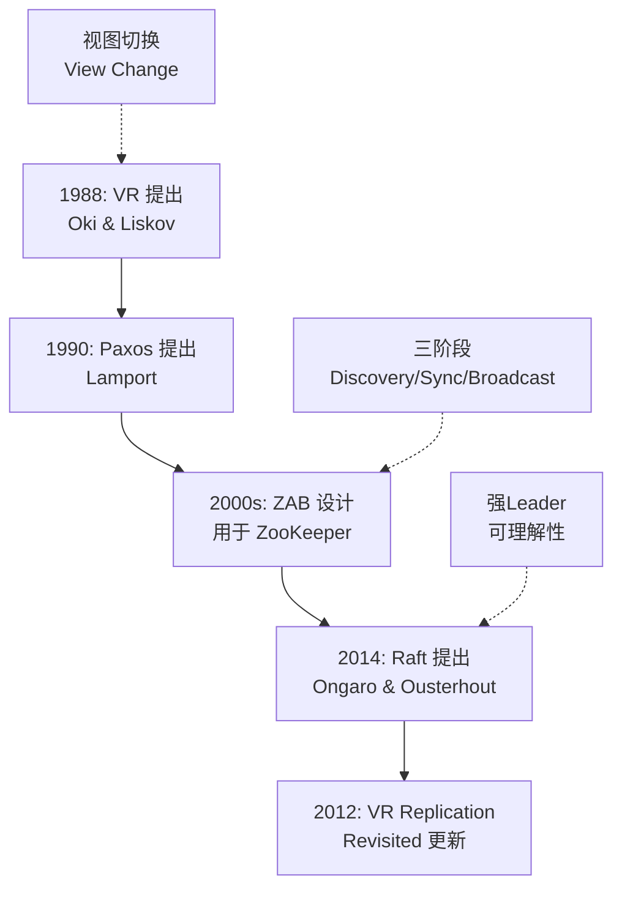

---

### 5.1 ZAB 协议详解

#### 5.1.1 历史背景与设计动机

ZAB 协议由 Patrick Hunt（Apache ZooKeeper 项目创始人）于 2007 年前后在雅虎研究院提出，最初随 ZooKeeper 项目一起发布。ZAB 的设计目标非常明确：**为 ZooKeeper 提供原子广播能力，保证分布式环境下所有副本的状态变更有序、一致地应用**。

与 Paxos 和 Raft 不同，ZAB 并非从零设计一个通用共识协议，而是针对 ZooKeeper 的特定需求做了针对性优化：

- **读写分离模型**：ZooKeeper 的读操作不经过 Leader，ZAB 只需要处理写操作的共识
- **顺序写入语义**：客户端的写请求被 Leader 分配全局单调递增的事务 ID（ZXID）
- **崩溃恢复优先**：ZAB 的恢复协议设计得比广播协议更为复杂，因为 ZooKeeper 需要保证恢复后的数据一致性

> **关键区别：** ZAB 最初是作为 ZooKeeper 的内部协议存在的，并非独立设计的通用共识算法。直到 2011 年 Junqueira 等人在论文 "Zab: High-performance broadcast for primary-backup systems" 中才对 ZAB 进行了系统的理论描述。

#### 5.1.2 核心概念：ZXID 与角色

**ZXID（ZooKeeper Transaction ID）** 是 ZAB 协议中最重要的概念，它是事务标识符，为 64 位整数，结构如下：

ZXID = (epoch << 32) | counter
  │                  │
  │                  └── 单调递增的事务计数器
  └───────────────────── 时代编号（epoch），每次 Leader 变更 +1

epoch 部分对应 Raft 中的 term，但 ZAB 将其编码在事务 ID 的高位，使得仅比较 ZXID 就能判断事务的新旧关系。这种设计极其优雅：**ZXID 越大，事务越新；ZXID 相同则 counter 越大越新**。

ZAB 协议中存在三种角色：

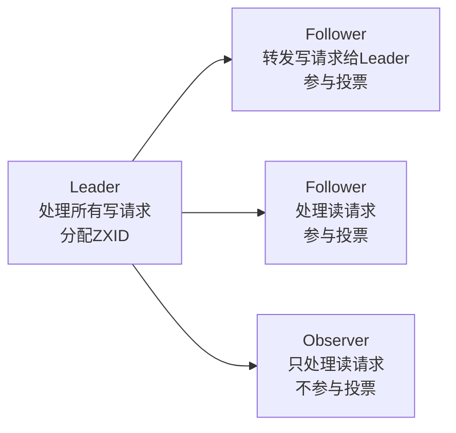

| 角色 | 职责 | 参与投票 | 可处理读请求 | 数量要求 |
|------|------|---------|------------|---------|
| Leader | 分配事务、广播变更 | 是 | 是 | 1个（恰好一个） |
| Follower | 转发写请求、参与选举和提交投票 | 是 | 是 | 多数派所需 |
| Observer | 扩展读吞吐量，不参与任何共识过程 | 否 | 是 | 无限制 |

Observer 是 ZooKeeper 的一个独特设计——当集群读请求量很大但又不希望增加投票开销时，可以部署 Observer 节点。它们接收 Leader 的变更广播但不参与投票，类似于 Raft 中只做日志复制不做投票的只读副本。

#### 5.1.3 协议三阶段

ZAB 的核心是三个阶段：**Discovery（发现）、Synchronization（同步）、Broadcast（广播）**。前两个阶段用于 Leader 选举后的数据恢复，第三个阶段是正常运行时的原子广播。

**阶段一：Discovery（发现）**

新 Leader 当选后，需要确定最新的系统状态。此阶段的目的是让 Leader 从 Follower 收集所有已接受的事务，找到最新状态：

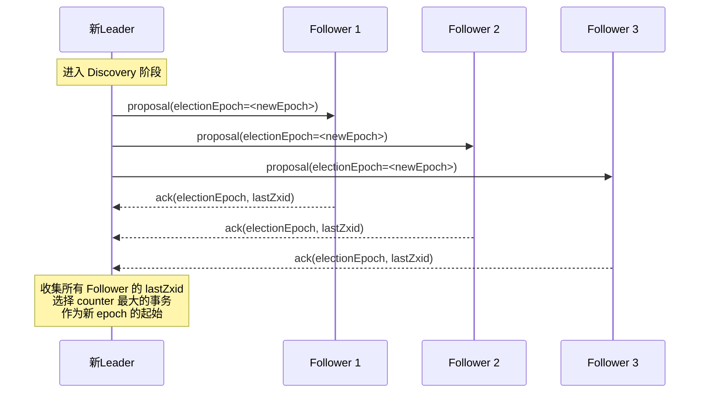

关键步骤：
1. 新 Leader 生成新的 election epoch
2. 向所有 Follower 发送 proposal，携带新 epoch
3. Follower 检查 epoch 是否大于自己的 current epoch，若是则更新并回复自己的 lastZxid
4. Leader 从多数派 Follower 获取 ACK 后，确定最新的事务状态

**阶段二：Synchronization（同步）**

Leader 确定最新状态后，需要确保所有 Follower 的数据与 Leader 一致：

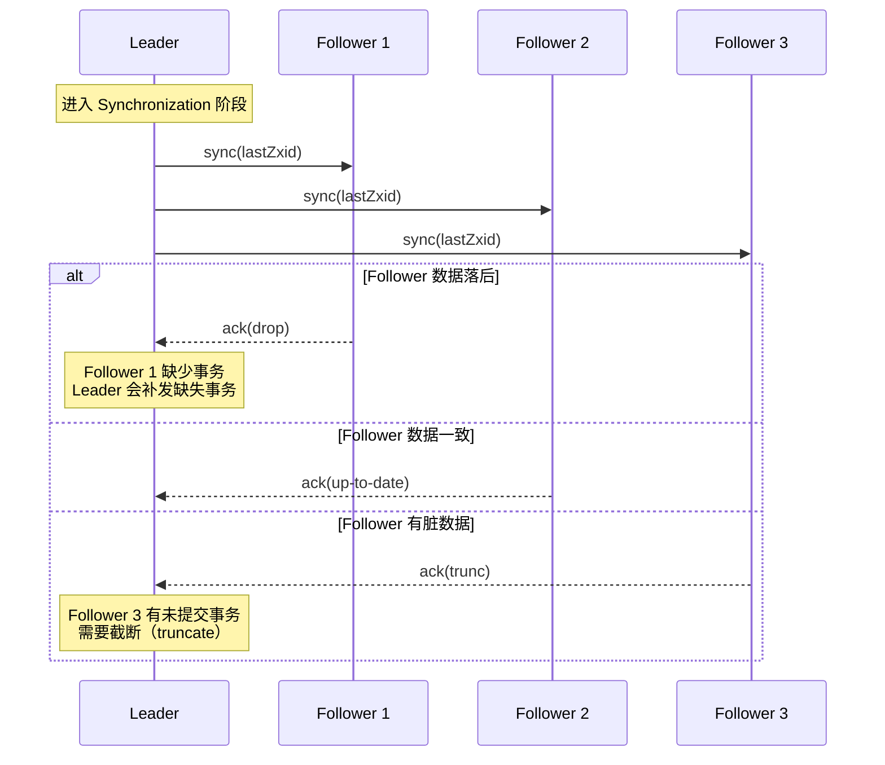

三种同步结果：
- **up-to-date**：Follower 数据与 Leader 一致，无需操作
- **drop**：Follower 缺少某些事务，Leader 需要补发
- **trunc**：Follower 存在 Leader 没有的事务（上一个 Leader 的未提交事务），需要截断

**阶段三：Broadcast（广播）**

恢复正常运行后的原子广播阶段，本质上是简化版的 Two-Phase Commit：

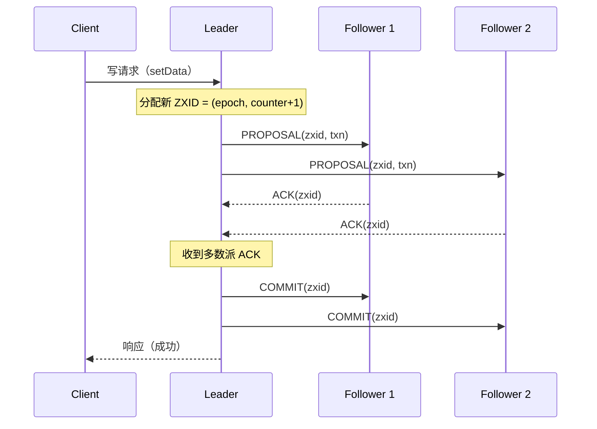

Broadcast 的关键特性：

| 特性 | 说明 |
|------|------|
| 有序性 | 所有 Follower 按相同顺序接收和提交事务 |
| 原子性 | 事务要么在所有正确节点提交，要么全部不提交 |
| 单 Leader 驱动 | 所有写操作必须经过 Leader |
| 可跳过 Observer | Observer 不参与投票，减少广播开销 |
| 崩溃恢复 | Leader 崩溃后重新走 Discovery → Synchronization → Broadcast |

#### 5.1.4 ZAB 与 Raft 的关键区别

虽然 ZAB 和 Raft 在功能上非常相似，但在设计细节上存在重要差异：

| 维度 | ZAB | Raft |
|------|-----|------|
| 日志连续性 | 允许不连续的空洞（hole） | 要求日志连续，不允许空洞 |
| Leader 写入时机 | Leader 可以在同步阶段就提交旧 epoch 的事务 | Leader 只能提交当前 term 的日志条目 |
| 成员变更 | 支持动态增减节点，Observer 机制 | 单步变更或联合共识 |
| 读操作 | 读操作不经过 Leader，不保证线性一致性 | 默认读操作经 Leader，可通过 ReadIndex 保证线性一致性 |
| 术语 | epoch（时代） | term（任期） |
| 事务标识 | ZXID（包含 epoch + counter） | (term, index) 二元组 |
| 观察者节点 | 原生支持 Observer，不参与投票 | 无原生对应，需应用层实现 |
| 恢复阶段 | 三阶段（Discovery → Synchronization → Broadcast） | 两阶段（选举 → 日志复制） |

> **核心差异：** ZAB 允许 Leader 在 Synchronization 阶段直接提交旧 epoch 的事务，而 Raft 的 Leader 必须等待新 term 的日志条目被提交后才能间接提交旧 term 的日志。这是两种协议在安全性保证上最本质的区别。

#### 5.1.5 ZXID 的安全性证明

ZAB 如何保证不丢失已提交的事务？关键在于多数派交集：

1. **已提交的事务 = 被 Leader 并收到多数派 ACK 的事务**
2. **新 Leader 必须从多数派 Follower 获取信息**
3. **多数派的交集保证了至少有一个 Follower 持有最新已提交的事务**

形式化表达：假设集群有 N 个投票节点（Leader + Follower），已提交事务 T 需要 ⌊N/2⌋+1 个节点 ACK。新 Leader 从所有节点收集信息，其信息来源的多数派与 T 的 ACK 多数派必有交集。因此新 Leader 一定能看到 T，不会丢弃它。

```python
# ZXID 比较逻辑（伪代码）
def zxid_is_newer(zxid_a: int, zxid_b: int) -> bool:
    """
    ZXID 格式: (epoch << 32) | counter
    比较规则: epoch 优先，counter 次之
    """
    epoch_a = zxid_a >> 32
    epoch_b = zxid_b >> 32
    
    if epoch_a > epoch_b:
        return True   # epoch 更大，一定更新
    elif epoch_a < epoch_b:
        return False
    else:
        # epoch 相同，比较 counter
        counter_a = zxid_a &amp; 0xFFFFFFFF
        counter_b = zxid_b &amp; 0xFFFFFFFF
        return counter_a > counter_b
```

---

### 5.2 Viewstamped Replication 详解

#### 5.2.1 历史地位

Viewstamped Replication（VR）由 Barbara Liskov 和 Brian Oki 于 1988 年在 MIT 提出，是**最早实现主副本复制的共识协议之一**。VR 比 Paxos（1990年提出）更早，其核心思想——"主节点驱动 + 视图切换"——直接影响了后来的 ZAB 和 Raft。

Liskov 是图灵奖得主（2008年），因"设计和构建支持数据抽象和面向对象编程的语言"获奖。VR 是她在分布式系统领域的重要贡献之一。

> **历史线索：** 如果你仔细对比 VR（1988）和 Raft（2014），会发现它们在核心机制上惊人地相似。Ongaro 在 Raft 论文中明确提到受 VR 影响，可以说 Raft 在很大程度上是对 VR 思想的"重新发现和简化"。

#### 5.2.2 核心设计：视图（View）

VR 中最关键的抽象是**视图（View）**。每个视图由一个视图编号（view number）和一个有序的节点列表组成：

View = (view_number, [replica_0, replica_1, replica_2, ..., replica_n])

其中 `replica_0` 是当前视图的**主副本（Primary）**，其余为备份副本（Backup）。视图编号单调递增，每次主副本失效触发视图切换时，view_number +1。

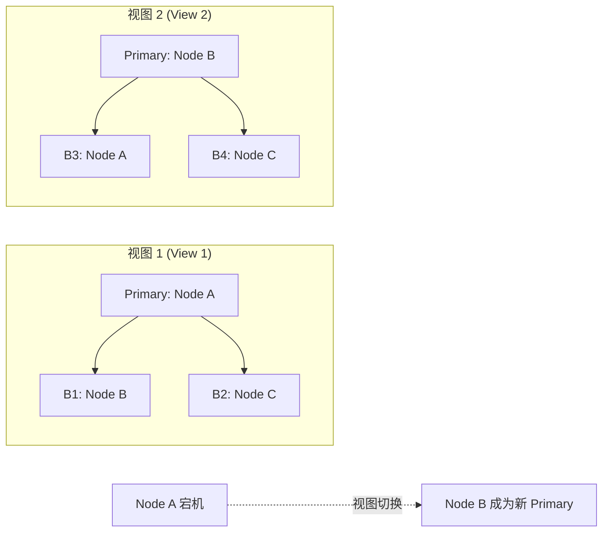

这个设计与 Raft 的 Leader 选举非常相似：
- VR 的 Primary = Raft 的 Leader
- VR 的 View Number = Raft 的 Term
- VR 的视图切换 = Raft 的 Leader 选举

#### 5.2.3 VR 协议流程

VR 的正常操作分为两个阶段：

**阶段一：准备（Prepare）**

1. 客户端向 Primary 发送请求
2. Primary 将请求转为操作（operation），分配序列号
3. Primary 向所有 Backup 发送 PREPARE 消息，携带 (view_number, sequence_number, operation)
4. Backup 验证 view_number 和 sequence_number 的合法性，若接受则持久化操作到日志，返回 PREPARE_OK

**阶段二：提交（Commit）**

1. Primary 收到多数派 Backup 的 PREPARE_OK 后，执行操作
2. Primary 向所有 Backup 发送 COMMIT 消息
3. Backup 收到 COMMIT 后执行操作，响应客户端

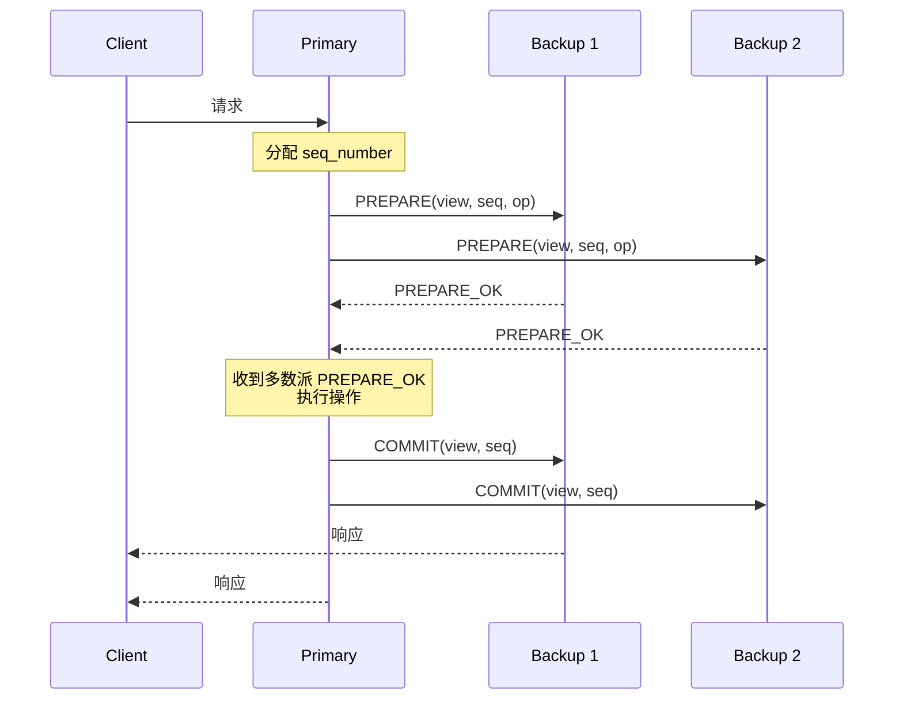

#### 5.2.4 视图切换（View Change）

当 Primary 失效或无法通信时，Backup 发起视图切换：

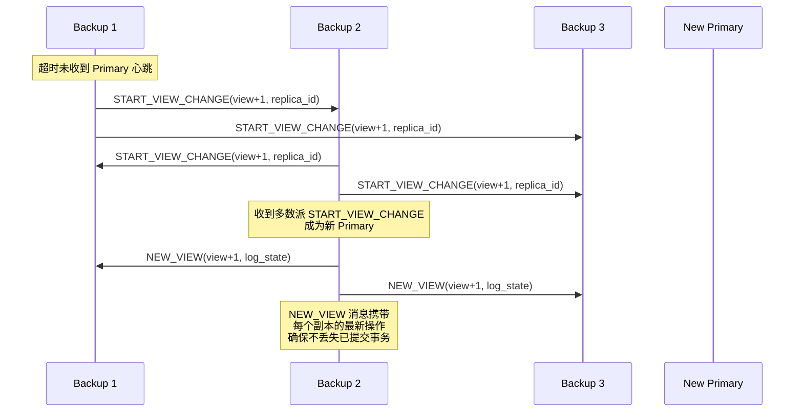

视图切换的正确性依赖两个不变量：
1. **最新提交的操作一定被多数派持久化**——新 Primary 从多数派收集日志，能发现所有已提交操作
2. **未提交的操作可能丢失**——但客户端会重试，不影响正确性

#### 5.2.5 VR Replication Revisited（2012）

2012 年，Liskov、Coward 等人发表了 VR 的更新版本 "Viewstamped Replication Revisited"，对原始协议做了重要改进：

| 改进点 | 原始 VR (1988) | 更新版 (2012) |
|--------|---------------|---------------|
| 视图切换 | 需要所有 Backup 同步日志 | 新 Primary 从多数派收集，更高效 |
| 成员变更 | 不支持 | 引入配置变更协议 |
| 读操作 | 不涉及 | 增加线性一致性读的讨论 |
| 形式化验证 | 部分 | 完整的 TLA+ 规范 |
| 与 Raft 的关系 | 无 | 明确指出与 Raft 的相似性 |

---

### 5.3 ZAB、VR、Raft、Paxos 系统性对比

四种协议在设计理念和工程实现上的差异可以用一张表概括：

| 维度 | Paxos | Raft | ZAB | VR |
|------|-------|------|-----|-----|
| **提出年份** | 1990 | 2014 | 2007-2011 | 1988 |
| **设计目标** | 理论完备性 | 可理解性 | ZooKeeper 特定优化 | 主副本复制 |
| **Leader 模型** | 无固定 Leader（Multi-Paxos 有优化） | 强 Leader | 强 Leader | 强 Primary |
| **日志连续性** | 允许空洞 | 要求连续 | 允许空洞 | 要求连续 |
| **恢复机制** | Prepare/Accept 两阶段 | 选举 + 日志复制 | Discovery → Sync → Broadcast | Prepare → Commit + 视图切换 |
| **成员变更** | 复杂（联合共识） | 单步变更 | 动态增减 + Observer | 2012版支持 |
| **读操作** | 不保证线性一致性 | 默认 Leader 读 | 不经 Leader | 可配置 |
| **事务标识** | 提案编号（proposal number） | (term, index) | ZXID（epoch + counter） | (view_number, sequence) |
| **实现复杂度** | 极高 | 中等 | 中等 | 中等 |
| **工业实现** | Chubby（已停用） | etcd, TiKV, CockroachDB | ZooKeeper | 无独立实现 |
| **理论形式化** | 部分 | Ongaro 博士论文 | Junqueira 论文 | TLA+ 规范（2012） |

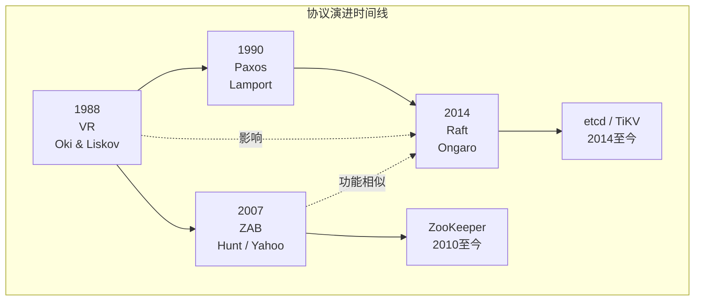

### 5.4 VR 与 Raft 的深层联系

Ongaro 在 Raft 论文中明确承认 VR 的影响。从本质上说，**Raft 可以看作是对 VR 思想的重新发现和系统化**：

| VR 概念 | Raft 对应概念 | 差异说明 |
|---------|-------------|---------|
| View (视图) | Term (任期) | VR 用 view_number 标识，Raft 用 term 标识 |
| Primary | Leader | 语义完全一致，强主模型 |
| Backup | Follower | 语义完全一致 |
| Prepare/Commit | AppendEntries | Raft 将两者合并为一个 RPC |
| View Change | Leader Election | 都是检测到主节点失效后触发 |
| PREPARE 消息 | RequestVote | 都携带日志状态用于比较 |
| NEW_VIEW 消息 | AppendEntries（心跳） | 新 Leader 建立权威 |

关键设计差异：

1. **消息合并**：VR 的 Prepare 和 Commit 是两个独立消息阶段，Raft 将 AppendEntries 同时用于日志复制和心跳，减少了消息类型
2. **日志连续性**：Raft 要求日志严格连续，VR 允许空洞。连续性约束让 Raft 的日志匹配属性更容易理解和验证
3. **提交规则**：VR 允许 Primary 在 Prepare 阶段就提交旧视图的操作；Raft 严格限制只能提交当前 term 的日志（这是 Raft 安全性证明中最微妙的部分）

---

### 5.5 工程实现分析

#### 5.5.1 ZooKeeper 中的 ZAB

ZooKeeper 是 ZAB 协议最经典的工业实现。以下分析其关键工程决策：

**日志管理**

```java
// ZooKeeper 的事务日志结构（简化示意）
class TransactionLog {
    // 每个事务包含
    long zxid;           // 事务ID
    int txnType;         // 事务类型（create, delete, setData, etc.）
    String path;         // ZNode 路径
    byte[] data;         // 数据
    List<ACL> acl;       // 访问控制列表
    long txnTime;        // 时间戳
    
    // 日志文件以 ZXID 命名
    // 例如: log.100000001, log.100000002
    // 每个文件约 64MB
}
```

**快照（Snapshot）**

ZooKeeper 使用快照进行日志压缩。快照文件保存了整个 ZNode 树的完整状态：

```java
// ZooKeeper 快照包含的内容
class Snapshot {
    Map<String, DataNode> znodeTree;  // 完整的 ZNode 树
    long lastZxid;                     // 快照时刻的最后 ZXID
    // 恢复时：先加载快照，再重放快照之后的日志
}
```

**Observer 的工程价值**

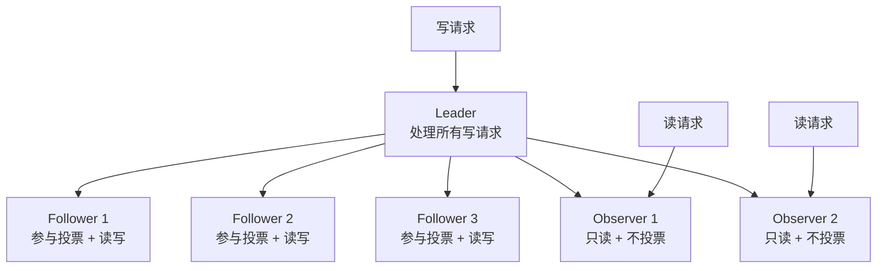

Observer 的实际部署场景：

| 场景 | 需求 | 解决方案 |
|------|------|---------|
| 读多写少 | 读吞吐量大但投票开销要小 | 添加 Observer 节点 |
| 跨数据中心 | 跨机房部署但不想影响投票 quorum | 远端机房部署 Observer |
| 非核心服务读取 | 不同业务读同一 ZooKeeper 数据 | 各业务集群配置 Observer |

#### 5.5.2 VR 的工程实现

VR 虽然没有像 ZooKeeper 和 etcd 那样广泛部署的独立实现，但其思想在多个系统中得到应用：

1. **VMware FT**：VMware 的容错虚拟化系统使用了类似 VR 的主备份复制
2. **CORFU**：基于闪存的共享日志系统借鉴了 VR 的视图切换思想
3. **Raft 的实际实现**：etcd 的实现者明确参考了 VR 论文中的诸多细节

---

### 5.6 常见误解与纠正

#### 误解一："ZAB 只是 ZooKeeper 的内部实现，没有独立价值"

**纠正：** ZAB 的三阶段模型（Discovery → Synchronization → Broadcast）提供了一个比 Raft 更清晰的"恢复-同步-正常运行"三态框架。Observer 机制也是 ZAB 的独创贡献，Raft 社区至今没有原生等价物。

#### 误解二："VR 已经过时，不需要了解"

**纠正：** VR 是理解所有主副本复制协议的"原始模型"。理解 VR 能帮助你理解 Raft 的设计选择背后的原因。此外，2012 年的 VR Replication Revisited 补充了完整的形式化验证，是学习 TLA+ 的优秀入门材料。

#### 误解三："ZAB 和 Raft 的安全性保证不同"

**纠正：** 两者在 Safety 保证上是等价的——都保证已提交的事务不会丢失。区别在于 Liveness 的实现方式和恢复阶段的复杂度。

#### 误解四："ZXID 的设计没有特殊意义"

**纠正：** ZXID 将 epoch 编码在高位、counter 编码在低位，使得单个整数比较就能判断事务的新旧关系，不需要额外的 epoch 字段。这种设计避免了 Raft 中需要同时比较 (term, index) 两个值的复杂性。

---

### 5.7 何时选择 ZAB 或 VR 思想

| 场景 | 推荐方案 | 理由 |
|------|---------|------|
| Kubernetes 生态 | etcd (Raft) | 原生支持，生态完善 |
| Hadoop/大数据生态 | ZooKeeper (ZAB) | HBase、Hive、Kafka 均依赖 ZooKeeper |
| 读多写少 + 需要高读吞吐 | ZAB 的 Observer | Raft 没有原生等价物 |
| 教学/理解共识协议本质 | VR → Raft 学习路径 | VR 是最简单的主副本协议 |
| 新系统设计 | Raft (etcd/raft 库) | 最成熟的开源实现，社区支持最好 |

---

### 5.8 本节小结

ZAB 和 VR 是分布式共识协议谱系中不可或缺的两块拼图：

- **ZAB** 在 Paxos 和 Raft 之间架起了一座桥梁。它的三阶段恢复协议、ZXID 设计、Observer 机制都是独到的工程贡献。ZooKeeper 在工业界十余年的稳定运行证明了 ZAB 的可靠性和性能。

- **VR** 是"主副本复制"思想的鼻祖。它的"视图"概念直接启发了 Raft 的 term 设计，它的 Prepare-Commit 流程是 Raft AppendEntries RPC 的原型。

理解这两个协议，不仅是为了能在技术面试中多谈两个算法，更是为了建立对共识协议演进脉络的完整认知——**每一个新协议都是对前人设计的继承、批判和改进**。

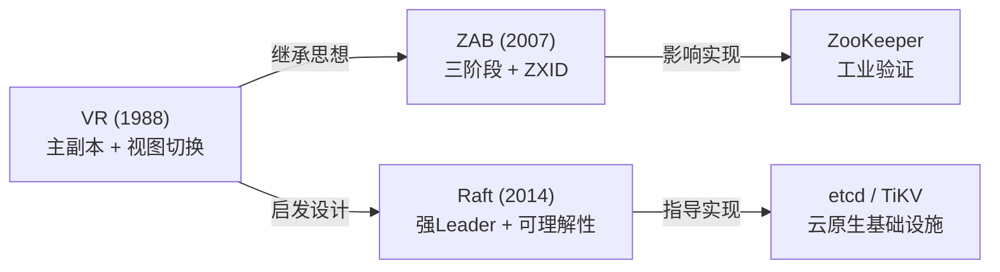
