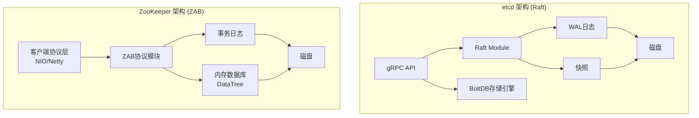
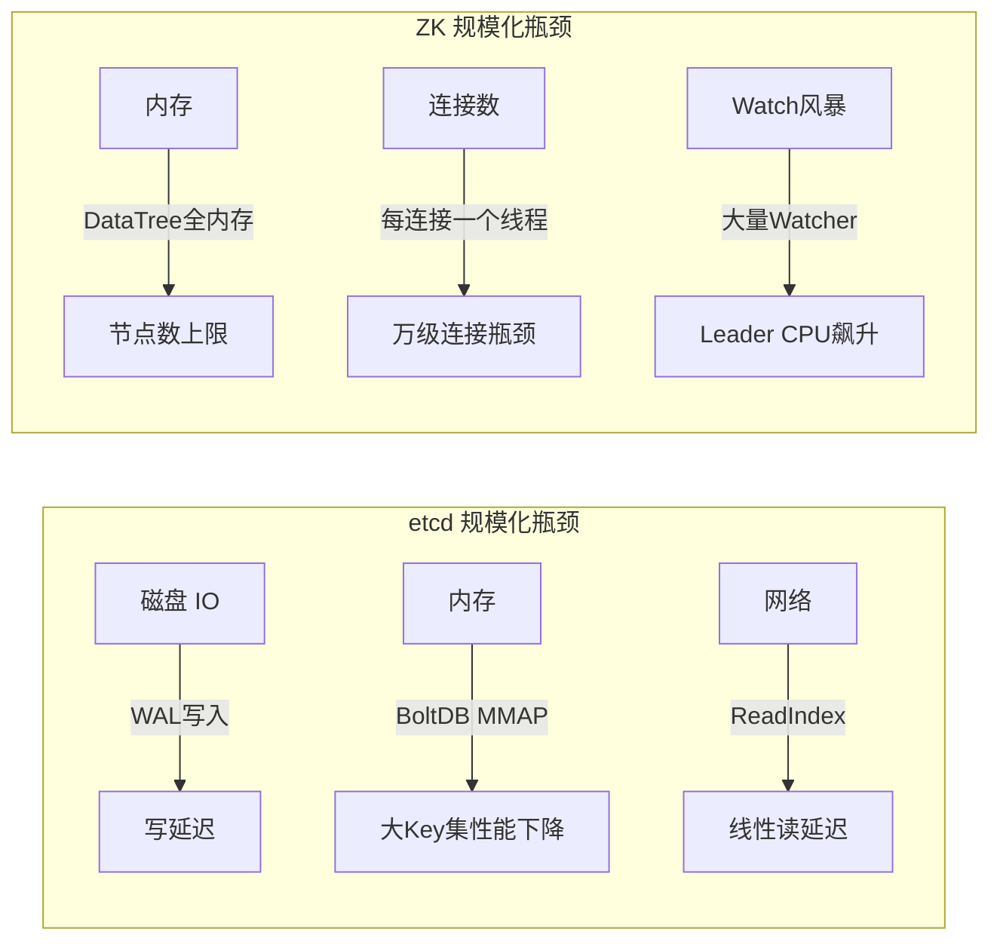
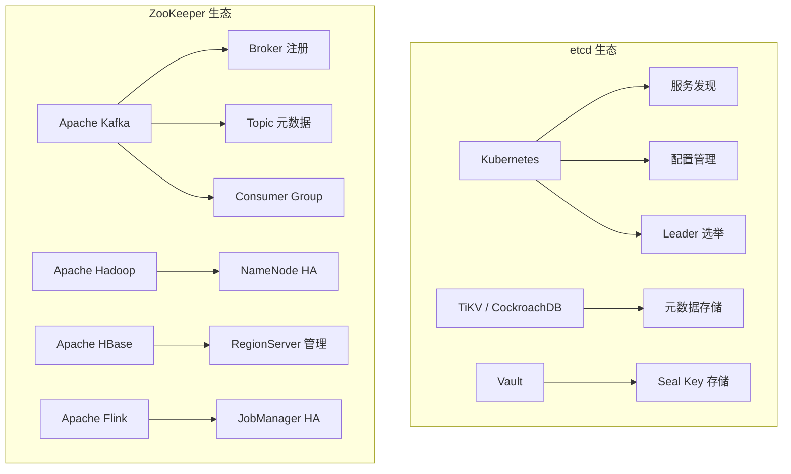
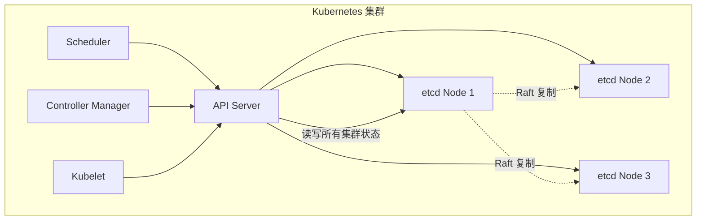

## 6. 工程实现对比：etcd vs ZooKeeper

在分布式共识的理论基础（Paxos、Raft、ZAB）之上，业界真正将这些协议落地为生产级系统的产品屈指可数。etcd 和 ZooKeeper 是其中最具代表性的两个——前者基于 Raft 协议，由 CoreOS 团队于 2013 年发起，现为 Kubernetes 生态的基石；后者基于 ZAB 协议，由雅虎研究院于 2008 年开源，曾长期统治 Hadoop/Kafka 生态的服务发现与协调领域。

本节从架构设计、数据模型、一致性语义、安全机制、性能特征、运维实践、生产案例、迁移路径八个维度进行系统对比，帮助架构师在技术选型时做出有据可依的决策。

### 6.1 架构设计对比

#### 6.1.1 整体架构差异



| 维度 | etcd | ZooKeeper |
|------|------|-----------|
| 共识协议 | Raft（强 Leader） | ZAB（类似 Multi-Paxos） |
| 通信协议 | gRPC（HTTP/2） | 自定义 TCP 协议（NIO/Netty） |
| 序列化 | Protocol Buffers | 自定义二进制格式 |
| 存储引擎 | BoltDB（B+Tree，MMAP） | 自建 DataTree（内存哈希表 + 磁盘日志） |
| 语言实现 | Go | Java |
| 部署模型 | 单二进制，无外部依赖 | 需要 JDK，可嵌入或独立部署 |
| API 风格 | Key-Value CRUD + Watch | 树形节点 CRUD + Watch |

#### 6.1.2 线程模型对比

**etcd 的线程模型**相对简洁：

- **goroutine-per-connection**：每个客户端连接由一个独立的 goroutine 处理，利用 Go 的轻量级协程实现高并发。goroutine 初始栈仅 2KB，可动态扩展到 GB 级别，创建和销毁成本极低
- **Raft 主循环**：单线程处理所有 Raft 相关的 RPC 和状态机应用，避免了锁竞争。所有 Proposal 按顺序通过同一个 channel 串行处理，天然保证了 Raft 的顺序性约束
- **Backend 去重**：BoltDB 的事务机制保证同一时刻只有一个写操作进入存储层，通过 MVCC 实现读写隔离
- **Watch 发射器**：独立的事件分发线程，基于 revision 索引快速匹配订阅者

**ZooKeeper 的线程模型**更为复杂：

- **AcceptThread**：负责接受新连接，采用 NIO 的 Selector 模式
- **SelectorThread**：I/O 多路复用，处理读写事件。分为专用 SelectorThread（处理大请求）和普通 SelectorThread
- **WorkerThread Pool**：处理请求的业务逻辑（序列化、鉴权、ACL 检查、Watch 触发）
- **Leader/Follower 通信线程**：独立的线程池处理同步请求（Leader 发送 Proposal、ACK 收集、提交通知）
- **SyncRequestProcessor**：串行处理写请求的事务日志落盘，是写路径的关键瓶颈

这种差异带来了本质区别：etcd 通过协程将并发复杂度从应用层下沉到运行时；ZooKeeper 则需要显式管理线程间同步，代码复杂度更高但对 JVM 内存布局有更好的控制力。在极端高并发下，etcd 的协程模型天然避免了线程上下文切换的开销（约 1-10μs），而 ZooKeeper 的线程池模型在万级并发时可能需要仔细调优线程池参数。

#### 6.1.3 共识协议实现差异

虽然 Raft 和 ZAB 在理论上都属于"强 Leader"协议，但工程实现上存在显著差异：

| 对比维度 | Raft (etcd) | ZAB (ZooKeeper) |
|---------|-------------|-----------------|
| Leader 选举 | 基于随机超时的 Candidate 竞选 | 基于 zxid + epoch 的投票 |
| 日志复制 | Leader 直接复制到所有 Follower | Leader → Observer 两阶段传播 |
| 日志压缩 | Snapshot + 日志截断 | 同左，但快照触发条件不同 |
| 成员变更 | 单节点联合共识（Joint Consensus）或自动变更 | 手动滚动重启 |
| Follower 读 | ReadIndex 或 Lease Read | 直接本地读（无机制保证） |
| 脑裂处理 | 旧 Leader 无法获得多数派确认 | 旧 Leader epoch 过期自动失效 |

etcd 使用 **ReadIndex** 机制保证线性一致性读：Follower 收到读请求后，向 Leader 确认当前 commit index，等待本地 apply 到该 index 后再返回。这需要一次额外的 RTT 但保证了一致性。etcd 3.4+ 还支持 **Lease Read** 优化：Leader 在租约有效期内直接回复读请求，无需网络交互，但租约依赖时钟精度。

ZooKeeper 的 Follower 读则完全本地化——Follower 从内存 DataTree 直接返回数据，不经过 Leader，延迟极低但可能读到旧数据。如果业务要求强一致，需要手动调用 `sync()` 先同步到 Leader 的最新状态。

### 6.2 数据模型对比

#### 6.2.1 命名空间模型

**etcd 采用扁平 KV 模型**，所有数据存储在一个全局的 Key-Value 命名空间中：

/services/web/frontend/instance-1 → {"ip":"10.0.0.1","port":8080}
/services/web/frontend/instance-2 → {"ip":"10.0.0.2","port":8080}
/services/db/postgres/master → {"ip":"10.0.0.3","port":5432}

目录（前缀）是通过 Key 的字节前缀约定实现的，etcd 本身并不区分"目录"和"文件"。这带来一个重要特性：**范围查询（Range Query）** 可以通过 `--prefix` 标志高效地扫描某个前缀下的所有 Key，底层利用 BoltDB 的 B+Tree 顺序扫描，时间复杂度为 O(log N + K)，N 为总 Key 数，K 为匹配的 Key 数。

etcd 的每个 Key 都携带一个全局单调递增的 **revision**（版本号），这是 etcd 实现 MVCC 的基础。每次事务修改都会产生一个新的 revision，旧版本数据不会立即删除，而是保留到 compaction 执行。这使得 etcd 天然支持历史版本查询和基于版本的 Watch。

**ZooKeeper 采用树形节点模型**，类似文件系统：

/services
  /web
    /frontend
      /instance-1  (ephemeral)
      /instance-2  (ephemeral)
  /db
    /postgres
      /master  (persistent)

每个节点（ZNode）可以携带数据（最大 1MB）并拥有 ACL 权限控制。ZNode 分为四种类型：

| 类型 | 生命周期 | 典型用途 |
|------|---------|---------|
| Persistent | 永久存在，需显式删除 | 配置存储、元数据 |
| Ephemeral | 会话断开即删除 | 服务注册、分布式锁 |
| Persistent Sequential | 永久 + 自动编号 | 分布式队列、Leader 选举 |
| Ephemeral Sequential | 临时 + 自动编号 | 分布式锁公平排队 |

#### 6.2.2 数据操作语义差异

etcd 的操作围绕 KV 展开：

```go
// etcd: 事务操作（Txn）—— CAS 语义
txn := client.Txn(ctx).
    If(clientv3.Compare(clientv3.Version("/config/lock"), "==", 0)).
    Then(clientv3.OpPut("/config/lock", "node-1")).
    Else(clientv3.OpGet("/config/lock"))

resp, err := txn.Commit()
```

etcd 的 Txn（事务）支持 If-Then-Else 语义，可以原子性地执行多个操作。这本质上是将 Raft 的单条日志条目作为事务边界——所有操作要么一起提交，要么一起回滚。一个 Txn 可以包含最多 128 个操作，If 条件支持 Version、CreateRevision、ModRevision、Value、Lease 六种比较类型。

etcd 还支持 **mini-transactions**：通过 `clientv3.WithPrefix()` 和 `clientv3.WithLastRev()` 等选项组合，可以在单次请求中完成复杂的条件逻辑。

ZooKeeper 的操作围绕节点树展开：

```java
// ZooKeeper: create + setData + delete
// 创建临时顺序节点
String path = zk.create("/locks/resource-",
    "".getBytes(),
    ZooDefs.Ids.OPEN_ACL_UNSAFE,
    CreateMode.EPHEMERAL_SEQUENTIAL);

// 读取并判断是否获得锁
List<String> children = zk.getChildren("/locks", false);
Collections.sort(children);
if (path.endsWith(children.get(0))) {
    // 获得锁，执行业务逻辑
}
```

ZooKeeper 没有内置的事务机制（多个操作不是原子的），需要通过 **Watcher + 版本检查** 手动实现 CAS 语义，这也是分布式锁在 ZK 上实现更复杂的原因之一。ZK 提供的 `multi()` API 可以在一个请求中执行多个操作，但它不是真正的事务——如果中间某个操作失败，已执行的操作不会回滚，只是整个 multi 调用报错。

#### 6.2.3 Lease 与 Session 机制对比

etcd 的 **Lease（租约）** 和 ZooKeeper 的 **Session（会话）** 都用于实现"临时"语义，但机制差异显著：

**etcd Lease**：

```go
// 创建一个 TTL 为 30 秒的租约
lease, err := client.Grant(ctx, 30)

// 将 Key 绑定到租约
client.Put(ctx, "/services/web/inst-1", data, clientv3.WithLease(lease.ID))

// 必须定期续租，否则租约过期，Key 自动删除
keepAliveChan, err := client.KeepAlive(ctx, lease.ID)

// 或者直接撤销租约（立即删除绑定的所有 Key）
client.Revoke(ctx, lease.ID)
```

etcd 的 Lease 是**客户端主动续租**模型：
- 客户端必须通过 KeepAlive RPC 定期续约，间隔通常为 TTL/3
- 网络断开导致续约失败 → 租约过期 → 所有绑定的 Key 被批量删除
- 一个 Lease 可以绑定无限数量的 Key
- 支持 `WithIgnoreLease` 选项让 KV 操作不改变已有的 Lease 绑定

**ZooKeeper Session**：

```java
// ZooKeeper 在创建连接时自动建立 Session
ZooKeeper zk = new ZooKeeper("host:2181", 30000, event -> {
    // Session 事件回调
    if (event.getState() == Watcher.Event.KeeperState.Expired) {
        // Session 过期，需要重新创建连接
    }
});

// 临时节点自动绑定到 Session
zk.create("/services/web/inst-1", data,
    ZooDefs.Ids.OPEN_ACL_UNSAFE,
    CreateMode.EPHEMERA);
```

ZooKeeper 的 Session 是**服务端自动管理**模型：
- 客户端建立 TCP 连接时自动创建 Session，服务端通过心跳包自动续期
- Session 过期后，服务端自动删除所有关联的临时节点
- Session 超时时间在创建时设定（默认 30 秒），无法动态调整
- Session 断连后有重连窗口（Session Timeout），超时才判定过期

| 对比维度 | etcd Lease | ZooKeeper Session |
|---------|------------|-------------------|
| 续期方式 | 客户端主动 KeepAlive RPC | 服务端心跳自动续期 |
| 过期检测 | 客户端 + 服务端均可感知 | 服务端检测，客户端通过事件通知 |
| TTL 调整 | 支持动态修改（LeaseKeepAlive） | 创建时固定，不可修改 |
| 一对多 | 一个 Lease 绑定无限 Key | 一个 Session 关联所有临时节点 |
| 过期粒度 | 租约级（不同 Key 可以不同 TTL） | 会话级（所有临时节点同一超时） |

### 6.3 一致性语义对比

#### 6.3.1 读一致性模型

这是两者最关键的设计分歧之一：

**etcd 默认线性一致性读（Linearizable Read）**：

每次读请求都需要经过 Leader 确认（ReadIndex 机制），保证读到的数据是集群中最新的已提交值。这消除了"读到过期数据"的问题，但增加了约 1 个 RTT 的延迟。

```bash
# etcd: 默认线性一致性读
etcdctl get /config/db

# etcd: 允许从任意节点读（可能过期）
etcdctl get /config/db --consistency=l
```

etcd 提供三种读一致性级别：
- **Serializable（默认）**：只保证序列化一致性，Follower 可能读到旧数据。性能最高但一致性最弱
- **Linearizable（Recommended）**：通过 ReadIndex 保证线性一致性。每次读经过 Leader 确认
- **Lease Read**：Leader 在租约有效期内直接回复读请求（不走网络），性能接近 Serializable 但需要精确时钟

实际使用中需要权衡：

```bash
# 高一致性场景（金融、配置中心）
ETCDCTL_API=3 etcdctl get /config/db

# 高吞吐读场景（缓存、索引查询）
ETCDCTL_API=3 etcdctl get /config/db --consistency=l
```

**ZooKeeper 默认过期读（Stale Read）**：

Follower 可以直接从本地内存读取数据，无需与 Leader 同步，延迟极低但可能读到过期值。如果需要强一致性，必须使用 `sync()` 操作：

```java
// ZooKeeper: 先 sync 再读，保证一致性
zk.sync("/services", null, null);
byte[] data = zk.getData("/services/web", false, null);
```

`sync()` 的本质是让 Follower 向 Leader 发送一个 SYNC 请求，Leader 收到后等待自己的 Commit 操作完成后再回复。这保证了 sync 之后的读一定能看到 sync 之前所有已完成的写操作。sync 本身不返回数据，只是建立一个一致性屏障。

下表总结了一致性级别的差异：

| 一致性级别 | etcd | ZooKeeper |
|-----------|------|-----------|
| 默认读语义 | 线性一致（Linearizable） | 最终一致（Eventual） |
| 强一致性读 | 默认支持（ReadIndex） | 需调用 sync() |
| 低延迟读 | 需显式设置 serializable | 默认支持 |
| 写一致性 | Linearizable（Raft 多数派确认） | Linearizable（ZAB 多数派确认） |

#### 6.3.2 MVCC 与历史版本

**etcd 的 MVCC 机制**：

etcd 使用全局递增的 revision 实现多版本并发控制。每次写操作都会产生一个新的 revision，旧数据不会立即删除，而是通过 tombstone 标记。这带来了几个重要能力：

```bash
# 查看某个 Key 的所有历史版本
etcdctl get /config/db --prefix --keys-only

# 查看特定 revision 的数据
etcdctl get /config/db --rev=1000

# 查看某次修改前的数据
etcdctl get /config/db --mod-rev=1000

# 手动触发 compaction（清理历史版本）
etcdctl compact 1000
```

MVCC 的代价是存储膨胀。每次 compaction 后还需要执行 **defrag** 才能真正释放磁盘空间。etcd 支持自动 compaction（通过 `--auto-compaction-mode` 和 `--auto-compaction-retention` 参数配置），推荐设置为每小时自动压缩：

```bash
etcd \
  --auto-compaction-mode periodic \
  --auto-compaction-retention=1h
```

**ZooKeeper 的单版本模型**：

ZooKeeper 的每个 ZNode 只保留最新版本，通过 `stat` 结构中的 version 字段追踪修改次数。没有历史版本查询能力，也不支持基于版本的 Watch。这使得 ZK 的存储效率更高，但丧失了时间旅行调试和审计能力。

| 对比维度 | etcd MVCC | ZooKeeper 单版本 |
|---------|-----------|-----------------|
| 历史版本 | 支持（全局 revision） | 不支持 |
| 版本查询 | 按 revision / mod-rev 查询 | 仅当前版本 |
| 存储开销 | 较大（需定期 compaction） | 较小 |
| 时间旅行调试 | 支持 | 不支持 |
| 审计追踪 | 天然支持 | 需要外部方案 |

#### 6.3.3 Watch 机制对比

两者都提供 Watch（监听）机制来实现事件驱动编程，但实现方式差异显著：

**etcd Watch**：

```go
// etcd Watch: 基于 revision，不丢事件
watchChan := client.Watch(ctx, "/services/", clientv3.WithPrefix())
for resp := range watchChan {
    for _, ev := range resp.Events {
        fmt.Printf("%s %s %s\n", ev.Type, ev.Kv.Key, ev.Kv.Value)
    }
}
```

etcd 的 Watch 基于全局单调递增的 revision（版本号），具有以下特性：

- **事件不丢失**：即使 Watch 客户端短暂断连，重连后可以从断点的 revision 继续消费。这是 etcd Watch 最关键的优势——基于 revision 的回放能力保证了事件的可靠传递
- **支持前缀 Watch**：监听某个前缀下的所有 Key 变更（`WithPrefix()` 选项）
- **支持范围 Watch**：监听某个 Key 范围内的变更（`WithRange()` 选项）
- **支持 StartRevision**：从指定的 revision 开始监听，适合初始化时需要完整历史的场景
- **多路复用**：单个 gRPC 流可以承载多个 Watch，减少连接数

```go
// 从指定 revision 开始监听（适合初始化场景）
watchChan := client.Watch(ctx, "/services/",
    clientv3.WithPrefix(),
    clientv3.WithStartRevision(lastKnownRevision+1),
    clientv3.WithProgressNotify())  // 每 10 分钟收到进度通知
```

**ZooKeeper Watch**：

```java
// ZooKeeper Watch: 一次性触发，需重新注册
zk.getData("/services/web", event -> {
    System.out.println("事件类型: " + event.getType());
    System.out.println("触发路径: " + event.getPath());
    // Watch 已触发一次，如需继续监听需重新注册
    zk.getData("/services/web", this::watchCallback, stat);
}, null);
```

ZooKeeper 的 Watch 是**一次性的**（One-time Trigger），触发后自动移除，需要在回调中重新注册。这带来几个问题：

- **事件丢失窗口**：从 Watch 触发到重新注册之间发生的事件会被丢失。虽然可以通过 session 事件来检测重连，但中间的变更仍可能遗漏
- **惊群效应**：默认情况下，大量 Watcher 同时触发时会造成瞬间高负载。ZK 3.6+ 的 `addWatch` 支持递归监听缓解此问题
- **从 3.6 版本开始引入了 Persistent Recursive Watch** 来缓解这个问题，但生态中大量代码仍基于旧的一次性 Watch 模式

```java
// ZooKeeper 3.6+: Persistent Recursive Watch
zk.addWatch("/services", event -> {
    // 持续监听，直到显式移除
    System.out.println("路径变更: " + event.getPath());
}, AddWatchMode.PERSISTENT_RECURSIVE);
```

| Watch 特性 | etcd | ZooKeeper |
|-----------|------|-----------|
| 触发次数 | 持续触发（Persistent） | 默认一次性（One-shot），3.6+ 支持 Persistent |
| 事件丢失 | 不丢失（基于 revision 回放） | 断连窗口可能丢失 |
| Watch 粒度 | Key / Prefix / Range | Node / 子节点递归 / 全树递归(3.6+) |
| 重连恢复 | 自动从断点 revision 恢复 | 需手动重新注册 |
| 底层传输 | gRPC Stream | TCP 长连接 |
| 事件内容 | 包含完整的 KV 数据 + revision | 仅包含事件类型和路径（不含新值） |

> **关键差异**：etcd Watch 事件包含完整的新旧值，可以直接处理而无需再次查询；ZooKeeper Watch 事件只告诉你"变了"，需要额外调用 getData() 获取新值。这在高吞吐场景下会显著增加 ZK 的读压力。

### 6.4 性能特征对比

#### 6.4.1 基准测试数据

以下数据基于公开的 benchmark 和社区测试（3 节点集群，4 核 8GB 内存，SSD 磁盘环境）：

| 指标 | etcd v3.5 | ZooKeeper 3.8 |
|------|-----------|---------------|
| 写吞吐量（单 Key） | ~16,000 ops/s | ~12,000 ops/s |
| 写吞吐量（批量） | ~50,000 ops/s | ~20,000 ops/s |
| 读吞吐量（线性一致） | ~30,000 ops/s | ~80,000 ops/s（sync后） |
| 读吞吐量（本地） | ~120,000 ops/s | ~150,000 ops/s |
| 写延迟（P99） | ~10-20ms | ~15-30ms |
| 读延迟（本地） | < 1ms | < 1ms |
| 内存占用（空集群） | ~30MB | ~256MB |
| 磁盘占用 | 较小（BoltDB 压缩） | 较大（JVM 堆 + 日志） |

> **注意**：以上数据会因硬件配置、工作负载模式、集群规模等因素显著变化，仅作为量级参考。具体场景下应使用官方 benchmark 工具（etcd 的 `bench` 工具和 ZK 的 `zk-smoketest`）进行针对性测试。

#### 6.4.2 性能差异的根源

**etcd 的性能优势**主要来自：

1. **Go 语言的低开销**：goroutine 创建成本约 2KB 栈空间，远低于 Java 线程的 1MB 默认栈。在万级并发下，etcd 的内存开销仅为 ZK 的 1/10
2. **BoltDB 的 MMAP**：利用操作系统页面缓存，避免了显式的内存管理。数据量在内存范围内时性能极佳
3. **批量提交**：Raft 的 pipeline 模式允许连续发送多条日志而无需等待上一条确认，吞吐量可提升 2-3 倍
4. **协议开销小**：gRPC + Protobuf 比 ZooKeeper 的自定义协议更紧凑，单个 RPC 头部仅需几百字节
5. **单一写路径**：所有写操作通过唯一的 Raft Leader 串行化，消除了写冲突和锁竞争

**ZooKeeper 的性能优势**主要来自：

1. **内存数据库**：DataTree 完全驻留内存，读操作几乎零延迟（纳秒级内存访问 vs etcd 的 BoltDB MMAP 可能触发磁盘 IO）
2. **JVM 优化**：JIT 编译可以在运行时优化热点路径，长时间运行后性能持续提升
3. **成熟的 NIO 实现**：经过十几年的生产调优，Netty 的 I/O 效率极高
4. **读本地化**：Follower 无需网络交互即可服务读请求，延迟比 etcd 的 ReadIndex 低约 1 个 RTT
5. **零拷贝优化**：Netty 的 DirectByteBuffer 可以实现内核到用户空间的零拷贝

#### 6.4.3 规模化瓶颈



**etcd 在大规模场景下的已知问题**：

- **Key 数量上限**：当 Key 总量超过数百万时，BoltDB 的 MMAP 页面换入换出会导致性能急剧下降。etcd 社区推荐 Key 数量控制在 50 万以内，超过此阈值后应考虑数据分片或外部存储
- **大 Value 问题**：单个 Value 超过 1MB 时会影响 WAL 写入效率。建议单个 Value 控制在 100KB 以内
- **Compaction 开销**：频繁的历史版本清理会占用 I/O 带宽。生产环境建议配置自动 compaction，保留窗口不超过 1 小时
- **Watch 内存**：每个 Watch 订阅会占用约 50KB 内存。当 Watch 数量超过 10 万时，etcd 的内存占用会显著增长
- **线性读瓶颈**：所有线性一致性读都需要经过 Leader，Leader 可能成为读瓶颈。可以通过添加 Observer 节点分散读压力

**ZooKeeper 在大规模场景下的已知问题**：

- **JVM 内存压力**：DataTree 驻留内存，节点数过多时 GC 暂停时间显著增长。G1 GC 在 DataTree > 4GB 时可能出现超过 100ms 的 STW 暂停
- **连接数天花板**：默认配置下，单机很难承受超过 10,000 个并发连接。每连接一个线程的模型导致上下文切换开销急剧增长
- **Watch 风暴**：当某个节点被频繁更新且有大量 Watcher 时，Leader 会承受巨大的通知压力。watcher 数量 * 更新频率 > 10,000 ops/s 时性能急剧下降
- **快照期间的性能抖动**：ZK 在生成快照时需要遍历整个 DataTree，期间会短暂阻塞写操作
- **Jute 序列化瓶颈**：ZK 自定义的 Jute 序列化框架性能不如 Protobuf，大请求时成为瓶颈

#### 6.4.4 基准测试方法论

在对比两者性能时，必须控制测试变量，否则结论不可靠。以下是推荐的测试方法：

**etcd 官方 bench 工具**：

```bash
# 写测试：1000 个并发客户端，每个写 1000 次
etcdctl bench put --total=1000000 --conns=1000 --key-size=64 --val-size=256

# 读测试：线性一致性读
etcdctl bench get --total=1000000 --conns=1000 --key-size=64 --sequential

# 范围查询测试
etcdctl bench range --total=1000000 --conns=1000 --end=/range/1000
```

**ZooKeeper 官方 zk-smoketest**：

```bash
# 使用 ZK 自带的性能测试工具
zkCli.sh -server localhost:2181 create /bench/test data
# 或使用 YCSB 工具
bin/ycsb load zookeeper -P workloads/workloada -p zookeeper.connectString=localhost:2181
bin/ycsb run zookeeper -P workloads/workloada -p zookeeper.connectString=localhost:2181
```

**测试注意事项**：

- 预热至少 5 分钟后再采集数据，避免 JIT 编译和缓存冷启动的影响
- 监控磁盘 IO 和 CPU 使用率，确保瓶颈在被测系统而非硬件
- 多次取中位数和 P99 值，避免单次测试的偶发波动
- 区分稳态性能和启动性能——ZK 在 JVM 热身后性能会持续提升

### 6.5 运维与运维实践对比

#### 6.5.1 部署复杂度

| 维度 | etcd | ZooKeeper |
|------|------|-----------|
| 安装方式 | 单二进制文件 | 需要 JDK + 配置文件 |
| 依赖项 | 无（静态编译） | JDK 8+ |
| 配置文件 | 命令行参数或 YAML | zoo.cfg（Java properties 风格） |
| 容器化 | 官方提供 Docker 镜像，极轻量（~20MB） | 镜像较大（~300MB+） |
| Kubernetes 集成 | 原生支持（TLS、RBAC） | 需要额外适配 |
| 健康检查 | `etcdctl endpoint health` | `echo ruok \| nc localhost 2181` |

**etcd 部署示例（3 节点集群）**：

```bash
# etcd 节点启动参数示例
etcd \
  --name=etcd-node1 \
  --data-dir=/var/lib/etcd \
  --listen-client-urls=https://10.0.0.1:2379 \
  --advertise-client-urls=https://10.0.0.1:2379 \
  --listen-peer-urls=https://10.0.0.1:2380 \
  --initial-advertise-peer-urls=https://10.0.0.1:2380 \
  --initial-cluster=etcd-node1=https://10.0.0.1:2380,etcd-node2=https://10.0.0.2:2380,etcd-node3=https://10.0.0.3:2380 \
  --client-cert-auth \
  --trusted-ca-file=/etc/etcd/ca.crt \
  --cert-file=/etc/etcd/server.crt \
  --key-file=/etc/etcd/server.key \
  --peer-client-cert-auth \
  --peer-trusted-ca-file=/etc/etcd/ca.crt \
  --peer-cert-file=/etc/etcd/peer.crt \
  --peer-key-file=/etc/etcd/peer.key
```

**ZooKeeper 部署示例**：

```bash
# zoo.cfg 配置
tickTime=2000
initLimit=10
syncLimit=5
dataDir=/var/lib/zookeeper
dataLogDir=/var/lib/zookeeper/logs
clientPort=2181
maxClientCnxns=200
autopurge.snapRetainCount=3
autopurge.purgeInterval=1

# 集群配置（myid 文件需要在 dataDir 中单独创建）
server.1=10.0.0.1:2888:3888
server.2=10.0.0.2:2888:3888
server.3=10.0.0.3:2888:3888

# JVM 调优（推荐）
export JVMFLAGS="-Xmx4G -Xms4G -XX:+UseG1GC -XX:MaxGCPauseMillis=200"
```

#### 6.5.2 备份与恢复

**etcd 备份**：

```bash
# etcd: 一键快照备份（推荐放入 crontab 每小时执行）
etcdctl snapshot save /backup/etcd-snapshot-$(date +%Y%m%d-%H%M).db

# 验证快照完整性
etcdctl snapshot status /backup/etcd-snapshot-20240101-1200.db --write-table

# 恢复（需先停止 etcd，数据目录必须为空）
etcdctl snapshot restore /backup/etcd-snapshot-20240101-1200.db \
  --data-dir=/var/lib/etcd-restored \
  --name=etcd-node1 \
  --initial-cluster=etcd-node1=https://10.0.0.1:2380 \
  --initial-cluster-token=restored-cluster
```

etcd 恢复时的关键参数说明：
- `--data-dir`：必须是一个空目录，恢复会重建整个数据目录
- `--name`：必须与原始节点名称一致，否则集群拓扑不匹配
- `--initial-cluster-token`：必须使用新的 token，避免与旧集群混淆
- 恢复后需要替换每个节点的数据目录，然后逐个启动集群

**ZooKeeper 备份**：

```bash
# ZooKeeper: 需要同时备份快照和事务日志
# 1. 触发自动快照（在四字命令端口执行）
echo snap | nc localhost 2181

# 2. 停止 ZooKeeper 服务
zkServer.sh stop

# 3. 复制完整的数据目录（快照 + 事务日志）
cp -r /var/lib/zookeeper/version-2/ /backup/zk-snapshot-$(date +%Y%m%d)/

# 恢复：停止 ZK → 替换数据目录 → 重启
# 注意：恢复后需要检查快照和事务日志是否一致
# 不一致时需要使用 zkServer.sh start-foreground 观察日志
```

etcd 的备份恢复体验明显优于 ZooKeeper——前者是一条命令完成的原子快照，后者需要手动处理快照文件和事务日志的组合。etcd 的恢复还支持选择性地重命名节点（`--name` 参数），在节点故障替换时非常方便。

#### 6.5.3 集群成员变更

**etcd 动态成员变更**（无需停机）：

```bash
# 添加节点
etcdctl member add etcd-node4 --peer-urls=https://10.0.0.4:2380

# 移除节点
etcdctl member remove <member-id>

# 列出所有成员
etcdctl member list -w table
```

etcd 支持两种成员变更模式：
- **单节点变更**：一次添加或移除一个节点，需要多数派确认（推荐方式）
- **联合共识（Joint Consensus）**：一次性完成所有变更，新旧两个多数派同时确认（已弃用，改为自动变更）

**ZooKeeper 成员变更**（需要重启）：

```bash
# 修改 zoo.cfg 添加或移除 server 条目
# 然后逐个重启所有节点（包括未修改的节点）
# 每次重启后等待集群恢复同步，再重启下一个
# 整个过程需要滚动重启，耗时较长
```

ZooKeeper 的成员变更不支持动态增减——必须修改所有节点的配置文件，然后滚动重启。在 5 节点集群中，移除一个节点需要重启全部 5 台机器。这在大规模集群中是一个显著的运维负担。

#### 6.5.4 监控与可观测性

**etcd 内置指标**：

etcd 暴露 Prometheus 格式的 metrics，核心监控指标包括：

| 指标 | 含义 | 告警阈值建议 |
|------|------|-------------|
| `etcd_server_has_leader` | 是否存在 Leader | = 0 立即告警 |
| `etcd_server_leader_changes_seen_total` | Leader 切换次数 | > 5/小时 |
| `etcd_disk_wal_fsync_duration_seconds` | WAL fsync 延迟 | P99 > 10ms |
| `etcd_server_proposals_failed_total` | 提案失败数 | 持续增长 |
| `etcd_debugging_mvcc_db_total_size_in_bytes` | 数据库大小 | > 8GB（建议 compact） |
| `etcd_network_peer_round_trip_time_seconds` | 节点间 RTT | P99 > 50ms |
| `etcd_server_slow_apply_total` | 慢 Apply 次数 | > 0 持续增长 |

推荐的 Prometheus 告警规则：

```yaml
groups:
  - name: etcd
    rules:
      - alert: EtcdNoLeader
        expr: etcd_server_has_leader == 0
        for: 1m
        labels:
          severity: critical
        annotations:
          summary: "etcd 集群没有 Leader"

      - alert: EtcdHighFsyncDuration
        expr: histogram_quantile(0.99, rate(etcd_disk_wal_fsync_duration_seconds_bucket[5m])) > 0.01
        for: 5m
        labels:
          severity: warning
        annotations:
          summary: "etcd WAL fsync P99 延迟过高"

      - alert: EtcdTooManyLeaderChanges
        expr: rate(etcd_server_leader_changes_seen_total[1h]) > 5
        for: 10m
        labels:
          severity: warning
        annotations:
          summary: "etcd Leader 频繁切换"
```

**ZooKeeper 监控**：

ZooKeeper 通过四字命令（Four-Letter Words）和 JMX 暴露监控数据：

```bash
# 常用四字命令
echo stat | nc localhost 2181    # 服务状态（Leader/Follower、连接数、延迟）
echo mntr | nc localhost 2181    # 监控指标（需在 zoo.cfg 中配置 4lw.commands.whitelist=*）
echo cons | nc localhost 2181    # 连接列表（含每个连接的延迟统计）
echo ruok | nc localhost 2181    # 健康检查（返回 imok）
echo conf | nc localhost 2181    # 配置信息
echo crst | nc localhost 2181    # 重置连接统计
echo srst | nc localhost 2181    # 重置服务统计
```

社区通过 JMX Exporter 或 AdminServer 将 JMX 指标转换为 Prometheus 格式，但配置相对繁琐。推荐使用 `zookeeper-exporter` 开源项目简化接入：

```yaml
# docker-compose 示例
services:
  zookeeper-exporter:
    image: dabealu/zookeeper-exporter
    environment:
      ZK_HOSTS: "zk1:2181,zk2:2181,zk3:2181"
    ports:
      - "9141:9141"
```

#### 6.5.5 故障恢复对比

| 对比维度 | etcd | ZooKeeper |
|---------|------|-----------|
| 单节点故障 | 自动检测，多数派继续服务 | 自动检测，多数派继续服务 |
| 数据恢复 | 快照恢复（原子操作） | 手动合并快照+事务日志 |
| 恢复时间 RTO | 通常 < 1 分钟 | 5-30 分钟（取决于数据量） |
| 数据丢失 RPO | 取决于快照频率（默认 1 小时） | 取决于事务日志保留策略 |
| 节点替换 | 动态成员变更，无需重启 | 需修改配置 + 重启 |
| 集群重建 | 从快照恢复到新集群 | 从快照+日志恢复，需手动操作 |
| 脑裂恢复 | Raft 保证只有一个 Leader | ZAB 保证只有一个 Leader |

### 6.6 安全机制对比

| 安全维度 | etcd | ZooKeeper |
|---------|------|-----------|
| 传输加密 | 原生 TLS（客户端、Peer、Client Peer 三套证书） | 需要配置 SSL（较繁琐） |
| 认证 | Certificate / Username-Password / JWT | Digest / SASL / Kerberos |
| 授权（ACL） | 基于角色（root, root write, etc.） | 基于 ACL 表（ACL ID + 权限位） |
| RBAC | 内建基于前缀的权限控制 | 不支持，需自行实现 |
| 审计日志 | 支持（通过 --enable-pprof 和 access log） | 不原生支持 |
| 证书轮换 | 支持在线轮换，无需重启 | 通常需要重启 |

etcd 在安全方面明显领先于 ZooKeeper。特别是 etcd 3.3+ 引入的 RBAC 支持，允许管理员按 Key 前缀精细控制读写权限：

```bash
# etcd RBAC: 创建角色并授予权限
etcdctl role add developer
etcdctl role grant-permission developer read /services/web/
etcdctl role grant-permission developer write /services/web/config
etcdctl user grant-role dev-user developer

# etcd RBAC: 启用认证
etcdctl auth enable
```

ZooKeeper 的 ACL 模型（基于 `Scheme:ID:Permission` 三元组）在大规模场景下管理成本较高：

```java
// ZooKeeper ACL: 每个节点单独设置
List<ACL> acls = Arrays.asList(
    new ACL(ZooDefs.Perms.READ, new Id("digest", "admin:password")),
    new ACL(ZooDefs.Perms.WRITE, new Id("digest", "admin:password")),
    new ACL(ZooDefs.Perms.ALL, new Id("ip", "10.0.0.0/24"))
);
zk.create("/secret/data", value, acls, CreateMode.PERSISTENT);
```

ZK 的 ACL 是节点级别的，无法像 etcd 那样按前缀批量管理。当节点数量达到数万时，ACL 管理本身就会成为一个运维负担。

### 6.7 生态系统与应用场景

#### 6.7.1 生态位对比



**etcd 的主战场**：

- **Kubernetes 控制平面**：etcd 是 Kubernetes 唯一支持的后端存储，存储所有集群状态（Pod、Service、ConfigMap、Secret 等）。一个拥有 5000 个节点的 K8s 集群通常包含数十万条 etcd 记录
- **云原生基础设施**：CoreDNS、Linkerd、Consul（可选后端）等 CNCF 项目广泛使用
- **分布式数据库元数据**：TiKV 使用 etcd 存储 Region 元数据，CockroachDB 的早期版本也依赖 etcd
- **服务网格**：Istio 的控制平面使用 etcd 存储配置和状态

**ZooKeeper 的主战场**：

- **Apache Kafka**：从 0.8 到 3.x 版本，ZooKeeper 长期作为 Kafka 的元数据存储。一个典型的 Kafka 集群会创建数百个 ZNode 来存储 Broker 信息、Topic 配置和 Consumer Group 状态。Kafka 3.3+ 开始支持 KRaft 模式去除 ZK 依赖，但大规模生产迁移尚未完成
- **Hadoop 生态**：HDFS NameNode HA（使用 ZK 的临时节点实现 Active/Standby 切换）、HBase RegionServer 管理、Hive Metastore 锁
- **传统大数据平台**：Storm（Topology 管理）、Flink（JobManager HA）、Druid（Coordinator 管理）

#### 6.7.2 生态演进趋势

2020 年以来，etcd 在云原生领域的主导地位持续巩固，而 ZooKeeper 的市场份额逐步收缩：

- **Kafka 去 ZK 化**：KIP-500（KRaft）将 Kafka 元数据管理内化，不再依赖 ZooKeeper。KRaft 模式已 GA，Confluent 推荐新集群使用 KRaft
- **Hadoop 生态云化**：越来越多的大数据组件迁移到 Kubernetes 上运行，间接推动了 etcd 的使用
- **etcd 成为 CNCF 毕业项目**：获得了强大的社区支持和企业背书，版本迭代稳定
- **ZooKeeper 社区活跃度下降**：主要维护者逐渐减少，新功能迭代放缓，3.8 版本距 3.7 发布已超过 2 年

### 6.8 生产案例分析

#### 6.8.1 Kubernetes 使用 etcd 的典型架构



Google 的 GKE、AWS 的 EKS、Azure 的 AKS 都使用 etcd 作为 Kubernetes 的后端存储。根据公开数据，一个管理 5000 个节点的 K8s 集群，etcd 的读 QPS 约为 20,000-50,000，写 QPS 约为 5,000-10,000。Google 公开的 etcd 性能数据显示，他们的生产环境使用 5 节点集群，单节点配置 16 核 64GB 内存，支持数万个集群节点。

#### 6.8.2 大规模 Kafka 集群使用 ZooKeeper 的案例

LinkedIn 的 Kafka 集群曾是全球最大的 ZooKeeper 使用场景之一。在数千 Broker 的规模下，ZK 的核心挑战包括：

- **节点数管理**：每个 Broker 注册需要创建临时节点，数千 Broker 产生数千个 Ephemeral ZNode
- **Watch 触发**：Broker 宕机时，数千个 Watcher 同时触发，导致 ZK 集群瞬间高负载
- **Consumer Group 同步**：每个 Consumer 的 Offset 提交需要更新 ZNode，高消费速度下写入频繁

LinkedIn 的经验表明，在 ZK 运行超过 10,000 个临时节点时，需要特别注意 JVM GC 调优（推荐使用 ZGC 或 Shenandoah GC），否则 Stop-The-World 暂停会导致大量客户端 Session 过期，引发级联故障。

### 6.9 选型决策框架

#### 6.9.1 决策矩阵

| 决策因素 | 选 etcd | 选 ZooKeeper |
|---------|---------|-------------|
| 技术栈 | Go/云原生/Kubernetes | Java/Hadoop/Kafka |
| 运维能力 | 希望简单运维、轻量部署 | 已有 Java 运维体系 |
| 数据模型 | 需要 KV 范围查询和前缀 Watch | 需要树形结构和临时节点 |
| 一致性要求 | 默认强一致性读 | 可以接受过期读以换取低延迟 |
| 安全要求 | 需要 TLS + RBAC | 基础 ACL 即可 |
| 规模 | Key 数量 < 50 万 | 节点数 < 10,000，连接 < 5,000 |
| 生态依赖 | Kubernetes、CNCF 生态 | Kafka、Hadoop 生态 |
| 历史版本 | 需要 MVCC 和审计追踪 | 不需要历史版本 |
| 成本敏感 | 可接受较高内存（BoltDB） | 需要控制内存（JVM 堆） |

#### 6.9.2 混合架构建议

在大型企业中，两个系统共存是常见的架构模式：

┌─────────────────────────────────────────────┐
│                 Kubernetes 集群              │
│                                              │
│  ┌─────────┐    ┌─────────┐    ┌─────────┐  │
│  │ API Srv │───▶│  etcd   │◀──│Controler│  │
│  └─────────┘    └─────────┘    └─────────┘  │
│                      │                       │
│  ┌──────────────────┐│┌────────────────────┐ │
│  │   Kafka Cluster  │◄┘│  HBase Cluster    │ │
│  │   (依赖 ZK)      │  │  (依赖 ZK)        │ │
│  │   ┌──────────┐   │  │  ┌──────────┐     │ │
│  │   │ZK Cluster│   │  │  │ZK Cluster│     │ │
│  │   └──────────┘   │  │  └──────────┘     │ │
│  └──────────────────┘  └────────────────────┘ │
└─────────────────────────────────────────────┘

在这种架构中：
- **etcd** 负责 Kubernetes 控制平面和云原生服务的元数据
- **ZooKeeper** 继续服务于 Kafka、HBase 等传统大数据组件
- 两套系统独立运维，互不干扰
- 统一的监控体系覆盖两套系统（Prometheus + Grafana）

### 6.10 迁移路径：从 ZooKeeper 到 etcd

对于计划从 ZooKeeper 迁移到 etcd 的团队，以下是经过验证的四阶段迁移路径：

**第一阶段：评估现有 ZK 使用模式**

```bash
# 监控 ZK 的实际使用情况
echo stat | nc zk-host 2181      # 查看节点数和连接数
echo mntr | nc zk-host 2181      # 查看 watch 数量、请求延迟
echo cons | nc zk-host 2181      # 查看连接来源和延迟

# 导出 ZK 节点结构
zkCli.sh -server zk-host:2181 ls -R / | head -100
```

评估要点：
- ZNode 总数（超过 10 万需要拆分迁移策略）
- 临时节点占比（影响 Lease 设计）
- Watcher 数量（影响 etcd Watch 设计）
- 客户端语言分布（Go 客户端迁移更简单）

**第二阶段：映射数据模型**

| ZK 路径 | etcd Key | 语义映射 |
|---------|----------|---------|
| `/services/web/inst-1` (ephemeral) | `/services/web/inst-1` (Lease) | 用 Lease 30s TTL 实现临时语义 |
| `/config/db` (persistent) | `/config/db` | 直接映射，添加版本号 |
| `/locks/res-00001` (sequential) | `/locks/res` + Txn | 用事务的 CreateRevision 实现顺序语义 |
| ACL 权限 | RBAC Role | 转换为 etcd 的 Role + Permission |

**第三阶段：重写 Watch 逻辑**

```go
// 将 ZK 的一次性 Watch 迁移为 etcd 的持久 Watch
ctx := context.Background()
watchChan := client.Watch(ctx, "/services/", clientv3.WithPrefix(),
    clientv3.WithProgressNotify()) // 定期收到进度通知，检测 Watch 健康
for resp := range watchChan {
    for _, event := range resp.Events {
        switch event.Type {
        case clientv3.EventTypePut:
            handlePut(event.Kv.Key, event.Kv.Value)
        case clientv3.EventTypeDelete:
            handleDelete(event.Kv.Key)
        }
    }
}
```

迁移 Watch 逻辑时的关键变化：
- ZK 的 `getData()` Watch 只监听单个节点 → etcd 的 `WithPrefix()` 可以监听整个前缀树
- ZK 的 Watch 回调不含新值 → etcd 的 Watch 事件包含完整 KV 数据
- ZK 的 Watcher 数量受限 → etcd 的 Watch 基于 revision，无数量上限

**第四阶段：灰度切换与验证**

时间线：
  ┌─ 双写阶段（1-2周）─────────────────────────┐
  │  写入：同时写 ZK + etcd                      │
  │  读取：仍从 ZK 读                            │
  │  验证：后台任务对比两者数据一致性              │
  └──────────────────────────────────────────────┘
  ┌─ 验证阶段（1周）────────────────────────────┐
  │  写入：同时写 ZK + etcd                      │
  │  读取：灰度切换到 etcd（按比例 10%→50%→100%）│
  │  回滚：保留 ZK 读通道作为 fallback           │
  └──────────────────────────────────────────────┘
  ┌─ 切换阶段（1-2周）──────────────────────────┐
  │  写入：停止写 ZK，只写 etcd                  │
  │  读取：全部从 etcd                           │
  │  监控：密切监控延迟和错误率                   │
  └──────────────────────────────────────────────┘
  ┌─ 清理阶段（1周）────────────────────────────┐
  │  下线 ZK 集群                               │
  │  清理旧的 ZK 客户端代码                      │
  │  更新运维文档                                │
  └──────────────────────────────────────────────┘

### 6.11 常见误区

**误区一："etcd 比 ZooKeeper 更快"**

这取决于工作负载模式。etcd 在写操作和批量操作上通常更快，但 ZooKeeper 在纯读场景（尤其是本地读）下可能更优。性能对比必须在具体场景下进行。例如，在只读配置缓存场景下，ZK 的本地读延迟比 etcd 的线性一致性读低一个数量级；但在高写入的动态配置场景下，etcd 的 gRPC pipeline 模式吞吐量更高。

**误区二："ZooKeeper 已经过时了"**

虽然 ZK 的市场份额在下降，但它在 Kafka、HBase 等生态中仍然是核心组件。Kafka 的 KRaft 模式虽然已经 GA，但大规模生产环境的迁移尚未完成——根据 Confluent 2024 年的调查报告，约 60% 的生产 Kafka 集群仍依赖 ZooKeeper。在未来 3-5 年内，ZooKeeper 仍然是大数据基础设施的重要组成部分。

**误区三："etcd 可以无限制扩展"**

etcd 的推荐 Key 数量上限约为 50 万，超过此阈值后性能会显著下降。对于需要存储大量元数据的场景，应当考虑外部存储（如 PostgreSQL、Redis）作为补充。etcd 的设计定位是"少量关键元数据的强一致存储"，而非通用数据库。

**误区四："Watch 可以替代轮询"**

虽然 Watch 比轮询更高效，但在大规模场景下需要特别注意 Watch 风暴问题。etcd 和 ZooKeeper 在 Watcher 数量过多时都会出现性能退化，需要通过合理的 Watch 粒度设计和限流机制来规避。推荐的实践是：按功能域划分 Watch 范围，避免单个 Watch 监听全量数据；使用 debounce 机制合并高频变更事件。

**误区五："etcd 不需要 JVM 调优就没有性能问题"**

etcd 的性能高度依赖磁盘 IO 质量。在 HDD 或低性能 SSD 上，WAL fsync 延迟会直接影响写入吞吐量。生产环境必须使用 NVMe SSD，并通过 `fio` 工具验证 fsync 延迟 P99 < 1ms。

**误区六："迁移只需要改客户端 SDK"**

从 ZK 迁移到 etcd 不仅是 API 层面的变化，更是数据模型、一致性语义、故障恢复策略的全面重构。建议预留 2-3 个月的迁移周期，其中评估和测试应占 50% 以上的时间。

### 6.12 本节小结

| 维度 | etcd | ZooKeeper | 趋势 |
|------|------|-----------|------|
| 协议 | Raft（简洁、易于理解） | ZAB（成熟、经过验证） | Raft 成为主流选择 |
| 数据模型 | 扁平 KV + MVCC | 树形节点 + 单版本 | KV + MVCC 更灵活 |
| 一致性 | 默认线性一致 | 默认过期读 | 强一致性成为默认 |
| Watch | 持久、不丢事件 | 一次性（3.6+ 支持持久） | 持续 Watch 是方向 |
| 运维 | 极简（单二进制 + 动态成员变更） | 较复杂（JVM + 滚动重启） | 轻量化是趋势 |
| 安全 | TLS + RBAC + 审计 | ACL + SASL | etcd 领先 |
| 生态 | 云原生 / CNCF | 大数据 / Hadoop | 云原生生态扩张 |
| 学习曲线 | 较低 | 中等 | Go 生态更低 |

**核心结论**：对于新建的云原生系统，etcd 是首选方案——它在 API 设计、安全性、运维体验和 Kubernetes 集成方面都有明显优势。对于已深度绑定 Hadoop/Kafka 生态的系统，继续使用 ZooKeeper 仍是合理选择，但应开始规划向 KRaft 或 etcd 的迁移路径。在大型企业中，两者共存是务实的架构选择，关键是做好清晰的职责划分和统一的运维监控。技术选型不存在绝对的"最优解"，只有最匹配业务场景、团队能力和基础设施约束的"最适解"。
