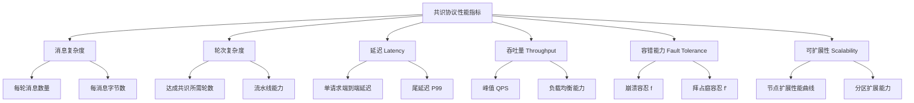
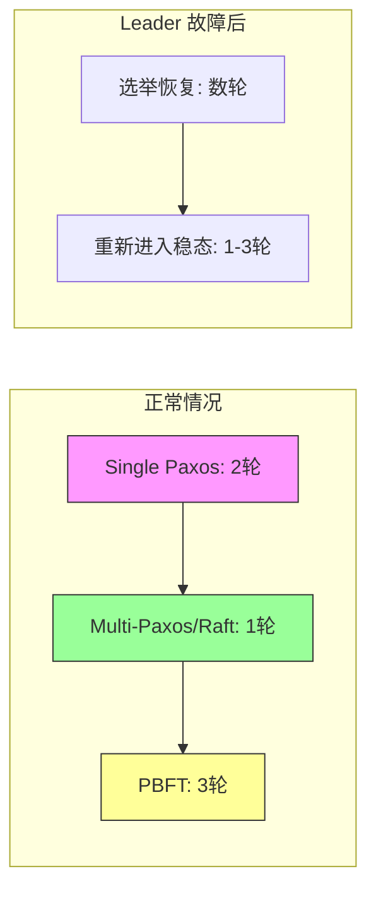
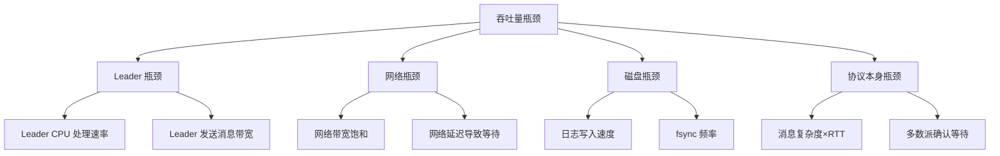
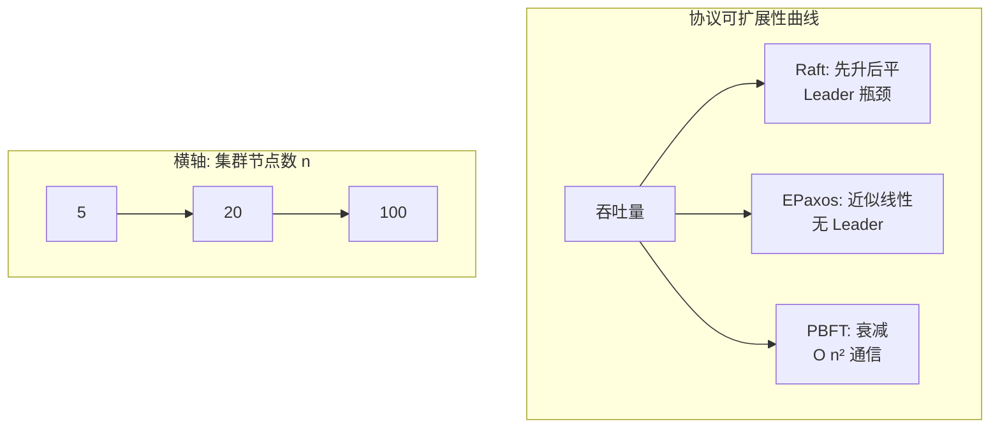
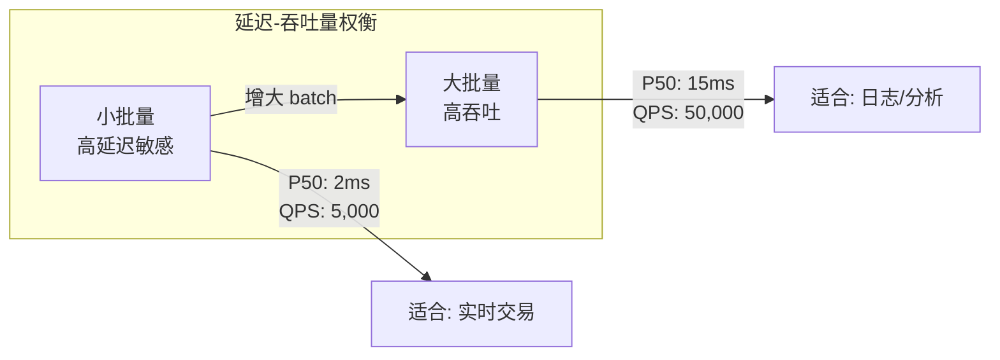

# 共识协议性能指标

选择共识协议本质上是一次多目标优化——你无法同时在所有维度上获得最优解，必须在延迟、吞吐量、容错、可扩展性等多个指标之间做出取舍。本节系统梳理共识协议的六大核心性能指标，解释每个指标的物理含义、量化方法和工程影响，并对 Paxos、Raft、PBFT、HotStuff、Raft 等主流协议在这些指标上的表现做横向对比，帮助你在系统设计时做出有数据支撑的选择。

---

## 1. 为什么需要性能指标

在理论层面，我们已经知道共识问题存在不可能性结论（FLP 定理）和若干经典解法。但在工程实践中，"能达成共识"只是最低要求——你还需要回答一系列更实际的问题：

- **能多快达成共识？** 一个请求从客户端发出到被所有节点确认需要多少毫秒？
- **每秒能处理多少请求？** 在三节点集群和三十节点集群下吞吐量分别是多少？
- **节点故障后性能退化多少？** 五节点集群挂掉一个节点，延迟和吞吐量会变成什么样？
- **扩展到更大规模是否划算？** 把集群从 5 节点扩展到 100 节点，性能提升是否与节点数成正比？

这些问题的答案构成了共识协议的性能指标体系。没有这套指标，系统设计就只能凭经验"拍脑袋"；有了它，你可以在协议选型阶段就量化评估各方案的优劣，避免上线后才发现性能瓶颈。

**性能指标体系概览：**



---

## 2. 六大核心指标详解

### 2.1 消息复杂度（Message Complexity）

**定义：** 达成一次共识所需的网络消息总数，以及每条消息的平均字节数。

**为什么重要：** 消息复杂度直接决定了网络带宽消耗。在跨数据中心部署场景中，带宽是昂贵且有限的资源；消息数量越多，网络拥塞和丢包概率越高，进而推高延迟。

**量化方法：**

设集群节点数为 n，则消息复杂度从两个维度衡量：

| 维度 | 含义 | 计算方式 |
|------|------|----------|
| 消息数量 | 达成一次共识的总 RPC 次数 | 统计一轮协议交互中所有节点发出的消息总数 |
| 字节开销 | 所有消息的总字节数 | 每条消息大小 × 消息数量，需包含协议头、载荷、校验等 |

**主流协议的消息复杂度对比：**

| 协议 | 消息数量（每次共识） | 字节开销特征 |
|------|----------------------|-------------|
| Single-Decree Paxos | 2n（Prepare 阶段 n + Accept 阶段 n） | 中等，每个消息携带提案号和值 |
| Multi-Paxos | 稳态下仅 n（仅 Accept 阶段） | 低，跳过 Prepare 阶段 |
| Raft | 2(n-1)（RequestVote 阶段 n-1 + AppendEntries 阶段 n-1） | 中等，AppendEntries 包含日志条目 |
| PBFT | O(n²)——Pre-prepare + Prepare(n-1) + Commit(n-1) | 高，需携带完整日志或摘要 |
| HotStuff | O(n)——三阶段各 n-1 | 中等，通过门限签名压缩 |
| EPaxos | 稳态下 O(n)，冲突时 O(n²) | 取决于冲突频率 |

**工程启示：** 在节点数 n 较小时（5-7），消息复杂度差异不显著；但当 n > 20 时，O(n²) 的 PBFT 将产生严重的网络风暴。这就是为什么 PBFT 在实际部署中通常限制在 4-16 节点。

### 2.2 轮次复杂度（Round Complexity）

**定义：** 达成一次共识需要的协议轮数（round/phase）。

**为什么重要：** 每一轮协议交互都引入一次网络往返延迟（RTT）。轮次越多，端到端延迟越高。在广域网部署中，一次 RTT 可能是 50-200ms，多一轮就多几十到几百毫秒。

**量化方法：**

| 协议 | 轮次数 | 说明 |
|------|--------|------|
| Single-Decree Paxos | 2 轮（正常情况） | Prepare → Accept，每轮一次 RTT |
| Multi-Paxos | 1 轮（稳态） | Leader 已选举后，每次写入只需 Accept → Response |
| Raft | 1 轮（稳态） | Leader 直接 AppendEntries → Response |
| PBFT | 3 轮 | Pre-prepare → Prepare → Commit |
| HotStuff | 3 轮 | Prepare → Pre-commit → Commit（线性消息复杂度的关键代价） |
| Two-Phase Commit (2PC) | 2 轮 | Prepare → Commit（非容错方案，仅作对比参考） |

**流水线（Pipelining）优化：** 实际系统中，Raft 和 Multi-Paxos 的写入阶段可以流水线化——前一个请求还在 Commit 阶段时，下一个请求已经进入 Prepare/Accept 阶段。这使得单个请求的延迟仍是 1 RTT，但吞吐量大幅提升。etcd 和 TiKV 的 Raft 实现都采用了流水线优化。

**关键区别——稳态 vs. 异常态：**



**工程启示：** 轮次复杂度直接影响尾延迟（P99）。如果你的 SLA 要求 P99 < 100ms，且部署在跨地域网络上（单向延迟 30ms），那么 3 轮协议（如 PBFT）在最坏情况下需要 90ms+，几乎没有余量。

### 2.3 延迟（Latency）

**定义：** 从客户端发出请求到收到共识确认的时间间隔。

**延迟的组成分解：**

一次完整的共识延迟可以分解为以下阶段：

端到端延迟 = 网络传输延迟 + 本地处理延迟 + 持久化延迟 + 等待延迟

各分量含义：

| 分量 | 含义 | 典型量级 |
|------|------|----------|
| 网络传输延迟 | 消息在网络中传播的时间 | 同机房 < 1ms；跨可用区 1-5ms；跨地域 20-200ms |
| 本地处理延迟 | Leader 和 Follower 处理协议逻辑的时间 | < 1ms（纯 CPU 计算） |
| 持久化延迟 | 将日志写入磁盘的时间 | HDD ~10ms；SATA SSD ~1ms；NVMe SSD ~0.1ms；fsync 后额外 ~1ms |
| 等待延迟 | 等待 Leader 收集多数派确认的时间 | 通常为 1 个 RTT |

**延迟的关键维度：**

- **中位数延迟（P50）：** 反映正常情况下的性能，适合评估日常体验。
- **尾延迟（P99/P999）：** 反映最差情况下的性能，对 SLA 达标至关重要。共识协议的尾延迟通常由 Leader 磁盘抖动、网络排队、GC 暂停等引起。
- **提交延迟 vs. 可见延迟：** 提交延迟指值被多数节点确认的时间；可见延迟指值对客户端可见的时间。在 Read-Your-Writes 语义下，两者相同；否则可能有额外延迟。

**协议对延迟的影响：**

| 协议 | 正常延迟（RTT） | 故障恢复延迟 |
|------|-----------------|-------------|
| Raft | 1 RTT | 数秒（Leader 选举超时） |
| Multi-Paxos | 1 RTT | 数秒至数十秒 |
| PBFT | 2 RTT | 数秒（View Change） |
| HotStuff | 2 RTT | 数秒（Leader 轮换） |

**实际延迟数据（TiKV 三节点集群，NVMe SSD，同机房部署）：**

| 操作 | P50 延迟 | P99 延迟 |
|------|----------|----------|
| 单 key 写入 | 2-4ms | 10-20ms |
| 单 key 读取（强一致） | 1-3ms | 5-15ms |
| 单 key 读取（最终一致） | < 1ms | 2-5ms |
| 批量写入（100 条） | 5-10ms | 30-60ms |

### 2.4 吞吐量（Throughput）

**定义：** 单位时间内系统能成功完成的共识操作数量，通常以 QPS（每秒查询数）或 TPS（每秒事务数）度量。

**吞吐量的决定因素：**



**关键洞察——强 Leader 协议的吞吐量天花板：**

在 Raft 和 Multi-Paxos 中，所有写入请求都必须经过 Leader。这意味着 Leader 是天然的吞吐量瓶颈：

- Leader 的出站网络带宽 = 每条消息大小 × (n-1) × QPS
- 以 1KB 日志条目、5 节点集群、10000 QPS 为例：Leader 出站带宽 = 1KB × 4 × 10000 = 40MB/s

这在 5 节点集群中不构成问题，但在 50 节点集群中需要 400MB/s 的出站带宽，对单个节点来说是巨大压力。

**无 Leader 协议的吞吐量优势：**

EPaxos 等无 Leader 协议将请求分散到不同节点处理（当请求无冲突时），可以线性提升吞吐量。但在高冲突负载下，性能反而不如强 Leader 协议。

**实际吞吐量数据（etcd 三节点集群，NVMe SSD）：**

| 场景 | QPS |
|------|-----|
| 小 value 写入（64B） | 10,000-15,000 |
| 中等 value 写入（1KB） | 5,000-8,000 |
| 大 value 写入（64KB） | 1,000-2,000 |
| 小 key 读取（线性一致性） | 15,000-20,000 |
| 小 key 读取（串行化一致性） | 40,000-60,000 |

**影响吞吐量的调优参数：**

| 参数 | 作用 | 推荐值 |
|------|------|--------|
| 批量大小（batch size） | 多个请求合并为一次 RPC | 100-500 条 |
| 流水线深度（pipeline） | 允许未确认的后续请求连续发出 | 10-100 |
| 预投票（pre-vote） | 减少不必要的选举导致的吞吐中断 | 开启 |
| 快照间隔 | 控制日志压缩频率 | 10,000-100,000 条 |

### 2.5 容错能力（Fault Tolerance）

**定义：** 系统在部分节点故障时仍能正确运行的能力，用可容忍的故障节点数 f 与总节点数 n 的关系表示。

**两类容错模型：**

| 故障模型 | 定义 | 需要的条件 | 典型协议 |
|----------|------|-----------|----------|
| 崩溃故障（Crash Fault） | 节点停止响应，但不会发送错误信息 | n ≥ 2f + 1 | Raft, Paxos, ZAB |
| 拜占庭故障（Byzantine Fault） | 节点可能发送任意错误信息，包括恶意行为 | n ≥ 3f + 1 | PBFT, HotStuff, Tendermint |

**容错能力的量化：**

以常见的三类故障容忍为例：

| n（总节点数） | 崩溃容忍 f | 拜占庭容忍 f' | 需要的最少节点 |
|--------------|-----------|-------------|--------------|
| 3 | 1 | 0 | 3 |
| 5 | 2 | 1 | 5 |
| 7 | 3 | 1 | 7 |
| 9 | 4 | 2 | 9 |
| 101 | 50 | 33 | 101 |

**容错与性能的直接关系：**

容错能力越强，每次共识需要的确认节点越多，延迟和消息复杂度越高：

- **崩溃容错：** 需要多数派 (n/2 + 1) 确认，5 节点集群需 3 个确认。
- **拜占庭容错：** 需要 (2n/3 + 1) 确认，5 节点集群需 4 个确认，消息复杂度为 O(n²)。

这就是为什么在可信环境（企业内网、同一数据中心）通常选择崩溃容错协议（Raft/Paxos），而在不可信环境（公链、跨组织联盟）才选择拜占庭容错协议（PBFT/HotStuff）。

**容错恢复期间的性能退化：**

性能退化系数 ≈ (n - f) / n

Raft 5节点集群挂1个节点: (5-1)/5 = 80% 可用性能
Raft 5节点集群挂2个节点: 无法工作（需3个存活节点）

### 2.6 可扩展性（Scalability）

**定义：** 当集群规模扩大时，性能指标的变化趋势。

**两种扩展维度：**

| 扩展类型 | 含义 | 挑战 |
|----------|------|------|
| 垂直扩展（Scale Up） | 增加单节点资源（CPU、内存、磁盘） | 有物理上限，成本指数增长 |
| 水平扩展（Scale Out） | 增加集群节点数量 | 消息复杂度和协调开销可能非线性增长 |

**可扩展性分析——以 n 为变量：**



| 协议 | 扩展到 n 节点的性能变化 |
|------|----------------------|
| Raft | 吞吐量先升后平（Leader 瓶颈），延迟基本不变（稳定在 1 RTT） |
| Multi-Paxos | 同 Raft，稳态下表现类似 |
| PBFT | 吞吐量随 n² 衰减，延迟随轮次线性增长 |
| HotStuff | 吞吐量随 n 线性衰减（优于 PBFT 的 n²），延迟不变 |
| EPaxos | 无冲突时吞吐量随 n 线性增长，冲突严重时退化 |

**实际扩展性数据（理论模型）：**

假设单节点处理能力为 10,000 QPS，网络 RTT 为 1ms：

| 节点数 | Raft 预期 QPS | PBFT 预期 QPS | EPaxos 预期 QPS（低冲突） |
|--------|--------------|--------------|--------------------------|
| 3 | 10,000 | 8,000 | 15,000 |
| 5 | 10,000 | 5,000 | 25,000 |
| 7 | 10,000 | 3,000 | 35,000 |
| 10 | 10,000 | 1,500 | 50,000 |
| 20 | 10,000 | 不可行 | 不适用（冲突增大） |

---

## 3. 指标间的权衡关系

共识协议的性能指标不是孤立的，它们之间存在深刻的权衡（trade-off）关系。理解这些权衡是协议选型的核心能力。

### 3.1 CAP 与 PACELC 框架

**CAP 定理回顾：** 在网络分区（Partition）发生时，系统必须在一致性（Consistency）和可用性（Availability）之间二选一。

**PACELC 扩展：** 即使在正常运行时（没有分区），系统也需要在延迟（Latency）和一致性（Consistency）之间权衡。

| 场景 | 分区时 | 正常时 | 典型选择 |
|------|--------|--------|----------|
| PA/EL | 优先可用性 | 优先低延迟 | Cassandra, DynamoDB |
| PA/EC | 优先可用性 | 优先一致性 | MongoDB (默认) |
| PC/EL | 优先一致性 | 优先低延迟 | 少见（理论上矛盾） |
| PC/EC | 优先一致性 | 优先一致性 | etcd, TiKV, ZooKeeper |

**共识协议几乎都是 PC/EC 选择：** Raft、Paxos、PBFT 在设计上保证强一致性（Safety 不可妥协），代价是在网络分区时牺牲部分可用性（Liveness 可能暂停）。

### 3.2 延迟 vs. 吞吐量

这是一个核心权衡：

- **低延迟优先：** 减少批量大小、减少流水线深度、每条请求单独处理 → 吞吐量降低。
- **高吞吐量优先：** 增大批量大小、深流水线、合并请求 → 单条请求延迟增加。



### 3.3 一致性 vs. 性能

| 一致性级别 | 延迟影响 | 吞吐量影响 | 适用场景 |
|-----------|---------|-----------|----------|
| 强一致性（Linearizable） | 最高（需多数派确认） | 最低 | 金融交易、分布式锁 |
| 顺序一致性（Sequential） | 较高（需 Leader 排序） | 较低 | 配置管理 |
| 因果一致性（Causal） | 中等 | 中等 | 社交动态 |
| 最终一致性（Eventual） | 最低 | 最高 | 缓存、CDN |

### 3.4 容错 vs. 性能

更强的容错 = 更多的确认节点 = 更高的延迟和消息复杂度：

| 容错类型 | 确认比例 | 相对延迟 | 适用环境 |
|----------|---------|---------|----------|
| 无容错（2PC） | 100% | 2 RTT | 单数据中心 |
| 崩溃容错 | 51% | 1-2 RTT | 企业内网 |
| 拜占庭容错 | 67% | 2-3 RTT | 跨组织/公链 |
| 可验证容错（VRF） | 67% | 2-3 RTT | 公链 |

---

## 4. 主流协议的综合性能对比

### 4.1 协议性能全景表

| 协议 | 消息复杂度 | 轮次 | 延迟 | 吞吐量 | 容错 | Leader 依赖 | 适用规模 |
|------|-----------|------|------|--------|------|-----------|----------|
| Raft | O(n) | 1 轮稳态 | 低（1 RTT） | 受 Leader 限制 | 崩溃: f < n/2 | 强 Leader | 3-7 节点 |
| Multi-Paxos | O(n) 稳态 | 1 轮稳态 | 低（1 RTT） | 受 Leader 限制 | 崩溃: f < n/2 | 有 Leader | 3-9 节点 |
| PBFT | O(n²) | 3 轮 | 较高（2 RTT） | 随 n 衰减 | 拜占庭: f < n/3 | 无固定 Leader | 4-16 节点 |
| HotStuff | O(n) | 3 轮 | 较高（2 RTT） | 随 n 线性衰减 | 拜占庭: f < n/3 | 有 Leader | 10-100 节点 |
| EPaxos | O(n) 稳态 | 1 轮稳态 | 低（1 RTT） | 高（无 Leader 瓶颈） | 崩溃: f < n/2 | 无 Leader | 3-12 节点 |
| Tendermint | O(n²) | 3 轮 | 较高 | 中等 | 拜占庭: f < n/3 | 轮转 Leader | 4-100 节点 |
| Raft + Learner | O(n + L) | 1 轮 | 低 | 高（读扩展） | 崩溃: f < n/2 | 强 Leader | 3 主 + 多 Learner |

### 4.2 选型决策树

```mermaid
graph TD
    Start[选择共识协议] --> Q1{需要拜占庭容错?}
    Q1 -->|是| Q2{节点规模?}
    Q2 -->|< 16| PBFT
    Q2 -->|> 16| HotStuff
    Q1 -->|否| Q3{读写模式?}
    Q3 -->|写多读少| Raft
    Q3 -->|读多写少| Raft + Learner
    Q3 -->|多写入者无冲突| EPaxos
    Q3 -->|多写入者有冲突| Raft
```

---

## 5. 性能基准测试方法论

### 5.1 常用基准测试工具

| 工具 | 适用协议 | 测试内容 | 输出指标 |
|------|----------|---------|---------|
| **YCSB** (Yahoo Cloud Serving Benchmark) | 通用 KV 存储 | CRUD 操作的 QPS 和延迟 | P50/P95/P99 延迟、吞吐量 |
| **BenchmarkSQL** | 分布式数据库 | TPC-C 事务 | TPS、延迟 |
| **go-ycsb** | etcd, TiKV 等 Go 实现 | 与 YCSB 相同 | 同 YCSB |
| **FPCP** (Fault Injection) | 容错测试 | 模拟节点故障、网络分区 | 故障恢复时间、数据一致性 |

### 5.2 基准测试的常见陷阱

**陷阱一：测试环境与生产环境不一致**

| 因素 | 测试环境 | 生产环境 | 影响 |
|------|----------|---------|------|
| 磁盘 | 内存盘/高速 SSD | SATA SSD/HDD | 延迟偏差 10-100 倍 |
| 网络 | 同机房/虚拟网络 | 跨可用区 | RTT 偏差 1-50 倍 |
| 负载 | 均匀分布 | 热点+长尾 | P99 偏差 5-20 倍 |

**陷阱二：忽略 Leader 选举的影响**

大多数基准测试在稳定状态下进行，但生产中 Leader 选举频繁发生（尤其是跨地域部署时）。一个完整的 Leader 选举周期通常导致 1-3 秒的不可用，这段时间的请求全部超时。

**陷阱三：只看平均值，忽略尾延迟**

| 指标 | 含义 | 实际影响 |
|------|------|---------|
| P50 | 一半请求的延迟低于此值 | 用户"大部分时候"的体验 |
| P99 | 99% 请求的延迟低于此值 | SLA 达标的关键 |
| P999 | 99.9% 请求的延迟低于此值 | 极端情况下的用户投诉来源 |

在高并发系统中，P99 可能是 P50 的 10-50 倍。共识协议的 P99 延迟主要受以下因素影响：

- Leader 磁盘 fsync 延迟波动
- 网络微突发（micro-burst）
- Leader 节点的 GC 暂停（Go/Java 实现）
- 操作系统调度抖动

### 5.3 标准化测试流程

一个严谨的共识协议基准测试应包含以下步骤：

1. **基线测试：** 三节点集群，同机房部署，小 value（64B），测量最大 QPS 和最低延迟。
2. **扩展测试：** 逐步增加节点数（3→5→7→9），观察性能变化曲线。
3. **负载测试：** 逐步增加并发客户端数，找到吞吐量拐点（饱和点）。
4. **故障注入测试：** 随机杀死 1-2 个节点，测量恢复时间和恢复期间的性能。
5. **持久性测试：** 断电重启后数据完整性验证。
6. **长期稳定性测试：** 连续运行 24-72 小时，观察是否有内存泄漏、性能退化。

---

## 6. 工程实践中的性能优化

### 6.1 共识层优化

| 优化手段 | 原理 | 适用场景 |
|----------|------|----------|
| 批量提交（Batching） | 将多个写入请求合并为一次共识 | 高吞吐写入 |
| 流水线（Pipelining） | 允许未确认的后续请求连续发出 | 高并发写入 |
| 预投票（Pre-Vote） | 在正式选举前探测是否有更优 Leader | 减少不必要的选举 |
| 读优化（ReadIndex / Lease Read） | 读请求不经过共识，直接从 Leader 读 | 读多写少场景 |
| Learner 节点 | 只参与复制、不参与投票 | 读扩展 |
| 日志压缩（Snapshot） | 定期将状态机快照持久化，截断旧日志 | 长期运行系统 |

### 6.2 硬件层优化

| 硬件选择 | 对延迟的影响 | 对吞吐量的影响 |
|----------|-------------|---------------|
| NVMe SSD 替代 SATA SSD | 延迟降低 5-10 倍 | 吞吐量提升 3-5 倍 |
| 10GbE 替代 1GbE | 延迟降低 10-30% | 吞吐量提升 10 倍 |
| 专用网卡（RDMA） | 延迟降低至微秒级 | 吞吐量提升 2-5 倍 |
| 多核 CPU | 对延迟影响不大 | 吞吐量近似线性提升 |

### 6.3 网络层优化

| 优化手段 | 原理 | 延迟改善 |
|----------|------|---------|
| 同机房部署 | 消除跨地域 RTT | 降低 50-90% |
| 机架感知 | 优先同机架通信 | 降低 5-20% |
| UDP 传输（如 mRaft） | 避免 TCP 重传延迟 | 降低 10-30% |
| 消息压缩 | 减少传输字节数 | 在带宽受限时降低 20-50% |

---

## 7. 常见误区与纠正

| 误区 | 正确认识 |
|------|---------|
| "节点越多越好" | 节点数增加会提高消息复杂度和协调开销，吞吐量可能不升反降 |
| "Raft 比 Paxos 快" | 两者稳态性能几乎相同，差异在于实现复杂度和可理解性，不在于性能 |
| "共识协议是性能瓶颈的全部" | 实际系统中，存储引擎、序列化、GC 等组件可能才是真正的瓶颈 |
| "P99 延迟可以忽略" | 在大规模系统中，P99 意味着每 100 个请求就有 1 个超时，用户体验严重受损 |
| "拜占庭容错一定比崩溃容错差" | 在可信环境下选择崩溃容错是正确的，但在不可信环境下拜占庭容错是唯一选择 |
| "读操作也要走共识" | 读操作可以通过 ReadIndex 或 Lease Read 优化，不需要每次都走完整共识流程 |

---

## 8. 本节小结

| 维度 | 核心要点 |
|------|---------|
| 消息复杂度 | 决定网络带宽消耗，O(n²) 的 PBFT 在大规模集群中不可行 |
| 轮次复杂度 | 每多一轮增加一个 RTT，直接影响延迟 |
| 延迟 | 分解为网络+处理+持久化+等待四部分，尾延迟比中位数更重要 |
| 吞吐量 | 强 Leader 协议受限于 Leader，无 Leader 协议可线性扩展 |
| 容错 | 崩溃容错需多数派，拜占庭容错需三分之二，容错越强性能代价越高 |
| 可扩展性 | 不同协议随节点数增长的性能曲线差异巨大 |

选择共识协议时，不存在"最优解"，只有"最适合你的场景"。在企业内网部署 KV 存储，Raft 是务实之选；在跨组织联盟链场景，HotStuff 是可扩展的拜占庭方案；在多数据中心部署，EPaxos 可以提供更低的延迟。理解每个指标的含义和它们之间的权衡关系，才能做出有数据支撑的架构决策。
