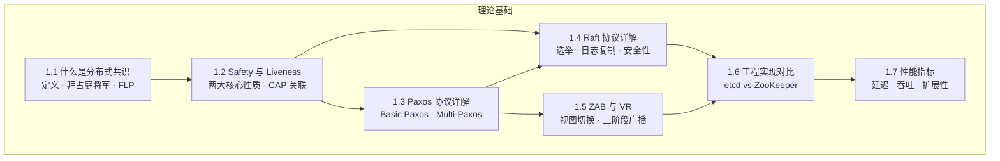
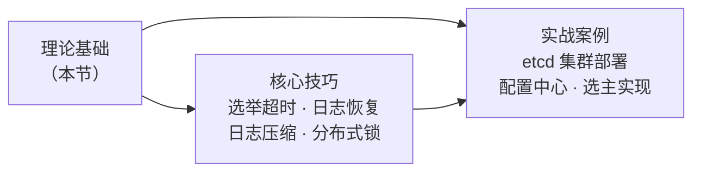

# 理论基础

> **本节定位：** 理论基础是第 22 章的根基。在进入核心技巧与实战案例之前，你必须先建立扎实的理论认知——理解分布式共识"是什么""为什么难""怎么解"。本节 7 个小节层层递进，从基本概念到经典协议，从理论极限到工程选型，构成完整的知识链路。

---

## 为什么理论不可跳过

很多工程师倾向于直接上手 etcd 或 ZooKeeper，把理论当作"学术文章"跳过。这种做法在日常开发中或许可行，但在以下场景会暴露致命短板：

- **故障排查**：集群出现脑裂或数据不一致时，不理解 Safety/Liveness 就无法定位根因
- **架构选型**：在 Paxos、Raft、ZAB 之间选择时，不理解底层机制就只能盲从社区意见
- **性能调优**：共识协议的延迟、吞吐与消息复杂度直接挂钩，不懂原理就无法做针对性优化
- **系统设计**：设计分布式数据库、配置中心、协调服务时，共识协议是绕不开的核心组件

**理论的价值不在于"知道"，而在于遇到非典型问题时能推导出正确答案。**

---

## 知识体系全景图

以下思维导图展示了本节 7 个小节的知识结构与逻辑关系：

**学习路径建议：**

| 读者类型 | 推荐路径 | 说明 |
|---------|---------|------|
| 初学者 | 全部按序阅读 | 1.1→1.2→1.3→1.4→1.5→1.6→1.7 |
| 有基础、用 Raft | 1.1→1.2→1.4→1.6→1.7 | 跳过 Paxos 和 ZAB 的细节 |
| 架构选型 | 1.2→1.3→1.4→1.5→1.6→1.7 | 重点在对比和性能指标 |
| 面试准备 | 全部 + 重点关注 1.1、1.2、1.4 | 拜占庭将军、FLP、Raft 是高频考点 |

---

## 各小节概览

### 1.1 什么是分布式共识

**核心问题：** 多个节点如何在不可靠通信条件下就某个值达成一致？

这一小节从拜占庭将军问题（Byzantine Generals Problem）出发，引出分布式共识的基本定义与分类。重点讲解三个里程碑式的理论成果：

- **FLP 不可能定理（1989）**：在异步系统中，只要存在一个节点可能故障，就不存在能保证终止的确定性共识算法。这是分布式共识领域最深刻的不可能性结论，决定了所有实际协议都必须在异步模型上做出妥协（引入超时、随机化等机制）
- **拜占庭容错（BFT）**：当节点不仅可能崩溃还可能恶意行为时，需要 3f+1 个节点才能容忍 f 个拜占庭故障，这是 PBFT 等协议的理论基础
- **崩溃容错（CFT）**：节点只是"停下来"而非"说谎"，只需 2f+1 个节点即可容忍 f 个崩溃故障，Raft 和 Paxos 都属于这一类别

**与后续章节的关系：** 理解了共识问题的分类和理论极限，才能明白为什么 Raft 引入选举超时（绕过 FLP），为什么 PBFT 需要三阶段提交（应对拜占庭行为）。

### 1.2 Safety 与 Liveness

**核心概念：** 所有分布式协议的正确性都可以归结为 Safety（安全性）和 Liveness（活性）两大性质。

| 性质 | 直觉含义 | 形式化表述 | 典型体现 |
|------|---------|-----------|---------|
| Safety | "坏事永远不会发生" | 执行轨迹的任何前缀若满足 Safety，则所有后续扩展也满足 | 不会同时选出两个 Leader |
| Liveness | "好事终将发生" | 系统最终会进入某个满足目标状态的配置 | 请求最终会被提交 |

这一小节的核心价值在于揭示 **Safety 与 Liveness 之间的内在张力**：CAP 定理本质上就是分布式系统中 Safety（一致性）和 Liveness（可用性）不可兼得的体现。在工程实践中，这意味着：

- **CP 系统**（如 etcd、ZooKeeper）：优先保证 Safety，牺牲部分 Liveness（网络分区时拒绝服务）
- **AP 系统**（如 Cassandra、DynamoDB）：优先保证 Liveness，牺牲部分 Safety（允许临时不一致）

### 1.3 Paxos 协议详解

**历史地位：** Paxos 是分布式共识的"圣经级"协议，Google 的 Chubby、Spanner、Megastore 都以 Paxos 或其变体为核心。

本小节从两将军问题的直觉出发，逐步拆解 Basic Paxos 的两阶段流程（Prepare/Promise + Accept/Accepted），通过完整的冲突场景演示其正确性保证，再延伸到：

- **Multi-Paxos**：如何将单次共识扩展为连续日志复制，通过稳定的 Leader 省去 Prepare 阶段
- **Fast Paxos**：通过减少通信轮次优化延迟，但增加了冲突概率
- **Paxos 的工程难题**：为什么 Lamport 说"Paxos 论文故意写得晦涩"？工程实现中需要处理哪些论文未提及的边界情况？

**与 Raft 的关键区别：** Paxos 没有固定 Leader，允许多个 Proposer 并发提案，这使得协议更灵活但更难实现。Raft 通过引入强 Leader 简化了这一问题——代价是 Leader 故障时需要重新选举。

### 1.4 Raft 协议详解

**设计哲学：** "可理解性与正确性同等重要"——这是 Raft 论文的开篇宣言。

Raft 将共识问题分解为三个独立子问题，每个子问题都有明确的算法和不变式：

| 子问题 | 核心机制 | 关键约束 |
|--------|---------|---------|
| Leader 选举 | 随机超时 + 多数投票 | 每个 Term 最多一个 Leader |
| 日志复制 | Leader 单向 AppendEntries | 日志匹配属性 + Leader 完整性原则 |
| 安全性 | 选举限制 + 提交规则 | 已提交的日志绝不会被覆盖 |

**为什么 Raft 成为主流：** 相比 Paxos，Raft 的强 Leader 模型大幅降低了实现复杂度。etcd、Consul、TiKV、CockroachDB 等主流系统都选择了 Raft，形成了庞大的工程生态。

### 1.5 ZAB 协议与 Viewstamped Replication

**被低估的两条技术路线：**

- **ZAB（ZooKeeper Atomic Broadcast）**：为 ZooKeeper 量身设计的共识协议，采用三阶段流程（Discovery → Synchronization → Broadcast），在 Leader 选举和数据同步上有独特的工程考量
- **Viewstamped Replication（VR）**：1988 年由 Oki 和 Liskov 提出，比 Paxos 更早，是"主副本 + 视图切换"思想的鼻祖。2012 年的 VR Replication Revisited 论文对其进行了现代化重构

本小节通过对比分析揭示：ZAB 和 VR 虽然名气不如 Paxos 和 Raft，但它们的设计思想深刻影响了后世协议，理解它们有助于更全面地把握共识协议的演进脉络。

### 1.6 工程实现对比：etcd vs ZooKeeper

**从协议到系统：** 这一小节将理论落地，从五个维度系统对比两大主流实现：

| 维度 | etcd | ZooKeeper |
|------|------|-----------|
| 底层协议 | Raft | ZAB |
| API 风格 | gRPC + Watch 机制 | 客户端协议 + 回调 |
| 数据模型 | 扁平 KV | 树形 ZNode |
| 存储引擎 | BoltDB（B+ 树） | 内存 DataTree + 事务日志 |
| 一致性语义 | 顺序一致性 | 顺序一致性（Sync 模式下线性一致） |

**选型建议：** 新项目优先考虑 etcd（更活跃的社区、更好的 Kubernetes 集成、更现代的 API）；存量 Hadoop/Kafka 生态系统继续使用 ZooKeeper（生态兼容性更好）。

### 1.7 共识协议性能指标

**量化评估框架：** 这一小节建立共识协议的性能评估体系，涵盖六大核心指标：

1. **消息复杂度**：达成一次共识需要多少条消息（O(n) vs O(n²)）
2. **轮次复杂度**：需要几轮通信才能完成一次共识（1 轮 vs 2 轮 vs 3 轮）
3. **延迟（Latency）**：请求从发出到确认的端到端耗时
4. **吞吐量（Throughput）**：集群每秒能处理多少请求
5. **容错能力**：集群在多少节点故障时仍能正常工作
6. **可扩展性**：增加节点数时性能如何变化

**核心结论：** 不存在在所有指标上都最优的共识协议。Paxos/Raft 在延迟和吞吐上表现优异但只能容忍崩溃故障；PBFT 能容忍拜占庭故障但消息复杂度为 O(n²)；HotStuff 通过 Leader 流水线将消息复杂度降至 O(n)，但引入了更多轮次。

---

## 理论与后续章节的衔接

本节的理论基础为后续章节提供了必要的认知框架：

- **核心技巧**将理论转化为可操作的工程实践：如何设计选举超时参数、如何快速恢复日志一致性、如何实现分布式锁
- **实战案例**则是完整的端到端项目：部署高可用 etcd 集群、基于 etcd 实现分布式配置中心、实现 Leader 选举

**没有理论基础的实践是盲目的，没有实践验证的理论是空洞的。** 带着本节建立的认知框架，进入下一节的核心技巧学习。

---

## 常见误区

| 误区 | 正确理解 |
|------|---------|
| "Paxos 已经过时了，直接学 Raft 就行" | Paxos 是 Raft 的理论基础，理解 Paxos 才能理解 Raft 每个设计选择的动机。面试中 Paxos 仍是高频考点 |
| "FLP 定理说明分布式共识不可能实现" | FLP 说的是在纯异步模型中不可能有确定性算法。实际系统通过超时、随机化等机制绕过了这一限制 |
| "Raft 比 Paxos 更正确" | 两者解决的是同一问题，正确性等价。Raft 的优势在于可理解性，而非正确性 |
| "etcd 和 ZooKeeper 可以随意互换" | 两者的 API 模型、数据结构、Watch 语义有本质差异，迁移需要重写客户端代码 |
| "共识协议的性能只取决于算法本身" | 网络延迟、磁盘 I/O、序列化开销、客户端并发数等工程因素往往比算法本身更影响实际性能 |
