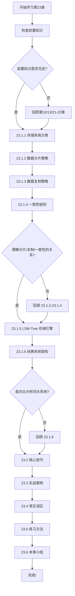
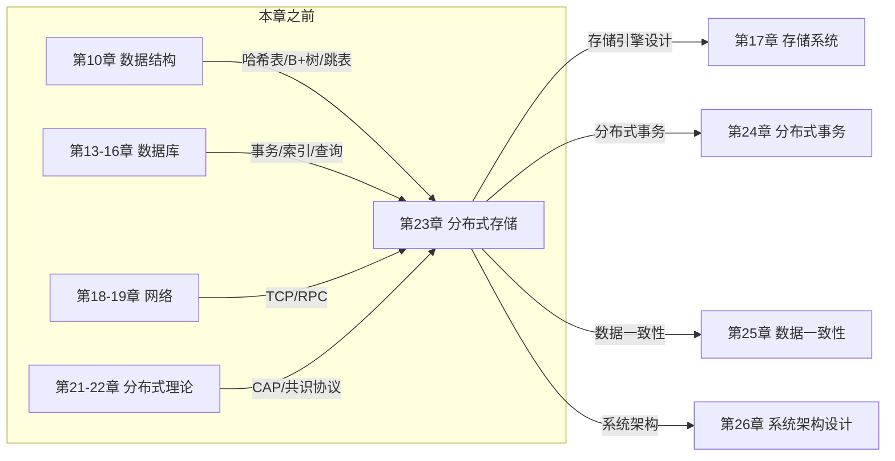

# 第23章 分布式存储 — 章节概览

## 本章定位与价值

分布式存储是现代大规模系统架构的基石。从 Google 的 GFS 开创"廉价机器+软件容错"范式，到 Amazon Dynamo 定义"Always Writable"可用性哲学，再到 TiKV 将分布式事务带给开源世界——每一次技术跃迁都重新定义了数据存储的可能性边界。

本章是全书数据存储体系的核心章节，上承第21-22章的分布式理论基础（CAP 定理、共识协议），下启后续章节的数据库系统设计。完成本章后，读者将具备从"知道分布式存储存在"到"能设计、选型、调优一个分布式存储系统"的完整能力。

**为什么要学分布式存储？**

单机存储面临三大根本性瓶颈：

| 瓶颈维度 | 具体表现 | 分布式解决方案 |
|----------|---------|--------------|
| **容量上限** | 单块 SSD 最大 ~8TB，单台服务器通常 ~100TB | 横向扩展到数千节点，总容量 PB~EB 级 |
| **吞吐瓶颈** | 单机 NVMe SSD 顺序写 ~3GB/s，受限于 PCIe 通道 | 并行读写数百块磁盘，聚合带宽 TB/s 级 |
| **可用性单点** | 硬件年故障率 2-5%，一次故障即服务中断 | 数据多副本 + 自动故障转移，99.99%+ 可用 |

但分布式也带来了全新的挑战：网络分区下的数据一致性、跨节点事务的性能开销、故障检测与自动恢复的复杂性。本章将系统性地讲解如何在这些挑战之间做出正确的工程权衡。

## 核心学习目标

完成本章学习后，读者应达到以下能力水平：

### 知识层面

1. **理解分布式存储分类体系**：掌握键值存储、分布式文件系统、对象存储、列式存储四大范式的数据模型、访问模式和适用场景，能根据业务特征选择合适的存储类型
2. **掌握数据分片策略**：深入理解 Hash 分片、Range 分片、一致性哈希三种策略的原理、优劣和适用场景，能分析实际系统（如 TiKV、Cassandra）的分片设计
3. **掌握数据复制策略**：理解主从复制、多主复制、无主复制的设计权衡，掌握 Quorum 机制的数学原理（W + R > N），能设计满足业务一致性需求的复制方案
4. **理解一致性级别光谱**：从强一致性（Linearizability）到最终一致性（Eventual Consistency），掌握各级别的一致性保证、性能代价和应用场景
5. **深入存储引擎设计**：理解 LSM-Tree 的读写路径、Compaction 策略（Leveled/Size-Tiered）对性能的影响，掌握 RocksDB 的调优方法
6. **分析经典系统架构**：能对比分析 GFS/HDFS、BigTable/Cassandra、Dynamo/Riak、TiKV 的设计决策，理解每个系统在 CAP 光谱上的取舍

### 技能层面

7. **存储选型能力**：能根据业务的读写比例、一致性要求、数据量级、延迟预算等维度，推荐合适的存储方案
8. **性能调优能力**：能通过 Compaction 策略调整、Block Cache 配置、Bloom Filter 等手段优化存储引擎性能
9. **故障分析能力**：能识别分布式存储系统中的常见故障模式（脑裂、数据不一致、Compaction 堆积），并给出修复方案

## 前置知识

本章假设读者已具备以下基础知识。如果某些领域感到生疏，建议先回顾对应章节：

| 知识领域 | 具体要求 | 参考章节 | 重要程度 |
|---------|---------|---------|---------|
| 数据结构 | 哈希表、B+树、跳表、红黑树的实现原理与时间复杂度 | 第10章 | ★★★★★ |
| 操作系统 | 文件系统原理（inode、日志）、I/O 模型（同步/异步/直接I/O）、内存管理（mmap） | 第3-7章 | ★★★★☆ |
| 计查机网络 | TCP/IP 连接管理、RPC 框架原理、网络延迟对分布式系统的影响 | 第18-19章 | ★★★★☆ |
| 数据库基础 | 事务的 ACID 特性、B+树索引原理、查询处理流程 | 第13-16章 | ★★★★☆ |
| 分布式理论 | CAP 定理的含义与权衡、Raft/Paxos 共识协议的基本流程 | 第21-22章 | ★★★★★ |

> **特别提示**：第21-22章的分布式理论是本章的直接前置。如果对 CAP 定理中"一致性与可用性的权衡"或 Raft 协议的 Leader 选举流程还不够清晰，请务必先回顾后再学习本章。

## 知识体系总览

本章的知识体系按照"道→法→术→器"的逻辑层层递进，从底层原理到上层应用形成完整的知识链路：

```mermaid
graph TD
    subgraph 道（原理层）
        A[分布式存储系统分类] --> B[数据模型与访问模式]
        B --> B1[键值存储 KV]
        B --> B2[分布式文件系统]
        B --> B3[对象存储]
        B --> B4[列式存储宽表]
    end

    subgraph 法（方法层）
        C[数据分片策略] --> C1[Hash 分片]
        C --> C2[Range 分片]
        C --> C3[一致性哈希]
        C --> C4[虚拟节点]
        
        D[数据复制策略] --> D1[主从复制]
        D --> D2[多主复制]
        D --> D3[无主复制]
        D --> D4[Quorum 机制]
        
        E[一致性级别] --> E1[强一致性 线性一致]
        E --> E2[因果一致性]
        E --> E3[读己之写]
        E --> E4[最终一致性]
    end

    subgraph 术（技术层）
        F[LSM-Tree 存储引擎] --> F1[MemTable / WAL]
        F --> F2[SSTable / Immutable MemTable]
        F --> F3[Compaction Leveled / Size-Tiered]
        F --> F4[RocksDB 调优参数]
        
        G[经典系统架构] --> G1[GFS / HDFS 大块+单Master]
        G --> G2[BigTable / Cassandra / ScyllaDB]
        G --> G3[Dynamo / Riak 无主+向量时钟]
        G --> G4[TiKV Raft+MVCC+分布式事务]
        G --> G5[纠删码 Erasure Coding]
    end

    subgraph 器（工程层）
        H[核心技巧] --> H1[热点数据处理]
        H --> H2[跨数据中心复制]
        H --> H3[存储引擎调优]
        H --> H4[容量规划与数据生命周期]
        H --> H5[故障检测与自动恢复]
        
        I[实战案例] --> I1[设计分布式 KV 存储]
        I --> I2[构建对象存储服务]
        I --> I3[时序数据存储方案]
    end

    A --> C
    A --> D
    A --> E
    C --> F
    D --> E
    E --> F
    F --> G
    G --> H
    H --> I
```

## 章节结构详解

本章分为六大模块，每个模块的学习目标、核心内容和预计用时如下：

### 23.1 理论基础（预计 10-12 小时）

理论基础是本章的根基，分为六个子节。建议按顺序学习，因为后续小节依赖前面的知识。

#### 23.1.1 分布式存储系统分类

| 存储类型 | 数据模型 | 典型系统 | 适用场景 |
|---------|---------|---------|---------|
| 键值存储 | `(key, value)` 二元组 | Dynamo, Riak, TiKV, Redis Cluster | 会话管理、配置中心、购物车、缓存 |
| 分布式文件系统 | 层级目录 + 大文件 | GFS, HDFS | 大数据分析、MapReduce、日志存储 |
| 对象存储 | `Object = {Key, Data, Metadata}` | S3, MinIO, Ceph RGW | 图片/视频、备份归档、数据湖 |
| 列式存储 | `(row_key, cf:qualifier, ts) → value` | BigTable, Cassandra, ScyllaDB | 时序数据、用户画像、宽表查询 |

**学习要点**：不仅要记住每种类型的定义，更要理解它们的设计哲学——为什么键值存储"通过限制数据模型换取水平扩展"？为什么对象存储是"扁平命名空间"？这些设计决策背后的权衡是什么？

#### 23.1.2 数据分片策略

三种分片策略的核心权衡：

         范围查询支持
              ↑
              │
    Range 分片 ●
              │
              │          ● 一致性哈希
              │
              │
    Hash 分片 ●
              └──────────────────→ 负载均衡能力

- **Hash 分片**：`partition_id = hash(key) % num_partitions`，均匀但不支持范围查询
- **Range 分片**：按 key 范围划分，支持范围扫描但容易产生热点
- **一致性哈希**：节点和数据映射到同一哈希环，节点增减只迁移 `1/N` 数据
- **虚拟节点**：一致性哈希的关键改进，解决物理节点分布不均导致的负载倾斜

**学习要点**：重点理解一致性哈希的数学性质——为什么"只迁移 `1/(N+1)` 的数据"？虚拟节点数量如何影响分布均匀性？Dynamo 如何将数据复制到环上连续 T 个节点？

#### 23.1.3 数据复制策略

三种复制策略的可用性与一致性对比：

| 复制策略 | 写入可用性 | 读取一致性 | 冲突处理 | 典型系统 |
|---------|-----------|-----------|---------|---------|
| 主从复制 | 依赖 Leader | 强（读 Leader） | 无需（单点写入） | MySQL, PostgreSQL |
| 多主复制 | 多点写入 | 需冲突解决 | LWW/向量时钟/CRDT | CockroachDB (多Region) |
| 无主复制 | Always Writable | 可调（Quorum） | 读修复+反熵 | Dynamo, Cassandra |

**学习要点**：深入理解 Quorum 机制的数学原理——`W + R > N` 如何保证读写集合必然有交集？不同 W/R/N 组合如何在一致性与可用性之间取舍？

#### 23.1.4 一致性级别

一致性是一个连续光谱，而非简单的"强/弱"二分法：

强一致性 ←────────────────────────────────────→ 最终一致性
(Linearizability)    因果一致性    读己之写    (Eventual)
    │                   │            │           │
  延迟最高            延迟中等     延迟中等    延迟最低
  可用性最低          可用性中等   可用性中等  可用性最高
  金融交易            协作编辑     用户配置    社交动态

**学习要点**：理解每种一致性模型的精确定义——线性一致性要求"写完成后所有后续读都能看到"；因果一致性保证"因果相关的操作顺序一致"；最终一致性只保证"最终收敛"。

#### 23.1.5 LSM-Tree 存储引擎

LSM-Tree 是分布式存储中最核心的存储引擎，理解其读写路径和 Compaction 策略是调优的基础：

写入路径：
Client → WAL（预写日志，持久化保证）
       → MemTable（内存，跳表/红黑树）
       → 当 MemTable 满时 → Flush 为 SSTable（磁盘）
       → Compaction 合并 SSTable（后台线程）

读取路径：
Client → MemTable（内存查找）
       → Bloom Filter（快速跳过不包含 key 的 SSTable）
       → SSTable（磁盘查找，二分搜索）

两种主要的 Compaction 策略：

| 策略 | 原理 | 写放大 | 读放大 | 空间放大 |
|-----|------|-------|-------|---------|
| Size-Tiered | 大小相近的 SSTable 合并 | 低（~4x） | 高（需查多层） | 高（临时空间大） |
| Leveled | 每层大小固定，L0→L1→L2 逐层合并 | 高（~10-30x） | 低（每层最多1个 SSTable） | 低（~1.1x） |

**学习要点**：理解写放大、读放大、空间放大三者之间的权衡关系——为什么 Leveled Compaction 读性能更好但写放大更高？RocksDB 的 `level0_file_num_compaction_trigger` 和 `max_bytes_for_level_base` 如何影响 Compaction 行为？

#### 23.1.6 经典系统架构

深入分析四大经典系统的设计决策：

| 系统 | 分片策略 | 复制策略 | 一致性模型 | 核心创新 |
|-----|---------|---------|-----------|---------|
| GFS/HDFS | 大块（64MB/128MB） | 主从复制（3副本） | 异步复制（最终一致） | 单 Master 简化设计，追加优化 |
| BigTable/Cassandra | Range / 一致性哈希 | 主从 / 无主 | 可调一致性 | 列族模型、LSM-Tree、去中心化 |
| Dynamo/Riak | 一致性哈希 | 无主复制 | 最终一致性（Always Writable） | 向量时钟、gossip 协议、读修复 |
| TiKV | 一致性哈希 + Range | Raft 共识 | 线性一致性 | 分布式事务、MVCC、Raft Group |

**学习要点**：理解每个系统的设计决策背后的"为什么"——GFS 为什么选 64MB 大块？Dynamo 为什么选择 Always Writable？TiKV 如何在 Raft 之上实现分布式事务？

### 23.2 核心技巧（预计 6-8 小时）

聚焦工程实践中的六大关键问题：

1. **热点数据处理**：Range 分片的热点问题如何通过 Salting（加盐）、Virtual Partition、Read-Write Separation 等手段缓解
2. **跨数据中心复制**：多 DC 部署下的数据一致性与延迟优化，包括同步/异步复制的选择、Conflict Resolution 策略
3. **存储引擎调优**：RocksDB 的关键参数配置（Block Cache、Bloom Filter、Write Buffer、Compaction 触发条件）
4. **容量规划与数据生命周期**：如何估算存储需求、设计数据分层策略（Hot/Warm/Cold）、配置自动淘汰规则
5. **故障检测与自动恢复**：Gossip 协议、Phi Accrual Failure Detector、节点自动上下线
6. **压缩与合并策略优化**：Snappy/Zstd/LZ4 压缩算法的选择、Compaction 并发度调优、写入限流（Write Stall）的诊断与处理

### 23.3 实战案例（预计 8-10 小时）

通过三个真实场景检验理论知识的工程落地能力：

1. **设计分布式 KV 存储系统**：从零设计一个支持 Put/Get/Delete 的分布式 KV 存储，涉及分片、复制、故障恢复的完整方案
2. **构建对象存储服务**：设计一个 S3 兼容的对象存储，处理大文件分片、元数据管理、跨 DC 复制
3. **时序数据存储方案**：针对 IoT/监控场景设计时序数据库，处理高写入吞吐、自动过期、降采样

### 23.4 常见误区（预计 2-3 小时）

纠正常见的认知偏差和工程决策错误：

- **过度追求强一致性**：在不需要强一致的场景下引入 Raft/Paxos，白白牺牲可用性和性能
- **忽视存储引擎选型**：B-Tree vs LSM-Tree 不是简单的"写多用 LSM、读多用 B-Tree"，需要结合具体工作负载分析
- **混淆副本与纠删码**：3 副本提供 3 倍冗余但浪费存储；纠删码（如 Reed-Solomon 4+2）用 1.5x 冗余达到同等可靠性，但写入需要额外计算
- **忽略 Compaction 对延迟的影响**：后台 Compaction 可能导致前台写入出现秒级延迟抖动（Write Stall）
- **低估网络分区的影响**：在多 DC 部署中，网络分区是常态而非异常，必须在设计阶段就考虑分区容忍性

### 23.5 练习方法（预计 12-16 小时）

系统化的学习路径，从理论到实践：

1. **经典论文精读**：GFS、BigTable、Dynamo、Spanner 四篇论文是分布式存储的奠基之作，建议结合本章正文逐段精读
2. **源码分析**：阅读 RocksDB 的 Compaction 实现、TiKV 的 Raft Group 管理代码
3. **Mini 存储引擎实现**：动手实现一个简化版 LSM-Tree，包含 MemTable、WAL、SSTable 读写、基础 Compaction
4. **系统对比实验**：在同一硬件上部署 TiKV 和 Cassandra，用 YCSB 基准测试对比读写性能
5. **故障模拟演练**：使用 Chaos Engineering 工具（如 Chaos Mesh）模拟节点故障、网络分区，观察系统行为

## 学习路径



## 预计学习时间

| 学习阶段 | 内容 | 预计时间 | 难度 |
|---------|------|---------|------|
| 理论基础 | 存储分类、分片、复制、一致性 | 10-12 小时 | ★★★☆☆ |
| 存储引擎 | LSM-Tree、Compaction、RocksDB | 6-8 小时 | ★★★★☆ |
| 经典系统 | GFS/BigTable/Dynamo/TiKV 架构分析 | 4-6 小时 | ★★★★☆ |
| 核心技巧 | 热点处理、跨DC复制、引擎调优 | 6-8 小时 | ★★★★★ |
| 实战案例 | KV存储、对象存储、时序存储 | 8-10 小时 | ★★★★★ |
| 常见误区 | 典型错误分析与纠正 | 2-3 小时 | ★★☆☆☆ |
| 练习巩固 | 论文阅读、源码分析、Mini引擎 | 12-16 小时 | ★★★★★ |
| **总计** | | **48-63 小时** | |

> **说明**：以上时间基于"有一定分布式系统基础"的读者估算。如果是初次接触分布式存储，建议预留额外 10-15 小时用于补充前置知识和反复理解核心概念。

## 核心问题清单

学完本章后，你应该能清晰回答以下问题：

### 基础理解题

1. 键值存储、分布式文件系统、对象存储、列式存储各有什么数据模型和访问模式？分别适合什么业务场景？
2. Hash 分片和 Range 分片各有什么优劣？在什么场景下应该选择哪种？
3. 主从复制、多主复制、无主复制的核心区别是什么？各自的故障模式有何不同？
4. 什么是 Quorum 机制？`W + R > N` 为什么能保证一致性？

### 原理分析题

5. 一致性哈希解决了什么问题？为什么需要虚拟节点？虚拟节点数量如何影响负载均衡效果？
6. LSM-Tree 为什么适合写密集场景？它的读性能瓶颈在哪里？Bloom Filter 如何缓解读放大？
7. Leveled Compaction 和 Size-Tiered Compaction 的核心区别是什么？各自的写放大和读放大分别是多少？
8. GFS 的 64MB 大块设计背后的考量是什么？这个设计在 HDFS 中是如何被继承和改进的？

### 工程实践题

9. Cassandra 如何实现去中心化和可调一致性？它的 `LOCAL_QUORUM` 和 `QUORUM` 有什么区别？
10. TiKV 如何在 Raft 共识之上实现分布式事务？两阶段提交（2PC）在 TiKV 中是如何优化的？
11. 在多数据中心部署中，如何平衡数据一致性和访问延迟？同步复制和异步复制的切换策略是什么？
12. 当存储系统出现 Compaction 堆积（Write Stall）时，应该如何诊断和处理？

### 设计决策题

13. 如果要设计一个支撑 10 亿用户、日均 100 亿次读写的社交平台 Feed 流存储，你会如何选择分片策略、复制策略和一致性级别？请给出具体的设计决策和理由。
14. 对比分析 Dynamo 和 TiKV 的设计哲学——一个选择"Always Writable"，一个选择"线性一致性"，这两种选择背后的业务场景和技术约束分别是什么？
15. 纠删码（Erasure Coding）在什么场景下应该替代多副本？它的写放大和计算开销如何影响系统设计？

## 与其他章节的关联



## 推荐阅读顺序

对于时间有限的读者，以下是按优先级排列的精读路径：

| 优先级 | 内容 | 时间 | 适合谁 |
|-------|------|------|--------|
| ★★★★★ | 23.1.2 分片 + 23.1.3 复制 + 23.1.4 一致性 | 8-10h | 所有读者（核心三件套） |
| ★★★★☆ | 23.1.5 LSM-Tree + 23.1.6 经典系统 | 8-10h | 需要深入存储引擎的读者 |
| ★★★☆☆ | 23.2 核心技巧 + 23.3 实战案例 | 10-12h | 准备实战的工程师 |
| ★★☆☆☆ | 23.4 常见误区 + 23.5 练习方法 | 10-14h | 追求全面掌握的读者 |
