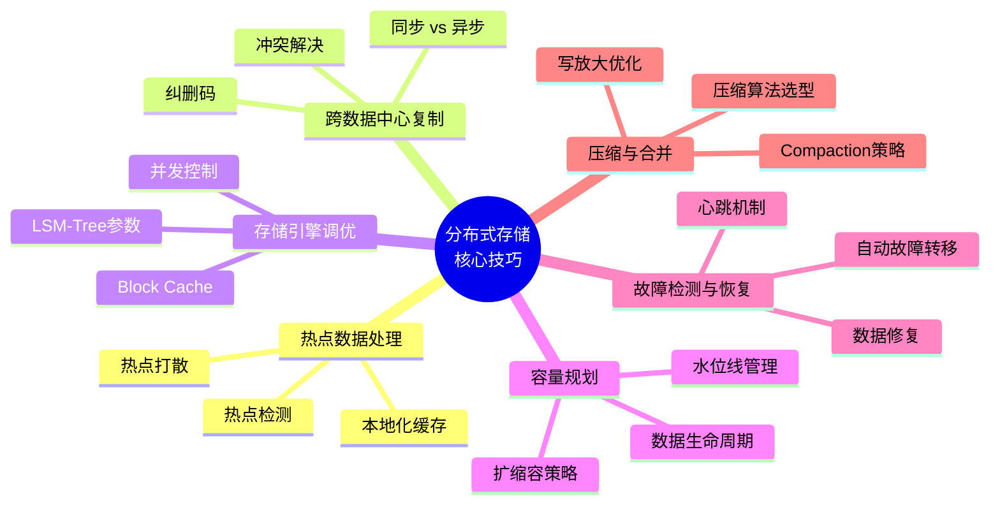

# 分布式存储核心技巧

## 本节定位

理论基础章节阐述了分布式存储的"道"——分片、复制、一致性的原理与权衡。本节聚焦"术"与"器"，将理论转化为工程实践中必须掌握的核心技巧。这些技巧直接决定了分布式存储系统在真实生产环境中的表现：能否扛住热点流量、能否跨越地理边界保持一致、能否在故障时自动恢复、能否长期稳定运行而不因配置不当逐步退化。

本节涵盖六大核心技巧领域：



---

## 一、热点数据处理

### 1.1 什么是热点

热点（Hotspot）是指数据访问负载在时间或空间上高度集中于少数分片或节点的现象。热点问题在分布式存储中尤为致命——因为分片的初衷是将负载均匀分散，而热点恰恰打破了这种均匀性。

热点分为两类：

- **时间热点（Temporal Hotspot）**：短时间内大量请求集中在某个数据区域，例如电商大促期间对商品详情的集中访问
- **空间热点（Spatial Hotspot）**：数据的天然分布导致某些分片的负载始终高于其他分片，例如社交网络中头部用户的粉丝列表

### 1.2 热点检测

在解决热点之前，首先要能发现它。以下是三种实用的检测方法：

**方法一：分片级别监控**

在每个分片（Region/Tablet/Shard）上记录QPS、延迟、CPU利用率，通过Grafana等可视化工具观察分片间是否存在显著的负载差异。

```bash
# TiKV Region级别的热点检测
tiup ctl tikv --host 127.0.0.1:20160 region-properties <region-id>

# 检查热点Region的读写QPS
curl http://<tikv-host>:20180/api/v1/status | jq '.region_cpu_usage'
```

当某个分片的QPS超过集群平均值的3倍以上，即可认定为热点。

**方法二：访问日志分析**

对访问日志进行采样分析，统计每个key的访问频率。适合发现"明星key"——被高频访问的单个key。

```python
# 简单的热点key检测脚本
from collections import Counter
import re

def detect_hot_keys(log_file, top_n=20, threshold=100):
    """从访问日志中检测热点key"""
    key_counter = Counter()
    with open(log_file) as f:
        for line in f:
            # 提取key字段（根据实际日志格式调整正则）
            match = re.search(r'key=(\S+)', line)
            if match:
                key_counter[match.group(1)] += 1

    hot_keys = [(k, v) for k, v in key_counter.most_common(top_n) if v > threshold]
    return hot_keys
```

**方法三：客户端采样统计**

在客户端SDK层面埋点，采样统计各分片的请求分布。TiKV的Hot Read/Hot Write调度器就是基于这种方法实现的。

### 1.3 热点打散策略

发现热点后，有以下几种应对策略：

**策略一：Key Prefix随机化**

将热点key打散为多个子key，通过添加随机后缀将单个热点key的流量分散到多个分片。

```python
import random

def write_with_salt(hot_key, value, num_buckets=16):
    """将热点key分散到多个bucket中"""
    bucket = random.randint(0, num_buckets - 1)
    actual_key = f"{hot_key}:{bucket:02d}"
    storage.put(actual_key, value)

def read_with_merge(hot_key, num_buckets=16):
    """读取时合并所有bucket的结果"""
    results = []
    for i in range(num_buckets):
        val = storage.get(f"{hot_key}:{i:02d}")
        if val is not None:
            results.append(val)
    return merge_results(results)
```

这种方式适用于可合并的聚合型数据（如计数器、排行榜），不适用于单值型数据。

**策略二：本地化缓存**

在应用层对热点key进行本地缓存，减少对存储层的直接访问。这是最常用、最直接的热点应对方案。

```python
from functools import lru_cache
import time

class LocalCache:
    """带TTL的本地缓存，专为热点key设计"""
    def __init__(self, ttl_seconds=5, max_size=1000):
        self.cache = {}
        self.ttl = ttl_seconds
        self.max_size = max_size

    def get(self, key):
        if key in self.cache:
            value, ts = self.cache[key]
            if time.time() - ts < self.ttl:
                return value
            else:
                del self.cache[key]
        return None

    def put(self, key, value):
        if len(self.cache) >= self.max_size:
            # LRU淘汰：移除最旧的条目
            oldest_key = min(self.cache, key=lambda k: self.cache[k][1])
            del self.cache[oldest_key]
        self.cache[key] = (value, time.time())

# 使用示例
local_cache = LocalCache(ttl_seconds=3, max_size=5000)

def read_hot_key(key):
    # L1: 本地缓存
    cached = local_cache.get(key)
    if cached:
        return cached
    # L2: 分布式存储
    value = storage.get(key)
    if value:
        local_cache.put(key, value)
    return value
```

本地缓存的关键设计要素：

| 参数 | 建议值 | 说明 |
|------|--------|------|
| TTL | 1-10秒 | 太短无法减轻压力，太长数据不一致严重 |
| 缓存容量 | 1K-10K条 | 根据热点key数量和内存预算决定 |
| 淘汰策略 | LRU | 热点key通常有时间局部性 |
| 命中率目标 | >80% | 低于此值说明TTL过短或key分布过于分散 |

**策略三：Range分片自动分裂**

对于Range分片的系统（如TiKV、HBase），当某个Region的负载超过阈值时，系统会自动将该Region分裂为两个较小的Region，将热点分散到更多节点。

```bash
# TiKV手动触发Region分裂（适用于可预测的热点场景）
tiup ctl tikv --host 127.0.0.1:20160 region-split <split_key>

# Cassandra: 手动拆分热点分区
ALTER TABLE my_keyspace.my_table WITH compaction = {'class': 'SizeTieredCompactionStrategy'}
  AND split_allowed = true;
```

**策略四：写入流量本地化（Dynamo模式）**

在无主复制架构中，可以让写入协调者优先将请求路由到本机房/本区域的副本，减少跨机房流量。Dynamo论文中描述了这种"本地化仲裁"策略。

### 1.4 热点预防

最好的热点处理方式是预防。以下是预防热点的工程实践：

- **行键设计时预留散列空间**：例如使用 `{user_id_hash:4}_{user_id}` 格式，既有散列分布能力，又能按原始key查询
- **监控先行**：在每个分片上部署QPS监控和告警，设置热点阈值（如单分片QPS > 集群平均×3即告警）
- **容量预留**：核心业务的存储集群预留至少30%的容量余量，确保在流量突增时有分裂和迁移的空间

---

## 二、跨数据中心复制

### 2.1 为什么需要跨数据中心

跨数据中心（Multi-DC）复制解决三个核心问题：

1. **容灾**：单个数据中心故障（地震、断电、网络割接）时，其他数据中心可以接管服务
2. **就近访问**：将数据副本放置在离用户最近的数据中心，降低访问延迟
3. **合规**：某些国家/地区要求数据存储在本地（如GDPR要求欧盟用户数据留在欧盟）

### 2.2 同步 vs 异步复制

跨数据中心复制的核心决策是同步还是异步：

| 维度 | 同步复制 | 异步复制 |
|------|---------|---------|
| 数据一致性 | 强一致 | 最终一致 |
| 写入延迟 | 受最远DC的RTT影响（通常50-200ms） | 与本地DC写入相同（<10ms） |
| 可用性 | 任一DC不可用则写入失败 | 本地DC可用即可写入 |
| 适用场景 | 金融交易、订单系统 | 用户行为日志、缓存数据 |
| 代表系统 | Spanner（TrueTime）、CockroachDB | Cassandra、DynamoDB Global Tables |

**半同步模式（Recommended）**：写入本地DC后同步返回，异步复制到远端DC。兼顾本地写入性能和跨DC数据保护。Cassandra的 `LOCAL_QUORUM` 一致性级别就是这种模式——写入时等待本地DC的多数副本确认，远端DC异步复制。

```cql
-- Cassandra: 本地DC写入等待多数确认，跨DC异步
INSERT INTO users (id, name) VALUES (uuid(), 'Alice')
USING CONSISTENCY LOCAL_QUORUM;

-- 读取时也使用LOCAL_QUORUM，保证本地DC内强一致
SELECT * FROM users WHERE id = ? USING CONSISTENCY LOCAL_QUORUM;
```

### 2.3 冲突检测与解决

多DC同时写入同一数据时会产生冲突。三种主流冲突解决机制：

**Last-Writer-Wins（LWW）**

基于物理时间戳，最新写入覆盖旧写入。简单高效但可能丢失并发写入。

// LWW示意
DC-A: Put(key, value_v1, timestamp=100)
DC-B: Put(key, value_v2, timestamp=110)

// 结果: key = value_v2（DC-A的写入被静默丢弃）

适用场景：配置数据、用户偏好设置等丢数据可接受的场景。

**向量时钟（Vector Clock）**

Dynamo论文的经典方案。每个写入携带一个向量时钟，记录每个节点的逻辑时钟。读取时检测是否存在冲突（向量时钟互不支配），由应用层或协调者解决。

// 向量时钟示例
初始状态: DC-A=[], DC-B=[]
DC-A写入: VC = [A:1]
DC-B写入: VC = [B:1]

// 两个VC互不支配 → 检测到冲突
// 解决方式: 应用层合并 或 指定规则（如合并购物车）

**CRDT（Conflict-free Replicated Data Type）**

设计特殊的数据结构，使得任意顺序的合并操作都能收敛到一致状态，无需人工干预。

```python
# G-Counter CRDT示例：只支持增减的计数器
class GCounter:
    def __init__(self, node_id):
        self.node_id = node_id
        self.counts = {}  # {node_id: count}

    def increment(self, amount=1):
        self.counts[self.node_id] = self.counts.get(self.node_id, 0) + amount

    def merge(self, other):
        """合并两个G-Counter，取每个节点的最大值"""
        for node, count in other.counts.items():
            self.counts[node] = max(self.counts.get(node, 0), count)

    @property
    def value(self):
        return sum(self.counts.values())

# 使用示例
counter_a = GCounter("DC-A")
counter_a.increment(5)

counter_b = GCounter("DC-B")
counter_b.increment(3)

counter_a.merge(counter_b)
# counter_a.value = 8，两个DC最终一致
```

常见CRDT类型：

| CRDT类型 | 操作 | 适用场景 |
|----------|------|---------|
| G-Counter | 只增计数 | 点赞数、浏览量 |
| PN-Counter | 增减计数 | 账户余额 |
| OR-Set | 添加/移除集合 | 标签系统、购物车 |
| LWW-Register | 最新写入寄存器 | 配置项 |
| MV-Register | 多版本寄存器 | 文档协作 |

### 2.4 纠删码（Erasure Coding）

纠删码是跨数据中心存储中降低存储成本的关键技术。相比简单复制（3副本 = 300%存储开销），纠删码可以用更少的存储实现相同甚至更高的持久性。

经典参数配置：Reed-Solomon (10, 4) —— 将数据编码为14个分片，任意10个即可恢复原始数据。存储开销140%（vs 3副本的300%），持久性更高。

```bash
# Ceph集群配置纠删码
ceph osd pool create my_ec_pool 128 128
ceph osd pool set my_ec_pool erasure_code_profile myprofile

# 查看纠删码profile
ceph osd erasure-code-profile get myprofile
# 输出:
# k=10  # 数据分片数
# m=4   # 校验分片数
# plugin=jerasure
# technique=reed_sol_van
```

纠删码的权衡：

- **优势**：存储效率高，持久性强
- **劣势**：编码/解码消耗CPU，修复时需要跨节点读取多个分片
- **适用场景**：冷数据存储、归档数据、跨DC容灾
- **不适用**：热数据、低延迟读写场景

---

## 三、存储引擎调优

### 3.1 LSM-Tree核心参数

LSM-Tree是大多数分布式存储的底层引擎（RocksDB、LevelDB、HBase的HFile）。其核心参数直接影响读写性能和存储效率。

**MemTable大小**

MemTable是内存中的写入缓冲区。MemTable越大，写入吞吐越高（更多数据在内存中排序），但内存消耗越大，且MemTable满了之后的flush操作也越耗时。

# RocksDB MemTable配置
rocksdb.write_buffer_size = 64MB        # 单个MemTable大小
rocksdb.max_write_buffer_number = 4     # MemTable最大数量
rocksdb.min_write_buffer_number_to_merge = 1  # flush前合并的MemTable数

# 经验法则：
# - 写密集场景: write_buffer_size = 128MB-256MB
# - 读密集场景: write_buffer_size = 32MB-64MB（更频繁flush减少L0文件堆积）

**Level数量与大小**

LSM-Tree将数据组织为多个Level，每个Level的大小通常是上一级的固定倍数（默认10倍）。

Level 0:  64MB     (MemTable flush后的数据，可能有重叠)
Level 1:  640MB    (经过一次Compaction，无重叠)
Level 2:  6.4GB
Level 3:  64GB
Level 4:  640GB
Level 5:  6.4TB
Level 6:  64TB

# RocksDB Level配置
rocksdb.num_levels = 7
rocksdb.max_bytes_for_level_base = 640MB    # L1大小
rocksdb.max_bytes_for_level_multiplier = 10 # 每级倍数

### 3.2 Block Cache优化

Block Cache是读取性能的关键。它缓存磁盘上的数据块（Block），避免重复的磁盘I/O。

# RocksDB Block Cache配置
rocksdb.block_cache_size = 4GB            # Block Cache总大小
rocksdb.cache_index_and_filter_blocks = true  # 将索引和过滤器也放入缓存

# 经验法则：
# Block Cache = 总内存 × 25%-50%（需与MemTable、OS Page Cache平衡）
# 读密集场景: 可以更大（50%-70%）
# 写密集场景: 可以更小（20%-30%），为MemTable留更多空间

**索引与过滤器缓存策略**

Bloom Filter可以显著减少不存在key的读取开销（避免无效的磁盘查找），但需要额外的内存和存储空间。

# Bloom Filter配置
rocksdb.filter_policy = bloomfilter:10:false
# 10 = 每个key 10 bits → 误判率约1%
# 误判率越低，内存消耗越大

# 前缀Bloom Filter（适合前缀扫描）
rocksdb.prefix_extractor = fixed:8  # 取前8字节作为前缀

### 3.3 并发控制

**多线程Compaction**

LSM-Tree的Compaction是CPU密集型操作。启用多线程Compaction可以显著提升后台Compaction吞吐量，减少写停顿。

# RocksDB多线程Compaction
rocksdb.max_background_compactions = 4  # Compaction线程数
rocksdb.max_background_flushes = 2      # Flush线程数
rocksdb.max_subcompactions = 4          # 单次Compaction的子任务数

# 经验法则：
# Compaction线程数 = CPU核心数的25%-50%
# Flush线程数 = 2-4（通常不需要太多）

**写入流水线**

现代LSM-Tree引擎支持流水线写入：MemTable在flush的同时，新数据可以继续写入下一个MemTable，两者并行进行。

# 流水线写入
rocksdb.enable_write_thread_adaptive_yield = true
rocksdb.allow_concurrent_memtable_write = true
rocksdb.max_write_buffer_number = 4  # 至少4个才能有效流水线化

---

## 四、容量规划与数据生命周期管理

### 4.1 容量规划基础公式

容量规划是分布式存储运维的核心技能。规划不当的后果是：规划过多导致资源浪费，规划不足导致紧急扩容或服务降级。

**存储容量计算**

所需存储 = 日均写入量 × 保留天数 × 副本数 × 压缩比 × 安全系数

示例：
- 日均写入: 100GB
- 保留天数: 30天
- 副本数: 3
- 压缩比: 0.3 (压缩后为原始大小的30%)
- 安全系数: 1.5 (预留50%余量)

所需存储 = 100 × 30 × 3 × 0.3 × 1.5 = 4050GB ≈ 4TB

**IOPS与带宽计算**

所需IOPS = 日均请求数 / 86400 × 峰值系数

所需网络带宽 = (写入QPS × 平均写入大小 + 读取QPS × 平均读取大小) × 副本同步因子

示例：
- 写入QPS: 10,000, 平均写入大小: 1KB
- 读取QPS: 50,000, 平均读取大小: 4KB
- 副本同步因子: 2 (写入需要同步到1个副本)

所需带宽 = (10000 × 1KB + 50000 × 4KB) × 2 = 420MB/s ≈ 3.36Gbps

### 4.2 水位线管理

水位线是容量规划中最实用的管理工具。通过设定不同的水位线阈值，触发不同的运维动作：

| 水位线 | 存储使用率 | 动作 | 紧急程度 |
|--------|-----------|------|---------|
| 安全线 | <60% | 正常运营 | 无 |
| 预警线 | 60%-75% | 开始规划扩容，分析增长趋势 | 低 |
| 告警线 | 75%-85% | 启动扩容流程，清理过期数据 | 中 |
| 危险线 | 85%-95% | 紧急扩容，强制数据清理 | 高 |
| 熔断线 | >95% | 只接受读请求，拒绝新写入 | 紧急 |

```bash
# Prometheus告警规则示例（Ceph集群）
groups:
- name: storage_watermark
  rules:
  - alert: StorageWarningHigh
    expr: |
      (ceph_osd_stat_bytes_used / ceph_osd_stat_bytes) > 0.6
    for: 1h
    labels:
      severity: warning
    annotations:
      summary: "存储使用率超过60%，请关注扩容计划"

  - alert: StorageCriticalHigh
    expr: |
      (ceph_osd_stat_bytes_used / ceph_osd_stat_bytes) > 0.85
    for: 10m
    labels:
      severity: critical
    annotations:
      summary: "存储使用率超过85%，需紧急扩容"
```

### 4.3 数据生命周期管理（Data Lifecycle）

不是所有数据都需要同等对待。数据的访问模式通常遵循时间衰减规律——越老的数据被访问的概率越低。利用这个规律可以大幅降低存储成本。

**分层存储策略**

热数据 (0-7天)     → SSD / NVMe      → 最高IOPS，最高成本
温数据 (7-30天)    → HDD             → 中等IOPS，中等成本
冷数据 (30-90天)   → 对象存储 IA类   → 低IOPS，低成本
归档数据 (>90天)   → 对象存储 Archive → 极低访问，极低成本

以S3为例的生命周期策略：

```json
{
  "Rules": [
    {
      "ID": "TransitionToIA",
      "Status": "Enabled",
      "Transitions": [
        {
          "Days": 7,
          "StorageClass": "STANDARD_IA"
        },
        {
          "Days": 30,
          "StorageClass": "GLACIER"
        },
        {
          "Days": 90,
          "StorageClass": "DEEP_ARCHIVE"
        }
      ],
      "Expiration": {
        "Days": 365
      }
    }
  ]
}
```

**TTL自动过期**

对于不需要永久保留的数据（如日志、会话、缓存），设置TTL让存储引擎自动清理过期数据。

```bash
# RocksDB TTL配置
rocksdb.periodic_compaction_seconds = 86400  # 24小时触发一次Compaction清理

# Cassandra TTL
INSERT INTO events (id, payload) VALUES (uuid(), '...')
USING TTL 2592000;  -- 30天后自动过期

# Redis TTL
SETEX session:abc 3600 "user_data"  -- 1小时后自动删除
```

### 4.4 扩缩容策略

**在线扩容（推荐）**

大多数现代分布式存储支持在线扩容——添加新节点后，系统自动将部分数据迁移到新节点，无需停机。

```bash
# TiKV在线扩容
tiup scale-out tikv --host new-node-ip --ssh-user root

# Cassandra节点加入（自动触发token范围重分配）
# 将新节点加入集群后，Cassandra自动进行streaming修复
nodetool status  # 查看新节点是否加入
nodetool repair   # 手动触发修复以加速数据均衡
```

**缩容注意事项**

缩容比扩容更危险——如果被移除的节点上的数据在其他节点没有完整副本，会导致数据丢失。

```bash
# 安全缩容前的检查步骤
# 1. 确认集群健康状态
tiup cluster display <cluster-name>

# 2. 确认目标节点上的Region已充分分散
tiup ctl tikv --host <target-host>:20160 region-status

# 3. 执行安全缩容
tiup cluster scale-in <cluster-name> --node <target-node-id>
```

---

## 五、故障检测与自动恢复

### 5.1 故障检测机制

分布式存储系统中，快速准确地检测故障节点是自动恢复的前提。

**心跳检测（Heartbeat）**

节点间定期发送心跳消息，超时未收到心跳则判定节点故障。心跳间隔和超时阈值的设定需要权衡：

- **间隔太短**（如100ms）：增加网络开销，可能导致误判（网络抖动）
- **间隔太长**（如30s）：故障检测延迟高，影响恢复时间
- **推荐值**：心跳间隔1-3秒，超时阈值10-30秒

# Raft心跳配置（TiKV）
raft.heartbeat-interval = 1000       # 1秒
raft.election-timeout = 10000        # 10秒（10个心跳周期）

# Gossip协议心跳（Cassandra）
phi_convict_threshold = 8            # Phi Accrual检测器阈值
internode_compression = dc            # DC内压缩心跳流量

**Phi Accrual故障检测器**

Cassandra使用Phi Accrual检测器（Hayashibara et al., 2004），它不是简单的超时判断，而是基于历史心跳间隔计算"怀疑度"（Phi值）。当Phi值超过阈值时判定故障。

// Phi Accrual检测器工作原理
// 1. 收集历史心跳间隔，建立正态分布模型
// 2. 计算当前等待时间对应的Phi值
// 3. Phi > threshold → 判定为故障

// Phi值含义：
// Phi = 1  → 90%概率故障
// Phi = 2  → 99%概率故障
// Phi = 3  → 99.9%概率故障
// Phi = 8  → 几乎确定故障（Cassandra默认阈值）

// 优势：自适应网络状况，网络拥塞时自动放宽阈值，减少误判

### 5.2 自动故障转移

故障检测到后，系统需要自动将受影响的数据和服务转移到健康节点。

**Raft Leader选举**

当Raft组的Leader节点故障后，Follower在election timeout后发起选举，选出新的Leader。

# Raft选举流程
Follower_A 等待 election timeout → 未收到Leader心跳
Follower_A → 其他Follower: RequestVote(term=current+1)
如果收到多数票 → Follower_A 成为新Leader
新Leader → 客户端: 服务恢复正常

# 故障转移时间 = election_timeout + 选举完成时间
# 通常在 10-30秒 内完成

**Region调度（TiKV）**

TiKV的PD（Placement Driver）组件持续监控Region的Leader分布，当检测到某个节点故障时，自动将该节点上的Region Leader迁移到其他健康节点。

```bash
# TiKV故障转移时间线（典型场景）
# T+0s:   PD检测到TiKV节点心跳超时
# T+10s:  PD标记节点为Down状态
# T+10s+: PD开始调度Region Leader迁移
# T+30s+: 大部分Region已完成迁移，服务恢复
```

### 5.3 数据修复

故障转移后，部分Region可能只有2个副本（正常应为3个）。数据修复机制会自动创建新副本，恢复冗余度。

**Raft Learner模式**

新加入的副本先以Learner身份同步数据，追上进度后再转为Follower。避免新节点拖慢正常的读写操作。

# Raft Learner工作流程
1. PD发现Region只有2个副本
2. PD指定新节点创建Learner副本
3. Learner通过Raft日志同步，追赶Leader进度
4. 追上后，Learner提升为Follower，参与投票和读写

**Merkle Tree反熵修复**

对于无主复制架构（如Cassandra），使用Merkle Tree对比相邻节点的数据差异，然后只同步差异部分。

```bash
# Cassandra手动触发反熵修复
nodetool repair keyspace_name table_name

# 自动修复（推荐）
# cassandra.yaml配置
repair_session_max_time: 3600      # 修复会话最长1小时
repair_anticompaction_threshold: 20  # 修复后触发反压Compaction
```

---

## 六、压缩与合并策略优化

### 6.1 压缩算法选型

压缩可以显著降低存储成本，但会消耗CPU。选择合适的压缩算法需要在存储效率和计算开销之间找到平衡。

| 算法 | 压缩比 | 压缩速度 | 解压速度 | CPU消耗 | 适用场景 |
|------|--------|---------|---------|---------|---------|
| LZ4 | 2.1:1 | 极快 | 极快 | 低 | 默认选择，通用场景 |
| Zstd | 2.7:1 | 快 | 极快 | 中 | 平衡型，推荐首选 |
| Snappy | 1.8:1 | 极快 | 极快 | 极低 | 延迟敏感场景 |
| Zlib(6) | 3.0:1 | 慢 | 快 | 高 | 冷数据、归档 |
| Zlib(1) | 2.3:1 | 中等 | 快 | 中 | 温数据 |

# RocksDB压缩配置
# Level 0-1: 不压缩或轻量压缩（热数据，需要快速读写）
rocksdb.compression_per_level = [0, LZ4, LZ4, Zstd, Zstd, Zstd, Zstd]

# Level 2+: 逐步使用更强压缩（冷数据，更注重存储效率）
# L2-L3: LZ4 (快压缩，适中压缩比)
# L4-L6: Zstd (高压缩比，冷数据很少被访问)

# 全局默认压缩
rocksdb.compression = Zstd
rocksdb.compression_opts.level = 3  # Zstd压缩级别

**分层压缩策略**

一个实用的工程经验：对LSM-Tree的不同Level使用不同的压缩策略。Level越低（数据越热），使用越轻量的压缩；Level越高（数据越冷），使用越强的压缩。

### 6.2 Compaction策略

Compaction是LSM-Tree的核心操作——将多个小的SSTable文件合并为更大的文件，同时清理过期和删除的数据。Compaction策略直接影响写放大、读放大和空间放大。

**Size-Tiered Compaction（STCS）**

将大小相近的SSTable合并为一个更大的SSTable。简单但可能导致大量空间放大（合并前需要临时存储）。

# STCS工作方式
Level 0: [SSTable_64MB] × 4  →  合并为 [SSTable_256MB]
Level 1: [SSTable_256MB] × 4  →  合并为 [SSTable_1GB]
...

# 优点: 写放大低
# 缺点: 空间放大高（最坏情况需要2倍空间），读放大中等
# 适用: 写密集型工作负载

**Leveled Compaction（LCS）**

每个Level只允许Level N的数据量为Level N-1的10倍。Compaction时从Level N中选择一个SSTable，与Level N+1中key范围重叠的SSTable合并。

# LCS工作方式
L0: [SSTable_a, SSTable_b, SSTable_c, SSTable_d]
     ↓ Compaction
L1: [SSTable_1][SSTable_2][SSTable_3]...[SSTable_10]
     ↓ Compaction (每个SSTable与L2中重叠部分合并)
L2: [SSTable_1]...[SSTable_100]

# 优点: 读放大最低（每个Level最多读1个文件），空间放大低
# 缺点: 写放大高（每次Compaction涉及大量数据重写）
# 适用: 读密集型工作负载

**FIFO Compaction**

不做合并，只按时间删除最旧的SSTable。适用于TTL数据（如时序数据、日志）。

# FIFO Compaction
rocksdb.compaction_style = FIFO
rocksdb.max_table_files_size = 10GB  # 超过此大小删除最旧文件

# 适用: 纯写入、有TTL的场景
# 不适用: 需要更新或删除的场景

**Universal Compaction**

RocksDB的自适应策略，根据写放大和空间放大的权衡自动选择Compaction方式。

# Universal Compaction配置
rocksdb.compaction_style = Universal
rocksdb.compaction_options_universal.size_ratio = 1    # 相邻文件大小比
rocksdb.compaction_options_universal.max_size_amplification_percent = 200

### 6.3 写放大优化

写放大（Write Amplification）是LSM-Tree的核心挑战——一次用户写入可能触发多级Compaction，实际写入磁盘的数据量远大于用户写入量。写放大会消耗磁盘I/O带宽，降低SSD寿命。

**写放大计算**

写放大 = 磁盘实际写入量 / 用户逻辑写入量

典型值:
- STCS: 10-15倍
- LCS: 10-30倍
- UCS (Universal): 5-20倍

**优化手段**

1. **增大MemTable**：更多的数据在内存中排序后写入，减少L0文件数量和Compaction频率
2. **调整Level倍数**：将Level倍数从10减小到8或4，减少单次Compaction的数据量
3. **Direct I/O**：绕过OS Page Cache直接写磁盘，避免双缓存

# RocksDB写放大优化配置
rocksdb.write_buffer_size = 256MB           # 大MemTable
rocksdb.max_bytes_for_level_multiplier = 8  # 降低Level倍数
rocksdb.use_direct_io_for_flush_and_compaction = true  # Direct I/O
rocksdb.allow_mmap_read = false             # 禁用mmap，使用Direct I/O

---

## 七、监控体系搭建

### 7.1 核心监控指标

分布式存储的监控需要覆盖四个维度：

| 维度 | 关键指标 | 告警阈值（参考） |
|------|---------|----------------|
| 延迟 | P50/P99/P999读写延迟 | P99 > SLA的2倍 |
| 吞吐 | 读写QPS、流量带宽 | 接近容量上限的80% |
| 容量 | 存储使用率、分片数 | 使用率 > 75% |
| 可用 | 副本完整率、节点存活数 | 副本完整率 < 100% |

### 7.2 监控工具组合

```bash
# 基础设施监控
node_exporter + Prometheus + Grafana  # CPU/内存/磁盘/网络

# 存储引擎监控
# TiKV: 指标在 http://<tikv-host>:20180/metrics
# Cassandra: nodetool tpstats + Prometheus JMX Exporter
# Ceph: ceph -s + ceph osd perf

# 自定义业务指标
# 在应用层埋点，上报到Prometheus
```

### 7.3 常用诊断命令

```bash
# 系统级诊断
top -c                          # CPU和内存概览
iostat -x 1                     # 磁盘I/O详细信息
ss -s                           # TCP连接状态
vmstat 1                        # 系统整体性能

# 存储引擎诊断（RocksDB/TiKV）
# 查看SSTable文件分布
ls -la /data/tikv/db/*.sst | awk '{print $5}' | sort -n | tail -10

# 查看Compaction状态
curl http://<tikv>:20180/api/v1/region/merge/latest

# Cassandra诊断
nodetool status                 # 集群状态
nodetool cfstats                # 表级统计
nodetool tablehistograms ks.tbl # 读写延迟直方图
```

---

## 实践检查清单

| 检查项 | 具体内容 | 频率 |
|--------|---------|------|
| 热点检测 | 监控各分片QPS分布，标记超过均值3倍的分片 | 持续 |
| 容量水位 | 检查存储使用率，确认处于安全线以下 | 每日 |
| 副本完整性 | 确认所有Region/Partition的副本数满足要求 | 每日 |
| Compaction健康 | 检查Compaction延迟和队列长度 | 每周 |
| 备份验证 | 对恢复演练验证备份可用性 | 每月 |
| 容量预测 | 根据增长趋势预测未来3个月容量需求 | 每月 |
