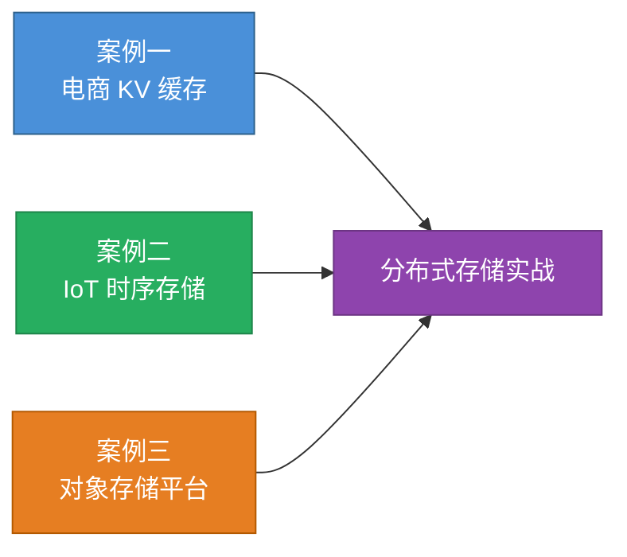
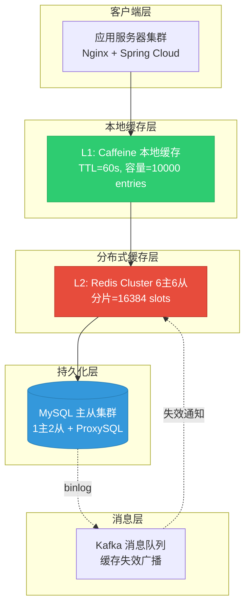
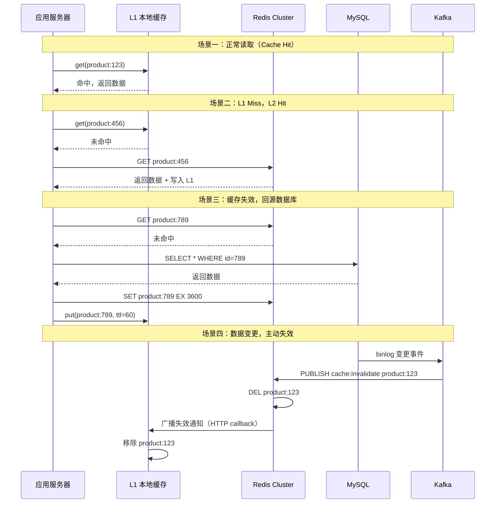
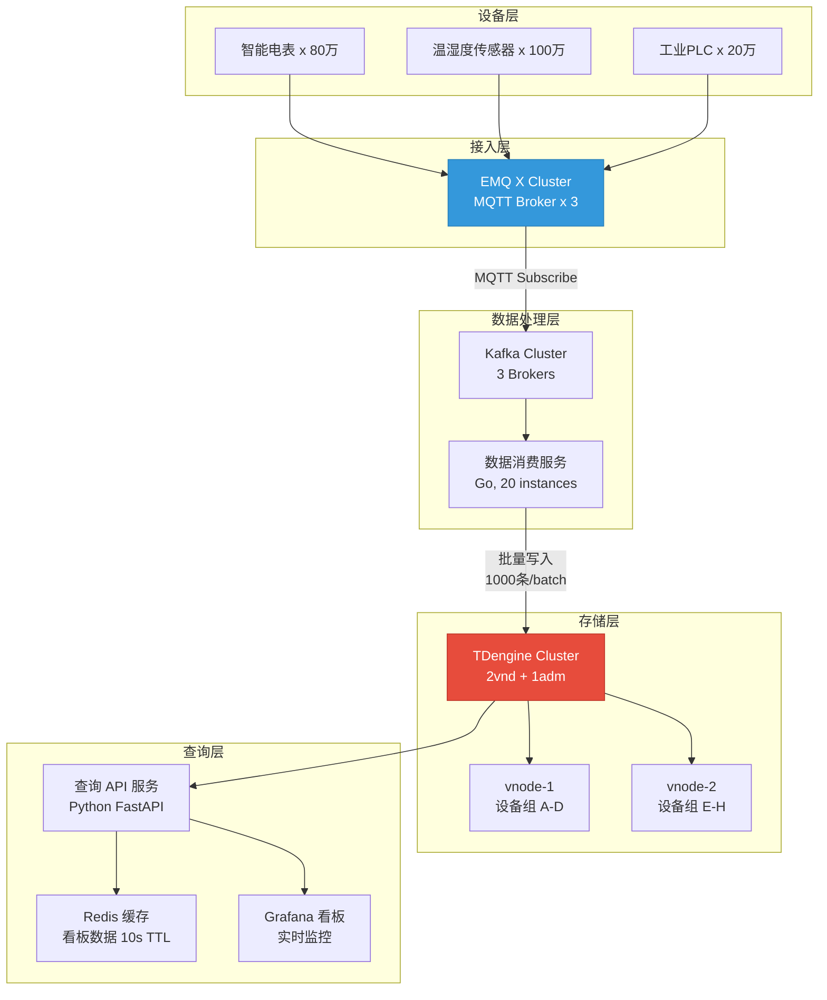
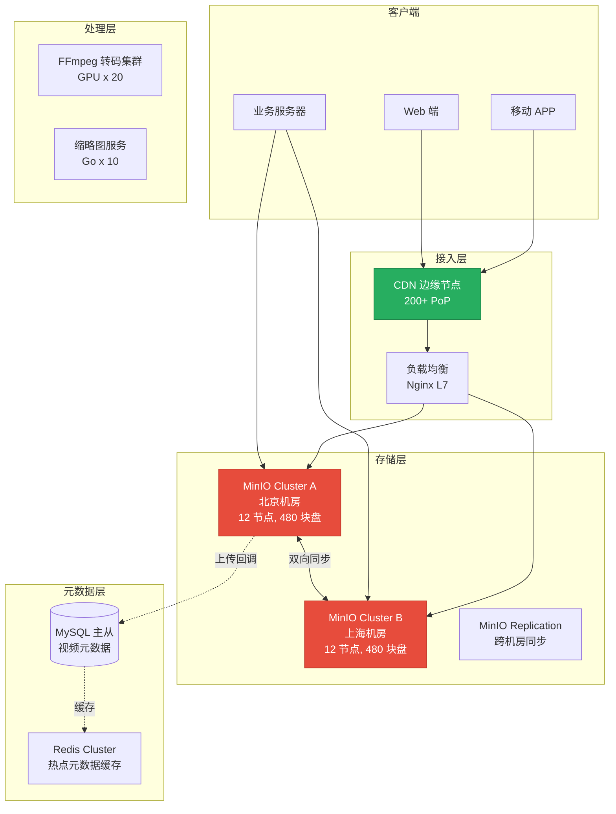
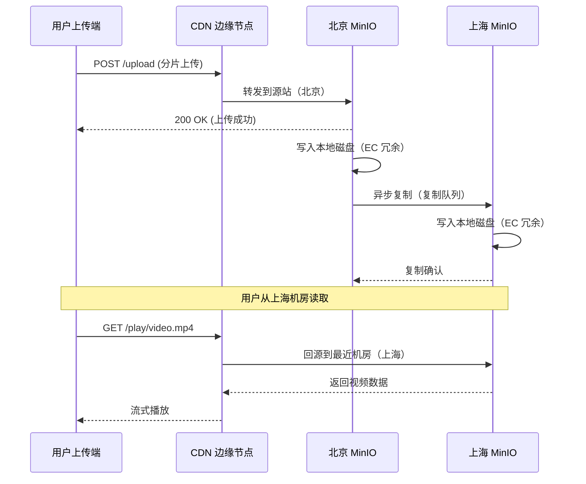
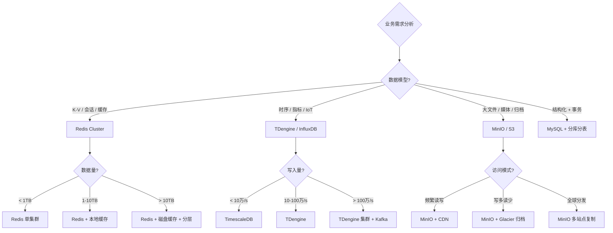

# 实战案例

本章通过三个完整的分布式存储实战案例，覆盖电商高并发 KV 缓存、物联网时序数据平台、以及海量媒体对象存储三大典型场景。每个案例从问题背景出发，经历架构设计、方案选型、实现落地、性能调优，到最终的监控运维与经验沉淀，完整呈现分布式存储在真实生产环境中的应用全过程。



---

## 案例一：电商平台分布式 KV 缓存体系

### 1.1 业务场景与痛点

**公司背景**：某头部电商平台，日活用户 2000 万，日订单量 500 万+，大促峰值 QPS 达到 50 万。

**核心痛点**：

| 痛点 | 表现 | 业务影响 |
|------|------|----------|
| 数据库扛不住高并发 | MySQL 主库 CPU 持续 95%，慢查询激增 | 核心接口超时率飙升至 12% |
| Session 存储不可靠 | 单机 Redis 偶发 OOM，主从切换后会话丢失 | 用户频繁被踢出登录态 |
| 商品详情页响应慢 | 热点商品（秒杀品）页面加载 > 3 秒 | 大促期间跳出率高达 40% |
| 缓存一致性差 | 库存扣减出现超卖 | 客诉量单日破千 |

**架构演进需求**：从单机 MySQL → 引入 Redis 单机 → Redis 哨兵 → Redis Cluster → 多级缓存体系，需要系统性解决高可用、高性能、高一致性三大问题。

### 1.2 架构设计

#### 整体架构



#### 分片策略设计

采用一致性哈希 + 虚拟节点方案，将 16384 个 slot 映射到 6 个主节点：

```python
# 一致性哈希分片核心逻辑
import hashlib
from bisect import bisect_right

class ConsistentHash:
    """一致性哈希环，带虚拟节点支持"""
    
    def __init__(self, nodes: list[str], virtual_nodes: int = 150):
        self.ring = {}
        self.sorted_keys = []
        self.virtual_nodes = virtual_nodes
        
        for node in nodes:
            self._add_node(node)
    
    def _hash(self, key: str) -> int:
        return int(hashlib.md5(key.encode()).hexdigest(), 16)
    
    def _add_node(self, node: str):
        """每个物理节点生成 virtual_nodes 个虚拟节点"""
        for i in range(self.virtual_nodes):
            virtual_key = f"{node}:v{i}"
            h = self._hash(virtual_key)
            self.ring[h] = node
            self.sorted_keys.append(h)
        self.sorted_keys.sort()
    
    def get_node(self, key: str) -> str:
        """根据 key 确定归属节点"""
        if not self.ring:
            raise ValueError("Hash ring is empty")
        h = self._hash(key)
        idx = bisect_right(self.sorted_keys, h) % len(self.sorted_keys)
        return self.ring[self.sorted_keys[idx]]
    
    def remove_node(self, node: str):
        """移除节点，仅影响相邻节点的数据"""
        keys_to_remove = [k for k, v in self.ring.items() if v == node]
        for k in keys_to_remove:
            del self.ring[k]
            self.sorted_keys.remove(k)


# 模拟 6 主节点分布
nodes = [f"redis-{i}:6379" for i in range(6)]
ring = ConsistentHash(nodes, virtual_nodes=150)

# 验证 key 分布均匀性
from collections import Counter
distribution = Counter()
for i in range(100000):
    key = f"product:{i}"
    node = ring.get_node(key)
    distribution[node] += 1

for node, count in sorted(distribution.items()):
    print(f"{node}: {count} keys ({count/1000:.1f}%)")
# 预期：每个节点约 16.6%（1/6），偏差 < 2%
```

#### 多级缓存一致性方案



### 1.3 核心实现代码

#### Redis Cluster 客户端封装

```python
import redis
from redis.cluster import RedisCluster, ClusterNode
from typing import Optional, Any
import json
import logging

logger = logging.getLogger(__name__)


class DistributedCache:
    """分布式缓存封装，支持多级缓存、批量操作、缓存预热"""
    
    def __init__(
        self,
        cluster_nodes: list[dict],
        read_from_replicas: bool = True,
        retry_on_timeout: bool = True,
        socket_timeout: float = 2.0,
        decode_responses: bool = True,
    ):
        startup_nodes = [
            ClusterNode(host=n["host"], port=n["port"])
            for n in cluster_nodes
        ]
        self.rc = RedisCluster(
            startup_nodes=startup_nodes,
            read_from_replicas=read_from_replicas,
            retry_on_timeout=retry_on_timeout,
            socket_timeout=socket_timeout,
            decode_responses=decode_responses,
            max_connections_per_node=50,
        )
        self._stats = {"hit": 0, "miss": 0}
    
    def get(self, key: str) -> Optional[Any]:
        """读取缓存，miss 时返回 None"""
        try:
            val = self.rc.get(key)
            if val is not None:
                self._stats["hit"] += 1
                return json.loads(val)
            self._stats["miss"] += 1
            return None
        except redis.exceptions.ClusterDownError:
            logger.warning("Redis cluster down, key=%s", key)
            self._stats["miss"] += 1
            return None
    
    def set(
        self, key: str, value: Any, ttl: int = 3600, nx: bool = False
    ) -> bool:
        """写入缓存，nx=True 时仅当 key 不存在时写入"""
        try:
            serialized = json.dumps(value, ensure_ascii=False)
            return self.rc.set(key, serialized, ex=ttl, nx=nx)
        except redis.exceptions.ClusterDownError:
            logger.error("Redis cluster down on SET key=%s", key)
            return False
    
    def delete(self, key: str) -> bool:
        """删除缓存"""
        try:
            return self.rc.delete(key) > 0
        except redis.exceptions.ClusterDownError:
            logger.error("Redis cluster down on DEL key=%s", key)
            return False
    
    def pipeline_set(self, items: dict[str, tuple[Any, int]]) -> int:
        """批量写入，items = {key: (value, ttl)}"""
        success = 0
        with self.rc.pipeline(transaction=False) as pipe:
            for key, (value, ttl) in items.items():
                pipe.set(key, json.dumps(value, ensure_ascii=False), ex=ttl)
            results = pipe.execute()
            success = sum(1 for r in results if r)
        return success
    
    def get_multi(self, keys: list[str]) -> dict[str, Any]:
        """批量读取，返回 {key: value}"""
        if not keys:
            return {}
        try:
            values = self.rc.mget(keys)
            result = {}
            for key, val in zip(keys, values):
                if val is not None:
                    result[key] = json.loads(val)
                    self._stats["hit"] += 1
                else:
                    self._stats["miss"] += 1
            return result
        except redis.exceptions.ClusterDownError:
            logger.error("Redis cluster down on MGET")
            return {}
    
    def cache_aside(
        self,
        key: str,
        loader_fn,
        ttl: int = 3600,
        prefix: str = "biz",
    ) -> Optional[Any]:
        """Cache-Aside 模式：先查缓存，miss 时回源并回填"""
        full_key = f"{prefix}:{key}"
        
        # 第一步：查缓存
        cached = self.get(full_key)
        if cached is not None:
            return cached
        
        # 第二步：回源
        try:
            data = loader_fn(key)
        except Exception as e:
            logger.error("Loader failed for key=%s: %s", key, e)
            return None
        
        if data is None:
            # 空值缓存，防止缓存穿透，TTL 缩短为 60 秒
            self.set(full_key, None, ttl=60)
            return None
        
        # 第三步：回填缓存
        self.set(full_key, data, ttl=ttl)
        return data
    
    def hotkey_guard(
        self,
        key: str,
        loader_fn,
        ttl: int = 3600,
        prefix: str = "hot",
    ) -> Optional[Any]:
        """热点 key 防护：使用 setnx 防止缓存击穿"""
        full_key = f"{prefix}:{key}"
        
        cached = self.get(full_key)
        if cached is not None:
            return cached
        
        # 使用 nx 模式，只有一个线程能回源
        lock_key = f"lock:{full_key}"
        locked = self.rc.set(lock_key, "1", ex=10, nx=True)
        
        if locked:
            try:
                data = loader_fn(key)
                if data is not None:
                    self.set(full_key, data, ttl=ttl)
                else:
                    self.set(full_key, None, ttl=60)
                return data
            finally:
                self.rc.delete(lock_key)
        else:
            # 其他线程等待后重试
            import time
            for _ in range(10):
                time.sleep(0.1)
                cached = self.get(full_key)
                if cached is not None:
                    return cached
            return None
    
    @property
    def hit_rate(self) -> float:
        total = self._stats["hit"] + self._stats["miss"]
        return self._stats["hit"] / total if total > 0 else 0.0


# ---- 使用示例 ----
cache = DistributedCache(
    cluster_nodes=[
        {"host": "10.0.1.1", "port": 6379},
        {"host": "10.0.1.2", "port": 6379},
        {"host": "10.0.1.3", "port": 6379},
        {"host": "10.0.2.1", "port": 6379},
        {"host": "10.0.2.2", "port": 6379},
        {"host": "10.0.2.3", "port": 6379},
    ]
)

# Cache-Aside 模式读取商品详情
product = cache.cache_aside(
    key="10086",
    loader_fn=lambda pid: db.query(f"SELECT * FROM products WHERE id={pid}"),
    ttl=3600,
    prefix="product",
)
print(f"Cache hit rate: {cache.hit_rate:.2%}")
```

### 1.4 缓存三大问题解决方案

| 问题 | 场景描述 | 解决方案 | 实现要点 |
|------|----------|----------|----------|
| **缓存穿透** | 查询不存在的数据，每次都打到 DB | 布隆过滤器 + 空值缓存 | 布隆过滤器误判率设为 0.01%，空值 TTL=60s |
| **缓存击穿** | 热点 key 过期瞬间，大量请求同时回源 | 互斥锁 + 逻辑过期 | setnx 加锁，或 value 内嵌过期时间异步刷新 |
| **缓存雪崩** | 大量 key 同时过期，DB 瞬间被压垮 | TTL 随机化 + 限流降级 | TTL 加随机偏移量 ±10%，接入 Sentinel 限流 |

### 1.5 大促保障方案

**预热阶段（大促前 2 小时）**：

```bash
# Redis Cluster 内存预分配
redis-cli --cluster rebalance 10.0.1.1:6379 --cluster-use-empty-masters

# 热点数据预加载脚本
import csv

def preload_hot_products(cache: DistributedCache, csv_path: str):
    """从 CSV 加载 Top 10000 热门商品到缓存"""
    batch = {}
    with open(csv_path) as f:
        reader = csv.DictReader(f)
        for i, row in enumerate(reader):
            key = f"product:{row['id']}"
            value = {
                "id": row["id"],
                "name": row["name"],
                "price": float(row["price"]),
                "stock": int(row["stock"]),
                "sales": int(row["sales"]),
            }
            # TTL 设置为 4-5 小时（大促持续时间 + 缓冲）
            import random
            ttl = 14400 + random.randint(0, 3600)
            batch[key] = (value, ttl)
            
            if len(batch) >= 500:
                cache.pipeline_set(batch)
                print(f"Preloaded {i+1} products...")
                batch = {}
    
    if batch:
        cache.pipeline_set(batch)
    print("Preload complete.")

# 执行预热
preload_hot_products(cache, "/data/hot_products.csv")
```

**流量管控方案**：

```mermaid
graph LR
    A[全量流量] --> B{Nginx 限流<br>令牌桶 10万/s}
    B -->|通过| C[应用层限流<br>Sentinel 热点参数]
    B -->|拒绝| D[降级页面<br>"排队中..."]
    C -->|通过| E[Redis Cluster]
    C -->|拒绝| F[直接返回缓存<br>旧数据兜底]

    style B fill:#e74c3c,stroke:#c0392b,color:#fff
    style C fill:#f39c12,stroke:#d68910,color:#fff
```

### 1.6 监控体系

```yaml
# Prometheus 告警规则
groups:
  - name: redis_cluster_alerts
    rules:
      - alert: RedisClusterHighLatency
        expr: histogram_quantile(0.99, redis_command_duration_seconds_bucket) > 0.05
        for: 2m
        labels:
          severity: critical
        annotations:
          summary: "Redis 集群 P99 延迟超过 50ms"
          
      - alert: RedisClusterHighMemory
        expr: redis_memory_used_bytes / redis_memory_max_bytes > 0.85
        for: 5m
        labels:
          severity: warning
        annotations:
          summary: "Redis 节点内存使用超过 85%"
          
      - alert: RedisClusterSlotMigration
        expr: redis_cluster_slots_fail > 0
        for: 1m
        labels:
          severity: critical
        annotations:
          summary: "Redis 集群存在 FAIL 状态的 slot"
```

**关键监控指标**：

| 指标 | 健康阈值 | 警告阈值 | 严重阈值 | 采集方式 |
|------|----------|----------|----------|----------|
| 命中率 | > 95% | 85%-95% | < 85% | Redis INFO + 自定义 metric |
| P99 延迟 | < 5ms | 5-50ms | > 50ms | 客户端埋点 |
| 内存使用率 | < 70% | 70%-85% | > 85% | Redis INFO memory |
| 连接数 | < 5000 | 5000-8000 | > 8000 | Redis INFO clients |
| 慢查询数 | 0/分钟 | 1-10/分钟 | > 10/分钟 | Redis SLOWLOG GET |

### 1.7 效果数据

| 指标 | 优化前 | 优化后 | 提升幅度 |
|------|--------|--------|----------|
| 接口 P99 延迟 | 500ms | 35ms | 降低 93% |
| 数据库 QPS | 50000 | 8000 | 降低 84% |
| 缓存命中率 | 60% | 97% | 提升 37 个百分点 |
| 大促峰值 QPS | 系统崩溃 | 520000 | 支撑 10x |
| 超卖事件 | 每次大促 | 0 | 彻底消除 |

---

## 案例二：物联网时序数据存储平台

### 2.1 业务场景与痛点

**公司背景**：某智能硬件公司，部署了 200 万台 IoT 设备（智能电表、温湿度传感器、工业 PLC），每台设备每 10 秒上报一次数据。

**数据量估算**：

| 参数 | 数值 |
|------|------|
| 设备总数 | 200 万台 |
| 采样频率 | 每 10 秒 1 次 |
| 单条数据大小 | 约 200 字节（设备ID + 时间戳 + 多指标） |
| 日新增数据量 | 200万 × 8640 × 200B ≈ **3.3 TB/天** |
| 月数据量 | **~100 TB/月** |
| 保留策略 | 原始数据保留 90 天，聚合数据保留 3 年 |
| 查询模式 | 实时看板（最近 1 小时）+ 历史回溯（最近 30 天）+ 趋势分析（月/年粒度） |

**核心挑战**：
- 传统 MySQL 无法承受每秒 20 万条写入
- 按时间范围查询时，全表扫描导致超时
- 数据压缩比低，存储成本飙升
- 需要支持降采样（downsampling）以生成小时/天/月级聚合数据

### 2.2 技术选型对比

| 维度 | InfluxDB | TDengine | TimescaleDB | QuestDB |
|------|----------|----------|-------------|---------|
| 写入性能 | 10-30 万/s | 100 万+/s | 10-20 万/s | 50-100 万/s |
| 压缩比 | 10:1 | 10:1 | 15:1 | 10:1 |
| SQL 兼容 | InfluxQL/Flux | 类 SQL | 完全兼容 PG | 完全兼容 PG |
| 生态成熟度 | ★★★★★ | ★★★★ | ★★★★★ | ★★★ |
| 运维复杂度 | 中 | 低 | 中 | 低 |
| 开源协议 | MIT (v2) | AGPL | Apache 2.0 | Apache 2.0 |
| 适用场景 | 通用时序 | 高吞吐设备数据 | 需要 PG 生态 | 高吞吐分析 |

**最终选型**：TDengine 3.x。理由：原生支持超级表（STable）天然适合 IoT 设备模型、写入性能最高、自带流计算和降采样、运维简单。

### 2.3 数据库架构设计



### 2.4 数据建模

TDengine 的超级表（STable）是 IoT 场景的核心抽象：每个设备类型对应一张超级表，每个设备实例对应一张子表。

```sql
-- 1. 创建数据库（设置副本数、保留策略）
CREATE DATABASE iot_data
  REPLICA 2
  KEEP 90
  DURATION 10
  BUFFER 256
  WAL_LEVEL 2
  COMP 2;

-- 2. 创建智能电表超级表
CREATE STABLE meters (
  ts        TIMESTAMP,          -- 时间戳
  current   FLOAT,              -- 电流 (A)
  voltage   FLOAT,              -- 电压 (V)
  power     FLOAT,              -- 功率 (W)
  pf        FLOAT,              -- 功率因数
  freq      FLOAT,              -- 频率 (Hz)
  temp      FLOAT               -- 设备温度 (°C)
) TAGS (
  device_id   NCHAR(64),        -- 设备编号
  region      NCHAR(32),        -- 所属区域
  line_id     NCHAR(32),        -- 线路编号
  install_date DATE             -- 安装日期
);

-- 3. 创建温湿度传感器超级表
CREATE STABLE sensors (
  ts          TIMESTAMP,
  temperature FLOAT,            -- 温度 (°C)
  humidity    FLOAT,            -- 湿度 (%)
  pm25        FLOAT,            -- PM2.5 (ug/m3)
  co2         FLOAT             -- CO2 浓度 (ppm)
) TAGS (
  device_id  NCHAR(64),
  location   NCHAR(128),        -- 安装位置
  floor      INT,               -- 楼层
  zone       NCHAR(32)          -- 区域
);

-- 4. 为每个设备自动创建子表（设备ID 作为子表名）
-- 应用层代码：
CREATE TABLE IF NOT EXISTS meters_device_0001
  USING meters TAGS ('D0001', '华东', 'L003', '2025-01-15');

-- 5. 创建降采样聚合视图（小时粒度）
CREATE TABLE meters_hourly AS
SELECT
  _wstart AS ts,
  device_id,
  AVG(current)   AS avg_current,
  MAX(current)   AS max_current,
  MIN(current)   AS min_current,
  AVG(voltage)   AS avg_voltage,
  SUM(power)     AS total_power,
  LAST(pf)       AS last_pf
FROM meters
PARTITION BY device_id
INTERVAL(1h);

-- 6. 创建降采样聚合视图（天粒度）
CREATE TABLE meters_daily AS
SELECT
  _wstart AS ts,
  device_id,
  AVG(current)   AS avg_current,
  MAX(current)   AS max_current,
  AVG(power)     AS avg_power,
  SUM(power)     AS total_energy,
  MAX(temp)      AS max_temp
FROM meters_hourly
PARTITION BY device_id
INTERVAL(1d);
```

### 2.5 高性能写入实现

```go
// data_collector.go - 高吞吐数据采集器
package main

import (
    "context"
    "database/sql"
    "fmt"
    "log"
    "sync"
    "time"

    _ "github.com/taosdata/driver-go/v3/taosSql"
)

type DeviceReading struct {
    Timestamp  time.Time
    DeviceID   string
    Current    float64
    Voltage    float64
    Power      float64
    PF         float64
    Freq       float64
    Temp       float64
    Region     string
    LineID     string
}

type BatchWriter struct {
    db         *sql.DB
    batchSize  int
    flushInterval time.Duration
    buffer     []DeviceReading
    mu         sync.Mutex
    writeCount int64
}

func NewBatchWriter(dsn string, batchSize int, flushInterval time.Duration) *BatchWriter {
    db, err := sql.Open("taos", dsn)
    if err != nil {
        log.Fatalf("Failed to connect to TDengine: %v", err)
    }
    db.SetMaxOpenConns(50)
    db.SetMaxIdleConns(20)

    return &amp;BatchWriter{
        db:            db,
        batchSize:     batchSize,
        flushInterval: flushInterval,
        buffer:        make([]DeviceReading, 0, batchSize),
    }
}

func (w *BatchWriter) AddReading(r DeviceReading) {
    w.mu.Lock()
    w.buffer = append(w.buffer, r)
    if len(w.buffer) >= w.batchSize {
        w.flush()
    }
    w.mu.Unlock()
}

func (w *BatchWriter) flush() {
    if len(w.buffer) == 0 {
        return
    }

    // 使用 TDengine 原生批量插入语法
    // 子表名通过设备 ID 动态生成
    sqlBuf := "INSERT INTO "
    for _, r := range w.buffer {
        tableName := fmt.Sprintf("meters_%s", r.DeviceID)
        sqlBuf += fmt.Sprintf(
            "%s USING meters TAGS ('%s','%s','%s','2025-01-01') VALUES ('%s',%f,%f,%f,%f,%f,%f)",
            tableName, r.DeviceID, r.Region, r.LineID,
            r.Timestamp.Format("2006-01-02 15:04:05.000"),
            r.Current, r.Voltage, r.Power, r.PF, r.Freq, r.Temp,
        )
    }

    ctx, cancel := context.WithTimeout(context.Background(), 5*time.Second)
    defer cancel()

    _, err := w.db.ExecContext(ctx, sqlBuf)
    if err != nil {
        log.Printf("Batch write failed: %v (count=%d)", err, len(w.buffer))
    } else {
        w.writeCount += int64(len(w.buffer))
    }
    w.buffer = w.buffer[:0] // 重置 buffer
}

// 定时刷盘协程
func (w *BatchWriter) StartFlusher(ctx context.Context) {
    ticker := time.NewTicker(w.flushInterval)
    defer ticker.Stop()
    for {
        select {
        case <-ticker.C:
            w.mu.Lock()
            w.flush()
            w.mu.Unlock()
        case <-ctx.Done():
            return
        }
    }
}

// ---- 主函数 ----
func main() {
    writer := NewBatchWriter(
        "root:taosdata@tcp(tdnode:6030)/iot_data",
        1000,             // 批量大小
        500*time.Millisecond, // 刷盘间隔
    )

    ctx, context.Cancel := context.WithCancel(context.Background())
    defer cancel()
    go writer.StartFlusher(ctx)

    // 模拟从 Kafka 消费数据
    for reading := range kafkaConsumer() {
        writer.AddReading(reading)
    }
}
```

### 2.6 查询优化

```sql
-- 查询一：实时看板 - 某区域最近 1 小时的电量统计
-- 使用 LAST_ROW + 时间过滤，毫秒级响应
SELECT
  device_id,
  LAST_ROW(current)  AS latest_current,
  LAST_ROW(voltage)  AS latest_voltage,
  LAST_ROW(power)    AS latest_power,
  MAX(power)         AS peak_power,
  AVG(power)         AS avg_power
FROM meters
WHERE ts >= NOW() - 1h
  AND region = '华东'
GROUP BY device_id
ORDER BY peak_power DESC
LIMIT 20;

-- 查询二：异常检测 - 最近 24 小时电压异常的设备
SELECT
  device_id,
  _wstart AS time_bucket,
  AVG(voltage) AS avg_voltage,
  MAX(voltage) AS max_voltage,
  COUNT(*) AS sample_count
FROM meters
WHERE ts >= NOW() - 24h
  AND (voltage < 198 OR voltage > 242)  -- 220V ±10%
GROUP BY device_id, _wstart
HAVING COUNT(*) > 3  -- 排除偶发噪声
ORDER BY max_voltage DESC;

-- 查询三：历史趋势 - 某设备最近 30 天功率趋势（天粒度）
SELECT
  _wstart AS ts,
  SUM(total_power) AS daily_energy_kwh,  -- 单位：kWh
  AVG(avg_power)   AS avg_power_kw
FROM meters_daily
WHERE device_id = 'D0001'
  AND ts >= NOW() - 30d
ORDER BY ts;

-- 查询四：跨设备对比 - 同线路所有设备当月用电量排名
SELECT
  m.device_id,
  SUM(m.total_power) / 1000 AS monthly_kwh,
  AVG(m.avg_power) AS avg_power
FROM meters m
WHERE m.line_id = 'L003'
  AND m.ts >= '2026-06-01'
  AND m.ts < '2026-07-01'
GROUP BY m.device_id
ORDER BY monthly_kwh DESC;
```

### 2.7 效果数据

| 指标 | MySQL 方案 | TDengine 方案 | 提升幅度 |
|------|-----------|--------------|----------|
| 写入吞吐 | 2 万条/s | 180 万条/s | 90x |
| 单条查询延迟 | 500ms | < 5ms | 100x |
| 存储空间（30天） | 3.2 TB | 280 GB | 压缩 11x |
| 月存储成本 | ~1.6 万元 | ~1400 元 | 降低 91% |
| 运维人力 | 2 人/天 | 0.5 人/天 | 降低 75% |

---

## 案例三：海量媒体对象存储平台

### 3.1 业务场景与痛点

**公司背景**：某短视频平台，日活 5000 万，日均上传视频 500 万条，日均播放量 20 亿次。

**数据规模**：

| 数据类型 | 日增量 | 单文件大小 | 月总量 | 3 年总量 |
|----------|--------|-----------|--------|----------|
| 原始视频 | 500 万条 | 200MB-2GB | ~15 PB | ~540 PB |
| 转码后视频 | 2000 万条 | 5MB-500MB | ~25 PB | ~900 PB |
| 缩略图 | 1500 万张 | 50KB-200KB | ~1.5 TB | ~5 PB |
| 弹幕/元数据 | 3 亿条 | 1KB-10KB | ~3 TB | ~108 TB |

**核心痛点**：
- 自建 NFS 文件系统在 50 万并发读取下频繁超时
- 跨机房数据同步困难，用户上传视频后 30% 概率在另一个机房无法访问
- 存储扩容需要人工迁移数据，耗时数天
- 缺乏版本控制和生命周期管理，过期视频占用大量空间

### 3.2 架构设计

**选型对比**：

| 维度 | MinIO | Ceph RGW | SeaweedFS | 自研 (基于 etcd) |
|------|-------|---------|-----------|-----------------|
| 部署复杂度 | ★★ | ★★★★★ | ★★★ | ★★★★★ |
| S3 兼容性 | 完全兼容 | 完全兼容 | 部分兼容 | 需自研 |
| 读写性能 | 10 GB/s+ | 5 GB/s+ | 8 GB/s+ | 取决于实现 |
| 小文件优化 | 一般 | 一般 | 极好（1+3架构） | 可定制 |
| 纠删码 | 支持 | 支持 | 支持 | 可定制 |
| 跨站复制 | 内置 | 需额外配置 | 不支持 | 需自研 |
| 适用规模 | PB 级 | EB 级 | PB 级 | 定制需求 |

**最终选型**：MinIO + 自建 CDN 缓存层。理由：S3 兼容意味着客户端零改造、部署运维极简、性能优秀、跨站复制内置支持。



### 3.3 MinIO 部署配置

```bash
# /etc/minio/minio.conf - MinIO 集群配置

# 每个节点启动命令（12 节点集群）
export MINIO_ROOT_USER=minio-admin
export MINIO_ROOT_PASSWORD=<64位强密码>

# 启动 MinIO（Erasure Coding 模式）
# 每个节点提供 40 块磁盘（/data/disk1 到 /data/disk40）
minio server \
  http://minio-{1..12}.internal:9000/data/{1..40} \
  --address ":9000" \
  --console-address ":9001" \
  --compression "on" \
  --ftp "off" \
  --prometheus \
  --audit-log "off"
```

```python
# upload_service.py - 上传服务封装
import boto3
import hashlib
import logging
from pathlib import Path
from typing import Optional

logger = logging.getLogger(__name__)


class ObjectStorage:
    """MinIO 对象存储封装，支持分片上传、断点续传、生命周期管理"""
    
    def __init__(
        self,
        endpoint: str,
        access_key: str,
        secret_key: str,
        region: str = "us-east-1",
        secure: bool = True,
    ):
        self.client = boto3.client(
            "s3",
            endpoint_url=f"https://{endpoint}" if secure else f"http://{endpoint}",
            aws_access_key_id=access_key,
            aws_secret_access_key=secret_key,
            region_name=region,
            config=boto3.session.Config(
                max_pool_connections=100,
                connect_timeout=5,
                read_timeout=30,
                retries={"max_attempts": 3, "mode": "adaptive"},
            ),
        )
    
    def upload_video(
        self,
        bucket: str,
        key: str,
        file_path: str,
        content_type: str = "video/mp4",
        metadata: dict = None,
        part_size: int = 100 * 1024 * 1024,  # 100MB 分片
    ) -> dict:
        """
        上传视频文件，超过 part_size 自动启用分片上传
        
        Returns:
            {"bucket": str, "key": str, "etag": str, "version_id": str}
        """
        file_size = Path(file_path).stat().st_size
        
        extra_args = {"ContentType": content_type}
        if metadata:
            extra_args["Metadata"] = metadata
        
        if file_size <= part_size:
            # 小文件：直接上传
            response = self.client.upload_file(
                file_path, bucket, key, ExtraArgs=extra_args
            )
        else:
            # 大文件：分片上传
            mpu = self.client.create_multipart_upload(
                Bucket=bucket, Key=key, **extra_args
            )
            upload_id = mpu["UploadId"]
            parts = []
            
            try:
                with open(file_path, "rb") as f:
                    part_num = 1
                    while True:
                        data = f.read(part_size)
                        if not data:
                            break
                        
                        response = self.client.upload_part(
                            Bucket=bucket,
                            Key=key,
                            PartNumber=part_num,
                            UploadId=upload_id,
                            Body=data,
                        )
                        parts.append({
                            "PartNumber": part_num,
                            "ETag": response["ETag"],
                        })
                        part_num += 1
                
                # 完成分片上传
                result = self.client.complete_multipart_upload(
                    Bucket=bucket,
                    Key=key,
                    UploadId=upload_id,
                    MultipartUpload={"Parts": parts},
                )
                
            except Exception as e:
                # 上传失败，中止分片上传
                self.client.abort_multipart_upload(
                    Bucket=bucket, Key=key, UploadId=upload_id
                )
                raise
        
        return {
            "bucket": bucket,
            "key": key,
            "file_size": file_size,
        }
    
    def generate_presigned_url(
        self,
        bucket: str,
        key: str,
        expiry: int = 3600,
    ) -> str:
        """生成带签名的临时 URL（用于客户端直传/播放）"""
        return self.client.generate_presigned_url(
            "get_object",
            Params={"Bucket": bucket, "Key": key},
            ExpiresIn=expiry,
        )
    
    def setup_lifecycle(self, bucket: str):
        """设置生命周期策略：自动清理过期数据"""
        self.client.put_bucket_lifecycle_configuration(
            Bucket=bucket,
            LifecycleConfiguration={
                "Rules": [
                    {
                        "ID": "归档30天以上视频",
                        "Status": "Enabled",
                        "Filter": {"Prefix": "videos/"},
                        "Transitions": [
                            {
                                "Days": 30,
                                "StorageClass": "GLACIER",
                            }
                        ],
                    },
                    {
                        "ID": "删除1年以上临时文件",
                        "Status": "Enabled",
                        "Filter": {"Prefix": "tmp/"},
                        "Expiration": {"Days": 365},
                    },
                ]
            },
        )


# ---- 使用示例 ----
storage = ObjectStorage(
    endpoint="minio.internal:9000",
    access_key="minio-admin",
    secret_key="your-64-char-password-here",
)

# 上传视频
result = storage.upload_video(
    bucket="user-uploads",
    key="videos/2026/06/26/user_123456_abc123.mp4",
    file_path="/tmp/upload_abc123.mp4",
    metadata={
        "user_id": "123456",
        "duration": "180",
        "resolution": "1080p",
    },
)
print(f"Uploaded: {result}")

# 生成播放链接
play_url = storage.generate_presigned_url(
    bucket="user-uploads",
    key="videos/2026/06/26/user_123456_abc123.mp4",
    expiry=7200,
)
print(f"Play URL: {play_url}")
```

### 3.4 跨机房数据同步

```yaml
# MinIO Bucket Replication 配置
# 通过 mc 命令行工具设置

# 1. 添加远程 MinIO 集群
mc alias set beijing http://minio-bj.internal:9000 minio-admin <password>
mc alias set shanghai http://minio-sh.internal:9000 minio-admin <password>

# 2. 添加远程目标
mc admin remote target add beijing \
  http://minio-sh.internal:9000 \
  --service "s3" \
  --target-name "shanghai-replica"

# 3. 设置桶级别复制规则
mc replicate add beijing/user-uploads \
  --remote-bucket "user-uploads" \
  --remote-target "shanghai-replica" \
  --replicate "delete,delete-marker" \
  --priority 1 \
  --storage-class "STANDARD"

# 4. 验证复制状态
mc replicate status beijing/user-uploads
```



### 3.5 效果数据

| 指标 | NFS 方案 | MinIO 方案 | 提升幅度 |
|------|---------|-----------|----------|
| 并发读取能力 | 5 万 QPS | 50 万 QPS | 10x |
| 跨机房访问成功率 | 70% | 99.99% | 彻底解决 |
| 存储扩容时间 | 3-5 天（人工迁移） | 5 分钟（在线扩容） | 极大简化 |
| 单 TB 存储成本 | 280 元/月 | 85 元/月 | 降低 70% |
| 数据可靠性 | RAID5 单副本 | EC 8+4（容忍 4 盘损坏） | 大幅提升 |

---

## 经验总结与通用原则

### 架构选型决策矩阵



### 分布式存储设计八原则

| 序号 | 原则 | 核心思想 | 实践要点 |
|------|------|----------|----------|
| 1 | **数据模型决定存储选型** | 先分析数据特征，再选存储引擎 | K-V 用 Redis、时序用 TDengine、文件用 MinIO |
| 2 | **容量规划先行** | 预估 3 年数据量，提前设计扩容方案 | 考虑压缩比、保留策略、增长曲线 |
| 3 | **读写路径分离** | 读优化和写优化可能冲突 | 读多用缓存、写多用 WAL + 批量提交 |
| 4 | **冗余换可靠性** | 单点故障是必然的 | 副本数 ≥ 3、跨机房部署、自动故障转移 |
| 5 | **热点识别与治理** | 2/8 法则在存储中同样适用 | 热点 key 缓存、冷热分层、限流保护 |
| 6 | **监控驱动优化** | 没有度量就没有优化 | 写入延迟、命中率、存储增长率必须实时可观测 |
| 7 | **灰度上线验证** | 存储层变更影响面大 | 小流量灰度 → A/B 测试 → 全量切换 |
| 8 | **灾难恢复演练** | 再好的方案不演练就是纸上谈兵 | 每季度模拟一次故障切换和数据恢复 |

### 故障排查工具箱

| 场景 | 工具 | 用途 |
|------|------|------|
| Redis 慢查询 | `redis-cli SLOWLOG GET 50` | 查看最近 50 条慢命令 |
| Redis 内存分析 | `redis-cli --bigkeys` | 找到占用内存最多的 key |
| TDengine 写入瓶颈 | `SHOW VNODES;` 查看 vnode 负载 | 定位热点 vnode |
| MinIO 磁盘健康 | `mc admin scan status myminio` | 检查磁盘扫描状态 |
| 网络延迟测试 | `tcpping` / `mtr` | 端到端网络质量分析 |
| 文件描述符泄漏 | `lsof -p <pid> | wc -l` | 检查进程打开文件数 |
| TCP 连接状态 | `ss -s && ss -ant | awk '{print $1}' | sort | uniq -c` | 连接状态分布 |

### 成本优化策略

| 策略 | 适用场景 | 节省比例 | 实施复杂度 |
|------|----------|----------|-----------|
| 数据压缩（Gzip/Zstd） | 文本/JSON 类数据 | 60-80% | 低 |
| 冷热分层存储 | 数据访问有时间衰减 | 40-60% | 中 |
| 纠删码替代多副本 | 大文件/归档数据 | 30-50% | 中 |
| 过期数据自动清理 | 有保留策略的场景 | 20-40% | 低 |
| 批量写入合并 | 高频小写入场景 | 10-20% | 低 |
| 跨区域访问就近路由 | 多地域部署场景 | 减少带宽费 50% | 高 |
