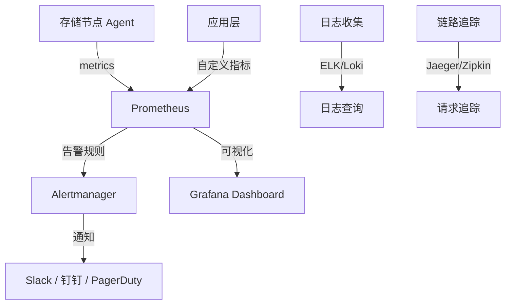
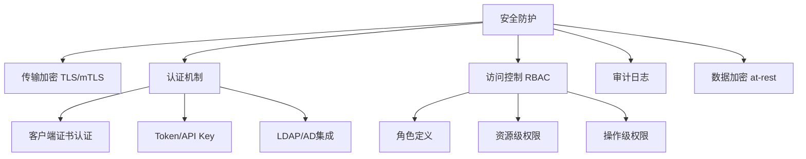
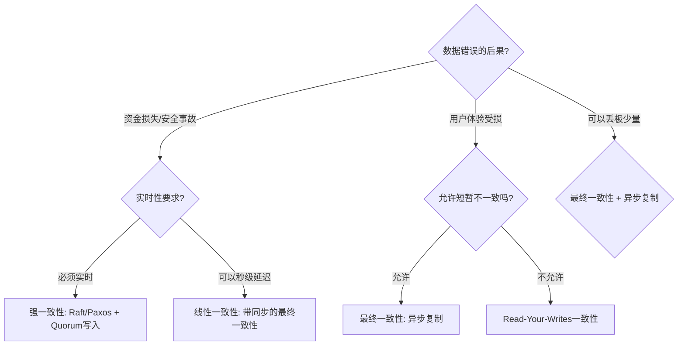

## 常见误区

分布式存储系统的复杂性意味着犯错的成本极高。一个错误的配置参数、一次遗漏的监控告警、一个设计不当的分片策略，都可能在生产环境中引发雪崩式故障。本章系统梳理分布式存储领域最常见的十大误区，深入分析每个误区的成因、危害和正确实践，帮助读者建立防御性思维。

---

## 误区一：上线后才发现监控体系缺失

### 错误现象

许多团队在分布式存储系统上线初期运行顺利，但随着数据量增长和负载加重，开始出现各种"黑箱"问题——不知道哪个节点慢了、不知道分片是否均衡、不知道缓存命中率多少。等真正出故障时，才手忙脚乱地部署监控，却为时已晚。

典型场景：凌晨 3 点收到用户投诉"写入变慢"，打开终端用 top 看了下 CPU 正常，然后就无从下手了——因为没有任何历史数据可以回溯。

### 危害分析

- **故障定位耗时**：没有监控，排查一个慢查询可能需要数小时甚至数天，而有完善监控的团队可能几分钟就能定位。
- **无法容量规划**：没有趋势数据，扩容决策全靠拍脑袋，要么过度预留浪费资源，要么扩容不及时导致过载。
- **SLA 无法兑现**：无法证明"可用性达到 99.95%"，因为根本没有数据支撑。
- **性能劣化不可见**：渐进式的性能下降（如磁盘碎片、索引膨胀）在没有监控的情况下几乎无法察觉。

### 正确做法

**监控体系必须在上线前部署，与存储系统同步上线。** 这不是"锦上添花"，而是"生存底线"。

#### 需要监控的核心指标

| 维度 | 关键指标 | 告警阈值参考 | 工具 |
|------|---------|-------------|------|
| **延迟** | P50/P99/P999 读写延迟 | P99 > 10ms（SSD）/ > 50ms（HDD） | Prometheus + Grafana |
| **吞吐量** | QPS / TPS / 带宽利用率 | 接近集群容量 80% | node_exporter |
| **可用性** | 节点存活数 / 分片覆盖率 | 覆盖率 < 100% | Prometheus |
| **存储** | 磁盘使用率 / 增长速率 | 使用率 > 75% 且增长持续 | node_exporter |
| **一致性** | 副本同步延迟 / 副本缺失数 | 同步延迟 > 30s | 自定义 exporter |
| **网络** | 节点间 RTT / 丢包率 | RTT > 5ms / 丢包 > 0.1% | iperf3 / blackbox_exporter |
| **GC/内存** | GC 暂停时间 / OOM 次数 | Full GC > 1s / OOM > 0 | jmx_exporter / pprof |

#### 推荐监控架构



#### 关键告警规则示例

```yaml
# Prometheus 告警规则示例
groups:
  - name: distributed_storage_alerts
    rules:
      # P99延迟告警
      - alert: HighP99Latency
        expr: histogram_quantile(0.99, rate(request_duration_seconds_bucket[5m])) > 0.01
        for: 5m
        labels:
          severity: warning
        annotations:
          summary: "P99延迟超过10ms，当前: {{ $value }}s"

      # 副本丢失告警
      - alert: ReplicaLost
        expr: sum by (shard) (replica_count) < 3
        for: 1m
        labels:
          severity: critical
        annotations:
          summary: "分片 {{ $labels.shard }} 副本数不足"

      # 磁盘空间告警
      - alert: DiskSpaceRunningLow
        expr: (node_filesystem_avail_bytes / node_filesystem_size_bytes) < 0.25
        for: 10m
        labels:
          severity: warning
```

#### 可视化看板设计

一个好的 Grafana 看板应该分三层：

1. **总览层**：集群健康度评分、节点存活状态、全局 QPS 和延迟趋势，一眼看全局。
2. **节点层**：单个节点的 CPU、内存、磁盘 IOPS、网络流量，用于定位问题节点。
3. **请求层**：具体查询的延迟分布、慢查询列表、错误率，用于定位问题查询。

---

## 误区二：过早优化与盲目调参

### 错误现象

系统刚部署完毕，还没跑过真实负载，就有人急着调整各种参数："这个 buffer 设大点""那个线程数调高""compaction 改成异步"。结果改了一堆参数，系统反而不稳定了——因为调参的依据不是实际瓶颈，而是"感觉"和"经验"。

另一种极端是：已经出现了性能问题，但直接照搬别人的优化方案（比如看到某篇文章说"LSM-Tree 要关闭 sync"就直接关），没有分析自己的实际场景。

### 危害分析

- **引入新问题**：关闭 sync 可能提升写入速度，但宕机时会丢失数据。
- **掩盖真实瓶颈**：盲目增大 buffer 可能掩盖了索引设计不合理的问题。
- **配置不可维护**：改了几十个参数后，没人知道哪些是必要的、哪些是随意加的，后续维护噩梦。
- **环境不一致**：在测试环境调好的参数，到生产环境完全不同，因为硬件、网络、数据分布都不一样。

### 正确做法

**先测量，再优化。用数据说话，不凭感觉调参。**

#### 第一步：建立性能基线

在做任何优化之前，先记录当前状态：

```bash
# 记录基线数据（以Ceph为例）
# 1. 写入吞吐量
rados bench -p mypool 60 write -b 4196

# 2. 读取吞吐量
rados bench -p mypool 60 seq

# 3. 随机读性能
rados bench -p mypool 60 rand

# 4. 记录每次测试的关键指标
# fio 测试更细粒度
fio --name=baseline_write --ioengine=rbd --rw=randwrite \
    --bs=4k --size=1G --rbdname=test --numjobs=4 \
    --runtime=60 --group_reporting
```

#### 第二步：用 Profiler 定位真正瓶颈

| 瓶颈类型 | 诊断工具 | 关键信号 |
|-----------|---------|---------|
| CPU 热点 | perf top / flamegraph | 某函数占用 >30% CPU |
| 内存问题 | pprof / valgrind | 频繁 GC / 内存泄漏 |
| 磁盘 I/O | iostat -x 1 / blktrace | await > 5ms / IOPS 接近上限 |
| 网络瓶颈 | sar -n DEV 1 / iftop | 带宽利用率 > 70% |
| 锁竞争 | perf lock / mutex contention | 大量线程等待同一锁 |
| 上下文切换 | vmstat 1 / pidstat -w | cs > 10000/s |

#### 第三步：单变量调优

每次只调整一个参数，观察效果，再决定是否保留：

调优记录模板：
- 参数：write_buffer_size
- 调整前：64MB → 调整后：256MB
- 影响：写入吞吐量 +15%，读取延迟 +2%
- 结论：保留（写密集场景收益明显）
- 测试条件：4K随机写，4线程，SSD，3节点集群

#### 常见存储引擎关键参数

以 RocksDB（LSM-Tree 引擎）为例，需要根据负载特征选择性调优：

| 参数 | 默认值 | 写密集场景推荐 | 读密集场景推荐 | 影响 |
|------|--------|--------------|--------------|------|
| write_buffer_size | 64MB | 256MB-512MB | 64MB-128MB | 更大=写入吞吐↑，读延迟可能↑ |
| max_write_buffer_number | 2 | 4-6 | 2-3 | 避免写入停顿 |
| level0_file_num_compaction_trigger | 4 | 2-3 | 8-10 | 更少=compaction更积极 |
| max_bytes_for_level_base | 256MB | 512MB-1GB | 256MB | L1大小影响后续层级 |
| bloom_bits_per_key | 10 | 10 | 15-20 | 更多位=读过滤更精确 |
| compression | Snappy | LZ4/Snappy | ZSTD | 压缩率vs速度权衡 |

---

## 误区三：配置不当导致"定时炸弹"

### 错误现象

配置问题不像 bug 那样立即报错，它们往往潜伏很久，在特定条件下突然爆发：

- 副本数设为 2，恰好两个节点同时故障，数据永久丢失。
- 超时时间设为 30s，一次网络抖动导致大量请求排队，最终超时重试引发雪崩。
- compaction 线程数设为 1，写入压力大时 compaction 跟不上，最终触发写入停顿。
- 连接池大小与实际并发不匹配，要么资源浪费，要么连接耗尽。

### 危害分析

- **数据丢失**：副本数不够 + 磁盘故障 = 不可恢复的数据丢失。
- **级联故障**：不合理的超时导致重试风暴，重试风暴拖垮整个集群。
- **性能悬崖**：某些参数组合在低负载时表现正常，一旦达到某个阈值性能骤降。
- **扩容失效**：配置硬编码了节点数或 IP 列表，扩容时新节点无法正常加入。

### 正确做法

**根据实际负载和硬件规格配置参数，绝不使用"默认配置一把梭"。**

#### 副本数配置原则

可用性 = 1 - (单节点故障率)^副本丢失容限

例如：单节点年故障率 = 5% (0.05)
- 副本数=2: 可用性 = 1 - 0.05^1 = 95%     → 不可接受
- 副本数=3: 可用性 = 1 - 0.05^2 = 99.75%   → 基本满足
- 副本数=3+1纠删码: 等效安全性接近副本数=4

**推荐配置**：
- 生产环境最低副本数 = 3（容忍同时坏 2 个节点概率极低）
- 对可靠性要求极高的场景（金融/医疗）：副本数 = 5 或 3+纠删码
- 开发/测试环境：副本数 = 1 或 2（节省资源）

#### 超时与重试策略

超时时间的设定需要考虑 P99 延迟，而不是平均延迟：

```python
# 错误：基于平均延迟设超时
timeout = avg_latency * 10  # 平均 1ms，超时 10ms → P99 请求经常超时

# 正确：基于 P99 延迟 + 安全余量
timeout = p99_latency * 3   # P99 5ms，超时 15ms → 覆盖绝大多数正常请求
```

重试策略的正确实现：

```python
import random
import time

def retry_with_backoff(func, max_retries=3, base_delay=0.1):
    """带指数退避和抖动的重试"""
    for attempt in range(max_retries):
        try:
            return func()
        except (TimeoutError, ConnectionError) as e:
            if attempt == max_retries - 1:
                raise
            # 指数退避 + 随机抖动，避免重试风暴
            delay = base_delay * (2 ** attempt) + random.uniform(0, 0.1)
            time.sleep(delay)
```

**关键原则**：重试间隔必须包含随机抖动（jitter），否则所有客户端会在同一时刻重试，造成惊群效应。

#### Compaction 配置要点

LSM-Tree 引擎的 compaction 是影响长期稳定性的关键：

| 配置项 | 推荐策略 | 风险点 |
|--------|---------|--------|
| compaction 线程数 | CPU 核数的 25%-50% | 太少→写入停顿；太多→与读写竞争 CPU |
| compaction 触发阈值 | level0 文件数 2-4 个 | 太高→L0 文件堆积导致读放大 |
| 限流 | compaction I/O 占总 I/O 的 30%-50% | 不限流→compaction 独占磁盘带宽 |
| 分层 vs FIFO | 分层适合写多读少；FIFO 适合时序数据 | 选错策略会导致空间放大严重 |

---

## 误区四：容错设计形同虚设

### 错误现象

"我们的系统有副本，所以不会丢数据"——这是最危险的幻觉。有副本不代表容错设计合格，容错需要覆盖从硬件故障到网络分区的完整故障域。

常见问题：
- 三个副本在同一台物理机上（机架感知未配置）。
- 有重试逻辑但没有熔断器，一个慢节点拖垮整个请求链路。
- 有故障转移机制但没有健康检查，故障节点迟迟未被摘除。
- 有备份但从未测试过恢复流程，备份只是"心理安慰"。

### 危害分析

- **单点故障伪装成分布式**：副本数够了但分布不合理，一个机架掉电就丢数据。
- **部分故障拖垮整体**：没有熔断机制，慢节点导致线程池耗尽，正常节点也无法服务。
- **故障恢复不可预期**：从没有测试过的备份恢复，发现格式不兼容或数据不完整。
- **误判故障类型**：把网络抖动当成节点故障，频繁切换导致脑裂。

### 正确做法

**容错设计要覆盖完整的故障域，并定期演练验证。**

#### 故障域覆盖矩阵

故障类型        → 设计对策              → 验证方法
─────────────────────────────────────────────────────────
单磁盘故障       → 本地 RAID / 副本      → 拔盘测试
单节点宕机       → 副本自动切换           → kill -9 模拟
机架掉电         → 机架感知部署           → 断电演练
网络分区         → Quorum 机制 + 脑裂防护 → 网络模拟器 (tc/netem)
数据中心故障     → 跨机房复制             → 灾备切换演练
数据损坏         → 校验和 + 定期扫描       → 注入损坏数据测试

#### 机架感知配置示例

以 Ceph 为例，机架感知确保副本分散在不同故障域：

```bash
# Ceph 机架感知布局
# CRUSH 规则确保同一故障域内最多放一个副本
ceph osd crush rule create-replicated myrule default host rack

# 验证分布是否合理
ceph osd tree
# 确认同 rack 下 OSD 数量不超过单故障域限制
```

#### 熔断器实现模式

```python
import time
from enum import Enum

class CircuitState(Enum):
    CLOSED = "closed"       # 正常通过
    OPEN = "open"           # 熔断，直接拒绝
    HALF_OPEN = "half_open" # 试探性放行

class CircuitBreaker:
    def __init__(self, failure_threshold=5, recovery_timeout=30):
        self.failure_threshold = failure_threshold
        self.recovery_timeout = recovery_timeout
        self.failure_count = 0
        self.last_failure_time = 0
        self.state = CircuitState.CLOSED

    def call(self, func, *args, **kwargs):
        if self.state == CircuitState.OPEN:
            if time.time() - self.last_failure_time > self.recovery_timeout:
                self.state = CircuitState.HALF_OPEN
            else:
                raise Exception("Circuit breaker is OPEN, request rejected")

        try:
            result = func(*args, **kwargs)
            if self.state == CircuitState.HALF_OPEN:
                self.state = CircuitState.CLOSED
                self.failure_count = 0
            return result
        except Exception as e:
            self.failure_count += 1
            self.last_failure_time = time.time()
            if self.failure_count >= self.failure_threshold:
                self.state = CircuitState.OPEN
            raise
```

#### 定期故障演练清单

| 演练项目 | 频率 | 方法 | 成功标准 |
|---------|------|------|---------|
| 节点宕机恢复 | 月度 | 随机停止一个节点 | 数据可用性不受影响 |
| 磁盘故障模拟 | 季度 | 替换故障磁盘 | 数据自动恢复完成 |
| 备份恢复验证 | 季度 | 从备份恢复到测试环境 | RTO/RPO 达标 |
| 网络分区模拟 | 半年度 | 网络模拟器制造分区 | Quorum 正常工作 |
| 数据中心切换 | 年度 | 全流程灾备切换演练 | 业务中断 < 目标值 |

---

## 误区五：安全设计"裸奔上线"

### 错误现象

"内网环境不需要认证""性能要紧，加密先不开了""权限先给全开，后面再细调"——这些话在故障复盘时听起来格外刺耳。

许多分布式存储系统在内网部署时，默认不开启认证和加密。但内网并不意味着安全：一台被入侵的开发机、一个有恶意意图的内部人员、一次横向渗透攻击，都可能导致灾难性数据泄露。

### 危害分析

- **数据泄露**：未加密的存储节点被入侵后，数据明文暴露。
- **未授权访问**：没有认证的存储接口可以被任意客户端访问。
- **权限失控**：全开的权限意味着任何误操作都可能删除关键数据。
- **审计缺失**：没有操作日志，出事后无法追溯是谁做了什么。

### 正确做法

**安全不能"后面再做"，必须从第一天就纳入架构设计。**

#### 安全防护层次



#### mTLS 配置示例

```bash
# 为存储节点生成 CA 和证书
# 1. 创建 CA
openssl genrsa -out ca.key 4096
openssl req -new -x509 -days 3650 -key ca.key -out ca.crt \
    -subj "/CN=Distributed Storage CA"

# 2. 为每个节点生成证书
openssl genrsa -out node1.key 2048
openssl req -new -key node1.key -out node1.csr \
    -subj "/CN=node1.storage.local"
openssl x509 -req -in node1.csr -CA ca.crt -CAkey ca.key \
    -CAcreateserial -out node1.crt -days 365

# 3. 配置存储服务端使用 TLS
# 以MinIO为例
minio server /data \
    --certs-dir /etc/minio/certs
```

#### RBAC 权限模型

```yaml
# 最小权限原则示例
roles:
  storage_reader:
    permissions:
      - object:get
      - object:list
      - bucket:list
    resources:
      - bucket: "app-data-*"  # 只能读取应用数据桶
      - bucket: "logs-*"

  storage_writer:
    permissions:
      - object:get
      - object:put
      - object:delete
    resources:
      - bucket: "app-data-*"

  storage_admin:
    permissions:
      - "*"
    resources:
      - "*"
    constraints:
      - require_mfa: true       # 管理操作需要双因素认证
      - require_approval: true  # 敏感操作需要审批
```

#### 加密策略选择

| 加密场景 | 推荐方案 | 性能影响 | 适用场景 |
|---------|---------|---------|---------|
| 传输加密 | TLS 1.3 | 延迟 +1-3ms | 所有环境必须开启 |
| 静态加密 | AES-256-GCM | 吞吐量 -5%~-15% | 敏感数据必须开启 |
| 客户端加密 | 服务端透明加密 | 应用层处理 | 数据主权要求极高 |
| 密钥管理 | HashiCorp Vault / KMS | 额外延迟 <1ms | 生产环境必须使用 |

---

## 误区六：数据模型设计不当

### 错误现象

关系数据库的经验照搬到分布式存储系统中，导致严重的性能和扩展性问题：

- 在 KV 存储中使用 UUID 作为分区键，导致数据分布不均。
- 在文档数据库中设计了大量关联关系，查询变成多次往返。
- 热点键设计不当，所有写入集中在少数几个分片上。
- 没有考虑数据生命周期，冷热数据混在一起存储。

### 危害分析

- **热点分片**：某些分片负载是平均值的 10 倍以上，其他分片空闲。
- **查询放大**：一次用户查询需要扫描多个分片，延迟成倍增长。
- **存储膨胀**：没有淘汰策略，历史数据无限增长，存储成本飙升。
- **扩展困难**：数据模型与分片策略强耦合，无法灵活扩缩容。

### 正确做法

**面向分布式存储重新设计数据模型，让数据分布服务于查询模式。**

#### 分区键设计原则

好的分区键：均匀分布 + 与查询对齐

示例：用户订单系统
- 分区键选择 user_id（而非 order_id）
- 原因：大部分查询是"查某个用户的订单"，同一用户数据在同一分片
- 风险：大客户（user_id 写入量大）可能成为热点
- 解决：大客户 key 加 salt 打散，或使用复合分区键

坏的分区键示例：
- 时间戳：早期数据集中在一个分片 → 越老越不均匀
- 自增ID：写入压力集中在一个分片 → 新数据都是热点
- 区域码：某些区域用户多 → 分片不均

#### 冷热数据分离策略

```python
# 冷热数据分层存储策略
class TieredStorageManager:
    """根据访问频率自动分层"""

    TIER_CONFIG = {
        "hot": {
            "storage": "SSD",
            "retention": "7d",
            "criteria": "access_count > 10 AND last_access < 1d"
        },
        "warm": {
            "storage": "HDD",
            "retention": "90d",
            "criteria": "last_access < 30d"
        },
        "cold": {
            "storage": "S3/ObjectStore",
            "retention": "365d",
            "criteria": "last_access < 90d"
        },
        "archive": {
            "storage": "Glacier/归档存储",
            "retention": "永久",
            "criteria": "last_access > 365d"
        }
    }

    def migrate_tiers(self):
        """定期执行数据迁移"""
        for from_tier, to_tier in [
            ("hot", "warm"),
            ("warm", "cold"),
            ("cold", "archive")
        ]:
            candidates = self.query(
                f"SELECT * FROM objects WHERE tier='{from_tier}' "
                f"AND {self.TIER_CONFIG[to_tier]['criteria']}"
            )
            for obj in candidates:
                self.move(obj, to_tier)
                self.update_metadata(obj.key, {"tier": to_tier})
```

---

## 误区七：扩容与缩容的"拍脑袋"操作

### 错误现象

扩容没有标准流程，缩容更是一片空白：

- 磁盘使用率到了 80% 才想到扩容，扩容过程中已经影响线上服务。
- 加了新节点但没有做数据重平衡（rebalance），新节点空闲而老节点过载。
- 想缩容时发现数据迁移没有自动化工具，只能手动操作。
- 扩容时没有验证新节点的硬件一致性，不同型号的磁盘混用导致性能不均。

### 危害分析

- **被迫应急扩容**：紧急扩容时没有充分测试，可能引入新问题。
- **资源利用率低下**：数据不均衡导致部分节点满载、部分空闲，整体利用率偏低。
- **缩容变成禁区**：因为太复杂，团队宁可加节点也不缩容，成本持续上升。
- **硬件异构性**：不同硬件性能差异导致"木桶效应"，最慢的节点决定整体性能。

### 正确做法

**建立标准化的扩缩容流程，并尽量实现自动化。**

#### 扩容流程清单

1. 容量评估
   ├─ 当前使用量 + 增长趋势 → 计算目标容量
   ├─ 确定扩容规模（建议一次不超过总容量的30%）
   └─ 确认新节点硬件规格与现有节点一致

2. 新节点部署
   ├─ 操作系统和内核版本与现有节点一致
   ├─ 网络配置（IP、DNS、防火墙规则）
   ├─ 存储服务安装和配置
   └─ 安全配置（TLS、认证）

3. 集群加入
   ├─ 新节点加入集群
   ├─ 等待节点状态变为 active
   ├─ 验证新节点可以正常读写
   └─ 启动数据重平衡（rebalance）

4. 重平衡监控
   ├─ 监控数据迁移进度
   ├─ 确保迁移不影响在线服务（限流）
   ├─ 验证迁移后数据一致性
   └─ 确认各分片负载均衡

5. 收尾验证
   ├─ 全面健康检查
   ├─ 性能基线对比
   └─ 更新监控和告警配置

#### 自动化扩容判断

```python
# 基于预测的自动扩容建议
def evaluate_scaling_need(cluster_metrics):
    """评估是否需要扩容"""
    recommendations = []

    # 基于增长趋势预测
    current_usage_pct = cluster_metrics["disk_usage_percent"]
    growth_rate_per_day = cluster_metrics["disk_growth_rate_gb"]
    total_capacity_gb = cluster_metrics["total_capacity_gb"]
    days_to_full = (total_capacity_gb * (1 - current_usage_pct / 100)) / growth_rate_per_day

    if days_to_full < 30:
        recommendations.append({
            "action": "SCALE_UP",
            "urgency": "HIGH" if days_to_full < 14 else "MEDIUM",
            "estimated_new_nodes": max(1, int(
                growth_rate_per_day * 90 / total_capacity_gb * len(cluster_metrics["nodes"])
            )),
            "reason": f"按当前增长速率，{int(days_to_full)}天后磁盘将满"
        })

    # 基于性能指标
    avg_node_utilization = cluster_metrics["avg_cpu_utilization"]
    if avg_node_utilization > 75:
        recommendations.append({
            "action": "SCALE_UP",
            "urgency": "MEDIUM",
            "reason": f"平均CPU利用率达{avg_node_utilization}%，接近性能瓶颈"
        })

    # 基于负载均衡
    max_min_ratio = cluster_metrics["max_node_load"] / max(1, cluster_metrics["min_node_load"])
    if max_min_ratio > 3:
        recommendations.append({
            "action": "REBALANCE",
            "urgency": "MEDIUM",
            "reason": f"节点负载不均衡，最大/最小比为{max_min_ratio:.1f}"
        })

    return recommendations
```

---

## 误区八：网络问题处理不当

### 错误现象

分布式存储系统中，网络是最不可靠的组件之一，但很多设计假设网络永远正常：

- 节点间通信没有设置超时，一次网络分区导致线程永久阻塞。
- 没有处理网络分区时的脑裂问题，两个分区各选举一个主节点，数据分叉。
- 忽略 TCP 连接复用，频繁创建短连接导致 TIME_WAIT 堆积。
- 万兆网络环境下没有调整 TCP 缓冲区大小，吞吐量上不去。

### 危害分析

- **脑裂**：两个主节点同时接受写入，数据不可调和地分叉。
- **请求永久阻塞**：没有超时的 RPC 调用可能无限等待。
- **性能受限**：TCP 配置不当导致网络带宽利用率不足 50%。
- **假故障**：网络抖动被误判为节点故障，触发不必要的故障转移。

### 正确做法

**假设网络永远不可靠，在应用层做好完整的网络容错。**

#### 网络分区处理策略

| 策略 | 原理 | 适用场景 | 代价 |
|------|------|---------|------|
| 多数派（Quorum） | 只有获得多数节点同意才提交 | 强一致性要求 | 少数派分区不可用 |
| Leader 优先 | 只有原 Leader 所在分区可写入 | 避免脑裂 | Leader 所在分区不可用时整集群只读 |
| 最终一致性 | 两个分区都可写入，分区恢复后合并 | 高可用优先 | 可能出现数据冲突 |
| 自动仲裁 | 引入第三方仲裁节点 | 两节点集群防脑裂 | 额外的基础设施 |

#### TCP 参数优化

```bash
# 分布式存储节点推荐TCP配置
# /etc/sysctl.d/99-storage.conf

# TCP 缓冲区大小（适用于万兆网络）
net.core.rmem_max = 16777216
net.core.wmem_max = 16777216
net.ipv4.tcp_rmem = 4096 87380 16777216
net.ipv4.tcp_wmem = 4096 65536 16777216

# 连接队列
net.core.somaxconn = 65535
net.core.netdev_max_backlog = 65535

# TIME_WAIT 优化
net.ipv4.tcp_tw_reuse = 1
net.ipv4.tcp_fin_timeout = 15

# Keepalive（检测死连接）
net.ipv4.tcp_keepalive_time = 600
net.ipv4.tcp_keepalive_intvl = 30
net.ipv4.tcp_keepalive_probes = 3

# 拥塞控制（推荐BBR）
net.core.default_qdisc = fq
net.ipv4.tcp_congestion_control = bbr

# 应用配置后
# sysctl -p /etc/sysctl.d/99-storage.conf
```

#### 脑裂防护配置

```yaml
# etcd 脑裂防护配置
etcd:
  # 心跳超时：超过此时间认为Leader失联
  election-timeout: 10000ms  # 10秒
  # 心跳间隔：Leader发送心跳的频率
  heartbeat-interval: 1000ms  # 1秒

  # 关键：设置合理的 --initial-cluster-token
  # 不同集群使用不同token，防止误加入其他集群
  initial-cluster-token: "prod-cluster-v1"

  # 自动移除不可达节点
  auto-compaction-mode: periodic
  auto-compaction-retention: "1h"
```

---

## 误区九：一致性级别选择不当

### 错误现象

"强一致性最安全"——这个认知不完全正确。在分布式系统中，一致性级别需要根据业务场景精心选择：

- 支付系统用了最终一致性，导致"余额显示正确但实际不足"。
- 日志系统用了强一致性，写入延迟飙升到不可接受的水平。
- 同一个系统中不同接口使用了不同的一致性级别，但没有文档记录，维护者困惑不已。
- 跨数据中心复制时没有考虑网络延迟，强一致性导致全球用户延迟不可接受。

### 危害分析

- **数据不一致**：应该强一致的场景用了最终一致，用户看到脏数据。
- **性能退化**：应该最终一致的场景用了强一致，白白浪费性能余量。
- **维护混乱**：一致性级别的选择没有文档化，新团队成员无法理解为什么这样设计。
- **扩展受限**：强一致的写入路径在跨地域部署时成为性能瓶颈。

### 正确做法

**根据业务场景的数据一致性需求，选择合适的一致性级别，并文档化决策依据。**

#### 一致性级别决策矩阵



#### 各一致性级别对比

| 一致性级别 | 保证内容 | 典型延迟 | 适用场景 | 代表系统 |
|-----------|---------|---------|---------|---------|
| 强一致性（Linearizability） | 所有操作全局有序 | 5-50ms | 金融交易、库存扣减 | etcd, ZooKeeper |
| 顺序一致性（Sequential） | 所有节点看到相同顺序 | 3-20ms | 分布式锁、Leader 选举 | Raft 实现 |
| 因果一致性（Causal） | 因果相关的操作有序 | 1-10ms | 社交动态、协作编辑 | MongoDB, DynamoDB |
| 最终一致性（Eventual） | 最终所有节点一致 | 0-1000ms | CDN、日志、用户画像 | Cassandra, S3 |
| Read-Your-Writes | 自己的写入立即可见 | 1-5ms | 用户个人设置、购物车 | 大多数 KV 存储 |

#### 一致性级别选择指南

```python
# 一致性级别选择示例
CONSISTENCY_MAP = {
    # 金融核心：必须强一致
    "account_transfer": "STRONG",
    "payment_confirm": "STRONG",

    # 用户体验相关：Read-Your-Writes
    "user_profile_update": "READ_YOUR_WRITES",
    "shopping_cart": "READ_YOUR_WRITES",

    # 社交内容：因果一致即可
    "post_comment": "CAUSAL",
    "like_reaction": "CAUSAL",

    # 分析类数据：最终一致
    "page_view_log": "EVENTUAL",
    "recommendation_data": "EVENTUAL",
}
```

---

## 误区十：备份策略"看起来有但实际没用"

### 错误现象

- "我们每天都在备份"——但从没测试过恢复，恢复时才发现备份文件损坏。
- 只备份了数据，没有备份元数据（schema、索引、权限配置）。
- 备份存储在同一个数据中心，整个数据中心故障时备份也丢失。
- RTO（恢复时间目标）和 RPO（恢复点目标）从未明确定义，出事后才讨论"我们能接受丢多少数据"。
- 增量备份链太长，恢复时需要回溯几十个增量，恢复时间不可控。

### 危害分析

- **恢复失败**：备份只是心理安慰，真出事时无法恢复。
- **恢复超时**：RTO 没有验证，实际恢复时间远超预期。
- **元数据丢失**：数据恢复了但索引、配置都没了，系统仍然不可用。
- **备份单点**：备份与数据在同一故障域，一次灾难全部损失。

### 正确做法

**备份的核心不是"有没有备份"，而是"能不能恢复"。每次恢复都是一次验证。**

#### 3-2-1 备份原则

3 份数据副本
├─ 原始数据
├─ 本地备份（快速恢复）
└─ 异地备份（灾难恢复）

2 种存储介质
├─ 主存储（SSD/NVMe）
└─ 备份存储（HDD/对象存储）

1 份异地备份
└─ 位于不同数据中心/云区域

#### 备份验证流程

```python
import subprocess
import json
from datetime import datetime

class BackupValidator:
    """备份验证自动化"""

    def __init__(self, backup_path, restore_test_path):
        self.backup_path = backup_path
        self.restore_test_path = restore_test_path

    def validate_backup(self):
        """执行完整的备份验证流程"""
        results = {
            "timestamp": datetime.now().isoformat(),
            "checks": []
        }

        # 检查1：备份文件完整性
        integrity = self.check_file_integrity()
        results["checks"].append(integrity)

        # 检查2：备份可恢复性
        restore = self.test_restore()
        results["checks"].append(restore)

        # 检查3：恢复后数据一致性
        consistency = self.verify_data_consistency()
        results["checks"].append(consistency)

        # 检查4：恢复时间
        recovery_time = self.measure_recovery_time()
        results["checks"].append(recovery_time)

        return results

    def check_file_integrity(self):
        """验证备份文件完整性（checksum）"""
        cmd = f"md5sum {self.backup_path}/*"
        result = subprocess.run(cmd, shell=True, capture_output=True, text=True)
        return {
            "check": "file_integrity",
            "passed": result.returncode == 0,
            "details": result.stdout
        }

    def test_restore(self):
        """实际执行恢复操作"""
        cmd = f"rsync -av --dry-run {self.backup_path}/ {self.restore_test_path}/"
        result = subprocess.run(cmd, shell=True, capture_output=True, text=True)
        return {
            "check": "restore_test",
            "passed": result.returncode == 0,
            "details": "Dry run successful" if result.returncode == 0 else result.stderr
        }

    def measure_recovery_time(self):
        """测量完整恢复时间"""
        start = datetime.now()
        # 实际恢复操作...
        elapsed = (datetime.now() - start).total_seconds()
        return {
            "check": "recovery_time",
            "elapsed_seconds": elapsed,
            "within_rto": elapsed < 3600  # RTO: 1小时
        }
```

#### 备份策略配置模板

| 配置项 | 推荐值 | 说明 |
|--------|--------|------|
| 全量备份频率 | 每周一次 | 每周日凌晨执行 |
| 增量备份频率 | 每天一次 | 每日凌晨执行 |
| 保留周期 | 全量 4 周，增量 7 天 | 平衡存储成本与恢复能力 |
| 备份验证频率 | 每月一次 | 自动化验证+人工抽查 |
| RTO 目标 | < 4 小时 | 从决策恢复到服务可用 |
| RPO 盯标 | < 24 小时 | 最多丢失一天数据 |
| 异地同步延迟 | < 1 小时 | 备份数据到达异地的时间 |

---

## 误区自查清单

在系统上线前和运维过程中，定期对照以下清单进行自查：

| # | 自查项 | 误区 | 正确做法 |
|---|--------|------|---------|
| 1 | 监控系统是否与存储同步部署 | 上线后才补监控 | 上线前部署完整的监控+告警 |
| 2 | 是否有性能基线数据 | 凭感觉调优 | 先测量再优化，记录每次调参 |
| 3 | 副本数是否 ≥ 3 | 副本数不够 | 生产环境最低 3 副本 |
| 4 | 超时和重试是否包含退避抖动 | 固定间隔重试 | 指数退避 + 随机抖动 |
| 5 | 是否有熔断器保护 | 慢节点拖垮集群 | 部署熔断器+优雅降级 |
| 6 | 机架/可用区感知是否配置 | 副本在同一故障域 | 副本分散到不同故障域 |
| 7 | TLS/mTLS 是否全部开启 | 内网裸奔 | 传输加密+静态加密 |
| 8 | 权限是否遵循最小原则 | 全开权限 | RBAC + 最小权限 |
| 9 | 备份是否定期验证恢复 | 有备份无验证 | 每月执行恢复演练 |
| 10 | 扩容流程是否文档化 | 拍脑袋扩容 | 标准化流程+自动化 |

---

## 本节小结

分布式存储系统的十大误区覆盖了从上线运维到架构设计的完整生命周期。核心思想可以归纳为三条：

1. **预防优于补救**：监控在上线前部署、安全在设计时纳入、备份在使用前验证。"后面再做"往往意味着"永远不会做"。

2. **数据驱动决策**：性能优化靠 profiler 不靠猜测、容量规划靠趋势不靠拍脑袋、一致性选择靠业务需求不靠惯性思维。

3. **定期演练验证**：故障转移要演练、备份恢复要测试、容量阈值要校准。没有经过验证的容错设计只是纸面上的安全感。

每一个误区背后都是真实的生产事故教训。理解这些误区不是为了避免犯错（犯错不可避免），而是在犯错时能够快速识别、快速修复、快速恢复。
