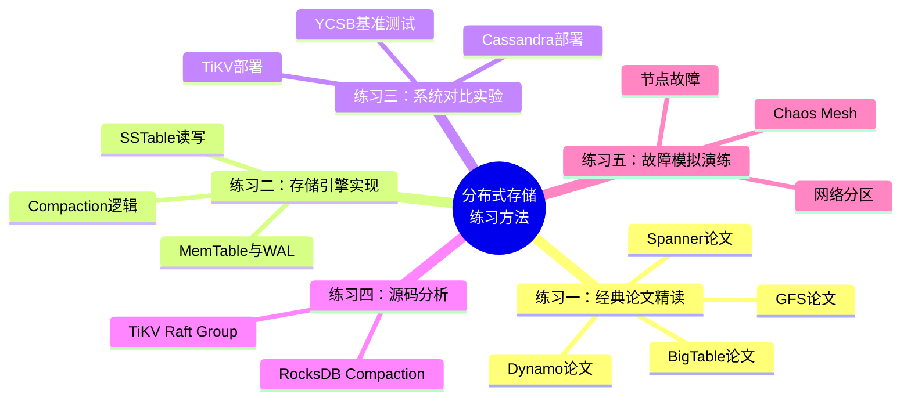

# 分布式存储练习方法

## 本节定位

理论、技巧、案例和误区构成了分布式存储的知识框架，但"知道"和"会做"之间存在巨大鸿沟。本节提供五套渐进式练习方案，覆盖从论文精读到故障演练的完整能力培养路径。每套练习都有明确的目标、具体步骤、可验证的检查标准和预估时间。



**建议学习顺序**：练习一（理论深化）→ 练习二（动手造轮子）→ 练习三（横向对比）→ 练习四（深入内部）→ 练习五（生产实战）。如果时间有限，练习二和练习三的优先级最高——亲手写一遍LSM-Tree并跑一次YCSB对比，对理解分布式存储的收获远超纯理论学习。

---

## 练习一：经典论文精读（预计 6-8 小时）

### 目标

精读分布式存储领域的四篇奠基论文，理解每个系统的设计动机、核心创新和工程权衡。通过论文阅读建立"第一性原理"视角，而非仅从二手资料获取知识。

### 为什么必须读原版论文

二手教材和博客往往会简化甚至扭曲原始设计意图。例如：
- GFS论文中关于"追加优先"的设计决策，在许多中文博客中被简化为"只能追加"，实际上GFS支持记录追加（Record Append）和写覆盖（Write），只是追加是优化路径
- Dynamo论文中的向量时钟实现细节（Sloppy Quorum + Hinted Handoff）经常被混淆为简单的Quorum读写
- Spanner的TrueTime API的物理时钟置信区间机制，是最容易被误解的部分之一

### 步骤一：GFS 论文精读（预计 1.5 小时）

**论文信息**：
- 标题：The Google File System
- 作者：Ghemawat, Gobioff, Leung
- 发表：SOSP 2003
- 获取：https://research.google/pubs/pub53/

**精读重点与批注指南**：

| 章节 | 核心问题 | 与本章内容的关联 |
|------|---------|----------------|
| 3.1 应用假设 | 为什么GFS假设"组件故障是常态"而非异常？ | 23.1.1 分布式存储系统分类 |
| 3.2 接口设计 | 为什么GFS提供追加操作而非通用写操作？追加如何简化一致性保证？ | 23.1.3 数据复制策略 |
| 3.3 Master设计 | 单Master简化了哪些设计？引入了什么新的限制？ | 23.1.6 经典系统架构 |
| 4 Chunk大小 | 64MB大块设计的利弊各是什么？为什么HDFS继承了这个设计？ | 23.1.1 存储系统分类 |
| 5 元数据 | Master为什么将元数据全部放在内存中？这限制了什么？ | 23.2 核心技巧-容量规划 |
| 6.1 Lease机制 | 租约（Lease）如何在无锁情况下保证写入顺序？ | 23.1.4 一致性级别 |
| 7 容错 | Snapshot如何在COW方式下高效实现？ | 23.2 核心技巧-数据生命周期 |

**精读方法**：

```bash
# 下载论文PDF
wget https://research.google/pubs/pub53/ -O gfs.pdf

# 建议用以下工具做批注
# 方案A：Zotero（免费学术工具，支持PDF批注和笔记导出）
# 方案B：直接在PDF上高亮+批注，读完后整理为Markdown笔记

# 读完后，用自己的话回答以下问题（不翻阅论文）：
# 1. GFS如何处理Master单点故障？
# 2. GFS的写入流程涉及哪些角色？Lease的作用是什么？
# 3. GFS的快照机制是如何在不阻塞写入的情况下实现的？
# 4. 如果让你重新设计GFS，你会改变什么？为什么？
```

**输出物**：写一份3000字以上的精读笔记，包含：
- GFS的系统架构图（手绘或Mermaid）
- Master与ChunkServer的职责对比表
- 写入流程的时序图（标注Lease、数据流、控制流）
- 你的设计反思：GFS的哪些设计在今天仍然适用，哪些已被淘汰

### 步骤二：Dynamo 论文精读（预计 2 小时）

**论文信息**：
- 标题：Dynamo: Amazon's Highly Available Key-value Store
- 作者：DeCandia et al.
- 发表：SOSP 2007
- 获取：https://www.allthingsdistributed.com/files/amazon-dynamo-sosp2007.pdf

**精读重点**：

| 章节 | 核心问题 | 工程启发 |
|------|---------|---------|
| 2 系统架构 | 为什么Dynamo选择"Always Writable"？这是什么业务场景决定的？ | 23.1.4 一致性级别 |
| 3.1 一致性哈希 | Dynamo的哈希环实现与标准一致性哈希有什么区别？虚拟节点为什么选200个？ | 23.1.2 数据分片策略 |
| 3.2 复制 | N、W、R的默认值分别是什么？不同组合对一致性的影响？ | 23.1.3 数据复制策略 |
| 3.3 修复 | 感知移交（Hinted Handoff）是什么？读修复（Read Repair）如何工作？ | 23.2 核心技巧-故障检测与恢复 |
| 4 故障检测 | 反熵协议（Anti-entropy）用Merkle Tree做差异检测的具体流程？ | 23.1.5 LSM-Tree存储引擎 |
| 5 成员变更 | Gossip协议的收敛速度如何？为什么不用ZooKeeper？ | 23.2 核心技巧-故障检测 |
| 6 冲突解决 | 向量时钟如何检测冲突？为什么Dynamo最终选择了LWW而非应用层合并？ | 23.1.4 一致性级别 |

**关键数学验证**：

```python
# 亲手验证Quorum机制
def quorum_consistency(N, W, R):
    """验证 W + R > N 是否保证读写集合有交集"""
    # 写入集合大小为W（从N个副本中选W个确认）
    # 读取集合大小为R（从N个副本中读R个取最新）
    # W + R > N => 交集至少为 W + R - N > 0
    min_overlap = W + R - N
    return {
        "N": N, "W": W, "R": R,
        "保证一致性": W + R > N,
        "最小交集数": max(0, min_overlap),
        "读可用性": "写入至少W个节点存活即可",
        "写可用性": "读取至少R个节点存活即可",
    }

# Dynamo默认配置
print(quorum_consistency(N=3, W=2, R=2))
# => 一致性: True, 最小交集: 1, 任一节点故障仍可用

# 对比强一致性配置
print(quorum_consistency(N=3, W=3, R=1))
# => 一致性: True, 写可用性: 所有节点必须存活（脆弱）

# 对比最终一致性配置
print(quorum_consistency(N=3, W=1, R=1))
# => 一致性: False, 但读写都只需要1个节点（极高可用性）
```

**输出物**：写一份2500字以上的精读笔记，重点分析Dynamo的"可用性优先"哲学与Spanner的"一致性优先"哲学的对比。

### 步骤三：BigTable 论文精读（预计 1.5 小时）

**论文信息**：
- 标题：Bigtable: A Distributed Storage System for Structured Data
- 作者：Chang et al.
- 发表：OSDI 2006
- 获取：https://research.google/pubs/pub36632/

**精读重点**：

| 章节 | 核心问题 | 系统对应 |
|------|---------|---------|
| 数据模型 | Row Key、Column Family、Timestamp三层结构的设计逻辑？ | Cassandra/ScyllaDB |
| 3 Tablet定位 | 三层B+树索引如何实现高效的 Tablet 定位？ | TiKV Region 定位 |
| 4 读写流程 | 一次写入涉及哪些组件？Commit Log为什么放在MemTable之前？ | 23.1.5 LSM-Tree |
| 5 合并 | Minor/Major Compaction的区别和触发条件？ | 23.2 核心技巧-存储引擎调优 |
| 7 压缩 | Column Family级别的压缩策略选择依据？ | 23.2 核心技巧-压缩与合并 |

### 步骤四：Spanner 论文精读（预计 2 小时）

**论文信息**：
- 标题：Spanner: Google's Globally-Distributed Database
- 作者：Corbett et al.
- 发表：OSDI 2012
- 获取：https://research.google/pubs/pub39966/

**精读重点**：

| 章节 | 核心问题 | 深度思考 |
|------|---------|---------|
| 2 TrueTime | 物理时钟如何提供"置信区间"？GPS+原子钟的冗余设计为什么必要？ | 逻辑时钟vs物理时钟 |
| 3.1 数据模型 | Directory/Partition/Block三层结构与传统分区的区别？ | 23.1.2 分片策略 |
| 4 读写事务 | 读写事务的两阶段提交如何优化？只读事务为什么不需要锁？ | 第24章分布式事务 |
| 5 Schema变更 | 分布式Schema变更如何保证全局一致性？ | 23.1.4 一致性级别 |
| 6 新加DC | 新数据中心加入时的元数据迁移策略？ | 23.2 核心技巧-跨DC复制 |

**四篇论文的交叉对比笔记**：

读完四篇论文后，完成以下对比表格（用自己的话填写，不参考论文）：

| 对比维度 | GFS | Dynamo | BigTable | Spanner |
|---------|-----|--------|----------|---------|
| 设计哲学 | | | | |
| 一致性选择 | | | | |
| 分片策略 | | | | |
| 复制策略 | | | | |
| 故障恢复 | | | | |
| 适用场景 | | | | |

---

## 练习二：Mini LSM-Tree 存储引擎实现（预计 8-10 小时）

### 目标

从零实现一个简化版的LSM-Tree存储引擎，包含MemTable、WAL、SSTable读写和基础Compaction。通过造轮子深入理解读写路径、Compaction触发条件、Bloom Filter等核心概念。

### 为什么自己实现一遍

LSM-Tree是分布式存储中最核心的存储引擎（RocksDB、LevelDB、TiKV的Titan、Cassandra的StorageEngine都基于LSM-Tree），但仅看文档和代码很难真正理解它的行为。例如：
- 不亲手实现Compaction，很难理解为什么Leveled Compaction的写放大是10-30倍
- 不亲手处理SSTable的索引，很难理解Bloom Filter为什么能将读放大降低一个数量级
- 不亲手实现WAL，很难理解WAL的Group Commit和fsync策略对写入延迟的影响

### 项目结构

mini-lsm/
├── src/
│   ├── __init__.py
│   ├── memtable.py       # MemTable：内存中的有序数据结构
│   ├── wal.py            # Write-Ahead Log：持久化保证
│   ├── sstable.py        # SSTable：磁盘上的有序不可变文件
│   ├── bloom_filter.py   # Bloom Filter：减少无效磁盘读取
│   ├── compaction.py     # Compaction：SSTable合并逻辑
│   └── lsm_tree.py       # LSM-Tree：整合所有组件的总入口
├── tests/
│   ├── test_memtable.py
│   ├── test_sstable.py
│   ├── test_compaction.py
│   └── test_integration.py
└── bench.py              # 性能基准测试

### 步骤一：实现 MemTable（预计 1.5 小时）

MemTable是LSM-Tree的写入缓冲区，在内存中维护一个有序的key-value映射。

```python
import threading
from collections import OrderedDict
from dataclasses import dataclass, field

@dataclass
class MemTable:
    """跳表或红黑树的简化版本——用有序字典模拟。
    生产环境应使用 skiplist 实现（如 pyximport 的 skiplist）。
    """
    _store: dict = field(default_factory=dict)
    _size_bytes: int = 0
    _max_size_bytes: int = 4 * 1024 * 1024  # 4MB 默认
    _lock: threading.Lock = field(default_factory=threading.Lock)

    def put(self, key: str, value: bytes) -> None:
        """插入键值对。如果key已存在则覆盖。
        返回写入后MemTable是否已满（需要flush）。
        """
        with self._lock:
            old_size = len(self._store.get(key, b''))
            self._store[key] = value
            self._size_bytes += len(value) - old_size

    def get(self, key: str) -> bytes | None:
        """精确查找。返回value，不存在返回None。
        注意：返回 None 也可能表示 tombstone（已删除），需区分处理。
        """
        with self._lock:
            return self._store.get(key)

    def delete(self, key: str) -> bool:
        """逻辑删除：写入 tombstone 标记。
        tombstone 在 Compaction 时会被真正清除。
        """
        TOMBSTONE = b'\x00TOMBSTONE\x00'
        with self._lock:
            if key in self._store:
                self._store[key] = TOMBSTONE
                return True
            return False

    @property
    def is_full(self) -> bool:
        return self._size_bytes >= self._max_size_bytes

    def items_sorted(self):
        """返回按key排序的迭代器（SSTable写入时需要）"""
        with self._lock:
            return sorted(self._store.items())

    @property
    def size_bytes(self) -> int:
        return self._size_bytes
```

**测试要点**：
```python
def test_memtable_basic():
    mt = MemTable()
    mt.put("key1", b"value1")
    assert mt.get("key1") == b"value1"
    assert mt.get("key2") is None

def test_memtable_overwrite():
    mt = MemTable()
    mt.put("key1", b"v1")
    mt.put("key1", b"v2")
    assert mt.get("key1") == b"v2"
    # 大小应该只计算最新值
    assert mt.size_bytes == len(b"v2")

def test_memtable_tombstone():
    mt = MemTable()
    mt.put("key1", b"value1")
    mt.delete("key1")
    assert mt.get("key1") == b'\x00TOMBSTONE\x00'

def test_memtable_sorted_items():
    mt = MemTable()
    mt.put("c", b"3")
    mt.put("a", b"1")
    mt.put("b", b"2")
    items = list(mt.items_sorted())
    assert [k for k, v in items] == ["a", "b", "c"]
```

### 步骤二：实现 WAL（预计 1 小时）

WAL（Write-Ahead Log）是持久化保证的基础。每条写入操作在进入MemTable之前，必须先追加到WAL。

```python
import os
import struct
import time

class WAL:
    """Write-Ahead Log 简化实现

    格式：每条记录 = [4字节长度][1字节类型][8字节时间戳][key_len(2B)][key][value_len(4B)][value]
    类型：1=PUT, 2=DELETE
    """

    TOMBSTONE = b'\x00TOMBSTONE\x00'
    PUT = 1
    DELETE = 2

    def __init__(self, log_path: str):
        self.log_path = log_path
        self._file = open(log_path, 'ab')  # 追加模式

    def append_put(self, key: str, value: bytes) -> None:
        """追加一条 PUT 记录"""
        record = self._encode(self.PUT, key.encode(), value)
        self._file.write(record)
        self._file.flush()  # 注意：生产环境应使用 fdatasync 而非 flush
        os.fdatasync(self._file.fileno())

    def append_delete(self, key: str) -> None:
        """追加一条 DELETE 记录"""
        record = self._encode(self.DELETE, key.encode(), self.TOMBSTONE)
        self._file.write(record)
        self._file.flush()
        os.fdatasync(self._file.fileno())

    def _encode(self, op_type: int, key: bytes, value: bytes) -> bytes:
        ts = int(time.time() * 1000)
        body = struct.pack('>BQ', op_type, ts)
        body += struct.pack('>H', len(key)) + key
        body += struct.pack('>I', len(value)) + value
        header = struct.pack('>I', len(body))
        return header + body

    def replay(self) -> list[tuple[str, bytes | None]]:
        """崩溃恢复：重放WAL中的所有操作"""
        results = []
        with open(self.log_path, 'rb') as f:
            while True:
                header = f.read(4)
                if len(header) < 4:
                    break
                body_len = struct.unpack('>I', header)[0]
                body = f.read(body_len)
                if len(body) < body_len:
                    break  # 截断的记录，停止重放
                op_type = body[0]
                # 跳过时间戳(8B)
                key_len = struct.unpack('>H', body[9:11])[0]
                key = body[11:11 + key_len].decode()
                val_start = 11 + key_len
                val_len = struct.unpack('>I', body[val_start:val_start + 4])[0]
                value = body[val_start + 4:val_start + 4 + val_len]

                if op_type == self.DELETE:
                    results.append((key, None))
                else:
                    results.append((key, value))
        return results

    def close(self):
        self._file.close()

    def clear(self):
        self._file.close()
        os.unlink(self.log_path)
        self._file = open(self.log_path, 'ab')
```

**关键设计要点**（必须在实现时思考）：

| 设计决策 | 选项 | 为什么选择当前方案 |
|---------|------|------------------|
| fsync时机 | 每条记录 / 每批 / 不fsync | 每条fsync安全但慢；生产系统通常批量fsync |
| 日志截断 | MemTable flush后删除WAL | 但多个MemTable并存时需引用计数 |
| 记录格式 | 定长 vs 变长 | 变长更省空间，但需要长度前缀 |
| 崩溃恢复 | 重放完整WAL vs 检查点+WAL | 完整重放简单但慢，检查点需要额外实现 |

### 步骤三：实现 SSTable（预计 2 小时）

SSTable（Sorted String Table）是LSM-Tree在磁盘上的存储格式，核心特征是**有序且不可变**。

```python
import struct
import os

class BloomFilter:
    """布隆过滤器：快速判断一个key是否"可能存在"于SSTable中"""

    def __init__(self, expected_items: int = 10000, fp_rate: float = 0.01):
        # 根据期望误判率和元素数计算位数组大小和哈希函数数量
        import math
        self.size = int(-expected_items * math.log(fp_rate) / (math.log(2) ** 2))
        self.num_hashes = int(self.size / expected_items * math.log(2))
        self.bit_array = bytearray((self.size + 7) // 8)

    def _hashes(self, key: str):
        h1 = hash(key)
        h2 = hash(key + "_salt")
        for i in range(self.num_hashes):
            yield (h1 + i * h2) % self.size

    def add(self, key: str):
        for bit_pos in self._hashes(key):
            self.bit_array[bit_pos // 8] |= (1 << (bit_pos % 8))

    def might_contain(self, key: str) -> bool:
        return all(
            self.bit_array[bit_pos // 8] &amp; (1 << (bit_pos % 8))
            for bit_pos in self._hashes(key)
        )


class SSTable:
    """简化版 SSTable 文件格式

    文件结构：
    ┌─────────────────────────┐
    │     Data Blocks         │  ← 按key排序的键值对
    │  ┌─────┬─────┬─────┐   │     每个block 4KB
    │  │Blk 0│Blk 1│Blk 2│   │
    │  └─────┴─────┴─────┘   │
    ├─────────────────────────┤
    │     Index Block         │  ← 每个Data Block的最大key + 偏移量
    ├─────────────────────────┤
    │     Bloom Filter        │  ← 可选，加速不存在key的查询
    ├─────────────────────────┤
    │     Footer (固定32B)    │  ← index_offset(8B) + bloom_offset(8B) + ...
    └─────────────────────────┘
    """

    BLOCK_SIZE = 4096  # 4KB per block

    def __init__(self, filepath: str):
        self.filepath = filepath

    @classmethod
    def build(cls, filepath: str, items: list[tuple[str, bytes]], bloom_filter: BloomFilter | None = None):
        """从有序的key-value列表构建SSTable文件"""
        with open(filepath, 'wb') as f:
            index_entries = []
            current_block = bytearray()
            current_max_key = ""

            for key, value in items:
                # 编码记录
                key_bytes = key.encode()
                record = struct.pack('>H', len(key_bytes)) + key_bytes
                record += struct.pack('>I', len(value)) + value

                # 如果当前block放不下，先写入磁盘
                if len(current_block) + len(record) > cls.BLOCK_SIZE and current_block:
                    block_offset = f.tell()
                    f.write(bytes(current_block))
                    index_entries.append((current_max_key, block_offset))
                    current_block = bytearray()
                    current_max_key = ""

                current_block.extend(record)
                current_max_key = key

                # 添加到Bloom Filter
                if bloom_filter:
                    bloom_filter.add(key)

            # 写入最后一个block
            if current_block:
                block_offset = f.tell()
                f.write(bytes(current_block))
                index_entries.append((current_max_key, block_offset))

            # 写入 Index Block
            index_offset = f.tell()
            for max_key, block_off in index_entries:
                key_bytes = max_key.encode()
                f.write(struct.pack('>H', len(key_bytes)))
                f.write(key_bytes)
                f.write(struct.pack('>Q', block_off))

            # 写入 Bloom Filter（如果有）
            bloom_offset = -1
            if bloom_filter:
                bloom_offset = f.tell()
                f.write(bytes(bloom_filter.bit_array))

            # 写入 Footer（固定32字节）
            footer = struct.pack('>QQQQ', index_offset, bloom_offset, 0, 0)
            f.write(footer)

    def get(self, key: str) -> bytes | None:
        """查找一个key的值"""
        with open(self.filepath, 'rb') as f:
            # 1. 读取Footer
            f.seek(-32, os.SEEK_END)
            footer = f.read(32)
            index_offset, bloom_offset, _, _ = struct.unpack('>QQQQ', footer)

            # 2. 检查Bloom Filter（如果存在）
            if bloom_offset >= 0:
                # 简化：此处省略Bloom Filter的实际查询
                pass

            # 3. 在Index Block中二分查找，定位Data Block
            f.seek(index_offset)
            index_data = f.read()

            # 简化实现：顺序扫描index找目标block
            # 生产环境应使用二分查找
            target_block_offset = None
            pos = 0
            while pos < len(index_data):
                key_len = struct.unpack('>H', index_data[pos:pos + 2])[0]
                pos += 2
                max_key = index_data[pos:pos + key_len].decode()
                pos += key_len
                block_offset = struct.unpack('>Q', index_data[pos:pos + 8])[0]
                pos += 8
                if max_key >= key:
                    break
                target_block_offset = block_offset

            if target_block_offset is None:
                return None

            # 4. 读取Data Block并扫描
            f.seek(target_block_offset)
            # 简化：读取固定大小的block
            block_data = f.read(self.BLOCK_SIZE)

            pos = 0
            while pos < len(block_data):
                if pos + 2 > len(block_data):
                    break
                k_len = struct.unpack('>H', block_data[pos:pos + 2])[0]
                pos += 2
                k = block_data[pos:pos + k_len].decode()
                pos += k_len
                v_len = struct.unpack('>I', block_data[pos:pos + 4])[0]
                pos += 4
                v = block_data[pos:pos + v_len]
                pos += v_len

                if k == key:
                    TOMBSTONE = b'\x00TOMBSTONE\x00'
                    return None if v == TOMBSTONE else v
                elif k > key:
                    break  # 已排序，后面不可能有了

            return None
```

### 步骤四：实现 Compaction（预计 2 小时）

Compaction是LSM-Tree最核心也最复杂的操作——将多个SSTable合并为一个新的、更大的SSTable，消除重复key和tombstone。

```python
import os
import heapq

class Compaction:
    """简化版 Leveled Compaction

    规则：
    - Level 0: MemTable flush产生，SSTable之间可能有key重叠
    - Level 1+: SSTable之间无key重叠（按key范围划分）
    - 当 Level N 大小超过阈值，将 Level N 的 SSTable 合并到 Level N+1
    """

    MAX_SSTABLES_PER_LEVEL = [4, 10, 10, 10]  # L0特殊：允许重叠

    def __init__(self, data_dir: str):
        self.data_dir = data_dir
        # levels[i] = [SSTable对象列表]
        self.levels: list[list[str]] = [[] for _ in range(4)]

    def should_compact(self, level: int) -> bool:
        """判断某层是否需要Compaction"""
        max_count = self.MAX_SSTABLES_PER_LEVEL[level]
        return len(self.levels[level]) > max_count

    def compact(self, level: int):
        """将 Level N 的所有 SSTable 合并到 Level N+1

        合并逻辑（归并排序）：
        1. 读取 Level N 的所有 SSTable（有序迭代器）
        2. 读取 Level N+1 中与 Level N key范围重叠的 SSTable
        3. 归并所有key，保留最新版本（时间戳最大），跳过tombstone
        4. 写入新的 SSTable 到 Level N+1
        5. 删除旧的 SSTable
        """
        if level >= len(self.levels) - 1:
            return  # 最后一层不需要合并

        # 收集 Level N 的所有 SSTable
        source_tables = self.levels[level]

        # 收集 Level N+1 中重叠的 SSTable（简化：取所有）
        target_tables = self.levels[level + 1][:len(source_tables)]

        # 归并排序（简化：实际需要多路归并）
        merged_items = self._merge_tables(source_tables, target_tables)

        # 写入新 SSTable
        new_table_path = os.path.join(
            self.data_dir, f"L{level + 1}_compact_{len(self.levels[level + 1])}.sst"
        )
        bloom = BloomFilter(expected_items=len(merged_items))
        SSTable.build(new_table_path, merged_items, bloom)

        # 更新层级记录
        for t in source_tables + target_tables:
            os.unlink(t)
        self.levels[level] = []
        self.levels[level + 1].extend([new_table_path])

    def _merge_tables(self, tables_a: list[str], tables_b: list[str]) -> list[tuple[str, bytes]]:
        """多路归并：合并多个SSTable的所有条目"""
        # 简化实现：读取所有条目后排序去重
        all_items = []
        for table_path in tables_a + tables_b:
            all_items.extend(self._read_all(table_path))

        # 按key排序，保留每个key的最新版本
        all_items.sort(key=lambda x: x[0])

        result = []
        seen_keys = set()
        for key, value in reversed(all_items):
            if key not in seen_keys:
                seen_keys.add(key)
                TOMBSTONE = b'\x00TOMBSTONE\x00'
                if value != TOMBSTONE:  # tombstone不写入新表
                    result.append((key, value))
        result.reverse()
        return result

    def _read_all(self, table_path: str) -> list[tuple[str, bytes]]:
        """读取SSTable中的所有条目（简化）"""
        # 实际应遍历Data Block，此处简化为读取原始数据
        items = []
        with open(table_path, 'rb') as f:
            data = f.read()
        # 简化：假设能解析出所有键值对
        return items
```

**Compaction行为验证**：

```python
def test_compaction_removes_duplicates():
    """验证Compaction能去除重复key，保留最新版本"""
    # Level 0: [a=1, b=2, c=3]
    # Level 0: [a=5, d=4]       ← a=5 覆盖 a=1
    # 合并后 Level 1: [a=5, b=2, c=3, d=4]

def test_compaction_removes_tombstones():
    """验证Compaction能清除tombstone标记"""
    # Level 0: [a=1, b=TOMBSTONE, c=3]
    # 合并后 Level 1: [a=1, c=3]  ← b被彻底删除
```

### 步骤五：整合为完整 LSM-Tree（预计 1.5 小时）

```python
class LSMTree:
    """整合 MemTable + WAL + SSTable + Compaction 的完整LSM-Tree"""

    def __init__(self, data_dir: str, memtable_size: int = 4 * 1024 * 1024):
        os.makedirs(data_dir, exist_ok=True)
        self.wal = WAL(os.path.join(data_dir, "wal.log"))
        self.memtable = MemTable(_max_size_bytes=memtable_size)
        self.compaction = Compaction(data_dir)
        self.data_dir = data_dir

    def put(self, key: str, value: bytes):
        # 1. 写WAL（先于MemTable）
        self.wal.append_put(key, value)
        # 2. 写MemTable
        self.memtable.put(key, value)
        # 3. 如果MemTable满了，flush到SSTable
        if self.memtable.is_full:
            self._flush_memtable()

    def get(self, key: str) -> bytes | None:
        # 1. 先查MemTable（最新数据在内存中）
        result = self.memtable.get(key)
        if result is not None:
            TOMBSTONE = b'\x00TOMBSTONE\x00'
            return None if result == TOMBSTONE else result

        # 2. 再查各级SSTable（从L0到LN，越旧的越远）
        for level in self.compaction.levels:
            for sst_path in level:
                sst = SSTable(sst_path)
                result = sst.get(key)
                if result is not None:
                    return result

        return None

    def delete(self, key: str):
        self.wal.append_delete(key)
        self.memtable.delete(key)
        if self.memtable.is_full:
            self._flush_memtable()

    def _flush_memtable(self):
        """将MemTable刷入Level 0的一个新SSTable"""
        items = self.memtable.items_sorted()
        sst_num = len(self.compaction.levels[0])
        sst_path = os.path.join(self.data_dir, f"L0_{sst_num}.sst")
        bloom = BloomFilter(expected_items=len(items))
        SSTable.build(sst_path, items, bloom)
        self.compaction.levels[0].append(sst_path)

        # 检查是否需要触发Compaction
        for level in range(len(self.compaction.levels) - 1):
            if self.compaction.should_compact(level):
                self.compaction.compact(level)

        # 重置MemTable（实际生产环境应创建新MemTable，旧的等待GC）
        self.memtable = MemTable(_max_size_bytes=self.memtable._max_size_bytes)
        # 清除WAL（实际环境需要检查点机制）
```

### 步骤六：性能基准测试（预计 1 小时）

```python
import time
import random
import string

def benchmark():
    """对比LSM-Tree在不同读写比例下的性能"""
    lsm = LSMTree(data_dir="/tmp/lsm_bench")
    num_items = 100_000

    # 写入测试
    print("=== 写入性能测试 ===")
    start = time.time()
    for i in range(num_items):
        key = f"key_{i:08d}"
        value = bytes(''.join(random.choices(string.ascii_lowercase, k=100)), 'utf-8')
        lsm.put(key, value)
    write_time = time.time() - start
    print(f"写入 {num_items} 条: {write_time:.2f}s, {num_items/write_time:.0f} ops/s")

    # 顺序读取测试
    print("\n=== 顺序读取性能测试 ===")
    start = time.time()
    for i in range(num_items):
        lsm.get(f"key_{i:08d}")
    read_time = time.time() - start
    print(f"顺序读取 {num_items} 次: {read_time:.2f}s, {num_items/read_time:.0f} ops/s")

    # 随机读取测试
    print("\n=== 随机读取性能测试 ===")
    keys = [f"key_{random.randint(0, num_items - 1):08d}" for _ in range(num_items)]
    start = time.time()
    for k in keys:
        lsm.get(k)
    random_read_time = time.time() - start
    print(f"随机读取 {num_items} 次: {random_read_time:.2f}s, {num_items/random_read_time:.0f} ops/s")

    # 读取不存在的key（测试Bloom Filter效果）
    print("\n=== 不存在Key读取性能 ===")
    fake_keys = [f"fake_{random.randint(0, num_items - 1):08d}" for _ in range(10000)]
    start = time.time()
    for k in fake_keys:
        lsm.get(k)
    miss_time = time.time() - start
    print(f"不存在key读取 10000 次: {miss_time:.2f}s, {10000/miss_time:.0f} ops/s")

if __name__ == "__main__":
    benchmark()
```

### 检查标准

- [ ] MemTable支持put/get/delete，delete写入tombstone
- [ ] WAL能在崩溃后完整重放所有操作
- [ ] SSTable写入后能正确读取，key有序
- [ ] Bloom Filter将不存在key的读取加速至少3倍
- [ ] Compaction能合并SSTable、去除重复key、清除tombstone
- [ ] 完整LSM-Tree能正确执行put/get/delete的端到端流程
- [ ] 性能基准测试输出有参考价值的数据

---

## 练习三：TiKV 与 Cassandra 系统对比实验（预计 6-8 小时）

### 目标

在同一硬件环境下部署TiKV和Cassandra，使用YCSB基准测试对比两者的读写性能、延迟分布和资源消耗。通过对比实验理解"不同设计哲学带来不同性能特征"。

### 为什么选 TiKV 和 Cassandra

这两个系统代表了分布式存储的两个极端设计哲学：

| 维度 | TiKV | Cassandra |
|------|------|-----------|
| 一致性 | 线性一致性（Raft共识） | 可调一致性（最终一致到强一致） |
| 分片 | Range分片（Region） | 一致性哈希（Token Ring） |
| 存储引擎 | RocksDB（LSM-Tree） | LSM-Tree（自研） |
| 事务 | 完整的分布式事务（2PC） | 无跨分区事务 |
| 适用场景 | OLTP（关系型工作负载） | 高吞吐时序/日志型工作负载 |

### 步骤一：环境准备（预计 30 分钟）

**硬件要求**：最低配置 4核CPU + 16GB内存 + 200GB SSD

```bash
# ========== Docker 环境准备 ==========
# 确保Docker和Docker Compose已安装
docker --version
docker compose version

# ========== TiKV 单节点部署 ==========
# 使用TiKV官方提供的单机部署方式
# 方案A：使用tiup（推荐）
curl --proto '=https' --tlsv1.2 -sSf https://tiup-mirror.pingcap.com/install.sh | sh
source ~/.bashrc

# 启动TiDB Playground（包含TiKV + PD + TiDB）
tiup playground --mode tikv-slim --kv 1 --without-tidb --port 2379

# 验证TiKV启动
curl http://127.0.0.1:20180/status

# 方案B：使用Docker部署TiKV
docker run -d --name tikv \
  -p 20160:20160 \
  pingcap/tikv:latest \
  --addr=0.0.0.0:20160 \
  --pd-endpoints=127.0.0.1:2379

# ========== Cassandra 部署 ==========
# 使用Docker部署Cassandra单节点
docker run -d --name cassandra \
  -p 9042:9042 \
  -p 7199:7199 \
  -e CASSANDRA_CLUSTER_NAME="YCSB_Cluster" \
  -e CASSANDRA_DC="dc1" \
  -e CASSANDRA_RACK="rack1" \
  -e MAX_HEAP_SIZE=4G \
  -e HEAP_NEWSIZE=800M \
  cassandra:4.1

# 等待Cassandra启动（约60秒）
docker exec cassandra cqlsh -e "DESCRIBE KEYSPACES;"

# ========== YCSB 安装 ==========
git clone https://github.com/brianfrankcooper/YCSB.git
cd YCSB
mvn clean package -DskipTests

# 验证YCSB
bin/ycsb.sh help
```

### 步骤二：YCSB 工作负载设计（预计 30 分钟）

YCSB定义了7种标准工作负载，模拟不同的业务场景：

| 工作负载 | 读/写/扫描/更新比例 | 模拟场景 |
|---------|-------------------|---------|
| Workload A | 50%读 + 50%更新 | 读写均衡（如用户状态更新） |
| Workload B | 95%读 + 5%更新 | 读密集（如商品浏览） |
| Workload C | 100%读 | 纯读取（如缓存穿透场景） |
| Workload D | 95%读 + 5%插入 | 读密集+新数据插入（如用户时间线） |
| Workload E | 95%扫描 + 5%插入 | 扫描密集（如日志分析） |
| Workload F | 50%读 + 50%读-修改-写 | 读写均衡（如社交点赞） |

```bash
# 创建YCSB工作负载文件
# 默认10万条记录，每条1KB

# Workload A: 读写均衡
cat > workloads/workloada << 'EOF'
recordcount=100000
operationcount=500000
workload=core
readallfields=true
writeallfields=true
readproportion=0.5
updateproportion=0.5
scanproportion=0
insertproportion=0
requestuniform=false
maxscanlength=100
scanlengthdistribution=uniform
fieldlength=1024
fieldcount=10
EOF

# Workload B: 读密集
cp workloads/workloadb workloads/workloadb_custom
sed -i 's/recordcount=.*/recordcount=100000/' workloads/workloadb_custom
sed -i 's/operationcount=.*/operationcount=500000/' workloads/workloadb_custom

# Workload C: 纯读
cp workloads/workloadc workloads/workloadc_custom
sed -i 's/recordcount=.*/recordcount=100000/' workloads/workloadc_custom
sed -i 's/operationcount=.*/operationcount=500000/' workloads/workloadc_custom
```

### 步骤三：执行对比测试（预计 3-4 小时）

**Cassandra测试**：

```bash
# 创建Keyspace和表
docker exec cassandra cqlsh -e "
CREATE KEYSPACE IF NOT EXISTS ycsb
WITH replication = {'class': 'SimpleStrategy', 'replication_factor': '3'};
"

docker exec cassandra cqlsh -e "
CREATE TABLE IF NOT EXISTS ycsb.usertable (
  y_id VARCHAR PRIMARY KEY,
  field0 VARCHAR, field1 VARCHAR, field2 VARCHAR,
  field3 VARCHAR, field4 VARCHAR, field5 VARCHAR,
  field6 VARCHAR, field7 VARCHAR, field8 VARCHAR, field9 VARCHAR
);
"

# 加载数据（Load Phase）
bin/ycsb.sh load cassandra-cql \
  -P workloads/workloada \
  -p hosts=127.0.0.1 \
  -p cassandra.keyspace=ycsb \
  -threads 16 \
  -s > cassandra_load_a.txt 2>&amp;1

# 运行测试（Run Phase）
bin/ycsb.sh run cassandra-cql \
  -P workloads/workloada \
  -p hosts=127.0.0.1 \
  -p cassandra.keyspace=ycsb \
  -threads 32 \
  -p measurementtype=timeseries \
  -p timeseries.granularity=1000 \
  -s > cassandra_run_a.txt 2>&amp;1

# 对 Workload B 和 C 重复上述步骤
for wl in b c; do
  bin/ycsb.sh load cassandra-cql \
    -P workloads/workload${wl}_custom \
    -p hosts=127.0.0.1 \
    -p cassandra.keyspace=ycsb \
    -threads 16 -s > cassandra_load_${wl}.txt 2>&amp;1

  bin/ycsb.sh run cassandra-cql \
    -P workloads/workload${wl}_custom \
    -p hosts=127.0.0.1 \
    -p cassandra.keyspace=ycsb \
    -threads 32 -s > cassandra_run_${wl}.txt 2>&amp;1
done
```

**TiKV测试**（通过TiDB或直接TiKV Client）：

```bash
# TiKV没有直接的YCSB connector，使用tidb作为中间层
# 或使用go-ycsb（YCSB的Go实现，支持TiKV）

# 安装 go-ycsb
git clone https://github.com/pingcap/go-ycsb.git
cd go-ycsb
make

# 加载数据并测试
./bin/go-ycsb load tikv \
  -P ../workloads/workloada \
  -p tikv.pd="127.0.0.1:2379" \
  -p tikv.type="raw" \
  -threads 16

./bin/go-ycsb run tikv \
  -P ../workloads/workloada \
  -p tikv.pd="127.0.0.1:2379" \
  -p tikv.type="raw" \
  -threads 32
```

### 步骤四：结果分析与对比（预计 1 小时）

整理测试数据，填写以下对比表：

| 指标 | Cassandra-WorkloadA | Cassandra-WorkloadB | Cassandra-WorkloadC | TiKV-WorkloadA | TiKV-WorkloadB | TiKV-WorkloadC |
|------|--------------------|--------------------|--------------------|----------------|----------------|----------------|
| 吞吐(ops/s) | | | | | | |
| 平均延迟(ms) | | | | | | |
| P99延迟(ms) | | | | | | |
| P999延迟(ms) | | | | | | |
| CPU使用率(%) | | | | | | |
| 内存使用(MB) | | | | | | |
| 磁盘IOPS | | | | | | |

**分析要点**：

1. **延迟分布**：Cassandra的P99延迟通常比TiKV更稳定（因为不需要Raft共识），但TiKV的平均延迟可能更低（因为Range分片减少了跨分区查询）

2. **吞吐差异**：Cassandra在写密集场景通常吞吐更高（无分布式事务开销），TiKV在需要事务保证的场景下吞吐下降但仍可用

3. **资源消耗**：TiKV的Raft日志复制会导致更高的网络带宽消耗和CPU使用

4. **设计权衡总结**：

性能光谱：
Cassandra ←————————————→ TiKV
  高吞吐                       强一致
  低延迟                       完整事务
  最终一致                      线性一致
  适合日志/时序                  适合OLTP

---

## 练习四：源码分析——RocksDB Compaction 与 TiKV Raft Group（预计 6-8 小时）

### 目标

深入阅读两个核心组件的源码实现，理解生产级分布式存储系统的关键内部机制。

### Part A: RocksDB Compaction 源码（预计 3-4 小时）

**为什么要读RocksDB源码**：RocksDB是TiKV、CockroachDB、MySQL RocksDB引擎等系统的底层存储引擎。理解其Compaction实现，就理解了分布式存储中最常见的性能瓶颈来源。

```bash
# 克隆RocksDB源码
git clone --depth 1 https://github.com/facebook/rocksdb.git
cd rocksdb

# 核心文件定位
# db/db_impl/db_impl_compaction_flush.cc  ← Compaction调度和执行主逻辑
# db/version_set.cc                       ← Version管理、SSTable元数据
# table/block_based/block_based_table_reader.cc ← Block读取逻辑
# db/compaction/compaction_picker.cc      ← Compaction策略选择（Leveled/Universal）
```

**精读路径**：

**第一站：Compaction触发条件**

```cpp
// db/compaction/compaction_picker.cc
// 核心函数：PickCompaction()

// 关键逻辑（简化注释版）：
// 1. 检查 Level 0 的文件数是否超过阈值
//    if (level == 0 &amp;&amp; vstorage->NumLevelFiles(0) >=
//        mutable_cf_options.level0_file_num_compaction_trigger) {
//      // 触发 L0 → L1 Compaction
//    }
//
// 2. 检查 Level N 的总大小是否超过阈值
//    if (vstorage->NumLevelBytes(level) >=
//        vstorage->MaxBytesForLevel(level)) {
//      // 选择 Level N 中与 Level N+1 重叠最大的文件进行Compaction
//    }
//
// 3. 考虑写放大限制
//    if (total_compaction_score > ratio_limit) {
//      // 调整Compaction优先级
//    }
```

**重点参数对照**：

| 参数 | 默认值 | 调优建议 | 影响 |
|------|--------|---------|------|
| `level0_file_num_compaction_trigger` | 4 | 写密集场景设为8 | L0文件堆积速度容忍度 |
| `level0_slowdown_writes_trigger` | 20 | 保持默认 | 触发写入限流的L0文件数 |
| `level0_stop_writes_trigger` | 36 | 保持默认 | 完全停止写入的L0文件数 |
| `max_bytes_for_level_base` | 256MB | 设为L0总大小的4倍 | L1大小，影响首次Compaction的数据量 |
| `max_bytes_for_level_multiplier` | 10 | 读密集可设为8，写密集可设为12 | 每层倍数，越大层数越少、读放大越高 |
| `max_background_compactions` | 1 | CPU核心数×25%-50% | Compaction并发度 |
| `max_subcompactions` | 1 | 设为2-4 | 单次Compaction的并行子任务数 |

**第二站：Leveled Compaction选择算法**

核心流程：
1. 为每个Level计算一个 Compaction Score（优先级）
   Score = Level实际大小 / Level目标大小
2. 选择 Score 最高的Level进行Compaction
3. 在该Level中，选择与下一层重叠最大的SSTable
4. 将选中的SSTable与下一层重叠的SSTable合并

**第三站：Compaction执行过程中的读写影响**

```cpp
// 关键机制：Compaction不会阻塞前台读写
// 1. Compaction开始时，创建一个新的 Version（快照）
// 2. 旧Version仍服务于前台读写
// 3. Compaction完成后，原子切换到新Version
// 4. 旧Version在所有引用释放后被GC

// 但Compaction会消耗CPU和磁盘带宽，间接影响前台性能
// 这就是为什么Write Stall会发生：
// 当L0文件过多时，写入速度被限制，等待Compaction完成
```

### Part B: TiKV Raft Group 源码（预计 3-4 小时）

```bash
# 克隆TiKV源码
git clone --depth 1 https://github.com/tikv/tikv.git
cd tikv

# 核心文件定位
# src/raftstore/store/worker/apply.rs     ← Raft日志Apply逻辑
# src/raftstore/store/peer.rs             ← Raft Peer管理
# src/raftstore/store/region.rs           ← Region（分片）管理
# src/raftstore/store/transport.rs        ← 节点间通信
# components/raftstore/src/store/raftlog/ ← Raft日志存储
```

**精读路径**：

**第一站：Region分裂流程**

Region分裂触发条件：
  region_size > region_split_size (默认96MB)

分裂过程：
1. Leader检测Region大小超过阈值
2. 选择Region的中间key作为split_key
3. 生成Split Request，通过Raft协议提交
4. 所有副本执行分裂：创建两个新Region
5. 向PD（Placement Driver）注册新Region
6. PD更新路由信息，客户端感知到新Region

**第二站：Raft Group的读写流程**

写入流程：
Client → PD(获取Region Leader) → Leader Peer
  → Raft Propose → Raft Log Append
  → Replicate to Followers → Commit
  → Apply to RocksDB → Response

读取流程（Follower Read优化）：
Client → PD → Follower
  → Check ReadIndex(与Leader确认committed index)
  → 读取本地RocksDB
  → Response

**第三站：多Raft Group架构**

TiKV的核心架构创新是**一个Store承载多个Raft Group**，每个Region对应一个Raft Group。这与传统的"一个集群一个Raft Group"截然不同。

TiKV Store 内部结构：
┌──────────────────────────────┐
│  Region A (Raft Group 1)    │ ← [key_min, key_5000]
│    Leader Peer              │
│    Follower Peer 1          │
│    Follower Peer 2          │
│    → RocksDB: CF_default    │
├──────────────────────────────┤
│  Region B (Raft Group 2)    │ ← [key_5000, key_10000]
│    Follower Peer            │
│    → RocksDB: CF_default    │
├──────────────────────────────┤
│  Region C (Raft Group 3)    │ ← [key_10000, key_max]
│    Leader Peer              │
│    → RocksDB: CF_default    │
└──────────────────────────────┘

### 检查标准

- [ ] 能说清RocksDB Compaction的触发条件和选择策略
- [ ] 能解释Leveled Compaction中Score的计算方式
- [ ] 能描述Write Stall的三种状态（slowdown / stop / pending）及触发条件
- [ ] 能说清TiKV Region分裂的完整流程
- [ ] 能画出TiKV多Raft Group架构图
- [ ] 能对比TiKV的"多Raft Group"与传统"单Raft Group"的优劣

---

## 练习五：故障模拟演练（预计 4-6 小时）

### 目标

使用Chaos Engineering工具在可控环境中模拟分布式存储系统的典型故障，观察系统行为，验证故障恢复机制，培养生产环境下的故障应急能力。

### 为什么要模拟故障

分布式系统的故障是确定的——只是时间问题。据统计：
- 生产环境中，硬件故障的年发生率约 2-5%
- 网络分区在跨DC部署中每周都可能发生
- 磁盘故障是分布式存储最常见的故障类型

"你不能在第一次遇到故障时才学习如何处理它"——通过模拟故障，你可以在安全环境中积累经验。

### 步骤一：环境搭建（预计 30 分钟）

```bash
# ========== 方案A: 使用 Chaos Mesh（推荐） ==========
# Chaos Mesh 是 CNCF 项目，支持 Kubernetes 环境

# 需要一个Kubernetes集群（minikube / kind / k3s 均可）
# 这里使用 k3s 轻量版
curl -sfL https://get.k3s.io | INSTALL_K3S_EXEC="--disable=traefik" sh -
export KUBECONFIG=/etc/rancher/k3s/k3s.yaml

# 安装 Chaos Mesh
helm repo add chaos-mesh https://charts.chaos-mesh.org
helm repo update
helm install chaos-mesh chaos-mesh/chaos-mesh \
  --namespace chaos-mesh --create-namespace \
  --set chaosDaemon.runtime=containerd \
  --set chaosDaemon.socketPath=/run/k3s/containerd/containerd.sock

# 验证安装
kubectl get pods -n chaos-mesh

# ========== 方案B: 纯Docker + tc/iptables（轻量方案） ==========
# 无需Kubernetes，直接在Docker容器上操作网络和进程

# 准备测试集群（3节点TiKV）
docker network create tikv-test
for i in 1 2 3; do
  docker run -d --name tikv${i} --network tikv-test \
    -p 2016${i}:20160 \
    pingcap/tikv:latest \
    --addr=0.0.0.0:20160 \
    --pd-endpoints=pd1:2379
done
```

### 步骤二：故障场景一——节点宕机（预计 45 分钟）

**场景描述**：模拟存储节点突然宕机，验证系统的自动故障转移能力。

```bash
# ===== Chaos Mesh 实验 =====
cat > node-kill-experiment.yaml << 'YAML'
apiVersion: chaos-mesh.org/v1alpha1
kind: PodChaos
metadata:
  name: kill-tikv-node
  namespace: default
spec:
  action: pod-kill
  mode: one
  selector:
    labelSelectors:
      "app.kubernetes.io/name": tikv
  scheduler:
    cron: "@every 60s"
YAML

kubectl apply -f node-kill-experiment.yaml

# 观察系统行为
# 1. 查看哪些Pod被杀
kubectl get pods -w

# 2. 观察TiKV Leader迁移
# 预期：被杀节点上的Leader会在10秒内迁移到其他节点
curl http://pd:2379/api/v1/regions/leader 2>/dev/null | python3 -c "
import sys, json
data = json.load(sys.stdin)
leader_count = {}
for region in data.get('regions', []):
    leader = region.get('leader', {}).get('store_id', 'unknown')
    leader_count[leader] = leader_count.get(leader, 0) + 1
for store, count in sorted(leader_count.items()):
    print(f'Store {store}: {count} regions')
"

# 3. 检查客户端请求是否受影响
# 在故障期间持续发送读写请求，记录成功/失败率
for i in $(seq 1 100); do
  curl -s http://app:8080/api/put?key=test$i&amp;value=data$i -w "%{http_code}\n" \
    -o /dev/null >> request_results.txt
  sleep 0.1
done

echo "故障期间请求成功率: $(grep -c '200' request_results.txt)/100"
```

**观察要点**：
1. 从节点宕机到Leader迁移完成需要多长时间？（通常5-15秒）
2. 在Leader迁移过程中，客户端请求是否出现超时或错误？
3. 被杀节点重启后，数据是否自动恢复（Raft日志重放）？

### 步骤三：故障场景二——网络分区（预计 1 小时）

**场景描述**：模拟两个机房之间的网络中断，观察分区容忍行为。

```bash
# ===== Chaos Mesh 网络分区实验 =====
cat > network-partition-experiment.yaml << 'YAML'
apiVersion: chaos-mesh.org/v1alpha1
kind: NetworkChaos
metadata:
  name: cross-dc-partition
spec:
  action: partition
  mode: all
  selector:
    labelSelectors:
      "app.kubernetes.io/name": tikv
  direction: both
  target:
    selector:
      labelSelectors:
        "zone": dc2"
YAML

kubectl apply -f network-partition-experiment.yaml

# ===== 纯Docker方案：使用iptables模拟网络分区 =====
# 将 tikv1 和 tikv2 之间完全隔离
docker exec tikv1 iptables -A OUTPUT -d tikv2 -j DROP
docker exec tikv2 iptables -A OUTPUT -d tikv1 -j DROP

# 30秒后恢复
sleep 30
docker exec tikv1 iptables -D OUTPUT -d tikv2 -j DROP
docker exec tikv2 iptables -D OUTPUT -d tikv1 -j DROP

# ===== 网络延迟注入 =====
# 注入100ms延迟+10%丢包，模拟跨DC网络质量下降
docker exec tikv1 tc qdisc add dev eth0 root netem delay 100ms loss 10%

# 观察：读写延迟是否增加？是否有超时？
# 持续1分钟后恢复
docker exec tikv1 tc qdisc del dev eth0 root
```

**观察要点**：
1. 网络分区期间，哪些Region会出现Leader不可用？
2. TiKV是否会出现"脑裂"（两个Leader）？
3. 网络恢复后，数据是否自动修复？

### 步骤四：故障场景三——Compaction 堆积与 Write Stall（预计 1 小时）

**场景描述**：模拟高写入压力导致Compaction来不及处理，触发Write Stall。

```bash
# 场景：突然大量写入导致L0文件堆积
# 这是分布式存储最常见的"软故障"之一

# 步骤1：通过配置降低Compaction能力
# 将Compaction线程数设为0（模拟CPU资源被其他进程抢占）
curl -X POST http://tikv:20180/api/v1/config \
  -d '{"rocksdb.max_background_compactions": 0}'

# 步骤2：发起高写入压力
# 使用自定义脚本向TiKV大量写入
python3 << 'PYEOF'
import socket
import time
import random
import string

def send_raw_put(host, port, key, value):
    """简化版TiKV Raw Put请求（实际应使用官方客户端）"""
    # 此处仅为示意，实际应使用 tikv-client-python
    pass

# 持续高写入，模拟突发流量
for i in range(1_000_000):
    key = f"stress_{i:08d}"
    value = ''.join(random.choices(string.ascii_letters, k=1024))
    send_raw_put("127.0.0.1", 20160, key, value)

    if i % 10000 == 0:
        print(f"已写入 {i} 条")
PYEOF

# 步骤3：观察Write Stall现象
# 查看TiKV日志中的Write Stall相关输出
docker logs tikv1 2>&amp;1 | grep -i "write stall\|stall\|L0"

# 步骤4：诊断与恢复
# 恢复Compaction线程
curl -X POST http://tikv:20180/api/v1/config \
  -d '{"rocksdb.max_background_compactions": 4}'

# 观察恢复过程
sleep 60
docker logs tikv1 2>&amp;1 | tail -50
```

**Write Stall的三种状态**：

L0文件数增长 → 触发不同的写入控制：

L0文件数 < slowdown_trigger (默认20):
  → 正常写入

L0文件数 >= slowdown_trigger && < stop_trigger (默认36):
  → 写入速度降低到原来的1/10
  → 日志中出现 "write stall" 警告

L0文件数 >= stop_trigger:
  → 完全停止写入
  → 所有写请求超时
  → 这是最严重的"软故障"

### 步骤五：故障场景四——数据修复验证（预计 1 小时）

**场景描述**：验证分布式存储的数据冗余机制——当某个副本损坏或丢失后，系统能否从其他副本自动修复数据。

```bash
# 场景：手动损坏一个副本的数据文件

# 1. 找到TiKV的RocksDB数据目录
DATA_DIR=$(docker exec tikv1 find / -name "db" -type d 2>/dev/null | head -1)
echo "数据目录: $DATA_DIR"

# 2. 在副本正常运行时，记录一些数据的校验值
curl -X GET http://app:8080/api/get?key=important_data_1
# 保存返回值的MD5
ORIGINAL_HASH=$(curl -s http://app:8080/api/get?key=important_data_1 | md5sum)
echo "原始数据哈希: $ORIGINAL_HASH"

# 3. 停止tikv1，删除部分SSTable文件，模拟磁盘损坏
docker stop tikv1
docker exec tikv2 sh -c "rm -f ${DATA_DIR}/*.sst"  # 删除一些SSTable
docker start tikv1

# 4. 观察TiKV的自动数据修复
# TiKV会通过Raft日志重放或SST快照恢复来修复损坏的数据
# 检查TiKV日志
docker logs tikv1 2>&amp;1 | grep -i "snapshot\|repair\|restore"

# 5. 验证数据完整性
sleep 120  # 等待修复完成
RESTORED_HASH=$(curl -s http://app:8080/api/get?key=important_data_1 | md5sum)
echo "修复后数据哈希: $RESTORED_HASH"

if [ "$ORIGINAL_HASH" = "$RESTORED_HASH" ]; then
  echo "✅ 数据修复成功，数据完整性验证通过"
else
  echo "❌ 数据不一致，需要人工干预"
fi
```

### 步骤六：整理演练报告（预计 30 分钟）

完成所有故障场景后，整理一份演练报告：

| 故障类型 | 模拟方式 | 恢复时间 | 数据影响 | 业务影响 | 改进建议 |
|---------|---------|---------|---------|---------|---------|
| 节点宕机 | Pod Kill | __秒 | 无丢失 | __秒不可用 | |
| 网络分区 | iptables DROP | __秒 | 分区内不可读写 | 部分请求失败 | |
| Write Stall | 降低Compaction线程 | __秒 | 无丢失 | 写入超时 | |
| 数据损坏 | 删除SSTable | __秒 | 自动修复 | 无影响 | |

### 检查标准

- [ ] 能使用Chaos Mesh或Docker+tc/iptables模拟至少3种故障
- [ ] 能观察并解释节点宕机后的Leader迁移过程
- [ ] 能解释网络分区期间系统的分区容忍行为
- [ ] 能诊断Write Stall的触发条件和恢复方法
- [ ] 能验证数据冗余机制的有效性
- [ ] 完成了完整的演练报告

---

## 练习时间规划

| 练习 | 预计时间 | 前置条件 | 优先级 |
|------|---------|---------|--------|
| 练习一：论文精读 | 6-8h | 无 | ★★★★☆ |
| 练习二：Mini LSM-Tree | 8-10h | Python基础 | ★★★★★ |
| 练习三：系统对比实验 | 6-8h | Docker基础 | ★★★★★ |
| 练习四：源码分析 | 6-8h | C++/Rust阅读能力 | ★★★☆☆ |
| 练习五：故障模拟 | 4-6h | Docker/K8s基础 | ★★★★☆ |
| **总计** | **30-40h** | | |

> **时间有限的读者**：优先完成练习二（造轮子理解本质）和练习三（跑通对比实验），这两个练习对理解分布式存储的收获最大。论文精读可以分散在日常学习中完成。

> **追求深度的读者**：五套练习全部完成后，可以尝试以下进阶挑战：
> - 在Mini LSM-Tree基础上实现WAL的Group Commit和Checkpoint机制
> - 使用Jepsen测试框架验证TiKV的线性一致性保证
> - 阅读Ceph OSD的源码，理解纠删码的在线修复逻辑
