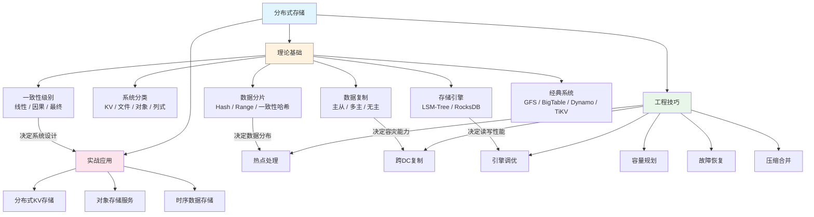
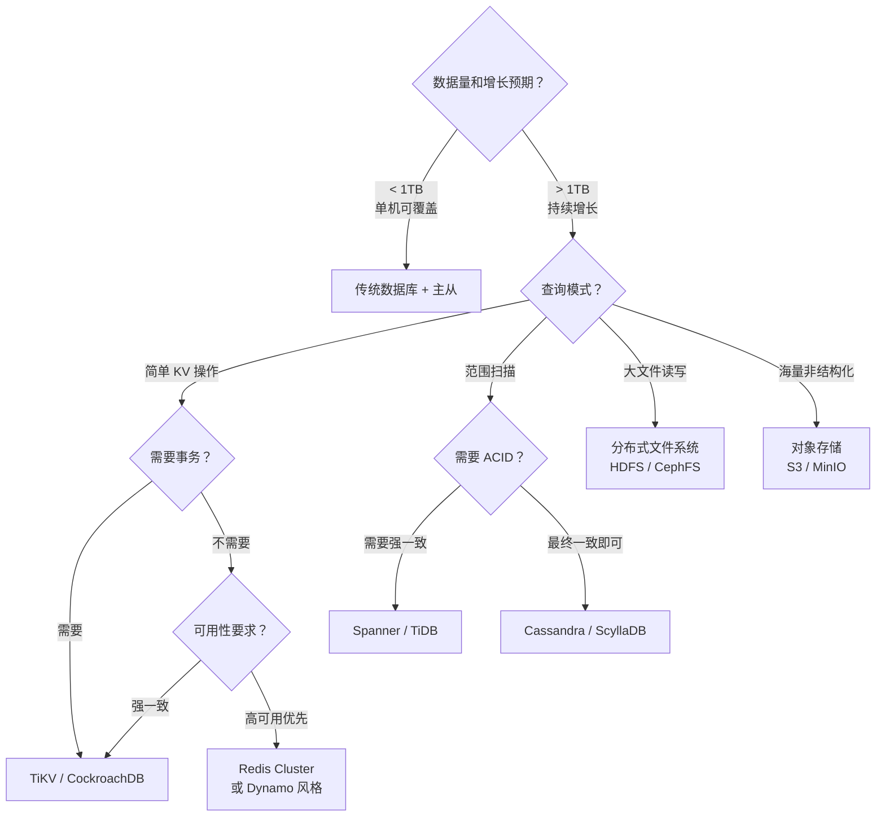

## 本章小结

本章系统性地介绍了分布式存储的完整知识体系，从理论基础到工程实践，从经典系统到前沿趋势，构建了一个从原理到落地的完整认知框架。本节将对全章核心内容进行系统回顾，梳理关键知识点之间的关联关系，并为后续深入学习提供清晰的路径指引。

---

## 核心知识点全景回顾

### 一、分布式存储系统的分类体系

分布式存储系统按照数据模型和访问模式，可划分为四大类别。理解每种类型的本质特征和适用场景，是进行技术选型的基础。

| 存储类型 | 数据模型 | 典型接口 | 核心优势 | 代表系统 | 适用场景 |
|---------|---------|---------|---------|---------|---------|
| 键值存储 | Key → Value | Put/Get/Delete | 极致水平扩展 | Dynamo, TiKV, Redis Cluster | 会话管理、配置中心、购物车 |
| 分布式文件系统 | 文件 + 目录 | Create/Append/Read | 大文件顺序读写 | GFS, HDFS | 日志聚合、大数据批处理 |
| 对象存储 | 不可变对象 | PutObject/GetObject | 高持久性、低成本 | S3, MinIO | 图片视频、备份归档、数据湖 |
| 列式存储 | 行键 + 列族 + 时间戳 | Scan/Get/Put | 稀疏数据高效查询 | BigTable, Cassandra, ScyllaDB | 时序数据、用户画像、事件日志 |

**选型决策要点**：

- 需要简单 KV 操作且追求极致扩展性 → 键值存储
- 需要处理 TB 级大文件（日志、视频） → 分布式文件系统
- 需要存储海量非结构化数据且追求低成本 → 对象存储
- 需要按列查询的结构化/半结构化数据 → 列式存储

实际项目中，这四类存储并非互斥。一个成熟的系统架构往往同时使用多种存储：用 Redis Cluster 做缓存，用 S3 做对象归档，用 Cassandra 做时序数据，用 HDFS 做离线分析。理解它们的边界和协作方式，比死记硬背单一技术更重要。

### 二、三大核心机制

分布式存储的三个核心问题——数据怎么拆（分片）、数据怎么备（复制）、数据怎么一致（一致性）——构成了整个知识体系的骨架。

#### 2.1 数据分片策略

分片决定了数据在节点间的分布方式，直接影响负载均衡和查询效率。

| 分片策略 | 范围查询 | 负载均衡 | 扩展性 | 数据迁移量 | 典型系统 |
|---------|---------|---------|-------|-----------|---------|
| 简单 Hash | 不支持 | 好 | 差 | 几乎全量迁移 | — |
| 虚拟分片 Hash | 不支持 | 好 | 中等 | 部分虚拟节点迁移 | — |
| Range 分片 | 支持 | 可能热点 | 好 | 按区间迁移 | BigTable, HBase |
| 一致性哈希 | 不支持 | 好 | 好 | 约 1/(N+1) 数据 | Dynamo, Cassandra |

**关键理解**：一致性哈希不是银弹。它解决了"节点增减时最小化数据迁移"的问题，但不支持范围查询。TiKV 的做法是"混合策略"——先用一致性哈希确定 Region，再在 Region 内部用 Range 组织数据，兼具两者优势。

虚拟节点的数量选择是一个工程权衡：太少则分布不均匀（标准差大），太多则元数据开销增加。实践中 100-200 个虚拟节点/物理节点 是比较好的平衡点。

#### 2.2 数据复制策略

复制解决了"如何在多节点间保持数据冗余"的问题。三种策略各有明确的适用场景：

**主从复制（Leader-Based）**
- 所有写入经过 Leader，Follower 异步/半同步复制
- 优势：实现简单、写入路径清晰
- 风险：Leader 故障需要选举切换，切换期间可能不可用
- 适用：绝大多数单数据中心场景（MySQL 主从、Redis 主从）

**多主复制（Multi-Leader）**
- 多个节点同时接受写入，通过异步复制保持同步
- 核心挑战：写入冲突处理（Last-Writer-Wins / 向量时钟 / CRDT）
- 适用：多数据中心写入场景（Cassandra 多 DC、CockroachDB）

**无主复制（Leaderless）**
- 任意节点可接受读写，通过 Quorum 机制保证一致性
- 优势：没有单点故障，"always writable"
- 适用：对可用性要求极高的场景（Dynamo、Riak）

**Quorum 机制**是理解复制策略的核心：

N = 副本总数（通常 3）
W = 写入确认数
R = 读取确认数

当 W + R > N 时，读写集合必然有交集，可保证强一致性
典型配置：N=3, W=2, R=2（或 N=3, W=2, R=1 以降低读延迟）

W 和 R 的选择是一个**一致性 vs 延迟 vs 可用性**的三角权衡：
- W=N, R=1：强一致性，写延迟高
- W=1, R=N：读延迟高，写快
- W=1, R=1：最快但无一致性保证

#### 2.3 一致性级别

一致性是一个连续的光谱，而非简单的"强/弱"二分法。

| 一致性级别 | 语义保证 | 延迟 | 可用性 | 实现复杂度 | 适用场景 |
|-----------|---------|------|--------|-----------|---------|
| 线性一致性 | 写完成后所有读立即可见 | 高 | 低 | 高 | 金融交易、分布式锁 |
| 因果一致性 | 因果相关的操作顺序一致 | 中 | 中 | 高 | 协作编辑、社交动态 |
| 读己之写 | 自己的写入后续可见 | 中 | 中 | 中 | 用户个人设置 |
| 最终一致性 | 无新写入时最终收敛 | 低 | 高 | 低 | 社交 Feed、推荐列表 |

**CAP 定理在存储中的体现**：
- CP 系统（选择一致性）：TiKV、Spanner、etcd — 网络分区时拒绝写入
- AP 系统（选择可用性）：Cassandra、DynamoDB — 网络分区时继续服务，可能返回旧数据
- 现代系统越来越多地提供可调一致性（如 Cassandra 的 LOCAL_QUORUM、EACH_QUORUM），让开发者根据场景选择

**线性一致性读**的实现不是免费的。即使写入使用了 Raft 共识协议，读取仍可能返回旧数据——因为 Follower 的日志可能滞后于 Leader。解决方案有三种：
1. 所有读经过 Leader（简单但 Leader 成为瓶颈）
2. 读取时验证 Leader 身份（ReadIndex）
3. 从 Leader 读取但不走 Raft（Lease Read，延迟最低）

### 三、LSM-Tree 存储引擎

LSM-Tree（Log-Structured Merge Tree）是分布式存储中最常用的存储引擎架构，被 RocksDB、LevelDB、Cassandra、HBase 等系统广泛采用。

**核心思想**：将随机写转化为顺序写，通过后台 Compaction 逐步合并数据。

**写入路径**：

Write → WAL（预写日志，保证持久性）
      → MemTable（内存中的有序结构，通常用跳表）
      → 当 MemTable 写满后，Flush 为磁盘上的 SSTable

**读取路径**：

Read → 查 MemTable
     → 查 Bloom Filter（快速判断 key 是否在 SSTable 中）
     → 查 L0 SSTable
     → 查 L1 ~ Ln SSTable
     → 合并结果返回

**Compaction 策略**是 LSM-Tree 性能的关键旋钮：

| Compaction 策略 | 工作方式 | 优势 | 劣势 | 适用场景 |
|----------------|---------|------|------|---------|
| Size-Tiered | 相似大小的 SSTable 合并 | 写放大低 | 读放大高 | 写密集型 |
| Leveled | 从 Ln 合并到 Ln+1，每层大小递增 10x | 读放大低 | 写放大高 | 读写均衡 |
| FIFO | 按时间窗口删除旧数据 | 简单高效 | 不支持更新 | 日志、时序数据 |

**RocksDB 的关键调优参数**：

```yaml
# 写优化
write_buffer_size: 128MB          # MemTable 大小
max_write_buffer_number: 4         # MemTable 数量
level0_file_num_compaction_trigger: 4  # L0 文件触发 Compaction 的数量

# 读优化
block_cache_size: 4GB              # 块缓存大小
bloom_filter_bits_per_key: 10      # Bloom Filter 精度
max_open_files: -1                 # 打开所有文件（SSD 场景）

# Compaction 调优
max_bytes_for_level_base: 256MB    # L1 大小
max_bytes_for_level_multiplier: 10 # 层间倍数
target_file_size_base: 64MB        # SSTable 文件大小
```

### 四、经典系统架构

本章深入分析了五个经典的分布式存储系统，它们各自代表了一种独特的设计哲学：

| 系统 | 论文 | 分片 | 复制 | 一致性 | 核心创新 |
|-----|------|------|------|--------|---------|
| GFS/HDFS | Ghemawat et al., 2003 | 64MB 大块 | 主从 | 异步 | 单 Master + ChunkServer |
| BigTable | Chang et al., 2006 | Range | 主从 | 强一致 | Tablet + LSM-Tree |
| Dynamo | DeCandia et al., 2007 | 一致性哈希 | 无主 | 可调 | Always Writable |
| Cassandra | — | 一致性哈希 | 无主 | 可调 | 去中心化 + Ring |
| TiKV | PingCAP | Region + Range | Raft 主从 | 强一致 | 分布式事务 + Raft |

**GFS 的 64MB 大块设计**背后的考量值得深思：
- 减少 Master 管理的元数据量（1PB 数据只需约 1600 万个 Chunk 元数据）
- 降低客户端与 Master 的交互频率
- 有利于大文件顺序追加的工作负载
- 代价：小文件的最后一个 Chunk 浪费严重，不适合小文件场景

**Dynamo 的设计哲学**——"Always Writable"——与传统数据库形成鲜明对比。Dynamo 认为，在电商场景中，拒绝一个购物车写入请求的代价（失去一笔交易）远高于暂时不一致的代价（两个版本的购物车可以在读取时合并）。这种**以可用性换一致性**的权衡在 CAP 定理框架下是完全合理的。

**TiKV 的混合架构**代表了现代分布式存储的发展方向：用 Raft 保证强一致性，用 Region（类似 Range 分片）组织数据，用 RocksDB 作为底层存储引擎，再通过 Two-Phase Commit 实现分布式事务。这种"分层组合"的设计模式是理解现代分布式存储系统的关键。

### 五、核心工程技巧

本章在理论基础上，深入讲解了六个关键的工程实践技巧：

**1. 热点数据处理**
- 读热点：本地缓存 + 热点 key 自动检测 + 多副本分散读
- 写热点：虚拟分片打散 + 本地聚合批量写 + 写入限流
- 根因分析：热点往往源于数据模型设计不合理（如自增 ID 做 Row Key）

**2. 跨数据中心复制**
- 同步 vs 异步复制的权衡
- 一致性级别在多 DC 环境下的语义变化
- Conflict-Free Replicated Data Types (CRDT) 的应用

**3. 存储引擎调优**
- 写放大、读放大、空间放大的三角权衡
- Bloom Filter 的误判率对读性能的影响
- Compaction 策略的选择与调优

**4. 容量规划与数据生命周期**
- 预估存储需求：当前数据量 × 增长率 × 副本数 × 冗余系数
- 冷热数据分层：Hot → Warm → Cold → Archive
- TTL 和自动删除策略

**5. 故障检测与自动恢复**
- 心跳检测 + Phi Accrual Failure Detector
- 自动故障转移流程
- 数据重建（Rebuild）与修复（Repair）

**6. 压缩与合并策略**
- 压缩算法选择：Snappy（速度优先） vs LZ4（平衡） vs Zstandard（压缩率优先）
- Compaction 限流：避免 Compaction 风暴影响前台读写

---

## 关键公式与量化模型

以下是分布式存储中常用的量化分析工具：

| 概念 | 公式/模型 | 说明 | 实际应用 |
|------|----------|------|---------|
| Little 定律 | QPS = 并发数 / 平均延迟 | 系统吞吐量的基本约束 | 容量规划的起点 |
| 可用性 | SLA = 正常时间 / 总时间 | 99.9% = 8.76h/年, 99.99% = 52.6min/年 | SLA 目标制定 |
| 尾延迟 | P99 = 排序后第 99 百分位值 | P99 比均值更能反映用户体验 | 性能基准测试 |
| Quorum 一致性 | W + R > N | 读写集合有交集即保证一致性 | 副本策略设计 |
| 写放大 | WA = 实际写入量 / 用户写入量 | Compaction 导致的额外写入 | LSM-Tree 调优 |
| 读放大 | RA = 实际读取量 / 用户读取量 | 多层查找导致的额外读取 | Bloom Filter 优化 |
| 一致性哈希迁移量 | Δ = 1/(N+1) | 节点从 N 增到 N+1 时的数据迁移比例 | 扩容方案评估 |
| 数据持久性 | 可用性^副本数 | 3 副本 × 99.9% 可用性 = 99.9999999% 持久性 | 容灾设计 |

---

## 全章知识架构图



---

## 核心决策框架

面对一个分布式存储的选型或设计问题，可以按以下框架进行决策：



---

## 常见误区与纠正

本章识别了分布式存储中的五大典型误区：

| 误区 | 错误认知 | 正确理解 | 纠正建议 |
|------|---------|---------|---------|
| 追求强一致性 | 一致性越强越好 | 强一致 = 高延迟 + 低可用性 | 根据业务容忍度选择一致性级别，大多数场景最终一致性足够 |
| 忽视存储引擎选型 | 存储引擎是底层细节 | 直接决定读写性能特征 | 写密集选 LSM-Tree，读密集选 B-Tree，混合负载考虑 TiKV |
| 混淆副本与纠删码 | 副本数越多越安全 | 副本存储成本 = N 倍，纠删码 = 1.5 倍 | 冷数据用纠删码（RS 编码），热数据用 3 副本 |
| 过度依赖缓存 | 加缓存就能解决性能问题 | 缓存一致性、缓存穿透、缓存雪崩都是坑 | 缓存是加速手段而非架构核心，优先优化存储层本身 |
| 忽视监控运维 | 系统上线就万事大吉 | 分布式系统的故障是常态 | 监控先行：Prometheus + Grafana，告警覆盖延迟/可用性/容量 |

---

## 思考题

以下问题帮助检验你对本章内容的理解深度：

**基础理解**
1. 分布式存储的三大核心问题（分片、复制、一致性）之间是什么关系？改变其中一个会对另外两个产生什么影响？
2. 一致性哈希中的虚拟节点数量如何影响系统性能？太少和太多分别会导致什么问题？
3. LSM-Tree 的 Compaction 过程为什么会引入"写放大"？如何在写放大和读放大之间做权衡？

**深入思考**
4. GFS 选择 64MB 大块的设计在今天是否仍然合理？随着 SSD 普及和存储成本下降，块大小应该如何调整？
5. Dynamo 的 "Always Writable" 理念在什么场景下会带来严重问题？请举出两个具体的反例。
6. TiKV 同时使用 Raft（强一致）和 RocksDB（LSM-Tree），这两种技术的组合在性能上有什么潜在矛盾？TiKV 是如何解决的？

**实践应用**
7. 如果你需要为一个日活 1000 万的社交 App 设计 Feed 存储系统，你会选择什么存储类型？为什么？
8. 在多数据中心部署场景下，如何在数据一致性、写入延迟和可用性之间做权衡？请给出至少两种不同的架构方案。
9. 你的 LSM-Tree 存储引擎 P99 延迟突然从 5ms 飙升到 200ms，可能的原因有哪些？排查步骤是什么？

---

## 下一步学习建议

### 深入方向

| 方向 | 推荐内容 | 预计投入 | 收获 |
|------|---------|---------|------|
| 经典论文精读 | GFS、BigTable、Dynamo、Spanner 原文 | 20-30 小时 | 理解设计者的思考过程和权衡依据 |
| 源码研读 | RocksDB / TiKV / CockroachDB 源码 | 50-100 小时 | 掌握工业级实现的工程细节 |
| 动手实现 | mini KV 存储引擎（参考 23.5 练习方法） | 20-40 小时 | 从零建立对存储引擎的直觉理解 |
| 论文追踪 | OSDI、Systor、VLDB 近年论文 | 持续 | 跟踪分布式存储的最新进展 |

### 推荐资源

**经典论文（必读）**：
- *The Google File System* (Ghemawat et al., SOSP 2003) — 分布式文件系统的奠基之作
- *Bigtable: A Distributed Storage System for Structured Data* (Chang et al., OSDI 2006) — 列式存储的开创性工作
- *Dynamo: Amazon's Highly Available Key-value Store* (DeCandia et al., SOSP 2007) — 无主复制和 AP 系统的标杆
- *Spanner: Google's Globally-Distributed Database* (Corbett et al., OSDI 2012) — 强一致全球分布式数据库

**进阶论文**：
- *Raft: In Search of an Understandable Consensus Algorithm* (Ongaro & Ousterhout, USENIX ATC 2014)
- *WiscKey: Separating Keys from Values in SSD-conscious Storage* (Lu et al., FAST 2016)
- *Scaling Memcache at Facebook* (Nishtala et al., NSDI 2013)

**技术书籍**：
- 《Designing Data-Intensive Applications》(Martin Kleppmann) — 分布式系统设计的圣经
- 《Database Internals》(Alex Petrov) — 存储引擎和分布式数据库的深度解析
- 《大规模分布式存储系统：原理解析与架构实战》(杨传辉) — 中文分布式存储专著

**开源项目（推荐阅读源码）**：
- **RocksDB**：LSM-Tree 引擎的工业级参考实现
- **TiKV**：基于 Raft 的分布式 KV 存储，架构清晰
- **CockroachDB**：NewSQL 数据库，展示了分布式存储的最高复杂度
- **MinIO**：S3 兼容的对象存储，代码量适中适合学习

### 实践路径建议

阶段一（1-2 周）：理论巩固
├── 重读本章理论基础，绘制知识脑图
├── 精读 GFS 和 Dynamo 论文
└── 完成思考题，写出详细答案

阶段二（2-4 周）：动手实践
├── 部署 TiKV / CockroachDB 单机集群
├── 用 RocksDB 实现一个 mini KV 存储引擎
├── 调优 Compaction 策略，对比不同配置的性能
└── 模拟节点故障，观察系统行为

阶段三（1-2 月）：深入研读
├── 阅读 RocksDB 核心代码（MemTable、SSTable、Compaction）
├── 阅读 TiKV 的 Raft 实现和分布式事务实现
├── 阅读 Spanner 论文，理解 TrueTime API
└── 选一个方向做深入研究或开源贡献

阶段四（持续）：跟踪前沿
├── 关注 OSDI、Systor、VLDB 会议论文
├── 追踪 TiKV、CockroachDB 的技术博客
└── 参与相关技术社区讨论

---

## 本章核心收获

回顾全章，最重要的三个认知提升是：

1. **存储系统设计是权衡的艺术**：没有万能的存储方案，每个设计决策都涉及一致性、可用性、延迟、成本之间的取舍。理解这些权衡比记住具体技术更重要。

2. **分层架构是应对复杂性的有效手段**：从 GFS 的"Master + ChunkServer"到 TiKV 的"Raft + MVCC + RocksDB"，经典系统都采用了分层设计。每一层解决一个问题，层间通过清晰的接口协作。

3. **理论指导实践，实践验证理论**：CAP 定理、一致性哈希、LSM-Tree 这些理论不是考试知识点，而是工程决策的依据。反过来，工程实践中遇到的问题（如 Compaction 风暴、热点数据）也会推动理论的演进（如 WiscKey 的 Key-Value 分离设计）。

分布式存储是一个快速演进的领域，但核心原理是稳定的。掌握本章的知识框架，你就有能力评估和设计任何新的分布式存储系统——无论它的名字是 TiKV、CockroachDB 还是未来尚未诞生的系统。
