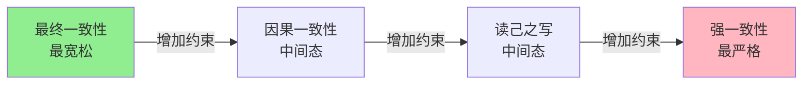
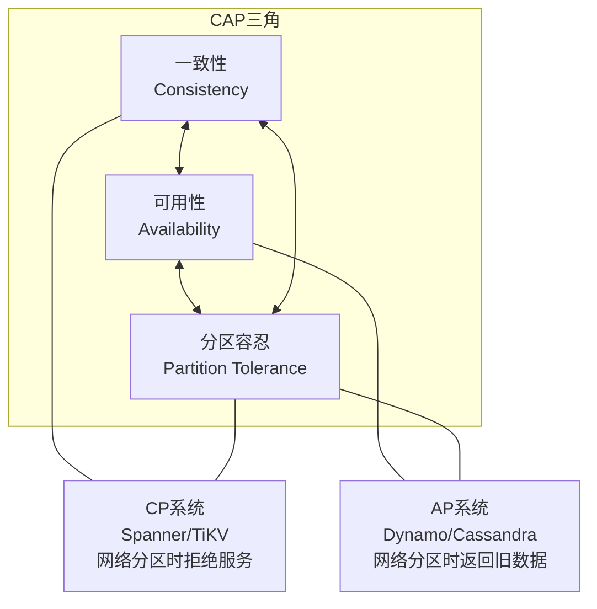
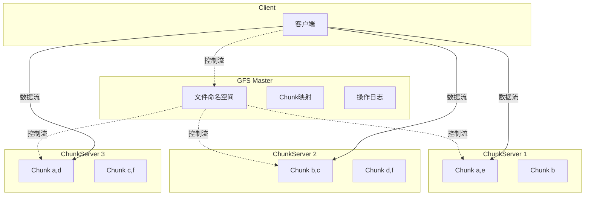
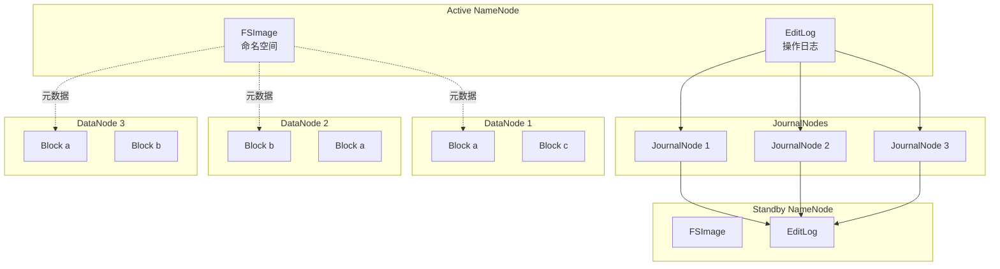
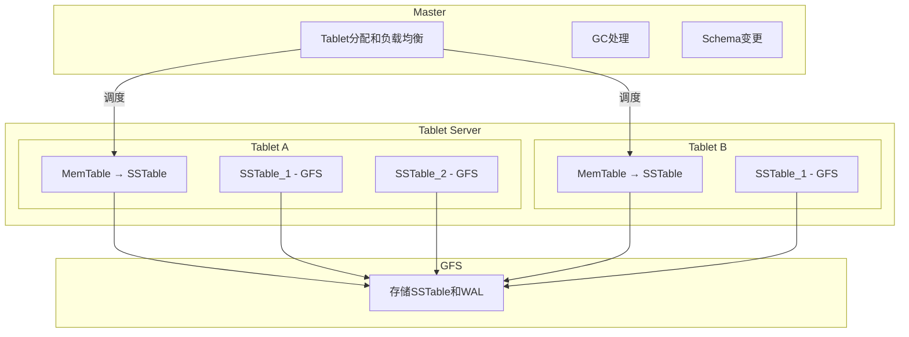
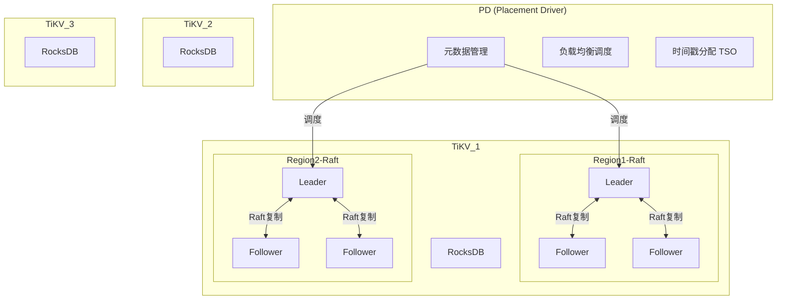
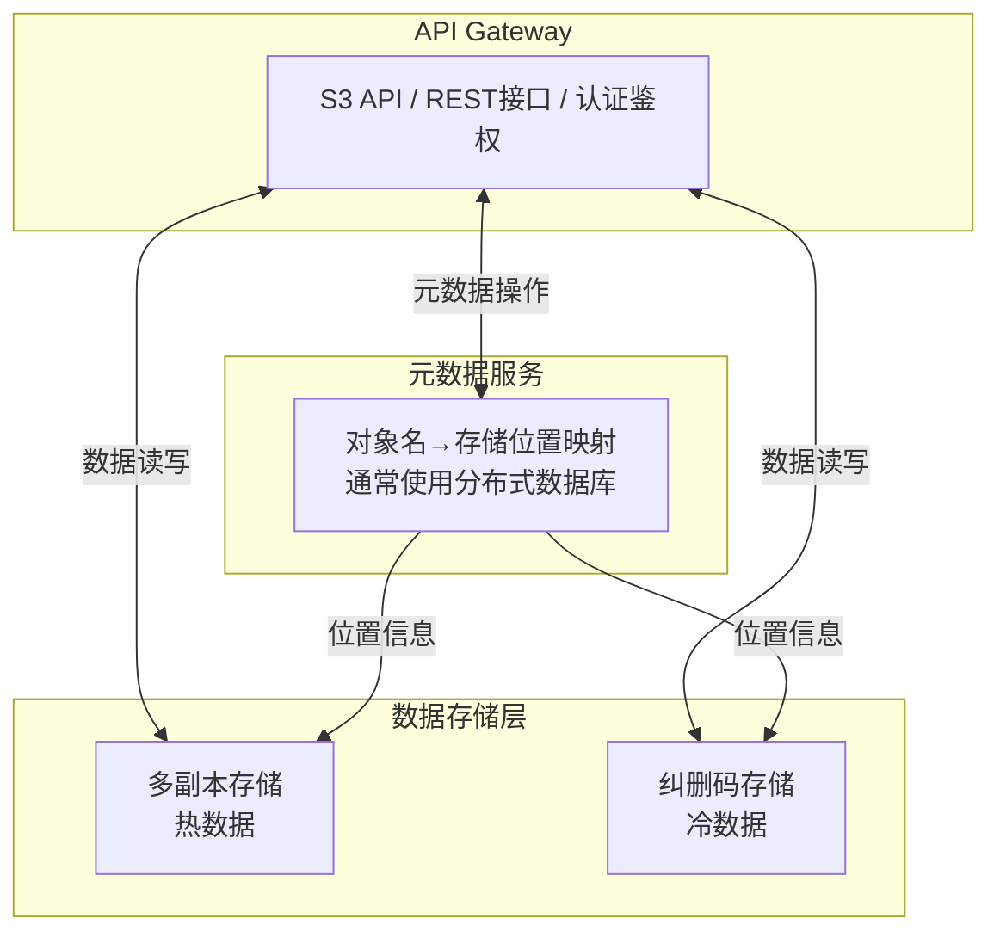
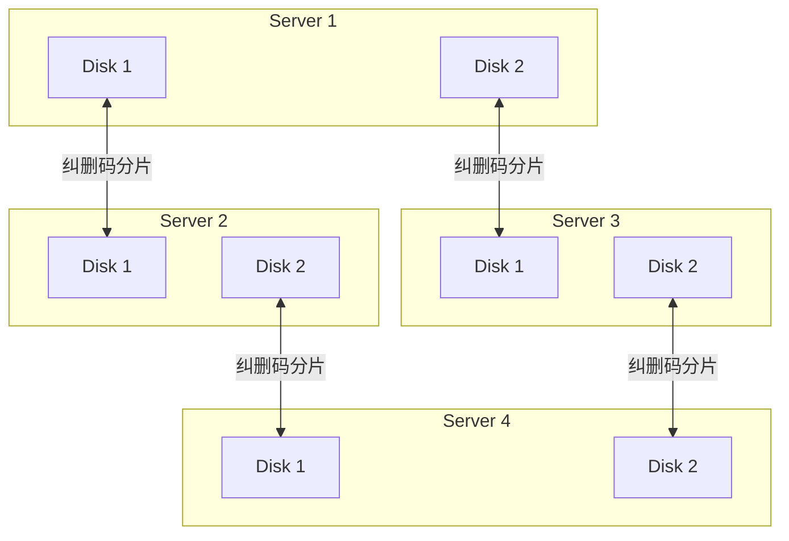
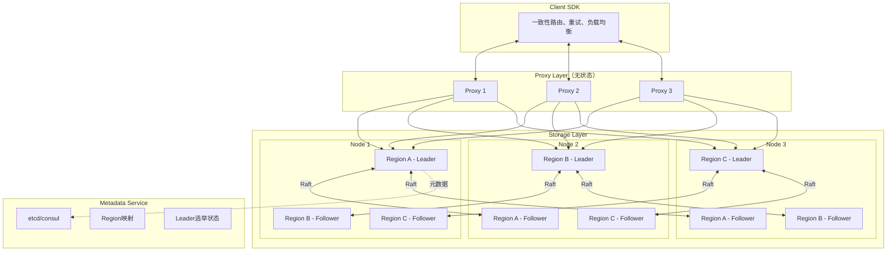
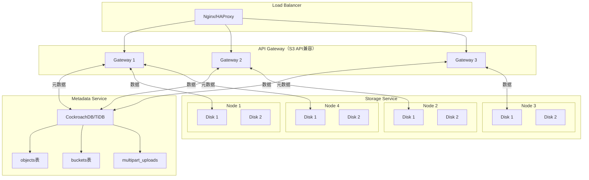

# 第23章 分布式存储

## 章节概览

分布式存储是现代大规模系统架构的基石。从Google的GFS、BigTable到Amazon的Dynamo，分布式存储系统的发展历程深刻塑造了整个云计算和大数据产业的技术方向。本章系统性地介绍分布式存储的核心理论、关键技术和工程实践，帮助读者建立从原理到落地的完整知识体系。

### 为什么需要分布式存储

单机存储面临三大根本性瓶颈：**存储容量受限于单块磁盘或单台机器的上限**；**吞吐量受限于单机I/O带宽和CPU处理能力**；**可用性受限于单点故障——任何硬件故障都可能导致数据丢失或服务不可用**。分布式存储通过将数据分散到多台机器上来突破这些限制，但同时也引入了数据一致性、故障处理、网络分区等全新的挑战。

### 本章内容结构

本章围绕以下几个核心维度展开：

**理论基础**：首先介绍分布式存储系统的分类体系，包括键值存储、分布式文件系统、对象存储和列式存储等不同范式。然后深入探讨数据分片策略（Range分片、Hash分片、一致性哈希）、数据复制策略（主从复制、多主复制、无主复制）和一致性级别（强一致、最终一致、因果一致）。接着详细解析存储引擎设计，特别是LSM-Tree在分布式环境中的应用和RocksDB的实现细节。最后深入分析经典系统架构，包括GFS/HDFS、BigTable/Cassandra/ScyllaDB、Dynamo/Riak、TiKV以及对象存储和纠删码技术。

**核心技巧**：聚焦工程实践中的关键问题，包括热点数据处理、跨数据中心复制、存储引擎调优、容量规划与数据生命周期管理、故障检测与自动恢复、以及压缩与合并策略优化。

**实战案例**：通过三个真实场景展示分布式存储的应用——设计一个分布式KV存储系统、构建对象存储服务、以及实现时序数据存储方案。

**常见误区**：纠正常见的认知偏差和技术决策错误，如过度追求强一致性、忽视存储引擎选型、混淆副本与纠删码等。

**现代趋势**：介绍存算分离、云原生存储、新型存储介质和分布式事务演进等前沿方向。

**练习方法**：提供系统化的学习路径，从阅读经典论文到动手实现mini存储引擎，帮助读者巩固所学知识。

### 学习目标

完成本章学习后，读者应能够：

1. 理解不同分布式存储系统的适用场景和设计权衡
2. 掌握数据分片、复制和一致性的核心理论
3. 能够根据业务需求选择合适的存储方案
4. 具备设计和实现中等规模分布式存储系统的能力
5. 识别和规避分布式存储中的常见陷阱

### 前置知识

本章假设读者已具备以下基础知识：
- 基本的数据结构与算法（哈希表、B+树、跳表）
- 操作系统基础（文件系统、I/O模型、内存管理）
- 计算机网络基础（TCP/IP、RPC）
- 数据库基础（事务、索引、查询处理）

建议先阅读第22章（分布式计算）以了解分布式系统的基本概念和挑战。

***

> **经典论文导读**：本章多次引用以下奠基性论文，建议读者结合正文内容阅读原文：
> - *The Google File System* (Ghemawat et al., SOSP 2003)
> - *Bigtable: A Distributed Storage System for Structured Data* (Chang et al., OSDI 2006)
> - *Dynamo: Amazon's Highly Available Key-value Store* (DeCandia et al., SOSP 2007)
> - *Spanner: Google's Globally-Distributed Database* (Corbett et al., OSDI 2012)


***

# 23.1 理论基础

## 分布式存储系统分类

分布式存储系统按数据模型和访问模式可分为四大类：键值存储、分布式文件系统、对象存储和列式存储。每种类型针对不同的应用场景进行了优化设计。

### 键值存储（Key-Value Store）

键值存储是最简单的分布式存储模型。数据以`(key, value)`对的形式存储，支持三种基本操作：`Put(key, value)`、`Get(key)`和`Delete(key)`。

键值存储的设计哲学是**通过限制数据模型来换取水平扩展能力**。由于不支持复杂查询，系统可以将所有精力集中在高可用和高吞吐上。

典型的键值存储包括：

- **Amazon Dynamo**（内部系统）：开创性地使用一致性哈希、向量时钟和gossip协议，牺牲强一致性换取高可用性
- **Riak**：Dynamo论文的开源实现，提供可调一致性级别
- **TiKV**：PingCAP开发的分布式KV存储，基于Raft共识协议，支持分布式事务
- **Redis Cluster**：内存键值存储的分布式方案，主要用于缓存场景

键值存储的典型应用场景包括用户会话管理、配置中心、分布式锁和购物车等。Dynamo论文中描述的Amazon购物车就是一个经典案例——即使在网络分区时，系统也应继续接受写入，而不是拒绝服务。

### 分布式文件系统

分布式文件系统将传统的文件系统抽象扩展到多台机器上，提供类似POSIX的文件访问接口。与键值存储不同，分布式文件系统面向的是**大文件的顺序读写**场景。

GFS（Google File System）和HDFS（Hadoop Distributed File System）是这一类别的代表。GFS论文（Ghemawat et al., 2003）提出了几个关键设计决策：

1. **64MB大块设计**：远大于传统文件系统的4KB块。大块减少了Master节点需要管理的元数据量，降低了客户端与Master的交互频率，同时有利于顺序读写
2. **单Master架构**：简化了系统设计，但Master成为潜在瓶颈
3. **针对追加操作优化**：GFS的主要工作负载是大文件的顺序追加，随机写入不是优化重点

GFS的核心接口如下：

// GFS主要接口
GFS::Create(filename)           // 创建文件
GFS::Append(filename, data)     // 追加数据到文件末尾
GFS::Read(filename, offset, len) // 从指定位置读取数据
GFS::Snapshot(filename)         // 创建文件快照
GFS::Delete(filename)           // 删除文件

HDFS在GFS的基础上做了若干改进：
- 将Master拆分为NameNode（管理元数据）和DataNode（存储数据块）
- 引入了Secondary NameNode来辅助NameNode的checkpoint操作
- 后来的HDFS Federation允许多个NameNode管理不同的命名空间
- HDFS HA通过Active/Standby NameNode解决了单点故障问题

### 对象存储

对象存储是介于文件系统和键值存储之间的存储范式。每个对象由以下部分组成：

Object = {
    Key: string,          // 对象唯一标识
    Data: bytes,          // 对象实际数据（通常不可变）
    Metadata: map,        // 自定义元数据（键值对）
    Version: string,      // 版本标识
}

与文件系统不同，对象存储**没有目录层级结构**——虽然S3 API使用`/`分隔的key来模拟目录，但这只是逻辑上的组织方式，底层是扁平的命名空间。

Amazon S3（Simple Storage Service）是对象存储的事实标准，其API已成为行业通用接口：

// S3核心操作
PutObject(bucket, key, data, metadata)    // 上传对象
GetObject(bucket, key) → data, metadata   // 下载对象
DeleteObject(bucket, key)                 // 删除对象
ListObjects(bucket, prefix, delimiter)    // 列举对象
CopyObject(srcBucket, srcKey, dstBucket, dstKey) // 复制对象

S3的设计特点包括：
- **高持久性**：S3 Standard提供11个9（99.999999999%）的持久性
- **最终一致性**（S3在2020年后已改为强一致读）
- **分层存储**：Standard、Infrequent Access、Glacier等不同存储类别
- **生命周期策略**：自动将数据迁移到更低成本的存储层

对象存储的典型应用场景包括图片和视频存储、数据备份和归档、大数据湖（Data Lake）等。

### 列式存储

列式存储按列而非按行组织数据，天然适合OLAP（在线分析处理）场景。

BigTable（Chang et al., 2006）是列式存储的开创性工作，其数据模型如下：

(row_key, column_family:column_qualifier, timestamp) → value

BigTable的关键设计包括：
- **行键有序**：所有数据按行键字典序排列，支持高效的范围扫描
- **列族（Column Family）**：列按族分组，同一列族的数据物理上存储在一起
- **多版本**：每个单元格可以保留多个时间戳版本
- **基于SSTable和MemTable**：底层存储引擎使用LSM-Tree

BigTable的数据组织层次：

Tablet (逻辑分片)
  ├── SSTable (磁盘上的有序字符串表)
  ├── SSTable
  └── MemTable (内存中的有序结构)

Cassandra在BigTable的基础上引入了去中心化设计，去掉了Master节点，所有节点地位相同。Cassandra的数据模型更接近关系数据库：

```sql
CREATE TABLE users (
    user_id UUID PRIMARY KEY,
    name TEXT,
    email TEXT
);

CREATE TABLE posts (
    user_id UUID,
    post_id TIMEUUID,
    content TEXT,
    PRIMARY KEY (user_id, post_id)
) WITH CLUSTERING ORDER BY (post_id DESC);
```

ScyllaDB是Cassandra的C++重写版本，通过以下优化实现了10倍以上的性能提升：
- **Seastar框架**：基于异步I/O和per-core线程模型，避免锁竞争
- **零拷贝网络**：减少数据在用户态和内核态之间的拷贝
- **用户态调度**：避免内核调度器的不可预测性

***

## 数据分片策略

数据分片（Sharding/Partitioning）是将数据分布到多个节点的核心技术。分片策略直接影响系统的负载均衡、查询效率和扩展能力。

### Hash分片

Hash分片通过哈希函数将key映射到分片编号：

partition_id = hash(key) % num_partitions

**优点**：
- 数据分布均匀，天然避免热点问题
- 实现简单，计算开销低

**缺点**：
- 不支持范围查询，因为相邻key的哈希值可能分布在不同分片上
- 扩容时需要大量数据迁移（分片数变化导致几乎所有key需要重新映射）

**改进方案——虚拟分片**：将哈希空间划分为固定数量的虚拟分片（如1024或4096个），虚拟分片与物理节点的映射可以灵活调整。当节点增减时，只需调整虚拟分片的归属，无需重新计算哈希。

// 虚拟分片示例
virtual_partitions = 4096
partition_id = hash(key) % virtual_partitions

// 虚拟分片到物理节点的映射
partition_map = {
    0 → Node_A,
    1 → Node_B,
    2 → Node_A,
    ...
}

### Range分片

Range分片将key空间划分为连续的区间，每个区间分配给一个分片：

Partition 1: [key_min, key_100)
Partition 2: [key_100, key_200)
Partition 3: [key_200, key_300)
...

**优点**：
- 支持高效的范围查询（扫描相邻key在同一分片内）
- 可以根据数据分布动态调整分片边界

**缺点**：
- 容易产生热点——如果key是时间戳，所有写入都会集中在最后一个分片
- 需要维护分片边界元数据

Range分片适合需要范围扫描的场景，如时间序列数据库和有序键值存储。BigTable和HBase都采用Range分片。

### 一致性哈希（Consistent Hashing）

一致性哈希由Karger等人在1997年提出，是分布式系统中最重要的基础算法之一。其核心思想是将节点和数据都映射到同一个哈希环上：

// 一致性哈希的基本实现
class ConsistentHash:
    ring = SortedMap()  // 哈希环
    
    def add_node(node):
        for i in range(num_virtual_nodes):
            hash_val = hash(node + ":" + str(i))
            ring[hash_val] = node
    
    def remove_node(node):
        for i in range(num_virtual_nodes):
            hash_val = hash(node + ":" + str(i))
            ring.remove(hash_val)
    
    def get_node(key):
        hash_val = hash(key)
        // 在环上顺时针查找第一个节点
        for ring_hash, node in ring.items_from(hash_val):
            return node
        return ring.first_value()  // 绕回环的起点

**虚拟节点**是一致性哈希的关键改进。没有虚拟节点时，物理节点在环上的分布可能不均匀，导致负载倾斜。通过为每个物理节点创建多个虚拟节点（通常100-200个），可以使分布更加均匀。

物理节点 A → 虚拟节点 A#0, A#1, A#2, ..., A#149
物理节点 B → 虚拟节点 B#0, B#1, B#2, ..., B#149
物理节点 C → 虚拟节点 C#0, C#1, C#2, ..., C#149

一致性哈希的优势在于**当节点增减时，只有少部分数据需要迁移**。具体来说，当从N个节点增加到N+1个节点时，大约只有1/(N+1)的数据需要移动。

Dynamo论文对一致性哈希的使用方式有所不同。Dynamo不是简单地将数据映射到哈希环上的第一个节点，而是将数据复制到环上连续的T个节点（T通常为3），这样每个节点负责环上它前面一段区域的数据，同时也作为这段区域后面节点的副本持有者。

### 分片策略对比

| 策略 | 范围查询 | 负载均衡 | 扩展性 |
|------|---------|---------|--------|
| 简单Hash | 不支持 | 好 | 差（需全量迁移） |
| 虚拟分片Hash | 不支持 | 好 | 中等 |
| Range分片 | 支持 | 可能热点 | 好（动态分裂） |
| 一致性哈希 | 不支持 | 好 | 好（最小迁移） |

实际系统中，很多分布式存储结合了多种分片策略。例如TiKV先使用一致性哈希确定Region，再在Region内部使用Range组织数据；Cassandra使用Murmur3哈希将key映射到Token环上，同时使用虚拟节点改善分布均匀性。

***

## 数据复制策略

数据复制是分布式存储保证可靠性和可用性的核心机制。当数据被复制到多个节点时，即使部分节点故障，系统仍能正常服务。

### 主从复制（Leader-Based Replication）

主从复制是最常见的复制策略。在任何时刻，数据的一个副本被选为Leader（主节点），其他副本为Follower（从节点）。所有写入操作必须通过Leader，Follower从Leader同步数据。

写入流程：
Client → Leader: Write(key, value)
Leader: 写入本地日志
Leader → Follower_1: Replicate(log_entry)
Leader → Follower_2: Replicate(log_entry)
Follower_1 → Leader: ACK
Follower_2 → Leader: ACK
Leader → Client: Success  // 收到多数ACK后返回

主从复制的核心问题是**同步策略的选择**：

**同步复制**：Leader等待所有Follower确认后才返回成功给客户端。
- 优点：强一致性保证
- 缺点：任何一个Follower故障都会阻塞写入

**异步复制**：Leader写入本地后立即返回成功，异步复制到Follower。
- 优点：写入延迟低，不受Follower影响
- 缺点：Leader故障时可能丢失未复制的数据

**半同步复制**：Leader等待多数（quorum）Follower确认后返回。这是大多数分布式系统采用的策略。

// Quorum复制
N = 3  // 总副本数
W = 2  // 写入需要的确认数
R = 2  // 读取需要的副本数

// 当 W + R > N 时，读写集合必然有交集，保证一致性

### 多主复制（Multi-Leader Replication）

多主复制允许多个节点同时接受写入。适用于需要多数据中心写入的场景。

数据中心A(Leader) ←→ 数据中心B(Leader) ←→ 数据中心C(Leader)
      ↓                    ↓                    ↓
   Follower_1           Follower_2           Follower_3

多主复制的核心挑战是**写入冲突处理**。当两个数据中心同时修改同一个key时，需要一种机制来解决冲突：

**冲突解决策略**：
1. **Last-Writer-Wins (LWW)**：使用时间戳，最后写入的覆盖之前的。简单但可能丢失数据
2. **向量时钟（Vector Clock）**：记录每个节点的逻辑时钟，可以检测冲突但不自动解决
3. **CRDT（Conflict-free Replicated Data Types）**：设计特殊的数据结构，使得合并操作总是收敛的

Dynamo论文使用向量时钟来检测冲突：

// 向量时钟示例
Node A 写入: D1([A:1])
Node B 读取 D1 并写入: D2([A:1, B:1])
Node A 读取 D1 并写入: D3([A:2])

// D2 和 D3 的向量时钟互不支配，说明存在冲突
// 需要应用层或读取时解决

### 无主复制（Leaderless Replication）

无主复制没有固定的Leader，任何节点都可以接受读写请求。Dynamo论文开创了这一范式。

// 无主复制的读写流程
写入：Coordinator → 同时写入 N 个节点，等待 W 个确认
读取：Coordinator → 同时读取 N 个节点，取 R 个响应中版本最高的

// 典型配置
N=3, W=2, R=2

当某些节点的数据过期时，需要**读修复（Read Repair）**和**反熵（Anti-Entropy）**机制来恢复一致性：

**读修复**：客户端读取时发现某些副本版本较旧，将新版本写回这些副本。

Client 读取 key1:
  Node_A 返回 version=5, value="new"
  Node_B 返回 version=3, value="old"
  Node_C 返回 version=5, value="new"

Client 检测到 Node_B 版本过旧:
  Client → Node_B: Write(key1, "new", version=5)

**反熵**：后台进程定期扫描节点间的数据差异，使用Merkle树高效比较。

// Merkle树用于高效检测数据不一致
Merkle树:
         hash(全部数据)
        /              \
    hash(左半部分)    hash(右半部分)
    /        \        /        \
  hash(0-3) hash(4-7) hash(8-11) hash(12-15)

// 比较时从根节点开始，不同的分支继续向下比较
// 只需要O(log N)次比较就能定位不一致的数据范围

无主复制的优势在于**高可用性**——没有单点故障，部分节点故障不影响系统可用性。Dynamo论文将这种设计理念总结为"always writable"：系统应始终能够接受写入，即使在网络分区的情况下。

***

## 一致性级别

分布式系统中的一致性是一个连续的光谱，而非简单的"强/弱"二分法。

### 强一致性（Linearizability）

强一致性也叫线性一致性，是最严格的一致性模型。它保证：**一旦一个写操作完成，所有后续的读操作都能看到这个写入的值**。

Timeline:
  Client A: ----Write(x=1)---->  <complete>
  Client B: ----------Read(x)---->  <returns 1>
  
// 线性一致性保证：如果 Write(x=1) 在 Read(x) 开始之前完成，
// Read(x) 必须返回 1

实现强一致性的方法：
- **Raft/Paxos共识协议**：写入需要多数节点确认
- **两阶段提交（2PC）**：所有节点都确认后才提交
- **线性化读**：读取时也需要走共识协议，或读取Leader并确认Leader身份

// Raft写入流程
Client → Leader: Write(x=1)
Leader: 追加到本地日志
Leader → Followers: AppendEntries(x=1)
Followers → Leader: ACK (多数确认)
Leader: 提交日志
Leader → Client: Success

强一致性的代价是**高延迟**和**低可用性**——在网络分区时，为了保证一致性，系统可能需要拒绝服务。

### 最终一致性（Eventual Consistency）

最终一致性是最宽松的一致性模型。它只保证：**如果没有新的写入，最终所有副本都会收敛到相同的值**。

Timeline:
  Client A: ----Write(x=1)---->  <complete>
  Client B: --Read(x)-->  <returns 0>  // 可能读到旧值
  Client B: ----Read(x)---->  <returns 0>  // 可能还是旧值
  // ... 一段时间后
  Client B: ------Read(x)------>  <returns 1>  // 最终收敛

最终一致性不保证收敛需要多长时间——可能是毫秒级，也可能是小时级。实际系统通常在几秒到几十秒内收敛。

最终一致性的优势在于**高可用性和低延迟**。Cassandra、DynamoDB等AP系统默认提供最终一致性，同时允许客户端根据需要选择更强的一致性级别。

### 因果一致性（Causal Consistency）

因果一致性介于强一致性和最终一致性之间。它保证：**如果操作A因果上先于操作B（即B可能依赖于A的结果），那么所有节点看到的A和B的顺序是一致的**。

// 因果关系示例
// 1. Alice 发帖
Alice: Write(post_1, "Hello World")

// 2. Alice 给 Bob 发帖的链接
Alice → Bob: "看看我的帖子 post_1"

// 3. Bob 读取帖子
Bob: Read(post_1) → 必须返回 "Hello World"

// 因果一致性保证：如果 Bob 的读取因果上依赖于 Alice 的写入，
// Bob 一定能看到 Alice 写入的值，即使系统是分布式的

因果一致性的实现通常使用**向量时钟**或**版本向量**来追踪操作间的因果关系。每个客户端维护一个"已看到"的版本向量，读取时将这个向量发送给服务器，服务器确保返回的值与客户端已看到的值是因果一致的。

### 一致性级别对比

| 一致性级别 | 延迟 | 可用性 | 复杂度 | 适用场景 |
|-----------|------|--------|--------|---------|
| 强一致性 | 高 | 低 | 高 | 金融交易 |
| 因果一致性 | 中 | 中 | 高 | 协作编辑 |
| 读己之写 | 中 | 中 | 中 | 用户配置 |
| 最终一致性 | 低 | 高 | 低 | 社交动态 |



### CAP定理的实际含义

CAP定理指出，在网络分区（P）发生时，系统必须在一致性（C）和可用性（A）之间做出选择。但这不是一个简单的二选一：



实际系统的做法：
1. **正常运行时**：同时提供C和A
2. **网络分区时**：根据操作类型做出不同选择
   - 关键操作（如转账）：选择一致性，拒绝服务
   - 非关键操作（如浏览）：选择可用性，返回可能过期的数据

这就是PACELC模型：
- 如果Partition → 选A还是C？
- Else（正常时）→ 选Latency还是Consistency？

***

## 分布式存储引擎

### LSM-Tree在分布式环境中的应用

LSM-Tree（Log-Structured Merge-Tree）是当前分布式存储系统中最流行的存储引擎设计。它的核心思想是**将随机写入转换为顺序写入**，从而大幅提升写入性能。

LSM-Tree的基本架构：

写入路径：
  Write → MemTable (内存，有序) → 达到阈值 → Flush到SSTable (磁盘)

读取路径：
  Read → 查MemTable → 查各层SSTable → 合并结果

Compaction (后台合并)：
  Level 0 SSTable → 合并 → Level 1 SSTable
  Level 1 SSTable → 合并 → Level 2 SSTable
  ...

LSM-Tree的写入流程伪代码：

function Put(key, value):
    // 1. 写WAL保证持久性
    wal.append(key, value)
    
    // 2. 写入MemTable（内存中的有序结构）
    memtable.put(key, value)
    
    // 3. 如果MemTable达到阈值，刷盘
    if memtable.size() >= FLUSH_THRESHOLD:
        immutable_memtable = memtable
        memtable = new MemTable()
        
        // 异步将immutable_memtable写为SSTable
        async flush_to_sstable(immutable_memtable)

LSM-Tree的读取流程：

function Get(key):
    // 1. 先查MemTable
    result = memtable.get(key)
    if result != TOMBSTONE:
        return result
    
    // 2. 从新到旧逐层查找SSTable
    for level in 0..max_level:
        for sstable in level_sstables[level].reverse():
            // 使用Bloom Filter快速判断key是否可能在该SSTable中
            if sstable.bloom_filter.might_contain(key):
                result = sstable.get(key)
                if result != NOT_FOUND:
                    return result
    
    return NOT_FOUND

LSM-Tree在分布式环境中的优势：

1. **高写入吞吐**：顺序写入磁盘的吞吐量远高于随机写入，这对分布式系统中大量节点同时写入的场景非常有利
2. **压缩友好**：SSTable是不可变的，可以高效压缩，减少磁盘占用和网络传输量
3. **适合SSD**：顺序写入减少了SSD的写放大，延长使用寿命

LSM-Tree的主要问题是**读放大**和**写放大**：

- **读放大**：读取可能需要查询多个SSTable。通过Bloom Filter和分层Compaction来缓解
- **写放大**：数据在Compaction过程中被反复读写。LevelDB的Leveled Compaction写放大约为10-30倍
- **空间放大**：同一key的多个版本占用额外空间。通过Compaction清理过期版本

### Compaction策略

LSM-Tree的Compaction策略直接影响系统的性能特征：

**Leveled Compaction**（LevelDB/RocksDB默认）：
Level 0: SSTable_0, SSTable_0, SSTable_0  (可能重叠)
Level 1: SSTable_1, SSTable_1, SSTable_1  (不重叠, 10x Level 0)
Level 2: SSTable_2, ... SSTable_2          (不重叠, 10x Level 1)

Compaction: 从Level N选取一个SSTable，与Level N+1中重叠的SSTable合并

**Size-Tiered Compaction**（Cassandra默认）：
当同一大小级别的SSTable数量达到阈值时，将它们合并为一个更大的SSTable

SSTable: [1MB, 1.1MB, 0.9MB] → 合并 → [3MB]
SSTable: [3MB, 3.2MB, 2.8MB, 3.1MB] → 合并 → [12MB]

**Tiered + Leveled 混合策略**：
热数据层（Level 0-1）：使用Size-Tiered，减少写放大
冷数据层（Level 2+）：使用Leveled，减少空间放大和读放大

### RocksDB详解

RocksDB是Facebook基于LevelDB开发的嵌入式KV存储引擎，是当前分布式存储系统中使用最广泛的存储引擎。

RocksDB的关键特性：

**1. Column Family（列族）**

// Column Family允许在同一数据库中逻辑隔离不同类型的数据
Options options;
DB::Open(options, "/path/to/db", &db);

// 创建Column Family
ColumnFamilyHandle* cf;
DB::CreateColumnFamily(options, "metadata", &cf);

// 写入不同Column Family
db->Put(WriteOptions(), default_cf, "user:1", "Alice");
db->Put(WriteOptions(), cf, "schema:version", "3");

// 每个Column Family有独立的MemTable和SSTable
// 但共享WAL

**2. 前缀迭代器（Prefix Iterator）**

// 对于前缀查询，RocksDB可以只扫描匹配前缀的SSTable
ReadOptions options;
options.prefix_same_as_start = true;
auto iter = db->NewIterator(options);
for (iter->Seek(prefix); iter->Valid(); iter->Next()) {
    // 只遍历以prefix开头的key
}

**3. 合并操作（Merge Operator）**

// Merge操作允许在不读取旧值的情况下更新
// 常用于计数器等场景
db->Merge(WriteOptions(), "counter:page_views", "1");

// 定义合并函数
class CounterMergeOperator : public MergeOperator {
    bool FullMergeV2(...) {
        // 将所有增量值相加
        int64_t total = 0;
        for (auto& op : operand_list) {
            total += DecodeInt64(op);
        }
        if (existing_value) {
            total += DecodeInt64(*existing_value);
        }
        *new_value = EncodeInt64(total);
        return true;
    }
};

**4. Blob存储（BlobDB）**

// 对于大value，RocksDB可以将value存储在独立的blob文件中
// 减少SSTable的大小和Compaction开销
Options options;
options.enable_blob_files = true;
options.min_blob_size = 1024;  // value超过1KB时使用blob存储
options.blob_file_size = 256 * 1024 * 1024;  // blob文件256MB

**5. Remote Compaction**

// RocksDB 6.x引入的Remote Compaction
// 将Compaction任务从存储节点offload到计算节点
// 减少存储节点的CPU和I/O压力

// 典型架构：
// Storage Node → 发送SSTable到Compaction Service
// Compaction Service → 执行Compaction
// Compaction Service → 返回合并后的SSTable

RocksDB在分布式存储中的应用：
- **TiKV**：使用RocksDB作为底层存储引擎，一个TiKV实例包含两个RocksDB实例（一个存Raft Log，一个存实际数据）
- **CockroachDB**：使用RocksDB（后迁移到Pebble，一个Go实现的类RocksDB引擎）
- **Cassandra**：使用RocksDB作为可选的存储引擎
- **YugabyteDB**：使用RocksDB作为DocDB的底层存储

***

## GFS/HDFS架构

### GFS架构

GFS（Google File System）是Google在2003年发表的分布式文件系统，是后续众多分布式存储系统的基础。

**整体架构**：



**关键设计决策**：

1. **64MB大块大小**：远大于传统文件系统，减少了Master需要维护的元数据量，也减少了客户端与Master的交互频率
2. **单Master设计**：简化了系统设计，Master掌握所有元数据，可以做出全局最优的决策
3. **数据流与控制流分离**：控制流经过Master，数据流直接在Client和ChunkServer之间传输
4. **副本放置策略**：跨机架放置副本，即使整个机架故障也能恢复

**写入流程**：

Client想要写入Chunk:
1. Client → Master: 请求持有该Chunk Lease的Primary节点
2. Master → Client: 返回Primary和Secondary节点列表
3. Client → 所有副本: 推送数据（链式传输优化带宽）
4. Client → Primary: 发送写入请求
5. Primary: 确定写入顺序，通知Secondary
6. Secondary → Primary: 确认完成
7. Primary → Client: 返回结果

GFS的一个重要设计哲学是**"针对追加操作优化"**。GFS的工作负载主要是大文件的顺序追加，因此它使用了Record Append操作而不是随机写入。

### HDFS架构

HDFS（Hadoop Distributed File System）是GFS的开源实现。其架构如下：



HDFS相对于GFS的主要改进：

1. **NameNode HA**：通过Active/Standby NameNode实现高可用，使用JournalNode共享EditLog
2. **HDFS Federation**：多个NameNode管理不同的命名空间，扩展了命名空间的容量
3. **Erasure Coding**：HDFS 3.0引入纠删码，相比3副本将存储开销从300%降低到约150%
4. **Router-based Federation**：使用Router组件将客户端请求路由到正确的NameNode

HDFS的块大小默认为128MB（GFS为64MB），这是因为现代硬件的顺序读写性能更高，更大的块可以进一步减少元数据量。

***

## BigTable/Cassandra/ScyllaDB架构对比

### BigTable

BigTable是Google的分布式宽列存储系统，构建在GFS和Chubby（分布式锁服务）之上。其架构如下：



BigTable的数据模型：
// 行键是任意字符串，按字典序排列
// 列族需要预先创建，列限定符可以动态添加
// 每个单元格可以保留多个版本

// 示例：WebTable
"com.cnn.www" : {
    "contents": {
        t5: "<html>...",
        t3: "<html>...",
    },
    "anchor:cnn.com": {
        t9: "CNN",
        t8: "CNN Homepage",
    },
    "anchor:nytimes.com": {
        t6: "CNN.com",
    }
}

// Row Key设计：反向域名使得同一域名的页面在存储上相邻

### Cassandra

Cassandra由Facebook开发并开源，是一个去中心化的宽列存储系统。

Cassandra的关键设计特点：

1. **去中心化架构**：没有Master节点，所有节点对等，使用gossip协议进行节点发现
2. **可调一致性**：通过`ONE`、`QUORUM`、`ALL`等一致性级别让客户端按需选择
3. **LSM-Tree存储引擎**：写入先到MemTable，再flush为SSTable
4. **跨数据中心复制**：支持多种复制策略（NetworkTopologyStrategy、SimpleStrategy）

Cassandra的集群架构：

Node 1 (DC1) ←gossip→ Node 2 (DC1) ←gossip→ Node 3 (DC1)
    ↕                       ↕                       ↕
Node 4 (DC2) ←gossip→ Node 5 (DC2) ←gossip→ Node 6 (DC2)

// 每个节点负责Token环上的一段
// 使用虚拟节点（vnode）改善分布均匀性
// 默认每个物理节点有256个虚拟节点

Cassandra的读写路径：

写入路径：
1. Client → Coordinator Node (任意节点)
2. Coordinator 根据分区键计算目标节点
3. Coordinator → 目标节点及其副本: 并行写入
4. 等待W个确认后返回

读取路径：
1. Client → Coordinator Node
2. Coordinator → 所有副本: 并行读取
3. 等待R个响应
4. 比较版本，返回最新的
5. 如果有旧副本，触发Read Repair

### ScyllaDB

ScyllaDB是Cassandra的C++重写版本，兼容Cassandra的CQL接口和数据模型，但在性能上有数量级的提升。

ScyllaDB的核心优化：

1. **Seastar框架**：每个CPU核心一个线程，线程之间不共享数据，避免锁竞争
2. **用户态TCP栈**：绕过内核网络栈，减少系统调用开销
3. **异步I/O**：所有I/O操作异步执行，不阻塞线程
4. **自动调优**：根据工作负载自动调整Compaction策略和内存分配

ScyllaDB vs Cassandra 性能对比（相同硬件）：

| 操作 | Cassandra | ScyllaDB |
|------|-----------|----------|
| 简单写入 | 50K ops/s | 500K ops/s |
| 简单读取 | 40K ops/s | 400K ops/s |
| 范围扫描 | 5K rows/s | 50K rows/s |
| P99延迟(写入) | 15ms | 3ms |

### 三者对比

| 维度 | BigTable | Cassandra | ScyllaDB |
|------|----------|-----------|----------|
| 架构 | 中心化 | 去中心化 | 去中心化 |
| 一致性 | 强一致 | 可调 | 可调 |
| 数据模型 | 宽列 | 宽列 | 宽列 |
| 存储引擎 | SSTable | LSM-Tree | LSM-Tree |
| 语言 | C++ | Java | C++ |
| 线程模型 | 传统 | 传统 | per-core |
| 开源 | 否（论文） | 是 | 是 |
| 适用场景 | 内部使用 | 通用 | 高性能 |

***

## 分布式KV存储

### Dynamo/Riak

Dynamo是Amazon在2007年发表的分布式KV存储系统，是"AP优先"设计的典范。Dynamo论文没有开源，但其设计理念影响了Cassandra、Riak等众多系统。

Dynamo的核心技术栈：

1. 一致性哈希 → 数据分区
2. 向量时钟   → 冲突检测
3. Gossip协议 → 节点发现和故障检测
4. Quorum R/W → 可调一致性
5. Hinted Handoff → 临时副本
6. Merkle Tree → 反熵同步

Dynamo的写入流程（带Hinted Handoff）：

正常情况：
Client → Coordinator → Node_A(primary), Node_B(replica), Node_C(replica)
等待W=2个确认后返回

Node_C不可达时：
Client → Coordinator → Node_A(primary), Node_B(replica), Node_D(hinted)
Node_D临时存储数据，并在Node_C恢复后转发

// Hinted Handoff保证了"always writable"的设计目标

Riak是Dynamo论文的开源实现，提供了以下特性：
- 多数据中心复制（通过Active Anti-Entropy）
- 可调一致性级别（`one`、`quorum`、`all`）
- CRDT数据类型（G-Counter、PN-Counter、OR-Set等）
- 搜索和二级索引

### TiKV/Raft

TiKV是PingCAP开发的分布式KV存储系统，是TiDB的存储层。与Dynamo的AP设计不同，TiKV选择了CP路线，基于Raft共识协议保证强一致性。

TiKV的整体架构：



TiKV的核心设计：

1. **Region**：数据分片的基本单位，每个Region包含一段连续的key range，默认96MB
2. **Raft Group**：每个Region的多个副本组成一个Raft Group，通过Raft协议保持一致
3. **Multi-Raft**：一个TiKV节点上有多个Region，每个Region独立运行Raft
4. **Placement Driver (PD)**：集群的"大脑"，负责Region的调度和负载均衡

TiKV的写入流程：

Client → TiKV(Raft Leader):
1. Leader将写入追加到Raft Log
2. Leader → Followers: 复制Raft Log
3. 多数节点确认后，Leader提交日志
4. 各节点将Raft Log应用到状态机（RocksDB）
5. Leader → Client: 返回成功

TiKV支持分布式事务（Percolator模型）：

// TiKV的分布式事务基于两阶段提交（2PC）
// 使用PD分配的全局时间戳实现MVCC

Prewrite阶段：
1. 选择一个key作为Primary Key
2. 对所有涉及的key加锁
3. 写入prewrite数据

Commit阶段：
1. 先提交Primary Key
2. 然后异步提交其他key
3. 如果Primary Key提交成功，整个事务就算成功

***

## 对象存储

### S3 API详解

S3 API是对象存储的事实标准，主要特性包括：

**1. 存储桶（Bucket）管理**
PUT /{bucket}                    // 创建存储桶
GET /                            // 列举所有存储桶
DELETE /{bucket}                 // 删除存储桶（必须为空）

**2. 对象操作**
PUT /{bucket}/{key}              // 上传对象
GET /{bucket}/{key}              // 下载对象
DELETE /{bucket}/{key}           // 删除对象
HEAD /{bucket}/{key}             // 获取对象元数据

**3. 分片上传（Multipart Upload）**
// 适合大文件上传
POST /{bucket}/{key}?uploads     // 初始化分片上传 → UploadId
PUT /{bucket}/{key}?partNumber=1&uploadId=xxx  // 上传分片1
PUT /{bucket}/{key}?partNumber=2&uploadId=xxx  // 上传分片2
POST /{bucket}/{key}?uploadId=xxx              // 完成上传

**4. 对象版本控制**
PUT /{bucket}?versioning         // 启用版本控制
GET /{bucket}/{key}?versions     // 列举所有版本
DELETE /{bucket}/{key}?versionId=xxx  // 删除特定版本

### 对象存储内部架构

典型的对象存储系统由三个层次组成：



元数据管理是对象存储的关键挑战。一个典型的对象存储集群可能管理数十亿对象，元数据查询的性能直接影响整体系统性能。

元数据通常存储的内容：
ObjectMeta = {
    key: string,           // 对象键
    size: int64,           // 对象大小
    etag: string,          // 内容哈希
    content_type: string,  // MIME类型
    last_modified: time,   // 最后修改时间
    storage_class: string, // 存储类别
    version_id: string,    // 版本ID
    custom_metadata: map,  // 用户自定义元数据
    data_location: {       // 数据实际存储位置
        type: "replicated" | "erasure_coded",
        shards: [
            {node: "node_1", disk: "disk_3", offset: 12345},
            {node: "node_2", disk: "disk_1", offset: 67890},
            ...
        ]
    }
}

MinIO是一个广泛使用的开源对象存储，其架构设计值得参考：



MinIO使用纠删码（Reed-Solomon）将对象分片存储。默认配置：数据分片4 + 校验分片4 = 8分片，可容忍任意4个分片丢失。

***

## 纠删码（Erasure Coding）

### Reed-Solomon编码

Reed-Solomon编码是纠删码中最常用的编码方式，广泛应用于分布式存储系统中。

基本原理：将k个数据块编码为n个编码块（n > k），其中任意k个编码块即可恢复原始数据。

// Reed-Solomon编码示例 (k=4, n=6)
// 4个数据块 → 6个编码块（4个数据 + 2个校验）

原始数据: D1, D2, D3, D4

编码矩阵（范德蒙德矩阵）:
┌ 1  1  1  1 ┐   ┌ D1 ┐   ┌ C1 ┐
│ 1  2  4  8 │ × │ D2 │ = │ C2 │
│ 1  3  9 27 │   │ D3 │   │ C3 │
│ 1  4 16 64 │   │ D4 │   │ C4 │
│ 1  5 25 125│   └    ┘   │ C5 │
└ 1  6 36 216┘             └ C6 ┘

// C1-C4 是原始数据（单位矩阵部分）
// C5-C6 是校验数据
// 任意丢失2个块，都可以通过求解线性方程组恢复

存储开销对比：
3副本：存储开销 = 300%
RS(4,2)：存储开销 = 6/4 = 150%
RS(6,3)：存储开销 = 9/6 = 150%
RS(8,4)：存储开销 = 12/8 = 150%
RS(10,4)：存储开销 = 14/10 = 140%

### LRC（Local Reconstruction Codes）

标准Reed-Solomon编码的问题是**修复成本高**——当一个块丢失时，需要读取k个块来恢复。LRC通过增加局部校验块来降低修复成本。

// LRC示例：RS(6,3) + 2个局部校验
// 数据块：D1, D2, D3, D4, D5, D6
// 全局校验：P1, P2, P3（基于所有数据块）
// 局部校验：LP1（基于D1,D2,D3）、LP2（基于D4,D5,D6）

修复D1丢失：
  标准RS: 需要读取任意6个块（网络开销大）
  LRC:    只需要读取D2, D3, LP1（只读3个块）

Azure Storage使用LRC(6,2,2)配置：
- 6个数据块
- 2个全局校验块
- 2个局部校验块（每个覆盖3个数据块）
- 存储开销：10/6 = 167%
- 单块修复只需读取2个块（而非6个）

### 纠删码在分布式存储中的应用

纠删码主要用于**冷数据存储**，因为：
- 编解码需要CPU计算，增加延迟
- 修复时间较长，在修复期间数据可靠性降低
- 适合不频繁访问的数据

数据分层存储策略：
热数据（频繁访问）→ 多副本（3副本）
温数据（偶尔访问）→ 纠删码 RS(8,4)
冷数据（归档备份）→ 纠删码 RS(10,4) 或 RS(12,4)

HDFS 3.0引入了纠删码支持：

```xml
<!-- HDFS纠删码策略配置 -->
<configuration>
  <property>
    <name>dfs.namenode.ec.system.default.policy</name>
    <value>RS-6-3-1024k</value>
    <!-- RS编码, 6个数据块, 3个校验块, 1024K条带大小 -->
  </property>
</configuration>
```

S3的存储类别也体现了这种分层策略：
- S3 Standard：多副本，适合频繁访问
- S3 Standard-IA：低频访问，存储成本更低
- S3 Glacier：归档存储，检索延迟分钟到小时级
- S3 Glacier Deep Archive：深度归档，检索延迟12-48小时


***

# 23.2 核心技巧

本节聚焦分布式存储系统在工程实践中的关键技巧，涵盖热点处理、跨数据中心复制、存储引擎调优、容量规划、故障检测和Compaction优化等方面。

***

## 技巧一：热点数据处理

热点（Hotspot）是分布式存储系统中最常见的性能问题。当少数key的访问量远超其他key时，负责这些key的节点成为瓶颈，而其他节点的资源却被闲置。

### 热点识别

// 监控热点的指标
- 各节点的QPS分布（标准差/均值比）
- 各节点的CPU使用率分布
- 各节点的磁盘IOPS分布
- 单个key的QPS（通过采样统计）

// 判断是否为热点
if node_max_qps > avg_qps * 3:
    print("存在热点节点，需要排查")

### 热点解决方案

**1. 热点key拆分**

将热点key拆分为多个子key，分散到不同节点：

// 原始key: "counter:page_views" → 单个节点成为瓶颈

// 拆分为多个子key:
"counter:page_views:shard_0"
"counter:page_views:shard_1"
"counter:page_views:shard_2"
"counter:page_views:shard_3"

// 写入时随机选择一个shard
function increment_counter(key):
    shard = random() % NUM_SHARDS
    actual_key = key + ":shard_" + shard
    db.increment(actual_key)

// 读取时聚合所有shard
function read_counter(key):
    total = 0
    for i in 0..NUM_SHARDS:
        total += db.get(key + ":shard_" + i)
    return total

**2. 本地缓存**

在应用层或存储代理层对热点数据进行本地缓存：

// 多级缓存架构
Application → Local Cache (LRU, 100ms TTL)
           → Distributed Cache (Redis, 10s TTL)
           → Storage System (TiKV)

// 热点检测 + 自动缓存
class AdaptiveCache:
    access_count = {}  // key → count in last window
    
    def get(key):
        if access_count[key] > HOT_THRESHOLD:
            // 自动提升到本地缓存
            if local_cache.contains(key):
                return local_cache.get(key)
            value = storage.get(key)
            local_cache.put(key, value, ttl=100ms)
            return value
        return storage.get(key)

**3. Range分片热点处理**

当Range分片产生热点时（如时间戳key），可以添加随机前缀打散写入：

// 原始key: "ts:2024-01-15:12:00:00" → 所有写入集中在最新分片

// 添加随机前缀打散:
"00:ts:2024-01-15:12:00:00"
"01:ts:2024-01-15:12:00:00"
...
"15:ts:2024-01-15:12:00:00"

// 读取时需要扫描所有前缀：
function scan_time_range(start, end):
    results = []
    for prefix in 0..NUM_PREFIXES:
        results += db.scan(prefix + ":ts:" + start, prefix + ":ts:" + end)
    return sort(results)

***

## 技巧二：跨数据中心复制

跨数据中心（Cross-DC）复制是全球化服务的核心需求，但也引入了额外的复杂性。

### 复制策略选择

**1. 同步复制**
DC_A (主) → DC_B (从) → DC_C (从)
  延迟: DC间RTT通常50-200ms
  适用: 金融数据、元数据

**2. 半同步复制**
DC_A (主) → 等待DC_B确认 → 返回成功
           → 异步复制到DC_C
  延迟: 取最近DC的RTT
  适用: 核心业务数据

**3. 异步复制**
DC_A (主) → 本地写入成功 → 返回客户端
           → 异步复制到DC_B, DC_C
  延迟: 本地写入延迟
  适用: 日志、非关键数据

### Cassandra的跨DC配置

```sql
-- 创建Keyspace时指定跨DC复制策略
CREATE KEYSPACE my_app WITH replication = {
    'class': 'NetworkTopologyStrategy',
    'dc_east': 3,   -- 美东数据中心3副本
    'dc_west': 3,   -- 美西数据中心3副本
    'dc_asia': 2    -- 亚洲数据中心2副本
};

-- 写入时的一致性级别
-- LOCAL_QUORUM: 只等待本地DC的多数确认
INSERT INTO my_app.users (id, name) VALUES (1, 'Alice')
  USING CONSISTENCY LOCAL_QUORUM;

-- 跨DC读取的一致性级别
-- LOCAL_ONE: 只从本地DC读取一个副本（最低延迟）
SELECT * FROM my_app.users WHERE id = 1
  USING CONSISTENCY LOCAL_ONE;
```

### 冲突解决策略

跨DC写入不可避免地会产生冲突。常见的解决策略：

1. Last-Writer-Wins (LWW):
   - 使用混合逻辑时钟（HLC）
   - 简单但可能丢失数据
   
2. 版本向量（Version Vector）:
   - 检测冲突，交给应用层解决
   - 不会丢失数据但增加应用复杂度
   
3. CRDT:
   - 设计特殊数据结构，自动合并
   - 适用于计数器、集合等特定场景

***

## 技巧三：存储引擎调优

### RocksDB调优

RocksDB的参数调优对分布式存储系统的性能影响巨大。以下是关键参数的调优建议：

# 写优化配置
Options options;

# MemTable配置
options.write_buffer_size = 256 * 1024 * 1024;  // 256MB MemTable
options.max_write_buffer_number = 4;              // 最多4个MemTable
options.min_write_buffer_number_to_merge = 2;     // 合并2个后再flush

# Level配置
options.num_levels = 7;
options.level0_file_num_compaction_trigger = 4;
options.level0_slowdown_writes_trigger = 20;
options.level0_stop_writes_trigger = 36;
options.max_bytes_for_level_base = 1 * 1024 * 1024 * 1024;  // 1GB
options.max_bytes_for_level_multiplier = 10;

# Compaction配置
options.max_background_compactions = 4;
options.max_background_flushes = 2;
options.target_file_size_base = 64 * 1024 * 1024;  // 64MB

# Block Cache配置（读优化）
BlockBasedTableOptions table_options;
table_options.block_cache = NewLRUCache(8ULL * 1024 * 1024 * 1024);  // 8GB
table_options.block_size = 16 * 1024;  // 16KB block

# Bloom Filter
table_options.filter_policy = NewBloomFilterPolicy(10, false);
options.table_factory.reset(NewBlockBasedTableFactory(table_options));

# 压缩配置
options.compression_per_level = {
    kNoCompression,      // Level 0: 不压缩（频繁读取）
    kNoCompression,      // Level 1: 不压缩
    kLZ4Compression,     // Level 2: LZ4压缩
    kLZ4Compression,     // Level 3
    kZSTD,               // Level 4: ZSTD压缩（高压缩比）
    kZSTD,               // Level 5
    kZSTD                // Level 6
};

### 读写平衡

分布式存储系统的读写模式不同，调优策略也不同：

// 写密集型工作负载
- 增大MemTable大小 → 减少flush频率
- 增大L0触发阈值 → 减少Compaction频率
- 使用Size-Tiered Compaction → 减少写放大
- 关闭不必要的压缩 → 减少CPU开销

// 读密集型工作负载
- 增大Block Cache → 减少磁盘读取
- 使用Leveled Compaction → 减少读放大
- 开启Bloom Filter → 快速判断key存在性
- 启用前缀压缩 → 减少SSTable大小

// 混合型工作负载
- 使用Rate Limiter限制Compaction的I/O带宽
- 调整Compaction优先级（优先处理影响读性能的层）
- 考虑使用Remote Compaction offload CPU

***

## 技巧四：容量规划与数据生命周期

### 存储容量规划

// 容量规划公式
总存储需求 = 原始数据量 × 复制因子 × (1 + 写放大系数) × 安全余量

// 示例：
原始数据量 = 10TB
复制因子 = 3
写放大系数 = 1.5 (Leveled Compaction)
安全余量 = 1.3 (预留30%)

总存储需求 = 10TB × 3 × 1.5 × 1.3 = 58.5TB

// 如果使用纠删码 RS(6,3):
总存储需求 = 10TB × (9/6) × 1.5 × 1.3 = 29.25TB

### 数据生命周期管理

// 数据生命周期策略
class DataLifecycleManager:
    
    def apply_policy(data):
        age = now() - data.created_at
        access_freq = get_access_frequency(data.key)
        
        if age < 7 days:
            # 热数据：3副本，高速存储
            storage_class = "SSD_REPLICATED_3"
            
        elif age < 90 days:
            # 温数据：纠删码，标准存储
            storage_class = "HDD_EC_RS63"
            
        elif age < 365 days:
            # 冷数据：纠删码，低频存储
            storage_class = "HDD_EC_RS84_LOW_FREQ"
            
        else:
            # 归档数据：深度归档
            storage_class = "GLACIER_DEEP_ARCHIVE"
            
        migrate(data, storage_class)

### 压缩策略选择

// 数据压缩在分布式存储中的应用

压缩算法对比：

| 算法 | 压缩比 | 压缩速度 | 解压速度 | CPU开销 |
|------|--------|---------|---------|---------|
| LZ4 | 2.1x | 780 MB/s | 4000 MB/s | 低 |
| Snappy | 2.0x | 530 MB/s | 1800 MB/s | 低 |
| ZSTD | 3.1x | 515 MB/s | 1500 MB/s | 中 |
| GZIP | 2.7x | 25 MB/s | 300 MB/s | 高 |
| ZSTD-22 | 3.5x | 60 MB/s | 1400 MB/s | 高 |

推荐策略：
- 热数据层：LZ4（低延迟）
- 温数据层：ZSTD（平衡压缩比和速度）
- 冷数据层：ZSTD-22（最大压缩比）

***

## 技巧五：故障检测与自动恢复

### Gossip协议

Gossip协议是分布式系统中常用的故障检测和成员管理协议。Dynamo和Cassandra都使用Gossip协议来维护集群成员信息。

// Gossip协议的工作原理
// 每个节点周期性地（每秒）随机选择一个节点交换信息

class GossipProtocol:
    def tick():
        # 1. 选择随机对等节点
        peer = random_peer()
        
        # 2. 发送自己的成员列表和心跳
        my_state = {
            node_id: self.id,
            heartbeat: self.heartbeat_counter,
            timestamp: now(),
            state: ALIVE | SUSPECT | DOWN
        }
        
        # 3. 交换信息
        peer_state = send_gossip(peer, my_state)
        
        # 4. 合并信息（取心跳最大的）
        merge_state(peer_state)
        
        # 5. 更新心跳
        self.heartbeat_counter += 1
        
        # 6. 检查超时节点
        for node in known_nodes:
            if now() - node.last_seen > TIMEOUT:
                node.state = SUSPECT
            if now() - node.last_seen > DOWN_TIMEOUT:
                node.state = DOWN
                trigger_recovery(node)

### Phi Accrual故障检测器

相比简单的超时检测，Phi Accrual故障检测器可以自适应网络延迟的变化：

// Phi Accrual故障检测器
// 不是简单的"活着/死了"二值判断，而是输出一个怀疑级别φ

class PhiAccrualDetector:
    # 维护心跳间隔的统计分布
    intervals = SlidingWindow()
    
    def heartbeat(node_id):
        current_time = now()
        if node_id in last_heartbeat:
            interval = current_time - last_heartbeat[node_id]
            intervals.add(interval)
        last_heartbeat[node_id] = current_time
    
    def phi(node_id):
        # 计算当前时间点，该节点应该已经心跳的概率
        elapsed = now() - last_heartbeat[node_id]
        
        # 使用正态分布近似心跳间隔分布
        mean = intervals.mean()
        stddev = intervals.stddev()
        
        # φ = -log10(1 - CDF(elapsed))
        # φ=1 表示10%的误判概率
        # φ=2 表示1%的误判概率
        # φ=3 表示0.1%的误判概率
        p_alive = normal_cdf(elapsed, mean, stddev)
        return -math.log10(1 - p_alive)
    
    # 使用不同阈值触发不同操作
    if phi(node) > 8:
        mark_suspect(node)  # 高度怀疑
    if phi(node) > 16:
        mark_down(node)     // 确认故障

### 自动恢复流程

// 节点故障后的自动恢复流程

1. 检测故障（Gossip/Phi Accrual）
2. 更新路由表，将故障节点的分片重新分配
3. 从副本恢复数据：
   a. 如果使用Raft: 自动选举新Leader
   b. 如果使用无主复制: 读取quorum副本
4. 触发数据修复：
   a. 检查副本数是否满足要求
   b. 从现有副本复制数据到新节点
   c. 使用Merkle树比较加速增量同步
5. 重新平衡负载：
   a. 检查各节点负载是否均匀
   b. 必要时迁移分片

// 关键指标
- 故障检测时间: 通常10-30秒
- Leader选举时间: 通常1-5秒
- 数据修复时间: 取决于数据量（GB级通常分钟级）
- 重新平衡时间: 取决于迁移数据量

***

## 技巧六：Compaction策略优化

Compaction是LSM-Tree存储引擎的核心操作，也是影响系统性能的关键因素。

### Compaction对性能的影响

// Compaction的三个代价

1. 写放大（Write Amplification）
   数据被写入磁盘的次数 / 用户写入次数
   Leveled Compaction: 10-30x
   Size-Tiered Compaction: 4-10x

2. 读放大（Read Amplification）
   一次读取需要的磁盘I/O次数
   无Bloom Filter: 最坏情况遍历所有SSTable
   有Bloom Filter: 通常1-2次I/O

3. 空间放大（Space Amplification）
   实际磁盘占用 / 用户数据大小
   Leveled Compaction: ~1.1x
   Size-Tiered Compaction: ~2x

### Compaction调优策略

// 1. 限制Compaction带宽，避免影响前台I/O
options.rate_limiter = NewGenericRateLimiter(
    200 * 1024 * 1024,  // 200MB/s
    100 * 1000,         // 100ms refill period
    10,                 // fairness
    RateLimiter::Mode::kWritesOnly
);

// 2. 优先处理影响写入的Level 0
options.compaction_pri = kMinOverlappingRatio;

// 3. 使用Dynamic Level Size
// 根据实际数据量动态调整各层大小
options.level_compaction_dynamic_level_bytes = true;

// 4. 针对特定场景选择Compaction策略
// FIFO: 适合TTL数据（时序数据）
options.compaction_style = kCompactionStyleFIFO;
options.compaction_options_fifo.max_table_files_size = 1GB;

// Universal: 适合写密集场景
options.compaction_style = kCompactionStyleUniversal;

### 异步Compaction

在分布式系统中，可以将Compaction offload到独立的计算节点：

// Remote Compaction架构
Storage Node:                    Compaction Service:
  WAL + MemTable                   接收SSTable
  ↓ flush                          
  SSTable_L0 ─────────────────→ 执行Compaction
                                  ↓
  接收合并后的SSTable ←───────── 合并后的SSTable

// 优势：
// 1. 存储节点CPU不受Compaction影响
// 2. 可以使用更激进的Compaction策略
// 3. 可以弹性扩展计算资源

***

## 技巧七：监控与告警

分布式存储系统的监控是运维的关键。以下是需要关注的核心指标：

// 核心监控指标

1. 延迟指标
   - 读取P50/P99/P999延迟
   - 写入P50/P99/P999延迟
   - Compaction延迟
   - 跨节点复制延迟

2. 吞吐指标
   - 读取QPS
   - 写入QPS
   - 带宽使用量

3. 可靠性指标
   - 副本同步延迟
   - 副本数量分布
   - 数据修复进度

4. 资源指标
   - CPU使用率
   - 内存使用率
   - 磁盘使用率和IOPS
   - 网络带宽

// 告警阈值示例
alerts:
  - name: high_read_latency
    condition: p99_read_latency > 100ms
    duration: 5m
    
  - name: disk_usage_high
    condition: disk_usage > 80%
    duration: 10m
    
  - name: replica_lag_high
    condition: max_replica_lag > 30s
    duration: 5m


***

# 23.3 实战案例

本节通过三个真实场景展示分布式存储系统的设计与实现。

***

## 案例一：设计一个分布式KV存储系统

### 需求分析

为一个社交网络平台设计分布式KV存储系统，需求如下：

- 数据规模：100亿条KV记录，总数据量约10TB
- 读写比：7:3（读多写少）
- 延迟要求：P99 < 10ms
- 可用性要求：99.99%（全年停机不超过52分钟）
- 一致性要求：大部分场景最终一致，少数场景（如用户余额）强一致

### 整体架构



### 数据分片设计

采用Range分片 + Raft复制的方案：

// Region定义
struct Region {
    id: uint64,
    start_key: bytes,    // 起始key（包含）
    end_key: bytes,      // 结束key（不包含）
    epoch: RegionEpoch,  // 版本号，防止过期请求
    peers: Vec<Peer>,    // 副本节点列表
}

// 分片策略
1. 初始创建时，将整个key空间划分为若干Region（如16个）
2. 每个Region约64MB，超过128MB时分裂
3. 每个Region的3个副本通过Raft保持一致

// 路由逻辑
function route(key):
    // 1. 从缓存查询key所在Region
    region = region_cache.lookup(key)
    
    // 2. 缓存未命中，查询Metadata Service
    if region == null:
        region = metadata_service.get_region(key)
        region_cache.update(region)
    
    // 3. 获取该Region的Leader节点
    leader = get_leader(region)
    
    return (region, leader)

### Region分裂流程

// Region分裂的详细流程

1. Leader检测Region大小超过阈值
   if region.size() > MAX_REGION_SIZE:
       trigger_split()

2. 选择分裂点
   // 在Region中间选择一个key作为分裂点
   split_key = find_split_key(region)
   // 优先选择短key、热点少的位置

3. 创建新Region
   new_region = Region {
       id: generate_id(),
       start_key: split_key,
       end_key: old_region.end_key,
       epoch: old_region.epoch + 1,
       peers: copy(old_region.peers)
   }
   old_region.end_key = split_key

4. 通过Raft在所有副本上执行分裂
   raft_propose(SplitCommand { old_region, new_region })

5. 更新Metadata Service
   metadata_service.update_region(old_region)
   metadata_service.register_region(new_region)

6. 通知所有Proxy更新路由缓存

### 读写路径实现

// 写入路径
function write(key, value):
    region, leader = route(key)
    
    // 构造Raft命令
    cmd = RaftCommand {
        type: PUT,
        key: key,
        value: value,
        timestamp: get_timestamp()
    }
    
    // 提交到Raft
    result = raft_propose(leader, cmd)
    
    // 等待多数确认
    if result.success:
        return OK
    else:
        // Leader可能已变更，重试
        return retry_with_new_leader(key, cmd)

// 读取路径（从Leader读取强一致数据）
function read(key):
    region, leader = route(key)
    
    // 使用ReadIndex优化读取
    // 不需要将读取操作写入Raft日志
    read_index = raft_get_read_index(leader)
    
    // 等待状态机应用到该index
    wait_apply(read_index)
    
    // 从本地存储读取
    value = rocksdb.get(key)
    return value

// 读取路径（最终一致，可从Follower读取）
function read_eventual(key):
    region, leader = route(key)
    follower = random_follower(region)
    value = rocksdb.get(follower, key)
    return value

### 故障处理

// Leader故障处理
1. Follower检测到Leader心跳超时（election timeout: 150-300ms）
2. Follower发起选举
3. 多数节点投票后，新Leader产生
4. 新Leader通知Metadata Service
5. Proxy收到Leader变更通知，更新路由
6. 总故障恢复时间：约1-3秒

// 节点故障处理
1. Gossip协议检测到节点故障（约10-30秒）
2. Metadata Service标记该节点上的Region为不可用
3. 选择新节点创建副本
4. 从现有副本同步数据
5. 数据同步完成后，Region恢复完全可用

// 网络分区处理
// Raft保证：只有获得多数投票的节点才能成为Leader
// 少数分区中的节点无法写入，保证一致性

***

## 案例二：构建对象存储服务

### 需求分析

为一个图片社交平台构建对象存储服务：

- 存储对象数量：50亿张图片
- 平均图片大小：500KB
- 总存储量：2.5PB（含3副本为7.5PB，使用纠删码约3.75PB）
- 上传QPS：10万/秒
- 下载QPS：100万/秒
- 要求：S3兼容API

### 架构设计



### 元数据设计

```sql
-- 元数据表设计
CREATE TABLE objects (
    bucket_id    UUID NOT NULL,
    object_key   VARCHAR(1024) NOT NULL,
    version_id   UUID NOT NULL,
    size         BIGINT NOT NULL,
    etag         VARCHAR(64) NOT NULL,
    content_type VARCHAR(255),
    created_at   TIMESTAMP NOT NULL,
    is_deleted   BOOLEAN DEFAULT FALSE,
    storage_class VARCHAR(20) NOT NULL,  -- STANDARD, IA, ARCHIVE
    PRIMARY KEY (bucket_id, object_key, version_id)
);

CREATE TABLE object_parts (
    bucket_id    UUID NOT NULL,
    object_key   VARCHAR(1024) NOT NULL,
    upload_id    UUID NOT NULL,
    part_number  INT NOT NULL,
    size         BIGINT NOT NULL,
    etag         VARCHAR(64) NOT NULL,
    storage_info JSONB NOT NULL,  -- 数据分片位置信息
    PRIMARY KEY (bucket_id, object_key, upload_id, part_number)
);

CREATE TABLE blocks (
    block_id     UUID PRIMARY KEY,
    node_id      UUID NOT NULL,
    disk_id      VARCHAR(64) NOT NULL,
    offset       BIGINT NOT NULL,
    size         BIGINT NOT NULL,
    checksum     VARCHAR(64) NOT NULL,
    ec_config    JSONB,  -- 纠删码配置（如果使用）
    created_at   TIMESTAMP NOT NULL
);
```

### 数据存储策略

// 存储策略选择器
function select_storage_strategy(object):
    size = object.size
    
    if size < 1MB:
        // 小对象：内联存储（多个小对象合并为一个块）
        return InlineStorage(
            block_size: 64MB,
            replication: 3  // 3副本
        )
    
    elif size < 64MB:
        // 中等对象：纠删码存储
        return ErasureCodedStorage(
            data_shards: 6,
            parity_shards: 3,
            stripe_size: 1MB
        )
    
    else:
        // 大对象：分片上传 + 纠删码
        return MultipartErasureCodedStorage(
            part_size: 64MB,
            data_shards: 6,
            parity_shards: 3
        )

// 小对象内联存储
// 将多个小对象打包到一个64MB的块中
function store_inline(object):
    block = allocate_block(64MB)
    offset = block.append(object.data)
    
    // 更新元数据
    metadata.save(ObjectInfo {
        key: object.key,
        storage_type: INLINE,
        block_id: block.id,
        offset: offset,
        size: object.size
    })
    
    // 复制块到其他节点
    replicate_block(block, replicas=3)

### 纠删码存储实现

// Reed-Solomon编码存储流程
function store_with_erasure_coding(object):
    // 1. 将对象数据分块
    chunks = split_into_chunks(object.data, chunk_size=1MB)
    
    // 2. Reed-Solomon编码
    encoder = ReedSolomonEncoder(data_shards=6, parity_shards=3)
    encoded_shards = encoder.encode(chunks)
    // 结果：9个分片（6个数据 + 3个校验）
    
    // 3. 将分片分布到不同节点
    nodes = select_storage_nodes(count=9, strategy=SPREAD_ACROSS_RACKS)
    
    storage_locations = []
    for i, (shard, node) in enumerate(zip(encoded_shards, nodes)):
        location = node.write_shard(shard)
        storage_locations.append(ShardLocation {
            node_id: node.id,
            shard_index: i,
            location: location,
            checksum: sha256(shard)
        })
    
    // 4. 保存元数据
    metadata.save(ObjectInfo {
        key: object.key,
        storage_type: ERASURE_CODED,
        ec_config: {data_shards: 6, parity_shards: 3},
        shards: storage_locations
    })

// 读取时的修复逻辑
function read_with_repair(object_info):
    // 1. 尝试读取所有分片
    shards = []
    missing = []
    for location in object_info.shards:
        try:
            data = location.node.read_shard(location)
            shards.append(data)
        except:
            shards.append(null)
            missing.append(location)
    
    // 2. 如果有分片丢失，使用纠删码恢复
    if len(missing) > 0:
        if len(missing) <= object_info.ec_config.parity_shards:
            // 可以恢复
            decoder = ReedSolomonDecoder(object_info.ec_config)
            shards = decoder.decode(shards)
            
            // 异步修复丢失的分片
            async_repair(object_info, missing)
        else:
            // 丢失过多，无法恢复
            raise DataLossError()
    
    // 3. 重组原始数据
    return reassemble(shards)

***

## 案例三：实现时序数据存储

### 需求分析

为一个物联网平台设计时序数据存储：

- 设备数量：100万台
- 采集频率：每设备每秒1条数据
- 写入QPS：100万/秒
- 查询需求：单设备时间范围查询、多设备聚合查询
- 数据保留期：热数据7天，温数据90天，冷数据1年

### 时序数据特点

// 时序数据的典型模式
{
    "timestamp": "2024-01-15T12:00:00Z",
    "device_id": "sensor_001",
    "metrics": {
        "temperature": 23.5,
        "humidity": 65.2,
        "pressure": 1013.25
    }
}

// 特点：
// 1. 写入远多于读取（99%+写入）
// 2. 数据按时间顺序到达（自然有序）
// 3. 查询通常是时间范围扫描
// 4. 旧数据访问频率急剧下降
// 5. 数据量持续增长，需要自动过期

### 存储引擎设计

> **时序数据的存储结构**：使用类似LSM-Tree的分层结构，但针对时序数据优化

```mermaid
graph TB
    subgraph "MemTable（内存）"
        MT[SortedMap&lt;DeviceID, List&lt;Data&gt;&gt;<br/>device_001: [(t1,v1), (t2,v2)]<br/>device_002: [(t1,v1), (t2,v2)]]
    end
    
    subgraph "Block（磁盘，时序压缩）"
        BK1[Header: device_id, start_t, end_t, count]
        BK2[Timestamps: delta-of-delta编码]
        BK3[Values: XOR压缩编码]
        BK4[Tags: 倒排索引]
    end
    
    MT -->|flush| BK1
    BK1 --> BK2
    BK2 --> BK3
    BK3 --> BK4
```

### 时间压缩编码

// 时间戳压缩：Delta-of-Delta编码
// 时序数据的时间戳通常等间隔，差值几乎相同

function compress_timestamps(timestamps):
    compressed = []
    prev_delta = 0
    
    for i, t in enumerate(timestamps):
        if i == 0:
            compressed.append(t)  // 第一个时间戳完整存储
        elif i == 1:
            delta = t - timestamps[0]
            compressed.append(delta)
            prev_delta = delta
        else:
            delta = t - timestamps[i-1]
            delta_of_delta = delta - prev_delta
            
            if delta_of_delta == 0:
                compressed.append(0b0)           // 1 bit
            elif -63 <= delta_of_delta <= 64:
                compressed.append(0b10 + varint)  // ~9 bits
            else:
                compressed.append(0b11 + varint)  // ~varint bits
            
            prev_delta = delta
    
    return compressed

// 值压缩：XOR编码
// 相邻值通常相似，XOR结果大部分是0

function compress_values(values):
    compressed = []
    prev_value = 0
    
    for v in values:
        xor_result = v XOR prev_value
        
        if xor_result == 0:
            compressed.append(0b0)  // 1 bit，值没有变化
        else:
            leading_zeros = count_leading_zeros(xor_result)
            trailing_zeros = count_trailing_zeros(xor_result)
            
            // 只存储有效位
            compressed.append(0b1)
            compressed.append(leading_zeros, 5 bits)
            compressed.append(significant_bits, 6 bits)
            compressed.append(xor_result >> trailing_zeros)
        
        prev_value = v
    
    return compressed

### 查询优化

// 时序数据查询优化

// 1. 倒排索引加速标签查询
//    tag:region=us-east → [device_001, device_002, ...]
//    tag:type=temperature → [device_001, device_003, ...]

// 2. 时间分区
//    数据按时间窗口分区（如1小时一个分区）
//    查询时只扫描相关时间窗口

// 3. 预聚合
//    对常见查询（如1分钟平均值）预先计算并缓存

// 查询示例
function query(device_id, start_time, end_time):
    // 1. 确定需要扫描的时间分区
    partitions = get_partitions(start_time, end_time)
    
    // 2. 从每个分区读取数据块
    results = []
    for partition in partitions:
        block = read_block(partition, device_id)
        data = decompress(block)
        // 只返回时间范围内的数据
        filtered = filter_by_time(data, start_time, end_time)
        results.extend(filtered)
    
    return results

// 预聚合查询
function query_avg(device_id, start_time, end_time, interval=1m):
    // 尝试从预聚合结果读取
    preagg = read_preagg(device_id, start_time, end_time, interval)
    if preagg:
        return preagg
    
    // 降级到原始数据查询
    raw_data = query(device_id, start_time, end_time)
    return aggregate(raw_data, interval, AVG)

### 数据分层存储

// 数据生命周期管理

class TimeSeriesStorage:
    
    def apply_tiering_policy():
        // 热数据：内存 + SSD，3副本
        // 7天内的数据
        tier_hot = StorageTier(
            storage: SSD,
            replication: 3,
            retention: 7 days,
            preagg_intervals: [1m, 5m, 1h]
        )
        
        // 温数据：HDD，纠删码
        // 7-90天的数据
        tier_warm = StorageTier(
            storage: HDD,
            erasure_coding: RS(6, 3),
            retention: 90 days,
            preagg_intervals: [5m, 1h]
        )
        
        // 冷数据：对象存储（S3/Glacier）
        // 90天-1年的数据
        tier_cold = StorageTier(
            storage: S3_Glacier,
            erasure_coding: RS(8, 4),
            retention: 365 days,
            preagg_intervals: [1h]
        )
        
        // 自动迁移
        for partition in all_partitions():
            age = now() - partition.end_time
            
            if age > 7 days and partition.tier == HOT:
                migrate(partition, tier_warm)
                delete_preagg(partition, interval=1m)
                
            elif age > 90 days and partition.tier == WARM:
                migrate(partition, tier_cold)
                delete_preagg(partition, interval=5m)
                
            elif age > 365 days:
                delete(partition)

### 性能优化

// 写入优化：批量写入
// 由于时序数据通常是批量采集，使用批量写入减少I/O

function batch_write(data_points):
    // 1. 按device_id分组
    grouped = group_by(data_points, key=device_id)
    
    // 2. 批量追加到MemTable
    for device_id, points in grouped:
        memtable.batch_append(device_id, points)
    
    // 3. 如果MemTable达到阈值，触发flush
    if memtable.size() > FLUSH_THRESHOLD:
        async flush_to_disk(memtable)

// 查询优化：并行扫描
// 对于多设备聚合查询，并行扫描各设备的数据

function parallel_query(device_ids, start, end, agg_func):
    // 1. 创建并行任务
    futures = []
    for device_id in device_ids:
        future = executor.submit(query, device_id, start, end)
        futures.append((device_id, future))
    
    // 2. 收集结果
    results = {}
    for device_id, future in futures:
        results[device_id] = future.get()
    
    // 3. 应用聚合函数
    return agg_func(results)


***

# 23.4 常见误区

本节总结分布式存储领域中常见的认知偏差和技术决策错误，帮助读者在实际工作中避免这些陷阱。

***

## 误区一：过度追求强一致性

### 错误认知

"分布式存储必须保证强一致性，否则就是不可靠的。"

### 实际情况

强一致性（Linearizability）是最严格的一致性模型，但它带来的是高延迟和低可用性。在很多场景下，这种代价是不必要的。

// 场景分析
场景1：用户头像更新
  - 最终一致性即可
  - 用户头像更新后，其他用户看到旧头像几秒是完全可以接受的
  - 使用强一致性：每次读取都要走共识协议，延迟增加10ms+

场景2：用户余额修改
  - 需要强一致性
  - 多扣或多加一分钱都是不可接受的
  - 必须使用强一致性或分布式事务

场景3：社交动态发布
  - 最终一致性即可
  - 好友的动态流几秒后才更新是正常的
  - 使用强一致性会导致发布延迟过高

### 正确做法

根据业务场景选择合适的一致性级别：

// 分类决策树
function select_consistency_level(operation):
    if operation.type == "financial_transaction":
        return STRONG_CONSISTENCY  // 金融交易必须强一致
        
    elif operation.type == "user_profile_update":
        return READ_YOUR_WRITES    // 读己之写即可
        
    elif operation.type == "social_feed":
        return EVENTUAL_CONSISTENCY // 最终一致
        
    elif operation.type == "collaborative_editing":
        return CAUSAL_CONSISTENCY   // 因果一致
        
    else:
        return EVENTUAL_CONSISTENCY // 默认最终一致

### 案例

某电商平台的商品库存系统，最初设计为强一致性。在促销期间，大量并发查询库存导致系统延迟飙升，最终引发超卖。后来改为：库存扣减使用强一致性，库存查询使用最终一致性（允许几秒的延迟），系统性能提升了5倍。

***

## 误区二：忽视存储引擎选型

### 错误认知

"存储引擎只是底层实现细节，选哪个都差不多。"

### 实际情况

存储引擎的选择直接影响系统的性能特征。LSM-Tree和B+树是两种主流存储引擎，它们的性能特征截然不同：

LSM-Tree vs B+ Tree 性能对比：

| 操作 | LSM-Tree | B+ Tree |
|------|----------|---------|
| 顺序写入 | 极快 | 快 |
| 随机写入 | 快 | 慢 |
| 点查询 | 中等 | 快 |
| 范围扫描 | 快 | 快 |
| 空间效率 | 中等 | 好 |
| 写放大 | 高 | 低 |

### 正确做法

根据工作负载选择存储引擎：

// 选择决策
1. 写密集 + 顺序写入 → LSM-Tree (RocksDB)
   适用：时序数据、日志存储、消息队列

2. 读密集 + 随机读取 → B+ Tree (InnoDB)
   适用：OLTP数据库、用户配置存储

3. 混合负载 → 根据读写比例选择
   写多读少 → LSM-Tree
   读多写少 → B+ Tree

4. 特殊场景 → 专用引擎
   全文搜索 → 倒排索引 (Lucene)
   图数据 → 邻接表 + 索引 (Neo4j)

### 案例

某社交平台的消息存储系统，最初使用基于B+树的MySQL。随着用户量增长，写入成为瓶颈（大量消息写入导致频繁的随机I/O）。迁移到基于LSM-Tree的Cassandra后，写入吞吐量提升了10倍。

***

## 误区三：混淆副本与纠删码

### 错误认知

"副本和纠删码都是数据保护方式，选一个就够了。"

### 实际情况

副本和纠删码适用于不同的场景，且在实际系统中通常结合使用：

副本 vs 纠删码：

| 维度 | 多副本 | 纠删码 |
|------|--------|--------|
| 存储开销 | 3x | 1.2x-1.5x |
| 读取性能 | 快（就近） | 需要解码 |
| 写入性能 | 快 | 需要编码 |
| 修复速度 | 快（全量） | 慢（计算） |
| 可用性 | 高 | 中等 |
| 适用数据 | 热数据 | 冷/温数据 |

### 正确做法

根据数据的温度选择保护策略：

// 数据分层存储策略
class StorageTierManager:
    def select_protection(data):
        if data.temperature == "hot":
            // 热数据：3副本，保证读取性能
            return Replication(factor=3)
            
        elif data.temperature == "warm":
            // 温数据：纠删码，平衡性能和成本
            return ErasureCoding(data_shards=6, parity_shards=3)
            
        elif data.temperature == "cold":
            // 冷数据：高比例纠删码，最大化存储效率
            return ErasureCoding(data_shards=10, parity_shards=4)
            
        else:
            return Replication(factor=3)

### 案例

某云存储服务商最初对所有数据使用3副本策略。后来分析发现，70%的数据是冷数据（超过30天未访问）。将冷数据迁移到纠删码存储后，存储成本降低了40%，而对用户几乎无感知。

***

## 误区四：忽视网络分区的影响

### 错误认知

"网络分区很少发生，不需要特别处理。"

### 实际情况

网络分区在大规模分布式系统中并不罕见。根据Google的SRE报告，一个大型数据中心每年可能经历数十次网络分区事件。忽视网络分区会导致数据不一致或服务不可用。

### 正确做法

// 网络分区处理策略

1. 明确分区时的行为
   - 写入操作：选择可用性还是一致性？
   - 读取操作：允许读取过期数据还是拒绝服务？

2. 使用Quorum机制
   // Quorum保证读写集合有交集
   N = 3 (总副本数)
   W = 2 (写入确认数)
   R = 2 (读取副本数)
   // W + R > N → 保证一致性

3. 实现客户端重试逻辑
   function write_with_retry(key, value, max_retries=3):
       for attempt in range(max_retries):
           try:
               return storage.write(key, value)
           except PartitionError:
               // 如果选择可用性：写入hinted handoff
               if availability_first:
                   hinted_handoff.write(key, value)
                   return QUEUED
               // 如果选择一致性：重试或返回错误
               else:
                   sleep(backoff(attempt))
       
       return ERROR

***

## 误区五：过度依赖单一分片策略

### 错误认知

"选择一种分片策略就可以应对所有场景。"

### 实际情况

不同的数据访问模式适合不同的分片策略。单一策略可能在某些场景下表现良好，但在其他场景下成为瓶颈。

### 正确做法

// 混合分片策略
class HybridPartitioning:
    def partition(data):
        if data.type == "time_series":
            // 时序数据：Range分片（按时间范围）
            return range_partition(data.timestamp)
            
        elif data.type == "user_data":
            // 用户数据：Hash分片（均匀分布）
            return hash_partition(data.user_id)
            
        elif data.type == "geo_data":
            // 地理数据：Range + Hash（先按区域，再按ID）
            region = get_region(data.location)
            return hash_partition_in_region(region, data.id)
            
        else:
            return hash_partition(data.key)

***

## 误区六：忽视Compaction的影响

### 错误认知

"Compaction是后台任务，不会影响前台性能。"

### 实际情况

Compaction会消耗大量的CPU和I/O资源，如果不加以控制，可能导致前台请求延迟飙升（Compaction风暴）。

### 正确做法

// Compaction控制策略

1. 限制Compaction带宽
   options.rate_limiter = RateLimiter(
       max_bytes_per_sec=200MB,
       mode=WRITES_ONLY
   )

2. 调整Compaction优先级
   // 优先处理影响写入的Level 0
   options.compaction_pri = kMinOverlappingRatio

3. 避免Compaction风暴
   // 设置Level 0文件数量阈值，超过后减缓写入
   options.level0_slowdown_writes_trigger = 20
   options.level0_stop_writes_trigger = 36

4. 监控Compaction指标
   // 关键指标
   - compaction_pending_bytes: 待Compaction的数据量
   - compaction_read/write_bytes: Compaction的I/O量
   - compaction_cpu_time: Compaction的CPU消耗

***

## 误区七：过度设计

### 错误认知

"分布式存储系统必须从一开始就设计得完美无缺。"

### 实际情况

过度设计会导致系统复杂度急剧上升，增加开发和维护成本。很多分布式存储问题在早期并不需要复杂的解决方案。

### 正确做法

// 渐进式设计路径

阶段1：单机 + 主从复制
  - 简单可靠，满足大部分中小规模需求
  - 读性能通过从节点扩展
  - 写性能受限于单机

阶段2：引入分片
  - 当单机容量或写入成为瓶颈时
  - 使用一致性哈希或Range分片
  - 需要解决跨分片查询问题

阶段3：多数据中心
  - 当业务全球化时
  - 引入跨DC复制
  - 需要解决冲突和一致性问题

阶段4：高级特性
  - 分布式事务
  - 全局二级索引
  - 跨区域强一致性（如Spanner）

// 关键原则
1. 从简单开始，按需演进
2. 每一步都要有明确的驱动力（容量瓶颈、性能瓶颈、可用性需求）
3. 避免为未来可能的需求增加复杂度

### 案例

某创业公司的分布式存储系统，一开始就设计了复杂的多主复制和冲突解决机制。但实际运行中，99%的写入来自单个数据中心，多主机制从未真正使用过，反而增加了大量的运维复杂度。后来简化为主从复制，系统可靠性反而提升了。


***

# 23.5 练习方法

本节提供系统化的学习路径和实践方法，帮助读者巩固分布式存储的知识。

***

## 练习一：阅读经典论文

### 目标

理解分布式存储系统的设计理念和权衡决策。

### 推荐阅读顺序

第一阶段：基础论文（必读）
1. GFS (2003) - 分布式文件系统的奠基之作
   - 关注点：大块设计、单Master架构、追加优化
   - 阅读时间：约3-4小时

2. BigTable (2006) - 列式存储的开创性工作
   - 关注点：数据模型、Tablet管理、SSTable存储
   - 阅读时间：约3-4小时

3. Dynamo (2007) - AP系统的设计典范
   - 关注点：一致性哈希、向量时钟、Quorum
   - 阅读时间：约4-5小时

第二阶段：进阶论文（推荐）
4. Spanner (2012) - 全球分布式数据库
   - 关注点：TrueTime、分布式事务、外部一致性
   - 阅读时间：约4-5小时

5. Raft (2014) - 可理解的共识算法
   - 关注点：Leader选举、日志复制、安全性
   - 阅读时间：约3-4小时

6. Cassandra (2010) - 去中心化存储
   - 关注点：Gossip协议、可调一致性、跨DC复制
   - 阅读时间：约2-3小时

### 阅读方法

// 论文阅读模板

1. 第一遍：快速浏览（30分钟）
   - 读摘要、引言、结论
   - 看图表和架构图
   - 了解系统要解决什么问题

2. 第二遍：深入理解（2-3小时）
   - 理解核心设计决策
   - 理解关键算法和协议
   - 理解评估方法和结果

3. 第三遍：批判性思考（1-2小时）
   - 设计有哪些局限性？
   - 如果是我会如何改进？
   - 与同类系统相比有什么优劣？

4. 输出：写读书笔记
   - 核心设计思想（3-5点）
   - 关键技术细节
   - 个人思考和启发

***

## 练习二：实现Mini存储引擎

### 目标

通过实现一个简化版的LSM-Tree存储引擎，深入理解存储引擎的内部机制。

### 实现步骤

阶段1：基础MemTable（1-2天）
// 实现一个基于跳表的MemTable
class MemTable:
    skip_list = SkipList()
    size = 0
    
    def put(key, value):
        skip_list.insert(key, value)
        size += len(key) + len(value)
    
    def get(key):
        return skip_list.search(key)
    
    def iterator():
        return skip_list.iterator()

// 测试
- 写入100万条数据
- 测试点查询性能
- 测试范围扫描性能

阶段2：SSTable读写（2-3天）
// 实现SSTable的写入和读取
class SSTableWriter:
    def write(mem_table, file_path):
        // 1. 写入数据块
        for key, value in mem_table.iterator():
            data_block.append(key, value)
        
        // 2. 写入索引块
        index_block = build_index(data_block)
        
        // 3. 写入Bloom Filter
        bloom_filter = build_bloom_filter(keys)
        
        // 4. 写入Footer
        footer = Footer {
            data_block_offset,
            index_block_offset,
            bloom_filter_offset
        }

class SSTableReader:
    def get(key):
        // 1. 检查Bloom Filter
        if not bloom_filter.might_contain(key):
            return NOT_FOUND
        
        // 2. 在索引中查找key所在的数据块
        block_offset = index_block.lookup(key)
        
        // 3. 读取数据块
        data_block = read_block(block_offset)
        
        // 4. 在数据块中查找key
        return data_block.get(key)

阶段3：Compaction（3-4天）
// 实现简单的Compaction逻辑
class Compactor:
    def compact(level):
        // 1. 选择需要合并的SSTable
        tables_to_compact = select_tables(level)
        
        // 2. 多路归并
        merged = merge_sorted(tables_to_compact)
        
        // 3. 写入新的SSTable
        new_tables = write_sstables(merged, level + 1)
        
        // 4. 更新元数据
        update_metadata(tables_to_compact, new_tables)

阶段4：WAL和恢复（2-3天）
// 实现Write-Ahead Log
class WAL:
    def append(entry):
        // 1. 序列化entry
        data = serialize(entry)
        
        // 2. 追加到文件
        file.append(data)
        
        // 3. 刷盘（可选）
        if sync_mode == SYNC:
            file.fsync()
    
    def recover():
        // 从WAL文件恢复MemTable
        for entry in read_entries(wal_file):
            memtable.put(entry.key, entry.value)

### 验证方法

// 测试用例
1. 功能测试
   - 写入后立即读取
   - 覆盖写入
   - 删除操作（Tombstone）
   - 范围扫描

2. 性能测试
   - 随机写入吞吐量
   - 随机读取延迟
   - 范围扫描吞吐量

3. 故障恢复测试
   - 写入过程中kill进程
   - 验证WAL恢复的正确性

4. Compaction测试
   - 观察Compaction对读写性能的影响
   - 验证数据一致性

***

## 练习三：搭建分布式存储集群

### 目标

通过实际搭建和运维分布式存储集群，理解分布式存储的运维挑战。

### 推荐项目

选项1：TiKV + TiDB（关系型数据库）
- 适合学习：Raft协议、分布式事务、SQL优化
- 部署复杂度：中等
- 学习资源：丰富的官方文档和教程

选项2：Cassandra（宽列存储）
- 适合学习：去中心化架构、可调一致性、跨DC复制
- 部署复杂度：低
- 学习资源：大量社区文档

选项3：MinIO（对象存储）
- 适合学习：S3 API、纠删码、分片上传
- 部署复杂度：低
- 学习资源：清晰的官方文档

### 实践步骤

// 以Cassandra为例

1. 本地部署3节点集群
   # 使用Docker Compose
   docker-compose up -d cassandra-1 cassandra-2 cassandra-3

2. 创建Keyspace和Table
   CREATE KEYSPACE test WITH replication = {
       'class': 'SimpleStrategy',
       'replication_factor': 3
   };
   
   CREATE TABLE test.users (
       user_id UUID PRIMARY KEY,
       name TEXT,
       email TEXT
   );

3. 测试不同一致性级别
   // 写入使用ALL，读取使用ONE
   INSERT INTO test.users (...) USING CONSISTENCY ALL;
   SELECT * FROM test.users USING CONSISTENCY ONE;
   
   // 观察不一致现象

4. 模拟节点故障
   docker stop cassandra-3
   // 观察集群行为
   // 测试读写是否受影响

5. 测试数据修复
   docker start cassandra-3
   // 观察数据同步过程
   nodetool repair

6. 监控集群状态
   nodetool status
   nodetool tpstats
   nodetool compactionstats

***

## 练习四：设计评审练习

### 目标

通过评审真实系统的设计方案，提升架构设计能力。

### 练习方法

// 设计评审模板

1. 选择一个真实系统
   - TiKV的设计文档
   - CockroachDB的架构博客
   - MinIO的技术白皮书

2. 分析设计决策
   - 为什么选择这种分片策略？
   - 为什么选择这种复制策略？
   - 为什么选择这种一致性级别？

3. 识别权衡取舍
   - 牺牲了什么？获得了什么？
   - 在什么场景下这个权衡是合理的？
   - 在什么场景下这个权衡是不合理的？

4. 提出改进方案
   - 如果换一种方案会怎样？
   - 有没有被忽略的优化机会？

5. 与实际系统对比
   - 对比同类系统的不同设计
   - 理解不同设计背后的业务驱动

***

## 练习五：故障注入实验

### 目标

通过Chaos Engineering实验，理解分布式存储系统在故障下的行为。

### 实验设计

// 实验1：网络分区
目标：验证系统在网络分区时的一致性行为
步骤：
1. 正常写入一批数据
2. 制造网络分区（使用iptables或tc）
3. 分区两侧同时写入同一key
4. 恢复网络
5. 验证数据一致性

// 实验2：节点故障
目标：验证系统的故障恢复能力
步骤：
1. 正常写入一批数据
2. 杀死Leader节点
3. 观察选举过程和新Leader产生
4. 恢复旧Leader
5. 验证数据完整性

// 实验3：磁盘故障
目标：验证系统的数据可靠性
步骤：
1. 正常写入一批数据
2. 模拟磁盘故障（删除数据目录）
3. 观察系统行为
4. 从副本恢复数据
5. 验证数据完整性

// 实验4：Compaction风暴
目标：观察Compaction对前台性能的影响
步骤：
1. 快速写入大量数据
2. 观察Compaction触发
3. 同时进行读取操作
4. 测量读取延迟的变化
5. 调整Compaction参数，重复实验

***

## 学习路径建议

// 初学者路径（3-6个月）
1. 阅读DDIA相关章节（1周）
2. 阅读GFS、BigTable论文（2周）
3. 实现Mini存储引擎（4周）
4. 搭建并运维TiKV集群（2周）
5. 阅读Dynamo、Raft论文（2周）

// 进阶路径（6-12个月）
1. 阅读Spanner、CockroachDB论文（3周）
2. 深入理解Raft协议（2周）
3. 参与开源项目贡献（持续）
4. 设计评审练习（每月1次）
5. 故障注入实验（每季度1次）

// 专家路径（1-2年）
1. 阅读最新研究论文（持续）
2. 设计并实现完整的分布式存储系统（6-12个月）
3. 在生产环境中运维大规模存储集群（持续）
4. 分享技术博客和演讲（持续）


***


# 23.6 现代存储趋势

本节介绍分布式存储领域的最新发展趋势，帮助读者了解技术前沿方向。

***

## 存算分离架构

传统的分布式存储系统中，计算和存储耦合在同一节点上（如TiKV、Cassandra）。存储计算分离（Disaggregated Storage and Compute）是近年来最重要的架构趋势之一，它将存储层和计算层解耦为独立的服务。

传统架构（存算耦合）：
┌─────────────┐  ┌─────────────┐  ┌─────────────┐
│  Compute 1  │  │  Compute 2  │  │  Compute 3  │
│  + Storage  │  │  + Storage  │  │  + Storage  │
│  (Local SSD)│  │  (Local SSD)│  │  (Local SSD)│
└─────────────┘  └─────────────┘  └─────────────┘

存算分离架构：
┌─────────────┐  ┌─────────────┐  ┌─────────────┐
│  Compute 1  │  │  Compute 2  │  │  Compute 3  │
│  (无状态)    │  │  (无状态)    │  │  (无状态)    │
└──────┬──────┘  └──────┬──────┘  └──────┬──────┘
       │                │                │
       └────────┬───────┴────────┬───────┘
                │                │
       ┌────────▼──────┐  ┌─────▼─────────┐
       │  Shared Storage│  │  Shared Storage│
       │  (分布式SSD池)  │  │  (分布式SSD池)  │
       └───────────────┘  └───────────────┘

**存算分离的核心优势**：

1. **独立扩缩容**：计算节点和存储节点可以独立扩展。当需要更多CPU时只加计算节点，当需要更多容量时只加存储节点，避免资源浪费
2. **快速故障恢复**：计算节点无状态，故障后在新节点上重启即可，无需数据迁移
3. **弹性伸缩**：在云环境中，计算和存储可以按需独立计费，降低总体成本
4. **共享数据**：多个计算集群可以同时访问同一份数据，避免数据冗余

**存算分离的技术挑战**：

1. **网络延迟**：数据访问需要跨越网络，相比本地SSD增加了微秒到毫秒级的延迟
2. **网络带宽**：大量数据读写对网络带宽提出极高要求（通常需要25-100Gbps网络）
3. **缓存一致性**：计算节点需要维护本地缓存，并保证缓存与远端存储的一致性

**代表性系统**：

- **AWS Aurora**：将日志（ redo log）作为唯一的持久化通道，存储层负责将日志应用到数据页。计算节点通过S3存储共享数据
- **TiDB的TiFlash**：列式存储引擎与TiKV存算分离，TiFlash作为独立的分析节点
- **CockroachDB的Disaggregated Range Feeds**：将Raft日志流与存储节点分离
- **AlloyDB (Google Cloud)**：基于共享分布式文件系统的存算分离架构
- **PolarDB (阿里云)**：基于共享存储的云原生数据库

***

## 云原生存储

云原生存储将分布式存储与Kubernetes生态深度集成，提供声明式的存储管理能力。

### CSI（Container Storage Interface）

CSI是Kubernetes中容器存储的标准接口，允许存储提供商（如AWS EBS、Ceph、MinIO）以插件形式接入Kubernetes。

```yaml
# StorageClass定义：声明式管理存储
apiVersion: storage.k8s.io/v1
kind: StorageClass
metadata:
  name: fast-ssd
provisioner: ebs.csi.aws.com
parameters:
  type: gp3
  iops: "10000"
  throughput: "250"
volumeBindingMode: WaitForFirstConsumer
allowVolumeExpansion: true
reclaimPolicy: Retain

---
# PersistentVolumeClaim：应用声明存储需求
apiVersion: v1
kind: PersistentVolumeClaim
metadata:
  name: database-pvc
spec:
  accessModes:
    - ReadWriteOnce
  storageClassName: fast-ssd
  resources:
    requests:
      storage: 100Gi
```

### StatefulSet与分布式存储

Kubernetes的StatefulSet为有状态应用（如分布式数据库）提供稳定的网络标识和持久化存储：

```yaml
apiVersion: apps/v1
kind: StatefulSet
metadata:
  name: tikv
spec:
  serviceName: tikv
  replicas: 3
  selector:
    matchLabels:
      app: tikv
  template:
    metadata:
      labels:
        app: tikv
    spec:
      containers:
        - name: tikv
          image: pingcap/tikv:v7.0.0
          volumeMounts:
            - name: tikv-data
              mountPath: /var/lib/tikv
  volumeClaimTemplates:
    - metadata:
        name: tikv-data
      spec:
        accessModes: ["ReadWriteOnce"]
        storageClassName: fast-ssd
        resources:
          requests:
            storage: 500Gi
```

***

## 持久内存与新型存储介质

新型存储介质正在改变分布式存储系统的设计：

| 介质 | 延迟 | 容量 | 耐久性 | 成本 | 适用场景 |
|------|------|------|--------|------|---------|
| DRAM | ~100ns | TB级 | 高 | 极高 | 缓存、WAL |
| Optane PMem | ~300ns | TB级 | 高 | 高 | MemTable、元数据 |
| NVMe SSD | ~10μs | TB级 | 中 | 中 | 热数据存储 |
| SATA SSD | ~100μs | TB级 | 中 | 低 | 温数据存储 |
| HDD | ~5ms | PB级 | 低 | 极低 | 冷数据归档 |

**持久内存（Persistent Memory）对存储引擎的影响**：

- **WAL优化**：传统WAL需要fsync到磁盘保证持久性，PMem可以直接写入持久内存，延迟从微秒降低到纳秒级
- **MemTable持久化**：PMem可以作为持久化的MemTable，断电后数据不丢失，消除flush操作
- **索引加速**：B+树索引可以常驻PMem，减少磁盘I/O

***

## 分布式事务的演进

分布式事务是分布式存储中最复杂的主题之一。从传统的两阶段提交（2PC）到现代的优化方案，技术在不断演进：

| 协议 | 延迟 | 吞吐 | 容错性 | 代表系统 |
|------|------|------|--------|---------|
| 2PC | 高（2RTT+） | 低 | 低（协调者单点） | 传统数据库 |
| Percolator | 高（2RTT+） | 中 | 中 | TiDB |
| Spanner | 高（TrueTime） | 中 | 高 | Google Spanner |
| Calvin | 中 | 高 | 高 | FaunaDB |
| SSI (Serializable Snapshot Isolation) | 低 | 高 | 高 | CockroachDB |

**Percolator模型详解**（TiDB使用的分布式事务协议）：

// Percolator事务流程
// 前提：PD提供全局唯一递增时间戳（TSO）

BEGIN TRANSACTION;
  // 1. 获取事务开始时间戳 start_ts
  start_ts = pd.get_timestamp()

  // 2. Prewrite阶段（乐观锁）
  //    对所有涉及的key加锁
  for each key in write_set:
      lock_key(key, start_ts, primary_key)
      write_data(key, value, start_ts)

  // 3. 获取提交时间戳 commit_ts
  commit_ts = pd.get_timestamp()

  // 4. Commit阶段
  //    先提交Primary Key
  commit_key(primary_key, start_ts, commit_ts)
  //    异步提交其他key
  for each key in write_set except primary:
      async commit_key(key, start_ts, commit_ts)

END TRANSACTION;

// 故障恢复：
// 如果Primary Key已提交 → 整个事务成功
// 如果Primary Key未提交 → 整个事务回滚

***

# 本章小结

本章系统性地介绍了分布式存储的理论基础、工程技巧和实践方法。以下是对核心内容的回顾。

***

## 核心概念回顾

### 存储系统分类

分布式存储系统按数据模型可分为四大类：

- **键值存储**（KV Store）：最简单的数据模型，通过key直接访问value，适合缓存和会话存储。代表系统包括Dynamo、Redis Cluster、TiKV。
- **分布式文件系统**：提供类似POSIX的文件接口，面向大文件顺序读写。GFS/HDFS是典型代表，采用Master-ChunkServer架构和64MB大块设计。
- **对象存储**：以对象为单位管理非结构化数据，通过RESTful API访问。S3 API已成为事实标准，适合图片、视频、备份等场景。
- **列式存储**：按列组织数据，天然适合分析查询。BigTable开创了这一范式，Cassandra和ScyllaDB在其基础上发展。

### 三大核心机制

分布式存储的三大核心机制构成了系统设计的基础：

**数据分片**决定了数据如何分布到多个节点：
- Hash分片实现均匀分布但不支持范围查询
- Range分片支持范围查询但可能导致热点
- 一致性哈希在节点变动时最小化数据迁移

**数据复制**决定了数据如何保证可靠性：
- 主从复制简单高效但主节点是单点
- 多主复制提升写入可用性但引入冲突
- 无主复制去中心化但读写quorum需仔细调优

**一致性级别**决定了正确性与性能的权衡：
- 强一致性（Linearizability）最严格但性能最低
- 最终一致性最宽松但性能最好
- 因果一致性在两者间取得平衡

### 存储引擎

LSM-Tree是分布式存储最常用的存储引擎设计：
- 写入先进MemTable再批量刷盘，写入性能极高
- 通过Compaction合并SSTable，但Compaction可能影响读性能
- RocksDB作为LSM-Tree的工业级实现，被TiKV、CockroachDB等众多系统采用

### 现代存储趋势

分布式存储正在经历深刻的架构变革：
- **存算分离**：将存储和计算解耦为独立服务，支持独立扩缩容和弹性伸缩。AWS Aurora、PolarDB等云原生数据库已采用此架构
- **云原生存储**：通过CSI接口和StatefulSet实现声明式存储管理，与Kubernetes生态深度集成
- **新型存储介质**：持久内存（PMem）、NVMe SSD等新型介质正在改变存储引擎的设计，WAL可以写入PMem实现纳秒级持久化
- **分布式事务演进**：从传统2PC到Percolator、Calvin等现代协议，在一致性和性能之间寻找更好的平衡

### 经典系统架构

本章深入分析了多个经典系统：
- **GFS/HDFS**：面向大文件的分布式文件系统，单Master设计简单但有扩展性瓶颈
- **BigTable**：开创列族数据模型，基于GFS和Chubby构建
- **Cassandra**：无主、AP优先的宽列存储，适合跨数据中心部署
- **TiKV**：基于Raft的分布式KV存储，提供ACID事务支持
- **对象存储**：元数据与数据分离，纠删码降低存储成本

***

## 关键技术要点

### 纠删码 vs 多副本

| 维度 | 多副本 | 纠删码 |
|------|--------|--------|
| 存储开销 | 3倍 | 约1.5倍 |
| 读取性能 | 可选择最近副本 | 需要解码计算 |
| 写入性能 | 直接写入 | 需要编码计算 |
| 适用场景 | 热数据、频繁访问 | 冷数据、归档存储 |

### 一致性级别选择

业务场景 → 一致性需求 → 系统选择

金融交易 → 强一致 → Spanner/TiDB
社交动态 → 最终一致 → Cassandra/DynamoDB
协作编辑 → 因果一致 → MongoDB
缓存 → 最终一致 → Redis Cluster

***

## 实践建议

1. **选型优先**：不要试图自己构建存储系统，优先选择成熟的开源方案
2. **理解权衡**：CAP不是非此即彼的选择，而是在不同操作上的连续权衡
3. **监控先行**：部署存储系统前，先建立完善的监控体系
4. **测试充分**：使用Chaos Engineering验证系统在故障下的行为
5. **渐进演化**：从简单方案开始，根据实际瓶颈逐步优化

***

## 推荐阅读

### 经典论文
- Ghemawat et al., *The Google File System*, SOSP 2003
- Chang et al., *Bigtable: A Distributed Storage System for Structured Data*, OSDI 2006
- DeCandia et al., *Dynamo: Amazon's Highly Available Key-value Store*, SOSP 2007
- Corbett et al., *Spanner: Google's Globally-Distributed Database*, OSDI 2012
- Lakshman & Malik, *Cassandra: A Decentralized Structured Storage System*, 2010
- Ongaro & Ousterhout, *In Search of an Understandable Consensus Algorithm*, 2014

### 推荐书籍
- *Designing Data-Intensive Applications* — Martin Kleppmann
- *Database Internals* — Alex Petrov
- *Hadoop: The Definitive Guide* — Tom White

### 开源项目
- TiKV (tikv.org) — 基于Raft的分布式KV存储
- CockroachDB (cockroachlabs.com) — 分布式SQL数据库
- MinIO (min.io) — S3兼容的对象存储
- ScyllaDB (scylladb.com) — 高性能列式存储
- RocksDB (rocksdb.org) — Facebook的LSM-Tree存储引擎
- FoundationDB (foundationdb.org) — Apple的分布式事务KV存储

***

> **下一章预告**：第24章将探讨分布式缓存系统，包括缓存一致性、缓存穿透/击穿/雪崩等问题，以及Redis Cluster等实际系统的架构设计。
