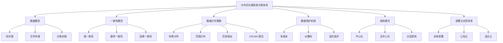
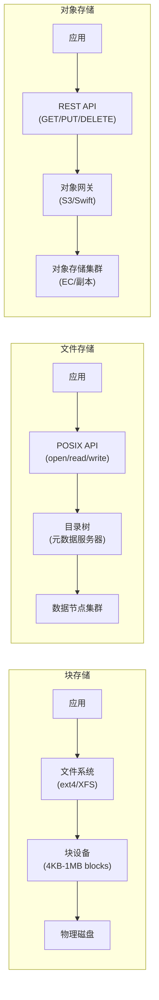
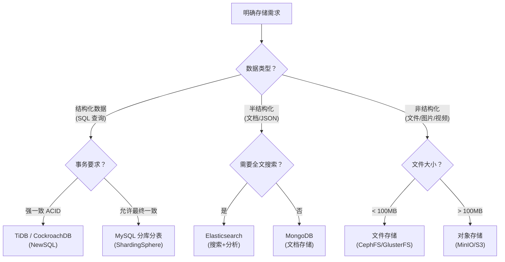

## 分布式存储系统分类

分布式存储系统是将数据分散存储在多台独立设备上的存储架构，通过网络将物理上分散的存储资源整合为逻辑统一的存储空间。理解其分类体系是掌握分布式存储技术的第一步——不同的分类维度揭示了系统设计中的核心权衡，直接影响架构选型和技术决策。

本节从六个核心维度对分布式存储系统进行系统化分类：数据模型、一致性模型、数据分布策略、数据保护机制、架构模式、部署与应用场景。每个维度都对应着分布式系统设计中的关键取舍，理解这些取舍才能在实际项目中做出正确的技术选型。



### 1. 按数据模型分类

数据模型决定了存储系统对外暴露的编程接口和内部数据组织方式，是最基础的分类维度。数据模型的选择直接影响上层应用的开发模式、性能特征和运维复杂度。

#### 1.1 块存储（Block Storage）

块存储将数据拆分为固定大小的块（通常 4KB-1MB），每个块有唯一地址，通过 SCSI/iSCSI/NVMe-oF 等协议暴露给上层系统。块存储本质上是为上层提供一个"虚拟裸磁盘"——操作系统挂载块设备后，可以在其上创建文件系统、直接写入原始数据。

**核心特征：**

- 数据以固定块为单位读写，不感知文件或对象语义
- 延迟极低（本地 NVMe 亚毫秒级，网络块设备 1-5ms）
- 支持随机读写，适合数据库、虚拟机磁盘等场景
- 每个块有独立寻址能力，上层可自由组织数据布局

**典型系统：**

| 系统 | 架构特点 | 适用场景 |
|------|----------|----------|
| Ceph RBD | CRUSH 算法分布，三层架构（RADOS→RBD/CephFS） | 虚拟机存储后端、OpenStack |
| Amazon EBS | 单副本 AZ 内持久化，支持快照 | AWS EC2 实例存储 |
| Open-E JovianDSS | 基于 ZFS 的企业块存储 | 本地数据中心 |
| NVMe-oF | 原生 NVMe 协议网络化 | 超低延迟需求 |
| VMware vSAN | 与 vSphere 深度集成，策略驱动 | VMware 虚拟化环境 |

**NVMe-oF 深入解析：** NVMe over Fabrics 是块存储的最新演进方向。传统 iSCSI 基于 SCSI 命令集，协议栈较重，延迟在 100-500μs 级别。NVMe-oF 直接将 NVMe 命令集映射到网络传输层（RDMA/TCP），端到端延迟可压到 10-50μs，接近本地 NVMe SSD 的性能。对于需要亚毫秒级延迟的 OLTP 数据库（如 MySQL InnoDB 的 redo log），NVMe-oF 是当前最佳选择。

**局限性：** 块存储不提供文件系统语义，上层需自行管理文件系统（如 ext4、XFS）；跨节点共享块设备需要额外的分布式锁机制（如 SCSI-3 PR）；不支持多主机同时读写同一个块设备（除非使用集群文件系统如 GFS2/OCFS2）。

> **常见误区：** 许多初学者将"块存储"等同于"本地磁盘"，忽略了网络块存储（如 Ceph RBD、EBS）的网络延迟开销。本地 NVMe SSD 延迟约 0.1ms，而网络块设备通常在 1-5ms，差距可达 10-50 倍。在对延迟敏感的场景（如高频交易），必须区分本地块设备和网络块设备。

#### 1.2 文件存储（File Storage）

文件存储以目录树结构组织数据，通过 POSIX/NFS/SMB 等协议提供文件级操作（open/read/write/close）。文件存储是最接近用户日常使用体验的存储模型——熟悉的目录层级、文件名、权限管理。

**核心特征：**

- 层次化命名空间，用户可感知目录和文件名
- 支持文件锁、权限控制、元数据操作
- 适合共享文件系统、HPC、媒体编辑等场景
- POSIX 兼容性使应用无需修改即可运行

**典型系统：**

| 系统 | 元数据管理 | 数据分布 | 最大容量 | POSIX 兼容 |
|------|-----------|----------|----------|-----------|
| HDFS | 单 NameNode（HA 方案） | 块复制（默认 3 副本） | PB 级 | 部分（非标准 API） |
| GlusterFS | 无中心（弹性哈希） | 复制/EC 分片 | PB 级 | 完全 |
| Lustre | 元数据服务器集群 | 条带化分布 | EB 级 | 完全 |
| CephFS | MDS 集群 | 委托 RADOS | PB 级 | 完全 |
| JuiceFS | Redis/元数据引擎 | 对象存储后端 | PB 级 | 完全 |
| BeeGFS | 组件化元数据 | 条带化分布 | PB 级 | 完全 |

**元数据扩展性挑战：** 文件存储的核心瓶颈在于元数据管理。单个文件操作需要先查询元数据（文件 inode 位置、权限、时间戳），当文件数量达到亿级时，元数据服务成为性能瓶颈。HDFS 的 NameNode 单点问题催生了 HDFS Federation（多 NameNode 管理不同命名空间）和 Observer NameNode（读请求路由到 Observer 副本）；Lustre 通过 MDS 集群（多元数据服务器管理不同目录子树）缓解；GlusterFS 干脆采用无中心设计，用算法（DHT + 一致性哈希）代替集中式元数据。

**HPC 场景深度解析：** 高性能计算（HPC）是文件存储最典型的应用场景。HPC 应用（如分子动力学模拟、天气预报、流体力学仿真）的特征是：大量计算节点同时读写海量小文件或大文件的特定偏移区域。Lustre 的条带化机制将单个大文件分散到多个 OST（Object Storage Target）上，实现并行 IO；BeeGFS 的组件化元数据设计允许将元数据负载分散到多个服务器上，避免单点瓶颈。

> **常见误区：** HDFS 虽然提供文件接口，但并非 POSIX 兼容的通用文件系统。HDFS 优化了大文件顺序读写（典型 Block 大小 128MB/256MB），不支持 append 以外的随机写，不支持文件锁。将 HDFS 当作通用共享文件系统使用会导致各种兼容性问题。如果需要 POSIX 兼容的分布式文件系统，应选择 CephFS、GlusterFS 或 JuiceFS。

#### 1.3 对象存储（Object Storage）

对象存储将数据封装为不可变对象（包含数据+元数据+唯一 ID），通过 REST API（S3/Swift 协议）进行 CRUD 操作。对象存储是云原生时代的主流存储模型，几乎所有的公有云存储服务（S3、OSS、COS）都基于对象存储架构。

**核心特征：**

- 扁平命名空间，无层次目录结构（目录是通过分隔符 `/` 模拟的逻辑概念）
- 对象不可变（写入后不能修改，只能覆盖写入新版本或删除重建）
- 元数据与数据一同存储，支持自定义元数据标签
- 扩展性极强，适合海量非结构化数据
- 天然适合 HTTP/REST 访问模式

**典型系统：**

| 系统 | 协议兼容 | 数据保护 | 部署模式 | 吞吐量特点 |
|------|---------|----------|----------|-----------|
| MinIO | S3 全兼容 | 纠删码（Erasure Coding） | 自建/K8s | 单集群可达 GB/s |
| Ceph RGW | S3 + Swift | 副本/EC | 集群 | 随节点线性扩展 |
| OpenStack Swift | Swift 原生 | 副本 | 集群 | 中等 |
| Amazon S3 | S3 原生 | 多 AZ 副本 | 公有云 | 无上限 |
| SeaweedFS | S3 兼容 | 按 Volume 管理 | 自建 | 高吞吐低延迟 |

**适用场景分析：** 对象存储在读密集型场景（图片/视频 CDN、备份归档、日志存储）中表现优异。其弱点在于不支持部分更新（必须重写整个对象）和低延迟随机读写。对象存储的 REST API 天然适合 Web 应用——前端可以直接通过 presigned URL 访问存储对象，无需经过应用服务器中转，大幅减轻应用层压力。

> **常见误区：** "目录"在对象存储中不是一等公民。MinIO 等系统虽然在控制台展示目录结构，但这只是通过 key 前缀（如 `photos/2024/img.jpg`）模拟的。对包含百万级文件的"目录"执行 list 操作可能非常慢（需要遍历所有匹配前缀的 key）。优化方式是使用分隔符和 continuation token 进行分页列举，或通过元数据索引替代目录浏览。

#### 1.4 三种存储模型的对比

| 维度 | 块存储 | 文件存储 | 对象存储 |
|------|--------|----------|----------|
| 数据接口 | 块设备（裸磁盘） | 文件 API（POSIX） | REST API（HTTP） |
| 命名空间 | 无 | 层次目录树 | 扁平 |
| 典型延迟 | < 1ms（本地） | 1-10ms | 10-100ms |
| 随机读写 | ✅ 高效 | ✅ 支持 | ❌ 不适合 |
| 部分更新 | ✅ 支持 | ✅ 支持 | ❌ 不支持 |
| 共享访问 | 需额外机制 | ✅ 原生支持 | ✅ 原生支持 |
| 扩展性 | 中等 | 受元数据限制 | 极高 |
| 代表场景 | 数据库、VM 磁盘 | HPC、开发协作 | 图片/视频、备份 |
| 开发复杂度 | 需文件系统驱动 | 标准系统调用 | HTTP 客户端 |



> **选型决策框架：** 数据库和虚拟机磁盘选块存储；共享文件协作和 HPC 选文件存储；海量非结构化数据（图片/视频/日志/备份）选对象存储。实际项目中三者常混合使用——例如数据库用块存储，应用日志写对象存储，开发团队共享文件存储。近年来"统一存储"趋势明显（如 Ceph 同时提供 RBD/CephFS/RGW），但不同接口的性能和功能差异仍然存在，混合使用仍是主流实践。

### 2. 按一致性模型分类

一致性模型定义了分布式系统中多个副本之间数据同步的语义，是 CAP 定理在工程中的具体体现。CAP 定理指出，分布式系统无法同时满足一致性（Consistency）、可用性（Availability）和分区容错性（Partition tolerance）三者，实际系统只能在三者间做取舍。不同的存储系统根据业务需求选择不同的一致性级别。

```mermaid
graph TB
    CP["强一致性<br/>(C 端)"] --- AP["最终一致性<br/>(A 端)"]
    CP --- "因果一致性<br/>(甜点区)"
    AP --- "因果一致性<br/>(甜点区)"
    style CP fill:#f96,stroke:#333
    style AP fill:#69f,stroke:#333
```

#### 2.1 强一致性（Strong Consistency）

任何读操作都能返回最新写入的值，等效于单机存储的语义。在强一致性模型下，系统表现得如同只有一个数据副本——无论从哪个节点读取，都能看到最新的写入结果。

**实现机制：**

- **同步复制：** 写操作必须等待所有（或多数）副本确认后才返回成功。典型如 Raft 协议的 Leader → Follower 日志同步。Leader 将日志条目发送给多数派 Follower，等待它们持久化到本地日志后才 commit 并响应客户端。
- **共识协议：** Raft、Paxos、ZAB 等协议确保所有节点对数据变更达成一致。这些协议的核心思想相同：通过 Leader 选举保证只有一个提案者，通过多数派投票保证提案的唯一性。

**代价分析：**

- 写延迟 = 本地写入延迟 + 网络往返延迟 × 同步副本数。以 3 副本 Raft 为例，写延迟约等于 Leader 本地写入 + 1 次网络往返（等多数派确认）
- 可用性降低：任一副本不可达都可能导致写入失败（需要多数派可用）。3 节点集群最多容忍 1 节点故障，5 节点容忍 2 节点
- 存储成本增加：每个数据至少存 3 份

**典型系统：** etcd（Raft，Kubernetes 核心组件）、ZooKeeper（ZAB，大数据协调服务）、TiKV（Raft，TiDB 存储引擎）、CockroachDB（Raft，分布式 SQL）。

**线性一致性（Linearizability）：** 线性一致性是强一致性的最强形式。它要求所有操作表现得如同在单一副本上按某种顺序执行，且这个顺序与真实时间一致。具体而言：如果操作 A 在真实时间上先于操作 B 完成，那么任何客户端在看到 B 的结果后，也必须能看到 A 的结果。线性一致性的代价最高——除了多数派确认外，还需要保证操作的全局时序。etcd、ZooKeeper 提供的正是线性一致性语义。

> **常见误区：** 强一致性不等于"所有副本都写入成功"。在 Raft 协议中，Leader 只需等待多数派确认即可 commit，少数派可能暂时落后。如果 Leader 在 commit 后、响应客户端前崩溃，新 Leader 可能已经包含该数据，但原客户端不知道写入是否成功——这时需要幂等写入或事务 ID 来处理重复请求。

#### 2.2 最终一致性（Eventual Consistency）

写操作返回后，经过不确定的时间延迟，所有副本最终会收敛到一致状态。最终一致性牺牲了一致性换取了可用性和性能，是互联网大规模系统的主流选择。

**实现机制：**

- **异步复制：** 写操作在本地（或少数副本）完成后即返回成功，后台异步同步到其他副本。故障窗口内（异步复制未完成时）如果写入节点崩溃，数据可能丢失。
- **反熵协议（Anti-entropy）：** 后台通过 Merkle Tree 等机制检测并修复不一致。Merkle Tree 是一棵哈希树，每个叶子节点存储数据块的哈希值，父节点存储子节点哈希的组合。两台节点比较 Merkle Tree 时，只需从根节点开始比较哈希——如果根哈希相同则数据一致，否则逐层比较子树，快速定位不一致的数据范围。
- **读修复（Read Repair）：** 读操作发现不一致时主动修复。例如客户端从 A 节点读到版本 v3，从 B 节点读到版本 v2，系统自动将 v3 写回 B 节点。
- **提示移交（Hinted Handoff）：** 当目标副本不可达时，临时将写入转发到其他副本保存（带"提示"标记），待目标恢复后再移交回去，保证最终一致性。

**时间窗口：** 最终一致性的"最终"可能是毫秒级（如同城多活的同步延迟）也可能是分钟级（如跨地域复制的网络延迟），取决于网络条件和复制策略。DynamoDB 默认的最终一致性读延迟通常在几十毫秒内。

**适用场景：** DNS 解析（TTL 过期前允许旧记录）、用户 Profile 缓存、社交媒体 Feed 流、推荐系统、计数器/排行榜等允许短暂不一致的场景。

**典型系统：** Cassandra（可调一致性——QUORUM/WONE/ALL 等级别）、DynamoDB（默认最终一致，可选强一致读）、Amazon S3（eventual read-after-write，同一 key 的 PUT 后立即 GET 可能读到旧版本）。

#### 2.3 因果一致性（Causal Consistency）

保证有因果关系的操作顺序在所有副本上一致，无因果关系的操作可以乱序。因果一致性是强一致性和最终一致性之间的"甜点"——既保证了因果操作的正确语义，又避免了强一致性的性能代价。

**核心思想：** 如果操作 A 逻辑上先于操作 B（如 A 的输出是 B 的输入），则所有节点必须先看到 A 再看到 B；但两个无关操作的顺序不做保证。例如：用户先发帖（操作 A）再评论（操作 B），所有节点必须先看到帖子再看到评论。但用户 A 发帖和用户 B 发帖的顺序可以不一致。

**实现技术：**

- **向量时钟（Vector Clock）：** 每个节点维护一个向量，记录已知的所有节点的逻辑时间戳。操作 A 先于操作 B 的判断依据是：A 的向量时钟在 B 的向量时钟的每个分量上都 ≤ B。向量时钟的缺点是向量长度随节点数线性增长，Dynamo 论文中描述了使用向量时钟进行冲突检测的方案。
- **逻辑时钟（Lamport Clock）：** 简单的递增计数器，只能判断"可能先于"关系，无法判断"并发"关系。每次事件发生时加 1，发送消息时附带当前时钟值，接收方取 max(本地时钟, 消息时钟) + 1。
- **混合逻辑时钟（HLC）：** 结合物理时钟和逻辑时钟，既能利用物理时钟提供近似真实时间的排序，又能在物理时钟回拨时保持单调递增。CockroachDB、MongoDB 4.0+ 采用 HLC。

**实际价值：** 因果一致性在协作编辑（Google Docs、飞书文档）中至关重要——用户 A 的修改必须在用户 B 基于此修改的进一步修改之前被看到。在社交网络中，回复必须在原帖之后出现。

#### 2.4 一致性模型对比

| 一致性级别 | 读到的值 | 写延迟 | 可用性 | 实现复杂度 | 适用场景 |
|-----------|---------|--------|--------|-----------|----------|
| 线性一致性 | 总是最新（全局时序） | 最高 | 最低 | 高 | 分布式锁、Leader 选举 |
| 强一致性 | 总是最新 | 高 | 低 | 中 | 金融、库存、协调服务 |
| 因果一致性 | 因果有序 | 中 | 中 | 中高 | 协作文档、社交 Feed |
| 会话一致性 | 同一会话内最新 | 低 | 高 | 低 | 用户个人视图 |
| 最终一致性 | 收敛到最新 | 低 | 高 | 低 | 缓存、日志、推荐系统 |

> **实战建议：** 大多数业务系统不需要全局强一致性。Cassandra 的可调一致性提供了灵活的选择：`ONE`（写 1 副本即返回，最终一致）、`QUORUM`（写多数派，强一致）、`ALL`（写所有副本，最强一致）。通过 `Consistency Level = R + W > N`（N 为副本数）的公式，可以在一致性强度和性能之间精确权衡。例如 3 副本时，W=2 + R=2 > 3 即可保证强一致。

### 3. 按数据分布策略分类

数据如何在节点间分布，直接决定了系统的负载均衡能力和查询效率。数据分布策略是分布式存储系统的核心设计决策之一——它影响着数据的均匀性、查询的局部性、扩容的平滑度和故障的隔离范围。

#### 3.1 哈希分布（Hash Partitioning）

将数据的 Key 通过哈希函数映射到固定数量的分区（Partition）。优点是数据分布均匀，缺点是不支持范围查询。

**一致性哈希（Consistent Hashing）：** 在节点增减时，仅需重新映射约 1/N 的数据（N 为节点数），避免了传统哈希取模的全量重映射问题。一致性哈希将节点和数据都映射到一个逻辑环（0 到 2^32-1）上，数据沿顺时针方向找到第一个节点作为其存储位置。当节点增减时，只有该节点与其逆时针方向相邻节点之间的数据需要迁移。

**虚拟节点（Virtual Nodes）：** 为每个物理节点创建多个虚拟节点映射到哈希环上，解决节点数少时负载不均的问题。虚拟节点越多，数据分布越均匀，但路由表也越大。Cassandra 默认 256 个虚拟节点/物理节点，DynamoDB 内部使用类似的机制。

**哈希分布的局限：** 哈希打散了 Key 的顺序性，使得范围查询（如"查询 2024-01 到 2024-03 的所有记录"）必须扫描所有分区，性能极差。这是哈希分布与范围分布最根本的区别。

**典型系统：** Cassandra（MurMurHash3）、DynamoDB、Redis Cluster（16384 slots，使用 CRC16 哈希）。

#### 3.2 范围分布（Range Partitioning）

按 Key 的有序范围切分数据，相邻 Key 落在同一分区。每个分区负责一段连续的 Key 范围 [start_key, end_key)。

**优势：** 范围查询高效（如"查 2024-01 到 2024-03 的日志"），一次 IO 即可获取连续数据；支持有序遍历和 ORDER BY 查询；分区边界清晰，便于数据迁移和负载均衡。

**挑战：** 热点问题——如果写入集中在某个 Key 范围（如时间序列的当前时段），会导致单分区过载（称为"写热点"）。HBase 通过预分区（Pre-splitting）和自动 Split 缓解；CockroachDB 通过 Range Split 和自动迁移（基于 QPS 指标触发 Range Rebalance）解决；TiKV 的 Region 机制类似，Region 大小默认 96MB，超过后自动分裂。

**典型系统：** HBase（Region 自动 Split）、CockroachDB（Range-based sharding）、TiKV（Region-based）、Google Spanner（Splits + Load-based rebalancing）。

#### 3.3 目录驱动分布（Directory-based）

维护一个全局映射表，记录每个数据分区所在的节点。路由时先查询映射表，再访问目标节点。

**优势：** 分区映射灵活，可以任意粒度控制数据放置；支持细粒度的数据迁移（只修改映射表中的记录）。

**挑战：** 映射表本身成为单点瓶颈和故障点；映射表的更新和缓存同步引入额外开销；映射表的规模随分区数线性增长。

**典型系统：** Google Bigtable（Tablet Server 分配由 Master 管理）、Amazon DynamoDB（内部使用映射表管理分区）、传统分库分表中间件（如 MyCat、ShardingSphere 的元数据）。

#### 3.4 CRUSH 算法（去中心化映射）

CRUSH（Controlled Replication Under Scalable Hashing）是 Ceph 独创的数据放置算法，不维护映射表，通过计算数据和集群拓扑的哈希直接确定放置位置。

**核心思想：** 数据 → CRUSH Map（集群拓扑树）→ 故障域逐级选择 → 最终放置节点。CRUSH Map 定义了集群的层次化拓扑（root → datacenter → rack → host → osd），数据放置时按规则逐级选择，确保数据分散在不同的故障域中。

**算法流程：**

1. 计算数据 PG（Placement Group）的 CRUSH 哈希值
2. 在 CRUSH 层级树中，从 root 开始逐级选择子节点
3. 每级使用加权随机选择算法，权重由节点容量决定
4. 应用失败域规则（如"每个副本必须在不同机架"）
5. 最终输出 OSD 列表作为数据放置位置

**优势：** 无中心元数据瓶颈（每个 OSD 可独立计算放置位置）；新增节点时仅需更新 CRUSH Map，数据自动迁移；支持灵活的故障域规则（机架感知、数据中心感知）；算法确定性保证了数据分布的可预测性。

**与目录驱动的对比：** CRUSH 用计算换取了查找表的空间开销，但代价是每次路由都需要重新计算（可通过 OSDMap 缓存加速）。目录驱动方案路由更快（O(1) 查表），但映射表的维护和一致性是难题。

#### 3.5 数据分布策略对比

| 策略 | 范围查询 | 数据均匀性 | 节点扩缩容 | 典型系统 |
|------|---------|-----------|-----------|---------|
| 哈希分布 | ❌ 需全扫描 | ✅ 均匀 | 部分数据迁移 | Cassandra、Redis Cluster |
| 范围分布 | ✅ 高效 | ❌ 可能热点 | 按分区迁移 | HBase、TiKV、CockroachDB |
| 目录驱动 | ✅ 取决于实现 | ✅ 可控 | 映射表更新 | Bigtable、Spanner |
| CRUSH | ❌ 不支持 | ✅ 均匀 | CRUSH Map 更新 | Ceph |

### 4. 按数据保护机制分类

分布式存储必须应对硬件故障——在大规模集群中，磁盘故障是常态而非异常。一个 1000 节点的集群，假设单块磁盘年故障率 2%，平均每天约 55 块磁盘故障。数据保护机制决定了数据在故障场景下的生存能力。

#### 4.1 多副本（Replication）

将数据复制多份（通常 2-3 份）存储在不同节点/机架/数据中心。多副本是最直接的数据保护方式，实现简单、读取性能好（可以就近读取副本），但存储开销大。

| 副本数 | 容错能力 | 存储开销 | 适用场景 |
|--------|---------|----------|----------|
| 2 副本 | 容忍 1 节点故障 | 200% | 开发环境、非关键数据 |
| 3 副本 | 容忍 1 节点故障（多数派） | 300% | 生产环境通用 |
| 5 副本 | 容忍 2 节点故障 | 500% | 极高可用要求 |

**同步 vs 异步复制：**

| 特性 | 同步复制 | 异步复制 |
|------|---------|---------|
| 数据安全性 | 高（多数派确认后才返回） | 低（故障窗口内可能丢数据） |
| 写延迟 | 高（等待网络往返） | 低（本地写入即返回） |
| 适用场景 | 金融交易、元数据存储 | 日志、缓存、非关键数据 |
| 典型系统 | etcd（Raft 同步） | Cassandra 默认模式 |

**副本放置策略：** 副本不仅仅是"存三份"这么简单——副本放置需要考虑故障域隔离。例如 HDFS 的机架感知策略：第一个副本在本地节点，第二个副本在不同机架的节点，第三个副本与第二个同机架但不同节点。这样即使整个机架故障（如交换机故障），最多只丢失一个副本。

#### 4.2 纠删码（Erasure Coding, EC）

将数据切分为 k 个数据块，通过编码生成 m 个校验块（总 k+m 块），任意 k 块即可恢复原始数据。纠删码用计算复杂度换取存储效率——相比多副本 200-300% 的存储开销，EC 通常只需 130-150%。

**典型配置：**

| 编码方案 | 数据块 | 校验块 | 容错块数 | 存储开销 | 写放大 | 修复带宽 |
|---------|--------|--------|---------|---------|--------|---------|
| RS(4,2) | 4 | 2 | 2 | 150% | 1.5x | 4/6 数据量 |
| RS(8,3) | 8 | 3 | 3 | 137.5% | 1.375x | 8/11 数据量 |
| RS(10,4) | 10 | 4 | 4 | 140% | 1.4x | 10/14 数据量 |
| RS(12,4) | 12 | 4 | 4 | 133% | 1.33x | 12/16 数据量 |

**Reed-Solomon 编码原理：** 将数据块视为多项式的系数，通过在 k+m 个不同点求值生成编码块。恢复时利用任意 k 个点重建多项式（拉格朗日插值）。计算复杂度 O(n²)，可通过 SIMD 指令集（Intel ISA-L、ARM NEON）加速到接近线性吞吐。

**写放大分析：** 写放大 = (k+m)/k。写入 1 个数据块，实际需要写入 k+m 个块（k 个数据块 + m 个校验块），写放大倍数为 (k+m)/k。RS(4,2) 的写放大为 1.5x，即每写入 1MB 逻辑数据，实际写入 1.5MB 物理数据。对于频繁小写入的热数据，EC 的写放大和校验块计算开销会显著影响性能。

**EC 修复开销：** 当一个块丢失时，需要从 k 个存活块中读取数据来恢复。RS(8,3) 丢失 1 块时，需要读取 8 个数据块（约等于原始数据大小）来重建，修复带宽约为原始数据大小。这在大规模修复时会占用大量网络和磁盘 IO。

**适用场景：** 对象存储（MinIO 默认 EC，Azure Blob Storage 使用 LRS/GRS+EC）、冷数据归档、归档存储（如 AWS Glacier）。不适合频繁小写入的热数据。

#### 4.3 混合数据保护

现代系统常组合使用副本和 EC，根据数据热度动态调整保护策略：

- **Ceph：** 活跃数据用 3 副本（保证低延迟读写），降级为冷数据后转为 EC（如 EC 4+2），通过分层策略（tiering）自动管理数据生命周期
- **Azure Storage：** 同步写入 3 副本保证持久性 → 后台异步转为 LRS/GRS + EC，降低存储成本
- **MinIO：** 支持 per-bucket 配置副本数或 EC 参数，管理员可根据数据重要性灵活配置

**纠删码 vs 多副本选型：**

| 维度 | 多副本 | 纠删码 |
|------|-------|--------|
| 存储效率 | 低（200-300%） | 高（130-150%） |
| 读性能 | 高（就近读副本） | 中（无需解码） |
| 写性能 | 高（无编码开销） | 低（编码计算+写放大） |
| 修复带宽 | 低（复制整块数据） | 高（读取 k 块恢复） |
| 适用场景 | 热数据、元数据 | 冷数据、归档、大文件 |

> **常见误区：** "纠删码的存储效率远优于副本，应该全面使用 EC"——这是错误的。EC 的写放大和修复带宽在热数据场景下是致命的。HBase、TiKV 等数据库存储引擎仍然使用多副本（通常 3 副本），因为数据库场景以随机小 IO 为主，EC 的编码开销和修复成本远高于副本。EC 真正发挥优势的场景是：大对象存储、读密集、写入不频繁、对存储成本敏感。

### 5. 按架构模式分类

架构模式决定了分布式存储系统的组件划分、通信方式和扩展策略。不同的架构模式适合不同规模和需求的场景。

#### 5.1 中心化架构（Master-Slave / Primary-Secondary）

有明确的中心节点负责元数据管理、调度和协调。

**优点：**
- 架构简单，一致性容易保证（单一元数据源）
- 调度逻辑集中在中心节点，实现相对简单
- 便于全局优化（如负载均衡、数据迁移）

**缺点：**
- 中心节点是单点瓶颈（元数据请求量超过单节点处理能力）
- 中心节点是故障点（中心节点不可用时整个集群不可用）
- 扩展性受限（中心节点的内存和 CPU 是硬上限）

**典型系统：**
- HDFS（NameNode）：单 NameNode 管理所有文件元数据，HDFS Federation 通过多 NameNode 分片缓解
- 传统主从 MySQL：Master 处理写入，Slave 处理读取
- MongoDB（副本集模式）：Primary 处理写入，Secondary 复制数据

**缓解单点瓶颈的工程手段：**
- HDFS Federation：多个 NameNode 管理不同的命名空间
- Observer NameNode：HDFS 2.x 引入，读请求路由到 Observer 副本，分担 NameNode 读压力
- Raft Leader Read：etcd 3.x 支持 Leader Read 模式，避免所有读请求经过 Raft 共识

#### 5.2 去中心化架构（Peer-to-Peer）

所有节点对等，通过共识协议选举 Leader 或采用无 Leader 设计。

**优点：**
- 无单点故障，所有节点同等重要
- 扩展性强，增加节点即可增加容量和吞吐
- 天然支持多活部署

**缺点：**
- 实现复杂，共识协议本身有性能开销
- 故障检测和恢复机制复杂
- 调试和运维难度高（没有"中心"可以查看全局状态）

**典型系统：**
- Cassandra（去中心化，Peer-to-Peer，无 Leader，每个节点可独立接受读写）
- Ceph（CRUSH 无中心映射，OSD 之间 peer recovery）
- Riak（基于 Dynamo 论文的去中心化 KV 存储）
- CockroachDB（每个节点都参与 Raft 投票，无独立元数据节点）

**无 Leader vs 有 Leader 的权衡：** 无 Leader 设计（如 Cassandra）所有节点对等，写入可以路由到任意节点，但需要处理写冲突（LWW - Last Write Wins 或向量时钟冲突检测）。有 Leader 设计（如 etcd）通过 Leader 统一处理写入，避免了冲突但引入了 Leader 瓶颈。

#### 5.3 分层架构（Layered Architecture）

将系统分为元数据层和数据层，各自独立扩展。分层架构是当前最主流的分布式存储架构模式，它结合了中心化架构的简单性和去中心化架构的扩展性。

**典型系统：**

| 系统 | 元数据层 | 数据层 | 扩展方式 |
|------|---------|--------|---------|
| Ceph | MON（监控器集群）+ MDS（CephFS 元数据） | OSD（对象存储守护进程） | MON 独立扩展，OSD 横向扩展 |
| MinIO | Gateway（无状态 API 层） | 集群（数据层，EC 编码） | Gateway 无状态可水平扩展 |
| TiDB | TiDB（SQL 层，无状态） + PD（Placement Driver，调度） | TiKV（存储层，有状态，Raft 组） | TiDB 水平扩展，TiKV 按 Region 迁移 |
| Kafka | Controller（分区 Leader 管理） | Broker（数据存储和 IO） | Broker 横向扩展 |

**分层架构的优势：**
- 元数据层和数据层独立扩展，避免"木桶效应"
- 元数据层通常无状态或轻状态，可以快速水平扩展
- 数据层按分片/分区扩展，理论上无上限

**TiDB 架构深度解析：** TiDB 是分层架构的典范。TiDB Server 无状态，处理 SQL 解析和优化，可以水平扩展到数十个节点；PD（Placement Driver）作为元数据层，维护 TiKV 节点的元信息和 Region 分布信息，负责调度决策（如 Region 分裂、合并、迁移）；TiKV 存储层将数据按 Region（96MB 大小）组织，每个 Region 由一个 Raft 组（3 副本）管理，Region 的 Leader 负责处理读写请求。这种设计使得 TiDB 可以独立扩展计算（TiDB Server）和存储（TiKV），同时通过 PD 实现全局调度优化。

### 6. 按部署模式分类

部署模式决定了存储系统的运维责任归属和基础设施依赖，是实际选型中不可忽视的维度。

#### 6.1 本地部署（On-Premise）

存储系统运行在企业自有的数据中心中，完全由企业运维团队管理。

**优势：** 数据完全可控，满足合规要求（金融、政务行业）；网络延迟可预测（局域网 100ns-10μs）；长期成本可控（大规模场景下自建成本低于公有云）。

**劣势：** 初始投入高（硬件采购+机房建设）；运维团队要求高（需专人维护）；弹性差（扩容周期长）。

**典型方案：** Ceph 集群、MinIO 集群、HDFS 集群、Nutanix 超融合。

#### 6.2 公有云托管

使用云厂商提供的托管存储服务，运维责任由云厂商承担（Shared Responsibility Model）。

**优势：** 零运维（云厂商负责硬件、软件、补丁）；弹性伸缩（按需付费，秒级扩容）；全球可用（多 AZ/多 Region 内置冗余）。

**劣势：** 长期成本可能高于自建（尤其是 PB 级数据）；数据迁移成本高（vendor lock-in）；延迟受网络影响（跨 AZ 延迟 1-2ms，跨 Region 50-200ms）。

**典型服务：** AWS S3/EBS/EFS、Azure Blob Storage/Managed Disks、阿里云 OSS/NAS/ESSD、Google Cloud Storage/Persistent Disk。

#### 6.3 混合云架构（Hybrid Cloud）

将本地存储和公有云存储组合使用，数据在本地和云端之间流动。

**典型模式：**
- **分层存储：** 热数据在本地（低延迟），冷数据归档到云端（低成本）。如 MinIO + AWS S3 tiering。
- **云端备份：** 本地数据定期备份到云端。如 Ceph + S3 作为归档后端。
- **多云冗余：** 数据同时存储在多个云厂商，避免单厂商故障。如 使用 rclone 跨云同步。

**技术挑战：** 网络带宽和延迟是混合云的核心瓶颈；数据一致性在跨网络环境下面临更大挑战；安全合规要求数据加密传输和存储。

### 7. 按应用场景分类

不同应用场景对存储系统的性能、一致性、容量需求差异巨大，理解场景特征是选型的前提。

| 应用场景 | 性能需求 | 数据模型 | 一致性 | 典型系统 |
|---------|---------|---------|--------|---------|
| OLTP 数据库 | 低延迟（<5ms）、高 IOPS | 块存储/自研引擎 | 强一致 | TiDB、CockroachDB、MySQL+InnoDB |
| OLAP 分析 | 高吞吐（GB/s）、列式扫描 | 文件/对象存储 | 最终一致 | ClickHouse、Apache Doris |
| 大数据计算 | 高吞吐、大文件顺序读写 | 文件存储 | 最终一致 | HDFS、Alluxio |
| AI/ML 训练 | 高带宽（多 GPU 并行读取） | 文件/对象存储 | 最终一致 | Lustre、BeeGFS、S3 |
| IoT 时序数据 | 高写入吞吐、时间范围查询 | 自研引擎 | 可调 | TimescaleDB、InfluxDB |
| 多媒体/CDN | 海量小文件读取、全球分发 | 对象存储 | 最终一致 | S3+CloudFront、MinIO |
| 备份归档 | 高写入吞吐、低读取频率 | 对象存储 | 最终一致 | S3 Glacier、Azure Archive |

**AI/ML 存储的特殊需求：** 大规模模型训练（如 LLM 训练）需要数十到数百 GB/s 的聚合带宽，同时读取训练数据集。传统文件存储（NFS/CIFS）无法满足。Lustre 和 BeeGFS 通过条带化大文件到多个 OST 上，实现聚合带宽随节点线性扩展。近年来，对象存储（S3/MinIO）也逐渐进入 ML 数据管道，通过多部分下载和流式读取弥补大文件 IO 的短板。

### 8. 选型决策指南

面对具体项目，可按以下决策树选择合适的分布式存储系统：



**详细选型步骤：**

1. **明确数据模型需求：** 块/文件/对象？数据库场景优先考虑块存储或 NewSQL（TiDB/CockroachDB）；非结构化数据选对象存储；共享协作选文件存储
2. **评估一致性要求：** 金融/交易类 → 强一致（Raft/Paxos）；日志/缓存类 → 最终一致；社交/协作类 → 因果一致
3. **估算数据规模和增长：** TB 级 → 多数系统可覆盖；PB 级 → 优先考虑对象存储或 Ceph；EB 级 → Lustre + 对象存储后端
4. **确定访问模式：** 读多写少 → EC + 缓存层；写多读少 → 副本 + 异步复制；混合负载 → 可调一致性
5. **考虑运维能力：** 团队规模小 → 托管服务（S3/云盘）；自建 → 选择运维工具成熟的系统（MinIO、Ceph）
6. **成本约束：** 存储成本敏感 → EC 替代多副本（存储效率提升 40-50%）；延迟敏感 → 本地 SSD + 副本

**常见系统选型速查：**

| 需求 | 推荐系统 | 理由 |
|------|---------|------|
| Kubernetes 持久化存储 | Rook-Ceph / Longhorn | K8s 原生集成，CSI 驱动 |
| 小团队自建对象存储 | MinIO | 单二进制部署，S3 兼容 |
| 分布式 SQL（MySQL 兼容） | TiDB | HTAP 能力，MySQL 生态兼容 |
| 分布式 SQL（PostgreSQL 兼容） | CockroachDB | 强一致性，全球分布 |
| 大数据存储后端 | HDFS / S3 | 生态成熟，计算框架原生集成 |
| 高性能计算存储 | Lustre / BeeGFS | 条带化高吞吐，POSIX 兼容 |
| 键值存储 | etcd / Redis Cluster | etcd 用于协调，Redis 用于缓存 |

> **常见误区：** 不要试图用一个存储系统解决所有问题。生产环境通常是混合架构——数据库用块存储（或 NewSQL），应用数据用对象存储，共享配置用分布式协调服务（etcd/ZooKeeper）。选择正确的工具组合比选择"万能"系统更重要。即便是号称"统一存储"的 Ceph，其 RBD/CephFS/RGW 三个接口的性能特征和适用场景也各不相同。

### 9. 本节小结

分布式存储系统的分类不是为了记忆，而是为了理解不同系统背后的设计权衡。本节覆盖了六个核心分类维度：

| 分类维度 | 核心权衡 | 关键决策 |
|---------|---------|---------|
| 数据模型 | 接口便捷性 vs 性能 vs 扩展性 | 块/文件/对象 |
| 一致性模型 | 一致性 vs 可用性 vs 延迟 | CAP 定理的工程体现 |
| 数据分布 | 均衡性 vs 查询效率 vs 扩容成本 | 哈希/范围/CRUSH |
| 数据保护 | 存储效率 vs 写性能 vs 修复成本 | 副本 vs 纠删码 |
| 架构模式 | 简单性 vs 扩展性 vs 运维复杂度 | 中心化/去中心化/分层 |
| 部署场景 | 可控性 vs 弹性 vs 成本 | 本地/云端/混合 |

掌握这些分类维度，就能在面对具体项目需求时，快速缩小候选系统范围，做出合理的技术选型。后续章节将深入每个分类方向的具体技术实现细节。
