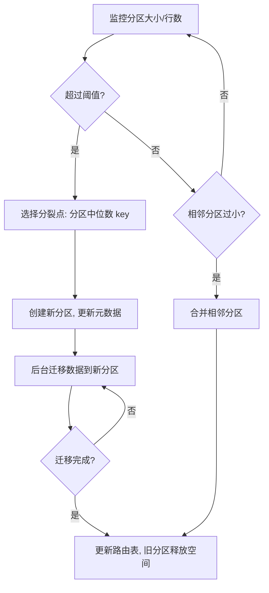
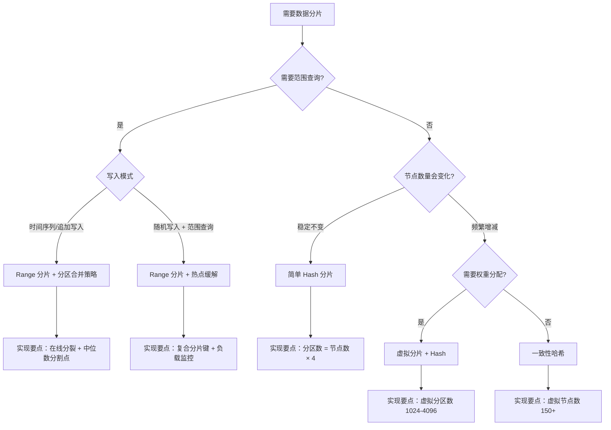

# 数据分片策略

## 为什么需要分片？

当数据规模从 GB 增长到 TB 甚至 PB 级别时，单机存储面临三重天花板：

| 瓶颈维度 | 单机上限 | 分布式方案 |
|---------|---------|-----------|
| 存储容量 | 单盘 4-20TB，单机 4-8 盘 | N 台机器 → N 倍容量 |
| I/O 吞吐 | 单盘 IOPS 10K-50K（SSD） | N 台并行 → N 倍 IOPS |
| 内存上限 | 单机通常 ≤1TB | 集群总内存 N 倍 |
| 写入带宽 | 受 PCIe/NVMe 带宽约束 | 多节点并行写入 |

数据分片（Data Partitioning / Sharding）正是为解决这一核心矛盾而生的：**将海量数据切分为多个子集，分布到不同存储节点上并行处理**，从而实现容量和吞吐量的近线性扩展。

但分片不是免费午餐——它引入了跨分片查询、分布式事务、数据再均衡等新问题。选择正确的分片策略，本质上是在**查询能力、扩展成本、实现复杂度**三者之间做权衡。

---

## 1. 分片的基本问题

在讨论具体策略之前，必须先回答三个核心问题。

### 1.1 分片键（Shard Key）的选择

分片键决定了每条数据的归属。好的分片键应满足：

- **高基数（Cardinality）**：取值范围足够大，才能均匀散列到多个分区。例如用 `gender`（男/女）做分片键只有 2 个取值，最多只能均匀分到 2 个分区；用 `user_id`（百万级）则可以均匀分散到任意数量的分区
- **查询亲和性**：绝大多数查询都携带分片键，避免跨分区查询（Scatter-Gather）。如果 90% 的查询都带 `tenant_id`，那 `tenant_id` 就是天然的分片键
- **业务稳定**：分片键的取值分布不应随时间剧烈变化。例如用 `order_status` 做分片键，早期大部分订单是"待支付"，集中在某个分区；完成后又迁移到"已完成"分区，导致频繁数据迁移

**分片键选择的反模式**：

| 反模式 | 问题 | 正确做法 |
|-------|------|---------|
| 用枚举字段（如 status、type） | 取值基数太低，数据严重倾斜 | 用高基数字段如 ID、时间戳+设备ID |
| 用会变化的字段（如 department） | 组织调整导致大规模数据迁移 | 用稳定的业务标识如 user_id |
| 用业务无意义的自增 ID | 扩容时无法利用 ID 的有序性 | 用雪花算法 ID（含时间+机器信息） |
| 分片键与查询模式不匹配 | 频繁跨分片查询，性能劣化 | 分析 Top 查询模式，选择覆盖最多查询的字段 |

### 1.2 分片粒度（Granularity）

每个分片包含多少数据？这是一个需要平衡的决策：

- **粒度过粗**（如仅 2 个分片）：单分片数据量过大，扩展性差，单节点压力大
- **粒度过细**（如百万级分片）：元数据管理开销剧增，调度复杂度上升，每个分片的数据量太少导致 IO 效率低
- **工业经验值**：初始分片数 ≈ 节点数 × 2~4，后续通过分裂/合并动态调整

分片粒度的权衡曲线：

性能 ▲
     │        ╱ 最优区间
     │       ╱
     │      ╱
     │─────╱──────────
     │    ╱
     │   ╱
     │  ╱
     │ ╱
     │╱__________________▶ 分片数
      太少            太多
   (单片过载)      (元数据爆炸)

### 1.3 分片映射（Mapping）

分片与物理节点的对应关系如何维护？

- **静态映射**：分片数固定，重启时重新计算（如简单 Hash % N）。优点是实现简单，缺点是无法在线扩容
- **动态映射**：支持在线增减节点，只需局部调整（如一致性哈希、虚拟分片表）。优点是弹性伸缩，缺点是需要额外的元数据管理

---

## 2. 哈希函数选择：被忽视的关键决策

在讨论分片策略之前，还有一个前置问题：**用什么哈希函数？** 这直接影响分片的均匀性和性能。

### 2.1 为什么不能用 Python 内置 hash()？

```python
# Python 的 hash() 有三个致命问题：

# 1. 有种子随机化（PYTHONHASHSEED）
# 每次重启进程，hash 值不同，导致相同 key 映射到不同分区
import sys
print(sys.flags.hash_randomization)  # 通常为 1（开启）

# 2. 整数自哈希：hash(1) == 1
# 连续整数 key 的哈希值完全不散列
for i in range(10):
    print(f"hash({i}) = {hash(i)}")  # 输出 0,1,2,3... 完全均匀才怪
```

### 2.2 生产级哈希函数对比

| 哈希函数 | 速度 | 均匀性 | 碰撞率 | 适用场景 |
|---------|------|-------|-------|---------|
| **MurmurHash3** | 极快（~1GB/s） | 优秀 | 极低 | Cassandra、HBase、Redis Cluster |
| **xxHash** | 最快（~5GB/s） | 优秀 | 极低 | ClickHouse、需要极致吞吐的场景 |
| **CityHash** | 快（~3GB/s） | 优秀 | 低 | Google 内部系统 |
| **MD5** | 慢（~0.5GB/s） | 均匀 | 低（但有安全风险） | 一致性哈希环（取部分位） |
| **FNV-1a** | 中等 | 一般 | 中等 | 小规模系统、布隆过滤器 |
| **SipHash** | 中等 | 优秀 | 极低 | 需要 DoS 防护的哈希表（Python dict） |

**工程选择建议**：

```python
# 生产环境推荐：使用 xxHash 或 MurmurHash3
# Python 实现（需安装 xxhash 或 mmh3 库）

# 方案1：xxHash（最快）
import xxhash
def partition_xxhash(key: str, num_partitions: int) -> int:
    h = xxhash.xxh64(key).intdigest()
    return h % num_partitions

# 方案2：MurmurHash3（Cassandra 同款）
import mmh3
def partition_murmur(key: str, num_partitions: int) -> int:
    h = mmh3.hash(key, signed=False)
    return h % num_partitions

# 方案3：MD5 取高位（一致性哈希环常用）
import hashlib
def hash_for_ring(value: str) -> int:
    return int(hashlib.md5(value.encode()).hexdigest(), 16)
```

**关键原则**：分片哈希函数的选择要与目标系统的实现一致。如果你在做兼容层或客户端路由，必须使用与存储引擎相同的哈希函数，否则路由结果不一致。

---

## 3. 简单 Hash 分片

### 3.1 原理

最直接的分片方式：对分片键计算哈希值，再对分区数取模。

```python
import mmh3

def get_partition(key: str, num_partitions: int) -> int:
    """简单 Hash 分片：hash(key) % num_partitions"""
    return mmh3.hash(key, signed=False) % num_partitions

# 示例：3 个分区
for k in ["user_001", "user_002", "user_003", "user_004", "user_005"]:
    pid = get_partition(k, 3)
    print(f"{k} -> 分区 {pid}")
```

### 3.2 优点

- **实现极简**：一行代码，无需额外数据结构
- **均匀分布**：假设哈希函数质量好，各分区数据量近似均匀
- **确定性路由**：同一个 key 永远路由到同一个分区，无需查询元数据
- **零元数据开销**：不需要任何外部服务维护映射关系

### 3.3 缺点

**扩容灾难**：分区数从 N 变为 N+1 时，`hash(key) % (N+1)` 的结果大面积改变：

示例：5 个 key，3 个分区 → 4 个分区

key       hash%3  hash%4  是否迁移？
user_001    1       0      ✅ 是
user_002    2       3      ✅ 是
user_003    0       2      ✅ 是
user_004    1       1      ❌ 否
user_005    2       0      ✅ 是

迁移率 = 4/5 = 80%（理论值：(N-1)/N ≈ 75% for large N）

- **不支持范围查询**：哈希打散后，连续的 key 被分散到不同分区。例如 `WHERE user_id BETWEEN 1000 AND 2000` 必须扫描所有分区（Scatter-Gather）
- **分区数变更代价高**：无法在线平滑扩容，通常需要停机或双写方案

### 3.4 适用场景

- 数据量稳定、短期内不会大幅增长的系统
- 查询模式以单点查询为主（如按 ID 查用户信息）
- 对范围查询无需求的 KV 存储
- 嵌入式或单机场景的预分片（如 SQLite 的分库方案）

---

## 4. 虚拟分片（Virtual Partitioning / Shard）

### 4.1 原理

虚拟分片是简单 Hash 分片的工程化改进：将哈希空间划分为大量固定数量的虚拟分区（Virtual Partition），再通过一张映射表将虚拟分区分配给物理节点。

```python
class VirtualPartitioning:
    def __init__(self, num_virtual_partitions: int = 4096):
        self.num_vps = num_virtual_partitions
        # 虚拟分区 -> 物理节点 的映射
        self.vp_to_node: dict[int, str] = {}
        self.node_vps: dict[str, list[int]] = {}  # 反向索引

    def add_node(self, node: str, weight: int = 1):
        """添加物理节点，weight 决定该节点分得多少虚拟分区"""
        if not self.node_vps:
            self.node_vps[node] = []

        total_weight = sum(len(vps) for vps in self.node_vps.values()) + weight
        quota = self.num_vps * weight // total_weight

        unassigned = [vp for vp in range(self.num_vps)
                      if vp not in self.vp_to_node]
        for vp in unassigned[:quota]:
            self.vp_to_node[vp] = node
            self.node_vps[node].append(vp)

    def remove_node(self, node: str) -> dict[int, str]:
        """移除节点，返回受影响的虚拟分区及其新归属"""
        if node not in self.node_vps:
            return {}

        affected = {}
        for vp in self.node_vps[node]:
            del self.vp_to_node[vp]
            affected[vp] = None  # 待重新分配

        del self.node_vps[node]
        return affected

    def get_partition(self, key: str) -> str:
        """根据 key 找到对应的物理节点"""
        h = hash(key) % self.num_vps
        return self.vp_to_node[h]
```

**扩容时的变化**：

初始：3 节点，各占 ~1365 个虚拟分区
Node_A: VP 0-1364    Node_B: VP 1365-2729    Node_C: VP 2730-4095

添加 Node_D 后：4 节点，各占 ~1024 个虚拟分区
Node_A: VP 0-1023    Node_B: VP 1024-2047
Node_C: VP 2048-3071  Node_D: VP 3072-4095

只有 ~25% 的虚拟分区映射发生变化（从其他节点转移到 Node_D）
而非简单 Hash 的 ~75% 全量迁移

### 4.2 优缺点分析

| 维度 | 说明 |
|------|------|
| **负载均衡** | 通过调整各节点的虚拟分区数量（权重），实现异构节点的负载均衡 |
| **扩容效率** | 新节点只需从现有节点"借走"部分虚拟分区，迁移量约 1/N |
| **实现复杂度** | 需要维护映射表，映射表本身需持久化并支持原子更新 |
| **范围查询** | 仍然不支持，虚拟分区本质还是 Hash 打散 |
| **元数据开销** | 虚拟分区数越多，映射表越大。4096 个 VP 的映射表约 4KB，可忽略 |

### 4.3 工业级实现要点

1. **映射表持久化**：映射表必须持久化到独立的元数据服务（如 ZooKeeper、etcd），而非存储在数据节点内存中，防止节点重启丢失映射
2. **原子切换**：扩容涉及多节点映射变更，必须使用两阶段提交或类似机制保证原子性
3. **权重支持**：不同规格的机器应分配不同数量的虚拟分区。例如 16GB 机器分配 1024 个 VP，32GB 机器分配 2048 个 VP
4. **渐进式迁移**：新节点加入后不是一次性切完所有 VP，而是逐个迁移，每迁移一个 VP 后观察负载再决定是否继续

### 4.4 虚拟分片 vs 一致性哈希：如何区分？

这是最常见的困惑点。两者的核心区别：

| 维度 | 虚拟分片 | 一致性哈希 |
|------|---------|-----------|
| **映射方式** | 显式映射表（VP → Node） | 环形结构，顺时针查找 |
| **扩容触发** | 重新计算映射表，批量更新 | 自然过渡，新节点截断弧段 |
| **负载控制** | 可精确控制每个节点的 VP 数量 | 依赖虚拟节点数量的统计均匀性 |
| **适用场景** | 需要精确控制权重的异构集群 | 节点频繁增减的动态集群 |
| **代表系统** | Elasticsearch（主分片分配） | Cassandra（Token Ring）、DynamoDB |

**简单记忆**：虚拟分片是"手动分配房间号"，一致性哈希是"沿环顺时针找最近的门"。

---

## 5. Range 分片（范围分片）

### 5.1 原理

Range 分片按分片键的取值范围划分数据。每个分区负责一个连续的区间。

Partition 1: [key_min,   key_1000000)   -> Node_A
Partition 2: [key_1000000, key_2000000)  -> Node_B
Partition 3: [key_2000000, key_max)       -> Node_C

```python
import bisect

class RangePartitioning:
    """基于有序边界表的 Range 分片"""
    def __init__(self):
        # 边界表：每个分片的起始 key（有序）
        self.bounds: list[str] = ["aaa", "key_1000", "key_2000"]
        self.partitions: list[str] = ["Node_A", "Node_B", "Node_C"]

    def get_partition(self, key: str) -> tuple[int, str]:
        """二分查找确定 key 所在分区"""
        idx = bisect.bisect_right(self.bounds, key) - 1
        idx = max(0, min(idx, len(self.partitions) - 1))
        return idx, self.partitions[idx]

    def split_partition(self, partition_idx: int, split_key: str) -> str:
        """分裂一个分区为两个，返回新分区所在的节点"""
        old_node = self.partitions[partition_idx]
        # 插入新的边界
        self.bounds.insert(partition_idx + 1, split_key)
        # 新分区需要迁移到另一个节点（简化处理）
        new_node = f"{old_node}_backup"
        self.partitions.insert(partition_idx + 1, new_node)
        return new_node

    def merge_partitions(self, idx: int):
        """合并相邻两个分区"""
        del self.bounds[idx + 1]
        del self.partitions[idx + 1]
```

### 5.2 范围查询的优势

Range 分片最大的优势是**原生支持范围查询**。当执行 `WHERE ts BETWEEN '2026-01-01' AND '2026-03-31'` 时：

- 系统通过边界表快速定位目标分区（可能只需 1-2 个分区）
- 无需 Scatter-Gather，查询延迟和数据量线性降低
- 分区内数据天然有序，无需额外排序

这对时序数据库（InfluxDB、TimescaleDB）和日志系统（Elasticsearch）至关重要。

### 5.3 热点问题（Hot Spot）

Range 分片的致命弱点是**写入热点**。以时间戳作为分片键为例：

2026-06-26 10:00:00 -> Partition 99 (当前时间区间)
2026-06-26 10:00:01 -> Partition 99
2026-06-26 10:00:02 -> Partition 99
...

所有最新写入都集中在最后一个分区，导致：
- 该分区所在节点 CPU/磁盘 I/O 饱和
- 其他节点空闲，集群资源利用率极低（实测可达 10%-20%）
- 频繁分裂最后一个分区但无法缓解热点（分裂只是把热点分区变小，写入仍然集中）

**热点检测方法**：

```python
def detect_hot_spots(partition_loads: dict[int, int], threshold: float = 2.0):
    """检测写入热点：如果某分区负载超过平均值的 threshold 倍，则判定为热点"""
    avg_load = sum(partition_loads.values()) / len(partition_loads)
    hot_sparts = {
        pid: load for pid, load in partition_loads.items()
        if load > avg_load * threshold
    }
    return hot_sparts
```

**缓解方案**：

| 方案 | 原理 | 代价 | 适用场景 |
|------|------|------|---------|
| **加盐（Salting）** | 在 key 后追加随机后缀 `key_20260626_1` | 破坏范围查询能力 | 不需要范围查询的 KV 场景 |
| **复合分片键** | 用 `(tenant_id, timestamp)` 做复合 key，第一级按 tenant 均匀散列 | 查询需指定 tenant | 多租户时序系统 |
| **热点分区特殊路由** | 检测到热点后将单分区写入分发到多个子分区 | 实现复杂，需动态调度 | 写入极度不均匀的场景 |
| **内存缓冲 + 批量刷盘** | 热点数据先写内存，批量刷入磁盘 | 牺牲一定持久性 | 日志/事件流场景 |
| **时间轮转分区** | 按小时/天轮转分区，当前时段写入单独的"活跃分区" | 查询需跨多个分区 | 时序数据库（InfluxDB 的 shard group） |

### 5.4 动态分裂与合并

生产级 Range 分片系统（如 TiKV、CockroachDB、HBase）都支持**在线分裂**：



阈值通常设定为：
- **TiKV**：分区（Region）数据量 > 96MB 触发分裂，< 4MB 触发合并
- **CockroachDB**：Range 大小 > 512MB 触发分裂
- **HBase**：Region 大小 > 10GB 触发分裂（HBase 的 Region 远大于 TiKV 的 Region）

---

## 6. 一致性哈希（Consistent Hashing）

### 6.1 为什么需要一致性哈希？

简单 Hash 和虚拟分片都依赖"分区数"这一全局参数。当分区数变化时，大量 key 的映射结果改变。一致性哈希通过引入**哈希环（Hash Ring）** 数据结构，从根本上解决了这个问题。

核心思想：**将节点和 key 都映射到同一个环上，key 顺时针找到的第一个节点就是它的归属**。

### 6.2 哈希环原理

一致性哈希将整个哈希值空间组织成一个虚拟的环（0 到 2^32-1）。节点和 key 都被映射到环上的某个位置：

```python
import hashlib
import bisect

class ConsistentHash:
    def __init__(self, num_virtual_nodes: int = 150):
        self.num_vnodes = num_virtual_nodes
        self.ring: dict[int, str] = {}  # hash -> node_name
        self.sorted_keys: list[int] = []  # 排序后的哈希值列表

    def _hash(self, value: str) -> int:
        """使用 MD5 产生均匀的哈希值"""
        return int(hashlib.md5(value.encode()).hexdigest(), 16)

    def add_node(self, node: str):
        """添加一个物理节点（及其虚拟节点）"""
        for i in range(self.num_vnodes):
            h = self._hash(f"{node}#{i}")
            if h not in self.ring:
                self.ring[h] = node
                bisect.insort(self.sorted_keys, h)

    def remove_node(self, node: str):
        """移除一个物理节点"""
        for i in range(self.num_vnodes):
            h = self._hash(f"{node}#{i}")
            if h in self.ring:
                del self.ring[h]
                self.sorted_keys.remove(h)

    def get_node(self, key: str) -> str:
        """获取 key 所属的物理节点（顺时针查找）"""
        if not self.ring:
            raise ValueError("环上无节点")
        h = self._hash(key)
        idx = bisect.bisect_right(self.sorted_keys, h)
        if idx == len(self.sorted_keys):
            idx = 0  # 绕回环的起点
        return self.ring[self.sorted_keys[idx]]
```

**可视化理解**：

                    Node_C(150 vnodes)
                   ╱
          ●───────●
         ╱   key_X ←──── 顺时针找到的第一个节点
        ╱         ╲
Node_B ●           ● Node_A(150 vnodes)
        ╲         ╱
         ●───────●
                   ╲
                    Node_D(150 vnodes)

key_X 在环上的位置 → 顺时针走 → 遇到 Node_A → 归属 Node_A

### 6.3 虚拟节点的作用

如果不使用虚拟节点，每个物理节点在环上只占一个位置，会导致严重的**数据倾斜**：

真实场景：3 个节点在环上间隔不均匀
Node_A 占环的 60%  -> 拥有 60% 数据（负载过重）
Node_B 占环的 30%  -> 拥有 30% 数据
Node_C 占环的 10%  -> 拥有 10% 数据（资源浪费）

引入虚拟节点后（每个物理节点映射 100-200 个虚拟节点到环上），统计上各节点承担的数据量趋近于 1/N，偏差随虚拟节点数增加而减小：

| 虚拟节点数 | 最大节点负载偏差（理论值） | 说明 |
|-----------|------------------------|------|
| 1 | 极大（完全不均匀） | 不可用 |
| 10 | ±30% | 仅用于测试 |
| 50 | ±15% | 小规模集群可用 |
| 100 | ±10% | 中等规模 |
| 150 | ±5% | **工业常用值** |
| 200 | ±3% | 高均匀性要求 |

**为什么是 150？** 这是 Amazon Dynamo 论文中推荐的值。在 100-200 范围内，进一步增加虚拟节点数的边际收益递减，但内存开销线性增长。150 是性价比最优的平衡点。

### 6.4 节点增减的数据迁移量

一致性哈希的核心优势：当节点增减时，**只有约 1/N 的数据需要迁移**。

4 个节点，环上均匀分布：
添加第 5 个节点 -> 它"截断"环上一段弧 -> 只有这段弧上的数据迁移到新节点
迁移量 ≈ 1/5 = 20%（而非简单 Hash 的 80%）

删除第 3 个节点 -> 它负责的弧段被顺时针下一个节点接管
迁移量 ≈ 1/4 = 25%

### 6.5 一致性哈希 + 虚拟节点的完整实现

```python
import hashlib
import bisect
from collections import defaultdict

class ConsistentHashRing:
    """生产级一致性哈希环"""
    def __init__(self, vnodes_per_node: int = 150):
        self.vnodes_per_node = vnodes_per_node
        self.ring: dict[int, str] = {}
        self.sorted_keys: list[int] = []
        self.node_loads: dict[str, int] = defaultdict(int)

    def _hash(self, s: str) -> int:
        return int(hashlib.md5(s.encode()).hexdigest(), 16)

    def add_node(self, node: str):
        for i in range(self.vnodes_per_node):
            h = self._hash(f"{node}:vnode:{i}")
            if h not in self.ring:
                self.ring[h] = node
                bisect.insort(self.sorted_keys, h)
                self.node_loads[node] += 1

    def remove_node(self, node: str) -> list[int]:
        """移除节点并返回需要迁移的 key 范围"""
        affected_vnodes = []
        for i in range(self.vnodes_per_node):
            h = self._hash(f"{node}:vnode:{i}")
            if h in self.ring:
                del self.ring[h]
                self.sorted_keys.remove(h)
                affected_vnodes.append(h)
                self.node_loads[node] -= 1
        # 实际系统中，每个 vnode 负责的 key 范围内的数据需要迁移到顺时针下一个节点
        return affected_vnodes

    def get_node(self, key: str) -> str:
        if not self.ring:
            raise ValueError("No nodes in ring")
        h = self._hash(key)
        idx = bisect.bisect_right(self.sorted_keys, h)
        if idx >= len(self.sorted_keys):
            idx = 0
        return self.ring[self.sorted_keys[idx]]

    def get_distribution(self, sample_keys: list[str]) -> dict[str, int]:
        """统计分布均匀性"""
        dist = defaultdict(int)
        for key in sample_keys:
            node = self.get_node(key)
            dist[node] += 1
        return dict(dist)

    def get_successor(self, key: str) -> str:
        """获取 key 顺时针方向的下一个节点（用于副本放置）"""
        if not self.ring:
            raise ValueError("No nodes in ring")
        h = self._hash(key)
        idx = bisect.bisect_right(self.sorted_keys, h)
        if idx >= len(self.sorted_keys):
            idx = 0
        # 跳过同一个物理节点的所有虚拟节点
        current_node = self.ring[self.sorted_keys[idx]]
        while self.ring[self.sorted_keys[idx]] == current_node:
            idx = (idx + 1) % len(self.sorted_keys)
        return self.ring[self.sorted_keys[idx]]
```

### 6.6 典型应用场景

| 系统 | 一致性哈希用途 | 虚拟节点数 | 哈希函数 |
|------|--------------|-----------|---------|
| Amazon DynamoDB | 数据分片 + 请求路由 | 200 | MurmurHash |
| Apache Cassandra | Token Ring 分片 | 256 per node | MurmurHash3 |
| Memcached | 客户端分片 | 100-200 | MD5 |
| Discord | 消息分片 | 150 | MurmurHash |
| Apache Kafka | Consumer 分区分配 | 不使用（用 Range） | — |

---

## 7. 其他分片策略

### 7.1 目录式分片（Directory-Based Partitioning）

维护一个中心化的查找表（Lookup Table），存储 key -> 分区的映射关系。

```python
class DirectoryBasedPartitioning:
    def __init__(self):
        self.directory: dict[str, int] = {}  # key -> partition_id
        self.partition_nodes: dict[int, str] = {}  # partition -> node

    def lookup(self, key: str) -> str:
        pid = self.directory.get(key)
        if pid is None:
            raise KeyError(f"Key '{key}' not found in directory")
        return self.partition_nodes[pid]

    def register(self, key: str, partition_id: int):
        self.directory[key] = partition_id
```

**优点**：任意 key 可以路由到任意分区，灵活性最高

**缺点**：目录服务成为单点瓶颈和单点故障，每次路由查询需要一次网络往返

**适用场景**：分区数较少、key 空间有限的场景（如按租户 ID 分片的 SaaS 系统）

**实际系统**：早期 MongoDB（mongos 路由）、Vitess（VTGate 路由）

### 7.2 Geo 分片（地理位置分片）

按数据的地理位置属性分片，将数据存储在距离用户最近的区域。

中国用户数据 -> 北京/上海机房
欧洲用户数据 -> 法兰克福机房
美洲用户数据 -> 弗吉尼亚机房

**优点**：降低访问延迟，满足数据主权法规（GDPR、中国数据出境法规）

**缺点**：跨区域查询复杂，全局聚合需 Scatter-Gather

**实际系统**：CockroachDB（Localities）、TiDB（Placement Rules）、MongoDB（Zone Sharding）

### 7.3 哈希取模的变种：Jump Consistent Hash

Google 提出的一种极简一致性哈希算法，仅需 O(1) 内存和 O(ln N) 时间：

```python
def jump_hash(key: int, num_buckets: int) -> int:
    """Jump Consistent Hash - Google (2014)
    优点：零内存开销，完美均匀
    缺点：只支持从头连续的桶，不支持任意节点移除
    """
    b, j = -1, 0
    while j < num_buckets:
        b = j
        key = ((key * 2862933555777941757) + 1) &amp; 0xFFFFFFFFFFFFFFFF
        j = int((b + 1) * (1 << 31) / ((key >> 33) + 1))
    return b
```

**适用场景**：节点数从 1 递增的场景（如 MapReduce Worker 槽位分配），不支持节点任意移除。

---

## 8. 分片策略综合对比

| 维度 | 简单 Hash | 虚拟分片 | Range 分片 | 一致性哈希 | 目录式 |
|------|----------|---------|-----------|-----------|-------|
| **实现复杂度** | 极低 | 低 | 中 | 中 | 高（需元数据服务） |
| **范围查询** | 不支持 | 不支持 | 原生支持 | 不支持 | 取决于存储引擎 |
| **负载均衡** | 均匀 | 均匀（可调权重） | 可能热点 | 均匀（需足够虚拟节点） | 完全可控 |
| **扩容代价** | 全量迁移 O(N) | 局部迁移 O(1/N) | 按需分裂 | 局部迁移 O(1/N) | 更新目录 |
| **元数据开销** | 零 | 小（映射表） | 中（边界表） | 小（虚拟节点位置） | 大（全量映射） |
| **单点故障** | 无 | 映射表需高可用 | 分区元数据需高可用 | 无 | 目录服务单点 |
| **适用规模** | <100GB | 100GB-TB | TB-PB | GB-TB | 任意 |
| **典型系统** | Redis Cluster | Cassandra, DynamoDB | HBase, TiKV, ES | Memcached, Discord | 早期 MongoDB |

---

## 9. 分片键选择实战指南

分片键的选择直接决定了系统的性能上限。以下是各场景的推荐方案。

### 9.1 电商系统

```python
# ❌ 错误：用 user_id 做分片键
# 问题：大促期间部分用户下单量极高，导致数据倾斜

# ✅ 正确：用 order_id 做分片键（雪花算法生成，天然均匀）
shard_key = order_id  # snowflake ID -> Hash -> 均匀分布

# 如果需要按用户查询订单（user_id -> orders）：
# 建立二级索引表 user_id -> [order_ids]
# 查询时先查索引表，再按 order_id 路由到分片
```

**二级索引的实现方式**：

```python
# 方案1：映射表（适用于索引量可控的场景）
user_order_index = {
    "user_001": ["order_101", "order_205", "order_312"],
    "user_002": ["order_150", "order_289"],
}

# 方案2：全局二级索引表（适用于大规模场景）
# 在独立的分区存储 user_id -> order_id 的映射
# 写入时：写主表 + 写索引表（两阶段提交保证一致性）
# 查询时：查索引表获取 order_id 列表 → 批量查主表

# 方案3：数据冗余（适用于读多写少的场景）
# 写入时同时写两份：一份按 order_id 分片，一份按 user_id 分片
# 读取时直接查 user_id 分片，无需索引
# 代价：存储翻倍，写入需要双写一致性
```

### 9.2 时序数据（IoT / 监控）

```python
# ❌ 错误：纯时间戳做分片键
# 问题：所有新写入打到同一个分区（热点）

# ✅ 正确：复合分片键 (device_id, timestamp)
# device_id 提供均匀性，timestamp 在分区内保持有序
shard_key = (device_id, timestamp)

# 或者：对时间戳做 Round-Robin 分片
# 每小时的写入轮转到不同分区
partition = hash(device_id) % num_partitions  # 按设备均匀散列
# 时间维度用分区内的 LSM-Tree 排序
```

**时序数据库的分片策略对比**：

| 数据库 | 分片策略 | 特点 |
|-------|---------|------|
| InfluxDB | 按时间分 shard group + 按 tag hash 分 shard | 时间维度自动轮转 |
| TimescaleDB | 按时间自动分 chunk | 单机分片，通过 Hyperscale 扩展 |
| Prometheus | 按时间分 block | 本地存储，Thanos 扩展到集群 |
| ClickHouse | 按分片键 hash + 按时间分区 | 灵活的双维度分片 |

### 9.3 SaaS 多租户系统

```python
# ✅ 直接用 tenant_id 做分片键
shard_key = tenant_id

# 优点：
# 1. 租户级隔离（数据天然分区）
# 2. 查询通常都带 tenant_id
# 3. 大租户可独占分区，小租户可共享分区

# 风险：头部租户数据量过大（"鲸鱼租户"）
# 解决：对超大租户单独分配多个分区（二级分片）
```

**鲸鱼租户的处理策略**：

```python
# 策略1：二级分片
# 大租户的数据在租户内部再按 user_id 分片
if is_whale_tenant(tenant_id):
    sub_shard = hash(user_id) % whale_tenant_partitions
    route_to(f"shard_{tenant_id}_{sub_shard}")
else:
    route_to(f"shard_{tenant_id}")

# 策略2：独立集群
# 超大租户直接分配独立的数据库实例
if tenant_id in WHALE_TENANTS:
    route_to专用集群(tenant_id)

# 策略3：混合策略
# 小租户共享分区（按 tenant_id hash）
# 大租户独占分区（按 tenant_id 直接映射）
```

### 9.4 社交 Feed 流

```python
# ✅ 用 user_id 做分片键（关注者维度）
# 读取自己的 Feed -> 单分区查询，延迟极低

# 发布动态时写扩散：发给所有粉丝
# 读取时：聚合所有关注人的动态（Fan-out on Read）
# 或者预计算 Fan-out on Write

# 分片策略需要结合读写模式选择：
# - 读多写少：Fan-out on Write（写时预聚合）
# - 写多读少：Fan-out on Read（读时实时聚合）
```

---

## 10. 分片系统的常见陷阱

### 10.1 跨分片事务

```python
# 陷阱：两个分片上的操作不在同一事务中
def transfer(from_account, to_account, amount):
    # 分片 A：扣款
    deduct(from_account, amount)   # 提交成功
    # 分片 B：加款
    credit(to_account, amount)     # 失败！
    # 结果：钱扣了但没加上

# 解决方案：使用分布式事务（2PC / Saga / TCC）
# 见第21章共识协议、第50章数据一致性
```

**分布式事务方案对比**：

| 方案 | 一致性 | 性能 | 复杂度 | 适用场景 |
|------|-------|------|-------|---------|
| 2PC（两阶段提交） | 强一致 | 低（阻塞） | 中 | 金融核心交易 |
| Saga | 最终一致 | 高 | 中 | 长流程业务（订单+支付+物流） |
| TCC | 强一致 | 中 | 高 | 需要回滚能力的场景 |
| 本地消息表 | 最终一致 | 高 | 低 | 异步通知类场景 |

### 10.2 分片键变更

```python
# 陷阱：业务变更需要更换分片键
# 旧分片键: user_id
# 新分片键: order_id

# 迁移策略（四阶段）：
# 1. 双写期：新数据同时写入旧分片和新分片
# 2. 回填期：后台任务将历史数据迁移到新分片
# 3. 切换期：读流量逐步切换到新分片
# 4. 清理期：确认无流量后删除旧分片数据

# 关键：每个阶段都要有回滚能力，出现问题能快速切回旧方案
```

### 10.3 分区再均衡风暴

```python
# 陷阱：大规模扩容后多个分区同时迁移，导致网络和磁盘 I/O 风暴
# 一次扩容 10 个节点，每个节点迁移 50GB 数据
# 如果 10 个节点同时迁移：网络带宽 10 × 50MB/s = 500MB/s
# 磁盘 I/O 同时读写，延迟飙升

# 解决：限速 + 串行迁移
MAX_MIGRATION_BW_MBPS = 50  # 每个分区迁移限速 50MB/s
MAX_PARALLEL_MIGRATIONS = 3  # 最多同时迁移 3 个分区
# 逐个分区依次迁移，而非全部并行
# 每迁移完一个分区，观察集群负载 5 分钟后再继续
```

**生产环境的再均衡最佳实践**：

1. **限速迁移**：设置带宽上限，避免打满网络
2. **串行+少量并行**：最多 2-3 个分区同时迁移
3. **灰度迁移**：先迁移一个分区验证，确认无问题后再批量迁移
4. **监控优先级**：迁移期间重点监控源节点和目标节点的 I/O、延迟、错误率
5. **自动暂停**：如果集群整体延迟超过阈值，自动暂停迁移

### 10.4 全局排序与 Top-K 查询

```python
# 陷阱：SELECT * FROM orders ORDER BY amount DESC LIMIT 10
# 分片后每个分区只能返回各自的 Top-10
# 协调节点需要归并排序（Merge Sort），内存和延迟都增加

# 解决：预聚合 + 分层查询
# 或者使用 Range 分片 + 分区内有序存储
```

### 10.5 跨分片 JOIN

```python
# 陷阱：SELECT * FROM users u JOIN orders o ON u.id = o.user_id
# users 和 orders 在不同分片上，无法本地 JOIN

# 解决方案：
# 1. 共置（Co-location）：将关联数据放在同一分片
#    shard_key = user_id（users 和 orders 都用 user_id 分片）
#    代价：需要预先规划数据关联关系

# 2. 应用层 JOIN：先查一侧，再用结果批量查另一侧
users = db.query("SELECT * FROM users WHERE id IN ?", [user_ids])
orders = db.query("SELECT * FROM orders WHERE user_id IN ?", user_ids)
result = merge_in_app(users, orders)  # 应用层关联

# 3. 物化视图：预计算 JOIN 结果，存储在单独的分片中
# 代价：写入时需要同步更新物化视图
```

---

## 11. 分片策略在主流数据库中的实现

了解理论之后，看看工业界是如何实现的。

### 11.1 Redis Cluster

分片策略：16384 个固定 slot，CRC16(key) % 16384
映射方式：slot -> node 映射表存储在每个节点（Gossip 协议同步）
扩容方式：迁移 slot（逐个 slot 迁移，原子性）
特点：固定 slot 数，不支持动态增减 slot

### 11.2 MongoDB（WiredTiger）

分片策略：Range 分片（默认）或 Hash 分片（可选）
映射方式：mongos 路由 + config server 维护 chunk 映射
扩容方式：自动 split + move chunk（均衡器自动触发）
特点：支持复合分片键，chunk 大小默认 64MB

### 11.3 TiKV（TiDB 底层）

分片策略：Range 分片（Region，96MB-144MB）
映射方式：PD（Placement Driver）中心化调度
扩容方式：自动 split + 手动/自动 scatter region
特点：Region 是调度和复制的最小单元，支持 3 副本 Raft

### 11.4 Elasticsearch

分片策略：Hash 分片（num_shards 个主分片，创建后不可变）
映射方式：doc_id hash routing
扩容方式：通过 reindex 或 shrink/split API 调整分片数
特点：主分片数创建时固定，副分片可动态调整

---

## 12. 分片系统的运维与监控

### 12.1 关键监控指标

1. 分区均衡度：
   - max(分区数据量) / avg(分区数据量) < 1.5 → 健康
   - max(分区数据量) / avg(分区数据量) > 3.0 → 需要再均衡

2. 迁移状态：
   - 正在迁移的分区数
   - 迁移完成率
   - 迁移带宽使用率

3. 路由延迟：
   - 客户端路由计算耗时（一致性哈希环查找）
   - 元数据查询延迟（映射表获取）

4. 热点检测：
   - 各分区的 QPS 分布
   - 各分区的 I/O 使用率
   - 是否有分区的 CPU 使用率超过 80%

### 12.2 运维操作清单

| 操作 | 风险等级 | 操作要点 |
|------|---------|---------|
| 添加节点 | 低 | 灰度添加，观察负载均衡后再继续 |
| 移除节点 | 中 | 先迁移数据，再移除节点，确认无数据丢失 |
| 分裂分区 | 低 | 自动触发，注意分裂点选择（中位数最优） |
| 合并分区 | 中 | 仅合并相邻小分区，注意合并后的数据量 |
| 更换分片键 | 高 | 四阶段迁移，全程可回滚 |
| 集群扩容 | 高 | 限速迁移，灰度验证，监控延迟 |

---

## 13. 如何选择分片策略：决策流程



---

## 14. 本节小结

| 核心要点 | 说明 |
|---------|------|
| 分片键选择是第一优先级 | 决定了后续所有策略的效果上限 |
| 哈希函数选择同样关键 | 生产环境用 MurmurHash3/xxHash，不要用语言内置 hash() |
| Hash 类策略适合单点查询 | 简单 Hash → 虚拟分片 → 一致性哈希，复杂度递增但灵活性也递增 |
| Range 策略适合范围查询 | 牺牲写入均匀性换取范围查询能力 |
| 虚拟节点是均匀性的保障 | 一致性哈希必须配合足够多的虚拟节点（150+）使用 |
| 动态分裂/合并是生产必需 | 静态分片在实际业务中几乎不可行 |
| 跨分片操作始终是难题 | 聚合、事务、排序、JOIN 都需要额外机制 |
| 监控是分片系统的生命线 | 均衡度、迁移状态、热点检测缺一不可 |
