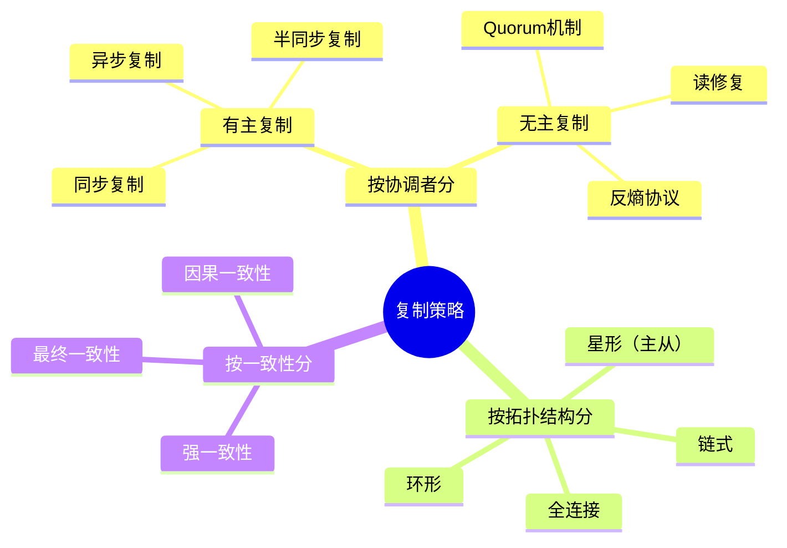
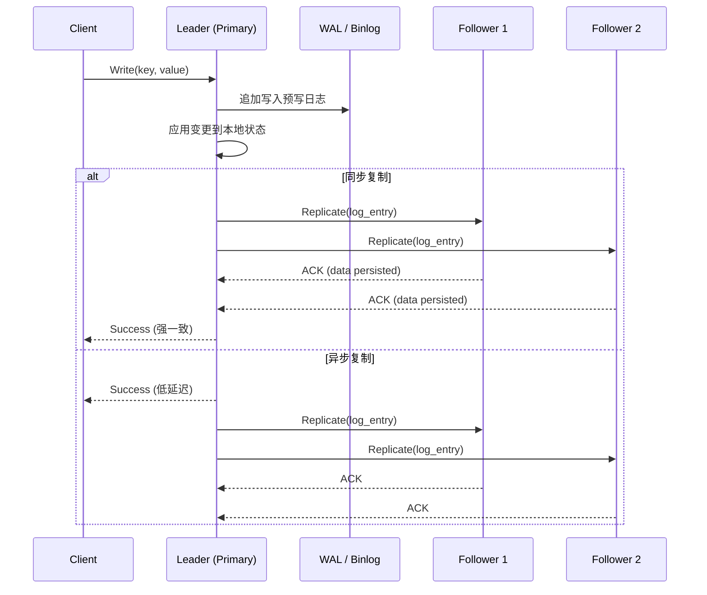
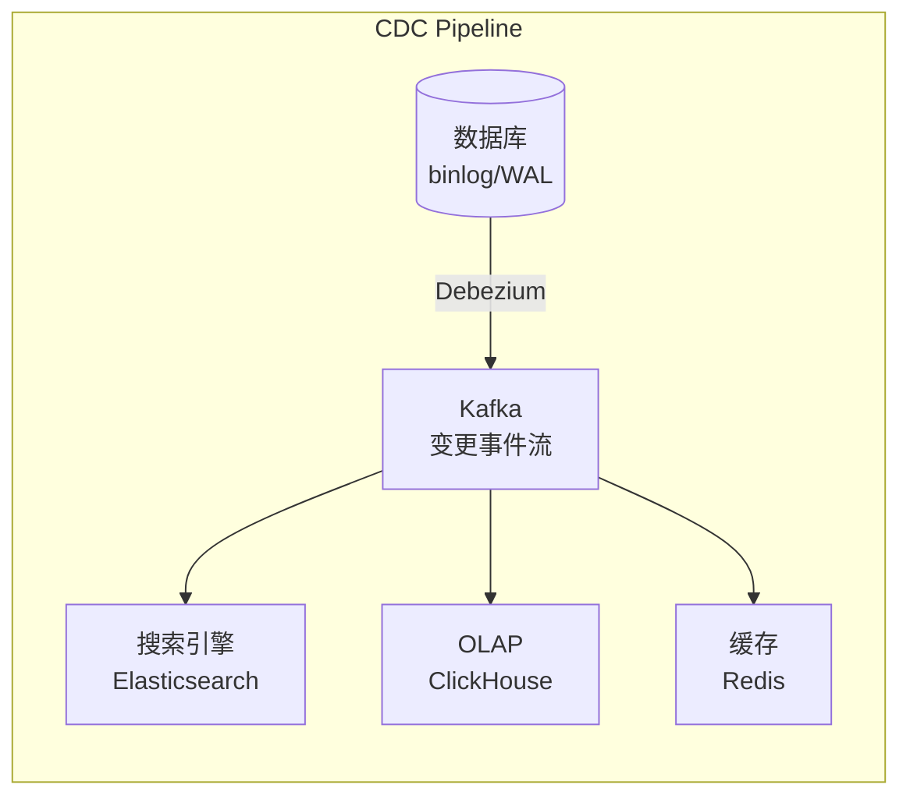
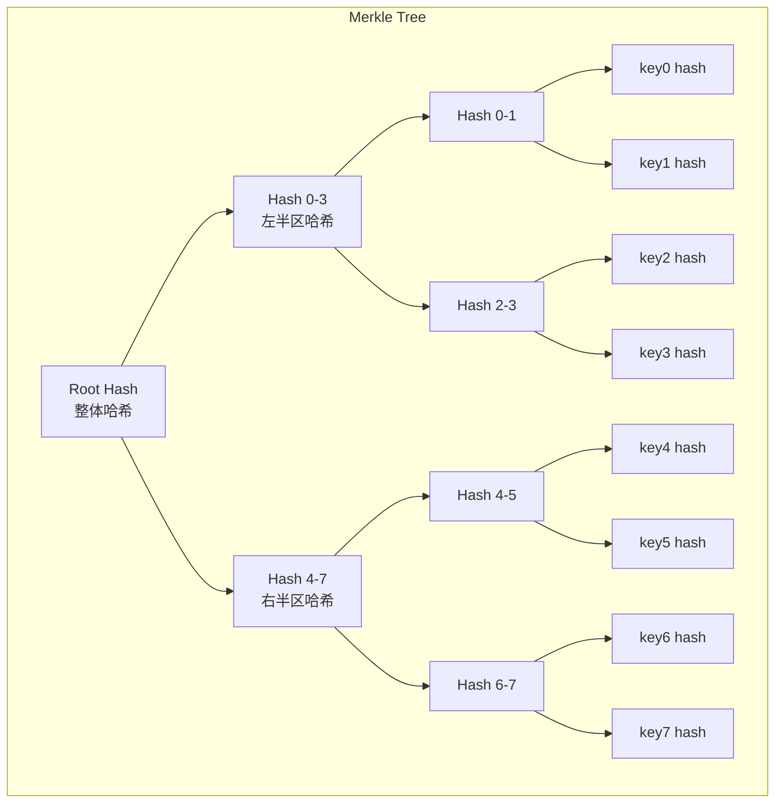
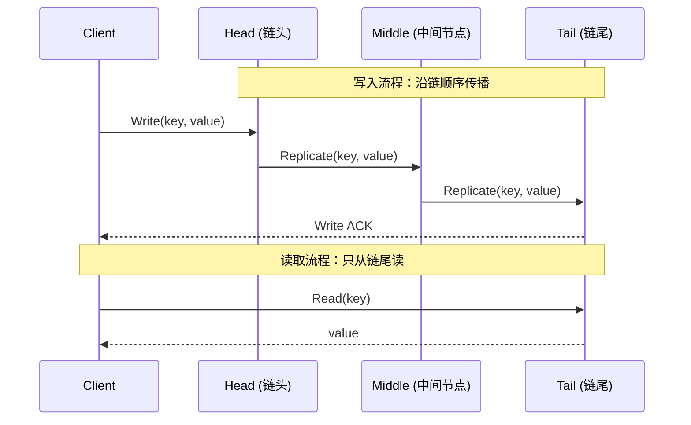
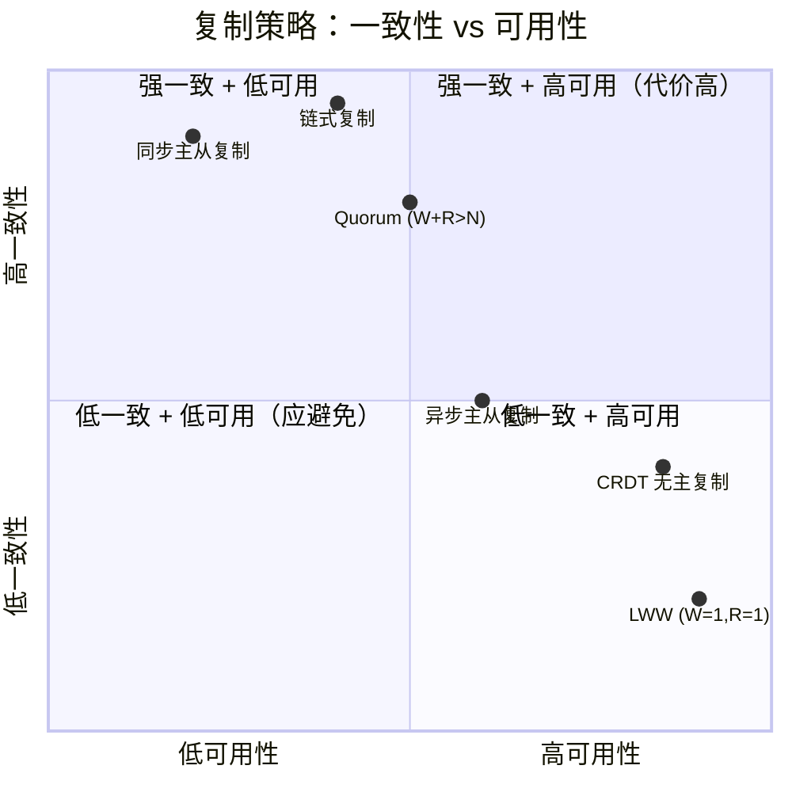
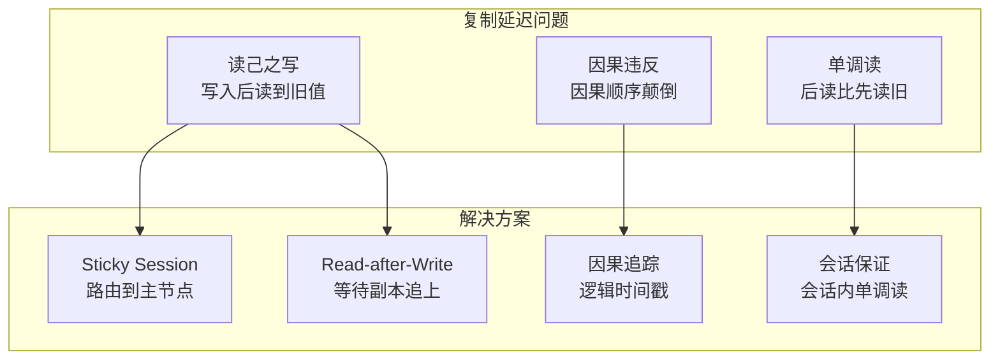

# 数据复制策略

数据复制（Replication）是分布式存储系统的核心机制之一。它的本质问题是：**如何在多台机器上保存同一份数据的多个副本，使得系统在部分节点故障时仍能正常提供服务，同时保持数据的一致性？**

这个问题看似简单，实则牵涉一致性模型、网络分区容错、读写性能等多个维度的权衡。不同的复制策略在一致性强度、可用性、延迟和吞吐量之间做出不同的取舍，直接决定了系统的整体行为特征。

本节系统讲解三大主流复制策略——主从复制、无主复制、链式复制——以及它们的一致性保证机制（Quorum、读修复、反熵、冲突解决），帮助读者理解如何根据业务场景选择最合适的复制方案。

---

## 一、复制的核心目标与权衡

在深入具体策略之前，先明确复制要解决的三个核心目标：

| 目标 | 说明 | 代价 |
|------|------|------|
| **高可用（Availability）** | 即使部分节点故障，系统仍能响应读写请求 | 可能牺牲一致性 |
| **高持久性（Durability）** | 数据写入后不会因单机故障而丢失 | 写入延迟增加 |
| **高性能（Performance）** | 通过副本分散读负载，提升吞吐量 | 写入复杂度增加 |

这三个目标之间存在天然矛盾，这就是 CAP 定理在复制层面的具体体现。**没有任何一种复制策略能同时完美实现所有目标**，关键在于理解每种策略的权衡点，然后匹配业务场景。

### 复制策略分类



---

## 二、主从复制（Leader-Based Replication）

主从复制是最经典、应用最广泛的复制策略。核心思想是：**所有写操作都由一个主节点（Leader）处理，主节点将数据变更异步或同步地传播到从节点（Follower）**。

### 2.1 基本工作流程



### 2.2 三种同步模式对比

主从复制的关键设计决策是**同步程度**的选择：

| 模式 | 写入延迟 | 数据安全性 | 可用性 | 典型系统 |
|------|----------|-----------|--------|---------|
| **同步复制** | 高（等所有副本确认） | 最高（所有副本都有数据） | 低（任一副本故障则写入阻塞） | Google Spanner, ZooKeeper |
| **异步复制** | 低（只等主节点确认） | 有风险（主节点故障可能丢数据） | 高（副本故障不影响写入） | MySQL默认, Cassandra |
| **半同步复制** | 中等（等部分副本确认） | 较高（至少一个副本有数据） | 中等 | MySQL半同步, PostgreSQL |

**工程实践中的常见配置**：大多数系统采用"1+异步"模式，即主节点等待一个同步副本确认，其余副本异步复制。这在数据安全性和性能之间取得了较好的平衡。MySQL的半同步复制（semi-sync replication）就是这种模式的典型实现——至少有一个从节点确认收到日志后，主节点才向客户端返回成功。

### 2.3 日志传输机制

主从复制的效率很大程度上取决于**日志传输机制**的选择：

**基于语句的复制（Statement-Based）**：将写操作的SQL语句本身发送给从节点执行。优点是日志体积小；缺点是非确定性函数（如 `NOW()`、`RAND()`）在从节点可能产生不同结果。

**基于行的复制（Row-Based）**：将每行数据的变更前后值发送给从节点。优点是精确无歧义；缺点是日志体积大（批量更新时尤其明显）。

**基于逻辑日志的复制（WAL Shipping）**：PostgreSQL采用的方式，直接传输预写日志（Write-Ahead Log）。介于前两者之间，与存储引擎解耦。

**基于变更数据捕获（CDC）**：通过监听数据库的变更日志（如MySQL binlog、PostgreSQL WAL），将变更事件推送到消息队列或下游系统。Debezium是这一领域的标杆工具。CDC不仅用于复制，更是构建实时数据管道、事件驱动架构的核心技术。



### 2.4 故障转移（Failover）

主从复制最大的风险在于**主节点故障**。故障转移（Failover）是主节点宕机后重新选举新主节点的过程，这是生产环境中最容易出问题的环节。

**故障转移流程**：

1. **检测故障**：通过心跳超时判断主节点是否存活（通常设置超时时间为 10-30 秒）
2. **确认不可达**：避免因网络抖动误判，需要多数节点确认主节点已失联
3. **选举新主**：从存活的从节点中选择数据最新的节点作为新主
4. **重新配置**：将其他从节点指向新主，更新路由信息
5. **通知客户端**：客户端发现连接失败后，重新连接到新主节点

**常见陷阱**：

- **脑裂（Split-Brain）**：网络分区时可能出现两个"主节点"同时接受写入，导致数据冲突。必须通过 Quorum 机制（如 Raft、Paxos）确保只有一个主节点被选举出来。
- **数据丢失**：如果使用异步复制，旧主节点故障时可能有已确认但未同步到从节点的写入。新主节点上线后这些数据就丢失了。
- **反转复制**：旧主节点恢复后，可能接收到新主节点在其离线期间产生的写入，但旧主节点的日志落后。需要处理这些"反转"的复制流，避免数据不一致。

> **经验法则**：自动故障转移可以缩短恢复时间（MTTR），但必须谨慎配置。许多生产事故源于自动故障转移的误判。关键系统建议采用半自动方式——自动检测+人工确认。

---

## 三、无主复制（Leaderless Replication）

无主复制去掉了主节点的概念，**客户端直接向多个副本发起读写请求，由客户端（或协调节点）负责处理一致性问题**。这种模式的代表是 Amazon Dynamo 论文（2007）定义的 Dynamo 风格复制。

### 3.1 Quorum 读写机制

Quorum（法定人数）是无主复制的核心机制。给定三个参数：

- **N**：副本总数
- **W**：写入成功需要的最少确认数
- **R**：读取成功需要的最少确认数

当 **W + R > N** 时，读写集合必然存在交集，即至少有一个节点同时参与了写入和读取，从而保证**强一致性**。

```python
# Quorum 读写 — 核心一致性保证
class QuorumReplication:
    def __init__(self, n=3, w=2, r=2):
        self.N = n  # 副本总数
        self.W = w  # 写 Quorum
        self.R = r  # 读 Quorum

        # Quorum 配置与一致性关系
        # W=N, R=1 → 读优化（一次读就拿到最新值，写代价高）
        # W=1, R=N → 写优化（写一次就返回，读代价高）
        # W=ceil(N/2)+1, R=ceil(N/2)+1 → 均衡模式（典型配置）

    def quorum_satisfied(self, responses_needed, total_responses):
        """判断是否满足 Quorum"""
        return total_responses >= responses_needed

    def consistency_check(self):
        """验证 Quorum 配置是否保证强一致性"""
        if self.W + self.R > self.N:
            return "强一致性：读写集合有交集"
        elif self.W + self.R <= self.N:
            return "最终一致性：可能存在读到旧值的情况"
```

**Quorum 配置的实际选择**：

| 配置 | W | R | 一致性 | 读性能 | 写性能 | 适用场景 |
|------|---|---|--------|--------|--------|---------|
| 读优化 | N | 1 | 强一致 | 低（等N个写） | 高 | 写少读多（如配置中心） |
| 写优化 | 1 | N | 最终一致 | 高（1个写） | 低（等N个读） | 写多读少（如日志系统） |
| 均衡 | ⌈N/2⌉+1 | ⌈N/2⌉+1 | 强一致 | 中 | 中 | 通用场景（如用户数据） |
| 最终一致 | 1 | 1 | 最终一致 | 最高 | 最高 | 对一致性要求低（如计数器） |

### 3.2 节点选择与数据分布

无主复制中，客户端需要决定向哪些节点发起读写请求。这由**数据分区策略**决定（详见后续章节），但复制层面有两个关键问题：

**节点发现**：客户端如何知道某个 key 的副本在哪些节点上？通常通过一致性哈希环（Consistent Hashing）来确定。Cassandra 使用虚拟节点（vnodes）来平衡数据分布，每个物理节点负责哈希环上的多个虚拟节点段。

**部分失败处理**：向 N 个节点发起请求，可能有部分节点无响应。策略是**读写都设置超时**，超时的节点视为失败，只要满足 Quorum 数即可返回成功。但要注意：**超时 ≠ 失败**——请求可能只是延迟了，稍后到达。这会导致"幽灵写入"（Ghost Write），即迟到的写入覆盖了后续的新值。

### 3.3 读修复（Read Repair）

读修复是无主复制中维持最终一致性的重要机制。当客户端读取某个 key 时，向多个副本发起读请求，如果发现某些副本的版本较旧，就将最新值写回这些过期副本。

```python
def read_with_repair(key, quorum_r, all_nodes):
    """
    带读修复的 Quorum 读取

    流程：
    1. 向所有节点发起读请求（或至少向所有可能持有该 key 的节点）
    2. 等待 R 个响应，取版本最高的值
    3. 将最新值异步写回过期的副本
    4. 返回最新值
    """
    responses = parallel_read(key, all_nodes, timeout_ms=1000)

    if len(responses) < quorum_r:
        raise ReadQuorumNotMet(key, len(responses), quorum_r)

    # 选择版本最高的响应
    latest = max(responses, key=lambda r: r.version)

    # 异步修复过期副本
    for resp in responses:
        if resp.version < latest.version:
            async_write(
                node=resp.node,
                key=key,
                value=latest.value,
                version=latest.version
            )

    return latest.value
```

**读修复的优缺点**：

- 优点：在读取过程中自动修复不一致，对写入性能零影响
- 缺点：只在读取时触发——如果某个 key 长时间无人读取，过期副本会一直存在。因此读修复只能作为**辅助机制**，不能替代反熵协议。

### 3.4 反熵协议（Anti-Entropy）

反熵协议通过后台任务主动对比节点间的数据差异并同步，解决读修复无法覆盖的"冷数据"问题。

**Merkle 树比较**是反熵的核心数据结构：



**Merkle 树的工作原理**：

1. 每个节点为自己的数据子集构建 Merkle 树
2. 两个节点交换 Merkle 树的根哈希
3. 如果根哈希相同，数据完全一致，无需同步
4. 如果根哈希不同，比较子节点哈希，递归向下找到不一致的具体范围
5. 只同步不一致范围内的数据

**复杂度分析**：对于 N 个 key，Merkle 树的比较次数为 O(log N)。假设有 100 万个 key，只需约 20 次哈希比较就能定位到不一致的具体 key，而不需要逐条对比。这使得反熵协议的带宽开销极低。

**实际实现中的注意事项**：

- Merkle 树的粒度选择很关键：粒度太细（每个 key 一个叶子节点）导致树过大；粒度太粗（每个范围一个叶子节点）导致定位不精确
- Cassandra 的实现是将 key space 分成多个 token range，每个 range 维护一棵 Merkle 树
- 反熵协议通常是**定期触发**的（如每小时或每天），而不是持续运行
- 两个节点在反熵过程中需要短暂锁定相关数据范围，避免同步期间产生新的不一致

---

## 四、链式复制（Chain Replication）

链式复制是一种特殊的有主复制变体，由 Robbert van Renesse 和Fred B. Schneider 在 2004 年提出。它的特点是**写操作沿链顺序传播，读操作只从链尾节点读取**。

### 4.1 工作原理



**链式复制的核心保证**：

- **写入**：客户端将写请求发送给链头（Head），Head 处理后按链顺序逐个传播，直到链尾（Tail）确认后才返回成功
- **读取**：客户端只从链尾读取，因为链尾的数据一定是最新的（所有写入都已传播完成）
- **强一致性**：由于所有读都从链尾读，所有写都到链尾结束，天然保证线性一致性

### 4.2 故障处理

链式复制的故障处理比主从复制更优雅：

**链中间节点故障**：将故障节点从链中移除，将前后节点直接相连。不需要重新选举。

**链尾故障**：将前一个节点提升为新的链尾。所有写入已经到达该节点，因此不丢失数据。

**链头故障**：将下一个节点提升为新的链头。客户端将写入发送给新的链头。

### 4.3 与主从复制的对比

| 维度 | 主从复制 | 链式复制 |
|------|---------|---------|
| 读取节点 | 任意从节点（可能读到旧值） | 固定链尾（保证最新） |
| 一致性 | 取决于同步模式 | 天然强一致 |
| 写入延迟 | 所有从节点并行接收（快） | 链式顺序传播（慢，与链长成正比） |
| 读取延迟 | 取决于从节点负载 | 链尾节点负载集中（可能成为瓶颈） |
| 故障转移 | 需要选举新主，复杂 | 移除故障节点，简单 |

---

## 五、冲突解决策略

在无主复制和多主复制（Multi-Leader）场景中，不同副本可能同时收到对同一 key 的不同写入，产生**写冲突**。冲突解决是分布式数据一致性中最具挑战性的问题之一。

### 5.1 最后写入胜出（Last Write Wins, LWW）

```python
def lww_resolve(conflicting_writes):
    """
    LWW 冲突解决：选择时间戳最大的写入

    问题：依赖物理时钟，而物理时钟不可靠
    - 不同节点的时钟可能有偏差（通常几十毫秒到几秒）
    - 时钟回拨可能导致数据丢失
    - 无法保证真正的"最后"写入被选中
    """
    return max(conflicting_writes, key=lambda w: w.timestamp)
```

LWW 是最简单的冲突解决策略，Cassandra 默认使用它。但它有一个致命缺陷：**如果两个写入的时钟偏差导致时间戳相同或乱序，其中一个写入会被静默丢弃**。这对于用户的个人数据（如购物车、个人设置）是不可接受的。

### 5.2 向量时钟（Vector Clock）

向量时钟通过维护每个节点的逻辑时钟来追踪因果关系，避免了物理时钟的不可靠性。

```python
class VectorClock:
    """
    向量时钟：追踪事件间的因果关系

    每个节点维护一个计数器向量 {node_id: counter}
    - 每次写入时，当前节点的计数器 +1
    - 判断两个版本的因果关系：
      - 如果 A 的所有分量 <= B 的分量 → A happened-before B
      - 否则 → A 和 B 并发（冲突）
    """
    def __init__(self, node_id):
        self.clock = {node_id: 0}
        self.node_id = node_id

    def increment(self):
        self.clock[self.node_id] = self.clock.get(self.node_id, 0) + 1

    def merge(self, other_clock):
        """合并两个向量时钟（取各分量的最大值）"""
        merged = {}
        all_nodes = set(self.clock.keys()) | set(other_clock.clock.keys())
        for node in all_nodes:
            merged[node] = max(
                self.clock.get(node, 0),
                other_clock.clock.get(node, 0)
            )
        return merged

    @staticmethod
    def happened_before(v1, v2):
        """判断 v1 是否 happened-before v2"""
        dominated = all(
            v1.clock.get(n, 0) <= v2.clock.get(n, 0)
            for n in set(v1.clock.keys()) | set(v2.clock.keys())
        )
        strictly_less = any(
            v1.clock.get(n, 0) < v2.clock.get(n, 0)
            for n in set(v1.clock.keys()) | set(v2.clock.keys())
        )
        return dominated and strictly_less
```

**向量时钟的权衡**：

- 优点：精确追踪因果关系，不会误判冲突
- 缺点：向量大小与节点数成正比，大规模集群中存储开销显著。Dynamo 论文中使用了"向量时钟截断"来缓解这一问题，但这会引入无法判断因果关系的盲区。

### 5.3 无冲突复制数据类型（CRDT）

CRDT（Conflict-free Replicated Data Types）是冲突解决领域的重大突破。它的核心思想是：**设计特殊的数学数据结构，使得任意顺序的合并操作都能收敛到同一状态，无需协调**。

```python
# G-Counter（只增计数器）— 最简单的 CRDT
class GCounter:
    """
    分布式计数器，只支持 +1 操作
    每个节点维护自己的计数，合并时取各节点计数的最大值
    """
    def __init__(self, node_id):
        self.node_id = node_id
        self.counts = {}  # {node_id: count}

    def increment(self):
        self.counts[self.node_id] = self.counts.get(self.node_id, 0) + 1

    def value(self):
        return sum(self.counts.values())

    def merge(self, other):
        """合并两个 G-Counter：取各分量的最大值"""
        for node, count in other.counts.items():
            self.counts[node] = max(self.counts.get(node, 0), count)

# PN-Counter（支持增减的计数器）
class PNCounter:
    """
    由两个 G-Counter 组成：一个记录增加，一个记录减少
    value = P - N
    """
    def __init__(self, node_id):
        self.positive = GCounter(node_id)
        self.negative = GCounter(node_id)

    def increment(self):
        self.positive.increment()

    def decrement(self):
        self.negative.increment()

    def value(self):
        return self.positive.value() - self.negative.value()

    def merge(self, other):
        self.positive.merge(other.positive)
        self.negative.merge(other.negative)

# LWW-Register（最后写入寄存器）
class LWWRegister:
    """
    通过向量时钟实现的无冲突寄存器
    冲突时选择"更大"的时间戳版本
    """
    def __init__(self):
        self.value = None
        self.timestamp = 0

    def set(self, value, timestamp):
        if timestamp > self.timestamp:
            self.value = value
            self.timestamp = timestamp

    def merge(self, other):
        if other.timestamp > self.timestamp:
            self.value = other.value
            self.timestamp = other.timestamp

# OR-Set（观测移除集合）
class ORSet:
    """
    Observed-Remove Set：支持添加和移除的集合
    核心思想：为每个添加操作生成唯一 tag
    移除操作只移除"已观察到"的 tag
    """
    def __init__(self):
        self.elements = {}  # {tag: element}

    def add(self, element, tag):
        self.elements[tag] = element

    def remove(self, element):
        # 只移除当前已存在的该元素的 tag
        tags_to_remove = [
            tag for tag, elem in self.elements.items()
            if elem == element
        ]
        for tag in tags_to_remove:
            del self.elements[tag]

    def value(self):
        return set(self.elements.values())

    def merge(self, other):
        for tag, elem in other.elements.items():
            if tag not in self.elements:
                self.elements[tag] = elem
```

**CRDT 的常见类型**：

| 类型 | 操作 | 语义 | 应用场景 |
|------|------|------|---------|
| G-Counter | +1 | 只增计数 | 点赞数、浏览量 |
| PN-Counter | +1, -1 | 可增减计数 | 账户余额 |
| G-Set | add | 只增集合 | 标签、关注列表 |
| OR-Set | add, remove | 观测移除集合 | 待办事项列表 |
| LWW-Register | set | 最后写入胜出 | 用户配置项 |
| MV-Register | set | 多版本寄存器 | 保留冲突版本供人工合并 |
| LWW-Element-Map | set, remove | LWW 映射 | 字典/键值对 |

---

## 六、复制策略选型指南

### 6.1 场景匹配

| 业务场景 | 推荐策略 | 理由 |
|---------|---------|------|
| 关系型数据库（OLTP） | 主从复制 + 半同步 | 成熟生态，强一致性可选 |
| 电商购物车 | 多主复制 + CRDT | 跨机房写入，冲突自动收敛 |
| 用户Session/配置 | 主从复制 + 同步 | 强一致性要求高 |
| 日志收集 | 无主复制（W=1,R=1） | 高吞吐，最终一致即可 |
| 金融交易 | 主从复制 + Raft/Paxos | 强一致性，不能丢数据 |
| 社交动态（点赞/评论） | 无主复制 + CRDT | 高可用优先，计数器用 G-Counter |
| 跨地域多活 | 多主复制 + 冲突解决 | 每个地域独立写入 |

### 6.2 一致性与可用性的权衡矩阵



### 6.3 复制延迟的工程影响

复制延迟（Replication Lag）在实际工程中会带来一系列问题：

**读己之写（Read-Your-Writes）**：用户写入后立即刷新页面，但读请求被路由到了尚未同步到最新数据的副本，看到的还是旧值。解决办法：将该用户的后续读请求路由到主节点（sticky session），或等待副本追上（read-after-write consistency）。

**单调读（Monotonic Reads）**：用户连续两次读取，第二次看到的数据比第一次还旧（因为两次读命中了不同副本）。解决办法：确保同一用户的读请求始终路由到同一个副本。

**因果一致性违反**：用户 A 发帖，用户 B 回复，但另一个用户先看到回复再看到原帖。解决办法：使用因果一致性模型，通过逻辑时间戳追踪因果依赖。



---

## 七、生产环境中的复制实践

### 7.1 复制因子的选择

复制因子（Replication Factor, RF）直接影响存储成本和容错能力：

| RF | 可容忍故障节点数 | 存储开销 | 适用场景 |
|----|----------------|---------|---------|
| 1 | 0（无冗余） | 1x | 临时数据、缓存 |
| 2 | 1 | 2x | 开发测试环境 |
| 3 | 1（Quorum=2） | 3x | 生产环境默认值 |
| 5 | 2 | 5x | 关键数据（金融/医疗） |

**经验法则**：RF=3 是绝大多数生产环境的最佳选择。它在存储成本和容错能力之间取得了最佳平衡——可以容忍 1 个节点故障，同时 Quorum 读写只需要 2 个节点响应。

### 7.2 监控与运维要点

```bash
# 复制延迟监控（以 PostgreSQL 为例）
# 检查主从复制延迟
SELECT
    client_addr,
    state,
    sent_lsn,
    write_lsn,
    flush_lsn,
    replay_lsn,
    pg_wal_lsn_diff(sent_lsn, replay_lsn) AS replication_lag_bytes
FROM pg_stat_replication;

# 以 Cassandra 为例，检查节点间修复状态
nodetool tpstats | grep "Anti-Entropy"
nodetool repair --full <keyspace>

# 以 Kafka 为例，检查副本同步状态
kafka-topics.sh --describe --topic my-topic --bootstrap-server localhost:9092
# 关注 ISR (In-Sync Replicas) 列表和 under-replicated 分区
```

### 7.3 常见误区

| 误区 | 正确理解 |
|------|---------|
| "同步复制是最安全的" | 同步复制在所有副本确认前不返回成功，但如果主节点在写入本地后、副本确认前崩溃，副本的确认也无法发送。真正的安全需要持久化到多数节点（如 Raft 的多数派提交） |
| "Quorum=2 就绝对安全" | Quorum 只保证强一致性，不保证持久性。如果所有副本在同一节点上（配置错误），该节点故障仍会丢数据。副本必须分布在不同物理节点/机架/可用区 |
| "读修复能完全解决不一致" | 读修复只修复被读取的 key。冷数据永远不会被修复。必须配合反熵协议定期全量扫描 |
| "CRDT 是银弹" | CRDT 只能提供最终一致性，无法表达所有语义。例如 CRDT 无法实现"取两个值中的较小者"（min），因为 min 操作不是幂等的 |
| "主从复制不需要处理冲突" | 主从复制确实避免了写冲突，但如果从节点在主节点故障期间被提升为新主，而旧主后来恢复，仍需要处理反转复制的冲突 |

---

## 八、进阶：混合复制策略

现代分布式系统往往不局限于单一复制策略，而是根据数据特性和访问模式采用**混合策略**：

- **Redis Cluster**：主从复制用于副本冗余 + Redis Sentinel 用于故障检测和自动切换
- **Cassandra**：无主复制 + 可调一致性级别（每个请求可独立指定 QUORUM/ONE/ALL）
- **MongoDB**：复制集（主从）+ 可选从节点读取 + 多副本集实现跨数据中心复制
- **TiKV（TiDB 底层）**：Raft 复制（强一致）+ Region 分片 + 多副本跨机房部署

这些系统的核心启示是：**复制策略不是一成不变的架构决策，而是可以根据数据热度、一致性需求、地理分布动态调整的运行时策略**。

---

## 本节小结

数据复制策略是分布式存储的基石。理解主从复制的同步模式、无主复制的 Quorum 机制、链式复制的一致性保证，以及 CRDT 的冲突解决能力，是设计分布式系统的基本功。关键在于：**没有最好的复制策略，只有最适合业务场景的复制策略**。在实际工程中，往往需要组合多种策略，在一致性、可用性、性能和成本之间找到最佳平衡点。
