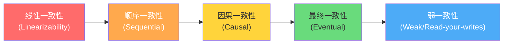
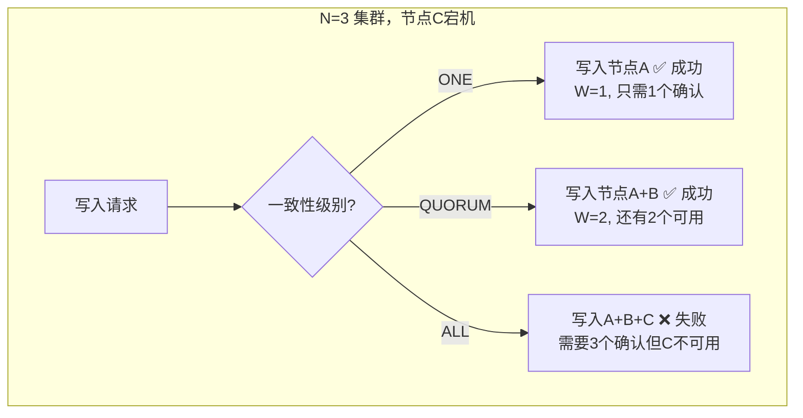
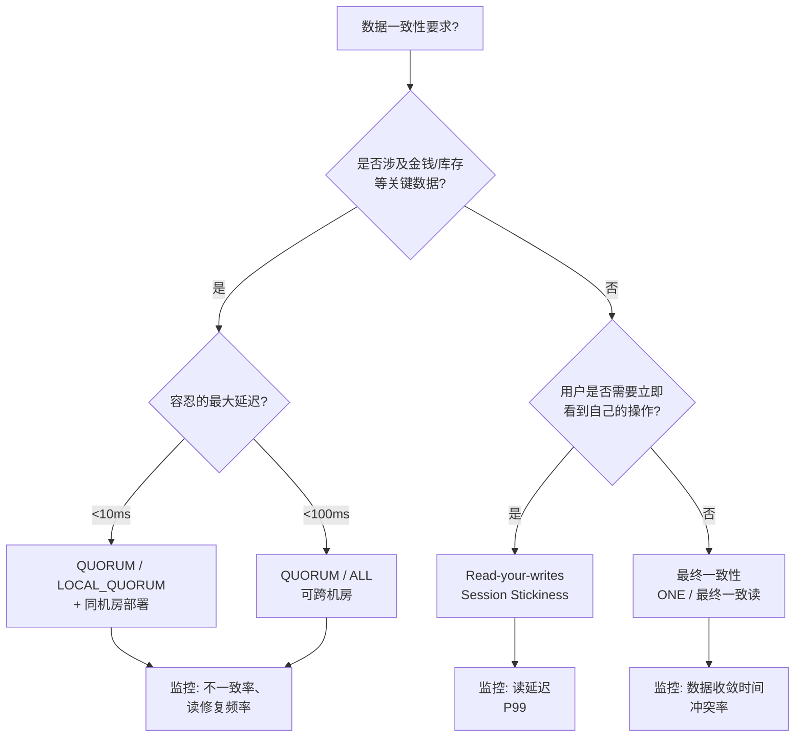

# 一致性级别

在分布式存储系统中，数据被复制到多个节点以提高可靠性和读取性能。然而，多副本引入了一个根本性矛盾：**如何在性能、可用性和数据正确性之间取得平衡？** 一致性级别（Consistency Level）正是用来定义这一平衡点的核心参数——它决定了一次读写操作需要等待多少副本确认后才算成功。

本节将从理论模型出发，系统讲解一致性级别的分类、实现机制和工程选型方法。

---

## 理论基础：从 CAP 到一致性模型

### CAP 定理

2000 年，Eric Brewer 提出的 CAP 定理指出，分布式系统无法同时满足以下三个目标：

| 属性 | 含义 | 典型诉求 |
|------|------|----------|
| **C**onsistency（一致性） | 所有节点在同一时刻看到相同的数据 | 每次读取都返回最新写入的值 |
| **A**vailability（可用性） | 每个请求都能收到非错误响应 | 系统始终能处理读写请求 |
| **P**artition Tolerance（分区容忍性） | 网络分区时系统继续运行 | 节点间通信中断后仍能服务 |

CAP 定理的核心结论是：**当网络分区发生时，必须在一致性和可用性之间做取舍。** 这不是理论上的极端假设——在跨机房、跨地域部署中，网络延迟和抖动是常态，分区随时可能发生。

实际系统的设计选择通常是：

- **CP 系统**：牺牲可用性保一致性。如 ZooKeeper、HBase、etcd。分区时拒绝写入或降级服务，确保数据不会出现不一致。
- **AP 系统**：牺牲一致性保可用性。如 Cassandra、DynamoDB、CouchDB。分区时仍能处理请求，但可能返回旧数据，通过后台机制最终修复不一致。

CAP 定理后来被 Dan Abadi 精炼为更实用的 **PACELC 模型**：在分区（P）发生时选择可用性（A）还是一致性（C）；在正常运行时（E, Else），选择延迟（L）还是一致性（C）。

### 一致性模型的层级

一致性模型按严格程度从高到低排列，形成一个"一致性光谱"：



**1. 线性一致性（Linearizability）**

最强的一致性保证。要求操作表现得好像只有一个副本，且所有操作按全局时间顺序执行。一旦写入成功，后续所有读取必须看到这个值。

```python
# 线性一致性示例：写入后立即读取，必然返回最新值
client.write("counter", 42)
value = client.read("counter")
assert value == 42  # 在线性一致性下，这个断言永远不会失败
```

实现方式通常基于共识协议（Raft、Paxos），每笔写入需要多数节点确认。典型系统：Google Spanner（TrueTime + Paxos）、etcd（Raft）、ZooKeeper（ZAB）。

**2. 顺序一致性（Sequential Consistency）**

所有操作可以排成一个序列，该序列满足：(a) 每个进程的操作在序列中保持其程序顺序；(b) 所有进程看到的序列一致。不要求反映真实时间顺序。

与线性一致性的区别：如果进程 P 先写 x=1 再写 y=2，另一个进程 Q 可能先看到 y=2 再看到 x=1，这在线性一致性下不允许，但在顺序一致性下是合法的。

**3. 因果一致性（Causal Consistency）**

保证有因果关系的操作顺序一致，没有因果关系的操作可以乱序。这是"合理的"最低一致性——如果 A 发生在 B 之前（且 A 的结果影响了 B），那么所有节点都必须先看到 A 再看到 B。

```python
# 因果一致性示例
# 进程 A: 写入 x=1，然后基于 x 的值写入 y=x+1
# 因果关系: x=1 → y=2
# 所有节点必须先看到 x=1 再看到 y=2
# 但另一个不相关的写入 z=5 可以以任意顺序被看到
```

典型实现：版本向量（Vector Clock）、因果日志。MongoDB 4.0+ 支持因果一致性会话。

**4. 最终一致性（Eventual Consistency）**

最弱的正式保证：如果没有新的写入，所有副本最终会收敛到相同的值。在收敛之前，不同的副本可能返回不同的值。

```python
# 最终一致性下的时序：
t0: client.write("x", 1)  # 写入节点 A
t1: client.read("x")       # 读节点 B，可能返回旧值或超时
t2: client.read("x")       # 读节点 B，仍可能返回旧值
t3: client.read("x")       # 读节点 B，此时数据已同步，返回 1
```

Cassandra、DynamoDB 在默认配置下就是最终一致性。收敛速度取决于网络延迟、副本数量和冲突解决策略（Last-Write-Wins、向量时钟等）。

**5. Read-your-writes 一致性**

保证一个进程总能看到自己的写入结果。这是最常用的一致性保证之一——用户发布评论后立即刷新页面，应该能看到自己刚发的评论。

```python
# Read-your-writes 实现：写入后将读请求路由到主副本
def read_after_write(user_id, key):
    # 1. 写入完成后，记住该用户写入的最新时间戳
    # 2. 后续该用户的读请求强制路由到最新数据的副本
    # 3. 或者使用 session sticky（会话粘性）保证同会话内一致
```

---

## 一致性级别的工程实践

在具体的分布式存储系统中，一致性被细化为多个操作级别的配置。以 Apache Cassandra 为代表，一致性级别被定义为**每次读写操作需要参与并确认的最小副本数**。

### 读写一致性级别全览

| 级别 | 写入语义 | 读取语义 | 适用场景 |
|------|----------|----------|----------|
| **ONE / ANY** | 只需1个副本确认 | 只从1个副本读取 | 最低延迟，容忍过时数据 |
| **TWO** | 需2个副本确认 | 从2个副本读取 | 折中方案 |
| **QUORUM** | 需 ⌊N/2⌋+1 个副本确认 | 从 ⌊N/2⌋+1 个副本读取 | 平衡一致性和性能 |
| **LOCAL_QUORUM** | 本数据中心 ⌊N_local/2⌋+1 确认 | 本数据中心 ⌊N_local/2⌋+1 读取 | 多数据中心部署 |
| **EACH_QUORUM** | 每个数据中心都达到 QUORUM | — | 跨数据中心强一致写入 |
| **ALL** | 所有副本都确认 | 从所有副本读取 | 最强一致性，最低可用性 |

### Quorum 机制详解

Quorum 是实现可调一致性的核心机制。设 N 为副本总数，W 为写入确认数，R 为读取确认数：

当 W + R > N 时，读写副本集合必然有交集，保证读取到最新数据

具体来说：

| N | W | R | W+R | 是否保证一致性 | 说明 |
|---|---|---|-----|---------------|------|
| 3 | 3 | 1 | 4 > 3 | ✅ 是 | 写全部，读1个即可 |
| 3 | 2 | 2 | 4 > 3 | ✅ 是 | 标准 QUORUM 配置 |
| 3 | 1 | 3 | 4 > 3 | ✅ 是 | 写1个，读全部 |
| 3 | 1 | 1 | 2 < 3 | ❌ 否 | 读写可能操作不同副本 |

```python
class QuorumManager:
    def __init__(self, nodes):
        self.nodes = nodes  # [node_a, node_b, node_c]
        self.n = len(nodes)
        self.w = self.n // 2 + 1  # 默认 QUORUM: floor(N/2)+1
        self.r = self.n // 2 + 1
    
    def configure(self, consistency_level):
        """根据一致性级别设置 W 和 R"""
        configs = {
            'ONE':      {'w': 1, 'r': 1},
            'TWO':      {'w': 2, 'r': 2},
            'QUORUM':   {'w': self.n // 2 + 1, 'r': self.n // 2 + 1},
            'ALL':      {'w': self.n, 'r': self.n},
        }
        cfg = configs.get(consistency_level, configs['QUORUM'])
        self.w = cfg['w']
        self.r = cfg['r']
    
    def write(self, key, value):
        """并行写入所有节点，等待 W 个确认"""
        futures = [node.put(key, value) for node in self.nodes]
        confirmed = sum(1 for f in futures if f.wait(timeout=1.0) == OK)
        return confirmed >= self.w
    
    def read(self, key):
        """并行读取所有节点，返回多数投票结果"""
        futures = [node.get(key) for node in self.nodes]
        results = [f.result() for f in futures if f.done()]
        if len(results) < self.r:
            raise ConsistencyError(f"Only {len(results)} of {self.r} needed responses received")
        return majority_vote(results)  # 选择版本最新的值
```

### Quorum 的故障降级行为

当部分节点不可用时，不同一致性级别的表现差异巨大：



这揭示了一个关键权衡：**一致性级别越高，单个节点故障对可用性的影响越大。**

---

## 各主流系统的一致性实现

### Cassandra

Cassandra 是"可调一致性"的标杆。每个读写请求都可以单独指定一致性级别，且支持读写使用不同级别。

```python
# Cassandra 一致性级别配置示例
from cassandra.cluster import Cluster
from cassandra import ConsistencyLevel

cluster = Cluster(['192.168.1.10', '192.168.1.11', '192.168.1.12'])
session = cluster.connect('my_keyspace')

# 写入：使用 QUORUM 保证强一致
session.default_consistency_level = ConsistencyLevel.QUORUM
session.execute("INSERT INTO users (id, name) VALUES (1, 'Alice')")

# 读取：使用 ONE 提高性能（可能读到旧数据）
session.default_consistency_level = ConsistencyLevel.ONE
row = session.execute("SELECT * FROM users WHERE id = 1").one()

# 可以在单条查询级别覆盖全局设置
from cassandra.query import SimpleStatement
stmt = SimpleStatement("SELECT * FROM users WHERE id = 1",
                        consistency_level=ConsistencyLevel.ALL)
session.execute(stmt)
```

Cassandra 的多数据中心一致性级别尤其重要：

| 级别 | 行为 | 延迟影响 |
|------|------|----------|
| QUORUM | 跨数据中心计算总 QUORUM | 受最远数据中心延迟影响 |
| LOCAL_QUORUM | 仅本数据中心达到 QUORUM | 仅受本数据中心延迟影响 |
| EACH_QUORUM | 每个数据中心都达到 QUORUM | 最高延迟，但跨 DC 也一致 |

```python
# 多数据中心场景配置
# 假设: DC1 有 3 副本, DC2 有 3 副本, 总 N=6

# 方案一: LOCAL_QUORUM (推荐)
# 写: DC1 写 2 个 + DC2 写 2 个 (各 DC 内 QUORUM)
# 优点: 不受跨 DC 延迟影响 (DC 间延迟通常 50-200ms)
# 缺点: 两个 DC 之间可能短暂不一致

# 方案二: EACH_QUORUM (最强)
# 写: DC1 写 2 个 + DC2 写 2 个, 全部完成才返回
# 优点: 跨 DC 也保证一致性
# 缺点: 延迟 = max(DC1写入延迟, DC2写入延迟)

# 方案三: QUORUM (总)
# 写: 总共需要 4 个确认 (可能来自任一 DC)
# 风险: 可能 4 个确认都来自 DC1, DC2 未更新
```

### DynamoDB

Amazon DynamoDB 提供两种一致性选项：

- **最终一致性读取**（默认）：从主副本或某个副本读取，可能返回过时数据，延迟更低，吞吐量翻倍（消耗的读容量单位减半）。
- **强一致性读取**：始终从主副本读取，保证读到最新写入，但消耗双倍读容量单位。

```python
import boto3

dynamodb = boto3.resource('dynamodb')
table = dynamodb.Table('Users')

# 最终一致性读取（默认，读容量消耗 0.5 RCU/项目）
response = table.get_item(Key={'user_id': '123'}, ConsistentRead=False)
item = response['Item']

# 强一致性读取（读容量消耗 1.0 RCU/项目）
response = table.get_item(Key={'user_id': '123'}, ConsistentRead=True)
item = response['Item']
```

DynamoDB 的设计哲学是：**将一致性选择权交给调用方，而不是系统级强制。** 99% 的读取场景用最终一致性就够了，只有涉及计费、库存等关键业务时才需要强一致。

### HBase

HBase 的一致性模型相对固定，基于 RegionServer 的主从架构：

- **写入**：总是先写入主 Region，然后异步复制到从 Region。客户端写入成功意味着数据已在主 Region 落盘。
- **读取**：默认从主 Region 读取（强一致），配置 `hbase.replication` 后可以从从 Region 读取。

```xml
<!-- hbase-site.xml 配置 -->
<!-- 强一致性：所有读写都经过主 Region -->
<property>
  <name>hbase.regionserver.storefile.refresh.period</name>
  <value>0</value>
</property>

<!-- 允许从 Region 服务读取（用于读扩展，牺牲一致性） -->
<property>
  <name>region.replica.replication.enabled</name>
  <value>true</value>
</property>
```

### etcd / TiKV

基于 Raft 共识协议，提供**线性一致性**作为默认行为。每次写入需要多数节点确认，每次读取默认经过 Raft Leader 确认。

```go
// etcd: 线性一致性读取（默认）
resp, _ := client.Get(ctx, "/key", clientv3.WithLastRev()...)

// etcd: 串行一致性读取（从本地缓存读，可能过时但更快）
resp, _ := client.Get(ctx, "/key", clientv3.WithSerializable())
```

---

## 一致性级别的选型方法论

### 选型决策树



### 场景化推荐

| 业务场景 | 推荐写级别 | 推荐读级别 | 理由 |
|----------|-----------|-----------|------|
| 电商库存扣减 | ALL / QUORUM | QUORUM | 超卖是致命问题 |
| 电商商品浏览 | ONE | ONE | 少许延迟可接受 |
| 社交媒体 Feed | QUORUM | ONE / 最终一致 | 写入需可靠，读取允许短暂延迟 |
| 用户会话/登录态 | QUORUM | Read-your-writes | 写入后必须立即生效 |
| 物联网时序数据 | ONE | ONE | 高吞吐优先，少量丢失可容忍 |
| 金融交易记录 | ALL | QUORUM / ALL | 不允许任何数据丢失或不一致 |
| 配置中心 | ALL | QUORUM / ALL | 配置变更必须全局可见 |
| 日志/审计 | ONE | ONE | 高写入吞吐，读取是按需查询 |

### 性能影响实测参考

一致性级别对延迟和吞吐量有直接影响，以下为典型 3 副本 Cassandra 集群的量级参考：

| 级别 | 写延迟 P99 | 读延迟 P99 | 可用写吞吐 | 说明 |
|------|-----------|-----------|-----------|------|
| ONE | ~2ms | ~1ms | 基准 100% | 仅写/读一个节点 |
| QUORUM | ~5ms | ~3ms | 约 60-70% | 需等待多数节点 |
| ALL | ~10ms | ~8ms | 约 30-40% | 等待所有节点，故障即失败 |

*注：实际数值取决于硬件、网络拓扑和负载。跨机房场景下 QUORUM 延迟可能增加一个数量级。*

---

## 常见误区与工程陷阱

### 误区一：默认配置就是最佳配置

许多系统默认使用最终一致性，但开发者往往没有意识到这一点，导致难以复现的数据不一致 bug。

**正确做法**：在项目初期就明确每个数据模型的一致性需求，显式配置，而不是依赖默认值。

### 误区二：ALL 级别更安全

使用 ALL 写入看似最安全，但在 N=5 的集群中，任何一个节点故障都会导致所有写入失败。这不是更安全，而是更脆弱。

**正确做法**：除非业务绝对不能容忍任何不一致（如金融清算），否则用 QUORUM 而非 ALL。

### 误区三：QUORUM 读写一定一致

QUORUM 只保证读写集合有交集。如果写入 QUORUM 后立即有节点宕机，另一个客户端用 QUORUM 读取时恰好避开了最新写入的节点，仍然可能读到旧数据。这是因为 QUORUM 只是一个统计概率保证，不是绝对保证。

**加强手段**：
- 使用 `SLOPPY_QUORUM`（松散 Quorum）时，一致性更弱
- 结合 `read-repair`（读修复）机制，读取时发现版本差异自动修复
- 使用 `anti-entropy`（反熵）进程定期同步副本

### 误区四：最终一致性"不可控"

最终一致性并非放任不管。可以通过以下手段将其控制在可接受范围内：

```python
# 控制最终一致性的三种手段

# 1. 读修复 (Read Repair) — 读取时触发
def read_with_repair(key):
    responses = parallel_read(key, all_nodes)
    latest = max(responses, key=lambda r: r.version)
    for resp in responses:
        if resp.version < latest.version:
            async_write(resp.node, key, latest.value)  # 异步修复
    return latest.value

# 2. 反熵 (Anti-Entropy) — 后台定期运行
def anti_entropy_scan():
    # 使用 Merkle 树比较副本间差异
    # 只需 O(log N) 次比较即可定位不一致数据
    pass

# 3. 有界过期 (Bounded Staleness) — 设置最大延迟上限
# 保证数据最多过期 T 秒或最多落后 V 个版本
# Azure Cosmos DB 原生支持此策略
```

### 误区五：忽略跨数据中心的一致性语义

在多 DC 部署中，`QUORUM` 和 `LOCAL_QUORUM` 的语义完全不同。使用总 `QUORUM` 时，如果 3 个确认中有 3 个都在 DC1，DC2 完全没有新数据，此时 DC2 发生故障切换就会丢失数据。

**正确做法**：多 DC 部署优先使用 `LOCAL_QUORUM`（每个 DC 内部保持一致），配合跨 DC 异步复制和冲突解决策略。

---

## 高级主题

### 有界过期一致性（Bounded Staleness）

有界过期一致性是最终一致性和强一致性之间的中间地带，由 Azure Cosmos DB 推广。它明确定义了"最终"到底有多远：

- **基于时间**：数据最多过期 K 秒。例如 `ConsistentPrefix(boundedStaleness: K=10)` 表示读取到的数据最多比主副本落后 10 秒。
- **基于版本**：数据最多落后 K 个版本。例如主副本已写入 100 个版本，读取至少能看到第 95 个版本。

```python
# Cosmos DB 有界过期一致性配置
# 创建容器时指定
container = database.create_container(
    id="orders",
    partition_key=PartitionKey(path="/order_id"),
    default_consistency_level="ConsistentPrefix",
    consistent_prefix_max_staleness_prefix=10,  # 最多落后10个版本
    consistent_prefix_max_staleness_seconds=60   # 或最多落后60秒
)
```

### 因果一致性实现：版本向量

因果一致性通过版本向量（Vector Clock）追踪事件间的因果关系：

```python
class VectorClock:
    """版本向量：追踪每个节点的逻辑时钟"""
    def __init__(self):
        self.clock = {}  # {node_id: counter}
    
    def increment(self, node_id):
        self.clock[node_id] = self.clock.get(node_id, 0) + 1
    
    def merge(self, other):
        """合并两个版本向量（取各分量的最大值）"""
        for node_id, counter in other.clock.items():
            self.clock[node_id] = max(self.clock.get(node_id, 0), counter)
    
    def happened_before(self, other):
        """判断 self 是否先于 other 发生"""
        dominated = False
        for node_id in set(self.clock) | set(other.clock):
            a = self.clock.get(node_id, 0)
            b = other.clock.get(node_id, 0)
            if a > b:
                return False  # self 在某个节点上更"新"
            if a < b:
                dominated = True  # self 在某个节点上更"旧"
        return dominated
    
    def concurrent_with(self, other):
        """判断两个版本是否并发（无因果关系）"""
        return not self.happened_before(other) and not other.happened_before(self)

# 应用场景：两个客户端并发修改同一数据
# Client A: {A:1} → 写入 x=1
# Client B: {B:1} → 写入 x=2
# 服务器收到两个写入，版本向量分别为 {A:1} 和 {B:1}
# 服务器判断: concurrent! 需要冲突解决（LWW 或应用层合并）
```

### 实际系统中的一致性保证对比

| 系统 | 默认一致性 | 可调一致性 | 最强级别 | 实现机制 |
|------|-----------|-----------|---------|----------|
| Cassandra | ONE (写) / ONE (读) | ✅ 每请求可调 | ALL | Quorum + Gossip |
| DynamoDB | 最终一致读 | ✅ ConsistentRead 参数 | 强一致读 | 内部 Paxos |
| HBase | 强一致 | ❌ 固定 | 强一致 | 单主 Region |
| etcd | 线性一致 | ✅ 可降级为串行 | 线性一致 | Raft |
| TiKV | 线性一致 | ✅ Follower Read | 线性一致 | Raft |
| MongoDB | 最终一致 | ✅ ReadConcern 可调 | Linearizable | Raft (副本集) |
| Cosmos DB | Session | ✅ 5 级可调 | Strong | Paxos (多数派) |

---

## 本节小结

一致性级别的本质是**分布式系统中性能、可用性和正确性的三角博弈**。没有"最好的"一致性级别，只有最适合具体业务场景的选择。

核心要点：

1. **CAP/PACELC 是理论基础**：理解取舍关系，才能做出合理选择
2. **Quorum 是工程核心**：W + R > N 保证一致性，调整 W 和 R 可以在一致性谱上滑动
3. **级别选择因场景而异**：金融用 ALL/QUORUM，社交用最终一致，会话用 Read-your-writes
4. **多 DC 要特别小心**：LOCAL_QUORUM 和 QUORUM 语义差异巨大
5. **最终一致性不等于不可控**：读修复、反熵、有界过期都是有效的控制手段
6. **监控是保障**：无论选择哪个级别，都需要持续监控数据一致性和收敛时间
