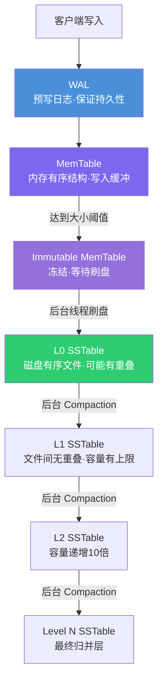
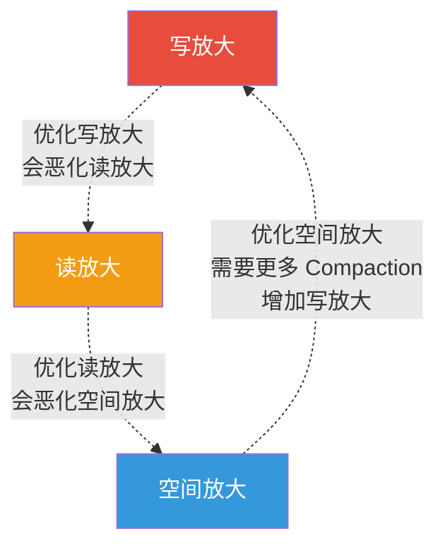

## 5. LSM-Tree 存储引擎

LSM-Tree（Log-Structured Merge-Tree）是现代存储系统中最核心的数据结构之一。从 Google 的 LevelDB、Facebook 的 RocksDB，到 Apache Cassandra、Apache HBase、TiKV，几乎每一个高性能分布式存储引擎都以 LSM-Tree 为底层架构。理解 LSM-Tree，是理解写密集型存储系统的关键钥匙。

### 5.1 设计哲学：为什么需要 LSM-Tree

传统的 B-Tree 存储引擎（如 MySQL InnoDB）在每次写入时都需要随机 I/O——找到目标页、原地修改、写回磁盘。随机写在机械磁盘上极其昂贵，即使在 SSD 上也远不如顺序写高效。

LSM-Tree 的核心思想可以用一句话概括：**将所有写入转化为顺序 I/O**。它不原地修改数据，而是将新数据追加到内存缓冲区，满了之后以有序文件的形式批量刷写到磁盘，再通过后台任务（Compaction）逐步合并、归并、去重。

这种"先写内存、再批量落盘、后台整理"的设计带来了极高的写吞吐量，代价是读取时需要在多个层级中查找。因此，LSM-Tree 本质上是一种**用读放大换写放大**的权衡设计。

#### 与 B-Tree 的根本差异

| 维度 | B-Tree | LSM-Tree |
|------|--------|----------|
| 写入模式 | 原地更新（in-place update） | 追加写入（append-only） |
| 写入放大 | 低（直接写目标页） | 高（数据在 Compaction 中被反复重写） |
| 读取放大 | 低（O(log N) 页查找） | 高（可能扫描多层 SSTable） |
| 空间放大 | 低（页面紧凑） | 中到高（存在冗余数据和墓碑标记） |
| 写吞吐量 | 中等 | 极高（顺序写） |
| 并发控制 | 需要锁页 | 天然支持无锁写入（MemTable 可用 CAS） |
| 适合场景 | 读多写少、事务密集 | 写密集、时序数据、日志型负载 |

### 5.2 核心架构

LSM-Tree 由以下几个关键组件构成，它们共同构成了一条完整的写入和读取流水线：



### 5.3 WAL：预写日志

WAL（Write-Ahead Log）是 LSM-Tree 的安全网。每次写入在进入 MemTable 之前，必须先将操作记录追加到 WAL 文件中。如果进程崩溃，重启时可以通过回放 WAL 恢复 MemTable 的内容。

**WAL 的写入流程：**

1. 客户端发起写请求（Put/Delete）
2. 将操作序列化为日志记录（时间戳 + 操作类型 + Key + Value）
3. 顺序追加到 WAL 文件（一次磁盘写入）
4. 数据写入 MemTable（内存操作）
5. 返回客户端成功确认

**WAL 的关键设计参数：**

- **Sync 策略**：每次写入都 fsync（最安全，性能最低）vs 批量 fsync（默认策略，积累若干条后统一刷盘，兼顾安全与性能）
- **文件轮转**：WAL 文件通常有大小上限（如 64MB），超过后创建新文件；对应的 Immutable MemTable 刷盘成功后，旧 WAL 文件可删除
- **Group Commit**：多个并发写入可以合并一次 fsync，显著降低 I/O 开销。具体机制是：一个线程发起 sync 调用时，其他已写入 WAL 但尚未 sync 的线程直接附着在这次 sync 上等待完成，避免每个写入单独触发一次 fsync

**为什么不能去掉 WAL？**

MemTable 驻留在内存中，掉电即丢失。WAL 是 LSM-Tree 实现持久性（Durability）的唯一保障。即便 MemTable 还未刷盘，WAL 中的记录也能保证数据不丢失。只有对应的 MemTable 成功写入磁盘后，该 WAL 文件才能被安全删除。

**WAL 的优化技巧：**

- **压缩写入**：对 WAL 记录进行轻量级压缩（如 LZ4），降低磁盘写入量，适合 value 较大的场景
- **并行写入**：在多 WAL 文件模式下（RocksDB 的 `max_wal_size` 控制），可以为不同的 Column Family 分配独立的 WAL，减少锁竞争
- **WAL 快照**：某些系统（如 TiKV）利用 WAL 实现增量备份——通过记录 WAL 的起始偏移量来标记备份起点

### 5.4 MemTable：内存写入缓冲

MemTable 是 LSM-Tree 的第一层缓冲，所有写入首先落到 MemTable 中。它是一个驻留在内存中的有序数据结构。

**常用的数据结构实现：**

- **跳表（Skip List）**：RocksDB、LevelDB 的默认实现。支持 O(log N) 的插入、查找、删除，天然支持范围查询，实现简单且并发友好。跳表的并发优势在于：插入操作只需要局部调整指针，不需要像红黑树那样做全局旋转，配合 CAS（Compare-And-Swap）原语可以实现无锁并发写入
- **红黑树 / AVL 树**：理论性能优秀，但实现复杂度高，实际应用较少。主要原因是旋转操作需要修改多个节点的指针，锁粒度难以控制
- **哈希表**：不支持范围查询，仅适用于仅需点查的场景（如 LevelDB 的 HashMemTable 模式）。哈希表的点查性能是 O(1)，比跳表的 O(log N) 更快，但无法支持范围扫描这一关键操作

**MemTable 的并发写入模型：**

MemTable 的并发控制是 LSM-Tree 实现高写入吞吐量的关键。以 RocksDB 为例：

写入线程 A ──┐
写入线程 B ──┼──→ 活跃 MemTable（跳表 + 读写锁）
写入线程 C ──┘         │
                       ▼
              达到阈值 → 切换新 MemTable（原子指针替换）
                       │
                       ▼
              旧 MemTable 变为 Immutable（只读，无需加锁）
                       │
                       ▼
              后台线程刷盘（单线程顺序写）

关键设计：活跃 MemTable 使用读写锁（多个写线程可并发插入，刷盘线程需要独占读锁来遍历）。切换到 Immutable 状态时，只需原子替换当前 MemTable 的指针——这一操作极快，几乎不影响写入延迟。

**MemTable 的生命周期：**

1. **活跃状态**：接收所有新写入，大小持续增长
2. **冻结状态**：达到大小阈值后（如 64MB），切换到一个新的活跃 MemTable，旧的变为 Immutable MemTable
3. **刷盘**：后台线程将 Immutable MemTable 的内容以 SSTable 格式写入磁盘 L0 层
4. **回收**：刷盘完成后，释放内存，删除对应的 WAL 文件

**为什么 MemTable 要冻结而不是直接刷盘？**

因为刷盘是一个耗时的磁盘 I/O 操作，如果在刷盘期间阻塞写入，就会严重影响写入吞吐量。冻结后，写入操作无缝切换到新的 MemTable，刷盘在后台异步进行。

**MemTable 的大小权衡：**

- 过小：频繁触发刷盘，增加 Compaction 压力，降低写入吞吐量
- 过大：占用过多内存，读取时遍历开销增大，崩溃恢复时间变长（需要回放更多 WAL）
- 典型值：64MB-256MB，根据内存预算和写入速率调整

**MemTable 合并刷盘（min_write_buffer_number_to_merge）：**

当存在多个 Immutable MemTable 时，可以将它们合并为一个 SSTable 刷盘，而不是分别生成独立的 SSTable。这样做的好处是减少 L0 的 SSTable 数量，降低后续 Compaction 的压力。RocksDB 中通过 `min_write_buffer_number_to_merge` 参数控制，默认值为 1（不合并），设为 2-3 时可以有效减少 L0 层的文件堆积。

### 5.5 写入路径详解

写入是 LSM-Tree 的核心优势路径。一个完整的写入操作经历以下步骤：

```python
def put(key, value):
    """LSM-Tree 写入流程"""
    
    # 1. 写 WAL（保证持久性）
    wal_entry = encode(key, value, timestamp=now())
    wal.append(wal_entry)
    wal.sync()  # 或批量 sync
    
    # 2. 写 MemTable（内存操作，极快）
    active_memtable.put(key, value)
    
    # 3. 检查是否需要冻结
    if active_memtable.size >= write_buffer_size:
        # 原子切换：当前 MemTable → Immutable
        immutable_memtables.append(active_memtable)
        active_memtable = new_memtable()  # 新建空白 MemTable
        
        # 如果 Immutable MemTable 数量超过阈值，可能触发写入停顿
        if len(immutable_memtables) >= max_write_buffer_number:
            trigger_write_stall()  # 等待后台刷盘完成
    
    # 4. 异步：后台线程将 Immutable MemTable 刷盘为 L0 SSTable
    # （此步骤不阻塞当前写入）
    
    return SUCCESS
```

**写入路径的关键性能特征：**

- **延迟**：一次写入只需一次 WAL 顺序写 + 一次内存插入，典型延迟在微秒级别（SSD 上 WAL sync 约 10-100μs，纯内存操作 < 1μs）
- **吞吐量**：RocksDB 在 NVMe SSD 上可达 500K-1M ops/sec 的写入吞吐量（取决于 value 大小和 WAL sync 策略）
- **Group Commit 的效果**：当写入并发度较高时，多个写入请求可以在一次 WAL sync 中一起完成，显著提高吞吐量。这是 LSM-Tree 在高并发场景下性能远超 B-Tree 的关键原因之一

**写入停顿（Write Stall）的触发条件：**

写入停顿是 LSM-Tree 保护自身不过载的机制。当以下条件触发时，新的写入会被阻塞：

1. **Immutable MemTable 数量过多**：超过 `max_write_buffer_number` 阈值（默认 2-3），意味着后台刷盘跟不上写入速度
2. **L0 文件数量过多**：超过 `level0_slowdown_writes_trigger`（默认 20）时开始降速，超过 `level0_stop_writes_trigger`（默认 36）时完全停止
3. **Compaction pending bytes 过大**：RocksDB 可以配置 `soft_pending_compaction_bytes_limit` 和 `hard_pending_compaction_bytes_limit`

写入停顿虽然是保护机制，但对应用来说是灾难性的——它会导致延迟飙升。调优的核心目标就是在正常负载下永远不要触发写入停顿。

### 5.6 读取路径详解

读取是 LSM-Tree 的"痛点"，因为数据可能分散在多个层级中。查找一个 key 的完整流程如下：

```python
def get(key):
    """LSM-Tree 读取流程"""
    
    # 1. 查活跃 MemTable（内存，O(log N)）
    result = active_memtable.get(key)
    if result is not None:
        return result  # 命中最新版本
    
    # 2. 查 Immutable MemTable（可能有多个，从新到旧）
    for imm_memtable in reversed(immutable_memtables):
        result = imm_memtable.get(key)
        if result is not None:
            return result
    
    # 3. 逐层查找 SSTable（从 L0 到 LN）
    for level in range(max_level + 1):
        # L0 的 SSTable 可能有重叠，必须逐个检查
        if level == 0:
            for sstable in reversed(level_sstables[0]):
                if sstable.bloom_filter.might_contain(key):
                    result = sstable.get(key)
                    if result is not None:
                        if result == TOMBSTONE:
                            return None  # key 已被删除
                        return result  # 找到有效值
        else:
            # L1+ 的 SSTable 无重叠，可通过索引定位到唯一 SSTable
            sstable = find_target_sstable(level, key)
            if sstable is not None and sstable.bloom_filter.might_contain(key):
                result = sstable.get(key)
                if result is not None:
                    if result == TOMBSTONE:
                        return None
                    return result
    
    return None  # key 不存在
```

**读放大的来源：**

- **多层查找**：最坏情况下需要检查每一层的 SSTable
- **L0 重叠**：L0 的 SSTable 之间可能有 key 重叠，无法通过索引定位
- **Bloom Filter 假阳性**：偶尔会误判，导致不必要的磁盘读取
- **版本共存**：同一个 key 的多个版本可能分散在不同层级

**优化手段：**

1. **Block Cache**：将频繁访问的 Data Block 缓存在内存中，避免重复磁盘读取。RocksDB 使用 LRU 策略管理 Block Cache
2. **Bloom Filter 缓存**：将 Bloom Filter 全部保留在内存中。RocksDB 通过 `cache_index_and_filter_blocks = true` 实现
3. **Key 范围索引**：记录每个 SSTable 的 key 范围（最小 key 和最大 key），快速判断是否需要查找
4. **并行查找**：对于 L0 层，可以并行检查多个 SSTable
5. **前缀 Bloom Filter**：仅对 key 的前缀建立 Bloom Filter，节省内存
6. **Read-Ahead 预读**：对于范围扫描（Iterator），预读后续 Data Block 到 Page Cache，利用顺序 I/O 的高带宽
7. **Merging Iterator**：多层查找使用最小堆（Min-Heap）合并多个有序迭代器，避免全量扫描

**Range Scan（范围扫描）的读取路径：**

与点查不同，范围扫描需要从多个层级和 SSTable 中合并有序数据：

```python
def scan(start_key, end_key):
    """LSM-Tree 范围扫描"""
    iterators = []
    
    # 收集所有相关的迭代器
    iterators.append(active_memtable.scan(start_key, end_key))
    for imm in immutable_memtables:
        iterators.append(imm.scan(start_key, end_key))
    for level in range(max_level + 1):
        for sstable in find_overlapping_sstables(level, start_key, end_key):
            if sstable.has_data_in_range(start_key, end_key):
                iterators.append(sstable.new_iterator(start_key, end_key))
    
    # 使用最小堆合并多个有序流（Merging Iterator）
    merged = MinHeapIterator(iterators)
    results = []
    for key, value in merged:
        if key > end_key:
            break
        if value == TOMBSTONE:
            continue  # 跳过已删除的 key
        results.append((key, value))
    
    return results
```

范围扫描的性能瓶颈通常在于合并开销——当活跃层级较多时，最小堆的维护成本和磁盘 I/O 次数都会增加。这也是为什么范围密集型工作负载（如 Cassandra 的大范围查询）往往不适合纯 LSM-Tree 架构。

### 5.7 SSTable：有序字符串表

SSTable（Sorted String Table）是 LSM-Tree 在磁盘上的基本存储单元。每个 SSTable 是一个不可变的、按键排序的数据文件。

**SSTable 的内部结构：**

┌─────────────────────────────────────────────────┐
│  Data Block 0  │  Data Block 1  │  ...          │  ← 数据块（4KB-64KB）
├─────────────────────────────────────────────────┤
│  Data Block N                                     │
├─────────────────────────────────────────────────┤
│  Filter Block (Bloom Filter)                     │  ← 布隆过滤器，加速判断 key 是否存在
├─────────────────────────────────────────────────┤
│  Meta Index Block                                 │  ← 元数据索引（指向 Filter Block 等）
├─────────────────────────────────────────────────┤
│  Index Block                                      │  ← 数据块索引（每块的起始 key + 偏移）
├─────────────────────────────────────────────────┤
│  Footer                                          │  ← 文件尾部，记录 Index Block 偏移
└─────────────────────────────────────────────────┘

**Data Block 的内部格式：**

每个 Data Block 是 SSTable 的最小读取单位（通常 4KB-64KB，RocksDB 默认 4KB），内部结构如下：

┌──────────────────────────────────────────────────────┐
│  Shared Key Prefix Length (varint)                    │  ← 与前一条记录共享的 key 前缀长度
│  Non-Shared Key Length (varint)                       │  ← 当前记录独有的 key 部分长度
│  Value Length (varint)                                │  ← 值的长度
│  Non-Shared Key (raw bytes)                          │  ← 当前 key 的独有部分
│  Value (raw bytes)                                   │  ← 值
│  ...（重复 N 次，直到达到 block 大小）                  │
├──────────────────────────────────────────────────────┤
│  Restart Points Array                                │  ← 重启点偏移数组（用于前缀解压）
│  Num Restarts (uint32)                               │  ← 重启点数量
└──────────────────────────────────────────────────────┘

这种前缀压缩（Prefix Compression）机制的核心思想是：相邻的 key 通常共享较长的前缀，只存储差异部分可以大幅减小存储体积。例如，在一个存储用户数据的表中，key 可能是 `user:1001:name`、`user:1001:age`、`user:1001:email`——它们共享前缀 `user:1001:`，实际只需存储 `name`、`age`、`email` 这几个差异后缀。

Restart Points 是每隔 16 条（默认）记录插入的一个"重置点"，在该点不做前缀压缩，而是存储完整的 key。这样做的好处是：即使需要查找不连续的 key，也可以通过二分查找快速定位到最近的重启点，然后顺序解压少量记录即可。

**关键特性：**

- **不可变性**：SSTable 一旦写入磁盘就不会被修改。更新和删除都通过新文件覆盖旧版本来实现。这消除了并发写冲突，也简化了缓存和内存映射的设计
- **有序存储**：同一个 SSTable 内部的 key 严格有序，支持高效的二分查找和范围扫描
- **压缩**：每个 Data Block 可以独立压缩（LZ4、Zstd、Snappy 等），在不破坏有序性的前提下显著减小文件体积。RocksDB 默认使用 Snappy，切换到 Zstd 通常可以获得 10%-20% 的额外压缩率
- **键值编码**：实际存储中，key 和 value 通常经过前缀压缩（Prefix Compression）或字典编码（Dictionary Encoding）来进一步减小体积

**Level 0 的特殊性：**

L0 层的 SSTable 是直接从 MemTable 刷盘而来。由于多个 MemTable 可能包含相同的 key 范围，L0 层的 SSTable 之间**可能存在 key 重叠**。这与 L1 及以上层级不同——在 L1+ 层级中，同一层级内的 SSTable 之间 key 范围严格不重叠。

这一差异对读取性能有重大影响：L0 层必须逐个检查所有 SSTable，而 L1+ 层可以通过二分查找快速定位到唯一的 SSTable。

### 5.8 Bloom Filter：快速判断 key 是否存在

Bloom Filter 是 LSM-Tree 中降低读放大最关键的数据结构。它是一个概率型数据结构，可以快速回答"某个 key 是否**可能**存在于这个 SSTable 中"。

**核心特性：**

- 如果 Bloom Filter 说"不存在"，则该 key **一定不在**这个 SSTable 中（无假阴性）
- 如果 Bloom Filter 说"可能存在"，则该 key **可能在也可能不在**（存在假阳性）
- 假阳性率（FPR）通常配置为 1%-10%，默认约 1%

**为什么 Bloom Filter 对 LSM-Tree 至关重要？**

在读取路径中，如果没有 Bloom Filter，查找一个 key 需要逐个打开并检查每个 SSTable 的索引——对于一个有上百个 SSTable 的系统，这是灾难性的。有了 Bloom Filter，90% 以上的 SSTable 可以被瞬间跳过，只有真正包含该 key 的少数 SSTable 才需要被读取。

假设一个系统有 100 个 SSTable，其中只有 3 个包含目标 key。使用假阳性率 1% 的 Bloom Filter 后，平均需要检查 3 + 100×1% = 4 个 SSTable，而不需要 Bloom Filter 时需要检查 100 个。读放大约降低 25 倍。

**配置建议：**

- 每个 key 占用约 10 bits 可将假阳性率降至约 1%
- 每个 SSTable（通常 64MB）需要约 1MB 的 Bloom Filter 空间
- 如果内存充足，可以将 Bloom Filter 缓存在内存中，进一步加速

**进阶：Prefix Bloom Filter 和 Ribbon Filter：**

- **Prefix Bloom Filter**：如果业务查询通常是按 key 前缀查找（如 `user:*`），可以只为 key 前缀建立 Bloom Filter，大幅节省内存。RocksDB 通过 `prefix_extractor` 配置实现
- **Ribbon Filter**：RocksDB 7.x 引入的新一代过滤器，比 Bloom Filter 更节省内存（约 30%），同时保持相似的假阳性率。它使用矩阵求解而非哈希，特别适合大规模 SSTable 场景

### 5.9 Compaction：后台归并压缩

Compaction 是 LSM-Tree 最核心、最复杂的后台操作。它的作用是：将多个小 SSTable 合并成更大的 SSTable，同时**消除重复 key**和**删除墓碑标记（Tombstone）**。

如果没有 Compaction，LSM-Tree 会面临三个致命问题：

1. **读放大失控**：同一 key 的多个版本分散在大量 SSTable 中，读取性能急剧下降
2. **空间浪费**：已删除的 key 仍然占用磁盘空间
3. **性能不稳定**：读取延迟随 SSTable 数量线性增长

#### Leveled Compaction（分层合并）

这是 RocksDB 和 LevelDB 的默认策略，也是目前最广泛使用的 Compaction 策略。

**核心规则：**

- 每一层的容量上限是上一层的 N 倍（通常 N=10，即 L1=10MB, L2=100MB, L3=1GB, ...）
- 除 L0 外，同一层内的 SSTable 的 key 范围严格不重叠
- Compaction 时，从上一层选取一个 SSTable，与下一层有 key 重叠的所有 SSTable 一起归并排序，生成新的 SSTable 放入下一层

**工作流程：**


**写放大的计算：**

在 Leveled Compaction 中，当 L(i) 层的数据向下一层 L(i+1) 归并时，由于 L(i+1) 的大小是 L(i) 的 10 倍，每次写入 L(i+1) 层的数据最多会被重写 10 次（最坏情况）。如果有 L 层，总的写放大约为 10 × L ≈ 10-30 倍。

**优点：**

- 每层内无 key 重叠，读取时每层最多查找一个 SSTable
- 空间利用率高，压缩率好
- 适合读多写少的工作负载

**缺点：**

- 写放大较高，对 SSD 寿命有一定影响
- Compaction 过程消耗大量 CPU 和 I/O 资源
- 可能出现 "Compaction 风暴"——大量数据同时需要 Compaction，导致写入停顿

#### Size-Tiered Compaction（大小分层合并）

这是 Cassandra 和 HBase 的默认策略。

**核心规则：**

- 同一层中积累 N 个大小相近的 SSTable 后，将它们全部合并成一个更大的 SSTable
- 同一层中的 SSTable 之间 key 范围可能重叠

**工作流程：**

当 L0 层积累 4 个 64MB 的 SSTable 后，将它们合并成 1 个 256MB 的 SSTable 并移动到 L1。当 L1 积累 4 个 256MB 的 SSTable 后，合并成 1 个 1GB 的 SSTable 移动到 L2，以此类推。

**写放大的计算：**

每次 Compaction 只需要将 N 个 SSTable 合并一次，写放大约为 N × L（N 通常为 4），远低于 Leveled Compaction。

**优点：**

- 写放大低，写入性能极佳
- 实现简单，Compaction 逻辑直观

**缺点：**

- 同层 SSTable 有 key 重叠，读取时需要检查多个 SSTable
- 空间放大高，因为同一 key 可能在同一层的多个 SSTable 中存在
- Compaction 时的 I/O 峰值大（一次性合并大量数据）

#### Universal Compaction（通用合并）

这是 RocksDB 引入的第三种 Compaction 策略，旨在兼顾 Leveled 和 Size-Tiered 的优点。它的核心思想类似于 Size-Tiered——将大小相近的 SSTable 合并——但加入了额外的触发条件来控制空间放大。

**核心规则：**

- 当最老的 SSTable 与最新的 SSTable 的大小比值超过 `compaction_options_universal.size_ratio`（默认 1%）时，触发合并
- 当 SSTable 数量超过 `max_size_amplification_percent`（默认 200%）对应的空间放大阈值时，触发全量 Compaction（所有 SSTable 一起合并）
- 可以配置 `compression_size_percent`，只对大文件应用压缩

**与 Size-Tiered 的关键差异：**

- Universal Compaction 在触发全量 Compaction 前，会尽量合并大小相近的 SSTable，避免一次性合并所有数据
- 支持更精细的空间放大控制，可以通过 `max_size_amplification_percent` 限制最大空间放大

**适用场景：**

- 写入密集但又需要控制空间放大的场景（如 SSD 上的 KV 存储）
- 希望在 Leveled 的高写放大和 Size-Tiered 的高空间放大之间找到平衡

#### FIFO Compaction（先进先出合并）

这是一种特殊的 Compaction 策略，适用于时间序列数据。

**核心规则：**

- 按 SSTable 的创建时间排序
- 当总数据量超过阈值时，直接删除最老的 SSTable
- 不进行任何合并或归并操作

**优点：**

- 写放大为 1（没有任何额外写入）
- 实现极简，I/O 开销最小
- 天然支持 TTL（Time-To-Live）语义

**缺点：**

- 不支持更新和删除（数据是只追加的）
- 读取性能最差（每个 SSTable 都可能有相同的 key）
- 只适用于"冷数据自动过期"的场景

#### 四种策略的完整对比

| 维度 | Leveled | Size-Tiered | Universal | FIFO |
|------|---------|-------------|-----------|------|
| 写放大 | 高（10-30x） | 低（4-10x） | 中（可调） | 最低（1x） |
| 读放大 | 低 | 中到高 | 中 | 高 |
| 空间放大 | 低（<1.1x） | 中到高（1.5-2x） | 可控（<1.5x） | 中 |
| Compaction CPU 消耗 | 高 | 中 | 中 | 几乎为零 |
| 适合场景 | 读多写少、OLTP | 写多读少、日志聚合 | 写密集+空间敏感 | 时序数据、TTL |
| 代表系统 | RocksDB、LevelDB | Cassandra（默认）、HBase | RocksDB Universal | RocksDB FIFO |
| 读取延迟 | 可预测 | 波动大 | 中等 | 最差 |
| SSD 友好度 | 中等 | 较好（写放大小） | 较好 | 最好 |

### 5.10 写放大、读放大、空间放大

LSM-Tree 的三个核心性能指标——写放大、读放大、空间放大——构成了一个"不可能三角"：优化其中一个，往往会导致另一个恶化。

**写放大（Write Amplification）**

定义：实际写入磁盘的数据量 / 客户端写入的数据量。例如，客户端写入 1KB 数据，最终因为 Compaction 导致 20KB 被写入磁盘，则写放大为 20x。

写放大的来源：

1. WAL 写入（1x）
2. MemTable 刷盘（1x）
3. 每次 Compaction 中的数据重写

写放大过高会加速 SSD 的磨损、降低写入吞吐量、增加 Compaction 的 I/O 竞争。

**读放大（Read Amplification）**

定义：查找一个 key 需要的磁盘 I/O 次数（或需要检查的 SSTable 数量）。

读放大的来源：

1. MemTable 和 Immutable MemTable 的查找
2. L0 层的多个 SSTable 可能需要逐个检查
3. L1+ 层每层最多检查一个 SSTable（Leveled）或多个（Size-Tiered）
4. Bloom Filter 假阳性导致的无效读取

读放大过高会导致点查延迟不稳定，影响尾延迟（P99 Latency）。

**空间放大（Space Amplification）**

定义：实际磁盘占用量 / 用户有效数据量。例如，有效数据 100GB，磁盘占用 150GB，则空间放大为 1.5x。

空间放大的来源：

1. 同一个 key 的多个版本分散在不同层级
2. 已删除 key 的墓碑标记未被清理
3. Compaction 过程中需要临时空间存放输出文件
4. SSTable 内部的索引、Bloom Filter 等元数据

空间放大过高会浪费存储成本，增加备份和恢复的时间。

**三者的关系可以用一张图概括：**



**实际数值参考：**

| 配置 | 写放大 | 读放大 | 空间放大 | 适用场景 |
|------|--------|--------|----------|----------|
| Leveled + 小 L1 | 20-30x | 1-2x | <1.1x | 读密集 OLTP |
| Leveled + 大 L1 | 10-15x | 2-3x | <1.2x | 混合负载 |
| Size-Tiered | 4-10x | 4-10x | 1.5-2x | 写密集日志 |
| Universal | 5-15x | 2-5x | 1.1-1.5x | 写密集 + 空间敏感 |

### 5.11 Compaction 调优实战

Compaction 是 LSM-Tree 性能调优的核心战场。以下是生产环境中最常见的调优参数和策略：

**RocksDB 关键配置：**

# Leveled Compaction 参数
compaction_style = kCompactionStyleLevel
max_bytes_for_level_base = 256MB     # L1 大小上限
max_bytes_for_level_multiplier = 10  # 每层倍增系数
level0_file_num_compaction_trigger = 4  # L0 文件数触发 Compaction 的阈值
level0_slowdown_writes_trigger = 20     # L0 文件数过多时开始降速写入
level0_stop_writes_trigger = 36         # L0 文件数达到上限时完全停止写入

# MemTable 参数
write_buffer_size = 64MB              # 单个 MemTable 大小
max_write_buffer_number = 4           # 最大 MemTable 数量
min_write_buffer_number_to_merge = 1  # 合并刷盘的 MemTable 最小数量

# Block Cache
block_cache_size = 1GB                # Data Block 缓存大小
cache_index_and_filter_blocks = true  # 将索引和 Bloom Filter 也放入缓存

# 压缩配置
compression_per_level = [none, snappy, snappy, snappy, zstd]
# L0-L1 不压缩（加速写入），L2+ 使用 zstd（高压缩率）

# Rate Limiter（限制 Compaction I/O）
rate_limiter = 200MB/s                # Compaction 最大磁盘带宽

**Compaction 风暴的预防：**

Compaction 风暴是指短时间内大量 SSTable 需要 Compaction，导致 I/O 资源耗尽、写入完全停顿。预防措施包括：

1. **限制 L0 文件数量**：设置 `level0_slowdown_writes_trigger` 和 `level0_stop_writes_trigger`，当 L0 堆积过多时主动降速而非被动崩溃
2. **Rate Limiter**：限制 Compaction 的 I/O 速率，避免与前台读写竞争
3. **Compaction 线程数控制**：根据磁盘 IOPS 容量合理配置 `max_background_compactions`（通常为 2-4，取决于 CPU 核心数和磁盘吞吐量）
4. **动态调整 Level 大小**：当发现 Compaction 跟不上写入速率时，临时增大 `max_bytes_for_level_base`
5. **提前 Compaction**：通过 `periodic_compaction_seconds` 设置定期 Compaction，避免长期未访问的文件在突发查询时造成 I/O 尖峰

**实际调优场景：**

场景：一个日志收集系统，写入速率 100K ops/sec，value 平均 2KB，总数据量 500GB。

诊断步骤：

# 1. 检查当前 Compaction 状态
rocksdb --db=/data/db --stats_level=2

# 关注指标：
# - compaction_pending：正在等待 Compaction 的数据量
# - write_stall_count：写入停顿次数（应该为 0）
# - num-files-at-levelN：各层文件数量分布

调优方向：

- 如果 L0 文件经常堆积 → 增大 `max_background_compactions` 或降低 `level0_file_num_compaction_trigger`
- 如果写放太大（>20x）→ 增大 `max_bytes_for_level_base`，减少层级数
- 如果空间放大过高 → 缩短 `periodic_compaction_seconds`，加速旧版本清理
- 如果读延迟不稳定 → 增大 `block_cache_size`，开启 `cache_index_and_filter_blocks`

### 5.12 墓碑标记与 Tombstone 清理

在 LSM-Tree 中，删除操作不是立即擦除数据，而是写入一个特殊的"墓碑标记"（Tombstone）。被标记的数据在后续 Compaction 中才会被真正丢弃。

**墓碑标记的生命周期：**

1. 客户端调用 Delete(key)
2. 写入一个 Tombstone 记录到 MemTable
3. Tombstone 随 SSTable 刷盘到 L0
4. 在 Compaction 过程中，如果发现某个 key 在所有层级中都只有 Tombstone 而无有效数据，则丢弃该 Tombstone 和它标记的所有数据

**潜在问题：**

- **TTL 失效**：如果 Compaction 不及时，Tombstone 可能长期占用空间
- **读取干扰**：Tombstone 会阻止读取到更旧层级中的有效数据（如果旧数据在 Compaction 中未被清理）
- **Range Delete 的性能问题**：RocksDB 支持 DeleteRange，但范围删除的 Tombstone 在 Compaction 中的处理成本较高——范围 Tombstone 必须与所有重叠的 SSTable 进行合并检查

**Tombstone 清理的最佳实践：**

- 设置合理的 Compaction 阈值，确保 Tombstone 不会堆积过多
- 使用 `periodic_compaction_seconds` 确保包含 Tombstone 的 SSTable 会定期参与 Compaction
- 监控 `rocksdb.num-deletions` 指标，如果删除操作频繁，考虑缩短 Compaction 间隔
- 对于大批量删除（如删除某个前缀的所有 key），使用 DeleteRange 可以避免产生大量单个 Tombstone

### 5.13 大 Value 问题与 BlobDB

当 value 大小超过 4KB 时，传统的 LSM-Tree 架构会面临一个严重的性能问题：Compaction 过程需要将大 value 在层级间反复复制和压缩，导致写放大急剧上升，I/O 带宽被严重浪费。

**大 Value 带来的问题：**

- Compaction 时大 value 需要被完整读取、解压、重新排序、压缩、写回，每一步都消耗大量 I/O
- Block Cache 中大 value 占用空间过多，但缓存命中率反而不高（因为 key 的访问频率远高于 value）
- 写放大对 SSD 的磨损加剧

**BlobDB：Key-Value 分离方案**

RocksDB 的 BlobDB（原 `BlobDB`，新版本名为 `Integrated BlobDB`）将大 value 从 SSTable 中分离出来，存储在独立的 Blob 文件中：

传统 LSM-Tree:
SSTable = [key1|value1, key2|value2, ...]
                所有数据在 Compaction 中反复重写

BlobDB:
SSTable = [key1|blob_ref1, key2|blob_ref2, ...]   ← 只存 key + 轻量引用
Blob File = [value1, value2, ...]                   ← 大 value 独立存储

**BlobDB 的优势：**

- Compaction 只移动 key 和引用（通常几十字节），不移动大 value，写放大大幅降低
- 可以对 Blob 文件使用更激进的压缩策略（如 Zstd 高压缩率）
- Blob 文件的生命周期可以独立管理（基于 TTL 或引用计数）

**BlobDB 的代价：**

- 读取需要额外的 I/O（先读 SSTable 获取引用，再读 Blob 文件获取 value），增加读延迟
- 无法对 value 进行前缀压缩和排序
- Blob 文件碎片化后需要额外的 GC（垃圾回收）机制

**适用场景判断：**

| Value 大小 | 推荐方案 |
|------------|----------|
| < 1KB | 传统 LSM-Tree（内联存储） |
| 1KB - 256KB | BlobDB（Blob 大小 >= block_cache_line） |
| > 256KB | 考虑对象存储或专用系统 |

**RocksDB BlobDB 配置示例：**

enable_blob_files = true
min_blob_size = 4096              # value >= 4KB 时分离到 Blob
blob_file_size = 256MB            # 单个 Blob 文件大小
blob_compression_type = zstd      # Blob 文件压缩算法
enable_blob_garbage_collection = true  # 开启 Blob GC
blob_garbage_collection_age_cutoff = 0.25  # GC 扫描最新 25% 的 Blob 文件

### 5.14 实际系统中的 LSM-Tree

#### RocksDB（Facebook）

RocksDB 是当前最成熟的 LSM-Tree 存储引擎，基于 LevelDB 改进而来：

- 支持多种 Compaction 策略（Leveled、Universal、FIFO）
- 支持 Column Family（列族），实现逻辑隔离——不同的 Column Family 可以有独立的 MemTable 和 Compaction 策略
- 支持 Merge Operator，高效处理增量更新——对计数器等追加型数据，不需要每次写入都读取旧值再合并，而是在读取时延迟合并
- 支持 Transaction（乐观和悲观两种模式）
- 支持 BlobDB（大 Value 分离）
- 被用于 TiKV、CockroachDB、MySQL（MyRocks）等众多分布式系统
- 典型性能：在 NVMe SSD 上，读取 100K+ ops/sec（随机点查），写入 500K+ ops/sec（批量写入）

#### LevelDB（Google）

LevelDB 是 LSM-Tree 的经典实现，代码简洁清晰，是学习 LSM-Tree 的最佳起点：

- Leveled Compaction 的原始实现
- 单线程 Compaction，适合小规模场景
- 不支持列族和事务
- 写入性能约 400K ops/sec（SSD 上）
- 代码约 2.5 万行 C++，非常适合作为学习材料

#### Cassandra

Cassandra 使用 Size-Tiered Compaction 作为默认策略，适合写密集型场景：

- 支持 Leveled Compaction 作为可选策略（适合读多写少的表）
- 支持 TWCS（Time-Window Compaction Strategy），专为时间序列数据设计——在时间窗口内使用 Size-Tiered，窗口间使用 Leveled
- 通过 SSTable Streaming 实现节点间数据同步
- 支持 Tombstone 限时自动清理（`gc_grace_seconds` 参数）

#### TiKV（TiDB）

TiKV 基于 RocksDB 构建，是 TiDB 的存储引擎：

- 使用双 RocksDB 实例（一个存数据，一个存 Raft 日志），通过 Column Family 实现逻辑隔离
- 通过 Raft 协议实现分布式一致性
- 在 RocksDB 之上实现了 MVCC 多版本并发控制
- 将数据组织为 Region（约 96MB），每个 Region 对应 RocksDB 中的一段 key 范围

#### CockroachDB

CockroachDB 同样基于 RocksDB（后切换到 Pebble，一个 Go 语言重写的 LSM-Tree 引擎）：

- Pebble 的设计更贴合 CockroachDB 的 MVCC 需求
- 支持 Range Key（范围键），用于高效存储 MVCC 版本
- 使用 Leveled Compaction，针对分布式事务场景优化

### 5.15 常见误区与最佳实践

**误区 1：LSM-Tree 写入性能永远优于 B-Tree**

这不完全正确。在写入量较小且随机性强的场景下，B-Tree 的原地更新可能反而更高效。LSM-Tree 的写入优势在高吞吐量批量写入时最为明显。此外，LSM-Tree 的 Compaction 会与前台写入竞争 I/O，在极端情况下可能出现写入停顿。

**误区 2：增大 MemTable 总是好的**

过大的 MemTable 会占用过多内存，压缩其他组件（如 Block Cache、Bloom Filter）的内存空间，反而可能导致读取性能下降。合理的内存分配需要在 MemTable 和 Block Cache 之间取得平衡。

**误区 3：Compaction 越快越好**

过快的 Compaction 会抢占前台 I/O 和 CPU 资源，导致读写延迟上升。生产环境中通常使用 Rate Limiter 来限制 Compaction 的 I/O 速率，确保前台请求的性能稳定。

**误区 4：Tombstone 不会占用空间**

Tombstone 在被 Compaction 清理之前会持续占用磁盘空间。如果删除操作频繁且 Compaction 不及时，Tombstone 可能消耗大量磁盘空间。

**误区 5：LSM-Tree 不支持事务**

LSM-Tree 本身只是一个存储引擎，事务支持是上层协议实现的。RocksDB 支持乐观和悲观事务，TiKV 在 RocksDB 之上实现了完整的分布式事务。但 LSM-Tree 的事务实现比 B-Tree 更复杂，因为需要处理多版本数据在 Compaction 过程中的一致性。

**误区 6：Bloom Filter 可以解决所有读取问题**

Bloom Filter 只能加速点查（判断某个 key 是否存在），对范围扫描没有任何帮助。如果工作负载以范围扫描为主，Bloom Filter 的优化效果微乎其微。

**最佳实践清单：**

1. 根据工作负载选择合适的 Compaction 策略（读密集选 Leveled，写密集选 Size-Tiered/Universal）
2. 为 Bloom Filter 预留足够的内存（每 key 约 10 bits）
3. 监控 Compaction 的 pending bytes 和 write stall 指标
4. 定期检查空间放大率，确保数据压缩正常工作
5. 在 SSD 上使用时注意写放大对寿命的影响
6. 针对大 value（>4KB）使用 BlobDB（RocksDB）或 Prefix-Value 分离技术
7. 设置合理的 `level0_slowdown_writes_trigger`，避免突发写入导致停顿
8. 对于时间序列数据，考虑使用 FIFO 或 TWCS 策略
9. 在内存规划时，预留总内存的 50%-70% 给 Block Cache，20%-30% 给 MemTable，10%-20% 给 Bloom Filter 和其他组件

### 5.16 总结

LSM-Tree 的本质是一种**以空间和读放大为代价，换取极致写入性能**的存储架构。它的核心设计——WAL 保证持久性、MemTable 吸收写入尖峰、SSTable 实现有序存储、Compaction 持续整理数据——构成了一个精密而高效的流水线。

理解 LSM-Tree 不仅仅是理解一个数据结构，更是理解现代存储系统如何在硬件特性（顺序写 vs 随机写）和工作负载特性（读密集 vs 写密集）之间做出精妙的权衡。这种权衡思维，是存储系统设计中最宝贵的财富。

从工程实践角度看，LSM-Tree 的调优是一个持续的过程：监控指标、识别瓶颈、调整参数、验证效果。没有放之四海而皆准的最优配置，只有最适合当前工作负载的配置。写放大、读放大、空间放大的"不可能三角"决定了任何配置都是妥协——关键在于理解业务的优先级，做出正确的取舍。
