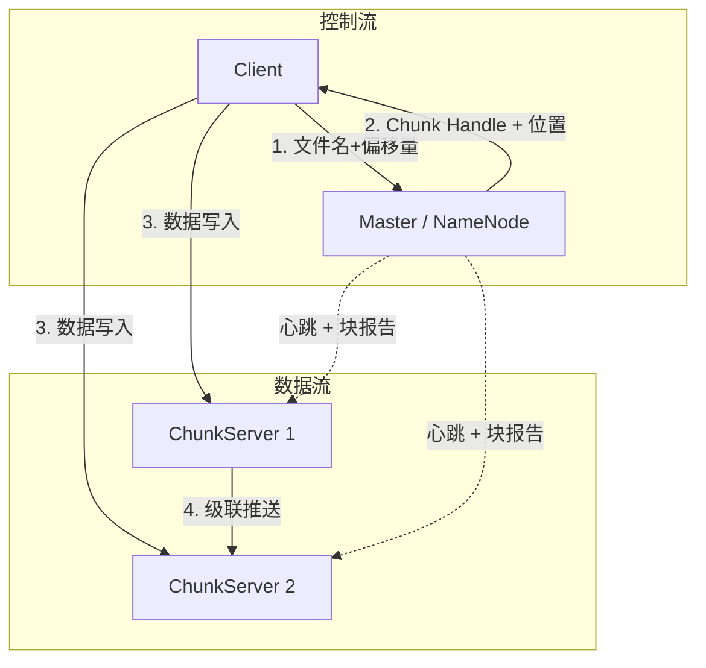
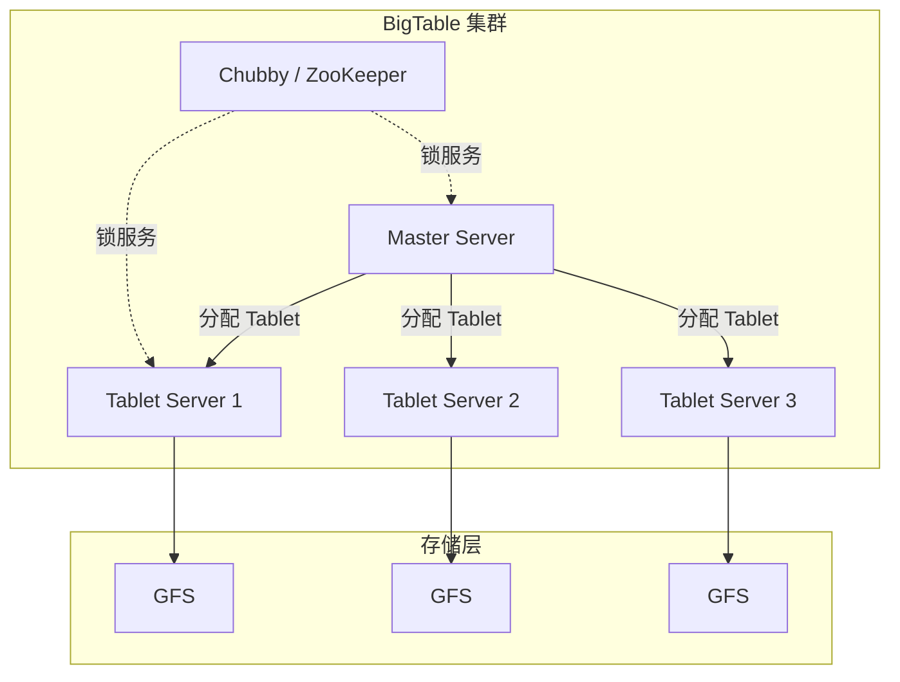
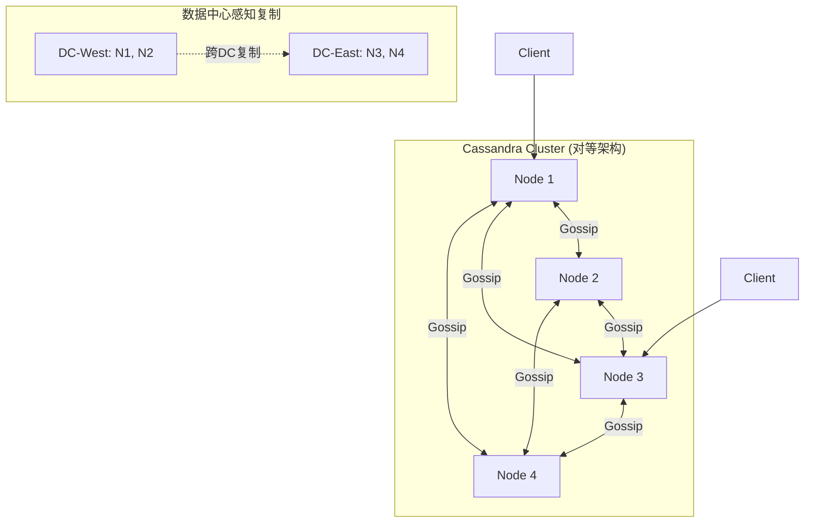
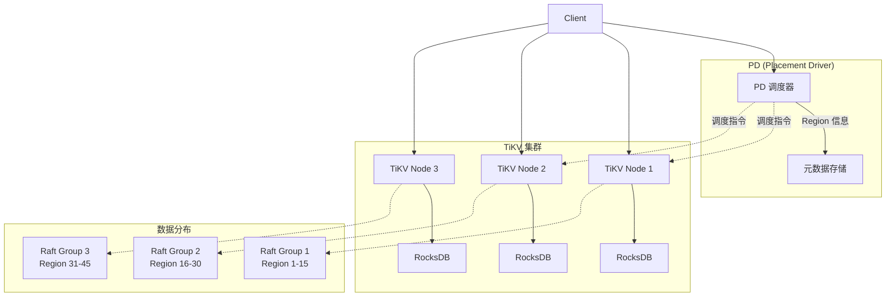

## 6. 经典系统架构

分布式存储领域诞生了众多里程碑式的系统，每个系统都在特定场景下解决了核心难题。理解这些经典架构不仅是学习分布式存储的必经之路，更是掌握"理论落地为工程"的最佳范本。本节从数据流与控制流的视角，剖析六类最具影响力的分布式存储系统，揭示其设计哲学与工程权衡。

---

### 6.1 GFS/HDFS：中心化元数据架构的典范

#### 架构全景

GFS（Google File System）与 HDFS（Hadoop Distributed File System）采用经典的 Master-Worker 架构，是大规模顺序读写场景的事实标准。



#### 核心设计决策

| 设计点 | GFS (2003) | HDFS (2006) | 设计理由 |
|--------|-----------|-------------|---------|
| 块大小 | 64 MB | 128 MB | 减少元数据量，适配顺序大文件 |
| Master 数量 | 1 | 1 (HA: 2) | 简化一致性管理，避免分布式元数据复杂度 |
| 数据一致性 | 弱一致（追加写入保证） | 弱一致（同 GFS） | 放松一致性换取吞吐量 |
| 写入模型 | Record Append（至少一次语义） | 无 Append，仅支持 write | HDFS 简化了并发追加语义 |
| 元数据持久化 | 本地日志 + Checkpoint | EditLog + FsImage | NameNode 需要定期合并日志避免启动时间过长 |

#### 数据流与控制流分离

这是 GFS/HDFS 最精妙的设计之一。控制流经过 Master（获取文件布局），但数据流直接在 Client 与 ChunkServer 之间传输，Master 不成为数据传输的瓶颈。

**写入流程详解（Pipeline 模式）：**

1. Client 向 Master 请求 chunk 位置
2. Master 返回 primary 和 secondary 副本的位置
3. Client 将数据推送到第一个副本（如 CS1）
4. CS1 转发到 CS2，CS2 转发到 CS3（链式推送）
5. 所有副本写入完成后，Client 向 primary 发送写入请求
6. Primary 为操作分配序号，转发给 secondary
7. Secondary 按序号执行后回复 primary
8. Primary 回复 Client 成功

这种 Pipeline 设计充分利用了网络带宽——数据在物理链路上并行传输，而非串行复制。

#### 单 Master 的瓶颈与演进

单 Master 架构的最大挑战是元数据可扩展性：

- **NameNode 内存瓶颈**：每个文件约 150 字节元数据，1 亿文件 ≈ 15 GB 内存
- **启动恢复时间**：合并 EditLog 和 FsImage 可能耗时数十分钟
- **单点故障**：NameNode 宕机导致整个集群不可用

**HDFS HA 演进路径：**

HDFS 1.x: 单 NameNode（无 HA）
    ↓
HDFS 2.x: NameNode + Standby NameNode + JournalNode（QJM）
    ↓
HDFS Federation: 多个 NameNode 管理不同命名空间

**QJM（Quorum Journal Manager）机制**：使用 JournalNode 集群（通常 3 或 5 个节点）存储 EditLog，采用多数派写入保证。Standby NameNode 通过 JournalNode 同步 EditLog，实现秒级切换。

---

### 6.2 GFS 论文的后续影响

GFS 论文（2003）奠定了分布式文件系统的范式，其设计思想直接影响了：

- **HDFS**：几乎是 GFS 的开源实现
- **CephFS**：采用 CRUSH 算法取代中心化元数据，解决扩展性问题
- **GlusterFS**：完全去中心化的 POSIX 文件系统
- **MinIO**：面向云原生的对象存储，兼容 S3 协议

---

### 6.3 BigTable：宽列存储的奠基者

BigTable 是 Google 的分布式结构化数据存储系统，建立在 GFS 之上，支撑了 Google 的搜索索引、地图、邮件等核心业务。

#### 数据模型

BigTable 的数据模型是理解 Cassandra、HBase 等后续系统的基础：

(row_key, column_family:column_qualifier, timestamp) → value

实际示例：存储网页数据
"com.cnn.www" : {
    "contents": {
        t6: "<html><body>最新新闻...</body></html>",
        t5: "<html><body>昨日报道...</body></html>",
        t3: "<html><body>旧版页面...</body></html>",
    },
    "anchor:nytimes.com": {
        t9: "New York Times",
    },
    "anchor:cnn.com": {
        t9: "CNN",
        t8: "CNN - Breaking News",
    }
}

**三个关键维度：**

| 维度 | 说明 | 设计意图 |
|------|------|---------|
| row_key | 任意字符串，按字典序排列 | 相邻 row 通常会被连续读取，利于局部性 |
| column_family | 逻辑分组，需预定义，数量有限 | 控制 Schema 演进粒度 |
| timestamp | 64 位整数，支持多版本 | 保留历史数据，支持时间旅行查询 |

#### 索引结构

BigTable 使用 **SSTable + MemTable** 的混合结构（详见第5节 LSM-Tree）：

写入流程:
Client → Commit Log（持久化） → MemTable（内存，可写）
                                    ↓ (满时 flush)
                                  SSTable（磁盘，不可变）

读取流程:
Client → MemTable 查找 → Bloom Filter → SSTable 查找（新→旧）

#### 架构组件



- **Master Server**：管理 Tablet 分配、负载均衡、Schema 变更
- **Tablet Server**：管理一组 Tablet（连续 row range），处理读写请求
- **Chubby**：分布式锁服务（类似 ZooKeeper），确保只有一个 Master，管理 Tablet Server 存活

#### BigTable → HBase 的映射

| BigTable 概念 | HBase 对应 | 说明 |
|---------------|-----------|------|
| Tablet | Region | 连续的 row_key 范围 |
| Tablet Server | RegionServer | 管理 Region 的服务节点 |
| Chubby | ZooKeeper | 分布式协调服务 |
| GFS | HDFS | 底层分布式文件系统 |
| SSTable | HFile | 不可变的排序键值文件 |

---

### 6.4 Cassandra：去中心化宽列存储

Cassandra 由 Facebook 于 2008 年开发（基于 Amazon Dynamo + BigTable 模型），后成为 Apache 顶级项目，以线性可扩展性和高可用著称。

#### 架构设计



**无 Master 设计**：所有节点地位相同，通过 Gossip 协议发现彼此状态。没有单点故障，任意节点宕机不影响集群运行。

#### 数据分区：一致性哈希 + 虚拟节点

Token Ring（令牌环）
┌─────────────────────────────────┐
│         Token: 0                │
│        /         \              │
│   N1(vnode1)    N2(vnode2)      │
│   N1(vnode4)    N2(vnode3)      │
│       \          /              │
│        \   N3(vnode1)           │
│         \  N3(vnode2)           │
│          Token: MAX              │
└─────────────────────────────────┘

每条数据通过 partitioner 计算 hash → 定位到 Token Ring 上的位置
→ 归属于最近的 vnode → vnode 映射到物理节点

Cassandra 3.0+ 默认使用 **Murmur3Partitioner**，并在 2.1+ 引入虚拟节点（vnodes），每个物理节点拥有多个 token 位置，提升数据均匀性。

#### 一致性级别

Cassandra 允许在每次操作中独立指定一致性级别，这是其最重要的灵活性特性：

| 一致性级别 | 含义 | 适用场景 | 耐久性 |
|-----------|------|---------|--------|
| ONE | 任一副本成功即可返回 | 高吞吐、容忍短暂不一致 | 低 |
| TWO | 两个副本成功 | 平衡选择 | 中 |
| QUORUM | 多数派副本成功（N/2+1） | 强一致性需求 | 高 |
| ALL | 所有副本成功 | 最强一致性 | 最高 |
| LOCAL_QUORUM | 本地数据中心多数派 | 跨DC场景，降低延迟 | 中高 |
| EACH_QUORUM | 每个DC的多数派 | 跨DC强一致性 | 高 |

**CL 与 RF 的关系**：读写一致性级别之和 ≥ RF 时，可保证强一致性（Read-After-Write 一致性）。

示例：RF=3, W=QUORUM(2), R=QUORUM(2)
W + R = 4 > 3 = RF → 强一致性保证

示例：RF=3, W=ONE(1), R=ONE(1)
W + R = 2 < 3 = RF → 弱一致性（可能读到旧数据）

#### 二级索引与物化视图

Cassandra 不支持 JOIN，因此通过二级索引（Secondary Index）和物化视图（Materialized View）实现多维查询：

- **二级索引**：为非分区键列创建本地索引，但高基数列上性能差
- **物化视图**：预计算的查询视图，写入时自动维护，读取效率高但写放大

**实际生产建议**：优先通过合理的数据模型设计（反规范化）避免二级索引，而非依赖它。

---

### 6.5 TiKV：新一代分布式事务 KV 存储

TiKV 是 TiDB 的存储层，由 PingCAP 开发，采用分层架构，融合了 Raft 一致性、RocksDB 高效存储和分布式事务。

#### 架构全景



#### 核心组件

| 组件 | 职责 | 类比 |
|------|------|------|
| PD (Placement Driver) | 集群元数据管理、调度、TSO 时间戳分配 | GFS 的 Master + 分布式事务协调器 |
| TiKV Node | 存储数据，执行 Raft 共识 | GFS 的 ChunkServer |
| Region | 数据分片单位（默认 96MB-144MB） | HDFS 的 Block / HBase 的 Region |
| RocksDB | 本地 KV 存储引擎 | 单机存储层 |

#### Region 与 Raft Group

TiKV 将整个 key space 切分为连续的 Region，每个 Region 由一个 Raft Group 管理（默认 3 副本）：

Key Space 分布示例：
┌──────────┬──────────┬──────────┬──────────┐
│ Region 1 │ Region 2 │ Region 3 │ Region 4 │
│ [a, f)   │ [f, m)   │ [m, s)   │ [s, z)   │
│ Leader@N1│ Leader@N2│ Leader@N1│ Leader@N3│
│ Follower │ Follower │ Follower │ Follower │
│ @N2, N3  │ @N1, N3  │ @N2, N3  │ @N1, N2  │
└──────────┴──────────┴──────────┴──────────┘

当 Region 大小超过阈值 → Split 为两个 Region
当 Region 过小或负载不均 → PD 触发 Merge / Transfer Leader

#### 分布式事务模型（Percolator）

TiKV 使用 Google Percolator 事务模型，基于 TSO（Timestamp Oracle）提供外部一致性：

两阶段提交 (2PC) in Percolator:

Prewrite 阶段:
  1. 从 PD 获取 start_ts
  2. 对每个 key 的 primary lock:
     - 检查是否有冲突（其他事务的 commit_ts > start_ts）
     - 写入 lock + data（如果无冲突）
  3. 从 PD 获取 commit_ts
  4. 对 secondary lock: 写入 lock + data

Commit 阶段:
  1. 删除 primary lock，写入 commit record
  2. 异步清理 secondary lock

**Percolator 的精妙之处**：只需 primary key 的状态即可决定整个事务的提交或回滚，简化了分布式事务的原子性保证。

#### RocksDB 存储引擎

每个 TiKV 节点内部使用 RocksDB 作为本地存储引擎，采用 LSM-Tree 结构：

RocksDB 写入路径:
WriteBatch → WAL(Write-Ahead Log)
           → MemTable (跳表, 内存)
                ↓ flush
           → Level 0 SSTable (可能重叠)
                ↓ compaction
           → Level 1 SSTable (非重叠, 每层放大10倍)
                ↓ compaction
           → Level N SSTable

TiKV 有两个 RocksDB 实例：
- **raft**：存储 Raft 日志（写多读少，优化写吞吐）
- **kv**：存储实际数据（读写混合，优化读性能）

---

### 6.6 五大系统横向对比

| 维度 | GFS/HDFS | BigTable | Cassandra | TiKV |
|------|----------|----------|-----------|------|
| **数据模型** | 文件 | 宽列 (稀疏表) | 宽列 (稀疏表) | KV |
| **一致性** | 弱一致 | 弱一致 | 可调 (ONE → ALL) | 强一致 (Percolator) |
| **事务** | 无 | 单行事务 | LightWeight Transaction | 分布式事务 (2PC) |
| **元数据管理** | 中心化 Master | 中心化 Master | 去中心化 (Gossip) | 中心化 PD |
| **数据分片** | 固定大小 Block | 按 Row Range | 一致性哈希 | 按 Row Range (Region) |
| **复制协议** | 简单复制 | 依赖 GFS | 可调副本数 + CL | Raft |
| **存储引擎** | 自研 | SSTable + GFS | 自研 (LSM-Tree) | RocksDB (LSM-Tree) |
| **典型场景** | 大数据分析 | 结构化数据 | 高可用在线服务 | 分布式数据库 |

---

### 6.7 架构演进的三条路径

从上述经典系统的演进中，可以总结出分布式存储架构的三条主要演进路径：

```mermaid
graph LR
    subgraph "路径1: 中心化元数据的优化"
        GFS[HDFS/GFS] --> HA[HDFS HA + Federation]
        HA --> Alluxio[Alluxio<br/>内存级元数据缓存]
    end
    subgraph "路径2: 去中心化扩展"
        Dynamo[Dynamo] --> CASS[Cassandra]
        CASS --> SCYLLA[ScyllaDB<br/>C++ 重写, 10x 性能]
    end
    subgraph "路径3: 事务 + 存储融合"
        BIGT[BigTable] --> HBASE[HBase]
        DYNAMO + BIGT --> CASS
        GOOGLE[Spanner/Percolator] --> TIKV[TiKV]
        TIKV --> TIDB[TiDB<br/>完整分布式数据库]
    end
```

**路径 1：中心化元数据的持续优化**

从 GFS 单 Master → HDFS HA → HDFS Federation → 外部缓存（Alluxio），本质是保持架构简洁的同时解决单点瓶颈。

**路径 2：去中心化架构的性能竞赛**

从 Dynamo → Cassandra → ScyllaDB，通过 C++ 重写和零拷贝技术，将吞吐量提升一个数量级，同时保持线性扩展能力。

**路径 3：从存储到数据库的融合**

从 BigTable（结构化存储）→ TiKV（带事务的存储）→ TiDB（完整 SQL 数据库），存储层逐渐承载更多计算和事务语义。

---

### 6.8 如何选择经典架构

**选型决策树：**

需要文件存储？
├── 是 → 数据规模？
│   ├── TB 级以下 → 分布式文件系统（MinIO / CephFS）
│   └── PB 级 → HDFS（大数据生态）或 Alluxio（加速层）
└── 否 → 需要事务？
    ├── 是 → 需要 SQL？
    │   ├── 是 → TiDB / CockroachDB
    │   └── 否 → TiKV / FoundationDB
    └── 否 → 需要高可用？
        ├── 是 + 低延迟 → Cassandra / ScyllaDB
        ├── 是 + 强一致 → TiKV / YugabyteDB
        └── 否 → HBase（已有 Hadoop 生态）

**核心选型原则：**

1. **没有银弹**：每个系统都是特定场景的最优解，没有万能方案
2. **CAP 权衡**：网络分区时选择 AP（Cassandra）还是 CP（TiKV），决定了系统的基本特性
3. **一致性需求决定一切**：一旦确定一致性级别（弱一致/线性一致/外部一致），可选系统范围大幅缩小
4. **生态绑定成本**：选择 HDFS 意味着绑定 Hadoop 生态，选择 TiKV 意味着绑定 TiDB 生态

---

### 6.9 常见误区与纠正

| 误区 | 事实 | 纠正方法 |
|------|------|---------|
| "GFS/HDFS 的 64MB 块太大" | 大块设计是正确的权衡：减少元数据、提升顺序读写性能 | 仅在小文件场景下才需要优化（如 HAR/HDFS Federation） |
| "Cassandra 不支持强一致性" | Cassandra 通过 QUORUM/ALL 级别可实现强一致性 | 理解 CL + RF 的数学关系，在一致性和性能间选择 |
| "BigTable 已经过时" | BigTable 的设计理念（LSM-Tree + 宽列模型）被 HBase、Cassandra、TiKV 继承 | 学习 BigTable 论文是理解后续系统的基础 |
| "TiKV 只是另一个 KV 存储" | TiKV 融合了 Raft、Percolator、RocksDB，是完整的分布式事务存储 | TiKV 是 TiDB 的存储引擎，理解 TiKV 是理解 TiDB 的关键 |
| "Master 架构不好" | Master 简化了一致性管理，适合中等规模集群 | 根据集群规模选择：中等规模用 Master，超大规模考虑去中心化 |
| "Cassandra 的 Gossip 协议开销大" | Gossip 是协议级的心跳交换，开销极小，适合大规模集群 | 实际开销远低于 ZooKeeper 的 Leader 选举开销 |

---

### 6.10 进阶：系统设计的深层思考

#### 为什么控制流与数据流分离如此重要？

GFS 的控制流/数据流分离是一个被广泛借鉴的设计模式：

- **控制流**：小数据量，低频，需要强一致 → 交给中心节点
- **大数据流**：大数据量，高频，可容忍弱一致 → 点对点直接传输

这种分离在很多系统中反复出现：Kafka 的 Broker 不代理数据、Redis Cluster 的 MOVED 重定向、Ceph 的 CRUSH 直接计算位置。

#### 为什么 LSM-Tree 成为主流？

本章涉及的五个系统中，BigTable、Cassandra、TiKV 都采用了 LSM-Tree 存储引擎（或其变体），原因是：

1. **写入性能**：顺序写远快于随机写，写入吞吐量高 10-100 倍
2. **空间效率**：支持压缩和合并，实际存储可压缩 3-5 倍
3. **与复制协议契合**：WAL + MemTable 天然适合需要持久化的分布式系统
4. **读性能可通过 Bloom Filter 优化**：点查场景下避免无效磁盘读取

但 LSM-Tree 也有代价：读放大（可能查多个 SSTable）、写放大（Compaction 过程）、空间放大（临时数据未清理）。这三个维度的权衡（RUM Conjecture）是存储引擎设计的核心。

#### 从单机存储到分布式存储的关键跳跃

| 单机存储 | 分布式存储 | 新增挑战 |
|---------|-----------|---------|
| ACID 事务 | 分布式事务 (2PC/Percolator) | 网络延迟、部分失败 |
| 单机复制 | 跨节点复制 | 数据一致性、脑裂 |
| 文件系统 | 分布式文件系统 | 元数据管理、数据分片 |
| 本地日志 | 分布式日志 (Raft/Paxos) | 共识算法的性能开销 |
| 固定存储容量 | 线性可扩展 | 数据迁移、负载均衡 |

---

### 6.11 实践建议

1. **阅读原始论文**：GFS（2003）、BigTable（2006）、Dynamo（2007）是分布式存储领域的基石论文，值得反复研读
2. **动手实验**：用 Docker 部署 HDFS 单节点集群、Cassandra 单节点、TiKV 集群，亲手体验数据写入和读取流程
3. **理解权衡而非记忆特性**：每个设计决策都是权衡的结果，理解"为什么这样设计"比"它支持什么"更重要
4. **关注演进方向**：当前趋势是存储层与计算层融合（TiDB）、存算分离（Snowflake）、Serverless 化（Aurora Serverless）

---

**总结**：经典系统架构是分布式存储理论的工程落地。GFS/HDFS 展示了中心化元数据的简洁之美，BigTable 奠定了宽列存储的范式，Cassandra 证明了去中心化架构的可扩展性，TiKV 则代表了新一代分布式事务存储的方向。理解这些系统的设计哲学和工程权衡，是掌握分布式存储技术的核心。
