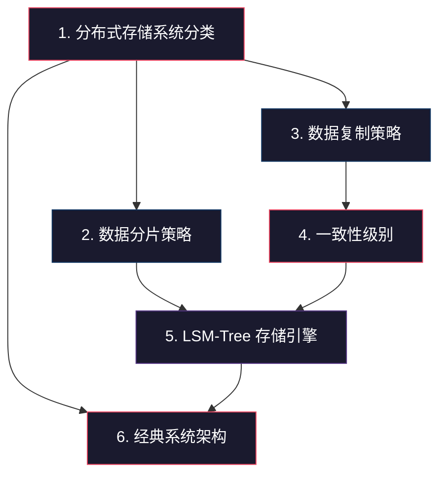

# 23.1 理论基础

分布式存储的理论基础是整个分布式存储知识体系的根基。本节从**系统分类、数据分片、数据复制、一致性级别、存储引擎、经典架构**六个维度，构建从原理到设计决策的完整知识链条。

理解这些理论不是为了"知道"，而是为了在实际工程中做出正确的**架构选型**和**性能权衡**。当你面对一个具体业务——比如设计一个支撑亿级用户的 Feed 流存储，或者为 IoT 平台选择时序数据方案——你必须清楚每种策略的代价边界在哪里，才能找到最优解。

## 为什么理论基础至关重要

在分布式存储领域，每一个工程决策都是权衡（trade-off）。没有"最好"的方案，只有"最适合当前场景"的方案。而做出正确判断的前提，是深刻理解以下核心问题：

| 核心理论 | 回答的关键问题 | 工程影响 |
|---------|--------------|---------|
| 系统分类 | 业务需要块/文件/对象/列式中的哪种数据模型？ | 决定了存储系统的编程接口和内部组织方式 |
| 数据分片 | 数据如何在节点间分布，如何处理扩容和热点？ | 直接影响负载均衡、查询效率和扩展能力 |
| 数据复制 | 数据复制多少份，用什么策略保持一致？ | 决定了系统在故障时的可用性和数据安全性 |
| 一致性级别 | 在一致性、可用性和延迟之间如何取舍？ | CAP 定理在工程中的具体体现 |
| 存储引擎 | 底层如何组织数据，读写路径有何区别？ | 决定了读写性能的天花板和调优方向 |
| 经典架构 | 前人是如何设计成功的分布式存储系统的？ | 为新系统设计提供经过验证的参考方案 |

## 知识依赖关系

六个子主题之间存在明确的依赖关系，建议按顺序学习：

**依赖链路解读：**

- **系统分类**是起点——只有理解了块/文件/对象/列式四种数据模型，才能理解后续的分片和复制策略在不同模型中的具体应用
- **分片和复制**是并行的两个核心维度——分片决定数据"放哪里"，复制决定数据"放几份"，二者共同决定了系统的数据分布拓扑
- **一致性级别**建立在复制策略之上——没有复制就没有一致性问题，不同的复制策略直接约束了一致性模型的选择范围
- **LSM-Tree 存储引擎**是分片和一致性的"落地实现"——每个分片内部的存储引擎设计决定了读写性能的天花板
- **经典系统架构**是所有理论的综合——GFS、BigTable、Dynamo、TiKV 每一个都是在上述维度上做出特定权衡的结果

## 六大主题概览

### 主题一：分布式存储系统分类

> 按数据模型，分布式存储分为四大范式：**块存储**、**文件存储**、**对象存储**、**列式存储**。每种范式有不同的数据模型、访问模式和适用场景。

**核心要点：**

- **块存储**（如 Ceph RBD、EBS）：将数据拆分为固定大小的块（4KB-1MB），通过 SCSI/NVMe-oF 协议暴露为裸磁盘，延迟最低（亚毫秒级），适合数据库和虚拟机磁盘。但不提供文件语义，上层需自行管理文件系统
- **文件存储**（如 HDFS、GlusterFS、CephFS）：以目录树结构组织数据，支持 POSIX/NFS/SMB 协议，天然支持共享访问和文件锁。核心瓶颈在元数据管理——HDFS 的 NameNode 单点问题催生了 HDFS Federation 和 Observer NameNode
- **对象存储**（如 S3、MinIO）：将数据封装为不可变对象（Key + Data + Metadata），通过 REST API 操作。扁平命名空间、极强扩展性，但不支持部分更新。S3 已成为事实标准，提供 11 个 9 的持久性
- **列式存储**（如 BigTable、Cassandra、ScyllaDB）：按列族组织数据，`(row_key, cf:qualifier, ts) → value` 模型天然适合 OLAP 和宽表查询。底层使用 LSM-Tree 存储引擎

**选型速查：**

| 场景 | 推荐类型 | 理由 |
|------|---------|------|
| 数据库/虚拟机磁盘 | 块存储 | 低延迟、随机读写高效 |
| HPC/共享文件协作 | 文件存储 | POSIX 语义、目录层次结构 |
| 图片/视频/备份/数据湖 | 对象存储 | 扁平命名空间、极强扩展性 |
| 时序数据/用户画像/宽表 | 列式存储 | 按列组织、多版本、范围扫描高效 |

### 主题二：数据分片策略

> 分片（Sharding）解决的是"数据太多，单机放不下"的问题。核心策略有三种：**Hash 分片**、**Range 分片**、**一致性哈希**，每种策略在查询能力和负载均衡之间做不同权衡。

**核心要点：**

- **Hash 分片**：`partition_id = hash(key) % N`，数据分布均匀，但不支持范围查询，扩容时需全量数据迁移。虚拟分片（如 4096 个虚拟分区映射到物理节点）可缓解迁移问题
- **Range 分片**：按 key 的有序范围切分，支持高效范围扫描，但容易产生热点（如时间序列写入集中在最后一个 Range）。TiKV 的 Region Split 和自动迁移可缓解热点
- **一致性哈希**：将节点和数据映射到同一哈希环，节点增减时只迁移约 `1/(N+1)` 的数据。虚拟节点（通常 100-200 个/物理节点）解决分布不均问题。Dynamo 将数据复制到环上连续 T 个节点

**关键权衡矩阵：**

| 策略 | 范围查询 | 负载均衡 | 扩容迁移量 | 实现复杂度 |
|------|---------|---------|-----------|-----------|
| 简单 Hash | ❌ 不支持 | ✅ 好 | ❌ 全量迁移 | 低 |
| 虚拟分片 Hash | ❌ 不支持 | ✅ 好 | ⚠️ 部分迁移 | 中 |
| Range 分片 | ✅ 支持 | ⚠️ 可能热点 | ✅ 按需分裂 | 中 |
| 一致性哈希 | ❌ 不支持 | ✅ 好 | ✅ 最小迁移 | 中-高 |

> **实际系统的混合策略**：TiKV 先用一致性哈希确定 Region，再在 Region 内部用 Range 组织数据；Cassandra 用 Murmur3 哈希映射到 Token 环，同时用虚拟节点改善均匀性。没有系统只用单一策略。

### 主题三：数据复制策略

> 复制解决的是"节点故障时数据不丢"的问题。三种范式：**主从复制**、**多主复制**、**无主复制**，核心差异在于写入路径和故障时的行为。

**核心要点：**

- **主从复制**：所有写入通过 Leader，Follower 同步或异步复制。半同步（等待多数 Follower 确认）是生产环境的主流选择。Leader 故障时需要重新选举，存在短暂不可写窗口
- **多主复制**：多个数据中心各自维护 Leader，允许本地写入以降低延迟。核心挑战是**写入冲突处理**——LWW（Last-Writer-Wins）简单但丢数据，向量时钟可检测冲突但不自动解决，CRDT（Conflict-free Replicated Data Types）可实现无冲突合并
- **无主复制**：没有固定 Leader，任何节点都可读写。Dynamo 论文开创了这一范式，核心是 **Quorum 机制**：`W + R > N` 保证读写集合必然有交集，从而确保一致性。读修复（Read Repair）和反熵（Anti-Entropy，基于 Merkle 树）用于修复过期副本

**Quorum 机制的数学原理：**

N = 总副本数（如 3）
W = 写入需要的确认数
R = 读取需要的响应数

当 W + R > N 时，写集合和读集合至少有一个节点重叠，
因此读操作一定能读到最新写入的值。

常见配置：
  N=3, W=2, R=2  → 强一致性（2+2 > 3）
  N=3, W=1, R=1  → 最终一致性（1+1 < 3，可能读到旧值）
  N=3, W=3, R=1  → 最强一致性但写可用性最低

### 主题四：一致性级别

> 一致性是一个**连续光谱**，从最强的线性一致性到最弱的最终一致性，每一级都有明确的语义保证和性能代价。

**一致性光谱：**

强一致性 ◄────────────────────────────────────► 最终一致性
(Linearizability)    因果一致性    读己之写    (Eventual)
    │                   │            │           │
  延迟最高            延迟中等     延迟中等    延迟最低
  可用性最低          可用性中等   可用性中等  可用性最高
  金融交易            协作编辑     用户配置    社交动态

**核心要点：**

- **线性一致性（Linearizability）**：写完成后，所有后续读都能看到该写入。等效于单机串行执行。实现需要 Raft/Paxos 等共识协议，写延迟 = 本地写入 + 网络往返 × 同步副本数
- **因果一致性**：保证有因果关系的操作顺序一致，无因果关系的可乱序。用向量时钟或混合逻辑时钟（HLC）追踪因果依赖。是强一致性和最终一致性之间的"甜点"
- **读己之写（Read-Your-Writes）**：保证用户总能读到自己最新写入的值，但可能看不到其他用户的最新写入。适合用户个人视图场景
- **最终一致性**：最宽松的模型，只保证最终收敛。实际系统通常在毫秒到秒级收敛。Cassandra、DynamoDB 默认提供

**选型决策框架：**

| 场景特征 | 推荐一致性级别 | 典型系统 |
|---------|--------------|---------|
| 金融交易、库存扣减 | 线性一致性 | TiKV、CockroachDB、etcd |
| 协作文档、分布式锁 | 因果一致性 | MongoDB 4.0+、CockroachDB |
| 用户个人设置 | 读己之写 | Redis Cluster、Cassandra |
| 社交 Feed、日志、缓存 | 最终一致性 | Cassandra、DynamoDB、S3 |

### 主题五：LSM-Tree 存储引擎

> LSM-Tree（Log-Structured Merge-Tree）是分布式存储中最核心的存储引擎设计，几乎所有 NoSQL 系统（Cassandra、RocksDB、LevelDB、TiKV）都基于它。理解其读写路径和 Compaction 策略，是性能调优的基础。

**读写路径对比：**

写入路径（写密集优化）：
Client → WAL（预写日志，持久化保证）
       → MemTable（内存，跳表/红黑树，有序结构）
       → 当 MemTable 满时 → Flush 为 SSTable（磁盘，有序字符串表）
       → 后台 Compaction 合并 SSTable

读取路径（可能需要查多层）：
Client → MemTable（内存查找，最快）
       → Bloom Filter（快速跳过不包含 key 的 SSTable）
       → SSTable（磁盘查找，二分搜索，最慢）

**两种核心 Compaction 策略：**

| 策略 | 原理 | 写放大 | 读放大 | 空间放大 | 适用场景 |
|-----|------|-------|-------|---------|---------|
| Size-Tiered | 大小相近的 SSTable 合并 | 低（~4x） | 高（需查多层） | 高（临时空间大） | 写密集场景 |
| Leveled | 每层大小固定，L0→L1→L2 逐层合并 | 高（~10-30x） | 低（每层最多1个 SSTable） | 低（~1.1x） | 读密集场景 |

**核心权衡——三种放大效应：**

- **写放大（Write Amplification）**：实际写入磁盘的数据量远大于应用写入的数据量。Leveled Compaction 的写放大可达 30 倍
- **读放大（Read Amplification）**：一次读操作需要查找的磁盘块数量。Size-Tiered 可能需要查 5-10 层
- **空间放大（Space Amplification）**：存储系统占用的磁盘空间远大于实际数据量。Size-Tiered 在 Compaction 期间需要额外空间

**RocksDB 关键调优参数：**

| 参数 | 作用 | 典型值 |
|------|------|--------|
| `write_buffer_size` | MemTable 大小 | 64MB-256MB |
| `level0_file_num_compaction_trigger` | L0 文件数触发 Compaction | 4 |
| `max_bytes_for_level_base` | L1 层大小上限 | 256MB-1GB |
| `max_bytes_for_level_multiplier` | 每层大小倍数 | 10 |
| `bloom_bits_per_key` | Bloom Filter 位数 | 10-15 |

### 主题六：经典系统架构

> 理解经典系统的设计决策，是学习分布式存储的最佳途径。四个标志性系统分别代表了不同的设计哲学和权衡方向。

**四大经典系统对比：**

| 系统 | 设计哲学 | 分片策略 | 复制策略 | 一致性模型 | 核心创新 |
|------|---------|---------|---------|-----------|---------|
| GFS/HDFS | 单 Master 简化设计，针对追加操作优化 | 大块（64MB/128MB） | 主从复制（3副本） | 异步复制（最终一致） | 大块减少元数据量，追加优化降低随机写开销 |
| BigTable/Cassandra | 列族模型 + LSM-Tree，灵活 schema | Range / 一致性哈希 | 主从 / 无主 | 可调一致性 | 列族分组存储、多版本、Cassandra 去中心化 |
| Dynamo/Riak | Always Writable，可用性优先 | 一致性哈希 | 无主复制 | 最终一致性 | 向量时钟、gossip 协议、读修复 |
| TiKV | 线性一致性 + 分布式事务 | 一致性哈希 + Range | Raft 共识 | 线性一致性 | 分布式事务、MVCC、Raft Group per Region |

**关键设计决策解读：**

- **GFS 为什么选 64MB 大块？** 传统文件系统用 4KB 块，GFS 的大块设计将 Master 需要管理的元数据量减少了 16000 倍，客户端与 Master 的交互频率大幅降低。代价是小文件的内部碎片严重，但 GFS 的目标工作负载是大文件的顺序追加（MapReduce 输入数据），小文件不是优化重点
- **Dynamo 为什么选择 Always Writable？** Amazon 的购物车场景要求"任何时刻都不能拒绝用户写入"——即使在网络分区时，用户也应该能添加商品到购物车。这一设计哲学直接决定了 Dynamo 选择无主复制 + 最终一致性
- **TiKV 如何在 Raft 之上实现分布式事务？** TiKV 使用 Percolator 模型（基于 Google Percolator 论文），通过两阶段提交（2PC）在多个 Region 之间实现原子写入。Commit 阶段利用 Raft 保证日志一致，同时通过 MVCC 提供快照隔离

**架构模式总结：**

中心化架构         去中心化架构         分层架构
   ┌───┐            ┌───┐              ┌──────┐
   │ M │            │   │              │API 层│  ← 无状态
   ├───┤            ├───┤              ├──────┤
 │ D │ D │ D │   │   │   │   │   │   │存储层│  ← 有状态
   │   │   │       │   │   │   │       ├──────┤
 HDFS         Cassandra         TiDB: TiDB + TiKV
 优点:简单      优点:无单点故障    优点:独立扩展
 缺点:单点瓶颈  缺点:实现复杂     缺点:架构复杂

## 三大核心权衡

贯穿本节六个主题的，是分布式存储设计中的三大核心权衡。理解这些权衡，比记住任何具体技术细节都更重要。

### 权衡一：一致性 vs 可用性（CAP 定理的工程体现）

CAP 定理指出：在网络分区（P）发生时，系统必须在一致性（C）和可用性（A）之间做出选择。这不是理论抽象——它直接影响你的每一次架构决策：

- 选择 Raft 共识（如 TiKV）→ 牺牲分区时的可用性换取强一致性
- 选择无主复制 + Quorum（如 Cassandra）→ 牺牲强一致性换取"always writable"

### 权衡二：写放大 vs 读放大（存储引擎的核心矛盾）

LSM-Tree 的 Compaction 策略本质上是在写放大和读放大之间找平衡：

- Leveled Compaction 读性能好（每层最多1个 SSTable），但写放大高达 30x
- Size-Tiered Compaction 写入效率高（写放大约 4x），但读性能差（需查多层）

**没有"更好"的策略，只有"更适合你的工作负载"的策略。** 写密集用 Size-Tiered，读密集用 Leveled，混合负载需要仔细调参。

### 权衡三：存储效率 vs 冗余安全（副本 vs 纠删码）

- **3 副本**：存储开销 300%，容忍 1 个节点故障，读性能好（可就近读取）
- **纠删码 RS(4+2)**：存储开销 150%，容忍 2 个节点故障，但写入需要额外编码计算

对于热数据，3 副本的读性能优势值得 300% 的存储开销；对于冷数据（如归档日志），纠删码的 150% 开销更经济。

## 常见误区与纠正

在学习理论基础时，以下几个认知误区需要特别警惕：

**误区一：认为"最终一致性就是不可靠"**
> 纠正：最终一致性是一种**有意为之的设计选择**，而非技术缺陷。Dynamo 的"always writable"策略在购物车、社交 Feed 等场景中，比强一致性更合适。关键是理解业务能容忍多长的不一致窗口。

**误区二：认为"一致性哈希能解决所有负载均衡问题"**
> 纠正：一致性哈希解决了节点增减时的最小迁移问题，但虚拟节点数量选择不当仍会导致负载倾斜。Cassandra 默认 256 个虚拟节点/物理节点，生产环境通常需要根据节点数和数据分布进行调优。

**误区三：认为"LSM-Tree 总是比 B-Tree 好"**
> 纠正：LSM-Tree 适合写密集场景，但读性能（尤其点查）通常不如 B-Tree。PostgreSQL 和 MySQL InnoDB 使用 B-Tree，是因为它们的场景以读为主。选择存储引擎需要结合具体工作负载分析，而非一刀切。

**误区四：认为"GFS/HDFS 的大块设计可以直接套用"**
> 纠正：64MB/128MB 大块适合大文件的顺序读写（MapReduce 地景），但对小文件（<64MB）会造成严重的内部碎片和元数据浪费。HDFS 2.x 引入的 HDFS Federation 和异构存储（不同副本策略适应不同文件大小）正是对这一问题的改进。

## 与后续内容的衔接

完成理论基础后，后续内容将从理论走向实践：

| 后续模块 | 与理论基础的关系 |
|---------|----------------|
| **23.2 核心技巧** | 将理论应用于工程实践——热点数据处理、跨 DC 复制、引擎调优、容量规划等 |
| **23.3 实战案例** | 用理论指导系统设计——从零设计分布式 KV 存储、对象存储、时序存储 |
| **23.4 常见误区** | 用理论识别工程陷阱——过度追求强一致性、忽视 Compaction 影响、混淆副本与 EC |
| **23.5 练习方法** | 用理论驱动学习路径——论文精读、源码分析、Mini 引擎实现、故障模拟 |

> **学习建议**：理论基础的六个子主题内容量大、概念密集。建议每次学习 1-2 个子主题，学完后回顾核心权衡矩阵，确保理解了"为什么"而非仅仅记住了"是什么"。遇到不清晰的概念，可以先跳到对应的子文件深入阅读，再回来串联整体脉络。
