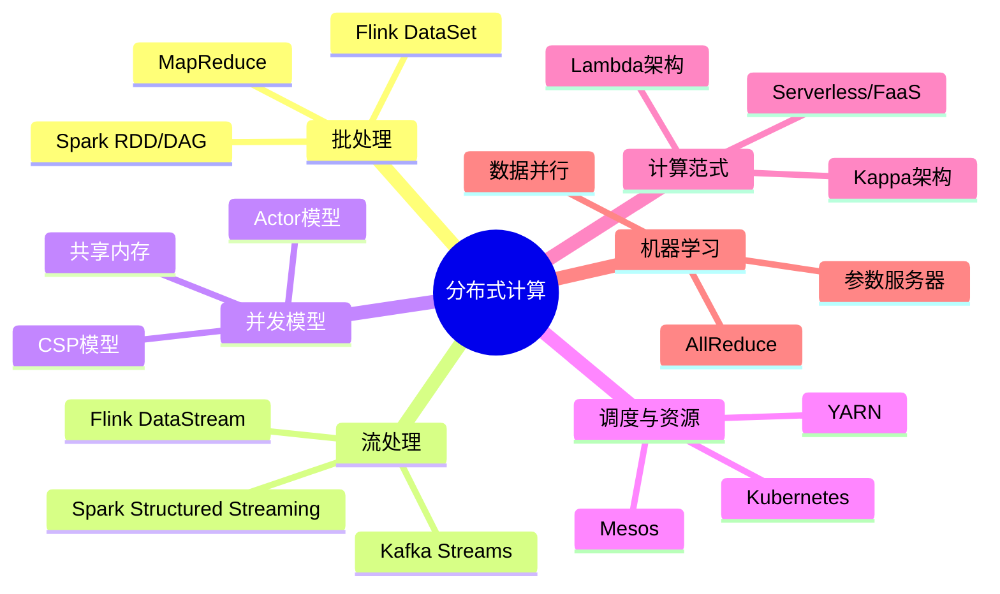

# 第24章 分布式计算 — 章节概览

## 为什么需要分布式计算

当单台机器的计算能力无法满足数据量和计算复杂度的需求时，分布式计算成为必然选择。从Google 2004年发表MapReduce论文开始，分布式计算已经从学术研究走向工业标配，成为大数据处理、机器学习训练、实时流计算等领域的基础设施。

现实中的典型场景：

- **数据规模**：全球每天产生约2.5×10¹⁸字节数据，单机存储和计算远不能承载
- **延迟要求**：高频交易系统要求微秒级响应，需要多机协同降低网络跳数
- **可用性需求**：互联网服务要求99.99%以上可用性，单点故障不可接受
- **成本约束**：扩展10台廉价机器的成本远低于购买一台超级计算机

本章系统介绍分布式计算的核心理论、主流框架、工程技巧与实战经验，帮助读者建立从批处理到流处理、从中心化调度到Serverless的完整知识体系。

## 知识体系全景图

## 章节结构导航

本章共七节，按照"理论→技巧→实战→反思→练习→总结"的闭环结构组织，每节面向不同层次的读者需求。

### 01-理论基础 — 分布式计算的三大支柱

本节是全章的理论根基，深入讲解三大核心范式：

**批处理系统**：MapReduce作为开山鼻祖，定义了"分而治之"的经典模型；Spark通过RDD和DAG引擎解决了MapReduce的磁盘IO瓶颈；Flink以"流批一体"理念提供统一的编程模型。三者的对比与演进是理解分布式计算的关键脉络。

**流处理系统**：从Kafka Streams的轻量级客户端方案，到Flink窗口机制的丰富语义，再到Exactly-Once一致性保证的实现原理（Chandy-Lamport分布式快照算法），覆盖实时计算的核心挑战。

**Actor模型**：Erlang/OTP的"Let it crash"哲学与监督树机制，Akka在JVM上的成熟实现，展示了无共享架构在高并发场景下的独特优势。

此外还覆盖分布式任务调度（YARN/Mesos/Kubernetes）、Serverless计算模型、数据分区与Shuffle优化、容错机制（Checkpoint/Lineage/Speculative Execution）、分布式机器学习（参数服务器/AllReduce/Ring AllReduce）等进阶主题。

### 02-核心技巧 — 工程实践中的关键技巧

理论到工程之间存在鸿沟，本节从实战角度提炼分布式计算的关键技巧：

| 技巧类别 | 核心问题 | 解决思路 |
|----------|----------|----------|
| 数据倾斜处理 | 少数Key承载过多数据导致热点 | Salting、两阶段聚合、自定义Partitioner |
| Shuffle优化 | 网络传输成为性能瓶颈 | 减少Shuffle次数、调整并行度、使用Broadcast Join |
| 内存管理 | GC压力导致长尾延迟 | 堆外内存、对象池、序列化优化 |
| 序列化选择 | 序列化/反序列化开销影响吞吐 | Kryo vs Java序列化、Protobuf、Avro |
| 反压机制 | 上游过快下游处理不过来 | Flink反压、Kafka消费者限速、背压监控 |

### 03-实战案例 — 真实场景中的应用

通过四个完整案例展示分布式计算的工程落地：

- **大规模日志分析**：从ELK到Flink实时日志处理，覆盖日志采集、清洗、聚合、告警的完整链路
- **实时风控系统**：毫秒级风控决策背后的复杂事件处理（CEP）与规则引擎
- **推荐系统离线特征计算**：TB级用户行为数据的Spark特征工程，包括交叉特征、时间衰减特征
- **IoT数据流处理**：海量传感器数据的窗口聚合、异常检测与实时告警

### 04-常见误区 — 避免踩坑的认知纠偏

梳理分布式计算中的典型认知偏差和设计陷阱：

| 误区 | 真相 | 正确做法 |
|------|------|----------|
| "Shuffle越多越好" | 每次Shuffle都涉及网络传输和磁盘IO | 尽量合并算子，减少Shuffle次数 |
| "并行度越高越好" | 过高并行度导致调度开销和资源浪费 | 根据数据量和集群规模合理设置 |
| "Exactly-Once一定比At-Least-Once好" | Exactly-Once有额外性能开销 | 根据业务容忍度选择合适语义 |
| "批处理和流处理可以统一" | 流批一体是趋势但非万能 | 理解各自的限制，按场景选择 |

### 05-练习方法 — 从入门到精通的学习路径

提供系统化的学习路径：

**入门阶段**：搭建本地Hadoop/Spark环境，运行WordCount经典示例，理解MapReduce的核心流程

**进阶阶段**：阅读经典论文（MapReduce 2004、Spark 2012、Flink 2015、Kafka 2011），理解设计动机

**高级阶段**：实现Mini计算引擎（简化版MapReduce或流处理引擎），深入理解Shuffle、Checkpoint、一致性协议的实现细节

### 06-本章小结 — 核心思想与关键要点

总结分布式计算的核心设计哲学：分而治之、移动计算而非移动数据、最终一致性、故障是常态而非异常。为后续章节（微服务架构、容器化部署等）奠定基础。

## 学习目标

完成本章学习后，读者应能：

| 目标层级 | 具体能力 |
|----------|----------|
| 理解 | 说出MapReduce、Spark、Flink的核心计算模型差异，解释为什么Spark比MapReduce快一个数量级 |
| 掌握 | 设计合理的数据分区策略，选择合适的Shuffle优化手段，诊断数据倾斜问题 |
| 应用 | 根据业务场景选择批处理/流处理框架，设计端到端Exactly-Once数据管道 |
| 分析 | 对比Lambda架构与Kappa架构的适用场景，评估Serverless计算的成本效益 |
| 评估 | 诊断GC压力、长尾延迟等性能瓶颈，提出优化方案并预估效果 |

## 前置知识

学习本章前，建议具备以下基础：

- **编程基础**：熟悉至少一门JVM语言（Java/Scala）或Python，理解并发编程的基本概念
- **数据结构**：了解哈希表、排序算法、图遍历等基础知识
- **操作系统**：理解进程/线程、内存管理、文件IO的基本原理
- **网络基础**：了解TCP/IP协议、HTTP协议、RPC通信的基本概念
- **数据库**：具备基本的SQL能力，了解索引和事务的概念

## 本章在整个知识体系中的位置

软件工程核心原理
├── 第21章 高并发架构 ──→ 为分布式计算提供并发基础
├── 第22章 微服务架构 ──→ 分布式计算在微服务中的应用
├── 第23章 容器与编排 ──→ 分布式计算的部署与调度基础
├── 第24章 分布式计算 ──→ 【本章】核心计算范式与框架
├── 第25章 数据库设计 ──→ 分布式存储与计算的协同
└── 第26章 系统设计 ──→ 分布式计算在系统设计中的综合应用

本章承接高并发架构和容器编排的基础知识，为后续的数据库设计和系统设计提供计算层面的支撑。掌握分布式计算，是构建可扩展、高可用系统的必备能力。

---
