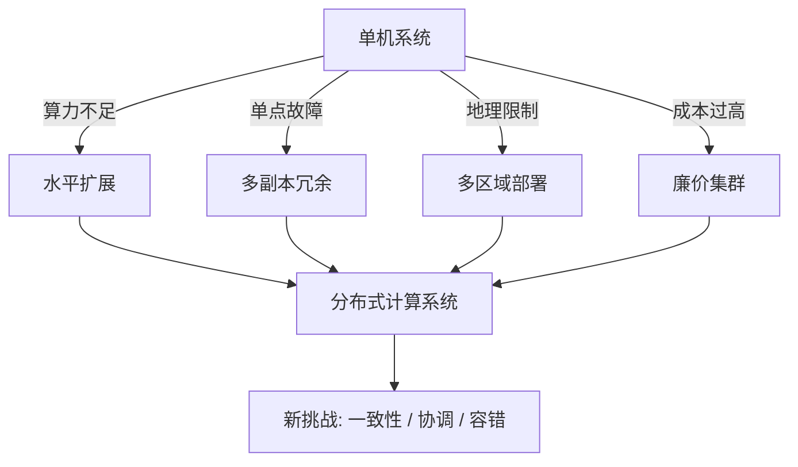
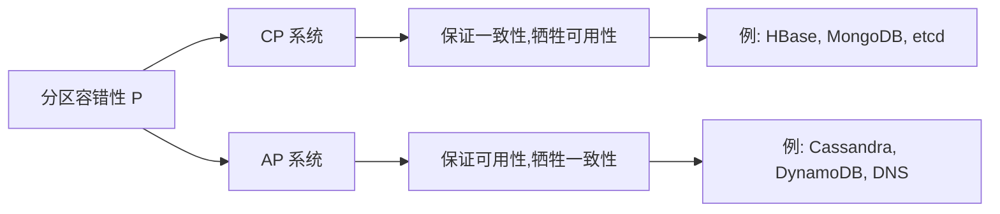
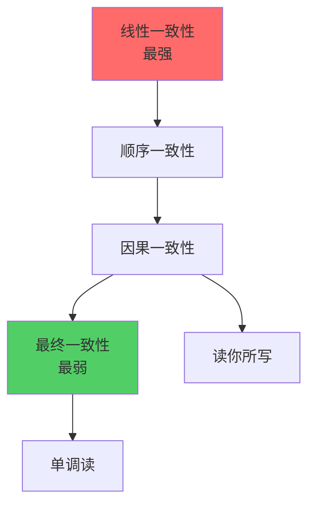
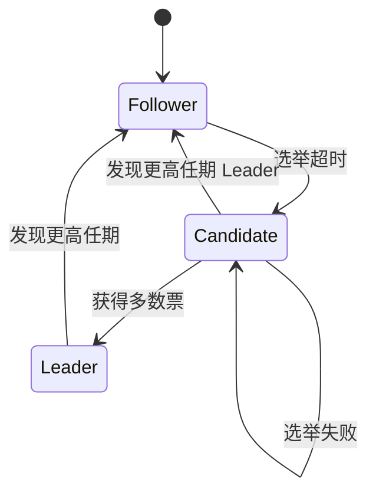

## 分布式计算的理论基础

分布式计算是将一个大规模问题拆分到多台机器上协同求解的计算范式。要真正理解分布式系统的设计与实现，必须先掌握其理论根基——这些理论不仅解释了"为什么分布式系统这么难"，也划定了"哪些问题在理论上无解"。本章从动机出发，系统梳理分布式计算的核心理论、经典定理、一致性模型和共识算法。

---

### 1. 为什么需要分布式系统

单机系统的算力、存储和可靠性都有物理上限。当业务规模超出单机能力时，分布式系统成为必然选择。具体动机包括四个方面：

**性能需求：** 单台机器的 CPU、内存、磁盘 I/O 存在上限。通过水平扩展（scale out），可以将计算负载分散到数百甚至数千个节点上，获得远超单机的处理能力。Google 的搜索系统需要在 0.1 秒内从数十亿网页中返回结果，这在单机上根本无法实现。

**可用性需求：** 单机系统存在单点故障（Single Point of Failure, SPOF）。任何硬件故障、网络中断或软件 Bug 都会导致服务完全不可用。分布式系统通过多副本冗余，即使部分节点失效，系统仍能继续提供服务。Amazon 的 S3 服务设计目标是 99.999999999%（11 个 9）的持久性，这意味着存储 1000 亿个对象，每年预计丢失不到一个。

**地理分布需求：** 全球化业务要求服务部署在多个地理区域，让用户就近访问以降低延迟。CDN（内容分发网络）就是最典型的例子——将内容缓存到全球各地的边缘节点，用户从最近的节点获取数据。

**成本效率需求：** 大型机（Mainframe）的采购和运维成本极高。用大量廉价的商用服务器（Commodity Hardware）组成集群来完成同样的计算任务，在成本上往往更加划算。Google 正是凭借这个理念，用廉价 PC 集群构建了全球最大的搜索引擎。



然而，分布式系统在解决单机局限的同时，引入了一系列全新的挑战。网络不可靠、节点会故障、时钟不同步——这些问题在单机环境中几乎不存在，但在分布式系统中却是常态。这正是分布式计算理论存在的根本原因。

---

### 2. 分布式系统的核心挑战

Leslie Lamport 在其经典论文中给出了分布式系统的非正式定义：**"分布式系统是这样一种系统：你甚至不知道存在一台你从未听说过的计算机故障了。"** 这句话精确地概括了分布式系统的核心难点。

#### 2.1 网络不可靠性

网络是分布式系统中最不可靠的组件。故障模式包括：

| 故障类型 | 描述 | 典型延迟 |
|----------|------|----------|
| 丢包（Packet Loss） | 数据包在网络中丢失 | 不可预测 |
| 延迟（Latency） | 数据包传输耗时远超预期 | 从毫秒到秒级 |
| 乱序（Reordering） | 数据包到达顺序与发送顺序不同 | 通常 < 100ms |
| 重复（Duplication） | 同一数据包被发送多次 | 不可预测 |
| 网络分区（Partition） | 网络分裂为不连通的子集 | 持续时间不定 |

在网络分区发生时，系统被分裂为多个独立的子系统，每个子系统只能和自己所在分区的节点通信。这是分布式系统中最棘手的问题之一，也是 CAP 定理的核心关注点。

#### 2.2 时钟问题

单机系统中，所有进程共享同一个物理时钟，事件的先后顺序是确定的。但在分布式系统中，每台机器都有自己的本地时钟，而物理时钟之间必然存在偏差（Clock Skew）。

根据 Google 的 Spanner 论文披露，即使使用 GPS 和原子钟进行同步，数据中心内的时钟偏差仍然可以达到几百微秒。这个看似微小的偏差，在高并发场景下会导致严重的因果关系判断错误。

解决时钟问题的方案分为两类：
- **物理时钟同步：** NTP（Network Time Protocol）、PTP（Precision Time Protocol）、GPS/原子钟。Google Spanner 使用 TrueTime API，将时间表示为一个区间而非一个点。
- **逻辑时钟：** Lamport 时钟和向量时钟，通过事件之间的因果关系来建立顺序，不依赖物理时钟。

#### 2.3 故障模型

分布式系统理论对节点故障进行了严格分类：

**崩溃故障（Crash Fault）：** 节点在某个时刻突然停止工作，不再响应任何请求。这是最简单的故障模型，节点不会发送错误信息，只是"沉默"。Ceph 分布式存储系统假设 OSD 节点可能发生崩溃故障，通过 PG（Placement Group）的多副本机制来应对。

**崩溃-恢复故障（Crash-Recovery）：** 节点崩溃后可能在一段时间后恢复，但崩溃期间的内存状态（包括锁、缓存、未持久化的数据）全部丢失。这要求系统设计时必须考虑状态的持久化。Raft 协议中的日志持久化（fsync）就是针对这种故障模型。

**拜占庭故障（Byzantine Fault）：** 节点可以表现出任意行为——发送错误数据、不响应、甚至与其他节点串通欺骗。这是最严重的故障模型，得名于拜占庭将军问题。区块链系统（如比特币、以太坊）必须假设存在拜占庭节点，因此需要拜占庭容错（BFT）共识算法。

**网络分区（Network Partition）：** 严格来说不是节点故障，但效果类似——节点之间无法通信，导致系统被分裂。网络分区在实践中非常常见，尤其是跨数据中心部署时。

| 故障类型 | 节点行为 | 最低容忍要求 | 典型场景 |
|----------|----------|-------------|----------|
| 崩溃故障 | 停止响应 | 多数节点存活 | 数据库主从切换 |
| 崩溃-恢复 | 丢失内存状态后恢复 | 持久化 + 多副本 | Raft 日志恢复 |
| 拜占庭故障 | 任意行为 | 3f+1 节点容 f 个故障 | 区块链共识 |
| 网络分区 | 不连通 | CAP 权衡 | 跨机房部署 |

---

### 3. CAP 定理

CAP 定理是分布式系统领域最著名的理论结果，由 Eric Brewer 在 2000 年提出，并由 Gilbert 和 Lynch 在 2002 年严格证明。

#### 3.1 三个属性的定义

**一致性（Consistency）：** 所有节点在同一时间看到的数据是相同的。更精确地说，每次读操作都能返回最近一次写操作的结果。在 CAP 的语境下，一致性特指**线性一致性**（Linearizability），这是最强的一致性模型——仿佛所有操作都在单机上按某个全局顺序执行。

**可用性（Availability）：** 每个请求都能在合理时间内获得非错误的响应（不保证返回最新数据）。注意，CAP 中的可用性要求**每个**非故障节点都能响应，而不是"系统整体可用"。

**分区容错性（Partition Tolerance）：** 当网络分区发生时，系统仍然能继续运行。网络分区在分布式系统中是不可避免的，因此 P 是必须保证的。

#### 3.2 CAP 定理的核心结论

在发生网络分区（P）时，系统必须在一致性（C）和可用性（A）之间做出选择：



**CP 系统：** 选择一致性，牺牲可用性。当网络分区发生时，某些节点无法响应请求，系统宁可拒绝服务也不返回不一致的数据。典型代表包括 ZooKeeper、etcd、HBase。这些系统通常用于需要强一致性的协调服务，如分布式锁、Leader 选举。

**AP 系统：** 选择可用性，牺牲一致性。当网络分区发生时，所有节点都能响应请求，但返回的数据可能是过时的。典型代表包括 Cassandra、DynamoDB、CouchDB。这些系统通常用于对一致性要求不严格但要求高可用的场景，如社交网络的动态流、电商的商品浏览。

#### 3.3 CAP 定理的常见误解

**误解一：三选二。** CAP 定理的常见误读是"在 C、A、P 三个属性中选两个"。实际上，P 是必须保证的（网络分区不可避免），真正的选择是当分区发生时，在 C 和 A 之间选择一个。

**误解二：二选一。** CAP 定理并不意味着系统在所有时刻都在 C 和 A 之间做二选一。只有在网络分区发生时才需要做出权衡。在正常运行（无分区）时，系统可以同时保证 C 和 A。

**误解三：C 和 A 无法共存。** 这是误解二的延伸。没有网络分区时，同时保证 C 和 A 是完全可行的。

#### 3.4 PACELC 定理

Daniel Abadi 在 2010 年提出了 PACELC 定理，对 CAP 定理进行了扩展。PACELC 的含义是：

> 如果有分区（Partition），选择可用性（Availability）还是一致性（Consistency）？在其他时候（Else），选择低延迟（Latency）还是一致性（Consistency）？

PACELC 定理揭示了一个常被忽视的事实：即使在没有分区的正常情况下，系统仍然需要在延迟和一致性之间做权衡。强一致性通常意味着更多的同步操作和更长的响应时间。

| 系统 | 分区时选择 | 正常时选择 | 分类 |
|------|-----------|-----------|------|
| ZooKeeper | CA（一致性优先） | C（一致性优先） | PC/EC |
| Cassandra | PA（可用性优先） | L（延迟优先） | PA/EL |
| MongoDB | PC（一致性优先） | C（一致性优先） | PC/EC |
| PNUTS (Yahoo) | PA（可用性优先） | C（一致性优先） | PA/EC |
| DynamoDB | PA（可用性优先） | L（延迟优先） | PA/EL |

---

### 4. 一致性模型

一致性模型定义了分布式系统中数据副本之间的一致性保证级别。从强到弱，主要的一致性模型包括：

#### 4.1 强一致性模型

**线性一致性（Linearizability）：** 最强的一致性模型。要求所有操作表现得像在单机上按某个全局时序执行一样，且每个操作看起来在调用和响应之间的某个时刻生效。满足线性一致性的系统能够保证：如果操作 A 的响应在操作 B 的调用之前返回，那么 A 一定先于 B 生效。

线性一致性的实现代价很高。通常需要分布式共识协议（如 Raft），所有写操作必须经过 Leader 节点协调，读操作需要从 Leader 或确认同步完成的 Follower 读取。Google 的 Spanner 通过 TrueTime API 实现了外部一致性（External Consistency，比线性一致性更强），代价是每次写操作需要等待两个时间戳不确定性区间。

**顺序一致性（Sequential Consistency）：** 放宽了实时性约束。只要求所有进程看到的操作顺序与程序顺序一致，且所有进程看到的全局顺序相同。但不要求操作的实际生效时间与调用时间一致。

**因果一致性（Causal Consistency）：** 只保证有因果关系的操作按顺序执行。没有因果关系的并发操作可以被不同节点以不同顺序观察到。因果一致性是实际系统中常用的折中方案——它比最终一致性强，但实现代价远低于线性一致性。MongoDB 的因果一致性会话（Causal Consistency Sessions）就是典型实现。

#### 4.2 弱一致性模型

**最终一致性（Eventual Consistency）：** 如果不再有新的写操作，最终所有副本会收敛到相同的值。最终一致性是性能最好、最容易实现的模型，但客户端可能在任意时间窗口内读到过时的数据。Amazon 的 S3 使用了最终一致性模型（2020 年后对新写入的对象提供强一致性）。

**读你所写一致性（Read-Your-Writes）：** 保证一个进程总能读到自己之前写入的数据。这是最终一致性的改进版本，通过将写操作绑定到特定节点来实现。Redis Cluster 通过将 key 的读写路由到同一个 slot 来保证这种一致性。

**单调读一致性（Monotonic Reads）：** 保证一个进程不会读到时间上"倒退"的数据。即如果先读到值 V1，后续读到的值不会是比 V1 更旧的值。



| 一致性模型 | 实现复杂度 | 性能 | 适用场景 |
|-----------|-----------|------|----------|
| 线性一致性 | 最高 | 最低 | 分布式锁、Leader 选举 |
| 顺序一致性 | 高 | 较低 | 多副本数据库 |
| 因果一致性 | 中等 | 中等 | 协作编辑、社交网络 |
| 最终一致性 | 最低 | 最高 | CDN、DNS、缓存 |
| 读你所写 | 低 | 较高 | 用户个人数据 |
| 单调读 | 低 | 较高 | 流媒体、消息推送 |

---

### 5. 逻辑时钟与因果关系

在分布式系统中，如何判断两个事件的先后顺序？物理时钟不可靠，我们需要逻辑时钟来建立事件之间的因果顺序。

#### 5.1 Lamport 时钟

Lamport 时钟是 Leslie Lamport 于 1978 年提出的逻辑时钟算法。核心思想极其简单：

1. 每个进程维护一个计数器，初始值为 0
2. 每次本地事件发生时，计数器加 1
3. 发送消息时，将当前计数器值附在消息中
4. 接收消息时，将本地计数器更新为 max(本地值, 消息中的值) + 1

Lamport 时钟保证了因果顺序：如果事件 A 因果性地先于事件 B，那么 LC(A) < LC(B)。但反向不成立——LC(A) < LC(B) 并不意味着 A 先于 B，它们可能是并发事件。

```python
class LamportClock:
    """Lamport 逻辑时钟实现"""
    
    def __init__(self):
        self.counter = 0
    
    def local_event(self):
        """本地事件：计数器加1"""
        self.counter += 1
        return self.counter
    
    def send(self):
        """发送消息：附带当前计数器值"""
        self.counter += 1
        return self.counter
    
    def receive(self, msg_timestamp):
        """接收消息：取最大值加1"""
        self.counter = max(self.counter, msg_timestamp) + 1
        return self.counter
```

#### 5.2 向量时钟

向量时钟解决了 Lamport 时钟无法检测并发事件的问题。核心思想是：每个进程不再维护单一计数器，而是一个向量——向量的每个分量对应一个进程。

1. 每个进程维护一个长度为 N（进程总数）的向量，初始全为 0
2. 本地事件发生时，将自己对应的分量加 1
3. 发送消息时，附带当前向量
4. 接收消息时，对向量的每个分量取 max(本地值, 消息值)，然后将自己的分量加 1

向量时钟可以精确判断事件之间的关系：
- **A → B（A 先于 B）：** A 的向量的每个分量都 ≤ B 的向量的对应分量，且至少有一个分量严格小于
- **A ∥ B（A 和 B 并发）：** A 和 B 的向量互不满足上述条件

Amazon 的 Dynamo 论文使用向量时钟来检测并发写冲突，通过向量时钟判断两个写操作是否并发。当检测到并发时，系统将冲突版本交给客户端或使用 Last-Write-Wins（LWW）策略来解决。

```python
class VectorClock:
    """向量时钟实现"""
    
    def __init__(self, node_id, n_nodes):
        self.node_id = node_id
        self.clock = [0] * n_nodes
    
    def local_event(self):
        """本地事件：自身分量加1"""
        self.clock[self.node_id] += 1
        return self.clock[:]
    
    def send(self):
        """发送消息：附带当前向量"""
        self.clock[self.node_id] += 1
        return self.clock[:]
    
    def receive(self, msg_clock):
        """接收消息：逐分量取最大值，然后自身加1"""
        for i in range(len(self.clock)):
            self.clock[i] = max(self.clock[i], msg_clock[i])
        self.clock[self.node_id] += 1
        return self.clock[:]
    
    def happens_before(self, other_clock):
        """判断自身是否先于 other"""
        dominated = False
        for i in range(len(self.clock)):
            if self.clock[i] > other_clock[i]:
                return False
            if self.clock[i] < other_clock[i]:
                dominated = True
        return dominated
    
    def concurrent_with(self, other_clock):
        """判断是否与 other 并发"""
        return not self.happens_before(other_clock) and \
               not VectorClock._static_happens_before(other_clock, self.clock)
```

---

### 6. 共识算法

共识（Consensus）是分布式计算中最核心的问题之一：多个节点如何就某个值达成一致？共识算法是解决这一问题的基石，直接支撑了分布式数据库、分布式协调服务、区块链等关键基础设施。

#### 6.1 共识问题的正式定义

一个正确的共识算法必须满足三个性质：

- **合法性（Validity / Agreement）：** 所有达成一致的节点决定的值必须是某个节点提出的值（不能凭空产生）
- **一致性（Agreement）：** 所有正确运行的节点最终决定的值相同
- **终止性（Termination）：** 所有正确运行的节点最终都会做出决定（不会无限等待）

此外还有两个隐含要求：
- **完整性（Integrity）：** 每个节点最多决定一次
- **可终止性（Liveness）：** 系统最终会取得进展

#### 6.2 FLP 不可能性定理

1985 年，Fischer、Lynch 和 Paterson 证明了一个著名的不可能性结果（FLP Impossibility）：**在一个异步系统中，即使只有一个节点可能发生崩溃故障，也不存在一个确定性的共识算法能在有限时间内保证终止。**

这个定理的含义是：在纯异步网络模型下（没有超时假设），由于无法区分"慢节点"和"崩溃节点"，共识问题是理论上无解的。

但这并不意味着共识无法实现。实际系统通过以下方式绕过 FLP 限制：

1. **引入部分同步假设：** 假设消息延迟存在上界（虽然未知具体值），Raft 和 Paxos 都采用这种方式
2. **使用随机化算法：** 如 Ben-Or 算法，通过随机选择来避免无限循环，但概率性地保证终止
3. **引入故障检测器：** 通过心跳超时来检测可疑的崩溃节点，但这不是完美的故障检测

#### 6.3 Paxos 算法

Paxos 由 Leslie Lamport 在 1989 年提出（论文 1998 年才正式发表），是最早的实用共识算法。Paxos 定义了三种角色：

- **Proposer（提议者）：** 提出提案值
- **Acceptor（接受者）：** 投票决定是否接受提案
- **Learner（学习者）：** 学习已被选定的值

Paxos 分为两个阶段：

**阶段一（Prepare）：**
1. Proposer 选择一个提案编号 n（全局唯一且递增），向多数 Acceptors 发送 Prepare(n) 请求
2. Acceptor 收到 Prepare(n) 后，如果 n 大于它已响应的所有 Prepare 请求的编号，就承诺不再接受编号小于 n 的提案，并返回它已接受的编号最大的提案（如果有的话）

**阶段二（Accept）：**
1. Proposer 收到多数 Acceptors 的 Prepare 响应后，选择一个提案值 v（优先使用响应中编号最大的提案值），向多数 Acceptors 发送 Accept(n, v) 请求
2. Acceptor 收到 Accept(n, v) 后，如果 n 不小于它承诺的最小编号，就接受这个提案
3. 当多数 Acceptors 接受了同一个提案时，共识达成

Paxos 的工程化实现极为复杂。Google 的 Chubby 系统基于 Multi-Paxos 实现，但其论文中坦言："Paxos 的描述省略了大量工程细节，直接实现非常困难。"

#### 6.4 Raft 算法

Raft 由 Diego Ongaro 和 John Ousterhout 在 2014 年提出，设计目标就是比 Paxos 更容易理解。Raft 将共识问题分解为三个子问题：

**Leader 选举（Leader Election）：**
- 所有节点初始为 Follower 状态
- Follower 在选举超时（通常 150-300ms）内没有收到 Leader 的心跳，变为 Candidate 并发起选举
- Candidate 向其他节点请求投票，如果获得多数票则成为 Leader
- Leader 定期发送心跳维持权威
- 使用随机化的选举超时来避免多个 Candidate 同时发起选举导致的活锁

**日志复制（Log Replication）：**
- 客户端将写请求发送给 Leader
- Leader 将操作追加到本地日志，并并行发送 AppendEntries RPC 给所有 Follower
- 当多数节点确认后，Leader 提交日志条目并应用到状态机
- Leader 负责将已提交的日志同步给落后的 Follower

**安全性保证（Safety）：**
- Leader 完整性属性：如果一个日志条目在某个任期被提交，那么该条目一定出现在所有更高任期 Leader 的日志中
- 选举限制：Candidate 的日志必须至少和多数节点一样新，才能获得选票
- 不同步未提交条目：Leader 只同步已提交的条目



Raft 的典型实现包括 etcd（Kubernetes 的核心存储组件）、TiKV（TiDB 的分布式存储引擎）、CockroachDB。etcd 使用 Raft 保证集群配置和 Key-Value 数据的一致性，Kubernetes 的所有控制状态都持久化在 etcd 中。

#### 6.5 拜占庭容错（BFT）

在存在恶意节点（拜占庭故障）的场景中，需要使用拜占庭容错算法。最经典的是实用拜占庭容错算法 PBFT（Practical Byzantine Fault Tolerance），由 Miguel Castro 和 Barbara Liskov 于 1999 年提出。

PBFT 要求至少 3f+1 个节点才能容忍 f 个拜占庭节点。算法分为三个阶段：

1. **Pre-prepare：** Leader 为请求分配序列号，广播 Pre-prepare 消息
2. **Prepare：** 每个节点验证 Leader 的提议，广播 Prepare 消息
3. **Commit：** 当节点收到 2f+1 个 Prepare 消息后，广播 Commit 消息
4. **Reply：** 当节点收到 2f+1 个 Commit 消息后，执行请求并回复客户端

PBFT 的消息复杂度为 O(n²)，这限制了其扩展性。在 100 个节点的系统中，每次共识需要约 10,000 条消息。因此 PBFT 主要用于节点数量有限的联盟链场景，如 Hyperledger Fabric。

---

### 7. 容错理论

分布式系统的容错设计遵循严格的理论约束。

#### 7.1 冗余度要求

不同类型的故障需要不同程度的冗余来容忍：

- **崩溃故障：** N 个节点中容忍 f 个故障需要 N ≥ 2f+1（多数派原则）
- **拜占庭故障：** N 个节点中容忍 f 个故障需要 N ≥ 3f+1

以三副本系统为例（N=3），根据崩溃故障模型，可以容忍 f=1 个节点故障（3 ≥ 2×1+1）。如果要容忍拜占庭故障，三副本只能容忍 f=0，即无法容忍任何恶意节点。

#### 7.2 两将军问题

两将军问题是分布式系统中通信不可靠性的经典思想实验。两支军队分别驻扎在山谷两侧，需要约定同时进攻。但它们之间的唯一通信渠道是可能丢失消息的信使。

理论上，两将军问题无解——由于信使可能丢失消息，无论交换多少轮消息，双方都无法达到确定性的共识。这个思想实验揭示了一个重要事实：**在不可靠的通信通道上，完美的一致性协议是不可能的。**

#### 7.3 脑裂问题

脑裂（Split Brain）是指分布式集群分裂为两个（或多个）独立的子集群，每个子集群都认为自己是唯一的"合法"集群，同时接管资源，导致数据不一致。

典型的脑裂场景：主从数据库集群由于网络分区，主节点和从节点无法通信，从节点选举出新主节点，此时系统中出现两个主节点，同时接受写入。

防止脑裂的核心机制：
- **Fencing Token（隔离令牌）：** 每次选举生成单调递增的 token，写入时检查 token 是否过期
- **Quorum（仲裁）：** 任何操作都需要多数节点确认
- **STONITH（Shoot The Other Node In The Head）：** 强制关闭可能导致冲突的节点，常用于 Pacemaker/Corosync 等高可用方案

---

### 8. 分布式系统性能模型

#### 8.1 Little 定律

Little 定律是排队论的基本定理，在分布式系统中广泛用于性能分析：

> L = λ × W

其中：
- L：系统中的平均请求数（队列长度 + 正在处理的请求数）
- λ：请求的平均到达速率
- W：请求在系统中的平均逗留时间（包括排队时间和处理时间）

这个公式非常强大，因为它不需要假设任何到达分布或服务时间分布。例如：如果一个数据库集群平均有 100 个并发请求（L=100），每个请求的平均处理时间是 10ms（W=0.01s），那么系统的吞吐量是 λ = L / W = 100 / 0.01 = 10,000 QPS。

#### 8.2 可扩展性模型

**线性扩展（Linear Scalability）：** 增加 N 倍资源，获得 N 倍性能。理想状态，实际中几乎不存在。

**Amdahl 定律：** 串行部分的比例决定了并行化的最大加速比。如果程序中有比例为 P 的部分必须串行执行，那么 N 个处理器的最大加速比为 1 / (P + (1-P)/N)。当 N → ∞ 时，加速比趋近于 1/P。这意味着，即使 5% 的计算是串行的，最大加速比也只有 20 倍。

**Gustafson 定律：** 假设问题规模随处理器数量线性增长，那么加速比可以随处理器数量线性增长。Gustafson 定律描述的是"弱扩展"（Weak Scaling）——在每个处理器处理的问题规模不变的情况下，总吞吐量与处理器数量成正比。

| 定律 | 假设 | 加速比公式 | 适用场景 |
|------|------|-----------|----------|
| Amdahl | 问题规模固定 | S = 1/(P+(1-P)/N) | 优化已有程序 |
| Gustafson | 问题规模随 N 增长 | S = N - P(N-1) | 大规模数据处理 |

---

### 9. 实际设计原则

理论指导实践，以下是分布式系统设计中从理论推导出的关键原则：

**设计为失败（Design for Failure）：** 分布式系统中的故障不是"是否会发生"的问题，而是"何时发生"的问题。Netflix 的 Chaos Monkey 会随机终止生产环境中的虚拟机实例，强制工程师设计容错架构。这个实践被称为"混沌工程"（Chaos Engineering）。

**幂等性（Idempotency）：** 由于网络可能重传消息，同一个操作可能被执行多次。将所有操作设计为幂等的（执行多次与执行一次效果相同），可以安全地重试而不会产生副作用。HTTP PUT 方法被定义为幂等的，而 POST 不是。Stripe 的支付 API 通过 Idempotency-Key 头部保证支付请求的幂等性。

**最终一致性优先：** 除非业务明确要求强一致性，否则优先选择最终一致性。Google 的 Spanner 论文中提到，即使是 Google 内部，大部分服务也使用最终一致性模型，只有少数关键路径使用 Spanner 的强一致性。

**本地性原理（Locality Principle）：** 尽量减少跨节点、跨机架、跨数据中心的通信。在数据库设计中，将经常一起查询的数据放在同一个分片上（数据亲和性）。在微服务架构中，将通信频繁的服务部署在同一个机架上。

---

### 10. 常见误区

**误区一：忽略网络延迟。** 开发者常假设网络调用是瞬间完成的，实际上跨数据中心的网络延迟在 50-200ms 之间，每次调用都可能因超时重试而耗时更长。Martin Kleppmann 在《Designing Data-Intensive Applications》中详细分析了网络延迟对系统设计的影响。

**误区二：过度追求强一致性。** 强一致性的代价是延迟和可用性的下降。很多业务场景（如用户评论的展示时间、点赞数的计数）并不需要强一致性，最终一致性完全满足需求。

**误区三：忽视时钟偏差。** 在分布式系统中依赖物理时钟来排序事件是一个危险的做法。Google 的 Spanner 使用 TrueTime API 来处理时钟偏差，其他系统应该使用逻辑时钟。

**误区四：把 CAP 当作设计的唯一依据。** CAP 定理描述的是网络分区发生时的权衡，但实际系统设计还需要考虑延迟、吞吐量、持久性、安全性等多个维度。

---

### 11. 本章小结

分布式计算的理论基础是理解和设计分布式系统的根基：

- **CAP 定理和 PACELC** 揭示了分布式系统中一致性、可用性和分区容错之间的根本权衡
- **一致性模型** 定义了不同强度的数据一致性保证，从线性一致性到最终一致性，系统设计者需要根据业务需求选择合适的模型
- **逻辑时钟** 解决了分布式系统中事件排序的问题，Lamport 时钟提供因果顺序，向量时钟支持并发检测
- **共识算法**（Paxos、Raft、PBFT）是构建可靠分布式系统的核心工具，FLP 不可能性定理划定了理论边界
- **容错理论** 量化了系统对故障的容忍能力，为架构设计提供了数学依据

掌握这些理论基础，才能在面对具体工程问题时做出正确的架构决策——知道哪些问题可以解决，哪些问题理论上无解，以及在权衡中如何取舍。
