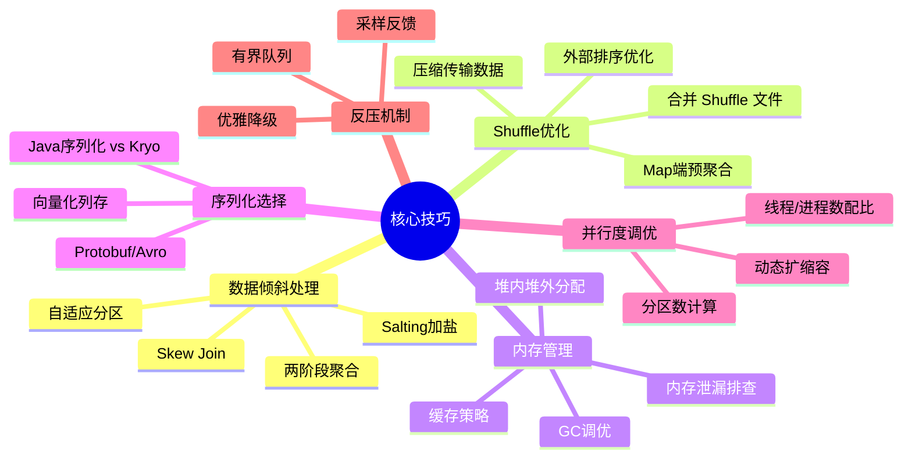
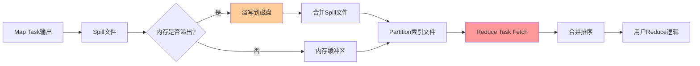
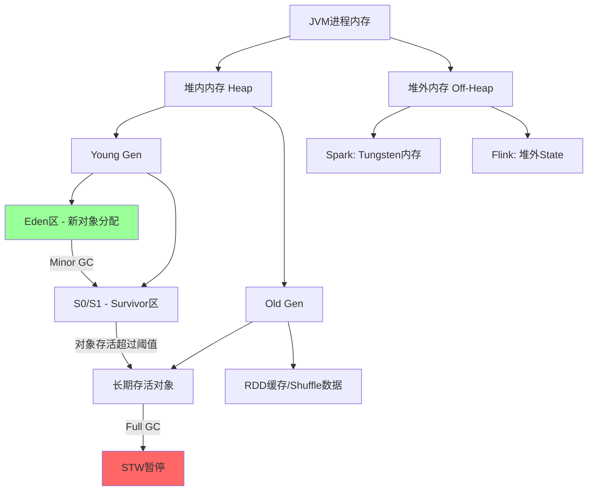
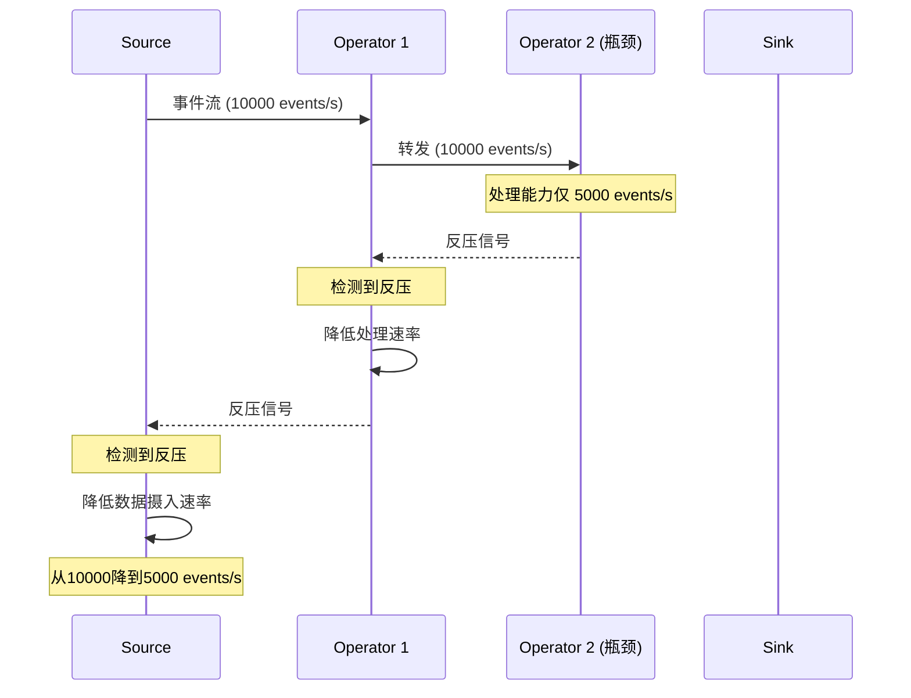

# 24.2 核心技巧

分布式计算的理论再完备，落到生产环境都绕不开工程层面的精细打磨。本节从**数据倾斜处理、Shuffle优化、内存管理、序列化选择、并行度调优、反压机制设计**六大核心维度出发，系统梳理经过大规模生产验证的工程技巧，帮助读者将框架能力转化为真正的系统性能。



---

## 24.2.1 数据倾斜处理

数据倾斜（Data Skew）是分布式计算中最常见也最棘手的性能问题。当大量数据集中到少数几个分区时，某些Task的执行时间远超其他Task，导致整个Job的完成时间取决于最慢的那个Task——即"木桶效应"。

### 数据倾斜的本质原因

数据倾斜的根本原因是**Key的分布不均匀**。常见触发场景：

| 场景 | 原因 | 表现 |
|------|------|------|
| 按用户ID聚合 | 少数大V/机器人产生海量记录 | 几个Task处理数亿条，其他Task只处理几千条 |
| 按地域分组 | 北京、上海等热门城市数据量远超其他 | 热门分区是冷门分区的100-1000倍 |
| Join操作 | 一侧表的某个Key值大量重复 | Shuffle后某个Reduce Task被"压垮" |
| 窗口计算 | 某个时间窗口内事件突增 | 该窗口的Task成为瓶颈 |
| 笛卡尔积 | Key组合爆炸 | 数据量指数级膨胀 |

### 诊断方法

在处理倾斜之前，首先需要确认是否真的存在数据倾斜：

**Spark中的诊断**

```python
# 方法一：在Stage页面观察各Task的输入记录数分布
# 如果某个Task的输入是其他Task的数倍，基本确认倾斜

# 方法二：通过Spark Listener精确统计
from pyspark import SparkContext

def diagnose_skew(rdd, top_n=10):
    """统计RDD各分区的记录数分布"""
    partition_counts = rdd.mapPartitionsWithIndex(
        lambda idx, it: [(idx, sum(1 for _ in it))]
    ).collect()
    
    counts = sorted(partition_counts, key=lambda x: x[1], reverse=True)
    total = sum(c for _, c in counts)
    
    print(f"分区总数: {len(counts)}")
    print(f"记录总数: {total}")
    print(f"\n记录数最多的 {top_n} 个分区:")
    for idx, count in counts[:top_n]:
        ratio = count / (total / len(counts))
        print(f"  分区 {idx}: {count} 条 (均值的 {ratio:.1f}x)")
    
    # 判断标准：最大分区 > 平均分区的3倍 → 存在倾斜
    avg = total / len(counts)
    max_count = counts[0][1]
    if max_count > avg * 3:
        print(f"\n⚠️  检测到数据倾斜！最大分区是均值的 {max_count/avg:.1f} 倍")
    else:
        print(f"\n✅ 分布较均匀，最大分区是均值的 {max_count/avg:.1f} 倍")
```

**Flink中的诊断**

```java
// Flink通过Web UI的Backpressure标签页监控
// 如果某个Subtask的Backpressure状态为HIGH，可能说明数据倾斜

// 更精确的方式：使用自定义指标
public class SkewDetector extends ProcessFunction<Event, Event> {
    private transient Map<String, LongCounter> keyCounts;
    
    @Override
    public void open(Configuration parameters) {
        keyCounts = new HashMap<>();
    }
    
    @Override
    public void processElement(Event event, Context ctx, Collector<Event> out) {
        String key = event.getKey();
        keyCounts.merge(key, 1L, Long::sum);
        
        // 每处理10000条输出统计
        if (keyCounts.size() % 10000 == 0) {
            long maxCount = keyCounts.values().stream()
                .mapToLong(Long::longValue).max().orElse(0);
            long avgCount = keyCounts.values().stream()
                .mapToLong(Long::longValue).sum() / keyCounts.size();
            
            if (maxCount > avgCount * 5) {
                LOG.warn("数据倾斜警告: maxKey={}, maxCount={}, avgCount={}",
                    key, maxCount, avgCount);
            }
        }
        out.collect(event);
    }
}
```

### 六种实战处理方案

#### 方案一：Salting（加盐打散）

Salting是最通用的倾斜处理方案。核心思想是**给倾斜Key加上随机后缀，将一个大Key拆分为多个小Key**，均匀分散到不同分区。

```python
from pyspark.sql import functions as F
import random

def skew_join_with_salting(df_left, df_right, skew_key, num_salts=10):
    """
    使用Salting解决单侧倾斜的Join问题
    
    原理：
    1. 对倾斜侧(df_left)的倾斜Key添加随机盐值(0~num_salts-1)
    2. 对另一侧(df_right)膨胀为num_salts份，每份对应一个盐值
    3. Join后去除盐值，保证结果正确
    """
    
    # 步骤1：给倾斜Key加盐
    salted_left = df_left.withColumn(
        "salt",
        F.when(
            F.col("key") == skew_key,
            (F.rand() * num_salts).cast("int")
        ).otherwise(0)
    ).withColumn(
        "salted_key",
        F.concat(F.col("key"), F.lit("_"), F.col("salt"))
    )
    
    # 步骤2：膨胀右侧表
    salt_explode = F.explode(F.array([F.lit(i) for i in range(num_salts)]))
    expanded_right = df_right.crossJoin(
        spark.range(num_salts).withColumnRenamed("id", "salt")
    ).withColumn(
        "salted_key",
        F.concat(F.col("key"), F.lit("_"), F.col("salt"))
    )
    
    # 步骤3：按加盐后的Key进行Join
    result = salted_left.join(
        expanded_right,
        on="salted_key",
        how="inner"
    ).drop("salt", "salted_key")
    
    return result
```

**关键细节**：
- 盐值数量的选择：通常为倾斜Key记录数 / 正常Key平均记录数的倒数，确保拆分后每个子Key的大小不超过平均分区大小
- Salting不只适用于Join，也可以用于`groupByKey`、`reduceByKey`等操作
- 对于非单Key倾斜（如复合Key），可以对最倾斜的那个维度加盐

#### 方案二：两阶段聚合

适用于`GROUP BY`场景。核心思想是**先局部聚合减少数据量，再全局聚合得到最终结果**。

```python
def two_phase_aggregation(df):
    """
    两阶段聚合解决GROUP BY倾斜
    
    第一阶段：添加随机前缀进行局部聚合
    第二阶段：去掉前缀进行全局聚合
    """
    NUM_PARTITIONS = 10
    
    # 第一阶段：加随机前缀 → 局部聚合
    phase1 = df.withColumn(
        "prefix",
        (F.rand() * NUM_PARTITIONS).cast("int")
    ).withColumn(
        "prefixed_key",
        F.concat(F.col("key"), F.lit("_"), F.col("prefix"))
    ).groupBy("prefixed_key").agg(
        F.sum("value").alias("partial_sum"),
        F.count("*").alias("partial_count")
    )
    
    # 第二阶段：去掉前缀 → 全局聚合
    phase2 = phase1.withColumn(
        "key",
        F.substring(F.col("prefixed_key"), 1, 
                     F.length(F.col("prefixed_key")) - 2)
    ).groupBy("key").agg(
        F.sum("partial_sum").alias("total_sum"),
        F.sum("partial_count").alias("total_count")
    )
    
    return phase2
```

**适用条件与局限**：
- 适用于聚合操作（SUM、COUNT、AVG），不适用于需要保留完整记录的操作
- 随机前缀的数量决定了打散程度，太少则倾斜未解决，太多则增加Shuffle开销
- AVG等需要二次计算的指标，第二阶段需用`sum/count`而非直接求平均

#### 方案三：Skew Join（广播小表倾斜键）

当倾斜侧的倾斜Key可以映射到一个较小子集时，可以将这些Key单独拿出来做Broadcast Join，其余部分正常Join。

```python
def broadcast_skew_join(big_df, small_df, skew_keys):
    """
    对倾斜Key使用Broadcast Join，其余使用普通Join
    
    适用于：倾斜Key数量有限，且这些Key对应的数据可以放入内存
    """
    # 分离倾斜Key的数据
    skew_data = big_df.filter(F.col("key").isin(skew_keys))
    normal_data = big_df.filter(~F.col("key").isin(skew_keys))
    
    # 倾斜部分：广播小表进行Join（避免Shuffle）
    skew_result = skew_data.join(
        F.broadcast(small_df),
        on="key",
        how="inner"
    )
    
    # 正常部分：普通Join
    normal_result = normal_data.join(
        small_df,
        on="key",
        how="inner"
    )
    
    # 合并结果
    return skew_result.union(normal_result)
```

#### 方案四：自适应查询执行（Spark AQI）

Spark 3.0+内置了自适应查询执行（Adaptive Query Execution），可以自动检测并处理倾斜。

```python
# 启用AQI
spark.conf.set("spark.sql.adaptive.enabled", "true")
spark.conf.set("spark.sql.adaptive.skewJoin.enabled", "true")
spark.conf.set("spark.sql.adaptive.skewJoin.skewedPartitionFactor", "5")
# skewedPartitionFactor: 分区记录数 > 均值 * 该因子 → 判定为倾斜
spark.conf.set("spark.sql.adaptive.skewJoin.skewedPartitionThresholdInBytes", "256m")
# skewedPartitionThresholdInBytes: 分区大小阈值

# AQI自动处理流程：
# 1. 在Shuffle Read阶段统计各分区实际数据量
# 2. 识别出倾斜分区
# 3. 将倾斜分区进一步拆分为多个子分区
# 4. 对每个子分区独立执行Reduce
```

#### 方案五：预聚合与数据预处理

在数据进入计算框架之前，先进行预聚合或过滤，减少倾斜数据的影响。

```python
def preprocess_skewed_data(spark, input_path):
    """
    数据预处理策略：
    1. 过滤异常数据（如空Key、测试数据）
    2. 预聚合重复记录
    3. 将大Key拆分为维度表单独处理
    """
    raw_df = spark.read.parquet(input_path)
    
    # 过滤无效数据
    cleaned = raw_df.filter(
        F.col("key").isNotNull() &amp; 
        F.col("key") != "" &amp;
        ~F.col("key").startswith("test_") &amp;
        ~F.col("key").startswith("dummy_")
    )
    
    # 统计Key分布
    key_stats = cleaned.groupBy("key").count().orderBy(F.desc("count"))
    
    # 识别Top-K大Key
    top_keys = key_stats.limit(100).collect()
    skew_keys = [r["key"] for r in top_keys 
                 if r["count"] > key_stats.approxQuantile("count", [0.99], 0.01)[0] * 10]
    
    print(f"检测到 {len(skew_keys)} 个倾斜Key")
    return cleaned, skew_keys
```

#### 方案六：Range分区替代Hash分区

当Key的分布天然不均匀时，改用Range分区可以让每个分区的数据量更均衡。

```python
# Spark中使用Range分区
df.repartitionByRange(200, F.col("key"))

# Flink中自定义分区器
class BalancedKeyPartitioner implements KeyPartitioner {
    private final TreeMap<Long, Integer> boundaries;
    
    public BalancedKeyPartitioner(long[] boundaries, int numPartitions) {
        this.boundaries = new TreeMap<>();
        for (int i = 0; i < boundaries.length; i++) {
            this.boundaries.put(boundaries[i], i);
        }
    }
    
    @Override
    public int partition(long key) {
        Map.Entry<Long, Integer> entry = boundaries.floorEntry(key);
        return entry != null ? entry.getValue() : 0;
    }
}
```

**各方案选择指南**：

| 方案 | 适用场景 | 复杂度 | 性能影响 | 适用框架 |
|------|----------|--------|----------|----------|
| Salting加盐 | 通用，任何Key倾斜 | 中等 | 盐值数×一次Shuffle | Spark/Flink |
| 两阶段聚合 | GROUP BY聚合操作 | 低 | 两次聚合，总开销增加30-50% | Spark/Flink |
| Broadcast倾斜键 | 倾斜Key数量有限 | 低 | 倾斜部分零Shuffle | Spark |
| AQI自适应 | Spark 3.0+ | 极低（自动） | 额外统计开销<5% | Spark |
| 预聚合预处理 | 数据源可控 | 低 | 预处理一次，后续受益 | 通用 |
| Range分区 | Key有天然顺序 | 低 | 一次性分区开销 | Spark/Flink |

---

## 24.2.2 Shuffle优化

Shuffle是分布式计算中代价最高的操作——涉及网络传输、磁盘读写和序列化/反序列化。一次不优化的Shuffle可能吃掉整个Job 70%以上的时间。

### Shuffle的成本模型

理解Shuffle的开销结构是优化的前提：

总Shuffle成本 = 写入成本 + 网络传输成本 + 读取成本 + 排序成本

写入成本:   Map端将数据按Partition写入磁盘文件
网络传输成本: 数据跨越节点在网络中传输（最大瓶颈）
读取成本:   Reduce端从远程节点拉取数据
排序成本:   Reduce端按Key排序（如需）

**一次Shuffle的完整数据流**：



### 优化技巧一：Map端预聚合（Combiner）

Combiner是Shuffle优化的第一道防线，通过在Map端提前聚合减少传输数据量。

```python
# Spark中的Combiner等价操作
# ❌ 不使用Combiner：所有数据直接Shuffle到Reduce
result = rdd.groupByKey().mapValues(sum)

# ✅ 使用Combiner：Map端先局部聚合
result = rdd.reduceByKey(lambda a, b: a + b)

# reduceByKey在Map端会自动调用传入的函数进行预聚合
# 假设原始数据：
#   ("word1", 1), ("word1", 1), ("word1", 1), ..., 共100万条
#   ("word2", 1), ("word2", 1), ..., 共10条
#
# 不用Combiner: Shuffle传输 1,000,010 条记录
# 用Combiner:   Shuffle传输 2 条记录（假设1个分区）
# 数据压缩比: 50万倍
```

**Combiner的使用条件**：
- 聚合函数必须满足**交换律和结合律**（如SUM、COUNT、MAX、MIN）
- AVG、DISTINCT等操作不能直接使用Combiner
- 如果Combiner的输出类型与输入类型不同，需要额外的`mapValues`转换

### 优化技巧二：减少Shuffle次数

每次Shuffle都是一次昂贵的网络IO操作。合并多个Shuffle为一个可以显著降低开销。

```python
# ❌ 多次Shuffle：每次join和groupBy都触发一次Shuffle
orders = orders_df.join(customers_df, "customer_id")     # Shuffle #1
orders = orders_df.join(products_df, "product_id")       # Shuffle #2
result = orders.groupBy("category").agg(sum("amount"))   # Shuffle #3

# ✅ 减少Shuffle：使用广播小表避免Join的Shuffle
orders = orders_df.join(F.broadcast(customers_df), "customer_id")  # 无Shuffle
orders = orders_df.join(F.broadcast(products_df), "product_id")    # 无Shuffle
result = orders.groupBy("category").agg(sum("amount"))             # Shuffle #1

# ✅ 使用Coalesce减少Shuffle
# coalesce不触发全量Shuffle，repartition会触发
df.coalesce(100)   # 只能减少分区，不触发Shuffle
df.repartition(200) # 可以增加或减少分区，触发Shuffle
```

### 优化技巧三：Shuffle文件合并

Spark默认每个Map Task为每个Reduce Task生成一个文件，导致文件数量爆炸。

```python
# 文件数 = Map数 × Reduce数
# 例: 1000个Map × 500个Reduce = 500,000个小文件
# 每个文件打开需要文件句柄，导致IO瓶颈

# 开启文件合并
spark.conf.set("spark.shuffle.compress", "true")          # 压缩Shuffle文件
spark.conf.set("spark.shuffle.spill.compress", "true")    # 压缩溢写文件
spark.conf.set("spark.io.compression.codec", "lz4")       # 使用LZ4压缩（速度优先）
spark.conf.set("spark.shuffle.file.buffer", "64k")        # 增大写缓冲区，减少溢写次数
spark.conf.set("spark.reducer.maxSizeInFlight", "96m")    # 增大Reduce端拉取缓冲

# Spark 2.0+ 默认使用Sort-based Shuffle，文件合并已内置
# 但仍需关注上述缓冲和压缩配置
```

### 优化技巧四：Shuffle分区数调优

分区数过多导致小文件和过多Task调度开销；分区数过少导致每个Task处理数据过多、内存溢出。

```python
# 默认分区数计算
# Spark 2.x+: spark.sql.shuffle.partitions = 200（默认值，对小数据集偏大）
# Flink: 由算子的并行度决定

def calculate_optimal_partitions(df, target_partition_size_mb=128):
    """
    根据数据量计算最优Shuffle分区数
    
    经验法则：每个分区 128-256MB 是比较理想的大小
    """
    # 获取DataFrame大小（近似）
    # 实际中可以通过SparkListener或Spark UI获取
    data_size_mb = df.cache().sizeInMemory / (1024 * 1024)
    
    optimal_partitions = max(
        200,  # 最小分区数，保证并行度
        int(data_size_mb / target_partition_size_mb * 1.2)  # 20%余量
    )
    
    print(f"数据量: {data_size_mb:.0f}MB")
    print(f"目标分区大小: {target_partition_size_mb}MB")
    print(f"建议分区数: {optimal_partitions}")
    
    return optimal_partitions

# 动态设置
optimal = calculate_optimal_partitions(df)
spark.conf.set("spark.sql.shuffle.partitions", optimal)
```

### 优化技巧五：外部排序优化

当数据量超过内存容量时，需要使用外部排序（External Sort），此时磁盘IO成为关键瓶颈。

```python
# 外部排序优化配置
spark.conf.set("spark.shuffle.sort.bypassMergeThreshold", "400")
# 当分区数 < bypassMergeThreshold 且没有map端聚合时，
# 跳过排序直接合并，减少排序开销

spark.conf.set("spark.shuffle.sort.io.plugin.class", 
    "org.apache.spark.shuffle.sort.IOAppender")
# 使用异步IO，重叠排序和磁盘写入

# Flink中的排序优化
# 通过 StateBackend 配置
env.setStateBackend(new EmbeddedRocksDBStateBackend(true));
# RocksDB使用LSM-Tree，写入时在内存中排序，批量刷盘
```

### 优化技巧六：Shuffle压缩算法选择

不同压缩算法在压缩比和速度之间有不同的权衡：

| 算法 | 压缩比 | 压缩速度 | 解压速度 | 适用场景 |
|------|--------|----------|----------|----------|
| LZ4 | 低(2.1:1) | 极快(700MB/s) | 极快(4000MB/s) | 低延迟场景，IO不瓶颈时 |
| Snappy | 中(2.5:1) | 快(500MB/s) | 快(1500MB/s) | 通用场景（Spark默认） |
| ZSTD | 高(3.5:1) | 中(300MB/s) | 快(1000MB/s) | 网络带宽受限场景 |
| GZIP | 最高(5:1) | 慢(100MB/s) | 慢(400MB/s) | 归档存储，离线分析 |

```python
# Spark中选择压缩算法
spark.conf.set("spark.io.compression.codec", "zstd")  # 推荐ZSTD
# ZSTD在Spark 3.2+ 中是默认codec，平衡了压缩比和速度

# Flink中配置
env.getConfig().setBufferTimeout(1); // 每1ms刷新一次缓冲
env.getConfig().setGlobalJobParameters(
    Configuration.fromMap(Map.of("state.backend.rocksdb.writebuffer.size", "128mb"))
);
```

---

## 24.2.3 内存管理

分布式计算框架的性能很大程度上取决于内存管理是否得当。内存不足会导致频繁GC、溢写磁盘甚至OOM崩溃。

### JVM内存模型与分布式计算



### Spark内存管理详解

Spark 1.6+ 采用统一内存管理模型（Unified Memory Management），将Execution和Storage内存统一管理：

```python
# Spark Executor内存布局
MEMORY_LAYOUT = """
┌─────────────────────────────────────────────┐
│             Executor Memory                  │
│                                              │
│  ┌────────────────────────────────────────┐  │
│  │        Reserved Memory (300MB)         │  │
│  │        固定保留，不可使用               │  │
│  └────────────────────────────────────────┘  │
│  ┌────────────────────────────────────────┐  │
│  │        User Memory                     │  │
│  │        用户数据结构、广播变量元数据      │  │
│  │        建议占比: 25-40%                 │  │
│  └────────────────────────────────────────┘  │
│  ┌────────────────────────────────────────┐  │
│  │     Unified Memory Pool               │  │
│  │  ┌──────────────┬───────────────────┐  │  │
│  │  │  Storage     │    Execution      │  │  │
│  │  │  (缓存RDD/   │   (Shuffle/Join/  │  │  │
│  │  │   Broadcast) │    Sort/Agg)      │  │  │
│  │  │              │                   │  │  │
│  │  │  可借用 →    │    ← 可借用       │  │  │
│  │  └──────────────┴───────────────────┘  │  │
│  └────────────────────────────────────────┘  │
└─────────────────────────────────────────────┘

关键规则:
- Execution可以借用Storage的空闲空间（强制驱逐缓存）
- Storage只能借用Execution的空闲空间（不能强制驱逐Execution）
- 两者都有统一上限: spark.memory.fraction × (Heap - 300MB)
"""
```

**内存调优配置**：

```python
# Executor内存配置
spark.conf.set("spark.executor.memory", "8g")           # Executor总内存
spark.conf.set("spark.executor.memoryOverhead", "2g")    # 堆外+容器开销
spark.conf.set("spark.memory.fraction", "0.6")           # Unified Pool占可用内存的比例
spark.conf.set("spark.memory.storageFraction", "0.5")    # Storage在Unified Pool中的比例

# 关键原则:
# 1. 如果大量使用cache()，增大storageFraction
# 2. 如果Shuffle密集，增大memory.fraction
# 3. overhead一般设为executor.memory的10-15%
# 4. 避免Executor内存超过节点可用内存的75%

# GC配置（推荐使用G1GC）
spark.conf.set("spark.executor.extraJavaOptions", 
    "-XX:+UseG1GC "
    "-XX:G1HeapRegionSize=16m "
    "-XX:InitiatingHeapOccupancyPercent=35 "
    "-XX:ConcGCThreads=4 "
    "-XX:+PrintGCDetails "
    "-Xloggc:/var/log/spark/gc.log")
```

### Flink内存管理

Flink采用自主管理内存的方式，不完全依赖JVM GC：

```java
// Flink TaskManager 内存布局
// ┌──────────────────────────────────────────┐
// │         Framework Heap (128MB)            │
// │         框架自身运行所需                   │
// ├──────────────────────────────────────────┤
// │         Task Heap                        │
// │         用户代码 + 算子状态               │
// ├──────────────────────────────────────────┤
// │         Managed Memory (堆外)             │
// │         Sorting, Hashing, Caching        │
// │         占比: 总内存 × managed.memory.fraction │
// ├──────────────────────────────────────────┤
// │         Network Buffer Pool              │
// │         数据传输缓冲区                     │
// ├──────────────────────────────────────────┤
// │         JVM Metaspace + Reserved         │
// └──────────────────────────────────────────┘

// Flink 1.10+ 推荐配置
Configuration config = new Configuration();
config.set(TaskManagerOptions.MANAGED_MEMORY_SIZE, MemorySize.ofMebiBytes(1024));
config.set(TaskManagerOptions.MANAGED_MEMORY_FRACTION, 0.4);
config.set(TaskManagerOptions.NETWORK_NUM_BUFFERS, 2048);
// 使用RocksDB State Backend时，State存储在堆外Managed Memory中，避免GC压力
```

### GC调优实战

GC停顿是分布式计算性能的隐形杀手。当堆内存较大（>4GB）时，G1GC是更好的选择。

```python
# 诊断GC问题
# 1. 开启GC日志
spark.conf.set("spark.executor.extraJavaOptions",
    "-XX:+PrintGCDetails -Xloggc:/tmp/gc.log -XX:+PrintGCDateStamps")

# 2. 分析GC日志关键指标
gc_analysis = """
关键GC指标解读:

指标               正常范围        告警阈值       含义
──────────────────────────────────────────────────────────
Minor GC频率       >1次/秒        <0.1次/秒     频繁Minor GC说明新生代太小
Major GC频率       <1次/分钟      >1次/分钟     频繁Full GC说明老年代太小或内存泄漏
Full GC耗时        <1秒           >5秒          长时间STW严重影响任务进度
GC总时间占比      <5%            >10%          GC时间过多，需要调优内存配置
老年代占用率       稳定           持续增长       可能存在内存泄漏
"""

# 3. 常见GC优化策略
gc_strategies = """
策略一：增大Young Gen减少Minor GC
  -XX:NewRatio=2 (Old:Young = 2:1)

策略二：切换到G1GC（推荐JDK 8u40+）
  -XX:+UseG1GC -XX:MaxGCPauseMillis=200

策略三：开启GC并发标记
  -XX:+InitiatingHeapOccupancyPercent=45

策略四：限制对象大小，减少大对象直接进入老年代
  -XX:PretenureSizeThreshold=33554432 (32MB)

策略五：堆外存储避免GC（Flink推荐）
  使用RocksDB StateBackend替代Heap StateBackend
"""
```

### 内存泄漏排查

分布式计算中的内存泄漏往往是隐性的——不是完全无法回收，而是回收速度跟不上分配速度。

```python
# Spark中检测内存泄漏

# 方法一：通过Spark UI观察Storage内存变化
# 如果Storage内存持续增长但没有新的cache操作 → 可能泄漏

# 方法二：使用JMX监控
from py4j.java_gateway import java_import
java_import(spark._jvm, "javax.management.*")

# 方法三：强制触发GC后对比内存使用
import gc
gc.collect()  # Python层面
spark.sparkContext._jsc.sc().runGC()  # JVM层面

# 方法四：使用Memory Profiler
# pip install pyspark-profiler
# 在Spark UI中查看每个RDD的内存占用

# 常见内存泄漏模式:
"""
1. 广播变量累积：每次broadcast都创建新副本，旧副本未释放
   → 方案: 使用唯一的变量名，或手动unpersist

2. 闭包中的大对象：Driver端的大对象被序列化到每个Executor
   → 方案: 使用broadcast，或将大对象存储到外部系统

3. 全局变量累积：在map/foreach中修改Driver端全局变量
   → 方案: 使用Accumulator替代全局变量

4. 未释放的缓存：只调用cache()但忘记unpersist()
   → 方案: 使用withScope或明确管理缓存生命周期
"""
```

---

## 24.2.4 序列化选择

序列化是分布式计算中数据传输和持久化的基础。序列化的效率直接影响Shuffle速度、内存占用和存储大小。

### 序列化框架对比

| 框架 | 序列化速度 | 反序列化速度 | 压缩比 | 类型安全 | 跨语言 | 适用场景 |
|------|-----------|-------------|--------|---------|--------|---------|
| Java原生 | 慢 | 慢 | 低 | 是 | 否 | 默认选择（不推荐） |
| Kryo | 快(10x) | 快(10x) | 中 | 否 | 否 | Spark默认推荐 |
| Protobuf | 中 | 中 | 高 | 是 | 是 | 跨语言RPC |
| Avro | 中 | 中 | 高 | 是 | 是 | 数据仓库/Schema演进 |
| Parquet | - | - | 极高 | 是 | 是 | 列式存储 |
| Flink POJO | 快 | 快 | 中 | 是 | 否 | Flink原生优化 |

### Kryo序列化配置

Kryo是Spark环境中最常用的高效序列化框架：

```python
# 启用Kryo序列化
spark.conf.set("spark.serializer", "org.apache.spark.serializer.KryoSerializer")
spark.conf.set("spark.kryo.registrationRequired", "false")
# 生产环境建议设为true，强制注册所有类，避免运行时意外

# 注册自定义类（提高序列化效率）
spark.conf.set("spark.kryo.classesToRegister", 
    "com.myapp.UserEvent,"
    "com.myapp.Transaction,"
    "scala.Tuple2")

# 调整Kryo缓冲区大小（默认64KB，大对象需要更大）
spark.conf.set("spark.kryoserializer.buffer.max", "512m")
spark.conf.set("spark.kryoserializer.buffer", "64k")

# Kryo序列化性能对比测试
"""
测试环境: 100万条UserEvent对象，每条约2KB
结果:
  Java序列化:  写入2.1GB, 耗时3.2s, 反序列化耗时2.8s
  Kryo序列化:  写入850MB, 耗时0.4s, 反序列化耗时0.3s
  体积减少:    60%
  速度提升:    8x
"""
```

### Flink中的高效序列化

Flink内置了类型信息系统，可以为POJO和Tuple自动生成高效的序列化器：

```java
// Flink自动识别的类型（零配置优化）
// 1. POJO类：所有字段public或有getter/setter，有无参构造函数
public class SensorReading {
    public String id;        // 自动优化序列化
    public long timestamp;   // 直接写入二进制
    public double value;     // 无需反射
}

// 2. Flink原生Tuple
Tuple3<String, Long, Double> tuple = Tuple3.of("sensor_1", 1234567890L, 36.5);
// Flink为其生成高度优化的序列化器

// 3. 基本类型和String
// Flink直接写入二进制，无包装开销

// 对于自定义类型，注册TypeInformation
TypeInformation<SensorReading> typeInfo = TypeInformation.of(SensorReading.class);
env.getConfig().registerTypeWithKryoSerializer(SensorReading.class, 
    SensorReadingSerializer.class);

// 使用TypeSerializer获得最优性能
TypeSerializer<SensorReading> serializer = 
    typeInfo.createSerializer(env.getConfig());
```

### 序列化最佳实践

```python
# 1. 避免在序列化类中持有大引用
# ❌ 错误示例
class BadClass:
    def __init__(self):
        self.data = load_large_lookup_table()  # 序列化时会传输整个表

# ✅ 正确示例
class GoodClass:
    def __init__(self, lookup_key):
        self.lookup_key = lookup_key  # 只序列化key
    def get_data(self):
        return lookup_table[self.lookup_key]  # 在Executor端按需查询

# 2. 使用transient标记不需要序列化的字段
# Python中无法直接标记transient，但可以通过__getstate__控制
class EfficientClass:
    __slots__ = ['key', 'value']  # 使用__slots__减少内存开销
    
    def __getstate__(self):
        return {'key': self.key, 'value': self.value}
    
    def __setstate__(self, state):
        self.key = state['key']
        self.value = state['value']

# 3. 序列化数据格式选择指南
format_guide = """
场景                          推荐格式        原因
───────────────────────────────────────────────────────
Spark内存中传输               Kryo            速度最快，体积小
Flink内部状态                 Flink POJO      框架原生优化，零反射
跨系统数据交换                 Protobuf/Avro   Schema明确，跨语言
大规模持久化存储               Parquet/ORC     列式存储，高压缩比
实时流数据                     Avro+Schema注册  Schema演进友好
配置/元数据                   JSON            可读性优先
"""
```

---

## 24.2.5 并行度调优

并行度是分布式计算性能的直接乘数。设置过低浪费计算资源，设置过高增加调度开销和资源争抢。

### 并行度的基本原则

```python
# 并行度的核心公式
parallelism_guide = """
最优并行度 = min(可用CPU核数, 数据量 / 单Task理想处理量)

单Task理想处理量的经验值:
  - Spark: 128-256MB（小文件场景可降至64MB）
  - Flink: 1000-10000 records/s（取决于算子复杂度）
  - MapReduce: 256MB-1GB（取决于内存）

线程/进程数配比:
  - CPU密集型任务: 并行度 = CPU核数 × 1-2
  - IO密集型任务:  并行度 = CPU核数 × 2-5
  - 混合型任务:    并行度 = CPU核数 × 2-3
"""
```

### Spark并行度调优

```python
# 影响Spark并行度的参数
parallelism_params = """
参数                              作用                         调优建议
─────────────────────────────────────────────────────────────────────────────
spark.default.parallelism        RDD默认分区数                 设为总核数的2-3倍
spark.sql.shuffle.partitions     SQL Shuffle分区数             根据数据量动态调整
spark.sql.files.maxPartitionBytes 读取文件时的最大分区大小     设为128MB-256MB
spark.default.parallelism        reduceByKey等操作的默认分区   设为总核数的2-3倍
repartition(n)                   强制重分区                    按需增加/减少分区
coalesce(n)                      减少分区（不触发Shuffle）     只能减少，不能增加
"""

# 实际调优示例
def tune_spark_parallelism(spark, input_df, num_executors, cores_per_executor):
    total_cores = num_executors * cores_per_executor
    
    # 1. 设置合理的默认并行度
    spark.conf.set("spark.default.parallelism", total_cores * 2)
    
    # 2. 根据数据量调整Shuffle分区
    data_size_gb = input_df.cache().count() * 1.0 / 1e9  # 估算
    target_shuffle_partitions = max(200, int(data_size_gb * 1024 / 256))  # 256MB/分区
    spark.conf.set("spark.sql.shuffle.partitions", target_shuffle_partitions)
    
    # 3. 小文件合并：读取时合并小文件
    spark.conf.set("spark.sql.files.maxPartitionBytes", 256 * 1024 * 1024)  # 256MB
    spark.conf.set("spark.sql.files.openCostInBytes", 8 * 1024 * 1024)     # 8MB
    
    # 4. 输出分区数
    print(f"总CPU核数: {total_cores}")
    print(f"推荐并行度: {total_cores * 2}")
    print(f"推荐Shuffle分区数: {target_shuffle_partitions}")
    
    return target_shuffle_partitions
```

### Flink并行度调优

```java
// Flink并行度设置层次
public class ParallelismConfig {
    /*
     * 优先级从高到低:
     * 1. 单个算子级:  .setParallelism(4)
     * 2. 全局级:      env.setParallelism(8)
     * 3. 提交参数:    -p <parallelism>
     * 4. 配置文件:    parallelism.default
     */
    
    public static void configureParallelism(StreamExecutionEnvironment env) {
        // 全局默认并行度
        env.setParallelism(8);
        
        // 特定算子设置更高并行度
        DataStream<Event> stream = env
            .addSource(new KafkaSource<>())
            .setParallelism(12)  // Source需要更多并行度拉取数据
            .keyBy(Event::getKey)
            .process(new KeyedProcessFunction<>() { ... })
            .setParallelism(8)
            .addSink(new KafkaSink<>())
            .setParallelism(6);  // Sink并行度根据下游能力设置
        
        // 资源分配建议:
        // TaskManager数 = ceil(总并行度 / slots_per_tm)
        // 每个TM的slot数 = CPU核数（推荐）
    }
}
```

### 并行度动态调整

在资源管理平台上（如YARN、K8s），可以实现并行度的动态调整：

```python
# Spark动态资源分配
spark.conf.set("spark.dynamicAllocation.enabled", "true")
spark.conf.set("spark.dynamicAllocation.minExecutors", "2")
spark.conf.set("spark.dynamicAllocation.maxExecutors", "50")
spark.conf.set("spark.dynamicAllocation.executorIdleTimeout", "60s")
spark.conf.set("spark.shuffle.service.enabled", "true")  # 必须开启Shuffle Service

# 动态分配的工作原理:
"""
1. 当所有Task完成且有空闲Executor → 回收Executor
2. 当有新Task排队且无空闲Executor → 申请新Executor
3. Shuffle Service保证回收的Executor上的Shuffle数据仍可被读取
"""

# Flink的弹性资源调整（Kubernetes模式）
# 使用 Reactive Mode 或 Application Mode
"""
# flink-conf.yaml
jobmanager.execution.adaptive-resource-allocator.enabled: true
jobmanager.adaptive-resource-management.idle-timeout: 5min
"""
```

---

## 24.2.6 反压机制设计

反压（Backpressure）是流处理系统中的关键机制：当下游处理速度跟不上上游产出速度时，系统需要有控制地放慢上游，而不是让数据堆积直到OOM崩溃。

### 反压的工作原理



### Flink反压机制详解

Flink的反压机制基于**基于Credit的流控协议**：

```java
// Flink反压的实现原理
/*
 * 1. 每个Task维护一个输入缓冲池（Input Buffer Pool）
 *    和一个输出缓冲池（Output Buffer Pool）
 * 
 * 2. 下游定期向上游发送Credit信号，表示"我有N个缓冲区可用"
 * 
 * 3. 上游只有在有Credit时才发送数据
 * 
 * 4. 当下游处理慢时，Credit减少 → 上游发送变慢 → 反压逐级传播
 * 
 * Buffer Pool结构:
 *   ┌─────────────────────┐
 *   │  Available Buffers  │  ← 可用缓冲区
 *   │  (初始: 2048个)      │
 *   ├─────────────────────┤
 *   │  Requested Buffers  │  ← 已分配但未释放
 *   ├─────────────────────┤
 *   │  Exclusive Buffers  │  ← 每个Channel独占
 *   └─────────────────────┘
 */

// 反压监控
// Flink Web UI → Job → Backpressure标签页
// 如果某个Subtask显示HIGH，说明该Subtask是瓶颈或受上游反压影响

// 调优网络缓冲
env.getConfig().setNetworkBufferTimeout(1);  // 1ms超时刷新（降低延迟）
env.getConfig().setNetworkNumBuffers(4096);  // 增大缓冲池（提高吞吐）
```

### Kafka Source反压处理

当Kafka消费速度超过处理速度时，需要在Source层实现反压：

```python
# Flink + Kafka 反压配置
flink_kafka_config = """
# 方案一：限制Kafka消费速率
env.addSource(
    KafkaSource.builder()
        .setTopics("input-topic")
        .setStartingOffsets(OffsetsInitializer.latest())
        .setProperties(consumerProps)
        .build()
).setMaxParallelism(1)  # 限制Source并行度

# 方案二：在Source后添加限流
stream
    .keyBy(Event::getKey)
    .process(new RateLimiterFunction<>(10000))  // 每秒最多10000条
    .addSink(sink);

# 方案三：使用Kafka消费者组管理
# 当Flink处理慢时，Kafka消费会自动变慢（基于offset提交）
"""

# Python/Spark Streaming中的反压
# Spark Streaming使用Rate Limiter
from pyspark.streaming.kafka import KafkaUtils
from pyspark.streaming import RateController

class DirectKafkaInputDStream:
    """Spark Direct API自带反压"""
    # 通过 spark.streaming.backpressure.enabled=true 启用
    # Spark会根据处理时间自动调整每批接收的数据量
```

### 手动实现反压控制器

在没有框架内置反压支持的场景中，可以手动实现：

```python
import time
from collections import deque

class BackpressureController:
    """
    基于采样的反压控制器
    
    工作原理:
    1. 监控处理队列的长度
    2. 当队列长度超过高水位线时，降低生产速率
    3. 当队列长度低于低水位线时，恢复生产速率
    4. 使用指数退避策略逐步调整
    """
    
    def __init__(self, max_queue_size=10000, high_watermark=0.8, low_watermark=0.2):
        self.max_queue_size = max_queue_size
        self.high_watermark = high_watermark
        self.low_watermark = low_watermark
        self.current_rate = 1000  # 初始每秒处理条数
        self.min_rate = 100
        self.max_rate = 50000
        self.queue = deque()
        self.metrics = {"backpressure_events": 0, "rate_adjustments": 0}
    
    def should_process(self) -> bool:
        """判断是否应该继续消费数据"""
        queue_fill_ratio = len(self.queue) / self.max_queue_size
        
        if queue_fill_ratio > self.high_watermark:
            # 触发反压：降低速率
            self.current_rate = max(self.min_rate, self.current_rate * 0.5)
            self.metrics["backpressure_events"] += 1
            self.metrics["rate_adjustments"] += 1
            return False
        
        elif queue_fill_ratio < self.low_watermark:
            # 恢复速率
            self.current_rate = min(self.max_rate, self.current_rate * 1.2)
            self.metrics["rate_adjustments"] += 1
        
        return True
    
    def get_current_rate(self) -> int:
        """获取当前允许的处理速率"""
        return self.current_rate
    
    def report_processed(self, count: int):
        """报告已处理的数据量"""
        # 可以用于计算实际处理速率和调整策略
        pass
```

### 反压策略对比

| 策略 | 实现复杂度 | 响应速度 | 适用场景 | 优缺点 |
|------|-----------|---------|---------|--------|
| Credit-based (Flink) | 内置 | 快(毫秒级) | 流处理 | 精确但增加网络开销 |
| Rate Limiter | 低 | 中(秒级) | 批处理/微批 | 简单但不够精细 |
| 有界队列 | 低 | 快 | 通用 | 可能丢数据或阻塞 |
| 采样反馈 | 中 | 中 | 自定义框架 | 灵活但实现复杂 |
| TCP背压 | - | 快 | 网络IO密集 | 依赖TCP流控 |
| 主动降级 | 高 | 可配置 | 生产环境 | 最灵活，需要业务配合 |

---

## 24.2.7 错误处理与容错

分布式系统中，部分节点故障是常态而非异常。健壮的错误处理机制是系统可靠性的保障。

### 重试策略设计

```python
import time
import random
from functools import wraps

def retry_with_backoff(max_retries=3, base_delay=1.0, max_delay=60.0, 
                       exponential=True, jitter=True):
    """
    带指数退避和随机抖动的重试装饰器
    
    参数:
        max_retries: 最大重试次数
        base_delay: 基础延迟（秒）
        max_delay: 最大延迟（秒）
        exponential: 是否使用指数退避
        jitter: 是否添加随机抖动（避免惊群效应）
    """
    def decorator(func):
        @wraps(func)
        def wrapper(*args, **kwargs):
            last_exception = None
            for attempt in range(max_retries + 1):
                try:
                    return func(*args, **kwargs)
                except Exception as e:
                    last_exception = e
                    
                    if attempt < max_retries:
                        delay = base_delay
                        if exponential:
                            delay = min(base_delay * (2 ** attempt), max_delay)
                        if jitter:
                            delay = delay * (0.5 + random.random() * 0.5)
                        
                        print(f"重试 {attempt + 1}/{max_retries}: "
                              f"等待 {delay:.1f}s, 错误: {e}")
                        time.sleep(delay)
                    else:
                        print(f"重试耗尽 ({max_retries}次), 最后错误: {e}")
            
            raise last_exception
        return wrapper
    return decorator

# 使用示例
@retry_with_backoff(max_retries=3, base_delay=2.0)
def fetch_data_from_source(source_url):
    """从外部源获取数据"""
    response = requests.get(source_url, timeout=30)
    response.raise_for_status()
    return response.json()
```

### Checkpoint与恢复策略

```python
# Spark中利用RDD Lineage实现容错
"""
RDD的容错机制基于Lineage（血缘关系）:
1. 每个RDD记住它是如何从父RDD转换而来的
2. 当某个Partition丢失时，只需重新计算该Partition
3. 不需要复制所有数据，只需记录转换关系

优化策略:
- cache/persist: 将中间结果保存到内存/磁盘，避免重算
- checkpoint: 将RDD保存到HDFS等可靠存储，截断Lineage
"""

# Flink中Checkpoint调优
flink_checkpoint_config = """
// Checkpoint配置
env.enableCheckpointing(60000);  // 60秒一次Checkpoint

// Checkpoint超时（超过此时间自动取消）
env.getCheckpointConfig().setCheckpointTimeout(120000);

// 最大并发Checkpoint数（避免Checkpoint堆积）
env.getCheckpointConfig().setMaxConcurrentCheckpoints(1);

// Checkpoint间隔（两次Checkpoint之间的最小间隔）
env.getCheckpointConfig().setMinPauseBetweenCheckpoints(30000);

// 精确一次 vs 至少一次
env.getCheckpointConfig().setCheckpointingMode(CheckpointingMode.EXACTLY_ONCE);

// 外部Checkpoint（Job取消后保留）
env.getCheckpointConfig().setExternalizedCheckpointCleanup(
    ExternalizedCheckpointCleanup.RETAIN_ON_CANCELLATION);

// State Backend选择（影响Checkpoint效率）
env.setStateBackend(new EmbeddedRocksDBStateBackend(true));
// EmbeddedRocksDBStateBackend:
//   - State存储在堆外RocksDB中
//   - 增量Checkpoint（只传输差异）
//   - 支持TB级State
//   - 适合大状态、高吞吐场景
"""
```

### 故障恢复的几种模式

| 恢复模式 | 恢复时间 | 数据丢失 | 实现复杂度 | 适用场景 |
|---------|---------|---------|-----------|---------|
| 重放恢复 | 分钟级 | 无（可重放） | 低 | Kafka Source |
| Checkpoint恢复 | 秒级 | 无（Exactly-Once） | 中 | 流处理 |
| RDD Lineage重算 | 分钟级 | 无 | 低 | Spark批处理 |
| 冗余副本 | 毫秒级 | 无 | 高 | 实时系统 |
| 降级服务 | 秒级 | 部分 | 中 | 高可用要求 |

---

## 24.2.8 资源管理与集群配置

合理的资源配置是性能的基础。配置不当，再好的代码也无法发挥应有的性能。

### Executor/TaskManager资源配置

```python
resource_config = """
场景                    CPU核数    内存      说明
────────────────────────────────────────────────────────────────
CPU密集型(ML训练)       4-8核     16-32GB   多核并行计算，内存放模型数据
IO密集型(ETL)           2-4核     8-16GB    核数少但IO多，内存放中间数据
混合型(数据处理)         4核       16GB      平衡CPU和内存
内存密集型(大表Join)     2核       32GB      大量内存用于Shuffle和缓存
流处理(Flink)           2-4核     8-16GB    低延迟优先，状态大小影响内存需求
"""

# Spark on YARN配置
spark_yarn_config = """
# Executor配置
spark.executor.instances=10          # Executor数量
spark.executor.cores=4               # 每个Executor的核数
spark.executor.memory=16g            # 每个Executor的堆内存
spark.executor.memoryOverhead=4g     # 堆外内存（容器级别）

# Driver配置
spark.driver.cores=4
spark.driver.memory=4g

# 资源计算:
# 总资源需求 = Executor数 × (cores + memory)
# 每个节点预留: 1核 + 2GB（OS和守护进程）
# 每个节点可用Executor数 = (总核数 - 1) / executor.cores
"""

# Flink on Kubernetes配置
flink_k8s_config = """
# flink-conf.yaml
taskmanager.memory.process.size: 4096m
taskmanager.numberOfTaskSlots: 2
taskmanager.cpu.cores: 2
jobmanager.memory.process.size: 2048m

# K8s资源限制
apiVersion: v1
kind: Pod
spec:
  containers:
  - name: taskmanager
    resources:
      requests:
        cpu: "2"
        memory: "4Gi"
      limits:
        cpu: "2"         # CPU limits尽量等于requests（避免throttle）
        memory: "4Gi"    # Memory limits等于requests（避免OOM Killer）
"""
```

### 数据本地性优化

数据本地性（Data Locality）是指将计算任务调度到存储数据的节点上执行，避免网络传输：

```python
locality_levels = """
本地性级别          含义                     性能
─────────────────────────────────────────────────────────
PROCESS_LOCAL      数据在同一JVM进程中        最快
NODE_LOCAL         数据在同一节点的不同进程    快
RACK_LOCAL         数据在同一机架              中等
ANY                数据在任意位置              最慢（需要网络传输）

# Spark中的本地性配置
spark.locality.wait=3s           # 等待本地任务槽的超时时间
spark.locality.wait.node=3s      # 等待NODE_LOCAL
spark.locality.wait.process=3s   # 等待PROCESS_LOCAL
spark.locality.wait.rack=3s      # 等待RACK_LOCAL

# 调优原则:
# 1. 如果集群负载不高，增大等待时间（如10s），优先本地执行
# 2. 如果集群负载高，减小等待时间（如1s），避免任务饿死
# 3. HDFS场景下，3副本策略通常保证NODE_LOCAL
"""
```

---

## 24.2.9 监控与可观测性

没有监控的优化就是盲人摸象。完善的监控体系是持续优化的基础。

### 关键监控指标

```python
monitoring_metrics = """
┌──────────────────────────────────────────────────────────────┐
│                    分布式计算监控体系                          │
├──────────────────────────────────────────────────────────────┤
│                                                              │
│  1. 任务级指标                                               │
│     - Task执行时间分布 (P50/P90/P99)                         │
│     - Task失败率和重试次数                                    │
│     - 各Stage/Shuffle的输入输出数据量                         │
│                                                              │
│  2. 资源级指标                                               │
│     - CPU利用率 (User/System/IOWait)                         │
│     - 内存使用量和GC停顿时间                                  │
│     - 网络IO (Bytes In/Out, Packet Loss)                    │
│     - 磁盘IO (Read/Write IOPS, Util%)                       │
│                                                              │
│  3. 应用级指标                                               │
│     - 端到端延迟 (E2E Latency)                               │
│     - 吞吐量 (Records/Second)                                │
│     - 处理延迟 vs 摄入延迟 (Backpressure检测)                │
│     - 状态大小 (RocksDB/Heap State Size)                     │
│                                                              │
│  4. 业务级指标                                               │
│     - 数据新鲜度 (Data Freshness)                             │
│     - 处理完整性 (Completeness)                               │
│     - SLA达标率                                               │
│                                                              │
└──────────────────────────────────────────────────────────────┘
"""
```

### 监控工具栈

```python
# 推荐的监控工具组合
monitoring_stack = """
层级              工具                    用途
───────────────────────────────────────────────────────────────
指标采集          Prometheus              时序数据采集和存储
指标展示          Grafana                 仪表盘可视化
日志收集          ELK (Elasticsearch+     集中化日志管理
                  Logstash+Kibana)
分布式追踪        Jaeger / Zipkin         跨服务调用链追踪
框架自带          Spark UI / Flink WebUI  任务执行详情
告警              AlertManager            阈值告警和通知
"""

# Prometheus监控配置示例（Spark）
prometheus_config = """
# spark-defaults.conf
spark.metrics.conf=/etc/spark/metrics.properties
spark.metrics.servlet.enabled=true
spark.metrics.servlet.path=/metrics/prometheus

# metrics.properties
*.sink.prometheus.class=org.apache.spark.metrics.sink.PrometheusSink
*.sink.prometheus.period=10
*.source.jvm.class=org.apache.spark.metrics.source.JvmSource

# 关键PromQL查询
# GC停顿时间占比
# sum(rate(jvm_gc_pause_seconds_sum[5m])) / sum(rate(process_uptime_seconds[5m]))

# Task P99延迟
# histogram_quantile(0.99, rate(spark_task_duration_seconds_bucket[5m]))

# Shuffle数据量
# sum(rate(spark_shuffle_bytes_written_total[5m]))
"""
```

### 快速诊断命令

```bash
# 系统级诊断
echo "=== 系统负载 ==="
uptime
# load average > CPU核数 → 过载

echo "=== CPU使用率 ==="
top -bn1 | head -20
# %us: 用户空间  %sy: 内核空间  %wa: IO等待

echo "=== 内存状态 ==="
free -m
# available < total*10% → 内存紧张

echo "=== 磁盘IO ==="
iostat -x 1 3
# %util > 80% → 磁盘瓶颈  await > 10ms → IO延迟高

echo "=== 网络连接 ==="
ss -s
# TCP Established 数量、TIME_WAIT 数量

echo "=== Java进程诊断 ==="
# 查找Spark/Flink进程
jps -l | grep -E "(SparkDriver|SparkExecutor|FlinkTaskManager)"

# 线程转储
jstack <pid> > /tmp/thread_dump.txt
# 分析死锁和线程阻塞

# 堆转储（慎用，会STW）
jmap -dump:live,format=b,file=/tmp/heap.hprof <pid>
# 用MAT或VisualVM分析

# GC日志实时查看
tail -f /var/log/gc.log | grep -E "(Full GC|concurrent|pause)"
```

---

## 24.2.10 性能调优清单

在上线前，按照以下清单逐项检查：

```markdown
## 上线前性能检查清单

### 数据层
- [ ] 检查数据分布，确认无数据倾斜（Top-K Key分析）
- [ ] 小文件合并（InputFormat或预处理阶段）
- [ ] 数据格式优化（Parquet/ORC列式存储）
- [ ] 压缩格式选择（ZSTD推荐）

### 计算层
- [ ] Combiner/预聚合已启用
- [ ] 广播小表（<100MB）已配置
- [ ] Shuffle分区数已根据数据量调整
- [ ] 序列化框架已切换为Kryo/Flink原生
- [ ] 窗口大小和Watermark延迟已合理配置

### 资源层
- [ ] Executor/TaskManager内存已配置
- [ ] GC策略已切换为G1GC（>4GB堆）
- [ ] 堆外内存已预留
- [ ] 数据本地性等待时间已设置

### 容错层
- [ ] Checkpoint/快照已启用
- [ ] 重试策略已配置（指数退避）
- [ ] 超时时间已设置
- [ ] 监控告警已部署

### 验证层
- [ ] 基准测试已完成（对比优化前后）
- [ ] 压力测试已通过（峰值流量的1.5倍）
- [ ] 端到端延迟已测量
- [ ] 资源使用率已确认（CPU 60-80%, Memory 70-85%）
```

---

## 本节小结

分布式计算的核心技巧可以归纳为以下原则：

| 原则 | 核心思想 | 关键操作 |
|------|---------|---------|
| 预防倾斜 | 在数据源头保持均匀分布 | Salting、两阶段聚合、AQI |
| 减少Shuffle | Shuffle是最大的性能敌人 | Combiner、广播小表、减少Join |
| 合理内存 | 内存管理决定系统稳定性 | 统一内存、G1GC、堆外存储 |
| 高效序列化 | 数据搬运的效率 | Kryo、列式存储、POJO |
| 适度并行 | 并行度是性能的乘数 | 按核数和数据量动态调整 |
| 反压控制 | 保护系统不被数据淹没 | Credit-based、有界队列 |
| 容错优先 | 故障是常态不是异常 | Checkpoint、重试、降级 |
| 监控驱动 | 没有监控的优化是盲人摸象 | Prometheus+Grafana+告警 |

> **核心理念**：分布式计算的优化不是一次性的工作，而是一个持续的循环——**监控发现问题 → 分析定位根因 → 实施优化方案 → 验证效果 → 回到监控**。每一个生产环境都是独特的，需要根据实际的负载特征、数据分布和资源约束来选择合适的优化策略。
