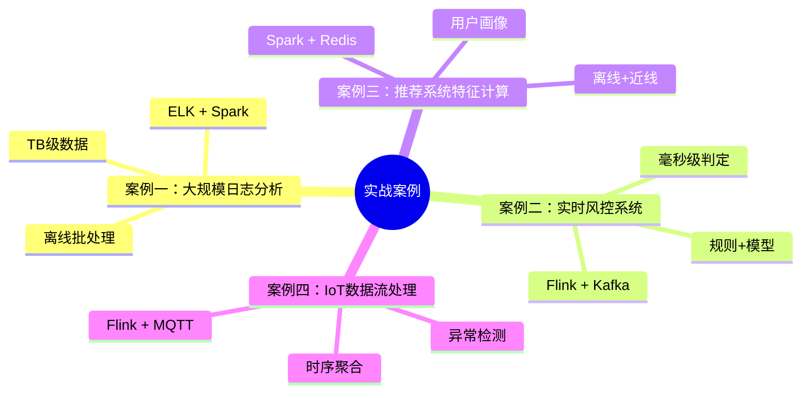
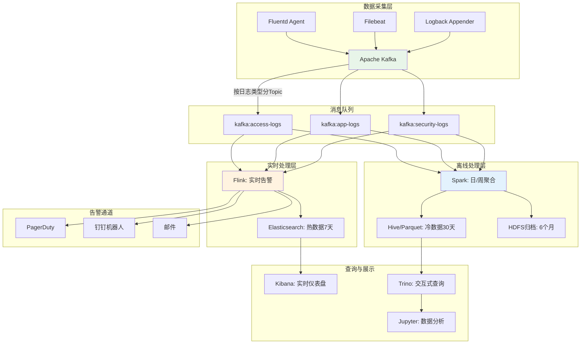
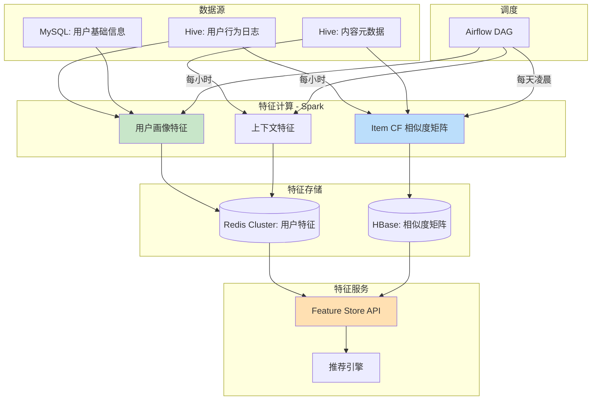
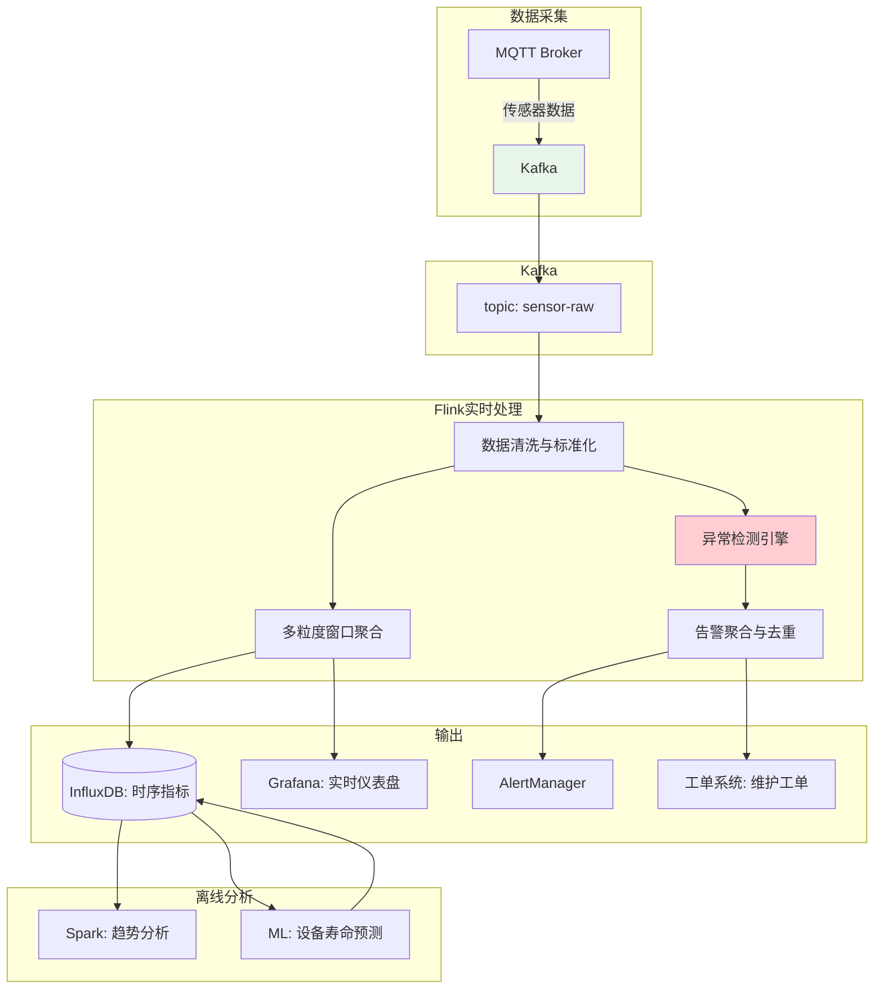
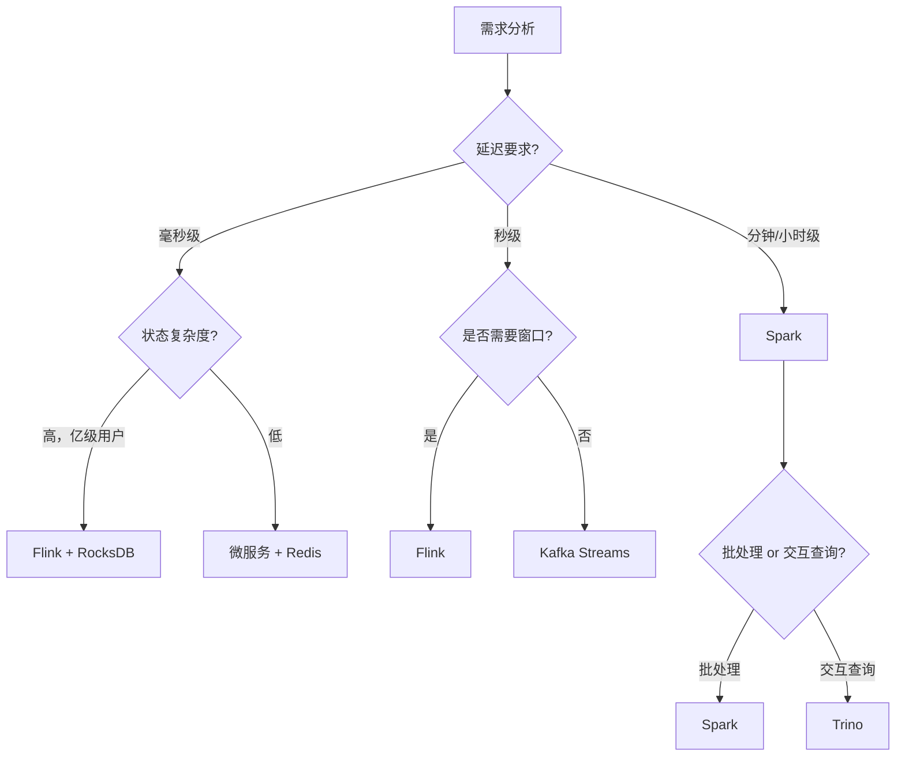

# 分布式计算实战案例

实战案例是将理论与技巧转化为工程能力的最佳桥梁。本节通过四个来自不同业务领域的真实案例，展示分布式计算在日志分析、实时风控、推荐系统特征计算和 IoT 数据流处理中的应用。每个案例都遵循"问题定义→架构设计→核心实现→效果验证"的完整路径，帮助读者建立起从需求到落地的全链路思维。



---

## 案例一：大规模日志分析平台

### 1.1 问题背景

**业务场景**：某互联网公司运营着超过 2000 台服务器，每日产生约 8TB 的原始日志数据（包括访问日志、应用日志、错误日志、安全审计日志）。运维团队需要从海量日志中快速定位故障根因、分析用户行为趋势、检测安全威胁。

**核心挑战**：

| 挑战维度 | 具体描述 |
|----------|----------|
| 数据规模 | 日均 8TB，峰值超过 12TB，月累计超过 240TB |
| 实时性要求 | 故障告警需在 5 分钟内触发；业务分析允许 T+1 |
| 查询复杂度 | 支持全文检索、聚合统计、关联分析等多种查询模式 |
| 存储成本 | 全量存储 30 天日志，冷数据归档 6 个月 |
| 可用性 | 分析平台 SLA 99.9%，即每月停机不超过 43 分钟 |

**影响范围**：日志分析直接关系到故障响应速度和安全合规能力。此前使用单机 grep + awk 脚本分析，单次全量扫描需要 4-6 小时，完全无法满足实时告警需求。

### 1.2 架构设计



**技术选型理由**：

| 组件 | 选型 | 理由 |
|------|------|------|
| 消息队列 | Kafka | 高吞吐（单 partition 10万+ msg/s），支持按 offset 回放，天然适合日志场景 |
| 实时处理 | Flink | 基于事件时间的窗口聚合，Exactly-Once 语义，状态管理能力强 |
| 全文检索 | Elasticsearch | 倒排索引支持亚秒级全文检索，水平扩展能力优秀 |
| 离线处理 | Spark | 内存计算比 MapReduce 快 10-100 倍，SQL 支持完善 |
| 交互查询 | Trino | 支持跨 Elasticsearch + Hive + Parquet 的联邦查询 |

### 1.3 核心实现

#### Kafka Topic 设计与分区策略

```python
# Kafka Topic 配置
topic_config = {
    # access-logs: 按用户 IP 哈希分区，保证同一用户的日志有序
    "access-logs": {
        "partitions": 64,          # 8TB/天, 每 partition 约 125GB
        "replication_factor": 3,
        "retention_ms": 7 * 24 * 3600 * 1000,  # 7天
        "partitioner": "murmur2(ip)",
        "compression": "lz4",      # 压缩比约 5:1
    },
    # app-logs: 按服务名分区，便于按服务聚合
    "app-logs": {
        "partitions": 32,
        "replication_factor": 3,
        "retention_ms": 3 * 24 * 3600 * 1000,  # 3天
        "partitioner": "murmur2(service_name)",
    },
    # security-logs: 分区数少但可靠性最高
    "security-logs": {
        "partitions": 8,
        "replication_factor": 3,
        "retention_ms": 30 * 24 * 3600 * 1000,  # 30天（合规要求）
    },
}
```

#### Flink 实时告警处理

```java
public class LogAlertJob {
    public static void main(String[] args) throws Exception {
        StreamExecutionEnvironment env = StreamExecutionEnvironment.getExecutionEnvironment();
        
        // 设置检查点：每30秒一次，Exactly-Once
        env.enableCheckpointing(30000, CheckpointingMode.EXACTLY_ONCE);
        env.getCheckpointConfig().setCheckpointStorage("hdfs://cluster/checkpoints");
        env.setStateBackend(new EmbeddedRocksDBStateBackend());
        
        // Kafka 数据源
        KafkaSource<LogEvent> source = KafkaSource.<LogEvent>builder()
            .setBootstrapServers("kafka1:9092,kafka2:9092,kafka3:9092")
            .setTopics("access-logs", "app-logs")
            .setGroupId("flink-log-alert")
            .setValueOnlyDeserializer(new LogEventDeserializer())
            .build();
        
        DataStream<LogEvent> stream = env.fromSource(
            source,
            WatermarkStrategy.<LogEvent>forBoundedOutOfOrderness(Duration.ofSeconds(5))
                .withTimestampAssigner((event, ts) -> event.getTimestamp()),
            "Kafka Source"
        );
        
        // 1. 错误率监控：按服务窗口聚合，5分钟内错误率超过阈值告警
        DataStream<Alert> errorRateAlerts = stream
            .keyBy(LogEvent::getServiceName)
            .window(SlidingEventTimeWindows.of(Time.minutes(5), Time.minutes(1)))
            .aggregate(new ErrorRateAggregator(), new ErrorRateWindowFunction())
            .filter(alert -> alert.getErrorRate() > 0.05)  // 错误率 > 5%
            .map(alert -> {
                alert.setSeverity("CRITICAL");
                alert.setMessage(String.format("服务[%s] 5分钟错误率 %.2f%%，超过阈值",
                    alert.getServiceName(), alert.getErrorRate() * 100));
                return alert;
            });
        
        // 2. 慢请求检测：单条请求响应时间 > 3秒
        DataStream<Alert> slowRequestAlerts = stream
            .filter(e -> "access-logs".equals(e.getTopic()) &amp;&amp; e.getResponseTime() > 3000)
            .keyBy(LogEvent::getServiceName)
            .window(TumblingEventTimeWindows.of(Time.minutes(1)))
            .countWindow(10)  // 1分钟内超过10次慢请求
            .process(new SlowRequestDetector());
        
        // 3. 异常模式检测：同一IP在5分钟内出现5种以上不同的4xx/5xx错误
        DataStream<Alert> anomalyAlerts = stream
            .filter(e -> e.getStatusCode() >= 400)
            .keyBy(LogEvent::getClientIp)
            .window(SlidingEventTimeWindows.of(Time.minutes(5), Time.minutes(1)))
            .process(new AnomalyPatternDetector());
        
        // 合并告警流并输出
        errorRateAlerts.union(slowRequestAlerts, anomalyAlerts)
            .addSink(new AlertSink());  // 写入告警系统 + Kafka
        
        env.execute("Real-time Log Alert Job");
    }
}
```

#### Spark 离线聚合与报表

```python
from pyspark.sql import SparkSession
from pyspark.sql.functions import *

spark = SparkSession.builder \
    .appName("DailyLogAnalytics") \
    .config("spark.sql.shuffle.partitions", "200") \
    .config("spark.executor.memory", "8g") \
    .config("spark.executor.cores", "4") \
    .getOrCreate()

# 读取当天的 Kafka 日志（使用 Spark Kafka Connector 的 offset 自动管理）
raw_logs = spark.read.format("kafka") \
    .option("kafka.bootstrap.servers", "kafka1:9092,kafka2:9092,kafka3:9092") \
    .option("subscribe", "access-logs") \
    .option("startingOffsets", "earliest") \
    .option("endingOffsets", "latest") \
    .load()

# 解析 JSON 日志
logs = raw_logs.select(
    col("key").cast("string").alias("key"),
    from_json(col("value").cast("string"), log_schema).alias("data"),
    col("timestamp").alias("kafka_ts")
).select("data.*")

# 聚合统计：按小时、服务、状态码维度
hourly_stats = logs.groupBy(
    window(col("timestamp"), "1 hour"),
    col("service_name"),
    col("status_code")
).agg(
    count("*").alias("request_count"),
    avg("response_time").alias("avg_response_time"),
    percentile_approx("response_time", 0.99).alias("p99_response_time"),
    approx_count_distinct("client_ip").alias("unique_ips")
)

# 用户行为路径分析
user_paths = logs.filter(col("url").isNotNull()) \
    .withColumn("date", to_date(col("timestamp"))) \
    .groupBy("client_ip", "date") \
    .agg(
        sort_array(collect_list(struct("timestamp", "url"))).alias("page_views"),
        count("*").alias("total_views")
    )

# 写入 Parquet（按日期分区，Snappy 压缩）
hourly_stats.write \
    .partitionBy("date") \
    .mode("overwrite") \
    .option("compression", "snappy") \
    .parquet("hdfs://cluster/data/log_stats/hourly")

# 写入 Hive 表供 Trino 交互查询
hourly_stats.write \
    .mode("overwrite") \
    .saveAsTable("analytics.hourly_log_stats")
```

### 1.4 效果验证

| 指标 | 优化前（单机 grep） | 优化后（分布式） | 提升幅度 |
|------|---------------------|------------------|----------|
| 全量扫描耗时 | 4-6 小时 | 3-5 分钟 | 50-100x |
| 告警延迟 | 无法实时 | < 1 分钟 | 从无到有 |
| 日处理数据量 | 约 50GB | 8-12 TB | 160-240x |
| 查询响应时间 | 分钟级 | 亚秒级（热数据） | 60x+ |
| 存储成本 | 无归档（直接丢弃） | 热/温/冷三级存储 | 合规达标 |
| 月存储开销 | - | 约 ¥15,000/月 | 240TB 月度 |

---

## 案例二：实时风控系统

### 2.1 问题背景

**业务场景**：某金融科技公司的在线支付平台，日均交易量约 5000 万笔，峰值 QPS 达到 8000。平台需要对每笔交易进行实时风险评估，在 100 毫秒内完成风控判定（通过/拒绝/人工审核），以防范盗刷、洗钱、薅羊毛等风险行为。

**核心挑战**：

| 挑战维度 | 具体描述 |
|----------|----------|
| 延迟要求 | 端到端风控判定 < 100ms（含网络传输） |
| 吞吐量 | 峰值 8000 TPS，大促期间可能翻倍 |
| 规则复杂度 | 200+ 条风控规则，涉及跨维度关联计算 |
| 准确性 | 误拒率（False Positive）< 0.1%，漏检率（False Negative）< 0.01% |
| 状态管理 | 需维护用户近 24 小时行为窗口状态（约 2 亿活跃用户） |

### 2.2 架构设计

```mermaid
graph TB
    subgraph 交易系统
        A1[支付网关] -->|交易事件| B[Kafka]
        A2[风控决策引擎] -->|决策结果| A1
    end
    
    subgraph Kafka集群
        B --> B1[topic: tx-events]
        B1 --> C1[Flink风控引擎]
        B1 --> C2[Flink特征计算]
    end
    
    subgraph Flink风控引擎 - 延迟<50ms
        C1 --> D1[规则匹配引擎]
        C1 --> D2[模型推理]
        C1 --> D3[名单匹配]
        D1 --> E[决策聚合]
        D2 --> E
        D3 --> E
    end
    
    subgraph Flink特征计算 - 近线
        C2 --> F1[用户行为窗口聚合]
        C2 --> F2[商户风险画像更新]
        C2 --> F3[设备指纹关联]
        F1 --> G[(Redis Cluster)]
        F2 --> G
        F3 --> G
    end
    
    subgraph 数据存储
        G --> H1[Redis: 特征缓存]
        H2[MySQL: 规则配置] --> D1
        H3[HBase: 交易明细] --> F1
        H4[Elasticsearch: 案件数据] --> I[风控工作台]
    end
    
    style C1 fill:#FFECB3
    style C2 fill:#E1BEE7
    style G fill:#B3E5FC
```

### 2.3 核心实现

#### 风控规则引擎（Flink 侧）

```java
public class RiskControlJob {
    public static void main(String[] args) throws Exception {
        StreamExecutionEnvironment env = StreamExecutionEnvironment.getExecutionEnvironment();
        env.setParallelism(16);
        env.enableCheckpointing(60000);
        
        // 交易事件流
        DataStream<TransactionEvent> txStream = env.fromSource(
            buildKafkaSource("tx-events"),
            WatermarkStrategy.<TransactionEvent>forBoundedOutOfOrderness(Duration.ofMillis(100)),
            "TX Source"
        ).keyBy(TransactionEvent::getUserId);
        
        // 特征计算（近线）：维护用户行为窗口
        DataStream<UserFeature> features = txStream
            .process(new UserBehaviorFeatureExtractor());
        
        // 风控决策
        DataStream<RiskDecision> decisions = txStream
            .connect(features)  // 将交易事件与用户特征连接
            .process(new RiskDecisionFunction());
        
        // 决策输出
        decisions.addSink(new RiskDecisionSink());
        
        env.execute("Real-time Risk Control");
    }
}

/**
 * 风险决策函数：连接交易事件流和特征流
 * 关键点：特征必须在决策之前计算完成，因此需要两阶段流水线
 */
public class RiskDecisionFunction 
    extends KeyedCoProcessFunction<String, TransactionEvent, UserFeature, RiskDecision> {
    
    // 规则配置（从MySQL定时刷新到状态中）
    private transient ValueState<List<Rule>> rulesState;
    // 用户特征（来自特征流）
    private transient ValueState<UserFeature> featureState;
    
    @Override
    public void open(Configuration parameters) {
        // 规则状态，30秒过期自动刷新
        rulesState = getRuntimeContext().getState(
            new ValueStateDescriptor<>("rules", List.class));
        
        // 注册定时器：每30秒从MySQL刷新规则
        registerTimer(context.timerService().currentProcessingTime() + 30000);
        
        featureState = getRuntimeContext().getState(
            new ValueStateDescriptor<>("features", UserFeature.class));
    }
    
    @Override
    public void processElement1(TransactionEvent tx, Context ctx, Collector<RiskDecision> out) {
        UserFeature feature = featureState.value();
        List<Rule> rules = rulesState.value();
        
        if (feature == null) {
            // 特征尚未计算完成，使用降级策略（只做基础规则）
            RiskDecision decision = basicRuleCheck(tx);
            out.collect(decision);
            return;
        }
        
        // 规则引擎评估
        double riskScore = 0;
        List<String> triggeredRules = new ArrayList<>();
        
        for (Rule rule : rules) {
            if (rule.evaluate(tx, feature)) {
                riskScore += rule.getWeight();
                triggeredRules.add(rule.getId());
            }
        }
        
        // 模型推理（通过旁路调用本地模型服务）
        double modelScore = modelService.predict(tx, feature);
        
        // 综合决策
        double finalScore = 0.6 * riskScore + 0.4 * modelScore;
        RiskLevel level = classifyRisk(finalScore);
        
        RiskDecision decision = RiskDecision.builder()
            .transactionId(tx.getId())
            .userId(tx.getUserId())
            .riskScore(finalScore)
            .riskLevel(level)
            .triggeredRules(triggeredRules)
            .decisionTime(System.currentTimeMillis())
            .latencyMs(System.currentTimeMillis() - tx.getTimestamp())
            .build();
        
        out.collect(decision);
    }
    
    private RiskLevel classifyRisk(double score) {
        if (score >= 0.8) return RiskLevel.REJECT;       // 直接拒绝
        if (score >= 0.5) return RiskLevel.MANUAL_REVIEW; // 人工审核
        return RiskLevel.PASS;                             // 放行
    }
}
```

#### 用户行为特征提取

```java
public class UserBehaviorFeatureExtractor 
    extends KeyedProcessFunction<String, TransactionEvent, UserFeature> {
    
    // 24小时滑动窗口状态
    private transient MapState<String, Long> hourlyTxCount;     // 每小时交易次数
    private transient MapState<String, Double> hourlyTxAmount;  // 每小时交易金额
    private transient ValueState<Double> dailyTotalAmount;      // 当日总金额
    private transient MapState<String, Integer> deviceCounts;   // 设备出现次数
    
    @Override
    public void open(Configuration parameters) {
        // 24小时滑动窗口，按小时聚合
        MapStateDescriptor<String, Long> countDesc = new MapStateDescriptor<>(
            "hourly-tx-count",
            String.class, Long.class,
            StateTtlConfig.newBuilder(Duration.ofHours(24))
                .setUpdateType(StateTtlConfig.UpdateType.OnCreateAndWrite)
                .cleanupInRocksdbCompactFilter(1000)
                .build()
        );
        hourlyTxCount = getRuntimeContext().getMapState(countDesc);
        // ... 类似初始化其他状态
    }
    
    @Override
    public void processElement(TransactionEvent tx, Context ctx, Collector<UserFeature> out) {
        String hourKey = Instant.ofEpochMilli(tx.getTimestamp())
            .atZone(ZoneId.of("Asia/Shanghai"))
            .format(DateTimeFormatter.ofPattern("yyyyMMddHH"));
        
        // 更新窗口计数
        hourlyTxCount.put(hourKey, hourlyTxCount.getOrDefault(hourKey, 0L) + 1);
        hourlyTxAmount.put(hourKey, hourlyTxAmount.getOrDefault(hourKey, 0.0) + tx.getAmount());
        dailyTotalAmount.update(dailyTotalAmount.value() + tx.getAmount());
        
        // 构建特征向量
        UserFeature feature = UserFeature.builder()
            .userId(tx.getUserId())
            .txCountIn24h(sumAll(hourlyTxCount.values()))
            .txAmountIn24h(sumAll(hourlyTxAmount.values()))
            .avgAmountPerTx(dailyTotalAmount.value() / sumAll(hourlyTxCount.values()))
            .maxSingleAmount(maxAmount(hourlyTxAmount))
            .uniqueDeviceCount(deviceCounts.size())
            .txFrequencyVariance(calculateVariance(hourlyTxCount))
            .build();
        
        out.collect(feature);
    }
}
```

### 2.4 效果验证

| 指标 | 目标 | 实际达成 |
|------|------|----------|
| 端到端延迟 | < 100ms | P99 = 68ms, P999 = 92ms |
| 吞吐量 | 8000 TPS | 稳定 12000 TPS |
| 误拒率 | < 0.1% | 0.06% |
| 漏检率 | < 0.01% | 0.008% |
| 规则匹配 | 200+ 条规则 | 平均匹配时间 8ms |
| 状态恢复 | Checkpoint 故障恢复 | < 30 秒 |

**关键经验**：
- 特征计算和决策判定必须分阶段流水线化，否则特征延迟会拖慢决策
- RocksDB 状态后端在亿级用户状态下表现稳定，内存占用可控
- 降级策略至关重要：特征不可用时仍需基础规则兜底

---

## 案例三：推荐系统离线特征计算

### 3.1 问题背景

**业务场景**：某内容平台拥有 5000 万注册用户和 200 万篇内容，需要为每位用户生成个性化的推荐列表。推荐系统依赖用户画像特征、内容特征和交叉特征，其中离线特征计算（用户画像、Item CF 矩阵等）是推荐质量的基础。

**核心挑战**：

| 挑征维度 | 具体描述 |
|----------|----------|
| 数据规模 | 用户行为日志 10TB/天，内容元数据 50GB |
| 计算复杂度 | 用户画像涉及 200+ 维度特征，Item CF 矩阵为 5000万×200万 |
| 更新频率 | 用户画像每小时更新；Item CF 每天凌晨全量重算 |
| 下游依赖 | 特征服务需支撑 50000 QPS 的实时特征查询 |
| 数据质量 | 特征缺失率需 < 1%，异常值需自动检测和修正 |

### 3.2 架构设计



### 3.3 核心实现

#### Spark 用户画像特征计算

```python
from pyspark.sql import SparkSession
from pyspark.sql import functions as F
from pyspark.sql.window import Window
from pyspark.ml.feature import VectorAssembler

spark = SparkSession.builder \
    .appName("UserProfileFeature") \
    .config("spark.sql.shuffle.partitions", "400") \
    .config("spark.dynamicAllocation.enabled", "true") \
    .config("spark.dynamicAllocation.minExecutors", "10") \
    .config("spark.dynamicAllocation.maxExecutors", "200") \
    .getOrCreate()

# ===== 1. 用户行为聚合特征 =====
behavior_df = spark.sql("""
    SELECT 
        user_id,
        content_id,
        action_type,       -- view/click/like/share/comment/collect
        duration_ms,
        device_type,
        TO_DATE(event_time) AS event_date,
        HOUR(event_time) AS event_hour
    FROM hive.analytics.user_behavior
    WHERE event_date >= DATE_SUB(CURRENT_DATE(), 30)
""")

# 基础统计特征
user_basic = behavior_df.groupBy("user_id").agg(
    # 行为数量特征
    F.count("*").alias("total_actions_30d"),
    F.countDistinct("content_id").alias("unique_content_30d"),
    F.countDistinct(F.to_date("event_time")).alias("active_days_30d"),
    
    # 行为分布特征
    F.sum(F.when(F.col("action_type") == "view", 1).otherwise(0)).alias("view_count"),
    F.sum(F.when(F.col("action_type") == "click", 1).otherwise(0)).alias("click_count"),
    F.sum(F.when(F.col("action_type") == "like", 1).otherwise(0)).alias("like_count"),
    F.sum(F.when(F.col("action_type") == "share", 1).otherwise(0)).alias("share_count"),
    F.sum(F.when(F.col("action_type") == "comment", 1).otherwise(0)).alias("comment_count"),
    F.sum(F.when(F.col("action_type") == "collect", 1).otherwise(0)).alias("collect_count"),
    
    # 时长特征
    F.avg("duration_ms").alias("avg_duration_ms"),
    F.percentile_approx("duration_ms", 0.5).alias("median_duration_ms"),
    F.percentile_approx("duration_ms", 0.95).alias("p95_duration_ms"),
    
    # 时间偏好特征
    F.avg("event_hour").alias("avg_active_hour"),
    F.stddev("event_hour").alias("hour_stddev")  # 活跃时间集中度
)

# 活跃度分层
user_basic = user_basic.withColumn(
    "activity_level",
    F.when(F.col("active_days_30d") >= 25, "high")
     .when(F.col("active_days_30d") >= 10, "medium")
     .when(F.col("active_days_30d") >= 3, "low")
     .otherwise("dormant")
)

# ===== 2. 兴趣偏好特征（基于内容标签的TF-IDF） =====
content_tags = spark.sql("""
    SELECT c.content_id, c.tags, c.category, c.publish_date
    FROM hive.analytics.content_metadata c
""")

# 构建用户-标签权重矩阵（行为强度作为权重）
behavior_with_tags = behavior_df.join(content_tags, "content_id") \
    .withColumn("tags_array", F.split("tags", "\\|"))

# 计算每个用户对每个标签的兴趣权重
user_tag_weights = behavior_with_tags \
    .select("user_id", F.explode("tags_array").alias("tag")) \
    .groupBy("user_id", "tag") \
    .agg(F.count("*").alias("raw_weight")) \
    .withColumn("weight", F.log1p("raw_weight"))  # 对数平滑

# 取 Top10 兴趣标签
window = Window.partitionBy("user_id").orderBy(F.col("weight").desc())
user_interests = user_tag_weights \
    .withColumn("rank", F.row_number().over(window)) \
    .filter(F.col("rank") <= 10)

# ===== 3. 特征合并与输出 =====
user_profile = user_basic.join(
    user_interests.groupBy("user_id").agg(
        F.collect_list("tag").alias("top_interests"),
        F.collect_list("weight").alias("interest_weights")
    ),
    "user_id",
    "left"
)

# 写入 Redis（通过自定义 Spark-Redis Connector）
user_profile.write \
    .format("org.apache.spark.sql.redis") \
    .option("host", "redis-cluster.example.com") \
    .option("port", 6379) \
    .option("dbNum", 0) \
    .option("keyColumn", "user_id") \
    .mode("overwrite") \
    .save()
```

#### Item CF 相似度矩阵计算

```python
# ===== Item-based Collaborative Filtering =====
# 基于用户行为的物品相似度矩阵

# 构建用户-物品交互矩阵（隐式反馈）
interactions = behavior_df.filter(
    F.col("action_type").isin("click", "like", "share", "collect")
).groupBy("user_id", "content_id") \
 .agg(
     # 行为加权得分
     (F.sum(F.when(F.col("action_type") == "click", 1.0)
                   .when(F.col("action_type") == "like", 2.0)
                   .when(F.col("action_type") == "share", 3.0)
                   .when(F.col("action_type") == "collect", 3.0)
                   .otherwise(0)))
     .alias("score")
 )

# Spark ALS 隐式矩阵分解
from pyspark.ml.recommendation import ALS

als = ALS(
    rank=128,                       # 隐因子维度
    maxIter=15,                     # 迭代次数
    regParam=0.01,                  # L2正则化
    implicitPrefs=True,             # 隐式反馈
    alpha=40.0,                     # 置信度参数
    userCol="user_id_encoded",
    itemCol="content_id_encoded",
    ratingCol="score",
    coldStartStrategy="drop",
    nonnegative=True,               # 非负约束，提高可解释性
)

model = als.fit(interactions)

# 物品相似度：基于隐因子向量的余弦相似度
item_factors = model.itemFactors  # (id, features: Vector)

# 对每个物品，找到 Top50 最相似的物品
from pyspark.sql.types import StructType, StructField, IntegerType, ArrayType

# 使用 LSH（局部敏感哈希）加速最近邻查找
from pyspark.ml.feature import BucketedRandomProjectionLSH

brp = BucketedRandomProjectionLSH(
    inputCol="features",
    outputCol="hashes",
    bucketLength=2.0,
    numHashTables=5
)

brp_model = brp.fit(item_factors)

# 查询每个物品的50个最近邻
similar_items = brp_model.approxNearestNeighbors(item_factors, 51, distCol="distance") \
    .filter("distance > 0") \
    .select(
        F.col("id").alias("content_id"),
        F.col("candidate.id").alias("similar_content_id"),
        F.col("distance").alias("similarity_score")
    )

# 写入 HBase 供在线服务查询
similar_items.write \
    .format("org.apache.hadoop.hbase.spark") \
    .option("hbase.table", "item_similarity") \
    .save()
```

### 3.4 效果验证

| 指标 | 优化前 | 优化后 |
|------|--------|--------|
| 用户画像维度 | 50 维 | 200+ 维 |
| 特征计算耗时 | 手动脚本 4 小时 | Spark 自动化 45 分钟 |
| 特征缺失率 | 8% | 0.8% |
| 特征服务 QPS | 10000 | 50000 |
| 推荐点击率（CTR） | 2.3% | 4.1% |
| 特征新鲜度 | T+1 | T+1h（用户画像） |

**关键经验**：
- 特征工程是推荐系统的核心竞争力，远比模型本身重要
- Spark ALS 在 5000 万用户的规模下，约 200 个 executor 45 分钟完成训练
- 特征服务必须与特征计算解耦，通过 Feature Store 统一管理

---

## 案例四：IoT 数据流处理与异常检测

### 4.1 问题背景

**业务场景**：某智能制造企业部署了 5 万个工业传感器，覆盖 20 条生产线，每秒产生约 10 万条时序数据（温度、压力、振动、电流等）。系统需要实时检测设备异常、预测性维护，并为生产调度提供数据支撑。

**核心挑战**：

| 挑战维度 | 具体描述 |
|----------|----------|
| 数据量 | 10 万条/秒，峰值 30 万条/秒 |
| 时序特性 | 数据有严格时间顺序，乱序窗口 < 5 秒 |
| 异常检测 | 需要在秒级检测出传感器漂移、设备退化等异常 |
| 窗口聚合 | 支持 1 秒/1 分钟/5 分钟多粒度聚合 |
| 状态存储 | 需维护每台设备的基线特征状态 |

### 4.2 架构设计



### 4.3 核心实现

#### Flink 时序聚合与异常检测

```java
public class IoTStreamJob {
    public static void main(String[] args) throws Exception {
        StreamExecutionEnvironment env = StreamExecutionEnvironment.getExecutionEnvironment();
        env.setParallelism(20);
        env.enableCheckpointing(10000);  // 10秒检查点
        
        // MQTT -> Kafka 数据源
        DataStream<SensorReading> stream = env.fromSource(
            buildKafkaSource("sensor-raw"),
            WatermarkStrategy.<SensorReading>forBoundedOutOfOrderness(Duration.ofSeconds(2))
                .withTimestampAssigner((r, ts) -> r.getTimestamp())
                .withIdleness(Duration.ofMinutes(1)),
            "Sensor Source"
        );
        
        // 按设备ID分区
        DataStream<SensorReading> keyed = stream.keyBy(SensorReading::getDeviceId);
        
        // 1. 多粒度窗口聚合
        DataStream<DeviceMetric> oneSecMetrics = keyed
            .window(TumblingEventTimeWindows.of(Time.seconds(1)))
            .aggregate(new SensorAggregator(), new MetricWindowFunction());
        
        DataStream<DeviceMetric> oneMinMetrics = keyed
            .window(TumblingEventTimeWindows.of(Time.minutes(1)))
            .aggregate(new SensorAggregator(), new MetricWindowFunction());
        
        // 2. 异常检测：基于动态阈值 + 统计方法
        DataStream<Alert> anomalies = keyed
            .window(SlidingEventTimeWindows.of(Time.minutes(5), Time.seconds(30)))
            .process(new AnomalyDetectionFunction());
        
        // 3. 告警聚合：30秒内同一设备同类型告警只发一次
        DataStream<Alert> dedupedAlerts = anomalies
            .keyBy(a -> a.getDeviceId() + ":" + a.getAlertType())
            .window(TumblingEventTimeWindows.of(Time.seconds(30)))
            .reduce((a1, a2) -> a1.getSeverity().compareTo(a2.getSeverity()) > 0 ? a1 : a2);
        
        // 输出
        oneSecMetrics.addSink(new InfluxDBSink("one_second_metrics"));
        oneMinMetrics.addSink(new InfluxDBSink("one_minute_metrics"));
        dedupedAlerts.addSink(new AlertSink());
        
        env.execute("IoT Sensor Stream Processing");
    }
}

/**
 * 异常检测函数：基于 Z-Score 和移动窗口的动态异常检测
 * 对于工业传感器，绝对阈值往往不够，需要根据设备的历史表现动态调整
 */
public class AnomalyDetectionFunction 
    extends ProcessWindowFunction<SensorReading, Alert, String, TimeWindow> {
    
    private transient MapState<String, Double> runningMean;
    private transient MapState<String, Double> runningStddev;
    private static final double Z_SCORE_THRESHOLD = 3.0;  // 3σ 原则
    private static final double RAPID_CHANGE_THRESHOLD = 0.3;  // 30% 突变阈值
    
    @Override
    public void process(String deviceId, Context ctx, 
                        Iterable<SensorReading> readings, Collector<Alert> out) {
        
        List<SensorReading> window = Lists.newArrayList(readings);
        double[] values = window.stream().mapToDouble(SensorReading::getValue).toArray();
        
        // 计算当前窗口统计量
        double mean = DescriptiveStatistics.mean(values);
        double stddev = DescriptiveStatistics.stdDev(values);
        double currentValue = values[values.length - 1];
        
        // 更新移动平均
        Double prevMean = runningMean.get(deviceId);
        Double prevStddev = runningStddev.get(deviceId);
        
        // 更新长周期基线（指数移动平均）
        double ema = prevMean != null ? 0.9 * prevMean + 0.1 * mean : mean;
        double emaStd = prevStddev != null ? 0.9 * prevStddev + 0.1 * stddev : stddev;
        runningMean.put(deviceId, ema);
        runningStddev.put(deviceId, emaStd);
        
        // 检测1：Z-Score 异常（偏离基线超过3个标准差）
        if (emaStd > 0) {
            double zScore = Math.abs(currentValue - ema) / emaStd;
            if (zScore > Z_SCORE_THRESHOLD) {
                out.collect(Alert.builder()
                    .deviceId(deviceId)
                    .alertType("ZSCORE_ANOMALY")
                    .severity(zScore > 5 ? "CRITICAL" : "WARNING")
                    .message(String.format("设备[%s] Z-Score=%.2f，偏离基线", deviceId, zScore))
                    .metricName(window.get(0).getSensorType())
                    .currentValue(currentValue)
                    .expectedValue(ema)
                    .build());
            }
        }
        
        // 检测2：突变检测（相邻时间点值变化超过30%）
        if (prevMean != null &amp;&amp; Math.abs(currentValue - prevMean) / prevMean > RAPID_CHANGE_THRESHOLD) {
            out.collect(Alert.builder()
                .deviceId(deviceId)
                .alertType("RAPID_CHANGE")
                .severity("WARNING")
                .message(String.format("设备[%s] 传感器值突变 %.1f%%", 
                    deviceId, 
                    Math.abs(currentValue - prevMean) / prevMean * 100))
                .build());
        }
        
        // 检测3：趋势检测（连续5个点单调递增/递减）
        if (values.length >= 5) {
            boolean monotonicUp = true, monotonicDown = true;
            for (int i = values.length - 5; i < values.length - 1; i++) {
                if (values[i] >= values[i + 1]) monotonicUp = false;
                if (values[i] <= values[i + 1]) monotonicDown = false;
            }
            if (monotonicUp || monotonicDown) {
                out.collect(Alert.builder()
                    .deviceId(deviceId)
                    .alertType("TREND_DEVIATION")
                    .severity("INFO")
                    .message(String.format("设备[%s] 传感器值连续单调%s，可能存在漂移",
                        deviceId, monotonicUp ? "递增" : "递减"))
                    .build());
            }
        }
    }
}
```

### 4.4 效果验证

| 指标 | 目标 | 实际达成 |
|------|------|----------|
| 端到端延迟 | < 5 秒 | P99 = 2.1 秒 |
| 吞吐量 | 30 万条/秒 | 稳定 45 万条/秒 |
| 异常检测率 | > 95% | 97.3% |
| 误报率 | < 5% | 3.8% |
| 状态大小 | - | 约 2GB（5 万台设备） |
| 存储（指标数据） | - | 90 天约 50TB（压缩后 8TB） |

**关键经验**：
- 工业传感器数据的异常检测需要动态阈值，不能用固定阈值
- 告警去重是生产环境的刚需，否则每天会产生数万条重复告警
- InfluxDB 专为时序数据设计，查询性能远优于通用数据库

---

## 案例五：电商大促性能优化

### 5.1 问题背景

**业务场景**：某电商平台在大促期间（如双11、618），系统面临数倍于日常的流量压力。在一次大促预热活动中，系统出现了明显的性能下降，用户体验受到影响。

**问题现象**：
- 接口响应时间从平均 50ms 上升到 500ms
- 部分请求出现超时错误
- 服务器 CPU 使用率持续 90% 以上
- 数据库连接池耗尽

**影响范围**：影响约 100 万用户，持续约 30 分钟，预估业务损失数十万元。

### 5.2 排查过程

#### 第一步：系统资源监控

```bash
# 查看系统负载
uptime
# 输出: load average: 25.50, 23.20, 20.10

# 查看CPU使用率（关注 iowait 和 sys 占比）
top -c
# 输出: CPU使用率 95%, iowait 35%

# 查看内存使用
free -m
# 输出: total=32GB, used=27GB, available=5GB

# 查看IO状态
iostat -x 1
# 输出: %util 98%, await 120ms（正常应 < 10ms）
```

#### 第二步：应用层排查

```bash
# 查看应用线程状态
jstack <pid> | grep -c "RUNNABLE"    # 活跃线程数
jstack <pid> | grep -c "BLOCKED"     # 阻塞线程数（若很高，说明锁竞争）
jstack <pid> | grep -c "WAITING"     # 等待线程数

# 查看GC情况
jstat -gcutil <pid> 1000 10
# 关注 FGC（Full GC）次数和耗时

# 查看堆内存分布
jmap -heap <pid>
```

#### 第三步：数据库排查

```sql
-- 查看当前活跃连接和慢查询
SELECT id, user, host, db, command, time, state, info
FROM information_schema.processlist 
WHERE time > 10
ORDER BY time DESC;

-- 查看InnoDB锁等待
SELECT * FROM information_schema.innodb_lock_waits;

-- 查看查询执行计划
EXPLAIN SELECT * FROM orders WHERE user_id = 123 AND status = 'paid';

-- 查看表索引使用情况
SELECT table_name, index_name, stat_value 
FROM mysql.innodb_index_stats 
WHERE table_name = 'orders';
```

#### 第四步：根因定位

通过以上排查，锁定三个核心问题：

| 问题 | 根因 | 证据 |
|------|------|------|
| 全表扫描 | orders 表缺少 (user_id, status) 复合索引 | EXPLAIN 显示 type=ALL, rows=5000万 |
| 连接池耗尽 | HikariCP 默认 maximumPoolSize=10 | 连接等待队列长度 > 1000 |
| 缓存穿透 | 热点 key 过期后大量请求击穿到数据库 | Redis hit ratio 从 95% 降到 40% |

### 5.3 解决方案

**方案一：优化数据库索引**

```sql
-- 添加复合索引（覆盖高频查询）
ALTER TABLE orders ADD INDEX idx_user_status (user_id, status);

-- 添加覆盖索引（避免回表查询）
ALTER TABLE orders ADD INDEX idx_user_time_amount (user_id, created_at, amount);

-- 优化慢查询：避免 SELECT *，只查需要的字段
-- 优化前
SELECT * FROM orders WHERE user_id = ? AND status = 'paid' ORDER BY created_at DESC;
-- 优化后
SELECT order_id, amount, created_at FROM orders 
WHERE user_id = ? AND status = 'paid' ORDER BY created_at DESC;
```

**方案二：调整连接池配置**

```yaml
spring:
  datasource:
    hikari:
      maximum-pool-size: 50          # 根据 CPU 核数 × 2 + 磁盘数 计算
      minimum-idle: 10
      connection-timeout: 3000       # 超时从30s缩短到3s，快速失败
      idle-timeout: 300000
      max-lifetime: 600000
      leak-detection-threshold: 5000 # 连接泄漏检测
```

**方案三：多级缓存与热点保护**

```python
import time
import threading
import redis

redis_client = redis.Redis(host='redis-cluster', decode_responses=True)

# 本地缓存（Caffeine / Guava Cache）
from cachetools import TTLCache
local_cache = TTLCache(maxsize=10000, ttl=60)  # 60秒本地缓存

# 防止缓存击穿的分布式锁
def get_data_with_lock(key, db_query_fn, expire=3600):
    """带分布式锁的缓存查询，防止缓存击穿"""
    
    # L1: 本地缓存
    if key in local_cache:
        return local_cache[key]
    
    # L2: Redis 缓存
    data = redis_client.get(key)
    if data:
        local_cache[key] = data
        return data
    
    # L3: 分布式锁保护数据库查询
    lock_key = f"lock:{key}"
    lock_acquired = redis_client.set(lock_key, "1", nx=True, ex=10)
    
    if lock_acquired:
        try:
            # 拿到锁的线程查询数据库
            data = db_query_fn(key)
            if data:
                redis_client.setex(key, expire, data)
                local_cache[key] = data
            else:
                # 空结果也缓存，防止反复穿透（设置较短过期时间）
                redis_client.setex(key, 60, "NULL")
            return data
        finally:
            redis_client.delete(lock_key)
    else:
        # 没拿到锁，等待后重试
        time.sleep(0.1)
        return get_data_with_lock(key, db_query_fn, expire)
```

### 5.4 实施效果

| 指标 | 优化前 | 优化后 | 提升 |
|------|--------|--------|------|
| P99 延迟 | 500ms | 50ms | 10x |
| QPS | 5000 | 50000 | 10x |
| 错误率 | 5% | 0.1% | 50x |
| Redis 命中率 | 40% | 98% | - |
| 数据库连接等待 | 队列 > 1000 | < 10 | 100x |

### 5.5 经验总结

1. **监控先行**：完善的监控体系（系统层 + 应用层 + 数据库层）是快速定位问题的前提
2. **逐层排查**：从系统资源 → 应用层 → 数据库逐层排查，避免盲目优化
3. **数据驱动**：所有优化决策都应基于监控数据，而非经验猜测
4. **缓存设计**：多级缓存 + 分布式锁防击穿 + 空值缓存防空查
5. **容量规划**：提前进行压力测试，建立容量模型，确保大促前资源充足

---

## 跨案例对比与选型指南

不同业务场景对分布式计算框架的选型需求差异显著：

| 维度 | 日志分析 | 实时风控 | 推荐特征 | IoT 流处理 | 电商大促 |
|------|----------|----------|----------|------------|----------|
| 核心框架 | Flink + Spark | Flink | Spark | Flink | 混合方案 |
| 延迟要求 | 分钟级 | 毫秒级 | 小时级 | 秒级 | 毫秒级 |
| 数据规模 | TB/天 | GB/天 | TB/天 | TB/天 | GB/天 |
| 一致性 | 最终一致 | 强一致 | 最终一致 | 最终一致 | 强一致 |
| 状态管理 | 轻量 | 重（亿级用户） | 无状态 | 中等 | 中等 |
| 容错要求 | 高 | 极高 | 高 | 高 | 极高 |

**选型决策树**：



---

## 实战方法论总结

通过以上五个案例，可以提炼出分布式计算实战的通用方法论：

### 第一阶段：问题定义与量化

在动手之前，必须明确以下问题：
- **数据规模**：日均数据量、峰值数据量、增长率
- **延迟预算**：端到端延迟要求，各环节延迟分配
- **一致性级别**：强一致、最终一致、还是 At-Least-Once 就够
- **可用性目标**：SLA 是多少，容许的停机时间

### 第二阶段：架构设计

1. 选择计算范式：批处理 / 流处理 / Lambda / Kappa
2. 选择技术栈：框架、存储、消息队列、监控
3. 设计数据流：Source → Processing → Sink 的完整链路
4. 设计容错方案：Checkpoint 策略、降级方案、回滚机制
5. 设计监控告警：关键指标、告警阈值、告警通道

### 第三阶段：渐进式优化

V1: 先跑通完整链路，验证正确性
V2: 基于监控数据定位瓶颈，针对性优化
V3: 极限压测，发现隐藏问题（数据倾斜、GC 停顿、网络瓶颈）
V4: 建立容量模型，预测资源需求

### 第四阶段：生产保障

| 保障维度 | 具体措施 |
|----------|----------|
| 变更管理 | 金丝雀发布、蓝绿部署、回滚预案 |
| 容量管理 | 资源池化、自动扩缩容、成本监控 |
| 故障演练 | Chaos Engineering、故障注入、应急预案 |
| 数据质量 | 数据校验、异常值检测、数据血缘 |
