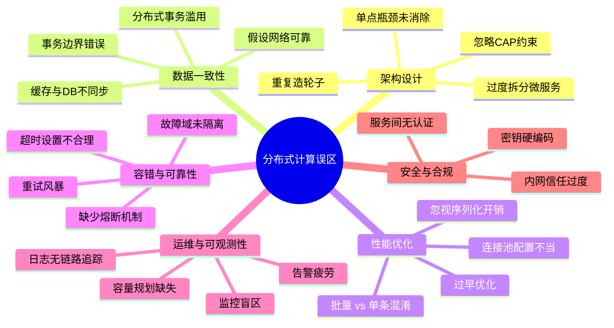
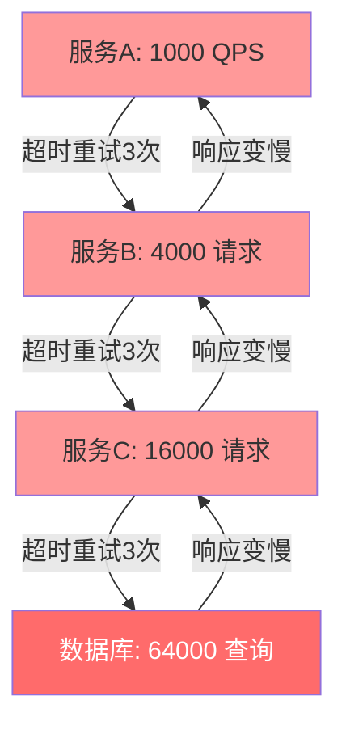
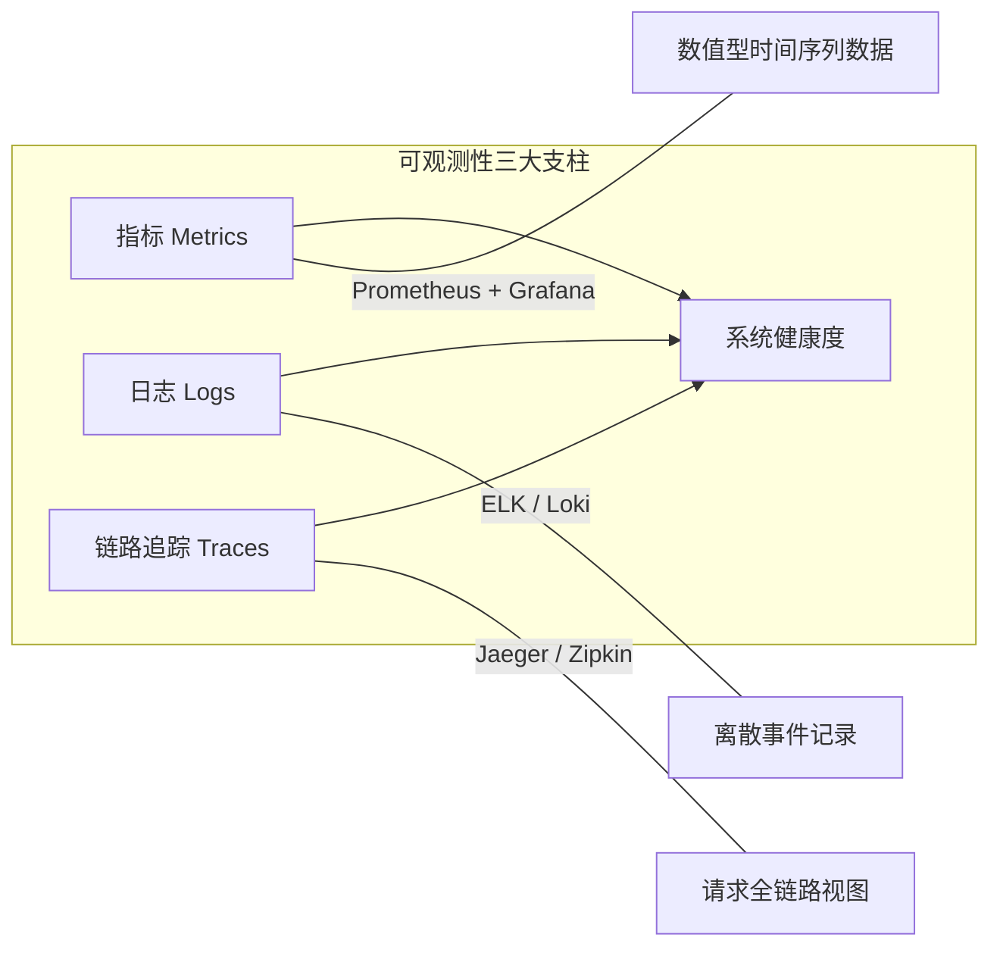

## 常见误区

分布式计算系统的复杂性远超单机应用。一个微小的设计疏忽，可能在系统规模扩大后演变为灾难性故障。本节系统梳理分布式系统设计、开发、运维中最常见的误区，分析其成因、危害，并给出经过验证的纠正方案。

### 误区全景图

在深入每个误区之前，先用一张全景图纵览分布式计算中最容易踩的坑：



---

### 误区一：假设网络是可靠的

**典型表现**：代码中直接调用远程服务，没有超时、重试、降级机制，假设每次网络调用都能成功返回。

**为什么这是一个误区**：

在分布式系统中，网络是最不可靠的组件之一。Peter Deutsch 在1994年提出的"分布式计算八大谬误"（Fallacies of Distributed Computing）中，第一条就是"The network is reliable"。根据Google的生产数据，数据中心内部网络每小时产生数千次丢包，跨机架、跨可用区的网络故障更是家常便饭。

网络故障的真实形态：

| 故障类型 | 发生频率 | 典型现象 | 恢复时间 |
|----------|----------|----------|----------|
| 瞬时丢包 | 极高（每分钟数次） | 请求偶发超时 | 毫秒级 |
| TCP重传 | 高 | 延迟突增 | 数十毫秒 |
| 连接重置 | 中等 | RST错误 | 秒级 |
| 网络分区 | 低 | 节点间完全不可达 | 分钟至小时 |
| 路由黑洞 | 极低 | 请求无声丢失 | 小时级 |

**纠正方案**：

**1. 为所有远程调用设置超时**

```python
import requests
from requests.adapters import HTTPAdapter
from urllib3.util.retry import Retry

# 创建带超时和重试的Session
session = requests.Session()
adapter = HTTPAdapter(
    max_retries=Retry(
        total=3,                    # 最多重试3次
        backoff_factor=0.5,         # 退避因子：0.5s, 1s, 2s
        status_forcelist=[502, 503, 504],  # 仅对这些状态码重试
        allowed_methods=["GET"],     # 仅对幂等方法重试
    )
)
session.mount("http://", adapter)
session.mount("https://", adapter)

# 所有请求必须设置超时
response = session.get(
    "http://service-b/api/data",
    timeout=(3.05, 30)  # (连接超时3.05s, 读取超时30s)
)
```

**2. 实现优雅降级**

```python
import time
import random

class RemoteServiceClient:
    def __init__(self, fallback_data=None):
        self.fallback_data = fallback_data or {}
        self.circuit_open = False
        self.failure_count = 0
        self.last_failure_time = 0

    def call(self, request_data):
        # 熔断器检查
        if self.circuit_open:
            if time.time() - self.last_failure_time > 30:
                # 半开状态：尝试一次
                self.circuit_open = False
            else:
                # 直接返回降级数据
                return self._degrade(request_data)

        try:
            result = self._do_remote_call(request_data)
            # 调用成功，重置失败计数
            self.failure_count = 0
            return result
        except Exception as e:
            self.failure_count += 1
            self.last_failure_time = time.time()
            if self.failure_count >= 5:
                self.circuit_open = True  # 触发熔断
            return self._degrade(request_data)

    def _do_remote_call(self, data):
        # 实际远程调用，含超时
        import requests
        resp = requests.post(
            "http://service-b/api",
            json=data,
            timeout=(3.05, 10)
        )
        resp.raise_for_status()
        return resp.json()

    def _degrade(self, request_data):
        # 降级逻辑：返回缓存、默认值或简化计算
        return self.fallback_data
```

**3. 使用健康检查探测真实状态**

```yaml
# Kubernetes 健康检查配置示例
apiVersion: v1
kind: Pod
spec:
  containers:
  - name: app
    livenessProbe:
      httpGet:
        path: /health/live
        port: 8080
      initialDelaySeconds: 10
      periodSeconds: 5
      failureThreshold: 3    # 连续3次失败则重启
    readinessProbe:
      httpGet:
        path: /health/ready
        port: 8080
      initialDelaySeconds: 5
      periodSeconds: 3
      failureThreshold: 2    # 2次失败即摘除流量
```

---

### 误区二：过度拆分微服务

**典型表现**：将一个运行良好的单体应用拆分成数十个微服务，每个服务只处理很小的职责，服务间通过大量RPC调用协作完成一个业务请求。

**为什么这是一个误区**：

微服务不是银弹。过度拆分会引入以下问题：

- **分布式事务**：一个用户注册操作可能需要同时写入用户服务、积分服务、通知服务，跨服务的事务一致性极难保证
- **链路延迟累加**：假设5个服务串行调用，每个服务内部处理5ms、网络传输5ms，总延迟至少 = 5 × (5+5) = 50ms，还不包括重试
- **运维复杂度指数增长**：N个服务需要管理N个代码仓库、N套CI/CD流水线、N个监控面板
- **调试困难**：一个请求经过5个服务，任何一个出问题都需要全链路排查

**纠正方案**：

**1. 用领域驱动设计（DDD）指导拆分**

拆分决策流程：

1. 识别业务领域边界
   ├── 领域A（订单管理）
   ├── 领域B（库存管理）
   └── 领域C（支付管理）

2. 评估每个领域的独立性
   ├── 领域间数据依赖程度
   ├── 领域间调用频率
   └── 领域的变更频率

3. 只有满足以下条件时才拆分：
   ├── 有独立的数据库需求
   ├── 有独立的发布节奏
   ├── 有独立的团队维护
   └── 领域边界清晰、变更不频繁跨越

**2. 先构建模块化单体，再按需拆分**

```python
# 模块化单体的目录结构
# project/
# ├── modules/
# │   ├── order/          # 订单模块（独立的路由、服务、数据层）
# │   │   ├── routes.py
# │   │   ├── service.py
# │   │   ├── repository.py
# │   │   └── models.py
# │   ├── inventory/      # 库存模块
# │   │   ├── routes.py
# │   │   ├── service.py
# │   │   ├── repository.py
# │   │   └── models.py
# │   └── payment/        # 支付模块
# │       ├── routes.py
# │       ├── service.py
# │       ├── repository.py
# │       └── models.py
# ├── shared/             # 共享代码
# │   ├── events.py
# │   └── utils.py
# └── main.py

# 模块间通过事件总线通信，而非直接调用
class OrderService:
    def __init__(self, event_bus):
        self.event_bus = event_bus

    def create_order(self, order_data):
        # 1. 本地事务：创建订单
        order = self.repository.save(order_data)

        # 2. 发布领域事件（而非直接调用库存服务）
        self.event_bus.publish("order.created", {
            "order_id": order.id,
            "items": order.items
        })

        # 3. 库存服务和支付服务各自监听事件并处理
        return order
```

**3. 服务数量的合理区间**

| 团队规模 | 建议服务数 | 说明 |
|----------|-----------|------|
| 1-3人 | 1-3个 | 模块化单体或少量服务 |
| 5-10人 | 3-8个 | 按核心领域拆分 |
| 10-30人 | 8-20个 | 按团队边界拆分 |
| 30+人 | 20-50个 | 按业务域拆分，每域独立团队 |

---

### 误区三：忽视数据一致性问题

**典型表现**：在分布式系统中直接使用单机数据库事务的思维，假设跨服务的数据操作是原子的；或者走向另一个极端——完全放弃一致性，认为"最终一致就够了"。

**为什么这是一个误区**：

分布式系统中的数据一致性是CAP定理的核心约束——你不可能同时保证一致性（Consistency）、可用性（Availability）和分区容错性（Partition Tolerance）。但在实际工程中，许多开发者要么忽略了这个约束，要么错误地评估了业务对一致性的需求。

**典型事故场景**：

场景：电商下单

时间线：
T1: 用户下单 → 订单服务创建订单（成功）
T2: 调用库存服务扣减库存（成功）
T3: 调用支付服务创建支付单（失败！网络超时）
T4: 库存已扣减，订单已创建，但支付单不存在
    → 用户看到"支付失败"
    → 但库存已经扣了
    → 订单也创建了
    → 数据不一致！

**纠正方案**：

**1. 明确业务一致性等级**

```python
# 根据业务场景选择一致性策略
CONSISTENCY_LEVELS = {
    # 金融转账：强一致（使用分布式事务或TCC）
    "payment_transfer": "strong",

    # 库存扣减：准强一致（Saga + 补偿）
    "inventory_deduction": "saga",

    # 积分发放：最终一致（异步消息）
    "points_grant": "eventual",

    # 搜索索引更新：宽松最终一致（异步 + 可容忍延迟）
    "search_index_update": "eventual_with_delay",
}
```

**2. 使用Saga模式管理跨服务事务**

```python
class OrderSaga:
    """订单Saga：协调订单创建、库存扣减、支付创建"""

    def __init__(self, order_svc, inventory_svc, payment_svc):
        self.order_svc = order_svc
        self.inventory_svc = inventory_svc
        self.payment_svc = payment_svc

    def execute(self, order_data):
        # 步骤1：创建订单
        order_id = self.order_svc.create(order_data)

        # 步骤2：扣减库存
        try:
            self.inventory_svc.deduct(order_data["items"])
        except Exception:
            # 补偿：取消订单
            self.order_svc.cancel(order_id)
            raise

        # 步骤3：创建支付单
        try:
            self.payment_svc.create_payment(order_id, order_data["amount"])
        except Exception:
            # 补偿：恢复库存 + 取消订单
            self.inventory_svc.restore(order_data["items"])
            self.order_svc.cancel(order_id)
            raise

        return order_id
```

**3. 使用消息表保证最终一致性**

```python
# Outbox模式：将领域事件写入本地消息表
class OrderRepository:
    def save_with_event(self, order, event):
        """
        在同一个数据库事务中保存订单和事件
        确保要么都成功，要么都失败
        """
        with self.db.transaction():
            # 1. 保存订单
            self.db.execute(
                "INSERT INTO orders (id, user_id, amount) VALUES (?, ?, ?)",
                (order.id, order.user_id, order.amount)
            )

            # 2. 保存事件到outbox表
            self.db.execute(
                """INSERT INTO outbox (event_type, payload, status, created_at)
                   VALUES (?, ?, 'pending', NOW())""",
                ("order.created", json.dumps(order.to_dict()))
            )

        # 3. 异步进程扫描outbox表，发送事件到消息队列
        # （由单独的worker完成，这里不直接发送）

class OutboxWorker:
    """定时扫描outbox表，发送未发送的事件"""

    def run(self):
        while True:
            events = self.db.query(
                "SELECT * FROM outbox WHERE status = 'pending' LIMIT 100"
            )
            for event in events:
                try:
                    self.mq.publish(event.event_type, event.payload)
                    self.db.execute(
                        "UPDATE outbox SET status = 'sent' WHERE id = ?",
                        (event.id,)
                    )
                except Exception:
                    # 发送失败，下次重试
                    pass
            time.sleep(1)
```

---

### 误区四：重试策略引发雪崩

**典型表现**：远程调用失败后无限制重试，或所有服务都使用相同的重试策略，没有考虑重试对下游服务造成的压力叠加。

**为什么这是一个误区**：

重试是容错的基本手段，但不加控制的重试会将瞬时故障放大为系统级雪崩。假设有1000个并发请求，每个请求在超时后重试3次，对下游服务的实际请求量将变成 1000 × 4 = 4000，这可能直接压垮已经处于临界状态的下游服务。

**重试风暴的形成过程**：



**纠正方案**：

**1. 指数退避 + 抖动**

```python
import random
import time

def exponential_backoff(attempt, base_delay=1.0, max_delay=30.0, jitter=True):
    """
    指数退避算法
    attempt: 当前重试次数（从0开始）
    base_delay: 基础延迟秒数
    max_delay: 最大延迟秒数
    jitter: 是否添加随机抖动
    """
    delay = min(base_delay * (2 ** attempt), max_delay)

    if jitter:
        # 全抖动：[0, delay] 范围内的随机值
        delay = random.uniform(0, delay)

    return delay

# 使用示例
for attempt in range(5):
    try:
        result = call_remote_service()
        break
    except Exception as e:
        if attempt == 4:
            # 最后一次重试失败，执行降级
            result = fallback()
            break
        delay = exponential_backoff(attempt)
        print(f"第{attempt+1}次重试失败，等待{delay:.2f}s后重试...")
        time.sleep(delay)
```

**2. 重试预算（Retry Budget）**

```python
class RetryBudget:
    """
    重试预算：限制重试请求占总请求的比例
    防止重试风暴
    """

    def __init__(self, max_retry_ratio=0.1, window_seconds=10):
        self.max_retry_ratio = max_retry_ratio
        self.window_seconds = window_seconds
        self.total_requests = 0
        self.total_retries = 0
        self.window_start = time.time()

    def can_retry(self):
        """检查是否还有重试额度"""
        self._maybe_reset_window()

        if self.total_requests == 0:
            return True

        current_ratio = self.total_retries / self.total_requests
        return current_ratio < self.max_retry_ratio

    def record_request(self, is_retry=False):
        self._maybe_reset_window()
        self.total_requests += 1
        if is_retry:
            self.total_retries += 1

    def _maybe_reset_window(self):
        now = time.time()
        if now - self.window_start > self.window_seconds:
            self.total_requests = 0
            self.total_retries = 0
            self.window_start = now
```

**3. 区分可重试与不可重试错误**

| 错误类型 | 是否重试 | 原因 |
|----------|----------|------|
| 5xx服务端错误 | 重试 | 可能是瞬时故障 |
| 408请求超时 | 重试 | 可能是网络抖动 |
| 429限流 | 重试（带退避） | 需要等待配额恢复 |
| 400参数错误 | 不重试 | 客户端问题，重试无用 |
| 401/403认证失败 | 不重试 | 需要重新认证 |
| 404资源不存在 | 不重试 | 数据确实不存在 |

---

### 误区五：配置不当导致性能悬崖

**典型表现**：使用默认配置部署分布式系统，或者在没有基准测试的情况下随意调整参数，导致系统在负载增加时突然崩溃。

**为什么这是一个误区**：

分布式系统的配置参数相互关联，单个参数的不当设置可能在低负载时看不出问题，但在高负载时引发级联故障。例如，线程池大小设太小会导致请求排队，排队过多会占满内存，内存不足会触发GC，GC暂停会导致更多超时，超时又会触发重试——最终系统完全不可用。

**常见配置陷阱**：

| 配置项 | 过小的危害 | 过大的危害 | 合理设置方法 |
|--------|-----------|-----------|-------------|
| 线程池大小 | 请求排队、延迟增加 | 上下文切换开销、内存耗尽 | CPU密集型=CPU核数+1，IO密集型=CPU核数×2 |
| 连接池大小 | 连接等待、超时 | 服务端连接数耗尽 | 初始值=CPU核数×2，根据压测调整 |
| 超时时间 | 过早中断正常请求 | 线程被长时间占用 | 根据P99延迟的2-3倍设置 |
| 缓冲队列 | 丢弃请求 | 内存溢出 | 设置上限+有界队列 |
| 批处理大小 | 频繁IO、吞吐低 | 内存压力大、延迟增加 | 从128开始，根据吞吐和延迟权衡 |

**纠正方案**：

**1. 基于压测数据确定配置**

```bash
#!/bin/bash
# 基准测试脚本：找到最优线程池大小

for threads in 8 16 32 64 128 256; do
    echo "=== 测试线程池大小: $threads ==="
    # 使用wrk进行压测
    wrk -t4 -c100 -d30s \
        --script=scripts/post.lua \
        http://localhost:8080/api/endpoint

    # 记录关键指标
    echo "线程数: $threads" >> benchmark_results.txt
    # 从wrk输出中提取RPS和延迟
done
```

**2. 连接池的科学配置**

```yaml
# 数据库连接池配置（HikariCP）
spring:
  datasource:
    hikari:
      # 核心参数
      maximum-pool-size: 20         # 最大连接数
      minimum-idle: 5               # 最小空闲连接数
      connection-timeout: 30000     # 获取连接超时：30秒

      # 高级参数
      idle-timeout: 600000          # 空闲连接存活时间：10分钟
      max-lifetime: 1800000         # 连接最大生命周期：30分钟
      leak-detection-threshold: 60000  # 连接泄漏检测：60秒

      # 连接验证
      connection-test-query: "SELECT 1"
      validation-timeout: 5000
```

```java
// 连接池大小计算公式
// 最佳连接数 = CPU核数 × 2 + 磁盘数
//
// 验证方法：
// 1. 设置 maximum-pool-size = CPU核数 × 2
// 2. 压测观察连接池活跃连接数
// 3. 如果持续接近最大值，逐步增加
// 4. 如果有大量空闲连接，适当减少
```

**3. JVM调优关键参数**

```bash
# 生产环境JVM参数模板
java -server \
    -Xms4g -Xmx4g \                   # 堆大小固定，避免动态扩缩
    -XX:+UseG1GC \                     # 使用G1垃圾收集器
    -XX:MaxGCPauseMillis=200 \         # 目标GC停顿时间200ms
    -XX:InitiatingHeapOccupancyPercent=45 \  # 堆占用45%时触发GC
    -XX:+ParallelRefProcEnabled \      # 并行处理引用
    -XX:+HeapDumpOnOutOfMemoryError \  # OOM时自动dump
    -XX:HeapDumpPath=/var/logs/heapdump.hprof \
    -jar app.jar
```

---

### 误区六：缺乏有效的监控与可观测性

**典型表现**：系统上线后没有完善的监控体系，出了问题只能靠翻日志排查；或者监控了但告警太多，形成"告警疲劳"，真正的故障反而被淹没。

**为什么这是一个误区**：

分布式系统由多个服务协作运行，单点排查的方式在分布式环境下完全失效。一个请求可能跨越5个服务、10个节点，没有链路追踪就无法定位瓶颈在哪一环。而过度告警会让运维团队对告警产生"免疫"，真正严重的问题可能被忽略。

**可观测性三大支柱**：



**纠正方案**：

**1. 四个黄金信号监控**

根据Google SRE实践，分布式系统应重点监控四个维度：

| 信号 | 含义 | 监控工具 | 告警阈值示例 |
|------|------|----------|-------------|
| 延迟（Latency） | 请求处理时间 | Prometheus histogram | P99 > 500ms |
| 流量（Traffic） | 请求速率 | Prometheus counter | QPS突增200% |
| 错误率（Errors） | 失败请求比例 | Prometheus counter | 错误率 > 1% |
| 饱和度（Saturation） | 资源使用率 | node_exporter | CPU > 85%, 内存 > 90% |

```python
# Prometheus 指标埋点示例
from prometheus_client import Counter, Histogram, Gauge
import time

# 定义指标
REQUEST_COUNT = Counter(
    'http_requests_total',
    'Total HTTP requests',
    ['method', 'endpoint', 'status']
)

REQUEST_LATENCY = Histogram(
    'http_request_duration_seconds',
    'HTTP request latency in seconds',
    ['method', 'endpoint'],
    buckets=[0.01, 0.025, 0.05, 0.1, 0.25, 0.5, 1.0, 2.5, 5.0]
)

ACTIVE_CONNECTIONS = Gauge(
    'active_connections',
    'Number of active connections'
)

# 在请求处理中埋点
def handle_request(request):
    start_time = time.time()
    ACTIVE_CONNECTIONS.inc()

    try:
        result = process(request)
        REQUEST_COUNT.labels(
            method=request.method,
            endpoint=request.path,
            status='200'
        ).inc()
        return result
    except Exception as e:
        REQUEST_COUNT.labels(
            method=request.method,
            endpoint=request.path,
            status='500'
        ).inc()
        raise
    finally:
        elapsed = time.time() - start_time
        REQUEST_LATENCY.labels(
            method=request.method,
            endpoint=request.path
        ).observe(elapsed)
        ACTIVE_CONNECTIONS.dec()
```

**2. 分布式链路追踪**

```python
# 使用OpenTelemetry实现链路追踪
from opentelemetry import trace
from opentelemetry.sdk.trace import TracerProvider
from opentelemetry.sdk.trace.export import BatchSpanProcessor
from opentelemetry.exporter.otlp.proto.grpc.trace_exporter import OTLPSpanExporter

# 初始化追踪器
provider = TracerProvider()
processor = BatchSpanProcessor(
    OTLPSpanExporter(endpoint="http://jaeger:4317")
)
provider.add_span_processor(processor)
trace.set_tracer_provider(provider)

tracer = trace.get_tracer("order-service")

def create_order(order_data):
    with tracer.start_as_current_span("create_order") as span:
        # 添加业务属性到span
        span.set_attribute("user_id", order_data["user_id"])
        span.set_attribute("item_count", len(order_data["items"]))

        # 子span：验证库存
        with tracer.start_as_current_span("validate_inventory"):
            validate_inventory(order_data["items"])

        # 子span：计算价格
        with tracer.start_as_current_span("calculate_price"):
            total = calculate_price(order_data["items"])

        # 子span：保存订单
        with tracer.start_as_current_span("save_order"):
            order = save_to_db(order_data, total)

        span.set_attribute("order_id", order.id)
        return order
```

**3. 智能告警策略**

```yaml
# 告警规则配置示例（Prometheus AlertManager）
groups:
  - name: distributed-system
    rules:
      # 基于SLO的告警（推荐）
      - alert: HighErrorRate
        expr: |
          sum(rate(http_requests_total{status=~"5.."}[5m]))
          /
          sum(rate(http_requests_total[5m]))
          > 0.01
        for: 5m        # 持续5分钟才告警，避免抖动
        labels:
          severity: critical
        annotations:
          summary: "错误率超过1%，已持续5分钟"

      # 基于饱和度的告警
      - alert: HighMemoryUsage
        expr: |
          (node_memory_MemTotal - node_memory_MemAvailable)
          / node_memory_MemTotal > 0.90
        for: 10m
        labels:
          severity: warning
        annotations:
          summary: "内存使用率超过90%"

      # 基于延迟的告警（多窗口对比）
      - alert: LatencySpike
        expr: |
          histogram_quantile(0.99, rate(http_request_duration_seconds_bucket[5m]))
          >
          histogram_quantile(0.99, rate(http_request_duration_seconds_bucket[1h])) * 2
        for: 5m
        labels:
          severity: warning
        annotations:
          summary: "P99延迟是基线的2倍"
```

---

### 误区七：忽视序列化与反序列化的开销

**典型表现**：在服务间通信中默认使用JSON序列化，不考虑序列化/反序列化对性能的影响；或者在高频调用场景下使用过于复杂的序列化协议。

**为什么这是一个误区**：

在微服务架构中，序列化/反序列化是每次RPC调用的必经之路。根据实际测量，在一个典型的微服务调用链中，序列化开销可能占到总延迟的20%-40%。特别是JSON格式，其文本编码方式导致数据体积大、解析速度慢。

**不同序列化协议的性能对比**：

| 协议 | 编码大小 | 序列化速度 | 反序列化速度 | 适用场景 |
|------|---------|-----------|-------------|---------|
| JSON | 100%（基准） | 基准 | 基准 | API对外接口、配置 |
| MessagePack | 60-70% | 3-5x | 3-5x | 内部服务通信 |
| Protocol Buffers | 30-50% | 10-20x | 10-20x | 高频RPC、跨语言 |
| Avro | 40-60% | 5-10x | 5-10x | 大数据管道 |
| FlatBuffers | 20-40% | 20-50x | 20-50x | 零拷贝场景、游戏 |

**纠正方案**：

**1. 根据场景选择序列化协议**

```python
# 方案1：内部服务间使用MessagePack（平衡性能与可读性）
import msgpack

# 序列化
data = {"user_id": 12345, "items": [1, 2, 3], "total": 99.9}
packed = msgpack.packb(data, use_bin_type=True)  # 约为JSON的60%

# 反序列化
unpacked = msgpack.unpackb(packed, raw=False)

# 方案2：高性能场景使用Protocol Buffers
# 先定义.proto文件
# syntax = "proto3";
# message OrderRequest {
#   int64 user_id = 1;
#   repeated int64 items = 2;
#   double total = 3;
# }

# 方案3：对外API保留JSON，内部切换
class ApiService:
    def handle_external_request(self, request):
        # 外部请求：JSON（兼容性优先）
        data = json.loads(request.body)
        return json.dumps(self.process(data))

    def handle_internal_request(self, request):
        # 内部请求：MessagePack（性能优先）
        data = msgpack.unpackb(request.body, raw=False)
        result = self.process(data)
        return msgpack.packb(result, use_bin_type=True)
```

**2. 减少不必要的数据传输**

```python
# 错误：返回所有字段
@app.route("/api/user/<int:user_id>")
def get_user(user_id):
    user = db.get_user(user_id)
    return jsonify(user)  # 返回所有字段，包括密码哈希等敏感信息

# 正确：使用字段投影
@app.route("/api/user/<int:user_id>")
def get_user(user_id):
    fields = request.args.get("fields", "id,name,email")
    user = db.get_user(user_id, fields=fields.split(","))
    return jsonify(user)

# 更好：使用GraphQL让客户端指定需要的字段
# 或者使用Protobuf的FieldMask
```

---

### 误区八：分布式锁使用不当

**典型表现**：使用Redis实现分布式锁时忘记设置过期时间，导致锁永远不释放；或者锁的粒度太粗，导致并发性能急剧下降。

**为什么这是一个误区**：

分布式锁是保证互斥访问的常用手段，但错误的实现会导致数据不一致、死锁、甚至服务不可用。Redis的SETNX是最常见的实现方式，但有许多细节容易出错。

**常见错误模式**：

```python
# ❌ 错误1：先SET再EXPIRE（非原子操作）
redis.setnx("lock:order:123", "holder-1")
# 如果程序在这里崩溃，锁永远不会释放！
redis.expire("lock:order:123", 30)

# ❌ 错误2：删除其他线程持有的锁
def process():
    redis.setnx("lock:order:123", my_id, ex=30)
    # ... 处理业务 ...
    redis.delete("lock:order:123")  # 可能删除了别人的锁！
    # 如果处理时间超过30秒，锁已过期，其他线程已获取锁

# ❌ 错误3：锁粒度过大
def process_order(order_id):
    with distributed_lock("lock:orders"):  # 锁住整个订单表！
        order = get_order(order_id)
        # ... 处理单个订单 ...
```

**纠正方案**：

```python
import redis
import uuid
import time

class DistributedLock:
    """
    基于Redis的分布式锁（Redlock简化版）
    使用Lua脚本保证原子性
    """

    # Lua脚本：原子性获取锁
    LOCK_SCRIPT = """
    if redis.call('SET', KEYS[1], ARGV[1], 'NX', 'PX', ARGV[2]) then
        return 1
    else
        return 0
    end
    """

    # Lua脚本：原子性释放锁（只释放自己持有的锁）
    UNLOCK_SCRIPT = """
    if redis.call('GET', KEYS[1]) == ARGV[1] then
        return redis.call('DEL', KEYS[1])
    else
        return 0
    end
    """

    def __init__(self, redis_client, lock_name, ttl_ms=30000):
        self.redis = redis_client
        self.lock_key = f"lock:{lock_name}"
        self.lock_value = str(uuid.uuid4())  # 唯一标识，防止误删
        self.ttl_ms = ttl_ms
        self._acquired = False

    def acquire(self, retry_count=3, retry_delay_ms=100):
        """尝试获取锁，支持重试"""
        for i in range(retry_count):
            result = self.redis.eval(
                self.LOCK_SCRIPT,
                1,                    # key数量
                self.lock_key,        # key
                self.lock_value,      # value
                self.ttl_ms           # 过期时间
            )
            if result == 1:
                self._acquired = True
                return True
            time.sleep(retry_delay_ms / 1000.0)
        return False

    def release(self):
        """释放锁（只释放自己持有的）"""
        if self._acquired:
            self.redis.eval(
                self.UNLOCK_SCRIPT,
                1,
                self.lock_key,
                self.lock_value
            )
            self._acquired = False

    def __enter__(self):
        if not self.acquire():
            raise TimeoutError(f"无法获取锁: {self.lock_key}")
        return self

    def __exit__(self, exc_type, exc_val, exc_tb):
        self.release()
        return False

# 使用示例
def process_order(order_id):
    with DistributedLock(redis_client, f"order:{order_id}", ttl_ms=10000):
        order = get_order(order_id)
        if order.status == "pending":
            order.status = "processing"
            save_order(order)
            do_processing(order)
            order.status = "completed"
            save_order(order)
    # 锁在with块结束时自动释放
```

---

### 误区九：时钟与顺序问题被低估

**典型表现**：依赖本地时间戳做排序、超时判断、数据版本控制，忽略了分布式系统中各节点时钟不一致的问题。

**为什么这是一个误区**：

在分布式系统中，各节点的系统时钟可能存在几十毫秒甚至秒级的偏差。NTP同步通常能保证毫秒级精度，但在网络抖动、虚拟化环境等场景下，时钟跳变并不罕见。Google Spanner为了解决这个问题，专门研发了TrueTime API，通过GPS和原子钟来保证时间戳的全局有序——这侧面说明了时钟问题在分布式系统中的重要性。

**时钟偏差的真实案例**：

```bash
# 在不同服务器上检查时钟偏差
$ ntpdate -q pool.ntp.org
server 203.0.113.1, stratum 2, offset -0.002345, delay 0.04567

# 实际测量不同节点间的时间差
$ ssh node-1 "date +%s.%N" &amp;&amp; ssh node-2 "date +%s.%N"
node-1: 1719398400.123456789
node-2: 1719398400.125678901
# 差异: ~2.2ms（正常情况）
# 异常情况可能差到几十ms甚至秒级
```

**纠正方案**：

**1. 使用逻辑时钟而非物理时钟**

```python
import threading

class LogicalClock:
    """
    Lamport逻辑时钟
    保证因果关系的时序
    """

    def __init__(self):
        self.time = 0
        self._lock = threading.Lock()

    def tick(self):
        """本地事件发生时递增"""
        with self._lock:
            self.time += 1
            return self.time

    def send_event(self):
        """发送消息前递增"""
        return self.tick()

    def receive_event(self, msg_time):
        """接收消息时更新"""
        with self._lock:
            self.time = max(self.time, msg_time) + 1
            return self.time

class VectorClock:
    """
    向量时钟：不仅保证因果关系，还能检测并发
    """

    def __init__(self, node_id, num_nodes):
        self.node_id = node_id
        self.clock = [0] * num_nodes

    def tick(self):
        """本地事件"""
        self.clock[self.node_id] += 1
        return self.clock.copy()

    def send_event(self):
        """发送消息"""
        return self.tick()

    def receive_event(self, msg_clock):
        """接收消息，合并时钟"""
        for i in range(len(self.clock)):
            self.clock[i] = max(self.clock[i], msg_clock[i])
        self.clock[self.node_id] += 1
        return self.clock.copy()

    def happens_before(self, other_clock):
        """判断是否happens-before"""
        all_leq = all(self.clock[i] <= other_clock[i]
                      for i in range(len(self.clock)))
        any_lt = any(self.clock[i] < other_clock[i]
                     for i in range(len(self.clock)))
        return all_leq and any_lt

    def is_concurrent(self, other_clock):
        """判断两个事件是否并发"""
        return not self.happens_before(other_clock) and \
               not other_clock.happens_before(self.clock)
```

**2. 使用Snowflake算法生成有序ID**

```python
import time
import threading

class SnowflakeIDGenerator:
    """
    Twitter Snowflake算法
    64位ID = 时间戳(41bit) + 数据中心(5bit) + 机器(5bit) + 序列号(12bit)
    """

    def __init__(self, datacenter_id, worker_id):
        self.datacenter_id = datacenter_id
        self.worker_id = worker_id
        self.sequence = 0
        self.last_timestamp = -1
        self._lock = threading.Lock()

        # 各部分的位数和偏移
        self.WORKER_ID_BITS = 5
        self.DATACENTER_ID_BITS = 5
        self.SEQUENCE_BITS = 12

        self.MAX_WORKER_ID = (1 << self.WORKER_ID_BITS) - 1
        self.MAX_DATACENTER_ID = (1 << self.DATACENTER_ID_BITS) - 1
        self.SEQUENCE_MASK = (1 << self.SEQUENCE_BITS) - 1

        self.WORKER_ID_SHIFT = self.SEQUENCE_BITS
        self.DATACENTER_ID_SHIFT = self.SEQUENCE_BITS + self.WORKER_ID_BITS
        self.TIMESTAMP_LEFT_SHIFT = (
            self.SEQUENCE_BITS + self.WORKER_ID_BITS + self.DATACENTER_ID_BITS
        )
        self.EPOCH = 1609459200000  # 2021-01-01 00:00:00 UTC (ms)

    def generate(self):
        with self._lock:
            timestamp = int(time.time() * 1000)

            if timestamp < self.last_timestamp:
                raise RuntimeError(
                    f"时钟回拨！拒绝生成ID，回拨了"
                    f"{self.last_timestamp - timestamp}ms"
                )

            if timestamp == self.last_timestamp:
                self.sequence = (self.sequence + 1) &amp; self.SEQUENCE_MASK
                if self.sequence == 0:
                    # 序列号用尽，等待下一毫秒
                    while timestamp <= self.last_timestamp:
                        timestamp = int(time.time() * 1000)
            else:
                self.sequence = 0

            self.last_timestamp = timestamp

            id = ((timestamp - self.EPOCH) << self.TIMESTAMP_LEFT_SHIFT |
                  (self.datacenter_id << self.DATACENTER_ID_SHIFT) |
                  (self.worker_id << self.WORKER_ID_SHIFT) |
                  self.sequence)
            return id
```

---

### 误区十：容量规划缺失

**典型表现**：系统上线前没有进行充分的容量评估，按照日常流量设计架构，遇到突发流量（如大促、热点事件）时系统崩溃。

**为什么这是一个误区**：

分布式系统的容量涉及多个维度——CPU、内存、磁盘IO、网络带宽、连接数、消息队列积压——任何一个维度达到瓶颈都会导致系统不可用。更危险的是，许多瓶颈在低负载时完全隐藏，只有在高负载时才暴露。

**容量规划的核心公式**：

所需实例数 = 峰值QPS × 安全系数 / 单实例QPS

示例：
  峰值QPS = 100,000（大促期间）
  安全系数 = 1.5（预留50%余量）
  单实例QPS = 2,000（压测得出）

  所需实例数 = 100,000 × 1.5 / 2,000 = 75 个实例

**纠正方案**：

**1. 建立容量基线**

```bash
# 单机性能压测脚本
#!/bin/bash

echo "=== 单机性能基线测试 ==="

# 1. CPU基准
sysbench cpu --threads=4 --time=10 run

# 2. 内存基准
sysbench memory --threads=4 --time=10 run

# 3. 磁盘IO基准
sysbench fileio --file-test-mode=rndrw --time=10 --file-total-size=1G prepare
sysbench fileio --file-test-mode=rndrw --time=10 run
sysbench fileio cleanup

# 4. 网络基准（需要两台机器）
iperf3 -s &amp;                    # 在另一台机器启动server
sleep 2
iperf3 -c <server_ip> -t 10   # 测试10秒

# 5. 应用接口压测
wrk -t8 -c200 -d60s --latency http://localhost:8080/api/endpoint
```

**2. 建立容量模型**

```python
# 容量计算模型
class CapacityPlanner:
    def __init__(self):
        self.baselines = {}

    def add_baseline(self, metric_name, single_instance_capacity):
        """添加单实例性能基线"""
        self.baselines[metric_name] = single_instance_capacity

    def calculate_instances(self, target_qps, safety_factor=1.5):
        """计算所需实例数"""
        if "qps" not in self.baselines:
            raise ValueError("请先添加QPS基线数据")

        single_qps = self.baselines["qps"]
        required = (target_qps * safety_factor) / single_qps
        return int(required) + 1  # 向上取整

    def calculate_resources(self, num_instances):
        """计算总资源需求"""
        resources = {}
        for metric, capacity in self.baselines.items():
            resources[metric] = {
                "per_instance": capacity,
                "total": capacity * num_instances,
                "with_headroom": capacity * num_instances * 1.3
            }
        return resources

    def estimate_cost(self, num_instances, instance_type):
        """估算成本"""
        # 不同云厂商的实例价格（元/月）
        pricing = {
            "ecs.small": 100,      # 2C4G
            "ecs.medium": 300,     # 4C8G
            "ecs.large": 800,      # 8C16G
            "ecs.xlarge": 1500,    # 16C32G
        }
        monthly_cost = pricing.get(instance_type, 0) * num_instances
        return {
            "instances": num_instances,
            "instance_type": instance_type,
            "monthly_cost": monthly_cost,
            "yearly_cost": monthly_cost * 12
        }

# 使用示例
planner = CapacityPlanner()
planner.add_baseline("qps", 2000)        # 单实例2000 QPS
planner.add_baseline("memory_gb", 8)      # 单实例8GB内存
planner.add_baseline("cpu_cores", 4)      # 单实例4核

instances = planner.calculate_instances(target_qps=100000)
print(f"需要 {instances} 个实例")

resources = planner.calculate_resources(instances)
print(f"总内存: {resources['memory_gb']['total']}GB")
print(f"总CPU: {resources['cpu_cores']['total']}cores")

cost = planner.estimate_cost(instances, "ecs.large")
print(f"月成本: ¥{cost['monthly_cost']}")
```

**3. 压测驱动的容量验证**

```yaml
# 持续压测方案（JMeter脚本片段示例）
# 线程组配置：
#   线程数: 100
#   Ramp-Up: 60秒
#   持续时间: 300秒
#   循环次数: -1（无限）

# 压测场景矩阵：
# | 场景 | 并发数 | 持续时间 | 目标 |
# |------|--------|----------|------|
# | 基准测试 | 10 | 60s | 建立性能基线 |
# | 正常负载 | 100 | 300s | 验证日常容量 |
# | 峰值负载 | 500 | 300s | 验证峰值容量 |
# | 极限测试 | 1000 | 120s | 找到系统极限 |
# | 稳定性测试 | 200 | 7200s | 验证长时间稳定性 |
```

---

### 误区十一：安全意识薄弱

**典型表现**：微服务之间不进行身份认证，内网服务之间使用明文通信，密钥硬编码在代码或配置文件中，不设置访问控制和审计日志。

**为什么这是一个误区**：

"内网是安全的"是分布式系统中最危险的假设之一。一旦攻击者突破外网防线进入内网，没有服务间认证的架构将允许他们横向移动，访问任何服务。2013年的Target数据泄露事件就是因为攻击者通过第三方HVAC供应商的凭证进入内网，最终泄露了4000万张信用卡信息。

**常见安全问题**：

| 问题 | 危害 | 真实案例 |
|------|------|---------|
| 服务间无认证 | 横向攻击 | Target数据泄露 |
| 密钥硬编码 | 凭证泄露 | GitHub上大量泄露的AWS密钥 |
| 明文传输 | 数据窃听 | 中间人攻击 |
| 无审计日志 | 无法溯源 | 事后无法定位攻击路径 |
| 权限过大 | 越权访问 | 内部人员滥用权限 |

**纠正方案**：

```yaml
# 服务网格安全配置（Istio/Linkerd示例）

# 1. 启用mTLS（双向TLS）
apiVersion: security.istio.io/v1beta1
kind: PeerAuthentication
metadata:
  name: default
  namespace: production
spec:
  mtls:
    mode: STRICT    # 强制mTLS，拒绝明文连接

# 2. 服务间访问控制
apiVersion: security.istio.io/v1beta1
kind: AuthorizationPolicy
metadata:
  name: order-service-policy
  namespace: production
spec:
  selector:
    matchLabels:
      app: order-service
  rules:
  - from:
    - source:
        principals:
        - "cluster.local/ns/production/sa/api-gateway"
    to:
    - operation:
        methods: ["GET", "POST"]
        paths: ["/api/orders/*"]

# 3. 密钥管理（使用Vault）
# 引入External Secrets Operator自动同步密钥
apiVersion: external-secrets.io/v1beta1
kind: ExternalSecret
metadata:
  name: db-credentials
  namespace: production
spec:
  refreshInterval: 1h
  secretStoreRef:
    name: vault-backend
    kind: SecretStore
  target:
    name: db-credentials
  data:
  - secretKey: password
    remoteRef:
      key: secret/data/production/database
      property: password
```

---

### 误区总结与自检清单

| # | 误区 | 核心危害 | 纠正关键 |
|---|------|---------|---------|
| 1 | 假设网络可靠 | 无超时、无降级，单点故障扩散 | 超时 + 重试 + 熔断 + 降级 |
| 2 | 过度拆分微服务 | 复杂度爆炸，运维成本激增 | DDD指导拆分，先模块化单体 |
| 3 | 忽视数据一致性 | 数据不一致，业务逻辑错误 | 明确一致性等级，Saga+Outbox |
| 4 | 重试引发雪崩 | 瞬时故障放大为系统级崩溃 | 指数退避+抖动+重试预算 |
| 5 | 配置不当 | 高负载下性能悬崖 | 基于压测数据配置，持续调优 |
| 6 | 缺乏监控 | 故障定位困难，告警疲劳 | 四个黄金信号+链路追踪+智能告警 |
| 7 | 序列化开销被忽视 | 隐性性能瓶颈 | 按场景选协议，减少数据传输 |
| 8 | 分布式锁使用不当 | 死锁、数据竞争 | 原子操作+过期时间+锁粒度控制 |
| 9 | 时钟顺序问题 | 排序错误、因果倒置 | 逻辑时钟+Snowflake ID |
| 10 | 容量规划缺失 | 突发流量导致系统崩溃 | 压测基线+容量模型+弹性扩缩 |
| 11 | 安全意识薄弱 | 横向攻击、数据泄露 | mTLS+最小权限+密钥管理 |

**快速自检**：对你的系统逐一回答以下问题，任何一项"否"都意味着潜在风险：

- [ ] 所有远程调用都设置了超时吗？
- [ ] 有自动降级和熔断机制吗？
- [ ] 重试策略使用了指数退避和抖动吗？
- [ ] 跨服务数据操作有一致性保障方案吗？
- [ ] 关键配置参数是基于压测数据确定的吗？
- [ ] 系统有完善的监控（指标+日志+链路追踪）吗？
- [ ] 内部通信使用了高效的序列化协议吗？
- [ ] 分布式锁的实现是原子操作且有过期时间吗？
- [ ] ID生成不依赖物理时钟排序吗？
- [ ] 做过容量评估和压力测试吗？
- [ ] 服务间通信启用了mTLS认证吗？
