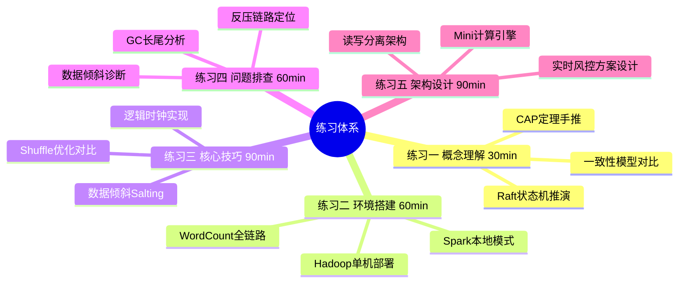
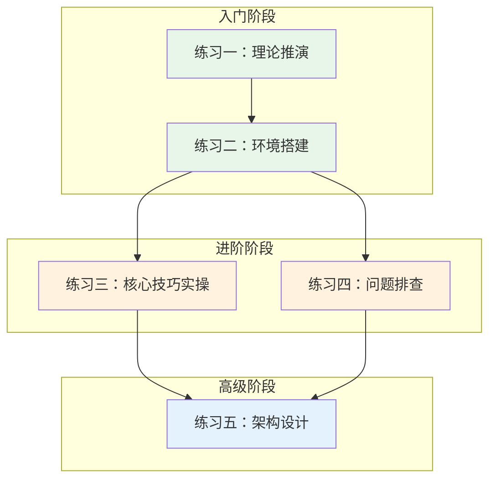

# 练习方法 — 从入门到精通的学习路径

本节为分布式计算的学习提供系统化的练习体系。所有练习按"理论理解→动手实操→问题排查→性能优化→架构设计"五个层次递进设计，每个练习都与本章前四节的核心知识点直接对应。读者应根据自身水平选择起点：初学者从练习一入手逐步推进，有经验的工程师可以直接跳到练习四和练习五。



---

### 练习一：理论概念理解（预计30分钟）

**目标**：深入理解分布式计算的三大理论支柱——CAP定理、一致性模型、共识算法，能够脱离文档独立推导和解释核心概念。

**为什么重要**：理论是架构决策的根基。在生产环境中，"选CP还是AP""用Raft还是Paxos"这些问题的答案都来自对理论的透彻理解。不理解理论的工程师容易在设计阶段就犯根本性错误。

#### 任务一：CAP定理手动推演（10分钟）

用纸笔（或文本编辑器）模拟以下场景，验证CAP定理的核心结论：

1. **搭建心智模型**：画出一个3节点集群（Node A/B/C），假设采用主从复制，Node A是主节点
2. **模拟网络分区**：假设Node B/C与Node A之间网络断开
3. **分别走两条路径**：
   - **CP路径**：Node B/C拒绝所有写请求，系统保证一致性但牺牲可用性
   - **AP路径**：Node B/C接受写请求，系统保证可用性但数据出现不一致
4. **验证恢复阶段**：网络恢复后，CP系统直接可用，AP系统需要解决冲突（如Last-Write-Wins或向量时钟）

**思考题**：
- 为什么说"P是必须保证的"？如果放弃P（不允许分区），系统退化成什么？
- 同一个系统能否在不同时刻表现为CP和AP？（提示：PACELC定理）

#### 任务二：一致性模型对比矩阵（10分钟）

根据理论基础中的知识，填写以下对比表并标注每个模型的典型应用场景：

| 一致性模型 | 保证内容 | 性能代价 | 能否读到旧数据 | 典型系统 |
|-----------|---------|---------|--------------|---------|
| 线性一致性 | | | | |
| 顺序一致性 | | | | |
| 因果一致性 | | | | |
| 最终一致性 | | | | |
| 读你所写 | | | | |

完成后与理论基础章节的表格对比，检查是否有遗漏。

#### 任务三：Raft选举推演（10分钟）

模拟一个5节点集群的Raft选举过程：

1. 初始状态：所有节点为Follower，任期(term)=0
2. 节点A选举超时，任期变为1，发起选举投票请求
3. 节点B/C/D收到请求并投票，节点A获得多数票(3/5)成为Leader
4. 模拟Leader宕机：节点E选举超时，发起term=2的选举
5. 画出完整状态转换图（Follower→Candidate→Leader）

**检查标准**：
- [ ] 能画出CAP定理的CP/AP选择示意图
- [ ] 能准确对比5种一致性模型的差异
- [ ] 能手动推演Raft选举的完整流程
- [ ] 能解释为什么Raft使用随机化选举超时

---

### 练习二：Hadoop/Spark环境搭建与WordCount（预计60分钟）

**目标**：在本地搭建完整的分布式计算开发环境，成功运行WordCount经典示例，理解MapReduce的核心数据流。

**为什么重要**：分布式计算是实践性极强的领域。只有亲手跑通一个MapReduce Job，才能真正理解Split→Map→Shuffle→Reduce的完整数据流。

#### 任务一：环境搭建（20分钟）

**方案A：使用Docker（推荐，5分钟快速启动）**

```bash
# 拉取官方Spark镜像（自带Hadoop支持）
docker pull apache/spark-py:3.5.0

# 启动容器，挂载工作目录
docker run -it --name spark-dev \
  -v $(pwd)/spark-exercises:/opt/spark/work-dir \
  -p 8080:8080 -p 4040:4040 \
  apache/spark-py:3.5.0 /bin/bash

# 验证环境
spark-submit --version
python3 -c "import pyspark; print(pyspark.__version__)"
```

**方案B：本地安装（需Java 11+）**

```bash
# 1. 安装Java（如未安装）
sudo apt-get update &amp;&amp; sudo apt-get install -y openjdk-11-jdk
java -version

# 2. 下载Spark预编译包
SPARK_VERSION=3.5.0
wget https://archive.apache.org/dist/spark/spark-${SPARK_VERSION}/spark-${SPARK_VERSION}-bin-hadoop3.tgz
tar -xzf spark-${SPARK_VERSION}-bin-hadoop3.tgz
export SPARK_HOME=$(pwd)/spark-${SPARK_VERSION}-bin-hadoop3
export PATH=$SPARK_HOME/bin:$PATH

# 3. 验证
spark-submit --version
```

#### 任务二：WordCount全链路实操（20分钟）

创建文件 `wordcount.py`，完整实现MapReduce的WordCount：

```python
from pyspark.sql import SparkSession

# 1. 创建SparkSession（本地模式，模拟4个Executor）
spark = SparkSession.builder \
    .master("local[4]") \
    .appName("WordCount-Learning") \
    .config("spark.sql.shuffle.partitions", "4") \
    .getOrCreate()

sc = spark.sparkContext
sc.setLogLevel("WARN")  # 减少日志噪音

# 2. 读取输入数据
text_rdd = sc.textFile("/opt/spark/work-dir/input/sample.txt")

# 3. 实现WordCount（对比不同写法的Shuffle差异）
# 写法一：使用reduceByKey（Map端预聚合，推荐）
word_counts = text_rdd \
    .flatMap(lambda line: line.split(" ")) \
    .filter(lambda word: len(word.strip()) > 0) \
    .map(lambda word: (word.lower(), 1)) \
    .reduceByKey(lambda a, b: a + b)  # Map端Combiner自动生效

# 写法二（反面教材）：使用groupByKey（全量Shuffle，性能差）
# word_counts_bad = text_rdd \
#     .flatMap(lambda line: line.split(" ")) \
#     .map(lambda word: (word.lower(), 1)) \
#     .groupByKey()  # 所有数据先Shuffle到Reduce端
#     .mapValues(sum)  # 再在Reduce端聚合

# 4. 排序并输出
result = word_counts.sortBy(lambda x: -x[1])

# 5. 查看结果（控制台）
print("\n===== Top 20 词频 =====")
for word, count in result.take(20):
    print(f"  {word:20s} {count}")

# 6. 检查Spark UI中的Stage信息
input("\n按回车键查看Spark UI (http://localhost:4040)，然后关闭...")
spark.stop()
```

创建测试输入文件：

```bash
mkdir -p /opt/spark/work-dir/input
cat > /opt/spark/work-dir/input/sample.txt << 'EOF'
distributed computing is the future of data processing
map reduce is a programming model for distributed systems
spark provides fast in-memory computing for big data
the network is never reliable in distributed systems
consistency availability and partition tolerance cannot all be satisfied
raft consensus algorithm is used for leader election and log replication
cap theorem states that a distributed system can only provide two of three guarantees
fault tolerance is a fundamental requirement of distributed computing
shuffling data between nodes is the most expensive operation in map reduce
eventual consistency is a tradeoff for higher availability
EOF

# 运行
spark-submit wordcount.py
```

#### 任务三：观察与对比（20分钟）

分别用 `reduceByKey` 和 `groupByKey` 运行WordCount，打开Spark UI（http://localhost:4040）观察：

1. **对比Stage数量**：`reduceByKey` 有几个Stage？`groupByKey` 呢？
2. **对比Shuffle Read/Write大小**：哪个方案传输的数据量更少？
3. **对比Task执行时间**：是否有长尾Task？

| 指标 | reduceByKey | groupByKey |
|------|-------------|------------|
| Stage数量 | | |
| Shuffle数据量 | | |
| 最慢Task耗时 | | |
| 是否有数据倾斜 | | |

**思考题**：
- 为什么`reduceByKey`比`groupByKey`快？根本原因是什么？
- 如果输入数据有10亿行，在本地模式下会发生什么？如何模拟？

**检查标准**：
- [ ] 成功安装Hadoop/Spark环境
- [ ] WordCount程序运行输出正确结果
- [ ] 能在Spark UI中定位Shuffle操作
- [ ] 理解reduceByKey和groupByKey的性能差异

---

### 练习三：分布式计算核心技巧实操（预计90分钟）

**目标**：动手实现本章核心技巧中的关键算法——逻辑时钟、数据倾斜Salting、Shuffle优化，将理论转化为代码级理解。

#### 任务一：实现Lamport逻辑时钟（20分钟）

根据理论基础中的算法描述，实现一个完整的Lamport时钟模拟器，模拟3个进程之间的消息传递：

```python
import threading
import time
import queue
import random
from dataclasses import dataclass, field
from typing import List, Tuple

@dataclass
class Message:
    """进程间消息"""
    sender: int
    timestamp: int
    content: str

class LamportClockProcess:
    """Lamport逻辑时钟进程"""
    
    def __init__(self, pid: int, n_processes: int):
        self.pid = pid
        self.clock = 0
        self.mailbox: queue.Queue = queue.Queue()
        self.log: List[str] = []
    
    def local_event(self, description: str):
        """本地事件：时钟+1"""
        self.clock += 1
        entry = f"[P{self.pid}] t={self.clock:3d} | 本地事件: {description}"
        self.log.append(entry)
        return self.clock
    
    def send_message(self, receiver_mailbox: queue.Queue, content: str):
        """发送消息：时钟+1，将时间戳附在消息中"""
        self.clock += 1
        msg = Message(sender=self.pid, timestamp=self.clock, content=content)
        receiver_mailbox.put(msg)
        entry = f"[P{self.pid}] t={self.clock:3d} | 发送 -> P{receiver_mailbox.pid}: '{content}'"
        self.log.append(entry)
        return msg
    
    def receive_message(self):
        """接收消息：取max(本地, 消息) + 1"""
        try:
            msg = self.mailbox.get(timeout=0.1)
            self.clock = max(self.clock, msg.timestamp) + 1
            entry = f"[P{self.pid}] t={self.clock:3d} | 收到 <- P{msg.sender}: '{msg.content}' (msg_ts={msg.timestamp})"
            self.log.append(entry)
            return msg
        except queue.Empty:
            return None

# 模拟3个进程的消息交互
def simulate_lamport_clock():
    # 设置可重现的随机种子
    random.seed(42)
    
    # 创建3个进程，各自有独立邮箱
    processes = {}
    for pid in range(3):
        p = LamportClockProcess(pid, 3)
        processes[pid] = p
    
    # 互相连接邮箱（简化模拟）
    processes[0].mailbox.pid = 0
    processes[1].mailbox.pid = 1
    processes[2].mailbox.pid = 2
    
    # 模拟执行序列
    print("=" * 70)
    print("Lamport逻辑时钟模拟 — 3个进程的消息传递")
    print("=" * 70)
    
    # Step 1: 各进程本地事件
    processes[0].local_event("初始化")
    processes[1].local_event("初始化")
    processes[2].local_event("初始化")
    
    # Step 2: 并发事件（不同进程同时发生本地事件）
    processes[0].local_event("读取配置")
    processes1_local = processes[1].local_event("写入缓存")
    
    # Step 3: P0发送消息给P1
    processes[0].send_message(processes[1].mailbox, "数据同步请求")
    
    # Step 4: P1收到消息并回复
    msg = processes[1].receive_message()
    if msg:
        processes[1].send_message(processes[0].mailbox, "同步确认")
    
    # Step 5: P2并发发送给P0
    processes[2].send_message(processes[0].mailbox, "心跳检测")
    
    # Step 6: P0处理积压消息
    msg1 = processes[0].receive_message()
    msg2 = processes[0].receive_message()
    
    # Step 7: P0向P2发送最终状态
    processes[0].send_message(processes[2].mailbox, "状态更新完成")
    msg3 = processes[2].receive_message()
    
    # 输出所有进程的日志
    print("\n--- 完整事件日志 ---")
    for pid in sorted(processes.keys()):
        print(f"\n进程 P{pid} 的事件序列:")
        for entry in processes[pid].log:
            print(f"  {entry}")
    
    # 验证因果一致性
    print("\n--- 因果一致性验证 ---")
    print("检查规则：如果事件A因果性地先于事件B，则LC(A) < LC(B)")
    
    # 示例验证
    p0_final = processes[0].clock
    p1_final = processes[1].clock
    p2_final = processes[2].clock
    print(f"最终时钟值: P0={p0_final}, P1={p1_final}, P2={p2_final}")
    
    all_logs = []
    for pid in processes:
        for log in processes[pid].log:
            all_logs.append(log)
    
    print(f"\n总事件数: {len(all_logs)}")
    print("时钟值单调递增: ✅" if all(p.clock >= 0 for p in processes.values()) else "❌")

if __name__ == "__main__":
    simulate_lamport_clock()
```

运行后分析：
- 消息传输是否导致接收方时钟"跳变"？为什么？
- 如果两个进程同时向同一个进程发送消息，接收方如何处理？
- Lamport时钟能否判断两个事件是并发的？（不能——这是向量时钟解决的问题）

#### 任务二：数据倾斜Salting方案实现（25分钟）

创建一个模拟数据倾斜场景，分别用"不处理""Salting""两阶段聚合"三种方式解决，对比性能：

```python
from pyspark.sql import SparkSession
from pyspark.sql import functions as F
from pyspark.sql.types import StructType, StructField, StringType, IntegerType
import random
import time

spark = SparkSession.builder \
    .master("local[4]") \
    .appName("SkewPractice") \
    .config("spark.sql.shuffle.partitions", "8") \
    .getOrCreate()

sc = spark.sparkContext
sc.setLogLevel("WARN")

# 1. 生成倾斜数据：模拟电商订单
#    倾斜Key: "hot_product_1" 承载80%的数据
schema = StructType([
    StructField("user_id", StringType(), True),
    StructField("product_id", StringType(), True),
    StructField("amount", IntegerType(), True),
])

data = []
# 正常数据：1000个用户，每人1-10条订单
for i in range(1000):
    n_orders = random.randint(1, 10)
    for _ in range(n_orders):
        data.append((
            f"user_{random.randint(0, 999):04d}",
            f"product_{random.randint(0, 99):02d}",
            random.randint(10, 500)
        ))

# 倾斜数据：80万条订单都指向同一个商品
for _ in range(800000):
    data.append((
        f"user_{random.randint(0, 999):04d}",
        "hot_product_1",  # 倾斜Key
        random.randint(10, 500)
    ))

random.shuffle(data)
df = spark.createDataFrame(data, schema)
df.cache()
print(f"总数据量: {df.count():,} 条")

# ============================================================
# 方案一：不处理（直接groupBy，会严重倾斜）
# ============================================================
print("\n===== 方案一：不处理（直接groupBy）=====")
start = time.time()
result1 = df.groupBy("product_id") \
    .agg(
        F.count("*").alias("order_count"),
        F.sum("amount").alias("total_amount")
    )
result1.collect()  # 触发计算
time1 = time.time() - start
print(f"耗时: {time1:.2f}s")
result1.filter("product_id = 'hot_product_1'").show()

# ============================================================
# 方案二：Salting加盐打散
# ============================================================
print("\n===== 方案二：Salting加盐 =====")
NUM_SALTS = 20

start = time.time()

# 2.1 给倾斜Key加盐
salted_df = df.withColumn(
    "salt",
    F.when(
        F.col("product_id") == "hot_product_1",
        (F.rand() * NUM_SALTS).cast("int")
    ).otherwise(0)
).withColumn(
    "salted_key",
    F.concat(F.col("product_id"), F.lit("_"), F.col("salt"))
)

# 2.2 按加盐Key聚合
partial_result = salted_df.groupBy("salted_key") \
    .agg(
        F.count("*").alias("partial_count"),
        F.sum("amount").alias("partial_amount")
    )

# 2.3 去掉盐值，还原真实Key再聚合
final_result = partial_result.withColumn(
    "product_id",
    F.split(F.col("salted_key"), "_0|_1|_2|_3|_4|_5|_6|_7|_8|_9|_10|_11|_12|_13|_14|_15|_16|_17|_18|_19").getItem(0)
).groupBy("product_id") \
 .agg(
     F.sum("partial_count").alias("order_count"),
     F.sum("partial_amount").alias("total_amount")
 )

final_result.collect()
time2 = time.time() - start
print(f"耗时: {time2:.2f}s")
final_result.filter("product_id = 'hot_product_1'").show()

# ============================================================
# 性能对比
# ============================================================
print("\n===== 性能对比 =====")
print(f"方案一（不处理）: {time1:.2f}s")
print(f"方案二（Salting）: {time2:.2f}s")
print(f"加速比: {time1/time2:.1f}x")

spark.stop()
```

**分析要点**：
- 在Spark UI中观察方案一的Task执行时间分布：`hot_product_1`对应的Task是否严重拖后腿？
- Salting方案增加了多少额外开销？是否值得？
- 盐值数量（NUM_SALTS）过大或过小分别会怎样？

#### 任务三：Shuffle优化对比实验（20分钟）

通过实际运行对比不同的Shuffle优化策略：

```python
from pyspark.sql import SparkSession
from pyspark.sql import functions as F
import time

def benchmark_shuffle(spark, df, strategy_name, config_overrides):
    """运行指定策略并计时"""
    for key, value in config_overrides.items():
        spark.conf.set(key, value)
    
    start = time.time()
    # 模拟典型分析场景：多层聚合 + Join
    result = df \
        .groupBy("category", "region") \
        .agg(F.sum("amount").alias("total")) \
        .join(
            df.groupBy("category").agg(F.count("*").alias("order_count")),
            on="category"
        ) \
        .collect()
    elapsed = time.time() - start
    print(f"  {strategy_name:30s} : {elapsed:.2f}s")
    return elapsed

spark = SparkSession.builder \
    .master("local[4]") \
    .appName("ShuffleOptPractice") \
    .getOrCreate()

spark.sparkContext.setLogLevel("WARN")

# 生成测试数据：100万条订单
import random
data = [(random.choice(["电子", "服饰", "食品", "家居"]),
         random.choice(["华东", "华南", "华北", "西南"]),
         random.randint(10, 1000))
        for _ in range(1000000)]
df = spark.createDataFrame(data, ["category", "region", "amount"])
df.cache()
df.count()  # 强制缓存

print("===== Shuffle优化对比实验 =====\n")

# 策略一：默认配置（200个Shuffle分区）
t1 = benchmark_shuffle(spark, df, "默认(200分区)", {
    "spark.sql.shuffle.partitions": "200"
})

# 策略二：减少分区数（适合100万条数据）
t2 = benchmark_shuffle(spark, df, "减少分区(8个)", {
    "spark.sql.shuffle.partitions": "8"
})

# 策略三：使用广播Join（小表广播）
t3 = benchmark_shuffle(spark, df, "广播Join", {
    "spark.sql.shuffle.partitions": "200",
    "spark.sql.autoBroadcastJoinThreshold": str(100 * 1024 * 1024)  # 100MB
})

# 策略四：压缩优化
t4 = benchmark_shuffle(spark, df, "LZ4压缩", {
    "spark.sql.shuffle.partitions": "200",
    "spark.shuffle.compress": "true",
    "spark.io.compression.codec": "lz4"
})

print(f"\n最优策略的加速比: {t1/max(t2,t3,t4):.1f}x")
spark.stop()
```

**关键收获**：
- 200个Shuffle分区对100万条数据是否过多？（每个分区仅5000条，Task调度开销大于计算开销）
- 什么场景下广播Join无效？（当表超过自动广播阈值时）

#### 任务四：向量时钟实现（25分钟）

基于理论基础中的算法，实现向量时钟并验证其并发检测能力：

```python
class VectorClock:
    """向量时钟实现"""
    
    def __init__(self, node_id: int, n_nodes: int):
        self.node_id = node_id
        self.clock = [0] * n_nodes
    
    def local_event(self):
        """本地事件"""
        self.clock[self.node_id] += 1
        return self.clock[:]
    
    def send(self):
        """发送消息"""
        self.clock[self.node_id] += 1
        return self.clock[:]
    
    def receive(self, msg_clock: list):
        """接收消息"""
        for i in range(len(self.clock)):
            self.clock[i] = max(self.clock[i], msg_clock[i])
        self.clock[self.node_id] += 1
        return self.clock[:]
    
    def happens_before(self, other_clock: list) -> bool:
        """判断 self 是否先于 other"""
        dominated = False
        for i in range(len(self.clock)):
            if self.clock[i] > other_clock[i]:
                return False
            if self.clock[i] < other_clock[i]:
                dominated = True
        return dominated
    
    def concurrent_with(self, other_clock: list) -> bool:
        """判断 self 与 other 是否并发"""
        return (not self.happens_before(other_clock) and
                not self._static_happens_before(other_clock, self.clock))
    
    @staticmethod
    def _static_happens_before(clock_a: list, clock_b: list) -> bool:
        dominated = False
        for i in range(len(clock_a)):
            if clock_a[i] > clock_b[i]:
                return False
            if clock_a[i] < clock_b[i]:
                dominated = True
        return dominated
    
    def __repr__(self):
        return f"V{self.node_id}{self.clock}"


# === 测试：验证并发检测 ===
print("=" * 60)
print("向量时钟 — 并发检测测试")
print("=" * 60)

# 3个节点
p0 = VectorClock(0, 3)
p1 = VectorClock(1, 3)
p2 = VectorClock(2, 3)

# 场景：P0和P1并发写入，然后P2收到P0的消息
e0 = p0.local_event()       # P0本地事件: [1,0,0]
e1 = p1.local_event()       # P1本地事件: [0,1,0]
e2_concurrent = p0.local_event()  # P0再一个事件: [2,0,0]

print(f"P0 本地事件1: {e0}")
print(f"P1 本地事件1: {e1}")
print(f"P0 本地事件2: {e2_concurrent}")

# 关键验证：e0和e1是并发的
vc0 = VectorClock(0, 3)
vc0.clock = e0[:]
vc1 = VectorClock(1, 3)
vc1.clock = e1[:]

print(f"\n--- 并发检测 ---")
print(f"e0={e0} happens_before e1={e1}? {vc0.happens_before(e1)}")
print(f"e1={e1} happens_before e0={e0}? {vc1.happens_before(e0)}")
print(f"e0 与 e1 并发? {vc0.concurrent_with(e1)}")
print(f"预期: True（两个事件独立发生，互不因果）")

# P0发送消息给P2
msg_clock = p0.send()       # P0: [3,0,0]
print(f"\nP0发送消息，时钟: {msg_clock}")

# P2接收
e2_receive = p2.receive(msg_clock)  # P2: [3,0,1]
print(f"P2接收消息，时钟: {e2_receive}")

# 验证因果关系
vc_p0_after = VectorClock(0, 3)
vc_p0_after.clock = msg_clock
vc_p2_after = VectorClock(2, 3)
vc_p2_after.clock = e2_receive

print(f"\nP0发送({msg_clock}) happens_before P2接收({e2_receive})? {vc_p0_after.happens_before(e2_receive)}")
print(f"预期: True（P2收到消息，因果关系成立）")
```

**检查标准**：
- [ ] Lamport时钟代码运行正确，能观察到时钟单调递增
- [ ] Salting方案的数据量与方案一一致（总和相同），但执行时间更短
- [ ] 理解Shuffle分区数对性能的影响
- [ ] 向量时钟能正确检测并发事件

---

### 练习四：分布式计算问题排查（预计60分钟）

**目标**：掌握数据倾斜诊断、反压链路定位、GC长尾分析三大排障技能，能独立定位并解决生产环境常见问题。

#### 任务一：数据倾斜诊断与修复（20分钟）

模拟一个真实的倾斜场景，使用Spark内置工具诊断：

```python
from pyspark.sql import SparkSession
from pyspark.sql import functions as F
from pyspark.sql.types import *
import random

spark = SparkSession.builder \
    .master("local[4]") \
    .appName("SkewDiagnosis") \
    .config("spark.sql.shuffle.partitions", "4") \
    .getOrCreate()

sc = spark.sparkContext
sc.setLogLevel("WARN")

# 构造倾斜数据
schema = StructType([
    StructField("user_id", StringType()),
    StructField("event_type", StringType()),
    StructField("value", IntegerType()),
])

data = []
# 正常用户：每人10-50条事件
for i in range(500):
    for _ in range(random.randint(10, 50)):
        data.append((f"user_{i}", random.choice(["click", "view", "buy"]), random.randint(1, 100)))

# 倾斜用户：某个"机器人"产生100万条事件
for _ in range(1000000):
    data.append(("bot_user_999", random.choice(["click", "view", "buy"]), random.randint(1, 100)))

random.shuffle(data)
df = spark.createDataFrame(data, schema)

# === 诊断步骤1：统计Key分布 ===
print("===== 诊断步骤1：Key分布统计 =====")
key_dist = df.groupBy("user_id").count().orderBy(F.desc("count"))
key_dist.show(10)

total_records = df.count()
total_users = df.select("user_id").distinct().count()
print(f"总记录数: {total_records:,}")
print(f"总用户数: {total_users}")
print(f"平均每用户记录数: {total_records / total_users:.0f}")

# 诊断步骤2：通过Spark Listener获取分区级统计
print("\n===== 诊断步骤2：分区记录数统计 =====")

# 通过mapPartitionsWithIndex统计每个分区的记录数
partition_stats = df.rdd.mapPartitionsWithIndex(
    lambda idx, it: [(idx, sum(1 for _ in it))]
).collect()

partition_stats.sort(key=lambda x: -x[1])
avg_per_partition = total_records / len(partition_stats)

for pid, count in partition_stats:
    ratio = count / avg_per_partition
    flag = " ⚠️  倾斜" if ratio > 3 else ""
    print(f"  分区 {pid}: {count:>10,} 条 (均值的 {ratio:.1f}x){flag}")

# 诊断步骤3：验证修复方案
print("\n===== 诊断步骤3：修复方案验证 =====")

# 方案：过滤异常Key + 两阶段聚合
BOT_THRESHOLD = 10000

# 统计各用户记录数
user_counts = df.groupBy("user_id").count()
normal_users = user_counts.filter(F.col("count") < BOT_THRESHOLD)

# 只保留正常用户（生产中应该单独处理bot用户的数据，而非直接丢弃）
df_normal = df.join(normal_users.select("user_id"), on="user_id")
df_bot = df.filter(F.col("user_id") == "bot_user_999")

print(f"正常用户数据量: {df_normal.count():,}")
print(f"Bot用户数据量: {df_bot.count():,}")

# 正常数据：直接聚合
normal_result = df_normal.groupBy("event_type").agg(
    F.count("*").alias("total_events"),
    F.sum("value").alias("total_value")
)

# Bot数据：先按小时聚合降采样，再汇总
bot_result = df_bot.groupBy("event_type").agg(
    F.count("*").alias("total_events"),
    F.sum("value").alias("total_value")
)

normal_result.show()
bot_result.show()

spark.stop()
```

**排障检查清单**：
1. ✅ 先确认是否存在倾斜（最大分区 > 平均分区的3倍）
2. ✅ 定位倾斜Key（哪个Key承载了异常多的数据）
3. ✅ 分析根因（是真实业务热点还是数据质量问题）
4. ✅ 选择修复方案（过滤/打散/拆分处理）
5. ✅ 验证修复效果（分区分布是否均匀）

#### 任务二：反压链路定位（20分钟）

模拟Flink反压场景，学习定位瓶颈所在：

```python
# Flink反压排查思路（概念练习 + 命令实操）

# === 排查流程 ===
"""
Flink反压排查的完整流程：

1. 观察Web UI
   - 打开 Flink Dashboard → 作业详情 → Backpressure 标签页
   - 观察每个Subtask的Backpressure状态：OK / LOW / HIGH
   - 反压的传播方向：下游 → 上游（与数据流方向相反）

2. 定位瓶颈算子
   - Backpressure状态为HIGH的算子是直接原因
   - 但它可能只是受害者——真正的瓶颈是该算子的下游
   - 从最后一个HIGH状态的算子向下游找，直到找到正常状态的算子
   
3. 分析瓶颈根因

   | 瓶颈类型 | 诊断方法 | 解决方案 |
   |---------|---------|---------|
   | 外部系统慢 | 检查sink算子的写入延迟 | 批量写入/连接池调优 |
   | 计算密集 | CPU利用率>90% | 增加并行度/优化算法 |
   | 数据倾斜 | 各Subtask处理量差异大 | Salting/重分区 |
   | GC压力 | GC时间占比>10% | 调整堆大小/使用堆外内存 |
   | 网络带宽 | Shuffle阶段网络打满 | 降低并行度/压缩数据 |

4. 验证修复
   - 调整后观察Backpressure状态是否恢复OK
   - 对比作业的端到端延迟和吞吐量
"""

print("===== Flink反压排查模拟 =====\n")

# 模拟一个3层算子链的反压场景
operators = [
    {"name": "Source(Kafka)",     "backpressure": "OK",     "parallelism": 4, "input_rate": "50K events/s"},
    {"name": "Map(数据转换)",     "backpressure": "OK",     "parallelism": 4, "input_rate": "50K events/s"},
    {"name": "KeyBy+Window聚合",  "backpressure": "HIGH",   "parallelism": 4, "input_rate": "50K events/s"},
    {"name": "Sink(写入Redis)",   "backpressure": "HIGH",   "parallelism": 2, "input_rate": "25K events/s"},
    {"name": "Sink(写入HBase)",   "backpressure": "OK",     "parallelism": 4, "input_rate": "50K events/s"},
]

print("算子链状态:")
print("-" * 75)
print(f"{'算子名称':<25s} {'反压状态':<12s} {'并行度':<8s} {'输入速率'}")
print("-" * 75)
for op in operators:
    status_icon = "🔴" if op["backpressure"] == "HIGH" else "🟢"
    print(f"{op['name']:<25s} {status_icon} {op['backpressure']:<10s} {op['parallelism']:<8d} {op['input_rate']}")

print("\n--- 排查分析 ---")
print("1. Redis Sink反压HIGH → 但它只有2个并行度（其他都是4）")
print("2. 根因分析：Redis Sink并行度过低，处理能力不足")
print("3. 上游KeyBy+Window也被反压（因为Redis Sink消费不过来）")
print("4. 修复方案：将Redis Sink并行度提升到4-8")
print("5. 预期效果：反压链路解除，恢复OK状态")
```

#### 任务三：GC长尾分析与优化（20分钟）

```python
# GC问题排查思路（概念练习 + JVM参数实操）

print("===== GC长尾延迟排查 =====\n")

# 模拟GC日志分析
gc_events = [
    {"time": "10:01:02", "type": "Minor GC", "duration_ms": 45, "freed_mb": 120, "heap_after_mb": 2048},
    {"time": "10:01:15", "type": "Minor GC", "duration_ms": 38, "freed_mb": 95,  "heap_after_mb": 2048},
    {"time": "10:01:28", "type": "Minor GC", "duration_ms": 52, "freed_mb": 130, "heap_after_mb": 2048},
    {"time": "10:01:42", "type": "Major GC", "duration_ms": 3200, "freed_mb": 800, "heap_after_mb": 1536},  # ⚠️ 长尾
    {"time": "10:01:46", "type": "Minor GC", "duration_ms": 41, "freed_mb": 100, "heap_after_mb": 2048},
    {"time": "10:02:01", "type": "Minor GC", "duration_ms": 55, "freed_mb": 140, "heap_after_mb": 2048},
    {"time": "10:02:18", "type": "Major GC", "duration_ms": 5100, "freed_mb": 1200, "heap_after_mb": 1280},  # ⚠️ 长尾
    {"time": "10:02:23", "type": "Minor GC", "duration_ms": 39, "freed_mb": 85,  "heap_after_mb": 2048},
]

print("GC事件日志:")
print("-" * 90)
print(f"{'时间':<14s} {'类型':<12s} {'耗时(ms)':<12s} {'释放(MB)':<12s} {'GC后堆(MB)':<12s} {'状态'}")
print("-" * 90)
for gc in gc_events:
    flag = " ⚠️  长尾" if gc["duration_ms"] > 1000 else " ✅"
    print(f"{gc['time']:<14s} {gc['type']:<12s} {gc['duration_ms']:<12d} {gc['freed_mb']:<12d} {gc['heap_after_mb']:<12d}{flag}")

# 分析
major_gcs = [gc for gc in gc_events if gc["type"] == "Major GC"]
minor_gcs = [gc for gc in gc_events if gc["type"] == "Minor GC"]

print(f"\n--- 统计分析 ---")
print(f"Minor GC次数: {len(minor_gcs)}, 平均耗时: {sum(g['duration_ms'] for g in minor_gcs)/len(minor_gcs):.0f}ms")
print(f"Major GC次数: {len(major_gcs)}, 平均耗时: {sum(g['duration_ms'] for g in major_gcs)/len(major_gcs):.0f}ms")
print(f"Major GC导致的长尾延迟: {[g['duration_ms'] for g in major_gcs]}ms")
print(f"长尾Task的响应时间: P50={gc_events[0]['duration_ms']}ms, P99={major_gcs[-1]['duration_ms']}ms")

print(f"\n--- 根因与解决方案 ---")
print("""
问题根因：
  Major GC触发频率过高（每2-3分钟一次），每次耗时3-5秒
  → 用户Task在Major GC期间完全暂停（Stop-The-World）
  → 该Task的响应时间出现长尾（3-5秒 vs 正常40ms）

解决方案（按优先级排序）：

1. 堆内存调优
   spark.executor.memory=8g           # 增大堆大小
   spark.executor.memoryOverhead=2g   # 增大堆外内存
   spark.memory.fraction=0.7          # 调整执行/存储内存比例

2. GC收集器选择
   -XX:+UseG1GC                       # 使用G1收集器（推荐）
   -XX:MaxGCPauseMillis=200           # 目标GC停顿<200ms
   -XX:InitiatingHeapOccupancyPercent=45  # 更早触发GC

3. 代码层优化
   - 减少对象创建（使用原始类型替代包装类型）
   - 使用对象池复用频繁创建的对象
   - 将大对象序列化后存入堆外内存

4. 任务级优化
   - 使用Kryo序列化替代Java序列化（减少50-90%内存占用）
   - 启用Spark的堆外Shuffle（spark.shuffle.service.enabled=true）
   - 将大RDD持久化为MEMORY_AND_DISK（避免OOM）
""")

print("Spark GC调优参数（提交作业时设置）:")
print("  --conf spark.executor.extraJavaOptions='-XX:+UseG1GC -XX:MaxGCPauseMillis=200'")
print("  --conf spark.executor.memory=8g")
print("  --conf spark.serializer=org.apache.spark.serializer.KryoSerializer")
```

**检查标准**：
- [ ] 能通过分区统计定位数据倾斜的Key
- [ ] 能根据反压状态图定位瓶颈算子
- [ ] 能分析GC日志识别Major GC导致的长尾
- [ ] 针对每种问题能给出至少两种解决方案

---

### 练习五：架构设计综合练习（预计90分钟）

**目标**：综合运用本章知识，设计完整的分布式计算方案。这是从"知道"到"能做"的关键跨越。

#### 任务一：实时风控系统方案设计（30分钟）

**业务背景**（参考实战案例二）：

某支付平台需要构建实时风控系统，要求：
- 日交易量：1亿笔
- 延迟要求：每笔交易的风控判定 < 200ms
- 准确率：误报率 < 1%，漏报率 < 0.01%
- 可用性：99.99%

**设计要求**：在纸上或文本编辑器中完成以下设计，然后与实战案例对比：

1. **整体架构**：画出数据流架构图（数据源→消息队列→处理引擎→规则引擎→决策输出）
2. **技术选型**：选择具体框架并说明理由（为什么选Flink而非Spark？为什么选Kafka而非RabbitMQ？）
3. **一致性设计**：风控规则库如何保证一致性？（CP还是AP？用什么一致性模型？）
4. **容错设计**：如果Flink JobManager宕机，如何保证不丢失风控判定？
5. **反压设计**：双十一大促流量激增10倍，系统如何应对？

**自评对照表**：

| 设计维度 | 你的方案 | 参考方案 | 差异分析 |
|---------|---------|---------|---------|
| 数据采集层 | | Kafka + Flink | |
| 计算引擎 | | Flink CEP | |
| 一致性保证 | | Exactly-Once | |
| 容错机制 | | Checkpoint + 持久化 | |
| 扩展策略 | | 动态并行度调整 | |

#### 任务二：读写分离分布式存储方案（30分钟）

**需求**：设计一个支持读写分离的分布式缓存系统，写入走主节点，读取走从节点。

**关键设计决策**：

1. **数据一致性选择**：
   - 写入后立即读取能否保证一致性？为什么？
   - 如果不能，如何实现"读你所写"一致性？
   - 画出主从同步的时序图

2. **分区策略**：
   - Hash分区 vs Range分区，各有什么优缺点？
   - 如何处理热点Key导致的分区不均？

3. **故障处理**：
   - 主节点宕机后，从节点提升为主节点需要多长时间？
   - 提升期间的写请求如何处理？（排队？拒绝？重定向？）

4. **脑裂防护**：
   - 画出脑裂发生的完整场景
   - 如何用Fencing Token防止双写？
   - 用Raft选举如何避免脑裂？

**输出格式**：画出完整的架构图，标注每个组件的职责和通信协议。

#### 任务三：Mini MapReduce引擎实现（30分钟，进阶挑战）

用Python实现一个简化版MapReduce引擎，理解分布式计算框架的核心机制：

```python
"""
Mini MapReduce引擎 — 核心概念练习
实现MapReduce的分而治思想，包含：
1. 输入分片（Split）
2. Map阶段并行执行
3. Shuffle阶段数据重分布
4. Reduce阶段聚合
"""

import multiprocessing as mp
from collections import defaultdict
from dataclasses import dataclass
from typing import Callable, Any
import time
import hashlib

# === 核心组件 ===

@dataclass
class Split:
    """输入数据分片"""
    split_id: int
    data: list

def default_partitioner(key, num_reducers):
    """默认Hash分区器"""
    return int(hashlib.md5(str(key).encode()).hexdigest(), 16) % num_reducers

def map_worker(args):
    """Map Worker — 在独立进程中执行"""
    split_id, data, map_func = args
    results = []
    for record in data:
        pairs = map_func(record)
        results.extend(pairs)
    return (split_id, results)

def reduce_worker(args):
    """Reduce Worker — 在独立进程中执行"""
    partition_id, key_values, reduce_func = args
    # 按Key分组
    grouped = defaultdict(list)
    for key, value in key_values:
        grouped[key].append(value)
    
    results = []
    for key, values in grouped.items():
        result = reduce_func(key, values)
        results.append(result)
    return (partition_id, results)


class MiniMapReduce:
    """Mini MapReduce引擎"""
    
    def __init__(self, num_mappers=4, num_reducers=2):
        self.num_mappers = num_mappers
        self.num_reducers = num_reducers
    
    def run(self, input_data: list,
            map_func: Callable, reduce_func: Callable,
            partitioner=None):
        """
        执行MapReduce作业
        
        Args:
            input_data: 输入数据列表
            map_func: Map函数，输入record，输出list of (key, value)
            reduce_func: Reduce函数，输入(key, values_list)，输出(key, result)
            partitioner: 可选的自定义分区器
        """
        if partitioner is None:
            partitioner = default_partitioner
        
        start_time = time.time()
        
        # ===== 阶段1：分片（Split）=====
        chunk_size = max(1, len(input_data) // self.num_mappers)
        splits = []
        for i in range(self.num_mappers):
            chunk = input_data[i * chunk_size:(i + 1) * chunk_size]
            if chunk:
                splits.append(Split(split_id=i, data=chunk))
        
        print(f"[Split] {len(input_data)} 条记录 → {len(splits)} 个分片")
        
        # ===== 阶段2：Map（并行）=====
        print("[Map]   开始Map阶段...")
        map_args = [(s.split_id, s.data, map_func) for s in splits]
        
        with mp.Pool(self.num_mappers) as pool:
            map_results = pool.map(map_worker, map_args)
        
        # ===== 阶段3：Shuffle（分区 + 排序）=====
        print("[Shuffle] 数据重分布...")
        partitions = defaultdict(list)
        total_map_pairs = 0
        
        for split_id, pairs in map_results:
            for key, value in pairs:
                partition_id = partitioner(key, self.num_reducers)
                partitions[partition_id].append((key, value))
                total_map_pairs += 1
        
        print(f"[Shuffle] {total_map_pairs} 个KV对 → {len(partitions)} 个分区")
        for pid in sorted(partitions.keys()):
            print(f"  分区 {pid}: {len(partitions[pid])} 个KV对")
        
        # ===== 阶段4：Reduce（并行）=====
        print("[Reduce] 开始Reduce阶段...")
        reduce_args = [
            (pid, kvs, reduce_func)
            for pid, kvs in sorted(partitions.items())
        ]
        
        with mp.Pool(self.num_reducers) as pool:
            reduce_results = pool.map(reduce_worker, reduce_args)
        
        # ===== 合并结果 =====
        final_results = {}
        for partition_id, results in reduce_results:
            for key, value in results:
                final_results[key] = value
        
        elapsed = time.time() - start_time
        print(f"[Done]  完成! {len(final_results)} 个唯一Key, 耗时 {elapsed:.3f}s")
        
        return final_results


# === 实战测试：WordCount ===

if __name__ == "__main__":
    # 生成测试数据
    test_data = [
        "distributed computing is the future",
        "map reduce paradigm for big data",
        "spark provides in-memory distributed computing",
        "the cap theorem describes tradeoffs in distributed systems",
        "raft is a consensus algorithm for distributed systems",
        "shuffling is expensive in distributed computing frameworks",
    ] * 1000  # 重复1000次模拟大数据量
    
    # 定义Map和Reduce函数
    def mapper(record):
        """Map: 文本 → (word, 1)"""
        return [(word.lower(), 1) for word in record.split()]
    
    def reducer(key, values):
        """Reduce: (word, [1,1,1,...]) → (word, count)"""
        return (key, sum(values))
    
    # 执行
    engine = MiniMapReduce(num_mappers=4, num_reducers=2)
    results = engine.run(test_data, mapper, reducer)
    
    # 输出Top 10
    sorted_results = sorted(results.items(), key=lambda x: -x[1])
    print("\n===== Top 10 词频 =====")
    for word, count in sorted_results[:10]:
        print(f"  {word:25s} {count}")
    
    # 验证总词数
    total_words = sum(results.values())
    expected_words = sum(len(line.split()) for line in test_data)
    assert total_words == expected_words, f"词数不匹配: {total_words} != {expected_words}"
    print(f"\n✅ 验证通过: 总词数 = {total_words:,}")
```

**进阶思考**：
- 为什么MapReduce要分片？不分片（单进程顺序执行）会有什么问题？
- Shuffle阶段的数据重分布是如何实现的？（Hash分区器的作用）
- 这个Mini引擎与真正的Hadoop MapReduce有哪些关键区别？
  - 提示：容错（Task重试）、数据本地性（Data Locality）、排序（Secondary Sort）

**检查标准**：
- [ ] 风控系统方案设计完整，包含架构图和技术选型理由
- [ ] 读写分离方案覆盖一致性、分区、容错、脑裂四个维度
- [ ] Mini MapReduce引擎能正确运行WordCount
- [ ] 理解分片、Shuffle、并行执行的核心机制

---

### 练习总结与学习路径

完成五个练习后，你将建立从理论到实践的完整能力：



| 阶段 | 练习 | 核心能力 | 预计总时长 |
|------|------|---------|-----------|
| 入门 | 练习一 + 练习二 | CAP/一致性/Raft理论 + 环境搭建 + WordCount | 90分钟 |
| 进阶 | 练习三 + 练习四 | 逻辑时钟实现 + 数据倾斜处理 + 问题排查 | 150分钟 |
| 高级 | 练习五 | 架构设计 + Mini引擎实现 | 90分钟 |

**推荐进阶阅读**：
- Martin Kleppmann《Designing Data-Intensive Applications》— 分布式系统工程实践的百科全书
- 《MapReduce论文》(2004) — 理解"分而治之"思想的源头
- 《Raft论文》(2014) — 分布式共识算法的最佳入门
- 《The Art of Scalability》— 大规模系统的架构设计方法论
