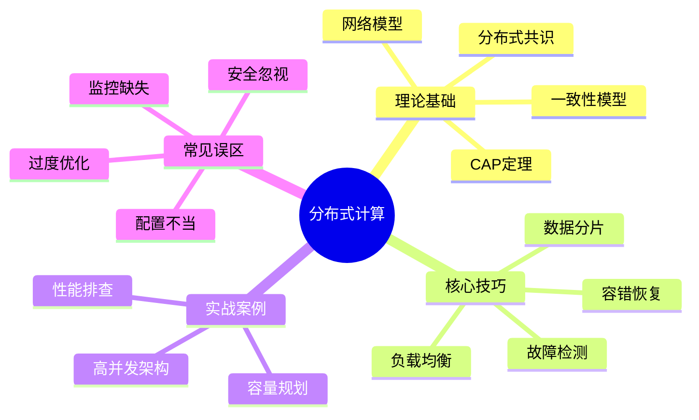

## 本章小结

### 一、本章知识全景回顾

分布式计算是现代大规模系统的核心基石。本章从理论到实践，系统性地构建了分布式计算的知识体系。以下是对全章内容的结构化回顾，帮助读者将零散知识点串联成完整的认知网络。

### 二、核心知识点精要

#### 2.1 理论基础——分布式系统的"第一性原理"

理论基础是理解和设计分布式系统的根基，涵盖了以下关键知识：

**CAP 定理**：分布式系统中，一致性（Consistency）、可用性（Availability）、分区容错性（Partition Tolerance）三者不可兼得，最多只能同时满足其中两个。实际工程中，由于网络分区不可避免，系统设计本质上是在 C 和 A 之间做取舍。具体表现为：

| 分布式系统 | 选择 | 特点 | 适用场景 |
|-----------|------|------|---------|
| HBase / ZooKeeper | CP | 保证强一致，分区时拒绝服务 | 金融交易、分布式锁 |
| Cassandra / DynamoDB | AP | 保证可用性，允许数据不一致 | 社交动态、日志收集 |
| MongoDB (默认) | CP→CA | 可配置读写一致性级别 | 通用业务系统 |

**一致性模型谱系**：从强到弱依次为——严格一致性 → 顺序一致性 → 因果一致性 → 最终一致性 → 无一致性。工程中常见的是最终一致性（Eventual Consistency），即系统保证在没有新写入的情况下，所有副本最终会收敛到相同状态。

**分布式共识算法**：Paxos 和 Raft 是解决"多个节点如何就某个值达成一致"的核心算法。Raft 以更易理解的方式实现了同样的目标，被 etcd、Consul 等广泛采用。其核心流程包括：

1. **Leader 选举**：Follower 超时后发起投票，获得多数票成为 Leader
2. **日志复制**：Leader 接收客户端请求，将日志条目复制到多数节点
3. **安全性保证**：已提交的日志不会被覆盖，Term 单调递增

**网络模型与故障模型**：分布式系统必须面对三类网络故障——

- **故障停（Crash Fault）**：节点突然停止响应，不发送错误数据（最温和）
- **拜占庭故障（Byzantine Fault）**：节点可能发送任意错误数据（最恶劣）
- **网络分区（Network Partition）**：节点间通信中断，形成"脑裂"

#### 2.2 核心技巧——工程落地的关键手段

理论指导方向，技巧决定成败。本章介绍的核心技巧直接服务于系统设计与调优：

**数据分片（Sharding）**：

将大规模数据集拆分到多个节点上并行处理。两种主流策略：

| 分片策略 | 原理 | 优点 | 缺点 | 适用场景 |
|---------|------|------|------|---------|
| 哈希分片 | 对 Key 取哈希后取模 | 数据分布均匀 | 扩容时需大量迁移 | 均匀读写（如缓存） |
| 范围分片 | 按 Key 的范围区间划分 | 支持范围查询 | 热点键问题 | 时序数据、有序查询 |

**负载均衡**：

在分布式计算中，负载均衡是保证集群资源高效利用的关键。从 L4（传输层）的 TCP 连接转发，到 L7（应用层）的 HTTP 请求分发，再到客户端智能路由（如 Ribbon、gRPC 的 pick_first），不同层级的均衡策略适用于不同场景。一致性哈希（Consistent Hashing）是分布式缓存中最经典的负载均衡算法，通过虚拟节点解决数据倾斜问题。

**故障检测与自动恢复**：

- **心跳检测**：节点定期向协调器发送心跳，超时即标记为不可用（如 etcd 的 lease 机制）
- **Gossip 协议**：节点间随机交换状态信息，最终收敛到一致视图（如 Cassandra 的 gossip）
- **故障转移（Failover）**：检测到故障后，将流量切换到备用节点，确保服务不中断

**容错设计模式**：

- **超时控制**：为每次 RPC 调用设置合理超时，避免级联故障
- **重试机制**：指数退避 + 抖动（Exponential Backoff + Jitter），避免重试风暴
- **熔断器（Circuit Breaker）**：当失败率超过阈值时断开请求链路，保护下游服务
- **降级方案**：核心链路不可用时，返回缓存数据或默认值，保证基本可用

#### 2.3 实战案例——从理论到战场

本章以某电商平台大促场景为案例，完整还原了分布式计算问题的排查与解决过程：

**问题画像**：

- 接口响应从 50ms 飙升至 500ms
- CPU 使用率持续 >90%，IO 利用率达 98%
- 数据库连接池耗尽，部分请求超时
- 影响约 100 万用户，持续 30 分钟

**排查路径**：监控数据采集 → 系统层定位（CPU/内存/IO） → 应用层分析（线程/连接池） → 数据库层诊断（慢查询/锁等待） → 根因确认 → 方案实施

**关键教训**：分布式系统的性能问题往往不是单一组件的瓶颈，而是链路效应的叠加。一次数据库慢查询可能在高并发下被放大为全局故障，这正是分布式系统"木桶效应"的典型体现。

#### 2.4 常见误区——前人踩过的坑

本章梳理了分布式计算实践中最具代表性的五类误区，每一类都有对应的正确做法：

| 误区 | 后果 | 正确做法 | 关键工具 |
|------|------|---------|---------|
| 忽略监控 | 故障时"盲人摸象" | 部署 Prometheus + Grafana 全链路监控 | Prometheus, Grafana, Jaeger |
| 过度优化 | 复杂度过高，引入新 Bug | 先用 Profiler 定位瓶颈，按收益排序优化 | pprof, async-profiler, flame graph |
| 配置不当 | 线程数/连接数/超时不合理 | 根据实际负载基准测试后调优 | JMH, wrk, ab |
| 缺乏容错 | 单点故障引发雪崩 | 超时 + 重试 + 熔断 + 降级四件套 | Hystrix, Sentinel, Resilience4j |
| 忽视安全 | 数据泄露或未授权访问 | TLS 加密 + mTLS 认证 + 权限控制 | Vault, cert-manager, OPA |

### 三、关键公式与模型速查

掌握以下公式和模型，是进行容量规划、性能评估和架构决策的基础工具：

| 概念 | 公式 / 模型 | 工程含义 | 应用示例 |
|------|------------|---------|---------|
| Little 定律 | **L = λ × W**（系统中平均请求数 = 到达速率 × 平均处理时间） | 已知 QPS 和延迟即可算出所需并发连接数 | QPS=1000, P99=100ms → 至少需 100 个并发连接 |
| Amdahl 定律 | **Speedup = 1 / ((1-P) + P/N)**（P 为可并行化比例，N 为节点数） | 并行化的收益上限由串行部分决定 | 95% 可并行的代码，100 核最多加速 12.7 倍 |
| 可用性计算 | **A = MTBF / (MTBF + MTTR)** | 降低 MTTR 比提高 MTBF 更有效 | MTBF=100h, MTTR=1h → 可用性 99% |
| SLA 换算 | 99.9% = 8.76h/年; 99.99% = 52.6min/年; 99.999% = 5.26min/年 | 业务对停机的容忍度直接决定架构复杂度 | 金融系统通常要求 99.99% 以上 |
| 尾延迟 | P99 = 排序后第 99 百分位值 | P99 比平均值更能反映用户体验 | 平均 50ms 但 P99=2s → 1% 用户体验极差 |
| 容量规划 | 总资源 = QPS × 单请求资源 × 冗余系数（通常 1.5-2x） | 预留缓冲应对突发流量 | 目标 10000 QPS → 按 15000-20000 QPS 容量部署 |

### 四、全生命周期最佳实践清单

#### 4.1 设计阶段

- [ ] **明确 SLA 目标**：与业务方对齐可用性（99.9%/99.99%）、延迟（P50/P99/P999）、吞吐量指标
- [ ] **选择一致性模型**：根据业务容忍度选择强一致（金融）或最终一致（社交），而非一刀切
- [ ] **设计分片策略**：评估数据访问模式（均匀/热点/范围），选择哈希分片或范围分片
- [ ] **规划容错层级**：为每个关键链路设计超时 → 重试 → 熔断 → 降级的完整防护链
- [ ] **预留扩展点**：为未来数据增长和节点扩展预留分片再平衡能力

#### 4.2 实现阶段

- [ ] **防御性编程**：所有 RPC 调用必须设置超时，所有外部依赖必须有降级方案
- [ ] **幂等设计**：所有写操作必须支持重试幂等，利用请求 ID 或版本号去重
- [ ] **可观测性三支柱**：日志（Logging）+ 指标（Metrics）+ 链路追踪（Tracing）缺一不可
- [ ] **单元测试覆盖**：核心分片逻辑、一致性判断、故障注入场景必须有测试用例
- [ ] **代码审查重点**：并发安全、资源释放（连接/文件句柄）、异常处理完整性

#### 4.3 部署阶段

- [ ] **基准测试先行**：使用 wrk/JMH 确认单节点性能基线，作为扩容参考
- [ ] **灰度发布**：先部署 1-2 个节点，观察指标稳定后再全量推进
- [ ] **回滚预案**：确保每次发布都有快速回滚路径，回滚时间 < 5 分钟
- [ ] **混沌工程**：在预发环境模拟节点宕机、网络分区，验证容错机制生效

#### 4.4 运维阶段

- [ ] **监控大盘**：CPU/内存/IO/网络 + QPS/延迟/错误率 + GC/连接池/JVM 指标
- [ ] **告警分级**：P0（服务不可用）立即通知 → P1（性能劣化）10 分钟内响应 → P2（趋势异常）每日处理
- [ ] **定期巡检**：每周分析慢查询 TOP10、GC 停顿趋势、磁盘增长速率
- [ ] **容量预测**：按业务增长趋势提前 2-3 个月规划扩容，避免临时抱佛脚

### 五、分布式系统核心架构模式

掌握以下架构模式，是应对不同业务场景的前提：

| 架构模式 | 核心思想 | 适用场景 | 代表技术 | 关键挑战 |
|---------|---------|---------|---------|---------|
| 主从复制 | 一主多从，读写分离 | 读多写少（如 CMS、报表） | MySQL主从, Redis Sentinel | 主节点单点、从节点延迟 |
| 分片集群 | 数据水平拆分，并行处理 | 海量数据存储和计算 | TiDB, Vitess, Elasticsearch | 跨分片查询、数据迁移 |
| 微服务 | 业务拆分，独立部署 | 大团队协作、快速迭代 | gRPC, Istio, Spring Cloud | 服务治理复杂度 |
| 事件驱动 | 异步消息，解耦服务 | 高吞吐、最终一致性场景 | Kafka, RabbitMQ, Pulsar | 消息顺序、重复消费 |
| CQRS + Event Sourcing | 读写模型分离 + 事件溯源 | 审计追踪、复杂业务状态 | Axon, EventStoreDB | 系统复杂度、学习成本 |

### 六、下一步学习建议

#### 6.1 深入学习路径

**入门级（1-3 个月）**：
1. 搭建一个 3 节点的 etcd 集群，观察 Leader 选举和日志复制过程
2. 使用 Docker Compose 模拟网络分区，观察系统行为
3. 阅读 Raft 论文（In Search of an Understandable Consensus Algorithm）前 5 节

**进阶级（3-6 个月）**：
1. 阅读 Raft 论文全文，理解 Safety 证明
2. 在 Kubernetes 上部署有状态应用（StatefulSet），理解分布式调度原理
3. 实现一个简单的分布式 KV 存储（支持基本的 Put/Get/分片）
4. 阅读 Dynamo 论文（Amazon's Highly Available Key-value Store），理解 AP 系统设计

**高级（6-12 个月）**：
1. 阅读 Spanner 论文，理解全球分布式数据库的 TrueTime 机制
2. 研究 CRDT（Conflict-free Replicated Data Types），掌握无冲突数据结构
3. 深入 Kafka 源码，理解其副本同步和 ISR 机制
4. 实现一个简单的 Raft 共识模块（Go/Rust）

#### 6.2 推荐阅读资源

| 类型 | 资源 | 适合阶段 | 核心收获 |
|------|------|---------|---------|
| 论文 | In Search of an Understandable Consensus Algorithm (Raft) | 入门-进阶 | 分布式共识的最清晰讲解 |
| 论文 | Dynamo: Amazon's Highly Available Key-value Store | 进阶 | AP 系统的设计哲学 |
| 论文 | Spanner: Google's Globally-Distributed Database | 高级 | 全球一致性的时间机制 |
| 书籍 | 《Designing Data-Intensive Applications》(DERTA) | 进阶-高级 | 分布式数据系统的百科全书 |
| 书籍 | 《Distributed Systems》(Maarten van Steen) | 入门-进阶 | 系统性的分布式理论教材 |
| 书籍 | 《Distributed Algorithms》(Nancy Lynch) | 高级 | 分布式算法的形式化分析 |
| 课程 | MIT 6.824: Distributed Systems | 进阶 | 经典分布式系统实验课 |
| 开源 | etcd / TiKV / CockroachDB | 进阶-高级 | 工业级分布式系统的实现参考 |

#### 6.3 动手实践项目

1. **小型分布式 KV**：用 Go/Rust 实现一个支持哈希分片、Raft 共识、自动故障转移的 KV 存储
2. **分布式任务调度器**：实现一个类似 Celery 的分布式任务队列，支持优先级、重试、结果回调
3. **分布式缓存代理**：实现一个一致性哈希 + 虚拟节点的缓存代理层，支持动态扩缩容

### 七、思考题

**理解类**：

1. 为什么在分布式系统中，网络分区是不可避免的？它对系统设计产生了哪些根本性约束？
2. Raft 算法如何保证已提交的日志不会丢失？试从 Leader 选举和日志复制两个角度分别解释。
3. 最终一致性在什么业务场景下是可接受的？什么场景下必须使用强一致性？请各举三个具体例子并说明理由。

**应用类**：

4. 某系统目前使用主从复制架构，QPS 已达上限。请设计一个分片方案，说明分片键选择、数据迁移策略、以及迁移期间如何保证服务不中断。
5. 在微服务架构下，一个请求需要调用 5 个下游服务，每个服务的 P99 延迟为 100ms。请计算整个请求链路的理论 P99 延迟，并给出优化方案。
6. 设计一个分布式限流系统，要求支持多节点协同的滑动窗口限流，且在网络分区时仍能提供基本的限流能力（AP 方案）。

**思考类**：

7. CAP 定理是否是分布式系统设计的全部？PCF（Partition Causality Fault tolerance）等新理论对传统 CAP 有何补充？
8. 随着云原生和 Serverless 的普及，传统分布式计算的哪些核心概念正在被重新定义？哪些仍然不可替代？
9. 如果你要设计一个面向全球用户的社交平台，需要在 5 大洲部署节点，你会如何在一致性和可用性之间做取舍？请从技术架构和用户体验两个维度分析。

---

> **全章总结**：分布式计算的本质是管理复杂性——网络不可靠、节点会故障、时钟不精确。理解 CAP 定理帮助你做取舍，掌握 Raft/Paxos 帮你实现共识，运用分片和负载均衡帮你扩展规模，实施超时/重试/熔断/降级帮你抵御故障。从理论到实践，分布式系统的设计与运维永远是一场与不确定性的博弈——目标不是消除所有故障，而是让系统在故障发生时优雅降级、快速恢复。
