# 第24章 分布式计算 — 章节概览

## 为什么需要分布式计算

当单台机器的计算能力无法满足数据量和计算复杂度的需求时，分布式计算成为必然选择。从Google 2004年发表MapReduce论文开始，分布式计算已经从学术研究走向工业标配，成为大数据处理、机器学习训练、实时流计算等领域的基础设施。

本章系统介绍分布式计算的核心理论、主流框架、工程技巧与实战经验，帮助读者建立从批处理到流处理、从中心化调度到Serverless的完整知识体系。

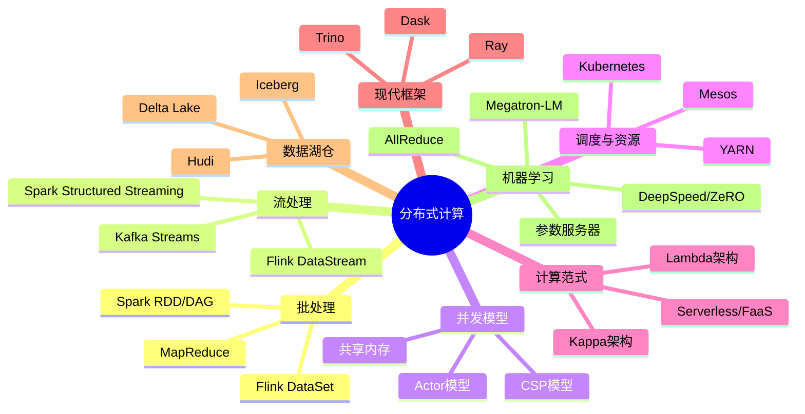

## 章节结构

### 01-理论基础
深入讲解四大核心范式：批处理系统（MapReduce、Spark、Flink）、流处理系统（Kafka Streams、Flink窗口机制、Exactly-Once语义）、Actor模型（Erlang/Akka）、架构范式（Lambda架构、Kappa架构）。同时覆盖现代分布式计算框架（Ray、Dask、Trino）、分布式任务调度（YARN/Mesos/K8s）、计算框架对比（Spark vs Flink vs Beam）、Serverless计算模型、流表对偶性（Stream-Table Duality）、数据湖仓一体（Delta Lake/Iceberg/Hudi）、数据分区与Shuffle优化、容错机制（Checkpoint、Lineage、Speculative Execution）以及分布式机器学习（参数服务器、AllReduce、Horovod、DeepSpeed ZeRO、Megatron-LM 3D并行）。

### 02-核心技巧
从工程实践角度提炼分布式计算的关键技巧：数据倾斜处理、Shuffle优化、内存管理、序列化选择、并行度调优、反压机制设计等。

### 03-实战案例
通过真实场景展示分布式计算的应用：大规模日志分析、实时风控系统、推荐系统离线特征计算、IoT数据流处理等。

### 04-常见误区
梳理分布式计算中的典型认知偏差和设计陷阱，如过度依赖Shuffle、忽视数据倾斜、混淆Exactly-Once语义等。

### 05-练习方法
提供从入门到精通的系统化学习路径，包括环境搭建、经典论文阅读、动手实现Mini计算引擎等。

### 06-本章小结
总结分布式计算的核心思想与关键要点，为后续章节奠定基础。

## 学习目标

完成本章学习后，读者应能：
- 理解MapReduce、Spark、Flink的核心计算模型与适用场景
- 掌握流处理中的窗口机制与Exactly-Once语义实现原理
- 理解Lambda/Kappa架构的设计思想与选型依据
- 掌握流表对偶性（Stream-Table Duality）的核心概念
- 了解现代分布式计算框架（Ray、Dask、Trino）的特点与适用场景
- 理解数据湖仓一体（Lakehouse）架构与三大表格式的差异
- 设计合理的数据分区与Shuffle策略
- 诊断和解决数据倾斜、GC压力等常见性能问题
- 选择合适的分布式计算框架解决实际业务问题
- 理解分布式深度学习训练的核心并行策略（数据并行、张量并行、流水线并行）

***

# 24.1 理论基础

分布式计算是将大规模计算任务分解为多个子任务，分布到多台机器上并行执行，最终汇总结果的计算范式。本节从批处理、流处理、Actor模型三大范式出发，系统阐述分布式计算的理论基础。

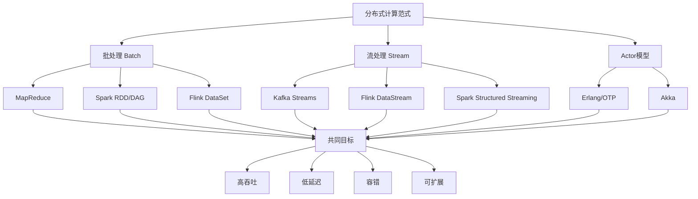

***

## 24.1.1 批处理系统

### MapReduce模型详解

MapReduce是Google于2004年提出的分布式计算编程模型，其核心思想是将计算抽象为两个阶段：Map（映射）和Reduce（归约）。

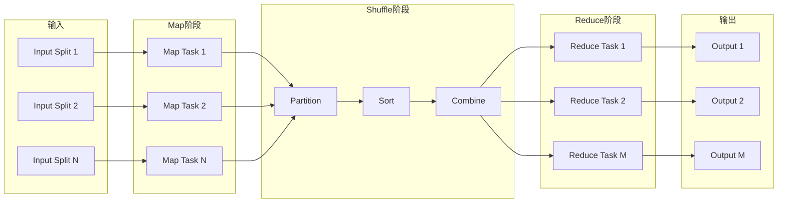

**计算模型**

Map阶段:    (key1, value1) → list(key2, value2)
Shuffle阶段: 按key2分组聚合
Reduce阶段:  (key2, list(value2)) → list(value3)

**执行流程伪代码**

```python
def map_reduce_job(input_data, map_fn, reduce_fn):
    # 1. 输入分片
    splits = partition(input_data, num_mappers)
    
    # 2. Map阶段 - 并行执行
    map_outputs = parallel_for each split in splits:
        records = read(split)
        for key, value in records:
            for out_key, out_value in map_fn(key, value):
                emit_to_buffer(out_key, out_value)
    
    # 3. Shuffle阶段 - 网络传输与排序
    shuffled = partition_by_key(map_outputs, num_reducers)
    sorted_data = sort_by_key(shuffled)
    
    # 4. Reduce阶段 - 并行执行
    results = parallel_for each (key, values) in sorted_data:
        for result in reduce_fn(key, values):
            emit(result)
    
    return results
```

**MapReduce的局限性**

- **磁盘IO密集**：每个MapReduce Job之间需要写磁盘，多步计算效率低
- **表达能力有限**：仅支持Map和Reduce两个原语，复杂逻辑需要串联多个Job
- **不适合迭代计算**：机器学习算法通常需要多轮迭代，每轮写磁盘开销巨大
- **延迟高**：面向批处理设计，无法满足实时性需求

### Spark RDD与DAG执行引擎

Apache Spark在2009年由UC Berkeley AMPLab提出，通过引入RDD（Resilient Distributed Dataset）和DAG执行引擎解决了MapReduce的性能瓶颈。

**RDD核心特性**

RDD是Spark的核心抽象，代表一个不可变、可分区、可并行计算的数据集合。RDD支持两类操作：
- **Transformation**（惰性操作）：map、filter、flatMap、groupByKey、reduceByKey、join等
- **Action**（触发计算）：collect、count、save、reduce等

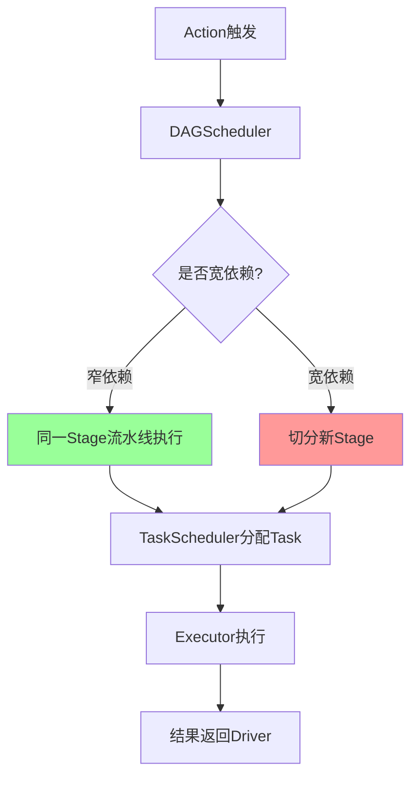

**DAG调度器**

Spark将一系列Transformation构建为DAG（有向无环图），通过Stage划分优化执行：

```python
def dag_scheduler(jobs):
    for job in jobs:
        # 1. 从Action反向构建依赖图
        final_rdd = job.result_rdd
        dag = build_dependency_graph(final_rdd)
        
        # 2. 在宽依赖处切分Stage
        stages = []
        for rdd in post_order_traversal(dag):
            if has_shuffle_dependency(rdd):
                new_stage = create_stage(rdd, parents=stages)
                stages.append(new_stage)
            else:
                current_stage.add(rdd)
        
        # 3. 提交Stage，窄依赖流水线执行
        for stage in stages:
            if all_parents_completed(stage):
                submit_stage(stage)
```

**Stage划分原则**

- **窄依赖**（Narrow Dependency）：父RDD的每个分区最多被子RDD的一个分区使用，可流水线执行
- **宽依赖**（Shuffle Dependency）：父RDD的分区可能被子RDD的多个分区使用，需要Shuffle，是Stage的边界

**Spark内存管理**

Spark 1.6+采用统一内存管理模型：

Executor Memory = Reserved Memory + User Memory + Execution Memory + Storage Memory

其中:
- Reserved Memory: ~300MB，固定保留
- User Memory: 用户数据结构、Spark内部元数据
- Execution/Storage Memory: 统一管理，可互相借用
  - Execution: Shuffle、Join、Sort、Aggregation的中间数据
  - Storage: RDD缓存、Broadcast变量

### Flink批处理

Flink虽然是以流处理为核心的框架，但其批处理能力同样强大。Flink将批处理视为流处理的特殊情况（有界流），通过DataSet API和Table API提供批处理能力。

**Flink vs Spark 批处理关键差异**

| 特性 | Spark | Flink |
|------|-------|-------|
| 执行模型 | 微批处理 | 真正的流水线执行 |
| 内存管理 | JVM堆内存 + 统一内存管理 | 自定义序列化，堆外内存 |
| Shuffle | 基于磁盘的Hash Shuffle | 流水线式Pipeline Shuffle |
| 迭代支持 | 每轮迭代是一个Job | 原生迭代支持 |

***

## 24.1.2 流处理系统

### 流处理的核心挑战

流处理系统需要解决三个核心问题：

1. **时间语义**：事件时间（Event Time）vs 处理时间（Processing Time）vs 摄入时间（Ingestion Time）
2. **窗口机制**：如何将无界数据流切分为有限的计算单元
3. **一致性保证**：在故障恢复时如何保证结果的正确性

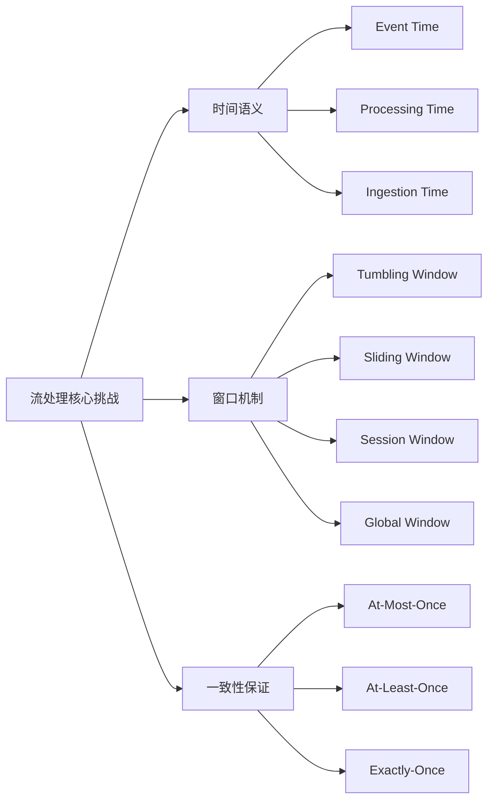

### Kafka Streams

Kafka Streams是一个客户端库，不需要额外的集群基础设施，直接嵌入应用中运行。

**核心概念**

- **Stream**：无界的、持续更新的记录序列
- **Table**：基于Stream的最新状态快照（changelog stream的物化视图）
- **KStream/KTable**：两种核心抽象，分别对应流和表

**Kafka Streams的优势**
- 轻量级，无需独立集群
- 利用Kafka的分区机制实现并行处理
- 支持Exactly-Once语义（基于事务性Producer）
- 适合微服务架构中的事件驱动处理

### 流表对偶性（Stream-Table Duality）

流表对偶性是现代流处理系统的核心概念，理解它对于设计正确的流处理应用至关重要。

核心思想:
  Stream（流）: 事件的有序、不可变、仅追加日志
  Table（表）: 流在某个时间点的快照（物化视图）

  Stream -> Table: 将事件流聚合为当前状态（如：用户点击流 -> 用户画像表）
  Table -> Stream: 将状态变更记录为事件流（如：用户画像表 -> 变更事件流）

  关键理解:
  - 流记录的是"发生了什么"（事件）
  - 表记录的是"现在是什么"（状态）
  - 两者是同一数据的两种视角，可以互相转换

```java
// Kafka Streams中的流表对偶性
StreamsBuilder builder = new StreamsBuilder();

// Stream: 原始事件流
KStream<String, OrderEvent> orderEvents = builder.stream("orders");

// Table: 将事件流聚合为用户订单状态表
KTable<String, UserOrderSummary> userSummary = orderEvents
    .groupByKey()
    .aggregate(
        UserOrderSummary::new,
        (key, event, summary) -> summary.update(event),
        Materialized.as("user-order-store")
    );

// Table -> Stream: 将状态变更转换为事件流
KStream<String, UserOrderSummary> changes = userSummary.toStream();

// 实际应用: 
// 1. 支付流 + 用户表 -> 增量更新的用户余额
// 2. 点击流 -> 实时用户画像
// 3. 配置变更流 -> 配置表的实时同步
```

### 数据湖仓一体（Lakehouse）

数据湖仓一体是近年来数据架构的重要演进方向，将数据湖的灵活性与数据仓库的管理能力结合。

架构演进:
  数据仓库（Data Warehouse）:
    优点: ACID事务、Schema强制、高性能查询
    缺点: 不支持非结构化数据、扩展成本高

  数据湖（Data Lake）:
    优点: 支持所有数据类型、低成本存储
    缺点: 无事务保证、数据质量难以保障

  数据湖仓（Lakehouse）:
    优点: ACID事务 + Schema灵活性 + 低成本存储
    核心技术: 表格式（Table Format）+ 计算引擎

**三大表格式对比**

| 特性 | Delta Lake | Apache Iceberg | Apache Hudi |
|------|-----------|---------------|-------------|
| 开发商 | Databricks | Netflix/Petabase | Uber |
| ACID事务 | ✓ | ✓ | ✓ |
| Schema演进 | ✓ | ✓（强） | ✓ |
| 时间旅行 | ✓ | ✓ | ✓ |
| 增量读取 | ✓ | ✓ | ✓（强） |
| UPSERT支持 | ✓ | ✓ | ✓（核心特性） |
| 生态集成 | Spark（最佳） | Spark/Flink/Trino | Spark/Flink |
| 适用场景 | Spark生态为主的湖仓 | 跨引擎的开放湖仓 | CDC和增量处理 |

典型Lakehouse技术栈:
  存储层: S3/ADLS/HDFS（廉价对象存储）
  表格式: Delta Lake / Iceberg / Hudi
  计算层: Spark / Flink / Trino / Databricks
  查询层: Trino / Spark SQL / Athena
  
优势:
  1. 降低数据复制: 同一份数据支持批处理和流处理
  2. ACID事务: 保证数据一致性
  3. Schema强制: 防止脏数据写入
  4. 时间旅行: 支持数据回溯和审计

### Flink窗口机制

Flink提供了最丰富的窗口机制，是流处理领域的标杆。

**窗口类型**

```java
DataStream<Event> stream = ...;

// 1. 滚动窗口（Tumbling Window）- 固定大小，不重叠
stream.window(TumblingEventTimeWindows.of(Time.minutes(5)));

// 2. 滑动窗口（Sliding Window）- 固定大小，可重叠
stream.window(SlidingEventTimeWindows.of(Time.minutes(10), Time.minutes(1)));

// 3. 会话窗口（Session Window）- 动态大小，按活跃间隔切分
stream.window(EventTimeSessionWindows.withGap(Time.minutes(30)));

// 4. 全局窗口（Global Window）- 自定义触发器
stream.window(GlobalWindows.create())
      .trigger(CountTrigger.of(100));
```

**Watermark机制**

Watermark是Flink处理乱序事件的核心机制：

Watermark(t) = 已观察到的最大事件时间 - 允许的延迟

当Watermark w到达窗口W时:
  if w >= W.end:
    触发窗口计算
    输出结果

**窗口计算流程**

```python
def window_operator(event, watermark):
    # 1. 分配窗口
    windows = assign_windows(event)
    
    # 2. 将事件放入窗口状态
    for window in windows:
        window_state[window].add(event)
    
    # 3. 注册定时器
    for window in windows:
        register_timer(window.end_time, trigger_callback)
    
    # 4. Watermark到达时触发计算
    if watermark >= registered_timer.time:
        window = get_window(timer)
        result = aggregate(window_state[window])
        emit(result)
        cleanup(window)
```

### Exactly-Once语义

Exactly-Once是流处理系统最核心的语义保证，意味着每条消息恰好被处理一次。

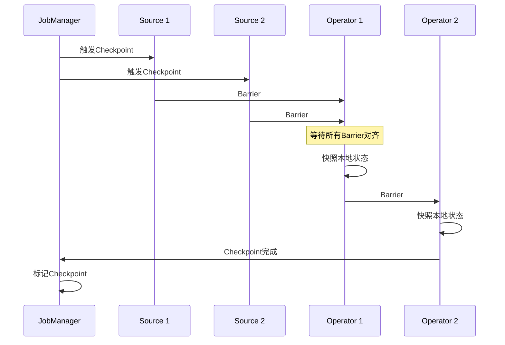

**实现原理：分布式快照（Chandy-Lamport算法）**

```python
def trigger_checkpoint():
    checkpoint_id = generate_id()
    
    # 向所有Source注入Barrier
    for source in sources:
        source.inject_barrier(checkpoint_id)
    
    def on_receive_barrier(operator, barrier_id):
        for each_input in operator.inputs:
            if not received_barrier(each_input, barrier_id):
                block_input(each_input)  # 等待对齐
                buffer_incoming_data(each_input)
        
        # 所有Barrier到齐，快照状态
        snapshot(operator.state, barrier_id)
        forward_barrier(barrier_id)
```

**端到端Exactly-Once**

实现端到端Exactly-Once需要三个条件：
1. **Source支持重放**：如Kafka可以按offset重放数据
2. **内部状态一致性**：通过Checkpoint机制保证
3. **Sink支持事务写入**：如Kafka事务性Producer、两阶段提交

***

## 24.1.3 Actor模型

### Erlang/OTP Actor模型

Erlang是Actor模型最成功的工业级实现，其核心设计原则：

- **轻量级进程**：每个Actor是一个独立的Erlang进程，创建开销极小（约300字节）
- **消息传递**：进程之间完全通过异步消息通信，不共享任何状态
- **监督树**：通过Supervisor层级管理进程的生命周期和故障恢复
- **Let it crash**：不防御性编程，而是通过Supervisor快速重启故障进程

```erlang
%% Erlang Actor示例
-module(counter).
-behaviour(gen_server).

%% 状态初始化
init([InitialCount]) ->
    {ok, InitialCount}.

%% 处理消息 - 无锁并发
handle_call(get_count, _From, Count) ->
    {reply, Count, Count};

handle_cast(increment, Count) ->
    {noreply, Count + 1}.

%% 监督策略
%% one_for_one: 仅重启故障子进程
%% one_for_all: 重启所有子进程
%% rest_for_one: 重启故障进程及之后启动的进程
```

### Akka Actor模型

Akka是JVM上最成熟的Actor框架，广泛应用于微服务和事件驱动架构。

```scala
// Akka Actor定义
class OrderActor extends Actor {
  var orders = Map.empty[String, Order]
  
  def receive = {
    case CreateOrder(order) =>
      orders += (order.id -> order)
      sender() ! OrderCreated(order.id)
      
    case GetOrder(id) =>
      orders.get(id) match {
        case Some(order) => sender() ! order
        case None => sender() ! OrderNotFound(id)
      }
  }
}

// Actor路由 - 实现负载均衡
val router = system.actorOf(
  RoundRobinPool(5).props(Props[OrderActor]),
  "orderRouter"
)
```

### 消息传递语义

Actor模型的消息传递通常提供以下语义保证：

| 语义 | 保证 | 实现方式 | 适用场景 |
|------|------|----------|----------|
| At-Most-Once | 消息最多传递一次，可能丢失 | 发送后不等待确认 | 日志收集、监控指标 |
| At-Least-Once | 消息至少传递一次，可能重复 | 发送失败重试 + 接收端去重 | 大部分业务场景 |
| Effectively-Once | 效果等同于一次 | 幂等操作 + 去重 | 金融交易、订单处理 |

***

## 24.1.4 分布式任务调度

### 资源调度器

**YARN（Yet Another Resource Negotiator）**

YARN是Hadoop 2.0引入的资源管理框架，将资源管理和任务调度分离：
- **ResourceManager**：全局资源管理，包含Scheduler和ApplicationsManager
- **NodeManager**：单节点资源管理，管理Container的生命周期
- **ApplicationMaster**：每个应用一个，负责任务调度和资源申请

**Mesos**

Mesos采用两级调度架构：
- **Master**：将资源以"offer"的形式分配给Framework
- **Framework**：每个计算框架（Spark、Hadoop等）自行决定如何使用资源

**Kubernetes**

Kubernetes作为云原生时代的标准调度平台，其调度器设计：

调度流程:
1. Filtering: 过滤不满足条件的节点（资源不足、亲和性等）
2. Scoring: 对候选节点打分（资源均衡、数据局部性等）
3. Binding: 将Pod绑定到得分最高的节点

### 任务调度算法

**FIFO调度**：简单先进先出，适合小规模集群

**Fair调度**：保证每个用户/队列获得公平的资源份额

**Capacity调度**：为每个队列分配固定的资源容量，适合多租户环境

**数据局部性优化**

调度优先级:
1. NODE_LOCAL: 数据在同一节点 → 优先级最高
2. RACK_LOCAL: 数据在同一机架 → 次优先
3. ANY: 数据在任意位置 → 最低优先级

调度策略: 等待一段时间尝试获取更好的局部性
  if wait_time < LOCALITY_WAIT_THRESHOLD:
      delay_scheduling()
  else:
      accept_any_resource()

***

## 24.1.5 分布式计算框架对比

### Spark vs Flink vs Beam

**Apache Spark**
- 执行模型：微批处理（Structured Streaming支持连续处理）
- 状态管理：基于RDD/DataSet的有状态计算
- 窗口支持：基于处理时间的滚动窗口（Structured Streaming增强）
- 适合场景：ETL、批处理、交互式分析

**Apache Flink**
- 执行模型：真正的流处理，批处理是有界流的特殊情况
- 状态管理：RocksDB状态后端，支持超大状态
- 窗口支持：丰富的窗口类型，支持Event Time
- 适合场景：实时流处理、CEP、事件驱动应用

**Apache Beam**
- 定位：统一的编程模型，不绑定特定执行引擎
- 核心抽象：PCollection、PTransform、Pipeline
- 可移植性：同一份代码可在Spark、Flink、Google Dataflow上运行
- 适合场景：需要跨引擎移植的场景

**框架选择决策树**

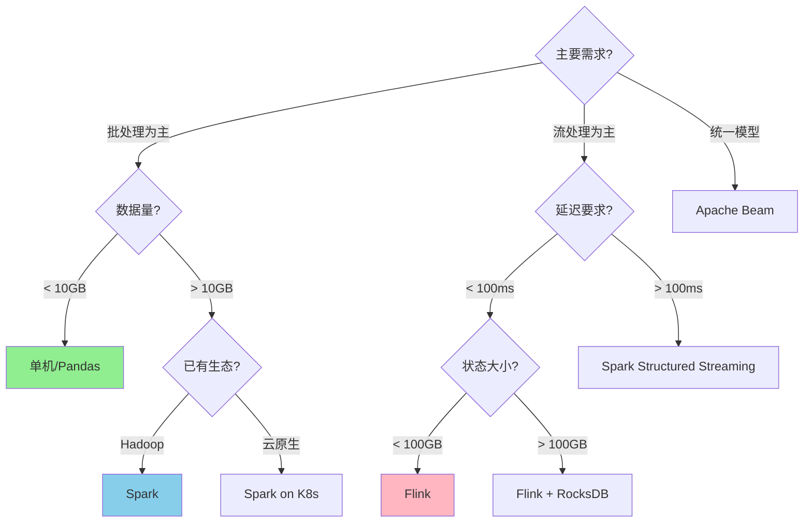

***

## 24.1.6 函数即服务（Serverless计算模型）

### Serverless计算模型

Serverless（无服务器）计算的核心特征：
- **按需执行**：函数仅在被触发时运行，不消耗资源时自动缩容至零
- **按调用计费**：按实际执行时间和资源消耗计费
- **自动扩缩容**：平台自动管理实例数量

**主流Serverless平台**

| 平台 | 语言支持 | 最大超时 | 冷启动 |
|------|---------|---------|--------|
| AWS Lambda | 多语言 | 15分钟 | 100ms-1s |
| Google Cloud Functions | 多语言 | 60分钟 | 200ms-2s |
| Azure Functions | 多语言 | 无限制 | 300ms-3s |
| OpenWhisk | 多语言 | 5分钟 | 500ms-5s |

### 冷启动优化

冷启动是Serverless最大的性能挑战，优化策略：
1. **预置并发**（Provisioned Concurrency）：保持一定数量的热实例
2. **轻量运行时**：选择启动快的语言（如Go、Rust替代Java）
3. **依赖最小化**：减少依赖包大小，使用层（Layer）共享公共依赖
4. **初始化复用**：将初始化逻辑放在handler外部，利用执行上下文复用

***

## 24.1.7 Lambda架构与Kappa架构

### Lambda架构

Lambda架构由Nathan Marz在《Big Data: Principles and Best Practices》中提出，是处理大规模数据的经典架构模式。其核心思想是将计算分为三层：批处理层（Batch Layer）、速度层（Speed Layer）和查询层（Serving Layer）。

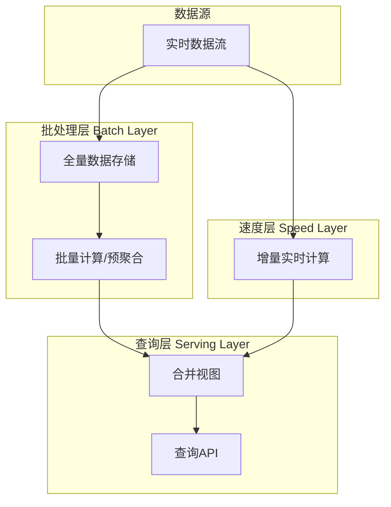

**Lambda架构的三层设计**

| 层 | 职责 | 技术选型 | 延迟 | 准确性 |
|----|------|----------|------|--------|
| 批处理层 | 全量计算，保证最终准确性 | Hadoop/Spark | 小时级 | 高（全量数据） |
| 速度层 | 增量计算，降低查询延迟 | Kafka Streams/Flink | 秒级 | 较低（近似结果） |
| 查询层 | 合并批处理和实时结果 | HBase/Cassandra/Redis | 毫秒级 | 取决于合并策略 |

**Lambda架构的实现示例**

```python
# Lambda架构核心逻辑
class LambdaArchitecture:
    def __init__(self):
        self.batch_layer = BatchLayer()      # HDFS + Spark
        self.speed_layer = SpeedLayer()       # Kafka + Flink
        self.serving_layer = ServingLayer()   # HBase

    def ingest(self, record):
        # 1. 写入批处理层（原始数据持久化）
        self.batch_layer.store(record)
        # 2. 写入速度层（实时增量处理）
        self.speed_layer.process(record)

    def query(self, key):
        # 合并批处理结果和实时结果
        batch_result = self.batch_layer.query(key)      # 最终准确结果
        speed_result = self.speed_layer.query(key)       # 增量近似结果
        return merge(batch_result, speed_result)         # 合并逻辑

    def batch_view_rebuild(self):
        # 定期重建批处理视图（如每天凌晨）
        full_data = self.batch_layer.scan_all()
        aggregated = spark_compute(full_data)             # Spark全量计算
        self.serving_layer.store_batch_result(aggregated)
        self.speed_layer.reset()                          # 重置速度层
```

**Lambda架构的优缺点**

优势:
  1. 容错性强: 批处理层定期重建，可修正速度层的错误
  2. 准确性高: 批处理层保证最终结果的准确性
  3. 可扩展: 各层独立扩展

劣势:
  1. 代码重复: 同一逻辑需要在批处理层和速度层分别实现
  2. 维护成本高: 需要同时维护两套系统
  3. 复杂度高: 合并逻辑难以设计和调试

### Kappa架构

Kappa架构是对Lambda架构的简化，由Jay Kreps（Kafka创始人）提出。核心思想是**所有计算都通过流处理完成**，消除批处理层的代码重复问题。

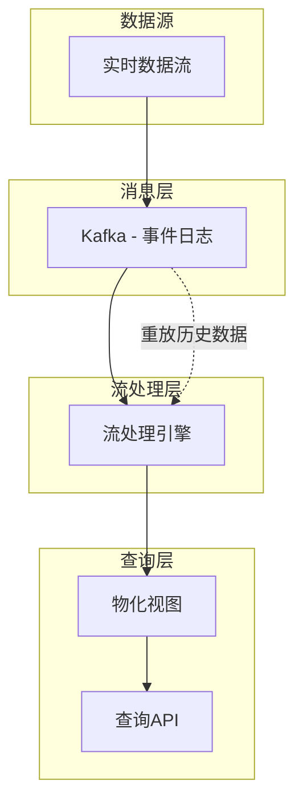

**Kappa架构的核心思想**

核心原则:
  1. 只有一个数据处理层（流处理）
  2. 通过消息系统（Kafka）持久化所有原始数据
  3. 需要重新计算时，重放Kafka历史数据

关键依赖:
  - Kafka: 必须支持长期数据保留（数周到数月）
  - 流处理引擎: 必须支持Exactly-Once语义
  - 有状态处理: Checkpoint机制保证重放时的状态一致性

**Kappa架构实现**

```python
# Kappa架构核心逻辑
class KappaArchitecture:
    def __init__(self):
        self.kafka = KafkaCluster()           # 事件日志存储
        self.stream_engine = FlinkCluster()    # 流处理引擎
        self.serving = MaterializedView()      # 物化视图

    def ingest(self, record):
        # 所有数据统一写入Kafka
        self.kafka.produce(topic='events', value=record)

    def process(self, job):
        # 正常处理：消费最新数据
        self.stream_engine.submit(job)

    def reprocess(self, job_class, new_logic):
        # 重新处理：启动新版本Job，从头消费
        # 1. 部署新版本代码
        new_job = job_class(version='v2', logic=new_logic)
        # 2. 从最早offset开始消费Kafka
        self.stream_engine.submit(new_job, from_earliest=True)
        # 3. 新Job产出新版本物化视图
        # 4. 切换查询路由到新视图
        # 5. 停止旧版本Job
```

### Lambda vs Kappa选型指南

| 维度 | Lambda架构 | Kappa架构 |
|------|-----------|-----------|
| 代码复杂度 | 高（两套代码） | 低（一套代码） |
| 运维复杂度 | 高（两套系统） | 中（一套系统） |
| 数据保留 | 批处理层全量存储 | Kafka长期保留 |
| 重算能力 | 批处理层全量重算 | Kafka重放 |
| 适用场景 | 混合工作负载 | 以流处理为主 |
| 典型用户 | 传统大数据团队 | 云原生/事件驱动团队 |
| 技术要求 | Hadoop + 流处理 | 强流处理 + Kafka |

选型建议:
  选择Lambda架构:
    - 需要复杂的批处理分析（OLAP、报表）
    - 批处理和流处理的计算逻辑差异大
    - 团队已有成熟的Hadoop基础设施

  选择Kappa架构:
    - 以实时流处理为核心
    - 批处理和流处理逻辑可以统一
    - 团队偏好云原生技术栈
    - 需要频繁重算历史数据

***

## 24.1.8 现代分布式计算框架

除了经典的MapReduce/Spark/Flink三大框架之外，近年来涌现出一批面向特定场景的分布式计算框架，形成了更加多元化的技术生态。

### Ray — AI/ML原生的分布式计算

Ray是UC Berkeley RISE Lab开发的分布式计算框架，专为AI/ML工作负载设计，支持从单机到万级节点的无缝扩展。

**Ray的核心抽象**

| 抽象 | 说明 | 适用场景 |
|------|------|----------|
| Task | 无状态远程函数 | 并行计算、数据处理 |
| Actor | 有状态远程对象 | 参数服务器、在线推理 |
| Object Ref | 远程对象引用 | 异步计算、数据共享 |
| Placement Group | 资源分配组 | 多组件协同部署 |

```python
import ray

# 初始化Ray集群
ray.init(address="auto")

# Task: 无状态远程函数
@ray.remote
def compute_embedding(text):
    model = load_model()
    return model.encode(text)

# 并行处理100万条文本
futures = [compute_embedding.remote(text) for text in texts]
embeddings = ray.get(futures)

# Actor: 有状态远程对象
@ray.remote(num_gpus=1)
class GPUInferenceServer:
    def __init__(self, model_path):
        self.model = load_model(model_path)

    def predict(self, batch):
        return self.model(batch)

# 创建4个GPU推理Actor，负载均衡分发请求
servers = [GPUInferenceServer.remote(model_path) for _ in range(4)]
import itertools
for i, batch in enumerate(batches):
    server = servers[i % len(servers)]
    result = server.predict.remote(batch)
```

**Ray核心特性**

1. 动态任务图:
   - 支持运行时动态构建计算图
   - 不像Spark需要预定义DAG
   - 适合迭代计算和强化学习

2. 异构资源调度:
   - 支持CPU、GPU、TPU混合调度
   - 自动将任务分配到合适的设备
   - 支持资源亲和性和反亲和性

3. 内置Actor框架:
   - 有状态的远程对象
   - 支持Actor级联调用
   - 内置故障恢复机制

4. 与ML生态集成:
   - Ray Train: 分布式训练（PyTorch、TensorFlow、XGBoost）
   - Ray Tune: 超参数调优
   - Ray Serve: 模型服务（在线推理）
   - Ray Data: 分布式数据处理

### Dask — Python原生的分布式计算

Dask是一个纯Python实现的分布式计算库，设计目标是扩展现有的NumPy、Pandas和Scikit-learn接口，让数据科学家无需学习新语言即可处理大规模数据。

```python
import dask.dataframe as dd
import dask.array as da

# Dask DataFrame: 扩展Pandas到分布式
df = dd.read_parquet("s3://bucket/data/*.parquet")
result = df.groupby("category").agg(
    {"revenue": "sum", "count": "count"}
).compute()

# Dask Array: 扩展NumPy到分布式
x = da.random.random((100000, 10000), chunks=(10000, 1000))
result = da.mean(x, axis=0).compute()

# Dask Delayed: 扩展任意Python函数
from dask import delayed

@delayed
def load(path):
    return pd.read_csv(path)

@delayed
def process(df):
    return df.groupby("key").sum()

@delayed
def merge(dfs):
    return pd.concat(dfs).groupby("key").sum()

# 构建计算图
dfs = [load(f"data_{i}.csv") for i in range(10)]
processed = [process(df) for df in dfs]
result = merge(processed)
result.compute()  # 触发执行
```

### Trino（原PrestoSQL）— 交互式分布式查询

Trino是一个高性能的分布式SQL查询引擎，专为交互式分析设计，支持跨多种数据源的联邦查询。

Trino特点:
  1. 纯内存计算: 不落盘，低延迟（秒级返回）
  2. 联邦查询: 一个SQL查询跨多种数据源（MySQL + S3 + Elasticsearch）
  3. ANSI SQL: 完整的SQL支持，无需学习新语言
  4. 无需ETL: 直接查询原始数据格式（Parquet、ORC、JSON等）

支持的数据源:
  - 关系型数据库: MySQL, PostgreSQL, Oracle, SQL Server
  - 大数据存储: HDFS, S3, Hive
  - 数据湖: Delta Lake, Iceberg, Hudi
  - NoSQL: Cassandra, MongoDB, Redis
  - 搜索引擎: Elasticsearch

### 分布式图计算

图计算是分布式计算的重要分支，适用于社交网络分析、推荐系统、知识图谱等场景。

**GraphX（Spark图计算）**

```scala
import org.apache.spark.graphx._

// 构建图
val graph = Graph(vertices, edges)

// PageRank计算
val ranks = graph.pageRank(0.001).vertices

// 连通分量
val components = graph.connectedComponents().vertices

// 三角形计数
val triCount = graph.triangleCount().vertices
```

**GraphScope（阿里云分布式图计算）**

GraphScope是一个大规模分布式图计算平台，支持属性图模型，兼容多种图查询语言（Gremlin、Cypher、GQL）。

GraphScope架构:
  - GraphLearn: 图存储与局部计算
  - GraphScope Learning Engine: 图神经网络训练
  - GraphScope Analytical Engine: 传统图算法（PageRank、最短路径）
  - GraphScope Interactive Engine: 图查询（Cypher、Gremlin）

特点:
  1. 支持超大规模图（万亿边级别）
  2. 支持属性图模型（节点/边都带属性）
  3. 内存和外存混合计算
  4. 与机器学习框架深度集成

### 框架选型矩阵

| 框架 | 最佳场景 | 编程语言 | 执行模型 | 学习曲线 |
|------|---------|---------|---------|---------|
| Spark | 批处理/ETL/分析 | Scala/Python/SQL | 微批处理 | 中等 |
| Flink | 流处理/CEP | Java/Scala/Python | 真流处理 | 中等偏高 |
| Ray | AI/ML/强化学习 | Python | 动态任务图 | 低 |
| Dask | 科学计算/数据分析 | Python | 惰性计算 | 低 |
| Trino | 交互式SQL分析 | SQL | MPP查询 | 低 |
| Kafka Streams | 轻量流处理 | Java | 事件驱动 | 中等 |
| Beam | 跨引擎移植 | Java/Python/Go | 统一模型 | 中等偏高 |
| GraphX/GraphScope | 图计算 | Scala/Python | BSP/Pregel | 中等 |

***

## 24.1.9 数据分区与Shuffle优化

### 数据分区策略

数据分区决定了数据如何分布到各个计算节点，直接影响Shuffle开销和数据倾斜程度。

```python
# Hash分区
partition_id = hash(key) % num_partitions

# Range分区
partition_id = find_bucket(sorted_boundaries, key)

# 一致性哈希分区
partition_id = consistent_hash(key, virtual_nodes)

# 自定义分区
partition_id = custom_partitioner(key, context)
```

### Shuffle优化

Shuffle是分布式计算中最昂贵的操作，优化策略：
1. **减少Shuffle数据量**：先filter再shuffle，使用map端预聚合（Combine）
2. **选择合适的分区数**：分区太少导致数据倾斜，太多导致小文件问题
3. **使用Broadcast Join**：小表广播避免Shuffle
4. **启用Shuffle数据压缩**：减少网络传输量
5. **调整Shuffle缓冲区大小**：平衡内存使用和溢写次数

```python
# Spark Shuffle优化配置
spark.conf.set("spark.shuffle.compress", "true")
spark.conf.set("spark.shuffle.spill.compress", "true")
spark.conf.set("spark.sql.shuffle.partitions", "200")  # 根据数据量调整
spark.conf.set("spark.sql.autoBroadcastJoinThreshold", "10MB")
```

***

## 24.1.10 容错机制

### Checkpoint机制

Checkpoint是流处理系统最常用的容错机制，通过定期保存状态快照实现故障恢复。

**Flink Checkpoint流程**

1. JobManager周期性注入Checkpoint Barrier
2. Barrier随数据流向下游传播
3. 算子收到所有上游Barrier后，对齐并快照本地状态
4. 快照写入持久化存储（HDFS、S3等）
5. 所有算子完成后，Checkpoint标记为完成
6. 故障恢复时，从最近的完整Checkpoint恢复状态

### Lineage（血缘）容错

Spark采用Lineage机制实现容错：记录RDD的生成路径（父RDD和Transformation），分区丢失时沿血缘重新计算。

```scala
// Lineage示例
val rdd1 = sc.textFile("hdfs://data/input")     // Lineage: [textFile]
val rdd2 = rdd1.filter(_.contains("ERROR"))     // Lineage: [textFile, filter]
val rdd3 = rdd2.map(parseLog)                    // Lineage: [textFile, filter, map]
val rdd4 = rdd3.reduceByKey(_ + _)               // Lineage: [textFile, filter, map, reduceByKey]

// 如果rdd4的某个分区丢失，Spark会从最近的物化分区沿Lineage重新计算
```

### Speculative Execution（推测执行）

当某个Task明显慢于其他Task时，调度器在另一个节点上启动相同的Task副本，谁先完成就使用谁的结果。

触发条件:
  task.elapsed_time > median_task_time * SPECULATIVE_MULTIPLIER
  AND task.progress < expected_progress

策略:
  1. 选择最慢的Task进行推测执行
  2. 在数据局部性最优的空闲节点上启动副本
  3. 任一副本完成后，取消其他副本

***

## 24.1.11 分布式机器学习

### 参数服务器（Parameter Server）

参数服务器是分布式机器学习的经典架构，将模型参数集中存储在Server节点，Worker节点拉取参数、计算梯度、推送更新。

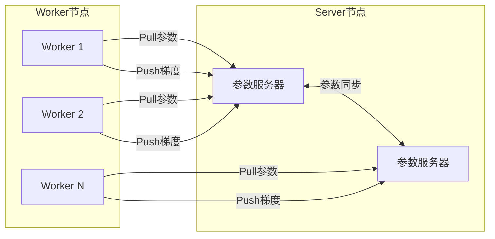

**参数服务器核心流程**

```python
def worker_loop(worker_id):
    while not converged:
        # 1. 从Server拉取最新参数
        params = pull_from_server(param_keys)
        
        # 2. 用本地数据计算梯度
        gradients = compute_gradients(params, local_data)
        
        # 3. 推送梯度到Server
        push_to_server(param_keys, gradients)

def server_loop():
    while not converged:
        # 1. 接收Worker的梯度
        gradients = receive_from_workers()
        
        # 2. 聚合梯度
        aggregated = aggregate(gradients)
        
        # 3. 更新参数
        params = params - learning_rate * aggregated
```

### AllReduce

AllReduce是一种高效的分布式梯度聚合算法，每个节点都持有完整的梯度聚合结果，无需中心化的参数服务器。

**Ring AllReduce**

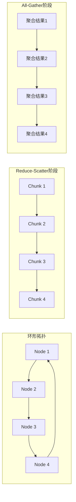

Ring AllReduce是最常用的AllReduce实现，将N个节点排列成环形拓扑：

Ring AllReduce分为两个阶段:

阶段1: Reduce-Scatter
  将梯度分成N份，每个节点负责聚合其中一份
  经过N-1步通信，每个节点持有一份完整的聚合结果

阶段2: All-Gather
  每个节点将自己聚合的那份广播给其他节点
  经过N-1步通信，每个节点持有完整的聚合梯度

通信量: 每个节点发送和接收各 2*(N-1)/N * data_size
        当N较大时，接近 2 * data_size，与节点数无关

**Ring AllReduce伪代码**

```python
def ring_allreduce(node_id, N, local_data):
    data_size = len(local_data)
    chunk_size = data_size / N
    
    # 阶段1: Reduce-Scatter
    for step in range(N - 1):
        send_chunk = (node_id - step) % N
        recv_chunk = (node_id - step - 1) % N
        
        # 异步发送和接收
        send(local_data[send_chunk], to=node_id + 1)
        received = receive(from=node_id - 1)
        
        # 累加
        local_data[recv_chunk] += received
    
    # 阶段2: All-Gather
    for step in range(N - 1):
        send_chunk = (node_id - step + 1) % N
        recv_chunk = (node_id - step) % N
        
        send(local_data[send_chunk], to=node_id + 1)
        local_data[recv_chunk] = receive(from=node_id - 1)
    
    return local_data
```

**AllReduce vs 参数服务器对比**

| 特性 | 参数服务器 | Ring AllReduce |
|------|-----------|----------------|
| 通信模式 | 中心化 | 去中心化 |
| 瓶颈 | Server带宽/计算 | 环上最慢节点 |
| 扩展性 | Server需要扩展 | 通信量与节点数无关 |
| 容错 | Server故障影响大 | 单节点故障影响局部 |
| 适用场景 | 稀疏模型、异步训练 | 密集模型、同步训练 |

### 分布式深度学习训练框架

随着大模型时代的到来，分布式深度学习训练框架不断演进，解决了传统参数服务器和Ring AllReduce无法处理的大规模训练问题。

**Horovod — 分布式训练的Uber**

Horovod由Uber开发，是基于Ring AllReduce的分布式训练库，支持PyTorch、TensorFlow、Keras，特点是改动最小化。

```python
import horovod.torch as hvd

# 初始化Horovod
hvd.init()
torch.cuda.set_device(hvd.local_rank())

# 包装优化器
optimizer = hvd.DistributedOptimizer(
    optimizer, named_parameters=model.named_parameters()
)

# 广播参数（确保所有Worker初始状态一致）
hvd.broadcast_parameters(model.state_dict(), root_rank=0)
hvd.broadcast_optimizer_state(optimizer, root_rank=0)

# 训练循环
for epoch in range(epochs):
    for batch in dataloader:
        loss = model(batch)
        optimizer.zero_grad()
        loss.backward()
        optimizer.step()  # 内部执行Ring AllReduce
```

**DeepSpeed — 微软的大模型训练引擎**

DeepSpeed专注于超大规模模型训练，引入了ZeRO（Zero Redundancy Optimizer）优化器，通过分片消除训练时的内存冗余。

ZeRO优化阶段:
  Stage 1: 优化器状态分片 — 内存减少4x
  Stage 2: + 梯度分片 — 内存减少8x
  Stage 3: + 参数分片 — 内存减少N倍（N=GPU数）

实际效果:
  - 传统DDP: 每个GPU保存完整的模型参数+梯度+优化器状态
  - ZeRO Stage 3: 每个GPU只保存1/N的参数
  - 175B参数的GPT-3训练: 需要ZeRO Stage 3才能放入GPU显存

```python
import deepspeed

# DeepSpeed配置文件
ds_config = {
    "train_batch_size": 256,
    "gradient_accumulation_steps": 8,
    "fp16": {"enabled": True},
    "zero_optimization": {
        "stage": 3,
        "offload_optimizer": {"device": "cpu"},
        "offload_param": {"device": "cpu"},
        "overlap_comm": True,
        "contiguous_gradients": True,
        "reduce_bucket_size": 5e8
    }
}

model_engine, optimizer, _, _ = deepspeed.initialize(
    model=model, config=ds_config
)

# 训练
for batch in dataloader:
    loss = model_engine(batch)
    model_engine.backward(loss)
    model_engine.step()  # 内部执行ZeRO分片的AllReduce
```

**Megatron-LM — NVIDIA的Transformer并行训练**

Megatron-LM实现了模型并行（Model Parallelism），将Transformer的不同层和不同注意力头分布到多个GPU上。

三种并行策略:
  1. 数据并行（Data Parallelism）:
     - 每个GPU持有完整模型，处理不同数据
     - 适合模型能放入单GPU显存的场景

  2. 张量并行（Tensor Parallelism）:
     - 将单层的参数矩阵切分到多个GPU
     - 适合超宽的线性层（如GPT的MLP层）

  3. 流水线并行（Pipeline Parallelism）:
     - 将不同层分配到不同GPU
     - 通过微批次（micro-batch）实现流水线执行
     - 适合超深的模型（如100+层Transformer）

3D并行: 数据并行 + 张量并行 + 流水线并行 组合使用
  - 例: 1024个GPU = 8个节点张量并行 x 4个节点流水线并行 x 32路数据并行

**分布式训练框架对比**

| 框架 | 核心技术 | 支持模型 | 显存优化 | 适用场景 |
|------|---------|---------|---------|---------|
| Horovod | Ring AllReduce | PyTorch/TF/Keras | 无 | 中小规模分布式训练 |
| DeepSpeed | ZeRO分片 | PyTorch | 极强（ZeRO Stage 3） | 超大模型训练（100B+） |
| Megatron-LM | 3D并行 | PyTorch | 强（张量+流水线并行） | 大规模Transformer训练 |
| FSDP | PyTorch原生分片 | PyTorch | 强（类似ZeRO Stage 3） | PyTorch原生生态 |
| ColossalAI | 自动并行 | PyTorch | 强 | 易用的大模型训练 |

***

## 小结

分布式计算的理论基础涵盖了计算模型（MapReduce、RDD、DAG）、时间语义（事件时间、处理时间）、一致性保证（Exactly-Once）、状态管理（Checkpoint、Lineage）等核心概念。理解这些基础理论，是掌握分布式计算框架、解决实际工程问题的前提。下一节将从工程实践角度，提炼分布式计算的核心技巧。

***

# 24.2 核心技巧

本节从工程实践角度，提炼分布式计算中最关键的设计与优化技巧。这些技巧来自大规模生产环境的经验总结，是区分"能跑"和"跑得好"的关键。

***

## 24.2.1 数据倾斜诊断与处理

数据倾斜是分布式计算中最常见的性能杀手。当某个分区的数据量远大于其他分区时，该分区的Task成为整个Job的瓶颈。

### 诊断方法

```sql
-- Spark SQL检查数据分布
SELECT partition_key, COUNT(*) as cnt
FROM table
GROUP BY partition_key
ORDER BY cnt DESC
LIMIT 20;

-- 查看Stage中各Task的执行时间
-- Spark UI → Stages → 点击具体Stage → 查看Task Duration分布
-- 如果max(duration) >> median(duration)，存在数据倾斜
```

### 解决方案

**1. 两阶段聚合（局部聚合 + 全局聚合）**

```python
# Spark示例：先随机前缀局部聚合，再去前缀全局聚合
# 第一阶段：添加随机前缀，局部聚合
rdd = data.map(lambda x: (f"{random.randint(0,9)}_{x[0]}", x[1]))
partial = rdd.reduceByKey(lambda a, b: a + b)

# 第二阶段：去掉前缀，全局聚合
result = partial.map(lambda x: (x[0].split("_")[1], x[1])) \
                .reduceByKey(lambda a, b: a + b)
```

**2. Broadcast Join替代Shuffle Join**

```python
# 当小表可以放入内存时，广播小表避免Shuffle
small_df = spark.table("small_table")  # < 10MB
large_df = spark.table("large_table")

# 自动广播
result = large_df.join(broadcast(small_df), "join_key")
```

**3. 自定义分区器**

```python
class SkewAwarePartitioner:
    """识别倾斜key，将其分散到多个分区"""
    def __init__(self, num_partitions, skew_keys):
        self.num_partitions = num_partitions
        self.skew_keys = skew_keys
    
    def get_partition(self, key):
        if key in self.skew_keys:
            # 倾斜key使用随机分区
            return random.randint(0, self.num_partitions - 1)
        else:
            return hash(key) % self.num_partitions
```

**4. 采样+拆分策略**

1. 采样识别倾斜key（抽样比例通常1-5%）
2. 将倾斜key的数据拆分为多个子集
3. 为每个子集添加随机后缀，单独join
4. 合并结果

***

## 24.2.2 Shuffle优化

Shuffle是分布式计算中开销最大的操作，涉及磁盘IO、网络传输、内存缓冲等多个环节。

### 减少Shuffle数据量

```python
# 错误示例：先shuffle再filter
rdd.map(lambda x: (x.category, x)) \
   .groupByKey() \
   .filter(lambda x: x[0] == "target")

# 正确示例：先filter再shuffle
rdd.filter(lambda x: x.category == "target") \
   .map(lambda x: (x.category, x)) \
   .groupByKey()
```

### 使用Map端预聚合

```python
# groupByKey: 所有数据通过网络传输，内存压力大
rdd.groupByKey().mapValues(sum)

# reduceByKey: Map端先局部聚合，减少Shuffle数据量
rdd.reduceByKey(lambda a, b: a + b)
```

### Shuffle参数调优

```python
# Spark关键Shuffle参数
spark.conf.set("spark.shuffle.compress", "true")           # 压缩Shuffle数据
spark.conf.set("spark.shuffle.spill.compress", "true")      # 压缩溢写数据
spark.conf.set("spark.sql.shuffle.partitions", "500")       # Shuffle分区数
spark.conf.set("spark.reducer.maxSizeInFlight", "96m")      # Shuffle读取缓冲区
spark.conf.set("spark.shuffle.file.buffer", "32k")          # Shuffle写入缓冲区
spark.conf.set("spark.shuffle.sort.bypassMergeThreshold", "400")  # 小分区数时跳过排序
```

***

## 24.2.3 内存管理技巧

### Spark内存调优

```python
# 内存配置策略
# 1. 增加Executor内存
spark.conf.set("spark.executor.memory", "8g")
spark.conf.set("spark.executor.memoryOverhead", "2g")  # 堆外内存

# 2. 调整内存比例
spark.conf.set("spark.memory.fraction", "0.6")         # 执行+存储内存占比
spark.conf.set("spark.memory.storageFraction", "0.5")  # 存储内存占比

# 3. 使用Kryo序列化减少内存占用
spark.conf.set("spark.serializer", "org.apache.spark.serializer.KryoSerializer")
```

### Flink内存管理

Flink采用堆外内存管理，避免JVM GC的影响：

```yaml
# Flink内存配置
taskmanager.memory.process.size: 4096m
taskmanager.memory.task.heap.size: 1024m
taskmanager.memory.task.off-heap.size: 512m
taskmanager.memory.managed.size: 1024m
taskmanager.memory.network.fraction: 0.1
```

***

## 24.2.4 序列化优化

### 序列化框架选择

| 框架 | 性能 | 跨语言 | Schema演进 | 适用场景 |
|------|------|--------|------------|----------|
| Protobuf | ★★★★★ | ✓ | ✓ | 跨语言RPC、数据存储 |
| Kryo | ★★★★★ | ✗ | ✗ | JVM内部序列化 |
| Avro | ★★★★☆ | ✓ | ✓ | 大数据生态、Schema演进 |
| Thrift | ★★★★☆ | ✓ | ✗ | 跨语言RPC |
| Java序列化 | ★★☆☆☆ | ✗ | ✗ | 避免使用 |

### 自定义序列化

```scala
// Spark使用Kryo注册自定义类
val conf = new SparkConf()
  .set("spark.serializer", "org.apache.spark.serializer.KryoSerializer")
  .registerKryoClasses(Array(
    classOf[MyCustomClass],
    classOf[AnotherClass]
  ))
```

***

## 24.2.5 并行度调优

### 并行度设置原则

并行度设置公式:
  ideal_parallelism = max(cluster_cpu_cores, data_size / ideal_partition_size)

Spark:
  spark.default.parallelism = 2-3 * total_executor_cores
  spark.sql.shuffle.partitions = 根据数据量调整（默认200）

Flink:
  parallelism = 算子并行度，根据数据源分区数和CPU核数设置
  maxParallelism = 最大并行度，影响状态分区数（默认128）

### 动态调整并行度

```python
# Spark AQE（Adaptive Query Execution）自动优化
spark.conf.set("spark.sql.adaptive.enabled", "true")
spark.conf.set("spark.sql.adaptive.coalescePartitions.enabled", "true")
spark.conf.set("spark.sql.adaptive.skewJoin.enabled", "true")
```

***

## 24.2.6 反压机制设计

反压（Backpressure）是流处理系统中当下游处理速度跟不上上游数据产生速度时的流量控制机制。

### Flink反压机制

Flink反压原理:
1. 每个Task有一个基于Credit的流控机制
2. 下游Task向上游报告可用的Buffer数量（Credit）
3. 上游根据Credit决定发送速率
4. 当Credit为0时，上游停止发送，实现反压

诊断方法:
1. Flink Web UI → Job Overview → 查看是否出现反压标记
2. Metrics → 检查isBackPressured指标
3. 查看Buffer利用率和Checkpoint耗时

### 反压优化策略

1. 增加算子并行度，分散处理压力
2. 优化算子处理逻辑，减少单条记录处理时间
3. 增大网络缓冲区，提高吞吐量
4. 使用异步IO处理外部系统调用
5. 合理设置Checkpoint间隔，避免Checkpoint放大反压

***

## 24.2.7 Join优化策略

### 常见Join类型与适用场景

1. Broadcast Hash Join
   条件: 一侧数据可放入内存（< 10MB）
   优势: 无Shuffle，性能最优
   
2. Sort-Merge Join
   条件: 两侧数据量都较大
   流程: 两侧数据按key排序 → 合并
   优势: 适合大数据量join

3. Shuffle Hash Join
   条件: 一侧数据经Shuffle后可放入内存
   流程: 两侧数据Shuffle → 小侧构建哈希表 → 探测

4. Bucket Join
   条件: 两侧数据按相同规则分桶
   优势: 无Shuffle，直接按桶join

### Join优化技巧

```python
# 1. 提前过滤，减少Join数据量
a_filtered = a.filter(col("date") >= "2024-01-01")
b_filtered = b.filter(col("status") == "active")
result = a_filtered.join(b_filtered, "key")

# 2. 指定Join策略
from pyspark.sql.functions import broadcast
result = large_df.join(broadcast(small_df), "key")

# 3. 使用Bucket Join预处理
# 写入时分桶
df.write.bucketBy(100, "key").sortBy("key").saveAsTable("bucketed_table")
# Join时直接按桶匹配，无Shuffle
t1.join(t2, "key")  # 自动使用Bucket Join
```

***

## 24.2.8 资源隔离与多租户

### 资源隔离策略

1. 队列隔离: 为不同业务分配独立队列
   - 实时任务队列: 高优先级，资源预留
   - 批处理任务队列: 低优先级，弹性资源

2. 容器资源限制:
   - CPU: cgroup限制CPU份额和核数
   - Memory: 设置JVM堆大小和堆外内存

3. 磁盘IO隔离:
   - 使用不同的磁盘目录
   - 限制IO带宽

4. 网络隔离:
   - 设置网络带宽限制
   - 使用不同的网络接口

***

## 24.2.9 监控与调优闭环

### 关键监控指标

| 层面 | 指标 | 正常范围 | 异常处理 |
|------|------|----------|----------|
| 系统 | CPU利用率 | 70-85% | 增加节点或优化代码 |
| 系统 | 内存使用率 | 60-80% | 检查GC、调整堆大小 |
| 系统 | 磁盘IO | 稳定 | 优化Shuffle、Checkpoint |
| 应用 | 吞吐量 | 业务基线 | 检查瓶颈 |
| 应用 | 延迟 | SLA要求 | 优化热点路径 |
| 应用 | Checkpoint耗时 | < 间隔50% | 增大间隔或优化状态 |
| 任务 | Task执行时间分布 | 无长尾 | 排查数据倾斜 |
| 任务 | Shuffle读写数据量 | 稳定 | 优化Shuffle策略 |

### 调优闭环

1. 基准测试: 建立性能基线
2. 瓶颈分析: 通过监控指标定位瓶颈
3. 假设验证: 针对瓶颈提出优化假设
4. A/B测试: 在测试环境验证优化效果
5. 灰度上线: 小范围上线验证
6. 全量发布: 确认效果后全量部署
7. 持续监控: 建立持续监控机制

***

## 小结

分布式计算的核心技巧可以归纳为三个层面：数据层面（分区、Shuffle、Join优化）、资源层面（内存、序列化、并行度调优）、架构层面（反压、容错、监控）。掌握这些技巧，需要在理解原理的基础上，结合实际场景不断实践和调优。下一节将通过实战案例展示这些技巧的具体应用。

***

# 24.3 实战案例

本节通过四个真实场景展示分布式计算的应用，涵盖批处理、流处理、机器学习等典型场景。

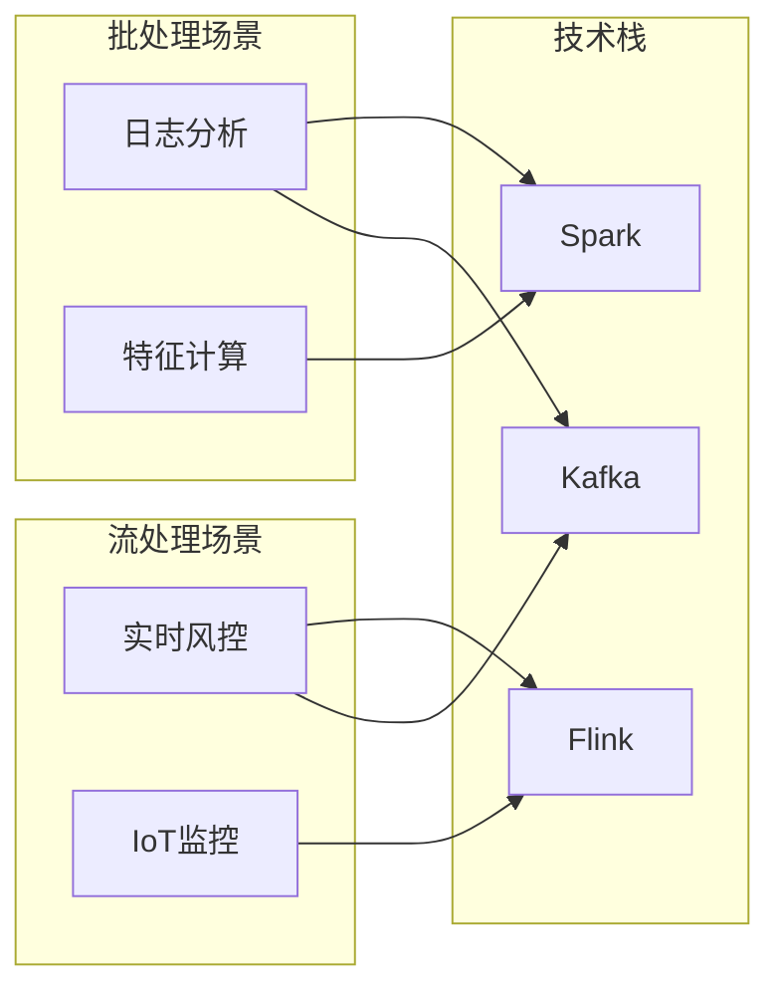

***

## 24.3.1 大规模日志分析系统

### 业务背景

某互联网公司每天产生约500GB的访问日志，需要构建一个日志分析系统，支持：
- 每日PV/UV统计
- 用户行为路径分析
- 异常请求检测
- 实时大盘展示

### 架构设计

数据流:
  Nginx日志 → Kafka → Flink实时处理 → ClickHouse → Grafana
                    → Spark批处理 → Hive → 报表系统

### Spark批处理实现

```python
from pyspark.sql import SparkSession
from pyspark.sql.functions import *

spark = SparkSession.builder \
    .appName("LogAnalysis") \
    .config("spark.sql.shuffle.partitions", "500") \
    .config("spark.sql.adaptive.enabled", "true") \
    .getOrCreate()

# 读取日志
logs = spark.read.parquet("hdfs://logs/access/2024/01/15")

# PV/UV统计
pv_uv = logs.groupBy(
    window(col("timestamp"), "1 hour"),
    col("page")
).agg(
    count("*").alias("pv"),
    countDistinct("user_id").alias("uv")
)

# 异常请求检测（状态码分布）
error_stats = logs.filter(col("status_code") >= 500) \
    .groupBy(
        window(col("timestamp"), "5 minutes"),
        col("api_path")
    ).agg(
        count("*").alias("error_count"),
        collect_set("status_code").alias("status_codes")
    ).filter(col("error_count") > 100)  # 阈值告警

# 用户路径分析
user_paths = logs.select(
    col("user_id"),
    col("page"),
    col("timestamp"),
    lag("page").over(
        Window.partitionBy("user_id").orderBy("timestamp")
    ).alias("prev_page")
).filter(col("prev_page").isNotNull())

# 写入Hive
pv_uv.write.mode("overwrite").saveAsTable("analytics.daily_pv_uv")
```

### 性能优化要点

1. 数据倾斜处理
   - 热门页面单独处理：filter出top 100页面，单独聚合
   - 使用AQE自动合并小分区

2. Shuffle优化
   - 启用Shuffle压缩，减少网络传输
   - 合理设置shuffle分区数（数据量/128MB）

3. 缓存策略
   - 频繁访问的维度表缓存到内存
   - 使用Broadcast Join关联维度信息

***

## 24.3.2 实时风控系统

### 业务背景

金融交易平台需要实时检测异常交易，要求：
- 端到端延迟 < 100ms
- 支持复杂规则引擎
- 状态管理（用户行为序列）
- Exactly-Once语义

### Flink流处理实现

```java
public class RiskControlJob {
    public static void main(String[] args) throws Exception {
        StreamExecutionEnvironment env = StreamExecutionEnvironment.getExecutionEnvironment();
        
        // 启用Checkpoint，保证Exactly-Once
        env.enableCheckpointing(60000, CheckpointingMode.EXACTLY_ONCE);
        env.getCheckpointConfig().setCheckpointTimeout(120000);
        env.getCheckpointConfig().setMinPauseBetweenCheckpoints(30000);
        env.getCheckpointConfig().enableExternalizedCheckpoints(
            ExternalizedCheckpointCleanup.RETAIN_ON_CANCELLATION);
        
        // 状态后端：RocksDB支持超大状态
        env.setStateBackend(new RocksDBStateBackend("hdfs://checkpoints/risk-control"));
        
        // 数据源：Kafka
        KafkaSource<Transaction> source = KafkaSource.<Transaction>builder()
            .setBootstrapServers("kafka:9092")
            .setTopics("transactions")
            .setGroupId("risk-control")
            .setStartingOffsets(OffsetsInitializer.latest())
            .setValueOnlyDeserializer(new TransactionDeserializer())
            .build();
        
        DataStream<Transaction> transactions = env.fromSource(
            source, WatermarkStrategy.forBoundedOutOfOrderness(Duration.ofSeconds(5)),
            "Kafka Source");
        
        // 规则1: 短时间内大额交易
        DataStream<Alert> highAmountAlerts = transactions
            .keyBy(Transaction::getUserId)
            .window(SlidingEventTimeWindows.of(Time.minutes(10), Time.minutes(1)))
            .aggregate(new HighAmountDetector(100000));  // 10万阈值
        
        // 规则2: 频繁交易检测
        DataStream<Alert> frequencyAlerts = transactions
            .keyBy(Transaction::getUserId)
            .process(new FrequencyDetector(20, Time.minutes(5)));  // 5分钟内超过20笔
        
        // 规则3: 异常地理位置
        DataStream<Alert> geoAlerts = transactions
            .keyBy(Transaction::getUserId)
            .process(new GeoAnomalyDetector());
        
        // 合并告警
        DataStream<Alert> allAlerts = highAmountAlerts
            .union(frequencyAlerts, geoAlerts);
        
        // 输出到Kafka和数据库
        allAlerts.sinkTo(KafkaSink.<Alert>builder()
            .setBootstrapServers("kafka:9092")
            .setRecordSerializer(...)
            .build());
        
        env.execute("Real-time Risk Control");
    }
}
```

### 状态管理策略

```java
// 用户行为序列状态
public class FrequencyDetector extends KeyedProcessFunction<String, Transaction, Alert> {
    // 使用ValueState存储用户交易计数
    private ValueState<Integer> countState;
    private ValueState<Long> windowStartState;
    
    @Override
    public void open(Configuration parameters) {
        countState = getRuntimeContext().getState(
            new ValueStateDescriptor<>("count", Integer.class));
        windowStartState = getRuntimeContext().getState(
            new ValueStateDescriptor<>("window-start", Long.class));
    }
    
    @Override
    public void processElement(Transaction tx, Context ctx, Collector<Alert> out) 
            throws Exception {
        Integer count = countState.value();
        Long windowStart = windowStartState.value();
        
        if (windowStart == null || ctx.timestamp() - windowStart > windowDuration) {
            // 新窗口
            windowStartState.update(ctx.timestamp());
            countState.update(1);
            // 注册窗口结束定时器
            ctx.timerService().registerEventTimeTimer(ctx.timestamp() + windowDuration);
        } else {
            countState.update(count + 1);
            if (count + 1 > threshold) {
                out.collect(new Alert(tx.getUserId(), "FREQUENCY_ANOMALY", tx));
            }
        }
    }
}
```

***

## 24.3.3 推荐系统离线特征计算

### 业务背景

推荐系统需要离线计算用户和物品的特征向量，每天处理约10亿条用户行为日志。

### Spark实现

```python
from pyspark.sql import SparkSession
from pyspark.ml.feature import StringIndexer, VectorAssembler
from pyspark.ml.recommendation import ALS

spark = SparkSession.builder.appName("RecommendationFeatures").getOrCreate()

# 用户行为特征
user_behavior = spark.read.parquet("hdfs://data/user_actions")

# 1. 用户活跃度特征
user_activity = user_behavior.groupBy("user_id").agg(
    count("*").alias("total_actions"),
    countDistinct("item_id").alias("unique_items"),
    countDistinct("date").alias("active_days"),
    sum(when(col("action") == "purchase", 1).otherwise(0)).alias("purchase_count"),
    avg("duration").alias("avg_session_duration")
)

# 2. 物品热度特征
item_popularity = user_behavior.groupBy("item_id").agg(
    count("*").alias("total_interactions"),
    countDistinct("user_id").alias("unique_users"),
    sum(when(col("action") == "purchase", 1).otherwise(0)).alias("purchase_count"),
    avg("rating").alias("avg_rating")
)

# 3. 协同过滤特征（ALS）
ratings = user_behavior.filter(col("action") == "rating") \
    .select("user_id_index", "item_id_index", "rating")

als = ALS(
    maxIter=10,
    regParam=0.1,
    rank=128,
    userCol="user_id_index",
    itemCol="item_id_index",
    ratingCol="rating",
    coldStartStrategy="drop"
)
model = als.fit(ratings)

# 提取用户和物品的隐向量
user_factors = model.userFactors  # user_id -> 128维向量
item_factors = model.itemFactors  # item_id -> 128维向量

# 4. 写入特征存储
user_activity.write.mode("overwrite").parquet("hdfs://features/user_activity")
item_popularity.write.mode("overwrite").parquet("hdfs://features/item_popularity")
user_factors.write.mode("overwrite").parquet("hdfs://features/user_vectors")
item_factors.write.mode("overwrite").parquet("hdfs://features/item_vectors")
```

***

## 24.3.4 IoT数据流处理

### 业务背景

工业物联网场景，数万台设备每秒上报传感器数据，需要实时监控设备状态并检测异常。

### Flink实现

```java
public class IoTMonitoringJob {
    public static void main(String[] args) throws Exception {
        StreamExecutionEnvironment env = StreamExecutionEnvironment.getExecutionEnvironment();
        env.setParallelism(16);
        
        // 数据源
        DataStream<SensorData> sensorStream = env
            .addSource(new IoTDataSource())  // 模拟IoT数据源
            .assignTimestampsAndWatermarks(
                WatermarkStrategy.<SensorData>forBoundedOutOfOrderness(Duration.ofSeconds(10))
                    .withTimestampAssigner((event, timestamp) -> event.getTimestamp()));
        
        // 按设备ID分区
        KeyedStream<SensorData, String> keyedStream = sensorStream
            .keyBy(SensorData::getDeviceId);
        
        // 滑动窗口统计
        DataStream<DeviceMetrics> metrics = keyedStream
            .window(SlidingEventTimeWindows.of(Time.minutes(5), Time.minutes(1)))
            .aggregate(new SensorAggregator());
        
        // 异常检测
        DataStream<Alert> alerts = keyedStream
            .process(new AnomalyDetector());
        
        // 设备状态机
        DataStream<DeviceState> deviceStates = keyedStream
            .process(new DeviceStateMachine());
        
        // 多路输出
        OutputTag<Alert> criticalTag = new OutputTag<Alert>("critical"){};
        OutputTag<Alert> warningTag = new OutputTag<Alert>("warning"){};
        
        SingleOutputStreamOperator<ProcessedData> mainStream = sensorStream
            .process(new AlertClassifier(criticalTag, warningTag));
        
        // 输出
        mainStream.getSideOutput(criticalTag)
            .addSink(new CriticalAlertSink());
        mainStream.getSideOutput(warningTag)
            .addSink(new WarningAlertSink());
        metrics.addSink(new MetricsSink());
        
        env.execute("IoT Monitoring");
    }
}
```

***

## 小结

实战案例展示了分布式计算在不同场景下的应用：批处理适合离线分析和特征计算，流处理适合实时监控和风控系统。关键设计原则包括：选择合适的计算模型、合理设置并行度、优化数据分区、保证数据一致性。下一节将总结分布式计算中的常见误区。

***

# 24.4 常见误区

分布式计算涉及复杂的系统设计和调优，工程师容易陷入以下认知偏差和设计陷阱。

***

## 24.4.1 误区一：分布式一定比单机快

### 问题描述

许多工程师认为只要把任务分布到多台机器上，执行速度就会线性提升。实际上，分布式计算引入了额外的开销：
- **网络通信开销**：数据在节点间传输需要时间
- **序列化/反序列化开销**：数据转换为网络可传输格式
- **调度开销**：任务分配和协调需要时间
- **Shuffle开销**：数据重分布是最昂贵的操作

### 正确理解

Amdahl定律:
  加速比 = 1 / (S + P/N)
  其中: S = 串行比例, P = 并行比例, N = 节点数

当S > 0时，加速比有上限: 1/S

实际案例:
  - 单机处理1GB数据: 10秒
  - 10台机器处理1GB数据: 15秒（Shuffle开销 > 并行收益）
  - 10台机器处理100GB数据: 30秒（并行收益显著）

### 建议

- 数据量小（< 10GB）时，单机处理可能更快
- 分布式的优势在于处理超出单机能力的数据量
- 先评估数据量和计算复杂度，再决定是否分布式

***

## 24.4.2 误区二：忽视数据倾斜

### 问题描述

数据倾斜是分布式计算中最常见但最容易被忽视的问题。典型表现：
- 某些Task执行时间远超其他Task
- 整体Job完成时间由最慢的Task决定
- 资源利用率不均衡

### 常见倾斜场景

1. 热点Key: 某些key的数据量远超其他key
   例: 电商场景中，热门商品的点击量是普通商品的1000倍

2. 空值过多: JOIN key中大量NULL值
   例: 用户表和订单表LEFT JOIN，大量用户没有订单

3. 数据类型不均: 按类型分组时，某类数据占比过高
   例: 日志中INFO级别占95%，ERROR级别占1%

### 解决方案

```python
# 方案1: 两阶段聚合
# 第一阶段: 随机前缀局部聚合
rdd.map(lambda x: (f"{random.randint(0,9)}_{x[0]}", x[1])) \
   .reduceByKey(lambda a, b: a + b)
# 第二阶段: 去前缀全局聚合
   .map(lambda x: (x[0].split("_")[1], x[1]))
   .reduceByKey(lambda a, b: a + b)

# 方案2: Broadcast Join
small_df = broadcast(spark.table("small_table"))
result = large_df.join(small_df, "key")

# 方案3: 过滤空值
result = df.filter(col("key").isNotNull())
```

***

## 24.4.3 误区三：混淆Exactly-Once语义

### 问题描述

很多工程师认为Exactly-Once意味着"消息只被处理一次"，实际上这是不可能的（网络可能重传）。Exactly-Once的真正含义是"每条消息的效果恰好被执行一次"。

### 语义层次

1. At-Most-Once: 消息最多传递一次，可能丢失
   实现: 发送后不等待确认
   场景: 日志收集、监控指标

2. At-Least-Once: 消息至少传递一次，可能重复
   实现: 发送失败重试 + 接收端去重
   场景: 大部分业务场景

3. Exactly-Once: 消息效果恰好执行一次
   实现: 幂等操作 + 事务 + 去重
   场景: 金融交易、订单处理

### 实现Exactly-Once的关键

1. Source支持重放
   - Kafka: 按offset重放
   - 文件系统: 按文件偏移重放

2. 内部状态一致性
   - Checkpoint机制
   - 分布式快照（Chandy-Lamport）

3. Sink支持事务写入
   - Kafka事务性Producer
   - 数据库两阶段提交
   - 幂等写入（带唯一ID去重）

***

## 24.4.4 误区四：过度依赖Shuffle

### 问题描述

有些工程师习惯性地使用groupByKey、join等Shuffle操作，而忽略了更高效的替代方案。

### 低效模式

```python
# 低效: groupByKey后聚合
rdd.groupByKey().mapValues(sum)
# 问题: 所有数据通过网络传输，内存压力大

# 低效: 多次Shuffle
rdd1 = data.groupByKey()
rdd2 = rdd1.join(other_data)
rdd3 = rdd2.groupByKey()
# 问题: 每次Shuffle都有网络和磁盘开销
```

### 高效替代

```python
# 高效: 使用reduceByKey替代groupByKey
rdd.reduceByKey(lambda a, b: a + b)
# Map端预聚合，减少Shuffle数据量

# 高效: 使用map-side预聚合
rdd.combineByKey(
    createCombiner=lambda x: (x, 1),
    mergeValue=lambda acc, x: (acc[0] + x, acc[1] + 1),
    mergeCombiners=lambda a, b: (a[0] + b[0], a[1] + b[1])
)

# 高效: 合并多个操作
data.filter(condition) \
    .map(transform) \
    .reduceByKey(aggregate)  # 一次Shuffle完成
```

***

## 24.4.5 误区五：忽视GC对流处理的影响

### 问题描述

JVM的垃圾回收（GC）会导致Stop-The-World（STW）暂停，在流处理场景中可能造成：
- 数据处理延迟增加
- Checkpoint超时
- 反压触发

### 优化策略

1. 使用堆外内存
   - Flink: RocksDB状态后端
   - Spark: 启用堆外内存

2. 选择合适的GC算法
   - G1GC: 适合大堆内存（> 8GB）
   - ZGC: 超低延迟（< 10ms暂停）
   - 配置: -XX:+UseG1GC -XX:MaxGCPauseMillis=200

3. 减少对象创建
   - 复用对象，避免频繁创建临时对象
   - 使用基本类型替代包装类型
   - 使用Flink的自定义序列化

4. 合理设置堆大小
   - 不要设置过大（增加GC压力）
   - 监控GC时间占比，保持在10%以下

***

## 24.4.6 误区六：Checkpoint间隔设置不合理

### 问题描述

Checkpoint间隔设置过长，故障恢复时数据丢失多；设置过短，影响正常处理性能。

### 最佳实践

Checkpoint间隔设置原则:

1. 根据业务延迟要求设置
   - 实时风控: 10-30秒
   - 实时报表: 1-5分钟
   - 离线处理: 5-15分钟

2. 根据状态大小调整
   - 状态大: 增加间隔，避免频繁写入
   - 状态小: 可以缩短间隔

3. 监控Checkpoint耗时
   - Checkpoint耗时应 < 50% * Checkpoint间隔
   - 如果耗时过长，优化状态大小或增加并行度

4. 配置最小间隔
   - 设置minPauseBetweenCheckpoints，避免Checkpoint重叠

***

## 24.4.7 误区七：盲目增加并行度

### 问题描述

有些工程师认为增加并行度就能提升性能，但实际上过度并行会带来问题。

### 过度并行的问题

1. 资源竞争
   - CPU核心争抢
   - 内存不足导致频繁GC
   - 磁盘IO瓶颈

2. 网络开销增加
   - 更多的Shuffle分区 = 更多的网络连接
   - 小分区问题: 每个分区数据量太小，调度开销占比高

3. 状态管理复杂度增加
   - 更多的状态分区 = 更多的Checkpoint开销
   - KeyGroup数量增加

### 合理设置并行度

经验公式:
  并行度 = 2-3 * CPU核数

调整步骤:
1. 从默认值开始（如Spark的200，Flink的128）
2. 监控资源利用率，如果CPU利用率 < 50%，可以降低并行度
3. 监控任务执行时间，如果存在长尾，适当增加并行度
4. 考虑数据源分区数，保持一致

***

## 24.4.8 误区八：忽视数据本地性

### 问题描述

有些工程师不关心数据本地性，导致大量跨节点数据传输。

### 数据本地性优化

数据本地性优先级:
1. PROCESS_LOCAL: 数据在同一个JVM进程中
2. NODE_LOCAL: 数据在同一个节点上
3. RACK_LOCAL: 数据在同一个机架上
4. ANY: 数据在任意位置

优化策略:
1. 调整等待时间
   spark.locality.wait = 3s（默认）
   spark.locality.wait.process = 1s
   spark.locality.wait.node = 3s
   spark.locality.wait.rack = 5s

2. 合理设置分区数
   - 分区数 ≈ 节点数 * 每节点核数
   - 避免分区数太少导致数据倾斜

3. 使用数据预处理
   - 将数据预分区存储
   - 使用Bucket表

***

## 小结

分布式计算中的常见误区可以归纳为：性能误区（分布式一定快、盲目增加并行度）、语义误区（混淆Exactly-Once）、工程误区（忽视数据倾斜、过度依赖Shuffle）、运维误区（GC优化、Checkpoint配置）。避免这些误区的关键是深入理解原理，结合实际场景进行调优，而不是盲目套用最佳实践。

***

# 24.5 练习方法

分布式计算的学习需要理论与实践相结合。本节提供从入门到精通的系统化学习路径。

***

## 24.5.1 环境搭建

### 本地开发环境

```bash
# 1. 安装Java 11
sudo apt install openjdk-11-jdk

# 2. 安装Spark（本地模式）
wget https://dlcdn.apache.org/spark/spark-3.5.0/spark-3.5.0-bin-hadoop3.tgz
tar xzf spark-3.5.0-bin-hadoop3.tgz
export SPARK_HOME=/opt/spark-3.5.0-bin-hadoop3

# 3. 安装Flink（本地模式）
wget https://dlcdn.apache.org/flink/flink-1.18.0/flink-1.18.0-bin-scala_2.12.tgz
tar xzf flink-1.18.0-bin-scala_2.12.tgz
export FLINK_HOME=/opt/flink-1.18.0

# 4. 启动本地集群
$SPARK_HOME/sbin/start-master.sh
$SPARK_HOME/sbin/start-worker.sh spark://localhost:7077

$FLINK_HOME/bin/start-cluster.sh
```

### Docker环境

```yaml
# docker-compose.yml
version: '3'
services:
  kafka:
    image: confluentinc/cp-kafka:7.5.0
    ports:
      - "9092:9092"
    environment:
      KAFKA_ADVERTISED_LISTENERS: PLAINTEXT://kafka:9092
  
  flink-jobmanager:
    image: flink:1.18.0
    ports:
      - "8081:8081"
    command: jobmanager
  
  flink-taskmanager:
    image: flink:1.18.0
    depends_on:
      - flink-jobmanager
    command: taskmanager
```

***

## 24.5.2 经典论文阅读

### 必读论文清单

| 论文 | 年份 | 核心内容 | 重点 |
|------|------|----------|------|
| MapReduce: Simplified Data Processing on Large Clusters | 2004 | 分布式计算基本模型 | Map和Reduce的抽象、容错机制 |
| Resilient Distributed Datasets: A Fault-Tolerant Abstraction for In-Memory Cluster Computing | 2012 | Spark核心抽象 | RDD的五大特性、Lineage容错 |
| The Dataflow Model: A Practical Approach to Balancing Correctness, Latency, and Cost | 2015 | 统一批流处理模型 | 窗口机制、触发器、水印 |
| Discretized Streams: Fault-Tolerant Streaming Computation at Scale | 2012 | Spark Streaming微批处理 | DStream、微批处理原理 |
| Lightweight Asynchronous Snapshots for Distributed Dataflows | 2015 | Flink Checkpoint机制 | Chandy-Lamport算法、Barrier对齐 |
| Scaling Distributed Machine Learning with the Parameter Server | 2014 | 参数服务器架构 | 一致性哈希、异步训练 |

### 论文阅读方法

1. 第一遍: 快速浏览
   - 读摘要、引言、结论
   - 理解论文解决什么问题

2. 第二遍: 理解方法
   - 读系统设计、算法描述
   - 理解核心创新点

3. 第三遍: 深入细节
   - 读实现细节、实验结果
   - 理解工程权衡

4. 实践验证
   - 搭建环境运行示例
   - 修改参数观察行为变化

***

## 24.5.3 动手实现Mini计算引擎

### 实现一个简单的MapReduce引擎

```python
from multiprocessing import Pool
from collections import defaultdict
import json

class MiniMapReduce:
    """教学用Mini MapReduce引擎"""
    
    def __init__(self, num_workers=4):
        self.num_workers = num_workers
    
    def run(self, input_data, map_fn, reduce_fn):
        # 1. 分片
        chunk_size = len(input_data) // self.num_workers
        chunks = [input_data[i:i+chunk_size] 
                  for i in range(0, len(input_data), chunk_size)]
        
        # 2. Map阶段（并行）
        with Pool(self.num_workers) as pool:
            map_results = pool.map(
                lambda chunk: self._map_phase(chunk, map_fn), 
                chunks
            )
        
        # 3. Shuffle阶段
        shuffled = defaultdict(list)
        for result in map_results:
            for key, value in result:
                shuffled[key].append(value)
        
        # 4. Reduce阶段（并行）
        items = list(shuffled.items())
        with Pool(self.num_workers) as pool:
            results = pool.map(
                lambda item: reduce_fn(item[0], item[1]),
                items
            )
        
        return dict(results)
    
    def _map_phase(self, chunk, map_fn):
        results = []
        for record in chunk:
            for key, value in map_fn(record):
                results.append((key, value))
        return results


# 使用示例
def word_count_map(line):
    results = []
    for word in line.strip().split():
        results.append((word, 1))
    return results

def word_count_reduce(key, values):
    return (key, sum(values))

# 测试
mr = MiniMapReduce(num_workers=4)
input_data = [
    "hello world hello",
    "world hello world",
    "foo bar foo"
]
result = mr.run(input_data, word_count_map, word_count_reduce)
print(result)  # {'hello': 3, 'world': 3, 'foo': 2, 'bar': 1}
```

### 实现一个简单的流处理窗口

```python
import time
from collections import defaultdict
from dataclasses import dataclass
from typing import Callable, List, Tuple

@dataclass
class Event:
    key: str
    value: float
    timestamp: float

class TumblingWindow:
    """教学用滚动窗口"""
    
    def __init__(self, window_size_ms: int, aggregate_fn: Callable):
        self.window_size_ms = window_size_ms
        self.aggregate_fn = aggregate_fn
        self.windows = defaultdict(list)
    
    def process(self, event: Event):
        window_id = int(event.timestamp * 1000) // self.window_size_ms
        self.windows[window_id].append(event)
    
    def get_results(self):
        results = {}
        for window_id, events in sorted(self.windows.items()):
            window_start = window_id * self.window_size_ms / 1000
            window_end = (window_id + 1) * self.window_size_ms / 1000
            aggregated = self.aggregate_fn(events)
            results[(window_start, window_end)] = aggregated
        return results

# 使用示例
def count_aggregate(events: List[Event]) -> int:
    return len(events)

window = TumblingWindow(window_size_ms=5000, aggregate_fn=count_aggregate)

# 模拟事件
events = [
    Event("sensor1", 25.0, 1.0),
    Event("sensor2", 30.0, 2.0),
    Event("sensor1", 26.0, 3.0),
    Event("sensor2", 31.0, 6.0),  # 下一个窗口
]

for event in events:
    window.process(event)

print(window.get_results())
# {(1.0, 6.0): 3, (6.0, 11.0): 1}
```

***

## 24.5.4 Spark/Flink实战练习

### 练习1: WordCount（入门）

```python
# Spark WordCount
from pyspark.sql import SparkSession

spark = SparkSession.builder.appName("WordCount").getOrCreate()
text = spark.read.text("hdfs://data/text")
words = text.select(explode(split(col("value"), "\\s+")).alias("word"))
word_counts = words.groupBy("word").count().orderBy(col("count").desc())
word_counts.show()
```

### 练习2: 实时词频统计（进阶）

```java
// Flink实时词频统计
DataStream<String> text = env.socketTextStream("localhost", 9999);
DataStream<Tuple2<String, Integer>> counts = text
    .flatMap(new Tokenizer())
    .keyBy(value -> value.f0)
    .sum(1);
counts.print();
```

### 练习3: 多流JOIN（高级）

```python
# Spark Structured Streaming多流JOIN
orders = spark.readStream.format("kafka") \
    .option("subscribe", "orders").load()
payments = spark.readStream.format("kafka") \
    .option("subscribe", "payments").load()

result = orders.join(payments, "order_id", "inner")
query = result.writeStream.outputMode("append").start()
```

***

## 24.5.5 性能调优实战

### 练习: 数据倾斜诊断与优化

```python
# 1. 创建倾斜数据
skewed_data = []
for i in range(1000000):
    if i % 100 == 0:
        skewed_data.append(("hot_key", i))  # 1%的hot_key
    else:
        skewed_data.append((f"key_{i % 10000}", i))

# 2. 观察执行时间
import time
rdd = spark.sparkContext.parallelize(skewed_data)

# 方案1: 直接reduceByKey
start = time.time()
result1 = rdd.reduceByKey(lambda a, b: a + b).collect()
print(f"直接reduceByKey: {time.time() - start:.2f}s")

# 方案2: 两阶段聚合
start = time.time()
result2 = rdd.map(lambda x: (f"{hash(x[0]) % 10}_{x[0]}", x[1])) \
    .reduceByKey(lambda a, b: a + b) \
    .map(lambda x: (x[0].split("_", 1)[1], x[1])) \
    .reduceByKey(lambda a, b: a + b) \
    .collect()
print(f"两阶段聚合: {time.time() - start:.2f}s")
```

***

## 24.5.6 学习资源推荐

### 书籍

- **《Learning Spark》** - Spark官方指南，适合入门
- **《Spark: The Definitive Guide》** - Spark权威指南，适合深入学习
- **《Stream Processing with Apache Flink》** - Flink流处理实战
- **《Designing Data-Intensive Applications》** - 分布式系统设计圣经
- **《数据密集型应用系统设计》** - 中文版，适合国内读者

### 在线课程

- **Stanford CS245**: Principles of Data-Intensive Systems
- **CMU 15-440**: Distributed Systems
- **Apache Flink官方培训**: 官方认证课程
- **Databricks Academy**: Spark官方培训平台

### 开源项目

- **Apache Spark**: github.com/apache/spark
- **Apache Flink**: github.com/apache/flink
- **Apache Beam**: github.com/apache/beam
- **Apache Kafka**: github.com/apache/kafka

***

## 小结

分布式计算的学习路径应该是：环境搭建 → 论文阅读 → 动手实现 → 框架实战 → 性能调优 → 生产实践。关键是要在理解原理的基础上，通过大量练习积累经验。建议从Mini引擎实现开始，逐步过渡到框架使用和生产调优。

***

# 24.6 本章小结

本章系统介绍了分布式计算的理论基础、核心技巧、实战经验和学习方法。以下是关键要点总结。

***

## 核心思想

分布式计算的本质是**将大规模计算任务分解为多个子任务，分布到多台机器上并行执行，最终汇总结果**。这一思想贯穿本章所有内容。

### 四大计算范式

1. 批处理（MapReduce/Spark）
   - 适用场景: 离线分析、ETL、特征工程
   - 核心思想: Map-Reduce两阶段，DAG优化
   - 代表系统: Hadoop MapReduce、Apache Spark

2. 流处理（Flink/Kafka Streams）
   - 适用场景: 实时监控、风控、推荐
   - 核心思想: 窗口机制、Watermark、Exactly-Once
   - 代表系统: Apache Flink、Kafka Streams

3. Actor模型（Erlang/Akka）
   - 适用场景: 并发编程、微服务、事件驱动
   - 核心思想: 消息传递、监督树、Let it crash
   - 代表系统: Erlang/OTP、Akka

4. 架构范式（Lambda/Kappa）
   - Lambda架构: 批处理+速度层，适合混合工作负载
   - Kappa架构: 纯流处理，通过Kafka重放实现重算
   - 选择依据: 业务对延迟和准确性的权衡

***

## 关键技术要点

### 计算模型

- **MapReduce**: 简单但表达能力有限，适合ETL场景
- **RDD/DAG**: Spark的核心抽象，惰性计算+DAG优化
- **DataStream**: Flink的流处理抽象，支持丰富的窗口和时间语义
- **PCollection**: Beam的统一抽象，支持跨引擎移植

### 状态管理

- **Checkpoint**: 定期保存状态快照，支持故障恢复
- **Lineage**: 记录数据血缘，支持分区重算
- **State Backend**: RocksDB支持超大状态，内存状态后端支持低延迟

### 容错机制

- **Exactly-Once**: 源重放 + 状态快照 + 事务写入
- **Speculative Execution**: 推测执行解决慢节点问题
- **监督策略**: Actor模型的故障恢复机制

### 性能优化

- **数据倾斜**: 两阶段聚合、Broadcast Join、自定义分区
- **Shuffle优化**: 减少数据量、压缩、合理分区数
- **内存管理**: 堆外内存、统一内存管理、GC调优
- **并行度**: 根据CPU核数和数据量设置，避免过度并行

### 现代分布式计算

- **Ray**: AI/ML原生的动态任务图计算，支持异构GPU调度
- **Dask**: Python原生的分布式计算，扩展NumPy/Pandas/Scikit-learn
- **Trino**: 交互式联邦SQL查询，支持跨多种数据源
- **数据湖仓**: Delta Lake/Iceberg/Hudi，统一数据湖和数据仓库
- **分布式训练**: DeepSpeed ZeRO分片、Megatron-LM 3D并行、Horovod Ring AllReduce

***

## 框架选择指南

选择Spark的场景:
  - 批处理为主，偶尔流处理
  - 数据量大，需要复杂ETL
  - 团队熟悉SQL，使用Spark SQL
  - 需要与Hadoop生态集成

选择Flink的场景:
  - 流处理为主，需要低延迟
  - 需要复杂窗口和时间语义
  - 状态管理需求大（> 100GB）
  - 需要Exactly-Once保证

选择Kafka Streams的场景:
  - 轻量级流处理
  - 微服务架构
  - 已有Kafka基础设施
  - 不需要独立集群

选择Beam的场景:
  - 需要跨引擎移植
  - 统一批流处理模型
  - 未来可能更换执行引擎

***

## 工程实践原则

1. **先单机后分布式**: 数据量小、单机能处理时，不要分布式
2. **理解数据分布**: 识别热点key、空值、数据倾斜
3. **监控先行**: 建立完善的监控体系，再进行调优
4. **渐进式优化**: 先保证正确性，再优化性能
5. **容错设计**: 从一开始就考虑故障恢复策略

***

## 学习建议

初级阶段（1-3个月）:
  - 搭建本地开发环境
  - 完成WordCount等入门示例
  - 阅读MapReduce论文
  - 理解Spark RDD和Flink DataStream基本概念

中级阶段（3-6个月）:
  - 实现Mini MapReduce引擎
  - 完成实时流处理项目
  - 理解Checkpoint和Exactly-Once机制
  - 掌握数据倾斜诊断和优化

高级阶段（6-12个月）:
  - 深入阅读Flink/Spark源码
  - 设计分布式机器学习系统
  - 优化大规模生产环境性能
  - 理解分布式系统一致性理论

***

## 后续章节

本章为后续学习奠定基础。分布式计算与分布式存储（第23章）形成数据处理的完整链路——存储解决数据放哪里的问题，计算解决数据怎么处理的问题。在实际工程中，两者密不可分：Spark依赖HDFS/S3读写数据，Flink依赖Kafka获取数据流，Ray依赖对象存储共享模型参数。

后续章节中，编译器架构将介绍词法分析、语法分析、语义分析等技术，帮助读者理解编程语言的实现原理。同时，分布式事务（第55章）与本章的Exactly-Once语义密切相关——Exactly-Once本质上是在流处理场景中实现的分布式事务。掌握本章的理论基础，将为理解这些高级主题提供坚实支撑。
