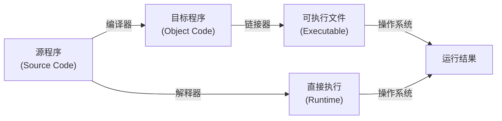
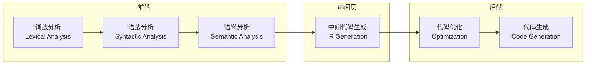
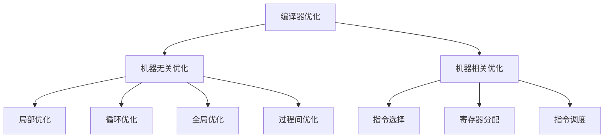
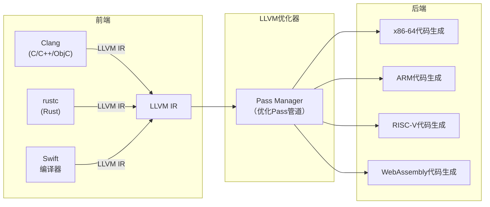
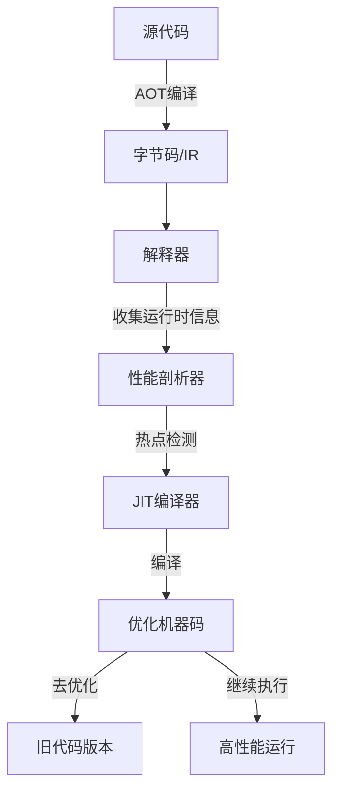
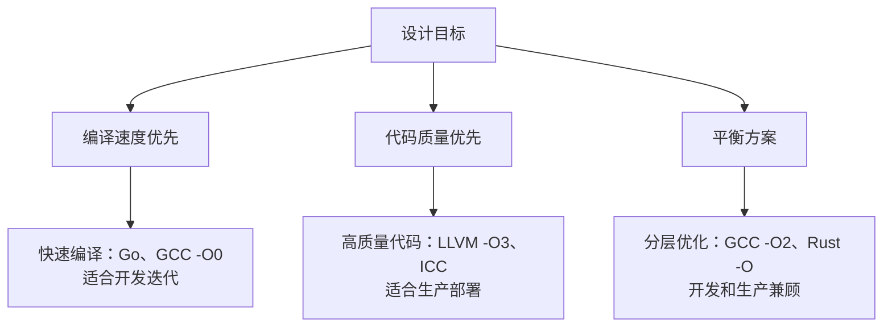
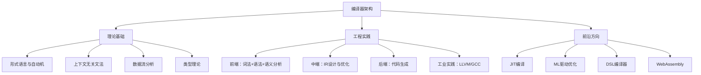

# 第25章 编译器架构

## 1. 章节定位与学习目标

编译器是计算机科学中最精妙的工程产物之一——它将人类可读的高级语言翻译为机器可执行的底层指令，是连接抽象思维与物理计算的桥梁。理解编译器架构，不仅是理解"代码如何运行"的终极答案，更是掌握程序语言设计、性能优化、静态分析、代码生成等广泛领域的基石。

本章将从编译器的全生命周期出发，系统讲解从源代码到目标代码的完整流程，涵盖以下核心主题：

| 主题 | 关键内容 | 读者收获 |
|------|----------|----------|
| 编译流水线 | 词法分析→语法分析→语义分析→中间代码→优化→代码生成 | 建立编译器的全局视图 |
| 前端技术 | 有限自动机、上下文无关文法、类型系统、符号表 | 掌握源代码的理解与转换 |
| 中间表示(IR) | 三地址码、SSA形式、控制流图(CFG) | 理解编译器的内部语言 |
| 优化技术 | 数据流分析、循环优化、内联展开、死代码消除 | 学会让程序跑得更快 |
| 后端与代码生成 | 指令选择、寄存器分配、指令调度 | 掌握从IR到机器码的映射 |
| 现代编译器架构 | LLVM、AOT/JIT编译、跨平台编译、WebAssembly | 了解工业级编译器的设计哲学 |
| 前沿方向 | ML驱动优化、即时编译、领域专用语言(DSL)编译器 | 把握编译技术的未来趋势 |

## 2. 什么是编译器：从翻译到变换

### 2.1 编译器的本质

编译器本质上是一个**程序变换器**：它接收以源语言书写的程序，将其等价地变换为目标语言的程序。这个定义包含两个关键约束：

- **正确性**：变换前后的程序必须产生相同的计算结果（语义等价）
- **效率**：变换后的目标程序通常需要在特定硬件上高效执行



### 2.2 编译器 vs 解释器

编译器和解释器并非非此即彼的对立关系，而是执行策略的连续谱：

| 维度 | 编译执行 | 解释执行 | 混合执行 |
|------|----------|----------|----------|
| 执行时机 | 编译期一次性翻译 | 运行时逐条翻译 | 部分编译+部分解释 |
| 执行速度 | 快（直接执行机器码） | 慢（翻译开销） | 中等（热点代码加速） |
| 启动延迟 | 高（需要编译时间） | 低（立即开始） | 中等 |
| 典型代表 | C/C++、Go、Rust | Python、Ruby、Shell | Java(CLI+JIT)、JavaScript(V8) |
| 错误发现 | 编译期发现 | 运行时发现 | 部分编译期发现 |
| 移植性 | 需要重新编译 | 解释器跨平台 | 字节码跨平台 |

现代语言越来越多地采用混合策略。Java将源码编译为字节码，由JVM中的JIT编译器在运行时将热点代码编译为本地机器码。JavaScript的V8引擎先用Ignition解释执行，再用TurboFan将热点函数编译为优化机器码。这种"编译-解释-再编译"的分层策略兼顾了启动速度和执行效率。

### 2.3 编译器的分类

按不同维度，编译器可分为多种类型：

**按源语言分类：**
- **传统编译器**：C/C++、Fortran、Pascal等语言的编译器
- **托管语言编译器**：Java、C#等运行在虚拟机上的语言编译器
- **脚本语言编译器**：Python、Ruby等通常被解释执行但也有编译路径的语言

**按目标语言分类：**
- **本地编译器**：生成特定CPU架构的机器码（如GCC生成x86-64指令）
- **交叉编译器**：在一种平台上编译另一种平台的代码（如在x86上编译ARM代码）
- **字节码编译器**：生成虚拟机字节码（如javac生成JVM字节码）

**按用途分类：**
- **AOT(Ahead-Of-Time)编译器**：运行前完成编译（如gcc、rustc）
- **JIT(Just-In-Time)编译器**：运行时动态编译（如V8的TurboFan、HotSpot的C2）
- **LLVM后端**：可被嵌入其他编译器的代码生成框架

## 3. 编译流水线：六阶段经典架构

编译器的经典架构将翻译过程分为六个阶段，每个阶段有明确的输入输出和职责边界。理解这个流水线是掌握编译器架构的第一步。



### 3.1 词法分析（Lexical Analysis）

**输入**：源代码字符流
**输出**：记号(Token)流

词法分析器（Lexer/Scanner）将字符序列分组为有意义的单元——记号。这是编译的起点，也是最容易被低估的阶段。

```c
// 源代码
int result = 3 + 5 * 2;

// 词法分析后的Token流
[KEYWORD:int] [ID:result] [ASSIGN:=] [NUMBER:3] [PLUS:+] [NUMBER:5] [STAR:*] [NUMBER:2] [SEMICOLON:;]
```

**核心技术：正则表达式与有限自动机**

词法分析的理论基础是正则语言。每个Token类型用一个正则表达式描述，词法分析器本质上是一个确定性有限自动机(DFA)：

| Token类型 | 正则表达式 | 说明 |
|-----------|-----------|------|
| 标识符 | `[a-zA-Z_][a-zA-Z0-9_]*` | 变量名、函数名等 |
| 整数常量 | `[0-9]+` | 十进制整数 |
| 浮点数 | `[0-9]+(\.[0-9]+)?` | 带小数点的数 |
| 运算符 | `\+\|-|\*\|/\|=\|==` | 算术和比较运算符 |
| 关键字 | `int\|float\|if\|while\|return` | 语言保留字 |

**实际工程中的挑战：**
- **最长匹配原则**：`>=`应被识别为一个运算符`>=`，而非`>`和`=`两个Token
- **前瞻(Lookahead)**：`/`后面跟`*`是块注释开始，跟`/`是行注释，其他情况是除法
- **错误处理**：遇到非法字符时应报告位置并尝试恢复，而非直接崩溃
- **编码问题**：源文件可能使用UTF-8、GBK等不同编码，需要正确处理

**经典实现工具：** Lex/Flex是生成词法分析器的标准工具，输入正则表达式规则表，自动生成C代码的DFA实现。

### 3.2 语法分析（Syntactic Analysis）

**输入**：Token流
**输出**：抽象语法树(AST)

语法分析器（Parser）根据语言的语法规则，将Token流组织成层次化的树形结构——抽象语法树(AST)。AST丢弃了源代码中的分隔符、括号等"语法糖"，只保留结构化的语义骨架。

```c
// 源代码
int result = 3 + 5 * 2;

// 对应的AST
          [=]
         / \
    [result] [+]
            / \
          [3] [*]
             / \
           [5] [2]

// 运算优先级体现在树的层级中：* 在 + 的下方，所以先乘后加
```

**上下文无关文法(CFG)**

语法规则用上下文无关文法描述。以C语言的表达式子集为例：

expr     → expr + term | expr - term | term
term     → term * factor | term / factor | factor
factor   → ( expr ) | NUMBER | IDENT

这个文法通过递归规则自然地表达了运算符优先级：乘除优先级高于加减，因为`term`出现在`expr`的递归底层。

**两大分析方法：**

| 方法 | 代表算法 | 特点 | 适用场景 |
|------|---------|------|----------|
| 自顶向下 | 递归下降、LL(1)、预测分析 | 从开始符号出发，尝试推导匹配输入 | 语法简单的语言 |
| 自底向上 | LR(0)、SLR(1)、LALR(1)、LR(1) | 从输入Token出发，逐步归约到开始符号 | 工业级语言 |

**递归下降分析器**是最直观的实现方式，每个非终结符对应一个函数：

```python
def parse_expr():
    left = parse_term()
    while current_token in ('+', '-'):
        op = current_token
        advance()
        right = parse_term()
        left = BinaryOp(op, left, right)
    return left

def parse_term():
    left = parse_factor()
    while current_token in ('*', '/'):
        op = current_token
        advance()
        right = parse_factor()
        left = BinaryOp(op, left, right)
    return left

def parse_factor():
    if current_token.type == 'NUMBER':
        value = current_token.value
        advance()
        return Number(value)
    elif current_token.type == '(':
        advance()
        expr = parse_expr()
        expect(')')
        return expr
    else:
        raise SyntaxError(f"Unexpected token: {current_token}")
```

**现代解析器生成工具：**
- **ANTLR**：支持LL(*)语法，自动生成多种目标语言的解析器，广泛用于DSL开发
- **Bison/Yacc**：经典的LALR(1)解析器生成器，GCC的C/C++语法分析器即基于Bison
- **Tree-sitter**：增量解析器，支持150+语言，用于代码编辑器的实时语法分析
- **手写解析器**：性能最高，Rust编译器(rustc)和Go编译器均采用手写递归下降

### 3.3 语义分析（Semantic Analysis）

**输入**：抽象语法树(AST)
**输出**：带类型标注和语义信息的AST

语义分析检查程序是否"有意义"——变量是否声明、类型是否匹配、函数调用参数是否正确。这是编译器中最复杂的阶段之一。

**核心任务：**

**① 类型检查**

类型检查器确保表达式中的每个操作数都有正确的类型：

```c
// 正确：int + int → int
int a = 3 + 5;

// 错误：int + string → 类型不匹配
string b = 3 + "hello";  // 编译错误

// 正确：int + float → float（隐式类型提升）
float c = 3 + 3.14;
```

类型检查分为两类：
- **静态类型检查**：编译期完成，C/C++、Java、Rust、Go采用此方式
- **动态类型检查**：运行时完成，Python、JavaScript、Ruby采用此方式

**② 作用域分析与符号表管理**

编译器需要维护一个符号表（Symbol Table），记录每个标识符的名称、类型、作用域等信息：

作用域层次:
  全局作用域
  ├── 函数作用域: main()
  │   ├── 变量: int count
  │   ├── 块作用域: if (count > 0)
  │   │   ├── 变量: int temp
  │   │   └── (temp 的作用域在此块结束)
  │   └── (count 在此函数结束时失效)
  └── 函数作用域: helper()
      └── ...

符号表的实现通常采用**哈希表 + 栈**的组合结构：栈维护作用域的嵌套关系，哈希表提供O(1)的名称查找。

**③ 控制流检查**

验证控制流的正确性：
- `break`和`continue`必须在循环内部
- 函数必须有返回路径（非void函数不能遗漏return）
- `switch`语句中不能有重复的`case`标签
- 不可达代码的检测

**④ 名称解析**

区分同名但不同含义的标识符（重载决议）：

```cpp
// C++ 函数重载
void print(int x);     // 版本1
void print(double x);  // 版本2
void print(string s);  // 版本3

print(42);     // 调用版本1
print(3.14);   // 调用版本2
print("hi");   // 调用版本3
```

### 3.4 中间代码生成（IR Generation）

**输入**：带语义信息的AST
**输出**：中间表示(Intermediate Representation)

中间代码是编译器内部使用的"通用语言"，它介于高级语言和机器码之间，既保留了足够的结构信息供优化使用，又足够接近底层便于代码生成。

**为什么要引入中间代码？**

如果不引入IR: N种源语言 × M种目标平台 = N×M个编译器
引入IR后:      N个前端(源语言→IR) + M个后端(IR→目标平台) = N+M个组件

以支持3种语言和4种目标平台为例：
- 不引入IR：需要12个编译器
- 引入IR：需要7个组件（3个前端 + 4个后端）

这就是LLVM架构的核心思想。

**常见的中间表示形式：**

| IR类型 | 描述 | 代表 | 特点 |
|--------|------|------|------|
| 三地址码 | 每条指令最多三个操作数 | GCC GIMPLE | 简单直观，便于优化 |
| SSA形式 | 每个变量只被赋值一次 | LLVM IR、Go SSA | 极大简化数据流分析 |
| 字节码 | 虚拟机指令集 | JVM字节码、Python字节码 | 便于跨平台和解释执行 |
| RTL | 寄存器传输语言 | GCC RTL | 接近硬件，便于代码生成 |

**SSA（静态单赋值）形式**是现代编译器中最重要的IR形式。在SSA中，每个变量只被赋值一次，当需要"重新赋值"时使用φ函数（phi function）合并不同控制流路径的值：

// 原始代码
x = 1;
if (cond) {
    x = 2;
}
y = x + 1;

// SSA形式
x1 = 1;
if (cond) {
    x2 = 2;
}
x3 = φ(x1, x2);    // 根据控制流选择 x1 或 x2
y1 = x3 + 1;

SSA的优势在于：定义-使用关系变得显式，使得许多优化算法（如常量传播、死代码消除）变得简单而高效。

### 3.5 代码优化（Optimization）

**输入**：中间表示(IR)
**输出**：优化后的中间表示

代码优化是编译器中最具学术深度的阶段，也是区分编译器质量的关键。优化的目标是在**不改变程序语义**的前提下，减少目标程序的执行时间、代码大小或能耗。

**优化的层次分类：**



**经典优化技术详解：**

**① 常量折叠与常量传播**

// 优化前
x = 3 + 5;         // 常量折叠：编译期计算
y = x * 2;         // 常量传播：x的值传播到y

// 优化后
x = 8;
y = 16;

更强大的版本——编译期常量折叠可以将整个计算在编译时完成，运行时零开销。

**② 死代码消除(Dead Code Elimination)**

// 优化前
x = compute_expensive();  // 如果x之后从未被使用
y = 42;

// 优化后
y = 42;
// compute_expensive() 被消除（如果无副作用）

**③ 循环优化**

循环是程序运行的时间热点（约90%的执行时间花在5%的循环代码中），因此循环优化是最重要的优化类别：

```c
// 循环不变量外提(Loop-Invariant Code Motion)
// 优化前
for (int i = 0; i < n; i++) {
    a[i] = x * y + i;  // x * y 不随循环变化
}

// 优化后
int temp = x * y;       // 提到循环外，只计算一次
for (int i = 0; i < n; i++) {
    a[i] = temp + i;
}

// 循环展开(Loop Unrolling)
// 优化前
for (int i = 0; i < 4; i++) {
    a[i] = b[i] + c[i];
}

// 优化后（展开4倍）
a[0] = b[0] + c[0];
a[1] = b[1] + c[1];
a[2] = b[2] + c[2];
a[3] = b[3] + c[3];

// 循环向量化(Loop Vectorization)
// 优化前（标量处理）
for (int i = 0; i < n; i++) {
    a[i] = b[i] + c[i];
}

// 优化后（SIMD向量处理，每次处理4个float）
for (int i = 0; i < n; i += 4) {
    __m128 va = _mm_load_ps(&amp;b[i]);
    __m128 vb = _mm_load_ps(&amp;c[i]);
    __m128 vc = _mm_add_ps(va, vb);
    _mm_store_ps(&amp;a[i], vc);
}
```

**④ 过程间优化(Interprocedural Optimization)**

| 优化技术 | 描述 | 性能提升 |
|----------|------|----------|
| 函数内联(Inlining) | 将被调用函数体直接插入调用点 | 消除调用开销，暴露更多优化机会 |
| 尾调用优化(TCO) | 将尾递归转化为循环 | 消除栈增长，支持无限递归 |
| 全局值编号(GVN) | 检测并消除冗余计算 | 减少重复计算 |
| 链接时优化(LTO) | 跨编译单元优化 | 扩大优化窗口 |

**⑤ 数据流分析框架**

许多优化技术依赖数据流分析。数据流分析通过迭代计算，在程序的每个点上推断变量的属性：

- **活跃变量分析(Liveness Analysis)**：在每个程序点上，哪些变量的值在后续会被使用？这是寄存器分配和死代码消除的基础
- **可用表达式分析(Available Expressions)**：哪些表达式的值已经计算过且未改变？这是公共子表达式消除的基础
- **到达定义分析(Reaching Definitions)**：在每个程序点上，哪些赋值可能"到达"此处？这是常量传播的基础

### 3.6 代码生成（Code Generation）

**输入**：优化后的中间表示
**输出**：目标机器码

代码生成将抽象的IR翻译为具体的机器指令，这是编译器中与硬件最紧密相关的阶段。

**代码生成的三大核心问题：**

**① 指令选择(Instruction Selection)**

将IR操作映射为目标机器的指令。例如，一个乘加操作在不同硬件上可能映射为不同指令：

// IR: y = a * b + c
// x86: 单条FMA指令
vfmadd231sd  %xmm1, %xmm0, %xmm2

// ARM: 分乘法和加法两条指令
fmul  d0, d1, d2
fadd  d0, d0, d3

**② 寄存器分配(Register Allocation)**

物理寄存器数量有限（x86-64有16个通用寄存器），而程序中的变量通常远多于寄存器数。寄存器分配器决定哪些变量放在寄存器中，哪些"溢出"到内存。

// 寄存器数量有限时的溢出策略
// 假设只有2个寄存器 r1, r2，需要处理4个变量 a, b, c, d

// 方案1：直接溢出（朴素）
mov a → r1       // a 占用 r1
mov b → r2       // b 占用 r2
store r1 → [sp+0]  // a 溢出到栈
mov c → r1       // c 占用 r1
// ... 频繁的load/store造成性能损失

// 方案2：图着色寄存器分配（现代方法）
// 将变量的"同时活跃"关系建模为图
// 用K色着色算法分配K个寄存器
// 无法着色的变量溢出到栈

经典的图着色寄存器分配算法（Chaitin-Briggs算法）将寄存器分配问题转化为图着色问题：
1. 构建干扰图(Interference Graph)：两个变量如果在同一时刻都活跃，则在图中连一条边
2. 尝试用K种颜色（K=物理寄存器数）给图着色
3. 如果无法K着色，选择一个节点"溢出"(spill)到栈，重复直到着色成功

**③ 指令调度(Instruction Selection)**

调整指令执行顺序以最大化利用CPU的流水线和乱序执行能力：

// 调度前（有数据依赖冲突）
load  r1, [addr1]    // 可能cache miss，耗时~100周期
add   r2, r1, r3     // 依赖r1，必须等待
load  r4, [addr2]    // 可能cache miss，但被add阻塞
add   r5, r4, r6     // 依赖r4

// 调度后（重排以隐藏延迟）
load  r1, [addr1]    // 发起第一次load
load  r4, [addr2]    // 立即发起第二次load（不依赖r1）
add   r2, r1, r3     // 此时r1可能已就绪
add   r5, r4, r6     // 此时r4可能已就绪

这种技术称为**软件流水线(Software Pipelining)**和**指令级并行(ILP)**利用，是现代高性能编译器的核心能力。

## 4. 编译器的错误处理

优秀的编译器不仅要能正确编译正确的程序，还要能**有帮助地报告错误**并尝试**从错误中恢复**继续编译。

### 4.1 错误检测与报告

// 用户写的代码
int x = "hello";

// 优秀的编译器报错信息
error[E0308]: mismatched types
 --> src/main.rs:2:13
  |
2 |     int x = "hello";
  |        -   ^^^^^^^ expected `i32`, found `&str`
  |        |
  |        expected due to this
  |
  = note: expected type `i32`
             found type `&str`
help: try wrapping the expression in a string literal
  |
2 |     int x = "hello".to_string();
  |                  +++++++++++++++

好的错误信息应该包含：
1. **精确位置**：错误发生的文件、行号、列号
2. **类型信息**：期望什么类型，实际是什么类型
3. **修复建议**：如何修改代码以修复错误
4. **上下文**：相关的代码片段和解释

### 4.2 错误恢复策略

- **恐慌模式同步(Panic Mode)**：跳过输入Token直到遇到同步记号（如分号、右大括号）
- **短语层次恢复(Phrase-Level Recovery)**：在发现错误时插入缺失的Token或删除多余的Token
- **错误产生式(Error Productions)**：在语法中显式描述常见错误模式，给出针对性诊断
- **上下文敏感分析**：根据语义信息推断可能的错误原因（如变量名拼写建议）

## 5. 工业级编译器架构：以LLVM为例

LLVM是现代编译器基础设施的标杆，被Clang(C/C++)、Rust(rustc)、Swift、Kotlin Native等语言采用。理解LLVM的架构设计对理解现代编译器至关重要。

### 5.1 LLVM的三阶段架构



**LLVM的关键设计决策：**

| 设计决策 | 描述 | 收益 |
|----------|------|------|
| 统一IR | 所有前端生成同一种中间表示 | 前后端解耦，可自由组合 |
| 模块化Pass | 每个优化是独立的Pass，可灵活组合 | 便于调试、测试和添加新优化 |
| 稳定的IR格式 | LLVM IR保持向后兼容 | 不同版本的工具链可互操作 |
| 自定义元数据 | IR中可携带类型、调试、优化提示信息 | 支持丰富的语义信息传递 |

### 5.2 LLVM IR 示例

```llvm
; LLVM IR：一个简单的求和函数
define i32 @sum(i32* %arr, i32 %n) {
entry:
  %sum = alloca i32, align 4        ; 在栈上分配 sum 变量
  store i32 0, i32* %sum, align 4   ; sum = 0
  %i = alloca i32, align 4          ; 在栈上分配循环变量 i
  store i32 0, i32* %i, align 4     ; i = 0
  br label %loop                      ; 跳转到循环入口

loop:
  %i_val = load i32, i32* %i, align 4   ; 加载 i 的值
  %cmp = icmp slt i32 %i_val, %n        ; i < n ?
  br i1 %cmp, label %body, label %exit   ; 条件分支

body:
  %i_val2 = load i32, i32* %i, align 4  ; 重新加载 i
  %ptr = getelementptr i32, i32* %arr, i32 %i_val2  ; 计算 &amp;arr[i]
  %elem = load i32, i32* %ptr, align 4  ; 加载 arr[i]
  %sum_val = load i32, i32* %sum, align 4 ; 加载 sum
  %new_sum = add i32 %sum_val, %elem     ; sum += arr[i]
  store i32 %new_sum, i32* %sum, align 4 ; 存储新的 sum
  %new_i = add i32 %i_val2, 1            ; i++
  store i32 %new_i, i32* %i, align 4     ; 存储新的 i
  br label %loop                          ; 回到循环头部

exit:
  %result = load i32, i32* %sum, align 4 ; 加载最终结果
  ret i32 %result                         ; 返回 sum
}
```

LLVM IR的要点：
- **静态单赋值(SSA)**形式：每个变量只被定义一次
- **显式类型**：每条指令的输入输出类型都是明确的
- **底层操作**：接近机器语言但不绑定特定硬件（如没有固定寄存器数量）
- **控制流图显式化**：用`br`指令显式表达分支和跳转

### 5.3 LLVM优化Pass管道

LLVM将优化组织为一系列独立的Pass，按顺序执行：

LLVM默认优化管道（-O2级别）:
  1. SimplifyCFG          — 简化控制流图
  2. SROA                 — 标量替换聚合体
  3. EarlyCSE             — 早期公共子表达式消除
  4. SimplifyCFG          — 简化控制流图（再次）
  5. InstCombine          — 指令合并与简化
  6. LICM                 — 循环不变量外提
  7. IndVarSimplify       — 归纳变量简化
  8. LoopUnroll           — 循环展开
  9. SLPVectorize         — 标量到向量的自动向量化
  10. GVN                 — 全局值编号
  11. DeadStoreElimination— 死存储消除
  12. ... （更多Pass）

每个Pass可以独立开启、关闭或替换，这使得LLVM成为一个强大的编译器研究平台。

## 6. 现代编译器的前沿方向

### 6.1 JIT（即时编译）技术

JIT编译器在程序运行时将字节码或中间表示编译为本地机器码，是现代高性能运行时的核心技术。



**JIT的关键技术：**

| 技术 | 描述 | 典型应用 |
|------|------|----------|
| 热点检测 | 统计方法计数函数/循环的执行频次 | V8的Tick Profiler |
| 基线编译 | 快速生成未优化的机器码 | V8的Ignition → Sparkplug |
| 优化编译 | 基于运行时profile信息生成高度优化的代码 | V8的TurboFan、HotSpot的C2 |
| 去优化(Osr/Deopt) | 当优化假设失效时退回到未优化版本 | 所有主流JIT |
| 内联缓存(IC) | 为频繁调用的虚方法缓存实际目标 | V8的Hidden Classes |
| 分支预测 | 利用运行时统计数据预测分支方向 | JVM的分支Profile |

JIT编译的独特优势在于可以利用**运行时信息**进行编译期无法完成的优化：
- 知道哪个虚方法被频繁调用（类型推测内联）
- 知道循环的实际迭代次数（循环展开和向量化）
- 知道条件分支的实际走向（代码布局优化）
- 知道实际的内存访问模式（预取指令插入）

### 6.2 AOT编译的复兴

与JIT对应，AOT编译在近年来也有重要发展：

- **Go的AOT编译**：Go语言选择纯AOT编译（无JIT），追求快速编译和确定性的执行性能
- **Rust的编译优化**：利用LLVM的全量优化管道，在编译期完成深度优化
- **GraalVM Native Image**：将Java代码AOT编译为本地可执行文件，消除启动延迟

### 6.3 跨平台编译与WebAssembly

WebAssembly(Wasm)是一种可移植的二进制指令格式，作为编译器的新目标平台正在迅速崛起：

编程语言 → 编译器前端 → LLVM IR → LLVM Wasm后端 → .wasm文件
                                                      ↓
                                              浏览器/边缘节点/WASI运行时

Wasm的编译路径展示了LLVM架构的威力：数十种语言可以共享同一套后端基础设施，仅需为每种语言编写一个前端。

### 6.4 ML驱动的编译器优化

机器学习正在被引入编译器优化的多个环节：

| 应用领域 | 描述 | 代表工作 |
|----------|------|----------|
| 自动调优(AutoTVM) | 用ML搜索最优的循环变换参数 | TVM、Halide |
| 寄存器分配 | 用GNN预测寄存器溢出 | MLGO (Google) |
| 代码布局 | 用强化学习优化基本块排列 | MLGO |
| 自动向量化 | 用模型预测向量化的收益 | LLVM的ML策略 |
| 推断优化 | 用ML指导LLVM Pass的调度顺序 | Helium (Meta) |

Google的MLGO项目已经在生产环境中将ML驱动的优化集成到Android编译链中，在代码大小优化上取得了优于传统启发式方法的效果。

## 7. 编译器设计的工程权衡

### 7.1 编译速度 vs 生成代码质量

这是一个核心的设计权衡：



**实际数据参考（clang vs gcc vs rustc）：**

| 编译器 | 编译速度 | 代码质量 | 冷启动时间 | 优化深度 |
|--------|----------|----------|-----------|----------|
| GCC -O2 | 中等 | 优秀 | 较快 | 深度优化 |
| Clang -O2 | 较快 | 优秀 | 快 | 深度优化 |
| Rust -O2 | 较慢 | 优秀 | 中等 | 深度优化+借用检查 |
| Go | 极快 | 中等 | 极快 | 保守优化 |
| Swift -O | 中等 | 良好 | 中等 | 中度优化 |

### 7.2 可维护性 vs 性能

编译器本身也是软件，面临自身的工程权衡：
- **手写解析器 vs 解析器生成器**：手写性能更高但维护成本大
- **统一优化框架 vs 专项优化**：通用框架更易维护但可能不如专项优化高效
- **丰富的错误信息 vs 编译速度**：更精确的错误诊断需要更多分析开销

## 8. 学习路径与实践建议

### 8.1 推荐学习资源

**经典教材：**
1. *Compilers: Principles, Techniques, and Tools*（龙书）——编译器领域的圣经，覆盖完整的理论体系
2. *Engineering a Compiler*（工程导向）——更注重实践，讲解现代编译器技术
3. *Modern Compiler Implementation in Java/C/ML*（Appel）——通过实现一个完整编译器来学习

**实践项目：**
1. **Crafting Interpreters**（免费在线）——从零实现两种解释器（树遍历 + 字节码VM），适合入门
2. **Challenges**（challenges.compilerbook.com）——龙书的配套练习
3. **LLVM Tutorial: My First Language Frontend**——为LLVM实现一个简单的语言前端

### 8.2 从简单到复杂的实践路径

入门阶段:
  ├── 用Flex/Bison实现一个计算器
  ├── 实现一个简单的表达式语言解释器
  └── 阅读Python编译器的源码（cpython/compile.c）

进阶阶段:
  ├── 用LLVM实现一个简单的编程语言
  ├── 实现基于SSA的中间表示和基本优化
  └── 阅读Go编译器的代码生成部分

高级阶段:
  ├── 实现寄存器分配算法（图着色）
  ├── 实现指令调度器
  └── 为现有编译器贡献优化Pass（LLVM/GCC）

## 9. 本章知识体系总结



编译器架构是计算机科学中理论与工程完美结合的典范。它既是形式化方法（自动机理论、类型论、逻辑推理）的直接应用，也是软件工程（模块化设计、错误恢复、性能调优）的极致体现。掌握编译器架构，你将获得一种"看穿代码本质"的能力——无论面对何种编程语言，都能理解它背后的编译过程和优化策略，这种理解将深刻影响你编写和优化代码的方式。
