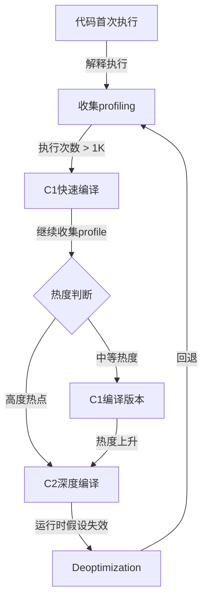

## 理论基础

### 编译器的本质：从人类语言到机器语言

编译器的本质是**两个世界之间的翻译器**——将人类可读的高级编程语言翻译为机器可执行的低级指令。这看似简单的定义背后，隐藏着计算机科学中最深刻的问题之一：如何在保持语义等价的前提下，实现从抽象到具体的自动化转换。

编译器的重要性远超"翻译"本身。它是连接程序员思维与硬件执行之间的桥梁，其架构设计直接决定了：

- **语言表达力的上限**：编译器能理解什么样的语言结构，程序员就能使用什么样的抽象
- **程序执行的效率**：编译器的优化能力决定了同样的算法在不同实现下的性能差距
- **软件生态的边界**：编译器支持的目标平台数量，决定了语言的跨能力
- **安全与可靠性的底线**：编译器的类型检查和静态分析能力决定了多少错误能在运行前被捕获

理解编译器架构，不仅是为了编写编译器——它是理解整个软件系统层次结构的基础。从操作系统内核到浏览器引擎，从数据库查询优化到AI框架的算子融合，编译器技术无处不在。

### 编译与解释：并非二元对立

长期以来，编程语言被简单地分为"编译型"和"解释型"两类。然而，这种二分法在现代语言实现中已经完全过时。真实的语言实现是一个连续谱——从纯粹的静态编译到纯粹的解释执行，中间存在大量的混合形态。

#### 编译执行的原理

编译执行将源代码**一次性翻译**为目标代码（通常是机器码或可链接的目标文件），然后由硬件直接执行翻译后的产物。其核心优势在于：

1. **全局优化能力**：编译器在翻译时可以看到整个程序（或至少整个编译单元），能够进行跨函数、跨模块的优化
2. **运行时零开销**：翻译工作在运行前完成，执行时不需要解释器的介入
3. **类型安全的提前验证**：类型检查等语义验证在编译期完成，运行时不需要重复检查
4. **可审计的确定性**：编译产物是确定性的，同样的源代码产生同样的机器码，便于安全审计和可重复构建

典型的编译型语言包括C、C++、Rust、Go等。以C语言为例，其编译流程为：

源代码(.c) → [预处理器] → 预处理后源码 → [编译器] → 汇编代码(.s)
→ [汇编器] → 目标文件(.o) → [链接器] → 可执行文件

值得注意的是，即使是"编译型"语言，从源代码到可执行文件也经历了多个子阶段，每个子阶段都是一次"翻译"。预处理器负责宏展开和文件包含，编译器核心负责语法分析和代码生成，汇编器将助记符转换为机器码，链接器合并多个目标文件并解析符号引用。这些阶段各自独立，每一层都有自己的抽象和优化空间。

#### 解释执行的原理

解释执行**逐条读取**源代码（或某种中间表示），立即执行每条指令，不生成独立的目标文件。解释器本质上是一个模拟器——它模拟目标机器的行为，但运行在另一个程序（解释器）内部而非硬件上。

早期的纯解释型语言（如Bash、Tcl）确实存在严重的性能问题。但现代解释器采用了大量优化技术：

- **字节码预编译**：将源代码先编译为紧凑的字节码，减少解释器的解析开销。Python的`.pyc`文件就是字节码缓存
- **内联缓存（Inline Caching）**：缓存方法查找的结果，加速动态类型语言的属性访问。V8引擎对单态调用点的属性访问使用直接偏移量加载，性能接近静态类型语言
- **隐藏类（Hidden Classes）**：为JavaScript等语言的对象布局创建快速路径，避免通用哈希表查找。V8的Hidden Classes将JavaScript对象转换为类似C结构体的内存布局
- **JIT编译热路径**：将频繁执行的代码路径编译为机器码，解释器只处理冷路径

#### 混合模式：现代语言的主流选择

现代语言实现几乎都采用了**编译与解释的混合策略**，只是两者的比例不同：

完全编译 ←————————————————————————————→ 完全解释
  C/C++     Rust     Java      Python      Bash
           Go     C#(RyuJIT)  Ruby
              Kotlin     Swift

**Java**的实现是混合模式的经典范例：

源代码(.java) → [javac编译器] → 字节码(.class)
                                      ↓
                              [JVM虚拟机]
                              ├── 解释器（逐条执行字节码）
                              ├── C1编译器（客户端JIT，快速编译）
                              ├── C2编译器（服务端JIT，深度优化）
                              └── Graal编译器（新一代JIT）

**Python**同样采用混合模式：

源代码(.py) → [编译器] → 字节码(.pyc)
                              ↓
                   [CPython虚拟机]
                   ├── 字节码解释器
                   └── 可选：Cython/C扩展（热点路径）

CPython 3.13引入了实验性的自由线程模式（no-GIL），这是Python运行时架构的一次重大变革。同时，PyPy通过JIT编译将Python的执行速度提升了一个数量级，证明了即使在动态语言中，JIT也能带来巨大的性能收益。

**JavaScript**的演进更为激进——从完全解释（早期SpiderMonkey）到JIT主导（V8 TurboFan），性能提升了数十倍。V8的编译管线包括：Ignition（字节码解释器）→ Sparkplug（基线JIT）→ Maglev（中级JIT）→ TurboFan（深度优化JIT），形成了四级编译层次。

**C#** 的RyuJIT编译器同样采用了多层策略：解释器 → 快速JIT（Tier 0）→ 分层编译（Tier 1）→ 全优化JIT（Tier 1-OSR），在.NET 8中进一步优化了启动性能和吞吐量的平衡。

#### 一个关键洞察：编译与解释的边界是模糊的

从形式语言理论的角度看，解释器和编译器的区别仅在于**翻译的时机和产物**：

| 维度 | 编译器 | 解释器 |
|------|--------|--------|
| 翻译时机 | 运行前（静态） | 运行时（动态） |
| 翻译产物 | 目标文件/机器码 | 直接执行副作用 |
| 翻译粒度 | 整个程序或编译单元 | 逐条/逐函数 |
| 优化视野 | 全局（跨函数、跨模块） | 局部（当前执行路径） |
| 启动延迟 | 高（需要预编译） | 低（立即开始执行） |
| 内存开销 | 编译时高，运行时低 | 运行时持续占用 |
| 适用场景 | 长时间运行、性能敏感 | 快速原型、脚本任务 |

一个有趣的哲学问题：如果一个解释器内部对热点路径进行了JIT编译，它到底是编译器还是解释器？答案是——**两者都是**。现代语言实现的边界已经模糊到这个二分法本身失去了意义。

### JIT编译：在运行时重新定义编译

即时编译（Just-In-Time Compilation，JIT）是20世纪90年代以来最重要的编译器技术创新之一。它将编译器从"静态翻译器"提升为"动态优化器"——在程序运行时，根据实际执行行为进行编译和优化。

#### JIT的核心优势：运行时信息

静态编译器在翻译时只能看到**源代码的静态文本**，而JIT编译器可以利用**运行时的动态信息**。这是一个质的飞跃：

**类型特化（Type Specialization）**：在动态类型语言中，变量的实际类型在运行时才能确定。JIT编译器可以在类型稳定后生成类型特化的代码，消除动态类型检查的开销。

```javascript
// JavaScript示例
function add(a, b) {
    return a + b;
}

// 如果a和b始终是整数，JIT可以生成：
// 专用版本：int_add(int a, int b) → int result
// 省去了类型检查和动态分派
```

V8引擎对这类函数的优化过程是：Ignition先解释执行并收集类型反馈 → Sparkplug生成基线机器码 → TurboFan根据收集到的类型信息生成高度特化的代码。在微基准测试中，特化后的`int_add`比通用版本快10-50倍。

**分支概率（Branch Profiling）**：通过统计运行时的分支执行频率，JIT可以优化代码布局——将热路径放在连续的内存位置（提高指令缓存命中率），将冷路径移出主路径。这种优化在if-else分支预测失误率高时效果尤为显著。

**去虚拟化（Devirtualization）**：面向对象语言中的虚方法调用在静态编译时需要通过虚方法表进行动态分派。JIT可以观测到虚方法的实际目标，将动态分派替换为直接调用：

// 静态编译：虚方法调用
// call [vtable + offset]  → 间接跳转，对分支预测不友好

// JIT优化后：如果99%的调用指向具体类型A
// cmp type, A
// je direct_call_A       → 直接调用，CPU可以预测和内联
// call [vtable + offset] → 只有剩余1%走慢路径

在Java应用中，虚方法调用通常占总指令数的10-25%。JIT的去虚拟化+内联可以将这些间接调用转化为直接调用+函数内联，性能提升可达3-5倍。

**逃逸分析（Escape Analysis）**：JIT可以分析对象的生命周期，如果对象不会逃逸出当前方法，可以将其分配在栈上而非堆上，避免垃圾回收的压力。更激进的优化包括标量替换（Scalar Replacement）——将一个对象拆解为多个独立的标量变量，完全消除对象分配。

#### 分层编译：速度与质量的平衡

JIT编译面临一个根本矛盾：**编译质量越高，编译时间越长**。如果对每段代码都进行深度优化，编译开销会抵消优化带来的收益。分层编译（Tiered Compilation）通过多级编译策略优雅地解决了这个问题。

以JVM的分层编译为例：

| 层级 | 编译器 | 编译策略 | 优化程度 | 适用场景 |
|------|--------|----------|----------|----------|
| 0 | 解释器 | 不编译 | 无 | 初始执行，收集profiling数据 |
| 1 | C1（无profiling） | 快速编译 | 基本优化 | 短暂执行的代码 |
| 2 | C1（含profiling） | 快速编译+插桩 | 基本优化+收集数据 | 为C2准备profile |
| 3 | C2（客户端） | 中等编译 | 中等优化 | 中等热度代码 |
| 4 | C2（完整） | 慢速编译 | 深度优化 | 高度热点代码 |



**去优化（Deoptimization）**是JIT编译的关键安全机制。当JIT编译器做出的假设在运行时被违反时（例如，一个被假设为单态的调用点突然接收到了新类型），编译器必须"回退"到解释执行或低级编译版本，重新收集信息。去优化确保了JIT的正确性——宁可损失性能，也不能产生错误结果。

去优化的触发条件包括：多态化（调用点从单态变为多态）、类层次变更（动态加载新子类）、栈回溯（需要获取完整的调用栈）、反优化标记（调试器或JVMTI介入）等。JVM通过维护"前提条件"（Assumptions）来跟踪去优化的触发条件。

#### 主流JIT编译器架构对比

| 编译器 | 语言 | IR形式 | 优化策略 | 特色技术 |
|--------|------|--------|----------|----------|
| V8 TurboFan | JavaScript | Sea-of-Nodes IR | 多层编译 | 内联缓存、隐藏类、逃逸分析 |
| JVM C2 | Java | Mach-Ops IR | 分层编译+Profile引导 | 循环展开、向量化、方法内联 |
| GraalVM | 多语言 | Graal IR（High-level） | 部分评估、Profile引导 | Truffle框架、Native Image |
| RyuJIT | C# | HIR+LIR | 分层编译 | OSR编译、循环不变量外提 |
| LuaJIT | Lua | Bytecode+Trace | 追踪JIT | Trace编译、FFI直接调用 |
| PyPy | Python | RPython JIT | 追踪JIT+元JIT | 自动JIT生成（JIT编译器的JIT） |

值得注意的是LuaJIT的**追踪JIT（Tracing JIT）**架构——它不以函数为编译单位，而是记录实际执行的循环路径（trace），将跨函数调用的完整路径编译为优化的机器码。这种策略在循环密集的代码中特别高效，但在深度递归或大量虚调用的场景中效果较差。

### AOT编译：启动性能的回归

近年来，AOT（Ahead-Of-Time）编译在曾经以JIT为主的生态系统中重新获得了重要地位。这一趋势的驱动力来自云计算和Serverless架构的兴起——在按调用计费的环境中，JIT预热的延迟和内存开销变得不可接受。

#### AOT vs JIT的权衡

           性能
           ↑
峰值性能 ─ │─────────────────── JIT (达到峰值后)
           │                 ╱
           │               ╱
           │─────────────╱────── AOT (稳定但较低)
           │           ╱
           │         ╱
           │───────╱
           │     ╱ ← JIT预热期
           │   ╱
           └──────────────────────→ 运行时间
              ↑
           AOT优势区（启动+低延迟场景）

**AOT编译的典型优势**：

1. **即时启动**：无需等待JIT预热，程序启动即可达到接近峰值的性能。对于CLI工具、短生命周期的Lambda函数，这至关重要
2. **可预测的性能**：没有JIT编译导致的性能抖动（Warm-up Spikes），P99延迟更稳定
3. **更低的内存占用**：不需要JIT编译器本身的内存开销（JVM的JIT编译器本身需要数百MB内存）
4. **安全分发**：编译后的二进制文件不需要包含源代码或字节码

**AOT编译面临的核心挑战**：

1. **封闭世界假设（Closed-World Assumption）**：AOT编译需要假设程序的全部代码在编译时已知。这与Java的动态类加载、反射等机制产生冲突
2. **缺少运行时信息**：无法利用类型特化、分支概率等profiling信息，生成的代码质量通常低于充分预热后的JIT
3. **动态特性的支持成本**：反射、动态代理、JNI调用等需要通过配置文件（Reflection Config）或运行时回退来处理
4. **二进制体积膨胀**：为了支持保守式的GC和异常处理，AOT编译的二进制文件可能比JIT版本更大

#### 主流AOT技术对比

| 技术 | 语言 | 原理 | 成熟度 | 典型场景 |
|------|------|------|--------|----------|
| GraalVM Native Image | Java | 类型推断+闭合世界 | 较成熟 | 微服务、CLI、Serverless |
| .NET Native / NativeAOT | C# | 静态分析+引用跟踪 | 成熟 | Windows应用、嵌入式 |
| Swift Compiler | Swift | 全模块优化 | 成熟 | iOS/macOS应用 |
| Go Compiler | Go | 静态编译 | 成熟 | 云原生、CLI工具 |
| Rust (`cargo build`) | Rust | 基于LLVM的静态编译 | 成熟 | 系统编程、嵌入式 |

GraalVM Native Image是当前最成熟的Java AOT编译器，它通过反射配置文件、初始化配置、JNI配置等机制，逐步解决了动态特性支持的挑战。在实际项目中，Spring Boot 3.x已经原生支持GraalVM Native Image，将Java微服务的启动时间从秒级降低到毫秒级。

### 三阶段架构：编译器的分层设计哲学

现代编译器普遍采用**三阶段架构**（Three-Phase Architecture），将编译过程分为前端（Frontend）、中端（Middle-end）和后端（Backend）。这种设计的精髓在于**关注点分离**和**可组合性**。

源代码 ──→ [前端] ──→ IR ──→ [中端] ──→ 优化IR ──→ [后端] ──→ 目标代码
  │          │         │        │           │          │          │
  │       源语言     中间表示   目标无关     优化后      目标平台    机器码/
  │       相关       (IR)      优化Pass     IR         相关       汇编
  │          │         │        │           │          │
  │      词法分析       │     常量折叠      │       指令选择
  │      语法分析       │     死代码消除    │       寄存器分配
  │      语义分析       │     循环优化      │       指令调度
  │      IR生成         │     内联          │       代码生成
  │                     │                   │
  M个前端 + N个后端 = M×N种语言到平台的组合

#### 可组合性的数学之美

三阶段架构的核心价值可以用一个简单的组合公式说明：如果编译器支持M种源语言和N种目标平台，三阶段架构只需要**M + N**个组件，而传统的一对一编译器需要**M × N**个完整的编译器。

一对一方案:  C→x86, C→ARM, C→MIPS, C→RISC-V
            Java→x86, Java→ARM, Java→MIPS, Java→RISC-V
            Rust→x86, Rust→ARM, Rust→MIPS, Rust→RISC-V
            = 3 × 4 = 12 个完整编译器

三阶段方案:  3个前端(C, Java, Rust) + 4个后端(x86, ARM, MIPS, RISC-V)
            = 3 + 4 = 7 个组件

当语言数和平台数增长时，这个优势更加显著。LLVM正是凭借这一架构，以相对有限的开发资源支持了数十种前端语言和十几种目标平台。

#### 前端：理解源代码

前端的职责是**理解源代码的语义并生成中间表示**。前端与源语言强相关，与目标平台完全无关。前端包含四个子阶段：

**词法分析（Lexical Analysis）**：将字符流转换为记号（Token）流。词法分析器的核心是有限状态自动机（DFA），每个Token类型对应一个正则表达式。

源代码: int x = 42 + y;
Token流:
  <TYPE, "int">    ← 类型关键字
  <ID, "x">        ← 标识符
  <ASSIGN, "=">    ← 赋值运算符
  <NUM, 42>        ← 整数字面量
  <PLUS, "+">      ← 加法运算符
  <ID, "y">        ← 标识符
  <SEMI, ";">      ← 分号

词法分析器的实现通常由工具自动生成：Lex/Flex定义正则表达式规则，自动生成DFA代码。手写词法分析器在工业编译器中也很常见（如Go、Rust编译器），因为手写实现可以更好地处理Unicode、错误恢复等边缘情况。

一个常被忽视的挑战是**Unicode处理**：现代语言支持Unicode标识符（如`变量名 = 42`），词法分析器需要处理各种Unicode规范化形式（NFC、NFD、NFKC），以及Emoji等多码点字符。Rust编译器在此基础上还实现了错误恢复机制——遇到非法字符时，跳过非法字符并继续分析，为用户提供多个错误信息而非在第一个错误处停止。

**语法分析（Syntax Analysis）**：将Token流组织为抽象语法树（AST）。语法分析基于上下文无关文法（CFG），核心策略分为两大类：

| 策略 | 代表算法 | 文法类 | 实现方式 | 典型工具 |
|------|----------|--------|----------|----------|
| 自顶向下 | LL(1)、LL(*)、Packrat | LL文法 | 递归下降 | ANTLR、Handwritten |
| 自底向上 | LR(1)、LALR(1)、GLR | LR文法 | 移进-归约 | Yacc/Bison |
| 混合 | PEG（解析表达式文法） | 所有文法 | 回溯+记忆化 | tree-sitter、Parsing Toolkit |

现代编译器倾向于使用**手写递归下降解析器**（如Go、Rust、Clang），因为手写实现更容易进行错误恢复和提供有意义的错误信息——这对开发者体验至关重要。

一个重要的实践考量是**错误恢复策略**：优秀的解析器在遇到语法错误时不应该停止分析，而应该跳过部分Token、插入缺失的Token、或使用同步Token集合来恢复分析状态。GCC和Clang的解析器可以同时报告数十个语法错误，而早期的Java编译器只能报告一个错误就停止。

**语义分析（Semantic Analysis）**：在AST上执行与语言语义相关的检查和信息收集：

- **类型检查**：验证表达式的类型是否符合语言规则（如不能将字符串与整数相加）
- **名称解析**：将标识符引用绑定到其声明（确定`x`引用的是哪个`x`）
- **作用域分析**：确定每个标识符的可见范围
- **类型推导**：为没有显式类型标注的表达式推导类型（如`auto x = 42`中`x`被推导为`int`）

语义分析器维护一个**符号表（Symbol Table）**，这是一个层次化的数据结构，记录了所有标识符的声明信息（名称、类型、作用域、存储类别等）。现代编译器的符号表通常采用哈希表+栈的混合结构，支持O(1)的名称查找和O(1)的作用域进出。

类型系统的复杂度差异巨大：Python的类型检查是可选的（通过mypy等外部工具），Rust的类型系统包含生命周期和trait，Haskell的类型系统支持类型类和高阶类型。类型系统的设计直接影响语言的表达力和安全性——这是编程语言设计中最核心的权衡之一。

**IR生成（IR Generation）**：将AST转换为中间表示。这是前端的最后一个阶段，关键操作包括：

1. **线性化**：将树结构的AST展平为线性的指令序列
2. **临时变量引入**：将复合表达式分解为单操作指令
3. **控制流显式化**：将`if/while/for`等结构转换为基本块和跳转
4. **类型信息保留**：在IR中保留足够的类型信息以支持后续优化

#### 中端：与目标无关的优化

中端是编译器中最复杂的部分，包含大量的分析和变换Pass。中端的核心特征是**不依赖于特定的目标平台**，因此可以跨平台复用。

中端优化按照作用域分为三个层次：

┌─────────────────────────────────────────────┐
│              过程间优化 (IPO)                 │
│  跨函数优化：内联、过程间常量传播、死函数消除    │
│  ┌─────────────────────────────────────────┐ │
│  │            全局优化 (Global)              │ │
│  │  函数内优化：循环优化、GVN、常量传播       │ │
│  │  ┌─────────────────────────────────────┐│ │
│  │  │        局部优化 (Local)              ││ │
│  │  │  基本块内：常量折叠、CSE、代数简化    ││ │
│  │  └─────────────────────────────────────┘│ │
│  └─────────────────────────────────────────┘ │
└─────────────────────────────────────────────┘

每个优化Pass本质上是一个**分析→变换**的循环：先通过数据流分析收集信息，再基于分析结果对IR进行等价变换。优化的正确性由**语义保持（Semantic Preservation）** 保证——变换前后的程序必须对所有合法输入产生相同的输出。

常见的中端优化Pass包括：

| 优化Pass | 层次 | 原理 | 效果示例 |
|----------|------|------|----------|
| 常量折叠 | 局部 | 编译期计算常量表达式 | `3+5` → `8` |
| 公共子表达式消除（CSE） | 局部 | 重复计算提取为临时变量 | `a*b + a*b` → `t=a*b; t+t` |
| 循环不变量外提（LICM） | 全局 | 将循环内不变量移到循环外 | 循环内重复计算移到循环前 |
| 死代码消除（DCE） | 全局 | 删除无用变量和无副作用代码 | 删除未使用的赋值 |
| 循环展开 | 全局 | 减少循环开销，增加指令级并行 | 每次迭代处理4个元素 |
| 向量化（Auto-Vectorization） | 全局 | 将标量操作转换为SIMD操作 | 4个int加法合并为一条SIMD指令 |
| 过程间内联（Inlining） | IPO | 将函数体插入调用点 | 消除函数调用开销 |
| 死函数消除 | IPO | 删除未被调用的函数 | 减少代码体积 |

#### 后端：面向目标平台的代码生成

后端的职责是将优化后的IR转换为目标平台的机器码。后端需要处理ISA（指令集架构）的具体细节：

- **指令选择**：将IR操作映射为目标机器的指令。例如，IR中的`add`操作在x86上对应`ADD`指令，在ARM上对应`ADD`指令，但操作数格式和寻址模式可能不同。指令选择通常使用树模式匹配算法（如Burg、Iburg）或基于DAG的模式匹配
- **寄存器分配**：将无限的虚拟寄存器映射到有限的物理寄存器。这是后端最困难的问题之一，通常使用图着色（Graph Coloring）或线性扫描（Linear Scan）算法。寄存器溢出（Spill）到内存的决策直接影响程序性能
- **指令调度**：重新排列指令顺序以最大化指令级并行（ILP），同时避免数据冒险和结构冒险。现代CPU的乱序执行（Out-of-Order Execution）减轻了静态指令调度的压力，但编译器调度仍然重要
- **窥孔优化（Peephole Optimization）**：在最终的机器码层面进行局部优化，利用特定ISA的特性（如x86的`LEA`指令可以免费执行加法和移位，ARM的条件执行可以避免分支）

一个容易被忽视的后端细节是**函数调用约定（Calling Convention）**：不同平台对参数传递、返回值、寄存器保存有不同的约定。x86-64的System V ABI使用rdi/rsi/rdx/rcx/r8/r9传递前6个整数参数，而Windows x64 ABI只使用rcx/rdx/r8/r9。编译器后端必须严格遵守目标平台的调用约定，否则会导致链接错误或运行时崩溃。

### 中间表示（IR）：编译器的灵魂

IR（Intermediate Representation）是编译器前端和后端之间的桥梁，其设计直接决定了编译器的优化能力和实现复杂度。一个好的IR需要在**表达力**（能描述多少优化信息）、**抽象层次**（离机器有多远）和**实现简洁性**之间找到平衡。

IR的设计空间可以从两个维度来理解：

- **抽象层次**：高层IR（接近源代码，如GIMPLE）适合高级优化；低层IR（接近机器码，如RTL）适合目标相关的优化
- **表示形式**：图结构（如Sea-of-Nodes）适合数据流分析；线性结构（如三地址码）适合遍历和变换

#### 三地址码：IR的原型

三地址码（Three-Address Code，TAC）是理解所有IR的基础形式。其核心约束是：**每条指令最多包含三个操作数**（两个源操作数和一个目标操作数）。

原始表达式:  x = a + b * c - d / e
三地址码:
  t1 = b * c
  t2 = a + t1
  t3 = d / e
  x  = t2 - t3

三地址码的设计哲学是**将复合操作分解为原子操作**。这种分解使得每个操作都成为优化的基本单元。三地址码的主要变体包括：

- **四元组（Quadruples）**：`(op, arg1, arg2, result)`——通过名称引用操作数，便于插入和删除
- **三元组（Triples）**：`(op, arg1, arg2)`——通过位置引用操作数，节省空间但插入操作复杂
- **间接三元组（Indirect Triples）**：三元组+指令列表，兼顾两者优势

工业编译器中，四元组形式最为常见，因为其灵活性在优化Pass的实现中具有明显优势。

#### SSA：现代编译器的基石

静态单赋值形式（Static Single Assignment，SSA）是过去30年编译器领域最重要的技术创新。其核心规则极其简单：**每个变量只被定义一次**。

原始代码（多重赋值）:
  x = 1
  y = x + 1
  x = 2          ← x被第二次赋值
  z = x + y

SSA形式（单次赋值）:
  x1 = 1
  y1 = x1 + 1
  x2 = 2         ← x2是新的变量
  z1 = x2 + y1

**φ（Phi）函数**是SSA的关键机制。当控制流在某点汇合，同一变量可能来自不同的定义时，φ函数选择正确的值：

if (condition) {
    x1 = 1;      // 路径1定义x1
} else {
    x2 = 2;      // 路径2定义x2
}
x3 = φ(x1, x2)  // 汇合点：根据实际执行路径选择x1或x2
y1 = x3 + 1

SSA的真正价值在于它**简化了几乎所有数据流分析和优化算法**：

| 优化算法 | 传统IR | SSA上的简化 |
|----------|--------|-------------|
| 活跃变量分析 | 需要迭代求解 | 定义点和使用点之间的路径分析 |
| 别名分析 | 复杂的指针分析 | 通过变量重命名减少别名 |
| 常量传播 | 跨基本块的复杂数据流 | 基于use-def链的简单遍历 |
| 死代码消除 | 需要全局活跃性信息 | 检查use列表是否为空 |
| 强度削减 | 循环依赖分析 | 基于SSA phi的简单替换 |

SSA的构造分为两个阶段：**支配者树计算**（确定φ函数的插入位置）和**变量重命名**（将原始变量替换为SSA版本）。支配者树的计算是O(n)的（Lengauer-Tarjan算法），变量重命名是O(n)的（基于深度优先遍历），因此SSA构造的总体复杂度是线性的。

SSA的变体包括：
- **最小SSA（Minimal SSA）**：在所有支配边界插入φ函数
- **严格SSA（Strict SSA）**：在最小SSA基础上，保证每个变量的使用都被其定义支配
- **半剪枝SSA（Semi-Pruned SSA）**：只在活跃变量的汇合点插入φ函数，减少φ函数数量
- **完全剪枝SSA（Pruned SSA）**：基于活跃变量分析，只在真正需要的地方插入φ函数

#### LLVM IR：工业级IR的典范

LLVM IR是目前使用最广泛的编译器IR之一。它是一种**强类型的、低级的、基于SSA的**中间表示，同时保留了足够的高级信息以支持激进优化。

```llvm
; LLVM IR示例：一个简单的函数
define i32 @factorial(i32 %n) {
entry:
  %cmp = icmp sgt i32 %n, 1
  br i1 %cmp, label %then, label %else

then:
  %sub = sub i32 %n, 1
  %call = call i32 @factorial(i32 %sub)
  %mul = mul i32 %n, %call
  ret i32 %mul

else:
  ret i32 1
}
```

LLVM IR的关键设计决策包括：

- **SSA形式**：所有虚拟寄存器都是SSA的，φ函数使用`phi`指令表示
- **显式控制流**：使用Basic Block + Terminator指令显式表示控制流，而非依赖AST结构
- **类型化操作**：每条指令的操作数都有明确的类型，`add i32`和`add i64`是不同的指令
- **无限虚拟寄存器**：IR使用无限的虚拟寄存器，寄存器分配推迟到后端
- **三地址码风格**：每条指令最多一个赋值操作，便于优化Pass的实现

LLVM IR的另一个重要特性是**内存SSA（MemorySSA）**——将内存操作也纳入SSA框架，使得内存相关的优化（如存储消除、加载转发）可以使用与标量SSA相同的技术。

#### GIMPLE与RTL：GCC的双层IR

GCC采用了与LLVM不同的IR设计策略——使用两层IR来分离不同层次的优化：

**GIMPLE**是GCC的高层IR，是一种三地址码形式，基于SSA。GIMPLE的设计目标是支持与目标无关的高级优化。GCC将前端生成的GENERIC（GCC的AST表示）简化为GIMPLE，这个简化过程被称为"gimplification"。

**RTL（Register Transfer Language）**是GCC的低层IR，采用Lisp风格的S-表达式。RTL的抽象层次更接近硬件，每条指令描述一次寄存器传输。RTL用于指令选择、寄存器分配和指令调度等后端操作。

;; RTL示例：x = y + z 的x86-64表示
(set (reg:DI 0 [%rax])                    ; 目标：RAX寄存器
     (plus:DI (reg:DI 1 [%rcx])           ; 源1：RCX寄存器
              (reg:DI 2 [%rdx])))         ; 源2：RDX寄存器

GCC的双层IR设计反映了**抽象层次分离**的理念：GIMPLE处理高级优化（内联、循环优化、向量化），RTL处理低级优化（指令选择、寄存器分配、调度）。这种设计使得两层的优化可以独立演进，但也增加了编译器的实现复杂度。

### 编译器优化的理论基础

编译器优化的本质是**在保持程序语义不变的前提下，变换程序使其在某个目标函数（如执行速度、代码大小、能耗）上更优**。

#### 数据流分析框架

几乎所有编译器优化都基于**数据流分析（Data Flow Analysis）**——在程序的控制流图（CFG）上迭代求解方程组，计算每个程序点上的程序性质。

数据流分析的统一框架包含四个要素：

1. **半格（Semilattice）**：定义信息的偏序关系和合并操作
2. **转移函数**：定义每个程序点如何变换数据流信息
3. **方程组**：定义基本块入口和出口的数据流方程
4. **求解策略**：迭代求解、worklist算法等

以**活跃变量分析**（后向分析）为例：

方程:   OUT[B] = UNION(IN[S] for S in successors(B))
        IN[B]  = gen(B) ∪ (OUT[B] − kill(B))

含义:   一个变量在某点是活跃的，当且仅当
        从该点存在一条路径到达该变量的某个使用点，
        且路径上没有该变量的定义

其他常见的数据流分析包括：

| 分析类型 | 方向 | 用途 | 合并操作 |
|----------|------|------|----------|
| 到达定义分析 | 前向 | 常量传播、别名分析 | 并集 |
| 活跃变量分析 | 后向 | 寄存器分配、死代码消除 | 并集 |
| 可表达式分析 | 前向 | 公共子表达式消除 | 并集 |
| 可用表达式分析 | 前向 | 全局CSE | 交集 |
| 零值分析 | 前向 | 强度削减 | 交集 |

#### 优化的正确性保证

编译器优化必须严格遵守**语义保持**原则。一个优化Pass P是正确的，当且仅当：对于所有合法输入I，原始程序在I上的行为与优化后程序在I上的行为完全相同。

语义保持不是简单地说"输出相同"。它还包括：

- **终止性**：如果原程序终止，优化后程序也必须终止
- **副作用顺序**：I/O操作、volatile变量访问等副作用的顺序不能被改变
- **未定义行为**：对于C/C++等语言，编译器可以利用未定义行为进行激进优化（因为原程序的行为本身就是未定义的）

一个经典的反例是GCC的一个Bug：`return x - x;`在某些优化级别下被替换为`return 0;`，但如果`x`是`INT_MIN`，`x - x`会溢出（未定义行为），而`0`不会。这个优化在形式上违反了语义保持，但在C/C++的语义框架下是合法的——因为编译器可以假设程序不包含未定义行为。

#### 常见的优化陷阱

编译器优化并非总是安全的。以下是一些实际项目中遇到的优化问题：

- **严格的别名规则（Strict Aliasing）**：C/C++的strict aliasing规则允许编译器假设不同类型的指针不指向同一内存。违反此规则的代码（如通过`char*`访问`int`成员）在低优化级别下正常工作，但在高优化级别下可能产生错误结果
- **整数溢出的未定义行为**：有符号整数溢出是C/C++的未定义行为，编译器可能基于此做出激进优化，导致看似正确的代码出错
- **volatile语义的误解**：`volatile`在C/C++中不保证原子性，只保证不优化掉读写操作。许多嵌入式开发者错误地依赖volatile实现多线程同步

### 现代编译器架构的发展趋势

#### ML驱动的编译器优化

机器学习正在改变编译器优化的方式。传统的编译器优化使用启发式规则（如"如果循环嵌套深度>2则展开"），而ML方法可以学习更复杂的优化策略：

- **多版本编译（Multi-Versioning）**：ML模型预测不同优化选项的效果，选择最佳组合。Google的XLA（Accelerated Linear Algebra）编译器使用ML模型来选择最佳的内核融合策略
- **自动调优（Auto-Tuning）**：通过强化学习自动搜索优化参数空间。Halide、TVM等图像/张量处理语言使用auto-scheduling来自动探索调度空间
- **代价模型（Cost Model）**：ML模型替代手工编写的代价函数，更准确地评估变换收益。LLVM的MLGo项目已经在生产环境中使用ML模型替代部分启发式决策

MLIR（Multi-Level Intermediate Representation）是LLVM项目的新成员，专门设计用于支持ML编译器和异构计算的多层次IR抽象。MLIR的Dialect机制允许不同层次的优化使用最适合的IR表示，是当前ML编译器基础设施的核心组件。

#### 异构计算的编译挑战

现代计算平台包含CPU、GPU、FPGA、AI加速器等多种计算单元。编译器需要解决：

- **内核生成**：为不同计算单元生成高效的代码。CUDA编译器（nvcc）将GPU内核编译为PTX中间表示，再由驱动程序编译为目标GPU的机器码
- **内存管理**：在异构内存层次间自动移动数据。OpenCL和SYCL提供了显式的内存管理API，但自动化程度仍然有限
- **调度决策**：决定哪些计算在哪个设备上执行。这本质上是一个NP-hard的调度问题
- **数据并行化**：自动将串行程序转换为并行执行。OpenMP和OpenACC提供了指令级的并行化支持

#### 安全性与形式化验证

编译器的正确性不仅影响性能，更直接影响安全性。CVE-2008-1036等编译器Bug导致了实际的安全漏洞。形式化验证的编译器（如CompCert——一个经过Coq证明正确性的C编译器）代表了编译器正确性的最高标准。

CompCert的启示是：形式化验证并非不切实际——它可以在合理的代价下为关键系统提供数学上可证明的正确性保障。近年来，CompCert的验证覆盖范围不断扩大，已经支持了C11标准的大部分特性。

在实际工业中，编译器测试同样是保证正确性的重要手段。CTest（GCC的测试套件）和LLVM的测试套件包含数十万个测试用例，覆盖了各种边界条件和优化场景。编译器回归测试是软件工程中最严格的测试实践之一——任何被报告的Bug都会被添加为回归测试用例，确保不会在未来版本中复现。

### 本节小结

编译器架构的理论基础涵盖了从语言实现方式（编译/解释/JIT/AOT）到核心数据结构（IR/SSA），再到优化方法论（数据流分析/语义保持）的完整知识体系。三阶段架构的分层设计哲学——前端理解源代码、中端进行平台无关优化、后端生成目标代码——是理解所有现代编译器的关键框架。

掌握这些理论的实际意义在于：当你调试一段性能瓶颈时，你能理解为什么某些代码模式更快（分支预测友好、缓存局部性好）；当你选择语言和工具链时，你能理解编译器能力的边界和优化空间；当你设计DSL或语言扩展时，你知道哪些特性容易实现、哪些需要大量的编译器支持。

在下一节"核心技巧"中，我们将深入探讨这些理论在实际编译器实现中的具体应用技术。
