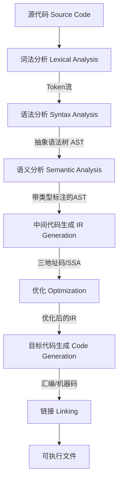
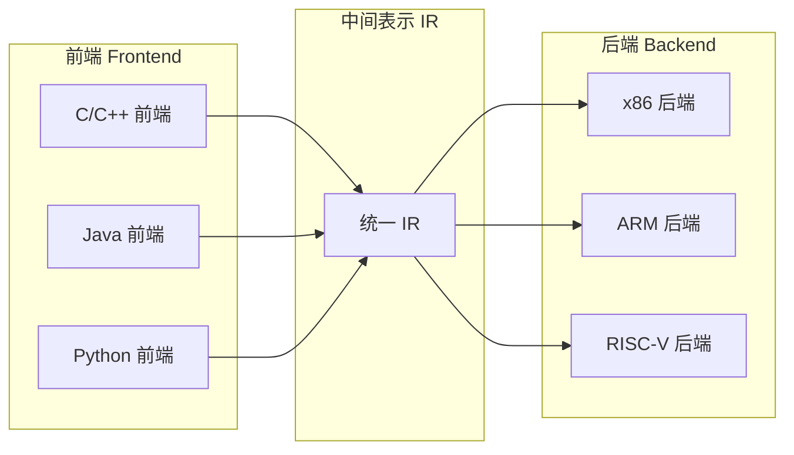
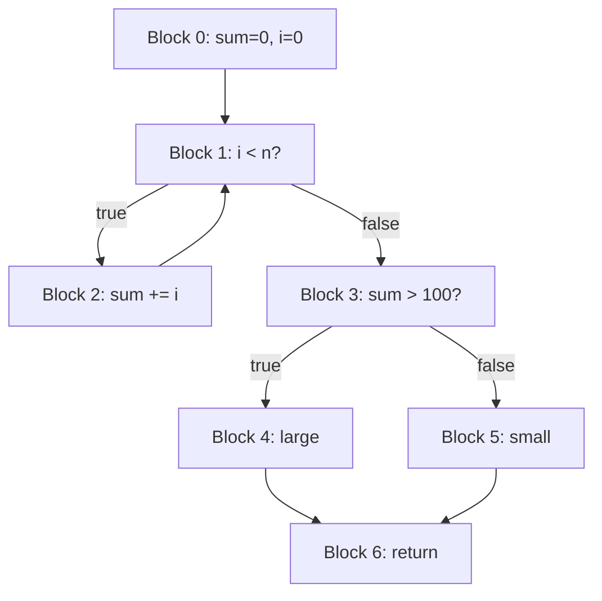
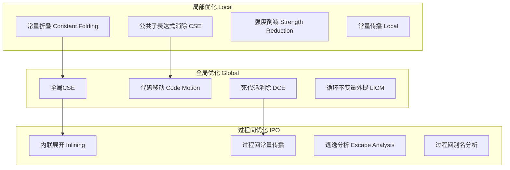
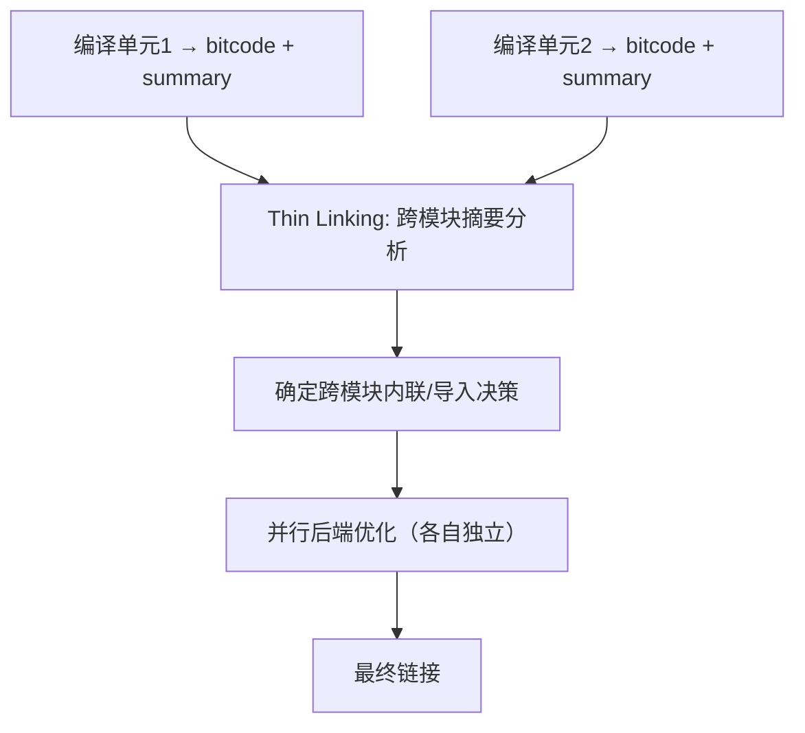
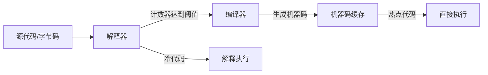

## 核心技巧

编译器是计算机科学中理论与工程结合最为紧密的系统之一。从词法分析到代码生成，每个环节都涉及精巧的数据结构和算法设计。本章系统讲解编译器实现中的核心技术，覆盖从整体架构到具体优化策略的完整知识链，帮助读者掌握构建高质量编译器的实用方法。

---

## 1. 编译器的分层架构设计

### 1.1 经典多遍架构

现代编译器普遍采用多遍（Multi-pass）架构，将编译过程分解为多个独立阶段。这种设计的核心思想是**关注点分离**——每个阶段只处理一个特定的编译任务，各阶段通过中间表示（Intermediate Representation，IR）进行通信。

典型的编译流水线如下：



**关键设计原则：**

| 原则 | 说明 | 工程价值 |
|------|------|----------|
| 前端与后端分离 | 前端负责语言相关的分析，后端负责目标相关的代码生成 | 为新语言编写前端即可支持，为新硬件编写后端即可适配 |
| IR作为契约 | 前端输出标准IR，后端消费标准IR | 各团队独立开发，互不耦合 |
| Pass管理框架 | 优化以Pass为单位组织，Pass之间通过IR传递数据 | 可插拔、可配置、可组合 |
| 错误处理一致性 | 每个阶段都负责检测和报告自己领域的错误 | 错误信息精确、上下文丰富 |

**前端与后端分离**是编译器工程中最重要的架构决策。GCC和LLVM都基于这一原则构建了庞大的多语言、多目标支持体系。具体来说：

- **前端**：负责源语言的理解——词法分析将字符流转换为Token流，语法分析将Token流构建为AST，语义分析完成类型检查和作用域解析。不同语言的前端输出相同的IR。
- **后端**：负责目标机器的代码生成——指令选择、寄存器分配、指令调度、机器码输出。同一后端可以消费不同前端产生的IR。



### 1.2 IR的层次化设计

许多编译器使用多个层次的IR，每一层承载不同粒度的语义信息：

| 层次 | 特征 | 代表实现 | 适用优化 |
|------|------|----------|----------|
| 高层IR | 保留源语言语义结构，接近AST | GCC GENERIC | 语言相关的语义变换 |
| 中层IR | 平台无关的三地址码/SSA | GCC GIMPLE, LLVM IR | 通用优化（常量传播、循环优化等） |
| 低层IR | 接近目标机器，引入寄存器概念 | GCC RTL, LLVM MachineInstr | 指令选择、寄存器分配、指令调度 |

GCC拥有GENERIC→GIMPLE→RTL三个层次的IR，LLVM有LLVM IR和MachineInstr两个主要层次。层次化设计使得不同层次的优化可以在最合适的抽象级别上进行。

**为什么需要多层IR？** 单一IR面临两难困境：如果IR过于抽象（接近源码），后端的指令选择就非常复杂；如果IR过于底层（接近机器码），高层优化（如循环变换）就需要重新理解程序结构。多层IR通过分层解决了这一矛盾。

### 1.3 Pass管理框架

编译器优化以Pass为单位组织，每个Pass读取IR、执行特定变换、输出修改后的IR。Pass管理器负责调度Pass的执行顺序，处理Pass之间的依赖关系。

**Pass管理器的核心职责：**

1. **Pass注册与发现**：所有Pass注册到全局注册表，运行时按名称或ID查找
2. **依赖声明与验证**：每个Pass声明自己依赖的前置条件（如"需要CGP"或"需要domtree"），管理器自动插入必要的前置Pass
3. **流水线可配置化**：通过命令行参数控制启用/禁用哪些Pass，调整Pass顺序
4. **分析结果缓存**：管理Pass之间共享的分析结果（如支配树、循环信息），避免重复计算

```python
# 伪代码：Pass管理器的工作流程
class PassManager:
    def __init__(self):
        self.passes = []          # 已注册的Pass列表
        self.analyses = {}        # 分析结果缓存
        self.dirtiness = {}       # IR脏标记（哪些分析需要重新计算）

    def add_pass(self, pass_obj):
        """添加一个Pass到流水线"""
        # 声明此Pass产生的分析
        for analysis in pass_obj.produces:
            self.dirtiness[analysis] = False
        # 声明此Pass消耗的分析（需要验证前置条件）
        for analysis in pass_obj.requires:
            if analysis not in self.analyses:
                self._insert_preserving_pass(analysis)
        self.passes.append(pass_obj)

    def run(self, module):
        """执行所有Pass"""
        for p in self.passes:
            # 检查依赖是否满足
            for dep in p.requires:
                if self.dirtiness.get(dep, True):
                    self._recompute(dep, module)
            # 执行Pass
            p.run(module)
            # 标记被此Pass invalidate的分析
            for invalidated in p.invalidates:
                self.dirtiness[invalidated] = True
```

**LLVM的PassManager实践：** LLVM 13之后引入了新的PassManager（NewPM），替代了旧的LegacyPM。NewPM的主要改进包括：
- 更清晰的分析/变换分离（AnalysisManager独立管理分析结果）
- 更好的跨函数分析支持（ModulePassManager支持模块级和函数级Pass混合调度）
- 显式的分析失效声明（每个Pass必须声明哪些分析会被 invalidate）

### 1.4 单遍编译器的设计

虽然多遍架构是主流，但单遍编译器（Single-pass Compiler）在特定场景下仍有不可替代的价值。

**Go语言的单遍设计哲学：** Go语言的语法设计就是为了支持高效单遍编译：
- 不需要前向声明（包级变量的初始化顺序通过依赖分析自动确定）
- 没有宏展开（避免了C/C++中的多遍预处理）
- 没有模板元编程（泛型通过类型参数语法实现，无需实例化）

| 对比维度 | 多遍编译器 | 单遍编译器 |
|----------|-----------|-----------|
| 编译速度 | 较慢（多次遍历源码） | 极快（只读一次） |
| 内存占用 | 较高（保留中间表示） | 极低（流式处理） |
| 优化能力 | 强（全局信息可访问） | 弱（只能做局部优化） |
| 错误恢复 | 好（可以在任意阶段重试） | 差（错误后难以继续） |
| 语言设计约束 | 低（可以支持复杂语法） | 高（语法必须对单遍友好） |
| 典型代表 | GCC, Clang, Rustc | Go, Lua, 部分SQL引擎 |

**实践建议：** 如果你在设计一门新语言，优先考虑是否可以采用单遍架构。单遍设计不仅降低编译器实现复杂度，更重要的是它倒逼语言设计走向简洁。Go语言的成功证明了"对编译器友好的语法设计"并不意味着牺牲表达力。

---

## 2. 词法分析的实现技巧

### 2.1 基于表格驱动的词法分析器

表格驱动（Table-driven）方法将词法分析器的逻辑和数据分离——用一张转移表定义状态机的行为，用一个通用的驱动程序执行状态转移。这使得修改词法规则时不需要修改代码逻辑。

```python
# 定义Token类型及其正则模式
TOKEN_PATTERNS = [
    ('KEYWORD',    r'\b(if|else|while|for|return|int|float|void)\b'),
    ('IDENTIFIER', r'\b[a-zA-Z_][a-zA-Z0-9_]*\b'),
    ('NUMBER',     r'\b\d+(\.\d+)?([eE][+-]?\d+)?\b'),
    ('STRING',     r'"([^"\\]|\\.)*"'),
    ('OPERATOR',   r'[+\-*/=<>!&amp;|^~]+'),
    ('DELIMITER',  r'[(){}\[\];,.]'),
    ('WHITESPACE', r'\s+'),
    ('COMMENT',    r'//.*|/\*[\s\S]*?\*/'),
]

import re

class TableDrivenLexer:
    def __init__(self, patterns):
        self.token_re = re.compile(
            '|'.join(f'(?P<{name}>{pattern})' for name, pattern in patterns)
        )

    def tokenize(self, source):
        tokens = []
        for match in self.token_re.finditer(source):
            kind = match.lastgroup
            value = match.group()
            if kind == 'WHITESPACE' or kind == 'COMMENT':
                continue  # 跳过空白和注释
            tokens.append((kind, value))
        return tokens

# 使用示例
lexer = TableDrivenLexer(TOKEN_PATTERNS)
tokens = lexer.tokenize('int main() { return 42; }')
for tok in tokens:
    print(tok)
# ('KEYWORD', 'int'), ('IDENTIFIER', 'main'), ('DELIMITER', '('),
# ('DELIMITER', ')'), ('DELIMITER', '{'), ('KEYWORD', 'return'),
# ('NUMBER', '42'), ('DELIMITER', ';'), ('DELIMITER', '}')
```

### 2.2 最长匹配与优先级处理

**最长匹配原则（Maximal Munch）：** 当多个规则都能匹配当前位置的输入时，选择匹配长度最长的。例如，输入`<=`时，`<`规则和`<=`规则都能匹配，但`<=`更长，所以识别为一个LE运算符。

**优先级处理：** 当两个规则匹配长度相同时，按定义顺序选择第一个匹配的。这意味着**关键字规则必须放在标识符规则之前**，否则`if`会被识别为IDENTIFIER而非KEYWORD。

```python
# 正确：关键字在前
TOKEN_PATTERNS = [
    ('KEYWORD',    r'\b(if|else|while)\b'),   # 先匹配关键字
    ('IDENTIFIER', r'\b[a-zA-Z_]\w*\b'),       # 再匹配标识符
]

# 错误：标识符在前会导致关键字被错误识别
TOKEN_PATTERNS_WRONG = [
    ('IDENTIFIER', r'\b[a-zA-Z_]\w*\b'),       # 'if' 会匹配这个！
    ('KEYWORD',    r'\b(if|else|while)\b'),     # 永远不会被触发
]
```

### 2.3 上下文相关词法分析

某些语言的词法分析需要考虑上下文信息，不能仅靠当前输入做决策。

**C++的`>>`问题：** 在C++03中，`>>`被统一识别为右移运算符。这意味着`vector<vector<int>>`会导致词法错误——最后一个`>>`被识别为一个token。C++11通过修改语法规则解决了这个问题，允许`>>`在模板上下文中被"拆分"为两个`>`。

**实现策略：**

```python
class ContextualLexer:
    """上下文相关词法分析器示例（简化版）"""
    def __init__(self):
        self.template_depth = 0  # 跟踪模板嵌套深度

    def next_token(self, source, pos):
        if self.template_depth > 0:
            # 在模板上下文中，> 总是单独的 token
            if source[pos] == '>':
                self.template_depth -= 1
                return Token('GT', '>', pos, pos + 1)
        # 正常词法分析
        # ... 省略常规逻辑

    def handle_token(self, token):
        if token.type == 'LT':    # <
            self.template_depth += 1
        elif token.type == 'GT':  # >
            if self.template_depth > 0:
                self.template_depth -= 1
```

### 2.4 手写词法分析器的性能优化

在需要极致性能的场景下（如V8、Clang），手写词法分析器比自动生成的更高效。关键优化技巧：

**逐字符查表（DFA模拟）：** 使用256个元素的数组作为转移表，直接用字符的ASCII值作为索引来确定下一个状态。避免条件分支，利用CPU缓存和分支预测。

```c
// 生产级状态转移表驱动的词法分析器（简化版）
#define NUM_STATES 128
#define INITIAL_STATE 0
#define ERROR_STATE -1

// 转移表：transition[当前字符][当前状态] = 下一个状态
static int transition[256][NUM_STATES];
// 接受表：accepting[状态] = 对应的Token类型（TOKEN_NONE表示非接受状态）
static TokenType accepting[NUM_STATES];

typedef struct {
    const char *start;       // token起始位置
    const char *current;     // 当前扫描位置
    const char *last_accept; // 最后一个接受状态的位置
    TokenType last_token;    // 最后一个接受的token类型
} Scanner;

Token scan_next(Scanner *s) {
    int state = INITIAL_STATE;
    s->last_accept = NULL;

    while (state != ERROR_STATE) {
        unsigned char ch = (unsigned char)*s->current++;
        state = transition[ch][state];
        if (accepting[state] != TOKEN_NONE) {
            s->last_accept = s->current;
            s->last_token = accepting[state];
        }
    }

    // 回退到最后一个接受状态的位置
    s->current = s->last_accept;
    Token tok = { s->last_token, s->start, s->last_accept };
    s->start = s->current;
    return tok;
}
```

**性能对比：** 在典型的基准测试中，手写DFA词法分析器比re2c自动生成的快约10-20%，比Python的re模块快约50-100倍。手写词法分析器的瓶颈在于`transition`表的缓存访问——128个状态 × 256个字符 = 32KB的转移表，刚好能放进L1缓存。

**其他优化手段：**

| 优化技巧 | 原理 | 适用场景 |
|----------|------|----------|
| 分类预判 | 先检查字符属于哪个类别（字母/数字/符号），再进入对应子状态机 | 关键字/标识符/数字区分明显的语言 |
| 空白跳过 | 独立的状态处理空白字符，减少主状态机的状态数 | 所有语言 |
| 行号缓存 | 只在遇到换行符时更新行号，避免每个token都计算 | 大型源文件 |
| 内存映射 | 用mmap将源文件映射到内存，避免read系统调用 | 大型文件编译 |

---

## 3. 语法分析的核心技术

### 3.1 递归下降解析器的设计

递归下降（Recursive Descent）是手写编译器中最常用的语法分析方法。其核心思想是为每条语法规则编写一个解析函数，函数之间的调用关系直接反映语法的嵌套结构。

```python
# 一个完整的表达式递归下降解析器示例
class Parser:
    def __init__(self, tokens):
        self.tokens = tokens
        self.pos = 0

    def current(self):
        """查看当前token"""
        if self.pos < len(self.tokens):
            return self.tokens[self.pos]
        return None

    def eat(self, expected_type):
        """消费一个token，期望类型匹配"""
        tok = self.current()
        if tok and tok.type == expected_type:
            self.pos += 1
            return tok
        raise SyntaxError(
            f"Expected {expected_type}, got {tok.type if tok else 'EOF'}"
        )

    # --- 语法规则对应的解析函数 ---

    def parse_program(self):
        """Program → Statement*"""
        stmts = []
        while self.current() and self.current().type != 'EOF':
            stmts.append(self.parse_statement())
        return Program(stmts)

    def parse_statement(self):
        """Statement → VarDecl | Assign | IfStmt | WhileStmt | ReturnStmt"""
        tok = self.current()
        if tok.type == 'KEYWORD':
            if tok.value == 'if':
                return self.parse_if()
            elif tok.value == 'while':
                return self.parse_while()
            elif tok.value == 'return':
                return self.parse_return()
            elif tok.value in ('int', 'float', 'void'):
                return self.parse_var_decl()
        # 默认当作赋值语句
        return self.parse_assign()

    def parse_var_decl(self):
        """VarDecl → Type IDENTIFIER '=' Expr ';'"""
        type_tok = self.eat('KEYWORD')       # int / float / void
        name_tok = self.eat('IDENTIFIER')
        self.eat('OPERATOR')                  # =
        expr = self.parse_expression()
        self.eat('DELIMITER')                 # ;
        return VarDecl(type_tok.value, name_tok.value, expr)

    def parse_if(self):
        """IfStmt → 'if' '(' Expr ')' Block ('else' Block)?"""
        self.eat('KEYWORD')                   # if
        self.eat('DELIMITER')                 # (
        cond = self.parse_expression()
        self.eat('DELIMITER')                 # )
        then_block = self.parse_block()
        else_block = None
        if self.current() and self.current().value == 'else':
            self.eat('KEYWORD')
            else_block = self.parse_block()
        return IfStmt(cond, then_block, else_block)

    def parse_expression(self):
        """Expression → AddSub (('+' | '-') AddSub)*"""
        left = self.parse_mul_div()
        while self.current() and self.current().value in ('+', '-'):
            op = self.eat('OPERATOR')
            right = self.parse_mul_div()
            left = BinExpr(op.value, left, right)
        return left

    def parse_mul_div(self):
        """MulDiv → Primary (('*' | '/') Primary)*"""
        left = self.parse_primary()
        while self.current() and self.current().value in ('*', '/'):
            op = self.eat('OPERATOR')
            right = self.parse_primary()
            left = BinExpr(op.value, left, right)
        return left

    def parse_primary(self):
        """Primary → NUMBER | IDENTIFIER | '(' Expr ')'"""
        tok = self.current()
        if tok.type == 'NUMBER':
            self.pos += 1
            return NumLiteral(tok.value)
        elif tok.type == 'IDENTIFIER':
            self.pos += 1
            return Identifier(tok.value)
        elif tok.value == '(':
            self.eat('DELIMITER')
            expr = self.parse_expression()
            self.eat('DELIMITER')
            return expr
        raise SyntaxError(f"Unexpected token: {tok}")
```

**关键设计技巧：**

**左递归消除。** 递归下降无法直接处理左递归规则。例如：

Expr → Expr + Term | Term        // 左递归，递归下降会无限循环
Expr → Term ('+' Term)*         // 消除左递归，改用循环

**前瞻（Lookahead）的管理。** 当前的"下一个Token"通常缓存在一个变量中，各解析函数通过检查这个变量来决定走哪条分支。这称为"预测解析"（Predictive Parsing）。大多数情况下只需1个Token的前瞻，某些语法需要2个或更多（如C++的歧义解析）。

### 3.2 Pratt解析器：表达式解析的优雅方案

Pratt解析器（也称为Top-Down Operator Precedence Parser）是处理表达式解析的优雅方案。它将运算符的优先级和结合性编码为数字，通过比较优先级来决定解析顺序。

```python
# Pratt解析器完整实现示例
class PrattParser:
    """
    基于Pratt算法的表达式解析器。
    核心思想：为每种token类型绑定两种处理函数：
    - nud (null denotation): 前缀行为（如一元负号、括号表达式）
    - led (left denotation):  中缀行为（如加减乘除）
    """

    def __init__(self, lexer):
        self.lexer = lexer
        self.current_token = None
        self.advance()

        # 运算符优先级表：token类型 -> (优先级, 结合性)
        # 数值越大优先级越高
        self.binding_power = {
            'OR':     (1, 'left'),
            'AND':    (2, 'left'),
            'EQ':     (3, 'left'),
            'LT':     (4, 'left'), 'GT':     (4, 'left'),
            'LE':     (4, 'left'), 'GE':     (4, 'left'),
            'ADD':    (5, 'left'), 'SUB':    (5, 'left'),
            'MUL':    (6, 'left'), 'DIV':    (6, 'left'),
            'POWER':  (7, 'right'),  # 右结合：2^3^4 = 2^(3^4)
            'NEG':    (8, 'right'),  # 一元运算符高优先级
        }

    def advance(self):
        self.current_token = self.lexer.next_token()

    def parse(self, min_bp=0):
        """主解析函数，入口参数min_bp控制解析范围"""
        token = self.current_token
        self.advance()

        # 处理前缀（nud）：数字、标识符、左括号、一元运算符
        if token.type == 'NUMBER':
            left = LiteralNode(float(token.value))
        elif token.type == 'IDENTIFIER':
            left = IdentifierNode(token.value)
        elif token.type == 'LPAREN':
            left = self.parse(0)              # 递归解析括号内的表达式
            self.expect('RPAREN')
        elif token.type == 'NEG':              # 一元负号
            operand = self.parse(self.binding_power['NEG'])
            left = UnaryNode('-', operand)
        else:
            raise SyntaxError(f"Unexpected token: {token}")

        # 处理中缀（led）：二元运算符
        while True:
            token = self.current_token
            if token.type not in self.binding_power:
                break

            bp, assoc = self.binding_power[token.type]
            if bp <= min_bp:
                break

            self.advance()
            if assoc == 'left':
                right = self.parse(bp)         # 左结合：相同优先级不递归
            else:
                right = self.parse(bp - 1)     # 右结合：相同优先级继续递归

            left = BinaryNode(token.type, left, right)

        return left
```

**Pratt解析器的优势：**

1. **优雅处理运算符优先级**：优先级和结合性通过数字编码，添加新运算符只需注册优先级
2. **代码量小**：核心实现通常不超过100行，而等价的递归下降需要数百行
3. **扩展性好**：支持自定义运算符（如Haskell的任意符号运算符）
4. **无歧义**：不存在语法歧义，因为优先级由数字强制确定

| 对比维度 | 递归下降 | Pratt解析器 | 算符优先解析器 |
|----------|---------|------------|---------------|
| 适用范围 | 完整的语法（语句+表达式） | 仅表达式 | 仅表达式 |
| 实现复杂度 | 中等 | 低 | 低 |
| 错误恢复 | 容易 | 中等 | 困难 |
| 优先级定义 | 通过调用层级隐式定义 | 显式数字编码 | 显式优先级表 |
| 运算符扩展 | 需要修改解析逻辑 | 只需注册新token | 只需更新优先级表 |
| 典型应用 | C/Java/Rust解析器 | Lua、PHP表达式解析 | 早期BASIC解释器 |

### 3.3 语法分析方法全景

除递归下降和Pratt外，还有多种语法分析方法适用于不同场景：

| 方法 | 类型 | 是否需要生成器 | 典型工具 | 适用场景 |
|------|------|--------------|---------|---------|
| 递归下降 | 自顶向下 | 否（手写） | — | 手写编译器首选 |
| LL(1) | 自顶向下 | 是 | ANTLR, Coco/R | 文法简单、需自动生成 |
| LR(0) | 自底向上 | 是 | — | 理论意义为主 |
| SLR(1) | 自底向上 | 是 | Yacc/Bison | 简单LR文法 |
| LALR(1) | 自底向上 | 是 | Yacc/Bison | 大多数编程语言语法 |
| GLR | 自底向上 | 是 | — | 歧义文法、自然语言 |
| Earley | 自底向上 | 否（手写） | — | 任意CFG，解析时间O(n³) |
| PEG | 自顶向下 | 是 | tree-sitter, packcc | 增量解析、错误恢复好 |

**LL vs LR的选择：** LL解析器从根节点开始构建语法树（自顶向下），LR解析器从叶节点开始构建（自底向上）。LR文法的表达力强于LL文法（所有LL文法都是LR文法，但反之不成立），但LL解析器更直观、更容易手写。工业界中，Bison（LALR）用于GCC历史代码，ANTLR（LL(*)）用于Java工具链，tree-sitter（GLR）用于代码编辑器的增量解析。

### 3.4 错误恢复的工程实践

优秀的错误恢复是区分学术编译器和生产编译器的关键标志。以下是GCC和Clang采用的一些高级错误恢复技术：

**基于Token距离的恢复。** Clang在遇到语法错误时，会尝试在当前位置附近插入、删除或替换少量Token，使得后续代码能够被正确解析。它使用编辑距离算法来选择"最小修改"的恢复方案。

```python
# Clang风格的错误恢复伪代码
def recover_from_error(parser, error_pos):
    """
    尝试三种恢复策略，选择"编辑距离"最小的方案
    """
    best_recovery = None
    best_distance = float('inf')

    for strategy in [insert_token, delete_token, replace_token]:
        recovery, distance = strategy(parser, error_pos)
        if distance < best_distance:
            best_recovery = recovery
            best_distance = distance

    # 应用最佳恢复方案
    parser.apply_recovery(best_recovery)
    return best_recovery
```

**Typo修正。** 当遇到未识别的标识符时，编译器在当前作用域中搜索拼写相近的已知标识符，提供建议修正。这使用编辑距离（Levenshtein距离）来实现：

error: use of undeclared identifier 'pirtf'; did you mean 'printf'?
error: use of undeclared identifier 'recieve'; did you mean 'receive'?
error: no member named 'strign' in 'std'; did you mean 'string'?

**延迟诊断（Deferred Diagnosis）。** 某些错误在当前上下文中无法确定，需要在后续解析中确认。例如，在C++中，`A*B`可能是乘法表达式，也可能是指针声明，取决于`A`是否是类型名。编译器可以延迟到获取足够信息后再报告错误。这在C++解析中极为常见，因为C++的语法规则高度依赖上下文。

**错误生产式（Error Productions）。** 为常见错误编写专门的语法规则，在解析器遇到这些模式时产生更有意义的错误信息。例如：

// 常见错误：忘记分号
statement → expr ';' | expr  // 产生式中显式处理缺失分号的情况
// 错误信息：expected ';' after expression

---

## 4. 语义分析与类型系统

语法分析器告诉我们"代码结构是否合法"，语义分析器则判断"代码含义是否正确"。这一阶段在编译流程中承上启下——它接收语法正确的AST，产出带有完整类型标注和作用域信息的语义树，为后续的中间代码生成和优化奠定基础。

### 4.1 类型检查的核心机制

类型检查（Type Checking）是语义分析的核心任务。编译器按照类型系统的规则，验证每个表达式和操作的类型是否正确。

**类型兼容性的判定：**

不同语言采用不同的类型兼容性策略，这是语言设计中的关键决策：

| 策略 | 含义 | 代表语言 | 优劣 |
|------|------|---------|------|
| 等同兼容 | 两个类型必须完全相同 | Rust, Go | 最严格，杜绝隐式错误，但代码冗余 |
| 赋值兼容 | 允许安全的隐式类型转换 | C, Java | 方便，但可能引入精度损失等隐患 |
| 结构兼容 | 看类型结构而非名称 | TypeScript, Go接口 | 灵活，支持鸭子类型，但调试困难 |
| 名义兼容 | 只看类型名称 | Java, C# | 可预测，但需要显式实现接口 |

**C语言的隐式类型转换规则（典型赋值兼容）：**

规则优先级（从低到高）：
bool → char → short → int → unsigned int → long → unsigned long → float → double → long double

转换示例：
float x = 3.14;
int y = x;           // 隐式截断：y = 3（丢失精度）
int a = 1;
double b = a;        // 隐式提升：a自动转为1.0
char c = 65;
printf("%c", c);     // 'A'：char到int的隐式提升

**类型检查器的实现框架：**

```python
# 类型检查器的核心结构（简化版）
class TypeChecker:
    def __init__(self, env):
        self.env = env  # 类型环境：变量名 -> 类型

    def check(self, node):
        """对AST节点进行类型检查，返回类型"""
        method = f'check_{type(node).__name__}'
        handler = getattr(self, method, self.check_unknown)
        return handler(node)

    def check_BinExpr(self, node):
        """检查二元表达式的类型"""
        left_type = self.check(node.left)
        right_type = self.check(node.right)

        # 检查操作数类型是否支持该运算
        if node.op in ('+', '-', '*', '/'):
            if not self.is_numeric(left_type):
                raise TypeError(f"Left operand of '{node.op}' must be numeric, got {left_type}")
            if not self.is_numeric(right_type):
                raise TypeError(f"Right operand of '{node.op}' must be numeric, got {right_type}")

            # 返回结果类型（类型提升规则）
            return self.promote(left_type, right_type)

        elif node.op in ('==', '!=', '<', '>', '<=', '>='):
            if left_type != right_type:
                raise TypeError(f"Cannot compare {left_type} with {right_type}")
            return PrimitiveType('bool')

    def check_FuncCall(self, node):
        """检查函数调用的参数类型"""
        func_type = self.env.lookup(node.name)
        if not func_type:
            raise TypeError(f"Undefined function '{node.name}'")

        # 检查参数数量
        if len(node.args) != len(func_type.params):
            raise TypeError(f"'{node.name}' expects {len(func_type.params)} args, got {len(node.args)}")

        # 检查每个参数的类型
        for arg, param_type in zip(node.args, func_type.params):
            arg_type = self.check(arg)
            if not self.is_compatible(arg_type, param_type):
                raise TypeError(f"Argument type mismatch: expected {param_type}, got {arg_type}")

        return func_type.return_type
```

### 4.2 类型推断基础

类型推断（Type Inference）让编译器自动推导变量和表达式的类型，减少程序员的类型标注负担。现代语言如Rust、Swift、TypeScript、Haskell都广泛使用类型推断。

**Hindley-Milner类型推断（Algorithm W）：**

Hindley-Milner（HM）类型系统是最经典的类型推断算法，被ML家族语言（Haskell、OCaml、F#）采用。其核心是**合一算法**（Unification）。

```python
#合一算法的核心思想
def unify(type_a, type_b, subst):
    """
    尝试找到一个类型替换，使type_a和type_b等价。
    subst: 当前已知的类型替换映射
    返回更新后的替换，或报告类型错误
    """
    type_a = apply_subst(type_a, subst)  # 应用已有替换
    type_b = apply_subst(type_b, subst)

    if type_a == type_b:
        return subst  # 已经相同，无需替换

    if isinstance(type_a, TypeVar):
        return bind_var(type_a, type_b, subst)  # 绑定类型变量

    if isinstance(type_b, TypeVar):
        return bind_var(type_b, type_a, subst)

    if isinstance(type_a, FuncType) and isinstance(type_b, FuncType):
        # 函数类型：参数和返回值都要合一
        subst = unify(type_a.param, type_b.param, subst)
        subst = unify(type_a.ret, type_b.ret, subst)
        return subst

    raise TypeError(f"Cannot unify {type_a} with {type_b}")
```

**HM推断的实际例子：**

```haskell
-- Haskell源码（无类型标注）
add x y = x + y       -- 推断出: Num a => a -> a -> a
map f [] = []          -- 推断出: (a -> b) -> [a] -> [b]
map f (x:xs) = f x : map f xs

-- 推断过程（概念化）:
-- 1. 从 x + y 推断出 x 和 y 是数值类型
-- 2. 从 [] 推断出列表元素类型是类型变量
-- 3. 通过合一约束逐步确定具体类型
```

**各语言的类型推断能力对比：**

| 语言 | 推断范围 | 推断算法 | 推断限制 |
|------|---------|---------|---------|
| Haskell | 全局推断（几乎所有类型都可推断） | Algorithm W | 函数递归需要至少一处标注 |
| Rust | 局部变量类型推断 | 类似HM | 函数签名必须标注；结构体字段必须标注 |
| Swift | 局部变量和闭包 | 类型检查+约束求解 | 函数签名必须标注 |
| TypeScript | 局部变量、返回类型 | 结构化类型推断 | 复杂场景需要显式标注 |
| Go | 局部变量（`:=`） | 上下文推断 | 不支持泛型推断（1.18前）；函数必须标注 |

### 4.3 名称解析与作用域管理

名称解析（Name Resolution）将代码中的标识符（变量名、函数名、类型名）绑定到它们的定义。这是语义分析中数据结构最复杂的部分。

**符号表的设计：**

符号表（Symbol Table）是名称解析的核心数据结构。生产级编译器通常采用**嵌套作用域链**的设计：

```python
class SymbolTable:
    def __init__(self):
        self.scopes = [{}]   # 作用域栈，第一个元素是全局作用域

    def push_scope(self):
        """进入新作用域（如函数体、块语句）"""
        self.scopes.append({})

    def pop_scope(self):
        """离开作用域"""
        self.scopes.pop()

    def define(self, name, symbol):
        """在当前作用域定义一个名称"""
        if name in self.scopes[-1]:
            raise SemanticError(f"'{name}' already defined in this scope")
        self.scopes[-1][name] = symbol

    def lookup(self, name):
        """从内到外逐层查找名称"""
        for scope in reversed(self.scopes):
            if name in scope:
                return scope[name]
        raise SemanticError(f"'{name}' is not declared")

    def lookup_current_scope(self, name):
        """仅在当前作用域查找（用于判断是否重复定义）"""
        return self.scopes[-1].get(name, None)
```

**重载决议（Overload Resolution）：**

当一个函数名有多个同名定义时（函数重载），编译器需要根据参数类型选择最匹配的版本。C++的重载决议是编译器实现中最复杂的部分之一：

```cpp
// 重载决议示例
void print(int x);
void print(double x);
void print(const std::string&amp; s);

print(42);           // 精确匹配 → print(int)
print(3.14);         // 精确匹配 → print(double)
print("hello");      // 需要转换：const char* → string → print(const string&amp;)
```

重载决议的优先级（从高到低）：
1. **精确匹配**：参数类型完全相同
2. **提升转换**：char→int, float→double等标准提升
3. **标准转换**：int→double, pointer→bool等
4. **用户自定义转换**：通过operator或转换函数
5. **省略号匹配**：printf风格的变参函数

如果多个重载候选的匹配级别相同，产生"二义性错误"（ambiguous call）。

### 4.4 语义分析中的常见陷阱

| 陷阱 | 表现 | 解决方案 |
|------|------|---------|
| 前向引用 | 使用了尚未定义的变量/函数 | 两遍扫描：先收集定义，再检查使用 |
| 循环类型依赖 | 类型A包含类型B，类型B包含类型A | 限制递归类型为指针/引用；用结构指针打破循环 |
| 隐式类型转换陷阱 | `if (x = 5)` 误写赋值为比较 | 赋值表达式的类型不应自动转为bool |
| 名字遮蔽 | 内层作用域的变量遮蔽外层同名变量 | 编译器警告（`-Wshadow`）；限制遮蔽场景 |

---

## 5. 中间表示（IR）设计

### 5.1 三地址码

三地址码（Three-Address Code，TAC）是最基础的IR形式。每条指令最多包含三个操作数：两个源操作数和一个目标操作数。

// 源代码
a = b + c * d - e / f

// 三地址码
t1 = c * d       // 第一个运算
t2 = e / f       // 第二个运算
t3 = b + t1      // 加法
t4 = t3 - t2     // 减法
a = t4           // 赋值

**三地址码的核心特点：**

1. **每个指令只完成一个基本操作**：乘法、除法、加法、减法、赋值各占一条
2. **临时变量显式化**：中间计算结果用临时变量存储，便于后续分析
3. **便于数据流分析和优化**：因为指令简单，数据流信息容易追踪

**三地址码的常见变体：**

| 变体 | 特征 | 代表编译器 |
|------|------|-----------|
| 四元式（Quadruple） | (op, arg1, arg2, result) | 大多数教科书 |
| 三元式（Triple） | (op, arg1, arg2)，结果用位置引用 | 早期编译器 |
| 间接三元式 | 三元式 + 索引表，允许指令重排 | GCC（RTL前身） |

### 5.2 SSA形式：现代编译器的基石

静态单赋值（Static Single Assignment，SSA）是现代编译器中最重要的IR形式。SSA的核心要求是**每个变量只被赋值一次**。当控制流汇合时，使用φ函数（phi function）选择不同路径上的值。

```python
# SSA转换的完整示例

# ===== 原始代码 =====
# block1:
#   x = 1
#   if (cond) goto block2 else goto block3
#
# block2:
#   x = x + 1       # x的第二次赋值
#   goto block3
#
# block3:
#   y = x * 2        # 使用x，但不确定是哪个版本

# ===== SSA形式 =====
# block1:
#   x1 = 1
#   if (cond) goto block2 else goto block3
#
# block2:
#   x2 = x1 + 1      # x2是新的SSA变量
#   goto block3
#
# block3:
#   x3 = φ(x1, x2)   # φ函数：从block1来用x1，从block2来用x2
#   y1 = x3 * 2
```

**SSA为什么如此重要？**

1. **简化数据流分析**：在SSA中，变量的定义和使用之间是直接对应关系，不需要复杂的"定义-使用链"（Def-Use Chain）分析。每个变量只有一个定义点，追踪数据流变得简单。

2. **使许多优化变得微不足道**：
   - 死代码消除：如果一个SSA变量没有被使用，它就是死代码，直接删除
   - 常量传播：如果变量被赋值为常量，直接替换所有使用点
   - 公共子表达式消除：相同操作的输入相同，结果自然相同

3. **活跃性分析简化**：一个SSA变量从定义点到它的所有使用点都是"活跃"的，不需要复杂的活跃区间计算。

**SSA的构建算法：**

SSA构建分为两步：

**第一步：插入φ函数。** 使用支配树（Dominator Tree）的性质确定需要插入φ函数的位置。Cytron等人在1991年提出的经典算法能够在O(N·α(N))时间内完成φ函数的最优插入（α是反阿克曼函数，实际可视为常数）。

```python
# φ函数插入算法的核心思想（简化版）
def insert_phi_functions(cfg, dom_tree, def_blocks):
    """
    cfg: 控制流图
    dom_tree: 支配树
    def_blocks: 每个变量的定义所在的基本块集合
    """
    # 对每个变量计算"支配边界"
    for var in variables:
        worklist = list(def_blocks[var])
        visited = set()

        while worklist:
            block = worklist.pop()
            # 遍历该块的所有支配边界
            for frontier_block in dom_tree.dominance_frontier(block):
                if frontier_block not in visited:
                    # 在支配边界处插入φ函数
                    frontier_block.insert_phi(var)
                    visited.add(frontier_block)
                    if var not in def_blocks:
                        def_blocks[var] = []
                    def_blocks[var].append(frontier_block)
                    worklist.append(frontier_block)
```

**第二步：变量重命名。** 遍历支配树，为每个原始变量的每次赋值分配新的SSA名称。

```python
# 变量重命名算法（简化版）
def rename_variables(block, stack):
    """
    沿支配树前序遍历，为变量分配新的SSA名称
    stack: 每个原始变量名 -> 当前SSA名称的栈
    """
    for instr in block.instructions:
        # 替换操作数为栈顶的SSA名称
        instr.replace_operands(stack)

        if instr.is_assignment:
            new_name = generate_ssa_name(instr.target)
            stack.push(instr.target, new_name)
            instr.target = new_name

    # 递归处理支配树的子节点
    for child in dom_tree.children(block):
        rename_variables(child, stack)

    # 回溯：弹出本块中压入的名称
    for instr in block.assignments:
        stack.pop(instr.original_target)
```

**SSA的工程变体：**

| 变体 | 策略 | 优势 | 劣势 |
|------|------|------|------|
| Pruned SSA | 只在变量活跃的汇合点插入φ | φ节点最少 | 需要活跃性分析（在φ插入之前） |
| Semi-Pruned SSA | 只对跨基本块活跃的变量做SSA | 折中方案 | 仍有冗余φ |
| Minimal SSA | 在每个支配边界插入φ（最少保证正确） | 构建简单 | 可能有冗余φ |
| Gated SSA | 用gate指令替代φ，表达条件选择 | 语义更丰富 | 实现更复杂 |

LLVM使用Semi-Pruned SSA，因为构建时不需要预先计算活跃性（活跃性通常在SSA构建后才计算），同时能有效控制φ节点数量。

### 5.3 LLVM IR的设计哲学

LLVM IR是当今最有影响力的编译器IR之一，其设计哲学值得深入理解：

**类型化的IR。** LLVM IR是强类型的，每个值都有明确的类型。这使得编译器能够在IR层面检测类型错误，而不是等到代码生成阶段。LLVM的类型系统包括：

```llvm
; 基本类型
i32                          ; 32位整数
i64                          ; 64位整数
float                        ; 32位浮点
double                       ; 64位浮点
ptr                          ; 通用指针（LLVM 15+）

; 聚合类型
{ i32, float }               ; 结构体
[10 x i32]                   ; 数组

; 函数类型
i32 (i32, i32)               ; 接受两个i32，返回i32的函数类型

; 指令示例
%result = add i32 %a, %b     ; 整数加法
%product = fmul float %x, %y ; 浮点乘法
store i32 42, ptr %p         ; 写入内存
%val = load i32, ptr %p      ; 读取内存
%cmp = icmp sgt i32 %a, %b   ; 有符号大于比较
br i1 %cmp, label %then, label %else  ; 条件分支
```

**无限寄存器与SSA。** LLVM IR使用虚拟寄存器（形式上是SSA变量），数量不限。物理寄存器的分配推迟到后端的寄存器分配阶段。这使得前端和优化Pass不需要关心寄存器限制——编译器可以在不受物理约束的情况下自由地进行中间变换。

**丰富的元数据系统。** LLVM IR支持附加元数据（Metadata），为优化和调试提供额外信息：

```llvm
; 调试信息元数据
%result = add i32 %a, !dbg !10

!10 = distinct !DICompileUnit(
    language: DW_LANG_C11,
    file: !DIFile(filename: "example.c", directory: "/src"),
    producer: "clang",
    isOptimized: true,
    runtimeVersion: 0,
    emissionKind: FullDebug
)

; 优化提示元数据
%sum = add nsw i32 %a, %b    ; nsw: No Signed Wrap（不会溢出有符号数）
%prod = mul nuw i32 %a, %b   ; nuw: No Unsigned Wrap（不会溢出无符号数）

; Profile数据（指导优化的执行频率信息）
br i1 %cond, label %then, label %else, !prof !20
!20 = !{!"branch_weights", i32 1000, i32 10}  ; then分支执行1000次，else执行10次
```

元数据不影响程序的语义——删除所有元数据不会改变程序行为。但它为优化器提供了关键信息：`nsw`/`nuw`标志允许优化器在不检查溢出的情况下进行更激进的常量传播；Profile数据让优化器知道哪些分支是热路径，从而指导内联和基本块布局决策。

---

## 6. 数据流分析框架

数据流分析（Data Flow Analysis）是所有编译器优化的理论基础。无论是常量传播、死代码消除还是寄存器分配，其核心都是通过分析程序中数据的流动来获取全局信息。不理解数据流分析，就无法真正理解编译器优化。

### 6.1 控制流图的构建

控制流图（Control Flow Graph, CFG）是数据流分析的基本载体。CFG将程序表示为**基本块**（Basic Block）的有向图，其中每个基本块是一段没有分支（除末尾外）的连续指令序列。

**基本块的划分规则：**
1. 基块的第一条指令是"领导者"（leader），包括：程序的第一条指令、任何跳转目标、任何条件跳转指令的后继
2. 每个基本块以跳转指令、条件分支指令或函数返回指令结束
3. 从领导者开始到下一个领导者之前的所有指令构成一个基本块

**CFG构建示例：**

```c
// 源代码
void example(int n) {       // Block 0: 入口块
    int sum = 0;            //     ↓
    for (int i = 0; i < n; i++) {  // Block 1: 循环条件
        sum += i;           //     ↓         ↑ (循环)
    }                       // Block 2: 循环体
    if (sum > 100)          // Block 3: 条件判断
        large();            // Block 4: then分支
    else
        small();            // Block 5: else分支
}                           // Block 6: 汇合+返回
```



### 6.2 数据流分析的统一框架

所有数据流分析都可以用一个统一的抽象框架来描述。这个框架包含四个核心要素：

| 要素 | 含义 | 选择 |
|------|------|------|
| 分析方向 | 信息从程序的哪一端流向另一端 | 前向分析（入口→出口）或后向分析（出口→入口） |
| 格（Lattice） | 数据流值的抽象域和偏序关系 | 具体分析决定（如常量格、位向量格） |
| 汇合操作（Meet/Join） | 多条路径的信息如何合并 | 并集（union）或交集（intersection） |
| 转移函数（Transfer Function） | 单个基本块如何变换数据流值 | 具体分析决定（如gen/kill） |

**前向分析 vs 后向分析：**

前向分析（Forward Analysis）：
  信息沿程序执行方向流动：Block0 → Block1 → Block2 → ...
  入口状态 + 转移函数 = 出口状态
  IN[B] = Meet(OUT[前驱])
  OUT[B] = Transfer(IN[B], B)

后向分析（Backward Analysis）：
  信息逆程序执行方向流动：Block2 ← Block1 ← Block0
  出口状态 + 转移函数 = 入口状态
  OUT[B] = Meet(IN[后继])
  IN[B] = Transfer(OUT[B], B)

**迭代算法（通用框架）：**

```python
def iterative_dataflow_analysis(cfg, direction, meet_op, transfer_func, bottom):
    """
    通用数据流分析迭代算法
    cfg: 控制流图
    direction: 'forward' 或 'backward'
    meet_op: 汇合操作（如 set.union 或 set.intersection）
    transfer_func: 基本块的转移函数
    bottom: 初始值（前向用入口块的输入，后向用出口块的输出）
    """
    # 初始化
    if direction == 'forward':
        blocks = cfg.blocks
        IN = {b: bottom for b in blocks}
        OUT = {b: bottom for b in blocks}
    else:
        blocks = cfg.blocks.reverse()
        IN = {b: bottom for b in blocks}
        OUT = {b: bottom for b in blocks}

    changed = True
    while changed:
        changed = False
        for block in blocks:
            if direction == 'forward':
                # 汇合所有前驱的OUT
                in_val = meet_op(*[OUT[p] for p in cfg.predecessors(block)])
                # 应用转移函数
                out_val = transfer_func(block, in_val)
                IN[block] = in_val
                if out_val != OUT[block]:
                    OUT[block] = out_val
                    changed = True
            else:
                # 汇合所有后继的IN
                out_val = meet_op(*[IN[s] for s in cfg.successors(block)])
                in_val = transfer_func(block, out_val)
                OUT[block] = out_val
                if in_val != IN[block]:
                    IN[block] = in_val
                    changed = True

    return IN, OUT
```

### 6.3 到达定义分析（Reaching Definitions）

**到达定义**回答的问题是：在程序的某个点，哪些变量的哪些赋值可能"到达"这个点？这是一个**前向分析**，汇合操作是**并集**。

**应用价值：** 到达定义是常量传播、公共子表达式消除、值编号等优化的基础。

// 示例
// Block1:              Block2:              Block3:
x = 1                  y = x + 1            z = x + y
if cond:               x = 5
    goto Block2         goto Block3
else:
    goto Block3

到达Block3的x定义：
  - 从Block1: x=1（通过else分支直接到达）
  - 从Block2: x=5（通过if分支到达）
  → x在Block3入口有两个可能的定义，无法确定是哪个

**Gen/Kill集：**

每个基本块定义两个集合：
- **Gen集**（生成）：在该块中"生成"的定义，一定到达块出口
- **Kill集**（杀死）：被该块中新的定义"杀死"的旧定义

转移函数：OUT[B] = Gen(B) ∪ (IN[B] - Kill(B))

含义：到达块出口的定义 = 本块新生成的定义 ∪ 到达块入口且未被本块杀死的定义

```python
def transfer_reaching_defs(block, in_set):
    gen = block.gen_set       # 本块中所有赋值的定义
    kill = block.kill_set     # 被本块赋值杀死的同变量的旧定义
    return gen | (in_set - kill)
```

### 6.4 活跃变量分析（Live Variable Analysis）

**活跃变量**回答的问题是：在程序的某个点，哪些变量的值在未来可能被使用？这是一个**后向分析**，汇合操作是**并集**。

**应用价值：** 活跃变量分析是寄存器分配的基础（不活跃的变量可以释放寄存器），也是死代码消除的前提（未被使用的赋值可以删除）。

// 示例
// x 在Block3出口不活跃（没有后续使用）
// y 在Block3出口不活跃

// Block3:
a = 5          // x 和 a 的活跃性变化：
               // 进入时: live = {a, b}  （a和b将来会被使用）
               // a=5 后: live = {b}     （a不再需要）
               // 退出时: live = {b}

**Use/Def集：**

- **Use集**：在块中被使用且在使用前未被赋值的变量
- **Def集**：在块中被赋值的变量

转移函数：IN[B] = Use(B) ∪ (OUT[B] - Def(B))

含义：到达块入口的活跃变量 = 本块使用的变量 ∪ 出口处活跃且未被本块定义的变量

```python
def transfer_live_vars(block, out_set):
    use = block.use_set       # 块中使用但未赋值的变量
    def_ = block.def_set     # 块中赋值的变量
    return use | (out_set - def_)
```

### 6.5 可用表达式分析（Available Expressions）

**可用表达式**回答的问题是：在程序的某个点，哪些表达式已经被计算过且操作数未被修改？这是一个**前向分析**，汇合操作是**交集**。

**应用价值：** 这是公共子表达式消除（Common Subexpression Elimination, CSE）的基础——如果一个表达式在某点已经可用，就无需重复计算。

// 示例
// Block1: x = a + b     → 可用表达式: {a+b}
// Block2: y = a + b     → a+b 已可用，直接复用上次计算结果
// Block3: a = 10         → 可用表达式: {}（a被修改，a+b不再可用）
// Block4: z = a + b     → a+b 不可用，需要重新计算

**Gen/Kill集（可用表达式版本）：**

- **Gen集**：在本块中被计算的表达式
- **Kill集**：被本块中赋值所修改的表达式（如果表达式的某个操作数被重新赋值）

转移函数：OUT[B] = Gen(B) ∪ (IN[B] - Kill(B))
汇合操作：IN[B] = intersection(OUT[前驱])   ← 注意这里是交集！

### 6.6 数据流分析的工程实践

**三种分析的完整对比：**

| 分析类型 | 方向 | 汇合操作 | Gen/Kill | 核心应用 |
|----------|------|---------|----------|---------|
| 到达定义 | 前向 | 并集 | Gen=本块赋值, Kill=同变量其他赋值 | 常量传播、值编号 |
| 活跃变量 | 后向 | 并集 | Use=使用未赋值, Def=赋值 | 寄存器分配、DCE |
| 可用表达式 | 前向 | 交集 | Gen=本块计算的表达式, Kill=操作数被修改的表达式 | CSE |

**迭代次数的上界：** 数据流分析的迭代次数不会超过CFG中"不可归约循环"（irreducible loop）的嵌套深度加一。对于绝大多数实际程序，迭代次数在3-10次以内就会收敛。

**快速收敛技巧：** 生产级编译器使用**工作列表**（Worklist）算法来避免无效迭代——只将数据流值发生变化的基本块的后继（前向）或前驱（后继）加入工作列表，而不是每次都遍历全部基本块：

```python
def worklist_analysis(cfg, direction, meet_op, transfer_func):
    """工作列表算法：只处理受影响的基本块"""
    worklist = list(cfg.blocks)  # 初始全部加入

    while worklist:
        block = worklist.pop()
        old_out = OUT[block]

        # 计算新的数据流值
        if direction == 'forward':
            in_val = meet_op(*[OUT[p] for p in cfg.predecessors(block)])
            OUT[block] = transfer_func(block, in_val)
        else:
            out_val = meet_op(*[IN[s] for s in cfg.successors(block)])
            IN[block] = transfer_func(block, out_val)

        # 只有当数据流值发生变化时，才将受影响的邻居加入工作列表
        if OUT[block] != old_out:
            if direction == 'forward':
                worklist.extend(cfg.successors(block))
            else:
                worklist.extend(cfg.predecessors(block))
```

**支配树的构建：** 支配关系（A支配B意味着从入口到B的所有路径都经过A）是SSA构建和循环识别的基础。构建支配树的经典算法使用**深度优先搜索（DFS）+ 半支配**（semi-dominance）概念，可在近线性时间内完成：

```python
# Lengauer-Tarjan支配树算法的核心思想
def build_dominator_tree(cfg):
    """用DFS编号+半支配关系构建支配树"""
    # 1. DFS遍历CFG，为每个块分配DFS编号
    dfs_number = {}
    dfs_traverse(cfg.entry, dfs_number)

    # 2. 逆DFS序处理每个块，计算半支配节点
    # semi[u] = min { w | 存在路径 w → ... → v → ... → u 且 w的DFS编号小于u }
    for u in reverse_dfs_order():
        for pred in cfg.predecessors(u):
            if pred in evaluated:
                semi[u] = min(semi[u], semi[eval(pred)])
        eval[u] = u

    # 3. 从半支配关系计算直接支配节点
    for u in dfs_order():
        if semi[u] != semi[idom[u]]:
            idom[u] = eval[semi[u]]
```

---

## 7. 优化Pass的设计与实现

### 7.1 优化的分层分类

编译器优化按作用域分为三个层次，每个层次的分析范围和优化能力逐级递增：



| 优化层次 | 作用范围 | 需要的分析信息 | 编译时间开销 | 优化潜力 |
|----------|---------|--------------|-------------|---------|
| 局部优化 | 单个基本块 | 基本块内的数据流 | 极低 | 有限 |
| 全局优化 | 单个函数 | CFG、支配树、循环结构 | 中等 | 中等 |
| 过程间优化 | 跨函数 | 调用图、别名关系 | 较高 | 巨大 |

**实际编译器的优化层次组合（以 `-O2` 为例）：**

| 编译器 | 局部优化Pass数 | 全局优化Pass数 | 过程间优化Pass数 | 总计 |
|--------|--------------|--------------|----------------|------|
| GCC -O2 | ~30 | ~40 | ~15 | ~85 |
| LLVM -O2 | ~25 | ~35 | ~10 | ~70 |
| Rustc -O2 | 基于LLVM | 基于LLVM | 基于LLVM | ~70 |

### 7.2 常量传播与条件常量传播

**简单常量传播（Simple Constant Propagation）** 追踪赋值为常量的变量，将使用这些变量的地方替换为常量值：

// 优化前
x = 5
y = x + 3       // y = 5 + 3 = 8
z = y * 2       // z = 8 * 2 = 16

// 简单常量传播后
x = 5
y = 8
z = 16

**条件常量传播（Conditional Constant Propagation，CCP）** 是更精确的版本，利用控制流信息。如果一个分支条件依赖于已知常量，不可达的分支可以被消除：

// 优化前
x = 1
if (x > 0) {         // 条件恒为true
    y = x + 2        // 可达
} else {
    y = x + 3        // 不可达
}
z = y * 4

// CCP后：x=1, y=3, z=12
// 整个代码块可以折叠为：
z = 12

**LLVM的CCP实现使用三个值格（Lattice）：**

     ⊤ (Top: 未确定/未到达)
     |
   常量值 (c₁, c₂, c₃, ...)
     |
     ⊥ (Bottom: 非常量/不确定)

算法以worklist方式迭代：
1. 初始所有变量为⊤
2. 处理每个赋值：如果右侧是常量或⊤，更新变量值
3. 处理φ函数：如果所有输入都是同一个常量，结果为该常量；如果有不同常量或⊥，结果为⊥
4. 如果条件分支的条件值已知，标记不可达分支
5. 重复直到worklist为空

### 7.3 循环优化：性能提升的关键

循环通常是程序中最耗时的部分（90%的执行时间可能集中在10%的循环代码中），因此循环优化对性能的影响最为显著。

**循环不变量外提（Loop Invariant Code Motion，LICM）：** 将循环内不随迭代变化的计算移至循环外部：

```c
// 优化前
for (i = 0; i < n; i++) {
    x = a + b;          // 循环不变量：不依赖循环变量i
    arr[i] = x * i;     // 使用x
}

// LICM后
x = a + b;              // 只计算一次
for (i = 0; i < n; i++) {
    arr[i] = x * i;
}
// 性能提升：如果n=1000，减少999次加法运算
```

**循环展开（Loop Unrolling）：** 复制循环体以减少循环控制开销，同时为指令级并行（ILP）提供更多机会：

```c
// 优化前
for (i = 0; i < 1000; i++) {
    sum += arr[i];
}

// 4x循环展开后
for (i = 0; i < 1000; i += 4) {
    sum += arr[i];
    sum += arr[i + 1];
    sum += arr[i + 2];
    sum += arr[i + 3];
}
// 减少75%的循环分支判断，CPU流水线更容易填满
```

循环展开的权衡：

| 展开因子 | 代码大小增长 | 分支减少 | ILP提升 | 缓存压力 |
|----------|-------------|---------|---------|---------| 
| 2x | 2倍 | 50% | 中等 | 低 |
| 4x | 4倍 | 75% | 高 | 中等 |
| 8x | 8倍 | 87.5% | 很高 | 高（可能溢出L1） |

**向量化（Vectorization）：** 将循环中的标量操作替换为SIMD指令，一次处理多个数据元素：

```c
// 优化前：标量处理
for (int i = 0; i < n; i++) {
    c[i] = a[i] + b[i];  // 每次处理1个元素
}

// AVX2自动向量化后：每次处理8个float
// 对应的AVX2指令：
// _mm256_loadu_ps(a+i)    // 加载8个float
// _mm256_loadu_ps(b+i)    // 加载8个float
// _mm256_add_ps(...)       // 8路并行加法
// _mm256_storeu_ps(c+i)   // 存储8个float
// 性能提升：理论上8倍（受内存带宽限制）
```

**循环优化全景：**

| 优化技术 | 原理 | 适用条件 | 典型加速比 |
|----------|------|---------|-----------|
| LICM | 外提不变量 | 循环内有不变计算 | 10-50%（取决于不变量占比） |
| 循环展开 | 减少分支开销 | 循环体小，迭代次数已知或可预测 | 10-30% |
| 向量化 | SIMD并行 | 数据并行，无循环依赖 | 2-8倍 |
| 循环交换 | 改善内存访问模式 | 嵌套循环，内层有连续访问 | 2-10倍 |
| 循环分块 | 提高缓存命中率 | 大数组运算 | 3-10倍 |
| 软件流水线 | 重叠不同迭代 | 循环体有长延迟操作 | 20-40% |
| 循环剥离 | 处理边界对齐 | 向量化前的对齐处理 | 辅助向量化 |

### 7.4 内联展开的决策

函数内联（Inlining）是最重要的跨函数优化，但盲目内联会导致代码膨胀。编译器使用启发式方法来决定是否内联：

**内联收益：**
- 消除函数调用开销（参数传递、栈帧创建/销毁）
- 暴露更多优化机会（内联后，跨函数的常量传播、死代码消除成为可能）
- 减少间接调用（使间接调用变为直接调用，有利于CPU分支预测）

**内联代价：**
- 代码膨胀：每内联一次，函数体就被复制一次
- 缓存压力：更大的代码可能超出I-Cache容量
- 编译时间：更大的函数需要更多优化时间

**LLVM的成本模型决策因素：**

```python
# LLVM内联决策的简化模型
def should_inline(caller, callee, call_site):
    """判断是否应该在call_site处内联callee"""
    # 1. 基础大小检查
    callee_size = callee.instruction_count()
    if callee_size <= INLINE_THRESHOLD:     # 小函数直接内联
        return True

    # 2. 调用频率加权
    call_freq = profile_data.get_call_frequency(call_site)
    benefit = callee_size * call_freq       # 频繁调用的小函数收益大

    # 3. 上下文优化触发检查
    if can_enable_constant_propagation(caller, callee, call_site):
        benefit *= 2                        # 内联后能触发更多优化，收益翻倍

    # 4. 代码膨胀惩罚
    growth = callee_size - estimated_inline_size(caller, call_site)
    cost = growth * CODE_GROWTH_WEIGHT

    # 5. 预算检查
    if current_code_size() + growth > code_budget:
        return False

    return benefit > cost
```

**`-O3` vs `-O2`的内联差异：**

| 编译选项 | 内联阈值 | 策略 | 代码大小 | 性能 |
|----------|---------|------|---------|------|
| -O0 | 禁用 | 不内联 | 最小 | 最慢 |
| -O1 | 低 | 保守内联 | 较小 | 中等 |
| -O2 | 中等 | 平衡 | 中等 | 较快 |
| -O3 | 高 | 激进内联 | 较大 | 最快（通常） |
| -Os | 低 | 代码大小优先 | 小 | 中等 |

**实践建议：** 大多数项目使用`-O2`作为默认优化级别，它在性能和代码大小之间取得了良好平衡。`-O3`的额外优化（特别是激进内联和自动向量化）在计算密集型场景下可能带来10-30%的额外提升，但在I/O密集型场景下收效甚微，反而可能因为代码膨胀导致缓存命中率下降。

### 7.5 Profile引导优化（PGO）

Profile引导优化（Profile-Guided Optimization，PGO）利用程序的实际运行数据来指导编译器优化决策。它将"猜测哪个分支更热"变为"基于数据知道哪个分支更热"，通常能带来15-30%的性能提升。

**PGO的工作流程：**


**第一阶段：插桩编译。** 在编译时插入探针（probe）代码，记录运行时信息：

```bash
# GCC PGO 第一阶段：插桩编译
gcc -fprofile-generate -O2 source.c -o instrumented

# LLVM/Clang PGO 第一阶段
clang -fprofile-instr-generate -O2 source.c -o instrumented
```

**第二阶段：收集Profile。** 用有代表性的输入运行程序：

```bash
# 运行程序收集profile数据
./instrumented < typical_input.txt > /dev/null
# 生成 default.profraw（GCC）或 default.profraw（Clang）
```

**第三阶段：优化编译。** 使用Profile数据进行优化编译：

```bash
# GCC PGO 第三阶段
gcc -fprofile-use -O2 source.c -o optimized

# LLVM/Clang PGO 第三阶段
llvm-profdata merge -output=merged.profraw *.profraw
clang -fprofile-instr-use=merged.profraw -O2 source.c -o optimized
```

**PGO影响的优化决策：**

| 优化决策 | 无PGO | 有PGO |
|----------|-------|-------|
| 分支布局 | 猜测"if为true"更可能 | 知道实际分支概率 |
| 函数内联 | 基于代码大小启发式 | 知道哪些调用点最热 |
| 基本块布局 | 按源码顺序 | 热路径连续排列，提升I-Cache命中 |
| 循环优化 | 统一对待 | 对热循环做更多优化投入 |
| 函数排序 | 随机/按调用图 | 启动阶段最常调用的函数连续排列 |

```c
// PGO指导分支布局的示例
// 源码
if (unlikely_error_condition()) {
    handle_error();  // 冷路径
} else {
    normal_work();   // 热路径（PGO知道执行10000次 vs 1次）
}

// PGO优化后的布局：
// normal_work() 的代码紧跟在if判断后面（fall-through）
// handle_error() 的代码放在远处（减少I-Cache污染）
```

### 7.6 链接时优化（LTO）

链接时优化（Link-Time Optimization，LTO）将优化推迟到链接阶段，此时编译器可以跨编译单元（.c/.cpp文件）进行全局优化。

**为什么需要LTO？** 传统编译流程中，每个源文件独立编译为.o文件，链接器只是简单地拼接它们。这意味着：
- 函数内联只能在单个编译单元内进行
- 跨文件的死代码无法消除
- 跨文件的常量传播和别名分析无法进行

**LTO的两种模式：**

| 模式 | 原理 | 编译速度 | 内存占用 | 优化质量 | 代表 |
|------|------|---------|---------|---------|------|
| Full LTO | 链接时合并所有编译单元为一个大模块，统一优化 | 极慢 | 极高 | 最好 | GCC, Clang `-flto` |
| ThinLTO | 链接时只做跨模块的摘要（summary）分析和轻量优化，重优化留给并行后端 | 快 | 低 | 接近Full LTO | Clang `-flto=thin` |

**ThinLTO的工作原理：**



ThinLTO的关键创新：
1. **摘要（Summary）**：每个编译单元提取函数级摘要（调用关系、类型信息），链接时只分析摘要而非全部代码
2. **导入决策**：确定哪些函数值得跨模块内联（只导入必要的函数体）
3. **并行优化**：导入决策完成后，每个编译单元可以独立并行优化

```bash
# ThinLTO使用示例
clang -flto=thin -O2 -c file1.c -o file1.o
clang -flto=thin -O2 -c file2.c -o file2.o
clang -flto=thin -O2 file1.o file2.o -o output   # Thin linking + parallel optimization
```

---

## 8. 目标代码生成

### 8.1 指令选择

指令选择（Instruction Selection）将IR中的操作映射为目标机器的指令。这是从平台无关IR到平台相关机器码的关键步骤。

**树模式匹配（Tree Pattern Matching）：** 将IR表示为树结构，使用动态规划算法选择覆盖整棵树的最小代价指令模式。GCC的机器描述（Machine Description）使用这种方法：

// IR树：a = b * 4 + c
//
//         =
//        / \
//       a   +
//          / \
//         *   c
//        / \
//       b   4

// x86指令选择结果（利用LEA指令）：
// lea eax, [rbx * 4 + rcx]   // 一条指令完成乘法+加法
// mov [result], eax

// 如果不使用LEA：
// mov eax, ebx
// shl eax, 2          ; 乘以4
// add eax, ecx
// mov [result], eax   ; 需要4条指令

**LLVM的全局指令选择（Global Instruction Selection）：** LLVM 10之后引入的GlobalISel在整个函数范围内选择指令，而不是逐基本块处理。这允许编译器跨基本块边界合并指令模式，发现更多优化机会。

**三种指令选择方法对比：**

| 方法 | 粒度 | 实现复杂度 | 优化质量 | 代表编译器 |
|------|------|-----------|---------|-----------|
| 树模式匹配 | 单条IR指令 | 中等 | 良好 | GCC |
| 基于DAG | 基本块内 | 低 | 一般 | 早期LLVM (SelectionDAG) |
| 全局指令选择 | 整个函数 | 高 | 最好 | LLVM (GlobalISel) |

### 8.2 寄存器分配

寄存器分配（Register Allocation）将无限数量的虚拟寄存器映射到有限数量的物理寄存器。这是编译器后端最复杂的部分之一，也是决定生成代码质量的关键因素。

**图着色寄存器分配（Graph Coloring）：** 构建干涉图（Interference Graph），两个变量如果在某个时刻同时活跃则连边。然后对干涉图进行着色，使得相邻节点颜色不同。颜色数等于物理寄存器数。

// 变量活跃区间示例
//       a  b  c  d  e
// BB1:  |--|
// BB2:     |-----|
// BB3:        |-----|
// BB4:              |--|

// 干涉关系：
// a与b: BB1中同时活跃 → 连边
// b与c: BB2中同时活跃 → 连边
// c与d: BB3中同时活跃 → 连边
// a与c: 无重叠 → 不连边

// 干涉图：  a --- b --- c --- d
//                   e（与c不干涉）

// 着色结果（3个物理寄存器）：
// a → R1, b → R2, c → R1, d → R2, e → R1
// c和a可以共享R1（因为它们的活跃区间不重叠）

**线性扫描寄存器分配（Linear Scan）：** 将活跃区间按起始位置排序，线性扫描并贪心地分配寄存器。时间复杂度O(N log N)（排序），而图着色是NP完全问题。

// 线性扫描过程：
// 活跃区间按开始位置排序：
// 1. a: [1, 3]    → 分配 R1
// 2. b: [2, 5]    → 分配 R2（R1被a占用）
// 3. c: [3, 6]    → 分配 R1（a已结束，R1可用）
// 4. d: [4, 7]    → 分配 R2（b已结束，R2可用）
// 5. e: [5, 8]    → 分配 R1（c已结束，R1可用）

**两种方法的工程对比：**

| 维度 | 图着色 | 线性扫描 |
|------|--------|---------|
| 时间复杂度 | O(N²) ~ O(N³)（启发式） | O(N log N) |
| 分配质量 | 更好（全局最优近似） | 略差（贪心策略） |
| 实现复杂度 | 高 | 低 |
| 编译速度 | 慢 | 快 |
| 寄存器溢出处理 | 较好 | 一般 |
| 适用场景 | 对代码质量要求极高 | 编译速度优先 |
| 代表实现 | GCC (默认), Cranelift | LLVM (默认), Go |

**实际工程中的溢出处理：** 当变量数量超过物理寄存器数量时，部分变量必须"溢出"到内存。溢出决策是寄存器分配质量的关键——错误的溢出选择可能导致频繁的load/store，严重损害性能。现代编译器使用profile数据来指导溢出决策：在热路径上的变量优先分配寄存器，在冷路径上的变量优先溢出。

### 8.3 指令调度

指令调度（Instruction Scheduling）重新排列指令顺序以利用处理器的流水线和功能单元。需要在保持程序语义不变的前提下，最大化指令级并行（ILP）。

**为什么需要指令调度？** 现代CPU有多个功能单元（ALU、FPU、加载/存储单元等），可以同时执行多条不相关的指令。但如果指令之间存在数据依赖，后续指令必须等待前驱指令完成。指令调度通过重排指令，让独立的指令填补依赖造成的空闲周期。

// 指令调度示例
// 原始顺序（有1个周期的气泡）：
// cycle 1: load r1, [addr1]      // 2周期延迟
// cycle 2: (等待r1...)
// cycle 3: add r2, r1, r3        // 依赖r1，必须等
// cycle 4: load r4, [addr2]      // 2周期延迟
// cycle 5: (等待r4...)
// cycle 6: mul r5, r4, r6        // 依赖r4，必须等
// 总计：6个周期

// 调度后（消除气泡）：
// cycle 1: load r1, [addr1]      // 2周期延迟
// cycle 2: load r4, [addr2]      // 利用等待r1的空闲周期
// cycle 3: add r2, r1, r3        // r1已就绪
// cycle 4: mul r5, r4, r6        // r4已就绪
// 总计：4个周期（提升33%）

**调度策略：**

| 策略 | 原理 | 适用场景 |
|------|------|---------|
| 列表调度 | 维护就绪队列，选择优先级最高的指令发射 | 最常用，几乎所有编译器 |
| 软件流水线 | 将不同迭代的指令交错执行 | 循环密集计算 |
| VLIW调度 | 编译器确定性地分派多个操作到功能单元 | VLIW/EPIC架构（Itanium） |
| 基于_trace的调度 | 对热点路径做激进调度 | Profile引导编译 |

**寄存器压力与指令调度的冲突：** 指令调度倾向于将指令提前（让独立指令更早执行），但这可能延长变量的活跃区间，增加寄存器压力。编译器需要在指令级并行和寄存器分配之间做权衡。现代编译器（如LLVM）通过在指令调度中集成寄存器重分配（Register Reassignment）来缓解这一问题。

### 8.4 SSA退出与Phi消除

编译器在优化阶段使用SSA形式来简化分析和变换，但最终生成机器码之前必须**退出SSA**——将SSA的φ函数替换为实际的移动指令（copy），并将虚拟寄存器映射到物理寄存器。

**Phi消除的基本思想：**

φ函数本质上是一个"选择器"——根据控制流的来源选择不同的值。消除φ函数的策略是在CFG的边上插入copy指令：

// SSA形式：
// Block1:
//   x1 = 1
//   goto Block3
// Block2:
//   x2 = 2
//   goto Block3
// Block3:
//   x3 = φ(x1, x2)   // 从Block1来用x1，从Block2来用x2

// Phi消除后：
// Block1:
//   x1 = 1
//   x3 = x1            // 在Block1到Block3的边上插入copy
//   goto Block3
// Block2:
//   x2 = 2
//   x3 = x2            // 在Block2到Block3的边上插入copy
//   goto Block3
// Block3:
//   // φ被删除，x3已由上面的copy赋值

**Phi消除的正确性约束：**

直接在CFG边上插入copy可能引入错误。考虑以下情况：

// 问题场景：
// Block1:
//   a1 = 1
//   b1 = 3
//   goto Block3
// Block2:
//   a2 = 2
//   b2 = a1   // b2依赖a1！
//   goto Block3
// Block3:
//   a3 = φ(a1, a2)
//   b3 = φ(b1, b2)

// 简单消除（错误）：
// Block1:
//   a1 = 1
//   b1 = 3
//   a3 = a1   // ← 这改变了a1的值（如果a3和a1分配同一个寄存器）
//   goto Block3
// Block2:
//   a2 = 2
//   b2 = a1   // ← a1已被覆盖，这里读到的是错误的值！
//   b3 = b2
//   goto Block3

**解决方案：** 使用拓扑排序来确定copy指令的执行顺序——先处理在CFG中"更早"到达的φ变量：

```python
def eliminate_phis(block):
    """消除一个基本块入口处的所有φ函数"""
    # 按拓扑序排序φ变量（处理依赖关系）
    sorted_phis = topological_sort(block.phis)

    # 先处理所有源操作数的读取（使用临时变量）
    for phi in sorted_phis:
        for pred, value in phi.uses:
            temp = new_temp()
            insert_copy(pred.end, temp, value)

    # 再处理所有目标变量的写入
    for phi in sorted_phis:
        for pred, temp in phi.temps:
            insert_copy(pred.end, phi.target, temp)
```

**SSA退出在实际编译器中的时机：**

| 编译器 | SSA退出阶段 | 说明 |
|--------|------------|------|
| LLVM | 在寄存器分配之前 | MachineSSA → 寄存器分配 → 寄存器分配后调度 |
| GCC | RTL生成阶段 | GIMPLE SSA → RTL → 寄存器分配 |
| Cranelift | 寄存器分配之前 | IR → 寄存器分配（线性扫描） → 机器码 |

---

## 9. JIT编译基础

即时编译（Just-In-Time Compilation, JIT）在程序运行时将代码编译为机器码执行，兼有解释器的快速启动和编译器的高效执行两大优势。现代高性能VM（如V8、HotSpot、LuaJIT）几乎都采用JIT架构。

### 9.1 JIT编译器的架构模式

**解释器与JIT的混合架构：**



大多数JIT编译器采用**分层编译**（Tiered Compilation）策略：

| 层级 | 编译策略 | 编译时间 | 执行速度 | 适用代码 |
|------|---------|---------|---------|---------|
| Tier 0 | 解释执行 | 无 | 慢 | 所有代码（初始阶段） |
| Tier 1 | 基线编译（无优化） | 极快 | 中等 | 较热的代码 |
| Tier 2 | 轻量优化编译 | 快 | 较快 | 热点函数 |
| Tier 3 | 激进优化编译 | 慢 | 最快 | 极热的热点 |

**V8的分层编译实例：**

源代码 → Ignition（解释器）
           ↓（热点检测）
         Sparkplug（无优化基线编译）
           ↓（持续热点）
         Maglev（中等优化）
           ↓（极热函数）
         TurboFan（全优化，使用Sea-of-Nodes IR）

### 9.2 JIT特有的优化技术

JIT编译器可以利用运行时信息做出更优的优化决策，这是AOT（Ahead-Of-Time）编译器无法做到的。

**投机性优化（Speculative Optimization）：**

```python
# JIT投机优化示例：内联缓存（Inline Caching）
class InlineCache:
    """对象形状（Shape）投机优化"""
    def __init__(self):
        self.polymorphic = False
        self.cached_shape = None
        self.cached_offset = None

    def get_field(self, obj, field_name):
        shape = obj.get_shape()

        if not self.polymorphic and shape == self.cached_shape:
            # 单态（Monomorphic）：直接使用缓存偏移
            return obj.memory[self.cached_offset]
        elif shape == self.cached_shape:
            return obj.memory[self.cached_offset]
        else:
            if self.cached_shape is not None:
                self.polymorphic = True  # 退化为多态
            self.cached_shape = shape
            self.cached_offset = obj.get_field_offset(field_name)
            return obj.memory[self.cached_offset]
```

**去优化（Deoptimization）：** 当投机假设失败时，JIT编译器需要将执行从优化后的机器码回退到解释器或低层编译。这是JIT实现中最复杂的机制之一：

场景：JIT观察到某个函数的所有调用参数都是整数，于是生成了
     "参数一定是整数"的特化代码。但后来传入了一个浮点数。
     此时必须触发去优化：恢复解释器栈帧，继续解释执行。

### 9.3 Trace-based JIT vs Method-based JIT

| 维度 | Trace-based JIT | Method-based JIT |
|------|----------------|-----------------|
| 编译粒度 | 热路径（跨函数的执行轨迹） | 单个函数 |
| 代表实现 | LuaJIT, TraceMonkey（Firefox旧版） | V8 TurboFan, HotSpot C2 |
| 优势 | 跨函数内联自然发生，循环优化好 | 实现更简单，跨语言调用友好 |
| 劣势 | 质量依赖trace质量，回边处理复杂 | 跨函数优化需要额外机制 |
| 典型优化 | Trace级别：循环不变量外提、冗余消除 | 方法级别：完整的SSA优化流水线 |

---

## 10. 编译器测试与质量保障

### 10.1 差分测试

差分测试（Differential Testing）是编译器测试最有效的方法之一：对同一个程序，用多个编译器（或同一编译器的不同优化级别）分别编译，比较执行结果。如果结果不一致，说明至少有一个编译器存在bug。

```bash
#!/bin/bash
# 差分测试脚本示例
SOURCE=$1

# 使用不同编译器编译
gcc -O0 -o test_gcc $SOURCE
clang -O0 -o test_clang $SOURCE
rustc -C opt-level=0 -o test_rust $SOURCE

# 运行并比较输出
gcc_out=$(./test_gcc)
clang_out=$(./test_clang)
rust_out=$(./test_rust)

if [ "$gcc_out" != "$clang_out" ]; then
    echo "BUG: GCC vs Clang output mismatch!"
    echo "GCC: $gcc_out"
    echo "Clang: $clang_out"
fi

if [ "$clang_out" != "$rust_out" ]; then
    echo "BUG: Clang vs Rust output mismatch!"
fi
```

### 10.2 模糊测试

使用随机生成的程序作为编译器输入，检查编译器是否崩溃或产生错误的代码。

**CSmith**是C编译器最著名的模糊测试工具，它能生成符合C语言标准的随机程序，并通过精心设计的生成规则避免未定义行为（Undefined Behavior）——因为未定义行为下不同编译器产生不同结果是正常的，不算bug。

```bash
# CSmith使用示例
csmith --max-array-dim 3 --max-struct-fields 5 > random_test.c

# 编译测试（检查是否崩溃）
gcc -O2 -o test random_test.c -w 2>&amp;1 | grep -i "internal error"
clang -O2 -o test random_test.c -w 2>&amp;1 | grep -i "internal error"

# 运行并比较（检查是否产生正确结果）
gcc -O0 -o test0 random_test.c &amp;&amp; ./test0 > out0.txt
gcc -O2 -o test2 random_test.c &amp;&amp; ./test2 > out2.txt
diff out0.txt out2.txt  # 同一编译器不同优化级别结果应一致
```

**主要编译器模糊测试项目：**

| 项目 | 目标语言 | 方法 | 发现的Bug数 |
|------|---------|------|------------|
| CSmith | C | 随机程序生成（避免UB） | 300+（GCC/Clang） |
| YARPGen | C/C++ | 随机类型和表达式生成 | 100+ |
| Rust Fuzz | Rust | LibFuzzer + 语料库引导 | 持续发现中 |
| JVM Fuzzing | Java | 随机bytecode生成 | 50+ |

### 10.3 特定优化的测试

对于每个优化Pass，构造专门的测试用例来验证其正确性：

**测试用例矩阵：**

| 测试类型 | 说明 | 示例（常量传播） |
|----------|------|----------------|
| 正面用例 | 优化应该生效 | `x=5; y=x+3;` → `y=8` |
| 负面用例 | 优化不应生效的情况 | `x=read_input(); y=x+3;`（x非常量，不优化） |
| 边界用例 | 优化的边界条件 | `x=INT_MAX; y=x+1;`（溢出检查） |
| 组合用例 | 多个优化的交互 | 常量传播后死代码消除 |
| 回归用例 | 之前修过的bug | 确保bug不会复现 |

```bash
# LLVM的lit测试框架示例
# 文件: test/Transforms/ConstProp/simple.ll

; RUN: opt -passes=constprop -S < %s | FileCheck %s

; CHECK-LABEL: @test_constant_folding
define i32 @test_constant_folding() {
  ; CHECK: ret i32 12
  %a = add i32 5, 7
  ret i32 %a
}

; CHECK-LABEL: @test_no_propagation
define i32 @test_no_propagation(i32 %x) {
  ; 变量非常量，不应被替换
  %a = add i32 %x, 7
  ret i32 %a
}
```

---

## 11. 实用工具链速查

### 11.1 编译器基础设施选型

| 工具 | 类型 | 语言 | 特点 | 适用场景 |
|------|------|------|------|---------|
| LLVM | 编译器基础设施 | C++ | 模块化、可复用、生态丰富 | 自定义语言、JIT编译、静态分析 |
| GCC | 编译器 | C/C++ | 成熟稳定、优化能力强 | 系统编程、嵌入式 |
| ANTLR | 解析器生成器 | Java/C++/Python | 支持LL(*)，自动生成 | DSL开发、协议解析 |
| tree-sitter | 增量解析器 | C/多语言绑定 | 增量解析、错误恢复好 | 代码编辑器、IDE |
| MLIR | 多层IR | C++ | 可定制中间表示层 | DSL编译、异构计算 |
| Cranelift | 编译器后端 | Rust | 模块化、安全 | WebAssembly、JIT |
| WebAssembly | 编译目标 | — | 沙箱执行、跨平台 | 浏览器、边缘计算 |

### 11.2 实践中的性能分析

编译器开发中的性能分析需要关注两个维度：**编译时间**和**生成代码质量**。

```bash
# 查看GCC的编译时间分解
gcc -ftime-report -O2 source.c -o output

# 查看LLVM的Pass执行时间
opt -passes='...' -time-passes -S < input.ll > output.ll

# 分析生成代码质量
gcc -S -O2 -fverbose-asm source.c    # 生成带注释的汇编
objdump -d output                     # 反汇编查看指令
perf stat ./output                    # 运行时性能统计
perf record ./output &amp;&amp; perf report   # 热点分析
```

---

## 本节要点总结

编译器核心技巧涵盖了从前端分析到后端代码生成的完整知识链。关键要点如下：

| 知识领域 | 核心技巧 | 工程价值 |
|----------|---------|---------|
| 架构设计 | 多遍分离、IR层次化、Pass管理 | 可维护、可扩展 |
| 词法分析 | 表格驱动、最长匹配、上下文相关 | 准确高效 |
| 语法分析 | 递归下降、Pratt解析器、错误恢复 | 灵活优雅 |
| 语义分析 | 类型检查、类型推断、名称解析 | 正确性保障 |
| IR设计 | SSA形式、LLVM IR类型系统 | 优化的基础 |
| 数据流分析 | 到达定义、活跃变量、可用表达式 | 所有优化的理论基础 |
| 优化 | CCP、LICM、循环向量化、内联决策 | 性能提升 |
| 代码生成 | 指令选择、寄存器分配、指令调度 | 代码质量 |
| SSA退出 | Phi消除、拓扑排序copy插入 | 连接优化与代码生成 |
| JIT编译 | 分层编译、投机优化、去优化 | 运行时性能 |
| 测试 | 差分测试、模糊测试、特定优化测试 | 正确性保障 |

掌握这些技巧不仅有助于理解现有编译器的工作原理，也为构建自己的语言工具链奠定了坚实的基础。编译器工程的核心智慧在于**在抽象层次之间找到最佳平衡点**——既保留足够的语义信息以支持优化，又足够接近目标机器以高效生成代码。
