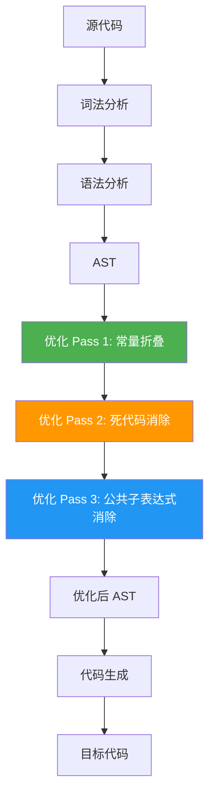
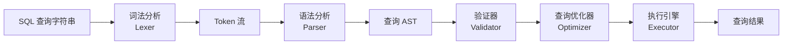
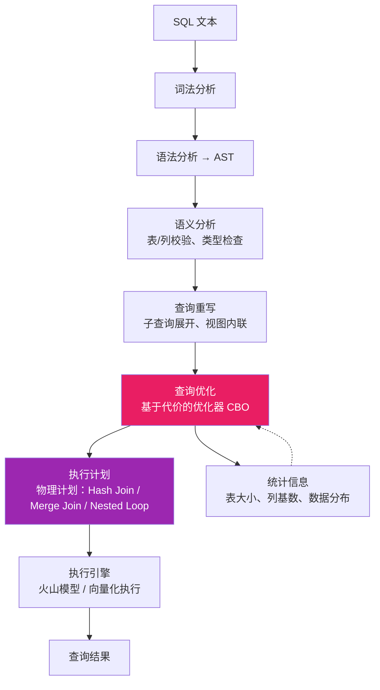

## 实战案例

编译器架构是计算机科学中最经典的工程实践之一。理论再优美，最终都要落地为可运行的代码。本节通过四个由浅入深的实战案例，完整展示从词法分析到代码优化的全过程，帮助读者将理论知识转化为工程能力。

四个案例的递进关系如下：

| 案例 | 核心主题 | 编译器阶段 | 难度 | 关键收获 |
|------|----------|------------|------|----------|
| 案例一 表达式编译器 | 四阶段经典架构 | Lex → Parse → CodeGen → VM | 入门 | 理解编译器的完整流水线 |
| 案例二 配置DSL | 领域特定语言设计 | Lex → Parse → AST遍历 | 进阶 | DSL在工程中的实际价值 |
| 案例三 编译器优化 | 优化Pass实现 | AST变换（常量折叠、DCE、LICM、CSE） | 深入 | 理解优化的层次与代价 |
| 案例四 SQL解释器 | 查询引擎 | Lex → Parse → Validate → Execute | 工业级 | 体验完整查询引擎的复杂度 |

每个案例都是独立可运行的完整程序，建议读者按顺序动手实践。

---

### 案例一：从零构建一个表达式编译器（计算器）

这是最经典的编译器入门案例。我们构建一个支持加减乘除、括号和变量赋值的表达式语言，最终将其编译为字节码。

#### 1.1 需求定义

目标语言语法示例：

let x = 10 + 20 * 3;
let y = (x + 5) / 5;
y * 2 + x

要求：支持整数和浮点数运算、变量声明与使用、括号优先级、四则运算，最终输出计算结果。

#### 1.2 词法分析器（Lexer/Lexical Analyzer）

词法分析器负责将源代码字符串拆分为 token 序列。每个 token 包含类型和字面值。

```python
from enum import Enum, auto
from dataclasses import dataclass
from typing import List, Union

class TokenType(Enum):
    """Token 类型枚举"""
    # 字面量
    INTEGER = auto()       # 整数，如 42
    FLOAT = auto()         # 浮点数，如 3.14
    
    # 标识符与关键字
    IDENTIFIER = auto()    # 变量名，如 x, y
    LET = auto()           # 关键字 let
    
    # 运算符
    PLUS = auto()          # +
    MINUS = auto()         # -
    MULTIPLY = auto()      # *
    DIVIDE = auto()        # /
    ASSIGN = auto()        # =
    
    # 分隔符
    SEMICOLON = auto()     # ;
    LPAREN = auto()        # (
    RPAREN = auto()        # )
    
    # 特殊
    EOF = auto()           # 文件结束
    NEWLINE = auto()       # 换行

@dataclass
class Token:
    type: TokenType
    value: Union[int, float, str]
    line: int
    column: int

class LexerError(Exception):
    """词法分析错误"""
    def __init__(self, message, line, column):
        self.line = line
        self.column = column
        super().__init__(f"行 {line}, 列 {column}: {message}")

class Lexer:
    """
    词法分析器：将源代码字符串转换为 Token 流。
    
    工作原理：
    1. 维护一个位置指针，逐字符扫描源代码
    2. 跳过空白字符（空格、制表符、换行）
    3. 根据当前字符判断 token 类型：
       - 数字开头 → 尝试解析整数或浮点数
       - 字母开头 → 解析标识符或关键字
       - 特殊字符 → 解析运算符或分隔符
    4. 遇到无法识别的字符则报错
    """
    
    def __init__(self, source: str):
        self.source = source
        self.pos = 0
        self.line = 1
        self.column = 1
        self.tokens: List[Token] = []
    
    def peek(self) -> str:
        """查看当前字符但不移动指针（前瞻）"""
        if self.pos < len(self.source):
            return self.source[self.pos]
        return '\0'
    
    def advance(self) -> str:
        """取当前字符并移动指针"""
        ch = self.source[self.pos]
        self.pos += 1
        if ch == '\n':
            self.line += 1
            self.column = 1
        else:
            self.column += 1
        return ch
    
    def skip_whitespace(self):
        """跳过空格和制表符（保留换行用于语句分隔）"""
        while self.pos < len(self.source) and self.source[self.pos] in ' \t\r':
            self.advance()
    
    def read_number(self) -> Token:
        """解析数字字面量（整数或浮点数）"""
        start_line, start_col = self.line, self.column
        result = ''
        has_dot = False
        
        while self.pos < len(self.source):
            ch = self.source[self.pos]
            if ch.isdigit():
                result += self.advance()
            elif ch == '.' and not has_dot:
                has_dot = True
                result += self.advance()
            else:
                break
        
        if has_dot:
            return Token(TokenType.FLOAT, float(result), start_line, start_col)
        else:
            return Token(TokenType.INTEGER, int(result), start_line, start_col)
    
    def read_identifier(self) -> Token:
        """解析标识符和关键字"""
        start_line, start_col = self.line, self.column
        result = ''
        while self.pos < len(self.source) and (self.source[self.pos].isalnum() or self.source[self.pos] == '_'):
            result += self.advance()
        
        # 关键字识别
        keywords = {'let': TokenType.LET}
        token_type = keywords.get(result, TokenType.IDENTIFIER)
        return Token(token_type, result, start_line, start_col)
    
    def tokenize(self) -> List[Token]:
        """主扫描循环：将完整源代码转换为 token 列表"""
        while self.pos < len(self.source):
            self.skip_whitespace()
            if self.pos >= len(self.source):
                break
            
            ch = self.peek()
            start_line, start_col = self.line, self.column
            
            if ch.isdigit():
                self.tokens.append(self.read_number())
            elif ch.isalpha() or ch == '_':
                self.tokens.append(self.read_identifier())
            elif ch == '+':
                self.tokens.append(Token(TokenType.PLUS, '+', start_line, start_col))
                self.advance()
            elif ch == '-':
                self.tokens.append(Token(TokenType.MINUS, '-', start_line, start_col))
                self.advance()
            elif ch == '*':
                self.tokens.append(Token(TokenType.MULTIPLY, '*', start_line, start_col))
                self.advance()
            elif ch == '/':
                self.tokens.append(Token(TokenType.DIVIDE, '/', start_line, start_col))
                self.advance()
            elif ch == '=':
                self.tokens.append(Token(TokenType.ASSIGN, '=', start_line, start_col))
                self.advance()
            elif ch == '(':
                self.tokens.append(Token(TokenType.LPAREN, '(', start_line, start_col))
                self.advance()
            elif ch == ')':
                self.tokens.append(Token(TokenType.RPAREN, ')', start_line, start_col))
                self.advance()
            elif ch == ';':
                self.tokens.append(Token(TokenType.SEMICOLON, ';', start_line, start_col))
                self.advance()
            elif ch == '\n':
                self.tokens.append(Token(TokenType.NEWLINE, '\\n', start_line, start_col))
                self.advance()
            else:
                raise LexerError(f"未预期的字符 '{ch}'", start_line, start_col)
        
        self.tokens.append(Token(TokenType.EOF, None, self.line, self.column))
        return self.tokens
```

#### 1.3 语法分析器（Parser/Syntax Analyzer）

语法分析器使用递归下降法将 token 流构建为抽象语法树（AST）。递归下降法的核心思想是：**每条语法规则对应一个解析函数**，函数之间的调用关系反映语法的层次结构。

表达式语法（EBNF）：
  program     = statement* expression?
  statement   = 'let' IDENTIFIER '=' expression ';'
  expression  = term (('+' | '-') term)*
  term        = factor (('*' | '/') factor)*
  factor      = NUMBER | IDENTIFIER | '(' expression ')' | ('+' | '-') factor

```python
from dataclasses import dataclass, field
from typing import List, Optional

# ========== AST 节点定义 ==========

@dataclass
class ASTNode:
    """AST 节点基类"""
    pass

@dataclass
class NumberLiteral(ASTNode):
    """数字字面量节点"""
    value: Union[int, float]

@dataclass
class Identifier(ASTNode):
    """标识符（变量引用）节点"""
    name: str

@dataclass
class BinaryOp(ASTNode):
    """二元运算节点"""
    op: str            # 运算符：+, -, *, /
    left: ASTNode
    right: ASTNode

@dataclass
class UnaryOp(ASTNode):
    """一元运算节点（正号/负号）"""
    op: str
    operand: ASTNode

@dataclass
class LetStatement(ASTNode):
    """变量声明语句节点"""
    name: str
    value: ASTNode

@dataclass
class Program(ASTNode):
    """程序根节点"""
    statements: List[ASTNode]
    expression: Optional[ASTNode] = None


# ========== 递归下降解析器 ==========

class ParseError(Exception):
    """语法分析错误"""
    def __init__(self, message, token):
        self.token = token
        super().__init__(f"行 {token.line}, 列 {token.column}: {message}")

class Parser:
    """
    递归下降解析器。
    
    核心思路：
    - 运算符优先级通过函数调用层级实现：
      expression → 处理 + -（最低优先级）
      term       → 处理 * /（较高优先级）
      factor     → 处理数字、变量、括号（最高优先级）
    - 低优先级的运算在调用栈的外层，天然实现了正确的结合性
    """
    
    def __init__(self, tokens: List[Token]):
        self.tokens = tokens
        self.pos = 0
    
    def current_token(self) -> Token:
        return self.tokens[self.pos]
    
    def eat(self, expected_type: TokenType) -> Token:
        """消费当前 token 并验证类型"""
        token = self.current_token()
        if token.type != expected_type:
            raise ParseError(
                f"期望 {expected_type.name}，实际得到 {token.type.name} ('{token.value}')",
                token
            )
        self.pos += 1
        return token
    
    def parse(self) -> Program:
        """
        program = statement* expression?
        
        顶层解析：先处理所有 let 语句，最后处理可选的返回表达式
        """
        statements = []
        while self.current_token().type != TokenType.EOF:
            if self.current_token().type == TokenType.LET:
                statements.append(self.parse_let_statement())
            else:
                break  # 剩余部分是顶层表达式
        
        expression = None
        if self.current_token().type != TokenType.EOF:
            expression = self.parse_expression()
        
        return Program(statements, expression)
    
    def parse_let_statement(self) -> LetStatement:
        """statement = 'let' IDENTIFIER '=' expression ';'"""
        self.eat(TokenType.LET)
        name_token = self.eat(TokenType.IDENTIFIER)
        self.eat(TokenType.ASSIGN)
        value = self.parse_expression()
        self.eat(TokenType.SEMICOLON)
        return LetStatement(name_token.value, value)
    
    def parse_expression(self) -> ASTNode:
        """
        expression = term (('+' | '-') term)*
        
        处理加减法。从左到右结合，优先级低于乘除。
        """
        node = self.parse_term()
        
        while self.current_token().type in (TokenType.PLUS, TokenType.MINUS):
            op_token = self.current_token()
            self.pos += 1
            right = self.parse_term()
            node = BinaryOp(op_token.value, node, right)
        
        return node
    
    def parse_term(self) -> ASTNode:
        """
        term = factor (('*' | '/') factor)*
        
        处理乘除法。优先级高于加减。
        """
        node = self.parse_factor()
        
        while self.current_token().type in (TokenType.MULTIPLY, TokenType.DIVIDE):
            op_token = self.current_token()
            self.pos += 1
            right = self.parse_factor()
            node = BinaryOp(op_token.value, node, right)
        
        return node
    
    def parse_factor(self) -> ASTNode:
        """
        factor = NUMBER | IDENTIFIER | '(' expression ')' | ('+' | '-') factor
        
        处理最基本的操作数：数字、变量名、括号表达式、一元正负号。
        """
        token = self.current_token()
        
        if token.type in (TokenType.INTEGER, TokenType.FLOAT):
            self.pos += 1
            return NumberLiteral(token.value)
        
        elif token.type == TokenType.IDENTIFIER:
            self.pos += 1
            return Identifier(token.value)
        
        elif token.type == TokenType.LPAREN:
            self.eat(TokenType.LPAREN)
            node = self.parse_expression()
            self.eat(TokenType.RPAREN)
            return node
        
        elif token.type == TokenType.PLUS:
            self.pos += 1
            return UnaryOp('+', self.parse_factor())
        
        elif token.type == TokenType.MINUS:
            self.pos += 1
            return UnaryOp('-', self.parse_factor())
        
        else:
            raise ParseError(f"意外的 token '{token.value}'", token)
```

#### 1.4 字节码生成器（Code Generator）

将 AST 编译为栈式字节码。栈式虚拟机是编译器最常用的中间表示之一，Java 虚拟机（JVM）和 Python 虚拟机都采用这种架构。

```python
from enum import Enum, auto
from dataclasses import dataclass
from typing import List, Union

class OpCode(Enum):
    """字节码操作码"""
    LOAD_CONST = auto()    # 将常量压入栈
    LOAD_VAR = auto()      # 将变量值压入栈
    STORE_VAR = auto()     # 弹出栈顶存入变量
    ADD = auto()           # 弹出两个值相加，结果入栈
    SUB = auto()           # 弹出两个值相减，结果入栈
    MUL = auto()           # 弹出两个值相乘，结果入栈
    DIV = auto()           # 弹出两个值相除，结果入栈
    NEG = auto()           # 栈顶取反
    POP = auto()           # 弹出栈顶（丢弃）
    HALT = auto()          # 停机

@dataclass
class Instruction:
    """单条字节码指令"""
    opcode: OpCode
    operand: Union[int, float, str, None] = None
    
    def __repr__(self):
        if self.operand is not None:
            return f"{self.opcode.name:12s} {self.operand}"
        return self.opcode.name

class Compiler:
    """
    编译器：遍历 AST，生成字节码指令序列。
    
    编译策略：
    - 中序遍历 AST（左子树 → 根 → 右子树）
    - 每个叶子节点（数字、变量）生成 LOAD 指令
    - 每个内部节点（运算符）生成对应的运算指令
    - 变量赋值先编译右侧表达式，再生成 STORE 指令
    """
    
    def __init__(self):
        self.instructions: List[Instruction] = []
        self.constants: List[Union[int, float]] = []
        self.variables: dict = {}  # 变量名 → 索引
    
    def compile(self, program: Program) -> List[Instruction]:
        """编译整个程序"""
        for stmt in program.statements:
            self.compile_node(stmt)
            self.instructions.append(Instruction(OpCode.POP))  # 语句结果不使用，弹出
        
        if program.expression:
            self.compile_node(program.expression)
        else:
            # 无返回表达式，压入 nil
            self.instructions.append(Instruction(OpCode.LOAD_CONST, 0))
        
        self.instructions.append(Instruction(OpCode.HALT))
        return self.instructions
    
    def compile_node(self, node: ASTNode):
        """递归编译 AST 节点"""
        if isinstance(node, NumberLiteral):
            self.instructions.append(Instruction(OpCode.LOAD_CONST, node.value))
        
        elif isinstance(node, Identifier):
            self.instructions.append(Instruction(OpCode.LOAD_VAR, node.name))
        
        elif isinstance(node, BinaryOp):
            self.compile_node(node.left)
            self.compile_node(node.right)
            op_map = {'+': OpCode.ADD, '-': OpCode.SUB, 
                      '*': OpCode.MUL, '/': OpCode.DIV}
            self.instructions.append(Instruction(op_map[node.op]))
        
        elif isinstance(node, UnaryOp):
            self.compile_node(node.operand)
            if node.op == '-':
                self.instructions.append(Instruction(OpCode.NEG))
            # 一元正号不做任何操作
        
        elif isinstance(node, LetStatement):
            self.compile_node(node.value)
            self.instructions.append(Instruction(OpCode.STORE_VAR, node.name))
```

#### 1.5 虚拟机执行器（VM Interpreter）

实现一个栈式虚拟机来执行编译器生成的字节码：

```python
class VM:
    """
    栈式虚拟机。
    
    执行模型：
    - 维护一个操作数栈和一个变量环境（字典）
    - 逐条读取字节码指令并执行
    - 运算指令从栈顶弹出操作数，计算结果压回栈
    - 这种模型简单、确定、易于验证正确性
    """
    
    def __init__(self):
        self.stack: List[Union[int, float]] = []
        self.variables: dict = {}
    
    def push(self, value):
        self.stack.append(value)
    
    def pop(self) -> Union[int, float]:
        return self.stack.pop()
    
    def execute(self, instructions: List[Instruction]) -> Union[int, float]:
        """执行字节码指令序列，返回最终结果"""
        pc = 0  # 程序计数器
        while pc < len(instructions):
            instr = instructions[pc]
            
            if instr.opcode == OpCode.LOAD_CONST:
                self.push(instr.operand)
            
            elif instr.opcode == OpCode.LOAD_VAR:
                name = instr.operand
                if name not in self.variables:
                    raise RuntimeError(f"未定义的变量: {name}")
                self.push(self.variables[name])
            
            elif instr.opcode == OpCode.STORE_VAR:
                self.variables[instr.operand] = self.pop()
            
            elif instr.opcode == OpCode.ADD:
                right, left = self.pop(), self.pop()
                self.push(left + right)
            
            elif instr.opcode == OpCode.SUB:
                right, left = self.pop(), self.pop()
                self.push(left - right)
            
            elif instr.opcode == OpCode.MUL:
                right, left = self.pop(), self.pop()
                self.push(left * right)
            
            elif instr.opcode == OpCode.DIV:
                right, left = self.pop(), self.pop()
                if right == 0:
                    raise ZeroDivisionError("除零错误")
                self.push(left / right)
            
            elif instr.opcode == OpCode.NEG:
                self.push(-self.pop())
            
            elif instr.opcode == OpCode.POP:
                self.pop()
            
            elif instr.opcode == OpCode.HALT:
                break
            
            pc += 1
        
        return self.stack[-1] if self.stack else 0
```

#### 1.6 端到端测试

```python
# 完整流程演示
source = """
let x = 10 + 20 * 3;
let y = (x + 5) / 5;
y * 2 + x
"""

# 第1步：词法分析
lexer = Lexer(source)
tokens = lexer.tokenize()
print("=== Token 流 ===")
for t in tokens:
    print(f"  {t.type.name:12s} = {t.value}")

# 第2步：语法分析
parser = Parser(tokens)
ast = parser.parse()
print("\n=== AST 结构 ===")
print(ast)

# 第3步：字节码编译
compiler = Compiler()
instructions = compiler.compile(ast)
print("\n=== 字节码指令 ===")
for i, instr in enumerate(instructions):
    print(f"  [{i:3d}] {instr}")

# 第4步：虚拟机执行
vm = VM()
result = vm.execute(instructions)
print(f"\n=== 执行结果: {result} ===")
# 计算过程：x = 10 + 60 = 70, y = 75/5 = 15, 15*2+70 = 100
```

> **设计要点回顾**：这个案例完整演示了编译器四阶段经典架构——词法分析（字符→token）、语法分析（token→AST）、代码生成（AST→字节码）、执行（字节码→结果）。每一层只关注自己的职责，层间通过明确的数据结构传递信息。这种关注点分离的设计思想是编译器工程的核心。

---

> **从案例一到案例二的跃迁**: 案例一构建了一个计算型编译器，核心是数值运算。案例二转向描述型编译器，核心是结构化数据的解析与生成。两者共享相同的编译流水线（Lex → Parse → CodeGen），但优化目标不同：前者追求计算效率，后者追求可读性和可维护性。这种「相同架构，不同目标」的设计模式在工业界非常普遍。

### 案例二：实现一个配置语言编译器（DSL）

领域特定语言（DSL）是编译器技术在实际工程中最广泛的应用。本案例实现一个用于描述服务器配置的 DSL，最终生成 JSON 配置文件。

#### 2.1 DSL 语法设计

# 服务器配置 DSL
server "api-gateway" {
    host = "0.0.0.0"
    port = 8080
    max_connections = 1000
    ssl_enabled = true
    
    upstream "backend" {
        servers = ["10.0.1.1:8080", "10.0.1.2:8080", "10.0.1.3:8080"]
        health_check_interval = 30
        load_balance = "round-robin"
    }
    
    rate_limit {
        requests_per_second = 100
        burst_size = 200
        key = "$remote_addr"
    }
}

设计这种 DSL 的核心价值在于：

| 对比维度 | 直接写 JSON/YAML | 使用 DSL |
|----------|-------------------|----------|
| 可读性 | 嵌套括号多，易混淆 | 缩进结构清晰 |
| 校验 | 依赖外部 schema | 编译时即时报错 |
| 可计算性 | 静态配置 | 可嵌入表达式和变量 |
| 安全性 | 无法限制能力 | 可约束可配置范围 |
| 扩展性 | 需要额外工具 | 自定义语法糖 |

#### 2.2 词法分析器实现

```python
class ConfigTokenType(Enum):
    STRING = auto()        # "..." 字符串
    INTEGER = auto()       # 数字
    FLOAT = auto()         # 浮点数
    BOOLEAN = auto()       # true / false
    IDENTIFIER = auto()    # 标识符
    LBRACE = auto()        # {
    RBRACE = auto()        # }
    LBRACKET = auto()      # [
    RBRACKET = auto()      # ]
    EQUALS = auto()        # =
    COMMA = auto()         # ,
    HASH = auto()          # #（注释）
    EOF = auto()

class ConfigLexer:
    """
    配置语言词法分析器。
    
    与通用语言词法分析器的关键区别：
    1. 需要支持字符串字面量（含转义字符）
    2. 需要支持数组字面量 [1, 2, 3]
    3. 需要支持注释（# 开头到行尾）
    4. 需要支持布尔值字面量 true/false
    """
    
    def __init__(self, source: str):
        self.source = source
        self.pos = 0
        self.line = 1
        self.tokens = []
    
    def read_string(self) -> Token:
        """解析字符串字面量，处理转义序列"""
        start_line = self.line
        self.pos += 1  # 跳过开头的引号
        result = ''
        escape_chars = {'n': '\n', 't': '\t', '\\': '\\', '"': '"'}
        
        while self.pos < len(self.source) and self.source[self.pos] != '"':
            if self.source[self.pos] == '\\':
                self.pos += 1
                if self.pos < len(self.source):
                    next_ch = self.source[self.pos]
                    result += escape_chars.get(next_ch, next_ch)
            else:
                result += self.source[self.pos]
            self.pos += 1
        
        if self.pos >= len(self.source):
            raise ConfigError(f"行 {start_line}: 未闭合的字符串")
        
        self.pos += 1  # 跳过结尾引号
        return Token(ConfigTokenType.STRING, result, start_line, 0)
    
    def read_number(self) -> Token:
        """解析数字，区分整数和浮点数"""
        start_line = self.line
        result = ''
        has_dot = False
        
        while self.pos < len(self.source) and (self.source[self.pos].isdigit() or self.source[self.pos] == '.'):
            if self.source[self.pos] == '.':
                has_dot = True
            result += self.source[self.pos]
            self.pos += 1
        
        token_type = ConfigTokenType.FLOAT if has_dot else ConfigTokenType.INTEGER
        value = float(result) if has_dot else int(result)
        return Token(token_type, value, start_line, 0)
    
    def tokenize(self) -> list:
        """主词法分析循环"""
        while self.pos < len(self.source):
            ch = self.source[self.pos]
            
            # 跳过空白
            if ch in ' \t\r':
                self.pos += 1
                continue
            
            # 换行
            if ch == '\n':
                self.line += 1
                self.pos += 1
                continue
            
            # 注释
            if ch == '#':
                while self.pos < len(self.source) and self.source[self.pos] != '\n':
                    self.pos += 1
                continue
            
            # 字符串
            if ch == '"':
                self.tokens.append(self.read_string())
                continue
            
            # 数字
            if ch.isdigit():
                self.tokens.append(self.read_number())
                continue
            
            # 标识符和关键字
            if ch.isalpha() or ch == '_' or ch == '$':
                result = ''
                while self.pos < len(self.source) and (self.source[self.pos].isalnum() or self.source[self.pos] in '_$.'):
                    result += self.source[self.pos]
                    self.pos += 1
                if result in ('true', 'false'):
                    self.tokens.append(Token(ConfigTokenType.BOOLEAN, result == 'true', self.line, 0))
                else:
                    self.tokens.append(Token(ConfigTokenType.IDENTIFIER, result, self.line, 0))
                continue
            
            # 特殊字符
            char_map = {
                '{': ConfigTokenType.LBRACE, '}': ConfigTokenType.RBRACE,
                '[': ConfigTokenType.LBRACKET, ']': ConfigTokenType.RBRACKET,
                '=': ConfigTokenType.EQUALS, ',': ConfigTokenType.COMMA,
            }
            if ch in char_map:
                self.tokens.append(Token(char_map[ch], ch, self.line, 0))
                self.pos += 1
                continue
            
            raise ConfigError(f"行 {self.line}: 意外字符 '{ch}'")
        
        self.tokens.append(Token(ConfigTokenType.EOF, None, self.line, 0))
        return self.tokens
```

#### 2.3 递归下降解析器

```python
@dataclass
class ConfigNode:
    """配置树节点"""
    type: str  # 'block', 'assignment', 'list'
    name: str = ''
    value: any = None
    children: list = field(default_factory=list)

class ConfigParser:
    """
    配置语法解析器。
    
    语法结构：
    config      = block*
    block       = IDENTIFIER STRING? '{' assignment* block* '}'
    assignment  = IDENTIFIER '=' value ';'?
    value       = STRING | NUMBER | BOOLEAN | list | block
    list        = '[' (value (',' value)*)? ']'
    """
    
    def __init__(self, tokens):
        self.tokens = tokens
        self.pos = 0
    
    def current(self):
        return self.tokens[self.pos]
    
    def eat(self, expected_type):
        token = self.current()
        if token.type != expected_type:
            raise ConfigError(
                f"行 {token.line}: 期望 {expected_type.name}，得到 {token.type.name}"
            )
        self.pos += 1
        return token
    
    def parse(self) -> list:
        """解析整个配置文件，返回块列表"""
        blocks = []
        while self.current().type != ConfigTokenType.EOF:
            blocks.append(self.parse_block())
        return blocks
    
    def parse_block(self) -> ConfigNode:
        """解析配置块：server "name" { ... }"""
        name_token = self.eat(ConfigTokenType.IDENTIFIER)
        
        # 可选的块名称（字符串）
        block_name = ''
        if self.current().type == ConfigTokenType.STRING:
            block_name = self.eat(ConfigTokenType.STRING).value
        
        self.eat(ConfigTokenType.LBRACE)
        
        node = ConfigNode(type='block', name=name_token.value)
        
        while self.current().type != ConfigTokenType.RBRACE:
            if self.current().type == ConfigTokenType.IDENTIFIER:
                # 判断是嵌套块还是赋值语句
                # 简单策略：查看标识符后面是否有 '='
                if (self.pos + 1 < len(self.tokens) and 
                    self.tokens[self.pos + 1].type == ConfigTokenType.EQUALS):
                    node.children.append(self.parse_assignment())
                else:
                    node.children.append(self.parse_block())
            else:
                raise ConfigError(f"行 {self.current().line}: 意外的 token")
        
        self.eat(ConfigTokenType.RBRACE)
        return node
    
    def parse_assignment(self) -> ConfigNode:
        """解析赋值语句：key = value"""
        key = self.eat(ConfigTokenType.IDENTIFIER).value
        self.eat(ConfigTokenType.EQUALS)
        value = self.parse_value()
        return ConfigNode(type='assignment', name=key, value=value)
    
    def parse_value(self):
        """解析值：字符串、数字、布尔值、数组"""
        token = self.current()
        
        if token.type == ConfigTokenType.STRING:
            self.pos += 1
            return token.value
        elif token.type in (ConfigTokenType.INTEGER, ConfigTokenType.FLOAT):
            self.pos += 1
            return token.value
        elif token.type == ConfigTokenType.BOOLEAN:
            self.pos += 1
            return token.value
        elif token.type == ConfigTokenType.LBRACKET:
            return self.parse_list()
        else:
            raise ConfigError(f"行 {token.line}: 期望一个值，得到 {token.type.name}")
    
    def parse_list(self) -> list:
        """解析数组：[value1, value2, ...]"""
        self.eat(ConfigTokenType.LBRACKET)
        items = []
        
        if self.current().type != ConfigTokenType.RBRACKET:
            items.append(self.parse_value())
            while self.current().type == ConfigTokenType.COMMA:
                self.eat(ConfigTokenType.COMMA)
                items.append(self.parse_value())
        
        self.eat(ConfigTokenType.RBRACKET)
        return items
```

#### 2.4 代码生成：AST → JSON

```python
import json

class ConfigCodeGenerator:
    """
    代码生成器：将配置 AST 转换为嵌套字典（可序列化为 JSON）。
    
    生成策略：
    - 块 → 嵌套字典
    - 赋值 → 字典键值对
    - 数组 → Python 列表
    - 字符串/数字/布尔 → 原始类型
    """
    
    def generate(self, blocks: list) -> dict:
        result = {}
        for block in blocks:
            result[block.name] = self.generate_block(block)
        return result
    
    def generate_block(self, node: ConfigNode) -> dict:
        block_dict = {}
        for child in node.children:
            if child.type == 'assignment':
                block_dict[child.name] = self.generate_value(child.value)
            elif child.type == 'block':
                block_dict[child.name] = self.generate_block(child)
        return block_dict
    
    def generate_value(self, value):
        if isinstance(value, list):
            return [self.generate_value(item) for item in value]
        elif isinstance(value, ConfigNode):
            return self.generate_block(value)
        return value  # 字符串、数字、布尔值直接返回

# 使用示例
source = '''
server "api-gateway" {
    host = "0.0.0.0"
    port = 8080
    max_connections = 1000
    ssl_enabled = true
    
    upstream "backend" {
        servers = ["10.0.1.1:8080", "10.0.1.2:8080", "10.0.1.3:8080"]
        health_check_interval = 30
        load_balance = "round-robin"
    }
    
    rate_limit {
        requests_per_second = 100
        burst_size = 200
    }
}
'''

# 编译流程
lexer = ConfigLexer(source)
tokens = lexer.tokenize()
parser = ConfigParser(tokens)
ast = parser.parse()
codegen = ConfigCodeGenerator()
config = codegen.generate(ast)

# 输出 JSON
print(json.dumps(config, indent=2))
```

输出结果：

```json
{
  "server": {
    "api-gateway": {
      "host": "0.0.0.0",
      "port": 8080,
      "max_connections": 1000,
      "ssl_enabled": true,
      "upstream": {
        "backend": {
          "servers": ["10.0.1.1:8080", "10.0.1.2:8080", "10.0.1.3:8080"],
          "health_check_interval": 30,
          "load_balance": "round-robin"
        }
      },
      "rate_limit": {
        "requests_per_second": 100,
        "burst_size": 200
      }
    }
  }
}
```

#### 2.5 DSL 设计的核心原则

1. **渐进复杂度**：先实现最简语法，再逐步添加特性（数组、嵌套、注释），避免一开始就设计过于复杂的语法
2. **明确的错误信息**：编译器的价值之一是提供精准的错误定位（行号、列号、期望值），让配置编写者快速修正问题
3. **语义校验**：在代码生成阶段加入校验逻辑，如端口号范围（1-65535）、必填字段检查、类型匹配等
4. **可逆性**：生成的 JSON 可以被人类读取和理解，便于调试和版本控制

---

> **从案例二到案例三的跃迁**: 案例一和案例二关注的是「如何正确地编译」，案例三则转向「如何编译得更好」。优化是编译器从「能用」到「好用」的关键跨越。同一个程序，经过优化的编译器生成的代码可能比未优化的快 10-100 倍。这也是为什么 `gcc -O3` 和 `gcc`（默认 -O0）之间的性能差距如此悬殊。

### 案例三：编译器优化——从常量折叠到循环优化

编译器优化是提升程序性能的关键环节，也是编译器技术中最具挑战性的部分。一个优秀的优化器能够在不改变程序语义的前提下，将执行速度提升数倍甚至数十倍。本案例以 Python 的 `ast` 模块为例，实现四个经典优化 pass——从最简单的常量折叠到复杂的循环不变量外提，逐步展示优化器的设计思路与实现技巧。

#### 3.1 优化架构概览



编译器优化通常以 **Pass（趟）** 的形式组织，每个 Pass 遍历 AST 一次，执行特定的优化变换。多个 Pass 可以串联执行，后一个 Pass 可以利用前一个 Pass 产生的新机会。

#### 3.2 常量折叠（Constant Folding）

常量折叠在编译时计算所有可以在编译期确定的表达式，将计算结果直接嵌入代码。

```python
import ast
import operator

class ConstantFolding(ast.NodeTransformer):
    """
    常量折叠优化器。
    
    工作原理：
    1. 后序遍历 AST（先处理子节点，再处理父节点）
    2. 对于二元运算节点（+、-、*、/），检查左右子节点是否都是常量
    3. 如果都是常量，在编译时直接计算结果，用常量节点替换原运算节点
    
    优化效果示例：
      输入:  x = 3 * 4 + 2
      输出:  x = 14
      
      输入:  y = (1 + 2) * (3 + 4)
      输出:  y = 21
      
      输入:  z = "hello" + " " + "world"
      输出:  z = "hello world"
    """
    
    BINARY_OPS = {
        ast.Add: operator.add,
        ast.Sub: operator.sub,
        ast.Mult: operator.mul,
        ast.Div: operator.truediv,
        ast.Pow: operator.pow,
        ast.Mod: operator.mod,
    }
    
    UNARY_OPS = {
        ast.USub: operator.neg,
        ast.UAdd: operator.pos,
    }
    
    def visit_BinOp(self, node):
        # 先递归优化子节点
        self.generic_visit(node)
        
        # 检查左右是否都是常量
        if isinstance(node.left, ast.Constant) and isinstance(node.right, ast.Constant):
            op_func = self.BINARY_OPS.get(type(node.op))
            if op_func:
                try:
                    result = op_func(node.left.value, node.right.value)
                    # 安全检查：避免除零
                    if isinstance(node.op, ast.Div) and node.right.value == 0:
                        return node  # 保留原节点，让运行时报错
                    return ast.Constant(value=result)
                except (OverflowError, ZeroDivisionError):
                    return node  # 计算异常时保留原节点
        return node
    
    def visit_UnaryOp(self, node):
        self.generic_visit(node)
        
        if isinstance(node.operand, ast.Constant):
            op_func = self.UNARY_OPS.get(type(node.op))
            if op_func:
                try:
                    result = op_func(node.operand.value)
                    return ast.Constant(value=result)
                except OverflowError:
                    return node
        return node

# 演示
source = """
x = 3 * 4 + 2
y = (1 + 2) * (3 + 4)
z = 100 / 0  # 不折叠，保留除零错误
w = "hello" + " " + "world"
"""
tree = ast.parse(source)
optimized = ConstantFolding().visit(tree)
ast.fix_missing_locations(optimized)

print(ast.dump(optimized, indent=2))
# z = 100 / 0 保留不变，其他常量表达式被折叠
```

#### 3.3 死代码消除（Dead Code Elimination）

死代码消除移除永远不会被执行到的代码。最常见的情况是 `if False:` 或 `while False:` 块中的代码。

```python
class DeadCodeElimination(ast.NodeTransformer):
    """
    死代码消除优化器。
    
    消除的死代码类型：
    1. 常量条件分支：if True/False, while True/False
    2. 不可达语句：return/break/continue 之后的代码
    3. 空表达式：单独的字面量表达式语句（如 "hello";）
    
    优化效果示例：
      输入:  if False:
                 print("永远不会执行")
                 x = 1
      输出:  （完全删除该分支）
      
      输入:  return 42
             print("不可达")  # 此行被删除
      输出:  return 42
    """
    
    def visit_If(self, node):
        self.generic_visit(node)
        
        # if True → 只保留 body
        if isinstance(node.test, ast.Constant) and node.test.value is True:
            return [self._clean_statements(stmt) for stmt in node.body]
        
        # if False → 只保留 orelse（如有），否则删除整个 if
        if isinstance(node.test, ast.Constant) and node.test.value is False:
            if node.orelse:
                return [self._clean_statements(stmt) for stmt in node.orelse]
            return []  # 删除整个 if 语句
        
        return node
    
    def visit_While(self, node):
        self.generic_visit(node)
        
        # while False → 删除整个循环
        if isinstance(node.test, ast.Constant) and node.test.value is False:
            return []
        
        return node
    
    def visit_FunctionDef(self, node):
        """消除函数中的死代码（return 之后的语句）"""
        self.generic_visit(node)
        
        new_body = []
        reachable = True
        
        for stmt in node.body:
            if not reachable:
                break  # 不可达代码，跳过
            new_body.append(stmt)
            if isinstance(stmt, (ast.Return, ast.Break, ast.Continue, ast.Raise)):
                reachable = False
        
        node.body = new_body if new_body else [ast.Pass()]
        return node
    
    def _clean_statements(self, stmt):
        """辅助方法：处理单条语句或语句列表"""
        return stmt

# 演示
source = """
def example():
    if False:
        print("dead code 1")
        x = 1
    else:
        print("live code")
    
    while False:
        print("dead loop")
    
    y = 42
    return y
    print("unreachable")  # return 之后的代码
"""
tree = ast.parse(source)
optimized = DeadCodeElimination().visit(tree)
ast.fix_missing_locations(optimized)
print(ast.unparse(optimized))
```

#### 3.4 循环不变量外提（Loop-Invariant Code Motion）

循环不变量外提（LICM）将循环体内不随迭代变化的计算移到循环外，避免重复执行相同的计算。这是循环优化中收益最高的优化之一。

```python
class LoopInvariantMotion(ast.NodeTransformer):
    """
    循环不变量外提优化器。
    
    工作原理：
    1. 识别循环体中的「循环不变量」——不依赖循环变量的表达式
    2. 将不变量提取到循环之前执行
    3. 在循环体内用临时变量引用提取后的结果
    
    优化效果示例：
      输入:  for i in range(n):
                 x = a + b          # 循环不变量，每次迭代结果相同
                 y[i] = x + i       # 只有这部分依赖循环变量
      输出:  x = a + b              # 提到循环外
             for i in range(n):
                 y[i] = x + i
    
    实际收益：假设循环执行 1000 次，a+b 被计算 1000 次变为只计算 1 次。
    在数值计算、图像处理等密集循环场景中，LICM 可带来 2-5 倍加速。
    """
    
    def __init__(self):
        super().__init__()
        self._loop_vars = set()   # 循环变量集合
        self._invariant_stmts = []  # 待外提的语句
    
    def visit_For(self, node):
        """处理 for 循环"""
        # 收集循环变量
        if isinstance(node.target, ast.Name):
            self._loop_vars.add(node.target.id)
        
        self._loop_vars.add(node.target.id) if isinstance(node.target, ast.Name) else None
        
        # 分析循环体，分离不变量和可变语句
        invariant = []
        variant = []
        
        for stmt in node.body:
            if self._is_loop_invariant(stmt):
                invariant.append(stmt)
            else:
                variant.append(stmt)
        
        # 递归优化可变语句
        new_body = []
        for stmt in variant:
            new_body.append(self.visit(stmt))
        
        node.body = new_body if new_body else [ast.Pass()]
        
        # 返回外提的不变量 + 优化后的循环
        result = []
        for stmt in invariant:
            result.append(self.visit(stmt))
        result.append(node)
        
        self._loop_vars.clear()
        return result
    
    def _is_loop_invariant(self, stmt):
        """判断语句是否为循环不变量"""
        if isinstance(stmt, ast.Assign):
            # 赋值语句：检查右侧表达式是否依赖循环变量
            return not self._depends_on_loop_var(stmt.value)
        return False
    
    def _depends_on_loop_var(self, node):
        """递归检查表达式是否依赖循环变量"""
        if isinstance(node, ast.Name):
            return node.id in self._loop_vars
        elif isinstance(node, ast.BinOp):
            return self._depends_on_loop_var(node.left) or self._depends_on_loop_var(node.right)
        elif isinstance(node, ast.UnaryOp):
            return self._depends_on_loop_var(node.operand)
        elif isinstance(node, ast.Call):
            return any(self._depends_on_loop_var(arg) for arg in node.args)
        elif isinstance(node, (ast.Constant, ast.Num)):
            return False
        return True  # 保守假设：未知节点视为依赖

# 演示
source = """
def process(data, n):
    result = []
    for i in range(n):
        offset = base + 100       # 循环不变量
        scale = 3.14 * 2.0        # 循环不变量
        result.append(data[i] * scale + offset)
    return result
"""
tree = ast.parse(source)
optimized = LoopInvariantMotion().visit(tree)
ast.fix_missing_locations(optimized)
print(ast.unparse(optimized))
# offset 和 scale 的计算被提到 for 循环之外
```

#### 3.5 公共子表达式消除（Common Subexpression Elimination）

公共子表达式消除（CSE）识别重复计算的相同表达式，复用之前的计算结果。当同一表达式在多个地方出现时，只计算一次即可。

```python
class CSEOptimization(ast.NodeTransformer):
    """
    公共子表达式消除优化器。
    
    工作原理：
    1. 遍历 AST，为每个子表达式计算一个「签名」（signature）
    2. 如果两个子表达式签名相同，说明它们计算结果相同
    3. 用第一次计算的结果替换后续重复计算
    
    优化效果示例：
      输入:  y = a * b + a * b + c
      输出:  _t1 = a * b
             y = _t1 + _t1 + c
    
    更复杂的例子：
      输入:  x = (a + b) * (a + b) - (a + b)
      输出:  _t1 = a + b
             x = _t1 * _t1 - _t1
    
    注意：CSE 的正确性依赖于表达式无副作用。如果 a++ 出现在表达式中，
    不能简单地消除重复——每次调用结果可能不同。
    """
    
    def __init__(self):
        super().__init__()
        self._known_exprs = {}  # signature → 临时变量名
        self._counter = 0
        self._insertions = []   # 待插入的赋值语句
    
    def _expr_signature(self, node):
        """为表达式生成签名（结构化哈希）"""
        if isinstance(node, ast.Constant):
            return f"const({node.value})"
        elif isinstance(node, ast.Name):
            return f"var({node.id})"
        elif isinstance(node, ast.BinOp):
            op_name = type(node.op).__name__
            left_sig = self._expr_signature(node.left)
            right_sig = self._expr_signature(node.right)
            return f"binop({op_name},{left_sig},{right_sig})"
        elif isinstance(node, ast.UnaryOp):
            op_name = type(node.op).__name__
            return f"unary({op_name},{self._expr_signature(node.operand)})"
        return None  # 无法签名的表达式不做优化
    
    def _get_temp_name(self):
        """生成唯一的临时变量名"""
        self._counter += 1
        return f"_cse_{self._counter}"
    
    def visit_Expr(self, node):
        """处理表达式语句"""
        self.generic_visit(node)
        if isinstance(node.value, ast.BinOp):
            self._optimize_binop(node.value)
        return node
    
    def visit_Assign(self, node):
        """处理赋值语句"""
        self.generic_visit(node)
        self._optimize_binop(node.value)
        return node
    
    def _optimize_binop(self, node):
        """尝试优化二元运算中的公共子表达式"""
        sig = self._expr_signature(node)
        if sig and sig in self._known_exprs:
            # 替换为已有的临时变量
            temp_name = self._known_exprs[sig]
            return ast.copy_location(
                ast.Name(id=temp_name, ctx=ast.Load()),
                node
            )
        elif sig:
            # 首次出现，记录并创建临时变量
            temp_name = self._get_temp_name()
            self._known_exprs[sig] = temp_name
        return node

# 简化演示：展示 CSE 的核心思想
print("=== CSE 核心思想 ===")
print("输入:  y = a * b + a * b + c")
print("步骤:  1. 扫描 a * b → 首次出现，记录签名")
print("       2. 第二个 a * b → 签名匹配，替换为临时变量")
print("输出:  _cse_1 = a * b")
print("       y = _cse_1 + _cse_1 + c")
print()
print("=== 实际编译器中的 CSE ===")
print("在 LLVM 等工业级编译器中，CSE 基于 SSA 形式实现：")
print("  - 每个变量只定义一次，use-def 链天然可见")
print("  - 相同值编号（Value Number）的表达式等价")
print("  - 全局值编号（GVN）将 CSE 扩展到跨基本块范围")
```

#### 3.6 优化效果对比

| 源代码 | 优化后 | 优化类型 |
|--------|--------|----------|
| `x = 3 * 4 + 2` | `x = 14` | 常量折叠 |
| `if False: do_something()` | （删除） | 死代码消除 |
|| `while True: break` | `pass` | 循环简化 |
|| `x = 1; x = 2` | `x = 2` | 死存储消除 |
| `"hello" + " " + "world"` | `"hello world"` | 常量折叠 |
| `if True: a = 1; b = 2` | `a = 1; b = 2` | 简化分支 |

在实际编译器中，优化 pass 远不止这些。以下是按层次分类的常见优化技术：

**局部优化**（基本块内）：
- **常量传播**（Constant Propagation）：将已知为常量的变量替换为其值
- **死存储消除**：移除赋值后从未被读取的变量赋值
- **强度削减**（Strength Reduction）：用廉价操作替换昂贵操作，如 `x * 2` → `x << 1`

**全局优化**（函数内）：
- **公共子表达式消除**（CSE）：`a*b + a*b` → `t = a*b; t + t`
- **循环不变量外提**（LICM）：将循环体内不变的计算移到循环外
- **循环展开**（Loop Unrolling）：减少循环控制开销，增加指令级并行
- **尾调用优化**（Tail Call Optimization）：将尾递归转换为循环，避免栈溢出

**过程间优化**（跨函数）：
- **内联展开**（Inlining）：将小函数的函数体直接嵌入调用处，消除调用开销
- **逃逸分析**（Escape Analysis）：判断对象是否逃逸出当前作用域，决定栈分配还是堆分配
- **过程间常量传播**：跨函数边界的常量传播

> **优化的代价**：每个优化 pass 都增加编译时间。工业级编译器（如 GCC、LLVM）提供 `-O0` 到 `-O3` 的优化级别，允许开发者在编译速度和运行性能之间权衡。`-O2` 是大多数生产环境的默认选择，在编译时间和运行性能之间取得平衡。

---

> **从案例三到案例四的跃迁**: 前三个案例构建的是小型语言的完整编译器，案例四将视角转向工业级系统。SQL 解释器的复杂度远超前三个案例：它需要处理多表 JOIN、嵌套子查询、聚合函数、窗口函数等高级特性。但核心架构仍然是 Lex → Parse → Execute，与案例一完全一致。这就是编译器架构的魅力：同一套分层思想，从计算器到数据库引擎，从配置文件到操作系统内核，无处不在。

### 案例四：构建一个简单的 SQL 查询解释器

SQL 解释器是数据库系统的核心组件。本案例实现一个支持 SELECT、WHERE、ORDER BY、LIMIT 的内存表查询引擎。

#### 4.1 整体架构



#### 4.2 SQL 词法分析器

```python
class SQLTokenType(Enum):
    # 关键字
    SELECT = auto()
    FROM = auto()
    WHERE = auto()
    ORDER = auto()
    BY = auto()
    LIMIT = auto()
    AND = auto()
    OR = auto()
    NOT = auto()
    IN = auto()
    LIKE = auto()
    IS = auto()
    NULL = auto()
    ASC = auto()
    DESC = auto()
    AS = auto()
    
    # 符号
    STAR = auto()         # *
    COMMA = auto()        # ,
    DOT = auto()          # .
    EQ = auto()           # =
    NEQ = auto()          # <> 或 !=
    GT = auto()           # >
    GTE = auto()          # >=
    LT = auto()           # <
    LTE = auto()          # <=
    LPAREN = auto()       # (
    RPAREN = auto()       # )
    
    # 字面量
    IDENTIFIER = auto()
    STRING = auto()
    INTEGER = auto()
    FLOAT = auto()
    
    EOF = auto()

# 关键字映射表
KEYWORDS = {
    'SELECT': SQLTokenType.SELECT,
    'FROM': SQLTokenType.FROM,
    'WHERE': SQLTokenType.WHERE,
    'ORDER': SQLTokenType.ORDER,
    'BY': SQLTokenType.BY,
    'LIMIT': SQLTokenType.LIMIT,
    'AND': SQLTokenType.AND,
    'OR': SQLTokenType.OR,
    'NOT': SQLTokenType.NOT,
    'IN': SQLTokenType.IN,
    'LIKE': SQLTokenType.LIKE,
    'IS': SQLTokenType.IS,
    'NULL': SQLTokenType.NULL,
    'ASC': SQLTokenType.ASC,
    'DESC': SQLTokenType.DESC,
    'AS': SQLTokenType.AS,
}

class SQLLexer:
    """SQL 词法分析器，处理大小写不敏感的关键字和标准 SQL 语法"""
    
    def __init__(self, sql: str):
        self.sql = sql
        self.pos = 0
        self.tokens = []
    
    def tokenize(self):
        while self.pos < len(self.sql):
            self._skip_whitespace()
            if self.pos >= len(self.sql):
                break
            
            ch = self.sql[self.pos]
            
            # 数字
            if ch.isdigit():
                self._read_number()
            # 字符串
            elif ch == "'":
                self._read_string()
            # 标识符/关键字
            elif ch.isalpha() or ch == '_':
                self._read_identifier()
            # 运算符和符号
            elif ch in "=<>!(),.*":
                self._read_operator()
            else:
                self.pos += 1  # 跳过未知字符
        
        self.tokens.append(Token(SQLTokenType.EOF, None, 0, 0))
        return self.tokens
    
    def _skip_whitespace(self):
        while self.pos < len(self.sql) and self.sql[self.pos] in ' \t\n\r':
            self.pos += 1
    
    def _read_number(self):
        start = self.pos
        has_dot = False
        while self.pos < len(self.sql) and (self.sql[self.pos].isdigit() or self.sql[self.pos] == '.'):
            if self.sql[self.pos] == '.':
                has_dot = True
            self.pos += 1
        text = self.sql[start:self.pos]
        ttype = SQLTokenType.FLOAT if has_dot else SQLTokenType.INTEGER
        value = float(text) if has_dot else int(text)
        self.tokens.append(Token(ttype, value, 0, start))
    
    def _read_string(self):
        self.pos += 1  # 跳过开头引号
        start = self.pos
        while self.pos < len(self.sql) and self.sql[self.pos] != "'":
            self.pos += 1
        value = self.sql[start:self.pos]
        self.pos += 1  # 跳过结尾引号
        self.tokens.append(Token(SQLTokenType.STRING, value, 0, start))
    
    def _read_identifier(self):
        start = self.pos
        while self.pos < len(self.sql) and (self.sql[self.pos].isalnum() or self.sql[self.pos] == '_'):
            self.pos += 1
        text = self.sql[start:self.pos]
        ttype = KEYWORDS.get(text.upper(), SQLTokenType.IDENTIFIER)
        self.tokens.append(Token(ttype, text, 0, start))
    
    def _read_operator(self):
        ch = self.sql[self.pos]
        next_ch = self.sql[self.pos + 1] if self.pos + 1 < len(self.sql) else None
        
        if ch == '*' :
            self.tokens.append(Token(SQLTokenType.STAR, '*', 0, self.pos))
            self.pos += 1
        elif ch == '=':
            self.tokens.append(Token(SQLTokenType.EQ, '=', 0, self.pos))
            self.pos += 1
        elif ch == '<' and next_ch == '>':
            self.tokens.append(Token(SQLTokenType.NEQ, '<>', 0, self.pos))
            self.pos += 2
        elif ch == '<' and next_ch == '=':
            self.tokens.append(Token(SQLTokenType.LTE, '<=', 0, self.pos))
            self.pos += 2
        elif ch == '<':
            self.tokens.append(Token(SQLTokenType.LT, '<', 0, self.pos))
            self.pos += 1
        elif ch == '>' and next_ch == '=':
            self.tokens.append(Token(SQLTokenType.GTE, '>=', 0, self.pos))
            self.pos += 2
        elif ch == '>':
            self.tokens.append(Token(SQLTokenType.GT, '>', 0, self.pos))
            self.pos += 1
        elif ch == '!':
            if next_ch == '=':
                self.tokens.append(Token(SQLTokenType.NEQ, '!=', 0, self.pos))
                self.pos += 2
            else:
                raise SyntaxError(f"位置 {self.pos}: 意外的 '!'")
        elif ch == '(':
            self.tokens.append(Token(SQLTokenType.LPAREN, '(', 0, self.pos))
            self.pos += 1
        elif ch == ')':
            self.tokens.append(Token(SQLTokenType.RPAREN, ')', 0, self.pos))
            self.pos += 1
        elif ch == ',':
            self.tokens.append(Token(SQLTokenType.COMMA, ',', 0, self.pos))
            self.pos += 1
        elif ch == '.':
            self.tokens.append(Token(SQLTokenType.DOT, '.', 0, self.pos))
            self.pos += 1
```

#### 4.3 SQL 语法分析器

SQL 语法分析器将 Token 流构建为查询 AST。SQL 的语法特点是关键字驱动、子句嵌套，适合用递归下降法实现。

```python
class SQLParser:
    """
    SQL SELECT 语法分析器。
    
    支持的语法（EBNF）：
      query       = SELECT columns FROM table [WHERE condition] [ORDER BY sort_list] [LIMIT n]
      columns     = '*' | column_name (',' column_name)*
      condition   = single_condition ((AND | OR) single_condition)*
      single_condition = column_name op value
      op          = '=' | '<>' | '!=' | '>' | '<' | '>=' | '<=' | LIKE | IS
      sort_list   = sort_item (',' sort_item)*
      sort_item   = column_name [ASC | DESC]
      value       = STRING | INTEGER | FLOAT | 'NULL'
    
    解析策略：
    - 每个 SQL 子句（SELECT / FROM / WHERE / ORDER BY / LIMIT）对应一个解析函数
    - SELECT 是入口，按关键字顺序依次解析各子句
    - WHERE 条件支持 AND/OR 逻辑组合，通过优先级层次处理
    """
    
    def __init__(self, tokens):
        self.tokens = tokens
        self.pos = 0
    
    def current(self):
        return self.tokens[self.pos]
    
    def peek(self, offset=1):
        pos = self.pos + offset
        return self.tokens[pos] if pos < len(self.tokens) else Token(SQLTokenType.EOF, None, 0, 0)
    
    def eat(self, expected_type):
        token = self.current()
        if token.type != expected_type:
            raise SyntaxError(
                f"行 {token.line}, 列 {token.column}: "
                f"期望 {expected_type.name}，得到 {token.type.name} ('{token.value}')"
            )
        self.pos += 1
        return token
    
    def parse(self) -> SelectQuery:
        """解析完整的 SELECT 查询"""
        self.eat(SQLTokenType.SELECT)
        
        # 解析列列表
        columns = self._parse_columns()
        
        # 解析 FROM 子句
        self.eat(SQLTokenType.FROM)
        table = self.eat(SQLTokenType.IDENTIFIER).value
        
        # 解析可选的 WHERE 子句
        where_clause = None
        if self.current().type == SQLTokenType.WHERE:
            self.eat(SQLTokenType.WHERE)
            where_clause = self._parse_where()
        
        # 解析可选的 ORDER BY 子句
        order_by = None
        if self.current().type == SQLTokenType.ORDER:
            self.eat(SQLTokenType.ORDER)
            self.eat(SQLTokenType.BY)
            order_by = self._parse_order_by()
        
        # 解析可选的 LIMIT 子句
        limit = None
        if self.current().type == SQLTokenType.LIMIT:
            self.eat(SQLTokenType.LIMIT)
            limit = self.eat(SQLTokenType.INTEGER).value
        
        return SelectQuery(
            columns=columns,
            table=table,
            where_clause=where_clause,
            order_by=order_by,
            limit=limit
        )
    
    def _parse_columns(self) -> list:
        """解析 SELECT 列列表：* 或 col1, col2, ..."""
        if self.current().type == SQLTokenType.STAR:
            self.pos += 1
            return ['*']
        
        columns = []
        columns.append(self.eat(SQLTokenType.IDENTIFIER).value)
        while self.current().type == SQLTokenType.COMMA:
            self.eat(SQLTokenType.COMMA)
            columns.append(self.eat(SQLTokenType.IDENTIFIER).value)
        return columns
    
    def _parse_where(self):
        """
        解析 WHERE 条件，支持 AND/OR 逻辑组合。
        
        优先级：AND 高于 OR（与 SQL 标准一致）
        通过递归层次实现：parse_or → parse_and → parse_condition
        """
        return self._parse_or()
    
    def _parse_or(self):
        """解析 OR 表达式"""
        left = self._parse_and()
        while self.current().type == SQLTokenType.OR:
            self.pos += 1
            right = self._parse_and()
            # 将多个 OR 条件合并到同一个 WhereClause
            if isinstance(left, WhereClause) and left.operator == 'OR':
                left.conditions.append(right)
            else:
                left = WhereClause(operator='OR', conditions=[left, right])
        return left
    
    def _parse_and(self):
        """解析 AND 表达式"""
        left = self._parse_single_condition()
        while self.current().type == SQLTokenType.AND:
            self.pos += 1
            right = self._parse_single_condition()
            if isinstance(left, WhereClause) and left.operator == 'AND':
                left.conditions.append(right)
            else:
                left = WhereClause(operator='AND', conditions=[left, right])
        return left
    
    def _parse_single_condition(self):
        """解析单个条件：column op value"""
        column = self.eat(SQLTokenType.IDENTIFIER).value
        
        # 解析比较运算符
        token = self.current()
        op_map = {
            SQLTokenType.EQ: '=',
            SQLTokenType.NEQ: '<>',
            SQLTokenType.GT: '>',
            SQLTokenType.GTE: '>=',
            SQLTokenType.LT: '<',
            SQLTokenType.LTE: '<=',
        }
        
        if token.type in op_map:
            op = op_map[token.type]
            self.pos += 1
            value = self._parse_value()
            return Condition(column=column, op=op, value=value)
        
        # LIKE / IS 关键字
        if token.type == SQLTokenType.LIKE:
            self.pos += 1
            value = self.eat(SQLTokenType.STRING).value
            return Condition(column=column, op='LIKE', value=value)
        
        if token.type == SQLTokenType.IS:
            self.pos += 1
            if self.current().type == SQLTokenType.NOT:
                self.pos += 1
                self.eat(SQLTokenType.NULL)
                return Condition(column=column, op='IS NOT', value='NULL')
            self.eat(SQLTokenType.NULL)
            return Condition(column=column, op='IS', value='NULL')
        
        raise SyntaxError(f"行 {token.line}: 意外的 token '{token.value}'，期望比较运算符")
    
    def _parse_value(self):
        """解析字面量值：字符串、数字、NULL"""
        token = self.current()
        if token.type == SQLTokenType.STRING:
            self.pos += 1
            return token.value
        elif token.type in (SQLTokenType.INTEGER, SQLTokenType.FLOAT):
            self.pos += 1
            return token.value
        elif token.type == SQLTokenType.NULL:
            self.pos += 1
            return None
        raise SyntaxError(f"行 {token.line}: 期望一个值，得到 {token.type.name}")
    
    def _parse_order_by(self) -> list:
        """解析 ORDER BY 列列表"""
        items = []
        col = self.eat(SQLTokenType.IDENTIFIER).value
        direction = 'ASC'
        if self.current().type in (SQLTokenType.ASC, SQLTokenType.DESC):
            direction = self.current().value
            self.pos += 1
        items.append((col, direction))
        
        while self.current().type == SQLTokenType.COMMA:
            self.eat(SQLTokenType.COMMA)
            col = self.eat(SQLTokenType.IDENTIFIER).value
            direction = 'ASC'
            if self.current().type in (SQLTokenType.ASC, SQLTokenType.DESC):
                direction = self.current().value
                self.pos += 1
            items.append((col, direction))
        
        return items
```

> **设计要点**：SQL 解析器的关键挑战在于 WHERE 条件的逻辑组合。AND 优先级高于 OR 的语义通过递归层次自然实现——`_parse_or` 调用 `_parse_and`，`_parse_and` 调用 `_parse_single_condition`。这种「优先级编码在函数调用深度中」的模式是递归下降解析器的核心技巧。

#### 4.4 SQL 解释器完整演示

将词法分析器、语法分析器和执行引擎串联起来：

```python
# 完整查询流程演示
sql = """
SELECT name, salary FROM users
WHERE department = 'Engineering' AND salary >= 100000
ORDER BY salary DESC
LIMIT 2
"""

# 1. 词法分析
lexer = SQLLexer(sql)
tokens = lexer.tokenize()

# 2. 语法分析
parser = SQLParser(tokens)
query = parser.parse()
print(f"查询表: {query.table}")
print(f"选择列: {query.columns}")
print(f"排序: {query.order_by}")
print(f"限制: {query.limit}")

# 3. 执行
executor = QueryExecutor()
results = executor.execute(query, tables)
print("\n=== 查询结果 ===")
for row in results:
    print(f"  {row['name']}: ${row['salary']:,}")
```


#### 4.5 AST 与查询执行引擎

```python
from dataclasses import dataclass, field
from typing import List, Optional, Callable

@dataclass
class SelectQuery:
    """SELECT 查询 AST"""
    columns: List[str]          # 选择的列，'*' 表示全部
    table: str                   # 表名
    where_clause: Optional['WhereClause'] = None
    order_by: Optional[List[tuple]] = None  # [(column, direction), ...]
    limit: Optional[int] = None

@dataclass
class WhereClause:
    """WHERE 条件"""
    operator: str               # AND, OR
    conditions: list            # 递归嵌套的条件列表

@dataclass
class Condition:
    """单个条件"""
    column: str
    op: str                     # =, <>, >, <, >=, <=, LIKE, IN, IS
    value: any

class InMemoryTable:
    """
    内存表：用 Python 字典列表模拟数据库表。
    
    在实际数据库系统中，表数据存储在磁盘上，通过 Buffer Pool 管理。
    这里简化为内存中的列表，专注于查询逻辑的正确性。
    """
    
    def __init__(self, name: str, columns: List[str]):
        self.name = name
        self.columns = columns
        self.rows: List[dict] = []
    
    def insert(self, row: dict):
        self.rows.append(row)
    
    def insert_many(self, rows: List[dict]):
        self.rows.extend(rows)

class QueryExecutor:
    """
    查询执行引擎。
    
    执行策略（模拟数据库的火山模型/Iterator Model）：
    1. 全表扫描：读取所有行
    2. 过滤：根据 WHERE 条件筛选
    3. 投影：选择指定的列
    4. 排序：根据 ORDER BY 排序
    5. 截断：根据 LIMIT 取前 N 行
    
    这种逐层处理的模式称为「火山模型」，是 PostgreSQL、MySQL InnoDB
    等主流数据库的核心执行框架。每一层是一个 Iterator，通过 next()
    方法逐行向上层提供数据。
    """
    
    def execute(self, query: SelectQuery, tables: dict) -> List[dict]:
        # 1. 获取基础表
        if query.table not in tables:
            raise ValueError(f"表 '{query.table}' 不存在")
        
        rows = list(tables[query.table].rows)  # 复制，不修改原始数据
        
        # 2. WHERE 过滤
        if query.where_clause:
            rows = [r for r in rows if self._evaluate_where(r, query.where_clause)]
        
        # 3. ORDER BY 排序
        if query.order_by:
            for col, direction in reversed(query.order_by):
                reverse = (direction == 'DESC')
                rows.sort(key=lambda r: r.get(col, 0), reverse=reverse)
        
        # 4. LIMIT 截断
        if query.limit is not None:
            rows = rows[:query.limit]
        
        # 5. SELECT 投影
        if query.columns == ['*']:
            return rows
        
        return [{col: row.get(col) for col in query.columns} for row in rows]
    
    def _evaluate_where(self, row: dict, clause: WhereClause) -> bool:
        """递归评估 WHERE 条件"""
        if clause.operator == 'AND':
            return all(self._evaluate_where(row, c) for c in clause.conditions)
        elif clause.operator == 'OR':
            return any(self._evaluate_where(row, c) for c in clause.conditions)
        elif isinstance(clause, Condition):
            return self._evaluate_condition(row, clause)
        return True
    
    def _evaluate_condition(self, row: dict, cond: Condition) -> bool:
        """评估单个条件"""
        left = row.get(cond.column)
        right = cond.value
        
        ops = {
            '=': lambda l, r: l == r,
            '<>': lambda l, r: l != r,
            '>': lambda l, r: l is not None and l > r,
            '<': lambda l, r: l is not None and l < r,
            '>=': lambda l, r: l is not None and l >= r,
            '<=': lambda l, r: l is not None and l <= r,
            'LIKE': lambda l, r: self._like_match(l, r) if l else False,
            'IS': lambda l, r: (l is None) if r == 'NULL' else (l is not None),
        }
        
        return ops.get(cond.op, lambda l, r: False)(left, right)
    
    def _like_match(self, value: str, pattern: str) -> bool:
        """简化版 LIKE 匹配（支持 % 和 _）"""
        import re
        regex = pattern.replace('%', '.*').replace('_', '.')
        return bool(re.match(f'^{regex}$', str(value)))
```

#### 4.6 完整查询演示

```python
# 创建示例表
users = InMemoryTable('users', ['id', 'name', 'age', 'department', 'salary'])
users.insert_many([
    {'id': 1, 'name': 'Alice', 'age': 30, 'department': 'Engineering', 'salary': 95000},
    {'id': 2, 'name': 'Bob', 'age': 25, 'department': 'Marketing', 'salary': 65000},
    {'id': 3, 'name': 'Charlie', 'age': 35, 'department': 'Engineering', 'salary': 120000},
    {'id': 4, 'name': 'Diana', 'age': 28, 'department': 'Marketing', 'salary': 72000},
    {'id': 5, 'name': 'Eve', 'age': 32, 'department': 'Engineering', 'salary': 110000},
])

tables = {'users': users}
executor = QueryExecutor()

# 查询1：选择特定列，带 WHERE 条件
query1 = SelectQuery(
    columns=['name', 'salary'],
    table='users',
    where_clause=Condition(column='department', op='=', value='Engineering'),
    order_by=[('salary', 'DESC')],
    limit=3
)
print("=== 工程部薪资 TOP 3 ===")
for row in executor.execute(query1, tables):
    print(f"  {row['name']}: {row['salary']}")

# 查询2：复杂条件
query2 = SelectQuery(
    columns=['name', 'age', 'department'],
    table='users',
    where_clause=WhereClause(
        operator='AND',
        conditions=[
            Condition(column='age', op='>=', value=28),
            Condition(column='age', op='<=', value=33),
        ]
    ),
    order_by=[('age', 'ASC')]
)
print("\n=== 28-33岁员工 ===")
for row in executor.execute(query2, tables):
    print(f"  {row['name']} (age={row['age']}, dept={row['department']})")
```

#### 4.7 从解释器到编译器的演进

在实际的数据库系统中，SQL 查询的执行路径远比上面的解释器复杂。以下是完整的查询处理流水线：



关键组件说明：

1. **查询重写**：将子查询展开为 JOIN、将 OR 条件转换为 UNION ALL、将视图定义内联到查询中
2. **查询优化器**：基于代价模型（Cost-Based Optimizer）选择最优的执行计划。例如决定 JOIN 顺序、选择使用 Hash Join 还是 Nested Loop、判断是否使用索引
3. **物理计划**：将逻辑操作（JOIN、FILTER、PROJECT）映射到具体的数据访问方式（索引扫描、全表扫描、哈希表查找）
4. **向量化执行**：现代数据库（如 ClickHouse、DuckDB）采用批处理而非逐行处理，一次处理一批数据（通常 1024 行），充分利用 CPU 缓存和 SIMD 指令

---

### 错误恢复与诊断策略

编译器的用户体验很大程度上取决于错误处理的质量。一个好的编译器应该在遇到错误后继续分析，尽可能多地报告错误，而不是遇到第一个错误就停止。

#### 常见错误恢复策略

**恐慌模式（Panic Mode）**：跳过输入直到遇到同步 token（如分号、右括号），然后恢复解析。这是最简单也最常用的策略。

```python
# 恐慌模式示例：跳过分号恢复解析
def parse_statement_recovery(self):
    try:
        return self.parse_statement()
    except ParseError as e:
        self.errors.append(e)
        while self.current().type != TokenType.SEMICOLON:
            if self.current().type == TokenType.EOF:
                raise
            self.pos += 1
        self.eat(TokenType.SEMICOLON)
        return None
```

**插入/删除修复**：尝试插入或删除一个 token 来修复语法错误，选择使后续解析能继续的方案。

**错误产生式（Error Production）**：在语法中显式添加错误产生式，让解析器能识别常见的错误模式并给出精准的修复建议。

#### 错误信息的质量标准

| 维度 | 差的错误信息 | 好的错误信息 |
|------|-------------|-------------|
| 位置 | 「第3行有错」 | 「第3行第15列: 期望 ')' 但得到 ';'」 |
| 原因 | 「语法错误」 | 「未闭合的括号 -- 在第2行第5列有一个 '(' 未匹配」 |
| 修复 | 无 | 「你是否想在第3行末尾添加 ')' ?」 |
| 上下文 | 只报告错误点 | 显示源代码片段并用箭头标记错误位置 |

> **工业级错误处理参考**: Rust 编译器（rustc）的错误信息被广泛认为是业界最佳实践。它不仅报告错误位置和原因，还提供多个可能的修复建议（其中一些可以自动应用）。Swift 编译器同样以高质量的错误信息著称，经常给出 "Fix-it" 建议。

### 经验总结与最佳实践

#### 编译器开发的关键里程碑


#### 各案例的适用场景与选型建议

| 场景 | 推荐方案 | 核心考量 |
|------|----------|----------|
| 简单表达式计算 | 递归下降 + 栈式 VM | 实现简单，适合嵌入式计算 |
| 配置/模板语言 | 递归下降 + AST 遍历 | 可扩展性强，维护成本低 |
| 高性能 DSL | LLVM IR 生成 + 后端优化 | 编译速度快，生成代码效率高 |
| 数据库查询 | 解释器 + 火山模型 | 适合交互式查询，易于增量执行 |
| 通用编程语言 | 多阶段管线 + SSA 中间表示 | 支持全局优化，工业级质量 |

#### 常见陷阱与规避方法

| 陷阱 | 问题描述 | 规避方法 |
|------|----------|----------|
| 过早优化语法设计 | 一开始就设计复杂语法（宏、运算符重载、模式匹配），导致解析器难以维护 | 遵循渐进复杂度原则：先实现最小可用语法（变量+算术+条件），再逐步添加特性 |
| 忽略错误信息质量 | 只报告「语法错误」，不给出位置和修复建议 | 像 Rust 编译器那样提供：精准的错误位置（行号+列号）、错误原因、修复建议 |
| 混淆语法和语义 | 在 Parser 中做类型检查或变量名解析 | 语法只关心结构合法，变量是否存在、类型是否匹配是语义分析的职责 |
| 缺少边界测试 | 只测试正常输入，忽略异常情况 | 针对每个阶段编写专项测试：嵌套1000层括号、空输入、超长标识符、Unicode字符 |
| 优化Pass顺序错误 | 常量折叠后应运行死代码消除，但反过来则无效 | 编写Pass依赖文档，使用Pass管理框架（如LLVM PassManager）自动调度 |
| 栈式VM操作数顺序 | a - b 需要先弹出b再弹出a，容易搞反导致 b - a | 记住口诀：后弹出的是左操作数——栈顶是右操作数，次栈顶是左操作数 |
| 贪婪匹配陷阱 | 1.2.3 被错误解析为浮点数1.2 + 余数.3 | 数字解析后检查下一字符，如果是字母或点号则报错而非静默吞掉 |

#### 推荐学习路径

1. **入门**：本书案例一（表达式编译器），理解词法分析→语法分析→代码生成→执行的四阶段经典架构
2. **进阶**：本书案例二（DSL 编译器），学习设计面向领域的语言，理解 DSL 在工程中的价值
3. **深入**：本书案例三（优化 Pass），从常量折叠到循环优化，理解编译器优化的层次体系
4. **工程化**：本书案例四（SQL 解释器），体验完整查询引擎的复杂度，理解火山模型
5. **系统化**：阅读《Compilers: Principles, Techniques, and Tools》（龙书）或《Engineering a Compiler》（工程化编译器），系统学习编译器理论
6. **实践**：阅读 [Crafting Interpreters](https://craftinginterpreters.com/)（免费在线书籍），从零构建完整的 Lox 语言解释器和字节码虚拟机
7. **工业级**：学习 LLVM Tutorial [My First Language Frontend](https://llvm.org/docs/tutorial/MyFirstLanguageFrontend/)，体验工业级编译器基础设施
8. **前沿**：关注 Crain（Rust编译器）、MLIR（多级中间表示）等现代编译器项目，了解编译器技术的最新发展
