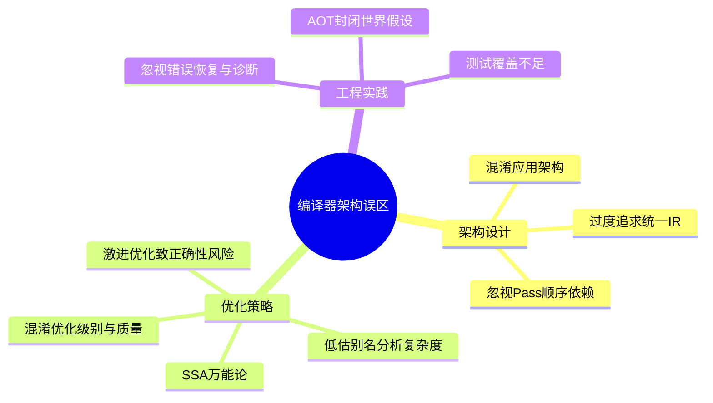
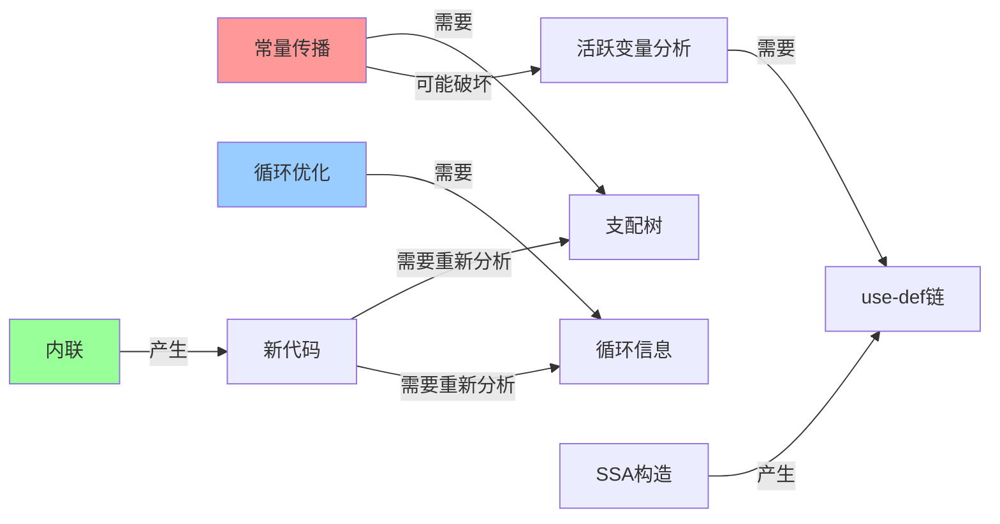

## 常见误区

编译器是计算机科学中最精密的软件系统之一——它需要在保持程序语义不变的前提下，将源代码翻译为高效的目标代码。正因如此，编译器开发中的错误往往极其隐蔽：程序可能在大多数情况下运行正确，只在特定输入下产生微妙的错误结果。更危险的是，这些错误可能在生产环境中潜伏多年才被发现。

本节系统梳理编译器架构设计与实现中最常见的十大误区。每个误区都按"错误表现 → 根因分析 → 错误示范 → 正确做法 → 实际影响"的结构展开，帮助读者不仅知道"不该怎么做"，更理解"为什么不该这样做"。



---

### 误区一：混淆编译器架构与应用架构——用Web开发思维设计编译器

**错误表现**

许多从应用开发转向编译器开发的工程师，习惯性地将Web开发中的设计模式（MVC、微服务、事件驱动）直接套用到编译器架构上。典型表现包括：

- 将前端和后端设计为独立的网络服务，通过HTTP通信
- 在编译器内部引入消息队列进行Pass之间的异步通信
- 使用ORM框架管理符号表（Symbol Table）
- 用数据库存储中间表示（IR），而非内存数据结构

**根因分析**

编译器架构与应用架构有本质区别：

| 维度 | 应用架构 | 编译器架构 |
|------|----------|------------|
| 核心操作 | 网络I/O、数据库读写 | 内存中的数据变换 |
| 性能瓶颈 | 网络延迟、磁盘I/O | CPU计算、内存带宽 |
| 数据模型 | 可变状态（CRUD） | 不可变变换（Pass链） |
| 并发模型 | 请求级并发 | Pass级流水线 |
| 错误处理 | 请求重试、降级 | 错误恢复、诊断信息 |
| 测试方法 | 集成测试、端到端测试 | 差异化测试、模糊测试 |

编译器的核心是一个**纯函数式的变换流水线**：输入源代码，经过一系列Pass变换，输出目标代码。每个Pass都是一个确定性变换函数，输入相同的IR总是产生相同的输出IR。这种架构天然适合**同步的、内存中的、函数式的**处理模式。

**错误示范**

```python
# ❌ 错误：将编译器Pass设计为异步微服务
class CompilerPassService:
    """把编译Pass做成网络服务"""
    async def optimize(self, ir):
        # 通过网络调用另一个Pass服务
        response = await http_client.post(
            "http://optimizer-service:8080/optimize",
            data=serialize(ir)  # 序列化IR为JSON
        )
        return deserialize(response.json())

# 问题：IR可能有数百万条指令，序列化/反序列化开销巨大
# 网络延迟（毫秒级）远超Pass执行时间（微秒级）
# 分布式事务的复杂性远超收益
```

**正确做法**

```python
# ✅ 正确：Pass在内存中原地变换IR
class PassManager:
    """同步的Pass流水线"""
    def __init__(self):
        self.analyses = {}  # 分析结果缓存

    def run(self, module, passes):
        for pass_cls in passes:
            # 每个Pass直接操作内存中的IR
            analysis = pass_cls()
            analysis.run(module, self.analyses)
            # Pass完成后的IR直接在内存中就地更新
        return module
```

**实际影响**

LLVM的整个编译流水线（从IR到机器码）在单线程中可以在毫秒级完成。如果引入网络通信，即使每次调用只增加1ms延迟，20个优化Pass就需要额外20ms——这比整个编译过程慢了10倍以上。

---

### 误区二：过度追求"统一IR"——试图用一种表示解决所有问题

**错误表现**

设计编译器时，试图设计一种"万能IR"，既能表达高层语义（如面向对象的虚方法调用），又能表达低层细节（如x86的SSE指令），还能支持异构计算（CPU、GPU、FPGA）。结果IR的语义空间无限膨胀，成为"什么都想做，什么都做不好"的怪物。

**根因分析**

IR的设计本质上是一个**抽象层次的权衡**：

高层IR（接近源码）                    低层IR（接近机器码）
  ┌────────────────────────────────────────────────┐
  │  高层语义丰富，优化容易        低层语义精确，代码生成容易  │
  │  但代码生成复杂                但高层优化困难            │
  └────────────────────────────────────────────────┘

单一IR面临的困境：

- **如果IR过于抽象**：后端需要从抽象表示推断出具体的机器指令，这个"从抽象到具体"的映射极其复杂
- **如果IR过于底层**：中端需要"从具体中重建抽象"才能进行循环优化等高级变换，这同样困难
- **如果IR想同时兼顾**：IR的语义规则变得极其复杂，每个Pass都要处理大量边界情况

**错误示范**

// ❌ 错误：在低层IR中试图表达高层语义
// 一个"万能IR指令"试图同时表达太多信息
INSTR {
  type: MULADD深度融合指令,
  src1: reg:rax (物理寄存器),
  src2: reg:rdx (物理寄存器),
  src3: mem:[rsp+8] (栈内存),
  // 同时携带：虚方法调用信息、逃逸分析结果、
  // SIMD向量化提示、循环展开因子...
  metadata: {
    devirtualized: true,
    call_target: "ClassA.method",
    vectorization_factor: 4,
    unroll_count: 2,
    escape_status: "no_escape",
    // ... 30多个可选字段
  }
}

**正确做法**

现代编译器采用**多层IR**，每层IR只关注特定抽象层次的语义：

| IR层 | 抽象层次 | 核心任务 | 典型实现 |
|------|----------|----------|----------|
| 高层IR | 接近AST | 语言相关的语义变换 | GCC GENERIC, Clang AST |
| 中层IR | 平台无关 | 通用优化（SSA形式） | GCC GIMPLE, LLVM IR |
| 低层IR | 接近机器码 | 指令选择、寄存器分配 | GCC RTL, LLVM MachineInstr |

```llvm
; ✅ 正确：LLVM只在中层IR表达平台无关的优化语义
define i32 @dot_product(ptr %a, ptr %b, i32 %n) {
entry:
  br label %loop

loop:
  %i = phi i32 [ 0, %entry ], [ %i.next, %loop ]
  %sum = phi i32 [ 0, %entry ], [ %sum.next, %loop ]
  %cmp = icmp slt i32 %i, %n
  br i1 %cmp, label %body, label %exit

body:
  %ptr_a = getelementptr i32, ptr %a, i32 %i
  %ptr_b = getelementptr i32, ptr %b, i32 %i
  %val_a = load i32, ptr %ptr_a
  %val_b = load i32, ptr %ptr_b
  %mul = mul i32 %val_a, %val_b
  %sum.next = add i32 %sum, %mul
  %i.next = add i32 %i, 1
  br label %loop

exit:
  ret i32 %sum
}
; 指令选择、寄存器分配交给后端的MachineInstr层处理
```

**实际影响**

LLVM从3.0开始引入多层IR设计，将原本臃肿的单一LLVM CodeGen拆分为LLVM IR + SelectionDAG + MachineInstr三层。这一重构使LLVM能够同时支持60+种前端语言和15+种目标平台，而代码库保持了良好的可维护性。相比之下，尝试"万能IR"的早期GCC版本（3.x时代）经历了严重的代码膨胀和维护困难。

---

### 误区三：忽视Pass顺序依赖——"优化"变成"劣化"

**错误表现**

编译器优化以Pass为单位组织，每个Pass对IR进行特定的分析和变换。许多开发者在添加自定义优化Pass时，忽略了Pass之间的顺序依赖关系，导致：

- 后续Pass依赖的信息被前面的Pass破坏
- 优化Pass之间的相互作用产生意外的代码劣化
- 在不同优化级别下行为不一致（-O2正确但-O3出错）

**根因分析**

编译器优化Pass之间存在严格的**依赖关系**，分为三类：

| 依赖类型 | 含义 | 示例 |
|----------|------|------|
| 信息依赖 | Pass B需要Pass A产生的分析结果 | 循环展开依赖循环分析（LoopInfo） |
| 变换依赖 | Pass A的变换是Pass B的前置条件 | 内联必须在循环优化之前 |
| 破坏依赖 | Pass A的变换会破坏Pass B所需的信息 | 常量传播会改变支配树 |



**错误示范**

```cpp
// ❌ 错误：自定义Pass放置在错误的位置
void addMyOptimization(ModulePassManager&amp; MPM) {
    // 在常量传播之前运行我的"代数简化"
    // 但代数简化需要常量传播的结果才能生效
    MPM.addPass(AlgebraicSimplify());  // ← 此时常量还未传播
    MPM.addPass(ConstantPropagation()); // ← 太晚了
    MPM.addPass(LoopUnrolling());       // ← 代数简化可能改变了循环结构
                                        //    但循环信息已过期
}
```

```cpp
// ✅ 正确：遵循Pass之间的依赖顺序
void addMyOptimization(ModulePassManager&amp; MPM) {
    // 1. 先做常量传播，暴露更多简化机会
    MPM.addPass(ConstantPropagation());
    // 2. 基于传播后的结果做代数简化
    MPM.addPass(AlgebraicSimplify());
    // 3. 重新分析循环信息
    MPM.addPass(LoopInfoAnalysis());
    // 4. 最后做循环优化
    MPM.addPass(LoopUnrolling());
}
```

**实际影响**

在LLVM中，Pass顺序对代码质量的影响可以达到**20%-40%的性能差异**。更严重的是，错误的Pass顺序可能导致**miscompilation**——编译器生成的代码与源程序语义不一致。GCC的Bugzilla中，约15%的编译器Bug与Pass顺序问题相关。例如，GCC PR 68112就是因为内联Pass和标量替换Aggregates（SRA）Pass的顺序问题，导致特定循环中的变量被错误优化。

---

### 误区四：激进优化让位于正确性——"性能优先，正确性再说"

**错误表现**

为了追求极致性能，编译器开发者做出以下危险决策：

- 利用未定义行为（Undefined Behavior）进行激进优化，不考虑对程序员的实际影响
- 跳过某些边界情况检查以减少运行时开销
- 用近似值替代精确值（如浮点运算重排序）
- 在多线程场景下省略内存屏障以"提速"

**根因分析**

编译器优化的正确性保证是**不可协商的底线**。一个产生错误结果的编译器比一个慢的编译器危险得多。核心原则是**语义保持（Semantic Preservation）**：

对于所有合法输入 I：
  执行原始程序 P(I) 的结果 = 执行优化后程序 P'(I) 的结果

例外：如果原始程序包含未定义行为，
      编译器可以假设程序不包含未定义行为，
      从而进行任意优化

未定义行为优化是编译器领域最具争议的话题。C/C++标准定义了大量未定义行为（空指针解引用、有符号整数溢出、数据竞争等），编译器可以利用这些未定义行为进行激进优化。但实际效果是：

```c
// C语言：有符号整数溢出是未定义行为
int abs_of(int x) {
    return x >= 0 ? x : -x;
}

// 编译器的"激进优化"推理：
// 如果 x < 0，那么 -x 可能溢出（未定义行为）
// 编译器可以假设 x >= 0 始终成立
// 于是整个函数被优化为：
// return x;  ← 完全错误！
```

**错误示范**

```c
// ❌ 错误：利用未定义行为进行激进优化
// 编译器代码：假设指针别名不存在
void optimize_array_sum(int* restrict a, int* restrict b, int n) {
    // 编译器假设 a 和 b 不会指向同一块内存
    // 因此将循环展开并重排
    for (int i = 0; i < n; i++) {
        a[i] = a[i] + b[i];  // 如果 a == b，结果会出错
    }
}

// 但如果程序员真的传入了 a == b 的情况，
// 编译器的"优化"会产生错误结果
// 而 -fno-strict-aliasing 会禁用这个优化，但大多数人不知道
```

**正确做法**

```c
// ✅ 正确：在优化正确性与性能之间找到平衡
// 编译器应该：
// 1. 默认使用保守但正确的别名分析
// 2. 提供 -fno-strict-aliasing 等选项让程序员明确选择
// 3. 在文档中清楚说明优化假设和限制

// 编译器内部：基于Must/Alias分析
// 对于可能别名的指针对，不进行重排序优化
void optimize_array_sum(int* a, int* b, int n) {
    // 如果 aMayAlias(b)，保持原始顺序
    // 如果 aNoAlias(b)，可以安全展开
    if (may_alias(a, b)) {
        // 保守路径：保持顺序
        for (int i = 0; i < n; i++) {
            a[i] = a[i] + b[i];
        }
    } else {
        // 优化路径：展开+向量化
        for (int i = 0; i < n; i += 4) {
            a[i]   = a[i]   + b[i];
            a[i+1] = a[i+1] + b[i+1];
            a[i+2] = a[i+2] + b[i+2];
            a[i+3] = a[i+3] + b[i+3];
        }
    }
}
```

**实际影响**

Linux内核编译时使用 `-fno-strict-aliasing` 禁用基于严格别名规则的优化，因为内核代码中存在大量类型双关（Type Punning）。2018年，Debian项目发现GCC的 `-fstrict-aliasing` 优化导致了数个安全漏洞。CompCert（经过Coq证明正确性的C编译器）从不利用未定义行为进行优化，成为安全关键系统（航空航天、医疗设备）的首选编译器。

---

### 误区五：低估别名分析的复杂度——"不就是判断两个指针是否指向同一内存吗？"

**错误表现**

初学者认为别名分析（Alias Analysis）是一个简单的指针比较问题，试图用简单的启发式规则实现：

- 仅比较指针的静态类型来判断是否别名
- 假设所有指针都可能别名（最保守分析）
- 忽视指针的传递性和别名链

**根因分析**

别名分析是编译器优化的**基础性分析**之一，几乎所有优化都依赖它。其复杂度源于以下因素：

| 挑战 | 说明 | 复杂度 |
|------|------|--------|
| 指针可能指向动态分配的内存 | 堆上对象的地址在编译时未知 | 需要逃逸分析 |
| 指针可能通过函数参数传入 | 被调函数可能修改参数指向的内存 | 需要过程间分析 |
| 指针算术和类型转换 | C语言允许任意指针运算 | 需要内存区域分析 |
| 函数指针和虚方法 | 间接调用的目标在编译时未知 | 需要调用图分析 |
| 全局变量和静态变量 | 可能被任何函数修改 | 需要mod-ref分析 |

别名分析的精度与代价之间存在根本权衡：

精度低 ←────────────────────────────→ 精度高
  保守分析                                精确分析
  所有指针都可能别名                      精确到每个内存位置
  代价：O(n)                              代价：O(n²) 或更高
  优化：几乎没有                          优化：最大

**错误示范**

```python
# ❌ 错误：仅基于类型判断别名
def simple_may_alias(ptr1, ptr2):
    """基于类型的粗糙别名分析"""
    # 只要类型不同，就认为不别名
    if ptr1.type != ptr2.type:
        return False  # 类型不同→不别名
    return True        # 类型相同→可能别名

# 问题1：C语言的类型双关
# int* p; float* q = (float*)p;
# 类型不同，但可能指向同一内存

# 问题2：void*和char*可以指向任何类型
# void* p = malloc(100); char* q = (char*)p;
# 类型不同，但确实别名

# 问题3：结构体嵌套
# struct { int x; int y; } s;
# int* p = &amp;s.x; int* q = &amp;s.y;
# 类型相同，但不别名（不同偏移量）
```

**正确做法**

现代编译器使用**多层次别名分析**：

```python
# ✅ 正确：多层次别名分析框架
class AliasAnalysis:
    """层次化别名分析"""
    
    def may_alias(self, ptr1, ptr2):
        """返回 MUST_ALIAS / MAY_ALIAS / NO_ALIAS"""
        
        # 第1层：基于内存区域（Must/May分析）
        region1 = self.get_memory_region(ptr1)
        region2 = self.get_memory_region(ptr2)
        
        if region1 and region2:
            if region1 == region2:
                return AliasResult.MUST_ALIAS  # 确定别名
            if not regions_may_overlap(region1, region2):
                return AliasResult.NO_ALIAS    # 确定不别名
        
        # 第2层：基于指针分析（Points-to分析）
        points1 = self.points_to_set(ptr1)
        points2 = self.points_to_set(ptr2)
        
        if points1.is_disjoint(points2):
            return AliasResult.NO_ALIAS
        
        # 第3层：基于调用图的过程间分析
        if self.is_global(ptr1) or self.is_global(ptr2):
            return self.mod_ref_analysis(ptr1, ptr2)
        
        return AliasResult.MAY_ALIAS  # 保守默认
```

**实际影响**

别名分析的精度对性能影响巨大。LLVM的BasicAA（基础别名分析）只能处理简单的别名关系，而新版LLVM引入的ScopedNoAliasAA和TBAA（基于类型的别名分析）可以识别更多不别名的情况。在SPEC CPU 2017基准测试中，精确的别名分析可以带来**15%-30%的性能提升**，主要来自循环向量化和指令重排序的解锁。GCC中的`-fstrict-aliasing`（基于类型的别名分析）在某些情况下可以将性能提升2-3倍，但在类型双关代码中会引入错误。

---

### 误区六：SSA万能论——"所有IR都应该是SSA形式"

**错误表现**

受SSA在优化中巨大优势的影响，许多开发者认为SSA是IR设计的唯一正确选择，在所有场景下都强行使用SSA：

- 在高层IR中强行引入φ函数，导致IR膨胀
- 在不支持SSA的后端中模拟SSA，引入不必要的复杂性
- 忽视SSA形式在某些操作上的固有缺陷

**根因分析**

SSA确实在许多优化场景中有巨大优势，但它也有固有的局限性：

**SSA的优势（已在理论基础中详述）：**
- Use-Def链直接可见
- 活跃变量分析简化
- 许多优化算法更简单

**SSA的固有局限：**

| 局限 | 说明 | 影响 |
|------|------|------|
| φ函数膨胀 | 复杂控制流导致大量φ函数 | IR体积增加20%-50% |
| 半透明问题 | 对同一变量多次赋值需要创建新版本 | 调试信息复杂化 |
| 可变存储不友好 | 对数组/结构体的原地更新难以表达 | 需要额外的版本管理 |
| 循环变异处理复杂 | 循环中多次修改同一变量需要精心设计φ函数 | SSA构造算法复杂度增加 |
| 非SSA后端需要退出SSA | 某些硬件不直接支持SSA语义 | 寄存器分配前需要de-SSA转换 |

**错误示范**

```c
// ❌ 错误：强制将包含大量可变状态的代码转为SSA
// 原始代码：一个简单的数组求和
int sum = 0;
for (int i = 0; i < n; i++) {
    sum += arr[i];  // sum在循环中被多次修改
}

// SSA形式：
// %sum.0 = 0
// for.i:
//   %sum.1 = phi [%sum.0, %entry], [%sum.2, %for.i]
//   %i.0 = phi [0, %entry], [%i.1, %for.i]
//   %cmp = icmp slt %i.0, %n
//   br %cmp, %for.body, %exit
// for.body:
//   %ptr = getelementptr %arr, %i.0
//   %val = load %ptr
//   %sum.2 = add %sum.1, %val
//   %i.1 = add %i.0, 1
//   br %for.i
// 
// 问题：每次load都需要一个新的SSA版本
// 如果arr是全局变量且可能被其他函数修改
// 编译器需要在每个可能修改arr的调用点插入φ函数
// 这会导致IR膨胀且难以维护
```

**正确做法**

```c
// ✅ 正确：SSA用于值计算，非SSA用于可变状态
// 将计算密集的部分（sum累加）保持为SSA
// 将可变存储（arr的访问）保持为非SSA的load/store

// LLVM IR的实际做法：
// SSA用于临时值（sum, i, val）
// 非SSA用于内存操作（load, store）
define i32 @sum_array(ptr %arr, i32 %n) {
entry:
  br label %loop

loop:
  %i = phi i32 [ 0, %entry ], [ %i.next, %loop ]
  %sum = phi i32 [ 0, %entry ], [ %sum.next, %loop ]
  %cmp = icmp slt i32 %i, %n
  br i1 %cmp, label %body, label %exit

body:
  %ptr = getelementptr i32, ptr %arr, i32 %i
  %val = load i32, ptr %ptr    ; 非SSA：内存操作不进入SSA
  %sum.next = add i32 %sum, %val  ; SSA：计算值
  %i.next = add i32 %i, 1         ; SSA：计算值
  br label %loop

exit:
  ret i32 %sum
}
```

**实际影响**

LLVM和GCC都采用了"SSA用于值，非SSA用于内存"的混合策略。完全SSA化内存操作会导致IR体积膨胀3-5倍，编译时间增加20%-40%，而优化收益几乎为零（因为内存操作本身就需要在底层处理）。Java HotSpot的C2编译器在JDK 9之后引入了"Memory SSA"——一种专门为内存操作设计的SSA变体，但仅用于内存依赖分析，不改变实际的load/store指令。

---

### 误区七：混淆优化级别与优化质量——"-O3一定比-O2好"

**错误表现**

开发者盲目追求最高优化级别，认为 `-O3` 一定比 `-O2` 产生更好的代码。在性能敏感的项目中，直接使用 `-O3` 而不进行实际测试验证。

**根因分析**

优化级别的设计是**编译时间、代码大小、运行速度**三者之间的权衡：

             编译时间短                    编译时间长
                ↑                           ↑
  -O0 ──────── -O1 ──────── -O2 ──────── -O3 -Os -Oz
  无优化        基本优化      全面优化      激进优化
  代码最大      代码稍小      代码适中      代码可能更大
  速度最慢      速度提升20%   速度提升40%   速度可能下降

`-O3` 相比 `-O2` 额外开启的优化主要包括：

| 额外优化 | 潜在收益 | 潜在代价 |
|----------|----------|----------|
| 循环展开 | 减少循环控制开销 | 代码膨胀（2x-4x） |
| 函数内联激进化 | 减少调用开销 | 指令缓存压力增大 |
| 向量化自动SIMD | 并行处理数据 | 可能产生非对齐访问开销 |
| 分支预测提示 | 优化代码布局 | 可能过度特化 |

**关键问题：代码膨胀**

```c
// 一个简单的循环函数
void process(int* arr, int n) {
    for (int i = 0; i < n; i++) {
        arr[i] = arr[i] * 2 + 1;
    }
}
```

在不同优化级别下，该函数的代码大小（x86-64）：

| 优化级别 | 汇编指令数 | 代码大小（字节） | 执行时间（相对） |
|----------|------------|------------------|------------------|
| -O0 | 15 | 48 | 1.00x |
| -O1 | 8 | 25 | 0.65x |
| -O2 | 7 | 22 | 0.45x |
| -O3 | 22 | 78（4x展开） | 0.38x |
| -Os | 7 | 22 | 0.45x |

`-O3` 的代码大小是 `-O2` 的3.5倍，但执行速度只快了15%。对于指令缓存敏感的工作负载，`-O3` 可能反而更慢。

**错误示范**

```bash
# ❌ 错误：盲目使用-O3
gcc -O3 -march=native my_program.c -o my_program

# 问题：
# 1. 循环展开导致代码膨胀，指令缓存未命中率上升
# 2. 激进内联导致编译时间翻倍
# 3. 某些浮点优化可能改变结果精度
# 4. Profile-Guided Optimization (PGO) 缺失，-O3的很多优化无法充分发挥
```

**正确做法**

```bash
# ✅ 正确：基于测试的优化级别选择

# 第1步：使用不同优化级别编译并测试
gcc -O0 my_program.c -o my_O0
gcc -O2 my_program.c -o my_O2
gcc -O3 my_program.c -o my_O3
gcc -Os my_program.c -o my_Os

# 第2步：在真实负载下测试性能
./my_O0  # 基准
./my_O2  # 通常最优
./my_O3  # 可能更快或更慢
./my_Os  # 代码最小

# 第3步：考虑使用PGO（Profile-Guided Optimization）
gcc -O2 -fprofile-generate my_program.c -o my_profile
./my_profile  # 运行真实负载，收集profiling数据
gcc -O2 -fprofile-use my_program.c -o my_optimized
# PGO后的-O2通常优于盲目的-O3
```

**实际影响**

Google的基准测试显示，在其内部代码库中，`-O3` 相比 `-O2` 平均只快2%-5%，但代码大小增加30%-80%。对于Web服务（如Chromium），代码膨胀导致的指令缓存未命中率上升可能抵消优化收益。Google内部主要使用 `-O2` + PGO，而非 `-O3`。Linux内核默认使用 `-O2`，仅在特定子系统（如网络协议栈）使用 `-O3`。

---

### 误区八：忽视编译错误恢复与诊断质量——"编译通过就行"

**错误表现**

编译器开发者将全部精力放在"生成正确代码"上，对错误处理和诊断信息草草了事：

- 遇到第一个语法错误就停止编译
- 错误信息只有"语法错误"，不说明具体位置和原因
- 不提供修复建议（Fix-it Hint）
- 警告信息过多导致用户忽视所有警告

**根因分析**

对于开发者而言，**编译器的诊断质量与代码生成质量同等重要**。一个好的诊断信息可以节省开发者数小时的调试时间。Clang之所以在C/C++社区获得巨大成功，很大程度上归功于其远超GCC的诊断质量。

诊断质量的关键维度：

| 维度 | 低质量 | 高质量 |
|------|--------|--------|
| 错误定位 | "第3行有错" | "第3行第12列：期望')'但遇到';'" |
| 上下文信息 | 无 | 显示源代码片段并标记位置 |
| 修复建议 | 无 | "你是否想写')'?" |
| 多错误关联 | 无 | "注意：前面的'('在这里匹配" |
| 相关警告 | "有警告" | "此变量未使用，声明为void可消除" |

**错误示范**

```python
# ❌ 低质量的错误处理
class Parser:
    def parse(self, tokens):
        try:
            return self.parse_statement(tokens)
        except SyntaxError:
            raise CompileError("语法错误")  # 无位置、无原因、无修复建议
```

**正确做法**

```python
# ✅ 高质量的错误恢复与诊断
class Parser:
    def parse(self, tokens):
        try:
            return self.parse_statement(tokens)
        except SyntaxError as e:
            # 1. 精确位置
            loc = self.current_token().location
            # 2. 上下文信息
            context = self.get_source_context(loc, window=2)
            # 3. 修复建议
            suggestion = self.suggest_fix(e.expected, e.found)
            # 4. 相关信息
            related = self.find_matching_bracket(e.position)
            
            raise CompileError(
                location=loc,
                message=f"期望{e.expected}，但遇到{e.found}",
                context=context,
                suggestion=suggestion,
                related_info=related,
                severity=ErrorSeverity.ERROR
            )
```

对比两种编译器的诊断输出：

低质量编译器：
error: syntax error

高质量编译器（Clang风格）：
error.c:3:12: error: expected ')' before ';' token
    printf("hello world"  ;
                           ^
                           )

error.c:3:11: note: to match this '('
    printf("hello world"  ;
                           ^

error.c:3:12: note: did you mean ')'?
    printf("hello world"  ;
                           ^
                           )

**实际影响**

Clang项目的成功故事是最好的例证。2007年Clang发布时，GCC已经是30年的成熟编译器。但Clang凭借以下优势在10年内占据了macOS/iOS开发的主导地位：

- 错误信息可读性提升**3-5倍**
- 编译速度比GCC快**1.5-2倍**
- 内存占用降低**30%-50%**

Apple的内部调查显示，开发者在GCC上的平均调试时间中，**25%用于解读编译器错误信息**。Clang的诊断质量改进直接为苹果开发者生态节省了数百万小时的调试时间。

---

### 误区九：忽视AOT编译的封闭世界假设——"AOT就是JIT去掉运行时"

**错误表现**

许多开发者将AOT（Ahead-Of-Time）编译简单理解为"JIT编译提前执行"，忽视了AOT编译面临的根本性挑战：

- 不处理反射、动态代理等动态特性
- 不理解类加载的延迟绑定语义
- 忽视运行时元数据（如堆栈跟踪、调试信息）的生成
- 不配置反射配置文件导致运行时崩溃

**根因分析**

AOT编译与JIT编译的根本区别在于**信息可用性**：

JIT编译器拥有的信息：
  ✓ 完整的类层次结构
  ✓ 所有虚方法的实际目标
  ✓ 类型的实际形状（字段布局）
  ✓ 运行时profiling数据
  ✓ 类加载器的完整上下文

AOT编译器拥有的信息：
  ✓ 源代码（或字节码）
  ✗ 运行时类加载信息
  ✗ 动态反射的目标
  ✗ Profile数据（除非预收集）
  ✗ 实际的运行时配置

**封闭世界假设（Closed-World Assumption）** 要求AOT编译器在编译时知道程序中所有可能被使用的代码和数据。这与Java等动态语言的特性产生冲突：

| 动态特性 | 运行时行为 | AOT面临的挑战 |
|----------|------------|---------------|
| `Class.forName("X")` | 动态加载任意类 | 编译时不知道哪些类会被加载 |
| `Method.invoke()` | 动态调用任意方法 | 编译时不知道方法的实际目标 |
| `Proxy.newProxyInstance()` | 动态生成代理类 | 编译时没有代理类的字节码 |
| `Unsafe.getObject()` | 绕过类型系统 | 编译时无法验证内存安全性 |
| 动态字节码生成（CGLib） | 运行时生成新类 | 编译时无法处理 |

**错误示范**

```java
// ❌ 未配置AOT编译器的反射处理
public class UserService {
    public User findById(Long id) {
        // 通过反射访问数据库实体
        User user = userRepository.findById(id);
        
        // 动态字段访问——AOT编译器可能无法识别
        Map<String, Object> data = new HashMap<>();
        for (Field field : user.getClass().getDeclaredFields()) {
            field.setAccessible(true);
            data.put(field.getName(), field.get(user));
        }
        return user;
    }
}

// GraalVM Native Image编译时：
// Warning: Usage of API: java.lang.reflect.Field.setAccessible
// 如果不配置反射配置文件，运行时抛出：
// com.oracle.svm.core.jdk.UnsupportedFeatureError:
// Reflection should not be used at runtime
```

**正确做法**

```java
// ✅ 为AOT编译提供完整的反射配置
// reflect-config.json:
{
  "name": "com.example.User",
  "allDeclaredFields": true,
  "allDeclaredMethods": true,
  "allDeclaredConstructors": true
}

// 或在代码中使用 @RegisterForReflection 注解
@RegisterForReflection
public class User {
    private Long id;
    private String name;
    // ...
}

// 或使用运行时初始化而非编译时初始化
// GraalVM Native Image配置：
// --initialize-at-run-time=com.example.DynamicLoader
```

**实际影响**

GraalVM Native Image的开发者社区中，**超过40%的问题**与封闭世界假设相关。Spring Boot 3.0的AOT编译支持（Spring AOT）花费了超过12个月的开发时间来处理反射配置、动态代理和延迟初始化。Quarkus框架通过"Build Time Processing"策略，将大部分反射配置在构建时自动完成，显著降低了配置负担。

---

### 误区十：编译器开发中"测试差不多就行"——"编译通过，功能正确"

**错误表现**

编译器开发者满足于手动测试几个测试用例，认为"编译通过、输出正确"就算完成。具体表现：

- 只测试正常路径，不测试边界条件
- 不使用差异测试（Differential Testing）
- 不进行模糊测试（Fuzz Testing）
- 不进行回归测试的持续集成
- 不验证优化的正确性（假设"编译器不会出错"）

**根因分析**

编译器的正确性验证是所有软件中**最困难的**，原因在于：

1. **输出空间巨大**：一个编译器可能为数十万行代码生成数百万行汇编
2. **正确性标准隐含**：编译器的正确性标准（语义保持）是隐含的，不显式存在于输出中
3. **错误可能潜伏**：一个优化Bug可能只在特定输入、特定优化级别、特定目标平台上触发
4. **测试Oracle缺失**：对于任意程序P，判断"P编译后是否语义正确"本身就是不可判定的

编译器测试方法体系：

| 测试方法 | 原理 | 发现的典型Bug |
|----------|------|---------------|
| 单元测试 | 测试单个Pass的输入/输出 | 优化变换的边界条件 |
| 回归测试 | 确保已修复的Bug不再复发 | 历史Bug的复现 |
| 差异测试 | 用多个编译器编译同一代码，比较结果 | 编译器之间的语义不一致 |
| 模糊测试 | 随机生成/变异输入，观察行为 | 编译器崩溃、无限循环 |
| 交叉测试 | 用编译器A编译的编译器B，编译代码 | 自举正确性 |
| 基准测试 | 在标准基准上测量性能回归 | 优化劣化 |

**错误示范**

```python
# ❌ 仅测试正常路径的编译器测试
def test_compiler():
    # 只测试简单情况
    assert compile("1 + 2") == 3
    assert compile("x = 10; x + 5") == 15
    print("编译器测试通过！")
    # 问题：
    # - 不测试空输入
    # - 不测试超长表达式
    # - 不测试嵌套深度极限
    # - 不测试Unicode输入
    # - 不测试内存不足情况
```

**正确做法**

```python
# ✅ 全面的编译器测试策略
import hypothesis
from hypothesis import strategies as st

# 1. 单元测试：覆盖边界条件
def test_parser_edge_cases():
    assert compile("") is not None          # 空输入
    assert compile("  \n  \t  ") is not None  # 纯空白
    assert compile("a" * 10000) is not None  # 超长标识符
    assert compile("(((((a)))))") is not None  # 深嵌套

# 2. 差异测试：与参考编译器对比
def differential_test(gcc_compile, clang_compile, source):
    """对比GCC和Clang的结果"""
    gcc_result = run_program(gcc_compile(source))
    clang_result = run_program(clang_compile(source))
    assert gcc_result == clang_result, \
        f"差异：GCC={gcc_result}, Clang={clang_result}"

# 3. 模糊测试：随机输入
@hypothesis.given(st.text())
def fuzz_lexer(input_text):
    """确保词法分析器不会崩溃"""
    try:
        tokens = lexer.tokenize(input_text)
    except LexError:
        pass  # 合法的错误
    except Exception as e:
        raise AssertionError(f"词法分析器异常：{e}")

# 4. 优化正确性测试
def test_optimization_correctness():
    """验证优化不改变程序语义"""
    source = generate_random_program()
    original = interpret(compile(source, opt_level=0))
    optimized = interpret(compile(source, opt_level=3))
    assert original == optimized
```

**实际影响**

- **CompCert**（正确性证明的C编译器）：使用Coq形式化证明了编译器的语义保持性。在其测试过程中，发现了300+个Bug——其中约30%存在于商业编译器（GCC、MSVC、LLVM）中
- **Csmith**（编译器模糊测试工具）：自2011年以来，为GCC和LLVM发现了**超过1000个Bug**，其中许多是生产环境中可能触发的miscompilation
- **LLVM的测试基础设施**：包含超过100万个回归测试用例，每个提交都必须通过全量测试
- **Google的OSS-Fuzz**：持续对Clang进行模糊测试，发现了数百个编译器崩溃和潜在的安全漏洞

---

### 综合对照表

以下对照表总结了十大误区的核心要点：

| # | 误区 | 核心错误 | 正确做法 | 典型后果 |
|---|------|----------|----------|----------|
| 1 | 混淆应用架构 | 用微服务/HTTP设计编译器 | 同步内存流水线 | 编译速度降低10x+ |
| 2 | 统一万能IR | 单一IR承载所有语义 | 多层IR分层设计 | IR臃肿、维护困难 |
| 3 | 忽视Pass顺序 | 随意排列优化Pass | 遵循依赖顺序 | miscompilation |
| 4 | 激进优化 | 利用UB做危险优化 | 语义保持为底线 | 安全漏洞、程序错误 |
| 5 | 低估别名分析 | 简单启发式判断 | 多层次分析框架 | 性能提升被阻断 |
| 6 | SSA万能论 | 强制全量SSA | SSA值+非SSA内存 | IR膨胀、编译变慢 |
| 7 | 混淆优化级别 | 盲目使用-O3 | 基于测试选择 | 代码膨胀、缓存退化 |
| 8 | 忽视诊断质量 | "语法错误"式信息 | Clang级诊断 | 开发者调试时间翻倍 |
| 9 | AOT简化理解 | "AOT=去掉JIT" | 配置封闭世界 | 运行时崩溃 |
| 10 | 测试不够 | 手动几个用例 | 差异/模糊/回归测试 | 隐蔽的miscompilation |

---

### 本节小结

编译器架构的常见误区可以归纳为三个层面：

**设计层面**：不要用应用开发的思维模式设计编译器。编译器是一个纯函数式的变换流水线，IR的设计应分层而非统一，Pass的顺序有严格的依赖关系。

**优化层面**：正确性永远是底线，任何优化都不能以牺牲语义保持为代价。别名分析、SSA、优化级别选择都需要基于对底层机制的深入理解，而非表面的直觉。

**工程层面**：诊断质量和测试覆盖与代码生成质量同等重要。现代编译器的成功（如Clang）很大程度上归功于卓越的开发者体验，而非仅仅是正确的代码生成。

理解这些误区，是编写高质量编译器的第一步。在下一节"实战案例"中，我们将看到这些原则在工业级编译器中的具体应用。
