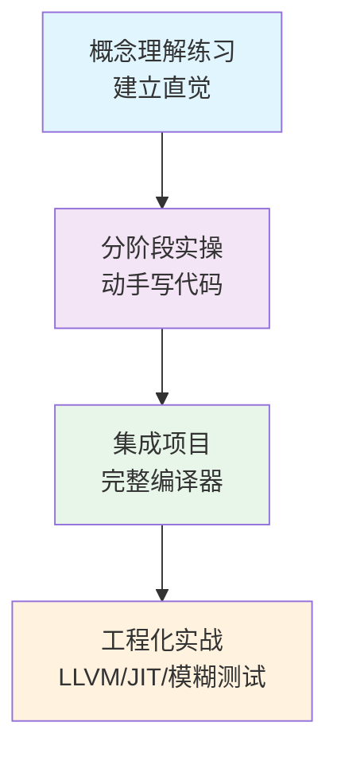
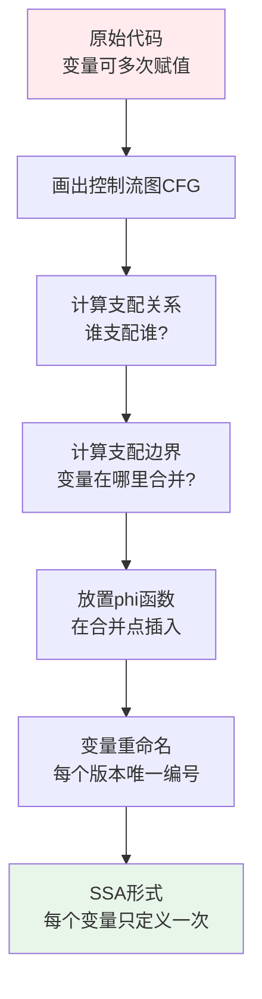
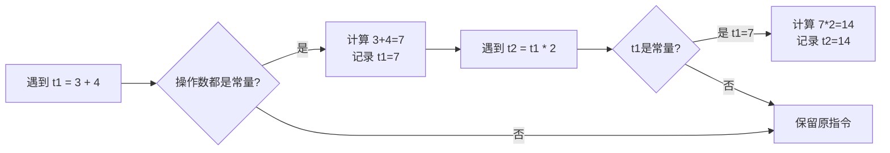
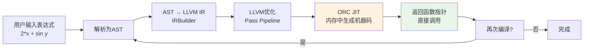

# 编译器架构：系统化练习方法

本章提供一套从"理解理论"到"构建真实编译器"的渐进式练习体系。所有练习紧扣第25章核心内容——多遍架构、IR设计、优化Pass、后端代码生成、JIT编译——按**概念理解→分阶段实操→集成项目→工程化实战**四个层次递进。



每个练习都遵循**道法术器**四层递进：
- **道**：为什么需要这个技术？解决什么核心问题？
- **法**：具体的方法论和算法原理是什么？
- **术**：用代码/步骤实操，可执行可验证。
- **器**：用什么工具、库、框架来工程化？

---

## 一、练习前的准备

### 1.1 环境搭建清单

在开始任何编译器练习之前，确保以下工具链就绪：

| 工具 | 用途 | 安装方式 | 验证命令 |
|------|------|----------|----------|
| Clang/LLVM | 编译器前端 + LLVM IR工具链 | `apt install llvm clang` 或 brew install llvm | `clang --version` / `opt --version` |
| GCC | 差分测试对照组 | `apt install gcc` | `gcc --version` |
| Python 3 | 词法/语法分析器快速原型 | 系统自带或 `apt install python3` | `python3 --version` |
| Rust | 类型安全的编译器实现 | `curl --proto '=https' --tlsv1.2 -sSf https://sh.rustup.rs \| sh` | `rustc --version` |
| CSmith | 随机C程序生成器（模糊测试） | `git clone https://github.com/csmith-project/csmith.git && cd csmith && cmake . && make` | `./src/csmith --help` |
| C-Reduce | 测试用例最小化 | `apt install creduce` 或从源码构建 | `creduce --help` |
| LLVM FileCheck | LLVM Pass测试验证 | 随LLVM一起安装 | `FileCheck --version` |
| Graphviz | 控制流图可视化 | `apt install graphviz` | `dot -V` |

> **提示**：不需要一次性安装所有工具。前四个练习（概念理解+前端实操）只需要 Python 3。LLVM 相关工具在第四章集成项目时再安装即可。

### 1.2 推荐的编程语言选择

编译器实现语言的选择直接影响练习体验：

| 语言 | 优势 | 劣势 | 适合的练习 |
|------|------|------|-----------|
| **Python** | 快速原型，字符串操作方便，学习曲线低 | 性能差，不适合生产级编译器 | 词法分析、语法分析、AST遍历、简单解释器 |
| **C** | 底层控制，贴近真实编译器，性能好 | 内存管理复杂，容易出segfault | 代码生成、内存管理、系统级编程 |
| **Rust** | 内存安全 + 零成本抽象，类型系统天然匹配语义分析 | 学习曲线陡峭 | 完整编译器（类型系统天然匹配语义分析） |
| **C++** | LLVM/Clang生态原生语言，生态最完善 | 语言复杂度高，模板错误信息难读 | LLVM Pass开发、JIT编译器 |
| **Java** | 垃圾回收，专注算法，JVM生态完善 | 性能受限于JVM | JVM编译器研究（C1/C2/Graal） |

**建议**：初学阶段用Python快速验证思路（概念理解+前端实操），进阶阶段用Rust或C++构建生产级编译器。不要在语言选择上纠结太久——先用Python跑通全流程，再用目标语言重写。

### 1.3 学习心态与策略

编译器是计算机科学中最复杂的系统之一。在开始练习之前，明确几个原则：

1. **先理解"为什么"，再动手"怎么做"**：每个练习的"道"部分花5分钟认真读，比直接抄代码有效得多。
2. **允许犯错，但要记录**：编译器开发的核心技能是调试能力。每次卡住时记录下来，这些经验比顺利写完的代码更有价值。
3. **小步验证**：不要写完几百行才测试。每完成一个子功能就运行一次，确保每一步都正确。
4. **对比学习**：用自己的编译器和真实编译器（GCC/Clang）对比输出，差异就是学习机会。

---

## 二、概念理解练习

### 2.1 编译器阶段映射（15分钟）

**道**：编译器不是黑盒子——它是一个流水线，每个阶段有明确的输入输出。理解阶段划分是理解优化边界的前提：优化Pass不能跨阶段偷懒，否则会导致正确性问题。

**法**：判断一个操作属于哪个阶段的核心问题只有一个——**"这个操作需要知道目标架构的细节吗？"**

- 前端（F）：只依赖源语言规范，不依赖目标机器
- 优化中端（O）：在IR上做架构无关的变换
- 后端（B）：必须知道目标机器的寄存器、指令集、ABI

**术**：对以下真实编译器操作进行阶段分类：

```text
操作                                    阶段    判断依据
────────────────────────────────────────────────────────────
将 `int x = 3 + 4;` 折叠为 `int x = 7;`   O      常量折叠是优化阶段的典型操作
检查 `"hello" + 42` 的类型兼容性           F      类型检查属于语义分析（前端）
将虚拟寄存器映射到x86物理寄存器            B      寄存器分配是后端核心任务
为 `x*4+y` 选择 LEA 指令而非 ADD          B      指令选择是后端的工作
消除不可达的基本块                         O      不可达代码消除是优化Pass
将源代码标记为"未定义行为"                  F      UB检测发生在语义分析阶段
为循环插入SIMD向量化指令                   O      自动向量化是循环优化Pass
为x86-64目标插入REX前缀                   B      指令编码是代码生成的最后步骤
```

**自测标准**：能在60秒内完成全部分类。如果某个操作让你犹豫超过10秒，说明对对应阶段的理解还不够清晰。

**常见混淆点**：
- 优化和后端的边界最容易混淆。关键区别：优化变换不改变目标代码的形态（还是IR），后端变换会将IR映射到具体机器码。
- 有些操作横跨多个阶段。例如"内联"发生在优化阶段（IR层面），但"函数调用约定展开"发生在后端（必须知道ABI）。

### 2.2 IR对比矩阵（20分钟）

**道**：IR（中间表示）是编译器的核心数据结构。不同的IR设计决定了编译器能做哪些优化、代码生成的复杂度、以及整体架构的扩展性。理解IR设计的权衡，是设计自己编译器的第一步。

**法**：IR设计的核心权衡维度有四个：

1. **表达力 vs 简洁性**：更复杂的IR能表达更多语义信息，但分析和变换更困难
2. **分析友好度**：某些IR天然适合数据流分析（如SSA），某些需要额外计算（如图IR）
3. **变换灵活性**：修改IR的难度直接影响优化Pass的实现成本
4. **生成复杂度**：从AST构建IR的难度，以及IR到目标码的映射难度

**术**：填写以下对比表：

| 特性 | 三地址码(TAC) | SSA形式 | 图IR(TurboFan) | 栈式字节码 |
|------|-------------|---------|----------------|-----------|
| 数据流分析难度 | 中等（需遍历指令序列） | 低（use-def链天然存在） | 高（需遍历图结构） | 高（需模拟栈状态） |
| 构建复杂度 | 低（线性指令序列） | 中（需计算支配边界） | 高（节点+边+控制流） | 最低（顺序指令） |
| 适合的优化类型 | 全局优化、循环优化 | 高级数据流优化（GVN、LICM） | 图重写、投机优化 | 栈深度分析、逃逸分析 |
| 典型使用者 | GCC GIMPLE | LLVM IR, GCC GIMPLE SSA | V8 TurboFan, HotSpot C2 | JVM字节码, .NET CIL |
| 内存占用 | 低 | 中（每个变量多个版本） | 高（节点对象开销大） | 最低 |
| 可读性 | 好（类似汇编） | 好（phi函数增加复杂度） | 差（需要可视化工具） | 好（线性指令） |

**思考题**：为什么V8选择图IR而非SSA？

提示：考虑JIT编译器的三个特殊约束——
1. **编译时间预算**：JIT编译器必须在毫秒级完成编译，图IR允许增量优化（只重新编译热点路径）
2. **运行时类型信息**：图IR的节点可以携带类型反馈数据，SSA的值类型是静态的
3. **投机优化需求**：图IR的节点可以在运行时被"去优化"（替换为解释执行），SSA不支持这种动态变换

### 2.3 SSA构造练习（30分钟）

**道**：SSA（Static Single Assignment，静态单赋值）是现代编译器优化的基石。它的核心价值是让每个变量只有唯一的定义点，从而将"数据流分析"简化为"沿def-use链遍历"。没有SSA，几乎不可能高效实现GVN、LICM、死代码消除等高级优化。

**法**：SSA构造分四步——画CFG → 计算支配关系 → 计算支配边界 → 放置phi函数并重命名。关键算法是**迭代支配边界计算**（Cytron算法）。



**术**：手动完成以下代码的SSA转换：

```c
// 原始代码
int example(int n) {
    int x = 1;
    int y = 0;
    if (n > 0) {
        x = x + n;
    } else {
        y = x * 2;
    }
    return x + y;
}
```

**第一步：画出控制流图（CFG）**

```text
      Block 0 (entry)
      x = 1; y = 0;
      if n > 0 goto Block 1 else goto Block 2
         /                \
   Block 1              Block 2
   x = x + n           y = x * 2
         \                /
       Block 3 (merge)
       return x + y
```

**第二步：计算支配关系**

```text
Block 0 支配: Block 0, 1, 2, 3
Block 1 支配: Block 1
Block 2 支配: Block 2
Block 3 支配: Block 3
```

支配关系的直觉理解：如果从入口到Block X的**所有**路径都必须经过Block Y，那么Y支配X。

**第三步：计算支配边界**

支配边界（Dominator Frontier）的定义：Block A的支配边界是"恰好不支配"的后继节点集合。直觉上，它标记了"变量定义在此合并，但A不是唯一的控制流来源"的位置。

```text
DF(Block 0) = {}
DF(Block 1) = {Block 3}
DF(Block 2) = {Block 3}
DF(Block 3) = {}
```

为什么Block 3是Block 1的支配边界？因为Block 0 → Block 2 → Block 3这条路径不经过Block 1，所以Block 1不支配Block 3，但Block 3是Block 1的后继。

**第四步：放置phi函数**

在Block 3（merge point）为变量 `x` 和 `y` 放置phi函数：

```text
Block 3:
x_2 = phi(x_1, x_1)   // x在Block1被赋值，Block2未赋值
y_1 = phi(y_0, y_1)   // y在Block1未赋值，Block2被赋值
return x_2 + y_1
```

**第五步：重命名变量**

```text
Block 0:
x_1 = 1
y_1 = 0
if n > 0 goto Block 1 else goto Block 2

Block 1:
x_2 = x_1 + n
goto Block 3

Block 2:
y_2 = x_1 * 2
goto Block 3

Block 3:
x_3 = phi(x_2, x_1)   // x_2来自Block1, x_1来自Block2
y_3 = phi(y_1, y_2)   // y_1来自Block1(未修改), y_2来自Block2
return x_3 + y_3
```

**验证清单**：
- [ ] 每个变量在每个基本块中最多被赋值一次
- [ ] phi函数的每个参数对应一个前驱基本块
- [ ] use-def链清晰：每个变量的使用点都能追溯到唯一的定义点

**常见错误与调试技巧**：
- phi函数参数数量与前驱数量不匹配 → 检查CFG的边是否遗漏
- phi函数参数来源搞错 → 画出每个基本块的前驱列表，逐个对应
- 重命名后出现未定义变量 → 检查支配关系，确保每个use点都能通过def链回溯到入口

### 2.4 优化正确性判断（20分钟）

**道**：编译器优化的铁律是**语义等价**——变换后的程序必须和变换前的行为完全相同。但"完全相同"的定义在C/C++等语言中极其微妙：未定义行为（UB）、实现定义行为、浮点精度等都会让"看起来等价"的变换实际不等价。理解优化的边界条件是写正确编译器的前提。

**法**：判断优化是否安全的框架：

1. 检查变换是否改变**所有可能输入**的结果（包括边界值、溢出、特殊值如NaN）
2. 检查变换是否依赖**语言标准的未定义行为**
3. 检查变换是否改变**程序的可观测副作用**（I/O顺序、内存访问顺序）

**术**：以下优化变换是否语义等价？对于不等价的，给出反例：

| 变换 | 是否等价 | 分析 |
|------|---------|------|
| `x / 2` → `x >> 1`（有符号整数） | **不等价** | 负奇数右移的结果依赖实现。`-5 >> 1` 在x86上是 `-3`，而 `-5 / 2` 是 `-2`。C/C++标准中右移有符号数是实现定义行为 |
| `x * 2` → `x << 1`（有符号整数） | **不等价** | 溢出时行为不同。`INT_MAX * 2` 是未定义行为，`INT_MAX << 1` 是移位操作（行为可能不同） |
| `(a + b) + c` → `a + (b + c)`（浮点数） | **不等价** | 浮点加法不满足结合律。`a = 1e30, b = -1e30, c = 1.0` 时结果不同。需要 `-ffast-math` 才能做此变换 |
| `x == x` → `true`（浮点数） | **不等价** | NaN != NaN（IEEE 754标准）。只有在排除NaN时才安全 |
| `if (true) x = 1; else x = 2;` → `x = 1;` | **等价** | 常量条件消除，无副作用 |
| `a[i] = a[i] + 1` → `++a[i]` | **等价**（C语义） | 但需注意 `a[i]` 的求值副作用。如果 `a` 是宏展开为有副作用的表达式则不等价 |

**进阶思考**：为什么GCC和Clang默认不启用 `-ffast-math`？

因为一旦启用，所有浮点优化（包括上述结合律变换、分配律变换、除法转乘法等）都会被激活，可能导致数值计算结果不稳定。科学计算领域对此非常敏感——同样的公式，编译器不同、优化级别不同，可能得到不同结果，这在工程上是不可接受的。

实际案例：OpenSSL曾因 `-ffast-math` 导致AES加密出现安全漏洞，因为浮点运算顺序的改变影响了密码学常量的计算。

---

## 三、分阶段实操练习

### 3.1 词法分析器：从正则表达式到DFA（45分钟）

**道**：词法分析器是编译器的第一道关卡，它的任务是将字符流转换为Token流。理解词法分析的本质是理解**正则语言与有限自动机（DFA/NFA）**的等价关系——任何正则表达式都可以被编译为DFA，DFA的每个状态对应一个Token的识别状态。

**法**：词法分析器的设计模式有三种：

1. **手写扫描器**（本练习）：用if-else/switch实现，适合简单语言
2. **正则表达式引擎**：用DFA/NFA模拟，适合复杂token规则
3. **词法分析生成器**（如flex）：用正则表达式自动生成DFA，适合生产级编译器

**术**：实现一个支持关键字、标识符、数字、运算符的词法分析器。

**第一步：定义Token类型**

```python
from enum import Enum, auto
from dataclasses import dataclass

class TokenType(Enum):
    # 关键字
    LET = auto()
    IF = auto()
    ELSE = auto()
    WHILE = auto()
    RETURN = auto()
    # 字面量
    INTEGER = auto()
    FLOAT = auto()
    STRING = auto()
    IDENT = auto()
    # 运算符
    PLUS = auto()
    MINUS = auto()
    STAR = auto()
    SLASH = auto()
    ASSIGN = auto()
    EQ = auto()
    NEQ = auto()
    LT = auto()
    GT = auto()
    LTE = auto()    # <=
    GTE = auto()    # >=
    # 分隔符
    LPAREN = auto()
    RPAREN = auto()
    LBRACE = auto()
    RBRACE = auto()
    SEMICOLON = auto()
    # 特殊
    EOF = auto()

@dataclass
class Token:
    type: TokenType
    value: str
    line: int
    column: int
```

**第二步：实现表驱动词法分析器**

```python
class Lexer:
    def __init__(self, source: str):
        self.source = source
        self.pos = 0
        self.line = 1
        self.column = 1
        self.keywords = {
            'let': TokenType.LET, 'if': TokenType.IF,
            'else': TokenType.ELSE, 'while': TokenType.WHILE,
            'return': TokenType.RETURN,
        }
        # 运算符到Token类型的映射表
        self.single_ops = {
            '+': TokenType.PLUS, '-': TokenType.MINUS,
            '*': TokenType.STAR, '/': TokenType.SLASH,
            '(': TokenType.LPAREN, ')': TokenType.RPAREN,
            '{': TokenType.LBRACE, '}': TokenType.RBRACE,
            ';': TokenType.SEMICOLON,
        }
        # 双字符运算符映射表
        self.double_ops = {
            '==': TokenType.EQ, '!=': TokenType.NEQ,
            '<=': TokenType.LTE, '>=': TokenType.GTE,
        }

    def peek(self) -> str:
        if self.pos < len(self.source):
            return self.source[self.pos]
        return '\0'

    def advance(self) -> str:
        ch = self.source[self.pos]
        self.pos += 1
        if ch == '\n':
            self.line += 1
            self.column = 1
        else:
            self.column += 1
        return ch

    def skip_whitespace_and_comments(self):
        while self.pos < len(self.source):
            ch = self.peek()
            if ch.isspace():
                self.advance()
            elif ch == '/' and self.pos + 1 < len(self.source) and self.source[self.pos + 1] == '/':
                # 单行注释
                while self.pos < len(self.source) and self.peek() != '\n':
                    self.advance()
            elif ch == '/' and self.pos + 1 < len(self.source) and self.source[self.pos + 1] == '*':
                # 多行注释
                self.advance(); self.advance()  # 跳过 /*
                while self.pos + 1 < len(self.source):
                    if self.peek() == '*' and self.source[self.pos + 1] == '/':
                        self.advance(); self.advance()  # 跳过 */
                        break
                    self.advance()
            else:
                break

    def read_number(self) -> Token:
        start_col = self.column
        num_str = ''
        has_dot = False
        while self.pos < len(self.source) and (self.peek().isdigit() or self.peek() == '.'):
            if self.peek() == '.':
                if has_dot:
                    break
                has_dot = True
            num_str += self.advance()
        token_type = TokenType.FLOAT if has_dot else TokenType.INTEGER
        return Token(token_type, num_str, self.line, start_col)

    def read_string(self) -> Token:
        start_col = self.column
        self.advance()  # 跳过开头的引号
        s = ''
        escape = {'n': '\n', 't': '\t', '\\': '\\', '"': '"'}
        while self.pos < len(self.source) and self.peek() != '"':
            if self.peek() == '\\':
                self.advance()
                if self.pos < len(self.source):
                    s += escape.get(self.advance(), '\\')
            else:
                s += self.advance()
        if self.pos < len(self.source):
            self.advance()  # 跳过结尾的引号
        return Token(TokenType.STRING, s, self.line, start_col)

    def read_identifier(self) -> Token:
        start_col = self.column
        ident = ''
        while self.pos < len(self.source) and (self.peek().isalnum() or self.peek() == '_'):
            ident += self.advance()
        token_type = self.keywords.get(ident, TokenType.IDENT)
        return Token(token_type, ident, self.line, start_col)

    def next_token(self) -> Token:
        self.skip_whitespace_and_comments()
        if self.pos >= len(self.source):
            return Token(TokenType.EOF, '', self.line, self.column)

        ch = self.peek()
        start_col = self.column

        if ch.isdigit():
            return self.read_number()
        if ch.isalpha() or ch == '_':
            return self.read_identifier()
        if ch == '"':
            return self.read_string()

        # 双字符运算符（优先于单字符）
        two_char = ch + (self.source[self.pos + 1] if self.pos + 1 < len(self.source) else '')
        if two_char in self.double_ops:
            self.advance(); self.advance()
            return Token(self.double_ops[two_char], two_char, self.line, start_col)

        # 单字符运算符
        if ch in self.single_ops:
            self.advance()
            return Token(self.single_ops[ch], ch, self.line, start_col)

        raise SyntaxError(f"Unexpected character '{ch}' at line {self.line}, column {start_col}")
```

**验证方法**：

```python
source = 'let x = 42 + 3.14; // comment\nwhile (x > 0) { x = x - 1; }'
lexer = Lexer(source)
while True:
    tok = lexer.next_token()
    print(f"{tok.type.name:12s} {tok.value!r:12s} line={tok.line}")
    if tok.type == TokenType.EOF:
        break
```

**期望输出**：

```text
LET          'let'        line=1
IDENT        'x'          line=1
ASSIGN       '='          line=1
INTEGER      '42'         line=1
PLUS         '+'          line=1
FLOAT        '3.14'       line=1
SEMICOLON    ';'          line=1
WHILE        'while'      line=2
LPAREN       '('          line=2
IDENT        'x'          line=2
GT           '>'          line=2
INTEGER      '0'          line=2
RPAREN       ')'          line=2
LBRACE       '{'          line=2
IDENT        'x'          line=2
ASSIGN       '='          line=2
IDENT        'x'          line=2
MINUS        '-'          line=2
INTEGER      '1'          line=2
SEMICOLON    ';'          line=2
RBRACE       '}'          line=2
EOF          ''           line=2
```

**调试技巧**：如果输出不符合预期，在 `next_token` 方法开头加一行 `print(f"pos={self.pos} char={self.peek()!r}")`，逐个字符追踪状态变化。

**进阶挑战**：
1. 添加对字符串字面量的支持（处理转义字符 `\"`, `\\`, `\n`）
2. 实现Unicode标识符支持（Python 3的标识符规则）
3. 添加词法错误恢复（遇到非法字符时跳过并记录错误，而非直接崩溃）
4. 添加多行注释 `/* ... */` 的支持

### 3.2 语法分析器：递归下降 + Pratt解析（60分钟）

**道**：语法分析器将Token流转换为AST（抽象语法树），它决定了语言的语法结构。选择解析方法的关键是语言的文法类型——大多数编程语言的表达式是**上下文无关文法**，可以用递归下降高效解析。而表达式优先级问题用**Pratt解析**（优先级爬坡）处理最为优雅。

**法**：Pratt解析的核心思想是为每个运算符绑定一个**绑定力（binding power）**：

- **左绑定力（lbp）**：当前运算符"拉住"左侧已解析表达式的能力
- **右绑定力（rbp）**：当前运算符"吸引"右侧子表达式的能力

```mermaid
graph LR
    A[解析 2 + 3 * 4] --> B[先解析 2<br/>bp=0]
    B --> C[遇到 +<br/>lbp=3]
    C --> D[解析右侧<br/>rbp=4]
    D --> E[遇到 *<br/>lbp=4 > rbp=3]
    E --> F[先解析 3 * 4<br/>因为 * 优先级更高]
    F --> G[最终: 2 + (3 * 4)]
```

**术**：实现一个能解析算术表达式、赋值语句、if/while控制流的递归下降解析器。

**第一步：定义AST节点**

```python
from dataclasses import dataclass, field
from typing import List, Optional

@dataclass
class ASTNode:
    line: int = 0
    column: int = 0

@dataclass
class NumberLiteral(ASTNode):
    value: float = 0.0

@dataclass
class Identifier(ASTNode):
    name: str = ''

@dataclass
class StringLiteral(ASTNode):
    value: str = ''

@dataclass
class BinaryOp(ASTNode):
    op: str = ''
    left: Optional[ASTNode] = None
    right: Optional[ASTNode] = None

@dataclass
class UnaryOp(ASTNode):
    op: str = ''
    operand: Optional[ASTNode] = None

@dataclass
class Assignment(ASTNode):
    name: str = ''
    value: Optional[ASTNode] = None

@dataclass
class LetDecl(ASTNode):
    name: str = ''
    init: Optional[ASTNode] = None

@dataclass
class IfStatement(ASTNode):
    condition: Optional[ASTNode] = None
    then_block: List[ASTNode] = field(default_factory=list)
    else_block: Optional[List[ASTNode]] = None

@dataclass
class WhileStatement(ASTNode):
    condition: Optional[ASTNode] = None
    body: List[ASTNode] = field(default_factory=list)

@dataclass
class ReturnStatement(ASTNode):
    value: Optional[ASTNode] = None

@dataclass
class PrintStatement(ASTNode):
    value: Optional[ASTNode] = None

@dataclass
class Program(ASTNode):
    statements: List[ASTNode] = field(default_factory=list)
```

**第二步：实现Pratt解析器（表达式优先级爬坡）**

```python
class PrattParser:
    """Pratt Parser for expressions with precedence climbing."""

    # 运算符优先级表（数值越大优先级越高）
    PRECEDENCE = {
        TokenType.EQ: 1, TokenType.NEQ: 1,
        TokenType.LT: 2, TokenType.GT: 2,
        TokenType.LTE: 2, TokenType.GTE: 2,
        TokenType.PLUS: 3, TokenType.MINUS: 3,
        TokenType.STAR: 4, TokenType.SLASH: 4,
    }

    def __init__(self, lexer: Lexer):
        self.lexer = lexer
        self.current = lexer.next_token()

    def eat(self, expected: TokenType) -> Token:
        if self.current.type == expected:
            tok = self.current
            self.current = self.lexer.next_token()
            return tok
        raise SyntaxError(
            f"Expected {expected.name}, got {self.current.type.name} "
            f"at line {self.current.line}"
        )

    def parse_expression(self, min_bp: int = 0) -> ASTNode:
        """Pratt parsing: expression = prefix (infix)*"""
        # 前缀表达式
        left = self.parse_prefix()

        # 后缀/中缀表达式
        while self.current.type in self.PRECEDENCE:
            bp = self.PRECEDENCE[self.current.type]
            if bp < min_bp:
                break

            op_tok = self.current
            self.current = self.lexer.next_token()
            right = self.parse_expression(bp + 1)  # 右侧用bp+1实现左结合
            left = BinaryOp(op=op_tok.value, left=left, right=right,
                           line=op_tok.line, column=op_tok.column)

        return left

    def parse_prefix(self) -> ASTNode:
        tok = self.current

        if tok.type == TokenType.INTEGER or tok.type == TokenType.FLOAT:
            self.current = self.lexer.next_token()
            return NumberLiteral(value=float(tok.value), line=tok.line)

        if tok.type == TokenType.STRING:
            self.current = self.lexer.next_token()
            return StringLiteral(value=tok.value, line=tok.line)

        if tok.type == TokenType.IDENT:
            self.current = self.lexer.next_token()
            # 赋值：ident = expr
            if self.current.type == TokenType.ASSIGN:
                self.current = self.lexer.next_token()
                expr = self.parse_expression()
                return Assignment(name=tok.value, value=expr, line=tok.line)
            return Identifier(name=tok.value, line=tok.line)

        if tok.type == TokenType.MINUS or tok.type == TokenType.PLUS:
            self.current = self.lexer.next_token()
            operand = self.parse_expression(5)  # 一元运算符高优先级
            return UnaryOp(op=tok.value, operand=operand, line=tok.line)

        if tok.type == TokenType.LPAREN:
            self.current = self.lexer.next_token()
            expr = self.parse_expression()
            self.eat(TokenType.RPAREN)
            return expr

        raise SyntaxError(f"Unexpected token {tok.type.name} at line {tok.line}")
```

**第三步：递归下降处理语句**

```python
class Parser:
    def __init__(self, source: str):
        self.lexer = Lexer(source)
        self.expr_parser = PrattParser(self.lexer)

    def parse_statement(self) -> ASTNode:
        tok = self.expr_parser.current

        if tok.type == TokenType.LET:
            return self.parse_let()
        if tok.type == TokenType.IF:
            return self.parse_if()
        if tok.type == TokenType.WHILE:
            return self.parse_while()
        if tok.type == TokenType.RETURN:
            return self.parse_return()

        # 表达式语句（可能是赋值）
        expr = self.expr_parser.parse_expression()
        self.expr_parser.eat(TokenType.SEMICOLON)
        return expr

    def parse_let(self) -> LetDecl:
        self.expr_parser.eat(TokenType.LET)
        name_tok = self.expr_parser.eat(TokenType.IDENT)
        self.expr_parser.eat(TokenType.ASSIGN)
        init = self.expr_parser.parse_expression()
        self.expr_parser.eat(TokenType.SEMICOLON)
        return LetDecl(name=name_tok.value, init=init, line=name_tok.line)

    def parse_block(self) -> List[ASTNode]:
        self.expr_parser.eat(TokenType.LBRACE)
        stmts = []
        while self.expr_parser.current.type != TokenType.RBRACE:
            stmts.append(self.parse_statement())
        self.expr_parser.eat(TokenType.RBRACE)
        return stmts

    def parse_if(self) -> IfStatement:
        self.expr_parser.eat(TokenType.IF)
        self.expr_parser.eat(TokenType.LPAREN)
        cond = self.expr_parser.parse_expression()
        self.expr_parser.eat(TokenType.RPAREN)
        then_block = self.parse_block()
        else_block = None
        if self.expr_parser.current.type == TokenType.ELSE:
            self.expr_parser.eat(TokenType.ELSE)
            else_block = self.parse_block()
        return IfStatement(condition=cond, then_block=then_block, else_block=else_block)

    def parse_while(self) -> WhileStatement:
        self.expr_parser.eat(TokenType.WHILE)
        self.expr_parser.eat(TokenType.LPAREN)
        cond = self.expr_parser.parse_expression()
        self.expr_parser.eat(TokenType.RPAREN)
        body = self.parse_block()
        return WhileStatement(condition=cond, body=body)

    def parse_return(self) -> ReturnStatement:
        self.expr_parser.eat(TokenType.RETURN)
        value = self.expr_parser.parse_expression()
        self.expr_parser.eat(TokenType.SEMICOLON)
        return ReturnStatement(value=value)

    def parse_program(self) -> Program:
        stmts = []
        while self.expr_parser.current.type != TokenType.EOF:
            stmts.append(self.parse_statement())
        return Program(statements=stmts)
```

**验证方法**：用以下输入测试解析器，检查AST结构是否正确：

```python
source = """
let x = 10;
let y = 2 * x + 3;
if (x > 5) {
    y = y - 1;
}
"""
parser = Parser(source)
program = parser.parse_program()
# 遍历program.statements，验证每个节点类型和属性
for i, stmt in enumerate(program.statements):
    print(f"Statement {i}: {type(stmt).__name__}")
```

**调试技巧**：解析器的错误最难调试。三个核心技巧：
1. 在 `eat` 方法中打印"期望X，得到Y"，快速定位解析位置
2. 先写一个 `print_ast(node, indent=0)` 函数，递归打印AST结构
3. 最小复现：找到最短的输入字符串触发bug，逐步添加token直到bug出现

### 3.3 IR生成：AST到三地址码（45分钟）

**道**：IR（中间表示）生成是编译器前端到中端的桥梁。三地址码（TAC）是一种线性IR，每条指令最多有三个操作数，是理解LLVM IR、GCC GIMPLE的基础。TAC的核心思想是将复杂的嵌套表达式拆解为简单的线性指令序列，每步只做一个操作。

**法**：IR生成的核心算法是**树遍历代码生成**——对AST做后序遍历，每个节点生成对应的TAC指令，返回结果所在的临时变量名。

**术**：实现TAC生成器：

```python
class TACGenerator:
    """将AST转换为三地址码（Three-Address Code）。"""

    def __init__(self):
        self.instructions = []
        self.temp_counter = 0
        self.label_counter = 0

    def new_temp(self) -> str:
        self.temp_counter += 1
        return f"t{self.temp_counter}"

    def new_label(self) -> str:
        self.label_counter += 1
        return f"L{self.label_counter}"

    def emit(self, op: str, arg1: str = '', arg2: str = '', result: str = ''):
        self.instructions.append((op, arg1, arg2, result))

    def generate(self, node: ASTNode) -> str:
        """返回该节点计算结果所在的临时变量名。"""
        if isinstance(node, NumberLiteral):
            t = self.new_temp()
            self.emit('=', str(node.value), '', t)
            return t

        if isinstance(node, Identifier):
            return node.name

        if isinstance(node, BinaryOp):
            left = self.generate(node.left)
            right = self.generate(node.right)
            t = self.new_temp()
            self.emit(node.op, left, right, t)
            return t

        if isinstance(node, UnaryOp):
            operand = self.generate(node.operand)
            t = self.new_temp()
            self.emit(node.op, operand, '', t)
            return t

        if isinstance(node, Assignment):
            val = self.generate(node.value)
            self.emit('=', val, '', node.name)
            return node.name

        if isinstance(node, LetDecl):
            val = self.generate(node.init)
            self.emit('=', val, '', node.name)
            return node.name

        if isinstance(node, IfStatement):
            cond = self.generate(node.condition)
            label_else = self.new_label()
            label_end = self.new_label()

            self.emit('if_false', cond, '', label_else)
            for stmt in node.then_block:
                self.generate(stmt)
            self.emit('goto', '', '', label_end)
            self.emit('label', label_else, '', '')
            if node.else_block:
                for stmt in node.else_block:
                    self.generate(stmt)
            self.emit('label', label_end, '', '')
            return ''

        if isinstance(node, WhileStatement):
            label_start = self.new_label()
            label_end = self.new_label()

            self.emit('label', label_start, '', '')
            cond = self.generate(node.condition)
            self.emit('if_false', cond, '', label_end)
            for stmt in node.body:
                self.generate(stmt)
            self.emit('goto', '', '', label_start)
            self.emit('label', label_end, '', '')
            return ''

        raise ValueError(f"Unknown node type: {type(node).__name__}")

    def print_code(self):
        for i, (op, a1, a2, res) in enumerate(self.instructions):
            if op == 'label':
                print(f"  {res}:")
            elif op == 'goto':
                print(f"    goto {res}")
            elif op == 'if_false':
                print(f"    if_false {a1} goto {res}")
            elif op == '=':
                print(f"    {res} = {a1}")
            else:
                print(f"    {res} = {a1} {op} {a2}")
```

**验证方法**：输入以下代码，检查输出的三地址码：

```python
source = "let x = 10; let y = 2 * x + 3;"
parser = Parser(source)
program = parser.parse_program()
gen = TACGenerator()
for stmt in program.statements:
    gen.generate(stmt)
gen.print_code()
```

期望输出：

```text
    x = 10.0
    t1 = 2.0 * x
    t2 = t1 + 3.0
    y = t2
```

**扩展验证**：用带控制流的输入测试：

```python
source = """
let x = 10;
if (x > 5) {
    x = x - 1;
} else {
    x = x + 1;
}
"""
```

期望输出应包含标签和跳转指令：

```text
    x = 10.0
    t1 = x > 5.0
    if_false t1 goto L1
    t2 = x - 1.0
    x = t2
    goto L2
  L1:
    t3 = x + 1.0
    x = t3
  L2:
```

### 3.4 简单优化Pass：常量折叠（30分钟）

**道**：优化Pass是编译器的核心价值所在——同样的源代码，经过优化后执行速度可能相差10倍以上。常量折叠是最简单但最直观的优化：在编译时计算常量表达式的结果，避免运行时重复计算。

**法**：常量折叠的算法是**单次遍历+常量传播表**。维护一个字典 `constants`，记录"当前已知的常量值"。遇到赋值时更新字典，遇到运算时检查操作数是否都是常量，如果是则直接计算结果。



**术**：实现常量折叠优化Pass：

```python
class ConstantFolder:
    """对三地址码执行常量折叠优化。"""

    def __init__(self, instructions):
        self.instructions = instructions
        self.constants = {}  # 变量名 -> 常量值

    def optimize(self):
        optimized = []
        for op, a1, a2, res in self.instructions:
            # 如果操作数都是常量，直接计算结果
            val1 = self.constants.get(a1)
            val2 = self.constants.get(a2)

            if val1 is not None and val2 is not None and op in ('+', '-', '*', '/'):
                result_val = self._compute(op, val1, val2)
                self.constants[res] = result_val
                optimized.append(('=', str(result_val), '', res))
                continue

            # 赋值传播：如果赋值源是已知常量，传播到目标
            if op == '=' and a1 in self.constants:
                self.constants[res] = self.constants[a1]
                optimized.append((op, a1, a2, res))
                continue

            if op == '=' and val1 is not None:
                self.constants[res] = val1

            optimized.append((op, a1, a2, res))
        return optimized

    def _compute(self, op, a, b):
        ops = {'+': lambda a,b: a+b, '-': lambda a,b: a-b,
               '*': lambda a,b: a*b, '/': lambda a,b: a/b}
        return ops[op](a, b)
```

**验证**：对比优化前后的指令数量。以 `let x = 2 * 3 + 4;` 为例：

```text
优化前:
    t1 = 2.0 * 3.0
    t2 = t1 + 4.0
    x = t2

优化后（3条指令 → 1条）:
    x = 10.0
```

**进阶思考**：常量折叠的局限性是什么？
- 只能在编译时确定的表达式上生效
- 不处理跨基本块的常量传播（需要更复杂的数据流分析）
- 不处理运行时常量（如全局const变量在链接后才知道值）

---

## 四、集成项目练习

### 4.1 项目一：完整编译器——从源代码到x86-64汇编（4-6小时）

**项目目标**：构建一个能编译简单语言到x86-64汇编的完整编译器。这是将前端（词法分析+语法分析）和后端（代码生成）贯通的综合练习。

**语言规范**：

```text
program     := statement*
statement   := 'let' IDENT '=' expr ';'
             | 'print' expr ';'
             | 'if' '(' expr ')' block ['else' block]
             | 'while' '(' expr ')' block
block       := '{' statement* '}'
expr        := term (('+' | '-') term)*
term        := factor (('*' | '/') factor)*
factor      := NUMBER | IDENT | '(' expr ')' | ('-' | '+') factor
```

**实现路线图**：

```text
Week 1: 词法分析器 + 语法分析器 → AST
Week 2: 语义分析（符号表 + 类型检查）+ IR生成
Week 3: 简单优化（常量折叠 + 死代码消除）+ x86-64代码生成
Week 4: 汇编链接 + 测试 + 打磨
```

**x86-64代码生成模板**：

```python
class X86CodeGen:
    """简单的x86-64 Linux System V ABI代码生成器。"""

    def __init__(self):
        self.output = ['.section .data', '.section .text']
        self.variables = {}  # name -> stack offset
        self.stack_size = 0

    def allocate_var(self, name: str) -> str:
        self.stack_size += 8
        self.variables[name] = -self.stack_size
        return f"[rbp{self.variables[name]:+d}]"

    def generate_function_prologue(self):
        self.output.append('global _start')
        self.output.append('_start:')
        self.output.append('    push rbp')
        self.output.append('    mov rbp, rsp')

    def generate_function_epilogue(self):
        self.output.append('    mov rsp, rbp')
        self.output.append('    pop rbp')
        self.output.append('    mov rax, 60    # sys_exit')
        self.output.append('    xor rdi, rdi')
        self.output.append('    syscall')

    def gen_expr(self, node: ASTNode) -> str:
        """生成表达式，返回存放结果的寄存器/内存位置。"""
        if isinstance(node, NumberLiteral):
            reg = self._alloc_reg()
            self.output.append(f'    mov {reg}, {int(node.value)}')
            return reg

        if isinstance(node, Identifier):
            return self.variables.get(node.name, f'[rbp{self.variables[node.name]:+d}]')

        if isinstance(node, BinaryOp):
            left = self.gen_expr(node.left)
            right = self.gen_expr(node.right)
            dest = left  # 结果放在左操作数的位置

            ops = {
                '+': 'add', '-': 'sub', '*': 'imul',
            }
            if node.op in ('+', '-'):
                self.output.append(f'    {ops[node.op]} {dest}, {right}')
            elif node.op == '*':
                self.output.append(f'    imul {dest}, {right}')
            elif node.op == '/':
                # x86除法：被除数在rax，除数在操作数
                self.output.append(f'    mov rax, {dest}')
                self.output.append(f'    cqo')           # 符号扩展
                self.output.append(f'    idiv {right}')
                self.output.append(f'    mov {dest}, rax')

            return dest

        raise ValueError(f"Cannot generate code for {type(node)}")

    _reg_counter = 0
    _regs = ['rcx', 'rdx', 'r8', 'r9', 'r10', 'r11']

    def _alloc_reg(self) -> str:
        reg = self._regs[self._reg_counter % len(self._regs)]
        self._reg_counter += 1
        return reg
```

**验收标准**：

| 标准 | 验证方法 |
|------|---------|
| 变量声明和赋值正确 | `let x = 42; print x;` 输出42 |
| 算术运算正确 | `let x = 3 + 4 * 2;` 输出11 |
| 条件分支正确 | `if (x > 0) { ... } else { ... }` 走对分支 |
| 循环正确 | `while (x > 0) { x = x - 1; }` 正确终止 |
| 嵌套表达式正确 | `((1 + 2) * (3 - 1))` 输出6 |
| 汇编可通过gcc链接 | `./compiler input.lang -o out.s && gcc out.s -o out && ./out` |

### 4.2 项目二：LLVM优化Pass（3-5小时）

**项目目标**：为LLVM编写一个自定义优化Pass，深入理解Pass系统的分析与变换框架。这是理解工业级编译器优化的最佳入口。

**推荐的Pass主题**（从易到难）：

| 难度 | Pass名称 | 功能 | 涉及的分析 |
|------|---------|------|-----------|
| ★☆☆ | StrengthReduction | `x * 8 → x << 3` | 常量操作数识别 |
| ★★☆ | NullCheckElim | 消除冗余空指针检查 | 支配关系分析 |
| ★★☆ | RedundantAssertElim | 消除可由前置条件推导出的断言 | 条件约束传播 |
| ★★★ | LoopUnrollHeuristic | 基于循环体大小和迭代次数的展开决策 | 循环分析 + 代价模型 |

**实现步骤（以StrengthReduction为例）**：

```cpp
// StrengthReduction.cpp
#include "llvm/IR/Function.h"
#include "llvm/IR/Instructions.h"
#include "llvm/IR/PassManager.h"
#include "llvm/Pass.h"
#include "llvm/Support/raw_ostream.h"

using namespace llvm;

namespace {
struct StrengthReduction : public PassInfoMixin<StrengthReduction> {
  PreservedAnalyses run(Function &amp;F, FunctionAnalysisManager &amp;AM) {
    bool Changed = false;

    for (auto &amp;BB : F) {
      for (auto &amp;I : BB) {
        // 只处理乘法指令
        auto *Mul = dyn_cast<BinaryOperator>(&amp;I);
        if (!Mul || Mul->getOpcode() != Instruction::Mul)
          continue;

        // 检查是否有常量操作数是2的幂
        ConstantInt *CI = dyn_cast<ConstantInt>(Mul->getOperand(0));
        if (!CI)
          CI = dyn_cast<ConstantInt>(Mul->getOperand(1));
        if (!CI)
          continue;

        uint64_t Val = CI->getZExtValue();
        if (Val == 0 || !isPowerOf2_64(Val))
          continue;

        // 替换：x * 2^n → x << n
        unsigned ShiftAmt = Log2_64(Val);
        Value *Other = (Mul->getOperand(0) == CI)
                         ? Mul->getOperand(1) : Mul->getOperand(0);
        auto *Shl = BinaryOperator::CreateShl(
            Other, ConstantInt::get(CI->getType(), ShiftAmt));
        Shl->insertAfter(Mul);
        Mul->replaceAllUsesWith(Shl);
        Mul->eraseFromParent();
        Changed = true;
      }
    }
    return Changed ? PreservedAnalyses::none()
                   : PreservedAnalyses::all();
  }
};
} // namespace

// 注册Pass
llvm::PassPluginLibraryInfo llvmGetPassPluginInfo() {
  return {LLVM_PLUGIN_API_VERSION, "StrengthReduction", "v0.1",
          [](PassBuilder &amp;PB) {
            PB.registerPipelineParsingCallback(
                [](StringRef Name, FunctionPassManager &amp;FPM,
                   ArrayRef<PassBuilder::PipelineElement>) {
                  if (Name == "strength-reduction") {
                    FPM.addPass(StrengthReduction());
                    return true;
                  }
                  return false;
                });
          }};
}
```

**测试文件（test.ll）**：

```llvm
define i32 @multiply_by_8(i32 %x) {
entry:
  %result = mul i32 %x, 8
  ret i32 %result
}

define i32 @multiply_by_7(i32 %x) {
entry:
  %result = mul i32 %x, 7
  ret i32 %result   ; 7不是2的幂，不应被优化
}
```

**运行验证**：

```bash
# 编译Pass为共享库
clang++ -shared -fPIC StrengthReduction.cpp -o strength.so \
  $(llvm-config --cxxflags --ldflags --libs core)

# 运行Pass
opt -load-pass-plugin=./strength.so -passes=strength-reduction -S test.ll

# 验证输出：multiply_by_8中 %result = mul i32 %x, 8
# 应变为 %result = shl i32 %x, 3
# multiply_by_7应保持不变
```

**调试技巧**：LLVM Pass的编译错误信息通常很长且难以阅读。三个实用技巧：
1. 先用 `llvm-dis test.ll` 将IR转为可读格式，确认输入正确
2. 在Pass中加 `errs() << "Processing: " << I << "\n";` 打印正在处理的指令
3. 用 `opt -S -passes=strength-reduction test.ll -o optimized.ll` 将输出保存到文件再diff

### 4.3 项目三：JIT编译器（5-8小时）

**项目目标**：使用LLVM ORC JIT框架构建一个能实时编译和执行数学表达式的JIT编译器。这是理解现代JavaScript引擎（V8/SpiderMonkey）工作原理的最佳入口。

**功能要求**：

1. 解析数学表达式（支持 `+`, `-`, `*`, `/`, 变量, 函数调用如 `sin`, `cos`, `sqrt`）
2. 使用LLVM ORC JIT在内存中生成机器码
3. 将生成的机器码作为C函数指针直接调用
4. 支持运行时重新编译修改后的表达式

**核心原理**：



**关键代码框架**：

```cpp
#include "llvm/ExecutionEngine/Orc/LLJIT.h"
#include "llvm/IR/IRBuilder.h"
#include "llvm/IR/Module.h"
#include "llvm/Support/TargetSelect.h"

using namespace llvm;
using namespace llvm::orc;

// JIT上下文
thread_local std::unique_ptr<LLJIT> JIT;

// 编译一个表达式并返回函数指针
typedef double (*ExprFn)(double, double);

ExprFn compileExpression(const std::string &amp;expr) {
    // 1. 解析表达式 → AST
    // 2. AST → LLVM IR
    auto Context = std::make_unique<LLVMContext>();
    auto M = std::make_unique<Module>("expr", *Context);
    M->setDataLayout(JIT->getDataLayout());

    // 3. 生成LLVM IR
    IRBuilder<> Builder(*Context);
    // ... 构建IR ...

    // 4. 提交到JIT并获取函数指针
    auto TSM = ThreadSafeModule(std::move(M), std::move(Context));
    JIT->addIRModule(std::move(TSM));

    auto ExprAddr = JIT->lookup("evaluate");
    return ExprAddr->toPtr<ExprFn>();
}

int main() {
    InitializeNativeTarget();
    InitializeNativeTargetAsmPrinter();

    JIT = LLJITBuilder().create();

    // 第一次编译：2*x + 3
    auto fn1 = compileExpression("2*x + 3");
    printf("2*5+3 = %.1f\n", fn1(5.0, 0));  // 输出 13.0

    // 重新编译：x*x + 1
    auto fn2 = compileExpression("x*x + 1");
    printf("5*5+1 = %.1f\n", fn2(5.0, 0));  // 输出 26.0
}
```

**扩展挑战**：
1. **类型特化**：如果参数类型已知（如整数 vs 浮点数），生成特化代码
2. **内联缓存**：记录上次调用的参数类型，下次跳过类型检查
3. **去优化支持**：当投机假设被违反时，回退到解释执行并重新编译
4. **增量编译**：只重新编译修改过的表达式子树，而非整个表达式

### 4.4 项目四：编译器模糊测试（3-4小时）

**项目目标**：使用CSmith和差分测试对真实编译器（GCC/Clang）进行模糊测试。这是理解编译器正确性、未定义行为、以及工业级测试方法论的最佳入口。

**第一步：环境准备**

```bash
# 安装CSmith
git clone https://github.com/csmith-project/csmith.git
cd csmith &amp;&amp; cmake . &amp;&amp; make -j$(nproc)
export PATH=$PWD/src:$PATH

# 生成1000个随机C程序
mkdir -p test_programs
for i in $(seq 1 1000); do
    csmith --no-global-variables --no-safe-math > test_programs/test_$i.c 2>/dev/null
done
```

**第二步：差分测试脚本**

```bash
#!/bin/bash
# diff_test.sh — 差分测试GCC和Clang

PASS=0; FAIL=0; TIMEOUT=0
for f in test_programs/*.c; do
    # 用GCC编译并运行
    gcc -O2 "$f" -o /tmp/test_gcc 2>/dev/null
    if [ $? -ne 0 ]; then continue; fi
    timeout 5 /tmp/test_gcc > /tmp/out_gcc 2>/dev/null
    gcc_exit=$?

    # 用Clang编译并运行
    clang -O2 "$f" -o /tmp/test_clang 2>/dev/null
    if [ $? -ne 0 ]; then continue; fi
    timeout 5 /tmp/test_clang > /tmp/out_clang 2>/dev/null
    clang_exit=$?

    # 比较结果
    if [ $gcc_exit -ne $clang_exit ] || ! diff -q /tmp/out_gcc /tmp/out_clang >/dev/null 2>&amp;1; then
        echo "MISMATCH: $f"
        echo "  GCC exit=$gcc_exit, Clang exit=$clang_exit"
        diff /tmp/out_gcc /tmp/out_clang | head -5
        FAIL=$((FAIL + 1))
    else
        PASS=$((PASS + 1))
    fi
done

echo "Results: $PASS passed, $FAIL mismatches"
```

**第三步：最小化Bug用例**

```bash
# 使用C-Reduce将导致不一致的文件最小化
creduce --timeout=30 '
    ! gcc -O2 test.c -o /tmp/t1 2>/dev/null
    || ! clang -O2 test.c -o /tmp/t2 2>/dev/null
    || /tmp/t1 > /tmp/o1 2>/dev/null
    || /tmp/t2 > /tmp/o2 2>/dev/null
    || diff /tmp/o1 /tmp/o2 >/dev/null 2>&amp;1
' buggy_test.c
```

**学习收获**：
- 理解未定义行为（UB）对编译器优化的深远影响
- 体验真实的编译器测试方法论（差分测试 + 模糊测试）
- 可能发现真实的编译器bug（GCC和Clang的bug tracker上有大量CSmith发现的报告）

---

## 五、自我评估框架

### 5.1 知识掌握度自评表

完成所有练习后，对照以下清单评估自己的掌握程度：

| 层级 | 能力描述 | 达标标准 |
|------|---------|---------|
| **L1 初识** | 能解释编译器三阶段架构 | 能画出前端/中端/后端的数据流图 |
| **L2 理解** | 能手动完成SSA转换 | 对给定代码能正确放置phi函数并重命名 |
| **L3 应用** | 能实现词法/语法分析器 | 能解析并AST化一个完整的表达式语言 |
| **L4 分析** | 能实现IR生成和简单优化 | 能将AST转为TAC并完成常量折叠 |
| **L5 综合** | 能构建完整编译器 | 能从源码生成可执行的x86汇编 |
| **L6 创新** | 能开发LLVM Pass或JIT编译器 | 能为LLVM添加新的优化变换 |

### 5.2 常见瓶颈与解决策略

| 瓶颈 | 表现 | 解决策略 |
|------|------|---------|
| 概念混淆 | 分不清前端/后端操作 | 用"这个操作依赖目标架构吗？"来判断 |
| SSA构造出错 | phi函数参数数量与前驱不匹配 | 每个phi函数的参数数量 = 基本块的前驱数量 |
| 递归下降写不对 | 运算符优先级错乱 | 使用Pratt解析，查运算符优先级表 |
| 代码生成不工作 | 汇编链接失败 | 先用`gcc -S`生成参考汇编，对照修改 |
| LLVM Pass编译不过 | 头文件/链接错误 | 参考LLVM官方Writing a Pass教程的CMake配置 |
| AST遍历遗漏节点 | 某些语法结构报"Unknown node type" | 检查isinstance链，确保每种AST节点都有处理 |
| 临时变量溢出 | 寄存器不够用 | 实现简单的寄存器分配：先用寄存器，满了就spill到栈 |

### 5.3 调试编译器的通用方法论

编译器调试是所有软件调试中最困难的之一，因为错误可能出现在前端、中端、后端的任何地方。以下是经过实战验证的调试方法论：

**1. 分阶段验证法**

```text
源代码 → [词法分析] → Token流 → [验证: 打印Token序列]
        → [语法分析] → AST    → [验证: 打印AST结构]
        → [IR生成]   → TAC    → [验证: 打印三地址码]
        → [优化]     → 优化后TAC → [验证: 对比优化前后]
        → [代码生成] → 汇编    → [验证: gcc编译运行]
```

每完成一个阶段，立即用已知输入验证输出是否正确。这样当最终结果出错时，只需要在最后一个验证通过的阶段之后排查。

**2. 差分测试法**

用简单的输入和GCC/Clang对比：
- 自己的编译器生成 `3 + 4` → 输出7 ✓
- 自己的编译器生成 `3 * 4` → 输出11 ✗ → 知道乘法代码生成有bug

**3. 最小复现法**

当遇到复杂bug时：
1. 找到最短的触发输入（通常1-3行代码）
2. 逐步删除无关代码，保留bug触发
3. 这个最小输入就是你的调试起点

**4. 可视化法**

对CFG、AST、SSA使用Graphviz可视化：
```bash
# 生成CFG的dot文件，然后用graphviz渲染
dot -Tpng cfg.dot -o cfg.png
```

### 5.4 进阶学习路径

完成基础练习后，按以下路径继续深入：

```text
编译器基础（本章）
    │
    ├── 方向A：语言实现
    │   ├── 用Rust重写完整编译器（参考《Writing a Compiler in Rust》）
    │   ├── 实现模式匹配和代数数据类型
    │   └── 实现泛型和trait系统
    │
    ├── 方向B：优化技术
    │   ├── 实现自动向量化Pass
    │   ├── 实现过程间分析（IPA）
    │   └── 研究MLIR的多层次IR抽象
    │
    ├── 方向C：JIT编译
    │   ├── 实现JIT编译的JavaScript引擎（参考V8架构）
    │   ├── 研究投机优化和去优化机制
    │   └── 实现分层编译策略
    │
    └── 方向D：编译器工程
        ├── 贡献开源编译器（LLVM/GCC）
        ├── 研究编译器测试方法论（元编译）
        └── 研究编译器安全（如基于编译器的沙箱）
```

---

## 六、推荐阅读与资源

### 必读资源

| 资源 | 类型 | 适合阶段 | 核心价值 |
|------|------|---------|---------|
| **Dragon Book** (Aho et al.) | 教材 | 入门-中级 | 编译器理论的权威参考 |
| **Engineering a Compiler** (Cooper & Torczon) | 教材 | 中级 | 侧重工程实践，比龙书更实用 |
| **Crafting Interpreters** (Bob Nystrom) | 在线书籍 | 入门 | 从零实现完整解释器+字节码虚拟机 |
| **LLVM Kaleidoscope Tutorial** | 官方教程 | 中级 | 最好的LLVM入门材料 |
| **V8 Blog** (v8.dev/blog) | 技术博客 | 中级-高级 | JIT编译的最新技术和工程实践 |

### 进阶资源

- **《Advanced Compiler Design and Implementation》** (Muchnick) — 深入优化技术的权威参考
- **《Compiling with GHC》** — 了解Haskell编译器的函数式编程优化
- **MLIR Documentation** — 多层次IR抽象的前沿研究
- **论文："Graph-Based Intermediate Representation of LLVM"** — 理解LLVM的新方向

---

## 七、6周学习计划

| 周次 | 目标 | 具体任务 | 产出 |
|------|------|---------|------|
| 第1周 | 概念建立 | 完成概念理解练习（2.1-2.4）；阅读龙书第1-2章 | 能正确解释编译器三阶段架构，手动画出SSA转换 |
| 第2周 | 前端实现 | 完成3.1（词法分析器）+ 3.2（语法分析器）；开始项目一 | 能解析简单语言到AST |
| 第3周 | IR与优化 | 完成3.3（IR生成）+ 3.4（常量折叠）；阅读LLVM Tutorial | 能将AST转为TAC并优化 |
| 第4周 | 后端与集成 | 完成项目一的代码生成部分；回顾2.4优化正确性判断 | 完整编译器能生成可执行的x86汇编 |
| 第5周 | LLVM实战 | 完成项目二（LLVM Pass）；阅读Crafting Interpreters | 能为LLVM添加自定义优化Pass |
| 第6周 | 深化与总结 | 选择项目三（JIT）或项目四（模糊测试）深入；整理笔记 | 理解JIT编译原理或编译器测试方法论 |
