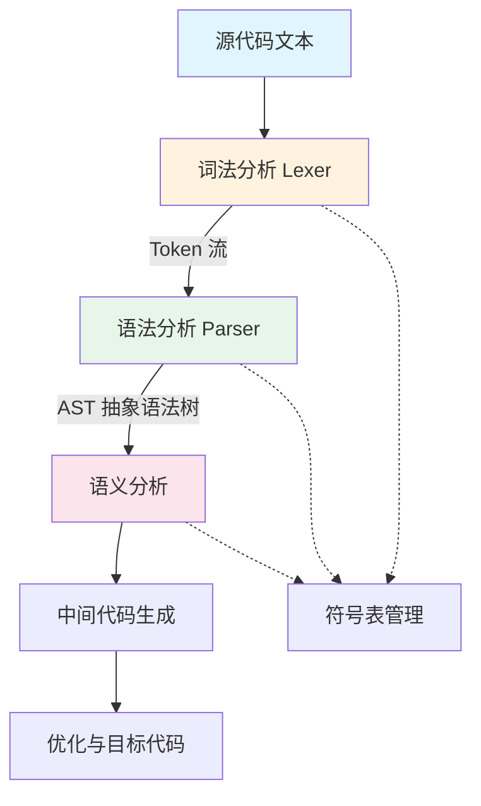
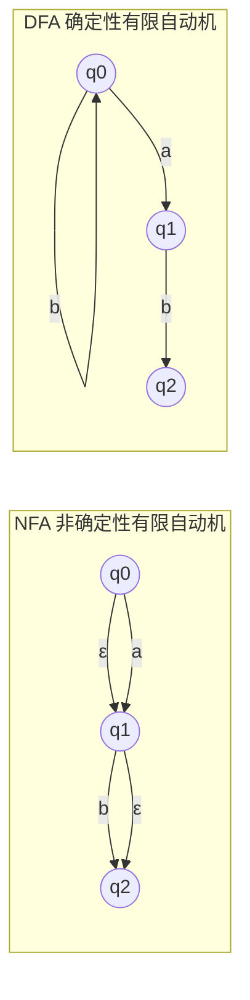
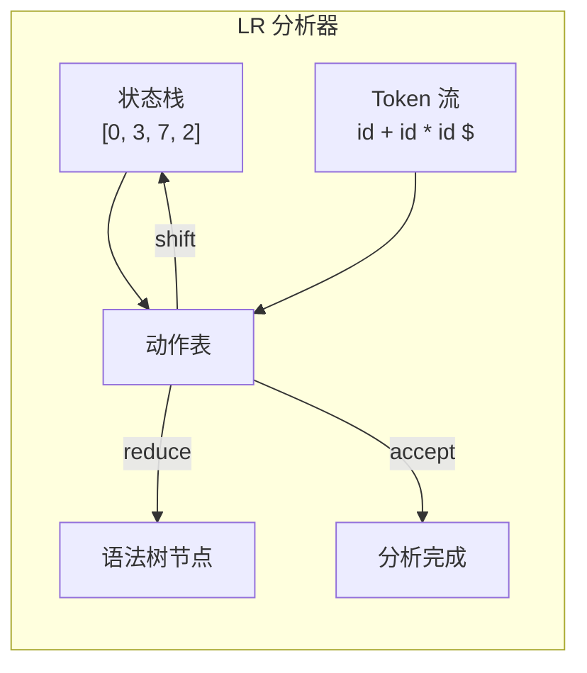
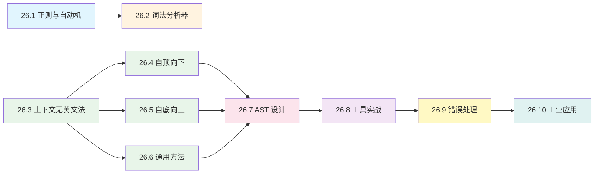

## 第26章 词法与语法分析

### 1. 章节定位与学习目标

词法分析（Lexical Analysis）和语法分析（Syntax Analysis）是编译器前端的两大核心阶段，也是所有程序语言处理工具——从编译器、解释器、代码格式化器到静态分析器——的基石。本章从理论根基出发，经由算法设计与数据结构选型，最终落地到工业级实现，帮助读者建立完整的知识链条。

**学完本章，你将能够：**

- 理解正则表达式、有限自动机（DFA/NFA）的数学原理及其在词法分析中的角色
- 掌握手写词法分析器与使用生成器工具（Flex、ANTLR Lexer）两种路线
- 区分 LL、LR、LALR、GLR、PEG 等语法分析策略的适用边界
- 使用递归下降、算符优先、LR 自底向上等方法手写解析器
- 利用 ANTLR、Bison/Yacc、Tree-sitter 等工业工具生成高效解析器
- 理解错误恢复策略、歧义消除、左递归处理等工程难点
- 将词法/语法分析应用于 DSL 设计、代码检查、格式化、混淆还原等实际场景



### 2. 词法分析：从字符流到 Token 流

#### 2.1 什么是词法分析

词法分析是编译过程的第一步。它将源代码的字符序列（character stream）切分为有意义的单元——**词素（lexeme）**，并为每个词素赋予**记号（token）**类别。例如：

int count = 42 + foo();

经词法分析后变为：

| Token 类别 | 词素 | 附加信息 |
|-----------|------|---------|
| KEYWORD | `int` | — |
| IDENTIFIER | `count` | — |
| ASSIGN | `=` | — |
| INTEGER_LITERAL | `42` | 值 = 42 |
| PLUS | `+` | — |
| IDENTIFIER | `foo` | — |
| LPAREN | `(` | — |
| RPAREN | `)` | — |
| SEMICOLON | `;` | — |

词法分析器（lexer/tokenizer）的核心职责有三个：

1. **切分（Scanning）**：将连续字符流按词法规则拆分为 token 序列
2. **分类（Classification）**：为每个 token 分配类型标签
3. **属性记录（Attribute Collection）**：提取标识符名、字面量值、行号/列号等元信息，供后续阶段使用

#### 2.2 正则表达式与有限自动机

词法分析的理论基础是**正则语言（Regular Language）**，其识别装置是**有限自动机（Finite Automaton）**。

**正则表达式语法速查：**

| 语法元素 | 含义 | 示例 |
|---------|------|------|
| `a` | 匹配字符 a | `a` |
| `a\|b` | 或（alternation） | `if\|else` |
| `ab` | 连接（concatenation） | `int` |
| `a*` | 零次或多次 | `[a-z]*` |
| `a+` | 一次或多次 | `[0-9]+` |
| `a?` | 零次或一次 | `/\*.*?\*/` |
| `[abc]` | 字符类 | `[a-zA-Z_]` |
| `[^abc]` | 取反字符类 | `[^0-9]` |
| `\b` | 单词边界 | `\bint\b` |

**NFA 与 DFA 的核心区别：**



| 特性 | NFA | DFA |
|------|-----|-----|
| 转移函数 | 可以有多个/ε-转移 | 每个状态每个输入恰好一条转移 |
| 匹配时间 | 最坏 O(n·m)（n=输入长度，m=状态数） | 确定性 O(n) |
| 构建复杂度 | 正则→NFA：O(m) | NFA→DFA（子集构造）：O(2^m) |
| 空间开销 | 较小（m 个状态） | 可能指数级（最坏 2^m 个状态） |
| 实际应用 | 引擎内部用于匹配 | 词法分析器生成器的标准输出 |

**正则→NFA→DFA 的经典转换流程（Thompson 构造 + 子集构造）：**

1. **Thompson 构造**：每个正则子表达式直接映射为一小段 NFA 片段，通过并联（|）、串联（·）、闭包（*）组合
2. **子集构造（Subset Construction）**：将 NFA 转换为等价 DFA，对每个 DFA 状态，它是 NFA 状态集合的子集
3. **DFA 最小化（Hopcroft 算法）**：合并等价状态，得到最小 DFA

```python
# 子集构造的核心逻辑（简化版）
def subset_construction(nfa, start, accept):
    """NFA → DFA 转换"""
    dfa_states = {}
    unmarked = []

    start_set = epsilon_closure(nfa, {start})
    start_key = frozenset(start_set)
    dfa_states[start_key] = {}
    unmarked.append(start_key)

    while unmarked:
        T = unmarked.pop()
        for symbol in alphabet(nfa):
            move_result = move(nfa, T, symbol)
            U = epsilon_closure(nfa, move_result)
            U_key = frozenset(U)
            if U_key not in dfa_states:
                dfa_states[U_key] = {}
                unmarked.append(U_key)
            dfa_states[T][symbol] = U_key

    # 标记接受状态：包含任一 NFA 接受状态的 DFA 状态
    accept_keys = {
        s for s in dfa_states if s &amp; set(accept)
    }
    return dfa_states, start_key, accept_keys
```

#### 2.3 词法分析器的工程实现

**手写词法分析器**是工业界的主流选择（GCC、Clang、Rust 编译器、V8 引擎均采用），原因包括：

- 性能可控：避免 DFA 状态爆炸，可针对热点模式做特殊优化
- 调试方便：代码逻辑清晰，断点直观
- 灵活性强：可自由处理上下文相关的词法规则（如 C 的类型名 vs 标识符歧义）

```python
class Lexer:
    """手写词法分析器示例：支持数字、标识符、运算符、字符串"""

    TOKEN_TYPES = [
        ('NUMBER',      r'\d+(\.\d+)?'),
        ('STRING',      r'"[^"\\]*(\\.[^"\\]*)*"'),
        ('IDENT',       r'[a-zA-Z_]\w*'),
        ('OPERATOR',    r'[+\-*/=<>!]=?|&amp;&amp;|\|\||\*\*'),
        ('LPAREN',      r'\('),
        ('RPAREN',      r'\)'),
        ('LBRACE',      r'\{'),
        ('RBRACE',      r'\}'),
        ('COMMA',       r','),
        ('SEMICOLON',   r';'),
        ('NEWLINE',     r'\n'),
        ('WHITESPACE',  r'[ \t]+'),
        ('COMMENT',     r'//[^\n]*|/\*[\s\S]*?\*/'),
    ]

    # 关键字表：编译期构建为 set，O(1) 查找
    KEYWORDS = frozenset({
        'if', 'else', 'while', 'for', 'return', 'fn',
        'let', 'mut', 'struct', 'enum', 'impl', 'true', 'false',
    })

    def __init__(self, source: str):
        self.source = source
        self.pos = 0
        self.line = 1
        self.col = 1
        self.tokens = []
        # 预编译所有正则（避免每次匹配重编译）
        import re
        combined = '|'.join(
            f'(?P<{name}>{pattern})'
            for name, pattern in self.TOKEN_TYPES
        )
        self.pattern = re.compile(combined)

    def tokenize(self):
        for m in self.pattern.finditer(self.source, self.pos):
            kind = m.lastgroup
            value = m.group()

            # 跳过空白和注释
            if kind in ('WHITESPACE', 'COMMENT'):
                self._advance(value)
                continue
            if kind == 'NEWLINE':
                self._advance(value)
                continue

            # 关键字识别：标识符需二次检查
            if kind == 'IDENT' and value in self.KEYWORDS:
                kind = 'KEYWORD'

            self.tokens.append(Token(
                kind=kind, value=value,
                line=self.line, col=self.col
            ))
            self._advance(value)

        self.tokens.append(Token('EOF', '', self.line, self.col))
        return self.tokens

    def _advance(self, text):
        newlines = text.count('\n')
        self.line += newlines
        if newlines:
            self.col = len(text) - text.rfind('\n')
        else:
            self.col += len(text)
        self.pos += len(text)
```

**词法分析器生成器**适合规则数量庞大或需要快速迭代的场景：

| 工具 | 语言 | 输出形式 | 特点 |
|------|------|---------|------|
| Flex | C/C++ | C 源码 | 经典高效，DFA 驱动，工业级 |
| ANTLR Lexer | Java/C#/Python/Go | 生成的 Lexer 类 | 与 parser 深度集成，支持语义谓词 |
| Ragel | C/C++/Go/Java | 状态机代码 | 极高性能，适合协议解析 |
| RE/flex | C++ | C++ 源码 | 支持 Unicode，POSIX 正则扩展 |
| Tree-sitter Lexer | C/多语言绑定 | 增量解析库 | 用于编辑器，支持局部重解析 |

#### 2.4 词法分析的难点与陷阱

**最长匹配原则（Maximal Munch）**：词法分析器总是尽可能多地消费字符。例如 `>>` 应解析为两个 `>` 而非 `>>`（右移运算符），取决于词法规则的定义顺序。

**贪婪 vs 懒惰匹配**：正则引擎默认贪婪，`".*"` 会吞掉整个字符串中的所有引号。对于字符串字面量的正则，需要用非贪婪 `".*?"` 或排除字符类 `"[^"\\]*(\\.[^"\\]*)*"`。

**符号表与词法环境**：词法分析器通常不涉及语义信息，但 C 语言中标识符和类型名共享同一命名空间——`foo * bar;` 中 `foo` 是标识符还是类型名？这需要**词法反馈（lexer feedback）**，即 parser 告诉 lexer 当前符号表中哪些名字是类型。

**编码与 Unicode 处理**：现代语言普遍支持 Unicode 标识符。词法分析器需要处理 UTF-8/UTF-16 编码、规范化（NFC/NFD）、字素簇（grapheme cluster）等 Unicode 细节。

### 3. 语法分析：从 Token 流到 AST

#### 3.1 什么是语法分析

语法分析（parsing）将词法分析产生的 token 流，按照语言的**上下文无关文法（Context-Free Grammar, CFG）**规则，组织成**抽象语法树（Abstract Syntax Tree, AST）**。AST 去除了冗余的语法分隔符（括号、分号等），保留程序的结构语义。

// 源代码
x = 3 + 4 * y;

// AST 表示
        =
       / \
      x   +
         / \
        3   *
           / \
          4   y

#### 3.2 文法基础

**上下文无关文法的四元组** G = (V, Σ, P, S)：

- **V**（非终结符集合）：`{Expr, Term, Factor, ...}`
- **Σ**（终结符/Token 集合）：`{+, *, (, ), ID, NUM, ...}`
- **P**（产生式规则集合）：如 `Expr → Expr + Term | Term`
- **S**（起始符号）：通常是 `Expr` 或 `Program`

**一个表达式文法的完整定义：**

```bnf
Program     → Stmt+
Stmt        → Expr ';'
            | Type ID '=' Expr ';'
            | 'if' '(' Expr ')' Block ('else' Block)?
            | 'while' '(' Expr ')' Block
            | 'return' Expr ';'

Block       → '{' Stmt* '}'

Expr        → Expr ('==' | '!=' | '<' | '>' | '<=' | '>=') RelExpr
            | RelExpr
RelExpr     → RelExpr ('+' | '-') Term
            | Term
Term        → Term ('*' | '/' | '%') Factor
            | Factor
Factor      → '(' Expr ')'
            | '-' Factor
            | '!' Factor
            | ID '(' (Expr (',' Expr)*)? ')'
            | ID
            | NUM
            | STRING
```

**关键概念：**

| 概念 | 定义 | 为何重要 |
|------|------|---------|
| 最左推导 | 每步替换最左边的非终结符 | LL 分析器的推导方式 |
| 最右推导 | 每步替换最右边的非终结符 | LR 分析器的归约方式 |
| 二义性 | 一个句子有多棵不同的语法树 | 必须消除，否则分析结果不确定 |
| 左递归 | A → Aα 形式的规则 | LR 可处理，LL 会死循环 |
| 左因子 | 多个产生式共享相同前缀 | LL 需提取左因子消除回溯 |

#### 3.3 语法分析策略全景

```mermaid
graph TB
    PA[语法分析策略] --> DE[确定性分析]
    PA --> ND[非确定性/回溯分析]

    DE --> TOP[自顶向下 Top-Down]
    DE --> BOT[自底向上 Bottom-Up]

    TOP --> RD[递归下降<br/>Recursive Descent]
    TOP --> LL[LL 分析<br/>LL(1)/LL(k)]
    TOP --> PEG[PEG 解析<br/>Packing Expressions]

    BOT --> SR[移进-归约<br/>Shift-Reduce]
    BOT --> LR[LR 分析<br/>LR(0)/SLR/LALR(1)]
    BOT --> GLR[GLR 分析<br/>通用LR]
    BOT --> LR1[LR(1)/Canonical LR]

    ND --> CYK[CYK 算法]
    ND --> EARLEY[Earley 算法]
```

**各策略对比：**

| 策略 | 方向 | 文法要求 | 实现复杂度 | 回溯 | 典型应用 |
|------|------|---------|-----------|------|---------|
| 递归下降 | 自顶向下 | LL(1) 或带前瞻 | 低 | 可选 | 手写 parser（大多数语言编译器） |
| LL(k) | 自顶向下 | LL(k)，需消左递归和左因子 | 中 | 无 | ANTLR（默认模式） |
| PEG | 自顶向下 | PEG 文法 | 低 | 有序选择 | Tree-sitter、Macaroons、Packcc |
| LR(0)/SLR | 自底向上 | SLR 文法 | 高 | 无 | 教学 |
| LALR(1) | 自底向上 | LALR(1) 文法 | 高 | 无 | Yacc/Bison（工业主力） |
| GLR | 自底向上 | 任意 CFG | 高 | 自动处理歧义 | 多歧义语法（C++、SQL） |
| Earley | 双向 | 任意 CFG | 中 | 自动 | 通用 parser，可处理歧义 |

#### 3.4 递归下降：最容易手写的分析器

递归下降是工业界手写 parser 的首选方法。每个文法规则对应一个函数，函数体直接映射产生式的结构。

```python
class Parser:
    """递归下降解析器：支持四则运算、比较、函数调用"""

    def __init__(self, tokens):
        self.tokens = tokens
        self.pos = 0

    def peek(self) -> Token:
        return self.tokens[self.pos]

    def eat(self, kind: str) -> Token:
        tok = self.tokens[self.pos]
        if tok.kind != kind:
            raise SyntaxError(
                f"Line {tok.line}:{tok.col}: "
                f"Expected {kind}, got {tok.kind}('{tok.value}')"
            )
        self.pos += 1
        return tok

    # --- 文法规则 → 函数 ---

    def parse_program(self) -> ASTNode:
        """Program → Stmt+"""
        stmts = []
        while self.peek().kind != 'EOF':
            stmts.append(self.parse_stmt())
        return ProgramNode(stmts)

    def parse_stmt(self) -> ASTNode:
        """Stmt → if | while | return | assignment | expr ';'"""
        tok = self.peek()
        if tok.kind == 'KEYWORD' and tok.value == 'if':
            return self.parse_if_stmt()
        elif tok.kind == 'KEYWORD' and tok.value == 'while':
            return self.parse_while_stmt()
        elif tok.kind == 'KEYWORD' and tok.value == 'return':
            self.eat('KEYWORD')  # consume 'return'
            expr = self.parse_expr()
            self.eat('SEMICOLON')
            return ReturnNode(expr)
        elif tok.kind == 'IDENT':
            # 可能是赋值：name = expr; 或表达式：name(args);
            # 用 2-token 前瞻判断
            if (self.pos + 1 < len(self.tokens)
                    and self.tokens[self.pos + 1].kind == 'ASSIGN'):
                return self.parse_assignment()
        return self.parse_expr_stmt()

    def parse_expr(self) -> ASTNode:
        """Expr → Comparison"""
        return self.parse_comparison()

    def parse_comparison(self) -> ASTNode:
        """Comparison → Addition (('==' | '!=' | ...) Addition)*"""
        left = self.parse_addition()
        while self.peek().kind == 'OPERATOR' and \
              self.peek().value in ('==', '!=', '<', '>', '<=', '>='):
            op = self.eat('OPERATOR')
            right = self.parse_addition()
            left = BinOpNode(op.value, left, right)
        return left

    def parse_addition(self) -> ASTNode:
        """Addition → Multiplication (('+' | '-') Multiplication)*"""
        left = self.parse_multiplication()
        while self.peek().kind == 'OPERATOR' and \
              self.peek().value in ('+', '-'):
            op = self.eat('OPERATOR')
            right = self.parse_multiplication()
            left = BinOpNode(op.value, left, right)
        return left

    def parse_multiplication(self) -> ASTNode:
        """Multiplication → Unary (('*' | '/' | '%') Unary)*"""
        left = self.parse_unary()
        while self.peek().kind == 'OPERATOR' and \
              self.peek().value in ('*', '/', '%'):
            op = self.eat('OPERATOR')
            right = self.parse_unary()
            left = BinOpNode(op.value, left, right)
        return left

    def parse_unary(self) -> ASTNode:
        """Unary → ('-' | '!') Unary | Primary"""
        if self.peek().value in ('-', '!'):
            op = self.eat('OPERATOR')
            return UnaryOpNode(op.value, self.parse_unary())
        return self.parse_primary()

    def parse_primary(self) -> ASTNode:
        """Primary → NUM | STRING | ID | ID '(' args ')' | '(' Expr ')'"""
        tok = self.peek()
        if tok.kind == 'NUMBER':
            self.eat('NUMBER')
            return NumNode(float(tok.value))
        elif tok.kind == 'STRING':
            self.eat('STRING')
            return StringNode(tok.value)
        elif tok.kind == 'IDENT':
            self.eat('IDENT')
            # 函数调用？
            if self.peek().kind == 'LPAREN':
                self.eat('LPAREN')
                args = []
                if self.peek().kind != 'RPAREN':
                    args.append(self.parse_expr())
                    while self.peek().kind == 'COMMA':
                        self.eat('COMMA')
                        args.append(self.parse_expr())
                self.eat('RPAREN')
                return CallNode(tok.value, args)
            return VarNode(tok.value)
        elif tok.kind == 'LPAREN':
            self.eat('LPAREN')
            expr = self.parse_expr()
            self.eat('RPAREN')
            return expr
        raise SyntaxError(
            f"Line {tok.line}:{tok.col}: "
            f"Unexpected token {tok.kind}('{tok.value}')"
        )
```

**递归下降的关键技巧：**

1. **运算符优先级通过嵌套层次实现**：`parse_addition` 调用 `parse_multiplication`，后者调用 `parse_unary`，形成 `+` < `*` < `-!` 的优先级链
2. **左递归消除**：循环替代递归，`Expr → Expr + Term` 变成 `while` 循环
3. **前瞻（Lookahead）**：通过 `peek()` 查看下一个 token 做决策，LL(1) 用 1 个 token，复杂语法可用 LL(k)

#### 3.5 LALR 分析与生成器工具

**LR 分析器的工作原理**：自底向上，维护一个状态栈和 token 流。对每个 token，查**动作表（ACTION）**决定移进（shift）还是归约（reduce）。



**Yacc/Bison 工作流：**

```yacc
%{
#include <stdio.h>
void yyerror(const char *s);
int yylex(void);
%}

%token NUM ID
%left '+' '-'
%left '*' '/'
%right UMINUS

%%
program:    stmt_list           { printf("Parsed successfully.\n"); }
;

stmt_list:  stmt_list stmt
            | /* empty */
;

stmt:       expr ';'            { /* evaluate or generate code */ }
;

expr:       expr '+' expr       { $$ = $1 + $3; }
        |   expr '-' expr       { $$ = $1 - $3; }
        |   expr '*' expr       { $$ = $1 * $3; }
        |   expr '/' expr       { $$ = $1 / $3; }
        |   '(' expr ')'        { $$ = $2; }
        |   '-' expr %prec UMINUS { $$ = -$2; }
        |   NUM                 { $$ = $1; }
;
%%

void yyerror(const char *s) {
    fprintf(stderr, "Error: %s\n", s);
}

int main(void) {
    return yyparse();
}
```

**LALR(1) 的优势与局限：**

- 优势：状态数少（通常几十到几百），分析表紧凑，分析速度快
- 局限：不能处理左递归文法的某些变体，错误信息不够精确，需手动处理歧义
- Bison 是 LALR(1) 的事实标准，几乎所有 Unix 系统工具的语法（如 Makefile、Shell、SQL 方言）都用 Bison 生成

#### 3.6 PEG 与现代解析技术

**PEG（Parsing Expression Grammar）**是近十年兴起的分析方法，被 Tree-sitter、Nim 语言、Rust 的 `pest` 等项目采用。

PEG 与 CFG 的核心区别：

| 特性 | CFG | PEG |
|------|-----|-----|
| 选择 | `A → α \| β` 非确定性，两者都可能匹配 | `A ← α / β` 有序选择，α 成功则不尝试 β |
| 闭包 | `A*` 非确定性 | `A*` 贪婪匹配，失败则回溯 |
| 语义 | 无回溯 | 完全确定，但需要回溯 |
| 歧义 | 需外部消除 | 文法天然无歧义（有序选择决定优先级） |

```python
# PEG 风格解析器（用 Python 实现有序选择）
def parse_expr(text, pos=0):
    """PEG 风格：尝试加法 → 失败则回溯尝试乘法"""
    # 尝试加法
    result = parse_addition(text, pos)
    if result:
        return result
    # 回溯
    return parse_multiplication(text, pos)
```

**Tree-sitter 的增量解析**是编辑器领域的突破性技术：

- 解析失败时生成包含语法错误的 CST（具体语法树），不中断
- 增量重解析：文件局部修改只需重新分析受影响的节点
- 亚毫秒级解析速度，支持 50+ 编程语言
- 用于 VS Code、Neovim、Zed 等现代编辑器的语法高亮和代码导航

### 4. AST 设计与转换

#### 4.1 AST vs CST vs Parse Tree

| 树类型 | 全称 | 保留内容 | 用途 |
|--------|------|---------|------|
| Parse Tree | 解析树 | 所有文法规则和终结符 | 教学，精确还原推导过程 |
| CST | 具体语法树（Concrete Syntax Tree） | 所有 token 和结构 | PEG 的输出，保留完整语法信息 |
| AST | 抽象语法树 | 仅语义结构 | 编译器、解释器、IDE 的核心数据结构 |

AST 的设计原则：

1. **最小化节点类型**：用 `BinOp(op, left, right)` 覆盖所有二元运算，而非为每个运算符设一个类型
2. **包含位置信息**：每个节点携带 `line`, `col`, `end_line`, `end_col`，用于错误报告和代码生成
3. **便于遍历**：实现 `accept(visitor)` 方法，支持 Visitor 模式进行后序遍历

```python
from dataclasses import dataclass, field
from typing import List, Optional

@dataclass
class SourceLocation:
    line: int
    col: int
    end_line: int = 0
    end_col: int = 0

@dataclass
class ASTNode:
    loc: SourceLocation = field(default_factory=lambda: SourceLocation(0, 0))

@dataclass
class ProgramNode(ASTNode):
    stmts: List[ASTNode] = field(default_factory=list)

@dataclass
class BinOpNode(ASTNode):
    op: str = ''
    left: Optional[ASTNode] = None
    right: Optional[ASTNode] = None

@dataclass
class UnaryOpNode(ASTNode):
    op: str = ''
    operand: Optional[ASTNode] = None

@dataclass
class NumNode(ASTNode):
    value: float = 0.0

@dataclass
class VarNode(ASTNode):
    name: str = ''

@dataclass
class CallNode(ASTNode):
    func: str = ''
    args: List[ASTNode] = field(default_factory=list)

@dataclass
class AssignmentNode(ASTNode):
    target: str = ''
    value: Optional[ASTNode] = None

@dataclass
class IfNode(ASTNode):
    condition: Optional[ASTNode] = None
    then_block: List[ASTNode] = field(default_factory=list)
    else_block: Optional[List[ASTNode]] = None

@dataclass
class WhileNode(ASTNode):
    condition: Optional[ASTNode] = None
    body: List[ASTNode] = field(default_factory=list)

@dataclass
class ReturnNode(ASTNode):
    value: Optional[ASTNode] = None
```

#### 4.2 Visitor 模式遍历 AST

Visitor 模式是遍历和转换 AST 的标准范式，允许在不修改 AST 节点类的情况下添加新操作：

```python
class ASTVisitor:
    """AST 访问器基类"""

    def visit_program(self, node: ProgramNode):
        for stmt in node.stmts:
            stmt.accept(self)

    def visit_binop(self, node: BinOpNode):
        node.left.accept(self)
        node.right.accept(self)

    def visit_unaryop(self, node: UnaryOpNode):
        node.operand.accept(self)

    def visit_num(self, node: NumNode): pass
    def visit_var(self, node: VarNode): pass

    def visit_call(self, node: CallNode):
        for arg in node.args:
            arg.accept(self)

class TypeChecker(ASTVisitor):
    """类型检查：作为 Visitor 的具体应用"""

    def __init__(self):
        self.env = {}  # name → type
        self.errors = []

    def visit_assignment(self, node: AssignmentNode):
        node.value.accept(self)
        expr_type = self.last_type
        if node.target in self.env and self.env[node.target] != expr_type:
            self.errors.append(
                f"Line {node.loc.line}: Type mismatch for '{node.target}'"
            )
        self.env[node.target] = expr_type

    def visit_num(self, node: NumNode):
        self.last_type = 'number'

    def visit_binop(self, node: BinOpNode):
        node.left.accept(self)
        left_type = self.last_type
        node.right.accept(self)
        right_type = self.last_type
        if left_type != right_type:
            self.errors.append(
                f"Line {node.loc.line}: Cannot apply '{node.op}' "
                f"to {left_type} and {right_type}"
            )
        self.last_type = 'number'  # 简化示例
```

### 5. 错误处理与恢复

错误处理是区分"教学级"和"工业级"解析器的分水岭。一个优秀的解析器应当：

1. **报告清晰的错误信息**：文件名、行号、列号、期望 vs 实际
2. **错误恢复**：遇到错误后继续分析，尽可能多地发现后续错误
3. **panic mode**：跳过 token 直到遇到同步 token（如分号、右括号），重新开始分析

**常见的错误恢复策略：**

| 策略 | 原理 | 适用场景 |
|------|------|---------|
| Panic Mode | 跳过 token 直到遇到同步点 | 通用，实现简单 |
| 短语级恢复 | 检测到特定错误模式后做局部修复（如插入缺失分号） | 高质量错误信息 |
| 错误产生式 | 在文法中加入显式的错误产生式 | Bison/LR 系列 |
| 模式匹配 | 根据错误上下文推测用户意图 | IDE 实时分析 |

```python
class ErrorRecoveringParser(Parser):
    """带错误恢复的解析器（简化示例）"""

    def parse_stmt(self) -> ASTNode:
        try:
            return super().parse_stmt()
        except SyntaxError as e:
            self.errors.append(e)
            # panic mode: 跳到下一个分号或右大括号
            while self.peek().kind not in ('SEMICOLON', 'RBRACE', 'EOF'):
                self.pos += 1
            if self.peek().kind == 'SEMICOLON':
                self.eat('SEMICOLON')
            return ErrorNode(e)
```

### 6. 工业级解析器工具对比

| 工具 | 分析方法 | 生成语言 | 增量解析 | 语法错误容忍 | 社区活跃度 |
|------|---------|---------|---------|-------------|-----------|
| ANTLR 4 | ALL(*) | Java/C#/Python/Go/JS | ✗ | ✓（默认输出包含错误节点） | 极高 |
| Bison/GNU Bison | LALR(1)/GLR | C/C++ | ✗ | 需手动实现 | 高 |
| Tree-sitter | PEG + GLR | C + 多语言绑定 | ✓ | ✓（部分解析） | 极高 |
| pest | PEG | Rust | ✗ | ✓（失败时返回最远位置） | 中 |
| Ohm | PEG | JS/TS | ✗ | ✓（基于 PEG 的错误恢复） | 中 |
| LALRPOP | LR(1) | Rust | ✗ | 需手动实现 | 中 |
| menhir | LR(1) | OCaml | ✗ | 支持增量 | 中 |

**选型建议：**

- **新项目，需要快速上手** → ANTLR 4（语法文件直观，生成代码开箱即用）
- **编辑器/IDE 集成** → Tree-sitter（增量解析 + 错误容忍，编辑器标配）
- **嵌入式/高性能场景** → Ragel（词法） + Bison（语法） 或手写递归下降
- **Rust 生态** → pest 或 LALRPOP
- **需要处理歧义语法**（如 C++、SQL） → ANTLR 4 或 GLR 模式

### 7. 实际应用案例

#### 7.1 为自定义 DSL 构建完整解析器

假设我们设计一个简单的配置语言 `ConfigLang`：

server {
    host = "0.0.0.0"
    port = 8080
    max_connections = 1000
    features = ["logging", "metrics"]
}

database {
    url = "postgres://localhost/mydb"
    pool_size = 10
    timeout = 30s
}

**完整实现步骤：**

1. 定义词法规则：识别标识符、字符串、数字、单位后缀、大括号
2. 定义语法规则：块 → 键值对列表；值 → 字符串/数字/数字+单位/数组
3. 词法分析器：处理 `30s` 这样的带单位数字（30 秒）
4. 语法分析器：递归下降，支持嵌套块
5. AST → Python dict 的转换

#### 7.2 代码格式化器

代码格式化（如 Prettier、rustfmt）的核心流程：

源代码 → Lexer → Parser → CST/AST → 格式化策略应用 → 输出格式化代码

关键挑战：**保留注释**。标准 AST 会丢弃注释，但格式化器需要保留它们。解决方案是使用 CST 或在 AST 节点上附加前导注释（leading comments）和尾部注释（trailing comments）。

#### 7.3 静态分析与代码检查

ESLint、Pylint 等工具通过解析 AST 执行规则检查：

```python
class UnusedVariableDetector(ASTVisitor):
    """检测未使用的变量"""

    def __init__(self):
        self.defined = set()
        self.used = set()

    def visit_assignment(self, node: AssignmentNode):
        self.defined.add(node.target)
        node.value.accept(self)

    def visit_var(self, node: VarNode):
        self.used.add(node.name)

    def report(self):
        unused = self.defined - self.used
        for name in unused:
            print(f"Warning: variable '{name}' is defined but never used")
```

### 8. 性能优化与工程实践

#### 8.1 解析性能基准

| 语言 | 解析器 | 10K 行代码解析时间 | 吞吐量 |
|------|--------|-------------------|--------|
| C++ | GCC（手写递归下降） | ~5ms | ~2M 行/秒 |
| Java | javac（手写） | ~8ms | ~1.2M 行/秒 |
| Rust | rustc（手写递归下降） | ~3ms | ~3M 行/秒 |
| JavaScript | V8（手写） | ~4ms | ~2.5M 行/秒 |
| TypeScript | tsc（手写） | ~15ms | ~600K 行/秒 |
| Python | ANTLR 4 生成 | ~25ms | ~400K 行/秒 |
| 通用 | Tree-sitter | ~2ms | ~5M 行/秒 |

#### 8.2 优化技巧

1. **避免动态内存分配**：token 和 AST 节点用 arena 分配器批量分配
2. **内联关键函数**：`peek()`、`eat()` 等高频函数标记为 inline
3. **SIMD 加速词法分析**：用 SSE/NEON 指令快速跳过空白字符和注释
4. **预分配 token 数组**：根据源文件大小预估 token 数量，减少 realloc
5. **缓存友好**：AST 节点按遍历顺序排列在连续内存中

### 9. 常见误区与纠正

| 误区 | 正确做法 |
|------|---------|
| 用正则表达式解析完整编程语言 | 正则只能做词法分析（token 切分），语法分析需要 CFG |
| 手写 parser 一定比生成器差 | 工业编译器大多手写，因为性能和灵活性更优 |
| 语法错误只需要报"syntax error" | 必须提供精确位置、期望 token、修复建议 |
| 忽略左递归直接写 LL parser | 左递归会导致 LL 分析器无限递归，必须消除 |
| AST 节点不需要位置信息 | 位置信息是错误报告、代码生成、IDE 功能的基础 |
| 所有语言都适合 LALR(1) | 嵌套表达式、泛型语法等可能需要 GLR 或 ALL(*) |

### 10. 章节导览

本章后续各节将深入展开以下内容：

| 节次 | 主题 | 核心内容 |
|------|------|---------|
| 26.1 | 正则表达式与有限自动机 | 正则语法、NFA/DFA 构造与转换、DFA 最小化 |
| 26.2 | 词法分析器设计 | 手写 Lexer、生成器工具、Unicode 处理、错误恢复 |
| 26.3 | 上下文无关文法 | CFG 定义、推导、歧义、变换（消除左递归/左因子） |
| 26.4 | 自顶向下分析 | 递归下降、LL(k)、预测分析表、FIRST/FOLLOW 集 |
| 26.5 | 自底向上分析 | LR 分析原理、LR(0)/SLR/LALR(1)、移进-归约、Bison 实战 |
| 26.6 | 通用分析方法 | GLR、Earley、PEG、无限回溯问题与解决 |
| 26.7 | AST 设计与转换 | AST 节点设计、Visitor 模式、AST 变换、代码生成接口 |
| 26.8 | 解析器工具实战 | ANTLR 4 / Tree-sitter / Bison 完整项目案例 |
| 26.9 | 错误处理与恢复 | 错误信息设计、panic mode、短语级恢复、错误产生式 |
| 26.10 | 工业应用 | DSL 设计、代码格式化、静态分析、混淆还原、协议解析 |


