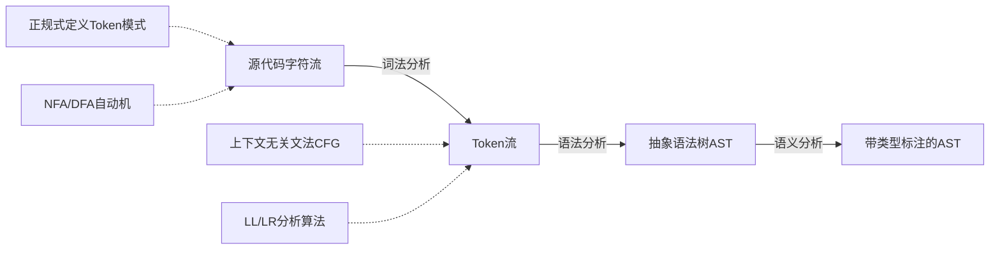

## 词法与语法分析的理论基础

词法分析（Lexical Analysis）与语法分析（Syntax Analysis）是编译器前端的两个核心阶段，也是形式语言理论在工程实践中最成功的应用领域。词法分析将源代码的字符流转换为记号（Token）流，语法分析则将Token流组织为结构化的抽象语法树（AST）。这两个阶段的理论基础——正规语言与上下文无关语言——构成了计算机科学理论体系的重要支柱。

理解这些理论不仅是编写编译器的前提，也是理解正则表达式、SQL解析器、配置文件解析器、Markdown渲染器等日常工具背后原理的关键。

### 编译器前端的处理流程



词法分析与语法分析的分工源于一个工程事实：如果用上下文无关文法来描述所有词法规则（如标识符、数字、字符串），生成的文法将极其复杂且低效。将词法规则单独提取出来用正规式描述，不仅更简洁，而且可以利用DFA在O(n)时间内完成扫描——这比通用的CFG解析快得多。

### Chomsky层次：从正规语言到上下文无关语言

Noam Chomsky在1956年提出的文法层次体系（Chomsky Hierarchy）为理解不同复杂度的语言提供了统一框架：

| 类型 | 名称 | 产生式限制 | 对应自动机 | 典型应用 |
|------|------|-----------|-----------|---------|
| 3 | 正规文法 | A → aB 或 A → a | 有限自动机（FA） | 词法分析、正则表达式 |
| 2 | 上下文无关文法 | A → β（A为非终结符） | 下推自动机（PDA） | 语法分析、编程语言语法 |
| 1 | 上下文相关文法 | \|α\| ≤ \|β\| | 线性有界自动机 | 自然语言形态变化 |
| 0 | 无限制文法 | α → β（α非空） | 图灵机 | 图灵完备计算 |

**为什么这个层次如此重要？**

- 正规语言（类型3）可以被确定有限自动机（DFA）识别，时间复杂度O(n)，空间复杂度O(1)（忽略DFA本身大小）。这正是正则表达式引擎的工作方式。
- 上下文无关语言（类型2）需要下推自动机（PDA），即有限自动机加上一个栈。栈提供了"记忆"能力，可以匹配嵌套结构（如括号匹配），但无法处理需要无限记忆的语言。
- 正规语言是上下文无关语言的真子集：每个正规语言都是上下文无关的，但存在上下文无关语言不是正规的（如{aⁿbⁿ | n ≥ 0}）。

这种包含关系决定了编译器的设计选择：用正规式处理词法（不需要嵌套匹配），用CFG处理语法（需要处理括号、begin/end配对等嵌套结构）。

---

## 正规式与正规语言

### 正规式的定义

正规式（Regular Expression）是描述正规语言（Regular Language）的代数表示。与日常使用的"正则表达式"不同，理论上的正规式基于三个基本操作：连接（Concatenation）、选择（Union/Alternation）和Kleene闭包（Kleene Star）。

**形式化定义**：设Σ为字母表，则正规式的定义递归给出：

1. ∅ 是正规式，表示空语言（不包含任何串的语言）
2. ε 是正规式，表示只包含空串的语言{ε}
3. 对每个 a∈Σ，a 是正规式，表示只包含字符a的语言{a}
4. 如果R和S是正规式，则 R|S（选择）、RS（连接）和 R*（闭包）都是正规式
5. 只有有限次应用上述规则得到的表达式才是正规式

**各操作的语义**：

- **选择 R|S**：L(R|S) = L(R) ∪ L(S)，匹配R或S中的任意一个
- **连接 RS**：L(RS) = {uv | u ∈ L(R) 且 v ∈ L(S)}，先匹配R再匹配S
- **闭包 R***：L(R*) = L(R)⁰ ∪ L(R)¹ ∪ L(R)² ∪ ... = {ε} ∪ L(R) ∪ L(RL(R)) ∪ ...

**扩展操作**（在工程实现中常用）：

- **正闭包 R+**：R+ = RR*，至少匹配一次
- **可选 R?**：R? = R|ε，匹配零次或一次
- **字符类 [a-z]**：表示a到z中任意一个字符，是选择的语法糖

### 正规式在编译器中的应用

编译器用正规式定义每种Token的匹配模式：

标识符:   letter (letter | digit)*
无符号整数: digit+
浮点数:   digit+ '.' digit+ (('E'|'e') ('+'|'-')? digit+)?
字符串:   '"' (('\\' .) | [^"\\])* '"'
空白符:    (' ' | '\t' | '\n' | '\r')+
单行注释:  '/' '/' (非换行字符)*
多行注释:  '/' '*' (任何不以"*/"结尾的字符序列) '*' '/'

正规式等价的判定问题是可判定的——存在算法可以判断两个正规式是否描述相同的语言。这一性质为编译器的词法分析器验证提供了理论保障。

### 正规式的局限性

正规式无法描述需要"计数"的语言。最经典的反例是 {aⁿbⁿ | n ≥ 0}——匹配相同数量的a和b。因为有限自动机没有栈（无法记忆已经读过多少个a），所以无法识别这种模式。这正是为什么编程语言的语法不能仅用正规式描述——括号匹配、begin/end配对等嵌套结构需要CFG。

---

## 有限自动机：NFA与DFA

### NFA的定义

非确定有限自动机（Nondeterministic Finite Automaton，NFA）是一个五元组 M = (Q, Σ, δ, q₀, F)，其中：

- **Q**：有限状态集
- **Σ**：输入字母表
- **δ: Q × (Σ ∪ {ε}) → P(Q)**：转移函数，P(Q)是Q的幂集（即状态集合的集合）
- **q₀ ∈ Q**：初始状态
- **F ⊆ Q**：接受状态集（终态集）

NFA的关键特征是**不确定性**：

1. **多值转移**：对于同一个状态和同一个输入符号，可能存在多个可选的下一状态
2. **ε-转移**：不消耗任何输入就可以进行的状态转移
3. **回溯能力**：在某个分支走不通时可以回退到之前的决策点

NFA的"非确定性"不是说它随机选择——而是说存在至少一条路径能到达接受状态。NFA的识别语义是：如果存在至少一条从初始状态到接受状态的路径消耗了全部输入，则输入被接受。

### DFA的定义

确定有限自动机（Deterministic Finite Automaton，DFA）是NFA的特例，同样是一个五元组 M = (Q, Σ, δ, q₀, F)，但转移函数不同：

- **δ: Q × Σ → Q**：每个状态对每个输入符号恰好有一个确定的转移（不是幂集，而是单个状态）
- **不存在ε-转移**

DFA的关键特征是**确定性**：给定当前状态和输入符号，下一状态是唯一确定的。这使得DFA的执行非常高效——不需要回溯，不需要同时追踪多个可能的状态，只需要维护一个当前状态即可。

**NFA与DFA的等价性定理**：对于任意NFA N，存在一个DFA D，使得 L(N) = L(D)。这意味着正规语言可以被DFA识别，DFA的确定性不会损失表达能力。

### Thompson构造法：正规式 → NFA

Thompson构造法（Thompson's Construction）由Ken Thompson于1968年提出，是一种将正规式系统地转换为等价NFA的方法。该方法是构造词法分析器的理论基础。

**基本构造规则**：

对于正规式a（单个字符）：
    →(s0)---a--→(s1)

对于正规式ε（空串）：
    →(s0)---ε--→(s1)

**连接规则**（对于正规式RS）：将R的NFA终态与S的NFA初态通过ε-转移连接：
    NR = (s0)→...→(s1)
    NS = (t0)→...→(t1)
    
    连接后: (s0)→...→(s1)---ε---→(t0)→...→(t1)

**选择规则**（对于正规式R|S）：引入新的起始状态和终止状态，通过ε-转移分支：
    →[新起始状态]
       /    \
      ε      ε
     /        \
   (NR初态)  (NS初态)
   ...        ...
   (NR终态)  (NS终态)
     \        /
      ε      ε
       \    /
       →[新终止状态]

**闭包规则**（对于正规式R*）：通过ε-转移实现零次或多次重复：
    →[新起始状态]---ε---→[新终止状态]
          ↑   ↑               ↑
          ε   |               ε
          ↓   |               ↑
       (NR初态)→...→(NR终态)
          ↑               ↓
          ←-----ε--------→

**Thompson构造法的伪代码**：

function ThompsonConstruct(regex):
    switch regex:
        case ε:
            create states s0, s1
            add transition s0 --ε--> s1
            return NFA(start=s0, accept=s1)
        
        case a (character):
            create states s0, s1
            add transition s0 --a--> s1
            return NFA(start=s0, accept=s1)
        
        case R|S:
            NR = ThompsonConstruct(R)
            NS = ThompsonConstruct(S)
            create new start s0, new accept s1
            add transitions:
                s0 --ε--> NR.start
                s0 --ε--> NS.start
                NR.accept --ε--> s1
                NS.accept --ε--> s1
            return NFA(start=s0, accept=s1)
        
        case RS:
            NR = ThompsonConstruct(R)
            NS = ThompsonConstruct(S)
            add transition NR.accept --ε--> NS.start
            return NFA(start=NR.start, accept=NS.accept)
        
        case R*:
            NR = ThompsonConstruct(R)
            create new start s0, new accept s1
            add transitions:
                s0 --ε--> NR.start
                s0 --ε--> s1
                NR.accept --ε--> NR.start
                NR.accept --ε--> s1
            return NFA(start=s0, accept=s1)

**Thompson构造法的性质**：

- 产生的NFA状态数最多为2m（m为正规式的长度），即O(m)
- 每个状态最多有两条出边（标记为ε）或一条出边（标记为字符）
- 恰好有一个开始状态和一个接受状态
- 构造时间复杂度为O(m)，与正规式长度成线性关系

### 子集构造法：NFA → DFA

子集构造法（Subset Construction，也称幂集构造法 Powerset Construction）将NFA转换为等价的DFA。核心思想是：**DFA的每个状态对应NFA的一个状态集合**——表示在NFA中同时可能处于的所有状态。

**ε-闭包（ε-Closure）**：从状态集合S出发，只通过ε-转移能到达的所有状态的集合。这是子集构造法的关键操作。

function EpsilonClosure(S):
    stack = S
    closure = S
    while stack is not empty:
        state = stack.pop()
        for each t in ε-transitions from state:
            if t not in closure:
                closure.add(t)
                stack.push(t)
    return closure

**子集构造法主算法**：

function SubsetConstruction(NFA):
    // DFA的初始状态 = NFA初态的ε-闭包
    start = EpsilonClosure({NFA.start})
    
    // Dstates: DFA的状态集合（每个状态是NFA状态的集合）
    Dstates = {start}
    // DFA转移表
    Dtran = {}
    // 未处理的DFA状态
    worklist = {start}
    
    while worklist is not empty:
        T = worklist.remove()
        
        for each symbol a in Σ:
            // 计算从T经符号a能到达的NFA状态集合，再取ε-闭包
            U = EpsilonClosure(Move(T, a))
            
            if U is not empty:
                if U not in Dstates:
                    Dstates.add(U)
                    worklist.add(U)
                
                Dtran[T, a] = U
    
    // DFA的接受状态：包含NFA接受状态的所有DFA状态
    DFA_accept = {T in Dstates | T ∩ NFA.F ≠ ∅}
    
    return DFA(start=start, transitions=Dtran, accept=DFA_accept)

function Move(T, a):
    // 从集合T中的任何状态出发，经符号a直接到达的状态集合
    result = {}
    for each state s in T:
        result = result ∪ δ(s, a)
    return result

**构造示例**：对正规式 `(a|b)*abb` 进行转换：

1. 先用Thompson构造法得到NFA（约11个状态）
2. 通过子集构造法，DFA的状态数为5：
   - 状态A：{初态, 所有通过ε可达的状态}，初始状态
   - 状态B：读入a后到达的状态集
   - 状态C：读入b后到达的状态集
   - 状态D：读入ab后到达的状态集
   - 状态E：读入abb后到达的状态集（接受状态）

**子集构造法的复杂度分析**：

- DFA的状态数最多为2^n（n为NFA的状态数），理论上界是指数级的
- 实践中，大多数情况下生成的DFA状态数远少于上界
- 对于编译器中的词法分析，NFA/DFA的状态数通常在可接受范围内（几百个状态）
- 子集构造法的时间复杂度为O(n × 2^n × |Σ|)，但由于实际状态数远少于上界，实际运行很快

### DFA最小化：Hopcroft算法

DFA最小化将一个DFA转换为状态数最少的等价DFA。**最小化DFA在给定语言的意义下是唯一的**（同构意义下）——这是正规语言理论的一个重要定理。

**Hopcroft算法**是目前已知最高效的DFA最小化算法，时间复杂度为O(n log n)，其中n是状态数。

**基本思想**：通过不断细化分区来区分不同状态。初始时，所有接受状态在一个分区，所有非接受状态在另一个分区。然后对每个输入符号，检查是否需要将一个分区进一步分裂——如果分区中的某些状态经该符号到达的分区不同，说明这些状态不能等价。

function HopcroftMinimization(DFA):
    // 初始分区：接受状态和非接受状态
    P = {F, Q - F}
    W = {F}  // 待处理的分区集合（只放较小的分区）
    
    while W is not empty:
        A = W.remove()
        
        for each symbol a in Σ:
            // X: 经符号a能到达A中状态的所有状态
            X = {q ∈ Q | δ(q, a) ∈ A}
            
            for each set Y in P:
                I = X ∩ Y      // Y中经a能到A的
                J = Y - X       // Y中经a不能到A的
                
                if I ≠ ∅ and J ≠ ∅:
                    // 将Y分裂为I和J
                    P.replace(Y, I, J)
                    
                    if Y ∈ W:
                        W.replace(Y, I, J)
                    else:
                        if |I| <= |J|:
                            W.add(I)
                        else:
                            W.add(J)
    
    // 从分区构造最小DFA：每个分区对应DFA的一个状态
    return BuildMinDFA(DFA, P)

**关键优化**：每次选择较小的集合加入工作集W，这保证了算法的O(n log n)复杂度。如果总是选择较大的集合，最坏情况会退化到O(n²)。

**DFA最小化的实际意义**：在词法分析器中，最小化DFA可以减少转移表的大小，提升缓存命中率。对于包含数十个Token规则的词法分析器，最小化通常能减少20%~40%的状态数。

---

## 词法分析器生成器

### Lex/Flex的工作原理

Lex（及其GNU实现Flex）是经典的词法分析器生成器。用户通过正规式定义Token模式，Lex/Flex自动生成高效的C语言词法分析器。

**Lex规范的结构**：

```lex
%{
/* C声明部分：头文件、全局变量、辅助函数 */
#include "parser.h"
int line_num = 1;
%}

/* 定义部分：正规式别名 */
DIGIT    [0-9]
LETTER   [a-zA-Z_]
ID       {LETTER}({LETTER}|{DIGIT})*
INT      {DIGIT}+
FLOAT    {DIGIT}+"."{DIGIT}*([eE][+-]?{DIGIT}+)?
WS       [ \t]+

%%
/* 规则部分：正规式 + 动作 */
{INT}     { yylval.num = atoi(yytext); return NUM; }
{FLOAT}   { yylval.fval = atof(yytext); return FLOAT_NUM; }
{ID}      { yylval.str = strdup(yytext); return check_keyword(yytext); }
"+"       { return PLUS; }
"-"       { return MINUS; }
"*"       { return STAR; }
"("       { return LPAREN; }
")"       { return RPAREN; }
";"       { return SEMICOLON; }
"="       { return ASSIGN; }
"=="      { return EQ; }
"!="      { return NEQ; }
"<"       { return LT; }
">"       { return GT; }
{WS}      { /* 跳过空白 */ }
\n        { line_num++; }
"//".*    { /* 单行注释，跳过 */ }
"/*"      { skip_multiline_comment(); }
.         { fprintf(stderr, "Line %d: Unknown character '%s'\n", line_num, yytext); }

%%
/* C代码部分 */
int yywrap() { return 1; }

int check_keyword(char *s) {
    if (strcmp(s, "if") == 0) return IF;
    if (strcmp(s, "else") == 0) return ELSE;
    if (strcmp(s, "while") == 0) return WHILE;
    if (strcmp(s, "return") == 0) return RETURN;
    if (strcmp(s, "int") == 0) return TYPE_INT;
    if (strcmp(s, "float") == 0) return TYPE_FLOAT;
    return ID;
}
```

**Lex/Flex的工作流程**：

1. **将每个正规式转换为NFA**（Thompson构造法）
2. **将所有NFA合并为一个大的NFA**：引入新的初始状态，通过ε-转移到达每个规则的NFA初态，每个NFA的终态标记为对应规则的接受状态
3. **将合并后的NFA转换为DFA**（子集构造法）
4. **将DFA最小化**（Hopcroft算法）
5. **基于最小DFA生成C代码**：生成一个switch-case或查表驱动的扫描函数

**两条核心匹配原则**：

- **最长匹配原则**：当输入可以匹配多个规则时，Lex选择匹配最长输入的规则。例如，`if`可以匹配ID规则（2字符）也可以匹配关键字规则（2字符），但`identifier`只能匹配ID规则。
- **优先级原则**：当多个规则匹配相同长度的输入时，Lex选择在规范中先出现的规则。这就是为什么关键字通常列在ID规则之前。

### 手动实现词法分析器

在实践中，许多编译器选择手动实现词法分析器而非使用Lex/Flex，原因包括：更好的错误报告、与语法分析器的紧密集成、减少依赖等。

**表驱动模式**：将DFA编码为转移表，运行时查表执行。

```c
// DFA转移表：state × char_class -> next_state
// char_class: 0=其他, 1=字母, 2=数字, 3=点, 4=空格
static int dfa_table[][5] = {
    /* S0(起始) */ { -1, 1, 2, -1, 0 },
    /* S1(标识符) */ { -1, 1, 1, -1, -1 },
    /* S2(数字) */ { -1, -1, 2, 3, -1 },
    /* S3(小数点) */ { -1, -1, 4, -1, -1 },
    /* S4(小数) */ { -1, -1, 4, -1, -1 },
};

// 接受状态对应的Token类型：-1表示非接受
static int accept_state[] = { -1, ID, INT, -1, FLOAT };

int scan_token(const char *input, int *pos) {
    int state = 0;
    int last_accept_pos = -1;
    int last_accept_type = -1;
    int i = *pos;
    
    while (state >= 0 &amp;&amp; input[i] != '\0') {
        if (accept_state[state] >= 0) {
            last_accept_pos = i;
            last_accept_type = accept_state[state];
        }
        int char_class = get_char_class(input[i]);
        state = dfa_table[state][char_class];
        i++;
    }
    
    // 回退到最后一个接受状态
    if (last_accept_type >= 0) {
        *pos = last_accept_pos + 1;
        return last_accept_type;
    }
    return ERROR;
}
```

**直接编码模式**：将DFA转换为嵌套的switch/if语句，避免查表开销：

```c
Token next_token() {
    while (1) {
        skip_whitespace();
        
        if (isalpha(peek()) || peek() == '_') {
            // 标识符或关键字
            return scan_identifier();
        }
        if (isdigit(peek())) {
            return scan_number();
        }
        if (peek() == '"' || peek() == '\'') {
            return scan_string();
        }
        // 单字符或双字符Token
        char c = advance();
        switch (c) {
            case '+': return make_token(PLUS);
            case '-': return make_token(MINUS);
            case '*': return make_token(STAR);
            case '/':
                if (peek() == '/') { skip_line_comment(); continue; }
                if (peek() == '*') { skip_block_comment(); continue; }
                return make_token(SLASH);
            case '=':
                if (peek() == '=') { advance(); return make_token(EQ); }
                return make_token(ASSIGN);
            case '!':
                if (peek() == '=') { advance(); return make_token(NEQ); }
                return make_token(BANG);
            case '\0': return make_token(EOF);
            default:  return make_token(ERROR);
        }
    }
}
```

**两种模式的对比**：

| 特性 | 表驱动模式 | 直接编码模式 |
|------|-----------|-------------|
| 代码生成 | 自动（由Lex/Flex生成） | 手动编写 |
| 执行速度 | 查表开销，但缓存友好 | switch跳转，分支预测友好 |
| 可维护性 | 修改正规式即可 | 修改代码逻辑 |
| 错误信息 | 难以定制 | 可以精确控制 |
| 调试难度 | 较难（自动生成的代码） | 较容易（自己写的代码） |
| 适用场景 | 简单的词法规则 | 复杂的错误处理需求 |

---

## 上下文无关文法

### CFG的形式化定义

上下文无关文法（Context-Free Grammar，CFG）是一个四元组 G = (V, T, P, S)，其中：

- **V**：有限的非终结符（Nonterminal/Variable）集合，表示语法结构
- **T**：有限的终结符（Terminal）集合，表示Token，V ∩ T = ∅
- **P**：有限的产生式（Production）集合，每个产生式形如 A → α，其中 A∈V，α∈(V∪T)*
- **S ∈ V**：开始符号（Start Symbol）

**示例**：C语言算术表达式的CFG

E → E + T | E - T | T          // 表达式：加减
T → T * F | T / F | F          // 项：乘除
F → ( E ) | id | num           // 因子：括号、标识符、数字

这个文法通过将运算符优先级编码到产生式层级来自然地表达优先级：`*`和`/`在`T`层，`+`和`-`在`E`层，使得乘除先于加减计算。

### 推导与语言

**直接推导**：如果 A → γ 是产生式，且 α 和 β 是文法符号串，则 αAβ ⇒ αγβ。即在句型中选择一个非终结符A，用其产生式的右部替换它。

**推导序列**：零步或多步直接推导的序列，记为 ⇒*。

**最左推导**：每步都选择最左边的非终结符进行推导。最左推导对于LL分析至关重要——LL分析器执行的就是最左推导。

**最右推导（规范推导）**：每步都选择最右边的非终结符进行推导。最右推导对于LR分析至关重要——LR分析器执行的是最右推导的逆过程。

**句型（Sentential Form）**：从开始符号可以推导出的任何符号串。句型中可以包含终结符和非终结符。

**句子（Sentence）**：只包含终结符的句型，即 w ∈ T* 且 S ⇒* w。

**语言**：L(G) = {w ∈ T* | S ⇒* w}，即文法G生成的所有句子的集合。

**示例推导**（对于输入 `id + id * id`）：

最左推导：
E ⇒ E + T ⇒ T + T ⇒ F + T ⇒ id + T ⇒ id + T * F ⇒ id + F * F ⇒ id + id * F ⇒ id + id * id

最右推导：
E ⇒ E + T ⇒ E + T * F ⇒ E + T * id ⇒ E + F * id ⇒ E + id * id ⇒ T + id * id ⇒ F + id * id ⇒ id + id * id

### 消除左递归

左递归（Left Recursion）是自顶向下分析（如LL分析）的天敌。如果文法包含产生式 A → Aα，递归下降分析器会进入无限递归：解析A时调用parse_A()，parse_A()又调用parse_A()，永远无法返回。

**消除直接左递归**：

将左递归产生式 A → Aα | β 转换为右递归形式：
A  → βA'
A' → αA' | ε

转换不改变语言，但将左递归改为右递归，使得递归下降可以正确工作。

**示例**：
原始：E → E + T | T
转换：E  → T E'
      E' → + T E' | ε

**消除间接左递归**：通过代入消除非终结符之间的间接左递归。

原始产生式：
S → Aa | b
A → Ac | Sd | ε

处理步骤：
1. 将S的产生式代入A中的Sd：
   A → Ac | (Aa | b)d | ε
   A → Ac | Aad | bd | ε

2. 消除A的直接左递归（A → A(c | ad) | (bd | ε)）：
   A → (bd | ε)A'
   A' → (c | ad)A' | ε

**通用算法**：

function EliminateLeftRecursion(grammar):
    // 对非终结符排序为A1, A2, ..., An
    for i = 1 to n:
        for j = 1 to i-1:
            // 将 Ai → Ajγ 替换为 Ai → δ1γ | δ2γ | ... | δkγ
            // 其中 Aj → δ1 | δ2 | ... | δk
            for each production Ai → Aj γ:
                remove Ai → Aj γ
                for each Aj → δ:
                    add Ai → δ γ
        
        // 消除Ai的直接左递归
        EliminateDirectLeftRecursion(Ai)

### 提取左因子

左因子（Left Factoring）提取用于消除LL分析中的预测冲突。当两个产生式有相同的前缀时，LL分析器无法仅凭一个Token的前瞻决定使用哪个产生式。

原始产生式：
A → αβ1 | αβ2

提取后：
A → αA'
A' → β1 | β2

**实际场景**：在C语言中，if语句有两种形式：
stmt → if ( expr ) stmt
      | if ( expr ) stmt else stmt

两个产生式都以 `if (` 开头，LL(1)分析器在看到 `if` 时无法决定用哪个。提取左因子后：
stmt → if ( expr ) stmt Rest
Rest  → else stmt | ε

---

## LL(k)分析

### FIRST集与FOLLOW集

FIRST集和FOLLOW集是构建LL(1)预测分析表的基础。

**FIRST集**的定义：FIRST(α)是从α可以推导出的所有句型的第一个终结符的集合。如果α可以推导出ε，则ε ∈ FIRST(α)。

function ComputeFIRST(grammar):
    // 初始化
    for each terminal a: FIRST(a) = {a}
    for each nonterminal A: FIRST(A) = {}
    
    repeat:
        for each production A → X1 X2 ... Xk:
            // 将FIRST(X1) - {ε}加入FIRST(A)
            FIRST(A) = FIRST(A) ∪ (FIRST(X1) - {ε})
            
            i = 1
            while ε ∈ FIRST(Xi) and i < k:
                i++
                FIRST(A) = FIRST(A) ∪ (FIRST(Xi) - {ε})
            
            // 如果X1...Xk都可能推导出ε
            if ε ∈ FIRST(X1) and ... and ε ∈ FIRST(Xk):
                FIRST(A) = FIRST(A) ∪ {ε}
    
    until no changes

**FOLLOW集**的定义：FOLLOW(A)是可以紧跟在非终结符A之后的所有终结符的集合。对于开始符号S，$（输入结束标记）属于FOLLOW(S)。

function ComputeFOLLOW(grammar, FIRST):
    // 初始化
    FOLLOW(S) = {$}  // S是开始符号
    for each nonterminal A ≠ S: FOLLOW(A) = {}
    
    repeat:
        for each production A → αBβ:
            // 将FIRST(β) - {ε}加入FOLLOW(B)
            FOLLOW(B) = FOLLOW(B) ∪ (FIRST(β) - {ε})
            
            if ε ∈ FIRST(β):
                // β可能推导出ε，将FOLLOW(A)加入FOLLOW(B)
                FOLLOW(B) = FOLLOW(B) ∪ FOLLOW(A)
        
        for each production A → αB:
            // B是产生式最右符号，FOLLOW(A)中的符号可能跟在B后面
            FOLLOW(B) = FOLLOW(B) ∪ FOLLOW(A)
    
    until no changes

**计算示例**（对于算术表达式文法）：
E  → T E'
E' → + T E' | ε
T  → F T'
T' → * F T' | ε
F  → ( E ) | id

| 非终结符 | FIRST集 | FOLLOW集 |
|---------|---------|----------|
| E | { (, id } | { $, ) } |
| E' | { +, ε } | { $, ) } |
| T | { (, id } | { +, $, ) } |
| T' | { *, ε } | { +, $, ) } |
| F | { (, id } | { *, +, $, ) } |

### LL(1)预测分析表

LL(1)预测分析表 M[A, a] 指明了当栈顶非终结符为A且当前输入为a时应使用的产生式。

function BuildLL1Table(grammar, FIRST, FOLLOW):
    // 初始化：所有单元格为空
    for each nonterminal A:
        for each terminal a:
            M[A, a] = empty
    
    for each production A → α:
        // 对FIRST(α)中的每个终结符a
        for each a in FIRST(α) - {ε}:
            M[A, a] = A → α
        
        if ε ∈ FIRST(α):
            // 对FOLLOW(A)中的每个终结符b
            for each b in FOLLOW(A):
                M[A, b] = A → α
    
    // 检查冲突：如果同一单元格有多个产生式，则文法不是LL(1)

**LL(1)文法的定义**：如果一个文法的预测分析表中没有多重定义的单元格（即每个单元格最多一个产生式），则该文法是LL(1)文法。

**LL(1)分析器的驱动算法**：

function LL1Parse(input, M):
    stack = [$, S]  // S是开始符号，$是栈底标记
    ip = 0          // 输入指针
    a = input[ip]   // 当前输入符号
    
    while stack.top() != $:
        X = stack.top()
        
        if X == a:
            // 匹配终结符
            stack.pop()
            ip++
            a = input[ip]
        
        elif X is terminal:
            error("terminal mismatch: expected " + X + ", got " + a)
        
        elif M[X, a] is defined:
            // 展开非终结符
            production = M[X, a]  // X → Y1 Y2 ... Yk
            stack.pop()
            // 逆序压入（Yk在栈顶）
            for i = k downto 1:
                if Yi ≠ ε:
                    stack.push(Yi)
        
        else:
            error("no production for M[" + X + ", " + a + "]")
    
    if a == $:
        return "accept"
    else:
        error("input not fully consumed")

### 递归下降分析器

递归下降分析器是LL(1)分析器的直接编码实现，每个非终结符对应一个解析函数。这是实践中最常用的语法分析方法——GCC、Clang、Rust编译器（rustc）等工业级编译器都使用递归下降。

```c
// 文法（消除左递归后）：
// E  → T E'         E' → + T E' | ε
// T  → F T'         T' → * F T' | ε
// F  → ( E ) | id

Token current_token;

void advance() {
    current_token = get_next_token();
}

void match(Token expected) {
    if (current_token == expected) {
        advance();
    } else {
        error("Expected %s, got %s", token_name(expected), token_name(current_token));
    }
}

// E → T E'
void parse_expr() {
    parse_term();
    parse_expr_prime();
}

// E' → + T E' | ε
void parse_expr_prime() {
    if (current_token == PLUS) {
        advance();
        parse_term();
        parse_expr_prime();
    }
    // else: ε产生式，什么都不做
}

// T → F T'
void parse_term() {
    parse_factor();
    parse_term_prime();
}

// T' → * F T' | ε
void parse_term_prime() {
    if (current_token == STAR) {
        advance();
        parse_factor();
        parse_term_prime();
    }
    // else: ε产生式
}

// F → ( E ) | id
void parse_factor() {
    if (current_token == ID) {
        advance();
    } else if (current_token == LPAREN) {
        advance();
        parse_expr();
        match(RPAREN);
    } else {
        error("Expected id or (");
    }
}
```

**递归下降分析器的优点**：

- **易于手写和理解**：每个函数直接对应一个语法规则
- **易于调试**：函数调用栈直接反映了语法结构
- **错误信息好**：可以在特定函数中定制精确的错误信息
- **支持无限前瞻**：可以通过查看任意多的Token来决定分支

**递归下降的局限**：

- 需要消除左递归和提取左因子
- 需要预测分析（看第一个Token决定分支），对于复杂语法可能需要额外处理
- 函数调用栈有深度限制（虽然实践中很少达到）

### LL(k)与无限前瞻

当LL(1)的单Token前瞻不够时，有几种解决方案：

1. **LL(k)分析**：使用k个Token的前瞻来决定分支。预测分析表变为 M[A, a₁a₂...aₖ]
2. **语义前瞻**：使用符号表信息辅助决策。例如C++中 `A*B` 的解析需要知道A是否是类型名
3. **PEG文法**：解析表达式文法（Parsing Expression Grammar）通过有序选择（PEG的 `/` 操作符）天然支持无限前瞻

---

## LR分析

### LR分析概述

LR分析是比LL分析更强大的自底向上分析方法。LR分析器从输入开始，逐步将Token归约为非终结符，最终归约为开始符号。

**LR(k)的含义**：

- **L**（Left-to-right）：从左到右扫描输入
- **R**（Rightmost derivation in reverse）：执行最右推导的逆过程
- **(k)**：使用k个Token的前瞻来决定动作

**LR分析器的核心操作**：

- **移进（Shift）**：将下一个输入Token压入栈
- **归约（Reduce）**：当栈顶匹配某个产生式的右部时，将其弹出并归约为左部的非终结符
- **接受（Accept）**：输入完全匹配起始符号时，分析成功
- **错误（Error）**：当前状态和输入Token的组合没有合法操作

### LR(0)项集

LR分析基于**项（Item）** 的概念。LR(0)项是产生式加上一个点（·），点标记了分析的进度：

产生式：A → XYZ

对应的LR(0)项：
A → ·XYZ    // 还没有看到任何符号（初始项）
A → X·YZ    // 已经看到了X（移进项）
A → XY·Z    // 已经看到了XY
A → XYZ·    // 已经看到了XYZ（归约项）

**项集（Item Set）** 是一组项的集合，表示分析器在某个状态下的所有可能分析进度。

**闭包运算（Closure）**：如果项集I包含项 [A → α·Bβ]，则对于B的每个产生式 B → γ，项 [B → ·γ] 也属于闭包。这是因为分析器可能正在等待B的展开。

function Closure(I):
    repeat:
        for each item [A → α·Bβ] in I:
            for each production B → γ:
                if [B → ·γ] not in I:
                    I = I ∪ {[B → ·γ]}
    until I does not change
    return I

**GOTO函数**：GOTO(I, X)是从项集I经符号X到达的项集——表示"当我们读入符号X后，分析器进入了什么状态"。

function GOTO(I, X):
    J = {}
    for each item [A → α·Xβ] in I:
        J = J ∪ {[A → Xα·β]}
    return Closure(J)

### LR(0)自动机构建

LR(0)自动机的状态是项集，转移是GOTO函数。构建过程：

function BuildLR0Automaton(grammar):
    // 增广文法：添加 S' → S
    // 初始状态
    C = {Closure({S' → ·S})}
    worklist = {C的唯一元素}
    
    while worklist is not empty:
        I = worklist.remove()
        
        for each grammar symbol X:
            J = GOTO(I, X)
            if J ≠ ∅ and J not in C:
                C = C ∪ {J}
                worklist.add(J)
    
    return C  // 返回所有项集（即DFA的状态）

### SLR分析表

SLR（Simple LR）在LR(0)的基础上使用FOLLOW集来解决移进-归约冲突。

function BuildSLRTable(grammar):
    // 1. 构造LR(0)项集族
    C = {Closure({S' → ·S})}
    worklist = C
    
    while worklist is not empty:
        I = worklist.remove()
        for each grammar symbol X:
            J = GOTO(I, X)
            if J ≠ ∅ and J not in C:
                C = C ∪ {J}
                worklist.add(J)
    
    // 2. 构造ACTION和GOTO表
    for each state Ii in C:
        for each item [A → α·aβ] in Ii where a is terminal:
            if GOTO(Ii, a) = Ij:
                ACTION[i, a] = "shift j"
        
        for each item [A → α·] in Ii where A ≠ S':
            for each a in FOLLOW(A):
                ACTION[i, a] = "reduce A → α"
        
        if [S' → S·] in Ii:
            ACTION[i, $] = "accept"
        
        for each nonterminal A:
            if GOTO(Ii, A) = Ij:
                GOTO[i, A] = j

**SLR的局限性**：SLR使用FOLLOW集来决定归约时机。当FOLLOW集过于宽泛时，可能在不该归约的地方归约，产生冲突。例如，对于产生式 A → α，SLR会在FOLLOW(A)中的所有Token上设置归约，但实际上可能只有部分Token应该归约。

### LR(1)规范分析

LR(1)通过引入**展望符（Lookahead）** 来解决SLR的局限性。LR(1)项是一个二元组 [A → α·β, a]，其中a是展望符，表示"只有当下一个输入Token是a时，才能用 A → α 进行归约"。

function Closure_LR1(I):
    repeat:
        for each item [A → α·Bβ, a] in I:
            for each production B → γ:
                for each b in FIRST(βa):
                    if [B → ·γ, b] not in I:
                        I = I ∪ {[B → ·γ, b]}
    until I does not change
    return I

function GOTO_LR1(I, X):
    J = {}
    for each item [A → α·Xβ, a] in I:
        J = J ∪ {[A → Xα·β, a]}
    return Closure_LR1(J)

**LR(1)的关键区别**：闭包运算中，展望符从 FIRST(βa) 计算得出（β是点后面的符号，a是原始展望符），这比SLR精确得多。

**LR(1)的代价**：项集数量可能比SLR多很多（因为不同的展望符产生不同的项集），导致分析表很大。对于大型文法，LR(1)的项集可能达到数千甚至数万个。

### LALR分析表

LALR（Look-Ahead LR）是LR(1)的实用简化版本，由DeRemer和Pennello在1982年提出。

**核心思想**：将具有相同**核心（Core）** 的LR(1)项集合并——"核心"是指不考虑展望符的项集。合并后，展望符取并集。

function BuildLALRTable(grammar):
    // 1. 构造LR(1)项集族
    C = BuildLR1ItemSets(grammar)
    
    // 2. 合并具有相同核心的项集
    for each pair of states I, J in C:
        if Core(I) == Core(J):
            // 合并I和J：取展望符的并集
            Merge I and J into single state
    
    // 3. 基于合并后的项集构造分析表
    // 使用与LR(1)相同的规则，但基于合并后的项集

**LALR的优势**：

- **状态数与SLR相同**：远少于LR(1)
- **分析能力接近LR(1)**：比SLR强得多
- **实用性强**：大多数编程语言的文法都是LALR(1)文法
- **Yacc/Bison默认生成LALR(1)分析器**

### LR分析器的工作过程

LR分析器使用状态栈和符号栈：

function LRParse(input, ACTION, GOTO):
    stack = [0]      // 状态栈，初始状态为0
    ip = 0           // 输入指针
    a = input[ip]    // 当前输入符号
    
    while true:
        s = stack.top()
        
        if ACTION[s, a] == "shift t":
            stack.push(a)      // 压入符号
            stack.push(t)      // 压入状态
            ip++
            a = input[ip]
        
        elif ACTION[s, a] == "reduce A → β":
            // 弹出2*|β|个元素（|β|个符号和|β|个状态）
            for i = 1 to |β|:
                stack.pop()    // 弹出状态
                stack.pop()    // 弹出符号
            
            t = stack.top()    // 弹出后的栈顶状态
            stack.push(A)      // 压入归约后的非终结符
            stack.push(GOTO[t, A])  // 压入新状态
        
        elif ACTION[s, a] == "accept":
            return "accept"
        
        else:
            error("syntax error at position " + ip)

**移入-归约过程示例**：

文法：
E → E + T | T
T → T * F | F
F → ( E ) | id

输入：id + id * id

步骤 | 状态栈        | 符号栈         | 输入            | 动作
-----|--------------|---------------|-----------------|--------
1    | 0            |               | id+id*id$       | shift 5
2    | 0 5          | id            | +id*id$         | reduce F→id
3    | 0 3          | F             | +id*id$         | reduce T→F
4    | 0 2          | T             | +id*id$         | reduce E→T
5    | 0 1          | E             | +id*id$         | shift 6
6    | 0 1 6        | E +           | id*id$          | shift 5
7    | 0 1 6 5      | E + id        | *id$            | reduce F→id
8    | 0 1 6 3      | E + F         | *id$            | reduce T→F
9    | 0 1 6 9      | E + T         | *id$            | shift 7
10   | 0 1 6 9 7    | E + T *       | id$             | shift 5
11   | 0 1 6 9 7 5  | E + T * id    | $               | reduce F→id
12   | 0 1 6 9 7 10 | E + T * F     | $               | reduce T→T*F
13   | 0 1 6 9      | E + T         | $               | reduce E→E+T
14   | 0 1          | E             | $               | accept

### LL与LR的对比

| 特性 | LL分析 | LR分析 |
|------|--------|--------|
| 分析方向 | 自顶向下 | 自底向上 |
| 推导方式 | 最左推导 | 最右推导的逆过程 |
| 前瞻能力 | 看到非终结符后决定展开 | 看到归约右部完全匹配后决定归约 |
| 表达能力 | 较弱（不能处理左递归） | 较强（可以直接处理左递归） |
| 文法要求 | LL(1)文法（需消除左递归和左因子） | LR(1)/LALR(1)文法 |
| 错误恢复 | 直观（在期望位置失败） | 复杂（需要额外机制） |
| 实现难度 | 简单（递归下降易手写） | 复杂（通常用生成器） |
| 典型工具 | 无（手写为主） | Yacc/Bison |

---

## 语法分析器生成器

### Yacc/Bison

Yacc（Yet Another Compiler Compiler）及其GNU实现Bison是经典的LALR(1)语法分析器生成器。

**Yacc规范的结构**：

```yacc
%{
/* C声明部分 */
#include <stdio.h>
#include <string.h>
extern int yylex();
void yyerror(char *s);
%}

/* Token声明 */
%token NUM ID
%left '+' '-'
%left '*' '/'
%right UMINUS

%%
/* 语法规则 */
program: /* empty */
       | program expr '\n'  { printf("= %d\n", $2); }
       ;

expr: NUM                 { $$ = $1; }
    | ID                  { $$ = lookup($1); }
    | expr '+' expr       { $$ = $1 + $3; }
    | expr '-' expr       { $$ = $1 - $3; }
    | expr '*' expr       { $$ = $1 * $3; }
    | expr '/' expr       { $$ = $1 / $3; }
    | '(' expr ')'        { $$ = $2; }
    | '-' expr %prec UMINUS  { $$ = -$2; }
    ;

%%

int main() {
    return yyparse();
}

void yyerror(char *s) {
    fprintf(stderr, "%s\n", s);
}
```

**Yacc的工作原理**：

1. 解析用户的文法规则，构建文法数据结构
2. 计算FIRST/FOLLOW集
3. 构造LALR(1)分析表
4. 生成基于表驱动的LALR分析器（C代码）
5. 用户的语义动作（`{ ... }`）嵌入到分析器的归约操作中

**优先级和结合性声明**：Yacc通过 `%left`、`%right`、`%nonassoc` 声明来解决算符优先级冲突。优先级由声明顺序决定（后面的更高），同一行的声明使用结合性决定。

%left '+' '-'       // 低优先级，左结合
%left '*' '/'       // 高优先级，左结合
%right UMINUS       // 最高优先级，右结合（一元负号）

**Yacc的冲突处理**：

- **移进-归约冲突**：在某些状态和输入下，既可以选择移进也可以选择归约。Bison默认选择移进（符合大多数预期）
- **归约-归约冲突**：可以用不同的产生式归约。Bison选择在规范中先出现的产生式

### 解析器组合子（Parser Combinator）

解析器组合子是函数式编程范式下的语法分析器构造方法，核心思想是将解析器视为函数，通过组合函数来构建复杂的解析器。

**解析器的类型定义**（Haskell风格）：

```haskell
-- 一个解析器接受输入字符串，返回（解析结果, 剩余输入）的列表
type Parser a = String -> [(a, String)]
```

**基本解析器**：

```haskell
-- 匹配单个满足条件的字符
satisfy :: (Char -> Bool) -> Parser Char
satisfy pred (c:cs) | pred c = [(c, cs)]
satisfy _ _ = []

-- 匹配特定字符
char :: Char -> Parser Char
char c = satisfy (== c)

-- 匹配字符串
string :: String -> Parser String
string [] = return []
string (c:cs) = do { x <- char c; xs <- string cs; return (x:xs) }

-- 总是成功，返回给定值
return :: a -> Parser a
return v inp = [(v, inp)]
```

**组合操作**：

```haskell
-- 选择：先尝试p1，失败则尝试p2
(<|>) :: Parser a -> Parser a -> Parser a
(p1 <|> p2) inp = p1 inp ++ p2 inp

-- 顺序组合：先用p1解析，再用p2解析剩余输入
(>>=) :: Parser a -> (a -> Parser b) -> Parser b
(p >>= f) inp = [(y, inp'') | (x, inp') <- p inp, (y, inp'') <- f x inp']

-- 零次或多次
many :: Parser a -> Parser [a]
many p = many1 p <|> return []

-- 一次或多次
many1 :: Parser a -> Parser [a]
many1 p = do x <- p; xs <- many p; return (x:xs)
```

**使用组合子构建表达式解析器**：

```haskell
expr :: Parser Int
expr = do t <- term
          (do char '+'; e <- expr; return (t + e))
          <|> (do char '-'; e <- expr; return (t - e))
          <|> return t

term :: Parser Int
term = do f <- factor
          (do char '*'; t <- term; return (f * t))
          <|> (do char '/'; t <- term; return (f `div` t))
          <|> return f

factor :: Parser Int
factor = (do char '('; e <- expr; char ')'; return e)
         <|> number

number :: Parser Int
number = do ds <- many1 digit; return (read ds)
```

**解析器组合子的对比**：

| 特性 | 解析器组合子 | Lex/Yacc |
|------|------------|----------|
| 编程范式 | 函数式 | 声明式+命令式 |
| 类型安全 | 编译时检查 | 运行时检查 |
| 错误信息 | 需要额外工作 | 有默认机制 |
| 性能 | 通常较慢 | 通常较快 |
| 可嵌入性 | 直接嵌入宿主语言 | 需要生成步骤 |
| 表达力 | 支持上下文相关语法 | 仅限LALR(1) |
| 代表工具 | Parsec/Megaparsec, nom, PEG | Yacc/Bison, ANTLR |

**现代解析器组合子库**：

- **Rust: nom** — 高性能，零拷贝，支持位流解析
- **Haskell: Megaparsec** — 强大的错误信息，类型安全
- **Scala: scala-parser-combinators** — 与Scala语言深度集成
- **JavaScript: PEG.js / PEGgy** — 基于PEG文法的解析器生成器

---

## 错误恢复技术

### 紧急模式恢复

紧急模式恢复（Panic Mode Recovery）是最简单但最实用的错误恢复策略：当检测到语法错误时，丢弃输入符号直到找到一个同步符号（Synchronizing Token），然后从该点继续分析。

function PanicModeRecovery(parser, error_token):
    // 同步符号集合：通常是语句的开始符号和结束符号
    sync_set = {;, }, end, if, while, return, $}
    
    while current_token not in sync_set:
        discard current_token
        advance input
    
    // 如果同步符号是分号等，也丢弃
    if current_token in {;, }):
        advance input
    
    // 恢复分析栈到一致状态
    while stack.top() is not a state that can follow current_token:
        stack.pop()

**同步符号的选择策略**：

- 语句的起始Token（如 `if`、`while`、`return`、`{`）
- 分隔符（如 `;`、`}`）
- 较高层非终结符的FOLLOW集中的Token
- 输入结束标记 `$`

紧急模式恢复的优点是简单可靠，缺点是可能跳过大量输入，导致一个错误引发后续大量错误报告。

### 短语级恢复

短语级恢复（Phrase-Level Recovery）在检测到错误时，对剩余输入或分析栈进行局部修改以继续分析：

function PhraseLevelRecovery(parser, error_token, state):
    // 策略1：插入缺失的符号
    if expected_token is a common delimiter:
        insert expected_token
        report_error("missing '" + expected_token + "'")
        continue parsing
    
    // 策略2：删除多余的符号
    if current_token can be safely skipped:
        discard current_token
        report_error("unexpected '" + current_token + "'")
        continue parsing
    
    // 策略3：替换错误的符号
    if current_token is close to expected_token:
        replace current_token with expected_token
        report_error("did you mean '" + expected_token + "'?")
        continue parsing

短语级恢复需要为每个可能的错误位置预定义恢复动作。

### 错误产生式

错误产生式（Error Productions）为常见的语法错误编写专门的产生式，提供更有意义的错误消息：

// 正常产生式
stmt → 'if' '(' expr ')' stmt

// 错误产生式：处理常见错误
stmt → 'if' expr ')' stmt     { error("missing '(' in if condition") }
stmt → 'if' '(' expr stmt     { error("missing ')' in if condition") }
stmt → 'if' '(' expr ')'      { error("missing then-branch in if statement") }

### Bison的错误恢复机制

Bison提供特殊的 `error` 符号用于错误恢复：

```yacc
statement:
    expr ';'           { /* 正常语句 */ }
  | IF '(' expr ')' statement  { /* if语句 */ }
  | error ';'          { yyerrok; /* 错误恢复：跳到分号后继续 */ }
  ;

block:
    '{' statement_list '}'  { /* 正常块 */ }
  | '{' error '}'          { yyerrok; /* 跳过错误到右花括号 */ }
  ;
```

当遇到语法错误时，Bison生成的分析器：
1. 调用 `yyerror()` 报告错误
2. 弹出栈中的状态直到遇到包含 `error` 转移的状态
3. 跳过输入Token直到找到可以跟在 `error` 后面的Token
4. 恢复正常分析

`yyerrok` 宏表示"错误恢复完成"，允许分析器报告后续的新错误而不是抑制它们。

### 多错误检测

编译器的一个重要目标是尽可能多地报告错误，而不是在第一个错误处停下来。实现多错误检测的关键技术：

1. **错误计数限制**：设置最大错误数（如20），超过后停止
2. **错误恢复后继续**：利用上述恢复技术在错误点之后继续分析
3. **Token跳过策略**：如果同步Token找不到，逐个跳过Token直到分析可以继续
4. **错误状态标记**：记录已经报告过的错误位置，避免重复报告

---

## 实际应用中的理论选择

### 工业界的选择实践

| 编译器/工具 | 词法分析 | 语法分析 | 说明 |
|------------|---------|---------|------|
| GCC | 手写DFA | 递归下降 | 完全手动实现，追求性能和错误信息质量 |
| Clang (LLVM) | 手写DFA | 递归下降 | 与GCC类似的策略，错误信息更友好 |
| Rust (rustc) | 手写DFA | 递归下降 | 支持PEG风格的语法声明 |
| Go (gc) | 手写 | 手写递归下降 | 谷歌风格：简单、快速、易维护 |
| Python (CPython) | PEG解析器 | PEG解析器 | 3.9起从LL(1)迁移到PEG |
| Java (javac) | 手写 | 手写递归下降 | Oracle维护 |
| MySQL | Flex | Bison | 典型的Lex/Yacc组合 |
| PHP | Flex | Bison | 经典的Lex/Yacc组合 |
| SQLite | 手写 | 手写递归下降 | 追求零依赖和可移植性 |

### 选择策略的考量

**选择手写实现的理由**：

- 更好的错误信息（可以针对特定语法结构生成精确提示）
- 更好的性能（针对特定文法优化）
- 更少的依赖（不需要Lex/Flex、Yacc/Bison）
- 更容易调试

**选择工具生成的理由**：

- 开发速度快（声明式定义，自动生成代码）
- 理论保证（生成的分析器在数学上正确）
- 维护成本低（修改文法规则即可）
- 适合DSL和快速原型

---

## 总结

词法与语法分析的理论基础是一个从正规语言到上下文无关语言的完整体系。正规式→NFA→DFA→最小化DFA构成了词法分析的理论链条，而上下文无关文法→LL分析/LR分析构成了语法分析的理论框架。

这些理论不仅是编译器设计的基础，也广泛应用于文本处理、配置解析、协议分析、搜索匹配等众多领域。理解这些理论的本质——不同复杂度的语言需要不同计算能力的自动机——有助于在实践中做出正确的技术选择。
