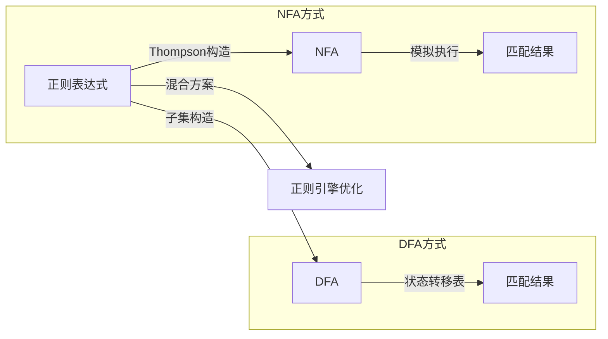
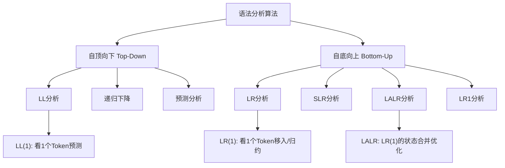
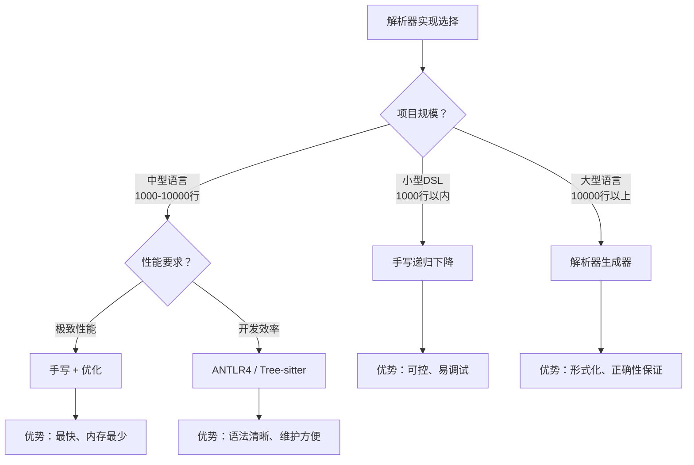

## 核心技巧

词法分析与语法分析是编译器前端的核心环节——词法分析器（Lexer）将源代码字符流转化为记号（Token）序列，语法分析器（Parser）则将Token序列组织成语法树。掌握这两阶段的核心技巧，不仅能帮助你构建编译器和解释器，还能应用于DSL设计、代码高亮、静态分析、代码格式化等广泛场景。本节从实际工程角度出发，系统讲解词法与语法分析中最实用、最高频的核心技巧。

---

### 1. 词法分析核心技巧

#### 1.1 正则表达式模式设计

词法分析的本质是对源代码进行**正则匹配**。每个Token类型对应一条正则规则，设计高效的正则模式是词法分析的第一项核心技巧。

**原则一：具体规则优先于通用规则**

在定义Token时，把更具体的模式放在更通用的模式之前。例如，关键字 `if` 和标识符 `id` 的区别在于——`if` 是一个固定的字符串，而标识符是字母开头的任意序列。如果先匹配标识符，关键字就永远不会被识别为关键字。

# 正确顺序：关键字在前
KEYWORD_IF  → if
IDENTIFIER  → [a-zA-Z_][a-zA-Z0-9_]*

# 错误顺序：标识符在前，if会被错误匹配为IDENTIFIER
IDENTIFIER  → [a-zA-Z_][a-zA-Z0-9_]*
KEYWORD_IF  → if  # 永远不会被匹配到

**原则二：贪婪匹配与非贪婪匹配的选择**

词法分析中绝大多数情况使用贪婪匹配（默认），因为一个Token应该尽可能长。唯一的例外是**字符串字面量**和**注释**——它们有明确的终止符，需要精确匹配到终止符为止。

| 匹配场景 | 匹配策略 | 示例 |
|---------|---------|------|
| 标识符 | 贪婪 | `myVar2` 整体匹配，不会只匹配 `myVar` |
| 数字 | 贪婪 | `3.14159` 整体匹配 |
| 字符串 | 到终止符 | `"hello"` 匹配从 `"` 到下一个 `"` |
| 注释 | 到终止符 | `/* ... */` 匹配到 `*/` |
| 运算符 | 最长匹配 | `<<` 优于 `<`，`=` 优于 `==`（需特别设计） |

**原则三：处理嵌套结构的技巧**

注释和字符串中的转义字符是词法分析的经典难点。对于C风格的块注释 `/* ... */`，关键问题是：如何处理嵌套的 `/* ... */`？

```python
# Python实现：手动处理嵌套注释的有限状态机
def tokenize_block_comment(source, pos):
    """解析 /* ... */ 风格的块注释，处理嵌套"""
    depth = 0
    start = pos
    while pos < len(source):
        if source[pos:pos+2] == '/*':
            depth += 1
            pos += 2
        elif source[pos:pos+2] == '*/':
            depth -= 1
            pos += 2
            if depth == 0:
                return Token('BLOCK_COMMENT', source[start:pos]), pos
        else:
            pos += 1
    raise LexicalError(f"未闭合的块注释，起始于位置 {start}")
```

> **工程经验**：大多数语言（C、Java、Go）的块注释**不允许嵌套**，即第一个 `*/` 就结束注释。但一些语言（如D语言、Swift）允许嵌套。设计语言时应明确选择策略，实现时严格按照规范处理。

#### 1.2 有限自动机的工程实现

NFA（非确定性有限自动机）和DFA（确定性有限自动机）是正则表达式的底层实现机制。理解它们在工程中的权衡至关重要：



| 特性 | NFA方式 | DFA方式 | 混合方案 |
|------|---------|---------|----------|
| 构造时间 | O(m) | O(2^m) 最坏 | 中等 |
| 匹配时间 | O(n×m) | O(n) | O(n) 均摊 |
| 内存占用 | 低 | 高（状态爆炸） | 可控 |
| 回溯能力 | 支持 | 不支持 | 部分支持 |
| 捕获组 | 原生支持 | 需额外处理 | 支持 |
| 适用场景 | 复杂模式 | 高性能扫描 | 生产级词法器 |

> 其中 m 是正则表达式的长度，n 是输入字符串的长度。

**工程选择建议**：

- **手写词法分析器**：对于简单的语言或嵌入式场景，用手工编码的NFA状态机即可，内存小、速度快、易于调试
- **词法生成器**：Lex/Flex等工具在编译时生成DFA，适合标准的正则匹配需求
- **正则引擎**：RE2等库提供线性时间保证且无回溯，适合生产环境

#### 1.3 关键字与标识符的区分策略

几乎所有编程语言都面临一个共同问题：关键字（如 `if`、`while`、`return`）和用户自定义标识符使用相同的字符集。以下是三种常见的区分策略：

**策略一：符号表查询法（最常用）**

在词法分析阶段，所有字母开头的序列统一识别为标识符Token，然后在语义分析阶段通过查询符号表来判断是否为关键字。

源代码: if x < 10 then return x
词法分析后: [IDENTIFIER("if"), IDENTIFIER("x"), ...]
语义分析时: IDENTIFIER("if") → 查表 → KEYWORD_IF

**策略二：词法分析阶段直接区分**

在词法分析器内部维护一个关键字哈希表，匹配到标识符后立即查询。这是Lex/Flex的标准做法，通过**最长匹配+哈希查找**实现。

```c
// Flex中的关键字处理模式
%%
[a-zA-Z_][a-zA-Z0-9_]* {
    struct keyword *kw = lookup_keyword(yytext);
    if (kw) return kw->token_type;  // 返回关键字类型
    yylval.identifier = strdup(yytext);
    return IDENTIFIER;
}
```

**策略三：前缀树（Trie）匹配**

对于关键字数量极大的语言，可以用Trie树在O(k)时间（k为关键字长度）内完成查找，且天然支持前缀匹配和模糊匹配。

```python
class KeywordTrie:
    """关键字Trie树：同时支持精确匹配和最长前缀匹配"""

    def __init__(self):
        self.root = {}
        self.is_keyword_end = False

    def insert(self, word):
        node = self.root
        for ch in word:
            if ch not in node:
                node[ch] = {}
            node = node[ch]
        node['$'] = True  # 标记关键字结尾

    def match(self, text):
        """返回最长匹配的关键字，无匹配返回None"""
        node = self.root
        last_match = None
        last_match_len = 0
        for i, ch in enumerate(text):
            if ch not in node:
                break
            node = node[ch]
            if node.get('$'):
                last_match = text[:i+1]
                last_match_len = i + 1
        return last_match

# 使用示例
trie = KeywordTrie()
for kw in ['if', 'else', 'elif', 'for', 'foreach', 'function', 'fn']:
    trie.insert(kw)

print(trie.match('foreach'))  # → "foreach"
print(trie.match('fi'))       # → None（不是关键字）
```

#### 1.4 Token设计的最佳实践

Token的设计质量直接影响后续解析的便利性。以下是经过工程验证的Token设计原则：

**记录位置信息**

每个Token必须携带源文件位置信息，用于错误报告和调试：

```python
from dataclasses import dataclass
from typing import Optional

@dataclass
class TokenPosition:
    """源码位置信息"""
    file: str           # 文件名
    line: int           # 行号（从1开始）
    column: int         # 列号（从1开始）
    offset: int         # 在源文件中的字节偏移量

    def __str__(self):
        return f"{self.file}:{self.line}:{self.column}"

@dataclass
class Token:
    """Token数据结构"""
    type: str           # Token类型，如 'NUMBER', 'IDENTIFIER'
    value: str          # 原始文本值
    pos: TokenPosition  # 源码位置

    # 可选的语义信息
    numeric_value: Optional[float] = None   # 数字的实际值
    literal_type: Optional[str] = None      # 字面量类型（int/float/hex等）
```

**区分同形异义词**

某些字符串在不同上下文中含义不同，需要在词法或语法层面进行区分：

| 同形异义词 | 上下文1 | 上下文2 | 处理方式 |
|-----------|---------|---------|---------|
| `0x1A` | 十六进制数 | — | 词法分析识别前缀 |
| `<` | 小于运算符 | 泛型左尖括号 | 语法分析根据上下文 |
| `{` | 代码块开始 | 字典/集合字面量 | 语法分析根据上下文 |
| `//` | 整除运算符 | 单行注释 | 词法分析根据位置 |
| `@` | 装饰器 | 字符串插值起始 | 词法分析根据后续字符 |

---

### 2. 语法分析核心技巧

#### 2.1 递归下降分析法

递归下降（Recursive Descent）是最直观、最易于手工实现的语法分析方法。每个语法产生式对应一个解析函数，函数内部通过调用其他解析函数来匹配子规则。

**核心模式：预测分析**

递归下降的关键是根据当前Token**预测**应该走哪个分支：

```python
class Parser:
    """表达式解析器：递归下降实现"""

    def __init__(self, tokens):
        self.tokens = tokens
        self.pos = 0

    def current(self):
        """查看当前Token"""
        if self.pos < len(self.tokens):
            return self.tokens[self.pos]
        return Token('EOF', '', None)

    def eat(self, expected_type):
        """消费一个Token，类型不匹配则报错"""
        tok = self.current()
        if tok.type != expected_type:
            raise SyntaxError(
                f"期望 {expected_type}，但遇到 {tok.type}('{tok.value}')"
                f"，位置 {tok.pos}"
            )
        self.pos += 1
        return tok

    def parse_expression(self):
        """expression → term (('+' | '-') term)*"""
        left = self.parse_term()
        while self.current().value in ('+', '-'):
            op = self.eat('OPERATOR')
            right = self.parse_term()
            left = BinaryOp(op.value, left, right)
        return left

    def parse_term(self):
        """term → factor (('*' | '/') factor)*"""
        left = self.parse_factor()
        while self.current().value in ('*', '/'):
            op = self.eat('OPERATOR')
            right = self.parse_factor()
            left = BinaryOp(op.value, left, right)
        return left

    def parse_factor(self):
        """factor → NUMBER | IDENTIFIER | '(' expression ')'"""
        tok = self.current()
        if tok.type == 'NUMBER':
            self.pos += 1
            return NumberLiteral(tok.numeric_value)
        elif tok.type == 'IDENTIFIER':
            self.pos += 1
            return Identifier(tok.value)
        elif tok.type == 'LPAREN':
            self.eat('LPAREN')
            expr = self.parse_expression()
            self.eat('RPAREN')
            return expr
        else:
            raise SyntaxError(
                f"意外的Token {tok.type}('{tok.value}')，位置 {tok.pos}"
            )
```

**递归下降的核心优势**：

1. **可读性强**：解析函数直接对应语法产生式，一目了然
2. **易于调试**：可以精确追踪解析流程
3. **错误信息友好**：可以在每个函数中生成上下文相关的错误信息
4. **灵活性高**：可以方便地插入语义动作

**处理左递归的技巧**

直接左递归会导致递归下降无限循环。常见解决方案是将左递归改写为循环：

```python
# 左递归形式（无法直接实现）：
# expr → expr '+' term | term

# 改写为循环形式：
def parse_expr(self):
    left = self.parse_term()            # 先解析第一个term
    while self.current().value == '+':   # 循环处理后续的 '+' term
        self.eat('PLUS')
        right = self.parse_term()
        left = BinaryOp('+', left, right)
    return left
```

#### 2.2 LL分析与LR分析

LL和LR是两大类形式化分析算法，各有优劣：



| 分析方法 | 方向 | 核心思想 | 工具支持 | 适用场景 |
|---------|------|---------|---------|---------|
| LL(1) | 自顶向下 | 从起始符号开始推导 | ANTLR4 (LL(\*)) | 语法清晰的语言 |
| LL(k) | 自顶向下 | 看k个Token做预测 | ANTLR4 | 需要更多前瞻的语法 |
| LR(0) | 自底向上 | 移入-归约，无前瞻 | — | 极简单的语法 |
| SLR(1) | 自底向上 | 用Follow集简化LR(0) | — | 简单语法 |
| LALR(1) | 自底向上 | 合并LR(1)等价状态 | Yacc/Bison | 工业界标准 |
| LR(1) | 自底向上 | 完整的向前看符号 | — | 无歧义的复杂语法 |
| GLR | 自底向上 | 多个状态并行探索 | — | 有歧义或二义语法 |

**工程选择指南**：

- **初学者/小项目**：递归下降 + Pratt解析（下文详述），手写即可
- **中型DSL**：ANTLR4（LL(\*)模式），语法定义清晰，支持多语言目标
- **大型通用语言**：LALR(1)（Bison/GCC）或GLR（解析二义语法）
- **现代工具链**：Tree-sitter（增量解析），适合IDE和编辑器

#### 2.3 Pratt解析技术

Pratt解析（又称"运算符优先级解析"、"Top-Down Operator Precedence"）是处理表达式解析最优雅的技术之一。它特别适合处理**运算符优先级和结合性**，远比手写递归下降中的多层嵌套函数更清晰。

**核心思想**：每种Token类型关联两个函数——**空位解析函数（nud）**和**左操作数解析函数（led）**，以及一个**优先级值**。

```python
class PrattParser:
    """Pratt解析器：优雅地处理运算符优先级"""

    def __init__(self, tokens):
        self.tokens = tokens
        self.pos = 0

    def current(self):
        if self.pos < len(self.tokens):
            return self.tokens[self.pos]
        return Token('EOF', '', None)

    def parse(self, precedence=0):
        """主解析入口"""
        # 1. 获取前缀规则（nud）
        tok = self.current()
        self.pos += 1

        if tok.type == 'NUMBER':
            left = NumberLiteral(tok.numeric_value)
        elif tok.type == 'IDENTIFIER':
            left = Identifier(tok.value)
        elif tok.type == 'LPAREN':
            left = self.parse()  # 括号重置优先级
            self.expect('RPAREN')
        else:
            raise SyntaxError(f"意外的Token: {tok}")

        # 2. 循环处理中缀/后缀规则（led）
        while self.get_precedence(self.current()) > precedence:
            tok = self.current()
            self.pos += 1
            left = self.parse_led(left, tok)

        return left

    def parse_led(self, left, op_token):
        """中缀运算符的led函数"""
        right_prec = self.get_precedence(op_token)
        if op_token.value in ('=', '+=', '-='):  # 右结合
            right = self.parse(right_prec - 1)
        else:  # 左结合
            right = self.parse(right_prec)
        return BinaryOp(op_token.value, left, right)

    def get_precedence(self, tok):
        """获取Token的绑定强度（优先级）"""
        precedences = {
            '||': 1, '&amp;&amp;': 2,
            '|': 3, '^': 4, '&amp;': 5,
            '==': 6, '!=': 6, '<': 7, '>': 7, '<=': 7, '>=': 7,
            '<<': 8, '>>': 8,
            '+': 9, '-': 9,
            '*': 10, '/': 10, '%': 10,
            '**': 12,  # 右结合的幂运算
        }
        return precedences.get(tok.value, 0)
```

**Pratt解析与传统递归下降的对比**：

| 特性 | 传统递归下降 | Pratt解析 |
|------|------------|----------|
| 运算符优先级 | 需要为每个优先级写一个函数 | 用数字优先级表统一处理 |
| 新增运算符 | 添加一个新函数 + 修改调用链 | 添加一行优先级定义 |
| 结合性 | 需要分别处理左右结合 | left-prec vs right-prec微调 |
| 可读性 | 产生式对应函数，直观 | 需要理解nud/led概念 |
| 适用范围 | 通用语法分析 | 专注于表达式解析 |

> **实践建议**：递归下降处理语句级语法（if/while/for），Pratt解析处理表达式级语法（算术、比较、逻辑运算）。两者组合是最高效的方案。

#### 2.4 消除左递归与提取公共前缀

在定义文法时，两个最常见的问题需要特别处理：

**消除直接左递归**

# 左递归（递归下降会无限循环）：
expr → expr '+' term | term

# 消除后：
expr → term expr'
expr' → '+' term expr' | ε

**提取公共前缀**

当多个产生式有相同前缀时，提取公共前缀以避免回溯：

# 有公共前缀（递归下降效率低）：
stmt → IDENTIFIER '=' expr
     | IDENTIFIER '(' arg_list ')'
     | IDENTIFIER '++'
     | IDENTIFIER '--'

# 提取公共前缀后：
stmt → IDENTIFIER stmt_suffix
stmt_suffix → '=' expr
            | '(' arg_list ')'
            | '++'
            | '--'

```python
def parse_stmt(self):
    """提取公共前缀后的解析函数"""
    if self.current().type == 'IDENTIFIER':
        name_tok = self.eat('IDENTIFIER')
        name = Identifier(name_tok.value)

        tok_type = self.current().type
        if tok_type == 'ASSIGN':            # 变量赋值
            self.eat('ASSIGN')
            value = self.parse_expression()
            return Assignment(name, value)
        elif tok_type == 'LPAREN':          # 函数调用
            self.eat('LPAREN')
            args = self.parse_arg_list()
            self.eat('RPAREN')
            return FunctionCall(name, args)
        elif self.current().value == '++':  # 自增
            self.eat('OPERATOR')
            return UnaryOp('++', name)
        elif self.current().value == '--':  # 自减
            self.eat('OPERATOR')
            return UnaryOp('--', name)
        else:
            raise SyntaxError(f"标识符后期望 =, (, ++ 或 --，"
                             f"但遇到 {self.current()}")
    # ... 其他语句类型
```

#### 2.5 消除回溯

朴素的递归下降可能在同一个输入位置重复尝试多条规则，导致指数级的时间复杂度。消除回溯是递归下降实用化的关键：

**LL(1)文法条件**

对于每个非终结符，各产生式的First集互不相交，则可以无需回溯地进行预测分析：

```python
def parse_type(self):
    """消除回溯的类型解析：根据当前Token精确预测"""
    tok = self.current()

    if tok.type == 'KEYWORD':
        if tok.value == 'int':    self.eat('KEYWORD'); return IntType()
        elif tok.value == 'float': self.eat('KEYWORD'); return FloatType()
        elif tok.value == 'bool':  self.eat('KEYWORD'); return BoolType()
        elif tok.value == 'void':  self.eat('KEYWORD'); return VoidType()
        elif tok.value == 'string':self.eat('KEYWORD'); return StringType()

    elif tok.type == 'IDENTIFIER':
        # 用户自定义类型名
        self.eat('IDENTIFIER')
        return CustomType(tok.value)

    elif tok.value == '[':
        # 数组类型
        self.eat('LBRACKET')
        self.eat('RBRACKET')
        element_type = self.parse_type()
        return ArrayType(element_type)

    raise SyntaxError(f"期望类型名，遇到 {tok}")
```

**当文法不是LL(1)时**：使用**前瞻（Lookahead）**或多字符检测来区分。ANTLR4默认支持任意长度的前瞻（LL(\*)），是处理复杂语法的利器。

---

### 3. 错误处理与恢复

#### 3.1 错误信息的黄金标准

高质量的错误信息是语言可用性的基础。一个优秀的错误信息应该包含：

1. **错误类型**：清楚说明发生了什么错误
2. **位置信息**：精确到行号和列号
3. **上下文**：显示出错位置附近的源代码片段
4. **期望值**：告诉用户当时期望什么
5. **修复建议**：尽可能给出具体的修复方向

# 差的错误信息：
Error: parse error

# 好的错误信息：
error[E003]: 期望分号，但遇到 '}'
  --> main.c:15:5
   |
14 |     int x = 42
   |              ^ 这里缺少分号
15 | }
   | ^ 意外的闭合花括号
   |
   = 帮助：每条语句以分号结尾。是否要在这里插入 ';'？

#### 3.2 词法错误恢复

词法错误通常比较局部——一个非法字符不会影响后续Token的解析：

```python
def tokenize_with_recovery(source):
    """带错误恢复的词法分析"""
    tokens = []
    pos = 0
    errors = []

    while pos < len(source):
        matched = False
        for pattern, token_type in LEXER_RULES:
            m = re.match(pattern, source[pos:])
            if m:
                tokens.append(Token(token_type, m.group(), pos))
                pos += m.end()
                matched = True
                break

        if not matched:
            # 记录错误并跳过一个字符，继续分析
            errors.append(
                LexError(f"非法字符 '{source[pos]}'", pos)
            )
            pos += 1  # 跳过非法字符

    return tokens, errors
```

**常见词法错误类型与恢复策略**：

| 错误类型 | 示例 | 恢复策略 |
|---------|------|---------|
| 非法字符 | `@#$` | 跳过非法字符，报告错误 |
| 未闭合字符串 | `"hello` | 扫描到行尾或下一个引号 |
| 未闭合注释 | `/* ...` | 扫描到文件末尾，报告错误 |
| 非法数字格式 | `0xZG` | 尽量匹配有效前缀，跳过非法部分 |
| 非法转义序列 | `\q` | 视为普通字符或报错 |

#### 3.3 语法错误恢复策略

语法错误的恢复远比词法错误复杂，因为一个语法错误可能导致后续所有Token都被误判。以下是四种经典恢复策略：

**策略一：恐慌模式（Panic Mode）**

遇到错误时，跳过Token直到遇到一个"同步Token"（通常是分号、`}`、`end`等语句终止符），然后恢复解析。这是最简单、最可靠的策略。

```python
class PanicModeRecovery:
    """恐慌模式错误恢复"""

    SYNC_TOKENS = {'SEMICOLON', 'RBRACE', 'RBRACKET', 'END', 'NEWLINE'}

    def parse_statement_list(self):
        stmts = []
        while self.current().type != 'EOF':
            try:
                stmt = self.parse_statement()
                stmts.append(stmt)
            except SyntaxError as e:
                self.report_error(e)
                # 恐慌模式：跳过到同步Token
                self.skip_to_sync()
        return stmts

    def skip_to_sync(self):
        """跳过Token直到遇到同步Token"""
        while self.current().type not in self.SYNC_TOKENS:
            self.pos += 1
            if self.current().type == 'EOF':
                break
        # 消费同步Token（如果是分号等）
        if self.current().type == 'SEMICOLON':
            self.pos += 1
```

**策略二：错误产生式（Error Productions）**

在语法定义中显式添加处理错误的产生式，让解析器能匹配常见的错误模式并生成带错误节点的AST：

# 正常产生式
assignment → IDENTIFIER '=' expression ';'

# 添加错误产生式
assignment → IDENTIFIER '=' expression    # 缺少分号
           | IDENTIFIER  expression '='   # 赋值顺序错误
           | '=' expression ';'            # 缺少变量名

**策略三：局部修补（Phrase-Level Recovery）**

在遇到错误时，尝试在当前位置插入、删除或替换一个Token，然后检查是否能继续解析：

```python
def try_local_repair(self):
    """尝试局部修补：插入缺失的Token"""
    # 尝试1：插入分号
    saved_pos = self.pos
    self.tokens.insert(self.pos, Token('SEMICOLON', ';', self.current().pos))
    try:
        result = self.parse_statement()
        self.report_warning("可能缺少分号，在此位置自动插入")
        return result
    except SyntaxError:
        self.pos = saved_pos
        self.tokens.pop(self.pos)  # 回退插入的分号

    # 尝试2：插入右括号
    # ... 类似逻辑

    raise SyntaxError("无法自动恢复，请手动修复")
```

**策略四：错误合并（Error Merging）**

将错误信息累积起来，在解析结束后统一报告所有错误。这对用户体验非常重要——不要遇到第一个错误就停止。

```python
class MultiErrorParser:
    """多错误收集解析器"""

    def __init__(self, tokens):
        self.tokens = tokens
        self.pos = 0
        self.errors = []  # 收集所有错误

    def report_error(self, error):
        """记录错误但不中断解析"""
        self.errors.append(error)

    def expect(self, token_type):
        """尝试匹配Token，失败则记录错误并尝试恢复"""
        if self.current().type != token_type:
            self.report_error(
                SyntaxError(f"期望 {token_type}，遇到 {self.current().type}")
            )
            # 不跳过Token，让调用者决定如何恢复
            return None
        tok = self.current()
        self.pos += 1
        return tok

    def parse_all(self):
        """解析整个源文件，收集所有错误"""
        tree = self.parse_program()
        if self.errors:
            print(f"解析完成，发现 {len(self.errors)} 个错误：")
            for i, err in enumerate(self.errors, 1):
                print(f"  {i}. {err}")
        return tree
```

#### 3.4 错误恢复策略对比

| 策略 | 复杂度 | 错误信息质量 | 实现难度 | 推荐场景 |
|------|--------|------------|---------|---------|
| 恐慌模式 | 低 | 一般 | 简单 | 快速原型、简单DSL |
| 错误产生式 | 中 | 好 | 中等 | 正式语言规范 |
| 局部修补 | 高 | 优秀 | 困难 | 编辑器智能提示 |
| 错误合并 | 中 | 好 | 中等 | IDE、构建工具 |

---

### 4. 性能优化技巧

#### 4.1 解析器生成器 vs 手写解析器

选择解析器生成器还是手写解析器，需要根据具体场景权衡：



**手写解析器的优化技巧**：

```python
# 技巧1：Token类型用整数枚举代替字符串比较
from enum import IntEnum

class TokenType(IntEnum):
    NUMBER = 0
    IDENTIFIER = 1
    PLUS = 2
    MINUS = 3
    STAR = 4
    SLASH = 5
    LPAREN = 6
    RPAREN = 7
    # ... 整数比较比字符串快10倍以上

# 技巧2：预计算的Token查找表
# 将关键字映射表构建一次，后续O(1)查找
KEYWORD_TABLE = frozenset({
    'if', 'else', 'while', 'for', 'return',
    'int', 'float', 'string', 'bool',
    'class', 'function', 'var', 'let', 'const',
})

# 技巧3：字符分类用查找表代替多重判断
# 初始化时构建256字节的分类表
char_type = [0] * 256
for c in range(ord('a'), ord('z') + 1):
    char_type[c] = CHAR_LETTER
for c in range(ord('A'), ord('Z') + 1):
    char_type[c] = CHAR_LETTER
for c in range(ord('0'), ord('9') + 1):
    char_type[c] = CHAR_DIGIT
char_type[ord('_')] = CHAR_LETTER
char_type[ord(' ')] = CHAR_WHITESPACE
char_type[ord('\n')] = CHAR_NEWLINE
# ... 后续扫描只需一次查表
```

#### 4.2 Packrat解析与记忆化

Packrat解析是一种**记忆化递归下降**技术，保证在线性时间内完成解析。其核心思想是：缓存每个位置上每个非终结符的解析结果。

```python
class PackratParser:
    """Packrat解析器：通过记忆化消除指数级回溯"""

    def __init__(self, tokens):
        self.tokens = tokens
        self.pos = 0
        # 记忆化缓存：(位置, 非终结符) → (结果, 新位置)
        self.cache = {}

    def parse_with_memo(self, rule_name, pos):
        """带记忆化的规则调用"""
        key = (pos, rule_name)
        if key in self.cache:
            return self.cache[key]

        saved_pos = self.pos
        self.pos = pos

        try:
            # 调用对应的解析方法
            rule_method = getattr(self, f'parse_{rule_name}')
            result = rule_method()
            self.cache[key] = (result, self.pos)
        except SyntaxError:
            self.cache[key] = (None, pos)
            result = None
        finally:
            if result is None:
                self.pos = pos  # 回退位置

        return result

    def parse_expr(self):
        return self.parse_with_memo('expr', self.pos)

    def parse_term(self):
        return self.parse_with_memo('term', self.pos)

    # 每个非终结符的结果都被缓存，相同位置不会重复解析
```

**PEG文法与Packrat的结合**：Packrat解析天然支持PEG（Parsing Expression Grammar），ANTLR4的ALL(\*)算法就是基于类似思想的现代演进。

#### 4.3 增量解析

增量解析在编辑器和IDE中至关重要——用户每次按键后，不需要从头重新解析整个文件，只需重新解析受影响的部分：

```python
class IncrementalParser:
    """增量解析器框架：仅重新解析变更区域"""

    def __init__(self):
        self.parse_tree = None
        self.dirty_ranges = []  # 变更区间列表

    def on_edit(self, start, old_length, new_length):
        """文本编辑事件：记录变更区间"""
        self.dirty_ranges.append((start, start + old_length))

    def reparse(self, full_source):
        """增量重新解析"""
        if not self.dirty_ranges:
            return  # 无变更，跳过

        # 找出受影响的AST节点范围
        affected_nodes = self.find_affected_nodes(self.dirty_ranges)

        if not affected_nodes:
            return  # 变更不影响任何AST节点

        # 只重新解析受影响的区域
        for node in affected_nodes:
            # 找到节点对应的源码范围
            src_start = node.source_start
            src_end = node.source_end

            # 重新解析这一段
            new_subtree = self.parse_range(full_source, src_start, src_end)

            # 替换旧节点
            self.replace_node(node, new_subtree)

        self.dirty_ranges.clear()

    def find_affected_nodes(self, ranges):
        """找出被编辑影响的最小AST节点集合"""
        affected = []
        for start, end in ranges:
            node = self.find_innermost_node(start, end)
            if node:
                affected.append(node)
        return self.deduplicate_nodes(affected)
```

> **Tree-sitter**是增量解析的工业级实现，广泛用于VS Code、Atom等编辑器。它基于GLR算法，支持增量解析、错误恢复和100+种语言。

#### 4.4 词法分析的批量优化

在处理大文件或批量文件时，词法分析的性能优化尤为重要：

```python
class FastLexer:
    """高性能词法分析器优化技巧"""

    def __init__(self, source):
        self.source = source
        self.pos = 0
        self.length = len(source)

    def scan_string(self):
        """优化1：预扫描字符串边界"""
        quote = self.source[self.pos]
        start = self.pos + 1
        self.pos = start

        while self.pos < self.length:
            ch = self.source[self.pos]
            if ch == '\\':        # 跳过转义字符
                self.pos += 2
            elif ch == quote:     # 找到字符串结尾
                self.pos += 1
                return Token('STRING', self.source[start:self.pos-1])
            else:
                self.pos += 1

        raise LexicalError("未闭合的字符串")

    def scan_number(self):
        """优化2：内联数字解析，避免正则"""
        start = self.pos
        has_dot = False

        # 处理前缀（0x, 0b, 0o）
        if self.source[self.pos] == '0' and self.pos + 1 < self.length:
            next_ch = self.source[self.pos + 1]
            if next_ch in ('x', 'X'):
                self.pos += 2
                while self.pos < self.length and (
                    '0' <= self.source[self.pos] <= '9' or
                    'a' <= self.source[self.pos].lower() <= 'f'
                ):
                    self.pos += 1
                return Token('HEX_NUMBER', self.source[start:self.pos])
            elif next_ch in ('b', 'B'):
                self.pos += 2
                while self.pos < self.length and self.source[self.pos] in '01':
                    self.pos += 1
                return Token('BIN_NUMBER', self.source[start:self.pos])

        # 十进制/浮点数
        while self.pos < self.length and self.source[self.pos].isdigit():
            self.pos += 1

        if (self.pos < self.length and self.source[self.pos] == '.'
            and self.pos + 1 < self.length
            and self.source[self.pos + 1].isdigit()):
            has_dot = True
            self.pos += 1  # 跳过小数点
            while self.pos < self.length and self.source[self.pos].isdigit():
                self.pos += 1

        # 处理科学记数法
        if (self.pos < self.length
            and self.source[self.pos] in ('e', 'E')):
            self.pos += 1
            if self.pos < self.length and self.source[self.pos] in ('+', '-'):
                self.pos += 1
            while self.pos < self.length and self.source[self.pos].isdigit():
                self.pos += 1

        text = self.source[start:self.pos]
        return Token('FLOAT' if has_dot else 'INT', text)

    def skip_whitespace_and_comments(self):
        """优化3：一次性跳过空白和注释"""
        while self.pos < self.length:
            ch = self.source[self.pos]

            if ch in ' \t\r':
                self.pos += 1
            elif ch == '\n':
                self.pos += 1
            elif ch == '/' and self.pos + 1 < self.length:
                if self.source[self.pos + 1] == '/':
                    # 单行注释：跳到行尾
                    while (self.pos < self.length
                           and self.source[self.pos] != '\n'):
                        self.pos += 1
                elif self.source[self.pos + 1] == '*':
                    # 块注释：跳到 */
                    self.pos += 2
                    while self.pos + 1 < self.length:
                        if (self.source[self.pos] == '*'
                            and self.source[self.pos + 1] == '/'):
                            self.pos += 2
                            break
                        self.pos += 1
                else:
                    break  # 不是注释，停止跳过
            else:
                break  # 不是空白，停止跳过
```

---

### 5. 实用工具与框架

#### 5.1 主流解析工具对比

| 工具 | 类型 | 分析方法 | 语言目标 | 特色 | 适用场景 |
|------|------|---------|---------|------|---------|
| ANTLR4 | 生成器 | LL(\*) | Java/C#/Python/JS等 | 语法直观、支持语义谓词 | 通用语言、DSL |
| Bison/Yacc | 生成器 | LALR(1) | C | 工业级稳定 | C/C++解析器 |
| Tree-sitter | 库 | GLR+增量 | C（多语言绑定） | 增量解析、错误恢复 | 编辑器、IDE |
| Parsimonious | 库 | PEG | Python | 纯Python、易于嵌入 | Python DSL |
| Lark | 库 | Earley/LALR | Python | 多解析算法、Pythonic | Python项目 |
| pest | 生成器 | PEG | Rust | 类型安全、高性能 | Rust项目 |
|/tree-sitter grammars | 生态 | GLR | 多语言 | 100+语言语法支持 | 代码高亮、分析 |

#### 5.2 ANTLR4实战示例

ANTLR4是目前最流行的解析器生成器之一，以下是构建一个简单配置语言的完整示例：

**语法定义文件**（`Config.g4`）：

grammar Config;

// 语法规则
config      : entry* EOF ;
entry       : key '=' value NEWLINE ;
key         : IDENTIFIER ('.' IDENTIFIER)* ;
value       : STRING | NUMBER | BOOLEAN | list ;
list        : '[' (value (',' value)*)? ']' ;
BOOLEAN     : 'true' | 'false' ;

// 词法规则
IDENTIFIER  : [a-zA-Z_][a-zA-Z0-9_]* ;
STRING      : '"' (~["\\\r\n] | '\\' .)* '"' ;
NUMBER      : '-'? [0-9]+ ('.' [0-9]+)? ;
NEWLINE     : '\r'? '\n' ;
WS          : [ \t]+ -> skip ;
COMMENT     : '#' ~[\r\n]* -> skip ;

**Python使用方式**：

```python
from antlr4 import CommonTokenStream, FileStream
from antlr4.error.ErrorListener import ErrorListener
from ConfigLexer import ConfigLexer
from ConfigParser import ConfigParser

class ConfigErrorListener(ErrorListener):
    """自定义错误监听器：收集所有错误"""
    def __init__(self):
        self.errors = []

    def syntaxError(self, recognizer, offendingSymbol,
                    line, column, msg, e):
        self.errors.append(
            f"行 {line}:{column} - {msg}"
        )

# 解析流程
input_stream = FileStream("config.ini")
lexer = ConfigLexer(input_stream)
lexer.removeErrorListeners()
error_listener = ConfigErrorListener()
lexer.addErrorListener(error_listener)

token_stream = CommonTokenStream(lexer)
parser = ConfigParser(token_stream)
parser.removeErrorListeners()
parser.addErrorListener(error_listener)

tree = parser.config()

if error_listener.errors:
    print(f"发现 {len(error_listener.errors)} 个解析错误：")
    for err in error_listener.errors:
        print(f"  {err}")
else:
    print("解析成功")
```

#### 5.3 Tree-sitter增量解析

Tree-sitter的核心优势在于增量解析和强大的错误恢复能力：

```python
# Tree-sitter使用示例
import tree_sitter_python as tspython
from tree_sitter import Language, Parser

PY_LANGUAGE = Language(tspython.language())

parser = Parser(PY_LANGUAGE)

# 初始解析
source = b"""
def fibonacci(n):
    if n <= 1:
        return n
    return fibonacci(n - 1) + fibonacci(n - 2)
"""
tree = parser.parse(source)

# 查看语法树
root = tree.root_node
print(f"根节点类型: {root.type}")        # → "module"
print(f"子节点数: {root.child_count}")    # → 1
print(f"是否出错: {root.has_error}")      # → False

# 修改源码（增量解析）
new_source = source + b"""

def factorial(n):
    if n <= 1:
        return 1
    return n * factorial(n - 1)
"""
tree = parser.parse(new_source, tree)  # 传入旧树实现增量解析

# Tree-sitter的错误恢复：即使语法不完整也能生成部分AST
incomplete = b"def foo(x): return x +"
tree = parser.parse(incomplete)
print(f"是否有错误: {tree.root_node.has_error}")  # → True
# 但仍然能生成可用的部分AST
```

#### 5.4 解析器组合子

解析器组合子（Parser Combinator）是一种函数式编程风格的解析技术，不需要单独的语法文件，直接在宿主语言中组合构建解析器：

```python
from parsy import string, regex, seq, success, fail

# 基础解析器
identifier = regex(r'[a-zA-Z_][a-zA-Z0-9_]*').desc('identifier')
number = regex(r'-?\d+(\.\d+)?').map(float).desc('number')
lparen = string('(')
rparen = string(')')
plus = string('+').result(lambda a, b: a + b)
star = string('*').result(lambda a, b: a * b)

# 组合解析器：表达式解析
def expr_parser():
    """用组合子构建表达式解析器"""
    atom = number | seq(lparen, lambda: expr_parser(), rparen).map(
        lambda parts: parts[1]
    )

    def make_op_parser(op_parser, next_parser):
        def parser():
            return seq(
                next_parser,
                seq(op_parser, next_parser).many()
            ).map(lambda parts: apply_ops(parts[0], parts[1]))
        return parser

    mul_expr = make_op_parser(star, atom)
    add_expr = make_op_parser(plus, mul_expr)
    return add_expr()

# 解析表达式
result = expr_parser().parse("(3 + 4) * 2")
print(result)  # → 14.0
```

**解析器组合子的优劣**：

| 优势 | 劣势 |
|------|------|
| 无需单独的语法文件 | 错误信息不如生成器 |
| 在宿主语言中直接调试 | 性能通常低于手写或生成器 |
| 灵活的组合方式 | 复杂语法定义可能不够直观 |
| 适合快速原型 | 不支持左递归 |

---

### 6. 常见问题与最佳实践

#### 6.1 词法分析常见陷阱

| 陷阱 | 描述 | 解决方案 |
|------|------|---------|
| 关键字前缀冲突 | `function` 和 `func`，如果 `func` 在前则会错误匹配 | 使用最长匹配原则 |
| 十六进制与乘法歧义 | `0x * y` 中 `0x` 是十六进制前缀还是变量名？ | 明确定义：十六进制要求后跟数字 |
| 字符串转义深度 | `"\\\""` 的解析：几个反斜杠、几个引号？ | 明确转义规则，编写单元测试 |
| Unicode处理 | 中文变量名、emoji注释 | 决定是否支持Unicode标识符 |
| 文件编码 | UTF-8 vs GBK | 统一使用UTF-8，在词法器头部检测BOM |

#### 6.2 语法分析常见陷阱

| 陷阱 | 描述 | 解决方案 |
|------|------|---------|
| 悬挂else问题 | `if a then if b then x else y` 的else绑定哪个if？ | 规范化：else绑定最近的未匹配if |
| 贪婪匹配陷阱 | `< =` 还是 `<=`？空格是否影响Token？ | 词法分析阶段统一处理空格 |
| 表达式结合性 | `a - b - c` 是 `(a-b)-c` 还是 `a-(b-c)`？ | 通过Pratt优先级和结合性精确控制 |
| 递归深度溢出 | 嵌套10000层的括号导致栈溢出 | 限制最大嵌套深度或改用迭代实现 |
| 二义文法 | 同一输入可以生成多棵语法树 | 消除二义性或使用GLR |

#### 6.3 综合最佳实践清单

1. **先设计Token类型，再设计语法**——清晰的Token设计能大幅降低语法复杂度
2. **错误恢复与正确解析同等重要**——用户一定会写出有语法错误的代码
3. **写单元测试**——词法和语法分析器的测试用例应覆盖正常输入、边界条件和错误输入
4. **保留源位置信息**——每个AST节点都要能回溯到源码位置
5. **选择合适的工具**——小项目不要引入重型框架，大型语言不要手写全部
6. **区分词法和语法的职责**——空白处理、注释消除属于词法分析；结构关系属于语法分析
7. **性能基准测试**——在优化之前先测量，确保优化是必要的
8. **渐进式开发**——先实现能工作的版本，再逐步优化性能和错误处理

---

### 7. 本节小结

本节系统讲解了词法与语法分析的核心技巧，涵盖以下要点：

- **词法分析**：正则模式设计原则、有限自动机工程实现、关键字识别策略、Token数据结构设计
- **语法分析**：递归下降分析、LL/LR方法对比、Pratt解析技术、左递归消除、回溯消除
- **错误处理**：错误信息设计标准、四种错误恢复策略（恐慌模式、错误产生式、局部修补、错误合并）
- **性能优化**：手写vs生成器选择、Packrat记忆化、增量解析、批量处理
- **工具实战**：ANTLR4、Tree-sitter、解析器组合子的实际应用

掌握这些核心技巧后，你将能够为任何语言或DSL构建高效、健壮的词法与语法分析器。下一节我们将通过实战案例，将这些技巧应用到具体项目中。
