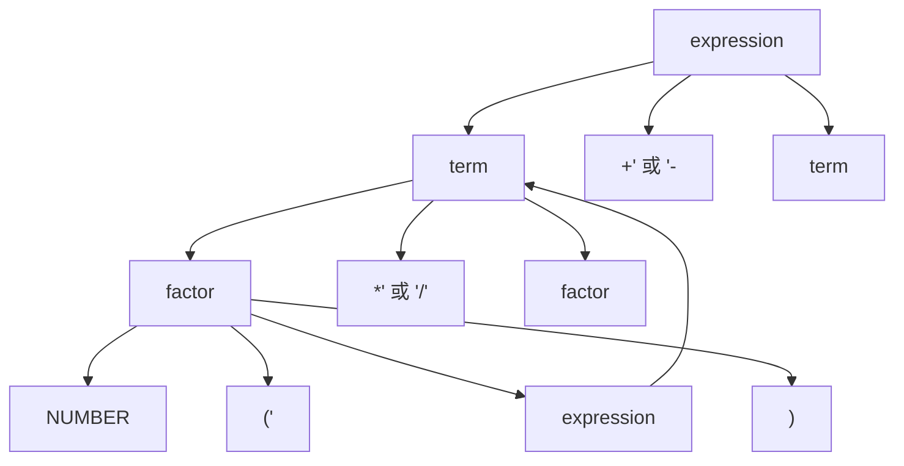
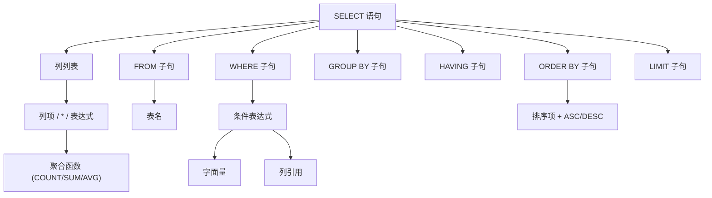
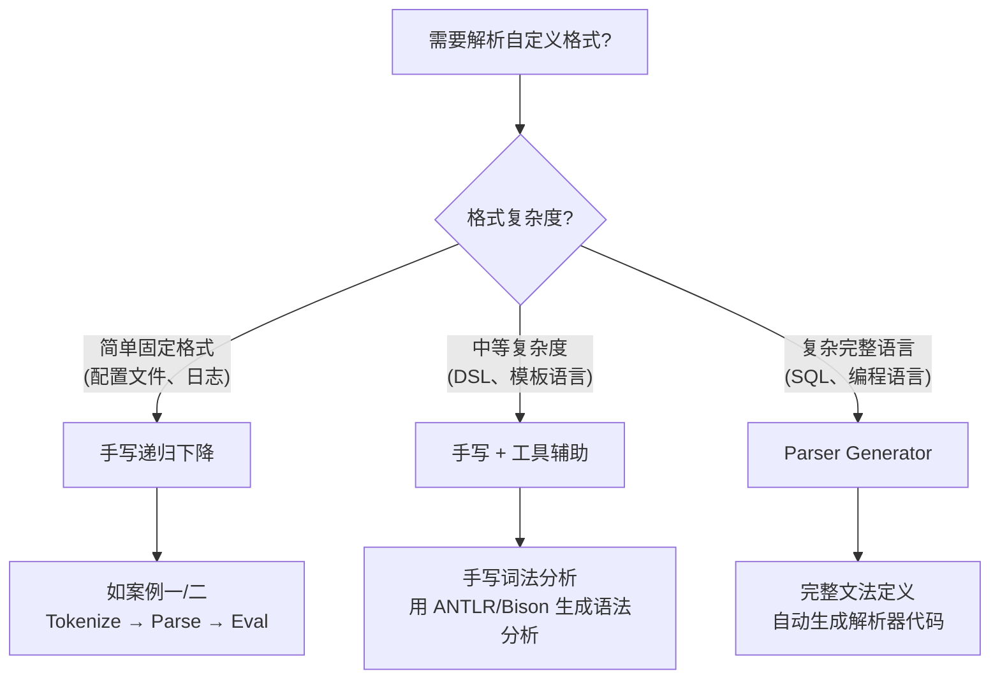

## 实战案例

本节通过三个由浅入深的实战案例，展示词法分析与语法分析技术在真实工程中的应用。每个案例都遵循"需求分析→设计→实现→测试→优化"的完整流程，覆盖表达式求值器、配置文件解析器、SQL子集解析器三种典型场景。

---

### 案例一：数学表达式求值器

表达式求值是编译原理最经典的入门实践，也是理解词法分析与语法分析协作机制的最佳起点。

#### 1.1 需求分析

构建一个支持以下特性的数学表达式求值器：

- 四则运算：加(+)、减(-)、乘(*)、除(/)
- 括号分组：支持任意层级嵌套
- 一元运算符：支持负号（如 `-3 + 5`）
- 浮点数：支持整数和小数（如 `3.14 * 2`）
- 运算符优先级：乘除高于加减

**输入示例**：
(3 + 4) * 2 - 10 / (5 - 3)

**期望输出**：`6.0`

#### 1.2 词法分析设计

首先定义词法单元（Token）类型：

| Token 类型 | 正则表达式 | 示例 |
|-----------|-----------|------|
| NUMBER | `[0-9]+(\.[0-9]+)?` | `3.14`、`42` |
| PLUS | `\+` | `+` |
| MINUS | `-` | `-` |
| MULTIPLY | `\*` | `*` |
| DIVIDE | `/` | `/` |
| LPAREN | `\(` | `(` |
| RPAREN | `\)` | `)` |
| WHITESPACE | `[ \t\r\n]+` | 空格（跳过） |

#### 1.3 语法分析设计

采用递归下降法构建语法分析器。文法定义如下（消除左递归后）：

expression → term (('+' | '-') term)*
term       → factor (('*' | '/') factor)*
factor     → NUMBER | '(' expression ')' | ('+' | '-') factor

这种分层设计天然编码了运算符优先级：`expression` 处理加减（最低优先级），`term` 处理乘除（较高优先级），`factor` 处理原子单元（最高优先级）。



#### 1.4 完整实现（Python）

```python
from enum import Enum, auto
from dataclasses import dataclass
from typing import List, Optional, Union


# ===================== 词法分析器 =====================

class TokenType(Enum):
    """词法单元类型"""
    NUMBER = auto()
    PLUS = auto()
    MINUS = auto()
    MULTIPLY = auto()
    DIVIDE = auto()
    LPAREN = auto()
    RPAREN = auto()
    EOF = auto()


@dataclass
class Token:
    """词法单元"""
    type: TokenType
    value: Union[float, str, None]
    position: int  # 源码中的位置，用于错误报告


class LexerError(Exception):
    """词法分析错误"""
    def __init__(self, message: str, position: int):
        self.position = position
        super().__init__(f"词法错误 (位置 {position}): {message}")


class Lexer:
    """
    词法分析器：将源码字符串转换为 Token 序列。

    设计要点：
    - 单次遍历，时间复杂度 O(n)
    - 位置跟踪，支持精确的错误报告
    - 白空符自动跳过
    """

    # Token 类型到正则模式的映射（按优先级排列）
    TOKEN_PATTERNS = [
        (r'[0-9]+(\.[0-9]+)?', TokenType.NUMBER),
        (r'\+', TokenType.PLUS),
        (r'\-', TokenType.MINUS),
        (r'\*', TokenType.MULTIPLY),
        (r'/', TokenType.DIVIDE),
        (r'\(', TokenType.LPAREN),
        (r'\)', TokenType.RPAREN),
        (r'[ \t\r\n]+', None),  # 白空格，跳过
    ]

    def __init__(self, source: str):
        self.source = source
        self.pos = 0
        self.tokens: List[Token] = []

    def tokenize(self) -> List[Token]:
        """执行词法分析，返回 Token 列表"""
        while self.pos < len(self.source):
            matched = False
            for pattern, token_type in self.TOKEN_PATTERNS:
                match = self._try_match(pattern)
                if match:
                    matched = True
                    if token_type is not None:  # None 表示跳过
                        value = match.group(0)
                        if token_type == TokenType.NUMBER:
                            value = float(value)
                        self.tokens.append(Token(token_type, value, self.pos - len(match.group(0))))
                    break

            if not matched:
                char = self.source[self.pos]
                raise LexerError(f"未识别的字符 '{char}'", self.pos)

        self.tokens.append(Token(TokenType.EOF, None, self.pos))
        return self.tokens

    def _try_match(self, pattern: str):
        """尝试从当前位置匹配指定模式"""
        import re
        match = re.match(pattern, self.source[self.pos:])
        if match:
            self.pos += len(match.group(0))
            return match
        return None


# ===================== 语法分析器 =====================

class ParseError(Exception):
    """语法分析错误"""
    def __init__(self, message: str, token: Token):
        self.token = token
        super().__init__(f"语法错误 (位置 {token.position}): {message}")


class ASTNode:
    """AST 节点基类"""
    pass


@dataclass
class NumberNode(ASTNode):
    """数字字面量节点"""
    value: float

    def __repr__(self):
        return f"Number({self.value})"


@dataclass
class BinaryOpNode(ASTNode):
    """二元运算节点"""
    operator: str
    left: ASTNode
    right: ASTNode

    def __repr__(self):
        return f"({self.left} {self.operator} {self.right})"


@dataclass
class UnaryOpNode(ASTNode):
    """一元运算节点"""
    operator: str
    operand: ASTNode

    def __repr__(self):
        return f"({self.operator}{self.operand})"


class Parser:
    """
    递归下降语法分析器。

    将 Token 序列转换为 AST（抽象语法树）。
    通过文法的层次结构自然地编码运算符优先级。
    """

    def __init__(self, tokens: List[Token]):
        self.tokens = tokens
        self.pos = 0

    def parse(self) -> ASTNode:
        """入口：解析整个表达式"""
        node = self._expression()
        if self.current_token().type != TokenType.EOF:
            raise ParseError(
                f"意外的 Token: {self.current_token().value}",
                self.current_token()
            )
        return node

    def _current_token(self) -> Token:
        return self.tokens[self.pos]

    def _consume(self, expected_type: TokenType) -> Token:
        """消费一个指定类型的 Token"""
        token = self.current_token()
        if token.type != expected_type:
            raise ParseError(
                f"期望 {expected_type.name}，实际得到 {token.type.name}",
                token
            )
        self.pos += 1
        return token

    def _expression(self) -> ASTNode:
        """
        expression → term (('+' | '-') term)*
        处理加法和减法（最低优先级）
        """
        node = self._term()

        while self.current_token().type in (TokenType.PLUS, TokenType.MINUS):
            op_token = self.current_token()
            self.pos += 1
            right = self._term()
            node = BinaryOpNode(op_token.value, node, right)

        return node

    def _term(self) -> ASTNode:
        """
        term → factor (('*' | '/') factor)*
        处理乘法和除法（较高优先级）
        """
        node = self._factor()

        while self.current_token().type in (TokenType.MULTIPLY, TokenType.DIVIDE):
            op_token = self.current_token()
            self.pos += 1
            right = self._factor()
            node = BinaryOpNode(op_token.value, node, right)

        return node

    def _factor(self) -> ASTNode:
        """
        factor → NUMBER | '(' expression ')' | ('+' | '-') factor
        处理原子单元和一元运算符（最高优先级）
        """
        token = self.current_token()

        if token.type == TokenType.NUMBER:
            self.pos += 1
            return NumberNode(token.value)

        if token.type == TokenType.LPAREN:
            self.pos += 1
            node = self._expression()
            self._consume(TokenType.RPAREN)
            return node

        if token.type in (TokenType.PLUS, TokenType.MINUS):
            self.pos += 1
            operand = self._factor()
            return UnaryOpNode(token.value, operand)

        raise ParseError(f"意外的 Token: {token.type.name}", token)


# ===================== 求值器 =====================

class Evaluator:
    """
    AST 求值器：遍历语法树，计算表达式结果。

    采用访问者模式（Visitor Pattern）的简化版本，
    每种节点类型对应一个求值方法。
    """

    def evaluate(self, node: ASTNode) -> float:
        method_name = f"_eval_{type(node).__name__}"
        method = getattr(self, method_name, None)
        if method is None:
            raise RuntimeError(f"未知的 AST 节点类型: {type(node).__name__}")
        return method(node)

    def _eval_NumberNode(self, node: NumberNode) -> float:
        return node.value

    def _eval_BinaryOpNode(self, node: BinaryOpNode) -> float:
        left = self.evaluate(node.left)
        right = self.evaluate(node.right)

        operations = {
            '+': lambda a, b: a + b,
            '-': lambda a, b: a - b,
            '*': lambda a, b: a * b,
            '/': lambda a, b: a / b if b != 0 else (_ for _ in ()).throw(
                ZeroDivisionError("除数不能为零")
            ),
        }

        op_func = operations.get(node.operator)
        if op_func is None:
            raise RuntimeError(f"未知的运算符: {node.operator}")
        return op_func(left, right)

    def _eval_UnaryOpNode(self, node: UnaryOpNode) -> float:
        operand = self.evaluate(node.operand)
        if node.operator == '-':
            return -operand
        return operand  # 一元 '+' 不改变值


# ===================== 集成接口 =====================

def calculate(expression: str) -> float:
    """
    一站式接口：源码 → 词法分析 → 语法分析 → 求值

    完整的数据流展示了编译前端的经典三阶段管线。
    """
    # 阶段1：词法分析（字符流 → Token 流）
    lexer = Lexer(expression)
    tokens = lexer.tokenize()

    # 阶段2：语法分析（Token 流 → AST）
    parser = Parser(tokens)
    ast = parser.parse()

    # 阶段3：求值（AST → 结果）
    evaluator = Evaluator()
    return evaluator.evaluate(ast)


# ===================== 测试套件 =====================

def run_tests():
    """验证表达式求值器的正确性"""
    test_cases = [
        ("基本加法", "3 + 5", 8.0),
        ("基本减法", "10 - 3", 7.0),
        ("基本乘法", "4 * 5", 20.0),
        ("基本除法", "10 / 3", 10 / 3),
        ("运算符优先级", "2 + 3 * 4", 14.0),
        ("括号分组", "(2 + 3) * 4", 20.0),
        ("嵌套括号", "((2 + 3) * (4 - 1))", 15.0),
        ("一元负号", "-3 + 5", 2.0),
        ("浮点数运算", "3.14 * 2", 6.28),
        ("复杂表达式", "(3 + 4) * 2 - 10 / (5 - 3)", 6.0),
        ("多重优先级", "1 + 2 * 3 - 4 / 2", 5.0),
        ("一元正号", "+5 * 2", 10.0),
    ]

    passed = 0
    failed = 0

    for name, expr, expected in test_cases:
        try:
            result = calculate(expr)
            if abs(result - expected) < 1e-9:
                print(f"  [PASS] {name}: {expr} = {result}")
                passed += 1
            else:
                print(f"  [FAIL] {name}: {expr} = {result}, 期望 {expected}")
                failed += 1
        except Exception as e:
            print(f"  [ERROR] {name}: {expr} -> {e}")
            failed += 1

    # 边界情况测试
    print("\n边界情况测试:")
    edge_cases = [
        ("除以零", "1 / 0"),
        ("非法字符", "3 + @"),
        ("未闭合括号", "(3 + 4"),
        ("多余右括号", "3 + 4)"),
    ]

    for name, expr in edge_cases:
        try:
            result = calculate(expr)
            print(f"  [FAIL] {name}: {expr} = {result} (应抛出异常)")
            failed += 1
        except (LexerError, ParseError, ZeroDivisionError) as e:
            print(f"  [PASS] {name}: {expr} -> {type(e).__name__}")
            passed += 1

    print(f"\n总计: {passed} 通过, {failed} 失败")
    return failed == 0


if __name__ == "__main__":
    print("=" * 50)
    print("数学表达式求值器 - 测试")
    print("=" * 50)
    run_tests()

    # 交互式演示
    print("\n" + "=" * 50)
    print("交互式演示")
    print("=" * 50)
    demo_expressions = [
        "2 + 3 * 4",
        "(2 + 3) * 4",
        "-3 + 5 * (2 - 1)",
    ]
    for expr in demo_expressions:
        result = calculate(expr)
        print(f"  {expr} = {result}")
```

#### 1.5 关键设计决策与权衡

| 决策点 | 选择 | 理由 | 替代方案 |
|-------|------|------|---------|
| 词法分析实现 | 手写正则匹配 | 轻量、可控、易于调试 | lex/flex 自动生成 |
| 语法分析策略 | 递归下降 | 直觉性好、易维护 | LR(1) 自动生成 |
| AST 表示 | dataclass 节点 | 类型清晰、序列化友好 | 字典/元组表示 |
| 求值方式 | 访问者模式 | 扩展性好、职责分离 | 直接在 AST 节点上求值 |

**常见陷阱与规避**：

1. **左递归导致栈溢出**：原始文法 `expression → expression '+' term` 会无限递归，必须转换为右递归形式
2. **运算符优先级编码错误**：忘记分层会导致 `2+3*4` 被错误计算为 `20`
3. **浮点数精度问题**：直接比较浮点数结果会失败，必须使用误差范围比较
4. **错误恢复不足**：单个错误就终止分析，用户体验差；生产环境应加入 panic-mode 恢复

---

### 案例二：INI 配置文件解析器

INI 格式虽然简单，但涉及注释处理、节（section）作用域、键值对解析等真实工程问题，是练习词法分析与语法分析协作的绝佳素材。

#### 2.1 需求分析

目标：解析标准 INI 格式配置文件，支持以下语法结构：

```ini
; 这是全局注释
[database]              ; 节名
host = 127.0.0.1       ; 键值对
port = 3306
name = mydb

[server]
host = 0.0.0.0
port = 8080
debug = true            ; 布尔值
workers = 4             ; 整数
timeout = 30.5          ; 浮点数

; 空节和特殊字符
[logging]
format = "%(asctime)s - %(message)s"
log_file = /var/log/app.log

[defaults]
; 默认值节
level = info
```

**INI 语法规则**：

file        → (comment | section | blank_line)*
section     → '[' IDENTIFIER ']' (comment | kv_pair)*
kv_pair     → IDENTIFIER '=' VALUE comment?
comment     → ';' .* (行尾注释)
blank_line  → whitespace*
VALUE       → 字符串 | 整数 | 浮点数 | 布尔值
IDENTIFIER  → [a-zA-Z_][a-zA-Z0-9_-]*

#### 2.2 完整实现（Python）

```python
from enum import Enum, auto
from dataclasses import dataclass, field
from typing import Dict, List, Optional, Any


# ===================== 词法分析器 =====================

class IniTokenType(Enum):
    SECTION_START = auto()   # '['
    SECTION_END = auto()     # ']'
    IDENTIFIER = auto()      # 键名 / 节名
    EQUALS = auto()          # '='
    VALUE = auto()           # 值（字符串、数字、布尔值）
    COMMENT = auto()         # '; ...'
    NEWLINE = auto()         # 换行
    EOF = auto()


@dataclass
class IniToken:
    type: IniTokenType
    value: str
    line: int
    column: int


class IniLexer:
    """
    INI 文件词法分析器。

    与案例一的数学表达式不同，INI 是行导向的格式：
    每一行的结构相对独立，词法分析器需要处理行边界。
    """

    def __init__(self, source: str):
        self.source = source
        self.pos = 0
        self.line = 1
        self.col = 1

    def tokenize(self) -> List[IniToken]:
        tokens = []

        while self.pos < len(self.source):
            # 跳过行首空白
            self._skip_whitespace()

            if self.pos >= len(self.source):
                break

            char = self.source[self.pos]

            if char == '\n':
                tokens.append(IniToken(IniTokenType.NEWLINE, '\\n', self.line, self.col))
                self._advance()
                self.line += 1
                self.col = 1
            elif char == ';':
                comment = self._read_comment()
                tokens.append(IniToken(IniTokenType.COMMENT, comment, self.line, self.col))
            elif char == '[':
                tokens.append(IniToken(IniTokenType.SECTION_START, '[', self.line, self.col))
                self._advance()
            elif char == ']':
                tokens.append(IniToken(IniTokenType.SECTION_END, ']', self.line, self.col))
                self._advance()
            elif char == '=':
                tokens.append(IniToken(IniTokenType.EQUALS, '=', self.line, self.col))
                self._advance()
            elif char.isalpha() or char == '_':
                identifier = self._read_identifier()
                tokens.append(IniToken(IniTokenType.IDENTIFIER, identifier, self.line, self.col))
            elif char == '"' or char == "'":
                value = self._read_quoted_string()
                tokens.append(IniToken(IniTokenType.VALUE, value, self.line, self.col))
            else:
                value = self._read_value()
                if value:
                    tokens.append(IniToken(IniTokenType.VALUE, value, self.line, self.col))

        tokens.append(IniToken(IniTokenType.EOF, '', self.line, self.col))
        return tokens

    def _advance(self):
        self.pos += 1
        self.col += 1

    def _skip_whitespace(self):
        while self.pos < len(self.source) and self.source[self.pos] in ' \t':
            self._advance()

    def _read_comment(self) -> str:
        start = self.pos
        while self.pos < len(self.source) and self.source[self.pos] != '\n':
            self._advance()
        return self.source[start:self.pos]

    def _read_identifier(self) -> str:
        start = self.pos
        while (self.pos < len(self.source) and
               (self.source[self.pos].isalnum() or
                self.source[self.pos] in '_-')):
            self._advance()
        return self.source[start:self.pos]

    def _read_quoted_string(self) -> str:
        quote = self.source[self.pos]
        self._advance()  # 跳过开引号
        start = self.pos
        while self.pos < len(self.source) and self.source[self.pos] != quote:
            if self.source[self.pos] == '\n':
                self.line += 1
                self.col = 1
            self._advance()
        value = self.source[start:self.pos]
        if self.pos < len(self.source):
            self._advance()  # 跳过闭引号
        return value

    def _read_value(self) -> str:
        """读取非引号包裹的值（到行尾或注释前）"""
        start = self.pos
        while (self.pos < len(self.source) and
               self.source[self.pos] not in '\n;'):
            self._advance()
        # 去除尾部空白
        end = self.pos
        while end > start and self.source[end - 1] in ' \t':
            end -= 1
        return self.source[start:end]


# ===================== 语法分析器 =====================

@dataclass
class IniSection:
    """INI 节"""
    name: str
    properties: Dict[str, Any] = field(default_factory=dict)


@dataclass
class IniDocument:
    """INI 文档根节点"""
    global_properties: Dict[str, Any] = field(default_factory=dict)
    sections: Dict[str, IniSection] = field(default_factory=dict)

    def get(self, section: str, key: str, default: Any = None) -> Any:
        """获取配置值的便捷方法"""
        if section in self.sections:
            return self.sections[section].properties.get(key, default)
        return default

    def set(self, section: str, key: str, value: Any):
        """设置配置值"""
        if section not in self.sections:
            self.sections[section] = IniSection(name=section)
        self.sections[section].properties[key] = value


class IniParserError(Exception):
    def __init__(self, message: str, line: int, column: int):
        self.line = line
        self.column = column
        super().__init__(f"INI 解析错误 (第{line}行, 第{column}列): {message}")


class IniParser:
    """
    INI 语法分析器。

    将 Token 流解析为结构化的 IniDocument 对象。
    采用自顶向下的递归下降策略。
    """

    def __init__(self, tokens: List[IniToken]):
        self.tokens = tokens
        self.pos = 0

    def parse(self) -> IniDocument:
        doc = IniDocument()
        current_section: Optional[IniSection] = None

        while not self._at_end():
            token = self._current()

            if token.type == IniTokenType.COMMENT:
                self._advance()  # 跳过注释
            elif token.type == IniTokenType.NEWLINE:
                self._advance()  # 跳过空行
            elif token.type == IniTokenType.SECTION_START:
                current_section = self._parse_section()
                doc.sections[current_section.name] = current_section
            elif token.type == IniTokenType.IDENTIFIER:
                key, value = self._parse_kv_pair()
                if current_section is not None:
                    current_section.properties[key] = value
                else:
                    doc.global_properties[key] = value
            else:
                raise IniParserError(
                    f"意外的 Token 类型: {token.type.name}",
                    token.line, token.column
                )

        return doc

    def _parse_section(self) -> IniSection:
        """解析 [section_name] 块"""
        self._consume(IniTokenType.SECTION_START)
        name_token = self._consume(IniTokenType.IDENTIFIER)
        self._consume(IniTokenType.SECTION_END)

        section = IniSection(name=name_token.value)

        # 读取节内的键值对
        while not self._at_end():
            token = self._current()
            if token.type in (IniTokenType.NEWLINE, IniTokenType.COMMENT):
                self._advance()
            elif token.type == IniTokenType.IDENTIFIER:
                key, value = self._parse_kv_pair()
                section.properties[key] = value
            elif token.type == IniTokenType.SECTION_START:
                break  # 遇到下一个节，停止
            else:
                break

        return section

    def _parse_kv_pair(self) -> tuple:
        """解析 key = value 键值对"""
        key_token = self._consume(IniTokenType.IDENTIFIER)
        self._consume(IniTokenType.EQUALS)
        value_token = self._consume(IniTokenType.VALUE)

        # 类型转换：自动识别值的类型
        value = self._convert_value(value_token.value)
        return key_token.value, value

    def _convert_value(self, raw: str) -> Any:
        """将原始字符串值转换为 Python 类型"""
        # 布尔值
        if raw.lower() in ('true', 'yes', 'on'):
            return True
        if raw.lower() in ('false', 'no', 'off'):
            return False

        # 整数
        try:
            return int(raw)
        except ValueError:
            pass

        # 浮点数
        try:
            return float(raw)
        except ValueError:
            pass

        # 字符串（默认）
        return raw

    def _current(self) -> IniToken:
        return self.tokens[self.pos]

    def _advance(self) -> IniToken:
        token = self.tokens[self.pos]
        self.pos += 1
        return token

    def _consume(self, expected: IniTokenType) -> IniToken:
        token = self._current()
        if token.type != expected:
            raise IniParserError(
                f"期望 {expected.name}，实际得到 {token.type.name} ('{token.value}')",
                token.line, token.column
            )
        return self._advance()

    def _at_end(self) -> bool:
        return self._current().type == IniTokenType.EOF


# ===================== 使用示例 =====================

def demo_ini_parser():
    """演示 INI 解析器的完整工作流"""
    sample_ini = """
; 数据库配置
[database]
host = 127.0.0.1
port = 3306
name = production_db
pool_size = 20

; 服务器配置
[server]
host = 0.0.0.0
port = 8080
debug = false
workers = 8

; 缓存配置
[cache]
backend = redis
ttl = 3600
max_memory = 256mb
"""

    # 词法分析
    lexer = IniLexer(sample_ini)
    tokens = lexer.tokenize()

    print("=== Token 列表 ===")
    for t in tokens:
        if t.type != IniTokenType.EOF:
            print(f"  {t.type.name:16s} | {t.value!r:30s} | 行{t.line}:列{t.column}")

    # 语法分析
    parser = IniParser(tokens)
    doc = parser.parse()

    print("\n=== 解析结果 ===")
    for section_name, section in doc.sections.items():
        print(f"\n[{section_name}]")
        for key, value in section.properties.items():
            print(f"  {key} = {value!r} (类型: {type(value).__name__})")

    # 配置访问
    print("\n=== 配置访问 ===")
    print(f"数据库端口: {doc.get('database', 'port')}")
    print(f"调试模式: {doc.get('server', 'debug')}")
    print(f"缓存后端: {doc.get('cache', 'backend')}")
    print(f"不存在的值: {doc.get('cache', 'missing', '默认值')}")


if __name__ == "__main__":
    demo_ini_parser()
```

#### 2.3 与案例一的对比分析

| 维度 | 案例一（表达式求值） | 案例二（INI 解析） |
|------|-------------------|-------------------|
| 语法结构 | 嵌套递归（表达式可包含子表达式） | 扁平层次（节→键值对，无递归） |
| 词法分析 | 基于字符流，无行概念 | 行导向，需要处理换行符 |
| 语义分析 | 数值计算 | 类型推断（字符串→数字/布尔） |
| 错误处理 | 运行时异常 | 带行号列号的精确错误定位 |
| AST 复杂度 | 树形结构（BinaryOp 嵌套） | 扁平字典（节→属性映射） |

**关键洞察**：即使是最简单的配置格式，词法分析器也需要处理注释、引号、行边界等"非结构化"的现实问题。这与教科书中理想化的 Token 流有显著差异。

---

### 案例三：SQL SELECT 子集解析器

SQL 是词法分析与语法分析最具实际价值的应用领域之一。本案例实现一个简化的 SQL SELECT 语句解析器，覆盖生产环境中最常见的查询模式。

#### 3.1 需求分析

支持的 SQL 语句子集：

```sql
-- 基本查询
SELECT name, age FROM users;

-- 条件过滤
SELECT * FROM orders WHERE status = 'active' AND amount > 100;

-- 排序
SELECT name, score FROM students ORDER BY score DESC, name ASC;

-- 聚合
SELECT department, COUNT(*), AVG(salary) FROM employees GROUP BY department HAVING COUNT(*) > 5;

-- LIMIT
SELECT * FROM products ORDER BY price LIMIT 10 OFFSET 20;

-- 子查询（简化版）
SELECT * FROM users WHERE id IN (SELECT user_id FROM orders WHERE total > 1000);
```

#### 3.2 SQL 语法的层次结构

SQL 语句的语法层次远比表达式和 INI 复杂，理解其层次结构是正确实现解析器的关键：



#### 3.3 核心实现（Python）

```python
from enum import Enum, auto
from dataclasses import dataclass, field
from typing import List, Optional, Dict, Any, Union


# ===================== 词法分析器 =====================

class SQLTokenType(Enum):
    # 关键字
    SELECT = auto()
    FROM = auto()
    WHERE = auto()
    AND = auto()
    OR = auto()
    NOT = auto()
    ORDER = auto()
    BY = auto()
    GROUP = auto()
    HAVING = auto()
    LIMIT = auto()
    OFFSET = auto()
    ASC = auto()
    DESC = auto()
    IN = auto()
    IS = auto()
    NULL = auto()
    AS = auto()
    ON = auto()
    JOIN = auto()
    LEFT = auto()
    RIGHT = auto()
    INNER = auto()
    DISTINCT = auto()

    # 聚合函数
    COUNT = auto()
    SUM = auto()
    AVG = auto()
    MAX = auto()
    MIN = auto()

    # 字面量
    IDENTIFIER = auto()
    NUMBER = auto()
    STRING = auto()
    STAR = auto()

    # 运算符
    EQUALS = auto()         # =
    NOT_EQUALS = auto()     # <> 或 !=
    LESS_THAN = auto()      # <
    GREATER_THAN = auto()   # >
    LESS_EQUAL = auto()     # <=
    GREATER_EQUAL = auto()  # >=

    # 分隔符
    COMMA = auto()
    DOT = auto()
    LPAREN = auto()
    RPAREN = auto()
    SEMICOLON = auto()

    # 特殊
    EOF = auto()


KEYWORDS = {
    'SELECT': SQLTokenType.SELECT, 'FROM': SQLTokenType.FROM,
    'WHERE': SQLTokenType.WHERE, 'AND': SQLTokenType.AND,
    'OR': SQLTokenType.OR, 'NOT': SQLTokenType.NOT,
    'ORDER': SQLTokenType.ORDER, 'BY': SQLTokenType.BY,
    'GROUP': SQLTokenType.GROUP, 'HAVING': SQLTokenType.HAVING,
    'LIMIT': SQLTokenType.LIMIT, 'OFFSET': SQLTokenType.OFFSET,
    'ASC': SQLTokenType.ASC, 'DESC': SQLTokenType.DESC,
    'IN': SQLTokenType.IN, 'IS': SQLTokenType.IS,
    'NULL': SQLTokenType.NULL, 'AS': SQLTokenType.AS,
    'ON': SQLTokenType.ON, 'JOIN': SQLTokenType.JOIN,
    'LEFT': SQLTokenType.LEFT, 'RIGHT': SQLTokenType.RIGHT,
    'INNER': SQLTokenType.INNER, 'DISTINCT': SQLTokenType.DISTINCT,
    'COUNT': SQLTokenType.COUNT, 'SUM': SQLTokenType.SUM,
    'AVG': SQLTokenType.AVG, 'MAX': SQLTokenType.MAX,
    'MIN': SQLTokenType.MIN,
}


@dataclass
class SQLToken:
    type: SQLTokenType
    value: str
    line: int
    column: int


class SQLLexer:
    """SQL 词法分析器"""

    def __init__(self, source: str):
        self.source = source
        self.pos = 0
        self.line = 1
        self.col = 1

    def tokenize(self) -> List[SQLToken]:
        tokens = []

        while self.pos < len(self.source):
            self._skip_whitespace()

            if self.pos >= len(self.source):
                break

            char = self.source[self.pos]

            # 单引号字符串
            if char == "'":
                tokens.append(self._read_string())
            # 数字
            elif char.isdigit():
                tokens.append(self._read_number())
            # 标识符或关键字
            elif char.isalpha() or char == '_':
                tokens.append(self._read_identifier_or_keyword())
            # 比较运算符（需前瞻）
            elif char == '<':
                tokens.append(self._read_less_operator())
            elif char == '>':
                tokens.append(self._read_greater_operator())
            elif char == '=':
                tokens.append(SQLToken(SQLTokenType.EQUALS, '=', self.line, self.col))
                self._advance()
            elif char == '!':
                if self._peek(1) == '=':
                    tokens.append(SQLToken(SQLTokenType.NOT_EQUALS, '!=', self.line, self.col))
                    self._advance()
                    self._advance()
                else:
                    raise Exception(f"意外的字符 '!' 在第{self.line}行第{self.col}列")
            elif char == ',':
                tokens.append(SQLToken(SQLTokenType.COMMA, ',', self.line, self.col))
                self._advance()
            elif char == '.':
                tokens.append(SQLToken(SQLTokenType.DOT, '.', self.line, self.col))
                self._advance()
            elif char == '(':
                tokens.append(SQLToken(SQLTokenType.LPAREN, '(', self.line, self.col))
                self._advance()
            elif char == ')':
                tokens.append(SQLToken(SQLTokenType.RPAREN, ')', self.line, self.col))
                self._advance()
            elif char == '*':
                tokens.append(SQLToken(SQLTokenType.STAR, '*', self.line, self.col))
                self._advance()
            elif char == ';':
                tokens.append(SQLToken(SQLTokenType.SEMICOLON, ';', self.line, self.col))
                self._advance()
            else:
                raise Exception(f"未识别的字符 '{char}' 在第{self.line}行第{self.col}列")

        tokens.append(SQLToken(SQLTokenType.EOF, '', self.line, self.col))
        return tokens

    def _advance(self):
        self.pos += 1
        self.col += 1

    def _peek(self, offset=0) -> str:
        idx = self.pos + offset
        return self.source[idx] if idx < len(self.source) else '\0'

    def _skip_whitespace(self):
        while self.pos < len(self.source) and self.source[self.pos] in ' \t\n\r':
            if self.source[self.pos] == '\n':
                self.line += 1
                self.col = 1
            else:
                self.col += 1
            self.pos += 1

    def _read_string(self) -> SQLToken:
        start_col = self.col
        self._advance()  # 跳过开引号
        start = self.pos
        while self.pos < len(self.source) and self.source[self.pos] != "'":
            if self.source[self.pos] == '\n':
                self.line += 1
                self.col = 1
            self._advance()
        value = self.source[start:self.pos]
        self._advance()  # 跳过闭引号
        return SQLToken(SQLTokenType.STRING, value, self.line, start_col)

    def _read_number(self) -> SQLToken:
        start_col = self.col
        start = self.pos
        has_dot = False
        while self.pos < len(self.source) and (self.source[self.pos].isdigit() or
                                                 (self.source[self.pos] == '.' and not has_dot)):
            if self.source[self.pos] == '.':
                has_dot = True
            self._advance()
        return SQLToken(SQLTokenType.NUMBER, self.source[start:self.pos], self.line, start_col)

    def _read_identifier_or_keyword(self) -> SQLToken:
        start_col = self.col
        start = self.pos
        while (self.pos < len(self.source) and
               (self.source[self.pos].isalnum() or self.source[self.pos] == '_')):
            self._advance()
        word = self.source[start:self.pos].upper()
        token_type = KEYWORDS.get(word, SQLTokenType.IDENTIFIER)
        return SQLToken(token_type, self.source[start:self.pos], self.line, start_col)

    def _read_less_operator(self) -> SQLToken:
        start_col = self.col
        self._advance()
        if self._peek() == '=':
            self._advance()
            return SQLToken(SQLTokenType.LESS_EQUAL, '<=', self.line, start_col)
        if self._peek() == '>':
            self._advance()
            return SQLToken(SQLTokenType.NOT_EQUALS, '<>', self.line, start_col)
        return SQLToken(SQLTokenType.LESS_THAN, '<', self.line, start_col)

    def _read_greater_operator(self) -> SQLToken:
        start_col = self.col
        self._advance()
        if self._peek() == '=':
            self._advance()
            return SQLToken(SQLTokenType.GREATER_EQUAL, '>=', self.line, start_col)
        return SQLToken(SQLTokenType.GREATER_THAN, '>', self.line, start_col)


# ===================== AST 节点定义 =====================

@dataclass
class SelectStatement:
    """SELECT 语句 AST 根节点"""
    columns: List[Any]
    from_table: Any
    where_clause: Optional[Any] = None
    group_by: Optional[List[Any]] = None
    having: Optional[Any] = None
    order_by: Optional[List[Any]] = None
    limit: Optional[int] = None
    offset: Optional[int] = None
    distinct: bool = False


@dataclass
class ColumnRef:
    """列引用：table.column 或 column"""
    table: Optional[str]
    name: str
    alias: Optional[str] = None

    def __repr__(self):
        if self.table:
            return f"{self.table}.{self.name}"
        return self.name


@dataclass
class FuncCall:
    """函数调用：COUNT(*), AVG(salary)"""
    name: str
    arg: Any  # ColumnRef, STAR, 或 None
    distinct: bool = False

    def __repr__(self):
        return f"{self.name}({self.arg})"


@dataclass
class StarRef:
    """通配符 *"""
    table: Optional[str] = None

    def __repr__(self):
        return f"{self.table}.*" if self.table else "*"


@dataclass
class StringLiteral:
    value: str

    def __repr__(self):
        return f"'{self.value}'"


@dataclass
class NumberLiteral:
    value: float

    def __repr__(self):
        return str(self.value)


@dataclass
class NullLiteral:
    def __repr__(self):
        return "NULL"


@dataclass
class BinaryExpr:
    """二元表达式"""
    operator: str
    left: Any
    right: Any

    def __repr__(self):
        return f"({self.left} {self.operator} {self.right})"


@dataclass
class InExpr:
    """IN 子查询"""
    column: Any
    values: Any  # 子查询或值列表

    def __repr__(self):
        return f"({self.column} IN {self.values})"


@dataclass
class OrderByItem:
    """排序项"""
    expression: Any
    direction: str = "ASC"  # ASC 或 DESC


@dataclass
class JoinClause:
    """JOIN 子句"""
    join_type: str       # INNER, LEFT, RIGHT
    table: str
    on_condition: Any


# ===================== 语法分析器 =====================

class SQLParser:
    """
    SQL SELECT 子集的递归下降语法分析器。

    SQL 语法分析比表达式更复杂，因为：
    1. 可选子句多（WHERE/GROUP BY/HAVING/ORDER BY/LIMIT 都是可选的）
    2. 存在嵌套结构（子查询）
    3. 列列表可以是表达式、函数调用、通配符等混合形式
    """

    def __init__(self, tokens: List[SQLToken]):
        self.tokens = tokens
        self.pos = 0

    def parse(self) -> SelectStatement:
        """解析完整的 SELECT 语句"""
        # 检查 DISTINCT
        distinct = False
        if self._match(SQLTokenType.DISTINCT):
            distinct = True

        self._consume(SQLTokenType.SELECT)

        # 解析列列表
        columns = self._parse_column_list()

        # FROM 子句
        from_table = None
        if self._match(SQLTokenType.FROM):
            self._advance()
            from_table = self._parse_from_clause()

        # WHERE 子句
        where_clause = None
        if self._match(SQLTokenType.WHERE):
            self._advance()
            where_clause = self._parse_expression()

        # GROUP BY 子句
        group_by = None
        if self._match(SQLTokenType.GROUP):
            self._advance()
            self._consume(SQLTokenType.BY)
            group_by = self._parse_expression_list()

        # HAVING 子句
        having = None
        if self._match(SQLTokenType.HAVING):
            self._advance()
            having = self._parse_expression()

        # ORDER BY 子句
        order_by = None
        if self._match(SQLTokenType.ORDER):
            self._advance()
            self._consume(SQLTokenType.BY)
            order_by = self._parse_order_by_list()

        # LIMIT 子句
        limit = None
        if self._match(SQLTokenType.LIMIT):
            self._advance()
            limit_token = self._consume(SQLTokenType.NUMBER)
            limit = int(limit_token.value)

        # OFFSET 子句
        offset = None
        if self._match(SQLTokenType.OFFSET):
            self._advance()
            offset_token = self._consume(SQLTokenType.NUMBER)
            offset = int(offset_token.value)

        # 可选的末尾分号
        self._match(SQLTokenType.SEMICOLON)

        return SelectStatement(
            columns=columns,
            from_table=from_table,
            where_clause=where_clause,
            group_by=group_by,
            having=having,
            order_by=order_by,
            limit=limit,
            offset=offset,
            distinct=distinct,
        )

    def _parse_column_list(self) -> List[Any]:
        """解析列列表：col1, col2, func(col3), t.*"""
        columns = []
        columns.append(self._parse_column_item())

        while self._match(SQLTokenType.COMMA):
            self._advance()
            columns.append(self._parse_column_item())

        return columns

    def _parse_column_item(self) -> Any:
        """解析单个列项"""
        # 聚合函数
        if self._current().type in (SQLTokenType.COUNT, SQLTokenType.SUM,
                                     SQLTokenType.AVG, SQLTokenType.MAX, SQLTokenType.MIN):
            return self._parse_function()

        # 通配符 *
        if self._match(SQLTokenType.STAR):
            self._advance()
            return StarRef()

        # 标识符（可能是 table.column 或 column）
        token = self._consume(SQLTokenType.IDENTIFIER)

        # 检查是否是 table.*
        if self._match(SQLTokenType.DOT):
            self._advance()
            if self._match(SQLTokenType.STAR):
                self._advance()
                return StarRef(table=token.value)
            col_name = self._consume(SQLTokenType.IDENTIFIER)
            col = ColumnRef(table=token.value, name=col_name.value)
        else:
            col = ColumnRef(table=None, name=token.value)

        # AS alias
        if self._match(SQLTokenType.AS):
            self._advance()
            alias = self._consume(SQLTokenType.IDENTIFIER)
            col.alias = alias.value

        return col

    def _parse_function(self) -> FuncCall:
        """解析聚合函数：COUNT(*), AVG(col), COUNT(DISTINCT col)"""
        func_token = self._current()
        self._advance()
        self._consume(SQLTokenType.LPAREN)

        distinct = False
        if self._match(SQLTokenType.DISTINCT):
            distinct = True
            self._advance()

        if self._match(SQLTokenType.STAR):
            self._advance()
            arg = StarRef()
        elif self._current().type == SQLTokenType.IDENTIFIER:
            arg = self._parse_column_item()
        else:
            arg = None

        self._consume(SQLTokenType.RPAREN)
        return FuncCall(name=func_token.value.upper(), arg=arg, distinct=distinct)

    def _parse_from_clause(self) -> Any:
        """解析 FROM 子句，包括 JOIN"""
        table_name = self._consume(SQLTokenType.IDENTIFIER)
        result = table_name.value

        # 简单的 JOIN 支持
        while self._match(SQLTokenType.INNER, SQLTokenType.LEFT, SQLTokenType.RIGHT,
                          SQLTokenType.JOIN):
            join_type = self._current().value.upper()
            if self._match(SQLTokenType.LEFT):
                join_type = "LEFT"
                self._advance()
            elif self._match(SQLTokenType.RIGHT):
                join_type = "RIGHT"
                self._advance()
            elif self._match(SQLTokenType.INNER):
                join_type = "INNER"
                self._advance()
            elif self._match(SQLTokenType.JOIN):
                self._advance()
                join_type = "INNER"

            join_table = self._consume(SQLTokenType.IDENTIFIER)
            self._consume(SQLTokenType.ON)
            on_cond = self._parse_expression()

            if not isinstance(result, list):
                result = [result]
            result.append(JoinClause(join_type, join_table.value, on_cond))

        return result

    def _parse_expression(self) -> Any:
        """解析布尔表达式（支持 AND/OR）"""
        return self._parse_or_expression()

    def _parse_or_expression(self) -> Any:
        left = self._parse_and_expression()
        while self._match(SQLTokenType.OR):
            self._advance()
            right = self._parse_and_expression()
            left = BinaryExpr("OR", left, right)
        return left

    def _parse_and_expression(self) -> Any:
        left = self._parse_not_expression()
        while self._match(SQLTokenType.AND):
            self._advance()
            right = self._parse_not_expression()
            left = BinaryExpr("AND", left, right)
        return left

    def _parse_not_expression(self) -> Any:
        if self._match(SQLTokenType.NOT):
            self._advance()
            operand = self._parse_comparison()
            return BinaryExpr("NOT", operand, None)
        return self._parse_comparison()

    def _parse_comparison(self) -> Any:
        """解析比较表达式：col op value"""
        left = self._parse_primary()

        # IN 子句
        if self._match(SQLTokenType.IN):
            self._advance()
            self._consume(SQLTokenType.LPAREN)
            if self._match(SQLTokenType.SELECT):
                # 子查询（简化：只记录文本）
                values = self._parse_subquery_values()
            else:
                values = self._parse_value_list()
            self._consume(SQLTokenType.RPAREN)
            return InExpr(left, values)

        # IS NULL / IS NOT NULL
        if self._match(SQLTokenType.IS):
            self._advance()
            not_null = self._match(SQLTokenType.NOT)
            if not_null:
                self._advance()
            self._consume(SQLTokenType.NULL)
            op = "IS NOT NULL" if not_null else "IS NULL"
            return BinaryExpr(op, left, NullLiteral())

        # 比较运算符
        if self._current().type in (SQLTokenType.EQUALS, SQLTokenType.NOT_EQUALS,
                                     SQLTokenType.LESS_THAN, SQLTokenType.GREATER_THAN,
                                     SQLTokenType.LESS_EQUAL, SQLTokenType.GREATER_EQUAL):
            op_token = self._current()
            self._advance()
            right = self._parse_primary()
            return BinaryExpr(op_token.value, left, right)

        return left

    def _parse_primary(self) -> Any:
        """解析原子表达式"""
        token = self._current()

        if token.type == SQLTokenType.NUMBER:
            self._advance()
            return NumberLiteral(float(token.value))

        if token.type == SQLTokenType.STRING:
            self._advance()
            return StringLiteral(token.value)

        if token.type == SQLTokenType.NULL:
            self._advance()
            return NullLiteral()

        if token.type == SQLTokenType.LPAREN:
            self._advance()
            expr = self._parse_expression()
            self._consume(SQLTokenType.RPAREN)
            return expr

        if token.type == SQLTokenType.IDENTIFIER:
            return self._parse_column_item()

        raise Exception(f"意外的 Token: {token.type.name} ('{token.value}') 在第{token.line}行")

    def _parse_value_list(self) -> List[Any]:
        """解析值列表：(1, 2, 3) 或 ('a', 'b')"""
        values = []
        values.append(self._parse_primary())
        while self._match(SQLTokenType.COMMA):
            self._advance()
            values.append(self._parse_primary())
        return values

    def _parse_expression_list(self) -> List[Any]:
        """解析表达式列表（用于 GROUP BY）"""
        exprs = []
        exprs.append(self._parse_primary())
        while self._match(SQLTokenType.COMMA):
            self._advance()
            exprs.append(self._parse_primary())
        return exprs

    def _parse_order_by_list(self) -> List[OrderByItem]:
        """解析 ORDER BY 列表"""
        items = []
        expr = self._parse_primary()
        direction = "ASC"
        if self._match(SQLTokenType.ASC):
            direction = "ASC"
            self._advance()
        elif self._match(SQLTokenType.DESC):
            direction = "DESC"
            self._advance()
        items.append(OrderByItem(expr, direction))

        while self._match(SQLTokenType.COMMA):
            self._advance()
            expr = self._parse_primary()
            direction = "ASC"
            if self._match(SQLTokenType.ASC):
                self._advance()
            elif self._match(SQLTokenType.DESC):
                direction = "DESC"
                self._advance()
            items.append(OrderByItem(expr, direction))

        return items

    def _parse_subquery_values(self) -> List[Any]:
        """简化处理子查询：跳过到匹配的右括号"""
        depth = 1
        start = self.pos
        while depth > 0 and self.pos < len(self.tokens):
            if self._match(SQLTokenType.LPAREN):
                depth += 1
            elif self._match(SQLTokenType.RPAREN):
                depth -= 1
            if depth > 0:
                self._advance()
        # 返回跳过的 token 的文本表示
        skipped = self.tokens[start:self.pos]
        return [StringLiteral(f"[子查询: {' '.join(t.value for t in skipped)}]")]

    def _current(self) -> SQLToken:
        return self.tokens[self.pos]

    def _advance(self) -> SQLToken:
        token = self.tokens[self.pos]
        self.pos += 1
        return token

    def _match(self, *types: SQLTokenType) -> bool:
        return self._current().type in types

    def _consume(self, expected: SQLTokenType) -> SQLToken:
        if not self._match(expected):
            token = self._current()
            raise Exception(
                f"期望 {expected.name}，实际得到 {token.type.name} "
                f"('{token.value}') 在第{token.line}行第{token.column}列"
            )
        return self._advance()


# ===================== 演示 =====================

def demo_sql_parser():
    """演示 SQL 解析器的各种能力"""
    queries = [
        "SELECT name, age FROM users;",
        "SELECT * FROM orders WHERE status = 'active' AND amount > 100;",
        "SELECT name, score FROM students ORDER BY score DESC, name ASC;",
        "SELECT department, COUNT(*), AVG(salary) FROM employees GROUP BY department HAVING COUNT(*) > 5;",
        "SELECT * FROM products ORDER BY price LIMIT 10 OFFSET 20;",
    ]

    for query in queries:
        print(f"\n{'='*60}")
        print(f"SQL: {query}")
        print('='*60)

        try:
            # 词法分析
            lexer = SQLLexer(query)
            tokens = lexer.tokenize()

            # 语法分析
            parser = SQLParser(tokens)
            ast = parser.parse()

            # 输出解析结果
            print(f"  DISTINCT: {ast.distinct}")
            print(f"  列: {ast.columns}")
            print(f"  表: {ast.from_table}")
            if ast.where_clause:
                print(f"  WHERE: {ast.where_clause}")
            if ast.group_by:
                print(f"  GROUP BY: {ast.group_by}")
            if ast.having:
                print(f"  HAVING: {ast.having}")
            if ast.order_by:
                print(f"  ORDER BY: {ast.order_by}")
            if ast.limit:
                print(f"  LIMIT: {ast.limit}")
            if ast.offset:
                print(f"  OFFSET: {ast.offset}")

        except Exception as e:
            print(f"  解析错误: {e}")


if __name__ == "__main__":
    demo_sql_parser()
```

#### 3.4 SQL 解析的工程实践要点

**词法分析的关键挑战**：

1. **关键字与标识符的歧义**：`SELECT` 是关键字，`select_name` 是标识符。解决方案是先尝试匹配为关键字，失败再回退为标识符
2. **字符串转义**：SQL 中的单引号用双写转义（`'it''s'`），词法分析器必须正确处理
3. **注释处理**：SQL 支持 `--` 单行注释和 `/* */` 多行注释，本案例未实现但生产环境必须支持

**语法分析的关键挑战**：

1. **可选子句的顺序**：WHERE、GROUP BY、HAVING、ORDER BY、LIMIT 各有固定位置，解析器必须按正确顺序尝试
2. **左递归消除**：SQL 表达式中的 AND/OR 结合性需要通过分层处理来正确编码
3. **子查询的递归解析**：子查询是 SELECT 语句的嵌套，解析器需要递归调用自身

---

### 三个案例的统一总结

#### 核心模式

三个案例虽然复杂度递增，但共享同一套核心设计模式：

| 阶段 | 输入 | 输出 | 核心技术 |
|------|------|------|---------|
| 词法分析 | 源码字符流 | Token 序列 | 状态机 / 正则匹配 |
| 语法分析 | Token 庨列 | AST | 递归下降 / 语法驱动 |
| 语义处理 | AST | 业务结果 | 访问者模式 / 模式匹配 |

#### 选型决策指南



#### 常见错误与最佳实践

| 错误类型 | 典型表现 | 修正方案 |
|---------|---------|---------|
| 左递归未消除 | 栈溢出（`expression → expression + term`） | 转为右递归形式 |
| 优先级编码错误 | `2+3*4=20` 而非 `14` | 分层处理：expression → term → factor |
| 错误恢复不足 | 一个错误就终止全部分析 | 加入 panic-mode 跳过到同步点 |
| Token 类型遗漏 | 合法输入报错 | 扩展词法规则并补充测试 |
| 运算符结合性错误 | `2-3-4` 被算为 `2-(3-4)=3` | 循环实现左结合，递归实现右结合 |

#### 进阶方向

掌握这三个基础案例后，可以向以下方向拓展：

1. **使用 Parser Generator**：学习 ANTLR 或 Yacc/Bison，用形式化文法自动生成解析器
2. **错误恢复策略**：实现 panic-mode、phrase-level 恢复，提供有意义的错误信息
3. **AST 变换与优化**：在 AST 上实现常量折叠、死代码消除等编译优化
4. **增量解析**：处理大型文件时只重新解析变更部分，提升交互式编辑器的响应速度
5. **跨语言绑定**：将解析器嵌入 Web 应用（WASM）、移动端或 IDE 插件中
