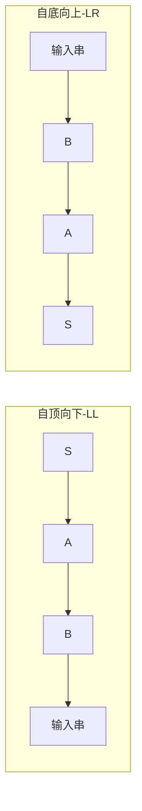
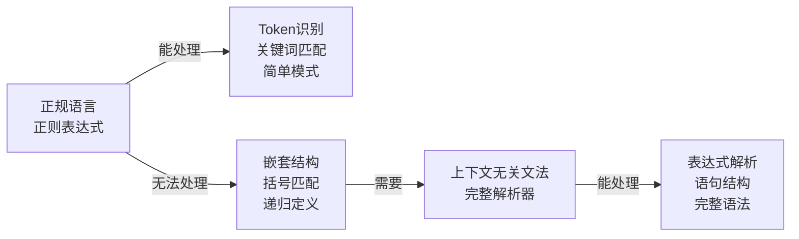
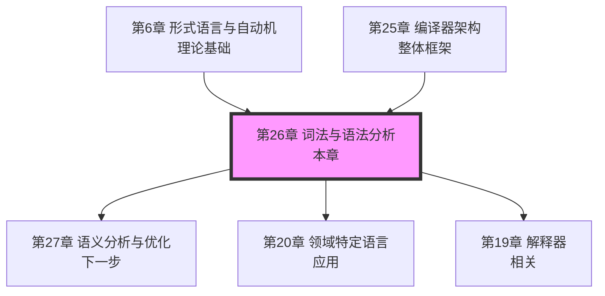

# 第26章 词法与语法分析：本章小结

词法分析与语法分析是编译器前端最核心的两个阶段，也是形式语言理论在工程实践中最成功的应用之一。本章从 Chomsky 文法层次和 Kleene 正规表达式的理论根基出发，经由 Thompson 构造、子集构造、Hopcroft 最小化等经典算法，最终落地到 Flex/Bison、ANTLR、解析器组合子等工业级工具——完整覆盖了"从源代码字符流到抽象语法树"的全部技术链条。

本章内容横跨理论（形式语言与自动机）、算法（NFA→DFA、LL/LR 分析）、工具（Flex/Bison/ANTLR）和工程实践（错误恢复、增量解析、IDE 支持）四个维度。掌握这些内容，不仅能编写编译器前端，更能深刻理解正则表达式、XML/JSON 解析器、配置文件处理器、代码高亮引擎、LSP 语言服务等日常工具的底层原理。

---

## 一、全章知识体系总览

下图概括了本章全部内容的逻辑结构与层次关系：

```mermaid
graph TD
    subgraph 词法分析
        RE[正规式<br/>Regular Expression] --> NFA[Thompson构造<br/>→ NFA]
        NFA --> SUBSET[子集构造法<br/>→ DFA]
        SUBSET --> MIN[DFA最小化<br/>Hopcroft算法]
        MIN --> LEX[Flex词法分析器<br/>生成器]
    end

    subgraph 语法分析
        CFG[上下文无关文法] --> LL[LL分析<br/>自顶向下]
        CFG --> LR[LR分析<br/>自底向上]
        LL --> RD[递归下降]
        LL --> PRED[预测分析表]
        LR --> LR0[LR(0)/SLR]
        LR --> LALR[LALR(1)]
        LR --> LR1[LR(1)]
        LALR --> BISON[Bison语法分析器<br/>生成器]
        RD --> PC[解析器组合子]
    end

    subgraph 工程实践
        LEX --> PARSE[Token流]
        BISON --> PARSE
        PC --> PARSE
        PARSE --> AST[抽象语法树<br/>AST]
        AST --> ERR[错误恢复<br/>策略]
        AST --> INC[增量解析<br/>IDE支持]
    end

    AST --> SEM[→ 第27章<br/>语义分析]
```

全章围绕两条主线展开：

- **词法分析主线**：正规式 → NFA → DFA → 最小化 DFA → Flex 生成器，这是一条从抽象描述到高效实现的完整链条。核心价值：将一行正则表达式转化为 O(n) 时间复杂度的扫描器。
- **语法分析主线**：上下文无关文法 → LL/LR 两大流派 → 递归下降 / LALR(1) → Bison 生成器 → 解析器组合子，展示了从理论框架到实用工具的演进路径。

两条主线在"Token 流"处交汇，最终产出 AST，为后续语义分析（第 27 章）提供输入。

---

## 二、核心要点回顾

### 2.1 词法分析的理论链条

词法分析的理论基础是正规语言理论，其核心链条可概括为五步：

| 步骤 | 输入 | 输出 | 核心算法 | 关键概念 |
|------|------|------|----------|----------|
| 1. 正规式描述 | 词法规则（如标识符、数字的模式） | 正规式 | 人工编写 | 并、连接、闭包 |
| 2. NFA 构造 | 正规式 | NFA（非确定有限自动机） | Thompson 构造法 | ε-转移、多路径 |
| 3. DFA 转换 | NFA | DFA（确定有限自动机） | 子集构造法（ε-闭包） | 状态子集、确定性 |
| 4. DFA 最小化 | DFA | 最小 DFA | Hopcroft 算法 | 等价类划分、可区分性 |
| 5. 表驱动实现 | 最小 DFA | 词法分析器代码 | 状态转移表 | 跳转表、冲突处理 |

**为什么这条链条重要？** 正规式是最简洁的描述方式——一行正则表达式就能描述标识符模式 `[a-zA-Z_][a-zA-Z0-9_]*`——但直接解释正规式效率低下。通过这条链条，我们得到等价的状态转移表，使词法分析的时间复杂度降为 O(n)：只需一次扫描，每个字符处理一次。Flex 等工具自动完成这个转换，但理解每一步对调试复杂词法规则、优化分析器性能、以及手写词法分析器的场景至关重要。

**实际工程中的变体**：Flex 生成的词法分析器使用"最长匹配"策略——当多个规则都能匹配时选最长的；当长度相同时选先出现的规则。这种策略处理了 C 语言中 `>>`（右移还是两个大于号）这类歧义。手写词法分析器通常需要显式处理这类歧义。

### 2.2 语法分析的两大流派

语法分析基于上下文无关文法（CFG），形式化定义为四元组 G = (V, Σ, P, S)：

- **V（非终结符集）**：代表语法结构，如 `<expr>`、`<stmt>`
- **Σ（终结符集）**：代表词法 Token，如 `if`、`+`、`id`
- **P（产生式规则集）**：定义结构如何由子结构组成，如 `<expr> → <expr> + <term>`
- **S（起始符号）**：分析的入口点，通常是程序的顶层结构

语法分析的目标是判断输入串是否能从 S 推导出来，并在推导过程中构建 AST。

两大流派的本质区别在于推导方向：

| 维度 | 自顶向下（LL） | 自底向上（LR） |
|------|---------------|---------------|
| 推导方向 | 从起始符号 S 出发，展开非终结符 | 从输入串出发，归约为非终结符 |
| 直觉比喻 | "预测"——根据当前输入预测使用哪个产生式 | "匹配"——将输入串中的模式逐步替换为更高层结构 |
| 栈操作 | 仅用栈存待展开的非终结符 | 栈存已扫描的符号和状态 |
| 文法要求 | 不能有左递归 | 可处理左递归 |
| 典型代表 | 递归下降、ANTLR | Bison (LALR(1)) |
| 错误恢复 | 直观，函数返回即可 | 复杂，需修改状态机 |



### 2.3 LL 分析的核心技术

LL 分析需要解决两个核心问题：

**问题一：选择哪个产生式？** 这需要预计算每个非终结符的 FIRST 集和 FOLLOW 集：

- **FIRST(α)**：推导 α 得到的终结符串的首字符集合。例如，若 α 可直接推出 `+` 开头的串，则 `+` ∈ FIRST(α)。
- **FOLLOW(A)**：非终结符 A 后面可能跟的终结符集合。当 A 是产生式右部最后一个符号时，FOLLOW(A) 包含产生式左部的 FOLLOW 集。

对于产生式 A → α，选择条件是：当输入符号在 FIRST(α) 中时选该产生式；当 α 可推出 ε 时，输入符号在 FOLLOW(A) 中也选该产生式。

**问题二：文法不满足 LL(1) 怎么办？** 两大变换技术：

- **消除左递归**：将直接左递归 `A → Aα | β` 转换为 `A → βA'`、`A' → αA' | ε`。左递归会导致递归下降中的无限递归，必须在分析前消除。
- **提取左因子**：将 `A → αβ | αγ` 转换为 `A → αA'`、`A' → β | γ`。解决因公共前缀导致的选择冲突——当 FIRST(β) ∩ FIRST(γ) ≠ ∅ 时，LL(1) 分析器无法决定选哪个产生式。

**递归下降分析器**是 LL 分析的程序化实现，每个非终结符对应一个函数，函数体按产生式右部结构直接编码。它直观、易于调试、便于实现错误恢复，是手写解析器的首选方案。C 语言家族（C、C++、Go、Rust）的解析器大多采用递归下降方案。

**LL(1) 预测分析表**是表格驱动的实现，将选择逻辑编码为二维数组 M[A, a]——行是非终结符，列是终结符，单元格存储应使用的产生式。它适合自动生成（如 ANTLR），但手工构建和维护较为繁琐。

### 2.4 LR 分析的核心技术

LR 分析器是一个有限状态自动机，结合一个分析栈和一个分析表（ACTION 表和 GOTO 表），对输入进行移进-归约操作：

- **移进（Shift）**：将下一个输入符号及对应状态压入分析栈
- **归约（Reduce）**：将栈顶的符号串按照某个产生式归约为对应的非终结符，并根据 GOTO 表压入新状态
- **接受（Accept）**：分析成功，输入串属于文法定义的语言
- **报错（Error）**：分析失败，触发错误恢复机制

LR 分析器的变体按照分析能力递增：

| 变体 | 分析能力 | 状态数量 | 实际使用 | 核心区别 |
|------|---------|---------|---------|---------|
| LR(0) | 最弱，不能处理冲突 | 最少 | 理论基础 | 无前瞻符号 |
| SLR | 利用 FOLLOW 集消解冲突 | 较少 | 教学用途 | 归约前检查 FOLLOW 集 |
| LR(1) | 最强，精确的前瞻符号 | 可能很多 | 理论上限 | 每个项携带精确前瞻符号 |
| **LALR(1)** | 接近 LR(1) 的能力 | 与 SLR 相当 | **Bison 默认选择** | 合并相同核心的 LR(1) 项 |

**LALR(1) 为何是最佳平衡？** LR(1) 项中包含精确的前瞻符号集，但会导致状态数量爆炸（某些文法可达数千状态）。LALR(1) 将具有相同核心项的 LR(1) 项合并，大幅减少状态数量（通常与 SLR 相当），同时保留了 LR(1) 的大部分分析能力。实际工程中，绝大多数可用 LR 分析的文法都能用 LALR(1) 处理。

**归约时如何选择产生式？** 对于 LR(0)/SLR，当栈顶项集包含完整项 [A → α·] 时直接归约（SLR 还需检查输入符号在 FOLLOW(A) 中）。对于 LR(1)/LALR(1)，还需检查前瞻符号是否匹配。

### 2.5 语法分析器生成器

**Flex/Bison** 是经典的词法/语法分析器生成器组合：

- **Flex**：读取正规式规则文件，生成 C 语言的词法分析器函数 `yylex()`。支持最长匹配策略、多输入缓冲区、条件状态（用 `BEGIN` 宏切换不同的词法规则集）
- **Bison**：读取 CFG 规则文件，生成 LALR(1) 语法分析器。支持语义动作（归约时执行的代码段）、类型信息传递（`$1`、`$$` 等占位符）、错误恢复规则

**ANTLR** 是另一种广泛使用的解析器生成器，支持 LL(*) 分析（自适应的前瞻深度），生成 Java/C++/Python/JavaScript 等多种目标语言的解析器。其语义谓词机制可以在预测分析时执行任意代码，突破了纯 LL(1) 的限制。

**解析器组合子**是函数式编程范式下的解析器构造方法，将每个文法规则编码为一个组合子函数（如 `many`、`alt`、`seq`），通过函数组合构建完整的解析器。Haskell 的 Parsec/Megaparsec、Scala 的 Parser Combinators、以及 Rust 的 Nom 都是典型的解析器组合子库。其优势在于类型安全、可组合、易于增量解析；劣势在于错误信息质量通常不如专用工具。

### 2.6 错误恢复

编译器的实用性很大程度上取决于错误恢复能力。本章介绍了三种主要策略：

**紧急模式恢复（Panic Mode）**：检测到错误后，跳过输入符号直到遇到同步符号集（如分号、右花括号），然后从跳过的位置继续分析。这是最简单但最粗暴的恢复方式，可能导致跳过大量有效代码。

**短语级恢复（Phrase-Level Recovery）**：在检测到错误时，根据错误上下文推断可能的修正（如插入缺失的分号、删除多余的括号），执行修正后继续分析。这是最实用的恢复方式，但实现复杂度最高。

**错误产生式（Error Production）**：在文法中显式添加错误产生式（如 `stmt → error ;`），让语法分析器能够识别错误并执行恢复动作。这是 Bison 提供的标准机制。

好的错误恢复需要同时满足四个目标：

1. **准确定位**：标记错误发生的确切位置（行号、列号），而非仅标记检测到错误的位置
2. **清晰报告**：提供有意义的错误信息（不只是 "syntax error"），最好能给出修正建议
3. **继续解析**：在错误后继续分析，发现尽可能多的后续错误，减少用户往返次数
4. **不引发雪崩**：避免一个错误触发大量虚假错误（error cascade），虚假错误比无错误恢复更糟糕

### 2.7 AST 设计与构建

抽象语法树（AST）是语法分析的最终产物，是语义分析的输入。AST 设计需要在三个维度上做出权衡：

**完整性**：AST 必须保留足够信息供后续阶段使用。例如，C 语言的 AST 需要保留类型转换信息、存储类（auto/static/extern）、以及源位置信息。省略任何必要信息都会导致后续阶段无法正确处理。

**简洁性**：AST 不应保留语法分析阶段的冗余信息。例如，LL(1) 分析中的"空产生式"和 LR 分析中的"移进/归约"操作都不应出现在 AST 中。AST 应该只表达程序的语义结构。

**效率**：AST 的内存布局和分配策略直接影响编译器性能。Arena 分配（内存池分配）是主流方案——分配所有 AST 节点到一个连续内存区域，释放时一次性回收整个区域，避免了逐节点 `free` 的开销和内存碎片问题。

**位置信息追踪**（Source Location Tracking）对错误报告至关重要。每个 AST 节点都应携带其在源代码中的起始和结束位置（行号、列号），使得语义分析阶段的错误信息能够精确指向源代码位置。Clang 的 `SourceLocation` 设计是一个典范——通过将文件 ID 和偏移量编码为 32 位整数，实现了高效的位置信息存储。

### 2.8 增量解析与 IDE 支持

现代 IDE 要求解析器支持增量更新和容错解析，这是与传统编译器解析器的关键区别：

**增量词法分析**：当用户修改了源代码的某一行时，只需要重新分析该行及其后的少数行（因为大多数修改不会影响后续 Token 的类型）。基于行的增量词法分析可以将分析时间从 O(n) 降低到 O(1) 级别。

**容错语法分析**：IDE 的解析器必须在输入不完整或包含错误时仍然能产生合理的 AST。这需要修改标准的 LL/LR 算法，增加"待定"节点和"跳过"策略。Microsoft 的 Roslyn 和 JetBrains 的 PSI（Program Structure Interface）都是容错解析器的工业级实现。

**可复用前端框架**：libTooling（Clang）和 Syntax API（Roslyn）提供了可复用的解析器前端，使得第三方工具（静态分析器、代码重构工具、代码生成器）无需重新实现解析过程就能直接操作源代码的结构化表示。

---

## 三、贯穿全章的核心思想

### 3.1 语言设计与编译器实现的协同

语言设计决策对编译器前端的复杂度有决定性影响：

| 语言 | 语法复杂度 | 前端代码量（约） | 关键设计决策 |
|------|-----------|----------------|-------------|
| Go | 低 | ~3,000 行 | 无宏、无前向声明、关键字驱动 |
| Rust | 中 | ~15,000 行 | 宏系统、生命周期标注、但语法清晰 |
| Java | 中 | ~20,000 行 | 泛型擦除简化了类型系统，但语法仍有冗余 |
| C | 中高 | ~25,000 行 | 宏预处理、声明语法歧义 |
| C++ | 极高 | ~30,000+ 行 | 模板、宏、隐式类型转换、ADL、极复杂的声明语法 |

Go 语言的简洁设计使其编译速度极快（通常在 1 秒内完成整个项目的编译），而 C++ 的复杂性不仅增加了编译器实现的难度，也显著拖慢了编译速度。这些数据来自本章实战案例中对 GCC、Clang 和 Go 编译器前端的对比分析。

**设计启示**：如果你正在设计一门新语言，应该有意识地选择语法复杂度。每增加一个语法特性（如 C++ 的隐式类型转换或 Go 没有的宏），都在前端复杂度和用户便利性之间做了权衡。过度的语法糖不仅增加解析器的负担，更增加了错误信息的理解成本。

### 3.2 理论与工程的桥梁

本章介绍的理论不仅是学术概念，更是实用的工程工具：

| 理论基础 | 工程应用 | 典型工具/场景 |
|----------|---------|-------------|
| 正规式理论 | 词法规则描述 | Flex、RE2、PCRE、grep |
| 自动机理论 | O(n) 词法分析、状态机编程 | DFA 驱动的扫描器、协议解析 |
| 上下文无关文法 | 解析器生成、代码补全 | Bison、ANTLR、Tree-sitter |
| 属性文法思想 | AST 上的计算 | 类型检查、常量折叠、作用域分析 |

掌握这些理论的更深层意义在于：当遇到"正则表达式无法匹配嵌套结构"这类问题时，你知道为什么——因为嵌套结构超出了正规语言的表达能力，需要上下文无关文法。当需要设计一个 DSL 时，你能快速判断应该用正则表达式还是需要完整的解析器。



### 3.3 工具与手写的权衡

实际工程中，解析器的构建方式并非非此即彼：

| 场景 | 推荐方案 | 理由 |
|------|---------|------|
| 新语言原型 | Flex/Bison 或 ANTLR | 快速验证文法，自动生成解析器 |
| 生产级编译器 | 手写递归下降 + Flex | 可控性强，错误信息质量高，性能可优化 |
| 简单 DSL | 解析器组合子 | 类型安全，可嵌入宿主语言，易于维护 |
| IDE 语言服务 | 容错解析器 + 增量更新 | 需要处理不完整输入，标准工具难以满足 |
| 数据格式解析 | Flex/Bison 或解析器组合子 | 格式固定，无需复杂错误恢复 |
| 安全关键领域 | 手写解析器 | 需要完全控制每个细节，不可依赖自动生成 |

实际工程中的常见模式是**混合方案**：用 Flex 处理词法分析（因为正则表达式足够描述词法规则），手写递归下降处理语法分析（因为需要更好的错误恢复和更精确的错误信息）。Clang 和 GCC 的前端都采用了这种混合方案。

**决策流程**：面对一个新的解析需求，可以按以下路径决策——(1) 先判断是否需要语法分析，如果只有简单的模式匹配，正则表达式足够；(2) 如果需要语法分析，判断是否有现成的解析器生成器（ANTLR、tree-sitter）支持目标语言；(3) 如果需要高度定制的错误恢复或增量解析，考虑手写递归下降；(4) 如果是函数式语言生态中的嵌入式 DSL，优先考虑解析器组合子。

---

## 四、与其他章节的知识关联



- **第 6 章（形式语言与自动机）**提供了本章的理论根基——Chomsky 层次、正规语言、上下文无关语言的定义和性质。如果你对 Chomsky 层次中 Type-3 到 Type-2 的跃迁感到模糊，建议回顾第 6 章的相关内容。
- **第 25 章（编译器架构）**提供了宏观框架——本章是编译器前端两个阶段的详细实现。理解第 25 章中"词法分析器生成 Token 流 → 语法分析器消费 Token 流"的接口约定，有助于理解本章各组件的协作关系。
- **第 27 章（语义分析与优化）**是本章的直接后续——AST 作为语义分析的输入，类型检查、控制流分析都建立在正确的语法分析之上。本章产出的 AST 质量直接决定第 27 章的工作难度。
- **第 20 章（领域特定语言）**是本章理论的直接应用场景——每个 DSL 的解析器都基于本章介绍的技术。第 20 章中构建 SQL 解析器、Markdown 解析器的实战案例，正是本章理论的具体应用。
- **第 19 章（解释器）**与本章有交叉——解释器同样需要词法和语法分析阶段，但其后续阶段（求值/执行）与编译器不同。

---

## 五、从本章学到的关键技能

完成本章学习后，你应该具备以下实际能力：

1. **能够设计正则表达式描述词法规则**：理解正规式的语义，能够为新的标识符、关键字、字面量编写正确的正则表达式，并理解其局限性（无法处理嵌套结构）。验证标准：能为一门简单语言（如 JSON 或 Lua 子集）编写完整的词法规则文件。

2. **能够构造 LL(1) 预测分析表**：给定一个文法，能够计算 FIRST 集和 FOLLOW 集，构造预测分析表，判断文法是否为 LL(1) 文法，以及如何通过消除左递归和提取左因子来修复非 LL(1) 文法。验证标准：能对简单算术表达式文法完成完整的 LL(1) 分析表构造。

3. **能够理解 LR 分析器的工作过程**：理解移进-归约操作，理解 LR(0)/SLR/LR(1)/LALR(1) 的区别，能够阅读和调试 Bison 生成的分析器。验证标准：能跟踪一个简单表达式在 LALR(1) 分析器中的移进-归约过程。

4. **能够使用 Flex/Bison 构建解析器**：从规范到可运行的词法和语法分析器，包括语义动作、类型传递、错误恢复。验证标准：能用 Flex/Bison 实现一个简单的计算器或配置文件解析器。

5. **能够设计合理的 AST 结构**：在完整性、简洁性和效率之间做出正确的权衡，使用 Arena 分配管理内存，追踪源位置信息。验证标准：能为一门简单语言设计 AST 节点结构，包括位置信息和 Arena 分配器。

6. **能够实现基本的错误恢复**：紧急模式恢复、短语级恢复、错误产生式的使用，以及提供有意义的错误信息。验证标准：能在 Bison 解析器中实现基本的错误恢复，使得一个语法错误不会导致整个解析器崩溃。

7. **能够评估解析技术的适用场景**：根据项目需求（语言复杂度、性能要求、错误恢复要求、IDE 支持需求）选择合适的解析方案。验证标准：面对一个新的解析需求，能给出合理的技术选型建议并说明理由。

---

## 六、常见陷阱与避坑指南

本章常见误区的快速回顾：

| 陷阱 | 根因 | 正确做法 |
|------|------|---------|
| 用正则表达式匹配 HTML/XML 等嵌套结构 | 正规语言无法描述递归嵌套 | 使用解析器（如 DOM 解析器）处理嵌套 |
| 认为 LL(1) 和 LR(1) 表达能力相同 | LL(1) 要求无左递归和公共前缀 | LR(1) 严格强于 LL(1)，LL(1) 无法处理左递归文法 |
| 认为工具生成的解析器一定比手写慢 | Flex/Bison 生成的代码经过多年优化 | Flex 生成的词法分析器性能接近手写；Bison 的 LALR(1) 性能也很高 |
| 只处理 ASCII 字符 | 现代语言和数据格式广泛使用 Unicode | 需要处理规范化（NFC/NFD）和字形簇（Grapheme Cluster） |
| 在递归下降中不处理试探性解析 | C/C++ 中类型转换和乘法的语法前缀相同 | 需要回溯（backtracking）或词法上下文提示（typedef 名称表） |
| 将解析器组合子视为玩具 | 信息差——不了解工业级组合子库的发展 | Megaparsec、Nom 等已用于 Haskell 生态的工业级项目 |
| 错误恢复越激进越好 | 过度恢复会掩盖真实错误 | 应根据场景选择适度的恢复策略，虚假错误比无恢复更糟糕 |
| 忽略歧义文法的检测 | 歧义文法导致分析器行为不确定 | 在设计阶段就检测并消除歧义，或选择支持歧义的解析器（GLR/GLL） |

---

## 七、进阶阅读方向

如果你想深入探索本章的更多细节，以下方向值得进一步学习：

**理论深化**：

- 编译原理经典教材：Aho 等人《Compilers: Principles, Techniques, and Tools》（龙书）第 3-4 章——最权威的词法/语法分析理论参考
- 《Modern Compiler Implementation in ML/Java/C》（虎书）第 2-3 章——以 ML 实现为特色的编译器教材，理论与实践结合更紧密
- Parsing Techniques: A Practical Guide（Dick Grune）——详尽的解析技术综述，覆盖了几乎所有已知的解析算法

**工具生态**：

- Flex/Bison：GNU 官方文档，经典且成熟，适合系统级解析器开发
- ANTLR 4：《The Definitive ANTLR 4 Reference》（Terence Parr）——ANTLR 的官方参考，包含大量实用案例
- 解析器组合子：Haskell 的 Megaparsec 文档、Rust 的 Nom 文档——函数式解析范式的最佳实践
- Tree-sitter：GitHub 上的增量解析框架，被 Atom/VS Code/Neovim 等编辑器广泛采用

**前沿进展**：

- GLR 解析（Tomita 算法）：处理歧义文法的通用方法，通过维护多个并行的分析状态来处理歧义
- GLL 解析：与 GLR 对应的自顶向下通用分析方法，适合手写实现
- Earley 解析：适用于任意 CFG 的通用算法，时间复杂度最坏为 O(n³)，但对非歧义文法为 O(n²)
- 增量解析的最新研究：基于编辑距离的增量更新策略，Tree-sitter 的"解析器 DSL + 增量执行"模式代表了当前最佳实践
- LSP（Language Server Protocol）中的解析技术：现代 IDE 的语言服务架构，将解析器作为语言服务器的核心组件

**在线资源**：

- GitHub: nickvdp/regex-cheatsheet —— 正则表达式速查手册
- Wikipedia: Chomsky hierarchy —— Chomsky 层次的百科全览
- cs.stackexchange.com 上的 "parsing" 标签 —— 社区讨论的解析技术问题

---

## 八、核心概念速查

以下是本章涉及的核心概念及其一句话定义，方便快速回顾：

| 概念 | 一句话定义 |
|------|-----------|
| 词法分析 | 将源代码字符流转换为 Token 流的过程 |
| 语法分析 | 将 Token 流组织为 AST 的过程 |
| 正规式（RE） | 描述正规语言的简洁符号表示，支持并、连接、闭包三种操作 |
| NFA | 非确定有限自动机，允许 ε-转移和多路径 |
| DFA | 确定有限自动机，每个状态对每个输入符号最多一条转移 |
| Thompson 构造 | 从正规式到 NFA 的标准构造算法 |
| 子集构造 | 从 NFA 到 DFA 的等价转换算法 |
| Hopcroft 最小化 | 从 DFA 到等价最小 DFA 的算法 |
| CFG | 上下文无关文法，由非终结符、终结符、产生式、起始符号组成 |
| LL(1) | 从左到右扫描、最左推导、1 个前瞻符号的自顶向下分析 |
| LALR(1) | 合并相同核心 LR(1) 项的自底向上分析，Bison 默认方案 |
| FIRST/FOLLOW 集 | LL 分析中用于预测产生式选择的集合 |
| AST | 抽象语法树，程序语义结构的树形表示 |
| Arena 分配 | 内存池分配策略，批量分配和释放 AST 节点 |
| 错误恢复 | 解析器在遇到语法错误后继续分析的策略 |
| 解析器组合子 | 函数式范式下的解析器构造方法，通过函数组合构建 |

---

## 九、总结

词法与语法分析是编译器前端的基石，也是计算机科学理论在实践中最成功的应用之一。从 Kleene 的正规表达式到 Chomsky 的文法层次，从 Thompson 的自动机构造到 Knuth 的 LR 分析，这些理论在 20 世纪中叶由数学家和逻辑学家奠基，在此后的七十年中被无数工程师转化为实用的工具和系统。

掌握这些技术的意义远超编译器本身。正则表达式是每个程序员的必备工具，AST 是代码分析和转换的通用数据结构，解析器是构建 DSL 和配置文件处理器的核心组件。理解这些技术背后的理论，不仅能让你更好地使用工具，更能在遇到工具无法解决的问题时，知道为什么无法解决、以及如何突破限制。

词法与语法分析为理解后续的语义分析、代码优化和代码生成奠定了坚实的基础。掌握了前端技术，你就掌握了理解整个编译过程的钥匙。接下来，让我们在第 27 章中探索语义分析的世界——在那里，AST 将被赋予类型信息和语义约束，程序的含义将第一次被完整理解。
